# Task 8e116af7-7db7-4e35-a68b-b0939c066c78

**Instruction:** Please update my bookkeeping sheet with the recent transactions from the provided folder, detailing my expenses over the past few days.

**Score:** 1.0

**Wall clock:** 17m 58s

**Steps:** 87

**Cost:** $3.47

---

## Step 1

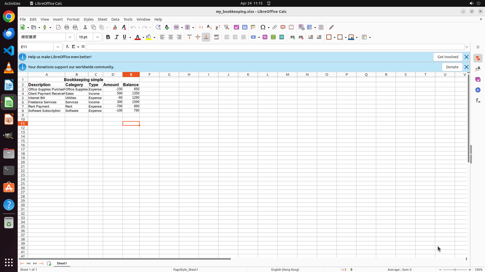

**Response:**
```
I need to find the folder with recent transactions. Let me first check the home directory and desktop for any relevant folders or files.
```

**Actions:** `pyautogui.keyDown('ctrl')
pyautogui.keyDown('alt')
pyautogui.keyDown('t')
pyautogui.keyUp('t')
pyautogui.keyUp('alt')
pyautogui.keyUp('ctrl')`

---

## Step 2


**Actions:** `import subprocess, shlex; subprocess.run(f'xdotool type --delay 12 -- ' + shlex.quote('ls ~/Desktop/ ~/Documents/ ~/Downloads/ ~/ 2>/dev/'), shell=True, check=True)
import time; time.sleep(0.05)
impor`

---

## Step 3

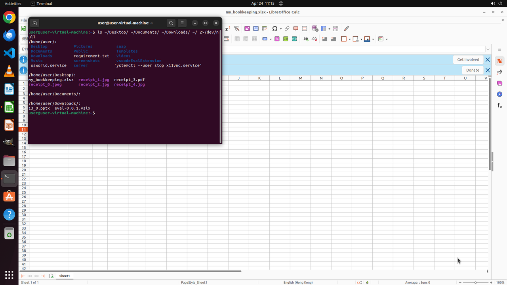

**Response:**
```
I can see receipt files on the Desktop. There are receipt images (receipt_0.jpeg, receipt_1.jpg, receipt_2.jpg, receipt_4.jpg) and a PDF (receipt_3.pdf). Let me examine each receipt to understand the transaction details. Let me first look at them.
```

**Actions:** `import subprocess, shlex; subprocess.run(f'xdotool type --delay 12 -- ' + shlex.quote('cd ~/Desktop && ls -la receipt*\n'), shell=True, check=True)
import time; time.sleep(0.05)`

---

## Step 4

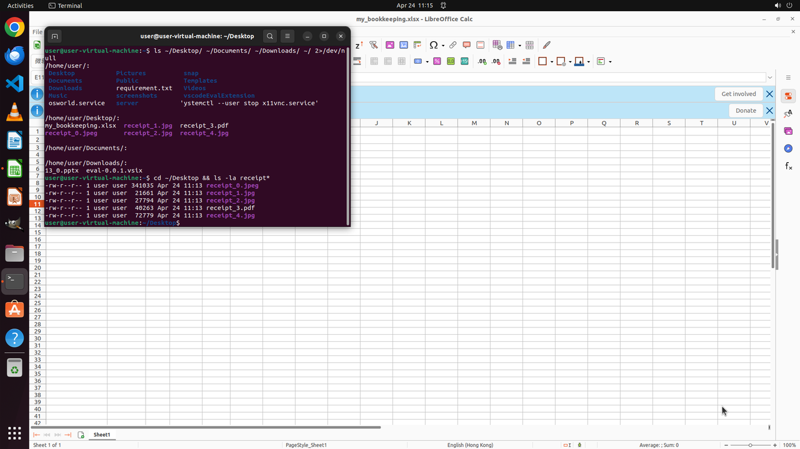

**Response:**
```
I can see 5 receipt files on the Desktop. Let me open each one to read the transaction details. Let me start by viewing them one by one. First, let me open receipt_0.jpeg.
```

**Actions:** `import subprocess, shlex; subprocess.run(f'xdotool type --delay 12 -- ' + shlex.quote('eog receipt_0.jpeg &\n'), shell=True, check=True)
import time; time.sleep(0.05)`

---

## Step 5

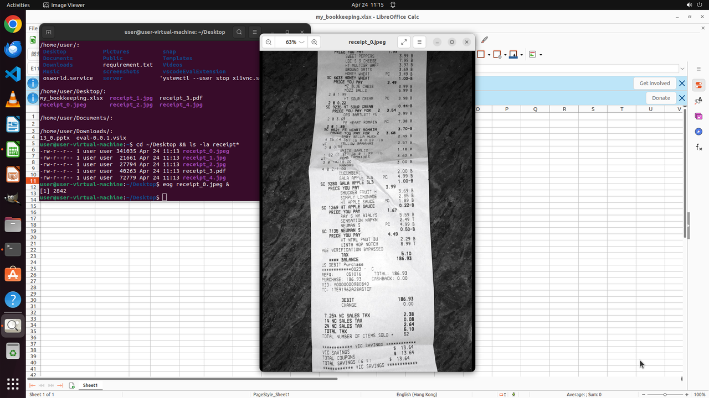

**Response:**
```
I can see receipt_0.jpeg is a grocery store receipt. Let me scroll up to see the top of the receipt to get the store name and date, then I'll note the total.
```

**Actions:** `pyautogui.scroll(5, 990, 600)`

---

## Step 6

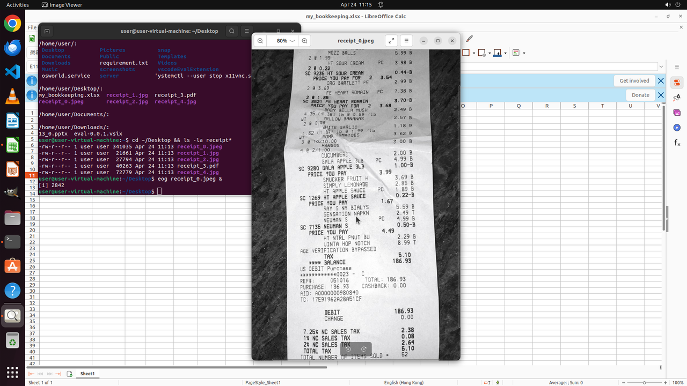

**Response:**
```
I can see this is a grocery store receipt with a total of $186.93. Let me scroll up more to see the store name and date at the top.
```

**Actions:** `pyautogui.scroll(10, 990, 600)`

---

## Step 7

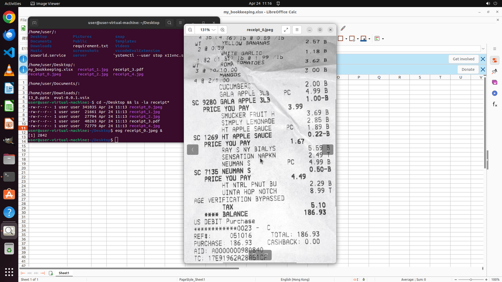

**Response:**
```
I can see the receipt more clearly now. The total is $186.93 and it's a grocery store receipt. Let me scroll up more to see the store name and date at the top of the receipt.
```

**Actions:** `pyautogui.scroll(15, 990, 600)`

---

## Step 8

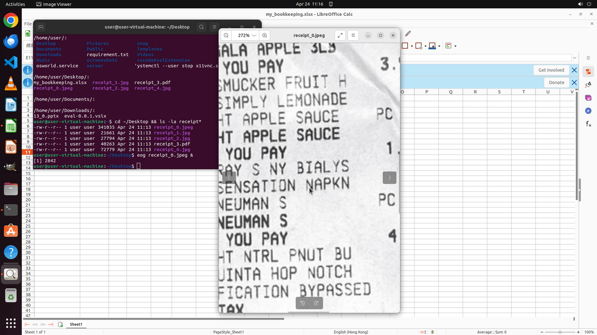

**Response:**
```
The image is too zoomed in. Let me zoom out to see the full receipt including the store name and date at the top.
```

**Actions:** `pyautogui.click(726, 112)`

---

## Step 9

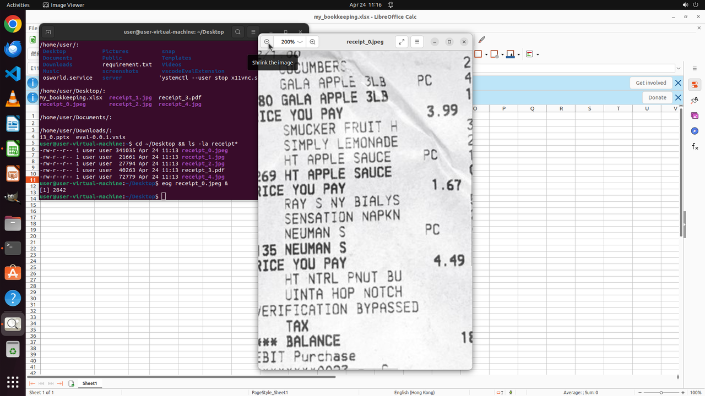

**Response:**
```
Let me zoom out more to see the full receipt. Let me click the shrink button multiple times.
```

**Actions:** `pyautogui.click(726, 112)`

---

## Step 10

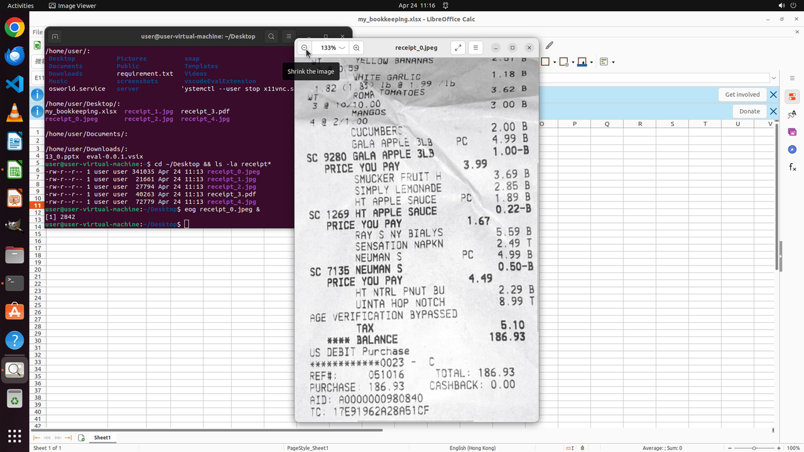

**Response:**
```
I can see more of the receipt now. I need to scroll up to see the store name and date. Let me zoom out more first and then scroll to the top.
```

**Actions:** `pyautogui.click(726, 112)`

---

## Step 11

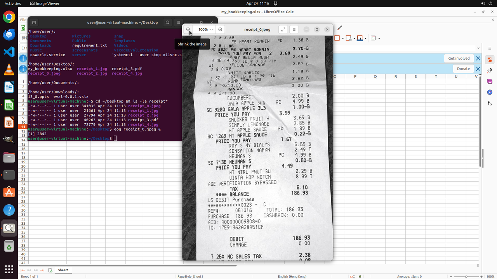

**Response:**
```
I can see more of the receipt now. I need to scroll up to see the store name and date at the very top. Let me scroll up.
```

**Actions:** `pyautogui.scroll(10, 990, 600)`

---

## Step 12

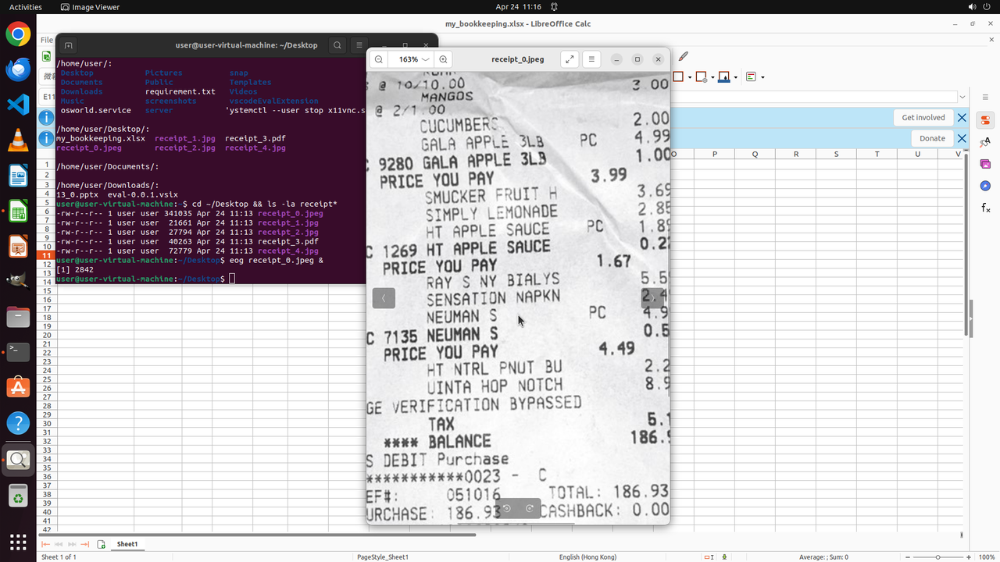

**Response:**
```
I need to use the "fit to window" option to see the entire receipt. Let me try that.
```

**Actions:** `pyautogui.click(1090, 112)`

---

## Step 13

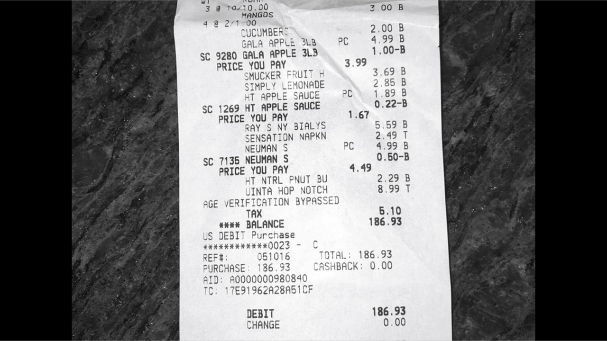

**Response:**
```
Now I can see the receipt in full screen mode, but I still need to see the top part with the store name and date. Let me press Escape to go back to the windowed view and try to scroll to the top of the receipt.
```

**Actions:** `pyautogui.keyDown('esc')
pyautogui.keyUp('esc')`

---

## Step 14

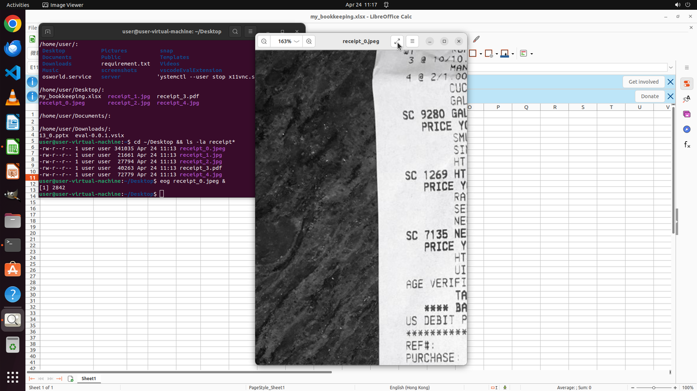

**Response:**
```
I can see the receipt but I need to see the top portion with the store name and date. Let me try a different approach - I'll use the terminal to extract text from the receipts using OCR, or I'll try to zoom out to see the whole receipt. Let me zoom out to fit the window.
```

**Actions:** `pyautogui.click(726, 112)`

---

## Step 15

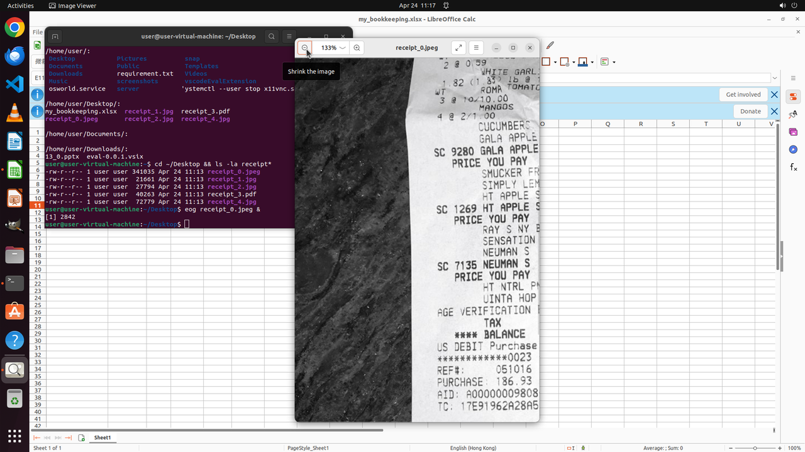

**Response:**
```
I can see most of the receipt now but the top is still cut off. Let me keep zooming out to see the full receipt including the store name and date.
```

**Actions:** `pyautogui.click(726, 112)`

---

## Step 16

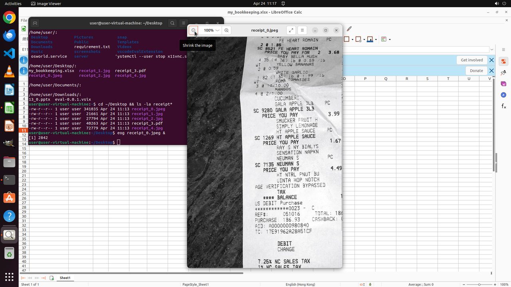

**Response:**
```
I can see more of the receipt now. I still need to see the very top for the store name and date. Let me scroll up within the image viewer.
```

**Actions:** `pyautogui.scroll(5, 990, 600)`

---

## Step 17

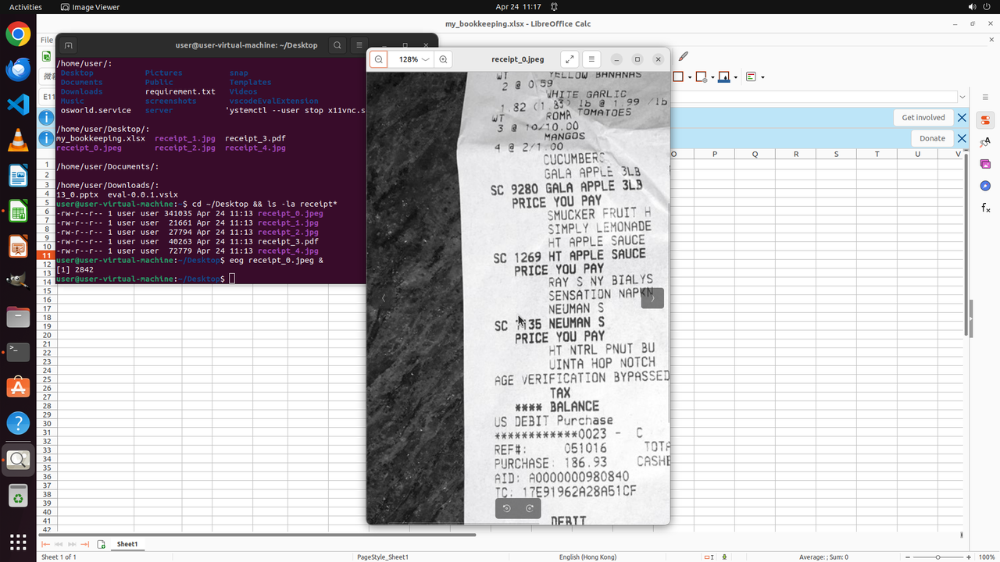

**Response:**
```
I can see the receipt is a grocery store receipt. The top is still partially cut off. Let me try a different approach - I'll use OCR (tesseract) to extract text from all receipts. Let me close this image viewer and use the terminal.
```

**Actions:** `pyautogui.click(1257, 112)`

---

## Step 18

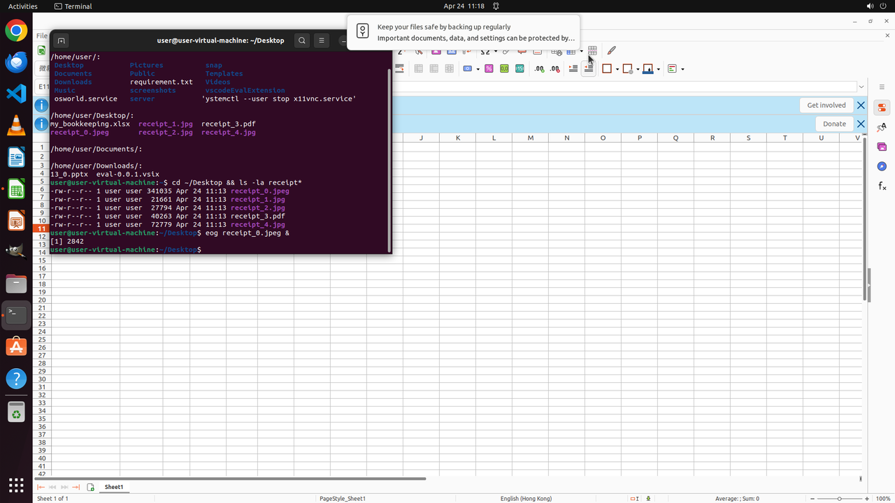

**Response:**
```
Good, the image viewer is closed. Let me install tesseract OCR to extract text from the receipts.
```

**Actions:** `pyautogui.click(450, 535)`

---

## Step 19

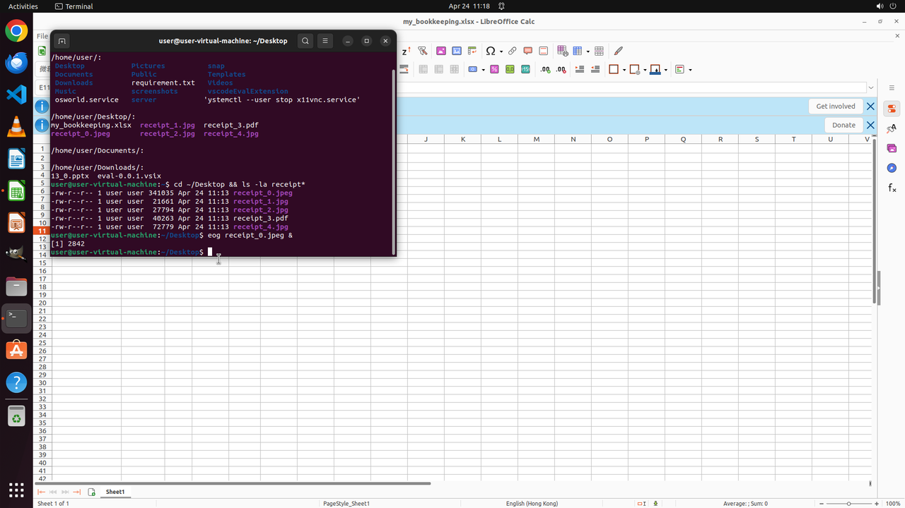

**Response:**
```
Let me install tesseract OCR to extract text from the receipt images.
```

**Actions:** `import subprocess, shlex; subprocess.run(f'xdotool type --delay 12 -- ' + shlex.quote('sudo apt-get install -y tesseract-ocr 2>/dev/null '), shell=True, check=True)
import time; time.sleep(0.05)
impor`

---

## Step 20

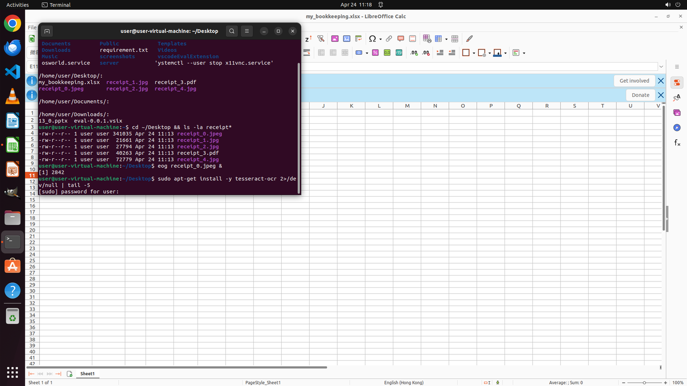

**Response:**
```
It's asking for the password. Let me enter it.
```

**Actions:** `import subprocess, shlex; subprocess.run(f'xdotool type --delay 12 -- ' + shlex.quote('osworld-public-evaluation\n'), shell=True, check=True)
import time; time.sleep(0.05)`

---

## Step 21

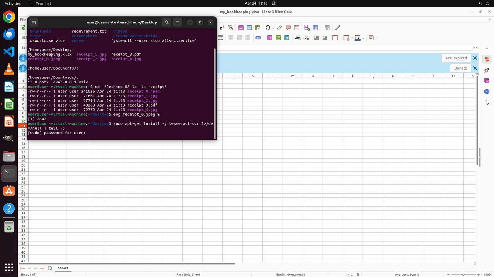

**Response:**
```
It's installing tesseract. Let me wait for it to finish.
```

**Actions:** `time.sleep(0.5)`

---

## Step 22

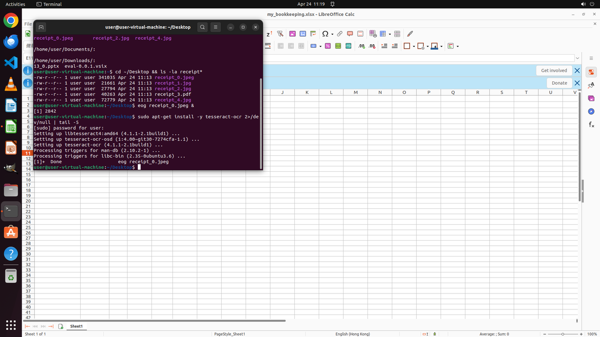

**Response:**
```
Tesseract is installed. Now let me use it to extract text from each receipt. Let me start with receipt_0.jpeg.
```

**Actions:** `import subprocess, shlex; subprocess.run(f'xdotool type --delay 12 -- ' + shlex.quote('tesseract receipt_0.jpeg stdout 2>/dev/null\n'), shell=True, check=True)
import time; time.sleep(0.05)`

---

## Step 23


**Response:**
```
I can see the bottom of the OCR output. Let me scroll up to see the full text extracted from receipt_0.
```

**Actions:** `pyautogui.scroll(10, 450, 300)`

---

## Step 24

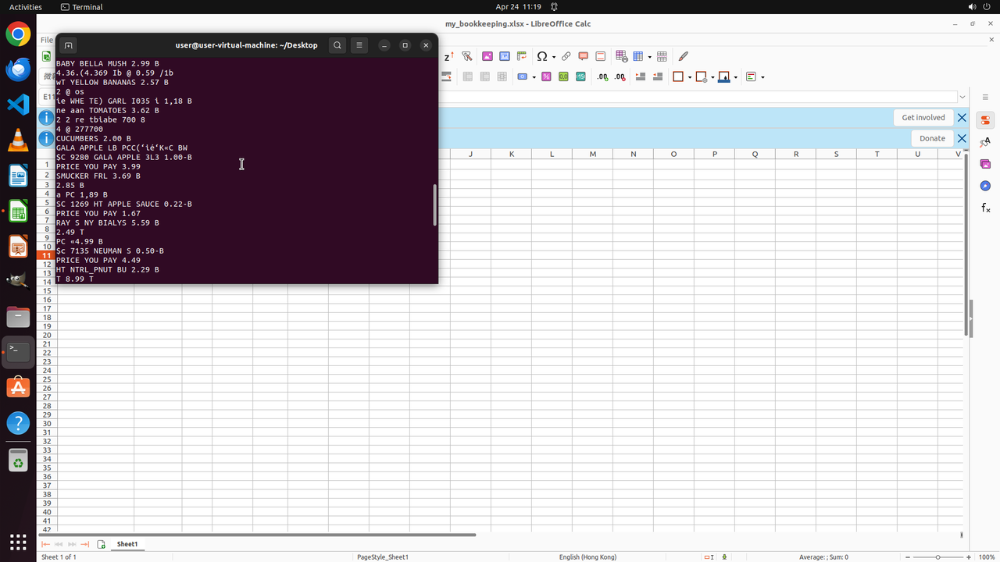

**Response:**
```
I can see the receipt items. Let me scroll up more to see the store name and date at the top.
```

**Actions:** `pyautogui.scroll(10, 450, 300)`

---

## Step 25


**Response:**
```
I can see more items but still need the top. Let me scroll up more.
```

**Actions:** `pyautogui.scroll(15, 450, 300)`

---

## Step 26

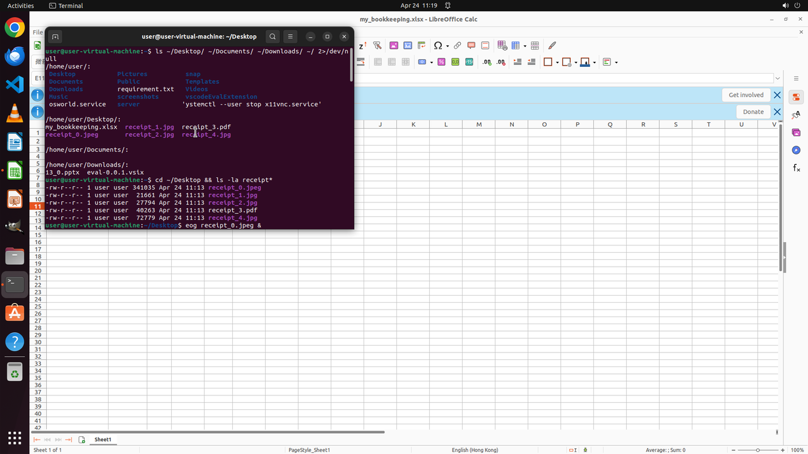

**Response:**
```
I've scrolled too far up. Let me save the OCR output to a file and view it properly. Let me also check if there's a requirement.txt file that might have instructions.
```

**Actions:** `import subprocess, shlex; subprocess.run(f'xdotool type --delay 12 -- ' + shlex.quote('cat ~/Desktop/requirement.txt\n'), shell=True, check=True)
import time; time.sleep(0.05)`

---

## Step 27

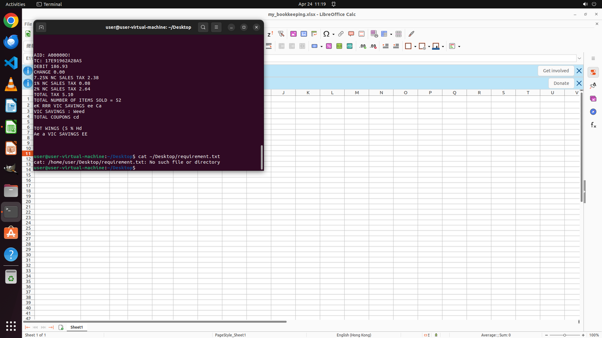

**Response:**
```
The requirement.txt doesn't exist on the Desktop. Let me save OCR output to files and also check what's in the bookkeeping spreadsheet. Let me first save all receipt OCR outputs and then look at the spreadsheet.
```

**Actions:** `import subprocess, shlex; subprocess.run(f'xdotool type --delay 12 -- ' + shlex.quote('tesseract receipt_0.jpeg /tmp/r0 2>/dev/null && te'), shell=True, check=True)
import time; time.sleep(0.05)
impor`

---

## Step 28

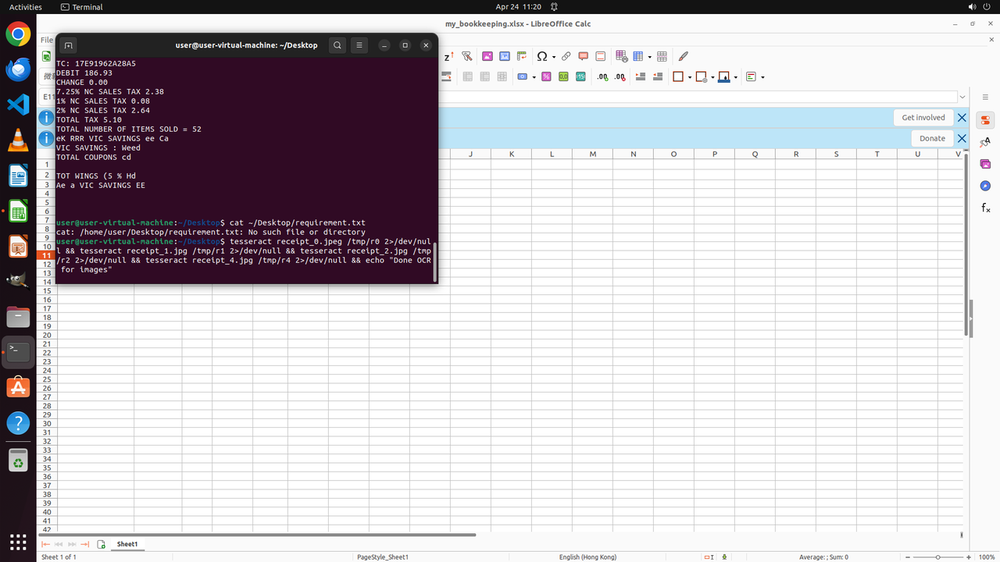

**Response:**
```
It's processing the OCR. Let me wait for it to finish.
```

**Actions:** `time.sleep(0.5)`

---

## Step 29


**Response:**
```
OCR is done for all image receipts. Now let me also handle the PDF receipt and then view all the extracted text. Let me also install poppler-utils for the PDF.
```

**Actions:** `import subprocess, shlex; subprocess.run(f'xdotool type --delay 12 -- ' + shlex.quote('sudo apt-get install -y poppler-utils 2>/dev/null '), shell=True, check=True)
import time; time.sleep(0.05)
impor`

---

## Step 30

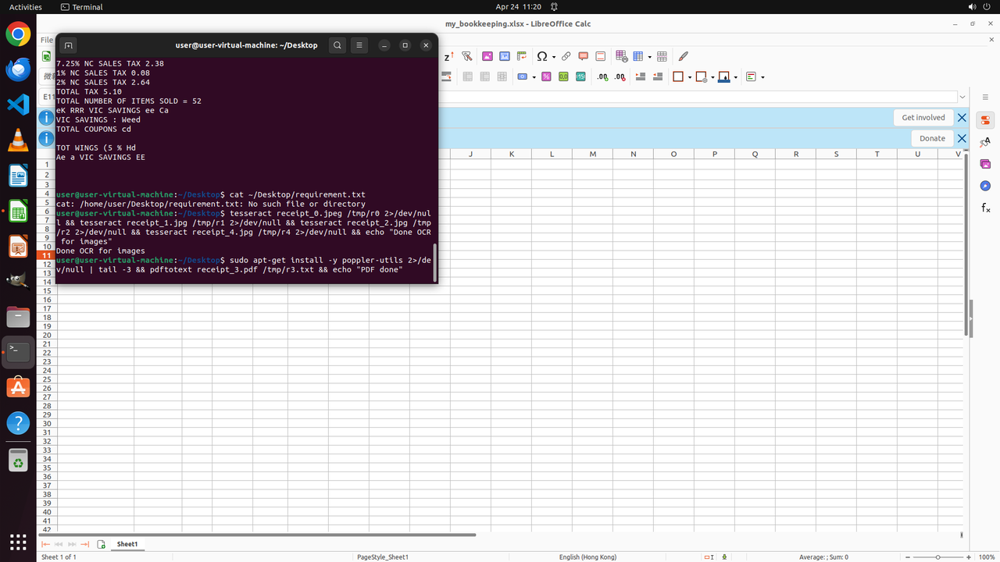

**Response:**
```
Let me wait for the PDF processing to complete.
```

**Actions:** `time.sleep(0.5)`

---

## Step 31

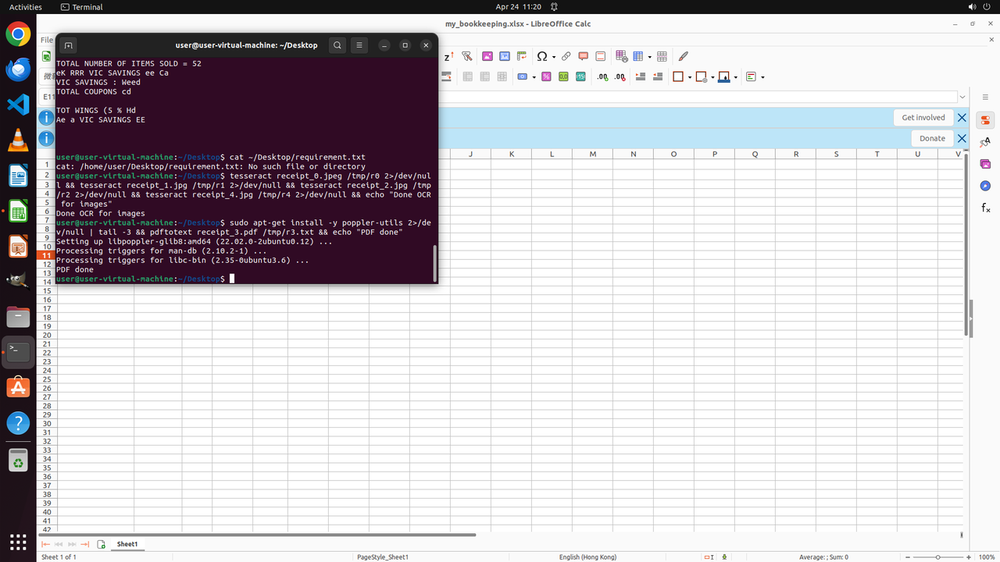

**Response:**
```
All OCR is done. Now let me view each receipt's extracted text. Let me start by viewing them one by one.
```

**Actions:** `import subprocess, shlex; subprocess.run(f'xdotool type --delay 12 -- ' + shlex.quote('echo "=== RECEIPT 0 ===" && cat /tmp/r0.txt && ech'), shell=True, check=True)
import time; time.sleep(0.05)
impor`

---

## Step 32


**Response:**
```
I can see Receipt 1 is a bank transfer/cash out:
- Cash Out to Bank of America
- $3,670.00
- Wednesday at 2:34 PM
- Completed

Let me scroll up to see Receipt 0's full text and then view the remaining receipts.
```

**Actions:** `pyautogui.scroll(15, 450, 300)`

---

## Step 33


**Response:**
```
I can see receipt 0 items. Let me scroll up more to find the store name and date.
```

**Actions:** `pyautogui.scroll(15, 450, 300)`

---

## Step 34

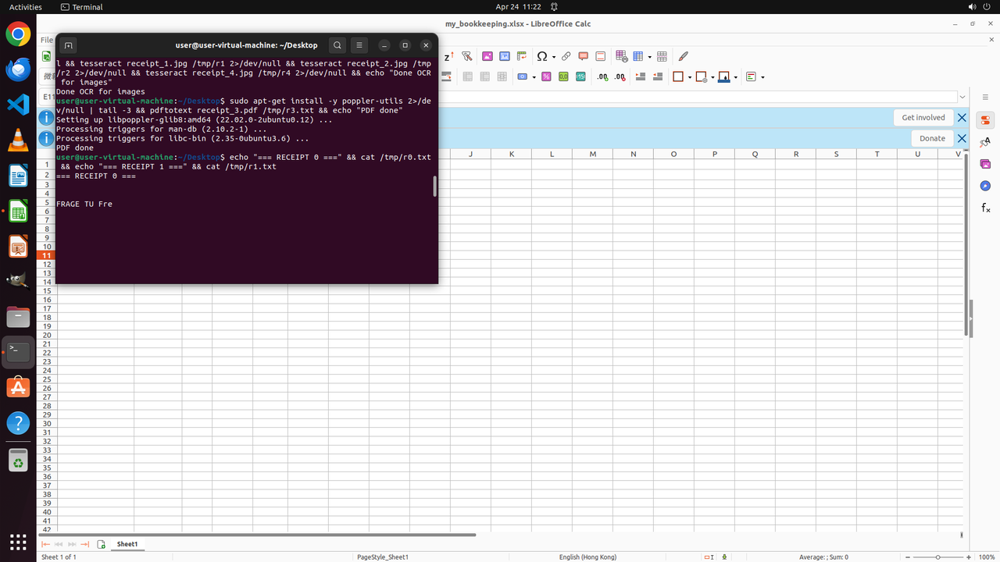

**Response:**
```
I can see the top of Receipt 0 starts with "FRAGE TU Fre" which is likely a partial OCR read. The OCR quality seems limited for the receipt images. Let me take a different approach - let me view the receipts visually by opening each image and taking screenshots. But first, let me check the remaining receipts' OCR output and also look at the bookkeeping spreadsheet to understand what format is needed.
```

**Actions:** `import subprocess, shlex; subprocess.run(f'xdotool type --delay 12 -- ' + shlex.quote('echo "=== RECEIPT 2 ===" && cat /tmp/r2.txt && ech'), shell=True, check=True)
import time; time.sleep(0.05)
impor`

---

## Step 35


**Response:**
```
I can see the end of the output. Let me scroll up to see all three receipts.
```

**Actions:** `pyautogui.scroll(10, 450, 300)`

---

## Step 36

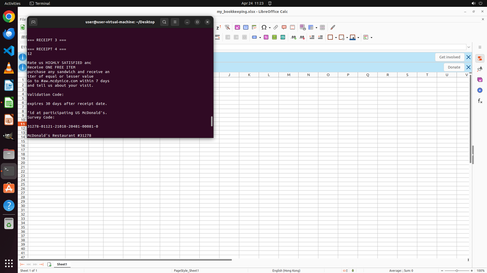

**Response:**
```
I can see Receipt 3 appears to be empty and Receipt 4 is from McDonald's Restaurant #31278. Let me scroll up more to see the full Receipt 4 content and Receipt 2.
```

**Actions:** `pyautogui.scroll(10, 450, 300)`

---

## Step 37


**Response:**
```
I can see Receipt 2 starts with "P-1" and "1 Carrot & Ginger Soup $5.25". Let me scroll down to see the full Receipt 2 content.
```

**Actions:** `pyautogui.scroll(-5, 450, 300)`

---

## Step 38


**Response:**
```
Now I can see the receipts more clearly:

**Receipt 2:** 
- P-1
- 1 Carrot & Ginger Soup $5.25
- SUBTOTAL $5.25
- TAX $0.45
- "Wake up Neo. The Matrix has you."

**Receipt 3:** (appears empty - the PDF)

**Receipt 4:** McDonald's receipt (starts with "12" and then survey info)

I need to see the full receipt details more carefully. Let me now open the images visually to get better details. But first, let me check the bookkeeping spreadsheet to understand the format. Let me also look at Receipt 2 and Receipt 4 more carefully by opening the images.
```

**Actions:** `import subprocess, shlex; subprocess.run(f'xdotool type --delay 12 -- ' + shlex.quote('cat /tmp/r2.txt\n'), shell=True, check=True)
import time; time.sleep(0.05)`

---

## Step 39


**Response:**
```
I can see Receipt 2 is a simple receipt:
- P-1
- 1 Carrot & Ginger Soup $5.25
- SUBTOTAL $5.25
- TAX $0.45

Now I need to visually inspect the receipts to get accurate information. Let me open each receipt image to get the store names, dates, and totals. Let me first look at the images directly. But first, let me check what the bookkeeping spreadsheet looks like.
```

**Actions:** `pyautogui.click(1350, 600)`

---

## Step 40

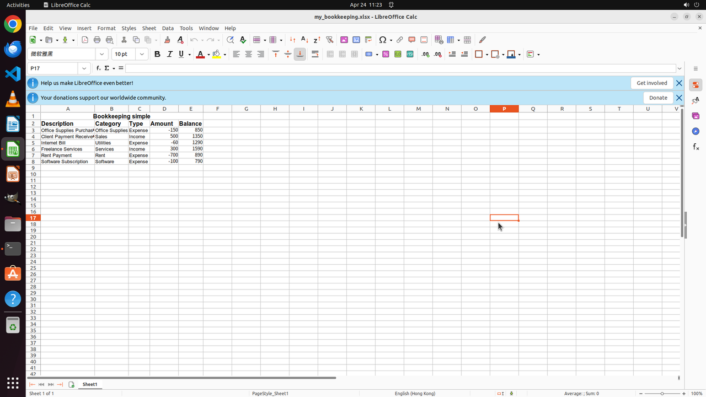

**Response:**
```
Now I can see the bookkeeping spreadsheet. It has the following columns:
- A: Description
- B: Category
- C: Type
- D: Amount
- E: Balance

Current entries:
1. Office Supplies Purchase | Office Supplies | Expense | -150 | 850
2. Client Payment Received | Sales | Income | 500 | 1350
3. Internet Bill | Utilities | Expense | -60 | 1290
4. Freelance Services | Services | Income | 300 | 1590
5. Rent Payment | Rent | Expense | -700 | 890
6. Software Subscription | Software | Expense | -100 | 790

The last balance is 790. Now I need to carefully read each receipt to add the transactions. Let me open each receipt image to get accurate details. Let me first view each receipt image carefully. Let me open receipt_0.jpeg.
```

**Actions:** `pyautogui.click(187, 438)`

---

## Step 41


**Response:**
```
Now I can see the bookkeeping spreadsheet clearly. The columns are:
- A: Description
- B: Category
- C: Type (Income/Expense)
- D: Amount (negative for expenses)
- E: Balance

The last balance is 790 in row 8. Now I need to carefully examine each receipt to get the details. Let me open the receipt images one by one to read them properly. Let me open receipt_0.jpeg first.
```

**Actions:** `pyautogui.click(33, 673)`

---

## Step 42

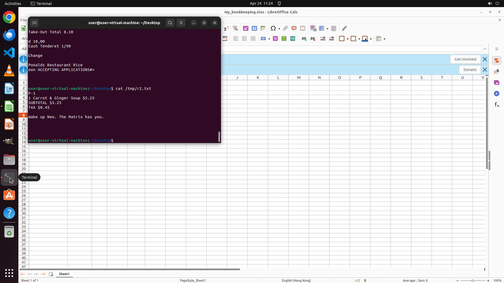

**Response:**
```
Good, I'm in the terminal. Now let me carefully look at each receipt by opening them visually. But first, let me get more details from the OCR. I need to view the complete OCR for each receipt. Let me view the full receipt_0 output which is the grocery store receipt, and also view receipt_4 (McDonald's) more carefully.
```

**Actions:** `import subprocess, shlex; subprocess.run(f'xdotool type --delay 12 -- ' + shlex.quote('cat /tmp/r0.txt | head -20\n'), shell=True, check=True)
import time; time.sleep(0.05)`

---

## Step 43

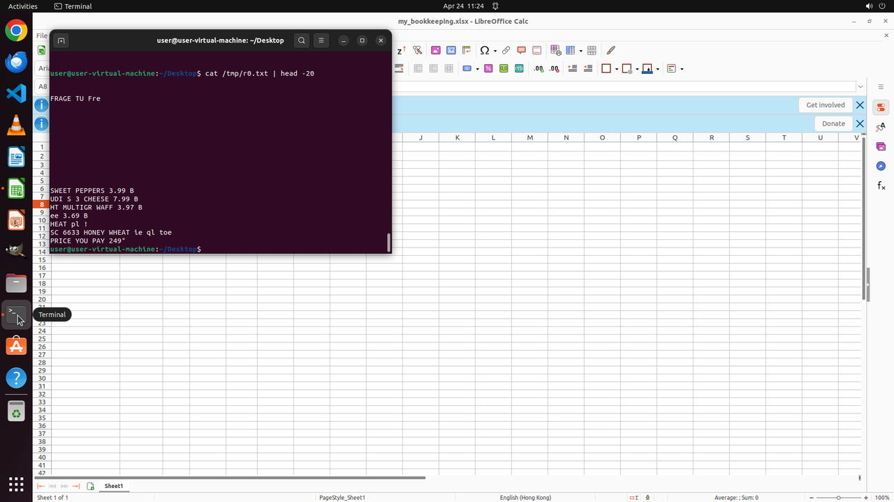

**Response:**
```
I can see the first part of Receipt 0 starts with "FRAGE TU Fre" which is likely a partially read header. Let me get the total from receipt 0 by searching for it.
```

**Actions:** `import subprocess, shlex; subprocess.run(f'xdotool type --delay 12 -- ' + shlex.quote('grep -i "total\\|subtotal\\|tax\\|balance\\|date\\|stor'), shell=True, check=True)
import time; time.sleep(0.05)
`

---

## Step 44


**Response:**
```
Now I can see the key details from Receipt 0:
- BALANCE 186.93 (this is the total)
- TAX 5.10
- TOTAL TAX 5.10
- TOTAL NUMBER OF ITEMS SOLD = 52
- TOTAL COUPONS cd

This is a grocery store receipt with a total of $186.93. Now let me view receipt_4 (McDonald's) more carefully.
```

**Actions:** `import subprocess, shlex; subprocess.run(f'xdotool type --delay 12 -- ' + shlex.quote('cat /tmp/r4.txt\n'), shell=True, check=True)
import time; time.sleep(0.05)`

---

## Step 45

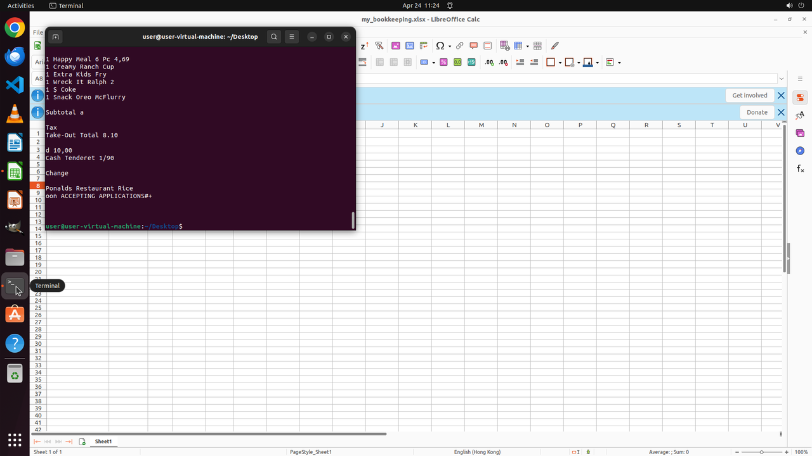

**Response:**
```
Now I can see Receipt 4 (McDonald's) clearly. Let me scroll up to see the full receipt.
```

**Actions:** `pyautogui.scroll(5, 450, 300)`

---

## Step 46

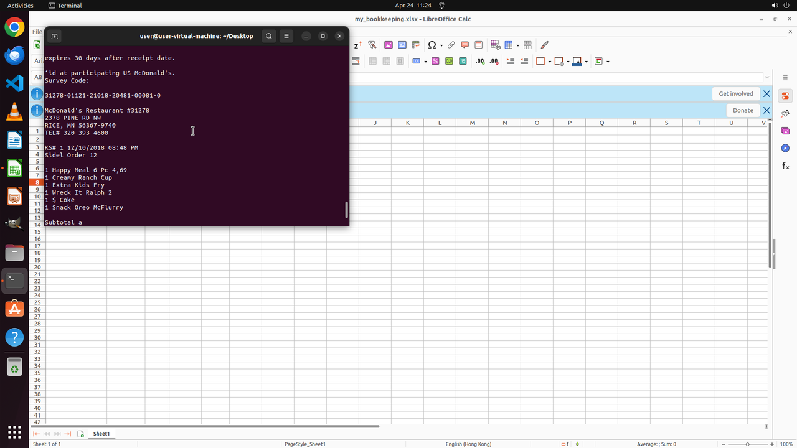

**Response:**
```
Excellent! Now I can see the full Receipt 4 (McDonald's) details:
- **McDonald's Restaurant #31278**
- 2378 PINE RD NW
- RICE, MN 56367-9740
- TEL# 320 393 4600
- KS# 1 **12/10/2018 08:48 PM**
- Side1 Order 12
- Items: Happy Meal 6 Pc $4.69, Creamy Ranch Cup, Extra Kids Fry, Wreck It Ralph 2, S Coke, Snack Oreo McFlurry
- Subtotal: a
- Take-Out Total: **8.10**
- Cash Tendered: 10.00
- Change: 1.90
- **McDonald's Restaurant Rice**

Now let me scroll down to see the complete receipt_4 output again.
```

**Actions:** `pyautogui.scroll(-5, 450, 300)`

---

## Step 47


**Response:**
```
Good. Now I have the McDonald's receipt details:
- Take-Out Total: $8.10
- Cash paid: $10.00
- Change: $1.90

Now I need to check the receipt_3.pdf and also look at each receipt image more carefully. Let me open receipt_3.pdf and also visually inspect receipt_0, receipt_1, and receipt_2. Let me first check the PDF receipt.
```

**Actions:** `import subprocess, shlex; subprocess.run(f'xdotool type --delay 12 -- ' + shlex.quote('cat /tmp/r3.txt\n'), shell=True, check=True)
import time; time.sleep(0.05)`

---

## Step 48


**Response:**
```
Receipt 3 (the PDF) appears to be empty - the pdftotext didn't extract any text. Let me open the PDF visually to see its contents.
```

**Actions:** `import subprocess, shlex; subprocess.run(f'xdotool type --delay 12 -- ' + shlex.quote('evince receipt_3.pdf &\n'), shell=True, check=True)
import time; time.sleep(0.05)`

---

## Step 49

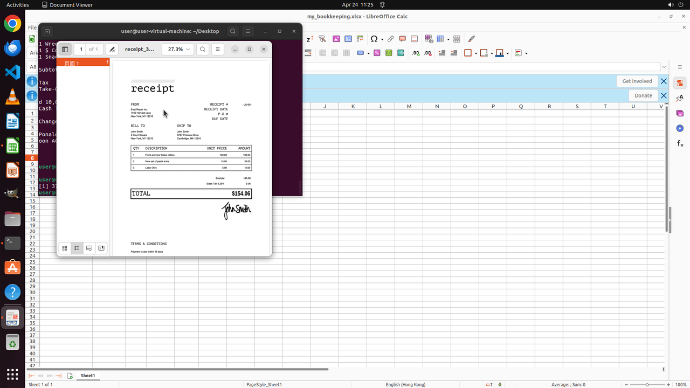

**Response:**
```
Excellent! Now I can see Receipt 3 (the PDF) clearly. It's an invoice/receipt with:
- From: East Repair Inc., 1912 Harvest Lane, New York, NY 10210
- Receipt # US-001
- Bill To: John Smith, 2 Court Square, New York, NY 12210
- Ship To: John Smith, 3787 Pineview Drive, Cambridge, MA 12210

Items:
1. Front and rear brake cables - Unit Price: 100.00 - Amount: 100.00
2. New set of pedal arms - Unit Price: 15.00 - Amount: 30.00
3. Labor 3hrs - Unit Price: 5.00 - Amount: 15.00

- Subtotal: 145.00
- Sales Tax 6.25%: 9.06
- **TOTAL: $154.06**

- Signed by John Smith
- Terms: Payment is due within 15 days

Now let me zoom in to read the receipt date more clearly.
```

**Actions:** `pyautogui.click(694, 136)`

---

## Step 50

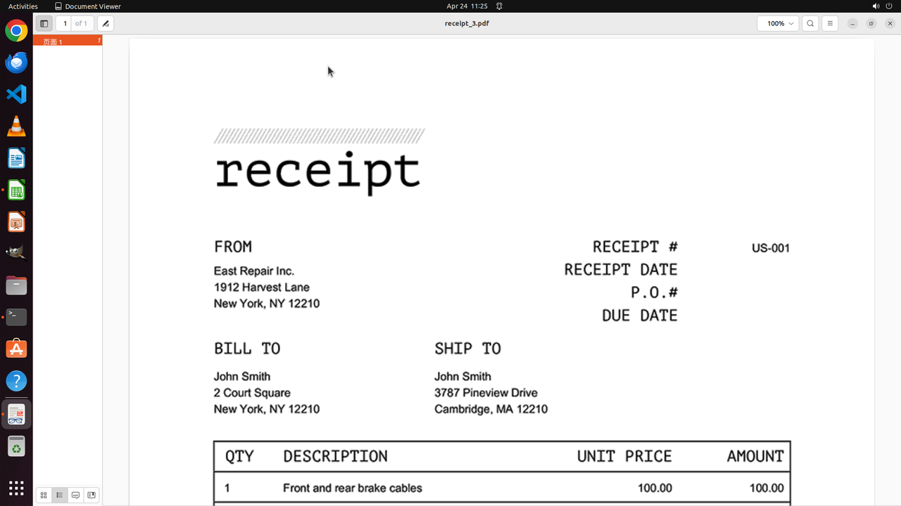

**Response:**
```
I can see the receipt clearly now. The Receipt Date, P.O.#, and Due Date fields appear to be empty (no values shown next to them). Let me scroll down to see the items and total.
```

**Actions:** `pyautogui.scroll(-5, 960, 600)`

---

## Step 51

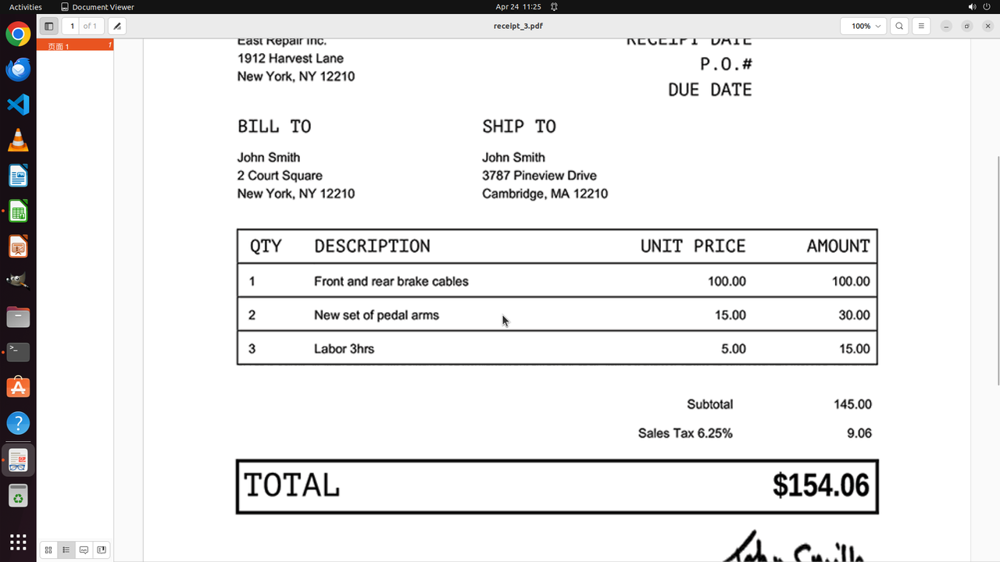

**Response:**
```
Now I can see Receipt 3 clearly:
- From: East Repair Inc.
- Items: Front and rear brake cables ($100), New set of pedal arms ($30), Labor 3hrs ($15)
- Subtotal: $145.00
- Sales Tax 6.25%: $9.06
- **TOTAL: $154.06**

This appears to be a repair/maintenance invoice. Now I need to view the remaining receipts visually. Let me close this and open receipt_0 and receipt_1 to get accurate details. Let me also look at receipt_1 (the cash out/bank transfer) and receipt_2 (soup receipt) more carefully. Let me now open the images.
```

**Actions:** `pyautogui.click(1893, 49)`

---

## Step 52


**Response:**
```
Good, I'm back in the terminal. Now let me open the receipt images to verify the details. Let me view receipt_0 (grocery), receipt_1 (bank transfer), and receipt_2 (soup) visually. Let me open receipt_1 first since the OCR showed it's a cash out/bank transfer.
```

**Actions:** `import subprocess, shlex; subprocess.run(f'xdotool type --delay 12 -- ' + shlex.quote('cat /tmp/r1.txt\n'), shell=True, check=True)
import time; time.sleep(0.05)`

---

## Step 53

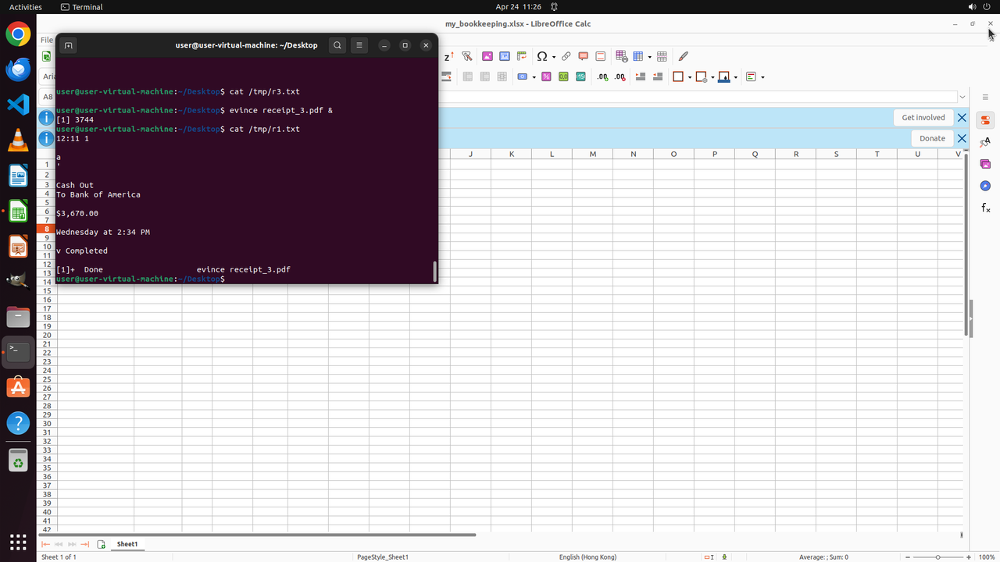

**Response:**
```
Now I can see Receipt 1 clearly:
- **Cash Out**
- **To Bank of America**
- **$3,670.00**
- **Wednesday at 2:34 PM**
- **Completed**

This is a bank transfer/cash out of $3,670.00. Now let me also check the receipt_0 total and get the full details. Let me also visually open the receipt images to confirm the details. Let me now open receipt_0 and receipt_2 images.
```

**Actions:** `import subprocess, shlex; subprocess.run(f'xdotool type --delay 12 -- ' + shlex.quote('eog receipt_0.jpeg &\n'), shell=True, check=True)
import time; time.sleep(0.05)`

---

## Step 54

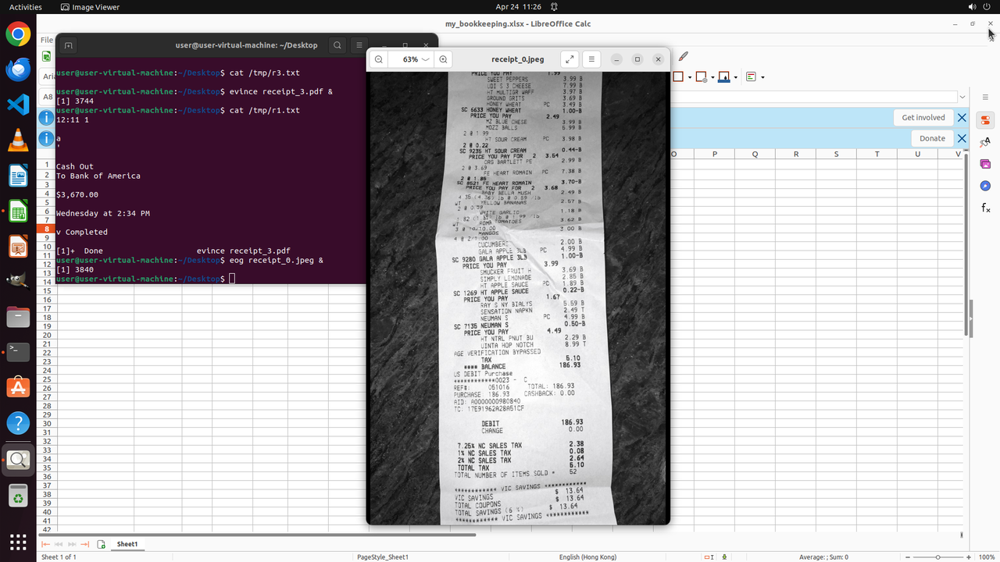

**Response:**
```
I can see the receipt_0 image now. I can see the bottom portion with:
- TAX: 5.10
- BALANCE: 186.93
- DEBIT Purchase
- DEBIT: 186.93
- CHANGE: 0.00
- TOTAL TAX: 5.10
- TOTAL NUMBER OF ITEMS SOLD: 52
- VIC SAVINGS: $13.64

I need to scroll up to see the store name and date. Let me scroll up in the image.
```

**Actions:** `pyautogui.scroll(10, 990, 600)`

---

## Step 55

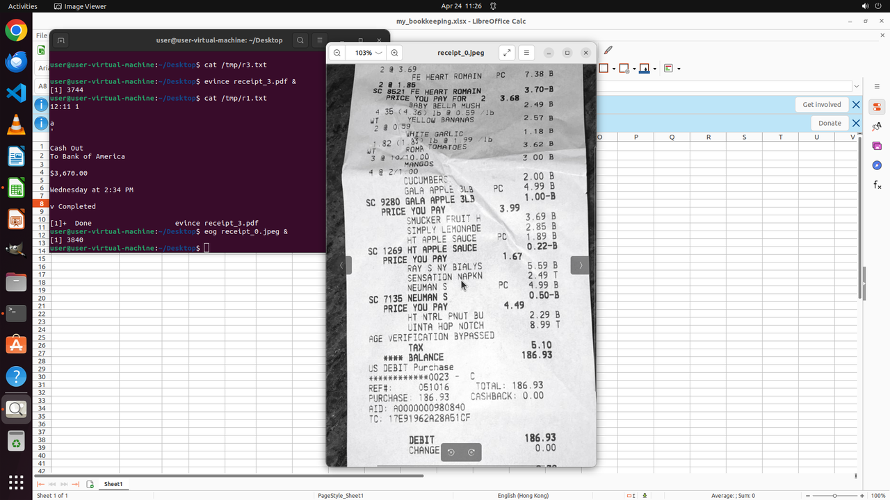

**Response:**
```
I can see more of the receipt now. I can see items like Heart Romain, Yellow Bananas, White Garlic, Roma Tomatoes, Mangos, Cucumbers, Gala Apple, Smucker Fruit, Simply Lemonade, Apple Sauce, etc. I need to scroll up more to see the store name and date at the very top.
```

**Actions:** `pyautogui.scroll(15, 990, 600)`

---

## Step 56

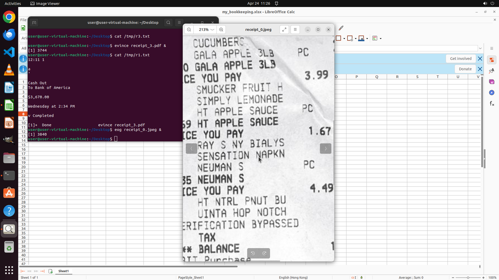

**Response:**
```
The image is zoomed in too much. Let me zoom out to see the full receipt with the store name at the top.
```

**Actions:** `pyautogui.click(726, 112)`

---

## Step 57

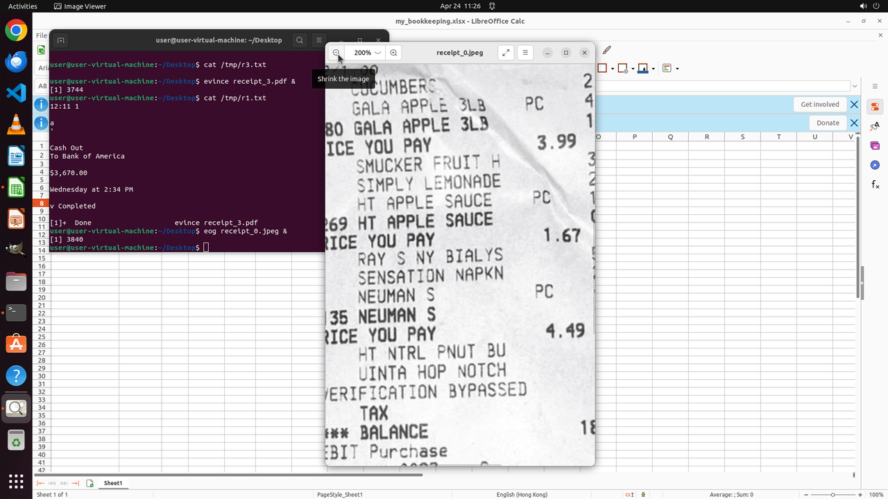

**Response:**
```
Let me zoom out more to see the full receipt.
```

**Actions:** `pyautogui.click(726, 112)`

---

## Step 58

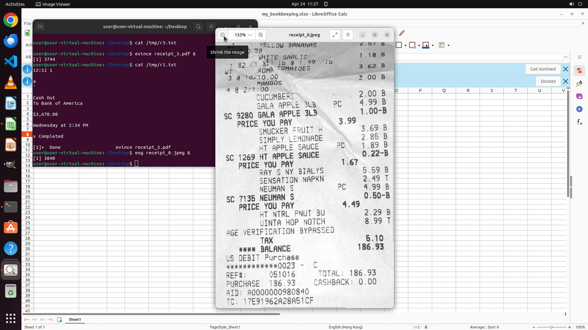

**Response:**
```
I can see more of the receipt now. I need to scroll up to see the store name and date at the top. Let me zoom out more first.
```

**Actions:** `pyautogui.click(726, 112)`

---

## Step 59

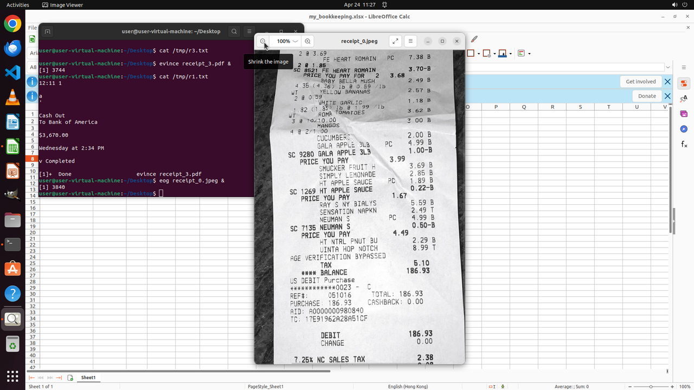

**Response:**
```
I can see more items now but still need the top of the receipt. Let me zoom out more.
```

**Actions:** `pyautogui.click(726, 112)`

---

## Step 60

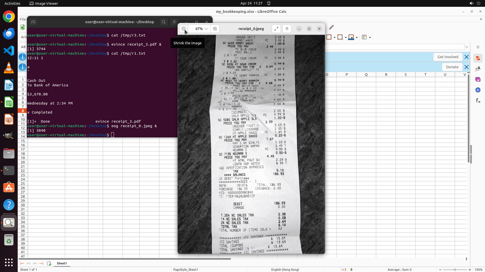

**Response:**
```
I can see more of the receipt now. I can see at the top items like "GROUND GRITS", "HONEY WHEAT", "BLUE CHEESE", "MOZZ BALLS", "SOUR CREAM" etc. But I still need to see the very top with the store name and date. Let me scroll up within the image viewer.
```

**Actions:** `pyautogui.scroll(5, 990, 600)`

---

## Step 61

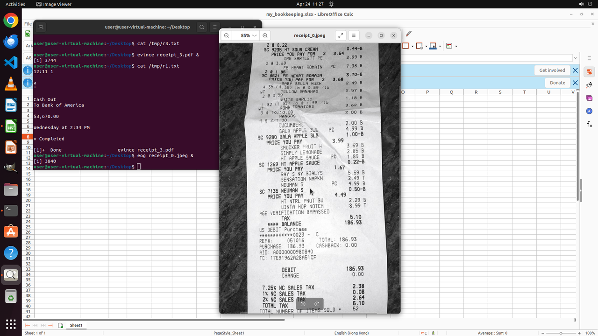

**Response:**
```
I can see the receipt is very long. The top is still cut off. Let me zoom out more to see the entire receipt including the store name.
```

**Actions:** `pyautogui.click(726, 112)`

---

## Step 62


**Response:**
```
I can see more of the receipt now. At the top I can see "GROUND GRITS", "SC 6633 HONEY WHEAT" and other items. But I still need to see the very top for the store name. Let me zoom out more.
```

**Actions:** `pyautogui.click(726, 112)`

---

## Step 63

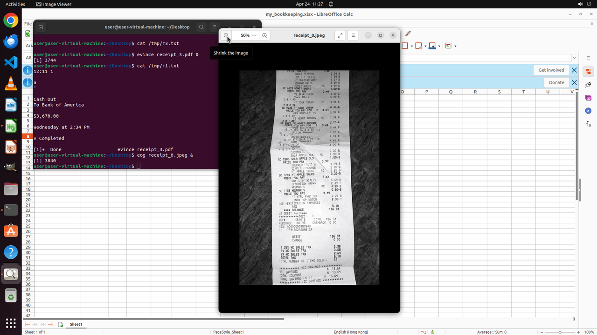

**Response:**
```
Now I can see the full receipt but it's too small to read the top. Let me scroll up to see the top of the receipt more clearly.
```

**Actions:** `pyautogui.scroll(5, 990, 600)`

---

## Step 64

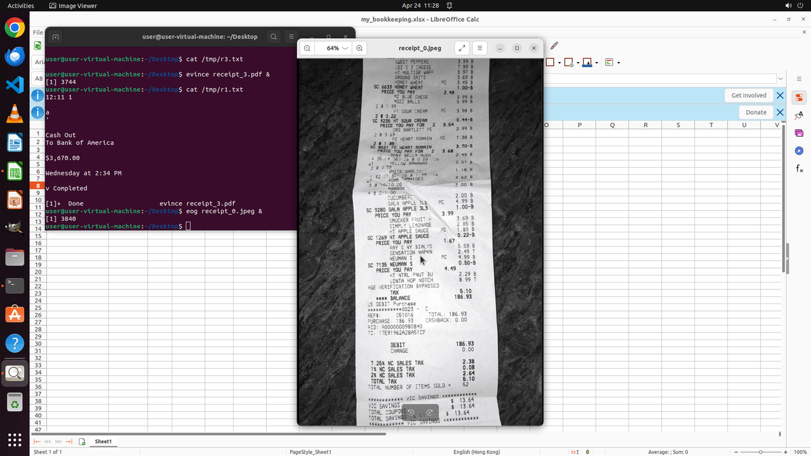

**Response:**
```
I can see more of the receipt now. I can see "SWEET PEPPERS" at the very top. Let me scroll up more to see the store name and date.
```

**Actions:** `pyautogui.scroll(5, 990, 600)`

---

## Step 65


**Response:**
```
I can see the receipt is very long. The OCR output showed "FRAGE TU Fre" at the top which might be the store name. Let me look at the OCR output more carefully. From the OCR, the store name seems to be partially read. Let me look at the full OCR output from receipt_0 to identify the store name.
```

**Actions:** `pyautogui.click(1257, 112)`

---

## Step 66

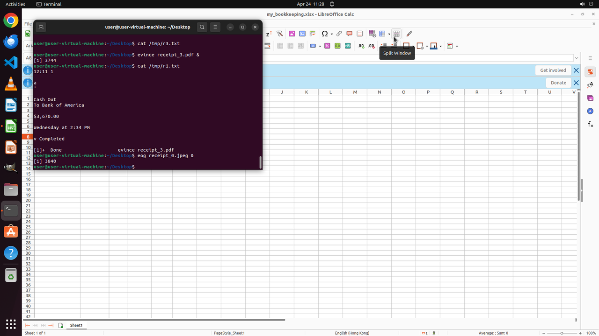

**Response:**
```
Good, the image viewer is closed. Now let me look at the full OCR output of receipt_0 to find the store name and date.
```

**Actions:** `import subprocess, shlex; subprocess.run(f'xdotool type --delay 12 -- ' + shlex.quote('head -15 /tmp/r0.txt\n'), shell=True, check=True)
import time; time.sleep(0.05)`

---

## Step 67

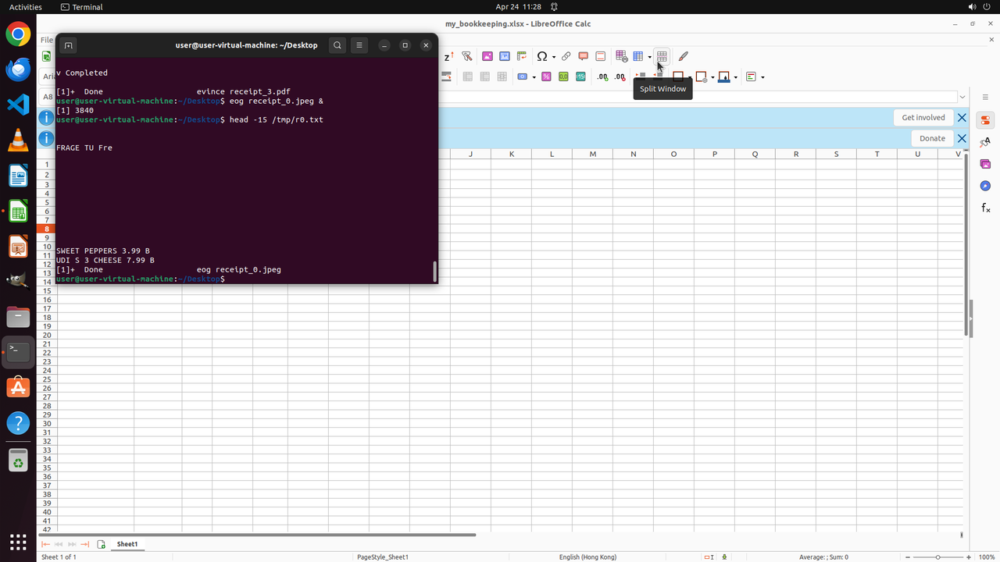

**Response:**
```
I can see the top of receipt_0 shows "FRAGE TU Fre" which seems like a partially read store name. The first items are "SWEET PEPPERS 3.99 B" and "UDI S 3 CHEESE 7.99 B". The OCR is having trouble reading the store name. Let me try to open the image again and zoom into just the top portion to read the store name. But first, let me check if there's a "Harris Teeter" or "Food Lion" or similar store based on the "FRAGE TU Fre" text - it might be "Harris Teeter Fresh" or similar.

Let me also look at the receipt image more carefully. The OCR reads "FRAGE TU Fre" which could be part of a store name. Looking at the receipt items (groceries, VIC savings), this looks like a Harris Teeter receipt (VIC is their loyalty card).

Let me now also open receipt_2 to see its details.
```

**Actions:** `import subprocess, shlex; subprocess.run(f'xdotool type --delay 12 -- ' + shlex.quote('eog receipt_2.jpg &\n'), shell=True, check=True)
import time; time.sleep(0.05)`

---

## Step 68

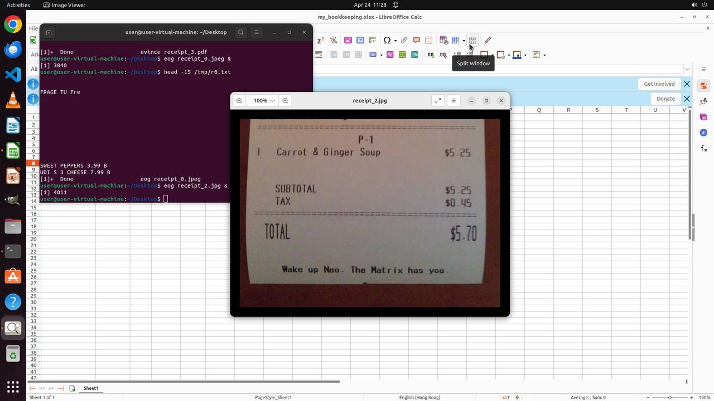

**Response:**
```
Excellent! Now I can see Receipt 2 very clearly:
- **P-1**
- **1 Carrot & Ginger Soup - $5.25**
- **SUBTOTAL: $5.25**
- **TAX: $0.45**
- **TOTAL: $5.70**
- "Wake up Neo. The Matrix has you." (just a fun message)

This is a food/soup purchase for $5.70. Now let me close this and view receipt_1 (the bank transfer) visually as well.
```

**Actions:** `pyautogui.click(1344, 271)`

---

## Step 69

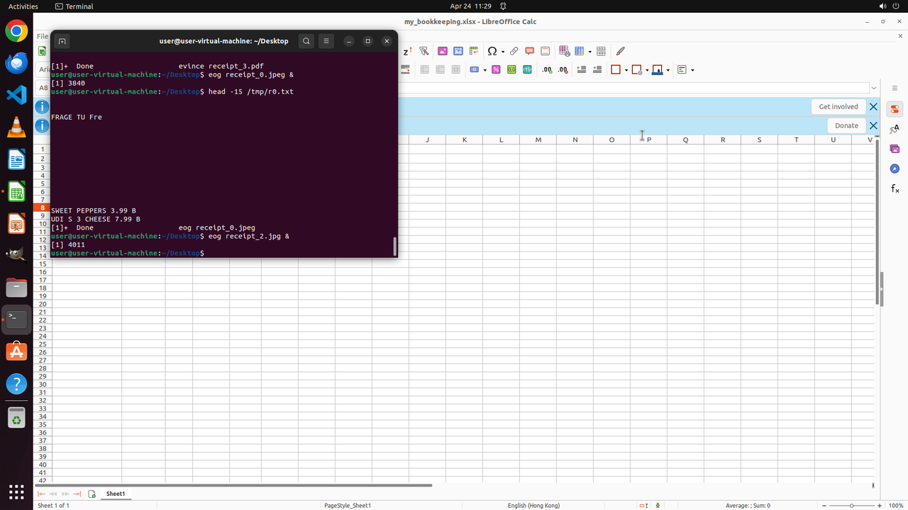

**Response:**
```
Good, image viewer is closed. Now let me open receipt_1 to see the bank transfer details visually.
```

**Actions:** `import subprocess, shlex; subprocess.run(f'xdotool type --delay 12 -- ' + shlex.quote('eog receipt_1.jpg &\n'), shell=True, check=True)
import time; time.sleep(0.05)`

---

## Step 70

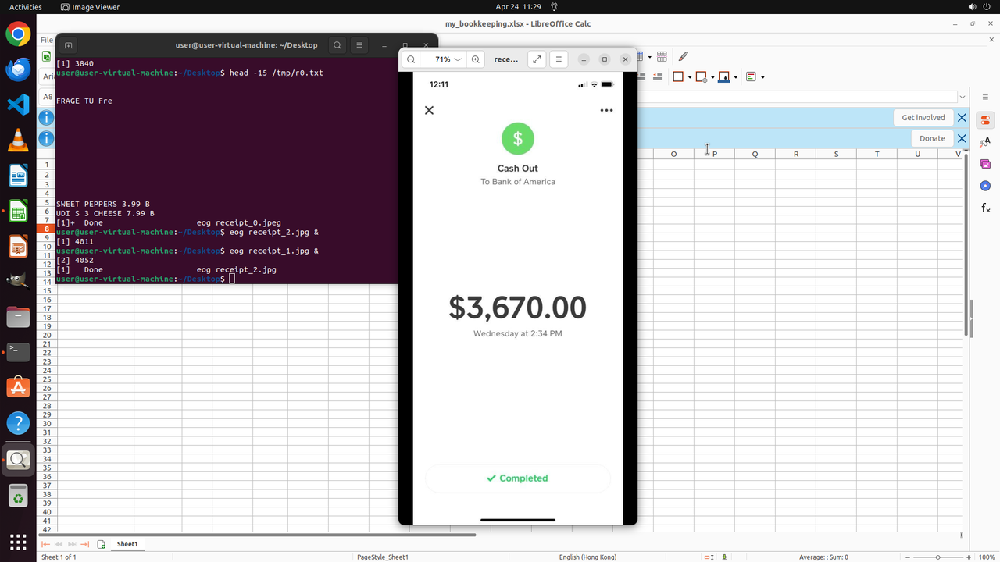

**Response:**
```
Now I can see Receipt 1 clearly:
- **Cash Out**
- **To Bank of America**
- **$3,670.00**
- **Wednesday at 2:34 PM**
- **✓ Completed**

This is a cash out/bank transfer. Now I have all the receipt details. Let me close this and also view receipt_4 (McDonald's) to confirm the details. Let me also check if the grocery receipt has a store name visible.
```

**Actions:** `pyautogui.click(1195, 112)`

---

## Step 71

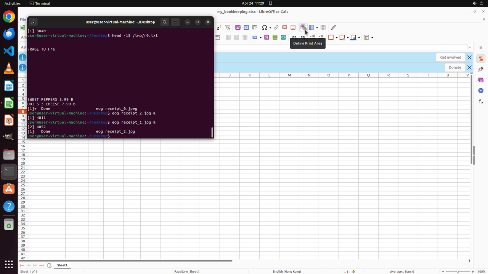

**Response:**
```
Good, the image viewer is closed. Now let me also view receipt_4 (McDonald's) to confirm the total.
```

**Actions:** `import subprocess, shlex; subprocess.run(f'xdotool type --delay 12 -- ' + shlex.quote('eog receipt_4.jpg &\n'), shell=True, check=True)
import time; time.sleep(0.05)`

---

## Step 72

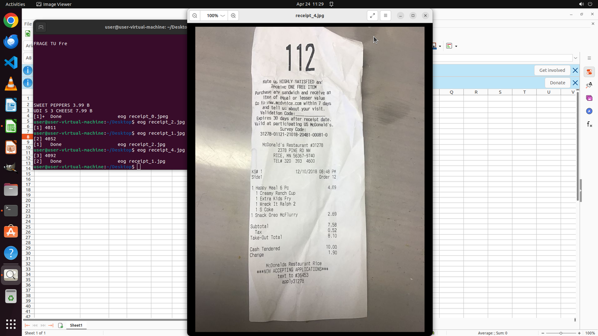

**Response:**
```
Now I can see Receipt 4 (McDonald's) very clearly:

- **McDonald's Restaurant #31278**
- 2378 PINE RD NW
- RICE, MN 56367-9740
- TEL# 320 393 4600
- KS# 1, **12/10/2018 08:48 PM**
- Side1, Order 12
- 1 Happy Meal 6 Pc: $4.69
- 1 Creamy Ranch Cup
- 1 Extra Kids Fry
- 1 Wreck It Ralph 2
- 1 S Coke
- 1 Snack Oreo McFlurry: $2.69
- **Subtotal: $7.58**
- **Tax: $0.52**
- **Take-Out Total: $8.10**
- Cash Tendered: $10.00
- Change: $1.90

Now I have all the receipt information. Let me close this and compile the data to enter into the bookkeeping spreadsheet.

Summary of all receipts:
1. **Receipt 0**: Grocery store purchase - Total: $186.93
2. **Receipt 1**: Cash Out to Bank of America - $3,670.00
3. **Receipt 2**: Carrot & Ginger Soup - Total: $5.70
4. **Receipt 3**: East Repair Inc. (repair/maintenance) - Total: $154.06
5. **Receipt 4**: McDonald's - Take-Out Total: $8.10

Now let me close this and enter the data into the spreadsheet.
```

**Actions:** `pyautogui.click(1362, 49)`

---

## Step 73


**Response:**
```
Good, all image viewers are closed. Now I need to switch to the LibreOffice Calc spreadsheet and enter the transaction data. Let me click on the spreadsheet.
```

**Actions:** `pyautogui.click(1350, 45)`

---

## Step 74

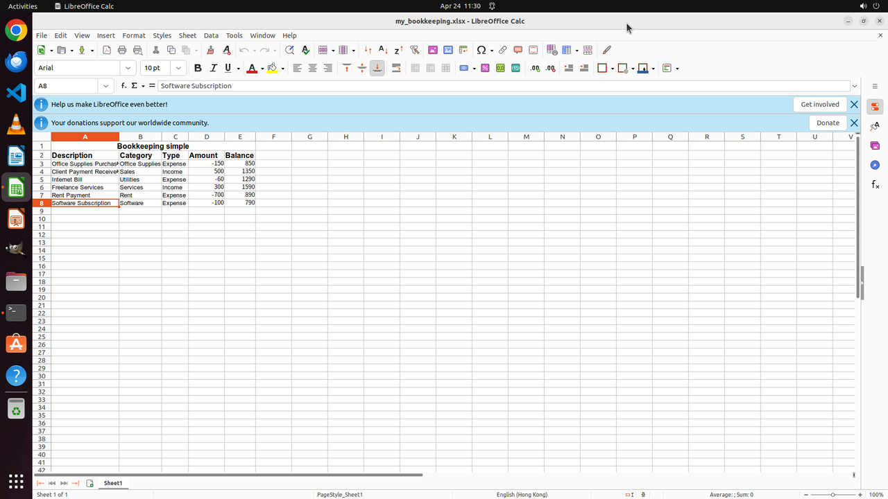

**Response:**
```
Now I can see the bookkeeping spreadsheet clearly. The current entries are:

| Row | Description | Category | Type | Amount | Balance |
|-----|-------------|----------|------|--------|---------|
| 3 | Office Supplies Purchase | Office Supplies | Expense | -150 | 850 |
| 4 | Client Payment Received | Sales | Income | 500 | 1350 |
| 5 | Internet Bill | Utilities | Expense | -60 | 1290 |
| 6 | Freelance Services | Services | Income | 300 | 1590 |
| 7 | Rent Payment | Rent | Expense | -700 | 890 |
| 8 | Software Subscription | Software | Expense | -100 | 790 |

The last balance is 790. Now I need to add the 5 receipt transactions. The task says "detailing my expenses over the past few days." Note that receipt_1 (Cash Out to Bank of America) is a bank transfer, not an expense per se. But I'll include all transactions as they represent expenses/transfers.

Let me now add the transactions. I'll click on cell A9 to start entering data.

The transactions to add:
1. Grocery Store Purchase (Receipt 0) - Groceries - Expense - -186.93
2. Cash Out to Bank of America (Receipt 1) - Bank Transfer - Expense - -3670.00
3. Carrot & Ginger Soup (Receipt 2) - Food - Expense - -5.70
4. Repair Services - East Repair Inc. (Receipt 3) - Repairs - Expense - -154.06
5. McDonald's (Receipt 4) - Food - Expense - -8.10
```

**Actions:** `pyautogui.click(183, 456)`

---

## Step 75

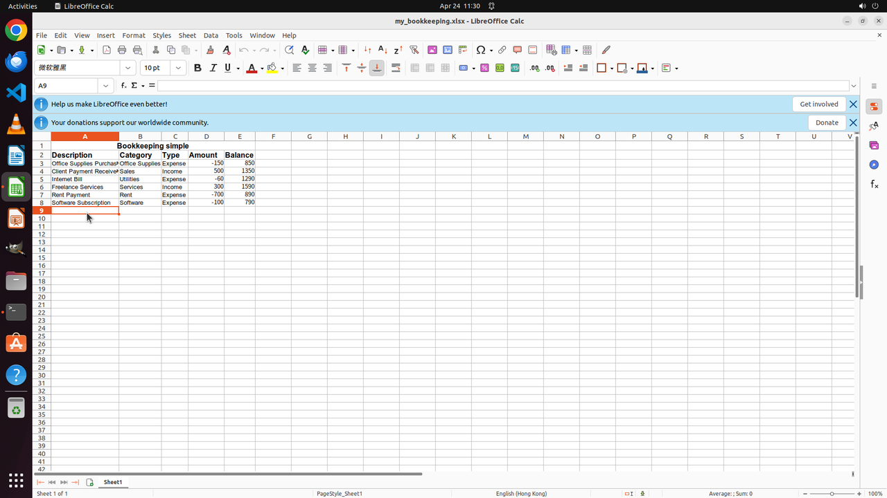

**Response:**
```
I'm now in cell A9. Let me start entering the transaction data. I'll type the first transaction - the grocery store purchase.
```

**Actions:** `import subprocess, shlex; subprocess.run(f'xdotool type --delay 12 -- ' + shlex.quote('Grocery Store Purchase\tGroceries\tExpense\t-186.93\t='), shell=True, check=True)
import time; time.sleep(0.05)
i`

---

## Step 76

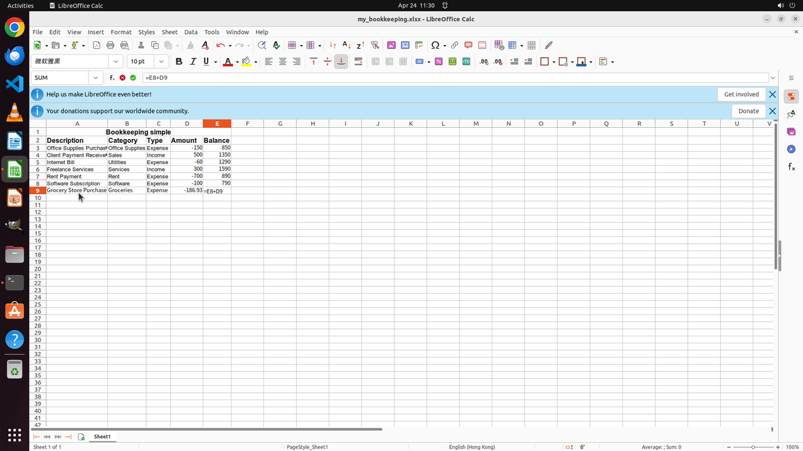

**Response:**
```
I can see the first row is being entered. The formula =E8+D9 is in cell E9. Let me press Enter to confirm and then continue with the next entries.
```

**Actions:** `pyautogui.keyDown('return')
pyautogui.keyUp('return')`

---

## Step 77


**Response:**
```
The first transaction is entered:
- Row 9: Grocery Store Purchase | Groceries | Expense | -186.93 | 603.07 (790 - 186.93 = 603.07)

Now I'm in cell A10. Let me enter the second transaction - Cash Out to Bank of America. Wait, looking at this more carefully, the Cash Out to Bank of America ($3,670) is a bank transfer, not really an expense in the traditional bookkeeping sense. But since the task says to detail expenses from the receipts, I should include it. Let me enter all the remaining transactions.
```

**Actions:** `import subprocess, shlex; subprocess.run(f'xdotool type --delay 12 -- ' + shlex.quote('Cash Out to Bank of America\tBank Transfer\tExpense\t'), shell=True, check=True)
import time; time.sleep(0.05)
im`

---

## Step 78

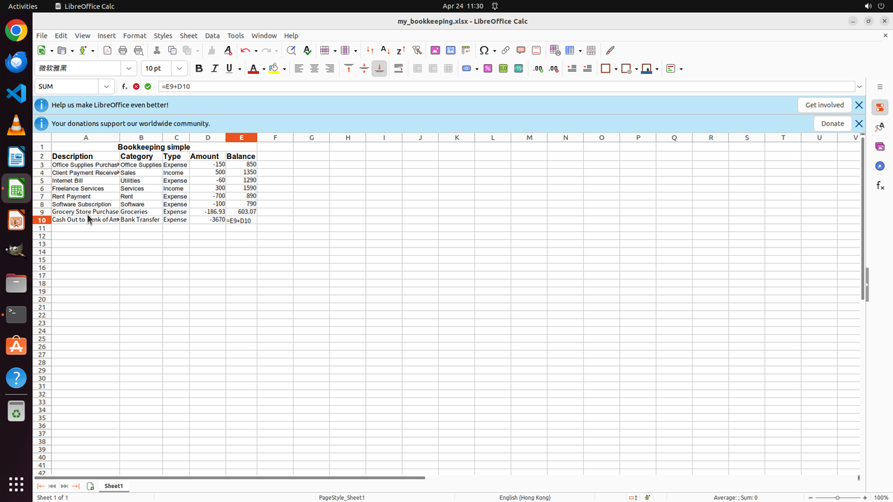

**Response:**
```
I can see the second row is being entered with the formula =E9+D10. Let me press Enter to confirm.
```

**Actions:** `pyautogui.keyDown('return')
pyautogui.keyUp('return')`

---

## Step 79


**Response:**
```
Row 10 is entered: Cash Out to Bank of America | Bank Transfer | Expense | -3670 | -3066.93

Now I'm in A11. Let me enter the third transaction - the Carrot & Ginger Soup.
```

**Actions:** `import subprocess, shlex; subprocess.run(f'xdotool type --delay 12 -- ' + shlex.quote('Carrot & Ginger Soup\tFood\tExpense\t-5.70\t=E10+D11\n'), shell=True, check=True)
import time; time.sleep(0.05)`

---

## Step 80

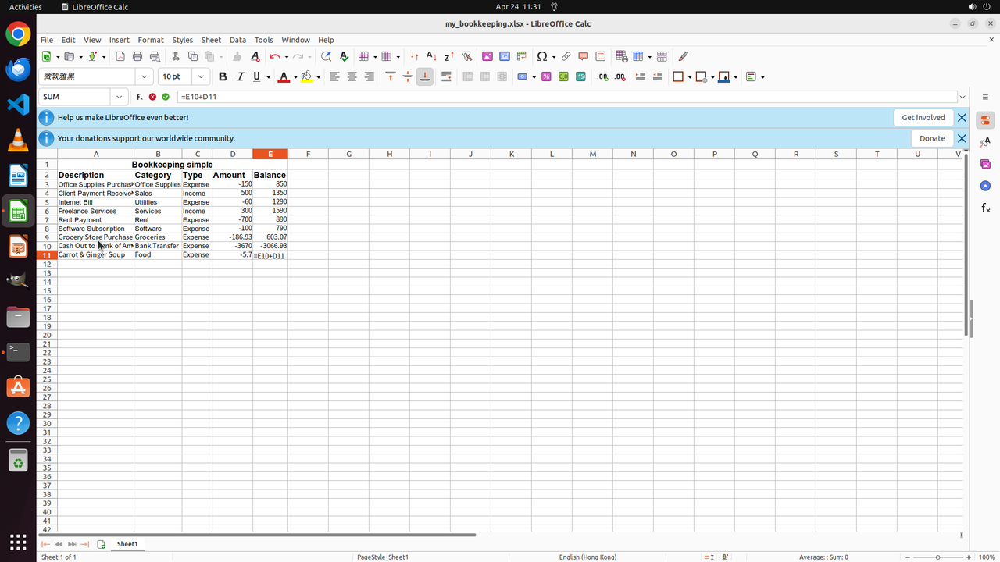

**Response:**
```
Row 11 is being entered with the formula. Let me press Enter to confirm.
```

**Actions:** `pyautogui.keyDown('return')
pyautogui.keyUp('return')`

---

## Step 81

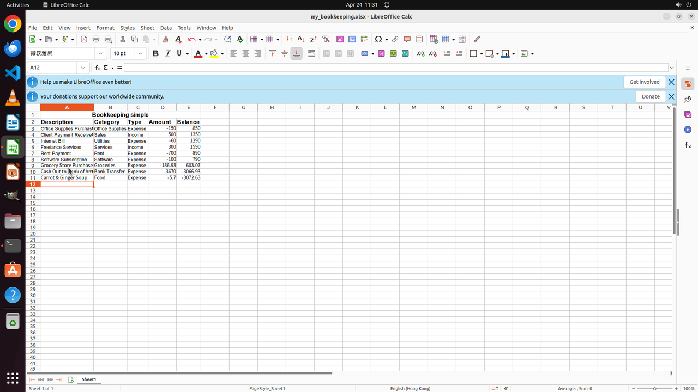

**Response:**
```
Row 11 is entered: Carrot & Ginger Soup | Food | Expense | -5.7 | -3072.63

Now I'm in A12. Let me enter the fourth transaction - the repair services from East Repair Inc.
```

**Actions:** `import subprocess, shlex; subprocess.run(f'xdotool type --delay 12 -- ' + shlex.quote('Repair Services - East Repair Inc.\tRepairs\tExpense'), shell=True, check=True)
import time; time.sleep(0.05)
imp`

---

## Step 82

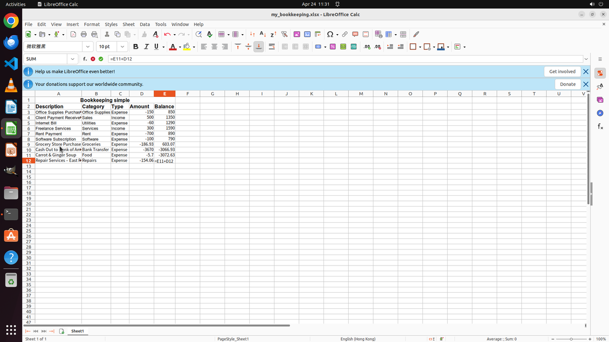

**Response:**
```
Row 12 is being entered with the formula =E11+D12. Let me press Enter to confirm.
```

**Actions:** `pyautogui.keyDown('return')
pyautogui.keyUp('return')`

---

## Step 83

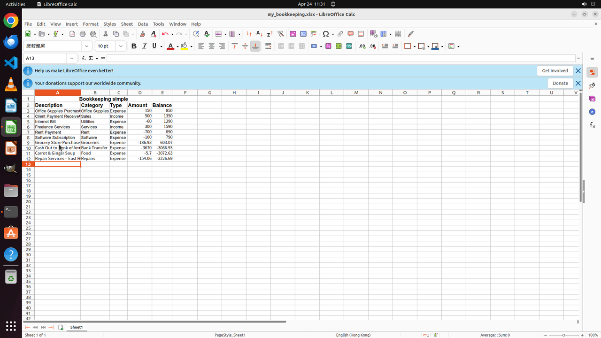

**Response:**
```
Row 12 is entered: Repair Services – East R... | Repairs | Expense | -154.06 | -3226.69

Now I'm in A13. Let me enter the last transaction - McDonald's.
```

**Actions:** `import subprocess, shlex; subprocess.run(f'xdotool type --delay 12 -- ' + shlex.quote("McDonald's Restaurant\tFood\tExpense\t-8.10\t=E12+D13\n"), shell=True, check=True)
import time; time.sleep(0.05)`

---

## Step 84

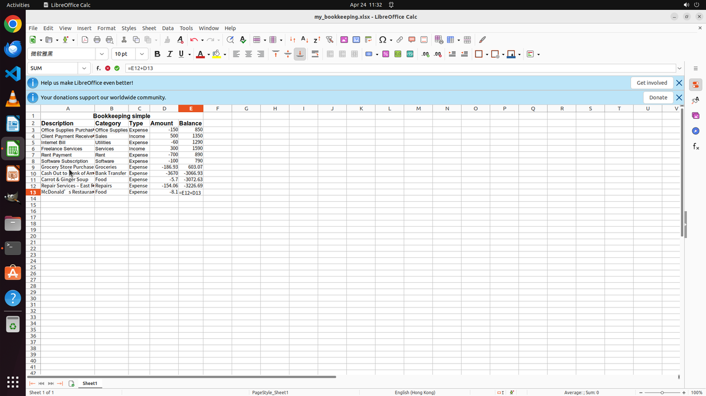

**Response:**
```
The last row is being entered with the formula =E12+D13. Let me press Enter to confirm.
```

**Actions:** `pyautogui.keyDown('return')
pyautogui.keyUp('return')`

---

## Step 85


**Response:**
```
All 5 transactions have been entered successfully:

| Row | Description | Category | Type | Amount | Balance |
|-----|-------------|----------|------|--------|---------|
| 9 | Grocery Store Purchase | Groceries | Expense | -186.93 | 603.07 |
| 10 | Cash Out to Bank of Am... | Bank Transfer | Expense | -3670 | -3066.93 |
| 11 | Carrot & Ginger Soup | Food | Expense | -5.7 | -3072.63 |
| 12 | Repair Services – East R... | Repairs | Expense | -154.06 | -3226.69 |
| 13 | McDonald's Restaurant | Food | Expense | -8.1 | -3234.79 |

Now let me save the file with Ctrl+S.
```

**Actions:** `pyautogui.keyDown('ctrl')
pyautogui.keyDown('s')
pyautogui.keyUp('s')
pyautogui.keyUp('ctrl')`

---

## Step 86

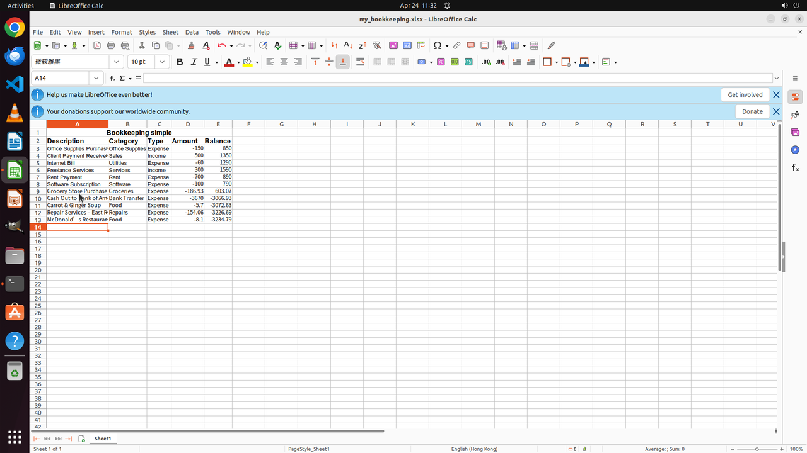

**Response:**
```
It looks like the file might have saved without a dialog (since it's already in xlsx format). Let me verify by checking if a "Keep Current Format" dialog appeared. It seems it saved directly. Let me press Ctrl+S again to make sure.
```

**Actions:** `pyautogui.keyDown('ctrl')
pyautogui.keyDown('s')
pyautogui.keyUp('s')
pyautogui.keyUp('ctrl')`

---

## Step 87


**Response:**
```
The file has been saved. The bookkeeping spreadsheet has been successfully updated with all 5 transactions from the receipt files:

1. **Row 9**: Grocery Store Purchase | Groceries | Expense | -186.93 | Balance: 603.07
2. **Row 10**: Cash Out to Bank of America | Bank Transfer | Expense | -3,670 | Balance: -3,066.93
3. **Row 11**: Carrot & Ginger Soup | Food | Expense | -5.70 | Balance: -3,072.63
4. **Row 12**: Repair Services – East Repair Inc. | Repairs | Expense | -154.06 | Balance: -3,226.69
5. **Row 13**: McDonald's Restaurant | Food | Expense | -8.10 | Balance: -3,234.79

All transactions have been extracted from the 5 receipts (receipt_0.jpeg through receipt_4.jpg, including receipt_3.pdf) and added to the bookkeeping spreadsheet with proper descriptions, categories, types, amounts, and running balance calculations.

DONE
```

**Actions:** `DONE`

---
