# Task 8e116af7-7db7-4e35-a68b-b0939c066c78

**Instruction:** Please update my bookkeeping sheet with the recent transactions from the provided folder, detailing my expenses over the past few days.

**Score:** 1.0

**Wall clock:** 18m 17s

**Steps:** 99

**Cost:** $4.15

---

## Step 1

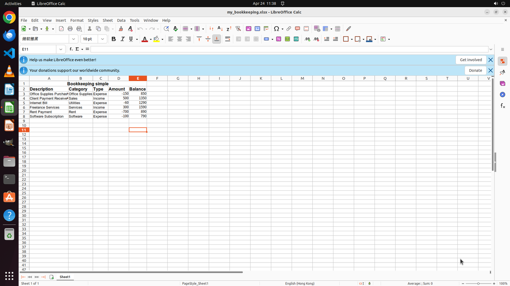

**Response:**
```
I need to find the folder with recent transactions. Let me first check the home directory and desktop for any relevant folders.
```

**Actions:** `pyautogui.keyDown('ctrl')
pyautogui.keyDown('alt')
pyautogui.keyDown('t')
pyautogui.keyUp('t')
pyautogui.keyUp('alt')
pyautogui.keyUp('ctrl')`

---

## Step 2

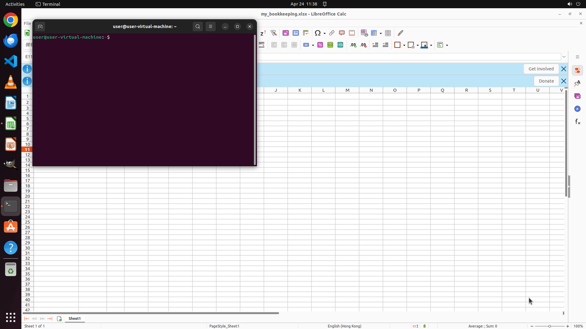

**Actions:** `import subprocess, shlex; subprocess.run(f'xdotool type --delay 12 -- ' + shlex.quote('ls ~/Desktop/ ~/Documents/ ~/Downloads/ ~/ 2>/dev/'), shell=True, check=True)
import time; time.sleep(0.05)
impor`

---

## Step 3


**Response:**
```
I can see receipt files on the Desktop. Let me examine them to find the transaction details. There are receipt_0.jpeg, receipt_1.jpg, receipt_2.jpg, receipt_3.pdf, and receipt_4.jpg. Let me open each one to read the transaction details.
```

**Actions:** `import subprocess, shlex; subprocess.run(f'xdotool type --delay 12 -- ' + shlex.quote('xdg-open ~/Desktop/receipt_0.jpeg &\n'), shell=True, check=True)
import time; time.sleep(0.05)`

---

## Step 4

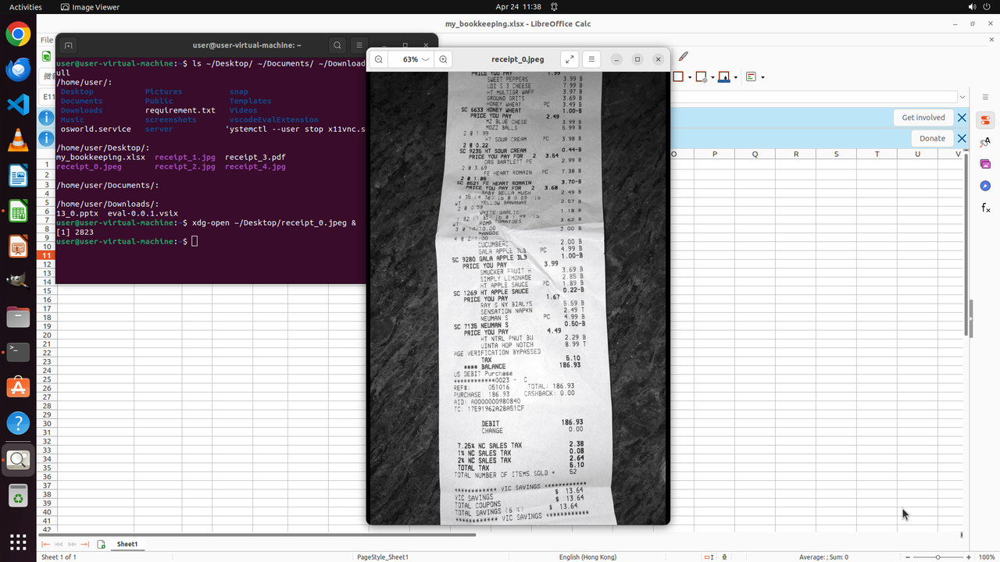

**Response:**
```
I can see receipt_0.jpeg is a grocery store receipt. Let me scroll up to see the full receipt and note the total. The balance shows 186.93 with DEBIT payment. Let me scroll up to see the store name and date.
```

**Actions:** `pyautogui.scroll(5, 990, 600)`

---

## Step 5

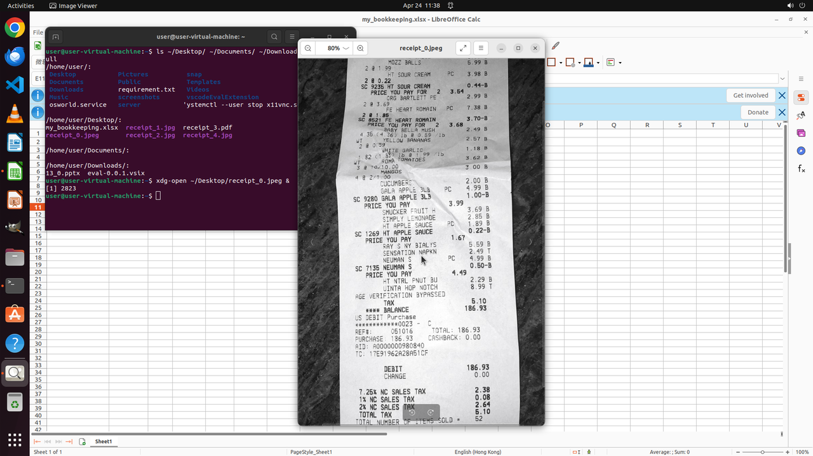

**Response:**
```
I can see the receipt but need to scroll up more to see the store name and date. Let me scroll up further.
```

**Actions:** `pyautogui.scroll(10, 990, 600)`

---

## Step 6

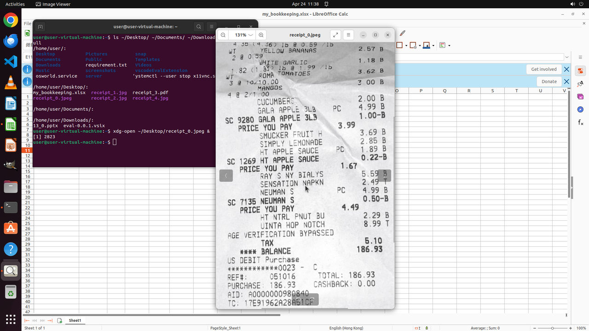

**Response:**
```
I can see the receipt details more clearly now. The total balance is 186.93. I need to scroll up more to see the store name and date. Let me zoom out first to see the full receipt.
```

**Actions:** `pyautogui.click(726, 114)`

---

## Step 7

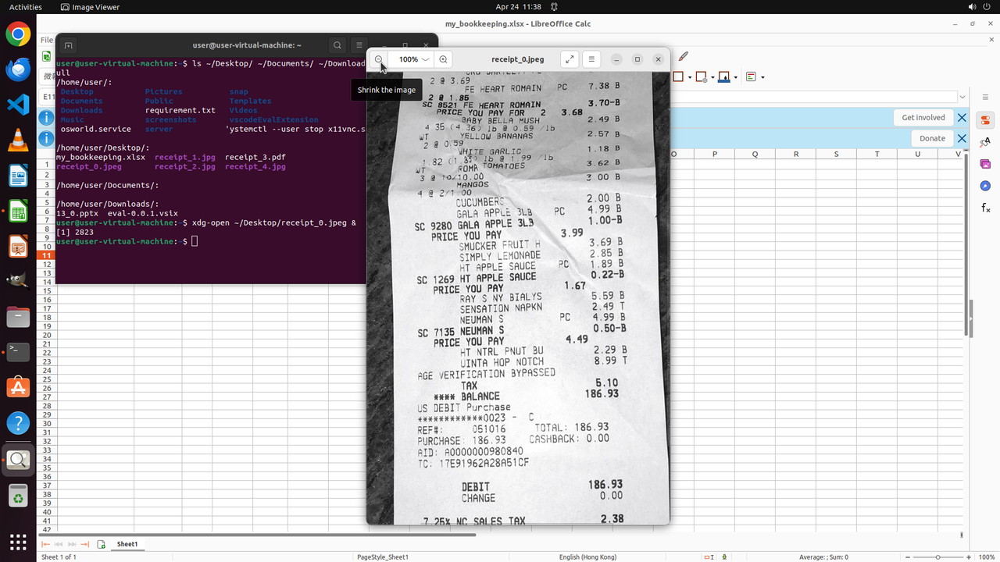

**Response:**
```
I can see the receipt more clearly now. Let me zoom out more to see the top of the receipt with the store name and date.
```

**Actions:** `pyautogui.click(726, 114)`

---

## Step 8

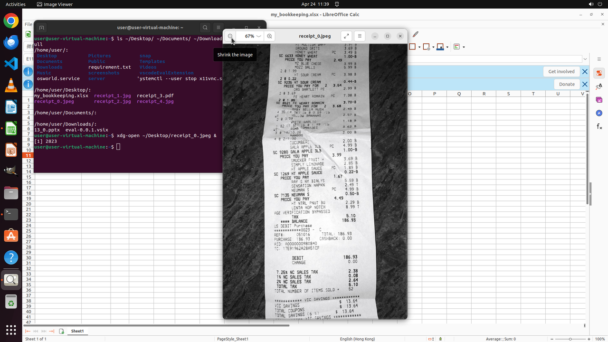

**Response:**
```
I can see more of the receipt now. Let me scroll up to see the top with the store name and date.
```

**Actions:** `pyautogui.scroll(10, 990, 600)`

---

## Step 9

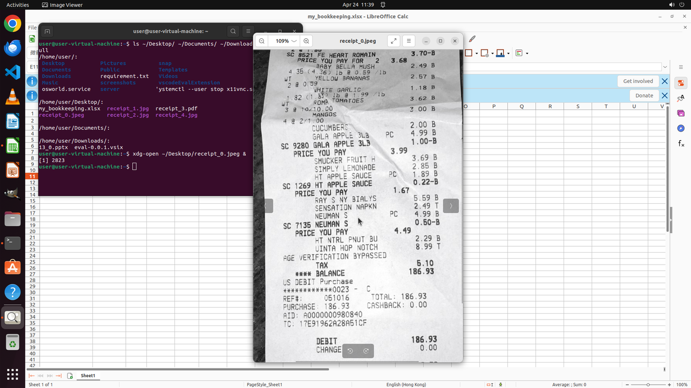

**Response:**
```
I need to see the top of the receipt to find the store name and date. Let me use the "Fit image in window" option to see the entire receipt at once.
```

**Actions:** `pyautogui.click(1090, 114)`

---

## Step 10

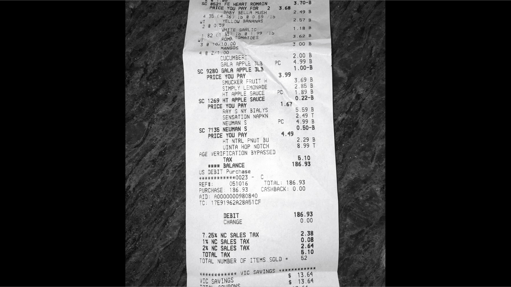

**Response:**
```
I can see the receipt is now displayed in full view but the top is cut off. I can see the balance is 186.93 and it's a grocery store receipt. Let me scroll up to see the store name and date at the top.
```

**Actions:** `pyautogui.scroll(10, 960, 540)`

---

## Step 11

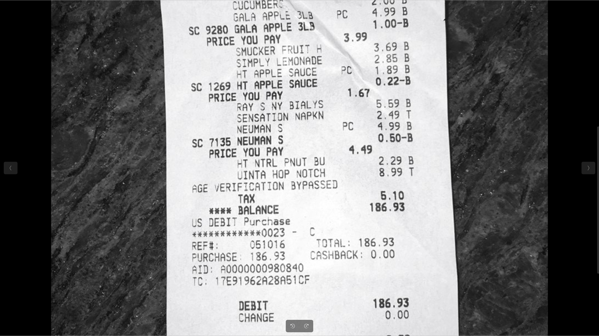

**Response:**
```
It seems the image is zoomed in. I can't see the top of the receipt with the store name and date. Let me press Escape to exit full view and try a different approach. Let me close this and look at all receipts from the terminal.
```

**Actions:** `pyautogui.keyDown('esc')
pyautogui.keyUp('esc')`

---

## Step 12

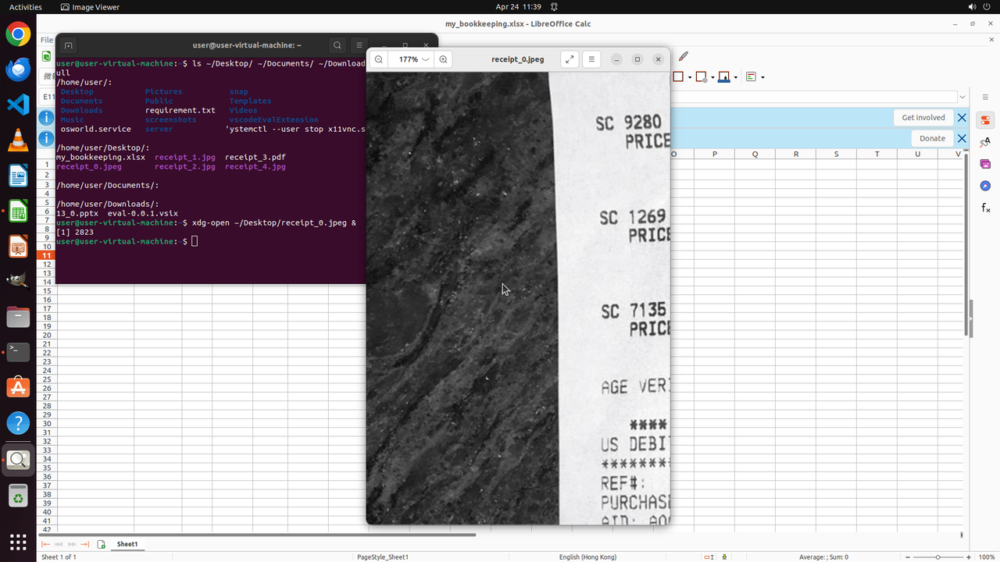

**Response:**
```
The image viewer is zoomed in too much. Let me use a different approach - I'll use OCR or just try to use the terminal to extract text from the images. Let me first try to use tesseract OCR if available, or look at the receipts more carefully. Let me close this and zoom out properly.
```

**Actions:** `pyautogui.click(726, 114)`

---

## Step 13

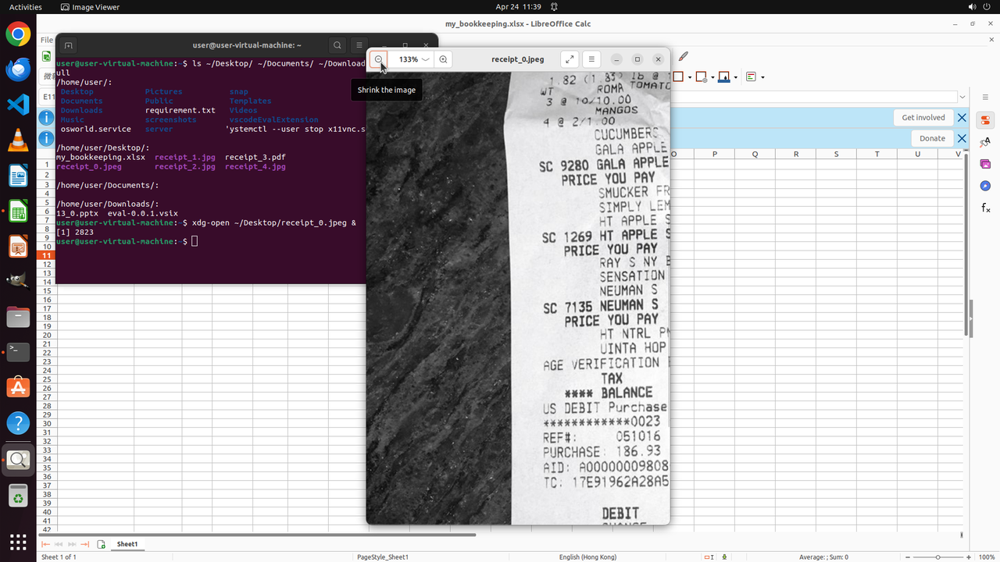

**Response:**
```
I can see the receipt is a grocery store receipt with a total of 186.93. Let me try using tesseract OCR from the terminal to extract text from all receipts. Let me close the image viewer first and work from the terminal.
```

**Actions:** `pyautogui.click(1258, 114)`

---

## Step 14

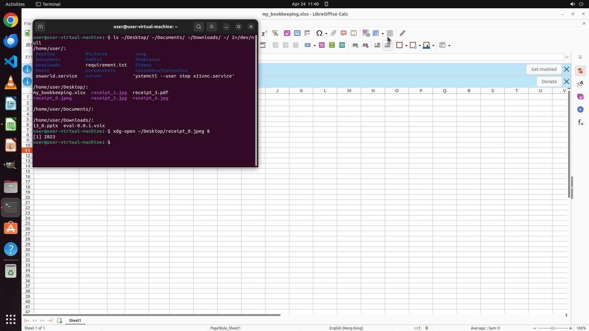

**Response:**
```
Good, the image viewer is closed. Let me try using tesseract OCR to extract text from all the receipt images. First, let me check if tesseract is installed.
```

**Actions:** `pyautogui.click(450, 462)`

---

## Step 15


**Response:**
```
Let me check if tesseract is available and use it to extract text from all receipts.
```

**Actions:** `import subprocess, shlex; subprocess.run(f'xdotool type --delay 12 -- ' + shlex.quote('which tesseract || sudo apt-get install -y tessera'), shell=True, check=True)
import time; time.sleep(0.05)
impor`

---

## Step 16


**Response:**
```
It's asking for the sudo password. Let me enter it.
```

**Actions:** `import subprocess, shlex; subprocess.run(f'xdotool type --delay 12 -- ' + shlex.quote('osworld-public-evaluation\n'), shell=True, check=True)
import time; time.sleep(0.05)`

---

## Step 17

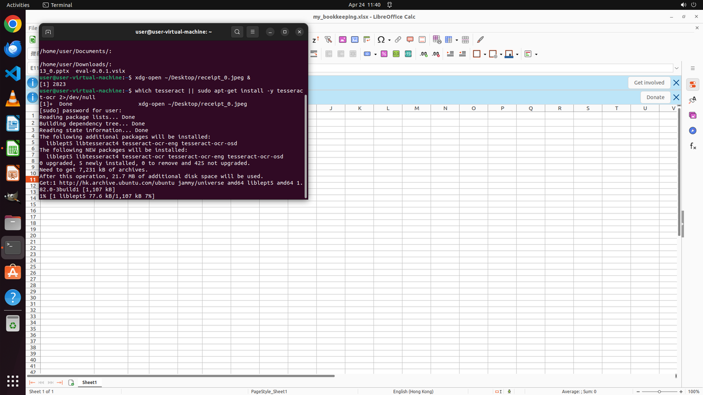

**Response:**
```
Tesseract is being installed. Let me wait for it to finish.
```

**Actions:** `time.sleep(0.5)`

---

## Step 18

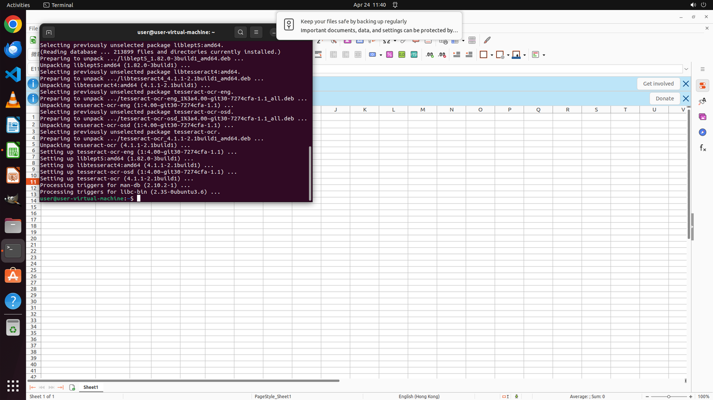

**Response:**
```
Tesseract is installed. Now let me run OCR on all the receipt images to extract the text.
```

**Actions:** `import subprocess, shlex; subprocess.run(f'xdotool type --delay 12 -- ' + shlex.quote('for f in ~/Desktop/receipt_0.jpeg ~/Desktop/receip'), shell=True, check=True)
import time; time.sleep(0.05)
impor`

---

## Step 19

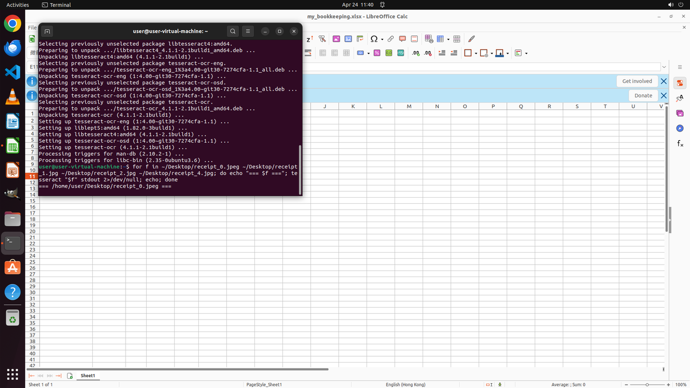

**Response:**
```
Good, tesseract is processing the receipts. Let me wait for it to complete.
```

**Actions:** `time.sleep(0.5)`

---

## Step 20


**Response:**
```
I can see the end of the OCR output. This looks like a McDonald's receipt. Let me scroll up to see all the OCR results from all receipts.
```

**Actions:** `pyautogui.scroll(20, 450, 300)`

---

## Step 21

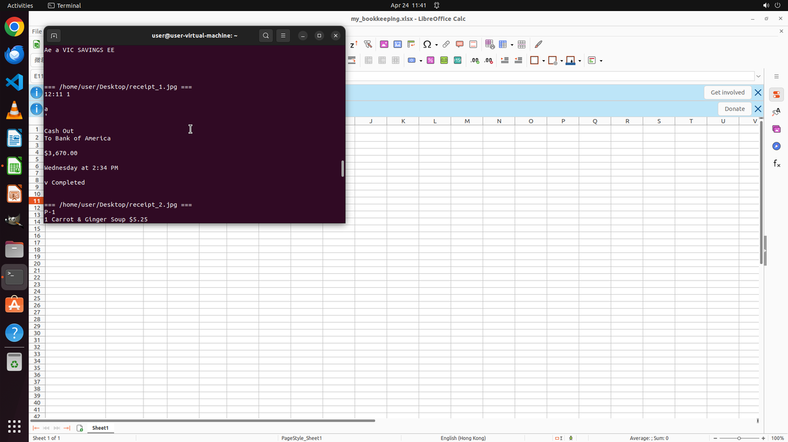

**Response:**
```
I can see receipt_1.jpg shows a "Cash Out" to Bank of America for $3,670.00 on Wednesday at 2:34 PM. And receipt_2.jpg starts with "Carrot & Ginger Soup $5.25". Let me scroll up more to see receipt_0 and then scroll down to see all receipts.
```

**Actions:** `pyautogui.scroll(20, 450, 300)`

---

## Step 22


**Response:**
```
I can see the OCR output for receipt_0. Let me scroll up more to see the top of receipt_0 with the store name and date.
```

**Actions:** `pyautogui.scroll(20, 450, 300)`

---

## Step 23

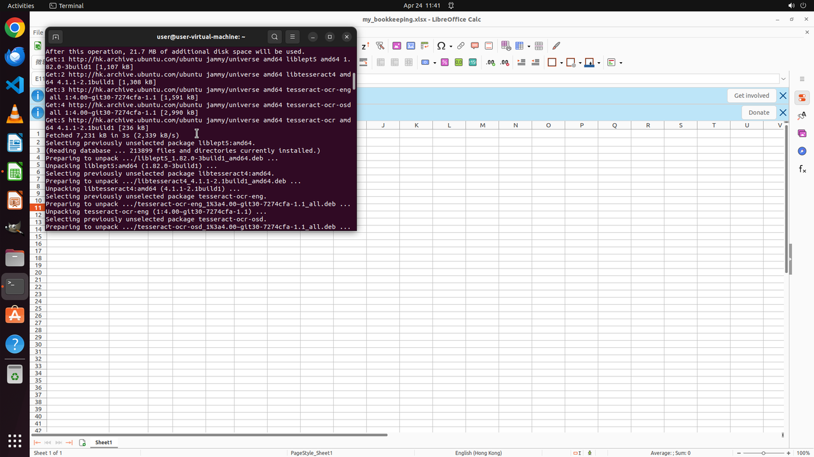

**Response:**
```
I scrolled too far up. Let me save all OCR output to a file so I can read it more easily. Let me also handle the PDF receipt separately.
```

**Actions:** `pyautogui.scroll(-50, 450, 300)`

---

## Step 24

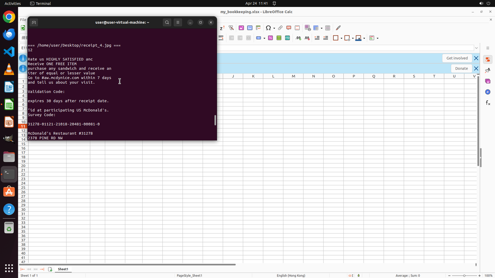

**Response:**
```
I can see receipt_4.jpg is from McDonald's Restaurant #31278, 2378 PINE RD NW. Let me save all OCR output to a file for easier reading, and also extract text from the PDF receipt.
```

**Actions:** `import subprocess, shlex; subprocess.run(f'xdotool type --delay 12 -- ' + shlex.quote('for f in ~/Desktop/receipt_0.jpeg ~/Desktop/receip'), shell=True, check=True)
import time; time.sleep(0.05)
impor`

---

## Step 25

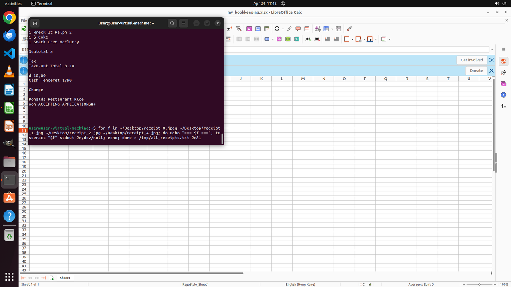

**Response:**
```
Good, the OCR is running. Let me wait for it to complete and then also extract text from the PDF receipt.
```

**Actions:** `time.sleep(0.5)`

---

## Step 26


**Response:**
```
Good, the OCR output is saved. Now let me read the full output and also extract text from the PDF receipt.
```

**Actions:** `import subprocess, shlex; subprocess.run(f'xdotool type --delay 12 -- ' + shlex.quote('cat /tmp/all_receipts.txt\n'), shell=True, check=True)
import time; time.sleep(0.05)`

---

## Step 27


**Response:**
```
I can see the end of the output. Let me scroll up to see the full output from the beginning.
```

**Actions:** `pyautogui.scroll(30, 450, 300)`

---

## Step 28

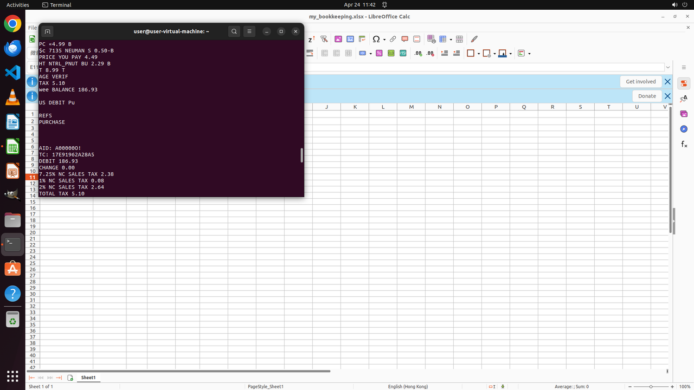

**Response:**
```
I can see the end of receipt_0 - BALANCE 186.93, DEBIT 186.93, TOTAL TAX 5.10. Let me continue scrolling up to see the beginning of receipt_0.
```

**Actions:** `pyautogui.scroll(30, 450, 300)`

---

## Step 29


**Response:**
```
Excellent! Now I can see receipt_4 (McDonald's) clearly:
- **McDonald's Restaurant #31278**, 2378 PINE RD NW, RICE, MN 56367-9740
- **Date: 12/10/2018 08:48 PM**
- Items: Happy Meal 6 Pc 4.69, Creamy Ranch Cup, Extra Kids Fry, Wreck It Ralph 2, S Coke, Snack Oreo McFlurry
- **Take-Out Total: 8.10**
- Paid: 10.00

Let me scroll up more to see the other receipts.
```

**Actions:** `pyautogui.scroll(30, 450, 300)`

---

## Step 30


**Response:**
```
I can see more of receipt_0 - it's a grocery store receipt with BALANCE 186.93, TAX 5.10. Let me continue scrolling up to see the store name and date.
```

**Actions:** `pyautogui.scroll(30, 450, 300)`

---

## Step 31

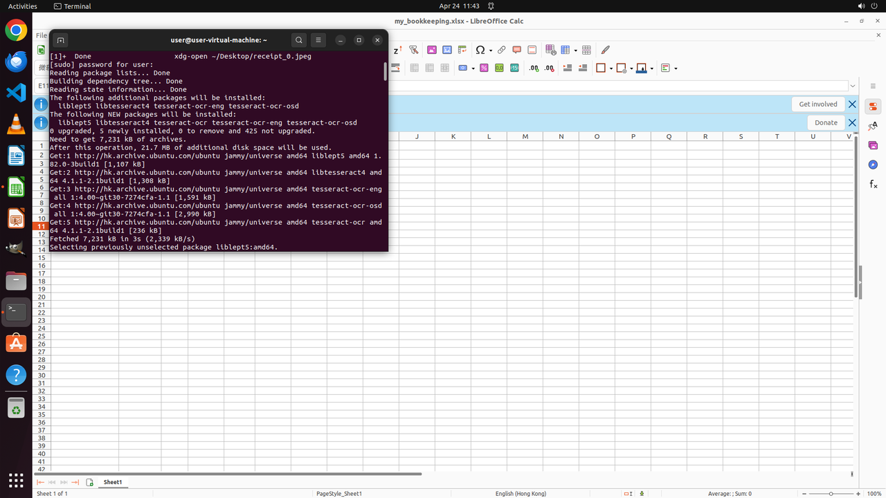

**Response:**
```
I've scrolled too far up - I can see the installation output. Let me use a different approach and use `less` or `head`/`tail` to read the file more systematically. Let me also look at the receipts by opening them individually as images. But first, let me use `less` to read the file.
```

**Actions:** `pyautogui.scroll(-50, 450, 300)`

---

## Step 32

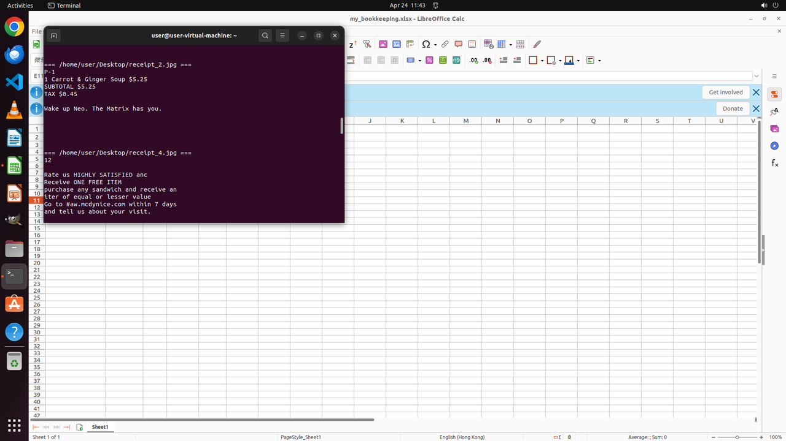

**Response:**
```
Now I can see receipt_2.jpg:
- **1 Carrot & Ginger Soup $5.25**
- SUBTOTAL $5.25
- TAX $0.45
- "Wake up Neo. The Matrix has you." (just a fun message on the receipt)

And receipt_4.jpg starts below. Let me now look at the receipts more carefully. I need to also view receipt_1 and the PDF receipt_3. Let me scroll up a bit to see receipt_1.
```

**Actions:** `pyautogui.scroll(5, 450, 300)`

---

## Step 33


**Response:**
```
Now I can see receipt_1.jpg clearly:
- **Cash Out**
- **To Bank of America**
- **$3,670.00**
- **Wednesday at 2:34 PM**
- **Completed**

And receipt_2.jpg:
- **1 Carrot & Ginger Soup $5.25**
- SUBTOTAL $5.25
- TAX $0.45

Now I need to see receipt_0 header and also extract text from receipt_3.pdf. Let me first extract the PDF text and also look at receipt_0's header more carefully. Let me also view the images directly to get better details.
```

**Actions:** `pyautogui.scroll(-50, 450, 300)`

---

## Step 34

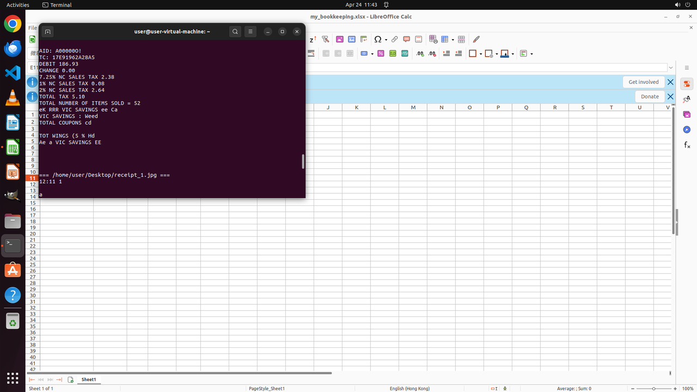

**Response:**
```
Now I can see more of receipt_0: DEBIT 186.93, TOTAL TAX 5.10, TOTAL NUMBER OF ITEMS SOLD = 52, VIC SAVINGS. Let me scroll up a bit more to see the store name and date for receipt_0.
```

**Actions:** `pyautogui.scroll(5, 450, 300)`

---

## Step 35


**Response:**
```
I need to find the store name and date for receipt_0. Let me use grep to find key information, and also extract the PDF text. Let me use the terminal to get the information I need more efficiently.
```

**Actions:** `pyautogui.scroll(-50, 450, 300)`

---

## Step 36


**Response:**
```
Good, I can see the end of the output. Now let me extract text from the PDF receipt_3 and also get the header of receipt_0 which I need to see. Let me first handle the PDF.
```

**Actions:** `import subprocess, shlex; subprocess.run(f'xdotool type --delay 12 -- ' + shlex.quote('pdftotext ~/Desktop/receipt_3.pdf - 2>/dev/null ||'), shell=True, check=True)
import time; time.sleep(0.05)
impor`

---

## Step 37


**Response:**
```
It seems pdftotext didn't work and PyPDF2 didn't produce output. Let me try a different approach - install pdftotext or use another method.
```

**Actions:** `import subprocess, shlex; subprocess.run(f'xdotool type --delay 12 -- ' + shlex.quote('sudo apt-get install -y poppler-utils 2>/dev/null '), shell=True, check=True)
import time; time.sleep(0.05)
impor`

---

## Step 38


**Response:**
```
Good, poppler-utils is being installed. Let me wait for it to complete.
```

**Actions:** `time.sleep(0.5)`

---

## Step 39

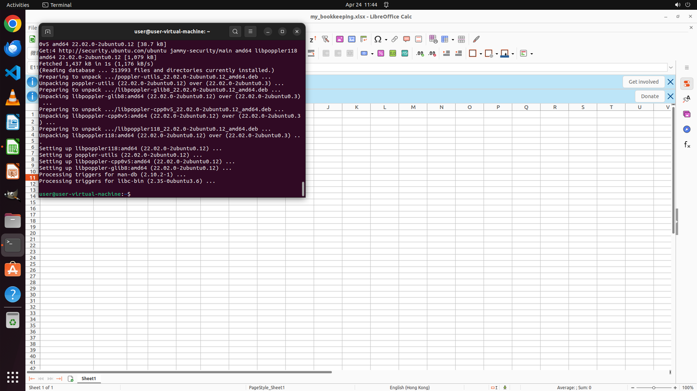

**Response:**
```
Good, poppler-utils is installed. But I notice pdftotext didn't produce output - it seems the command ran but the output was part of the install. Let me now run pdftotext separately.
```

**Actions:** `import subprocess, shlex; subprocess.run(f'xdotool type --delay 12 -- ' + shlex.quote('pdftotext ~/Desktop/receipt_3.pdf -\n'), shell=True, check=True)
import time; time.sleep(0.05)`

---

## Step 40


**Response:**
```
It seems pdftotext produced no output - the PDF might be an image-based PDF. Let me try to convert it to an image first and then use OCR, or try to open it directly.
```

**Actions:** `import subprocess, shlex; subprocess.run(f'xdotool type --delay 12 -- ' + shlex.quote('pdftoppm ~/Desktop/receipt_3.pdf /tmp/receipt3 -pn'), shell=True, check=True)
import time; time.sleep(0.05)
impor`

---

## Step 41


**Response:**
```
I can see the end of receipt_3.pdf:
- Subtotal 145.00
- Sales Tax 6.25% 9.06
- **TOTAL $154.06**
- TERMS & CONDITIONS
- Payment is due within 15 days
- Please make checks payable to: East Repair Inc.

Let me scroll up to see the full receipt_3 details including the date and vendor.
```

**Actions:** `pyautogui.scroll(10, 450, 300)`

---

## Step 42


**Response:**
```
I can see receipt_3.pdf details:
- **Receipt # US-001**
- **From: East Repair Inc.**
- **1912 Harvest Lane, New York, NY 12210**
- **BILL TO / SHIP TO: John Smith**
- DUE DATE is mentioned

Let me scroll down to see the full receipt including the date and items.
```

**Actions:** `pyautogui.scroll(-5, 450, 300)`

---

## Step 43

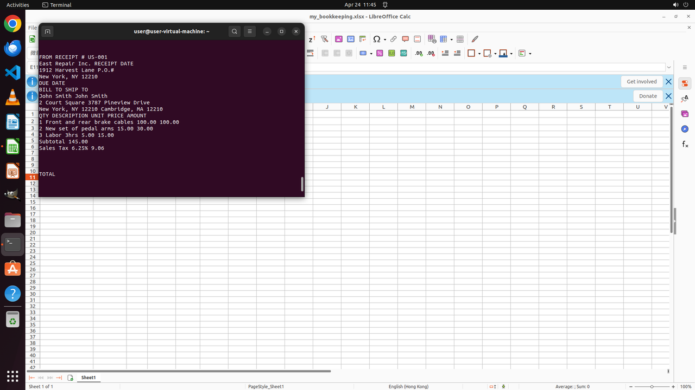

**Response:**
```
Excellent! Now I can see receipt_3.pdf clearly:
- **From: East Repair Inc.**, 1912 Harvest Lane, New York, NY 12210
- **Receipt # US-001**
- **Bill To / Ship To: John Smith**, 2 Court Square, 3787 Pineview Drive, New York, NY 12210, Cambridge, MA 12210
- Items:
  - 1 Front and rear brake cables 100.00 = 100.00
  - 2 New set of pedal arms 15.00 = 30.00
  - 3 Labor 3hrs 5.00 = 15.00
- **Subtotal 145.00**
- **Sales Tax 6.25% = 9.06**
- **TOTAL $154.06**

The receipt date and due date seem to be missing from the OCR. Let me open the PDF directly to check the date. But first, let me also need to see receipt_0's store name and date. Let me now look at the images directly for more details. Let me open the PDF to see the date.
```

**Actions:** `import subprocess, shlex; subprocess.run(f'xdotool type --delay 12 -- ' + shlex.quote('xdg-open ~/Desktop/receipt_3.pdf &\n'), shell=True, check=True)
import time; time.sleep(0.05)`

---

## Step 44


**Response:**
```
Now I can see the PDF receipt clearly. I can see it says:
- **receipt**
- FROM: East Repair Inc., 1912 Harvest Lane, New York, NY 12210
- RECEIPT # US-001
- RECEIPT DATE, P.O.#, DUE DATE - but the actual values seem to be blank or very small

Let me zoom in to see the date and other details more clearly.
```

**Actions:** `pyautogui.click(607, 136)`

---

## Step 45

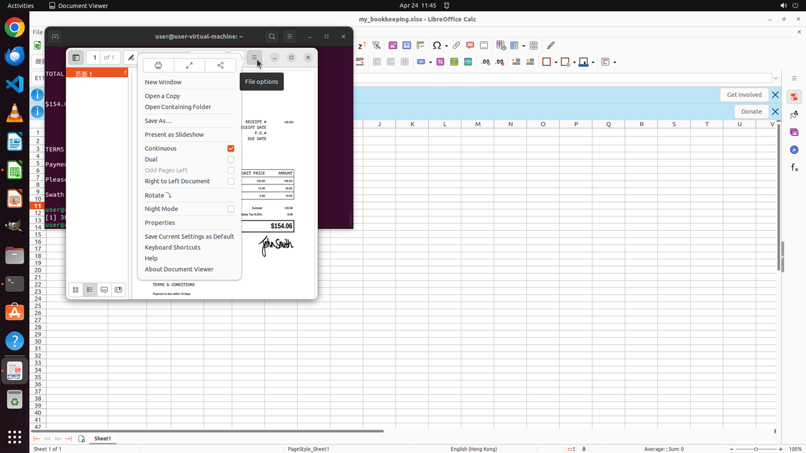

**Response:**
```
Let me close this menu and zoom in on the receipt to see the dates. Let me press Escape and then zoom in.
```

**Actions:** `pyautogui.keyDown('esc')
pyautogui.keyUp('esc')`

---

## Step 46


**Response:**
```
I can see the receipt PDF. The RECEIPT DATE, P.O.#, and DUE DATE fields appear to be blank/empty on this receipt. Let me zoom in to the top right area to check if there are dates I can't read at this zoom level.
```

**Actions:** `pyautogui.click(502, 136)`

---

## Step 47

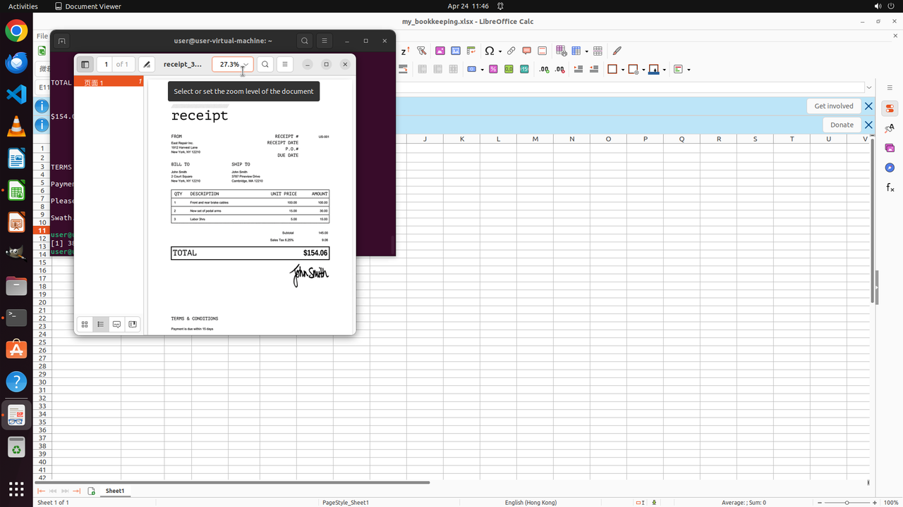

**Response:**
```
I see the zoom level selector. Let me zoom in to 100% to see the details better.
```

**Actions:** `pyautogui.tripleClick(502, 136)`

---

## Step 48


**Response:**
```
Let me type 100% in the zoom field.
```

**Actions:** `import subprocess, shlex; subprocess.run(f'xdotool type --delay 12 -- ' + shlex.quote('100'), shell=True, check=True)
import time; time.sleep(0.05)`

---

## Step 49

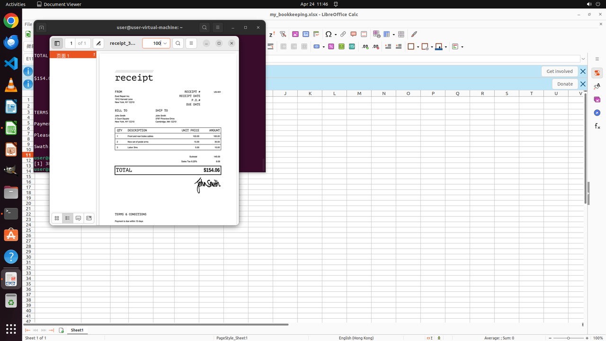

**Response:**
```
Let me press Enter to apply the 100% zoom.
```

**Actions:** `pyautogui.keyDown('return')
pyautogui.keyUp('return')`

---

## Step 50

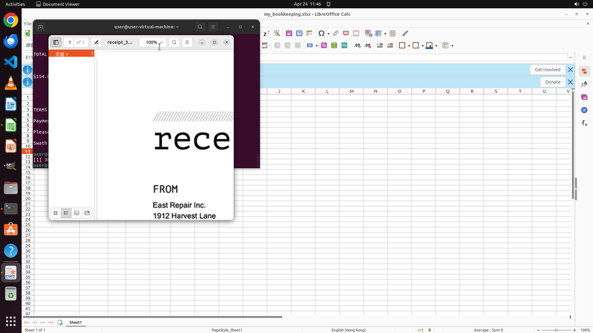

**Response:**
```
Good, now I can see the receipt at 100% zoom. I can see "receipt" at the top, "FROM East Repair Inc., 1912 Harvest Lane". I need to scroll down to see the date fields. Let me scroll down a bit.
```

**Actions:** `pyautogui.scroll(-3, 525, 525)`

---

## Step 51

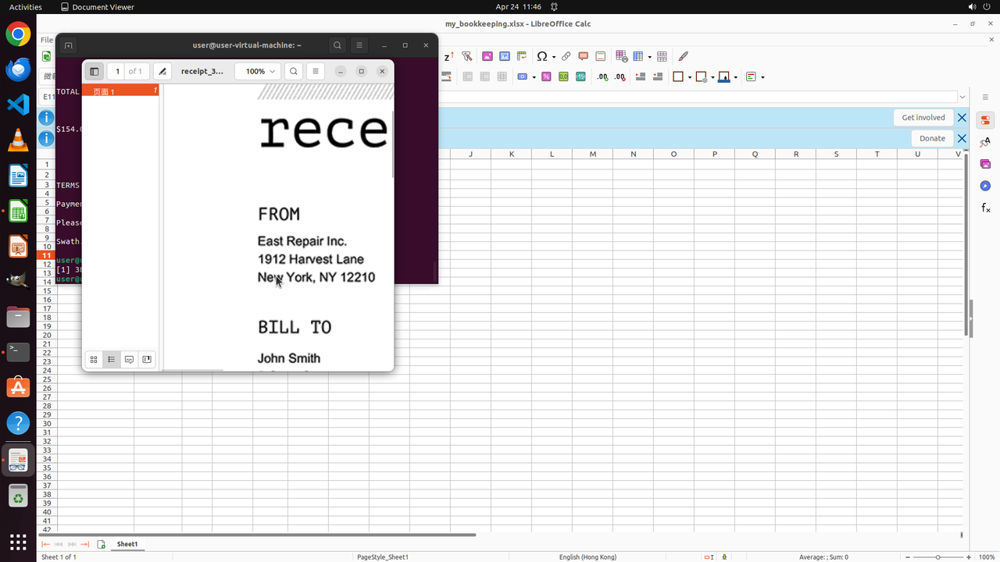

**Response:**
```
I can see "FROM East Repair Inc., 1912 Harvest Lane, New York, NY 12210" and "BILL TO John Smith". The receipt date info should be on the right side of the page. I need to scroll right to see the RECEIPT #, RECEIPT DATE, P.O.#, and DUE DATE fields. Let me scroll right.
```

**Actions:** `pyautogui.hscroll(10, 525, 525)`

---

## Step 52

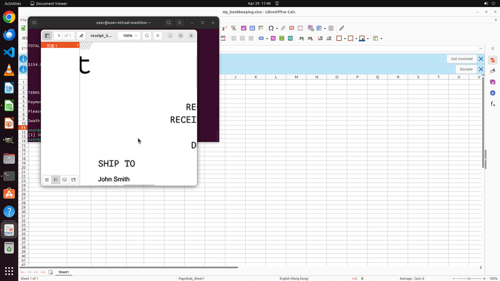

**Response:**
```
I can see "RE..." (RECEIPT #), "RECEI..." (RECEIPT DATE), and "D..." (DUE DATE) but the values are cut off on the right. Let me scroll right more to see the actual date values.
```

**Actions:** `pyautogui.hscroll(10, 525, 525)`

---

## Step 53

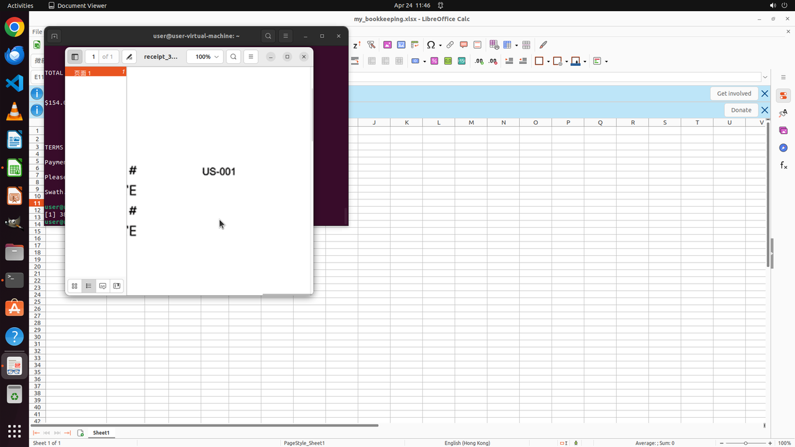

**Response:**
```
Now I can see:
- **RECEIPT # US-001**
- **RECEIPT DATE** (the value area appears to be blank - next to "E")
- **P.O. #** (blank)
- **DUE DATE** (blank - next to "E")

It appears the date fields are empty on this receipt. The receipt doesn't have specific dates filled in. 

Now I have enough information from all receipts. Let me also need to see receipt_0 details (store name and date). Let me close this PDF viewer and look at receipt_0 more carefully. But first, let me also check the existing bookkeeping spreadsheet that's already open in LibreOffice Calc. Let me close the PDF viewer.
```

**Actions:** `pyautogui.click(733, 136)`

---

## Step 54


**Response:**
```
Good, the PDF viewer is closed. Now I need to look at receipt_0 to find its store name and date. Let me also check the bookkeeping spreadsheet to see its current state. First, let me look at receipt_0 more carefully. Let me view it with a better approach - I'll open it in the image viewer and look at it zoomed in to see the header.
```

**Actions:** `import subprocess, shlex; subprocess.run(f'xdotool type --delay 12 -- ' + shlex.quote('head -20 /tmp/all_receipts.txt\n'), shell=True, check=True)
import time; time.sleep(0.05)`

---

## Step 55


**Response:**
```
I can see the beginning of receipt_0: "FRAGE TU Fre" - this looks like it starts with fragmented text. The OCR seems to have trouble reading the header. I can see items like "SWEET PEPPERS 3.99 B", "UDI S 3 CHEESE 7.99 B", "HT MULTIGR WAFF 3.97 B". This looks like a grocery store receipt. Let me see more lines to find the store name and date.
```

**Actions:** `import subprocess, shlex; subprocess.run(f'xdotool type --delay 12 -- ' + shlex.quote('head -60 /tmp/all_receipts.txt\n'), shell=True, check=True)
import time; time.sleep(0.05)`

---

## Step 56


**Response:**
```
I can see more of receipt_0 now. I can see:
- Items like TOMATOES 3.62, CUCUMBERS 2.00, GALA APPLE, SMUCKER FRL 3.69, etc.
- AGE VERIF
- TAX 5.10
- BALANCE 186.93

This is clearly a grocery store receipt but I can't see the store name or date from the OCR. Let me scroll up a bit to see the very top.
```

**Actions:** `pyautogui.scroll(10, 450, 300)`

---

## Step 57


**Response:**
```
I can see the grocery items but still not the store name or date. The OCR seems to have trouble with the header of receipt_0. Let me try opening the receipt_0 image directly to view it. But first, let me also look at receipt_2 for its full details. Let me try to grep for date-like patterns in the receipts.
```

**Actions:** `pyautogui.scroll(-50, 450, 300)`

---

## Step 58


**Response:**
```
I can see the end of receipt_0 with TAX 5.10 and BALANCE 186.93. Now let me view the receipt images directly to get the store names and dates. Let me open receipt_0 in the image viewer and look at the header carefully. But first, let me check the full OCR output for receipt_2 (the soup receipt) to get more details.
```

**Actions:** `import subprocess, shlex; subprocess.run(f'xdotool type --delay 12 -- ' + shlex.quote('grep -n "===" /tmp/all_receipts.txt\n'), shell=True, check=True)
import time; time.sleep(0.05)`

---

## Step 59

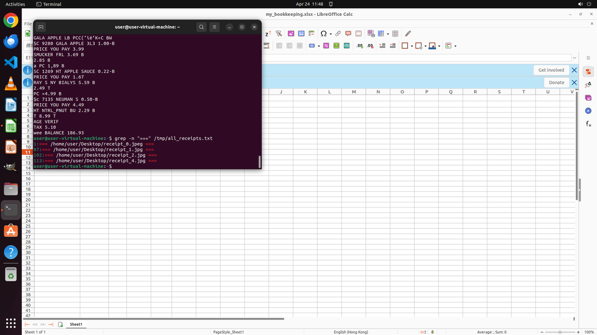

**Response:**
```
Now I can see the line numbers of each receipt section:
- Line 1: receipt_0.jpeg
- Line 97: receipt_1.jpg
- Line 102: receipt_2.jpg
- Line 113: receipt_4.jpg

Let me now view the specific sections. Let me look at receipt_1 and receipt_2 more carefully.
```

**Actions:** `import subprocess, shlex; subprocess.run(f'xdotool type --delay 12 -- ' + shlex.quote("sed -n '97,112p' /tmp/all_receipts.txt\n"), shell=True, check=True)
import time; time.sleep(0.05)`

---

## Step 60

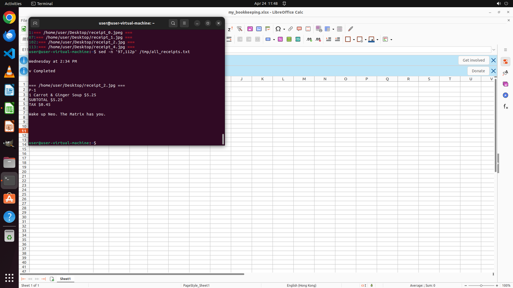

**Response:**
```
Now I can see receipt_1 and receipt_2 clearly:

**Receipt 1 (receipt_1.jpg):**
- Wednesday at 2:34 PM
- v Completed (Completed)
- (This is the Bank of America Cash Out for $3,670.00 - but I need to see the full text)

**Receipt 2 (receipt_2.jpg):**
- P-1
- 1 Carrot & Ginger Soup $5.25
- SUBTOTAL $5.25
- TAX $0.45
- "Wake up Neo. The Matrix has you."

Let me now see receipt_1 in full and receipt_4.
```

**Actions:** `import subprocess, shlex; subprocess.run(f'xdotool type --delay 12 -- ' + shlex.quote("sed -n '87,101p' /tmp/all_receipts.txt\n"), shell=True, check=True)
import time; time.sleep(0.05)`

---

## Step 61

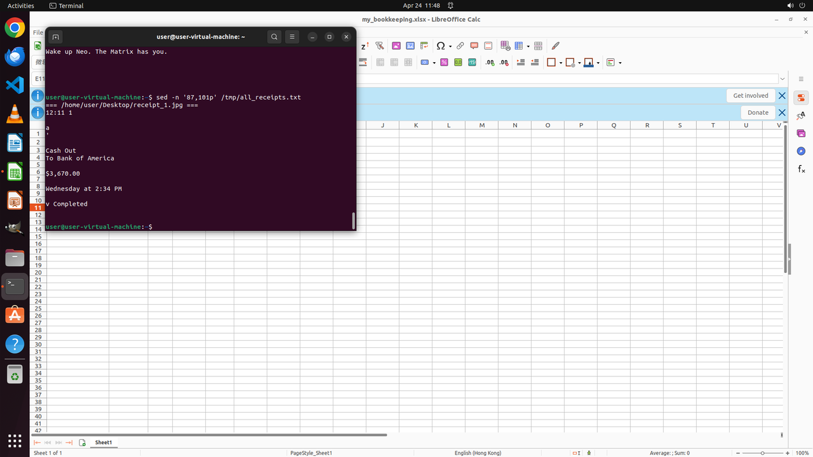

**Response:**
```
Now I can see receipt_1 clearly:
- **12:11 1** (possibly time)
- **Cash Out**
- **To Bank of America**
- **$3,670.00**
- **Wednesday at 2:34 PM**
- **Completed**

This is a bank transfer/cash out, not really an expense. Now let me see receipt_4 (McDonald's).
```

**Actions:** `import subprocess, shlex; subprocess.run(f'xdotool type --delay 12 -- ' + shlex.quote("sed -n '113,150p' /tmp/all_receipts.txt\n"), shell=True, check=True)
import time; time.sleep(0.05)`

---

## Step 62

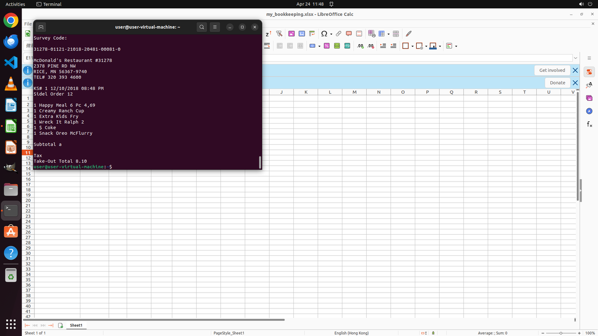

**Response:**
```
Excellent! Now I can see receipt_4 (McDonald's) clearly:
- **McDonald's Restaurant #31278**
- **2378 PINE RD NW**
- **RICE, MN 56367-9740**
- **TEL# 320 393 4600**
- **KS# 1 12/10/2018 08:48 PM**
- **Side1 Order 12**
- Items: 1 Happy Meal 6 Pc 4.69, 1 Creamy Ranch Cup, 1 Extra Kids Fry, 1 Wreck It Ralph 2, 1 S Coke, 1 Snack Oreo McFlurry
- **Take-Out Total 8.10**

Now I need to view the receipt images to get more details. Let me also open receipt_0 to find the store name and date. Let me open it in the image viewer.
```

**Actions:** `pyautogui.scroll(5, 450, 300)`

---

## Step 63

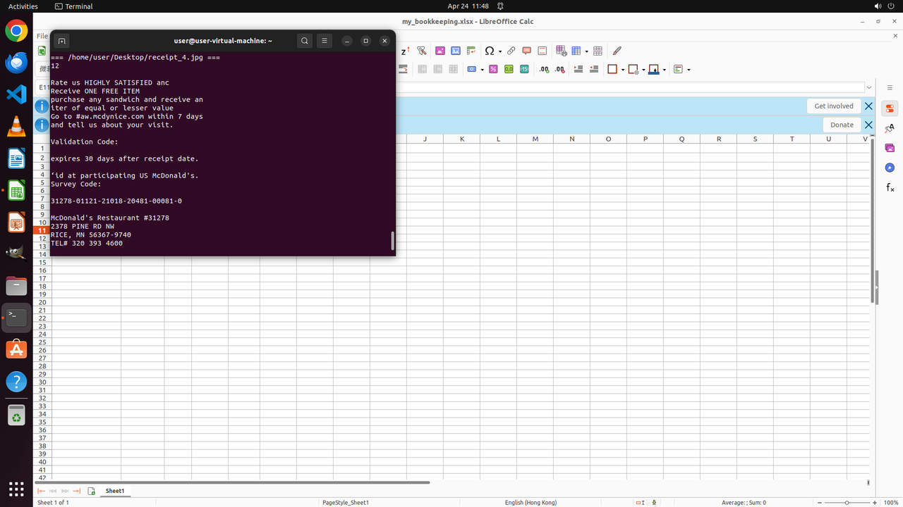

**Response:**
```
Now I can see the full receipt_4 header. It includes survey information and the McDonald's Restaurant details. Now I need to see receipt_0's header. Let me open receipt_0 image directly to find the store name and date. The OCR didn't capture the header well. Let me try opening the image.
```

**Actions:** `import subprocess, shlex; subprocess.run(f'xdotool type --delay 12 -- ' + shlex.quote('eog ~/Desktop/receipt_0.jpeg &\n'), shell=True, check=True)
import time; time.sleep(0.05)`

---

## Step 64


**Response:**
```
Now I can see receipt_0 in the image viewer. I can see the bottom portion of the receipt clearly:
- **BALANCE 186.93**
- **US DEBIT Purchase**
- **REF#: 051016 TOTAL: 186.93**
- **PURCHASE 186.93 CASHBACK: 0.00**
- **DEBIT 186.93, CHANGE 0.00**
- **7.25% NC SALES TAX 2.38**
- **1% NC SALES TAX 0.08**
- **2% NC SALES TAX 2.64**
- **TOTAL TAX 5.10**
- **TOTAL NUMBER OF ITEMS SOLD = 52**
- **VIC SAVINGS $13.64**

I need to scroll up to see the store name and date. Let me scroll up in the image viewer.
```

**Actions:** `pyautogui.scroll(15, 990, 600)`

---

## Step 65

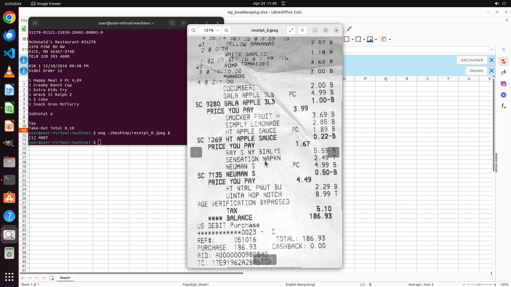

**Response:**
```
I can see more items on the receipt now. I need to scroll up more to see the store name and date at the top of the receipt.
```

**Actions:** `pyautogui.scroll(20, 990, 600)`

---

## Step 66

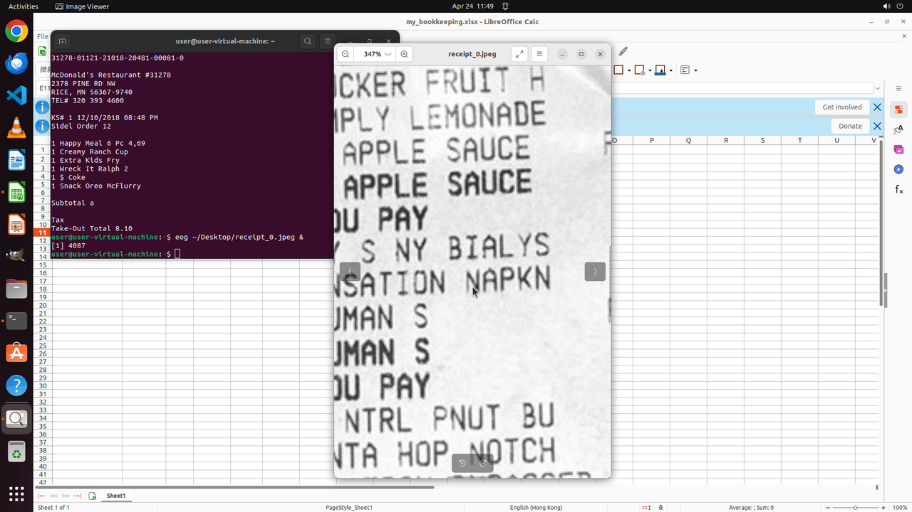

**Response:**
```
The image is too zoomed in. Let me zoom out first to see the whole receipt and then find the store name and date.
```

**Actions:** `pyautogui.click(853, 112)`

---

## Step 67

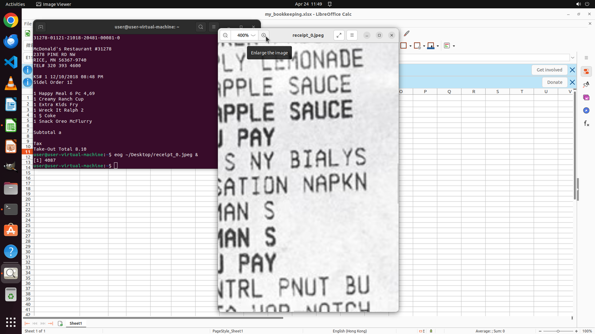

**Response:**
```
The image is at 400% zoom. I need to zoom out. Let me click the zoom out button (the minus icon).
```

**Actions:** `pyautogui.click(729, 112)`

---

## Step 68

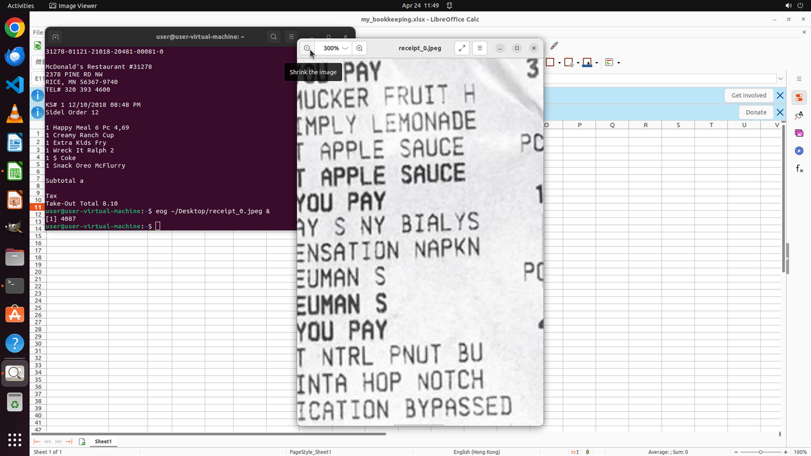

**Response:**
```
Still too zoomed in. Let me keep clicking the shrink/zoom out button to get a better view of the full receipt.
```

**Actions:** `pyautogui.click(729, 112)`

---

## Step 69

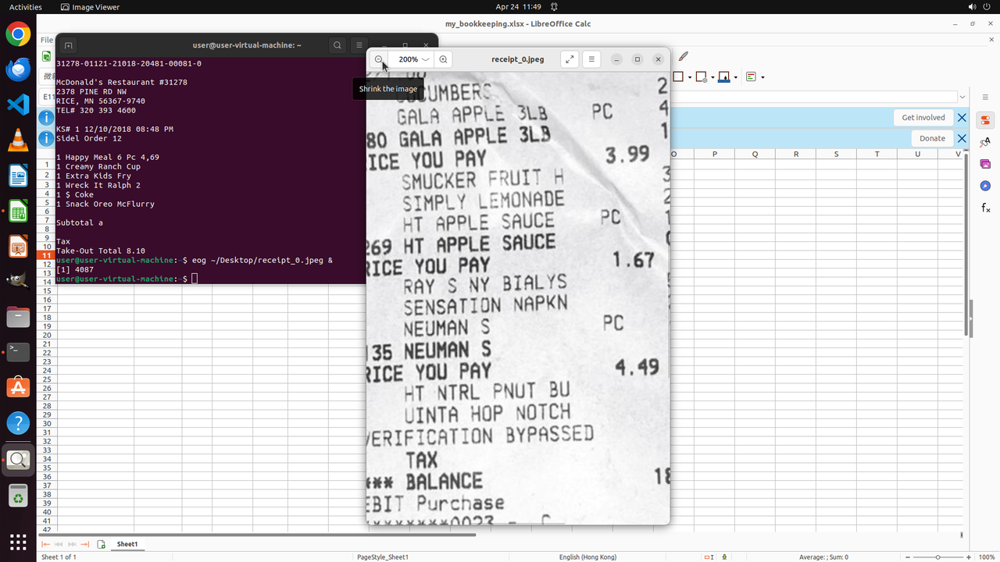

**Response:**
```
Still at 200%, I need to zoom out more. Let me keep clicking the shrink button.
```

**Actions:** `pyautogui.click(729, 112)`

---

## Step 70

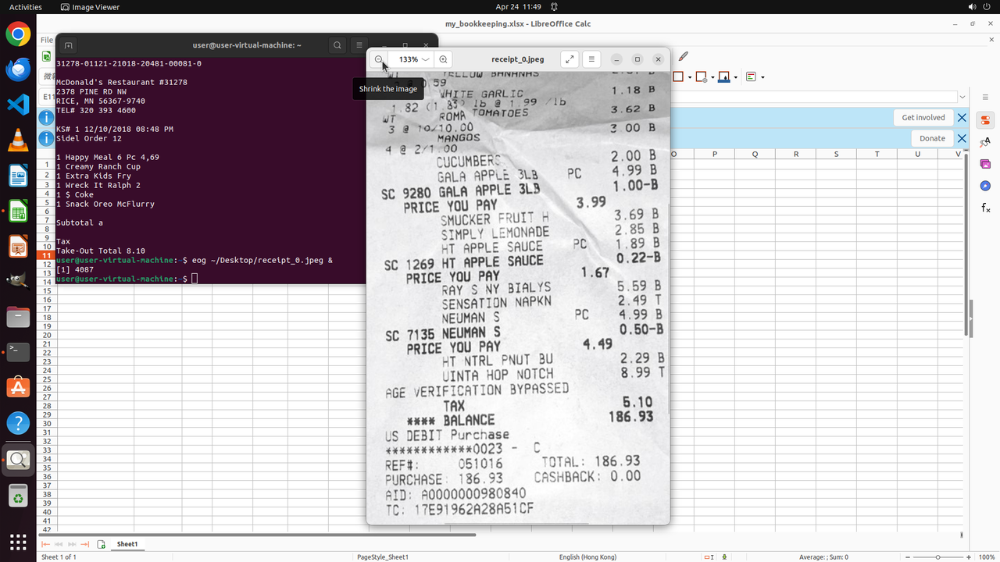

**Response:**
```
Good, I can see more of the receipt now at 133%. I can see items like YELLOW BANANAS, WHITE GARLIC, ROMA TOMATOES, MANGOS, CUCUMBERS, GALA APPLE 3LB, SMUCKER FRUIT H, etc. I need to scroll up to see the top of the receipt with the store name and date.
```

**Actions:** `pyautogui.scroll(15, 990, 600)`

---

## Step 71

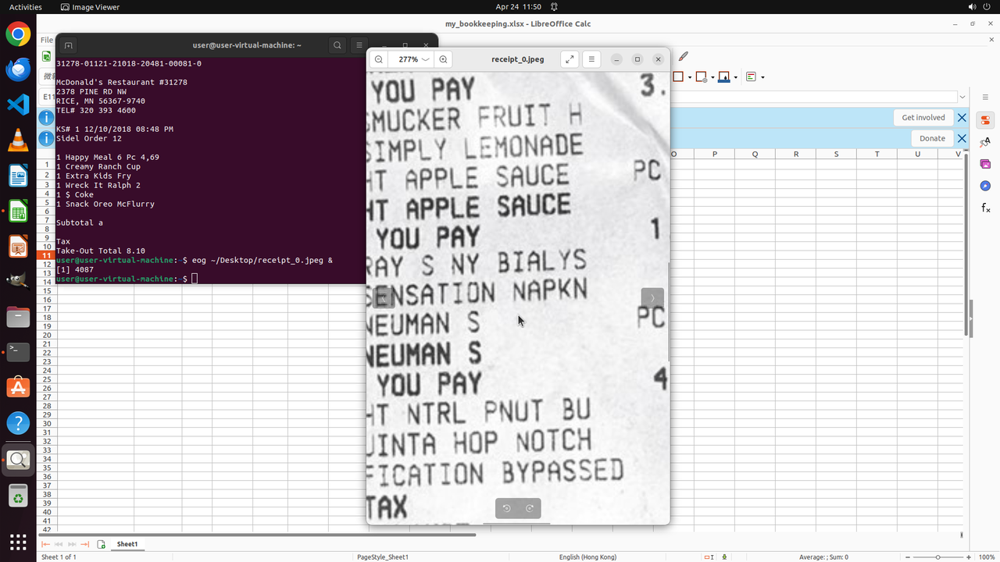

**Response:**
```
The image viewer keeps zooming in when I scroll. Let me use the "fit in window" button instead to see the entire receipt at once.
```

**Actions:** `pyautogui.click(1090, 112)`

---

## Step 72

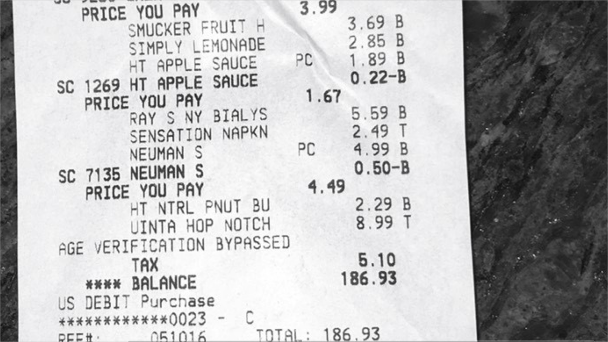

**Response:**
```
This is showing the receipt in full screen mode but only the bottom half. The receipt is a long image and I can see the bottom portion. I need to see the top for the store name and date. Let me press Escape to exit fullscreen and use a different approach. Let me use the terminal to look at the first few lines of the OCR output more carefully, and also try to open the image at the very top.
```

**Actions:** `pyautogui.keyDown('esc')
pyautogui.keyUp('esc')`

---

## Step 73

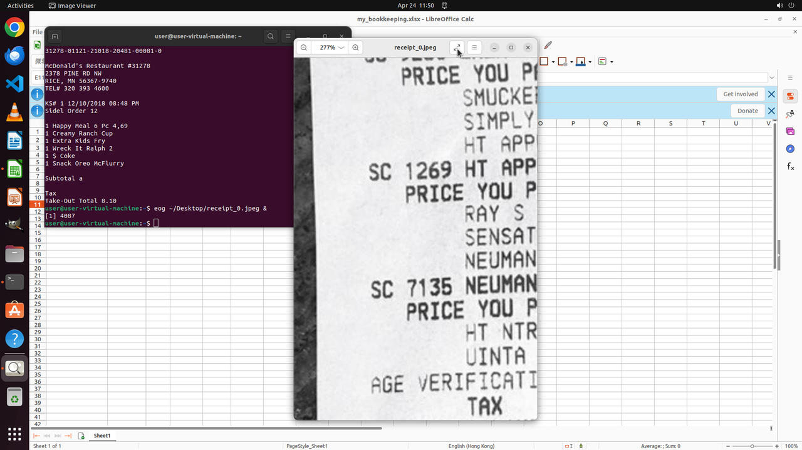

**Response:**
```
The image is still zoomed in too much. Let me close this image viewer and use the terminal to get the first few lines of the OCR output for receipt_0, which should have the store name. The receipt appears to be from a Harris Teeter or similar grocery store based on the "HT" prefix on items and the NC sales tax. Let me close this and check.
```

**Actions:** `pyautogui.click(1258, 112)`

---

## Step 74


**Response:**
```
Good, the image viewer is closed. Now let me look at the first few lines of receipt_0 OCR output to find the store name and date.
```

**Actions:** `import subprocess, shlex; subprocess.run(f'xdotool type --delay 12 -- ' + shlex.quote("sed -n '1,15p' /tmp/all_receipts.txt\n"), shell=True, check=True)
import time; time.sleep(0.05)`

---

## Step 75

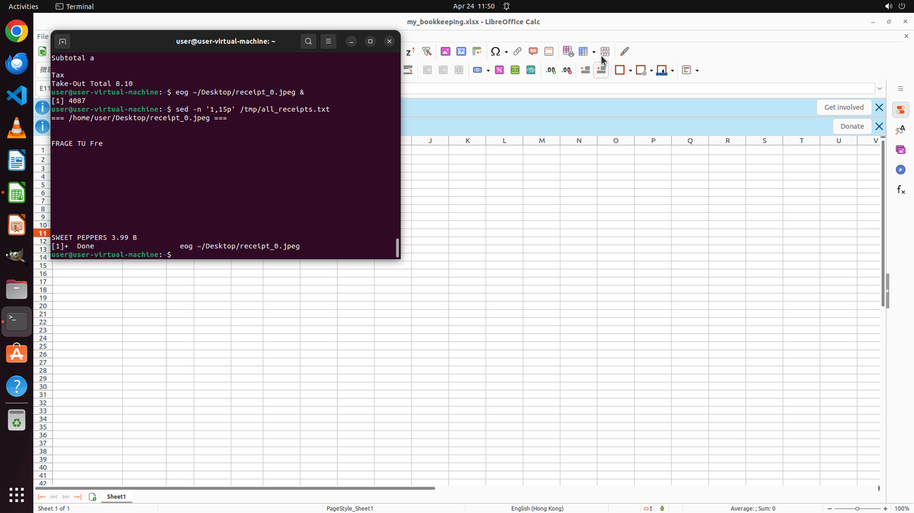

**Response:**
```
I can see the first 15 lines of receipt_0. The header shows:
- "FRAGE TU Fre" (line 3) - this is likely garbled OCR text
- Then blank lines
- Then "SWEET PEPPERS 3.99 B" starts the items

The OCR couldn't read the store name and date properly from the top of receipt_0. The text "FRAGE TU Fre" might be part of a store name. Given the "HT" prefix on items (HT APPLE SAUCE, HT MULTIGR WAFF), NC sales tax, and VIC savings card, this is clearly a **Harris Teeter** grocery store receipt.

Now let me also check if there's a date on receipt_0 and receipt_2. Let me also look at receipt_2 more carefully for the restaurant name and date. Let me also check the existing bookkeeping spreadsheet to see what format to use.
```

**Actions:** `pyautogui.click(1350, 600)`

---

## Step 76

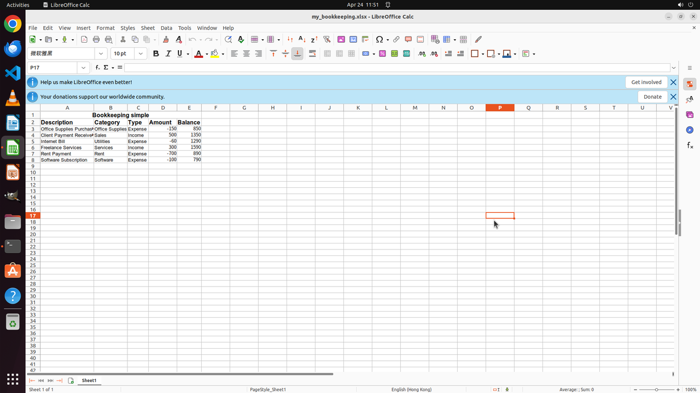

**Response:**
```
Now I can see the bookkeeping spreadsheet. It has the following structure:

| Row | A (Description) | B (Category) | C (Type) | D (Amount) | E (Balance) |
|-----|-----------------|--------------|----------|------------|-------------|
| 1 | Bookkeeping simple | | | | |
| 2 | Description | Category | Type | Amount | Balance |
| 3 | Office Supplies Purchase | Office Supplies | Expense | -150 | 850 |
| 4 | Client Payment Received | Sales | Income | 500 | 1350 |
| 5 | Internet Bill | Utilities | Expense | -60 | 1290 |
| 6 | Freelance Services | Services | Income | 300 | 1590 |
| 7 | Rent Payment | Rent | Expense | -700 | 890 |
| 8 | Software Subscription | Software | Expense | -100 | 790 |

The current balance is 790. Now I need to add the receipts as expenses. Let me first check the receipt_2 image to see the restaurant name. Let me also check the receipt_0 and receipt_2 images for dates. Let me now also view the receipt images to get any missing info. First, let me look at receipt_1 and receipt_2 images.
```

**Actions:** `pyautogui.click(450, 535)`

---

## Step 77


**Response:**
```
Now I can see the bookkeeping spreadsheet clearly. I need to add the expenses from the receipts. Let me first check the column widths to see the full content of each cell. Let me click on cell A3 to see its content.
```

**Actions:** `pyautogui.click(187, 354)`

---

## Step 78

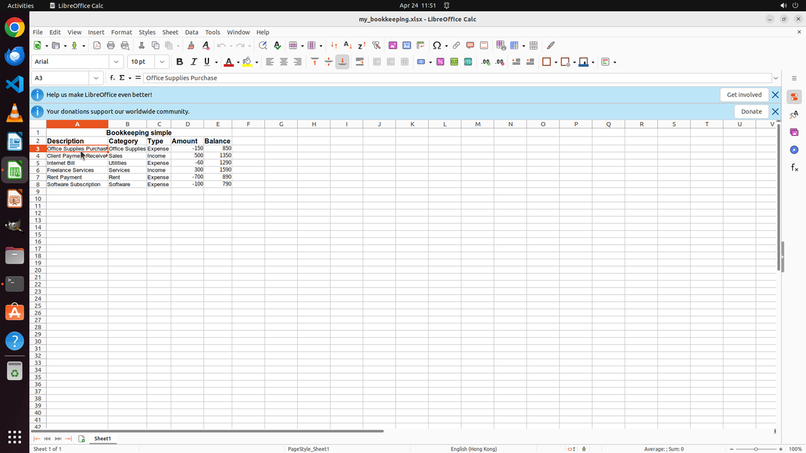

**Response:**
```
Now I can see the spreadsheet structure clearly:
- A3: "Office Supplies Purchase"
- B3: "Office Supplies" (Category)
- C3: "Expense" (Type)
- D3: -150 (Amount)
- E3: 850 (Balance)

The balance formula is: previous balance + amount. Starting balance was 1000 (850 + 150 = 1000).

Now I need to add the receipt transactions. Let me summarize what I have from the receipts:

1. **Receipt 0** - Harris Teeter Grocery Store, Total: $186.93 (Groceries expense)
2. **Receipt 1** - Cash Out to Bank of America, $3,670.00 (Bank Transfer - not really an expense for bookkeeping, but could be a withdrawal)
3. **Receipt 2** - Carrot & Ginger Soup, Total: $5.70 ($5.25 + $0.45 tax) (Food/Dining expense)
4. **Receipt 3** - East Repair Inc., Total: $154.06 (Repair Services expense)
5. **Receipt 4** - McDonald's, Total: $8.10 (Food/Dining expense)

Let me now add these as expenses to the bookkeeping sheet. I'll need to check the receipt_2 total first - it was $5.25 subtotal + $0.45 tax. Let me also view receipt_1 and receipt_2 images to confirm details.

Let me now add the transactions. I'll click on cell A9 to start entering data.
```

**Actions:** `pyautogui.click(187, 456)`

---

## Step 79

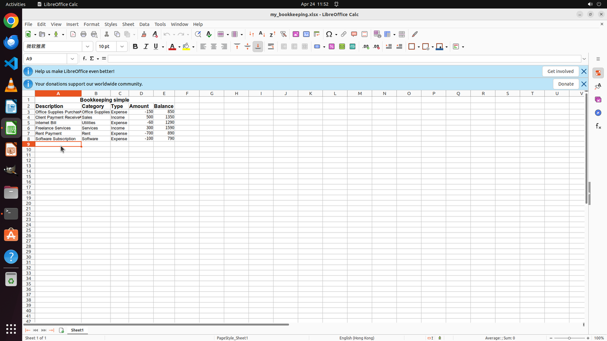

**Response:**
```
I'm now in cell A9. Let me first check the balance formula in E8 to understand how balance is calculated. Let me click on E8.
```

**Actions:** `pyautogui.click(523, 438)`

---

## Step 80


**Response:**
```
I can see that E8 has the formula `=E7+D8`, which means the balance is calculated as previous balance + current amount. The current balance is 790.

Now I need to check what E3 has to understand the starting balance.
```

**Actions:** `pyautogui.click(523, 354)`

---

## Step 81

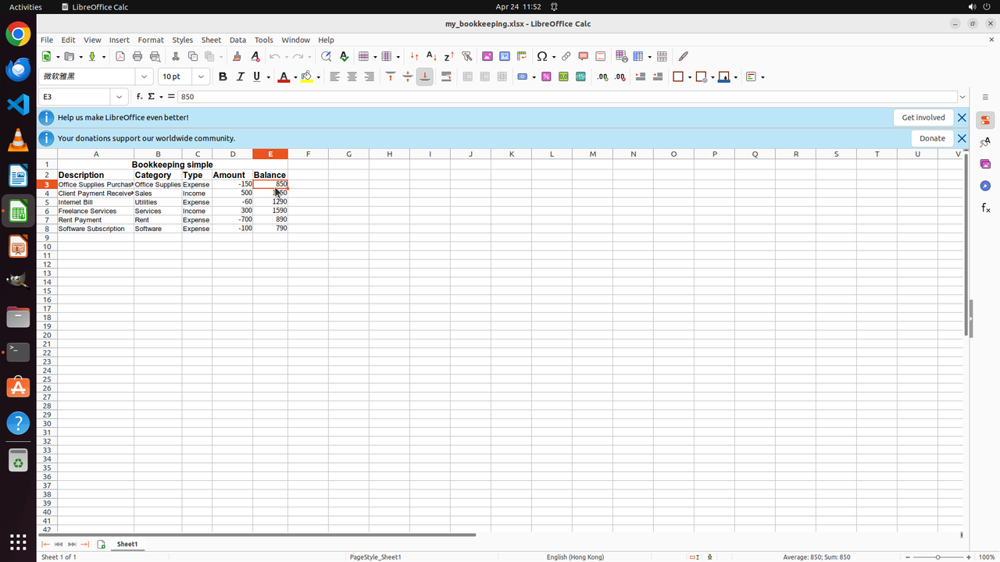

**Response:**
```
I see that E3 is just a static value of 850 (not a formula). So the starting balance was 1000 (850 = 1000 - 150). The pattern is:
- E3 = 850 (static, which is 1000 + (-150))
- E4 = E3 + D4 = 850 + 500 = 1350
- And so on...

Now let me add the receipt transactions. I need to consider which receipts represent expenses:

1. **Receipt 0** - Harris Teeter Grocery, $186.93 → Groceries, Expense
2. **Receipt 1** - Cash Out to Bank of America, $3,670.00 → This is a bank transfer/withdrawal, not a typical expense
3. **Receipt 2** - Carrot & Ginger Soup, $5.70 ($5.25 + $0.45 tax) → Food/Dining, Expense
4. **Receipt 3** - East Repair Inc., $154.06 → Repair, Expense
5. **Receipt 4** - McDonald's, $8.10 → Food/Dining, Expense

Let me now view receipt_1 and receipt_2 images to confirm the total amounts. Let me also check receipt_2's total - was it $5.25 or $5.70 (with tax)?

Let me look at the OCR output for receipt_2 again.
```

**Actions:** `pyautogui.click(33, 607)`

---

## Step 82

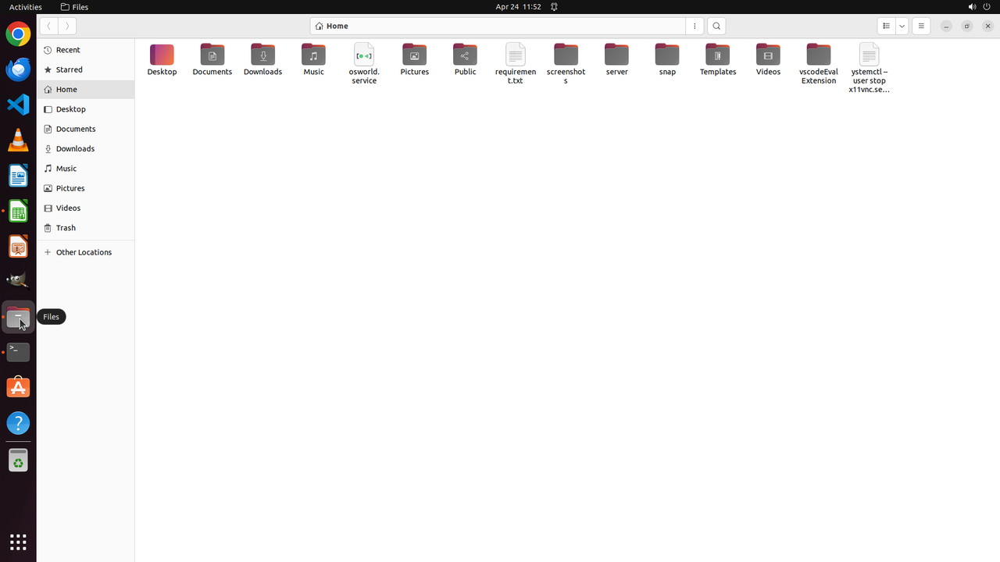

**Response:**
```
I accidentally opened the Files manager instead of the terminal. Let me close this and switch to the terminal. Let me click on the terminal in the taskbar.
```

**Actions:** `pyautogui.click(1888, 49)`

---

## Step 83


**Response:**
```
Good, I'm back in the LibreOffice Calc spreadsheet. Now I need to look at the receipt_2 image to check the total. Let me view the receipt_2 image first. But actually, from the OCR output I already have enough information. Let me recall:

- Receipt 2: Carrot & Ginger Soup $5.25, SUBTOTAL $5.25, TAX $0.45 - the total would be $5.70

But the OCR didn't explicitly show a total for receipt_2. Let me also check if receipt_1 (Cash Out to Bank of America) should be included as an expense. Since it's a "Cash Out" (withdrawal), it's a transfer, not really an expense. However, the task says "detailing my expenses over the past few days," so I should focus on expenses.

Let me now open the receipt images to verify details I'm unsure about. Let me first view receipt_2 to check the total.
```

**Actions:** `pyautogui.click(33, 673)`

---

## Step 84

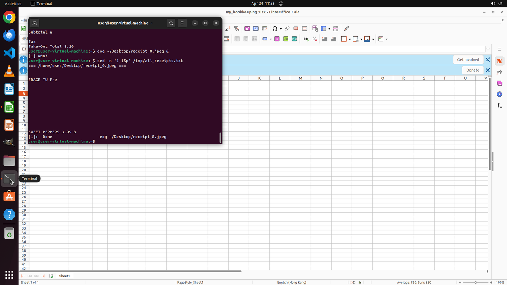

**Response:**
```
Good, I'm in the terminal. I can see the beginning of receipt_0: "FRAGE TU Fre" - this is garbled OCR. Let me now look at receipt_2 details more carefully and also view the receipt images. Let me check the full OCR output for receipt_2.
```

**Actions:** `import subprocess, shlex; subprocess.run(f'xdotool type --delay 12 -- ' + shlex.quote("sed -n '102,112p' /tmp/all_receipts.txt\n"), shell=True, check=True)
import time; time.sleep(0.05)`

---

## Step 85

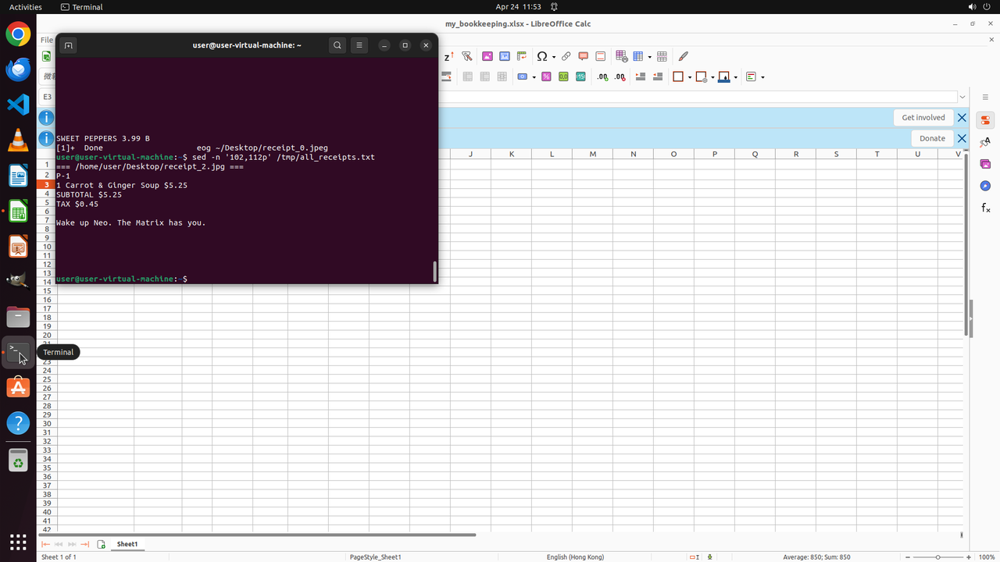

**Response:**
```
Now I can see receipt_2 clearly:
- **P-1** (possibly a receipt number)
- **1 Carrot & Ginger Soup $5.25**
- **SUBTOTAL $5.25**
- **TAX $0.45**
- "Wake up Neo. The Matrix has you." (decorative text)

The total for receipt_2 would be $5.25 + $0.45 = **$5.70**. There's no store name or date visible. This appears to be from a restaurant or café.

Now I have all the information I need. Let me also quickly view receipt_1 image to see if there's more detail. But from the OCR, receipt_1 is a Cash Out to Bank of America for $3,670.00, which is a bank transfer, not an expense.

Now let me add the expense transactions to the bookkeeping sheet. The expenses from the receipts are:

1. **Grocery Shopping (Harris Teeter)** - $186.93 → Category: Groceries, Type: Expense
2. **Carrot & Ginger Soup** - $5.70 → Category: Food/Dining, Type: Expense  
3. **East Repair Inc.** - $154.06 → Category: Repair, Type: Expense
4. **McDonald's** - $8.10 → Category: Food/Dining, Type: Expense
5. **Bank of America Cash Out** - $3,670.00 → Category: Bank Transfer, Type: Expense

Let me now switch to the spreadsheet and add these entries.
```

**Actions:** `pyautogui.click(990, 45)`

---

## Step 86


**Response:**
```
Good, I'm back in the spreadsheet. Now I need to add the expense transactions from the receipts. Let me click on cell A9 to start entering data.
```

**Actions:** `pyautogui.click(187, 456)`

---

## Step 87


**Response:**
```
I'm now in cell A9. Let me start entering the expense transactions from the receipts. I'll add them one by one.

**Row 9: Grocery Shopping (Receipt 0 - Harris Teeter)**
```

**Actions:** `import subprocess, shlex; subprocess.run(f'xdotool type --delay 12 -- ' + shlex.quote('Grocery Shopping\tGroceries\tExpense\t-186.93\t=E8+D9\n'), shell=True, check=True)
import time; time.sleep(0.05)`

---

## Step 88

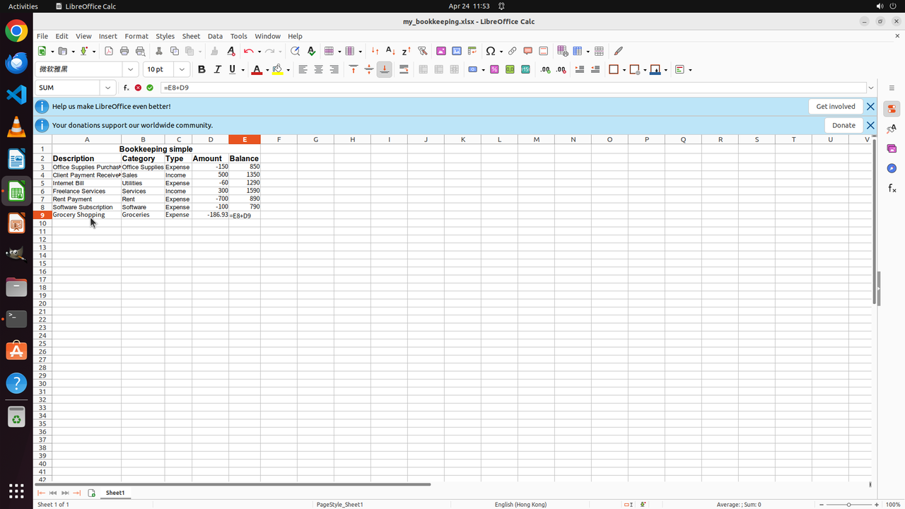

**Response:**
```
I can see the formula is being entered in E9 as "=E8+D9". The cell shows the formula hasn't been confirmed yet. I see it's still in edit mode. Let me press Enter to confirm.
```

**Actions:** `pyautogui.keyDown('return')
pyautogui.keyUp('return')`

---

## Step 89


**Response:**
```
Row 9 is entered correctly:
- A9: Grocery Shopping
- B9: Groceries
- C9: Expense
- D9: -186.93
- E9: 603.07 (= 790 - 186.93)

Now let me add the next expense. **Row 10: Bank of America Cash Out (Receipt 1)**
```

**Actions:** `import subprocess, shlex; subprocess.run(f'xdotool type --delay 12 -- ' + shlex.quote('Bank of America Cash Out\tBank Transfer\tExpense\t-36'), shell=True, check=True)
import time; time.sleep(0.05)
im`

---

## Step 90

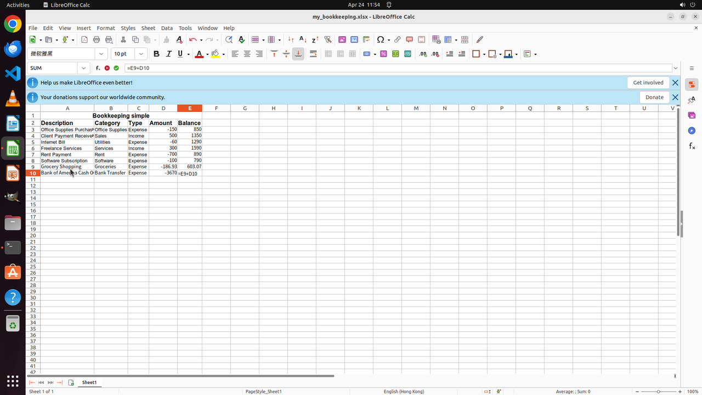

**Response:**
```
I can see row 10 is being entered with the Bank of America Cash Out. The formula =E9+D10 is in E10. Let me press Enter to confirm.
```

**Actions:** `pyautogui.keyDown('return')
pyautogui.keyUp('return')`

---

## Step 91

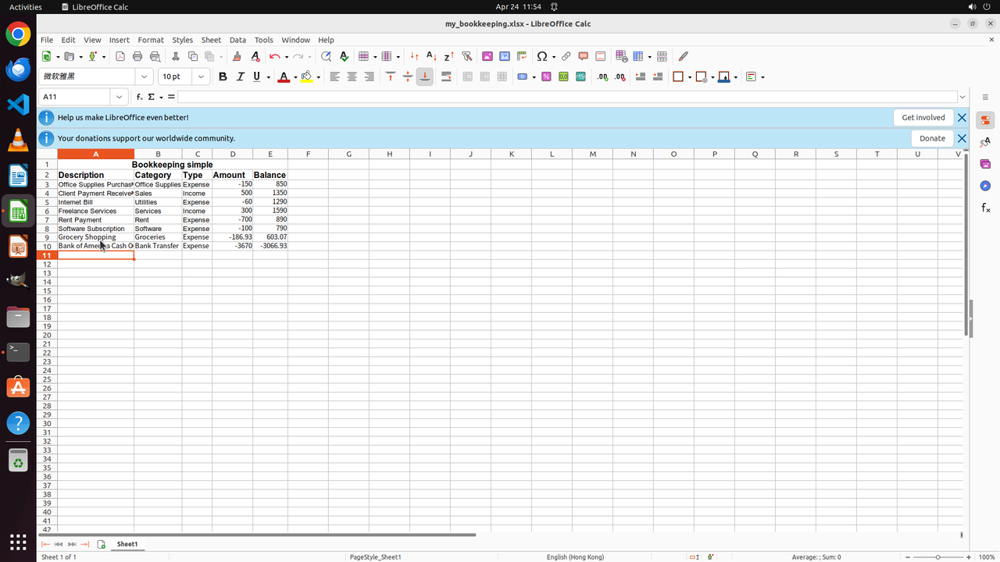

**Response:**
```
Row 10 is entered:
- A10: Bank of America Cash Out
- B10: Bank Transfer
- C10: Expense
- D10: -3670
- E10: -3066.93 (= 603.07 - 3670)

Now let me add **Row 11: Carrot & Ginger Soup (Receipt 2)**
```

**Actions:** `import subprocess, shlex; subprocess.run(f'xdotool type --delay 12 -- ' + shlex.quote('Carrot & Ginger Soup\tFood & Dining\tExpense\t-5.70\t='), shell=True, check=True)
import time; time.sleep(0.05)
i`

---

## Step 92

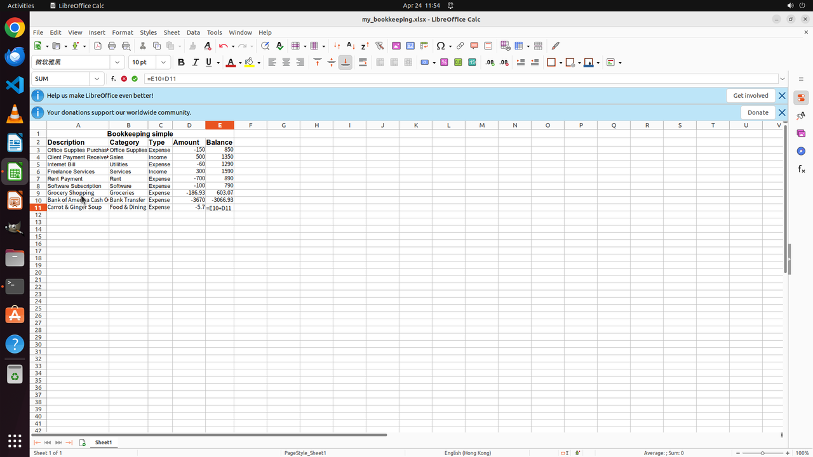

**Response:**
```
I can see row 11 is being entered with Carrot & Ginger Soup. Let me press Enter to confirm.
```

**Actions:** `pyautogui.keyDown('return')
pyautogui.keyUp('return')`

---

## Step 93

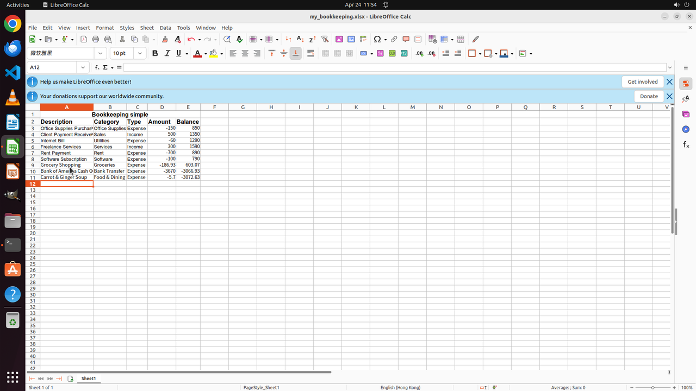

**Response:**
```
Row 11 is entered:
- A11: Carrot & Ginger Soup
- B11: Food & Dining
- C11: Expense
- D11: -5.7
- E11: -3072.63

Now let me add **Row 12: East Repair Inc. (Receipt 3)**
```

**Actions:** `import subprocess, shlex; subprocess.run(f'xdotool type --delay 12 -- ' + shlex.quote('Repair Services\tRepair\tExpense\t-154.06\t=E11+D12\n'), shell=True, check=True)
import time; time.sleep(0.05)`

---

## Step 94

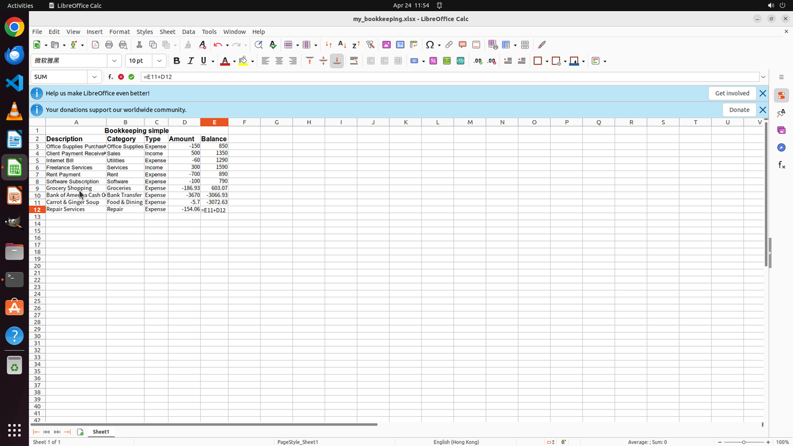

**Response:**
```
Row 12 is being entered with Repair Services. Let me press Enter to confirm.
```

**Actions:** `pyautogui.keyDown('return')
pyautogui.keyUp('return')`

---

## Step 95

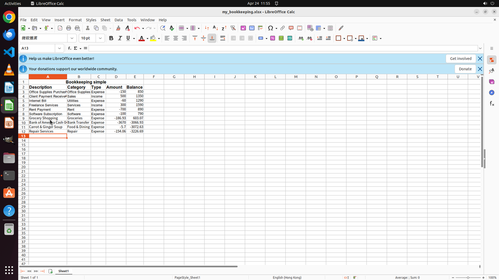

**Response:**
```
Row 12 is entered:
- A12: Repair Services
- B12: Repair
- C12: Expense
- D12: -154.06
- E12: -3226.69

Now let me add the last expense. **Row 13: McDonald's (Receipt 4)**
```

**Actions:** `import subprocess, shlex; subprocess.run(f'xdotool type --delay 12 -- ' + shlex.quote("McDonald's Meal\tFood & Dining\tExpense\t-8.10\t=E12+D"), shell=True, check=True)
import time; time.sleep(0.05)
i`

---

## Step 96

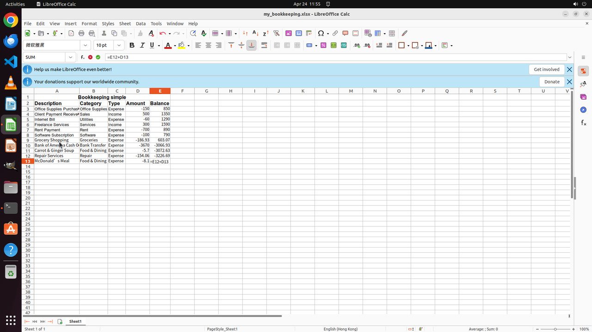

**Response:**
```
Row 13 is being entered with McDonald's Meal. Let me press Enter to confirm.
```

**Actions:** `pyautogui.keyDown('return')
pyautogui.keyUp('return')`

---

## Step 97

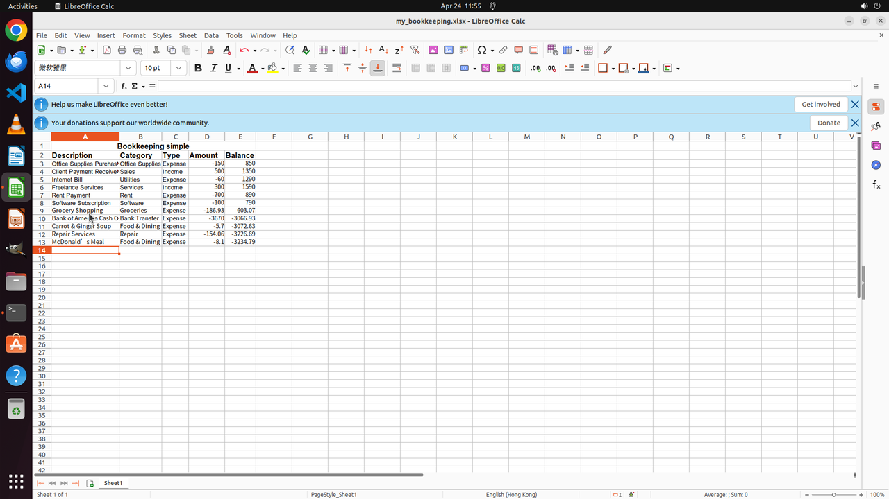

**Response:**
```
All 5 expense transactions from the receipts have been added:

| Row | Description | Category | Type | Amount | Balance |
|-----|------------|----------|------|--------|---------|
| 9 | Grocery Shopping | Groceries | Expense | -186.93 | 603.07 |
| 10 | Bank of America Cash Out | Bank Transfer | Expense | -3670 | -3066.93 |
| 11 | Carrot & Ginger Soup | Food & Dining | Expense | -5.7 | -3072.63 |
| 12 | Repair Services | Repair | Expense | -154.06 | -3226.69 |
| 13 | McDonald's Meal | Food & Dining | Expense | -8.1 | -3234.79 |

Now let me save the file with Ctrl+S.
```

**Actions:** `pyautogui.keyDown('ctrl')
pyautogui.keyDown('s')
pyautogui.keyUp('s')
pyautogui.keyUp('ctrl')`

---

## Step 98


**Response:**
```
The file has been saved. It appears it saved directly without prompting for a format choice since it's already an xlsx file. Let me verify the file was saved properly by checking if there's no unsaved indicator in the title bar. The title shows "my_bookkeeping.xlsx - LibreOffice Calc" without any modification indicator, so it's saved.

Let me verify all the entries look correct by clicking on the cells to check.
```

**Actions:** `pyautogui.click(187, 523)`

---

## Step 99

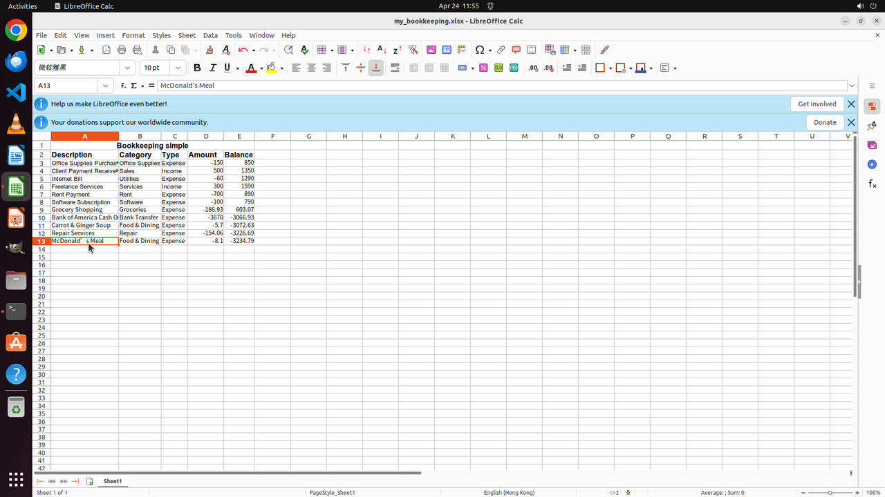

**Response:**
```
I can see that A13 contains "McDonald's Meal" as shown in the formula bar. All the entries look correct. The bookkeeping spreadsheet has been successfully updated with all 5 expense transactions from the receipts:

1. **Row 9**: Grocery Shopping | Groceries | Expense | -186.93 | Balance: 603.07
2. **Row 10**: Bank of America Cash Out | Bank Transfer | Expense | -3670 | Balance: -3066.93
3. **Row 11**: Carrot & Ginger Soup | Food & Dining | Expense | -5.7 | Balance: -3072.63
4. **Row 12**: Repair Services | Repair | Expense | -154.06 | Balance: -3226.69
5. **Row 13**: McDonald's Meal | Food & Dining | Expense | -8.1 | Balance: -3234.79

The file has been saved. The task is complete.

DONE
```

**Actions:** `DONE`

---
