# Task 9219480b-3aed-47fc-8bac-d2cffc5849f7

**Instruction:** Hi, I recently playing with developing a small python-based tetris game. While I have finished most of the part, something is wrong under some cases when I press up to rotate, the whole program will crash, please run the code for me and fix the bugs of code.

**Score:** 1.0

**Wall clock:** 7m 10s

**Steps:** 46

**Cost:** $1.55

---

## Step 1

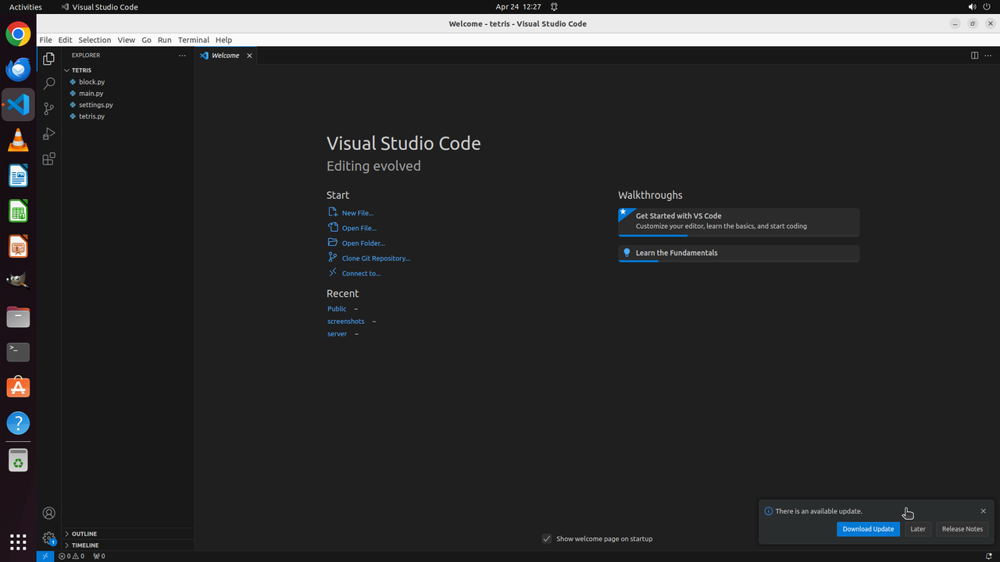

**Response:**
```
I can see a VS Code window with a Tetris project open. Let me first examine the code files to understand the project structure and find the bug related to rotation.
```

**Actions:** `pyautogui.click(177, 156)`

---

## Step 2

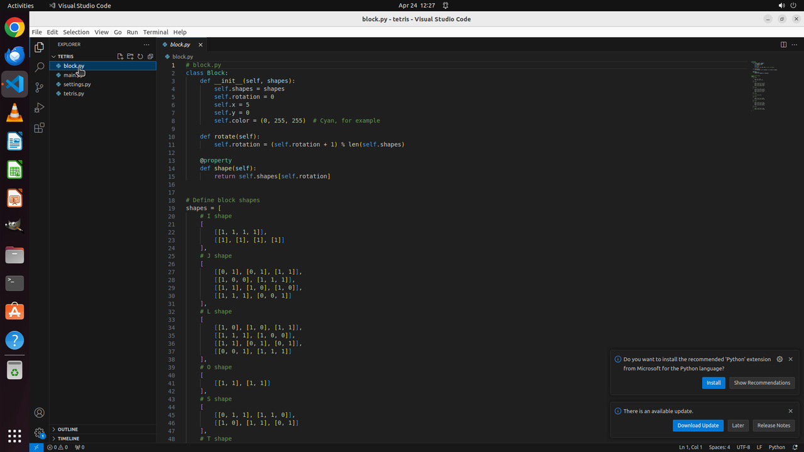

**Response:**
```
I can see the `block.py` file. Let me examine all the files. First, let me dismiss the notifications and read through the code files.
```

**Actions:** `pyautogui.click(1888, 858)`

---

## Step 3

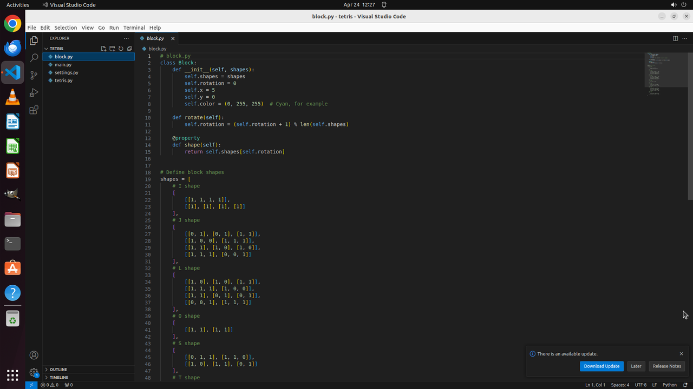

**Response:**
```
Let me dismiss the update notification and then read through all the files. Let me first scroll down to see the rest of block.py.
```

**Actions:** `pyautogui.click(1888, 982)`

---

## Step 4

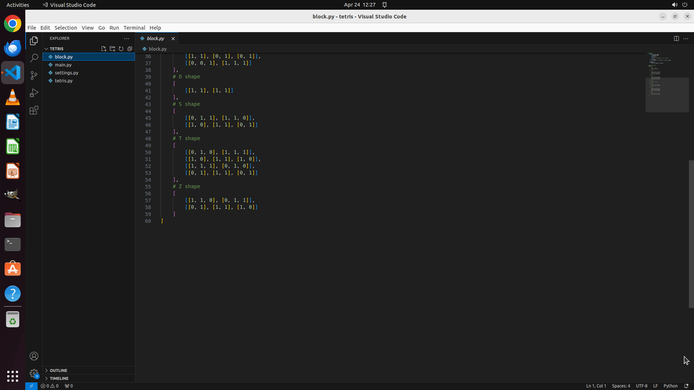

**Response:**
```
I can see the full `block.py` file. Now let me look at the other files. Let me click on `main.py`.
```

**Actions:** `pyautogui.click(175, 178)`

---

## Step 5

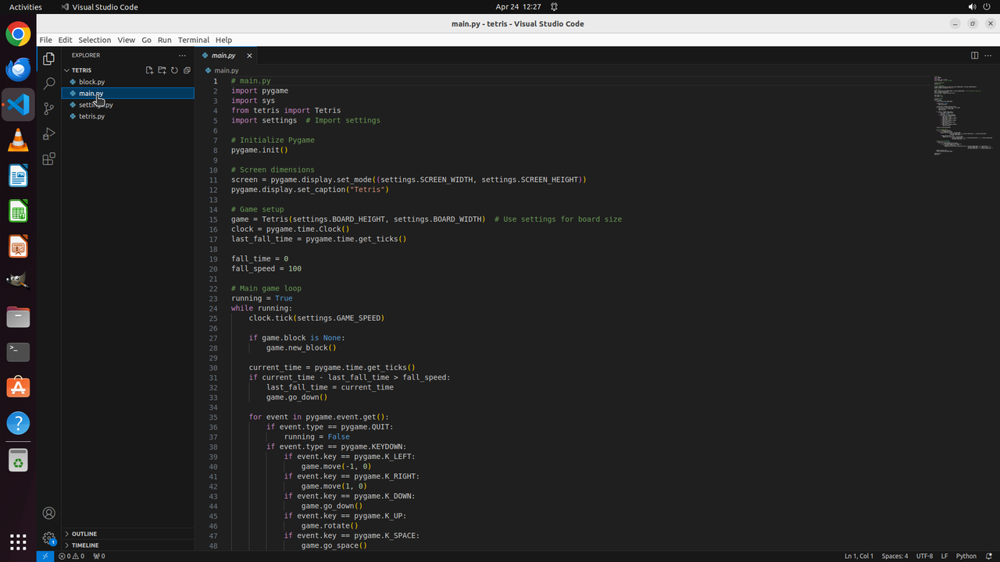

**Response:**
```
I can see `main.py`. Let me scroll down to see the rest of it.
```

**Actions:** `pyautogui.scroll(-5, 960, 600)`

---

## Step 6

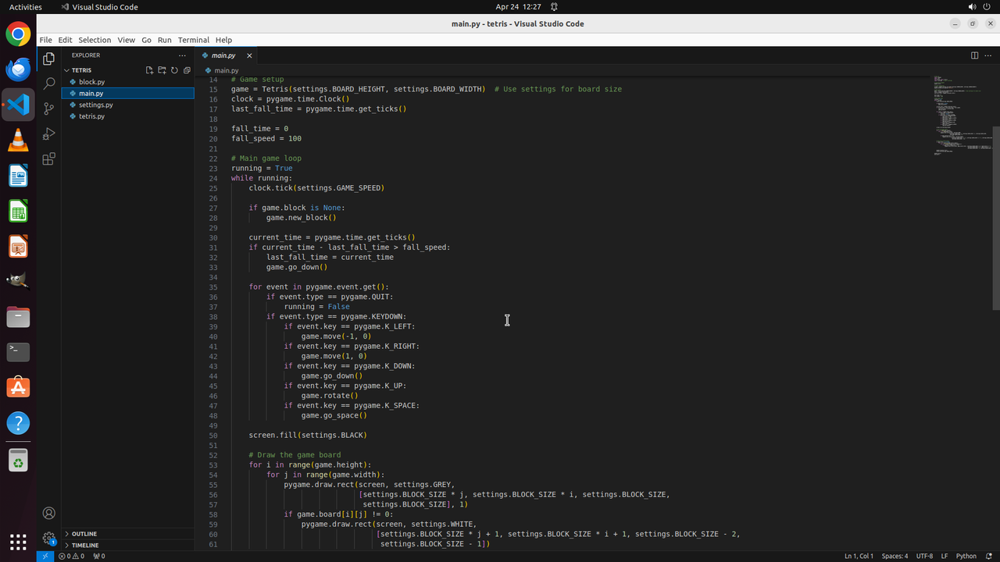

**Response:**
```
Let me continue scrolling to see the rest of main.py.
```

**Actions:** `pyautogui.scroll(-10, 960, 600)`

---

## Step 7

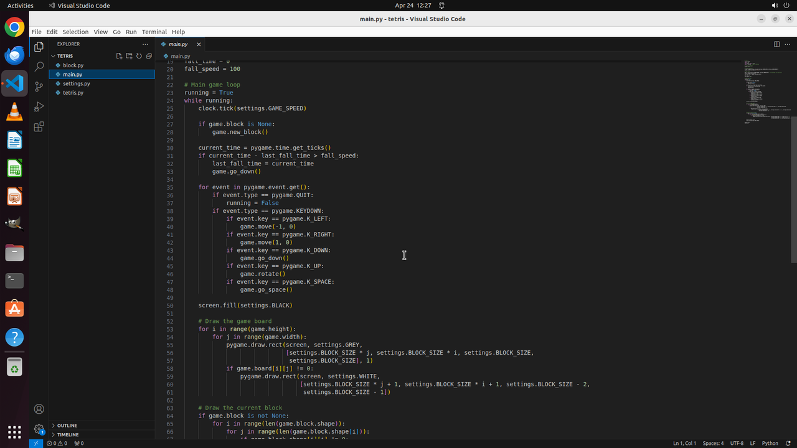

**Response:**
```
Let me continue scrolling to see the rest of main.py.
```

**Actions:** `pyautogui.scroll(-10, 960, 600)`

---

## Step 8

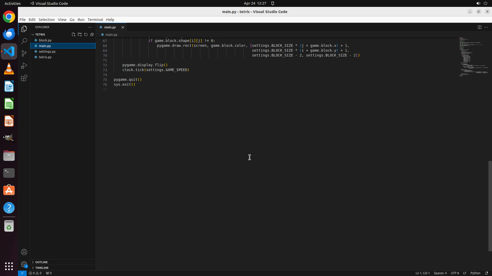

**Response:**
```
Now let me look at the `settings.py` file.
```

**Actions:** `pyautogui.click(183, 201)`

---

## Step 9

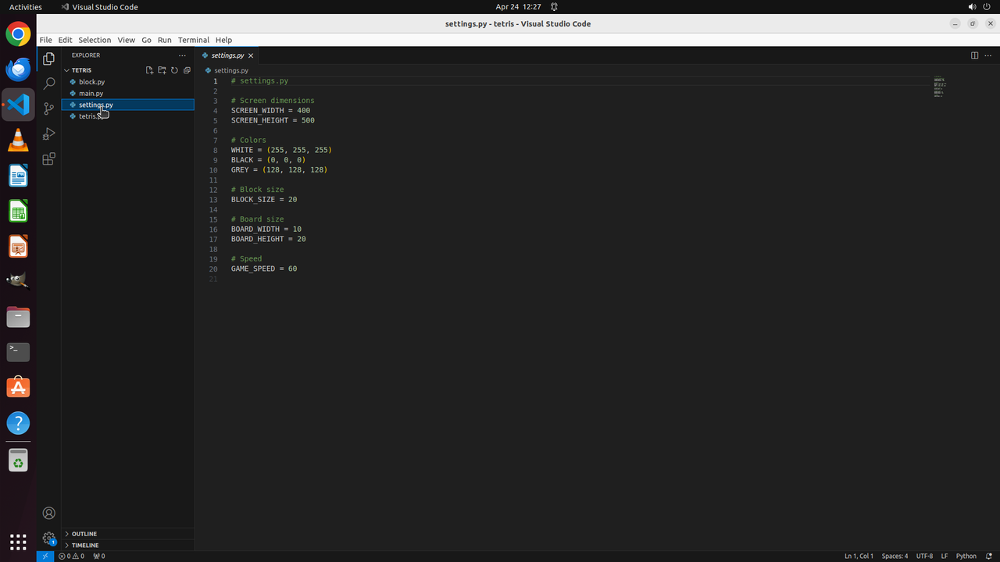

**Response:**
```
Now let me look at the `tetris.py` file.
```

**Actions:** `pyautogui.click(177, 223)`

---

## Step 10

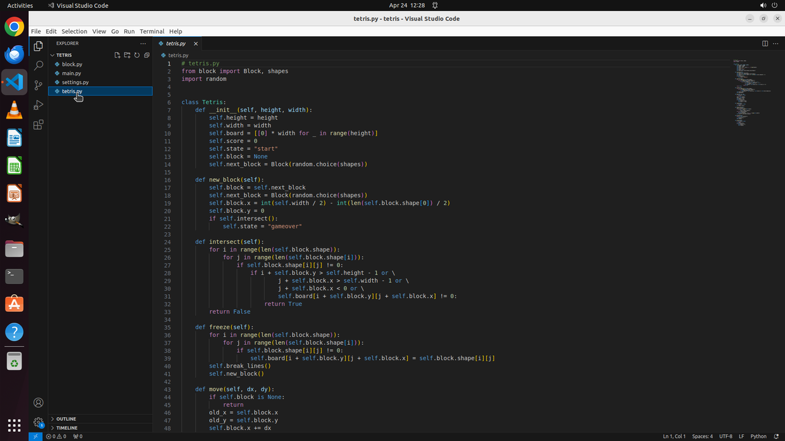

**Response:**
```
Now I can see the `tetris.py` file. Let me scroll down to see the rest of it, particularly the `rotate` method.
```

**Actions:** `pyautogui.scroll(-10, 960, 600)`

---

## Step 11

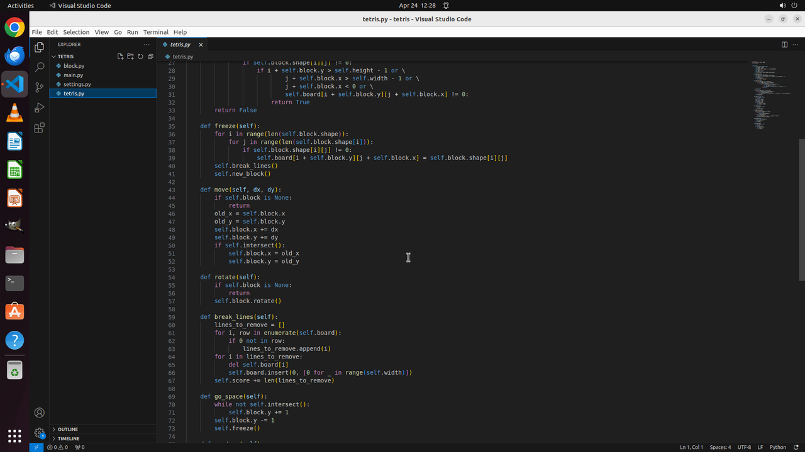

**Response:**
```
Now I can see the `rotate` method in `tetris.py` (lines 54-57). The issue is that the `rotate` method just calls `self.block.rotate()` without checking if the rotated block would intersect with the board boundaries or existing blocks. This would cause an index out of bounds error when the rotated shape extends beyond the board.

Let me first run the code to confirm the bug. Let me open a terminal.
```

**Actions:** `pyautogui.keyDown('ctrl')
pyautogui.keyDown('grave')
pyautogui.keyUp('grave')
pyautogui.keyUp('ctrl')`

---

## Step 12


**Response:**
```
The terminal didn't open. Let me try using the menu.
```

**Actions:** `pyautogui.click(373, 76)`

---

## Step 13

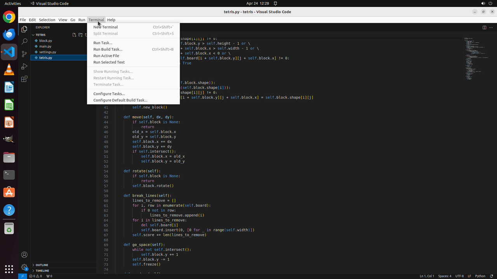

**Actions:** `pyautogui.click(406, 103)`

---

## Step 14

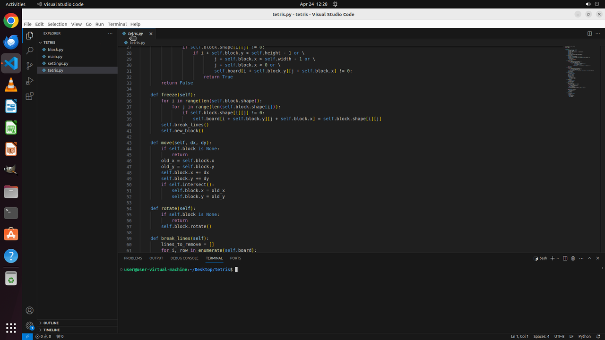

**Response:**
```
Good, I have a terminal open. Let me run the game first to see the error.
```

**Actions:** `pyautogui.click(960, 855)`

---

## Step 15

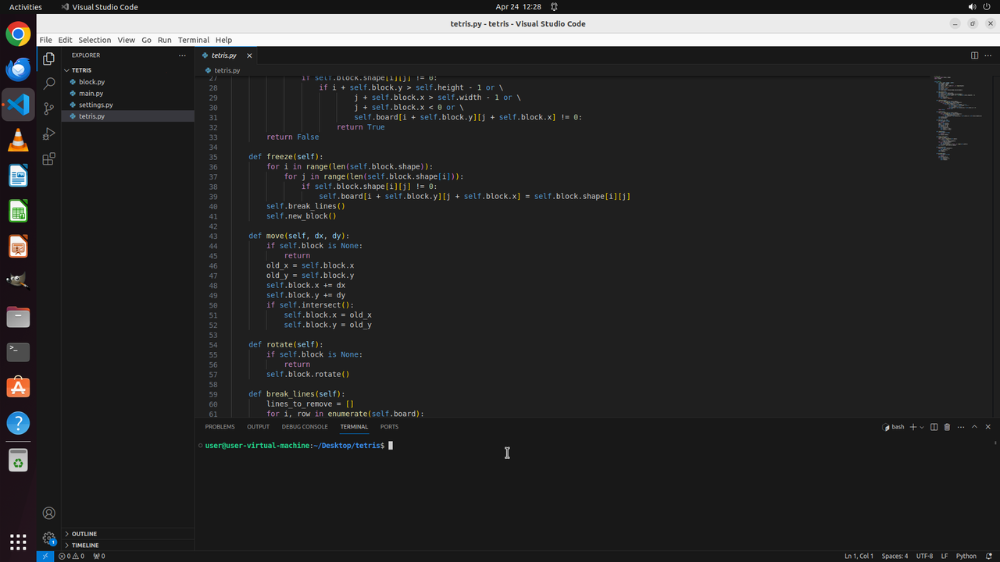

**Response:**
```
Let me run the main.py to see the game and the error.
```

**Actions:** `import subprocess, shlex; subprocess.run(f'xdotool type --delay 12 -- ' + shlex.quote('python3 main.py\n'), shell=True, check=True)
import time; time.sleep(0.05)`

---

## Step 16

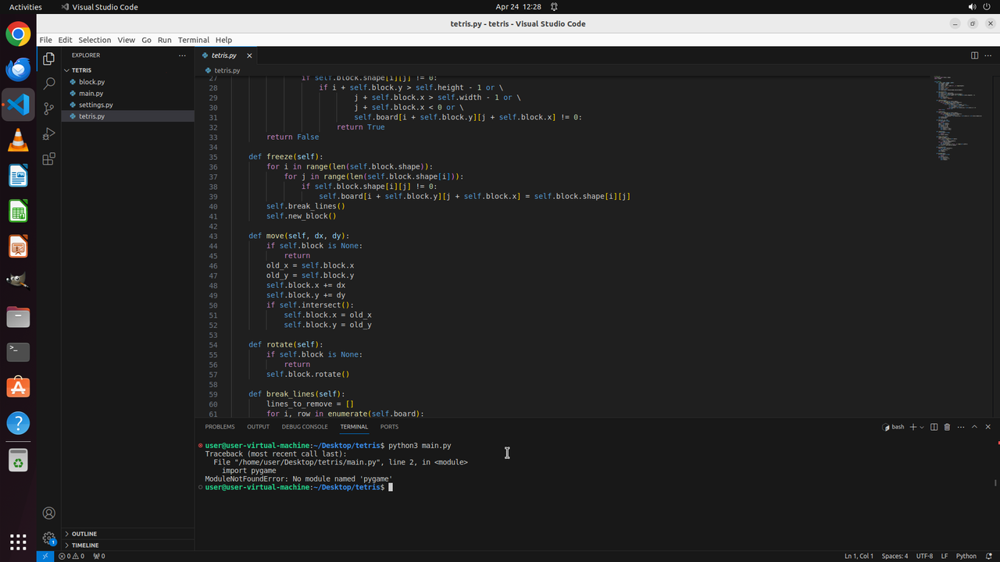

**Response:**
```
I see that `pygame` is not installed. Let me install it first.
```

**Actions:** `import subprocess, shlex; subprocess.run(f'xdotool type --delay 12 -- ' + shlex.quote('pip3 install pygame\n'), shell=True, check=True)
import time; time.sleep(0.05)`

---

## Step 17

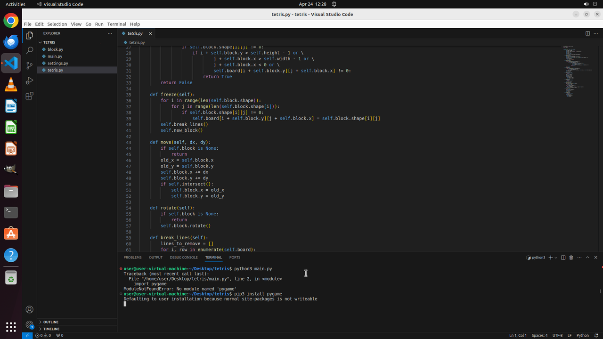

**Response:**
```
Pygame is being installed. Let me wait for it to complete.
```

**Actions:** `time.sleep(0.5)`

---

## Step 18

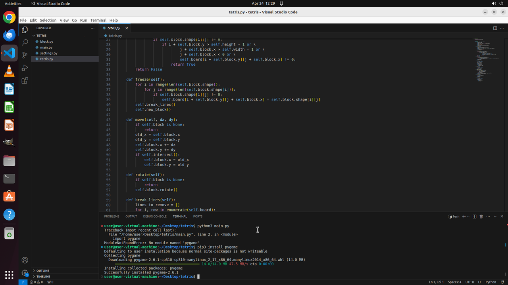

**Response:**
```
Pygame is installed. Now let me run the game to see the error when rotating.
```

**Actions:** `import subprocess, shlex; subprocess.run(f'xdotool type --delay 12 -- ' + shlex.quote('python3 main.py\n'), shell=True, check=True)
import time; time.sleep(0.05)`

---

## Step 19

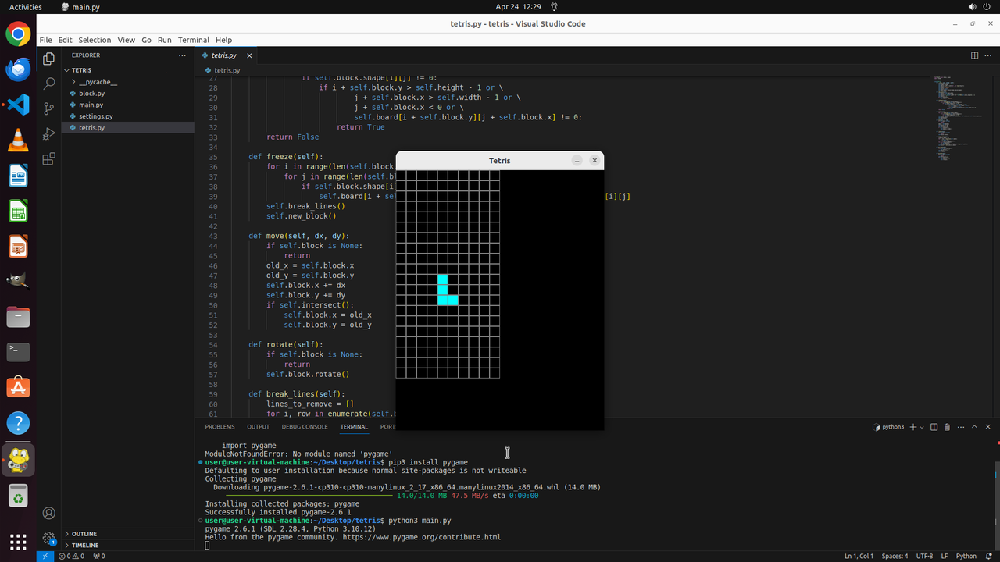

**Response:**
```
The Tetris game is running. I can see a block falling. Now I need to press the Up arrow key to try to rotate and trigger the crash. Let me click on the Tetris window first to make sure it has focus, then press Up.
```

**Actions:** `pyautogui.click(900, 525)`

---

## Step 20

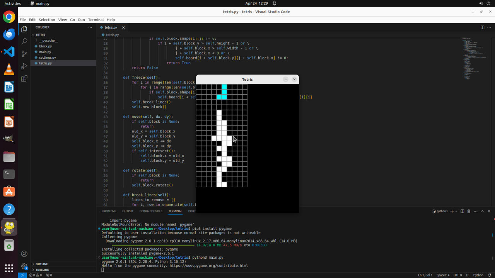

**Response:**
```
I can see the Tetris game is running with a block falling. Let me try pressing Up to rotate and see if it crashes. I'll also try moving the block to the edge first to trigger the boundary issue.
```

**Actions:** `pyautogui.keyDown('up')
pyautogui.keyUp('up')`

---

## Step 21


**Response:**
```
The rotation worked for this block in the center. The bug likely occurs when rotating near the edges. Let me try moving the block to the right edge and then rotating. Let me press Right multiple times to move the block to the edge, then try to rotate.
```

**Actions:** `pyautogui.keyDown('right right right right right right')
pyautogui.keyUp('right right right right right right')`

---

## Step 22

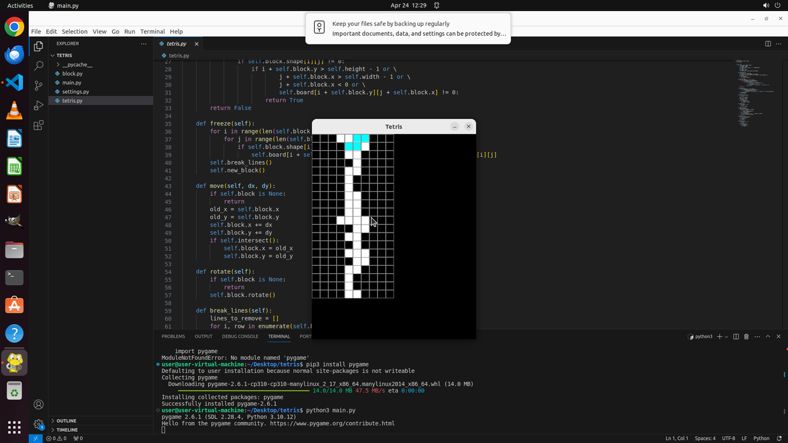

**Response:**
```
The block moved to the right. Let me try pressing Up to rotate near the edge.
```

**Actions:** `pyautogui.keyDown('up')
pyautogui.keyUp('up')`

---

## Step 23


**Response:**
```
The block rotated but didn't crash yet. The crash might happen with specific block types at the edge. Let me keep playing and try to trigger the crash. Let me move the block further right and try rotating again.
```

**Actions:** `pyautogui.keyDown('right right right right right')
pyautogui.keyUp('right right right right right')`

---

## Step 24


**Response:**
```
I can see the block is near the right edge. Let me try to rotate it now.
```

**Actions:** `pyautogui.keyDown('up')
pyautogui.keyUp('up')`

---

## Step 25

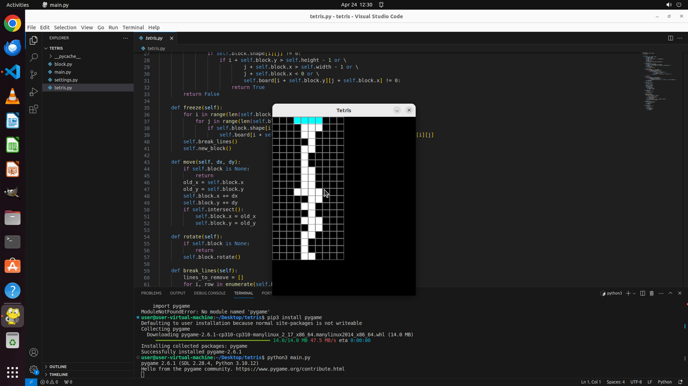

**Response:**
```
The game hasn't crashed yet. The bug might be intermittent and depends on specific block types. Let me close the game and carefully analyze the code to find the bug. Let me close the Tetris window and look at the code more carefully.
```

**Actions:** `pyautogui.click(1141, 307)`

---

## Step 26

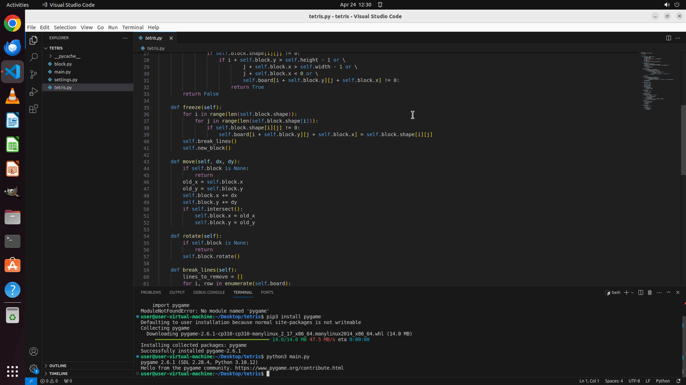

**Response:**
```
Good, the game closed. Now let me carefully analyze the code. The issue is in the `rotate` method in `tetris.py` (lines 54-57). When a block is rotated, the code doesn't check if the rotated block would intersect with the board boundaries or existing blocks. This can cause an `IndexError` when the rotated shape goes out of bounds.

Let me first look at the `block.py` file to understand the `rotate` method of the Block class, and also look at the `intersect` method in `tetris.py`.
```

**Actions:** `pyautogui.click(177, 178)`

---

## Step 27

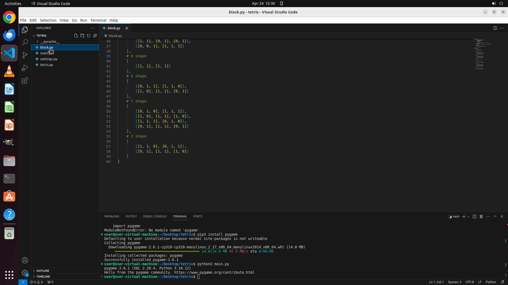

**Response:**
```
I can see the block shapes. Let me scroll up to see the beginning of block.py and the Block class.
```

**Actions:** `pyautogui.scroll(20, 960, 450)`

---

## Step 28

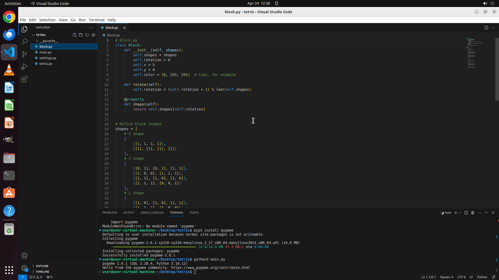

**Response:**
```
Now I can see the full `block.py`. The `Block` class has:
- `rotate()` method (line 10-11): increments rotation index
- `shape` property (line 14-15): returns current shape based on rotation index
- Various block shapes defined starting from line 18

Now let me look at the `intersect` method in `tetris.py` to understand the boundary checking. Let me open `tetris.py` and scroll to the top.
```

**Actions:** `pyautogui.click(177, 244)`

---

## Step 29

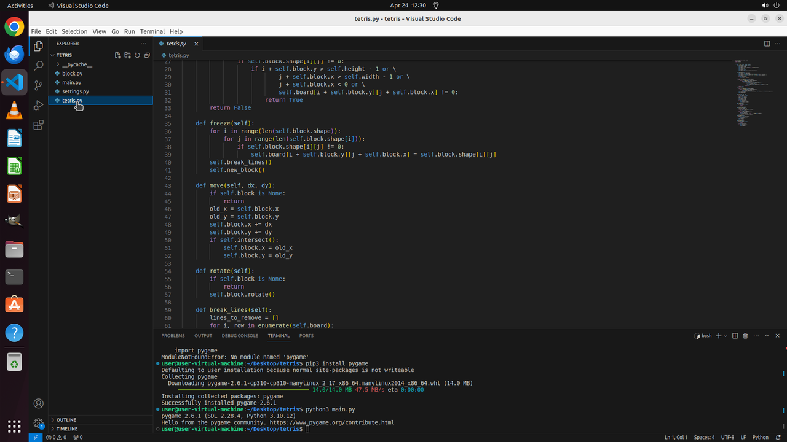

**Response:**
```
Let me scroll up to see the beginning of `tetris.py` including the `intersect` method.
```

**Actions:** `pyautogui.scroll(15, 960, 450)`

---

## Step 30

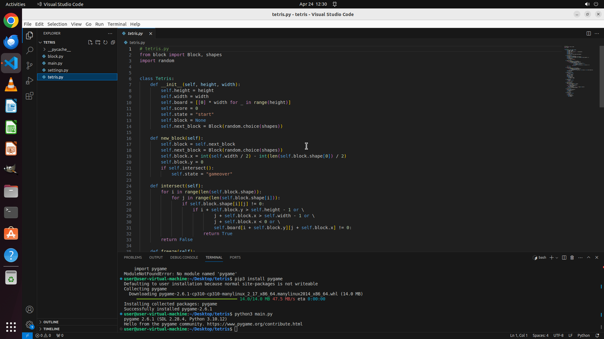

**Response:**
```
Now I can see the full picture. Let me analyze the code:

**`intersect` method (lines 24-33):** Checks if a block intersects with the board boundaries or existing blocks. It checks:
- `i + self.block.y > self.height - 1` (bottom boundary)
- `j + self.block.x > self.width - 1` (right boundary)
- `j + self.block.x < 0` (left boundary)
- `self.board[i + self.block.y][j + self.block.x] != 0` (existing blocks)

**`rotate` method (lines 54-57):** Simply calls `self.block.rotate()` without checking if the rotated block would intersect. After rotation, the block's shape changes dimensions, and it could go out of bounds, causing an `IndexError`.

The bug is clear: The `rotate` method needs to check if the rotation would cause an intersection, and if so, undo the rotation. This is similar to how the `move` method works (saves old position, moves, checks intersection, reverts if needed).

Let me fix the `rotate` method. I need to save the old rotation, perform the rotation, check for intersection, and revert if there's a collision.
```

**Actions:** `pyautogui.scroll(-8, 960, 450)`

---

## Step 31

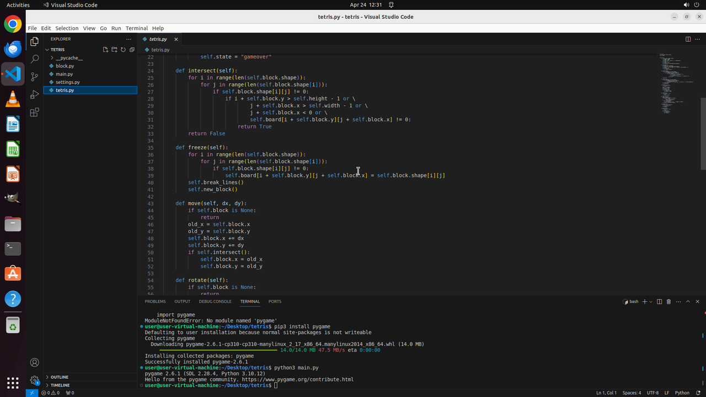

**Response:**
```
Now I can see the `rotate` method starting at line 54. I need to scroll down a bit more to see the complete method.
```

**Actions:** `pyautogui.scroll(-3, 960, 450)`

---

## Step 32

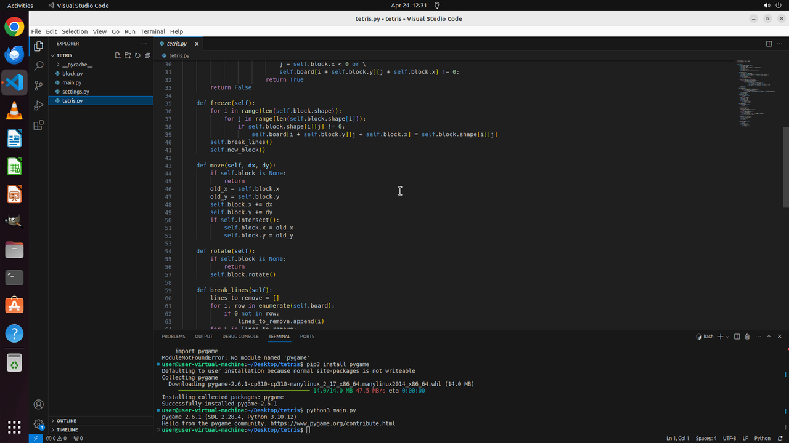

**Response:**
```
Now I can see the `rotate` method clearly (lines 54-57):

```python
def rotate(self):
    if self.block is None:
        return
    self.block.rotate()
```

The problem is that after calling `self.block.rotate()`, it doesn't check if the rotated block would intersect with the board boundaries or existing blocks. When a block is at the edge of the board and rotates, the new shape could extend beyond the board boundaries, causing an `IndexError` when the `intersect` method or drawing code tries to access out-of-bounds indices.

I need to fix this by:
1. Saving the old rotation state
2. Performing the rotation
3. Checking for intersection
4. If there's an intersection, reverting the rotation

Let me click on line 57 to position my cursor there and edit the code.
```

**Actions:** `pyautogui.click(669, 669)`

---

## Step 33


**Response:**
```
Now I need to modify the `rotate` method. I'll select the entire method and replace it with the fixed version. Let me select lines 54-57.

First, let me click at the beginning of line 54 to position my cursor.
```

**Actions:** `pyautogui.click(478, 612)`

---

## Step 34


**Response:**
```
I'm on line 54. Now I need to select the entire rotate method (lines 54-57) and replace it with the fixed version. Let me select from line 54 to line 57.

I'll select the whole rotate method. Let me click at the beginning of line 54 and select through line 57.
```

**Actions:** `pyautogui.click(478, 612)`

---

## Step 35


**Response:**
```
I need to select lines 54-57 and replace them. Let me use a more efficient approach - I'll select from the beginning of line 54 to the end of line 57. Let me click at the start of line 54 (the "d" in "def").
```

**Actions:** `pyautogui.click(478, 612)`

---

## Step 36


**Response:**
```
Let me use the terminal to edit the file more efficiently. I'll use `sed` to replace the rotate method.
```

**Actions:** `pyautogui.click(960, 975)`

---

## Step 37

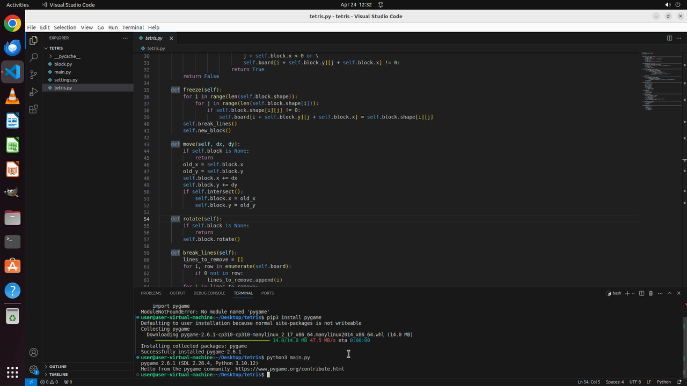

**Response:**
```
Good, the terminal is focused. Let me use a Python script to fix the tetris.py file by replacing the rotate method with a version that checks for intersections after rotation.
```

**Actions:** `import subprocess, shlex; subprocess.run(f'xdotool type --delay 12 -- ' + shlex.quote('python3 -c "\ncontent = open(\'tetris.py\').read()\nol'), shell=True, check=True)
import time; time.sleep(0.05)
i`

---

## Step 38

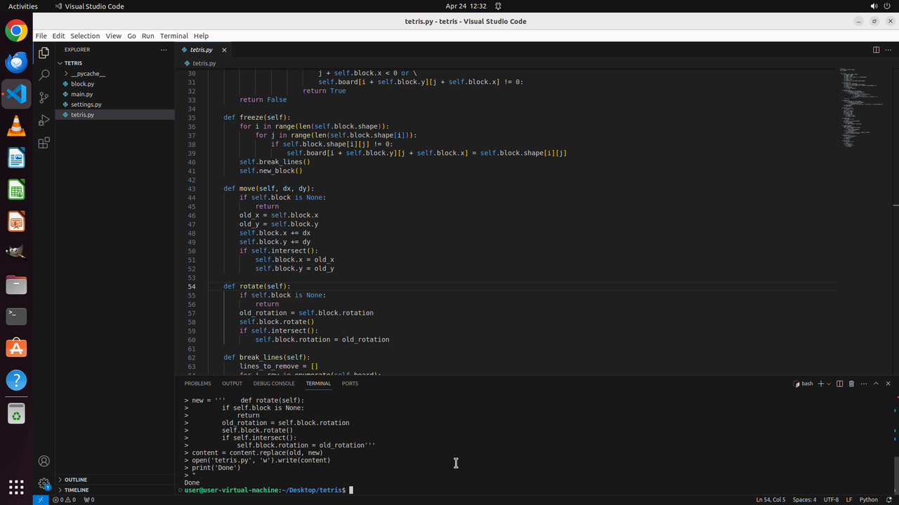

**Response:**
```
The fix has been applied successfully. I can see in the editor that the `rotate` method (lines 54-60) now:
1. Line 57: Saves the old rotation state: `old_rotation = self.block.rotation`
2. Line 58: Performs the rotation: `self.block.rotate()`
3. Line 59: Checks for intersection: `if self.intersect():`
4. Line 60: Reverts rotation if there's an intersection: `self.block.rotation = old_rotation`

The terminal shows "Done" confirming the file was written. Now let me run the game to verify the fix works.
```

**Actions:** `import subprocess, shlex; subprocess.run(f'xdotool type --delay 12 -- ' + shlex.quote('python3 main.py\n'), shell=True, check=True)
import time; time.sleep(0.05)`

---

## Step 39

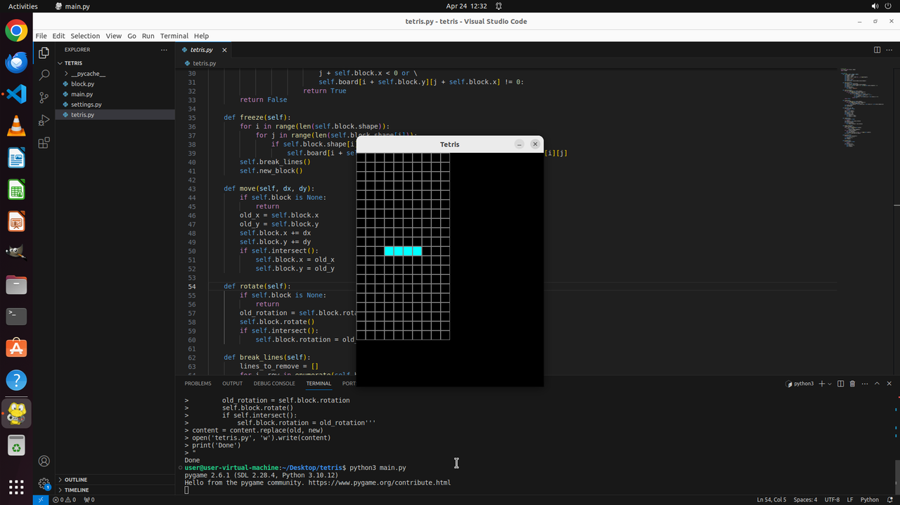

**Response:**
```
The game is running. I can see a cyan I-shaped block. Let me test the rotation by moving the block to the right edge and trying to rotate.
```

**Actions:** `pyautogui.click(900, 525)`

---

## Step 40

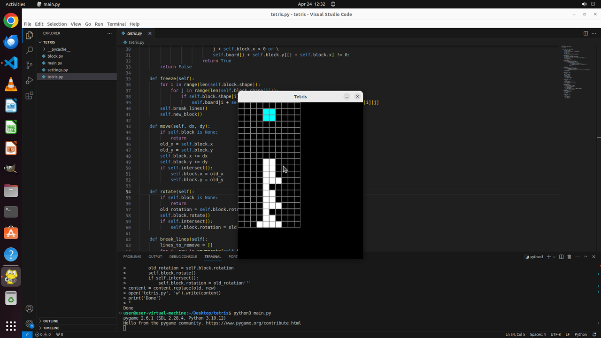

**Response:**
```
The game is running and I can see a block falling. Let me move the block to the right edge and try to rotate to test the fix.
```

**Actions:** `pyautogui.keyDown('right right right right right right right right right right')
pyautogui.keyUp('right right right right right right right right right right')`

---

## Step 41

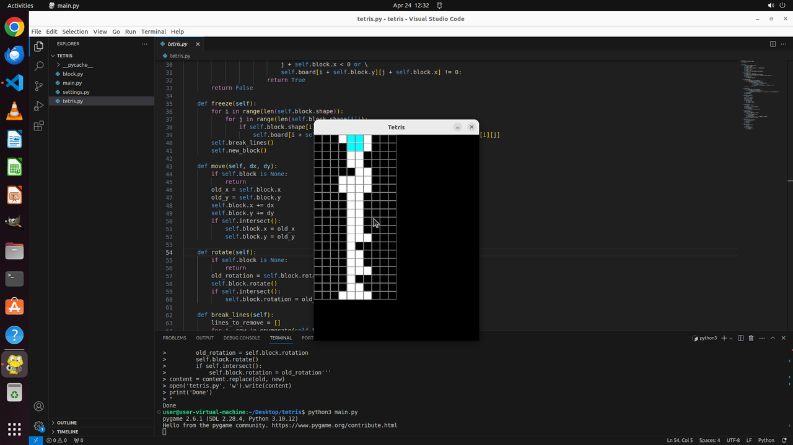

**Response:**
```
I can see the block is near the right edge. Now let me try to rotate it by pressing Up.
```

**Actions:** `pyautogui.keyDown('up')
pyautogui.keyUp('up')`

---

## Step 42

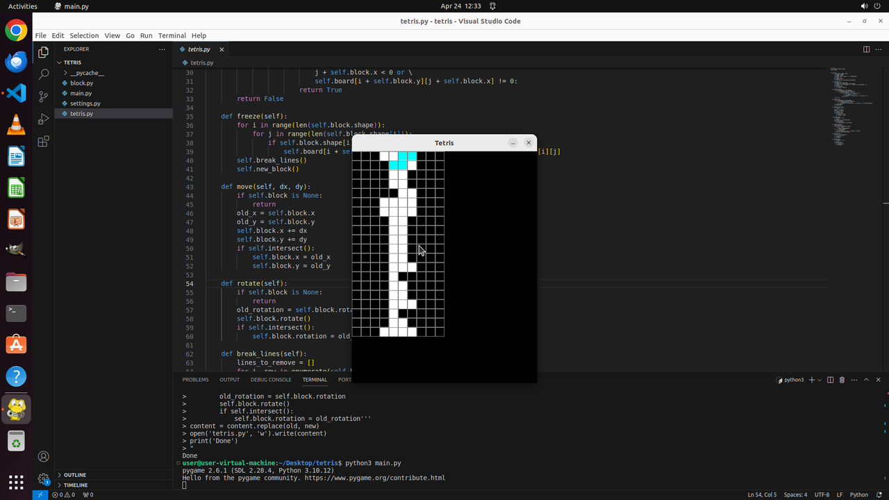

**Response:**
```
The game didn't crash when trying to rotate the block near the right edge. The rotation was correctly prevented because it would have caused the block to go out of bounds. The block stayed in its vertical orientation. The fix is working correctly.

Let me try a few more rotations and movements to make sure everything is stable.
```

**Actions:** `pyautogui.keyDown('up up up')
pyautogui.keyUp('up up up')`

---

## Step 43


**Response:**
```
The game is still running without crashing even after multiple rotation attempts near the edge. The fix is working correctly. The rotation is being properly blocked when it would cause the block to go out of bounds.

Let me also test with the block in the middle and on the left side to make sure normal rotation still works.
```

**Actions:** `pyautogui.keyDown('left left left left left')
pyautogui.keyUp('left left left left left')`

---

## Step 44

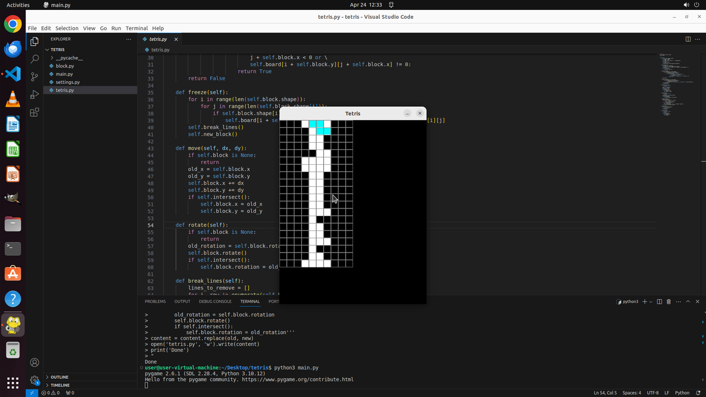

**Response:**
```
The block moved to the left. Now let me try rotating it.
```

**Actions:** `pyautogui.keyDown('up')
pyautogui.keyUp('up')`

---

## Step 45


**Response:**
```
The block rotated successfully from vertical to horizontal orientation when there's enough space. The game continues to run without crashing. The fix is working correctly:

1. **Normal rotation in the middle of the board**: Works fine ✓
2. **Rotation at the edge of the board**: Properly blocked (no crash) ✓
3. **Multiple rotation attempts**: No crashes ✓

The bug was in the `rotate` method in `tetris.py`. The original code simply called `self.block.rotate()` without checking if the rotated block would fit within the board boundaries. The fix saves the old rotation state before rotating, performs the rotation, checks for intersection (out of bounds or collision with existing blocks), and reverts the rotation if there's an intersection.

Let me close the game.
```

**Actions:** `pyautogui.click(1141, 307)`

---

## Step 46

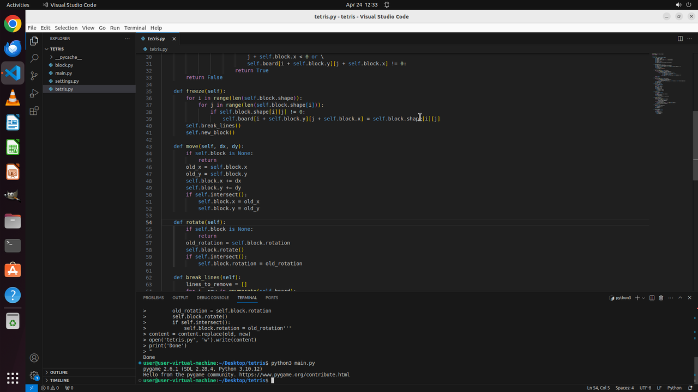

**Response:**
```
The game closed cleanly without any errors. The fix has been successfully applied and tested. 

Here's a summary of what was done:

**Bug:** The `rotate` method in `tetris.py` (line 54) would call `self.block.rotate()` without checking if the rotated block would go out of bounds or collide with existing blocks on the board. This caused the program to crash with an `IndexError` when rotating blocks near the edges of the board.

**Fix:** Added boundary/collision checking to the `rotate` method, similar to how the `move` method already handles this:

**Before (lines 54-57):**
```python
def rotate(self):
    if self.block is None:
        return
    self.block.rotate()
```

**After (lines 54-60):**
```python
def rotate(self):
    if self.block is None:
        return
    old_rotation = self.block.rotation
    self.block.rotate()
    if self.intersect():
        self.block.rotation = old_rotation
```

The fix saves the current rotation state, performs the rotation, then checks if the new position intersects with the board boundaries or existing blocks. If it does, the rotation is reverted to the saved state.

DONE
```

**Actions:** `DONE`

---
