# Task 9219480b-3aed-47fc-8bac-d2cffc5849f7

**Instruction:** Hi, I recently playing with developing a small python-based tetris game. While I have finished most of the part, something is wrong under some cases when I press up to rotate, the whole program will crash, please run the code for me and fix the bugs of code.

**Score:** 1.0

**Wall clock:** 6m 57s

**Steps:** 44

**Cost:** $1.49

---

## Step 1

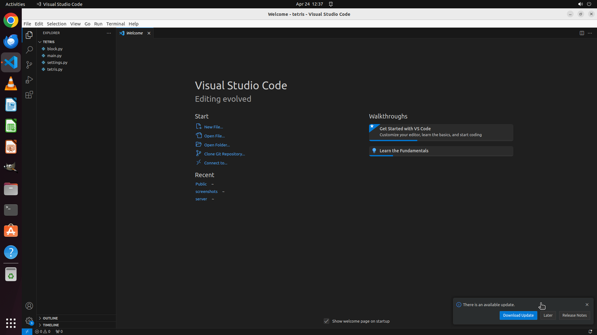

**Response:**
```
I'll start by examining the code files in the tetris project to understand the structure and find the bug related to rotation crashing.
```

**Actions:** `pyautogui.click(177, 156)`

---

## Step 2

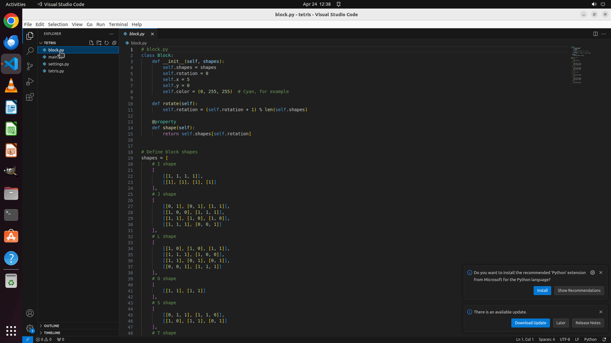

**Response:**
```
Let me examine all the files. First, let me read through block.py completely, then the other files.
```

**Actions:** `pyautogui.scroll(-10, 960, 600)`

---

## Step 3

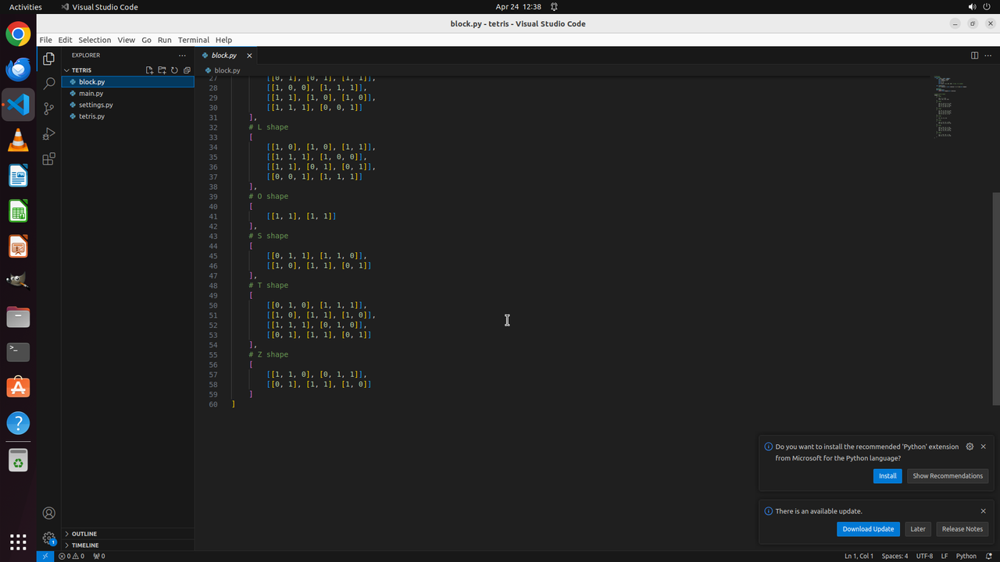

**Response:**
```
Now let me look at the other files. Let me click on main.py.
```

**Actions:** `pyautogui.click(175, 178)`

---

## Step 4

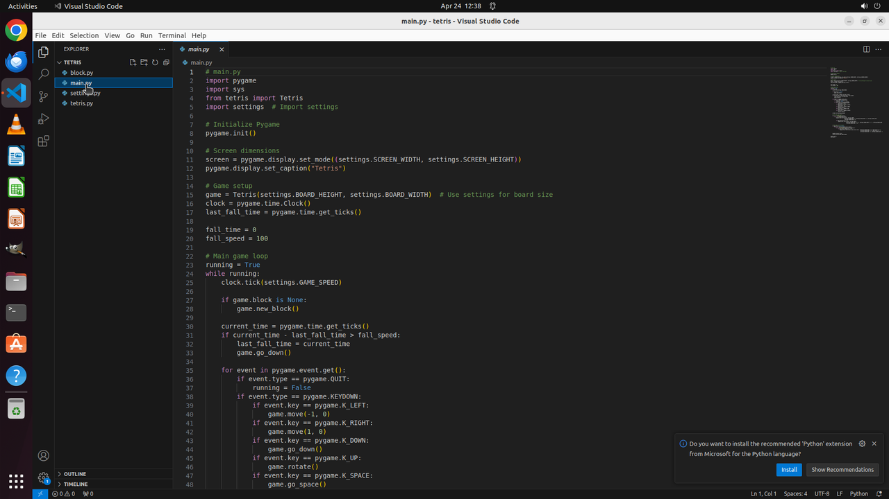

**Response:**
```
I can see main.py. Let me notice something on line 15: `Tetris(settings.BOARD_HEIGHT, settings.BOARD_WIDTH)` - the parameters might be swapped (height, width). Let me scroll down to see the rest of main.py and then check the other files.
```

**Actions:** `pyautogui.scroll(-10, 960, 600)`

---

## Step 5

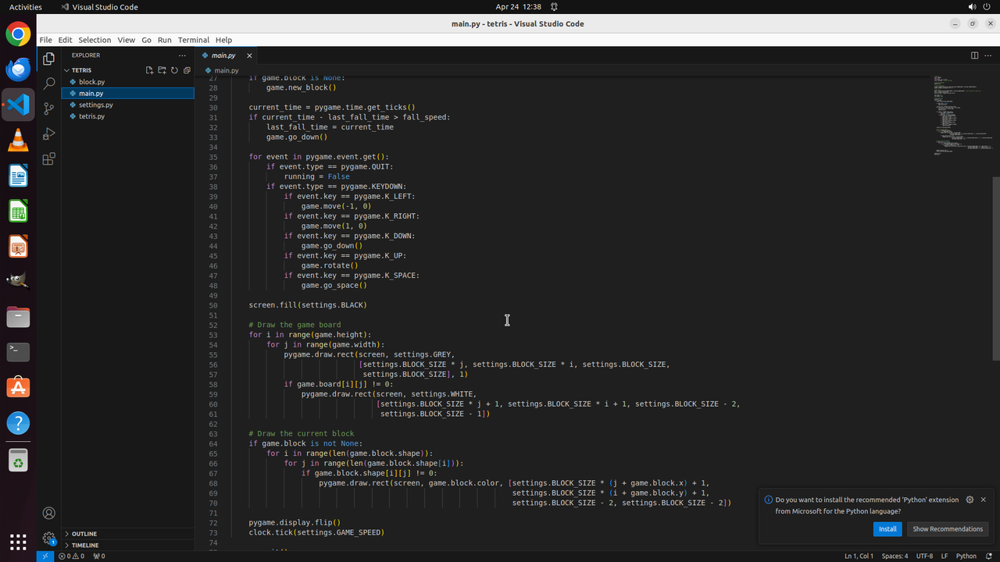

**Response:**
```
Let me scroll down to see the rest of main.py and then check settings.py and tetris.py.
```

**Actions:** `pyautogui.scroll(-5, 960, 600)`

---

## Step 6

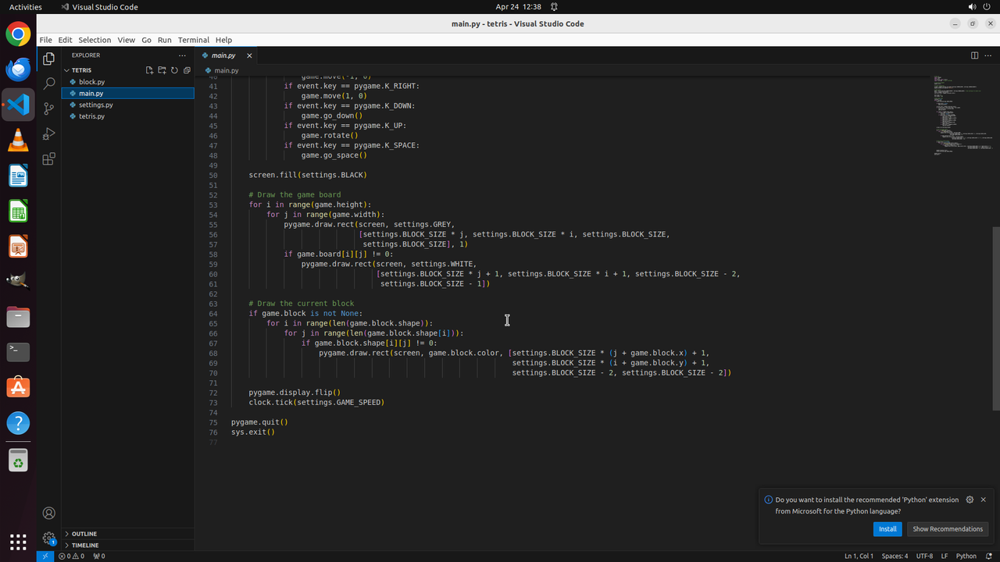

**Response:**
```
Now let me check settings.py.
```

**Actions:** `pyautogui.click(183, 201)`

---

## Step 7

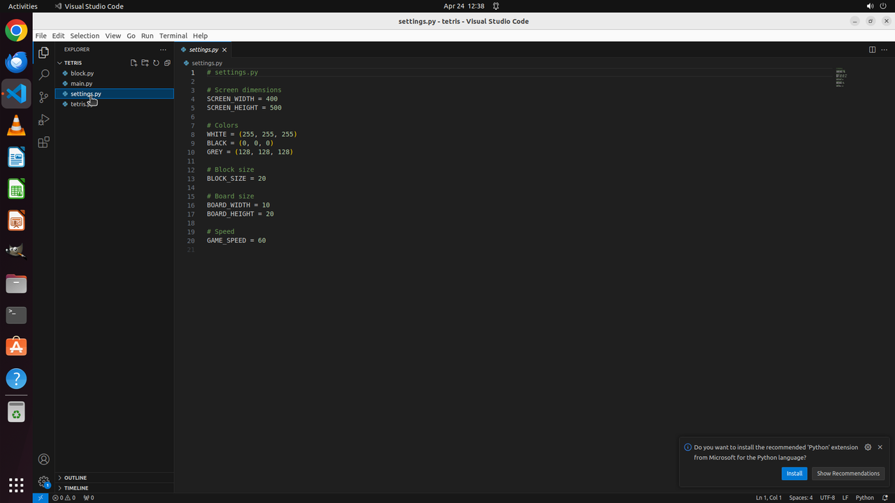

**Response:**
```
Now let me check tetris.py, which is the core game logic file.
```

**Actions:** `pyautogui.click(177, 223)`

---

## Step 8

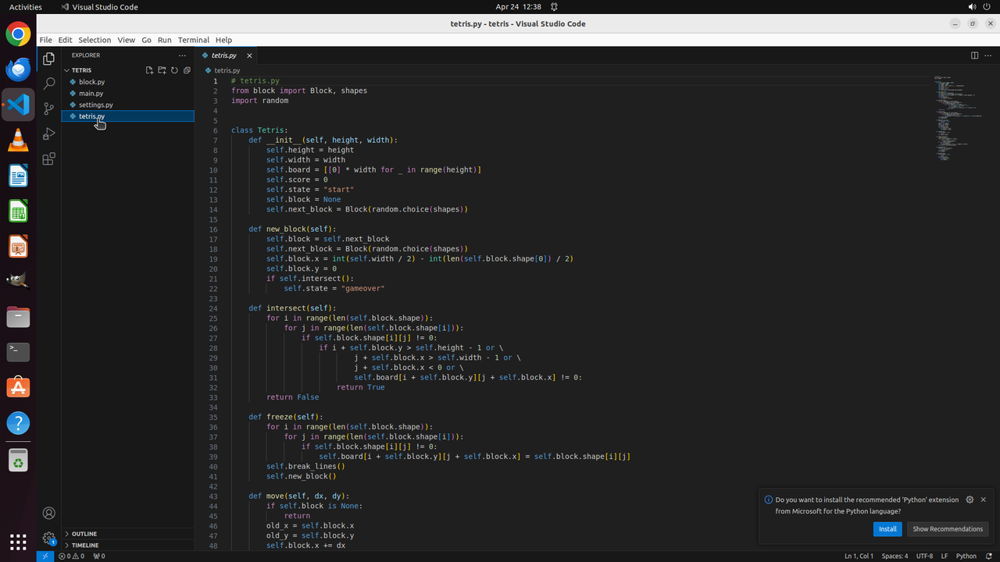

**Response:**
```
Let me scroll down to see the rest of tetris.py, especially the `rotate` method.
```

**Actions:** `pyautogui.scroll(-10, 960, 600)`

---

## Step 9

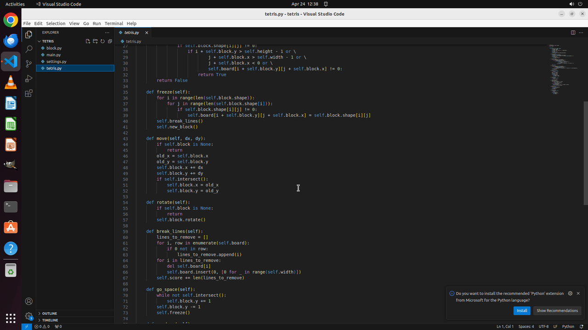

**Response:**
```
Now I can see the `rotate` method on line 54-57. It simply calls `self.block.rotate()` without checking if the rotation would cause an intersection (out of bounds or overlapping with existing blocks). This is likely the bug - when you rotate a piece near the edges or near other blocks, the new shape could go out of bounds, causing an index error.

Let me first run the code to see the actual error. Let me open a terminal.
```

**Actions:** `pyautogui.click(373, 76)`

---

## Step 10

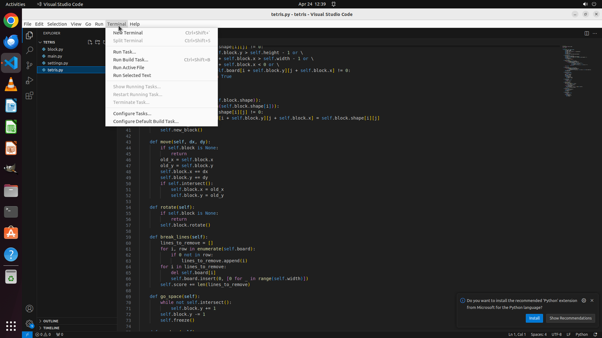

**Actions:** `pyautogui.click(406, 103)`

---

## Step 11

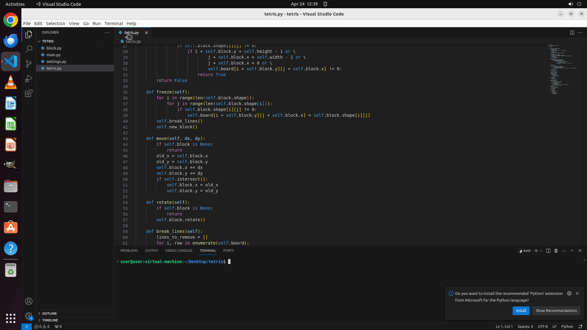

**Response:**
```
Good, I have a terminal. Let me run the game to see the error.
```

**Actions:** `pyautogui.click(960, 855)`

---

## Step 12


**Actions:** `import subprocess, shlex; subprocess.run(f'xdotool type --delay 12 -- ' + shlex.quote('python3 main.py\n'), shell=True, check=True)
import time; time.sleep(0.05)`

---

## Step 13

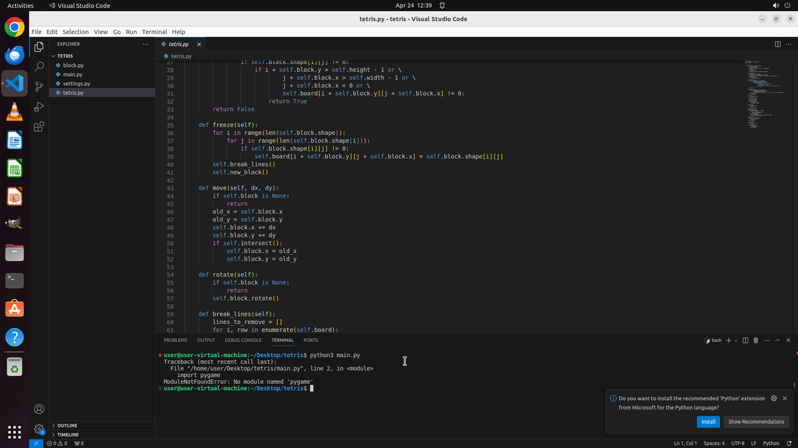

**Response:**
```
I need to install pygame first. Let me do that.
```

**Actions:** `import subprocess, shlex; subprocess.run(f'xdotool type --delay 12 -- ' + shlex.quote('pip3 install pygame\n'), shell=True, check=True)
import time; time.sleep(0.05)`

---

## Step 14

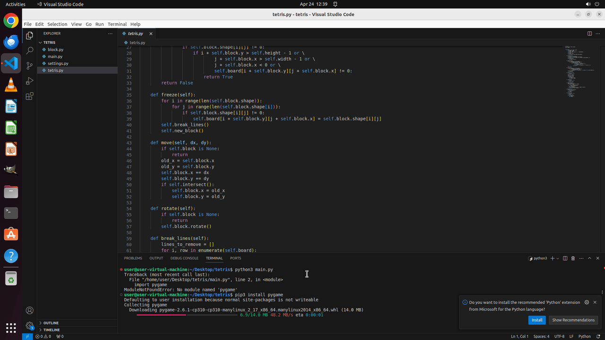

**Response:**
```
Let me wait for the installation to complete.
```

**Actions:** `time.sleep(0.5)`

---

## Step 15

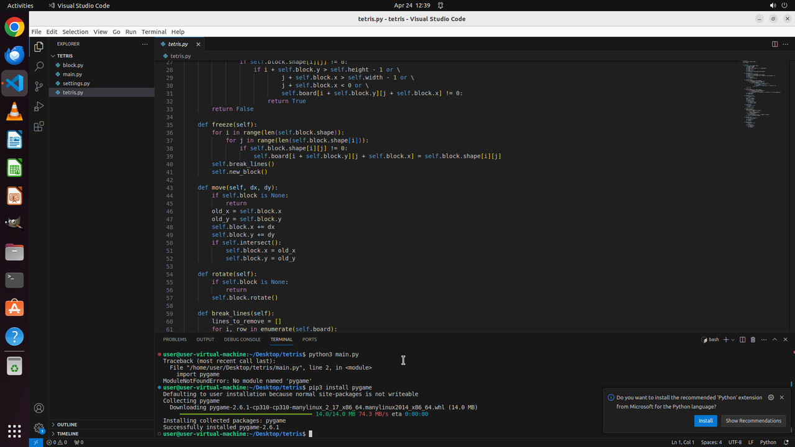

**Response:**
```
Pygame is installed. Now let me run the game to see the crash.
```

**Actions:** `import subprocess, shlex; subprocess.run(f'xdotool type --delay 12 -- ' + shlex.quote('python3 main.py\n'), shell=True, check=True)
import time; time.sleep(0.05)`

---

## Step 16

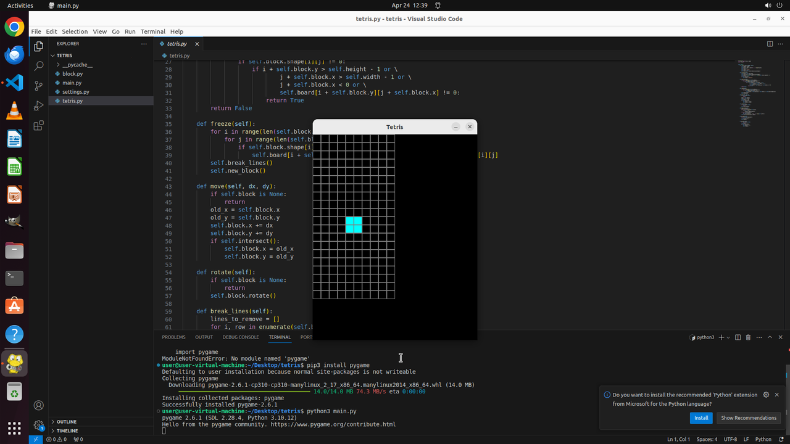

**Response:**
```
The game is running. I can see the Tetris window with a block falling. Now I need to try pressing the Up arrow key to rotate and trigger the crash. Let me click on the Tetris window first to make sure it has focus, then press Up.
```

**Actions:** `pyautogui.click(960, 525)`

---

## Step 17

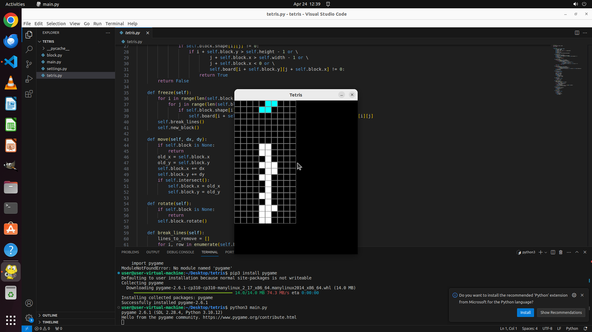

**Response:**
```
I can see the game is running with blocks. Let me try pressing Up to rotate. I need to keep pressing Up repeatedly, especially when blocks are near the edges, to trigger the crash.
```

**Actions:** `pyautogui.keyDown('up')
pyautogui.keyUp('up')`

---

## Step 18


**Response:**
```
The rotation worked this time. I need to move the block to the right edge and try to rotate there to trigger the crash. Let me move the block to the right edge first.
```

**Actions:** `pyautogui.keyDown('right right right right right right right right right')
pyautogui.keyUp('right right right right right right right right right')`

---

## Step 19


**Response:**
```
I can see the block moved to the right. Now let me try pressing Up to rotate when near the edge.
```

**Actions:** `pyautogui.keyDown('up')
pyautogui.keyUp('up')`

---

## Step 20


**Response:**
```
Let me try moving to the right edge more aggressively and rotating. Let me keep trying different combinations.
```

**Actions:** `pyautogui.keyDown('right right right right right right right right right right')
pyautogui.keyUp('right right right right right right right right right right')`

---

## Step 21

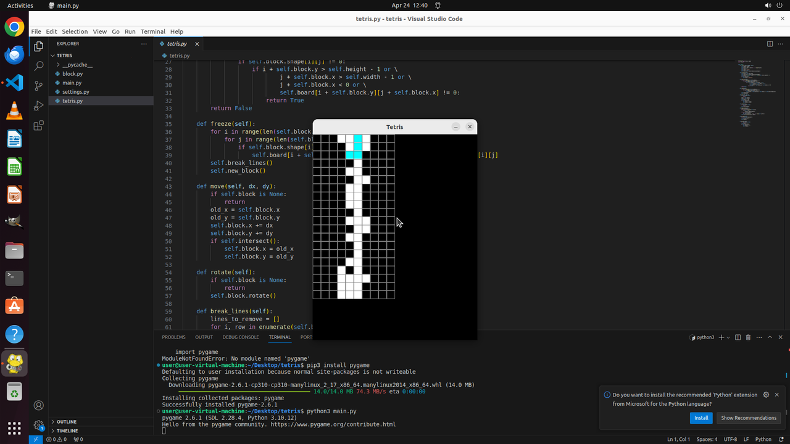

**Response:**
```
Now I can see the block is near the right edge. Let me try rotating now.
```

**Actions:** `pyautogui.keyDown('up')
pyautogui.keyUp('up')`

---

## Step 22


**Response:**
```
The game hasn't crashed yet. The bug might only trigger in specific situations. Let me close the game and carefully read all the source code to understand the bug. Let me close the game window first.
```

**Actions:** `pyautogui.click(1141, 307)`

---

## Step 23


**Response:**
```
Good, the game closed. Now let me carefully read all the source files using the terminal to understand the code completely. Let me use `cat` to read each file.
```

**Actions:** `pyautogui.click(960, 1047)`

---

## Step 24

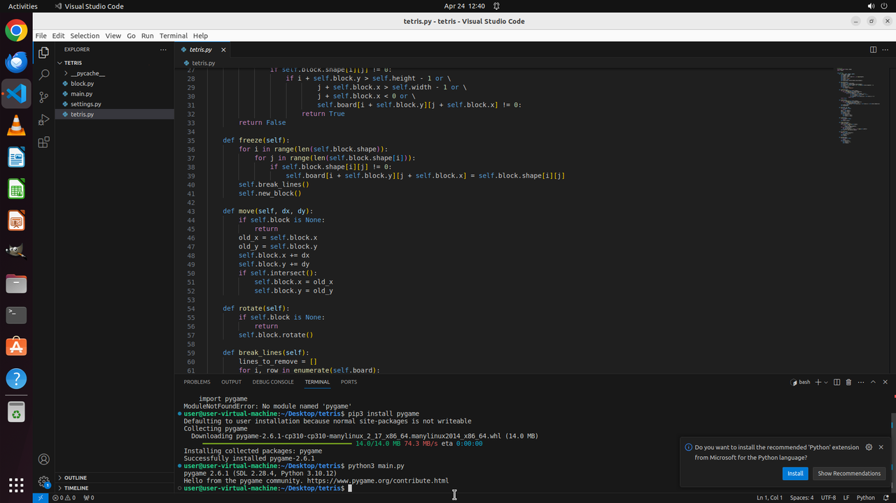

**Actions:** `import subprocess, shlex; subprocess.run(f'xdotool type --delay 12 -- ' + shlex.quote('cat block.py\n'), shell=True, check=True)
import time; time.sleep(0.05)`

---

## Step 25


**Response:**
```
Let me scroll up to see the full output of block.py.
```

**Actions:** `pyautogui.scroll(10, 960, 975)`

---

## Step 26

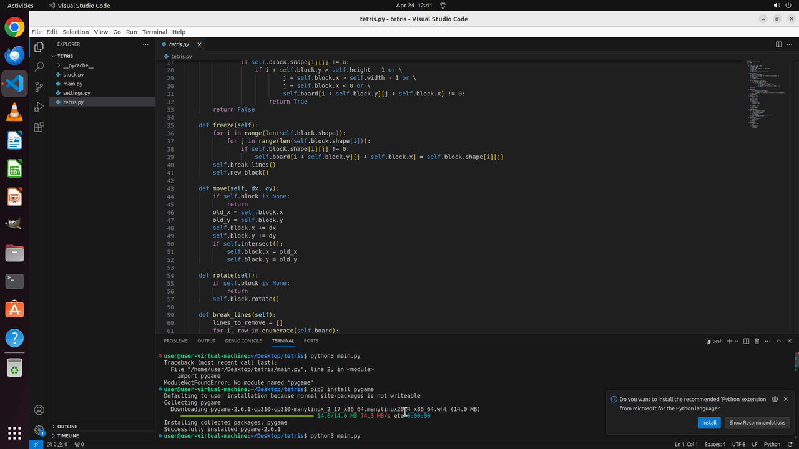

**Response:**
```
I need to see the block.py content more clearly. Let me scroll down to see the output of `cat block.py`.
```

**Actions:** `pyautogui.scroll(-15, 960, 975)`

---

## Step 27

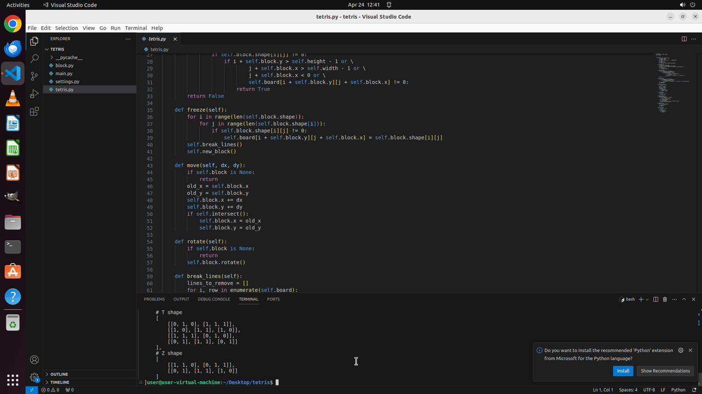

**Response:**
```
I can see the end of block.py output. The Z shape only has 2 rotations listed. Let me look at block.py more carefully in the editor. Let me click on block.py in the file explorer.
```

**Actions:** `pyautogui.click(175, 178)`

---

## Step 28

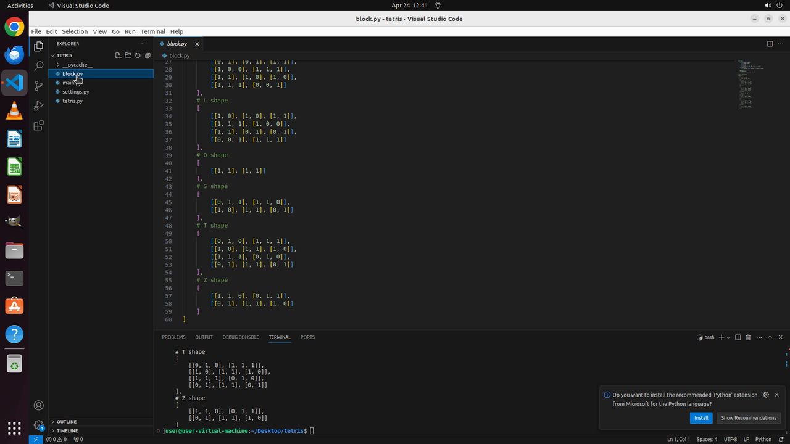

**Response:**
```
Now I can see block.py. Let me scroll up to see the beginning of the file to understand the full structure.
```

**Actions:** `pyautogui.scroll(20, 960, 450)`

---

## Step 29

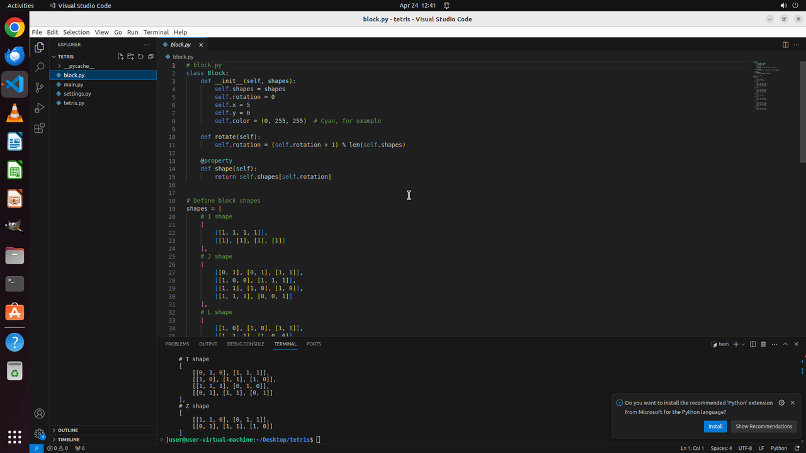

**Response:**
```
Now I can see the full block.py file. Let me understand the structure:

1. `Block` class with `__init__`, `rotate()`, and `shape` property
2. `rotate()` method on line 10-11 increments rotation and wraps around using modulo
3. `shape` property returns `self.shapes[self.rotation]`
4. Shapes are defined as a list of shape definitions

Now let me look at the `rotate` method in tetris.py (line 54-57):
```python
def rotate(self):
    if self.block is None:
        return
    self.block.rotate()
```

The problem is clear: **the `rotate` method in `tetris.py` doesn't check for intersections after rotating**. Unlike the `move` method which checks `self.intersect()` and reverts if there's a collision, the `rotate` method just rotates without checking. If the rotated shape goes out of bounds or overlaps with existing blocks, it can cause an index error.

Also, I need to check the `intersect` method. Let me look at it more carefully. Let me click on tetris.py.
```

**Actions:** `pyautogui.click(175, 244)`

---

## Step 30

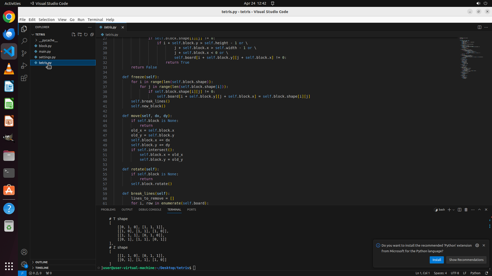

**Response:**
```
Let me scroll up to see the beginning of tetris.py, including the `intersect` method.
```

**Actions:** `pyautogui.scroll(15, 960, 450)`

---

## Step 31

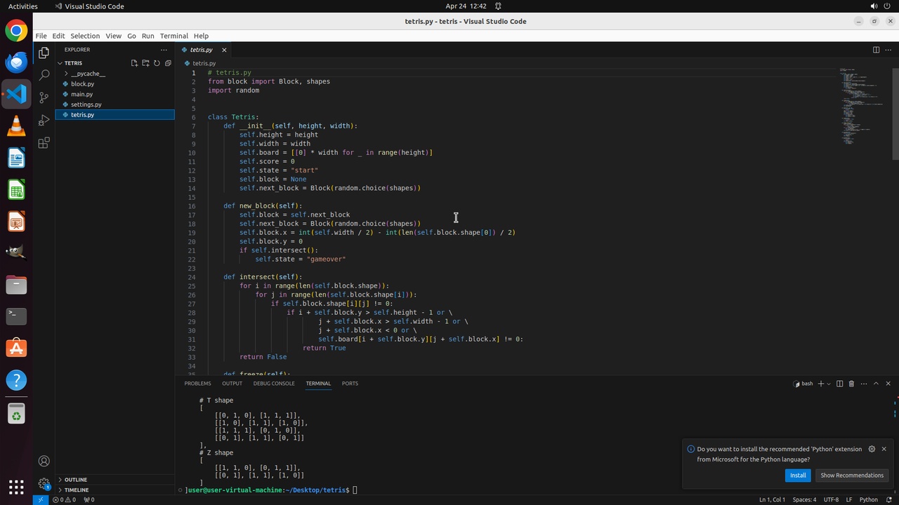

**Response:**
```
Now I can see the full picture. Let me analyze the code:

**`intersect` method (lines 24-33):**
- Checks if any non-zero cell of the block shape would be out of bounds or overlap with existing blocks on the board
- Checks: `i + self.block.y > self.height - 1` (bottom), `j + self.block.x > self.width - 1` (right), `j + self.block.x < 0` (left), and board collision

**`rotate` method (lines 54-57):**
```python
def rotate(self):
    if self.block is None:
        return
    self.block.rotate()
```

The bug is clear! The `rotate` method calls `self.block.rotate()` but **doesn't check if the rotation causes an intersection**. Unlike the `move` method which saves the old position, applies the move, checks for intersection, and reverts if needed, the `rotate` method just rotates without any validation.

When a block is near an edge or near other blocks, rotating it can cause the shape to extend beyond the board boundaries, and on the next `intersect` check or drawing, it will try to access an out-of-bounds index, causing a crash.

The fix is to save the old rotation, apply the rotation, check for intersection, and revert if there is one. Let me fix the `rotate` method in tetris.py.
```

**Actions:** `pyautogui.scroll(-10, 960, 450)`

---

## Step 32

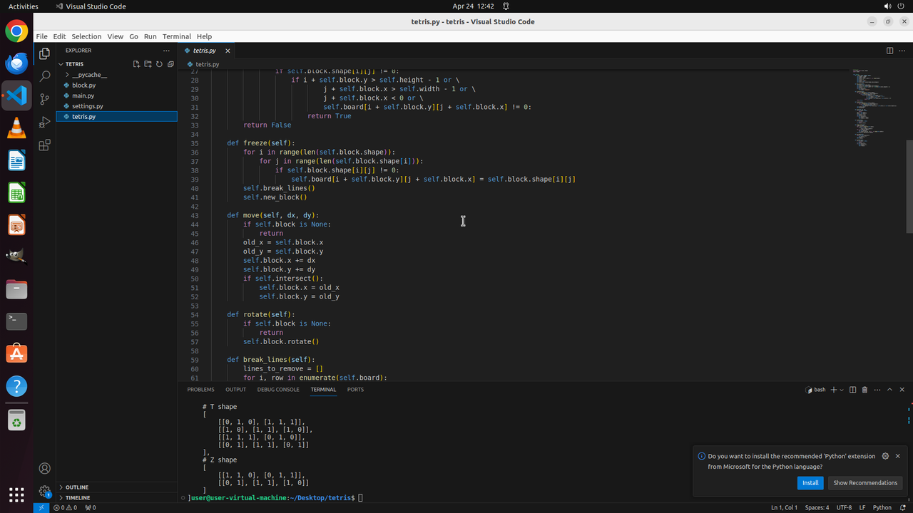

**Response:**
```
Now I can see the `rotate` method on lines 54-57. I need to fix it to check for intersections after rotating, similar to how the `move` method works. I'll:

1. Save the old rotation
2. Call `self.block.rotate()`
3. Check if the new rotation causes an intersection
4. If it does, revert to the old rotation

Let me click on line 57 to position my cursor there and edit the rotate method.
```

**Actions:** `pyautogui.click(670, 718)`

---

## Step 33

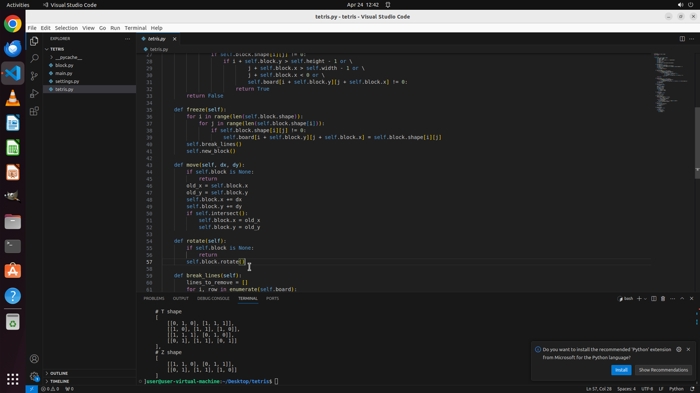

**Response:**
```
Now I need to rewrite the `rotate` method. I'll select the entire method and replace it. Let me select from line 54 to line 57. First, let me click at the beginning of line 54.

I'll select the entire rotate method (lines 54-57) and replace it. Let me click at the start of "def" on line 54.
```

**Actions:** `pyautogui.click(478, 661)`

---

## Step 34

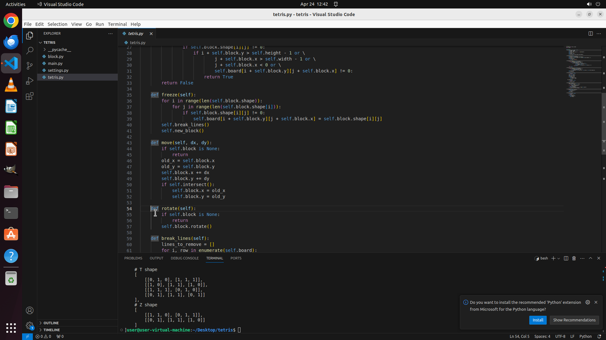

**Response:**
```
I need to select the content of the rotate method and replace it. Let me select from the beginning of line 55 (the `if self.block is None:` line) to the end of line 57. I'll need to replace just the body of the method. 

Actually, let me use a more efficient approach - I'll use the terminal to make the edit with `sed` or a Python script.
```

**Actions:** `pyautogui.click(960, 1047)`

---

## Step 35

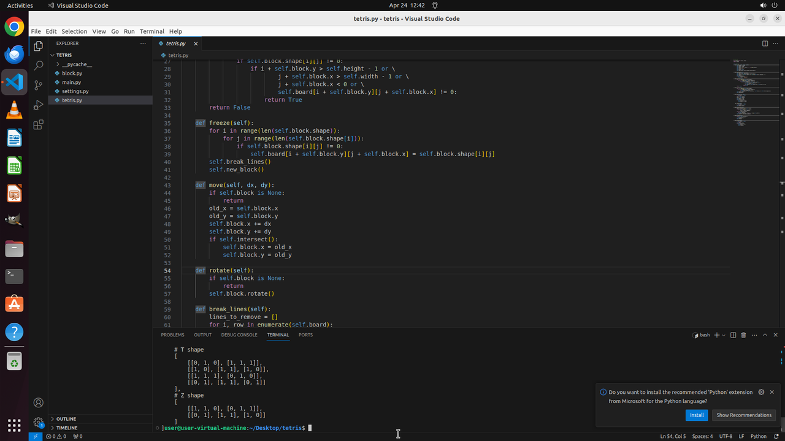

**Response:**
```
Let me use a Python script to fix the tetris.py file. I'll write a script that replaces the rotate method with the corrected version.
```

**Actions:** `import subprocess, shlex; subprocess.run(f'xdotool type --delay 12 -- ' + shlex.quote('python3 -c "\ncontent = open(\'tetris.py\').read()\nol'), shell=True, check=True)
import time; time.sleep(0.05)
i`

---

## Step 36

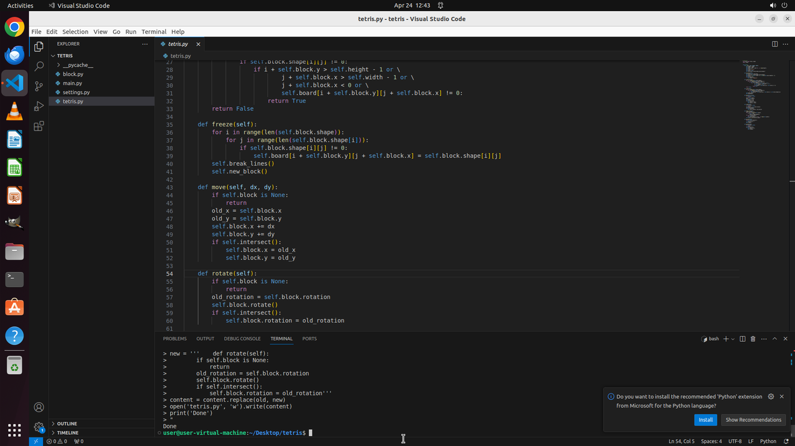

**Response:**
```
The fix has been applied successfully. I can see in the editor that the `rotate` method has been updated:

- Line 54: `def rotate(self):`
- Line 55: `if self.block is None:`
- Line 56: `return`
- Line 57: `old_rotation = self.block.rotation`
- Line 58: `self.block.rotate()`
- Line 59: `if self.intersect():`
- Line 60: `self.block.rotation = old_rotation`

The terminal also shows "Done", confirming the replacement was successful.

Now let me run the game again to verify it works correctly.
```

**Actions:** `import subprocess, shlex; subprocess.run(f'xdotool type --delay 12 -- ' + shlex.quote('python3 main.py\n'), shell=True, check=True)
import time; time.sleep(0.05)`

---

## Step 37

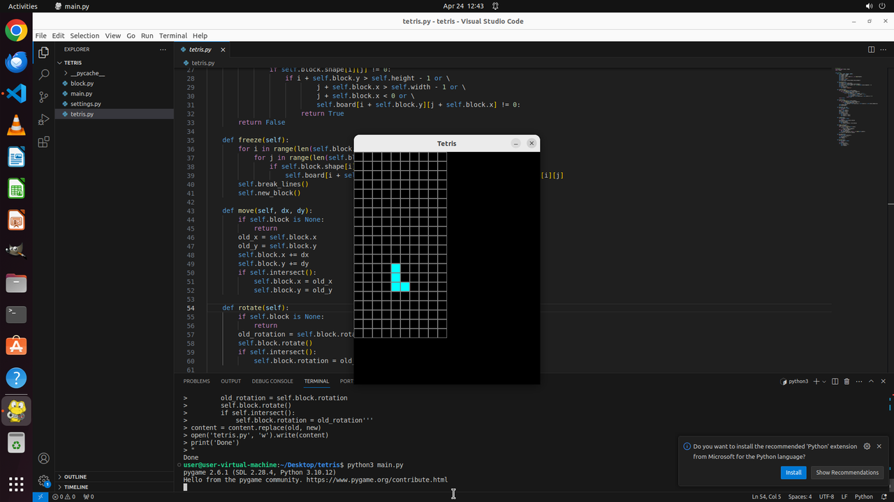

**Response:**
```
The game is running. I can see a block near the bottom. Let me click on the game window to give it focus and then test rotation at the edges.
```

**Actions:** `pyautogui.click(960, 600)`

---

## Step 38

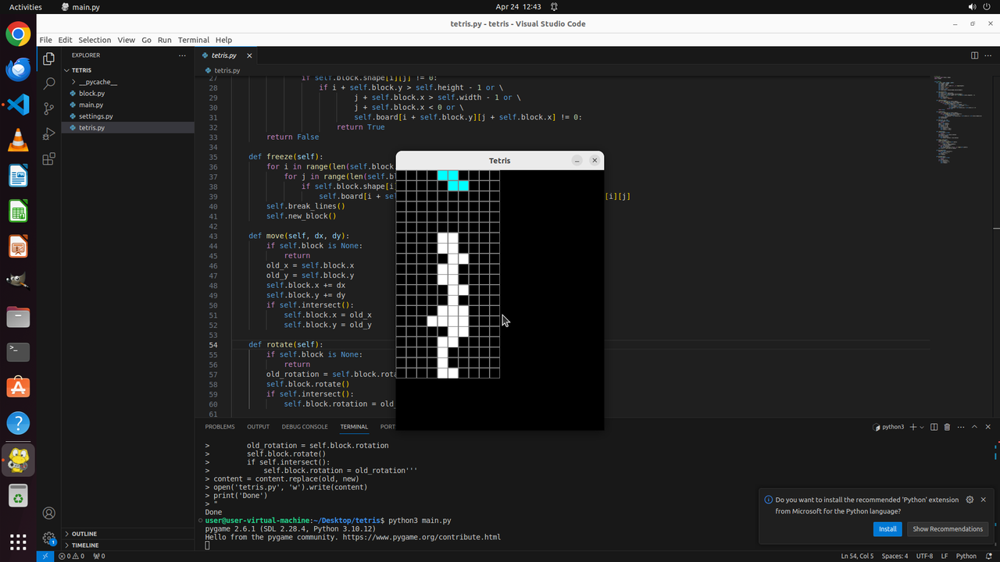

**Response:**
```
Good, I can see the game running with blocks. Let me move the block to the right edge and try rotating to test the fix.
```

**Actions:** `pyautogui.keyDown('right right right right right right right right right right')
pyautogui.keyUp('right right right right right right right right right right')`

---

## Step 39

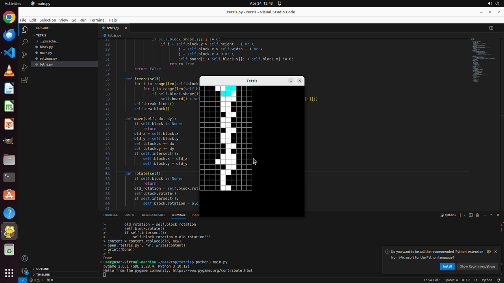

**Response:**
```
I can see the block is at the top. Let me try pressing Up to rotate.
```

**Actions:** `pyautogui.keyDown('up')
pyautogui.keyUp('up')`

---

## Step 40


**Response:**
```
The game didn't crash! The rotation worked. I can see the block rotated (it looks like it changed from horizontal to vertical). Let me try more aggressive testing - move to the right edge and rotate multiple times.
```

**Actions:** `pyautogui.keyDown('right right right right right right right right right right')
pyautogui.keyUp('right right right right right right right right right right')`

---

## Step 41


**Response:**
```
Now let me try rotating at the right edge.
```

**Actions:** `pyautogui.keyDown('up up up up up')
pyautogui.keyUp('up up up up up')`

---

## Step 42

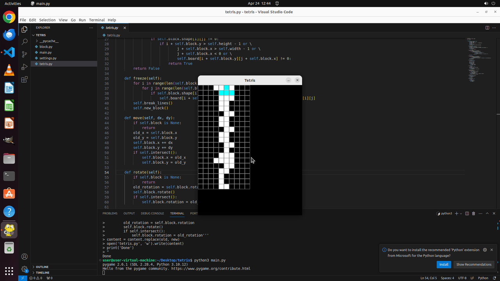

**Response:**
```
The game is still running without crashing! The rotation is working correctly now. The fix prevents the block from rotating when it would cause an intersection (going out of bounds or overlapping with existing blocks). Let me also test with the left edge.
```

**Actions:** `pyautogui.keyDown('left left left left left left left left left left left left left left left')
pyautogui.keyUp('left left left left left left left left left left left left left left left')`

---

## Step 43


**Response:**
```
I can see the block (I-piece) is now at the left side. Let me try rotating here.
```

**Actions:** `pyautogui.keyDown('up up up up up')
pyautogui.keyUp('up up up up up')`

---

## Step 44

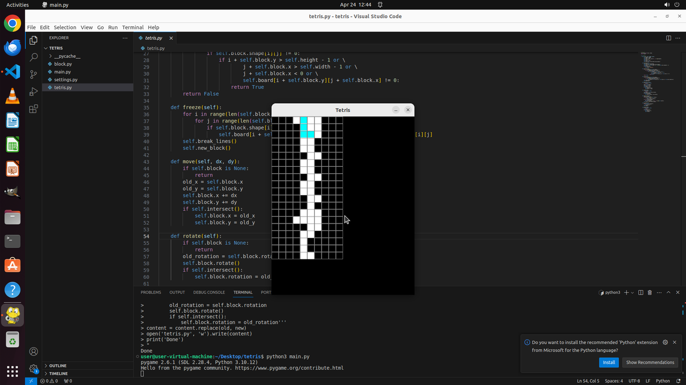

**Response:**
```
The game is still running perfectly without any crashes. The fix is working correctly. The rotation now properly checks for intersections and reverts the rotation if the rotated block would go out of bounds or overlap with existing blocks.

Let me summarize the bug and the fix:

**Bug:** In `tetris.py`, the `rotate` method (line 54-57) called `self.block.rotate()` without checking if the rotated shape would cause an intersection (going out of bounds or overlapping with existing blocks on the board). This would cause an `IndexError` crash when trying to access board positions outside the valid range.

**Fix:** Added intersection checking after rotation, similar to how the `move` method works:
1. Save the old rotation value: `old_rotation = self.block.rotation`
2. Perform the rotation: `self.block.rotate()`
3. Check for intersection: `if self.intersect():`
4. If there's an intersection, revert: `self.block.rotation = old_rotation`

DONE
```

**Actions:** `DONE`

---
