# Task 98e8e339-5f91-4ed2-b2b2-12647cb134f4

**Instruction:** Merge the contents of all .txt files from your vscode project into a single document "concat.docx" on Desktop with libreoffice writer. No merging separator is needed. Ensure to set the overall font size of the document to 10.

**Score:** 1

**Wall clock:** 3m 45s

**Steps:** 25

**Cost:** $0.73

---

## Step 1

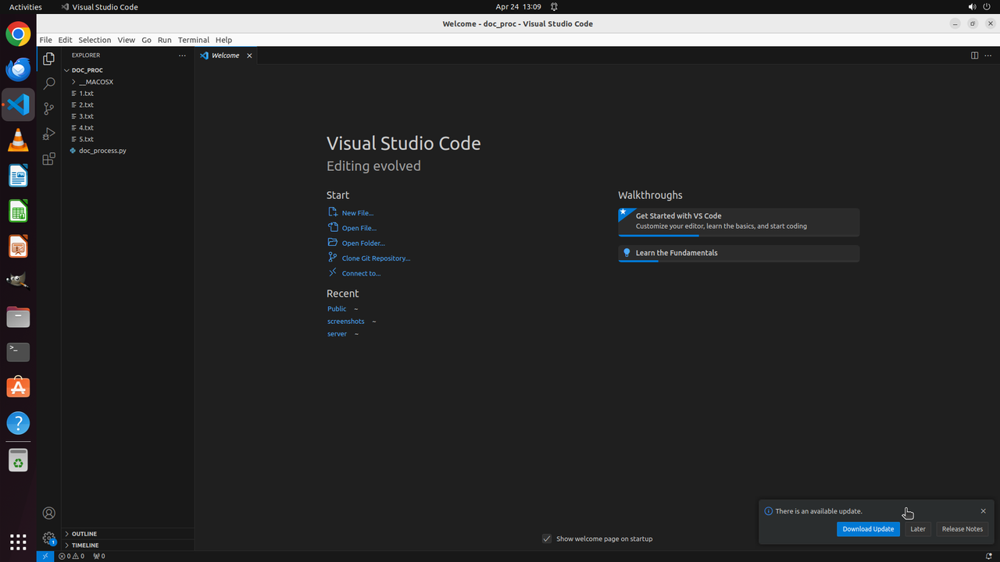

**Response:**
```
I can see the VS Code project "DOC_PROC" with files 1.txt through 5.txt. Let me first check the contents of these files and then create the merged document.
```

**Actions:** `pyautogui.click(373, 76)`

---

## Step 2

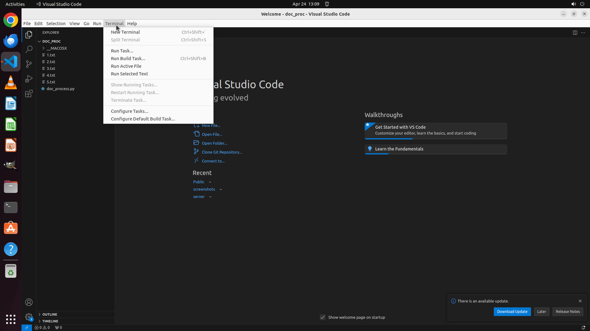

**Actions:** `pyautogui.click(406, 103)`

---

## Step 3

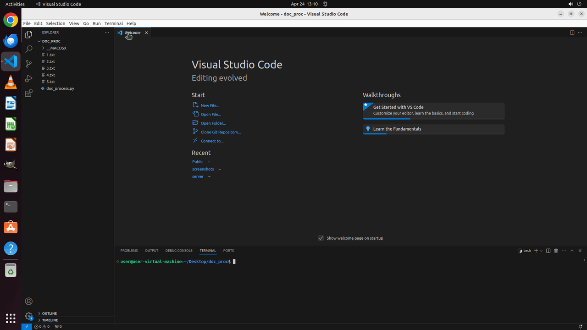

**Response:**
```
Good, I have a terminal open in the project directory. Let me first check the contents of the txt files and then concatenate them.
```

**Actions:** `pyautogui.click(960, 855)`

---

## Step 4

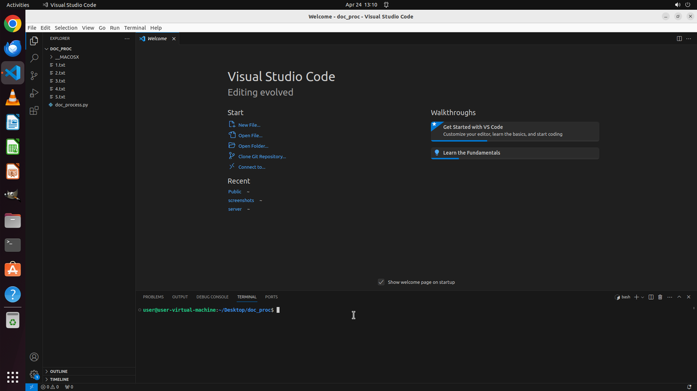

**Response:**
```
Let me first check the contents of the txt files to understand what we're working with.
```

**Actions:** `import subprocess, shlex; subprocess.run(f'xdotool type --delay 12 -- ' + shlex.quote('cat 1.txt 2.txt 3.txt 4.txt 5.txt\n'), shell=True, check=True)
import time; time.sleep(0.05)`

---

## Step 5

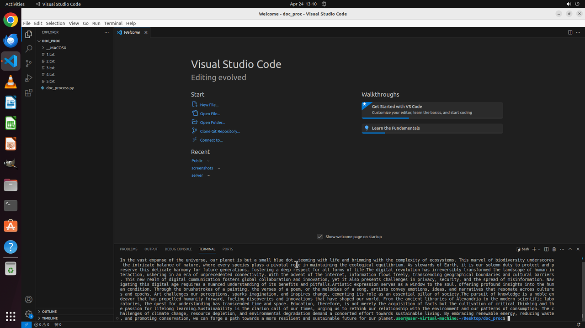

**Response:**
```
I can see the contents of all the txt files. Now I need to concatenate them into a single file and then create a .docx document using LibreOffice Writer with font size 10. Let me first concatenate all files into a temporary text file, then use LibreOffice to convert it to .docx format.
```

**Actions:** `import subprocess, shlex; subprocess.run(f'xdotool type --delay 12 -- ' + shlex.quote('cat 1.txt 2.txt 3.txt 4.txt 5.txt > /tmp/merged.tx'), shell=True, check=True)
import time; time.sleep(0.05)
impor`

---

## Step 6

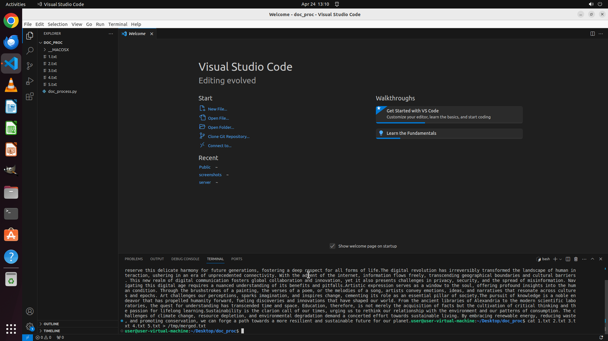

**Response:**
```
Good, the merged file has been created. Now I'll use a Python script to create the .docx file with LibreOffice Writer using a macro approach. But first, let me use a simpler approach - open the merged text file in LibreOffice Writer, set the font size to 10, and save as .docx.

Let me use a Python script with the `python-docx` library or use LibreOffice command line. Let me first check if python-docx is available:
```

**Actions:** `import subprocess, shlex; subprocess.run(f'xdotool type --delay 12 -- ' + shlex.quote('python3 -c "import docx; print(\'available\')" 2>&1\n'), shell=True, check=True)
import time; time.sleep(0.05)`

---

## Step 7

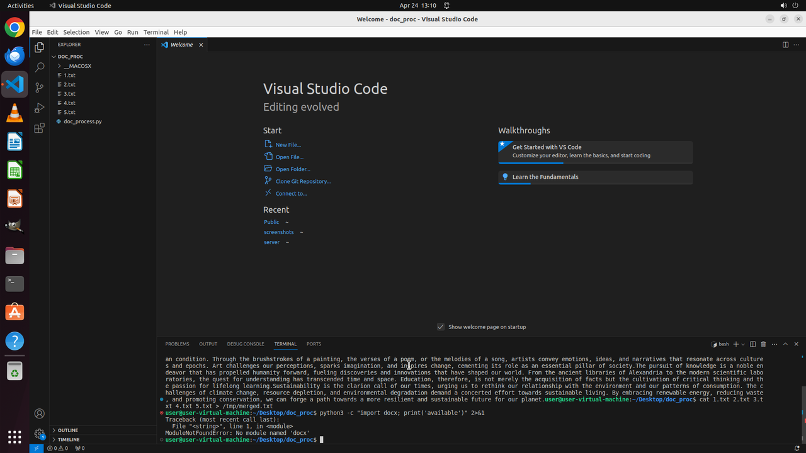

**Response:**
```
The `python-docx` module is not available. Let me install it first:
```

**Actions:** `import subprocess, shlex; subprocess.run(f'xdotool type --delay 12 -- ' + shlex.quote('pip3 install python-docx\n'), shell=True, check=True)
import time; time.sleep(0.05)`

---

## Step 8

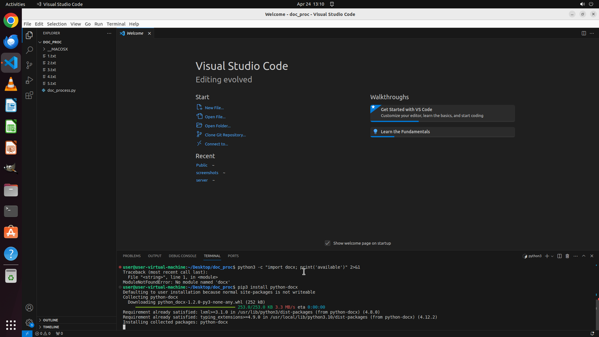

**Response:**
```
Good, python-docx is being installed. Let me wait for it to complete.
```

**Actions:** `time.sleep(0.5)`

---

## Step 9

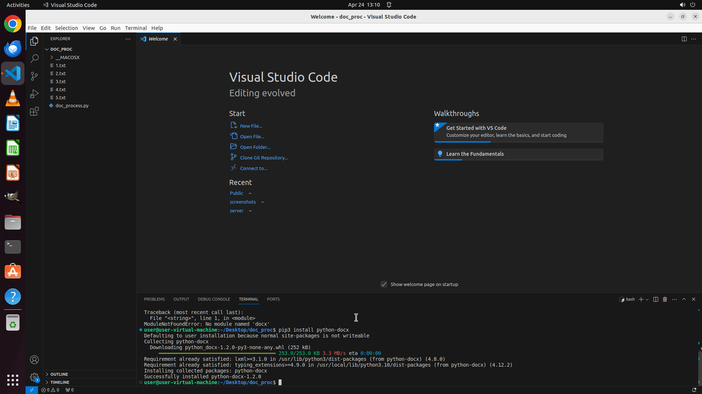

**Response:**
```
python-docx is installed successfully. Now let me create a Python script to generate the docx file with the merged content and font size 10. However, the task says to use LibreOffice Writer. Let me take a different approach - I'll open the merged text file in LibreOffice Writer, set the font size, and save as .docx.

Let me first open the merged file in LibreOffice Writer:
```

**Actions:** `import subprocess, shlex; subprocess.run(f'xdotool type --delay 12 -- ' + shlex.quote('soffice --writer /tmp/merged.txt &\n'), shell=True, check=True)
import time; time.sleep(0.05)`

---

## Step 10

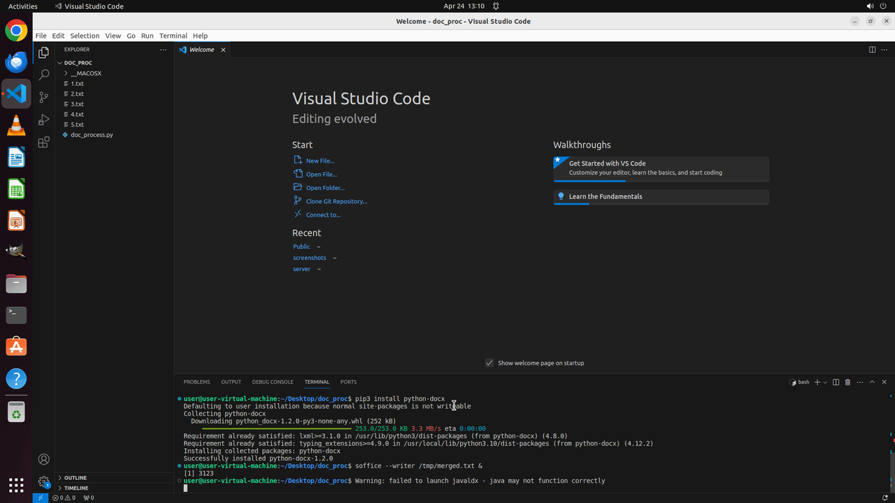

**Response:**
```
LibreOffice is starting. Let me wait for it to open.
```

**Actions:** `time.sleep(0.5)`

---

## Step 11

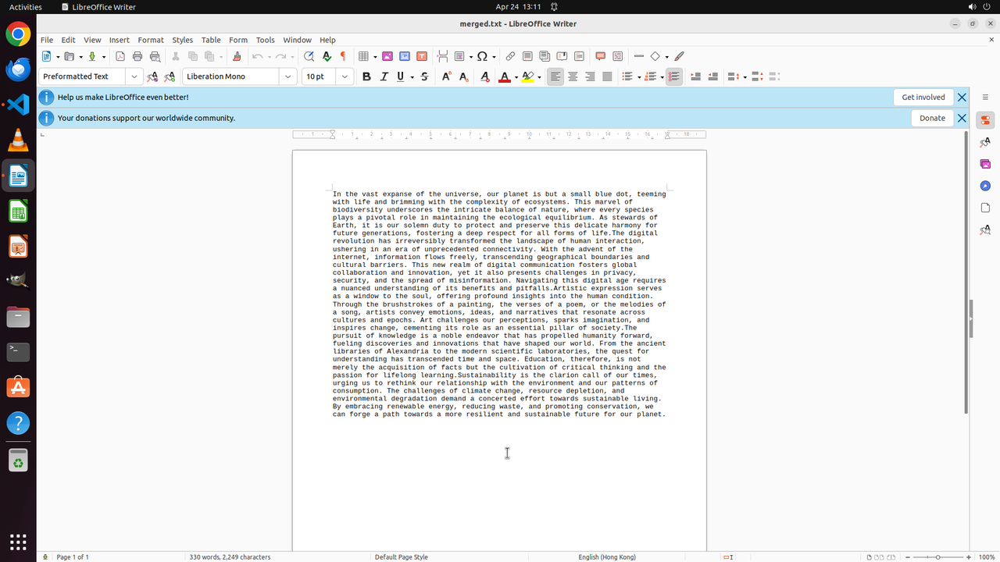

**Response:**
```
LibreOffice Writer has opened the merged text file. I can see the content is displayed with "Preformatted Text" style and "Liberation Mono" font at 10pt. I need to:

1. Select all text
2. Change the font to a regular font (not monospace) and set font size to 10
3. Save as .docx on the Desktop

Let me first select all text with Ctrl+A:
```

**Actions:** `pyautogui.keyDown('ctrl')
pyautogui.keyDown('a')
pyautogui.keyUp('a')
pyautogui.keyUp('ctrl')`

---

## Step 12

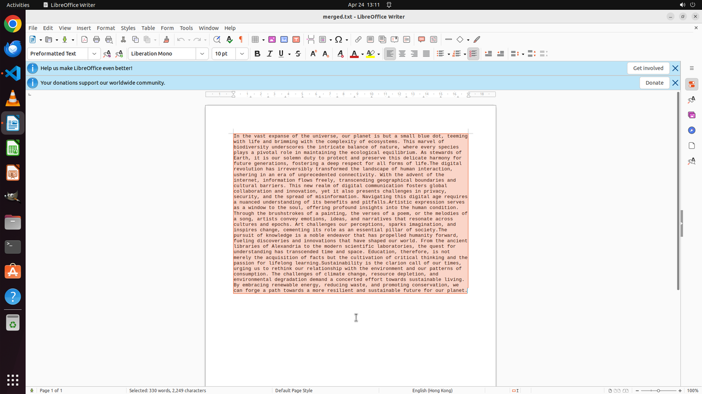

**Response:**
```
All text is selected (330 words, 2,249 characters). Now I need to set the font size to 10. I can see the font size is already showing "10 pt" in the toolbar. But I should also change the paragraph style from "Preformatted Text" to "Default Paragraph Style" to use a regular font. Let me first change the paragraph style:
```

**Actions:** `pyautogui.tripleClick(165, 145)`

---

## Step 13

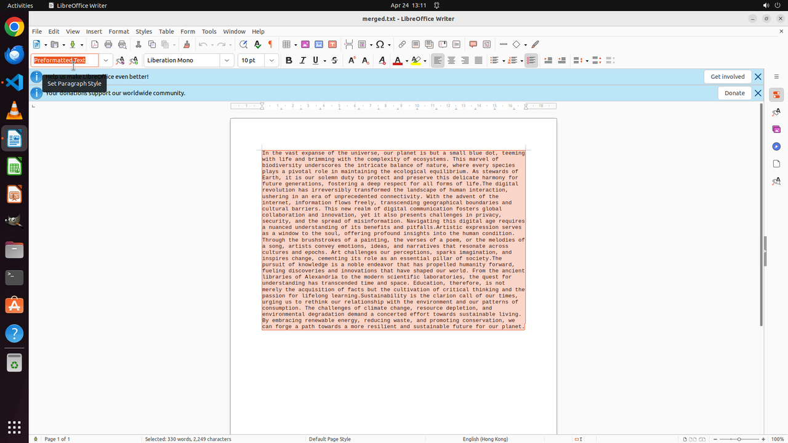

**Response:**
```
I can see the paragraph style dropdown is selected with "Preformatted Text" highlighted. Let me type "Default Paragraph Style" to change it:
```

**Actions:** `import subprocess, shlex; subprocess.run(f'xdotool type --delay 12 -- ' + shlex.quote('Default Paragraph Style'), shell=True, check=True)
import time; time.sleep(0.05)`

---

## Step 14

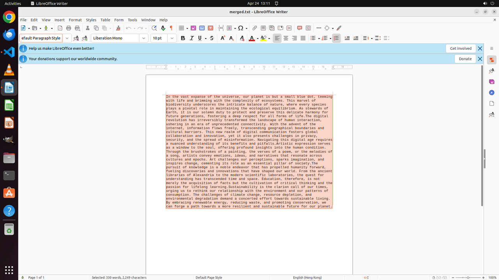

**Response:**
```
I can see "efault Paragraph Style" in the style dropdown (it seems the "D" was cut off in display but it says "Default Paragraph Style"). Let me press Enter to apply this style:
```

**Actions:** `pyautogui.keyDown('return')
pyautogui.keyUp('return')`

---

## Step 15

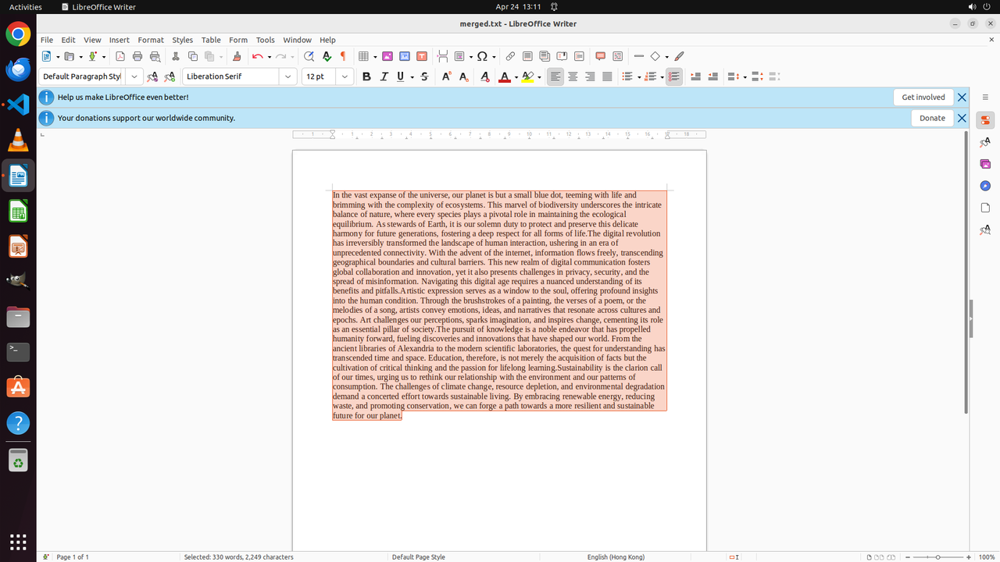

**Response:**
```
The paragraph style has been changed to "Default Paragraph Style" with "Liberation Serif" font at 12pt. Now I need to change the font size to 10pt. The text is still selected. Let me click on the font size field and change it to 10:
```

**Actions:** `pyautogui.tripleClick(627, 145)`

---

## Step 16

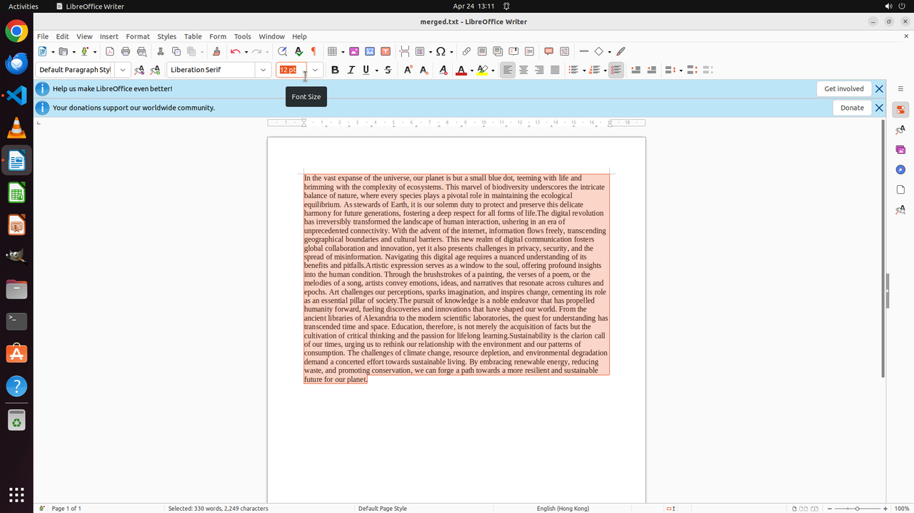

**Response:**
```
The font size field is selected showing "12pt". Let me type "10" to change it to 10pt:
```

**Actions:** `import subprocess, shlex; subprocess.run(f'xdotool type --delay 12 -- ' + shlex.quote('10'), shell=True, check=True)
import time; time.sleep(0.05)`

---

## Step 17


**Response:**
```
I can see the font size field now shows "10". Let me press Enter to apply the font size change:
```

**Actions:** `pyautogui.keyDown('return')
pyautogui.keyUp('return')`

---

## Step 18


**Response:**
```
The font size has been changed to 10pt and the text is now displayed in the "Default Paragraph Style" with "Liberation Serif" font at 10pt. The text is still selected. Now I need to save this file as "concat.docx" on the Desktop. Let me use "Save As" (Ctrl+Shift+S):
```

**Actions:** `pyautogui.keyDown('ctrl')
pyautogui.keyDown('shift')
pyautogui.keyDown('s')
pyautogui.keyUp('s')
pyautogui.keyUp('shift')
pyautogui.keyUp('ctrl')`

---

## Step 19

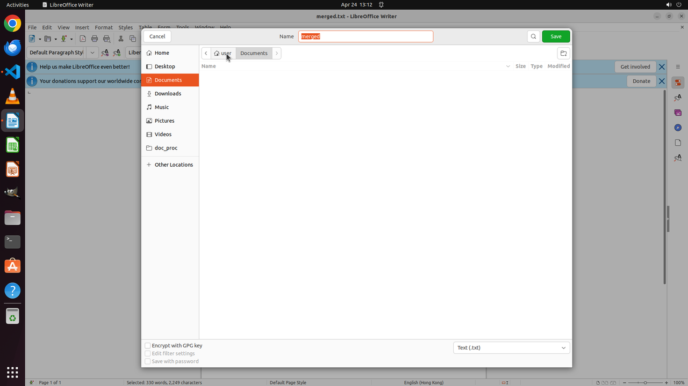

**Response:**
```
The Save As dialog is open. I need to:
1. Navigate to Desktop
2. Change the filename to "concat"
3. Change the file type to .docx format

First, let me click on "Desktop":
```

**Actions:** `pyautogui.click(459, 184)`

---

## Step 20

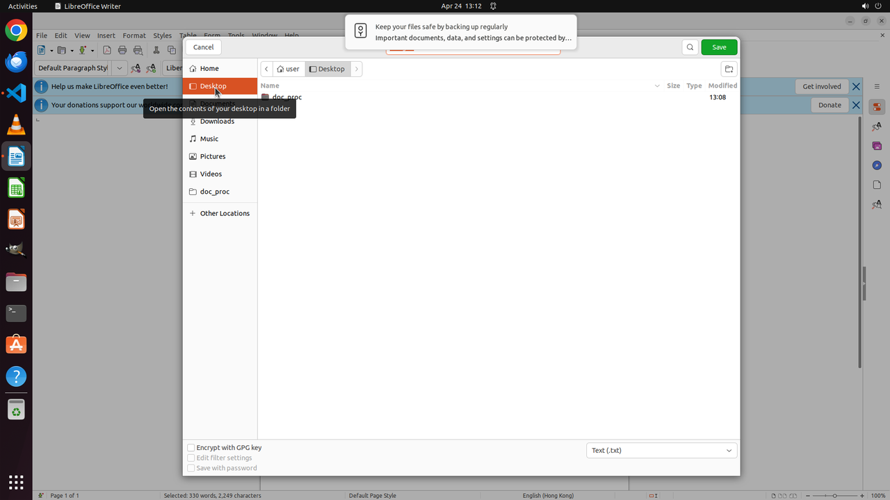

**Response:**
```
I'm now in the Desktop folder. I can see the "doc_proc" folder there. Now I need to:
1. Change the filename to "concat"
2. Change the file type to .docx format

Let me first change the file type. I'll click on the file type dropdown that currently shows "Text (.txt)":
```

**Actions:** `pyautogui.click(1423, 973)`

---

## Step 21

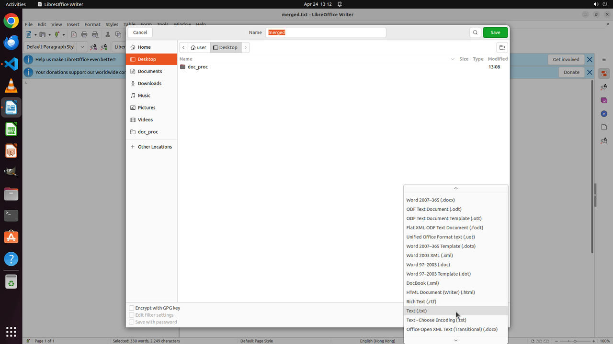

**Response:**
```
I can see the file type dropdown is open with various format options. I need to select "Word 2007-365 (.docx)" format:
```

**Actions:** `pyautogui.click(1344, 627)`

---

## Step 22

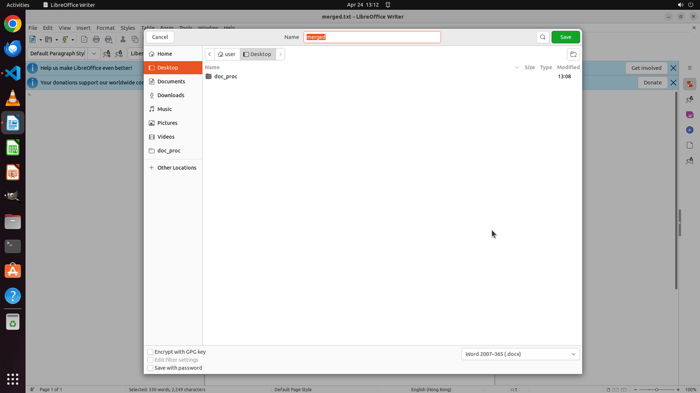

**Response:**
```
The file type is now set to "Word 2007-365 (.docx)". Now I need to change the filename from "merged" to "concat". Let me clear the filename field and type "concat":
```

**Actions:** `pyautogui.tripleClick(1014, 100)`

---

## Step 23


**Response:**
```
The filename "merged" is selected. Let me type "concat" to replace it:
```

**Actions:** `import subprocess, shlex; subprocess.run(f'xdotool type --delay 12 -- ' + shlex.quote('concat'), shell=True, check=True)
import time; time.sleep(0.05)`

---

## Step 24

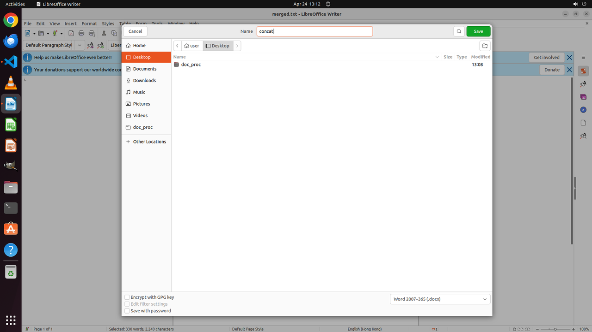

**Response:**
```
The filename is now "concat" and the file type is "Word 2007-365 (.docx)", and we're in the Desktop directory. Let me click "Save" to save the file:
```

**Actions:** `pyautogui.click(1548, 100)`

---

## Step 25

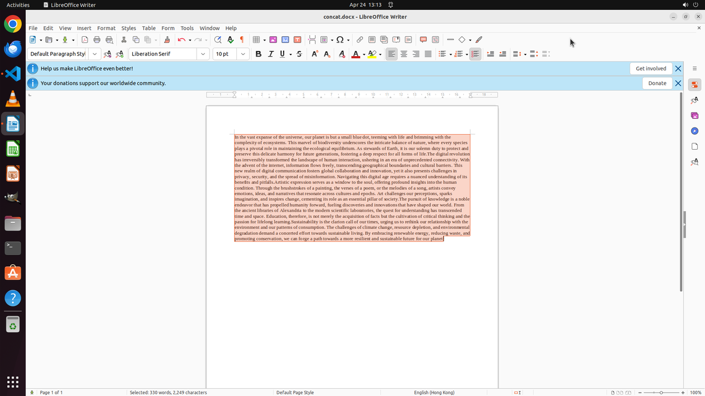

**Response:**
```
The file has been saved successfully as "concat.docx" on the Desktop. I can see the title bar now shows "concat.docx - LibreOffice Writer". The document contains the merged content from all 5 text files with:
- Default Paragraph Style
- Liberation Serif font
- Font size 10pt

The task is complete. The file "concat.docx" has been created on the Desktop with the merged contents of all .txt files from the VS Code project, with the font size set to 10.

DONE
```

**Actions:** `DONE`

---
