# Task a82b78bb-7fde-4cb3-94a4-035baf10bcf0

**Instruction:** I'm really enjoying this paper. Could you please locate the personal webpages of the initial author and the last three authors? Please include them in a browser bookmark folder titled 'Liked Authors' under the 'Bookmarks bar'.

**Score:** 1.0

**Wall clock:** 6m 51s

**Steps:** 44

**Cost:** $1.45

---

## Step 1


**Response:**
```
I need to find the authors of this paper. Let me scroll to the first page to see the author list.
```

**Actions:** `pyautogui.click(22, 22)`

---

## Step 2


**Response:**
```
I need to go to page 1 to see the authors. Let me navigate to the first page.
```

**Actions:** `pyautogui.tripleClick(73, 22)`

---

## Step 3

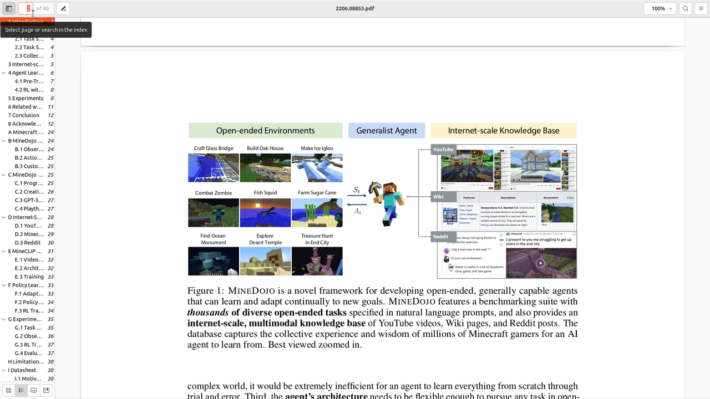

**Actions:** `import subprocess, shlex; subprocess.run(f'xdotool type --delay 12 -- ' + shlex.quote('1\n'), shell=True, check=True)
import time; time.sleep(0.05)`

---

## Step 4


**Response:**
```
I see a dropdown with sections. Let me click on "1 Introduction" to go to page 1, or let me just scroll up to the top of the document.
```

**Actions:** `pyautogui.keyDown('esc')
pyautogui.keyUp('esc')`

---

## Step 5

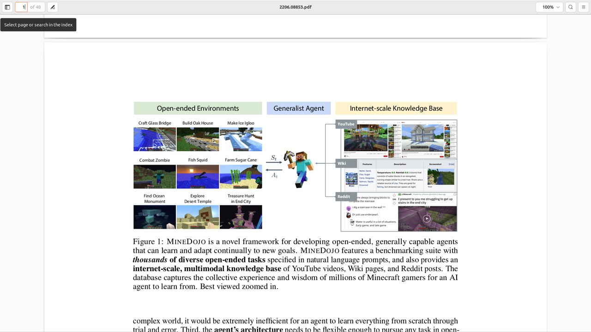

**Response:**
```
It shows page 1 but I'm still seeing the same content. I need to scroll up to see the title and authors at the top of page 1.
```

**Actions:** `pyautogui.scroll(15, 960, 600)`

---

## Step 6


**Response:**
```
I can see some authors but I need to scroll up a bit more to see the full author list, including the first author.
```

**Actions:** `pyautogui.scroll(5, 960, 600)`

---

## Step 7


**Response:**
```
Now I can see the full author list for the paper "MINEDOJO: Building Open-Ended Embodied Agents with Internet-Scale Knowledge":

Authors in order:
1. **Linxi Fan** (first author)
2. Guanzhi Wang
3. Yunfan Jiang
4. Ajay Mandlekar
5. Yuncong Yang
6. Haoyi Zhu
7. Andrew Tang
8. **De-An Huang** (third from last)
9. **Yuke Zhu** (second from last)
10. **Anima Anandkumar** (last author)

I need to find the personal webpages of:
- **Linxi Fan** (first author)
- **De-An Huang** (third from last)
- **Yuke Zhu** (second from last)
- **Anima Anandkumar** (last author)

Let me open Chrome to search for their personal webpages.
```

**Actions:** `pyautogui.keyDown('ctrl')
pyautogui.keyDown('l')
pyautogui.keyUp('l')
pyautogui.keyUp('ctrl')`

---

## Step 8


**Response:**
```
This is a PDF viewer, not Chrome. I need to open Chrome browser. Let me look for it on the desktop or taskbar.
```

**Actions:** `pyautogui.keyDown('command')
pyautogui.keyUp('command')`

---

## Step 9

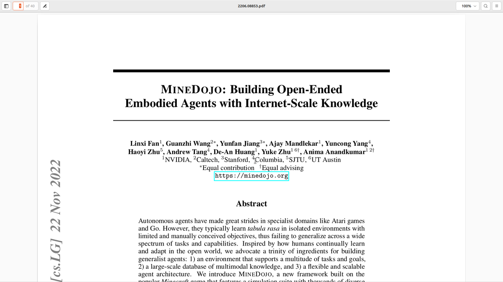

**Response:**
```
Let me try to open a terminal to launch Chrome.
```

**Actions:** `pyautogui.keyDown('ctrl')
pyautogui.keyDown('alt')
pyautogui.keyDown('t')
pyautogui.keyUp('t')
pyautogui.keyUp('alt')
pyautogui.keyUp('ctrl')`

---

## Step 10

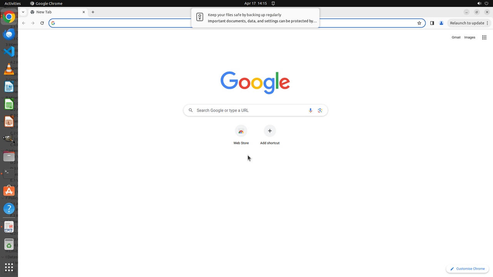

**Response:**
```
Good, I have a terminal open. Let me launch Chrome with the remote debugging port.
```

**Actions:** `import subprocess, shlex; subprocess.run(f'xdotool type --delay 12 -- ' + shlex.quote('google-chrome --remote-debugging-port=1337 &\n'), shell=True, check=True)
import time; time.sleep(0.05)`

---

## Step 11

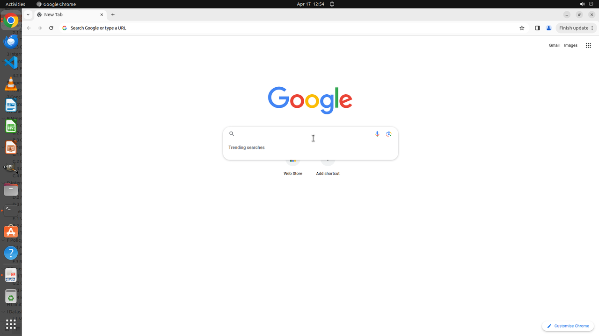

**Response:**
```
Chrome is open. Now I need to find the personal webpages of:
1. **Linxi Fan** (first author)
2. **De-An Huang** (third from last)
3. **Yuke Zhu** (second from last)
4. **Anima Anandkumar** (last author)

Let me first search for Linxi Fan's personal webpage.
```

**Actions:** `import subprocess, shlex; subprocess.run(f'xdotool type --delay 12 -- ' + shlex.quote('Linxi Fan personal webpage'), shell=True, check=True)
import time; time.sleep(0.05)`

---

## Step 12

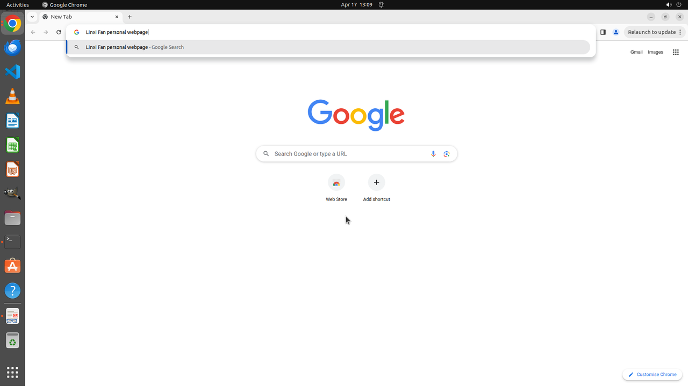

**Actions:** `pyautogui.keyDown('return')
pyautogui.keyUp('return')`

---

## Step 13

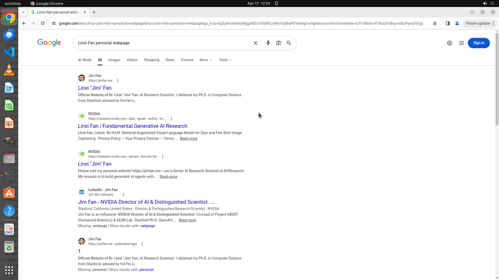

**Response:**
```
I can see that Linxi "Jim" Fan's personal website is https://jimfan.me. Let me click on it to verify.
```

**Actions:** `pyautogui.click(363, 336)`

---

## Step 14


**Response:**
```
This is Linxi "Jim" Fan's personal webpage at jimfan.me. Now I need to bookmark this page. But first, let me create the "Liked Authors" folder in the bookmarks bar and add all four bookmarks. Let me first make sure the bookmarks bar is visible, then I'll bookmark this page.

Let me first create the bookmark folder. I'll use Ctrl+D to bookmark this page.
```

**Actions:** `pyautogui.keyDown('ctrl')
pyautogui.keyDown('d')
pyautogui.keyUp('d')
pyautogui.keyUp('ctrl')`

---

## Step 15

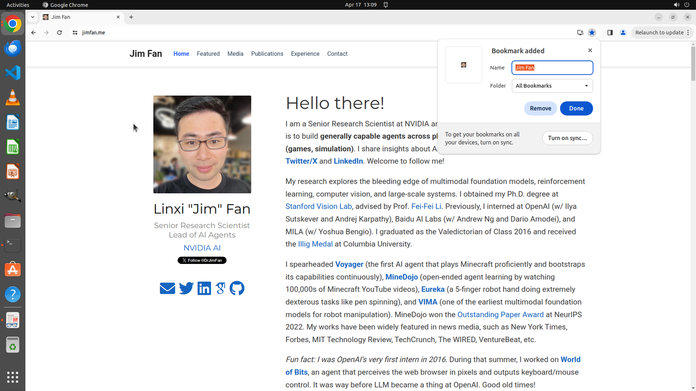

**Response:**
```
I see a bookmark dialog. I need to change the folder to "Bookmarks bar" and create a new folder called "Liked Authors". Let me first click on the Folder dropdown.
```

**Actions:** `pyautogui.click(1518, 235)`

---

## Step 16


**Response:**
```
I can see the folder options. I need to create a new folder called "Liked Authors" under the Bookmarks bar. Let me click on "Choose another folder..." to access more options.
```

**Actions:** `pyautogui.click(1513, 352)`

---

## Step 17

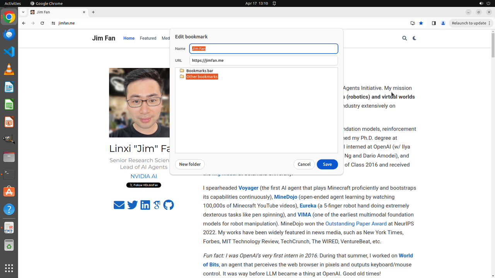

**Response:**
```
I can see the "Edit bookmark" dialog with folder options. I need to first select "Bookmarks bar" and then create a new folder called "Liked Authors". Let me click on "Bookmarks bar" first.
```

**Actions:** `pyautogui.click(778, 274)`

---

## Step 18

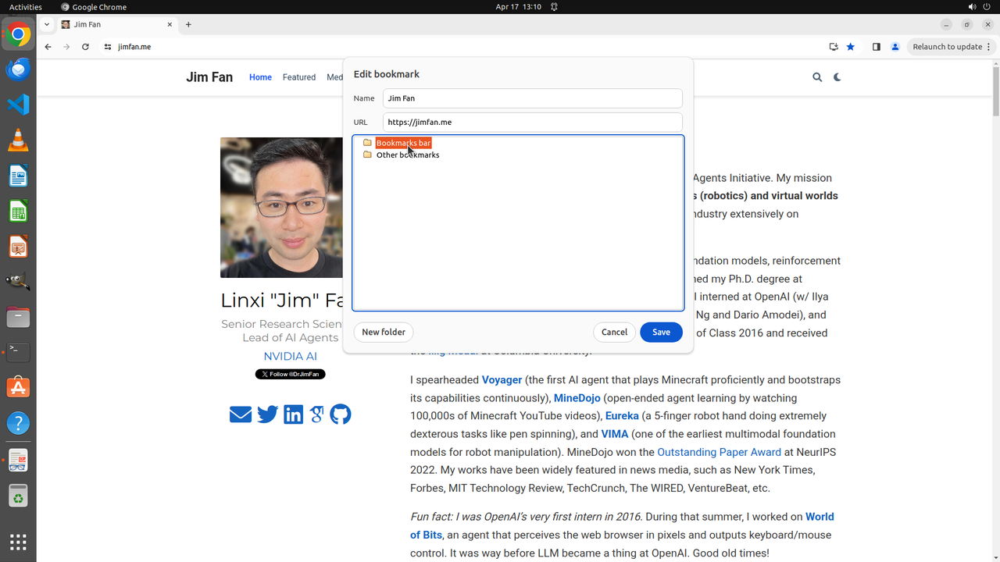

**Response:**
```
"Bookmarks bar" is now selected. Now I need to create a new folder called "Liked Authors" inside it. Let me click "New folder".
```

**Actions:** `pyautogui.click(736, 637)`

---

## Step 19

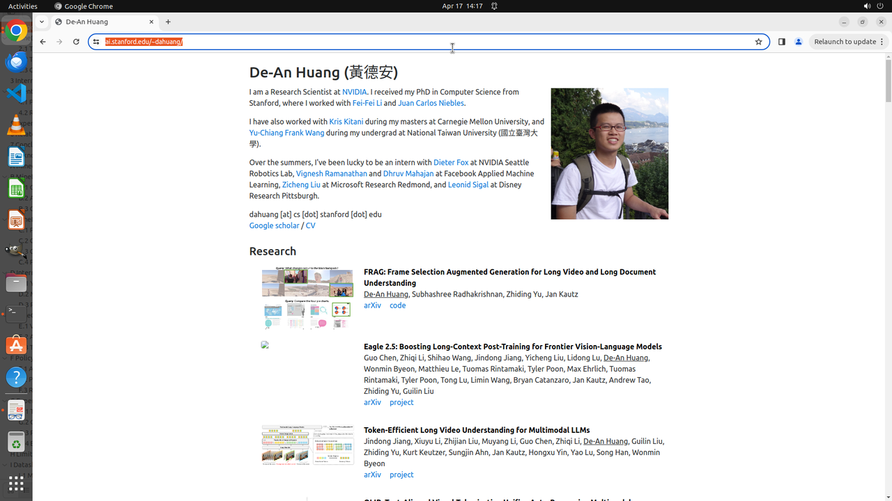

**Response:**
```
A new folder has been created under "Bookmarks bar" with the default name "New folder". I need to type "Liked Authors" to rename it.
```

**Actions:** `import subprocess, shlex; subprocess.run(f'xdotool type --delay 12 -- ' + shlex.quote('Liked Authors'), shell=True, check=True)
import time; time.sleep(0.05)`

---

## Step 20

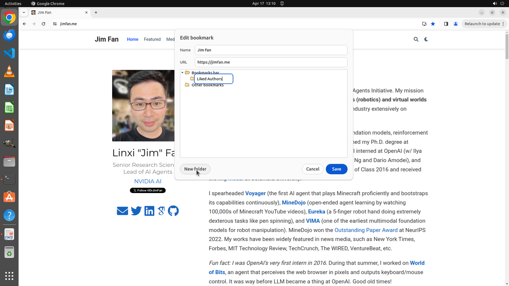

**Response:**
```
The folder "Liked Authors" has been created under "Bookmarks bar". Now let me click "Save" to save this bookmark in the "Liked Authors" folder.
```

**Actions:** `pyautogui.click(1266, 637)`

---

## Step 21


**Response:**
```
Linxi Fan's page has been bookmarked in the "Liked Authors" folder. Now I need to search for De-An Huang's personal webpage. Let me search for it.
```

**Actions:** `pyautogui.click(900, 88)`

---

## Step 22

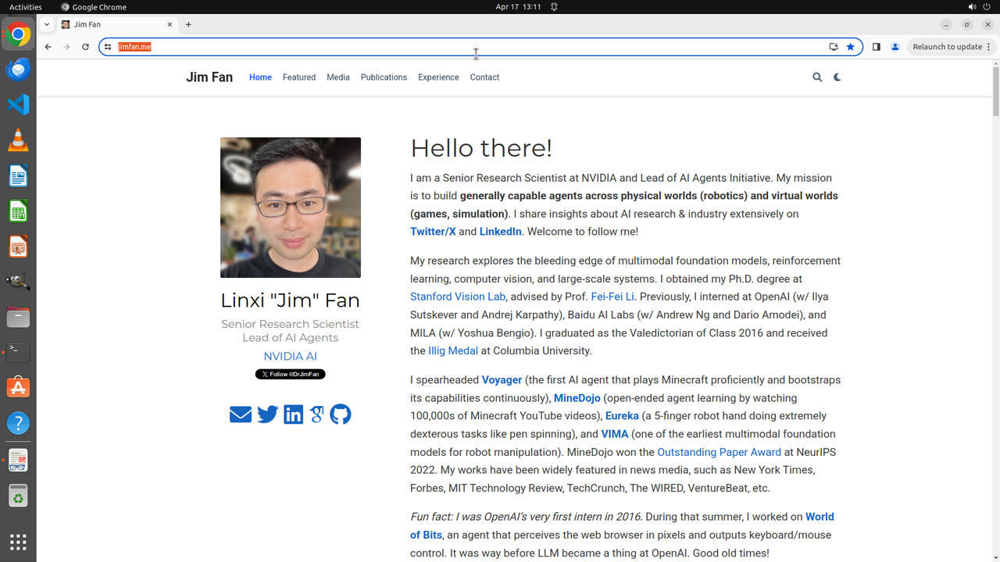

**Response:**
```
Good, the URL bar is selected. Now let me search for De-An Huang's personal webpage.
```

**Actions:** `import subprocess, shlex; subprocess.run(f'xdotool type --delay 12 -- ' + shlex.quote('De-An Huang personal webpage'), shell=True, check=True)
import time; time.sleep(0.05)`

---

## Step 23

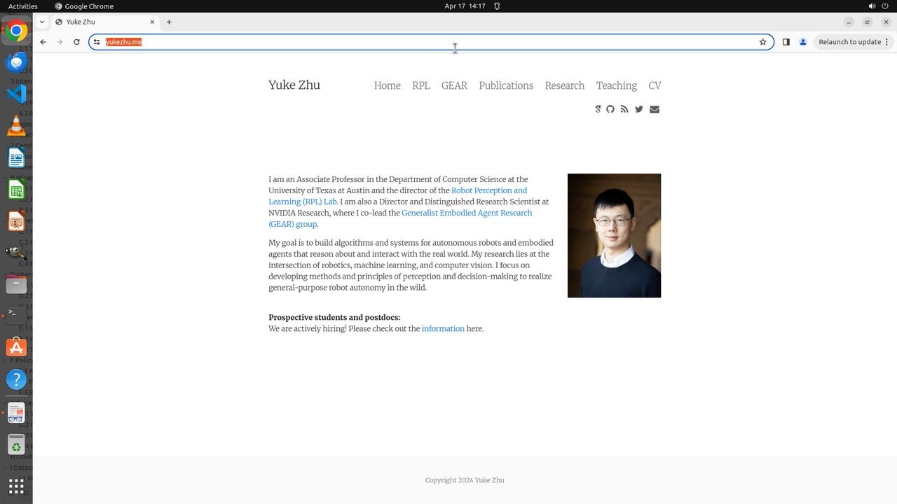

**Actions:** `pyautogui.keyDown('return')
pyautogui.keyUp('return')`

---

## Step 24


**Response:**
```
I can see De-An Huang's personal webpage at Stanford AI Lab (https://ai.stanford.edu/~dahuang). Let me click on the first result to verify.
```

**Actions:** `pyautogui.click(361, 336)`

---

## Step 25

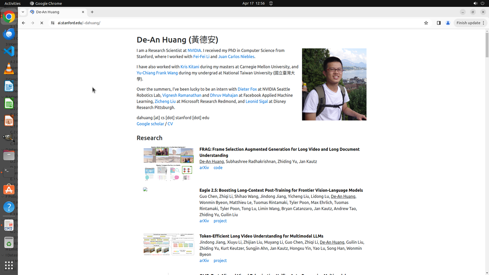

**Response:**
```
This is De-An Huang's personal webpage at ai.stanford.edu/~dahuang/. Let me bookmark this page in the "Liked Authors" folder.
```

**Actions:** `pyautogui.keyDown('ctrl')
pyautogui.keyDown('d')
pyautogui.keyUp('d')
pyautogui.keyUp('ctrl')`

---

## Step 26

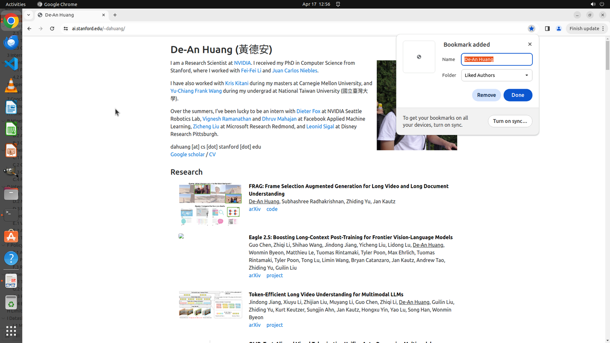

**Response:**
```
The bookmark dialog shows it's already set to the "Liked Authors" folder. Let me click "Done" to save it.
```

**Actions:** `pyautogui.click(1585, 298)`

---

## Step 27

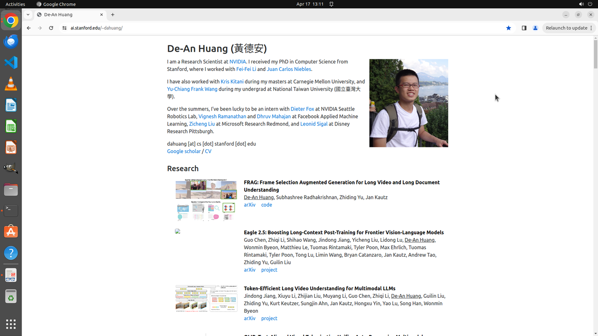

**Response:**
```
De-An Huang's page is bookmarked. Now I need to search for Yuke Zhu's personal webpage. Let me search for it.
```

**Actions:** `pyautogui.click(900, 88)`

---

## Step 28

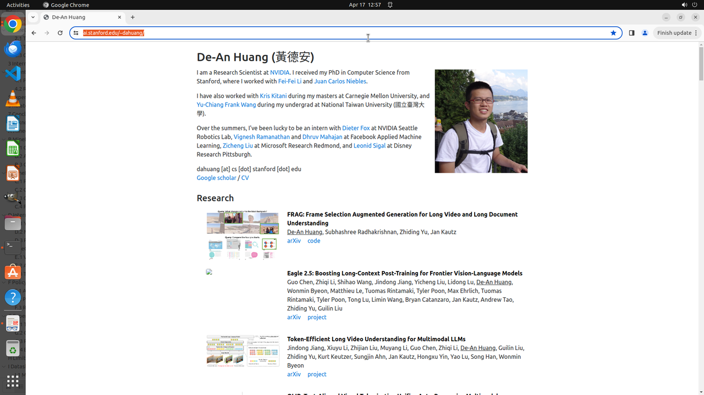

**Response:**
```
Good, the URL bar is selected. Let me search for Yuke Zhu's personal webpage.
```

**Actions:** `import subprocess, shlex; subprocess.run(f'xdotool type --delay 12 -- ' + shlex.quote('Yuke Zhu personal webpage'), shell=True, check=True)
import time; time.sleep(0.05)`

---

## Step 29

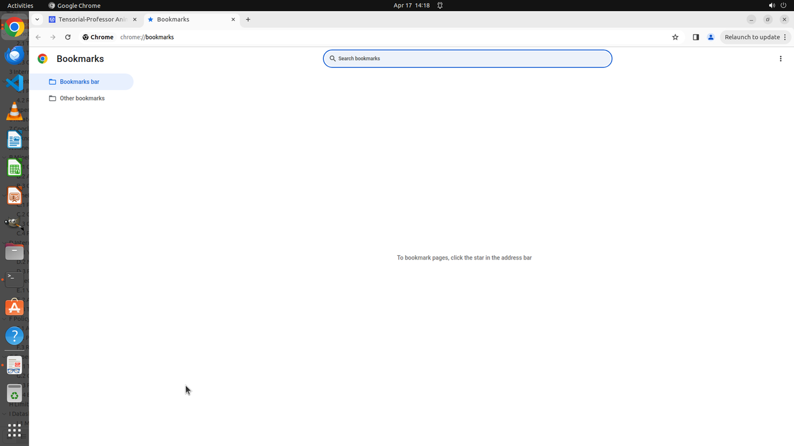

**Actions:** `pyautogui.keyDown('return')
pyautogui.keyUp('return')`

---

## Step 30

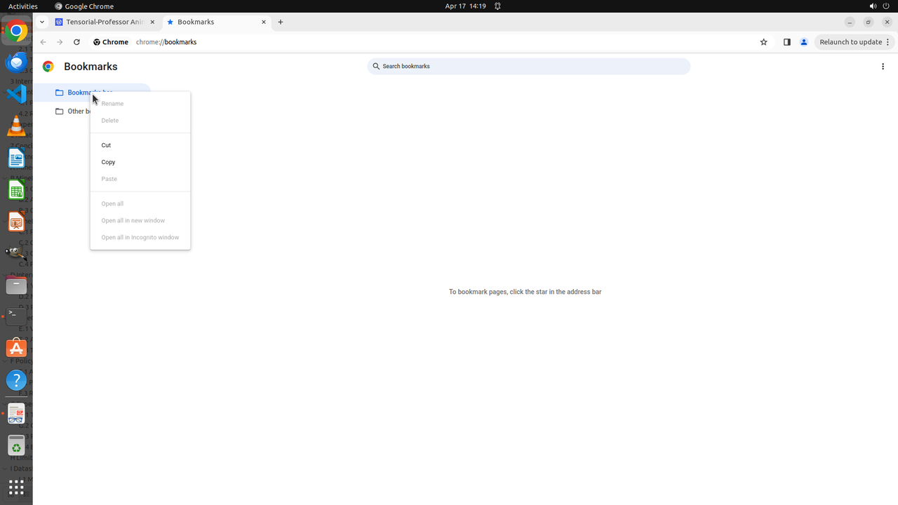

**Response:**
```
I can see Yuke Zhu's personal webpage at https://yukezhu.me. Let me click on it.
```

**Actions:** `pyautogui.click(342, 336)`

---

## Step 31

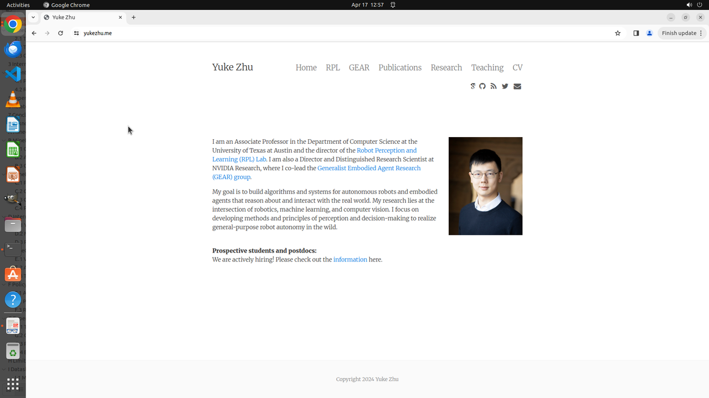

**Response:**
```
This is Yuke Zhu's personal webpage at yukezhu.me. Let me bookmark it in the "Liked Authors" folder.
```

**Actions:** `pyautogui.keyDown('ctrl')
pyautogui.keyDown('d')
pyautogui.keyUp('d')
pyautogui.keyUp('ctrl')`

---

## Step 32

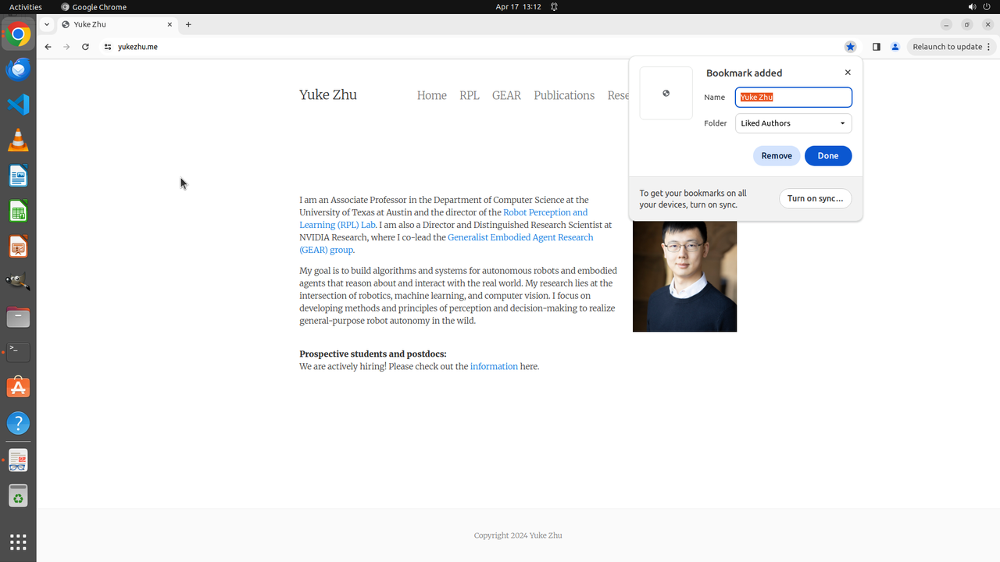

**Response:**
```
The bookmark is already set to the "Liked Authors" folder. Let me click "Done" to save it.
```

**Actions:** `pyautogui.click(1585, 298)`

---

## Step 33

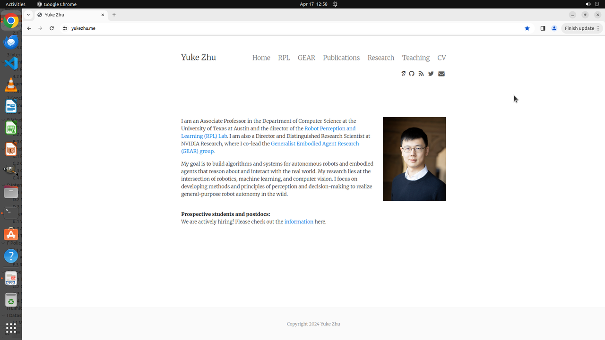

**Response:**
```
Yuke Zhu's page is bookmarked. Now I need to search for the last author, Anima Anandkumar's personal webpage. Let me search for it.
```

**Actions:** `pyautogui.click(900, 88)`

---

## Step 34

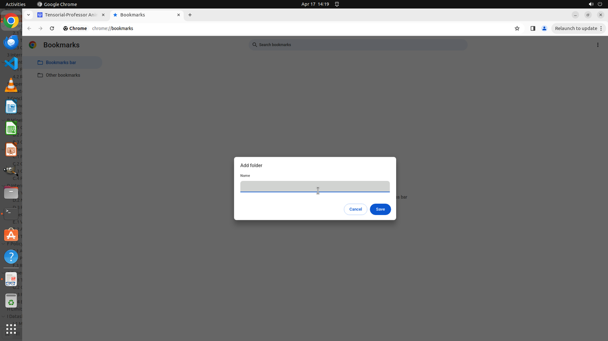

**Response:**
```
Good, the URL bar is selected. Let me search for Anima Anandkumar's personal webpage.
```

**Actions:** `import subprocess, shlex; subprocess.run(f'xdotool type --delay 12 -- ' + shlex.quote('Anima Anandkumar personal webpage'), shell=True, check=True)
import time; time.sleep(0.05)`

---

## Step 35

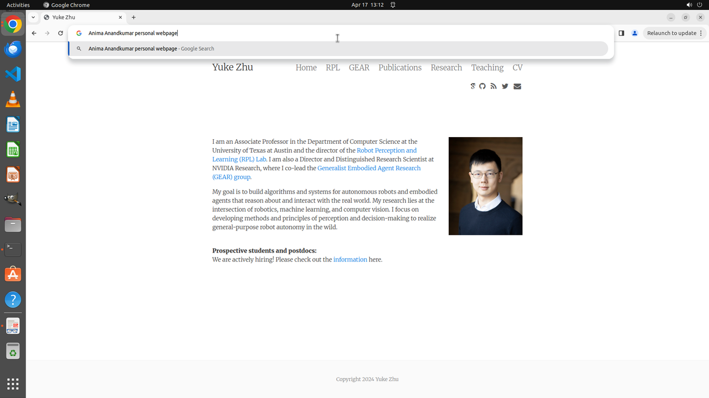

**Actions:** `pyautogui.keyDown('return')
pyautogui.keyUp('return')`

---

## Step 36

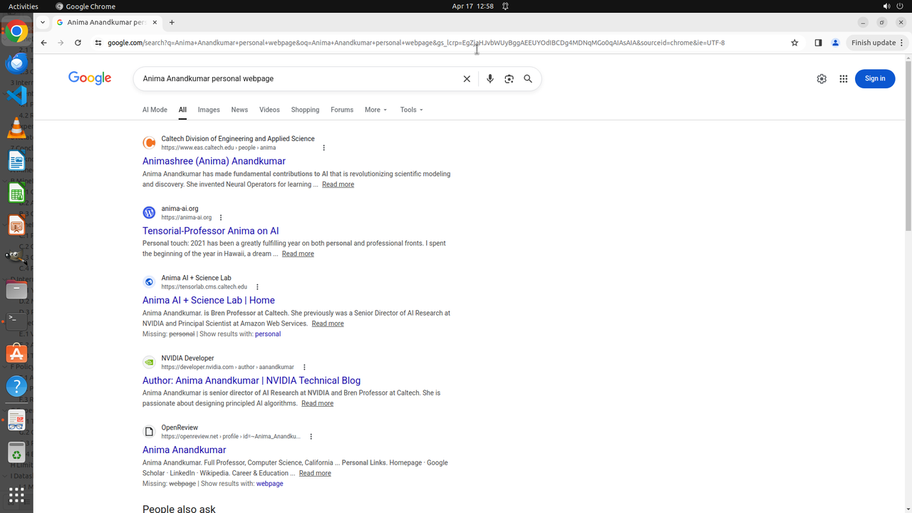

**Response:**
```
I can see several results for Anima Anandkumar. The most relevant personal webpage appears to be her Caltech page or anima-ai.org. Let me check her personal site at anima-ai.org first, but the Caltech page seems more like an official personal page. Let me also consider the "Anima AI + Science Lab" at tensorlab.cms.caltech.edu. 

Let me click on the anima-ai.org result which seems to be her personal blog/website.
```

**Actions:** `pyautogui.click(444, 484)`

---

## Step 37

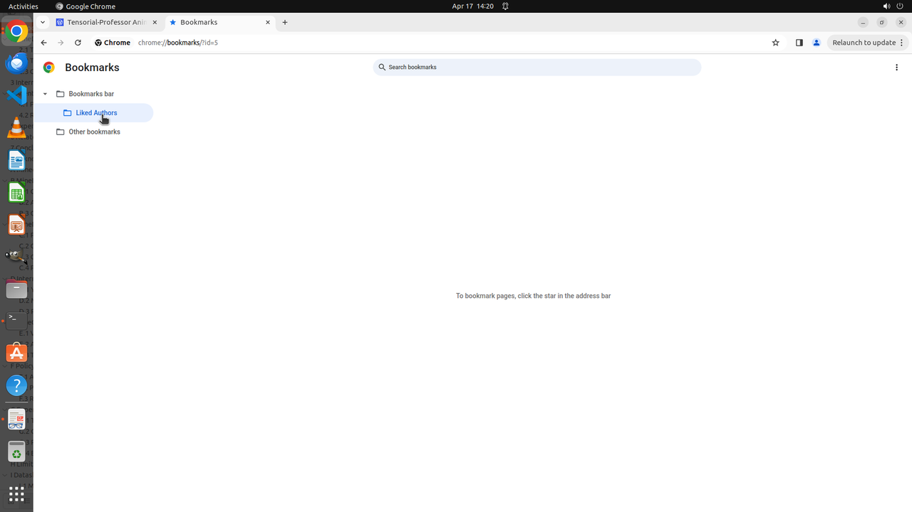

**Response:**
```
This is anima-ai.org, which appears to be Anima Anandkumar's personal blog/website. However, this looks more like a blog. Let me go back and check her Caltech page which might be her more official personal webpage. Actually, looking at the search results again, let me check if the Caltech page is her personal academic homepage. Let me go back.
```

**Actions:** `pyautogui.click(90, 88)`

---

## Step 38

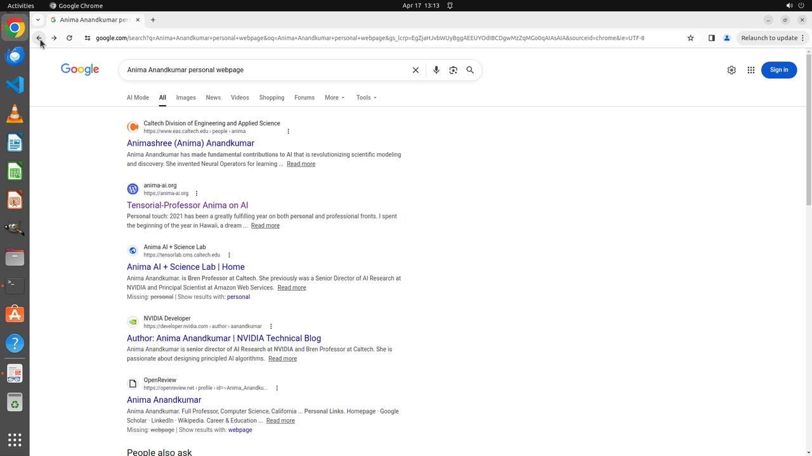

**Response:**
```
Let me click on the first result - the Caltech page which is her official academic personal page.
```

**Actions:** `pyautogui.click(451, 337)`

---

## Step 39


**Response:**
```
I can see Anima Anandkumar's Caltech page. I notice there's a "Personal Website" link on this page. Let me click on it to find her actual personal website.
```

**Actions:** `pyautogui.click(460, 862)`

---

## Step 40

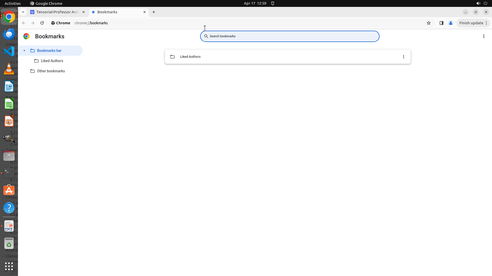

**Response:**
```
This is the "Anima AI + Science Lab" page at tensorlab.cms.caltech.edu/users/anima/. This is her personal/lab website. However, I noticed the "Personal Website" link from the Caltech page directed here. This seems like her personal webpage. Let me bookmark this page in the "Liked Authors" folder.
```

**Actions:** `pyautogui.keyDown('ctrl')
pyautogui.keyDown('d')
pyautogui.keyUp('d')
pyautogui.keyUp('ctrl')`

---

## Step 41

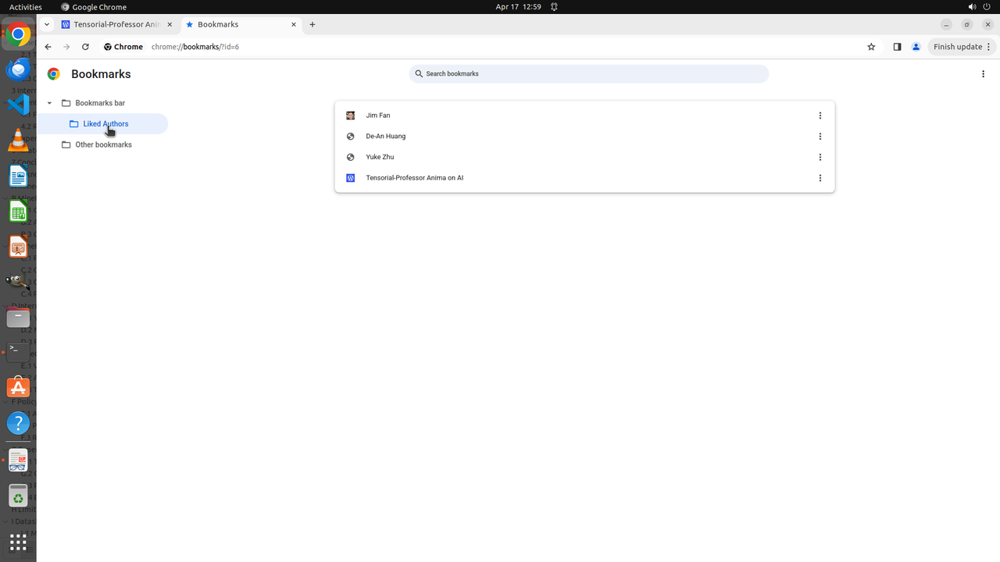

**Response:**
```
The bookmark is already set to the "Liked Authors" folder. Let me click "Done" to save it.
```

**Actions:** `pyautogui.click(1585, 298)`

---

## Step 42

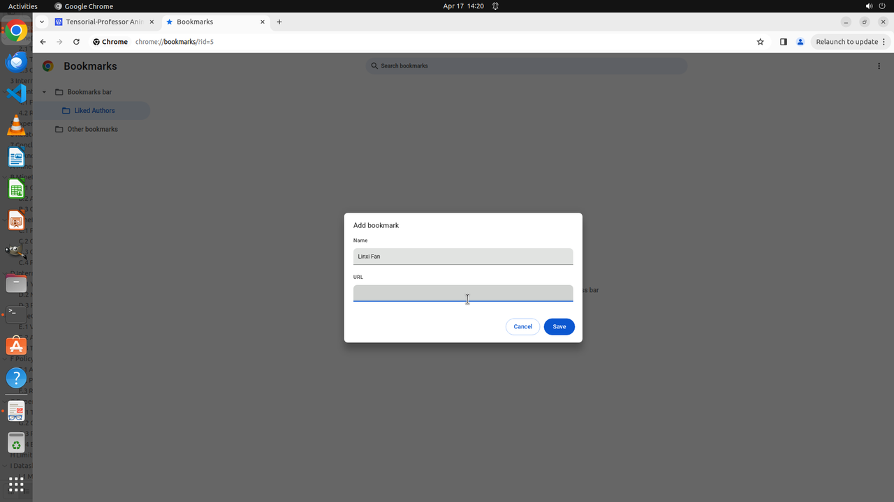

**Response:**
```
All four bookmarks have been added to the "Liked Authors" folder under the Bookmarks bar:

1. **Linxi Fan** (first author) - jimfan.me
2. **De-An Huang** (third from last) - ai.stanford.edu/~dahuang/
3. **Yuke Zhu** (second from last) - yukezhu.me
4. **Anima Anandkumar** (last author) - tensorlab.cms.caltech.edu/users/anima/

Let me verify the bookmarks by checking the bookmark manager.
```

**Actions:** `pyautogui.keyDown('ctrl')
pyautogui.keyDown('shift')
pyautogui.keyDown('o')
pyautogui.keyUp('o')
pyautogui.keyUp('shift')
pyautogui.keyUp('ctrl')`

---

## Step 43

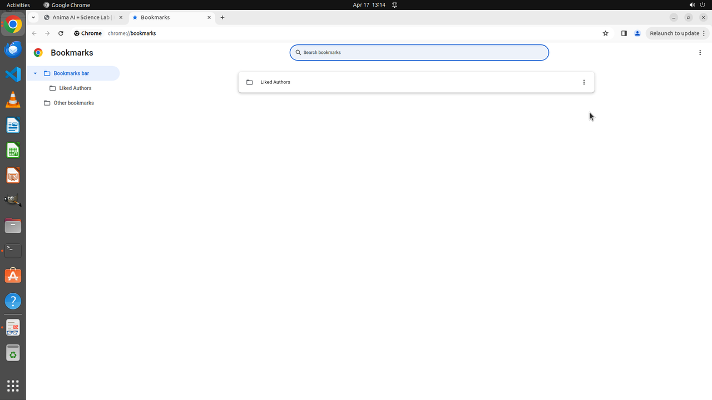

**Response:**
```
I can see the "Liked Authors" folder under the "Bookmarks bar". Let me click on it to verify all four bookmarks are inside.
```

**Actions:** `pyautogui.click(204, 237)`

---

## Step 44

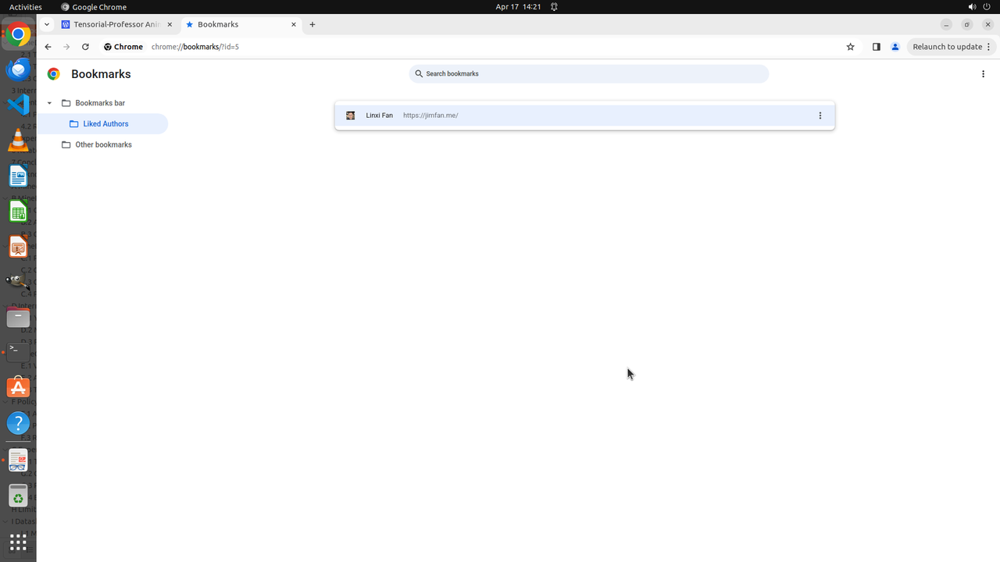

**Response:**
```
All four bookmarks are successfully saved in the "Liked Authors" folder under the "Bookmarks bar":

1. **Jim Fan** (Linxi Fan - first author) - jimfan.me
2. **De-An Huang** (third from last author) - ai.stanford.edu/~dahuang/
3. **Yuke Zhu** (second from last author) - yukezhu.me
4. **Anima AI + Science Lab | Home** (Anima Anandkumar - last author) - tensorlab.cms.caltech.edu/users/anima/

The task is complete!

DONE
```

**Actions:** `DONE`

---
