# Task a82b78bb-7fde-4cb3-94a4-035baf10bcf0

**Instruction:** I'm really enjoying this paper. Could you please locate the personal webpages of the initial author and the last three authors? Please include them in a browser bookmark folder titled 'Liked Authors' under the 'Bookmarks bar'.

**Score:** 0.0

**Wall clock:** 8m 51s

**Steps:** 51

**Cost:** $1.77

---

## Step 1


**Response:**
```
I need to find the paper that the user is referring to. Let me look at the desktop for any files that might be a paper.
```

**Actions:** `time.sleep(0.1)`

---

## Step 2

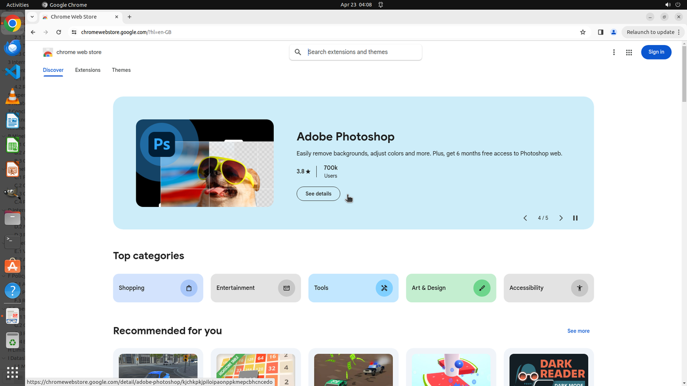

**Response:**
```
I can see several files on the desktop. Let me look more closely at them to find the paper. I'll check the desktop files.
```

**Actions:** `pyautogui.doubleClick(33, 997)`

---

## Step 3

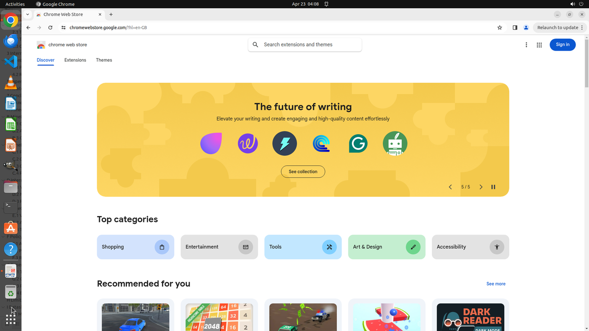

**Response:**
```
I need to find the paper on the desktop. Let me look at the desktop files more carefully. I'll use the file manager to explore.
```

**Actions:** `pyautogui.doubleClick(33, 882)`

---

## Step 4

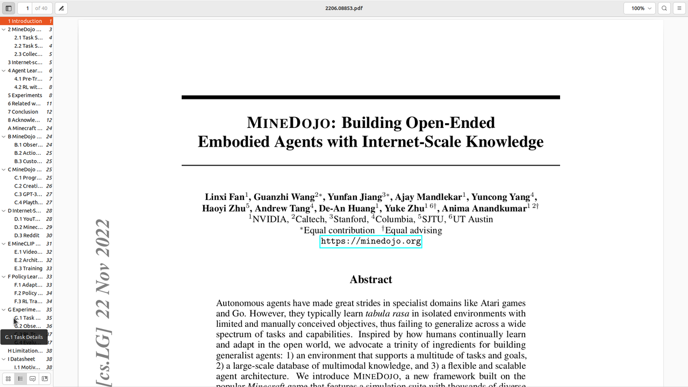

**Response:**
```
I can see the paper "MineDojo: Building Open-Ended Embodied Agents with Internet-Scale Knowledge". The authors listed are:

1. **Linxi Fan** (first author)
2. Guanzhi Wang
3. Yunfan Jiang
4. Ajay Mandlekar
5. Yuncong Yang
6. Haoyi Zhu
7. Andrew Tang
8. De-An Huang
9. **Yuke Zhu** (third from last)
10. **Anima Anandkumar** (last author)

Wait, let me re-read the authors more carefully. The authors are:
1. Linxi Fan (first)
2. Guanzhi Wang
3. Yunfan Jiang
4. Ajay Mandlekar
5. Yuncong Yang
6. Haoyi Zhu
7. Andrew Tang
8. De-An Huang
9. Yuke Zhu
10. Anima Anandkumar

So I need the personal webpages of:
- **Linxi Fan** (first author)
- **De-An Huang** (third to last)
- **Yuke Zhu** (second to last)
- **Anima Anandkumar** (last)

Let me search for their personal webpages. Let me start by searching for each author.
```

**Actions:** `pyautogui.click(361, 46)`

---

## Step 5

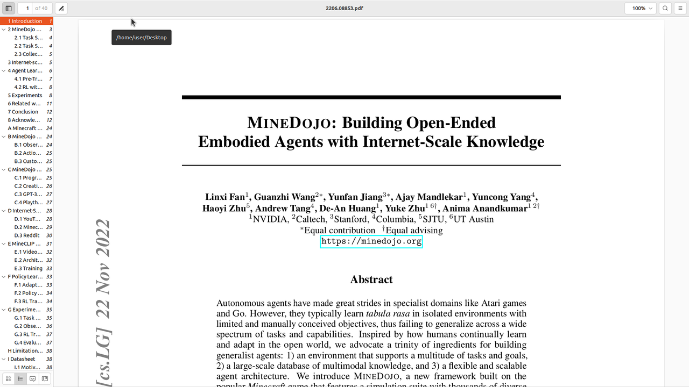

**Response:**
```
I can see the paper clearly now. Let me identify the authors:

1. **Linxi Fan** (first author)
2. Guanzhi Wang
3. Yunfan Jiang
4. Ajay Mandlekar
5. Yuncong Yang
6. Haoyi Zhu
7. Andrew Tang
8. **De-An Huang** (third to last)
9. **Yuke Zhu** (second to last)
10. **Anima Anandkumar** (last)

I need to find personal webpages for: Linxi Fan, De-An Huang, Yuke Zhu, and Anima Anandkumar. Let me open Chrome and search for each.
```

**Actions:** `pyautogui.click(33, 66)`

---

## Step 6

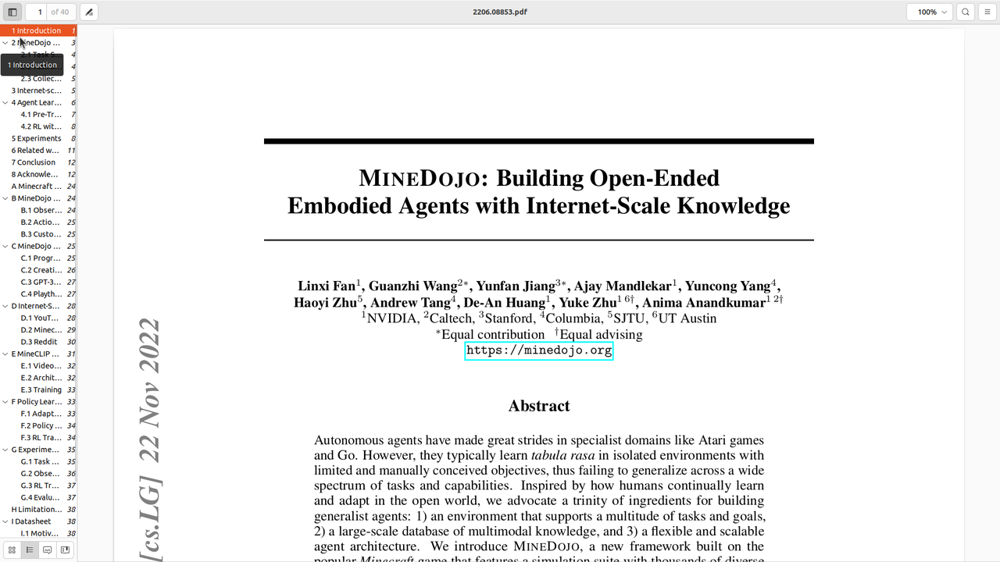

**Response:**
```
Let me click on the Chrome icon in the taskbar to open the browser.
```

**Actions:** `pyautogui.keyDown('command')
pyautogui.keyUp('command')`

---

## Step 7


**Response:**
```
Let me open a terminal to launch Chrome with the required flag.
```

**Actions:** `pyautogui.keyDown('ctrl')
pyautogui.keyDown('alt')
pyautogui.keyDown('t')
pyautogui.keyUp('t')
pyautogui.keyUp('alt')
pyautogui.keyUp('ctrl')`

---

## Step 8

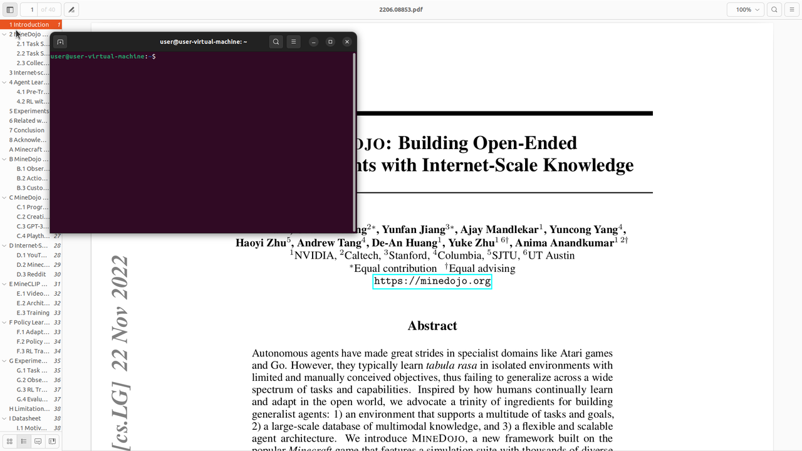

**Response:**
```
Good, I have a terminal open. Let me launch Chrome with the required flag.
```

**Actions:** `import subprocess, shlex; subprocess.run(f'xdotool type --delay 12 -- ' + shlex.quote('google-chrome --remote-debugging-port=1337 &\n'), shell=True, check=True)
import time; time.sleep(0.05)`

---

## Step 9

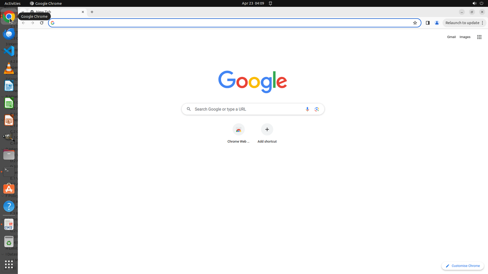

**Response:**
```
Chrome is open. Now let me search for the personal webpage of Linxi Fan first.
```

**Actions:** `pyautogui.click(960, 88)`

---

## Step 10

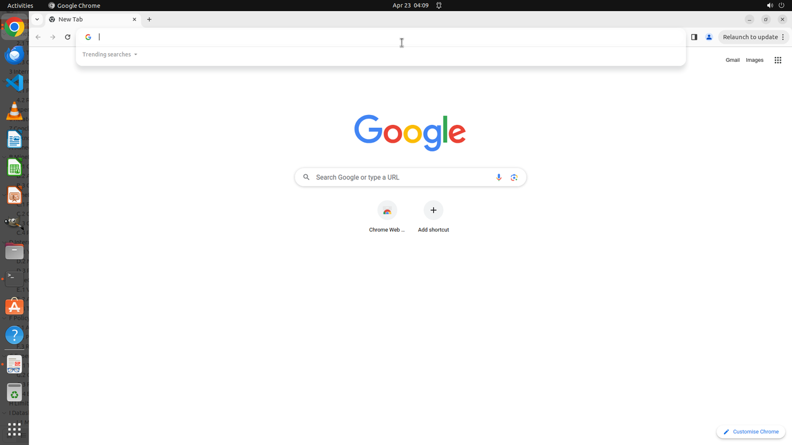

**Actions:** `import subprocess, shlex; subprocess.run(f'xdotool type --delay 12 -- ' + shlex.quote('Linxi Fan personal webpage'), shell=True, check=True)
import time; time.sleep(0.05)`

---

## Step 11

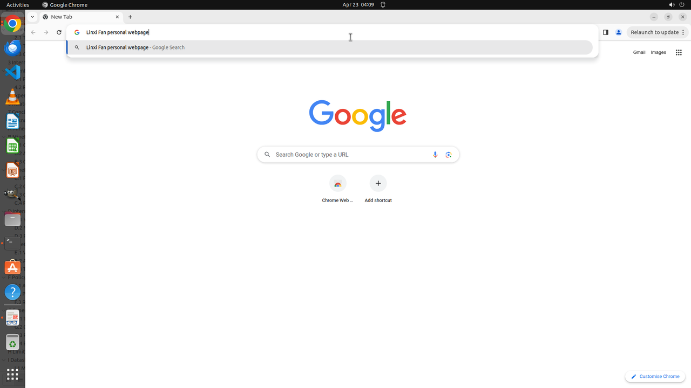

**Actions:** `pyautogui.keyDown('return')
pyautogui.keyUp('return')`

---

## Step 12

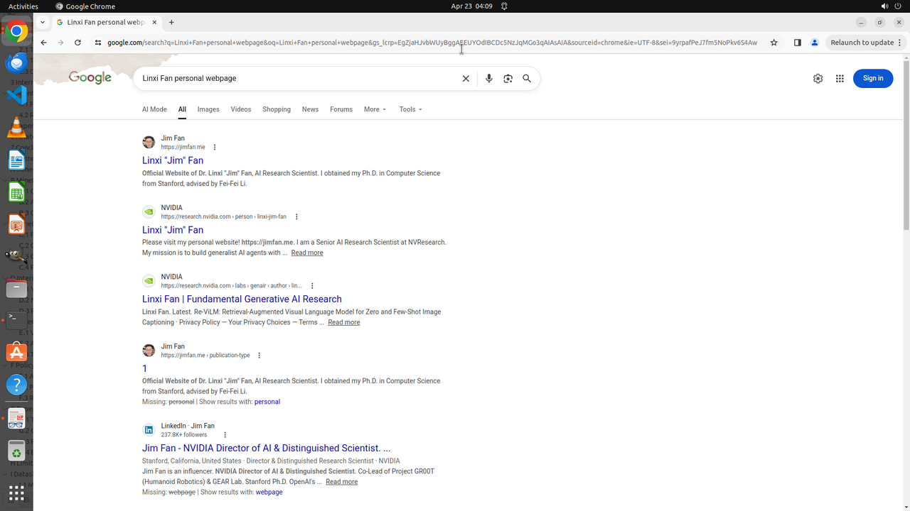

**Response:**
```
I can see that Linxi "Jim" Fan's personal website is https://jimfan.me. Let me visit it to confirm.
```

**Actions:** `pyautogui.click(366, 337)`

---

## Step 13

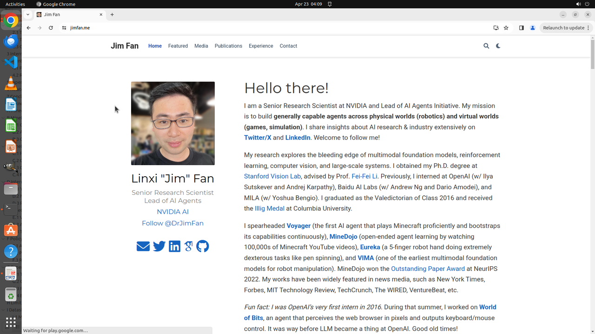

**Response:**
```
This is Linxi "Jim" Fan's personal webpage at jimfan.me. Now I need to bookmark this page. First, let me create the "Liked Authors" folder in the bookmarks bar. Let me bookmark this page.
```

**Actions:** `pyautogui.click(1633, 88)`

---

## Step 14

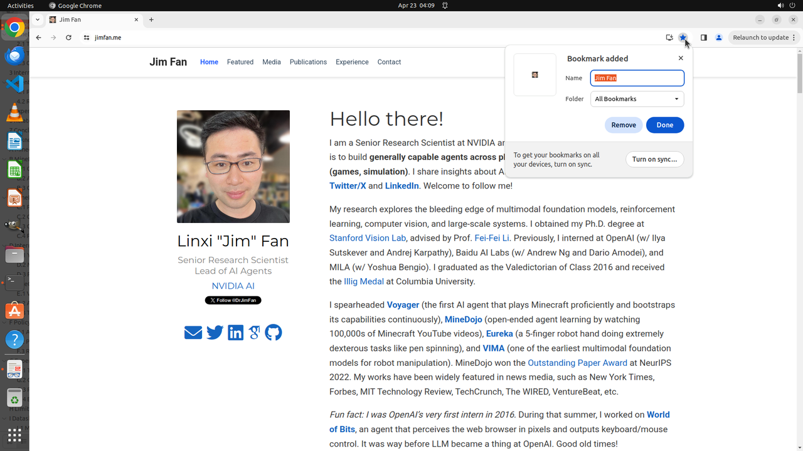

**Response:**
```
I can see the bookmark dialog. I need to change the folder to "Bookmarks bar" and create a new folder called "Liked Authors". Let me first click on the folder dropdown.
```

**Actions:** `pyautogui.click(1519, 235)`

---

## Step 15


**Response:**
```
I can see the dropdown with options. I need to select "Choose another folder..." to create a new folder under Bookmarks bar.
```

**Actions:** `pyautogui.click(1507, 354)`

---

## Step 16

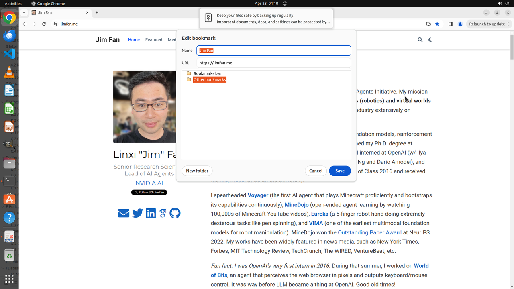

**Response:**
```
I can see the Edit bookmark dialog. I need to first select "Bookmarks bar" and then create a new folder called "Liked Authors". Let me click on "Bookmarks bar" first.
```

**Actions:** `pyautogui.click(778, 274)`

---

## Step 17

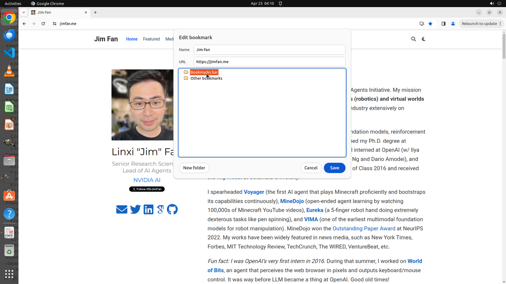

**Response:**
```
"Bookmarks bar" is now selected. Now I need to create a new folder called "Liked Authors" under it. Let me click "New folder".
```

**Actions:** `pyautogui.click(736, 637)`

---

## Step 18


**Response:**
```
A new folder has been created under "Bookmarks bar" with the name "New folder" highlighted. I need to type "Liked Authors" to name it.
```

**Actions:** `import subprocess, shlex; subprocess.run(f'xdotool type --delay 12 -- ' + shlex.quote('Liked Authors'), shell=True, check=True)
import time; time.sleep(0.05)`

---

## Step 19


**Response:**
```
I can see the folder is named "Liked Author" but I need it to be "Liked Authors". Let me check - it looks like it shows "Liked Author|" with the cursor at the end. Let me look more carefully - it seems to show "Liked Authors" but it might be cut off. Let me click Save to confirm.

Wait, looking more carefully, it appears to show "Liked Author" without the 's'. Let me add the 's'.
```

**Actions:** `time.sleep(0.1)`

---

## Step 20


**Response:**
```
I can see the folder name shows "Liked Author" with the cursor at the end. I need to add an "s" to make it "Liked Authors".
```

**Actions:** `import subprocess, shlex; subprocess.run(f'xdotool type --delay 12 -- ' + shlex.quote('s'), shell=True, check=True)
import time; time.sleep(0.05)`

---

## Step 21

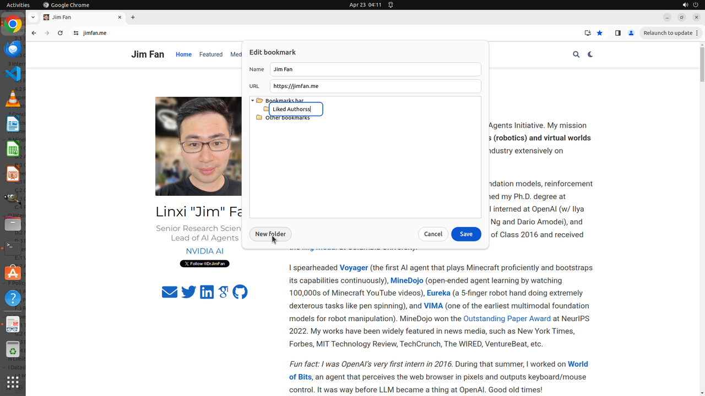

**Response:**
```
Now I can see the folder is named "Liked Authors" under "Bookmarks bar". Let me click "Save" to save this bookmark.
```

**Actions:** `pyautogui.click(1266, 637)`

---

## Step 22


**Response:**
```
The first bookmark (Linxi "Jim" Fan) has been saved to the "Liked Authors" folder. Now I need to search for the personal webpages of the last three authors:
1. De-An Huang
2. Yuke Zhu
3. Anima Anandkumar

Let me search for De-An Huang's personal webpage.
```

**Actions:** `pyautogui.click(960, 88)`

---

## Step 23


**Response:**
```
Good, the URL bar is selected. Let me search for De-An Huang's personal webpage.
```

**Actions:** `import subprocess, shlex; subprocess.run(f'xdotool type --delay 12 -- ' + shlex.quote('De-An Huang personal webpage'), shell=True, check=True)
import time; time.sleep(0.05)`

---

## Step 24


**Actions:** `pyautogui.keyDown('return')
pyautogui.keyUp('return')`

---

## Step 25

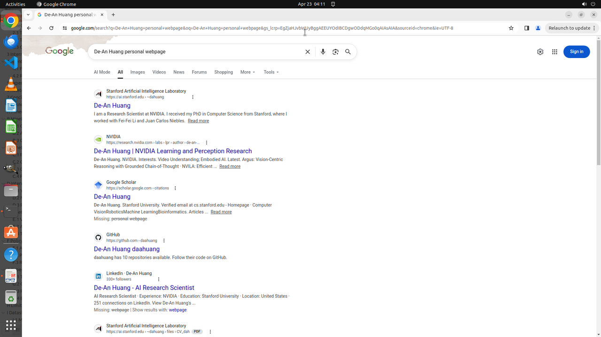

**Response:**
```
I can see De-An Huang's personal webpage at Stanford AI Lab (https://ai.stanford.edu/~dahuang). Let me click on it to verify.
```

**Actions:** `pyautogui.click(360, 336)`

---

## Step 26

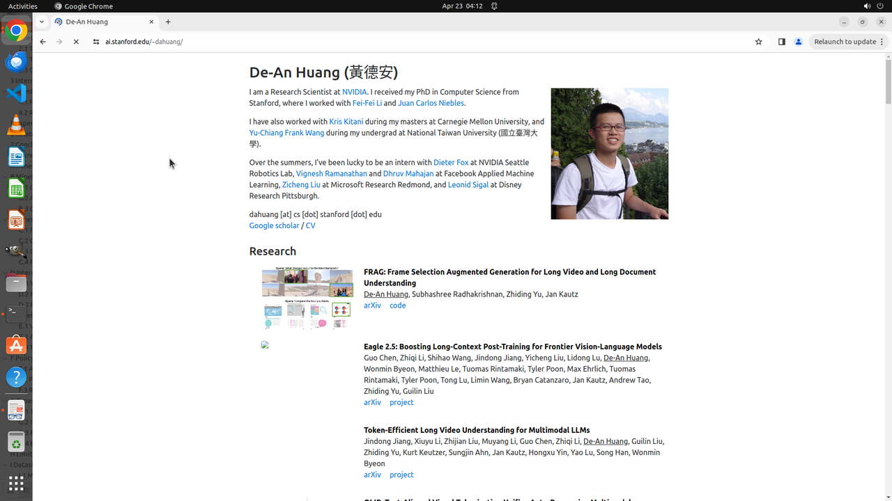

**Response:**
```
This is De-An Huang's personal webpage at ai.stanford.edu/~dahuang/. Let me bookmark this page to the "Liked Authors" folder.
```

**Actions:** `pyautogui.click(1633, 88)`

---

## Step 27

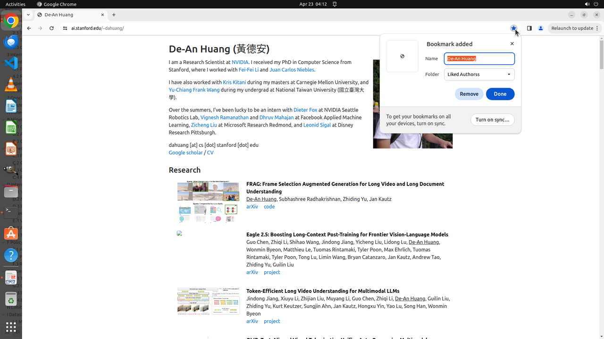

**Response:**
```
The bookmark is being added and the folder is already set to "Liked Authors". Let me click "Done" to save it.
```

**Actions:** `pyautogui.click(1588, 298)`

---

## Step 28

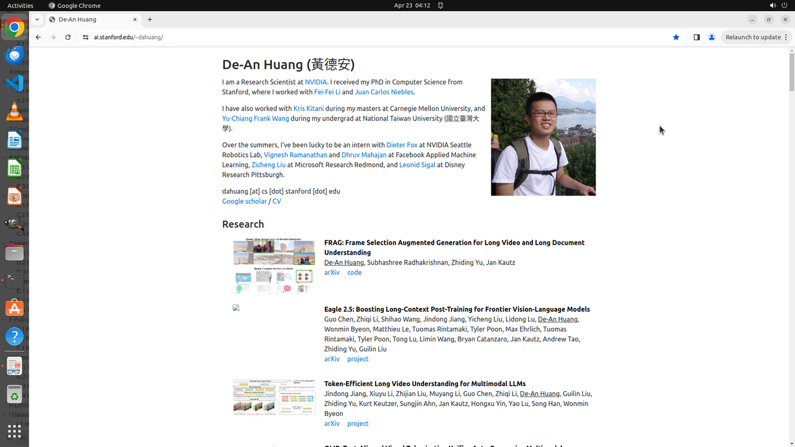

**Response:**
```
De-An Huang's page is bookmarked. Now let me search for Yuke Zhu's personal webpage.
```

**Actions:** `pyautogui.click(960, 88)`

---

## Step 29

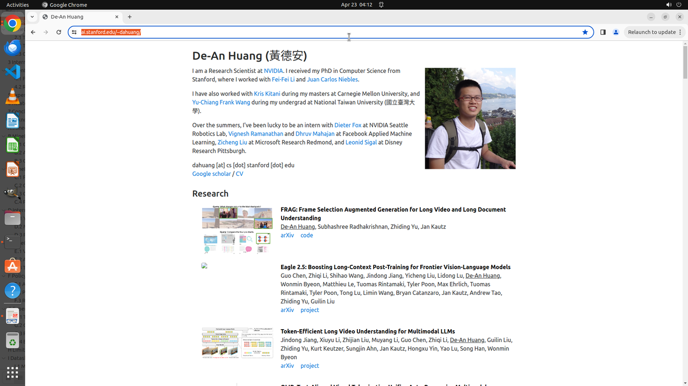

**Response:**
```
Good, the URL bar is selected. Let me search for Yuke Zhu's personal webpage.
```

**Actions:** `import subprocess, shlex; subprocess.run(f'xdotool type --delay 12 -- ' + shlex.quote('Yuke Zhu personal webpage'), shell=True, check=True)
import time; time.sleep(0.05)`

---

## Step 30


**Actions:** `pyautogui.keyDown('return')
pyautogui.keyUp('return')`

---

## Step 31

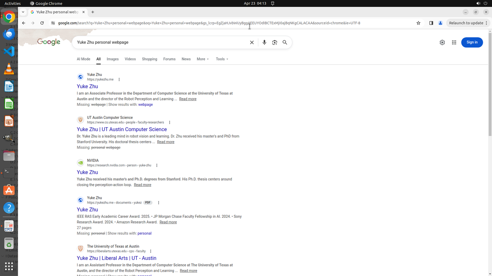

**Response:**
```
I can see Yuke Zhu's personal webpage at https://yukezhu.me. Let me click on it.
```

**Actions:** `pyautogui.click(342, 336)`

---

## Step 32

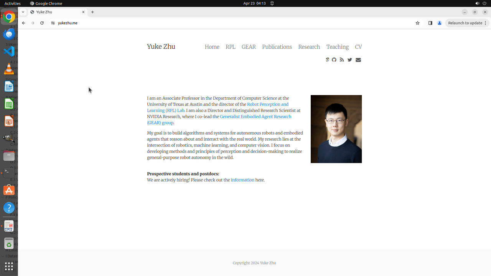

**Response:**
```
This is Yuke Zhu's personal webpage at yukezhu.me. Let me bookmark it to the "Liked Authors" folder.
```

**Actions:** `pyautogui.click(1633, 88)`

---

## Step 33

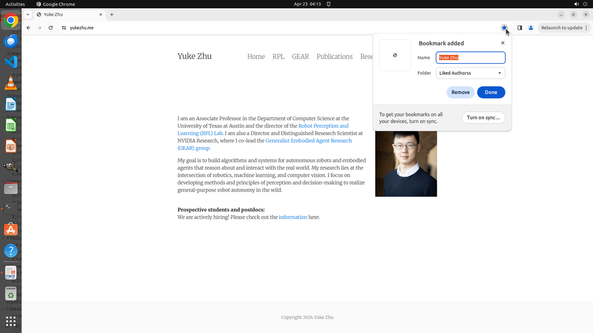

**Response:**
```
I notice the folder name shows "Liked Authorss" (with double 's'). Let me check - actually looking more carefully, it says "Liked Authorss". This might be an issue from earlier when I typed the extra 's'. But wait, let me look again - it shows "Liked Authorss" in the dropdown. Let me first save this bookmark and then fix the folder name. Actually, let me click Done first and check.

Wait, I see the folder says "Liked Authorss" - that has a double 's'. This is a problem. Let me click Done first and then fix the folder name.
```

**Actions:** `pyautogui.click(1588, 298)`

---

## Step 34

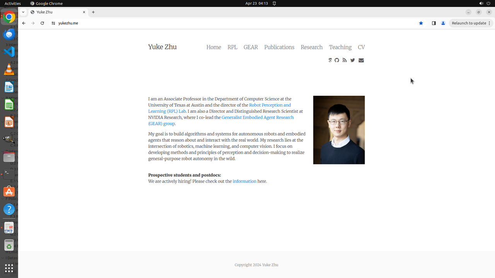

**Response:**
```
I need to check if the folder name is correct. Let me open the bookmark manager to verify and fix if needed. But first, let me check the folder name by opening the bookmark manager.
```

**Actions:** `pyautogui.keyDown('ctrl')
pyautogui.keyDown('shift')
pyautogui.keyDown('o')
pyautogui.keyUp('o')
pyautogui.keyUp('shift')
pyautogui.keyUp('ctrl')`

---

## Step 35

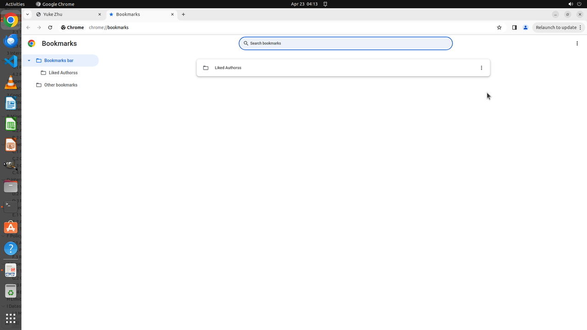

**Response:**
```
I can see the folder is named "Liked Authorss" (with double 's'). I need to fix this. Let me right-click on it to rename it.
```

**Actions:** `pyautogui.rightClick(744, 220)`

---

## Step 36

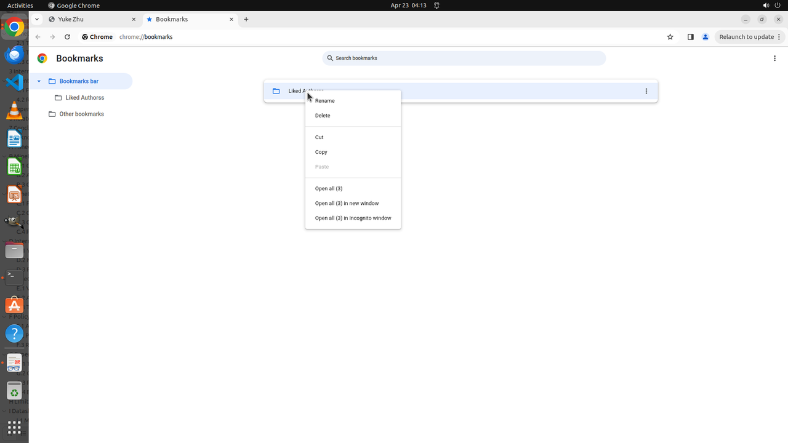

**Response:**
```
I can see the context menu with "Rename" option. Let me click on it to rename the folder.
```

**Actions:** `pyautogui.click(792, 244)`

---

## Step 37

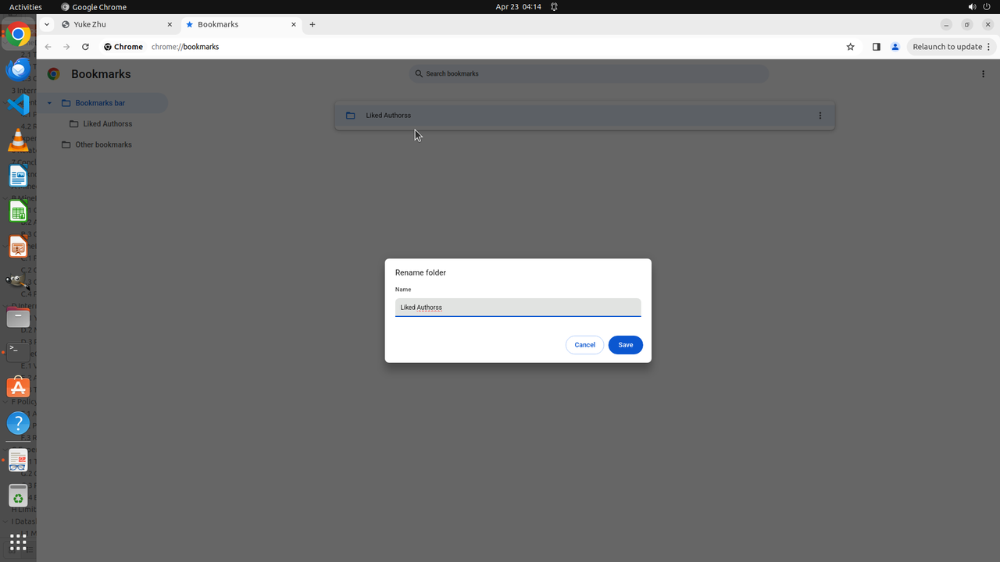

**Response:**
```
I can see the rename dialog with "Liked Authorss" (double 's'). I need to fix it to "Liked Authors". Let me clear the field and type the correct name.
```

**Actions:** `pyautogui.tripleClick(990, 589)`

---

## Step 38

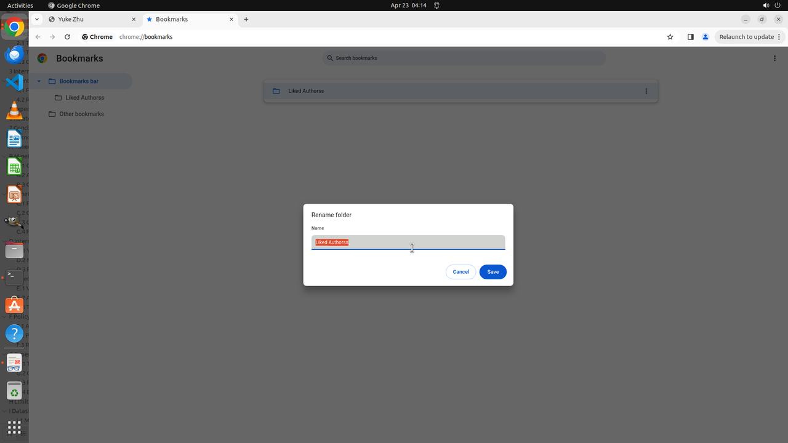

**Response:**
```
Good, the text is selected. Now let me type the correct name.
```

**Actions:** `import subprocess, shlex; subprocess.run(f'xdotool type --delay 12 -- ' + shlex.quote('Liked Authors'), shell=True, check=True)
import time; time.sleep(0.05)`

---

## Step 39


**Response:**
```
Now the folder name shows "Liked Authors" (correct). Let me click "Save" to save the change.
```

**Actions:** `pyautogui.click(1200, 661)`

---

## Step 40

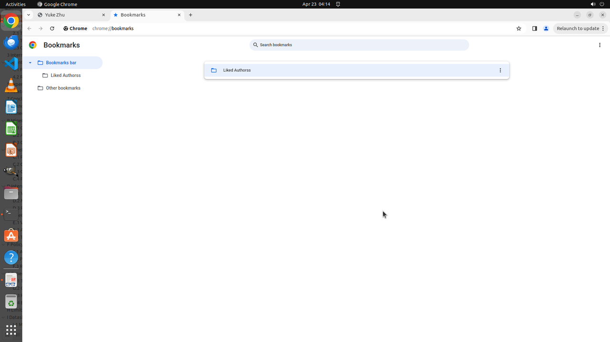

**Response:**
```
I notice the folder still shows "Liked Authorss" in the sidebar and main view. It seems the rename didn't work properly. Let me try again - I'll right-click on the folder name in the sidebar.
```

**Actions:** `pyautogui.rightClick(208, 237)`

---

## Step 41

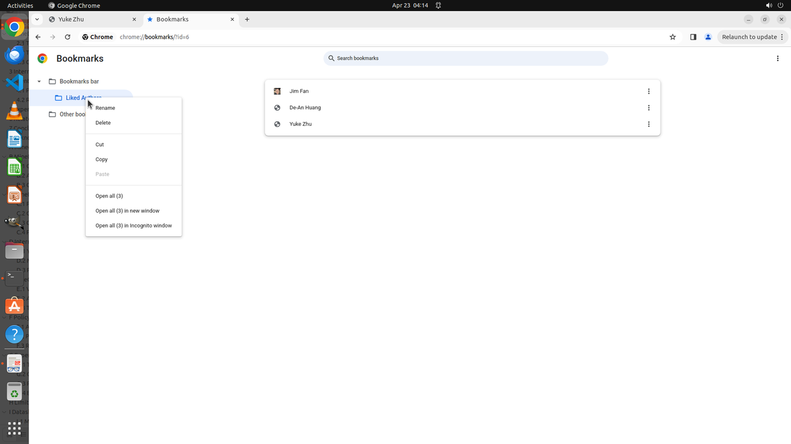

**Response:**
```
I can see the folder contents - it has Jim Fan, De-An Huang, and Yuke Zhu bookmarks. I also see the context menu with "Rename" option. Let me click "Rename" to fix the folder name.
```

**Actions:** `pyautogui.click(256, 261)`

---

## Step 42

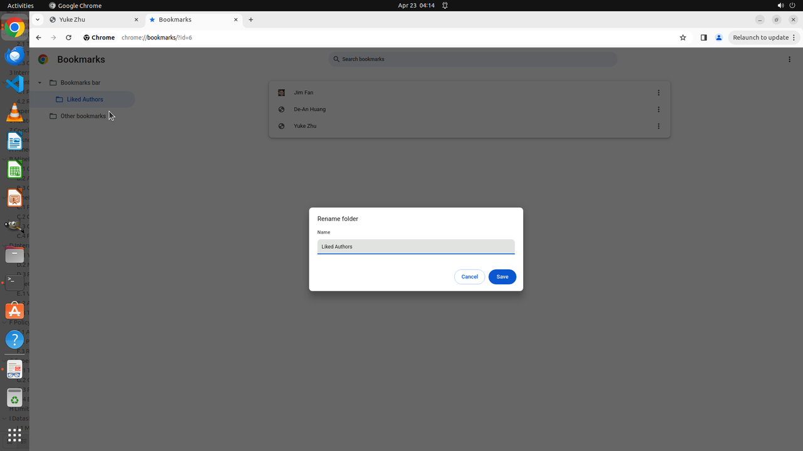

**Response:**
```
I can see the rename dialog now shows "Liked Authors" (correct, with single 's'). And in the sidebar, it also shows "Liked Authors". It looks like the previous rename actually worked! The folder name is now correct. Let me click "Save" to confirm.
```

**Actions:** `pyautogui.click(1200, 661)`

---

## Step 43

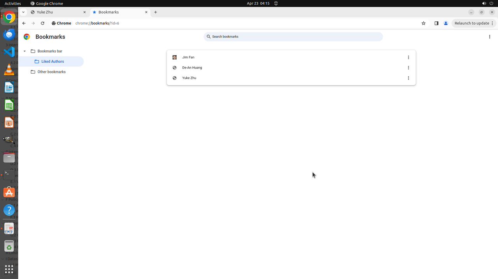

**Response:**
```
The folder is now correctly named "Liked Authors" and contains Jim Fan, De-An Huang, and Yuke Zhu. I still need to add Anima Anandkumar's personal webpage. Let me search for it now.
```

**Actions:** `pyautogui.click(960, 88)`

---

## Step 44

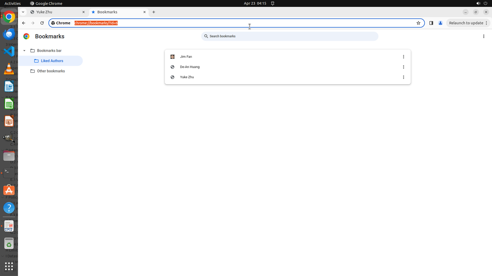

**Response:**
```
Good, the URL bar is selected. Let me search for Anima Anandkumar's personal webpage.
```

**Actions:** `import subprocess, shlex; subprocess.run(f'xdotool type --delay 12 -- ' + shlex.quote('Anima Anandkumar personal webpage'), shell=True, check=True)
import time; time.sleep(0.05)`

---

## Step 45

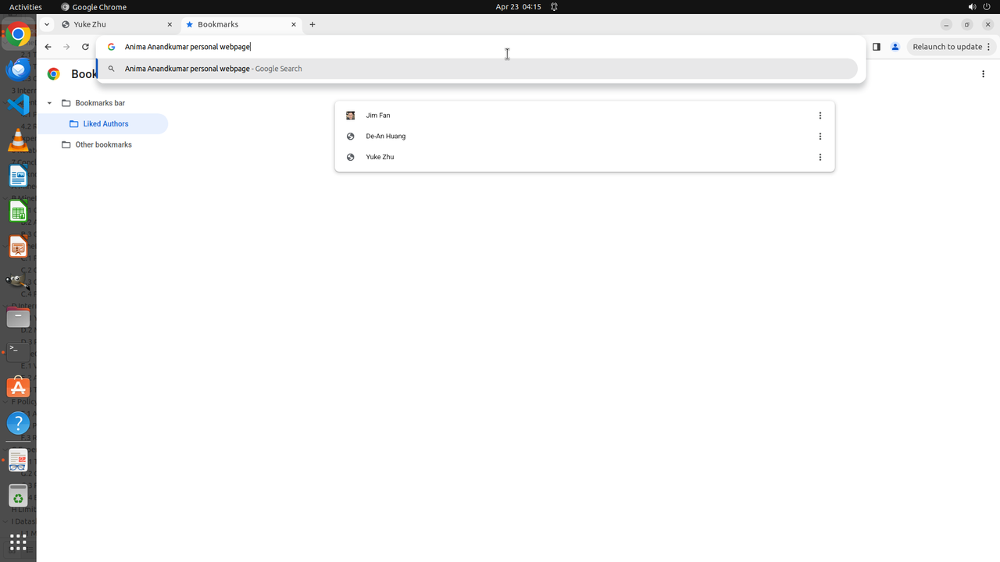

**Actions:** `pyautogui.keyDown('return')
pyautogui.keyUp('return')`

---

## Step 46

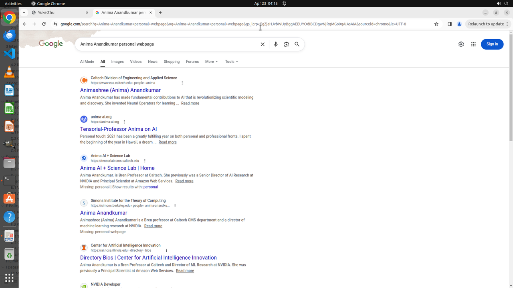

**Response:**
```
I can see several results for Anima Anandkumar. The first result is from Caltech (her academic page) and the second is anima-ai.org which appears to be her personal website. Let me click on the anima-ai.org link which seems to be her personal webpage.
```

**Actions:** `pyautogui.click(444, 483)`

---

## Step 47

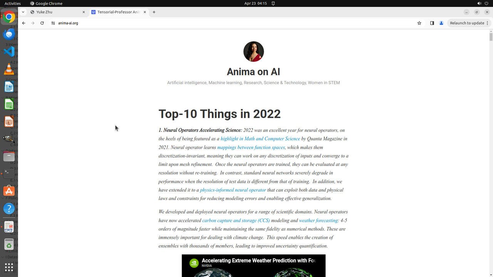

**Response:**
```
This is Anima Anandkumar's personal website at anima-ai.org. Let me bookmark this page to the "Liked Authors" folder.
```

**Actions:** `pyautogui.click(1633, 88)`

---

## Step 48

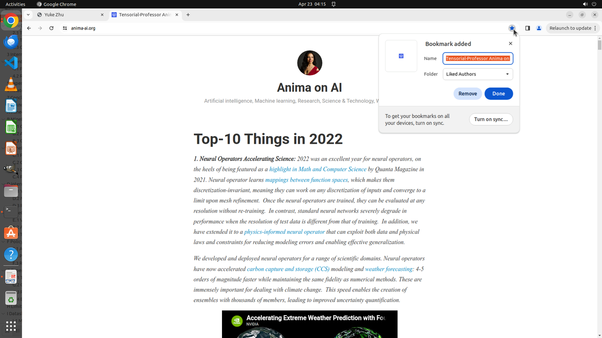

**Response:**
```
The bookmark is being added with the name "Tensorial-Professor Anima on" and the folder is already set to "Liked Authors". Let me click "Done" to save it.
```

**Actions:** `pyautogui.click(1588, 298)`

---

## Step 49


**Response:**
```
All four bookmarks have been added to the "Liked Authors" folder under the Bookmarks bar. Let me verify by opening the bookmark manager.
```

**Actions:** `pyautogui.keyDown('ctrl')
pyautogui.keyDown('shift')
pyautogui.keyDown('o')
pyautogui.keyUp('o')
pyautogui.keyUp('shift')
pyautogui.keyUp('ctrl')`

---

## Step 50

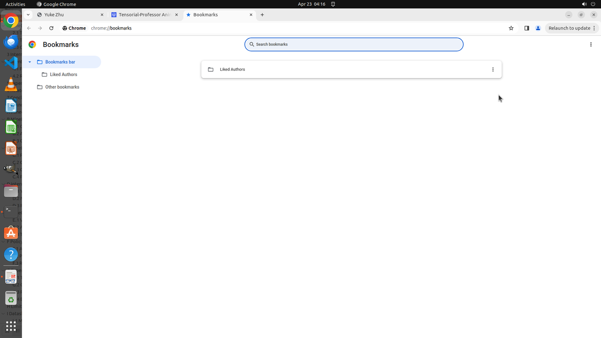

**Response:**
```
I can see the "Liked Authors" folder under "Bookmarks bar". Let me click on it to verify all four bookmarks are inside.
```

**Actions:** `pyautogui.click(204, 237)`

---

## Step 51

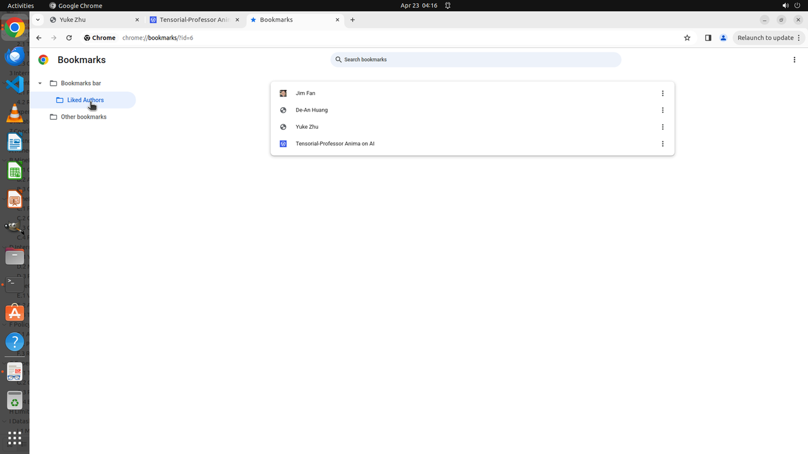

**Response:**
```
All four bookmarks are now in the "Liked Authors" folder under the Bookmarks bar:

1. **Jim Fan** (Linxi Fan - first author) - jimfan.me
2. **De-An Huang** (third to last author) - ai.stanford.edu/~dahuang
3. **Yuke Zhu** (second to last author) - yukezhu.me
4. **Tensorial-Professor Anima on AI** (Anima Anandkumar - last author) - anima-ai.org

The task is complete. All four personal webpages have been bookmarked in the "Liked Authors" folder under the Bookmarks bar.

DONE
```

**Actions:** `DONE`

---
