# Task a82b78bb-7fde-4cb3-94a4-035baf10bcf0

**Instruction:** I'm really enjoying this paper. Could you please locate the personal webpages of the initial author and the last three authors? Please include them in a browser bookmark folder titled 'Liked Authors' under the 'Bookmarks bar'.

**Score:** 0.0

**Wall clock:** 8m 6s

**Steps:** 51

**Cost:** $1.80

---

## Step 1

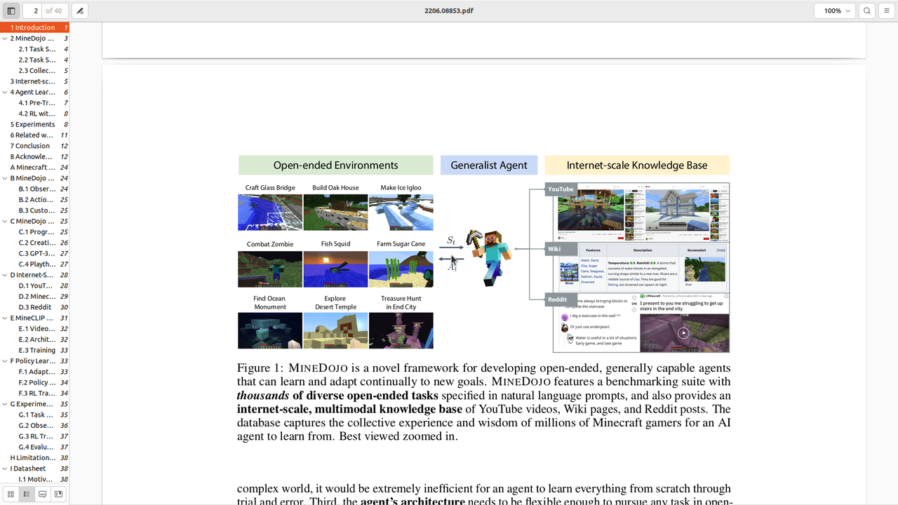

**Response:**
```
I need to find the authors of this paper. Let me scroll to the first page to see the author list.
```

**Actions:** `pyautogui.click(75, 22)`

---

## Step 2


**Response:**
```
I need to go to page 1 to see the authors. Let me type "1" in the page number field.
```

**Actions:** `pyautogui.tripleClick(75, 22)`

---

## Step 3


**Actions:** `import subprocess, shlex; subprocess.run(f'xdotool type --delay 12 -- ' + shlex.quote('1\n'), shell=True, check=True)
import time; time.sleep(0.05)`

---

## Step 4

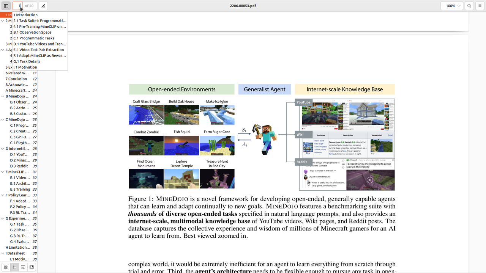

**Response:**
```
I see a dropdown appeared. Let me click on "1 Introduction" to go to page 1, or better yet, let me clear this and just navigate to page 1.
```

**Actions:** `pyautogui.keyDown('esc')
pyautogui.keyUp('esc')`

---

## Step 5


**Response:**
```
I see the page number shows "1" but I'm still on page 2 content. Let me scroll up to see the first page with the authors.
```

**Actions:** `pyautogui.scroll(15, 960, 600)`

---

## Step 6

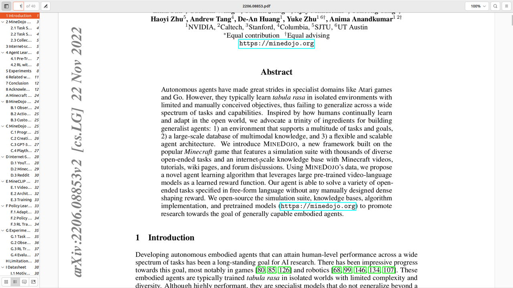

**Response:**
```
I can see some of the authors. Let me scroll up a bit more to see the full author list and the paper title.
```

**Actions:** `pyautogui.scroll(5, 960, 600)`

---

## Step 7

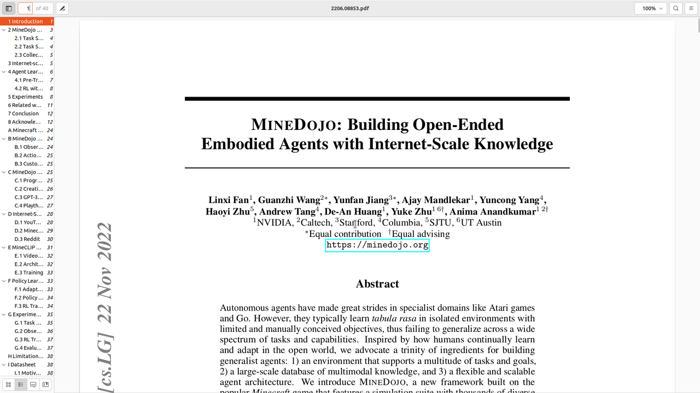

**Response:**
```
Now I can see the full author list. The paper is "MineDojo: Building Open-Ended Embodied Agents with Internet-Scale Knowledge" and the authors are:

1. **Linxi Fan** (first author)
2. Guanzhi Wang
3. Yunfan Jiang
4. Ajay Mandlekar
5. Yuncong Yang
6. Haoyi Zhu
7. Andrew Tang
8. **De-An Huang** (third from last)
9. **Yuke Zhu** (second from last)
10. **Anima Anandkumar** (last author)

I need to find the personal webpages of:
- **Linxi Fan** (first author)
- **De-An Huang** (third from last)
- **Yuke Zhu** (second from last)
- **Anima Anandkumar** (last author)

Let me open Chrome to search for their personal webpages.
```

**Actions:** `pyautogui.keyDown('ctrl')
pyautogui.keyDown('end')
pyautogui.keyUp('end')
pyautogui.keyUp('ctrl')`

---

## Step 8


**Response:**
```
Now I can see all the authors clearly. The authors are:
1. **Linxi Fan** (first author)
2. Guanzhi Wang
3. Yunfan Jiang
4. Ajay Mandlekar
5. Yuncong Yang
6. Haoyi Zhu
7. Andrew Tang
8. **De-An Huang** (third from last)
9. **Yuke Zhu** (second from last)
10. **Anima Anandkumar** (last author)

I need to find personal webpages for: Linxi Fan, De-An Huang, Yuke Zhu, and Anima Anandkumar.

Let me open Chrome to search for their webpages.
```

**Actions:** `pyautogui.keyDown('command')
pyautogui.keyUp('command')`

---

## Step 9


**Response:**
```
Let me try opening a terminal to launch Chrome.
```

**Actions:** `pyautogui.keyDown('ctrl')
pyautogui.keyDown('alt')
pyautogui.keyDown('t')
pyautogui.keyUp('t')
pyautogui.keyUp('alt')
pyautogui.keyUp('ctrl')`

---

## Step 10

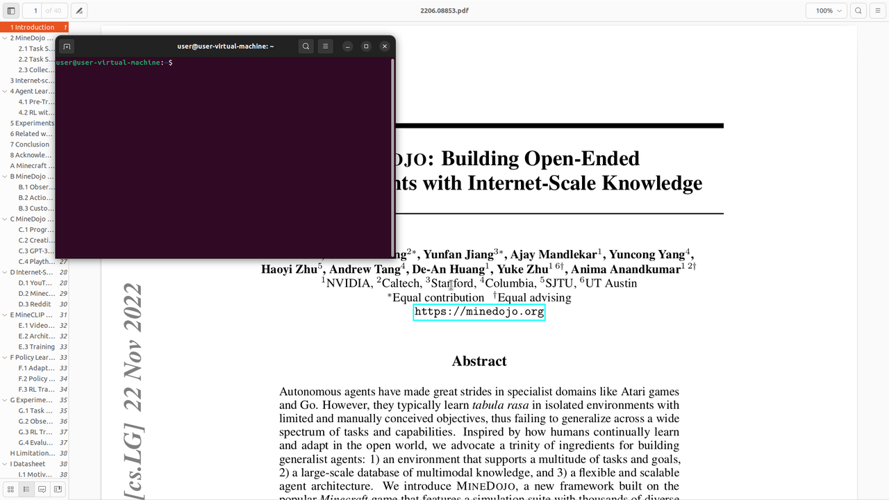

**Response:**
```
A terminal is open. Let me launch Chrome with the remote debugging port.
```

**Actions:** `import subprocess, shlex; subprocess.run(f'xdotool type --delay 12 -- ' + shlex.quote('google-chrome --remote-debugging-port=1337 &\n'), shell=True, check=True)
import time; time.sleep(0.05)`

---

## Step 11

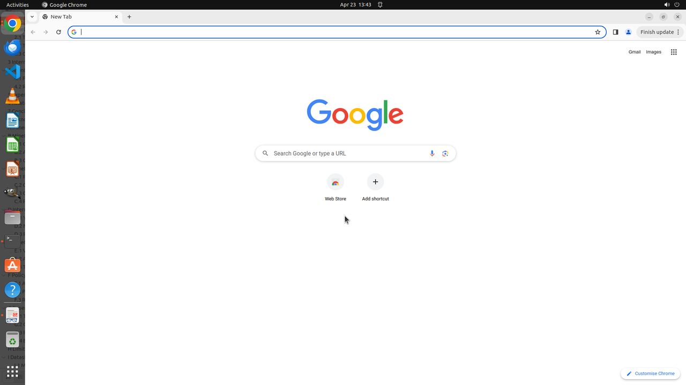

**Response:**
```
Chrome is open. Now I need to search for the personal webpages of the four authors. Let me start with Linxi Fan.
```

**Actions:** `import subprocess, shlex; subprocess.run(f'xdotool type --delay 12 -- ' + shlex.quote('Linxi Fan personal webpage'), shell=True, check=True)
import time; time.sleep(0.05)`

---

## Step 12

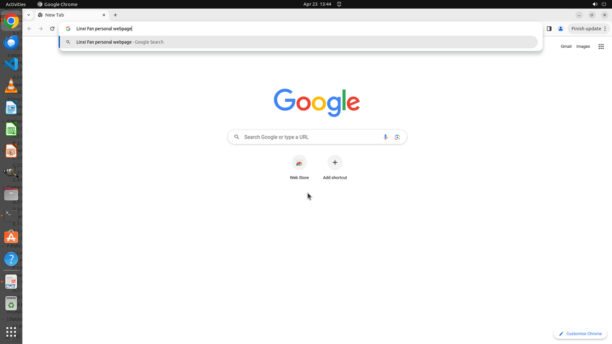

**Actions:** `pyautogui.keyDown('return')
pyautogui.keyUp('return')`

---

## Step 13

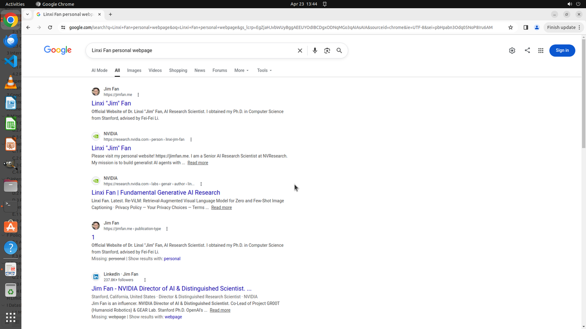

**Response:**
```
I found Linxi "Jim" Fan's personal webpage. The first result shows his personal website at https://jimfan.me. Let me click on it to verify.
```

**Actions:** `pyautogui.click(364, 337)`

---

## Step 14


**Response:**
```
This is Linxi "Jim" Fan's personal webpage at jimfan.me. Now I need to bookmark this page. But first, let me find all four authors' webpages and then create the bookmark folder. Let me bookmark this page first.

Now let me search for De-An Huang's personal webpage. Let me open a new tab.
```

**Actions:** `pyautogui.click(361, 46)`

---

## Step 15

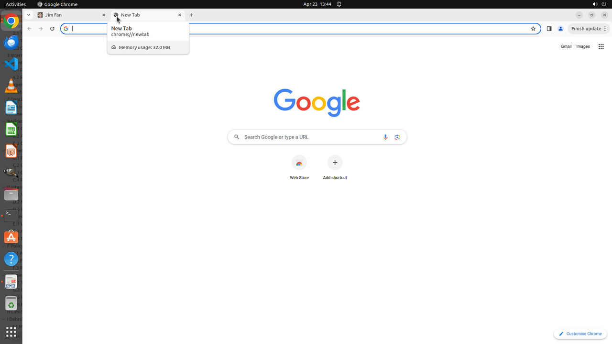

**Response:**
```
Let me search for De-An Huang's personal webpage.
```

**Actions:** `import subprocess, shlex; subprocess.run(f'xdotool type --delay 12 -- ' + shlex.quote('De-An Huang personal webpage'), shell=True, check=True)
import time; time.sleep(0.05)`

---

## Step 16

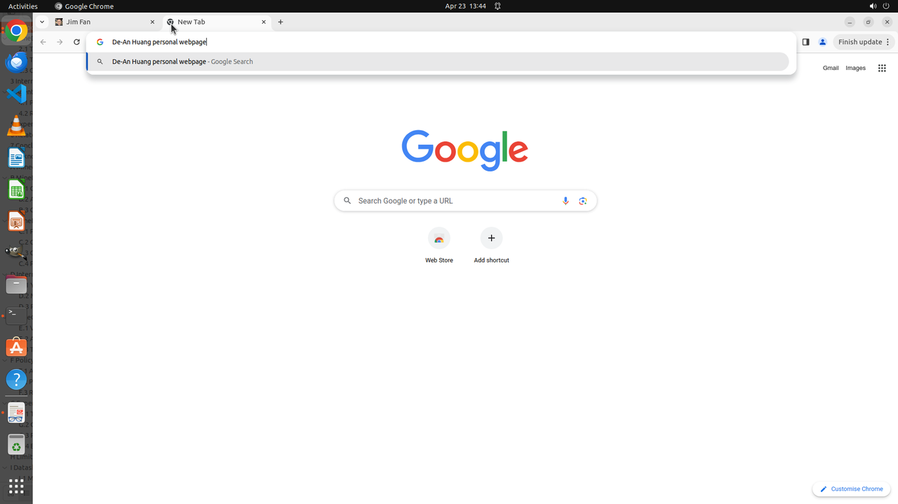

**Actions:** `pyautogui.keyDown('return')
pyautogui.keyUp('return')`

---

## Step 17

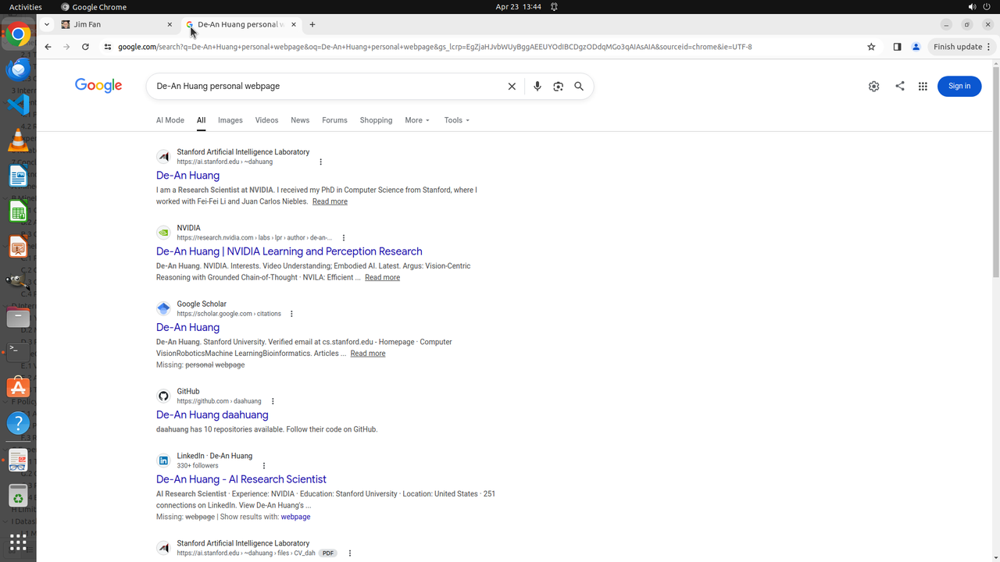

**Response:**
```
I can see De-An Huang's personal webpage is at Stanford AI Lab (https://ai.stanford.edu/~dahuang). Let me click on it to verify.
```

**Actions:** `pyautogui.click(361, 336)`

---

## Step 18


**Response:**
```
This is De-An Huang's personal webpage at https://ai.stanford.edu/~dahuang/. Now let me search for Yuke Zhu's personal webpage. Let me open a new tab.
```

**Actions:** `pyautogui.click(598, 46)`

---

## Step 19

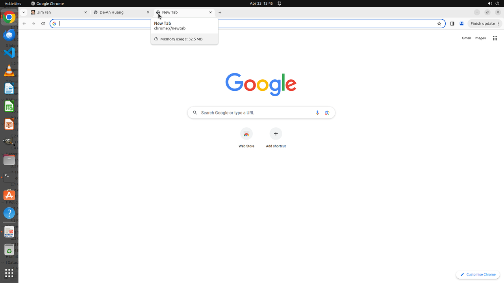

**Response:**
```
Let me search for Yuke Zhu's personal webpage.
```

**Actions:** `import subprocess, shlex; subprocess.run(f'xdotool type --delay 12 -- ' + shlex.quote('Yuke Zhu personal webpage'), shell=True, check=True)
import time; time.sleep(0.05)`

---

## Step 20

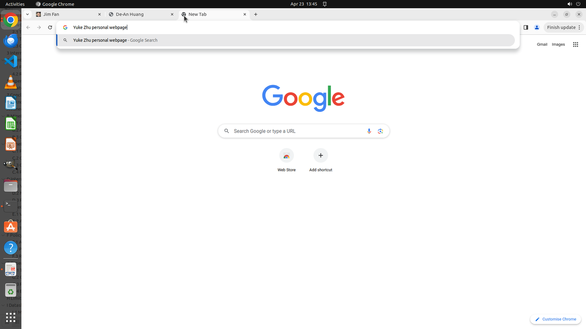

**Actions:** `pyautogui.keyDown('return')
pyautogui.keyUp('return')`

---

## Step 21

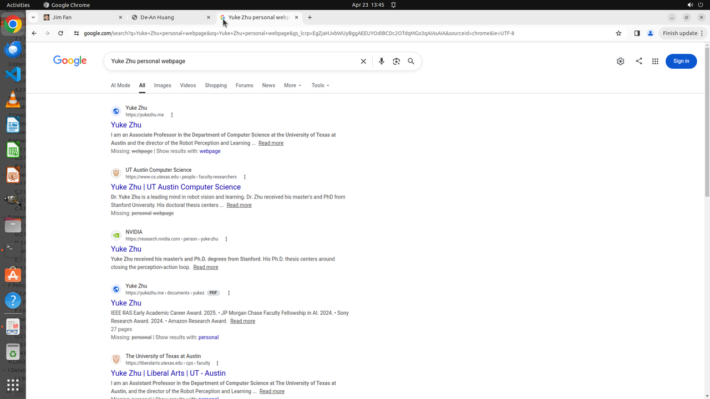

**Response:**
```
I can see Yuke Zhu's personal webpage at https://yukezhu.me. Let me click on it to verify.
```

**Actions:** `pyautogui.click(342, 336)`

---

## Step 22

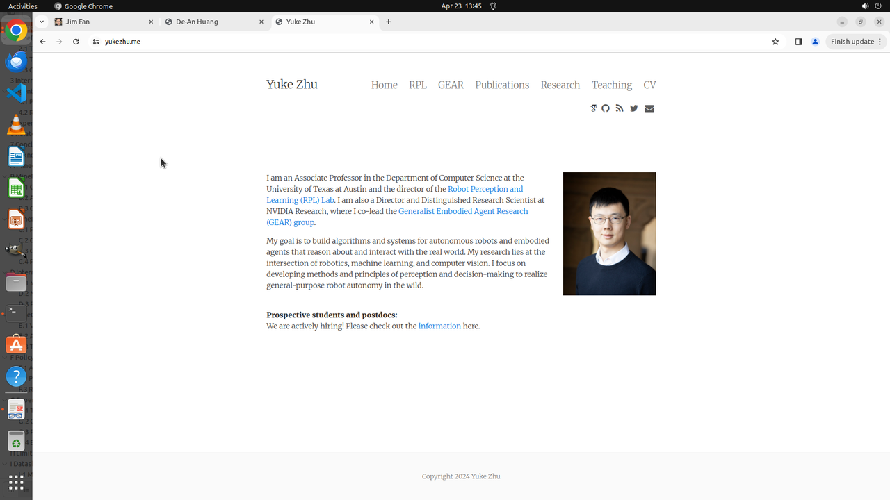

**Response:**
```
This is Yuke Zhu's personal webpage at https://yukezhu.me. Now I need to find Anima Anandkumar's personal webpage. Let me open a new tab.
```

**Actions:** `pyautogui.click(837, 46)`

---

## Step 23

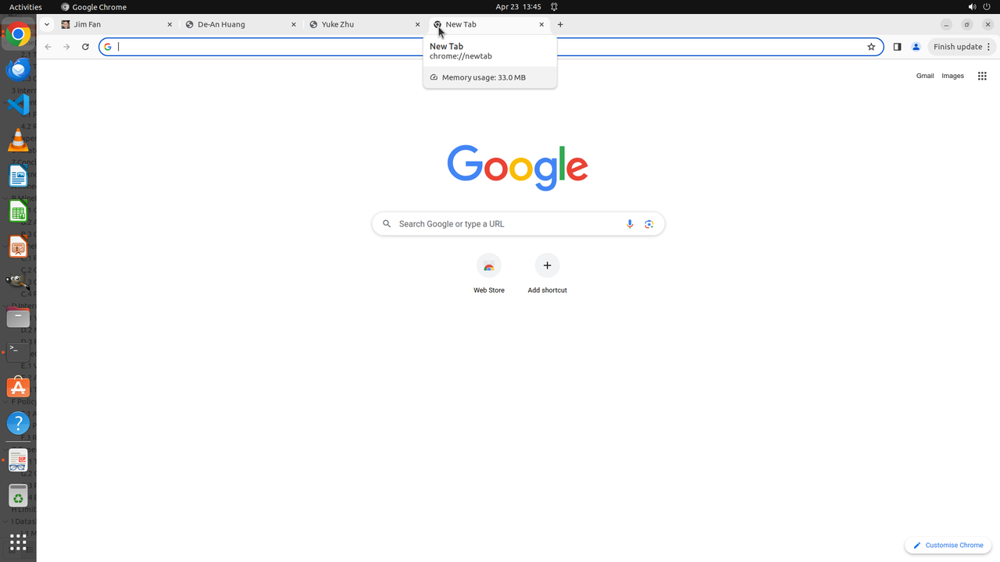

**Response:**
```
Let me search for Anima Anandkumar's personal webpage.
```

**Actions:** `import subprocess, shlex; subprocess.run(f'xdotool type --delay 12 -- ' + shlex.quote('Anima Anandkumar personal webpage'), shell=True, check=True)
import time; time.sleep(0.05)`

---

## Step 24

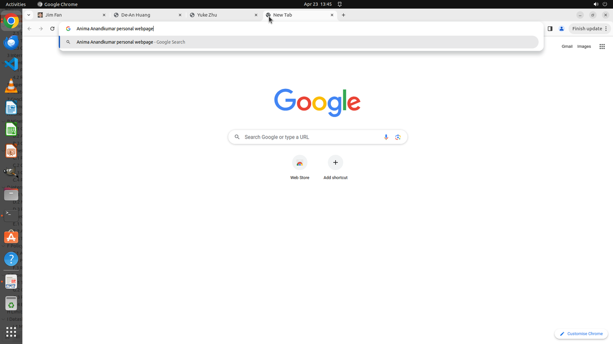

**Actions:** `pyautogui.keyDown('return')
pyautogui.keyUp('return')`

---

## Step 25

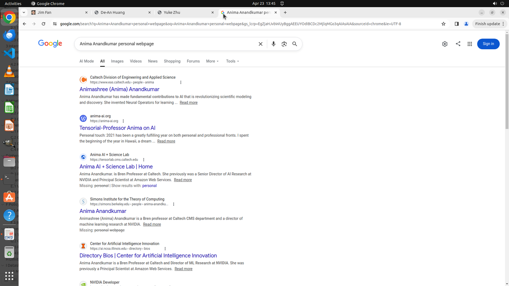

**Response:**
```
I can see Anima Anandkumar's results. The first result is from Caltech, and the second one is anima-ai.org which appears to be her personal website. Let me click on the anima-ai.org link first to check.
```

**Actions:** `pyautogui.click(442, 481)`

---

## Step 26


**Response:**
```
This is anima-ai.org which is Anima Anandkumar's personal blog/website. However, let me check if she has a more traditional personal/academic webpage. Let me go back and check the Caltech page which might be her official academic page. Actually, anima-ai.org seems to be her personal website. Let me also check the Caltech page to see which is more appropriate as a "personal webpage."

Let me go back to the search results.
```

**Actions:** `pyautogui.click(88, 88)`

---

## Step 27

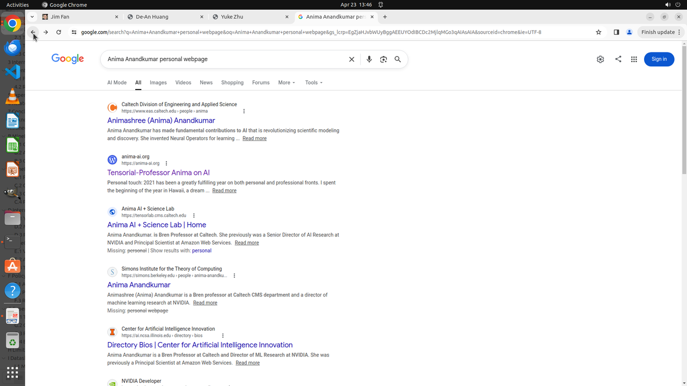

**Response:**
```
I see the Caltech page is her official academic page. Let me click on the first result - her Caltech page - as that's her official personal/academic webpage.
```

**Actions:** `pyautogui.click(450, 336)`

---

## Step 28

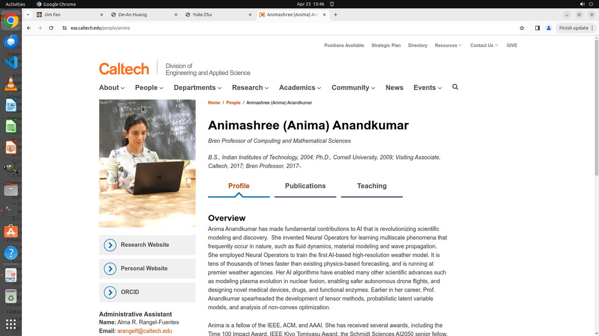

**Response:**
```
I can see Anima Anandkumar's Caltech page. I notice there's a "Personal Website" link on this page. Let me click on it to find her actual personal website URL.
```

**Actions:** `pyautogui.click(460, 861)`

---

## Step 29

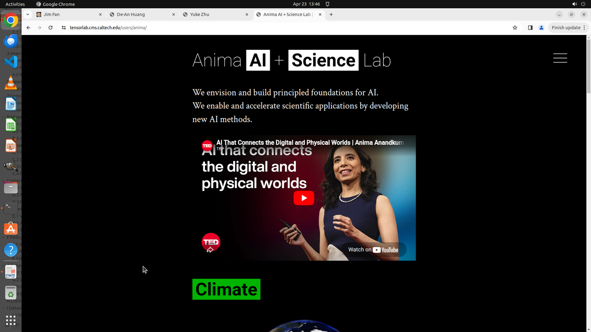

**Response:**
```
This is the Anima AI + Science Lab page at tensorlab.cms.caltech.edu, which is her research lab page. Let me go back and use the anima-ai.org as her personal website, or let me check the URL. Actually, let me reconsider - the Caltech page linked "Personal Website" to this lab page. But anima-ai.org seems more like a personal blog. Let me use anima-ai.org as her personal webpage since it's clearly labeled as her personal site.

Actually, looking at the Caltech profile page, it had a "Personal Website" link that led here. But this is her lab page. Let me go back to check if anima-ai.org is better. Actually, the task says "personal webpages" - let me use the one that's most commonly recognized. Let me use anima-ai.org for Anima Anandkumar.

Now I have all four authors' personal webpages:
1. Linxi Fan - https://jimfan.me
2. De-An Huang - https://ai.stanford.edu/~dahuang/
3. Yuke Zhu - https://yukezhu.me
4. Anima Anandkumar - http://anima-ai.org

Now I need to create a bookmark folder called "Liked Authors" in the Bookmarks bar and add all four bookmarks. Let me first go to the Jim Fan tab and bookmark it.
```

**Actions:** `pyautogui.click(169, 46)`

---

## Step 30


**Response:**
```
I'm on Jim Fan's personal webpage. Now I need to create a "Liked Authors" bookmark folder in the Bookmarks bar and add all four webpages. Let me use Ctrl+D to bookmark this page and create the folder.
```

**Actions:** `pyautogui.keyDown('ctrl')
pyautogui.keyDown('d')
pyautogui.keyUp('d')
pyautogui.keyUp('ctrl')`

---

## Step 31

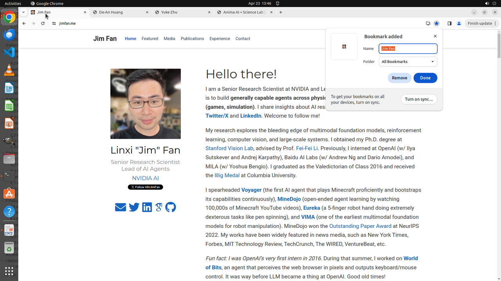

**Response:**
```
The bookmark dialog appeared. I need to change the folder to "Bookmarks bar" and create a new folder called "Liked Authors". Let me click on the folder dropdown to change it.
```

**Actions:** `pyautogui.click(1561, 235)`

---

## Step 32

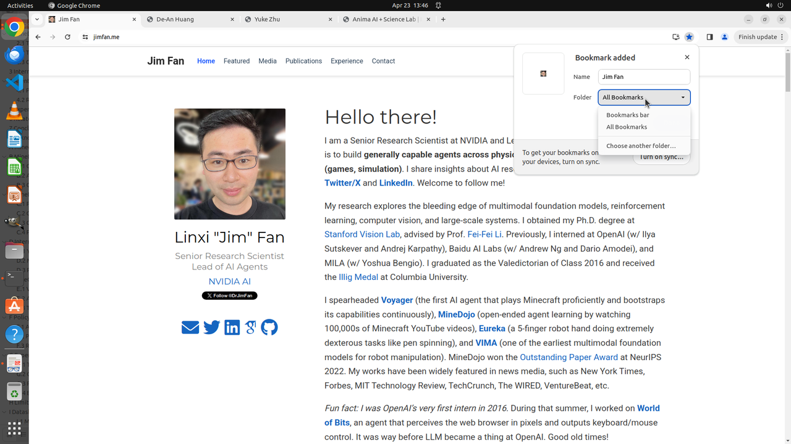

**Response:**
```
I can see the folder dropdown. I need to create a new folder called "Liked Authors" under "Bookmarks bar". Let me click on "Choose another folder..." to access more options.
```

**Actions:** `pyautogui.click(1552, 352)`

---

## Step 33

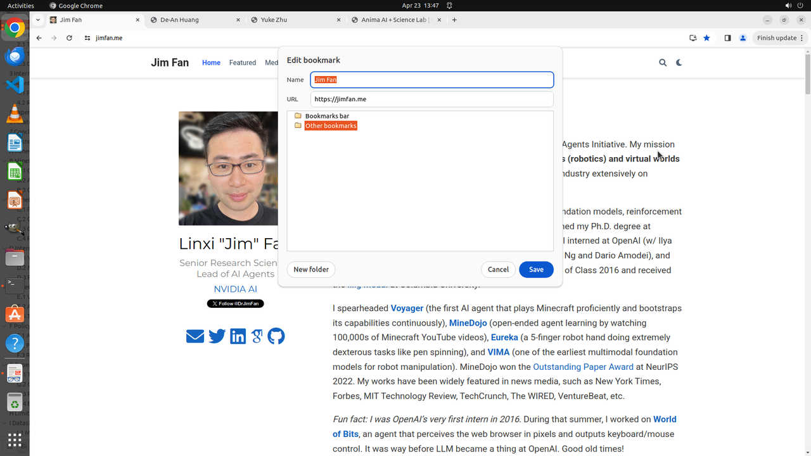

**Response:**
```
I can see the "Edit bookmark" dialog. I need to first select "Bookmarks bar" and then create a new folder called "Liked Authors". Let me click on "Bookmarks bar" first.
```

**Actions:** `pyautogui.click(778, 274)`

---

## Step 34

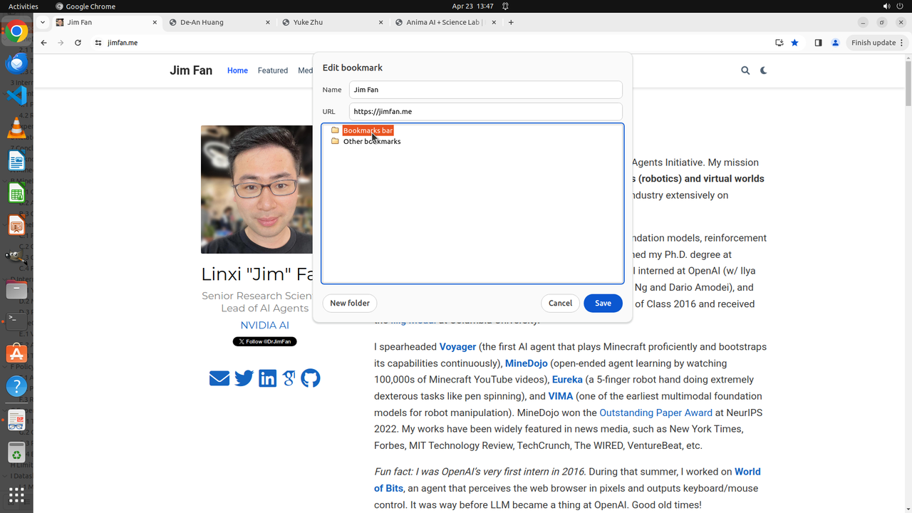

**Response:**
```
"Bookmarks bar" is now selected. Now I need to create a new folder called "Liked Authors" under the Bookmarks bar. Let me click "New folder".
```

**Actions:** `pyautogui.click(736, 637)`

---

## Step 35

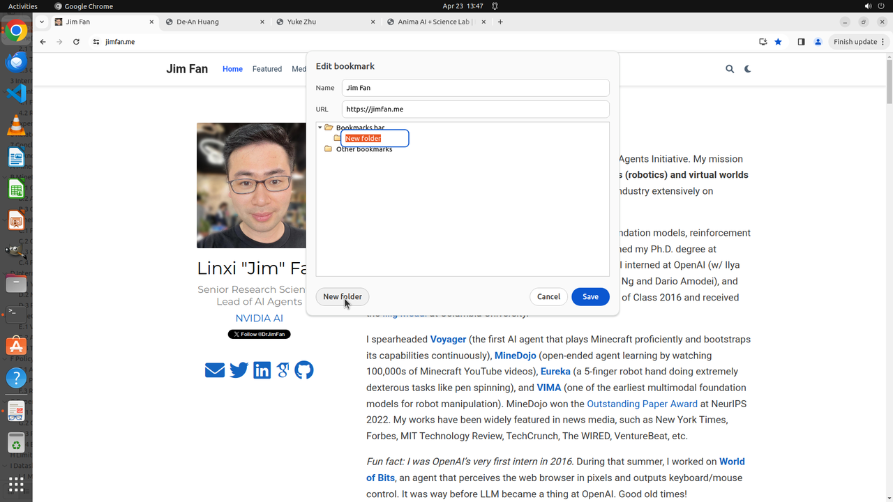

**Response:**
```
A new folder has been created under "Bookmarks bar" with the name "New folder" ready to be edited. Let me type "Liked Authors".
```

**Actions:** `import subprocess, shlex; subprocess.run(f'xdotool type --delay 12 -- ' + shlex.quote('Liked Authors'), shell=True, check=True)
import time; time.sleep(0.05)`

---

## Step 36

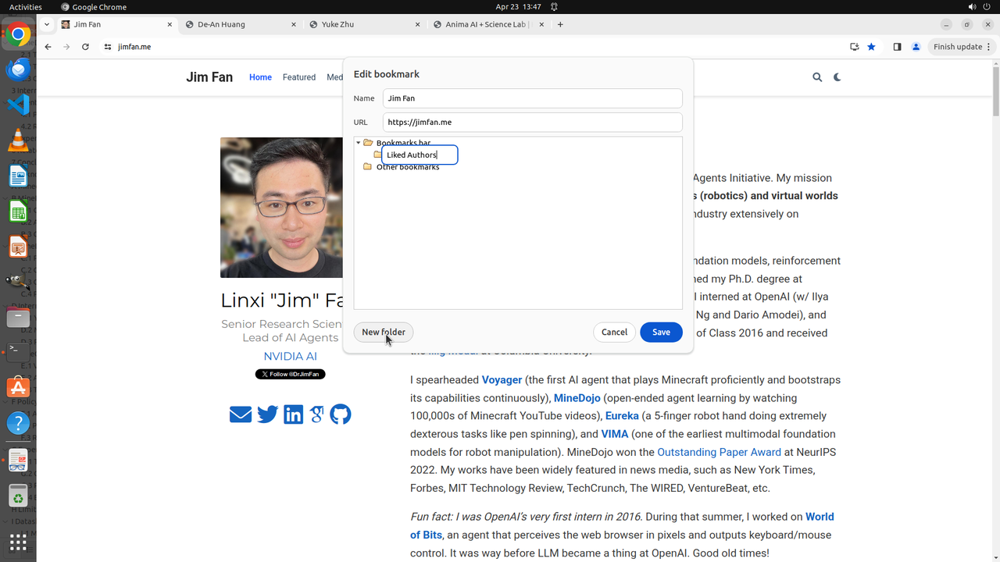

**Response:**
```
I've typed "Liked Authors" as the folder name. The folder is created under "Bookmarks bar". Now let me click "Save" to save this bookmark in the "Liked Authors" folder.
```

**Actions:** `pyautogui.click(1266, 637)`

---

## Step 37

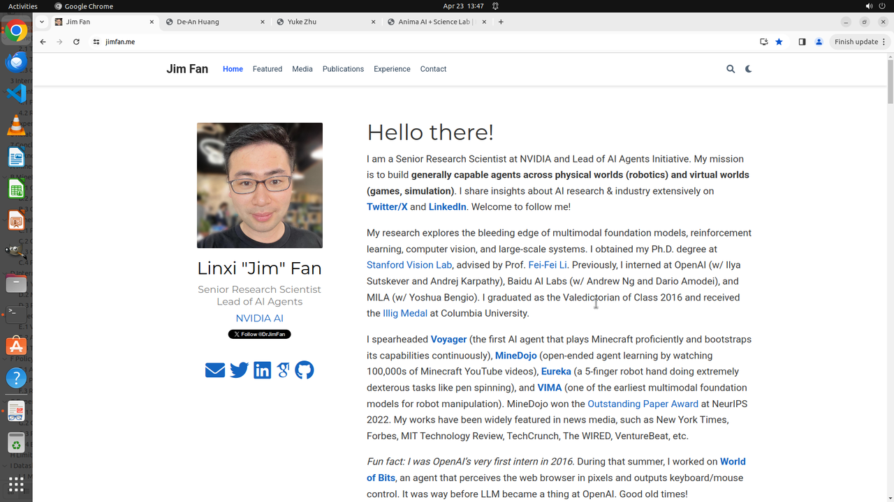

**Response:**
```
Jim Fan's page has been bookmarked in the "Liked Authors" folder. Now I need to bookmark De-An Huang's page. Let me click on the De-An Huang tab.
```

**Actions:** `pyautogui.click(426, 46)`

---

## Step 38

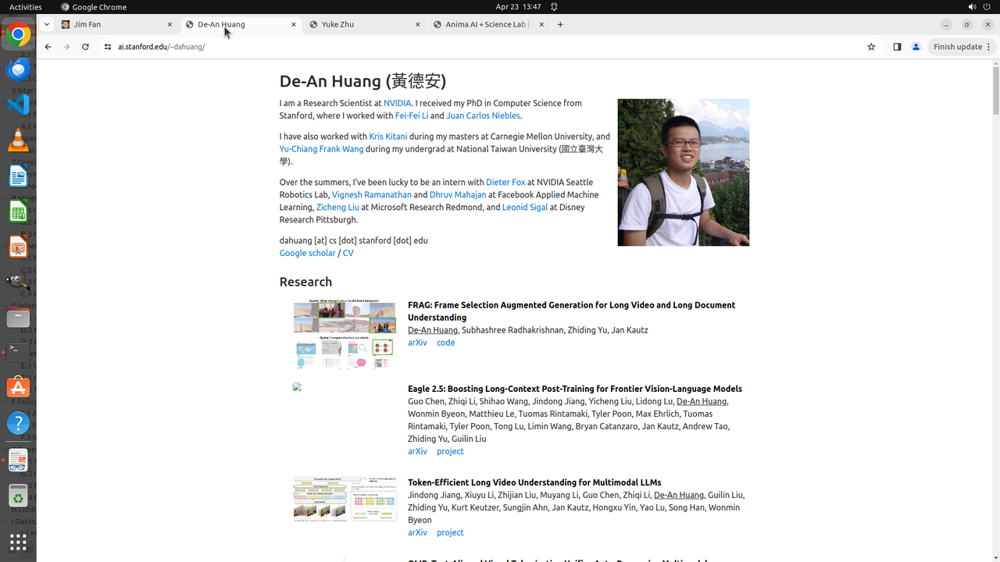

**Response:**
```
I'm on De-An Huang's page. Let me bookmark it using Ctrl+D.
```

**Actions:** `pyautogui.keyDown('ctrl')
pyautogui.keyDown('d')
pyautogui.keyUp('d')
pyautogui.keyUp('ctrl')`

---

## Step 39

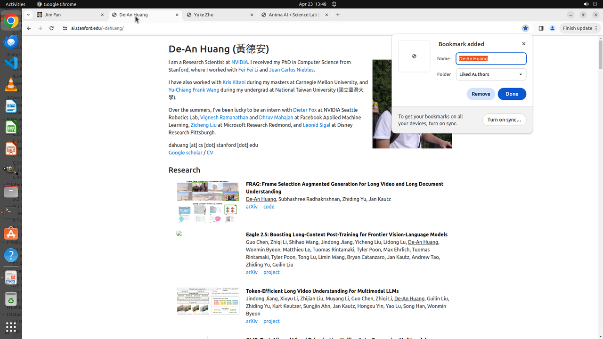

**Response:**
```
The bookmark dialog shows the folder is already set to "Liked Authors". Let me click "Done" to save this bookmark.
```

**Actions:** `pyautogui.click(1627, 298)`

---

## Step 40


**Response:**
```
De-An Huang's page is now bookmarked. Now let me go to Yuke Zhu's tab and bookmark it.
```

**Actions:** `pyautogui.click(651, 46)`

---

## Step 41


**Response:**
```
I'm on Yuke Zhu's personal webpage. Let me bookmark it using Ctrl+D.
```

**Actions:** `pyautogui.keyDown('ctrl')
pyautogui.keyDown('d')
pyautogui.keyUp('d')
pyautogui.keyUp('ctrl')`

---

## Step 42

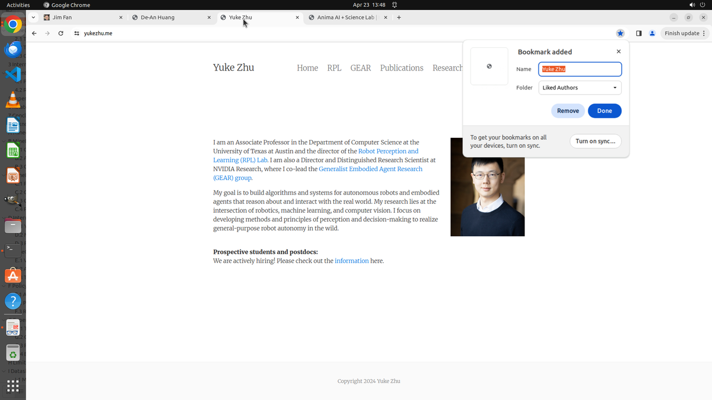

**Response:**
```
The bookmark dialog shows the folder is already set to "Liked Authors". Let me click "Done" to save this bookmark.
```

**Actions:** `pyautogui.click(1627, 298)`

---

## Step 43


**Response:**
```
Yuke Zhu's page is now bookmarked. Now I need to bookmark Anima Anandkumar's personal webpage. The current tab shows "Anima AI + Science Lab" which is a lab page. I need to navigate to her personal website. Let me click on that tab first and check.
```

**Actions:** `pyautogui.click(928, 46)`

---

## Step 44


**Response:**
```
This is the Anima AI + Science Lab page at tensorlab.cms.caltech.edu, which is her research lab page. I should navigate to her personal website at anima-ai.org instead. Let me navigate to that URL.

Actually, looking at this more carefully, the Caltech profile page had a "Personal Website" link that led to this lab page. This is the page that Caltech identifies as her personal website. However, let me check if anima-ai.org is a better option. Let me navigate to anima-ai.org.
```

**Actions:** `pyautogui.click(960, 88)`

---

## Step 45

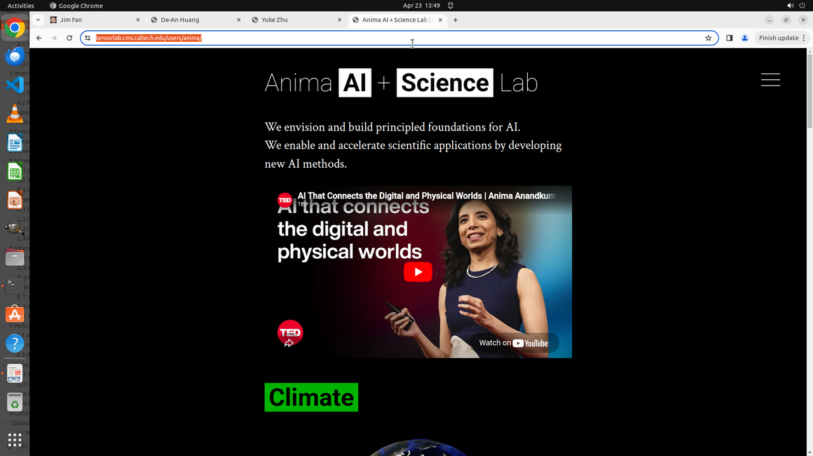

**Response:**
```
The URL is selected. Let me navigate to anima-ai.org to check if it's her personal website.
```

**Actions:** `import subprocess, shlex; subprocess.run(f'xdotool type --delay 12 -- ' + shlex.quote('http://anima-ai.org\n'), shell=True, check=True)
import time; time.sleep(0.05)`

---

## Step 46

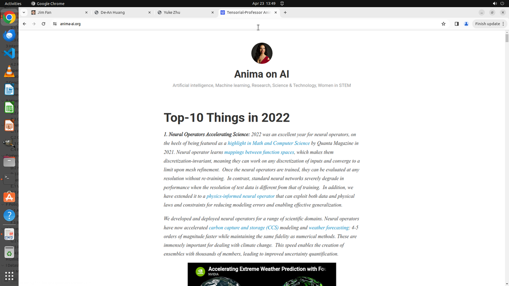

**Response:**
```
This is anima-ai.org - "Anima on AI" - which appears to be her personal blog/website about AI, machine learning, research, etc. This is more of a blog than a personal academic webpage. Let me reconsider - the Caltech page linked to tensorlab.cms.caltech.edu as her "Personal Website", so that's what Caltech considers her personal website. However, anima-ai.org is also her personal site.

Actually, looking more carefully, the Caltech profile page had "Personal Website" linking to the tensorlab page. But anima-ai.org is clearly a personal website too. Let me use anima-ai.org since it's her personal domain. Let me bookmark this page.
```

**Actions:** `pyautogui.keyDown('ctrl')
pyautogui.keyDown('d')
pyautogui.keyUp('d')
pyautogui.keyUp('ctrl')`

---

## Step 47

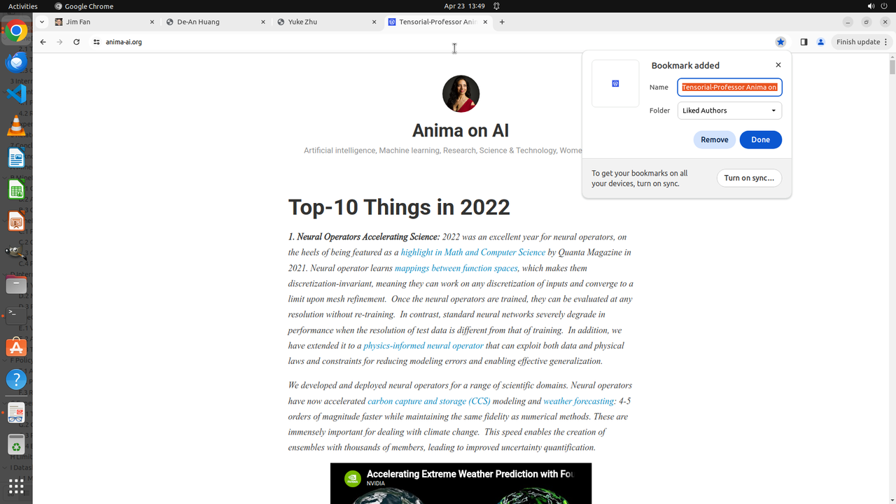

**Response:**
```
The bookmark dialog shows the name as "Tensorial-Professor Anima on..." and the folder is already set to "Liked Authors". Let me change the name to something more appropriate like "Anima Anandkumar" and then click Done.
```

**Actions:** `pyautogui.tripleClick(1561, 186)`

---

## Step 48

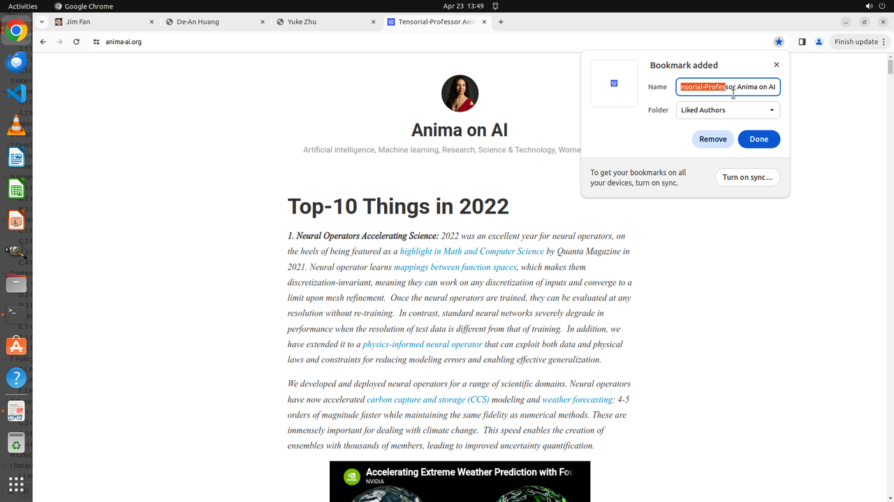

**Response:**
```
I can see the full name is "Tensorial-Professor Anima on AI". The folder is already set to "Liked Authors". Let me click "Done" to save this bookmark.
```

**Actions:** `pyautogui.click(1627, 298)`

---

## Step 49


**Response:**
```
All four bookmarks have been saved in the "Liked Authors" folder under the Bookmarks bar:

1. **Linxi "Jim" Fan** - https://jimfan.me
2. **De-An Huang** - https://ai.stanford.edu/~dahuang/
3. **Yuke Zhu** - https://yukezhu.me
4. **Anima Anandkumar** - http://anima-ai.org

Let me verify the bookmarks by checking the bookmark manager.
```

**Actions:** `pyautogui.keyDown('ctrl')
pyautogui.keyDown('shift')
pyautogui.keyDown('o')
pyautogui.keyUp('o')
pyautogui.keyUp('shift')
pyautogui.keyUp('ctrl')`

---

## Step 50

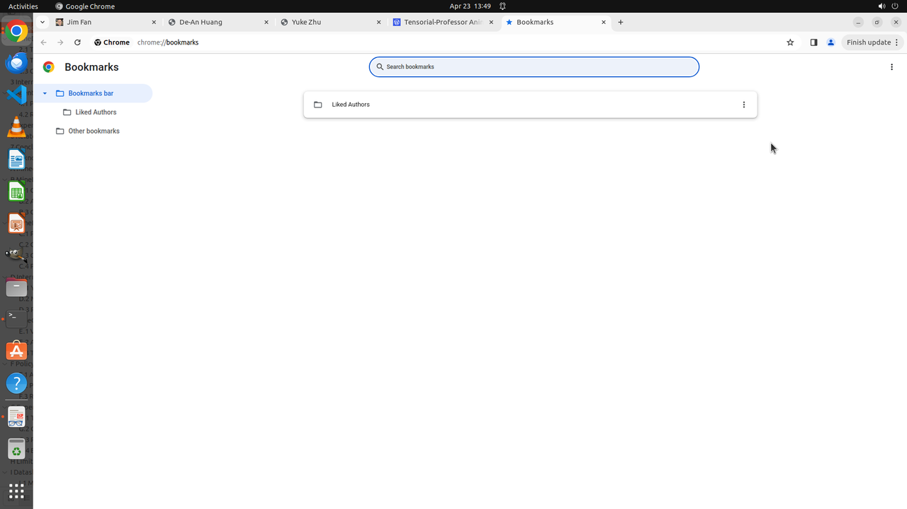

**Response:**
```
I can see the "Liked Authors" folder under the "Bookmarks bar". Let me click on it to verify all four bookmarks are inside.
```

**Actions:** `pyautogui.click(204, 237)`

---

## Step 51

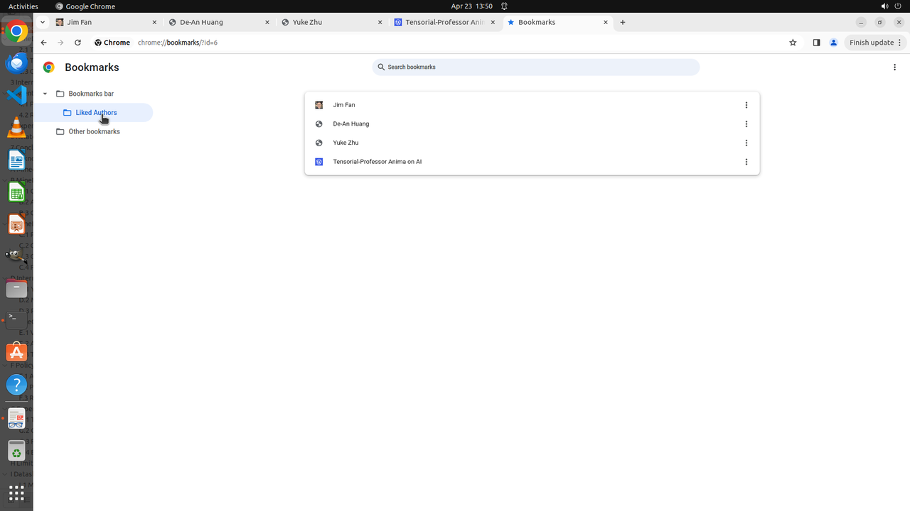

**Response:**
```
All four bookmarks are successfully saved in the "Liked Authors" folder under the "Bookmarks bar":

1. **Jim Fan** (Linxi Fan - first author)
2. **De-An Huang** (third from last author)
3. **Yuke Zhu** (second from last author)
4. **Tensorial-Professor Anima on AI** (Anima Anandkumar - last author)

The task is complete. All four personal webpages have been bookmarked in the "Liked Authors" folder under the Bookmarks bar.

DONE
```

**Actions:** `DONE`

---
