# Task aad10cd7-9337-4b62-b704-a857848cedf2

**Instruction:** I want to obtain a local file version of the content from the blog at https://developer.apple.com/design/human-interface-guidelines/searching to facilitate my own revision. Please retain the primary content on this page, specifically from 'searching' to just before 'resources.' Assist me in saving this blog as "notes.docx" on the desktop.

**Score:** 0.7236939470179073

**Wall clock:** 6m 9s

**Steps:** 24

**Cost:** $0.83

---

## Step 1

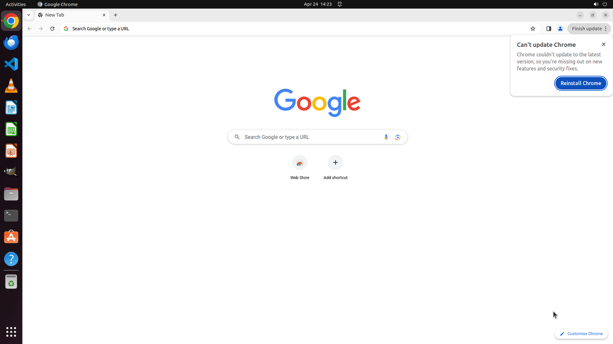

**Response:**
```
I'll complete this task by first visiting the Apple HIG page on searching, extracting the relevant content, and saving it as a .docx file on the desktop.

Let me start by navigating to the URL.
```

**Actions:** `pyautogui.click(990, 88)`

---

## Step 2

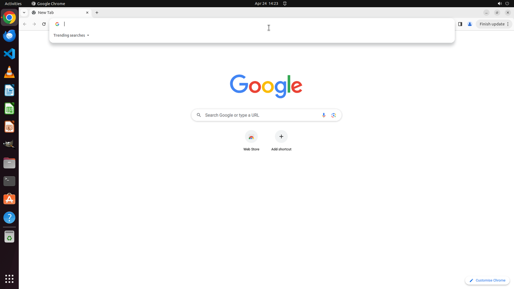

**Actions:** `import subprocess, shlex; subprocess.run(f'xdotool type --delay 12 -- ' + shlex.quote('https://developer.apple.com/design/human-interface'), shell=True, check=True)
import time; time.sleep(0.05)
impor`

---

## Step 3

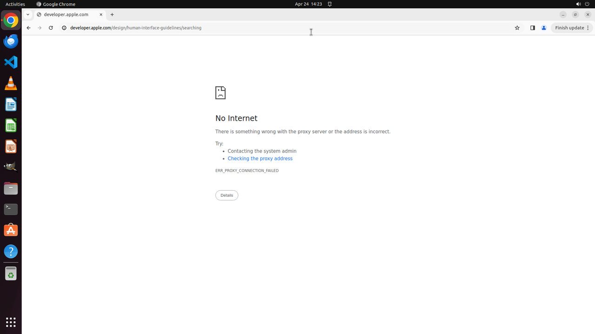

**Response:**
```
There's a proxy connection issue. Let me try to fix the proxy settings and retry. Let me open a terminal to check and fix the network configuration.
```

**Actions:** `pyautogui.click(33, 673)`

---

## Step 4

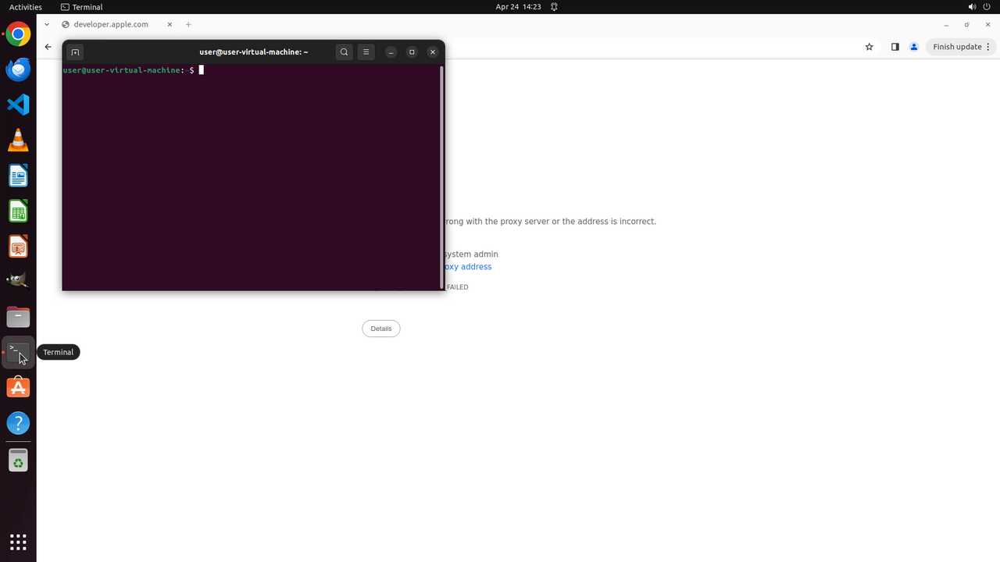

**Response:**
```
Let me check the proxy settings and try to fix the connection issue.
```

**Actions:** `import subprocess, shlex; subprocess.run(f'xdotool type --delay 12 -- ' + shlex.quote('env | grep -i proxy\n'), shell=True, check=True)
import time; time.sleep(0.05)`

---

## Step 5


**Response:**
```
No proxy environment variables are set. The issue might be with Chrome's proxy settings. Let me try using `curl` or `wget` to fetch the page content directly, and then check if the network works.
```

**Actions:** `import subprocess, shlex; subprocess.run(f'xdotool type --delay 12 -- ' + shlex.quote('curl -s -o /dev/null -w "%{http_code}" https://dev'), shell=True, check=True)
import time; time.sleep(0.05)
impor`

---

## Step 6

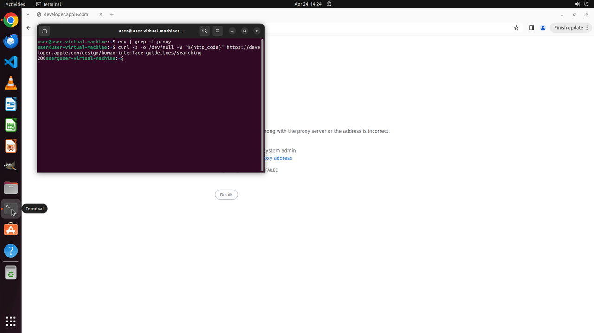

**Response:**
```
The curl request returned a 200 status code, so the network works from the terminal. The issue is only with Chrome's proxy settings. Let me fetch the page content using curl, extract the relevant section, and create the docx file using Python.
```

**Actions:** `import subprocess, shlex; subprocess.run(f'xdotool type --delay 12 -- ' + shlex.quote('curl -s https://developer.apple.com/design/human-i'), shell=True, check=True)
import time; time.sleep(0.05)
impor`

---

## Step 7


**Response:**
```
Good, the HTML has been downloaded. Now let me check if python3 and the python-docx library are available, and then write a script to extract the content and create the docx file.
```

**Actions:** `import subprocess, shlex; subprocess.run(f'xdotool type --delay 12 -- ' + shlex.quote('pip3 install python-docx beautifulsoup4 2>/dev/nul'), shell=True, check=True)
import time; time.sleep(0.05)
impor`

---

## Step 8

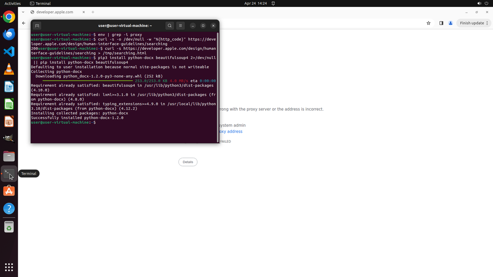

**Response:**
```
Both libraries are installed. Now let me first examine the HTML structure to understand how to extract the content between "Searching" and "Resources".
```

**Actions:** `import subprocess, shlex; subprocess.run(f'xdotool type --delay 12 -- ' + shlex.quote("python3 << 'PYEOF'\nfrom bs4 import BeautifulSoup\n\n"), shell=True, check=True)
import time; time.sleep(0.05)
im`

---

## Step 9

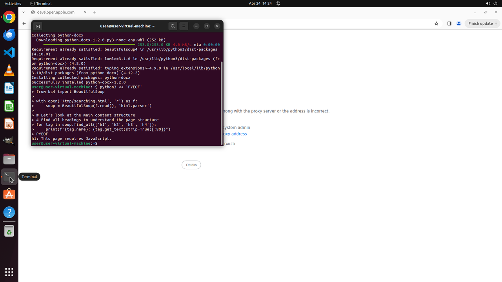

**Response:**
```
The page says "This page requires JavaScript." - the content is loaded dynamically via JavaScript. I need to use a different approach. Let me try using a headless browser or check if there's a way to get the rendered content. Let me try using `google-chrome` in headless mode to get the rendered HTML.
```

**Actions:** `import subprocess, shlex; subprocess.run(f'xdotool type --delay 12 -- ' + shlex.quote('google-chrome --headless --dump-dom --no-sandbox h'), shell=True, check=True)
import time; time.sleep(0.05)
impor`

---

## Step 10

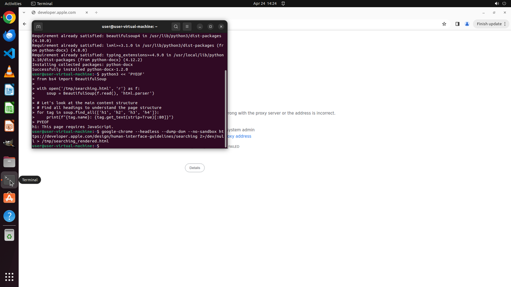

**Response:**
```
Good, the headless Chrome rendered the page. Now let me check the structure of the rendered HTML to find the content between "Searching" and "Resources".
```

**Actions:** `import subprocess, shlex; subprocess.run(f'xdotool type --delay 12 -- ' + shlex.quote("python3 << 'PYEOF'\nfrom bs4 import BeautifulSoup\n\n"), shell=True, check=True)
import time; time.sleep(0.05)
im`

---

## Step 11


**Response:**
```
I can see the headings but it seems like the main content headings (like "Searching") are not showing. The page might need more time to render JavaScript. Let me scroll up to see if there were more headings, and also try a different approach - maybe the content is loaded via an API or JSON data embedded in the page.
```

**Actions:** `pyautogui.scroll(5, 480, 300)`

---

## Step 12

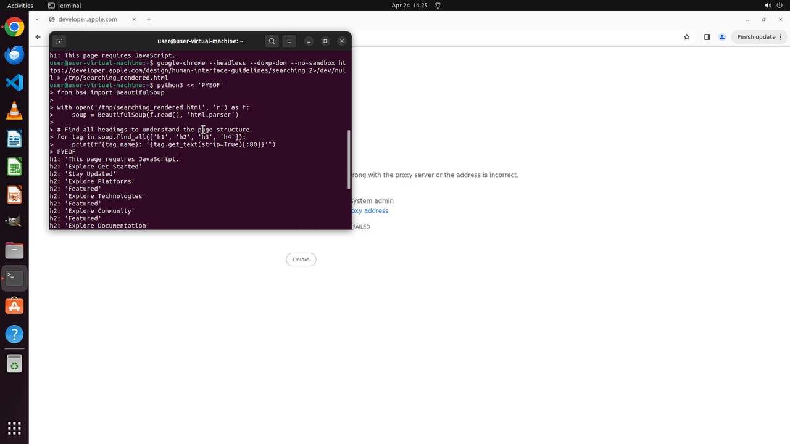

**Response:**
```
I see the page still says "This page requires JavaScript." even with headless Chrome. The headless Chrome might not be waiting long enough for the JavaScript to render. Let me try with a longer timeout or use a different approach. Let me check if there's JSON data embedded in the original HTML, or use the `--virtual-time-budget` flag.
```

**Actions:** `import subprocess, shlex; subprocess.run(f'xdotool type --delay 12 -- ' + shlex.quote('google-chrome --headless --dump-dom --no-sandbox -'), shell=True, check=True)
import time; time.sleep(0.05)
impor`

---

## Step 13

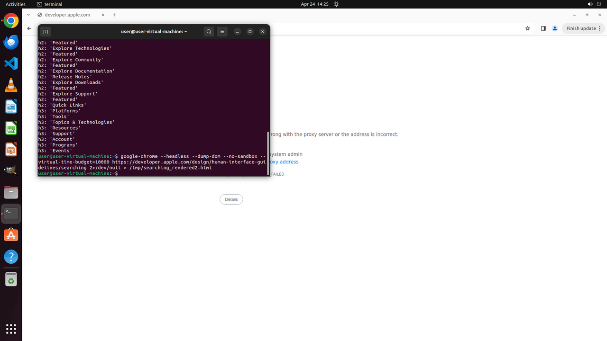

**Response:**
```
The headings still don't include the actual content headings like "Searching". The page content seems to be loaded asynchronously. Let me check the rendered HTML more carefully - maybe the content is in a different format (like JSON data or in specific div elements).
```

**Actions:** `import subprocess, shlex; subprocess.run(f'xdotool type --delay 12 -- ' + shlex.quote("python3 << 'PYEOF'\nfrom bs4 import BeautifulSoup\n\n"), shell=True, check=True)
import time; time.sleep(0.05)
im`

---

## Step 14

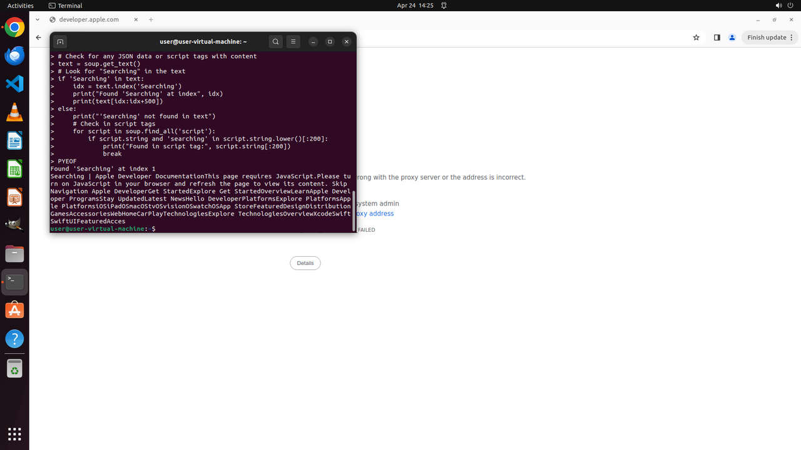

**Response:**
```
The "Searching" text is found but it's just in the page title/navigation, not the actual content. The JavaScript-rendered content isn't loading properly. Let me try a different approach - I'll look for the content in the original HTML's JSON data or use the Apple developer documentation API.
```

**Actions:** `import subprocess, shlex; subprocess.run(f'xdotool type --delay 12 -- ' + shlex.quote("python3 << 'PYEOF'\nfrom bs4 import BeautifulSoup\ni"), shell=True, check=True)
import time; time.sleep(0.05)
imp`

---

## Step 15

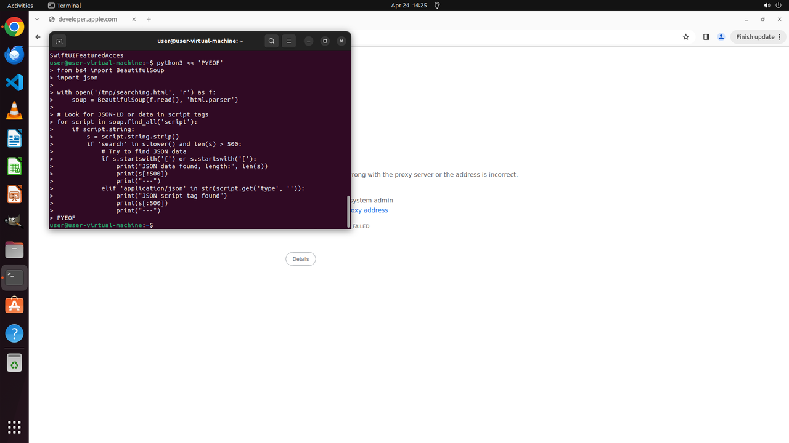

**Response:**
```
No JSON data found in the script tags. The Apple HIG pages use a complex JavaScript framework. Let me try a different approach - I'll use the Apple developer documentation JSON API directly, which is what the page's JavaScript fetches.
```

**Actions:** `import subprocess, shlex; subprocess.run(f'xdotool type --delay 12 -- ' + shlex.quote('curl -s "https://developer.apple.com/tutorials/dat'), shell=True, check=True)
import time; time.sleep(0.05)
impor`

---

## Step 16

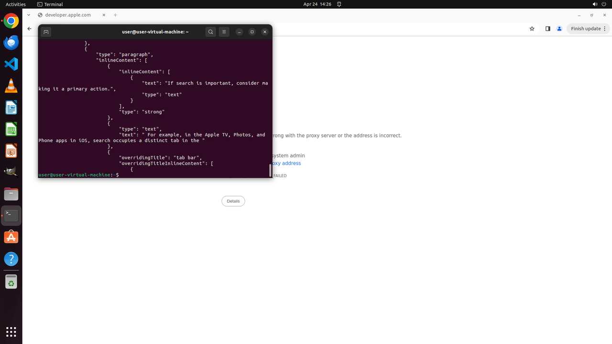

**Response:**
```
I found the JSON API endpoint. The content is available as structured JSON data. Now let me download the full JSON and write a Python script to extract the content and create the docx file.
```

**Actions:** `import subprocess, shlex; subprocess.run(f'xdotool type --delay 12 -- ' + shlex.quote('curl -s "https://developer.apple.com/tutorials/dat'), shell=True, check=True)
import time; time.sleep(0.05)
impor`

---

## Step 17

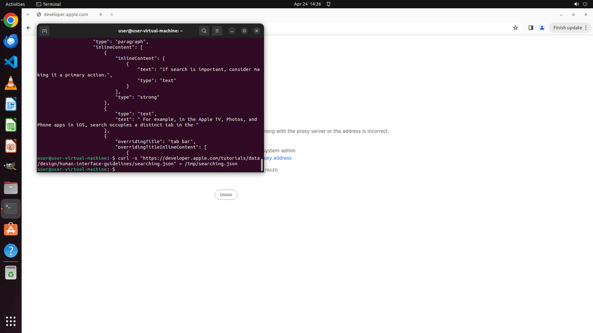

**Response:**
```
Now let me write a Python script to parse the JSON data, extract the content from "Searching" to before "Resources", and create the docx file.
```

**Actions:** `import subprocess, shlex; subprocess.run(f'xdotool type --delay 12 -- ' + shlex.quote("python3 << 'PYEOF'\nimport json\n\nwith open('/tmp/se"), shell=True, check=True)
import time; time.sleep(0.05)
im`

---

## Step 18

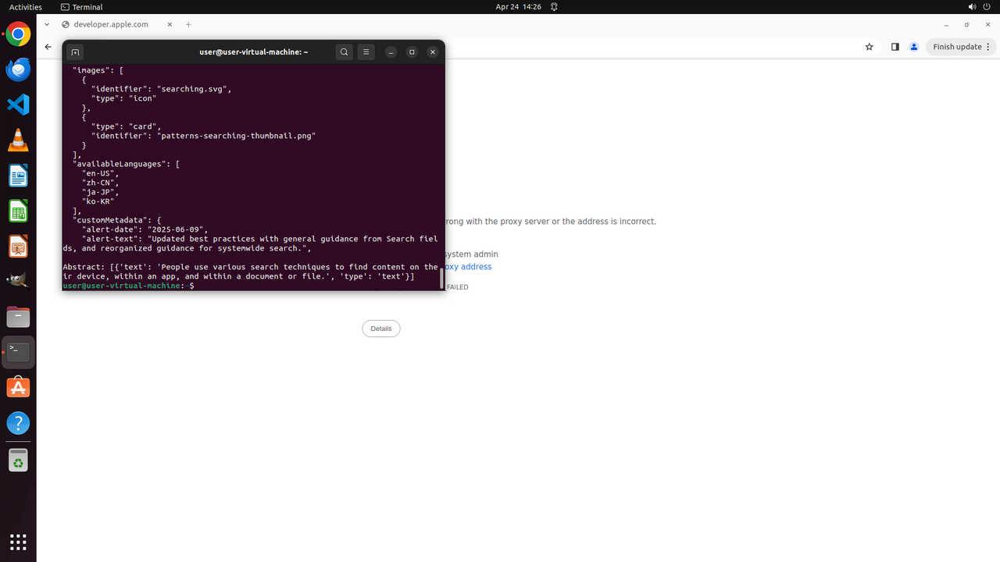

**Response:**
```
I can see the JSON structure. Now let me explore the `primaryContentSections` more deeply to understand how to extract the content.
```

**Actions:** `import subprocess, shlex; subprocess.run(f'xdotool type --delay 12 -- ' + shlex.quote("python3 << 'PYEOF'\nimport json\n\nwith open('/tmp/se"), shell=True, check=True)
import time; time.sleep(0.05)
im`

---

## Step 19


**Response:**
```
Now I can see the structure. I need to extract content from the beginning up to (but not including) the "Resources" heading at index [19]. Let me scroll up to see the full structure from the beginning.
```

**Actions:** `pyautogui.scroll(10, 480, 300)`

---

## Step 20

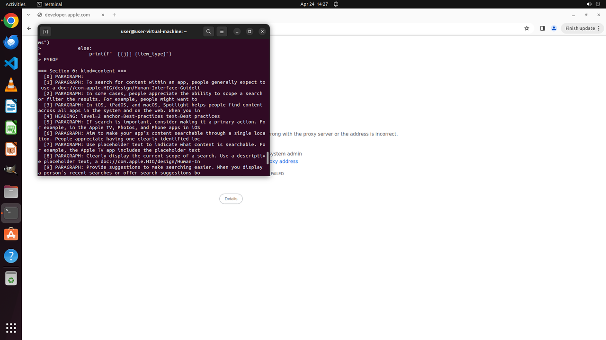

**Response:**
```
Now I can see the full structure. The content starts at index [0] and goes up to index [19] which is the "Resources" heading. I need to extract items [0] through [18] (everything before "Resources"). Now let me write the complete Python script to create the docx file.
```

**Actions:** `import subprocess, shlex; subprocess.run(f'xdotool type --delay 12 -- ' + shlex.quote("python3 << 'PYEOF'\nimport json\nfrom docx import Do"), shell=True, check=True)
import time; time.sleep(0.05)
imp`

---

## Step 21

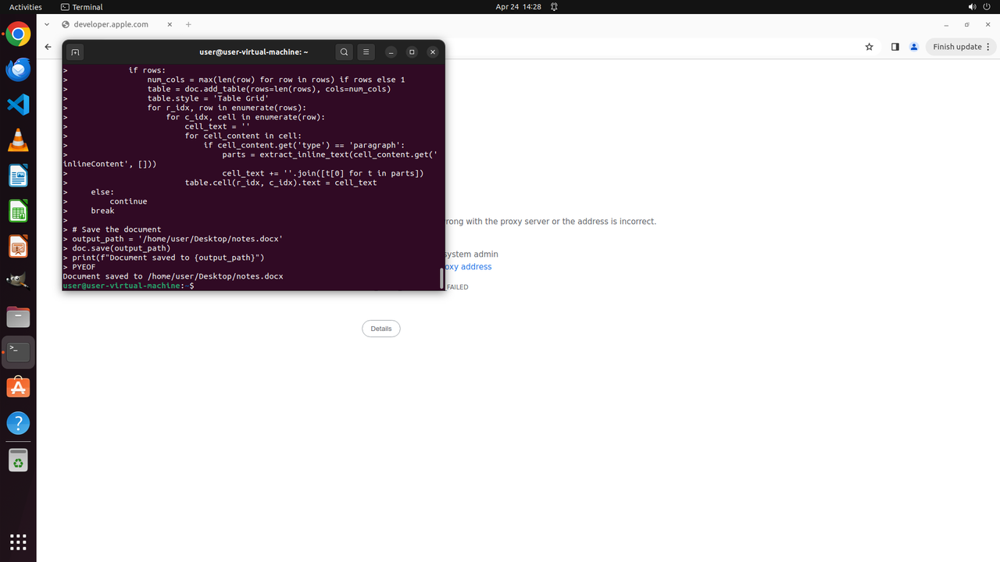

**Response:**
```
The document has been saved successfully to `/home/user/Desktop/notes.docx`. Let me verify the file exists and check its content.
```

**Actions:** `import subprocess, shlex; subprocess.run(f'xdotool type --delay 12 -- ' + shlex.quote('ls -la /home/user/Desktop/notes.docx\n'), shell=True, check=True)
import time; time.sleep(0.05)`

---

## Step 22

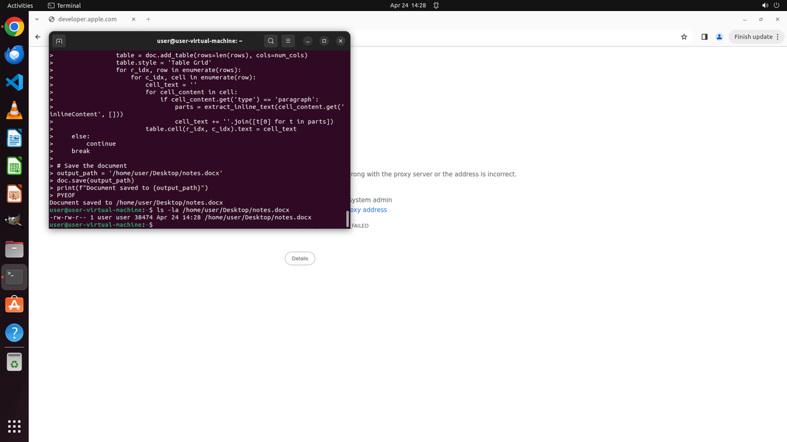

**Response:**
```
The file `notes.docx` (38,474 bytes) has been created on the Desktop. Let me verify the content by extracting the text from the docx to make sure it contains the right content.
```

**Actions:** `import subprocess, shlex; subprocess.run(f'xdotool type --delay 12 -- ' + shlex.quote("python3 << 'PYEOF'\nfrom docx import Document\n\ndoc "), shell=True, check=True)
import time; time.sleep(0.05)
im`

---

## Step 23

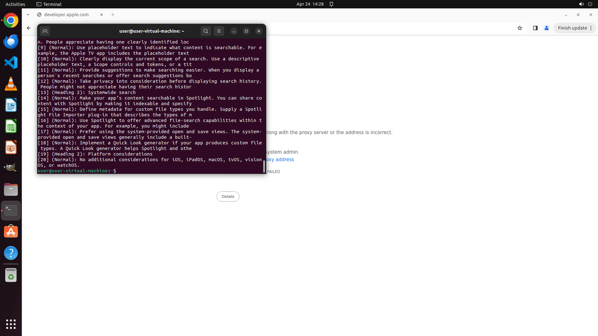

**Response:**
```
Let me scroll up to see the beginning of the document content.
```

**Actions:** `pyautogui.scroll(5, 480, 300)`

---

## Step 24


**Response:**
```
The document looks great! It contains all the primary content from the "Searching" page:

1. **Heading 1**: "Searching" (title)
2. **Abstract**: People use various search techniques...
3. **Content paragraphs** about searching within apps, search fields, scoping, Spotlight
4. **Heading 2**: "Best practices" with all the best practice guidelines
5. **Heading 2**: "Systemwide search" with Spotlight-related content
6. **Heading 2**: "Platform considerations" 

And it stops before the "Resources" section, exactly as requested.

The file `notes.docx` has been successfully saved to the Desktop at `/home/user/Desktop/notes.docx`.

DONE
```

**Actions:** `DONE`

---
