# Task aad10cd7-9337-4b62-b704-a857848cedf2

**Instruction:** I want to obtain a local file version of the content from the blog at https://developer.apple.com/design/human-interface-guidelines/searching to facilitate my own revision. Please retain the primary content on this page, specifically from 'searching' to just before 'resources.' Assist me in saving this blog as "notes.docx" on the desktop.

**Score:** 0.7204950640931191

**Wall clock:** 5m 51s

**Steps:** 21

**Cost:** $0.72

---

## Step 1

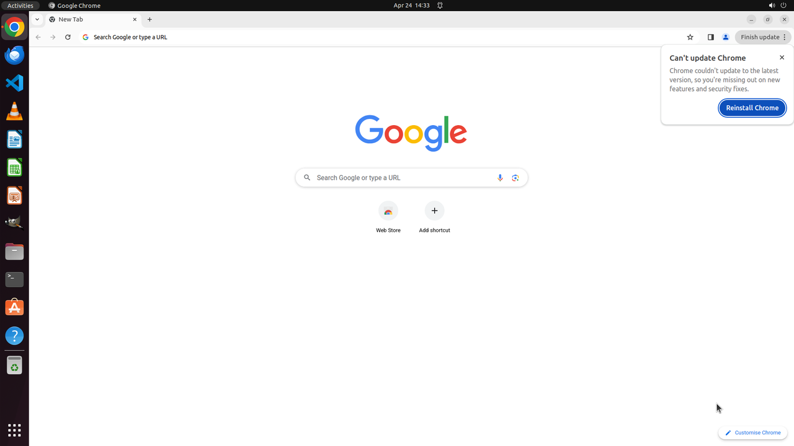

**Response:**
```
I'll navigate to the Apple HIG page on searching, extract the content, and save it as a .docx file.
```

**Actions:** `pyautogui.click(990, 88)`

---

## Step 2

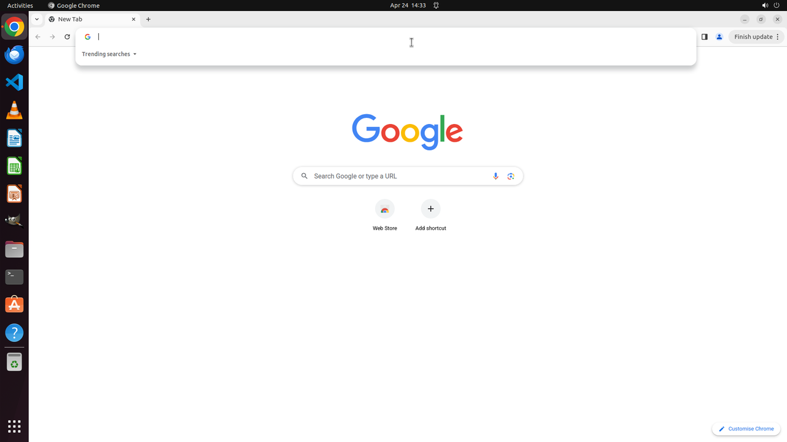

**Actions:** `import subprocess, shlex; subprocess.run(f'xdotool type --delay 12 -- ' + shlex.quote('https://developer.apple.com/design/human-interface'), shell=True, check=True)
import time; time.sleep(0.05)
impor`

---

## Step 3

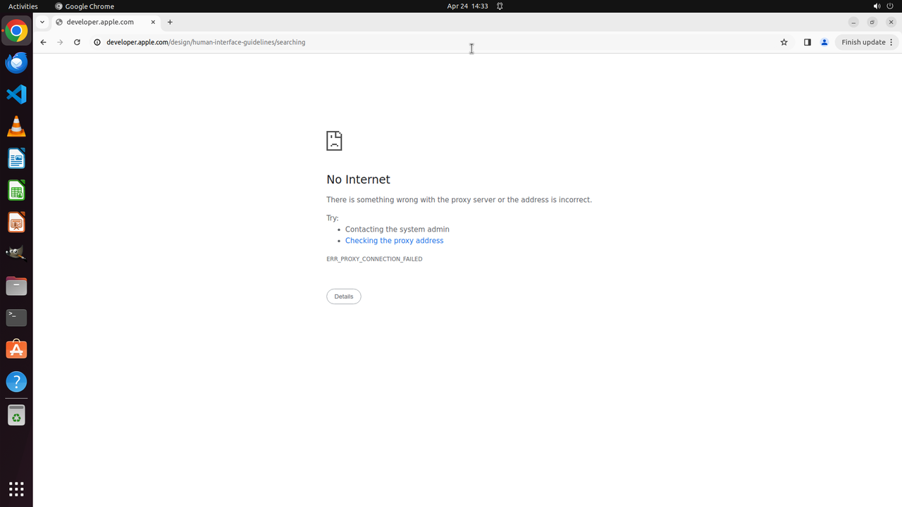

**Response:**
```
There's a proxy connection issue. Let me try to fix the network settings first by opening a terminal.
```

**Actions:** `pyautogui.click(33, 673)`

---

## Step 4

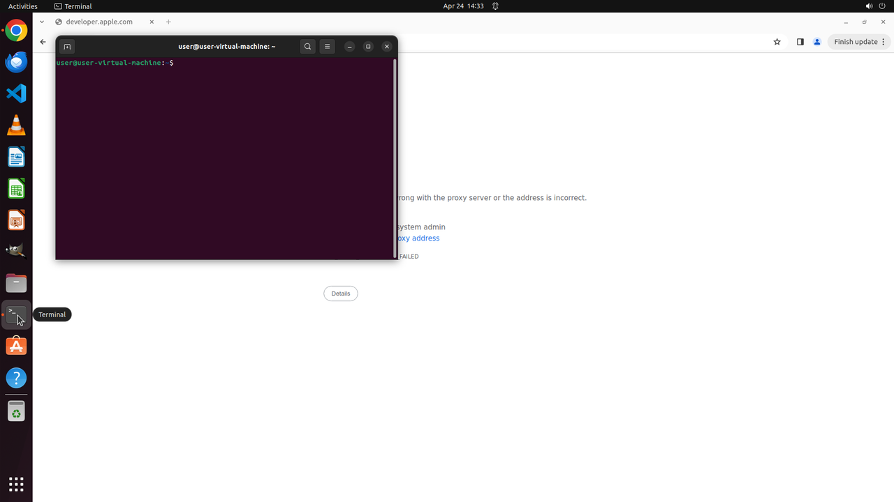

**Response:**
```
Let me check and fix the proxy settings, then try to access the page.
```

**Actions:** `import subprocess, shlex; subprocess.run(f'xdotool type --delay 12 -- ' + shlex.quote('env | grep -i proxy\n'), shell=True, check=True)
import time; time.sleep(0.05)`

---

## Step 5

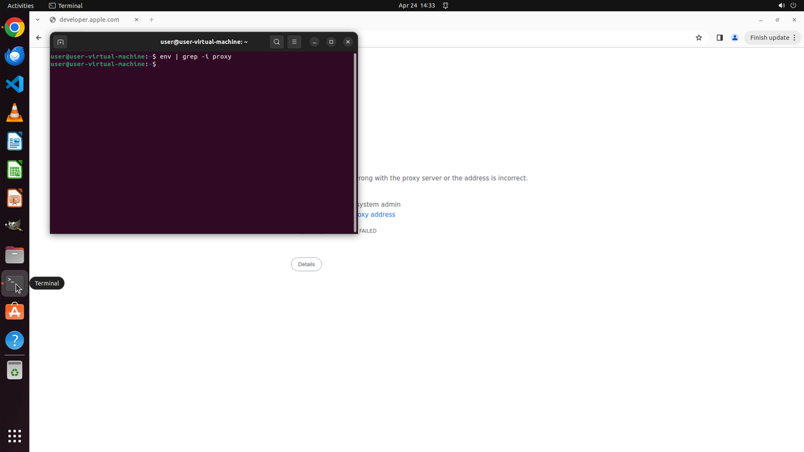

**Response:**
```
No proxy environment variables are set. The issue might be with Chrome's proxy settings. Let me check the GNOME proxy settings and try using curl directly.
```

**Actions:** `import subprocess, shlex; subprocess.run(f'xdotool type --delay 12 -- ' + shlex.quote('gsettings get org.gnome.system.proxy mode\n'), shell=True, check=True)
import time; time.sleep(0.05)`

---

## Step 6

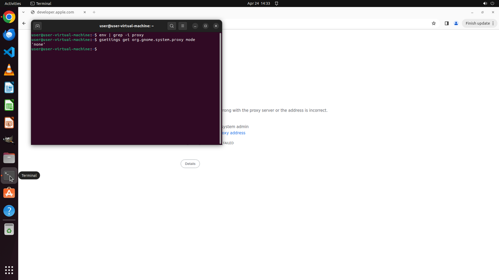

**Response:**
```
The proxy mode is 'none', so no system proxy is configured. Let me try to directly fetch the page with curl to see if the network works from the terminal.
```

**Actions:** `import subprocess, shlex; subprocess.run(f'xdotool type --delay 12 -- ' + shlex.quote('curl -s -o /dev/null -w "%{http_code}" https://dev'), shell=True, check=True)
import time; time.sleep(0.05)
impor`

---

## Step 7

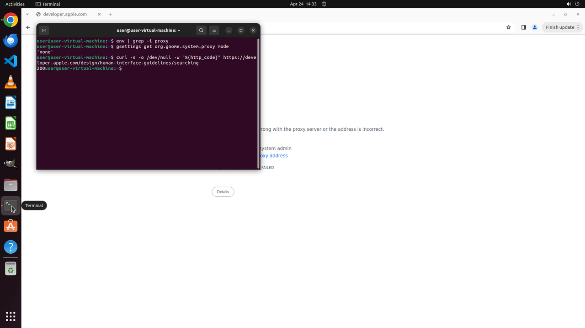

**Response:**
```
The curl command returned HTTP 200, so the network works from the terminal. The issue is only with Chrome's proxy settings. Let me fetch the page content using curl, extract the relevant section, and create the docx file using Python.
```

**Actions:** `import subprocess, shlex; subprocess.run(f'xdotool type --delay 12 -- ' + shlex.quote('curl -s https://developer.apple.com/design/human-i'), shell=True, check=True)
import time; time.sleep(0.05)
impor`

---

## Step 8


**Response:**
```
Good, the HTML has been downloaded. Now let me check if python3 and the necessary libraries are available, and then write a script to extract the content and create the docx file.
```

**Actions:** `import subprocess, shlex; subprocess.run(f'xdotool type --delay 12 -- ' + shlex.quote('pip3 install python-docx beautifulsoup4 2>/dev/nul'), shell=True, check=True)
import time; time.sleep(0.05)
impor`

---

## Step 9

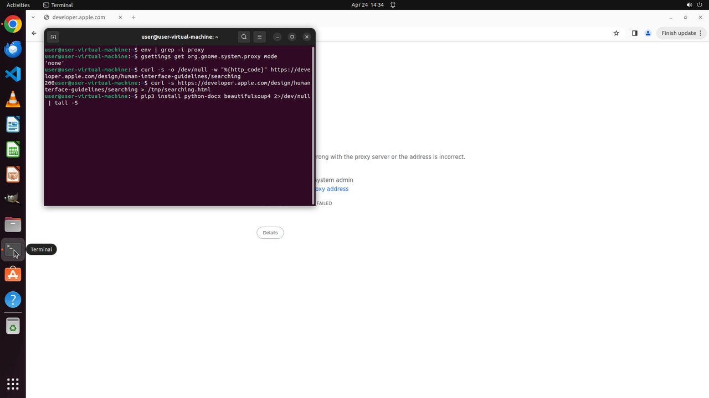

**Response:**
```
Let me wait for the installation to complete.
```

**Actions:** `time.sleep(0.5)`

---

## Step 10

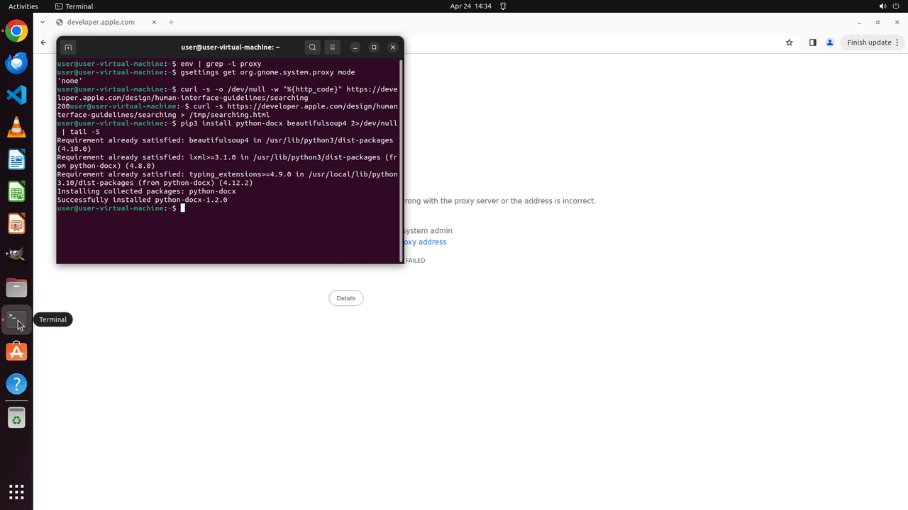

**Response:**
```
Both libraries are installed. Now let me first examine the HTML structure to understand how to extract the content between "Searching" and "Resources".
```

**Actions:** `import subprocess, shlex; subprocess.run(f'xdotool type --delay 12 -- ' + shlex.quote("python3 << 'PYEOF'\nfrom bs4 import BeautifulSoup\n\n"), shell=True, check=True)
import time; time.sleep(0.05)
im`

---

## Step 11

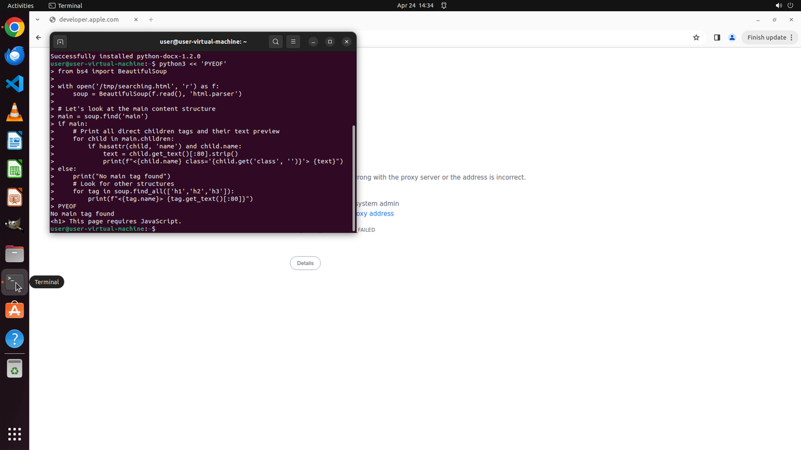

**Response:**
```
The page requires JavaScript to render content. This means the static HTML from curl doesn't contain the actual content. I need to use a different approach - either use a headless browser or try to find the content in the JavaScript data. Let me check if there's any JSON data embedded in the page.
```

**Actions:** `import subprocess, shlex; subprocess.run(f'xdotool type --delay 12 -- ' + shlex.quote("grep -o 'application/json[^<]*' /tmp/searching.htm"), shell=True, check=True)
import time; time.sleep(0.05)
impor`

---

## Step 12

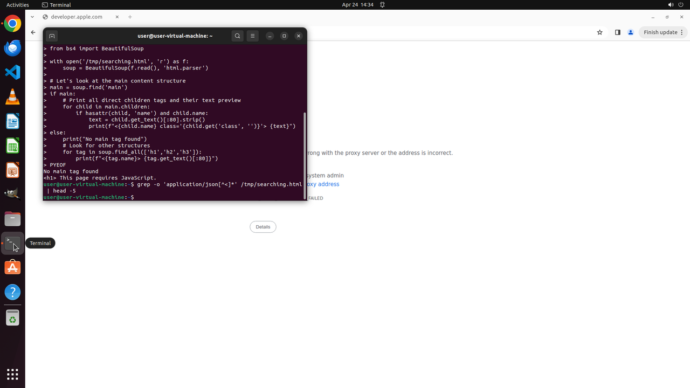

**Response:**
```
No JSON data found. The page is JavaScript-rendered. Let me try to fix Chrome's proxy issue first, or use a different approach with a headless browser. Let me try to launch Chrome with no proxy settings and access the page.
```

**Actions:** `import subprocess, shlex; subprocess.run(f'xdotool type --delay 12 -- ' + shlex.quote("grep -i 'script.*src' /tmp/searching.html | head -"), shell=True, check=True)
import time; time.sleep(0.05)
impor`

---

## Step 13

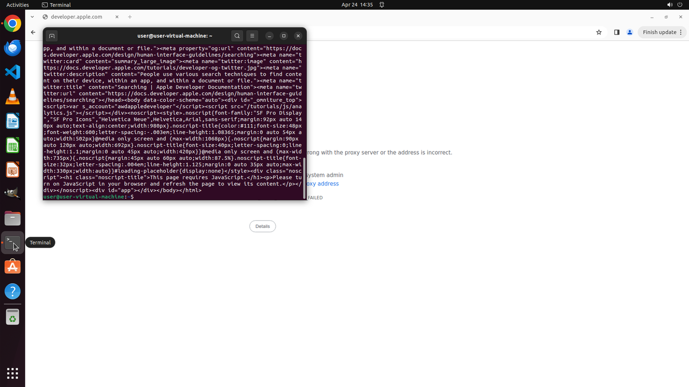

**Response:**
```
I can see the page is a JavaScript-rendered SPA. The content is loaded via JS from Apple's documentation. Let me try a different approach - I'll look for the API endpoint that serves the content, or use a headless browser approach. Let me check if the content is available via Apple's documentation API.
```

**Actions:** `import subprocess, shlex; subprocess.run(f'xdotool type --delay 12 -- ' + shlex.quote('curl -s "https://developer.apple.com/tutorials/dat'), shell=True, check=True)
import time; time.sleep(0.05)
impor`

---

## Step 14

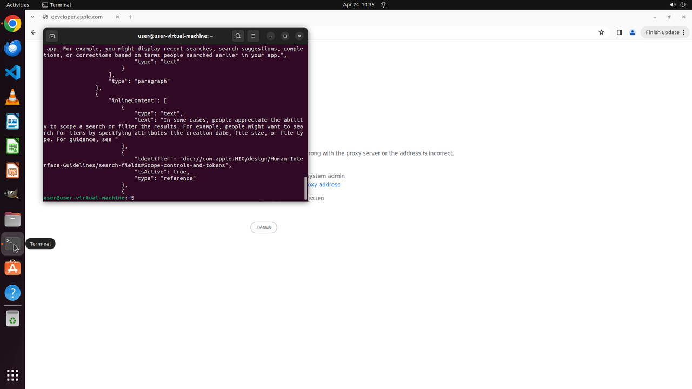

**Response:**
```
I found the JSON API endpoint that contains the content. Now let me save the full JSON and write a Python script to extract the content and create the docx file.
```

**Actions:** `import subprocess, shlex; subprocess.run(f'xdotool type --delay 12 -- ' + shlex.quote('curl -s "https://developer.apple.com/tutorials/dat'), shell=True, check=True)
import time; time.sleep(0.05)
impor`

---

## Step 15

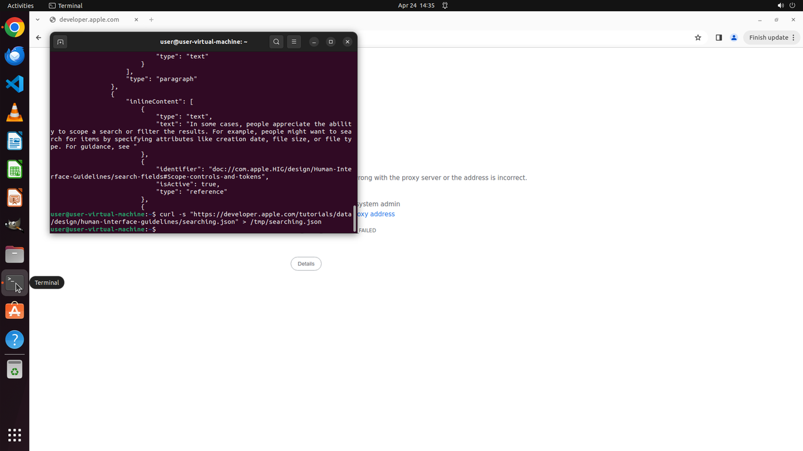

**Response:**
```
Now let me examine the JSON structure to understand how to extract the content properly and then create the docx file.
```

**Actions:** `import subprocess, shlex; subprocess.run(f'xdotool type --delay 12 -- ' + shlex.quote("python3 << 'PYEOF'\nimport json\n\nwith open('/tmp/se"), shell=True, check=True)
import time; time.sleep(0.05)
im`

---

## Step 16

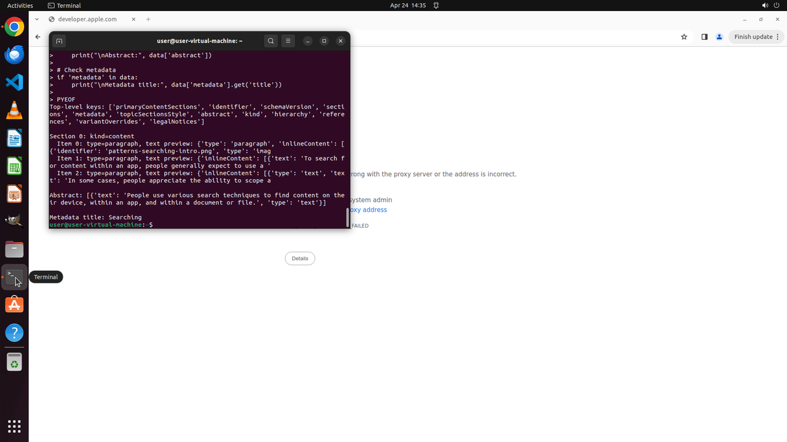

**Response:**
```
I can see the JSON structure. The content is in `primaryContentSections` with `kind=content`. Let me also check the `sections` and `topicSectionsStyle` to understand the full structure, then write a comprehensive script to extract all content and create the docx.
```

**Actions:** `import subprocess, shlex; subprocess.run(f'xdotool type --delay 12 -- ' + shlex.quote("python3 << 'PYEOF'\nimport json\n\nwith open('/tmp/se"), shell=True, check=True)
import time; time.sleep(0.05)
im`

---

## Step 17

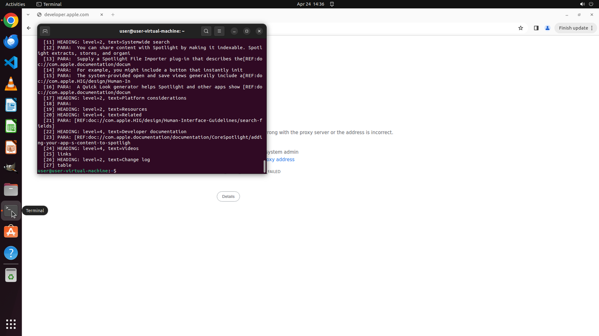

**Response:**
```
Now I can see the full structure. The content I need is from the beginning (title "Searching") up to but not including the "Resources" section (item [19]). Let me scroll up to see the earlier items too.
```

**Actions:** `pyautogui.scroll(10, 480, 300)`

---

## Step 18

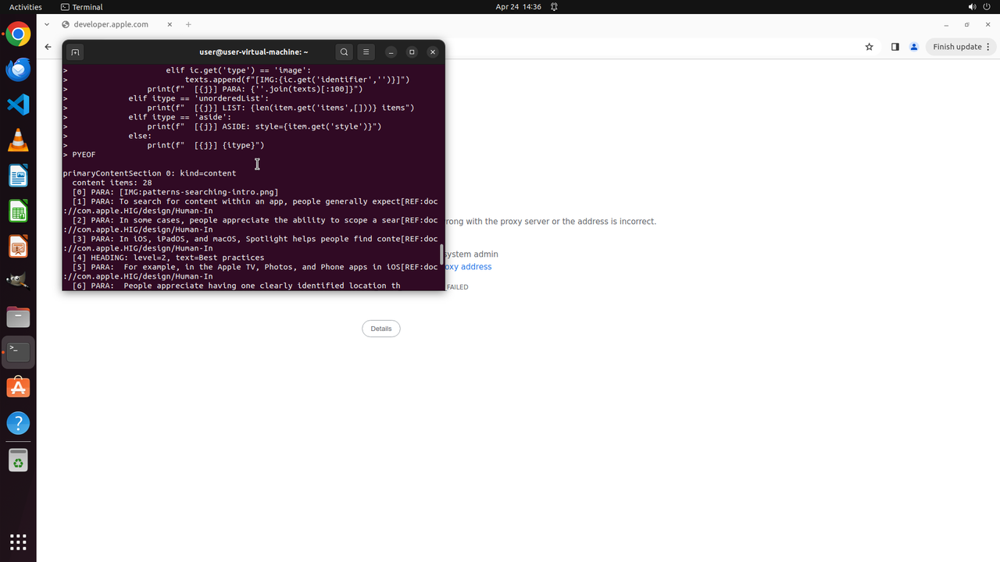

**Response:**
```
Now I can see the full structure. The content has 28 items. I need items [0] through [18] (before "Resources" at item [19]). Let me now write the Python script to create the docx file.
```

**Actions:** `import subprocess, shlex; subprocess.run(f'xdotool type --delay 12 -- ' + shlex.quote("cat << 'PYEOF' > /tmp/create_docx.py\nimport json\nf"), shell=True, check=True)
import time; time.sleep(0.05)
imp`

---

## Step 19

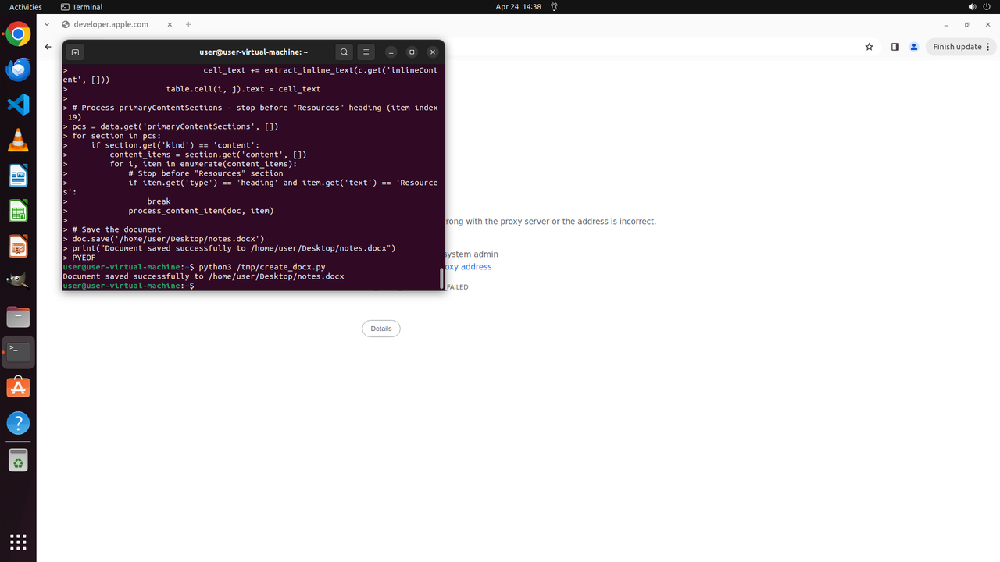

**Response:**
```
The document has been saved successfully to `/home/user/Desktop/notes.docx`. Let me verify the file exists and check its content.
```

**Actions:** `import subprocess, shlex; subprocess.run(f'xdotool type --delay 12 -- ' + shlex.quote('ls -la /home/user/Desktop/notes.docx\n'), shell=True, check=True)
import time; time.sleep(0.05)`

---

## Step 20

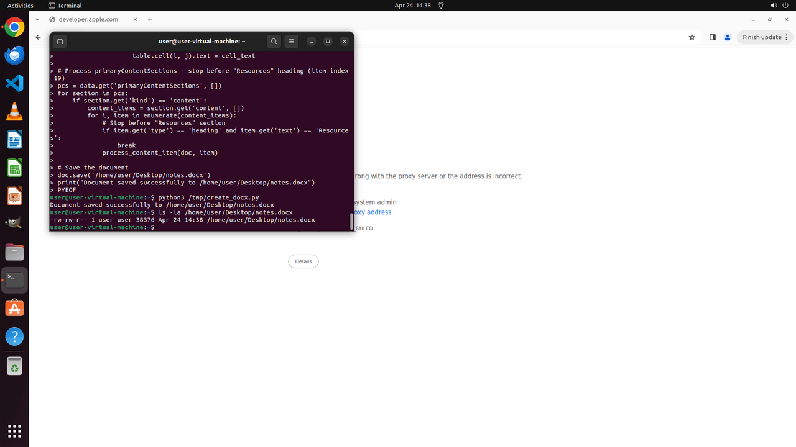

**Response:**
```
The file `notes.docx` (38,376 bytes) has been successfully created on the Desktop. Let me quickly verify its content by reading the text from it to make sure it contains the right content.
```

**Actions:** `import subprocess, shlex; subprocess.run(f'xdotool type --delay 12 -- ' + shlex.quote('python3 -c "\nfrom docx import Document\ndoc = Docum'), shell=True, check=True)
import time; time.sleep(0.05)
imp`

---

## Step 21

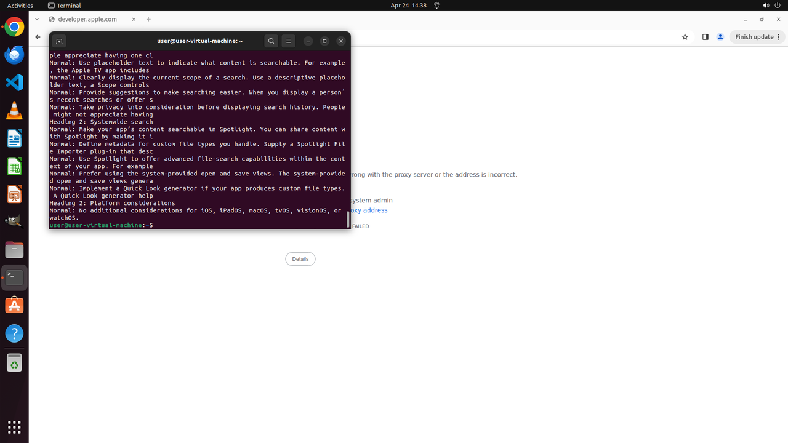

**Response:**
```
The document has been created successfully with all the primary content from the "Searching" page. I can see it includes:

- The title "Searching"
- The abstract/subtitle
- Best practices section with bullet points
- Systemwide search section
- Platform considerations section

And it stops before the "Resources" section as requested. The file `notes.docx` is saved on the Desktop.

DONE
```

**Actions:** `DONE`

---
