# Task aceb0368-56b8-4073-b70e-3dc9aee184e0

**Instruction:** I am grading students' English exam papers, but the test consists only of multiple-choice questions. It's too exhausting to check each question one by one and record the detailed scores. Can you help me compare the remaining students' answers with the answer key and record the detailed scoring in the opened spreadsheet?

**Score:** 1.0

**Wall clock:** 11m 17s

**Steps:** 57

**Cost:** $2.36

---

## Step 1


**Response:**
```
I need to understand the task. Let me first read through the reference answers document, then check what's in the spreadsheet and any student answer files.
```

**Actions:** `time.sleep(0.1)`

---

## Step 2


**Response:**
```
Let me first scroll through the reference answers document to see all the correct answers.
```

**Actions:** `pyautogui.scroll(-10, 960, 600)`

---

## Step 3

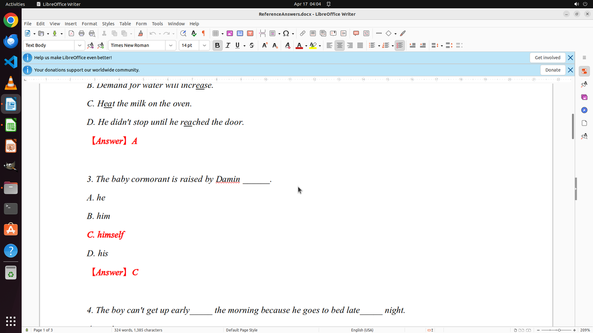

**Response:**
```
I can see the reference answers document. Let me continue scrolling to see all the answers.
```

**Actions:** `pyautogui.scroll(-10, 960, 600)`

---

## Step 4

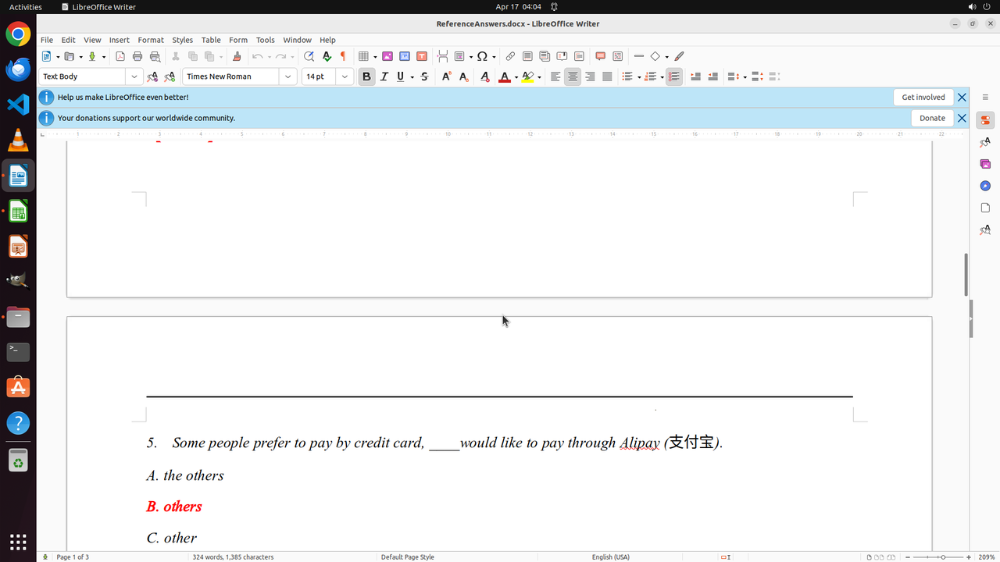

**Response:**
```
I can see we're on page 2 now. Let me continue scrolling to see all the answers.
```

**Actions:** `pyautogui.scroll(-10, 960, 600)`

---

## Step 5

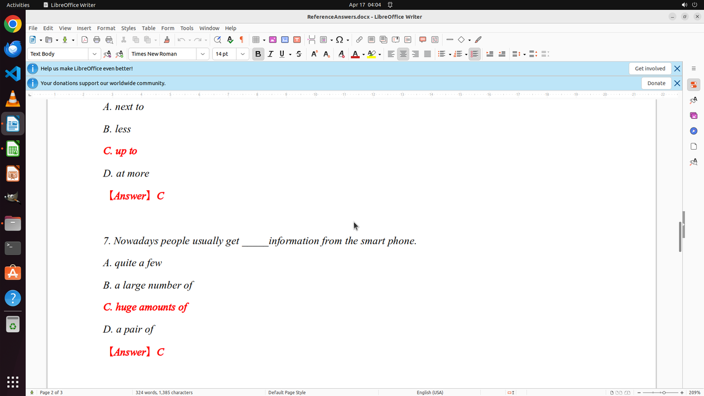

**Response:**
```
I can see questions 6 and 7. Let me continue scrolling to see all the remaining answers.
```

**Actions:** `pyautogui.scroll(-10, 960, 600)`

---

## Step 6

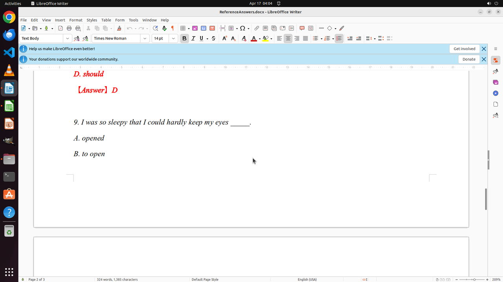

**Response:**
```
I can see question 8's answer is D, and question 9 is starting. Let me continue scrolling to see the rest.
```

**Actions:** `pyautogui.scroll(-10, 960, 600)`

---

## Step 7

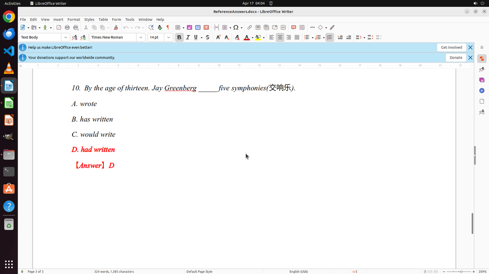

**Response:**
```
Now I can see the last question (10) with answer D. Let me scroll up to also capture the answer for question 9 that I might have missed.
```

**Actions:** `pyautogui.scroll(5, 960, 600)`

---

## Step 8

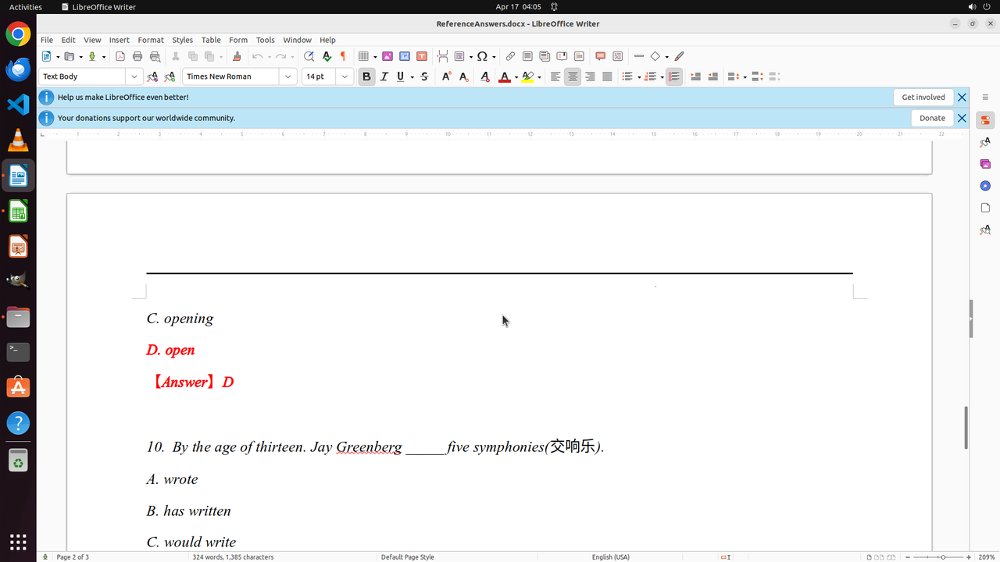

**Response:**
```
Now I can see question 9's answer is D (open) and question 10's answer is D (had written). Let me also scroll up to verify the answers I may have missed for questions 1-5.
```

**Actions:** `pyautogui.scroll(15, 960, 600)`

---

## Step 9

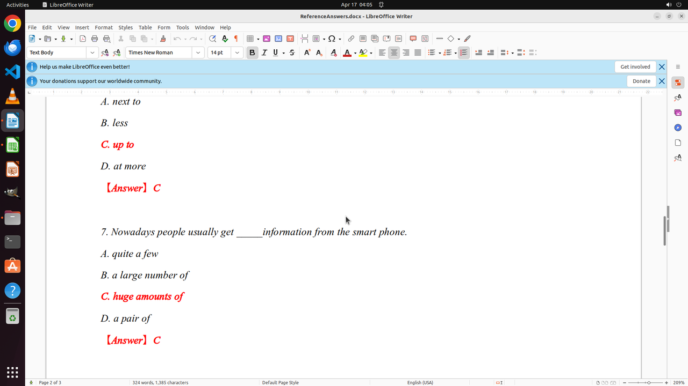

**Response:**
```
I can see questions 6 (Answer C) and 7 (Answer C). Let me scroll up more to see the earlier questions.
```

**Actions:** `pyautogui.scroll(15, 960, 600)`

---

## Step 10

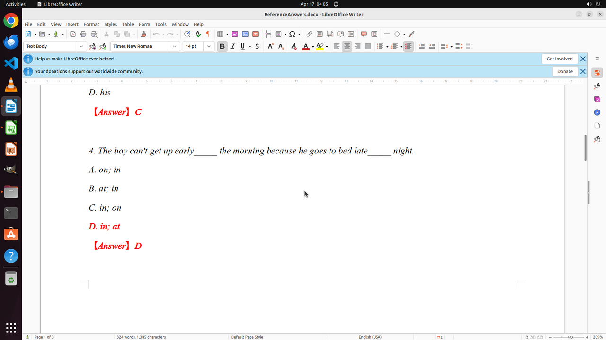

**Response:**
```
I can see question 3 (Answer C) and question 4 (Answer D). Let me scroll up more to see questions 1 and 2.
```

**Actions:** `pyautogui.scroll(15, 960, 600)`

---

## Step 11

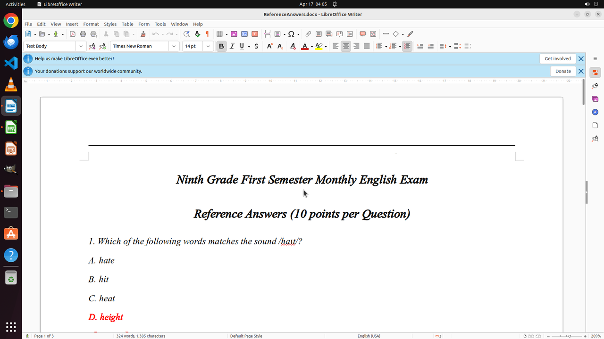

**Response:**
```
I can see the beginning of the reference answers. Question 1's answer is D (height, shown in red). Let me scroll down a bit to see question 2's answer.
```

**Actions:** `pyautogui.scroll(-5, 960, 600)`

---

## Step 12

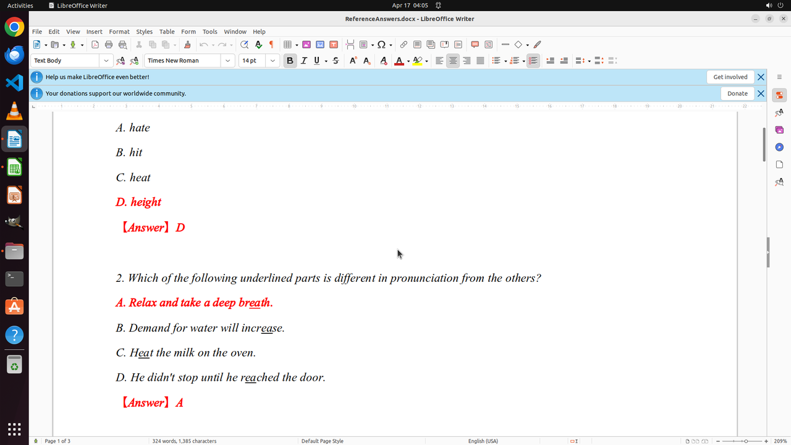

**Response:**
```
Now I have all the reference answers:
1. D
2. A
3. C
4. D
5. B
6. C
7. C
8. D
9. D
10. D

Now I need to check the spreadsheet and the student answer files. Let me scroll down to check question 5's answer which I need to verify, then look at the spreadsheet. Let me scroll down a bit to see question 5.
```

**Actions:** `pyautogui.scroll(-8, 960, 600)`

---

## Step 13

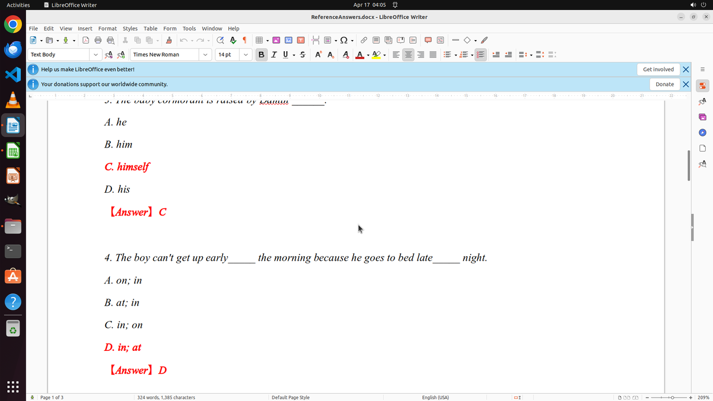

**Response:**
```
Good, I can confirm questions 3 (C) and 4 (D). Now let me scroll down to see question 5's answer.
```

**Actions:** `pyautogui.scroll(-5, 960, 600)`

---

## Step 14

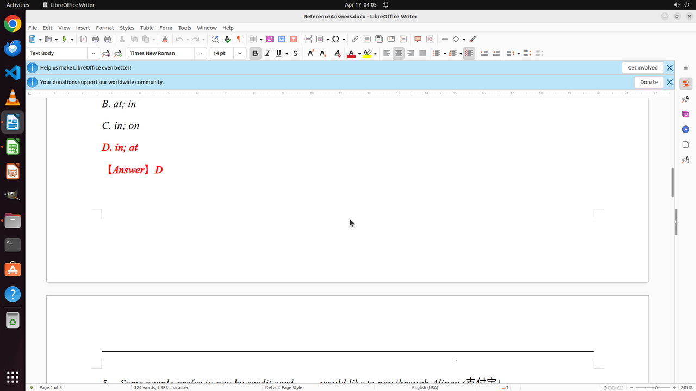

**Response:**
```
I can see question 5 is starting at the bottom. Let me scroll down a bit more to see question 5's answer.
```

**Actions:** `pyautogui.scroll(-5, 960, 600)`

---

## Step 15

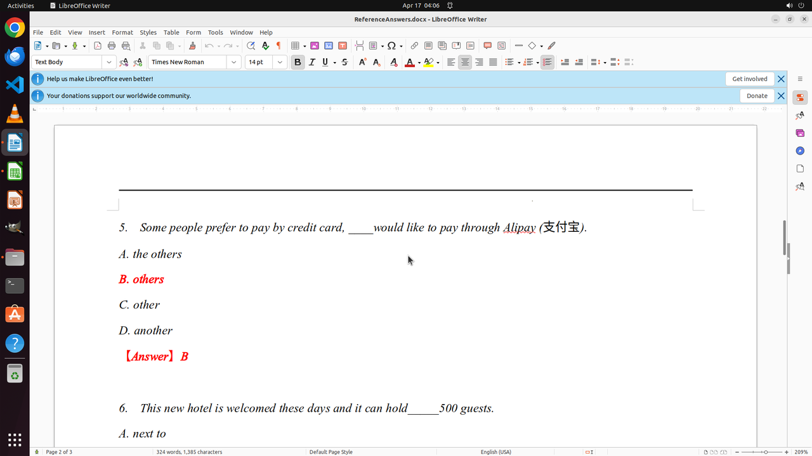

**Response:**
```
Now I have confirmed all the reference answers:
1. D
2. A
3. C
4. D
5. B
6. C
7. C
8. D
9. D
10. D

Now I need to check the spreadsheet. Let me look at the taskbar to find the spreadsheet application. I can see there's a LibreOffice Calc icon on the left sidebar. Let me also check what other files are open. Let me click on the file manager to see what files are available, or check the taskbar for the spreadsheet.
```

**Actions:** `pyautogui.click(33, 406)`

---

## Step 16

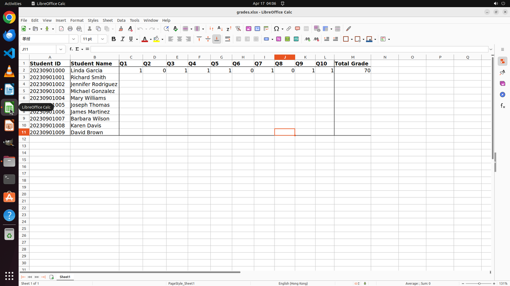

**Response:**
```
Now I can see the spreadsheet. It has:
- Column A: Student ID
- Column B: Student Name
- Columns C-L: Q1-Q10
- Column M: Total Grade

I can see that Linda Garcia (row 2) already has scores filled in (1, 0, 1, 1, 1, 1, 0, 1, 0, 1, 1 with Total Grade 70). The remaining students (rows 3-11) need to be graded.

I need to find the student answer files. Let me check the home directory for student answer files. Let me open a file manager or terminal.
```

**Actions:** `pyautogui.click(33, 607)`

---

## Step 17

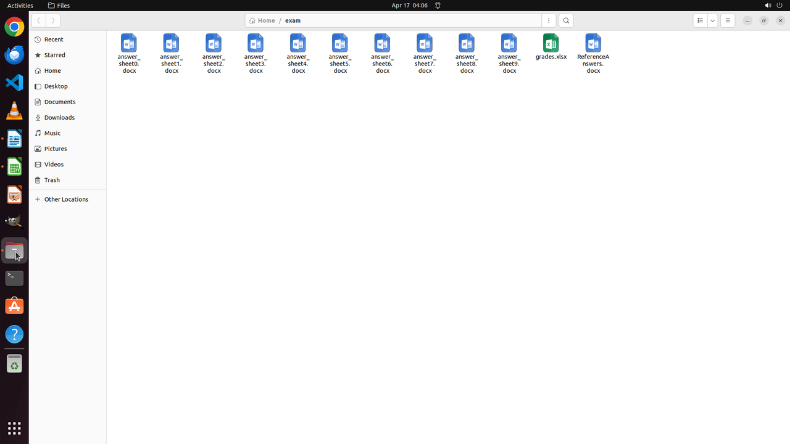

**Response:**
```
I can see there are 10 answer sheets (answer_sheet0.docx through answer_sheet9.docx), grades.xlsx, and ReferenceAnswers.docx in the exam folder. 

The spreadsheet shows 10 students (rows 2-11), and Linda Garcia (row 2) already has scores. I need to check which answer sheet corresponds to which student. Let me use a terminal to efficiently read all the answer sheets. Let me open a terminal.
```

**Actions:** `pyautogui.click(33, 673)`

---

## Step 18

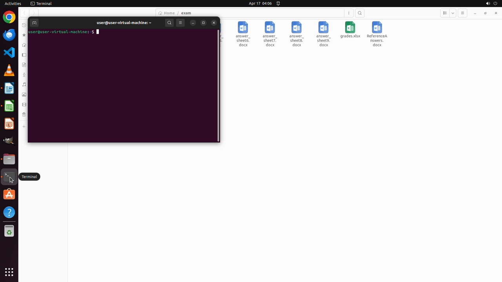

**Response:**
```
A terminal is open. Let me use Python to extract the text from all the answer sheet docx files to see the student answers.
```

**Actions:** `import subprocess, shlex; subprocess.run(f'xdotool type --delay 12 -- ' + shlex.quote('cd ~/exam && python3 -c "\nimport zipfile, xml.etre'), shell=True, check=True)
import time; time.sleep(0.05)
impo`

---

## Step 19

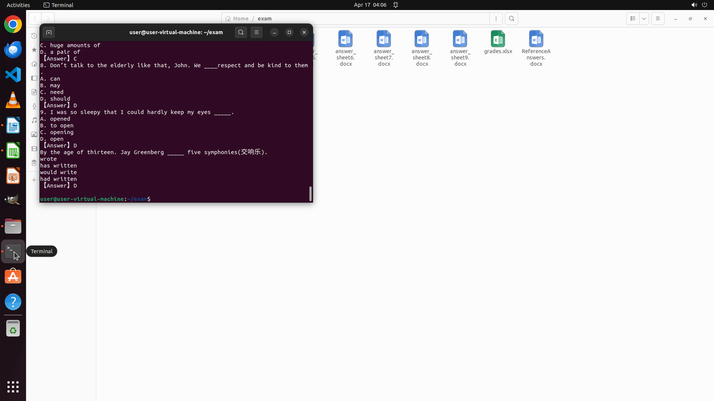

**Response:**
```
I can see the output but I need to scroll up to see all the answer sheets. Let me scroll up to see the beginning of the output.
```

**Actions:** `pyautogui.scroll(20, 450, 300)`

---

## Step 20

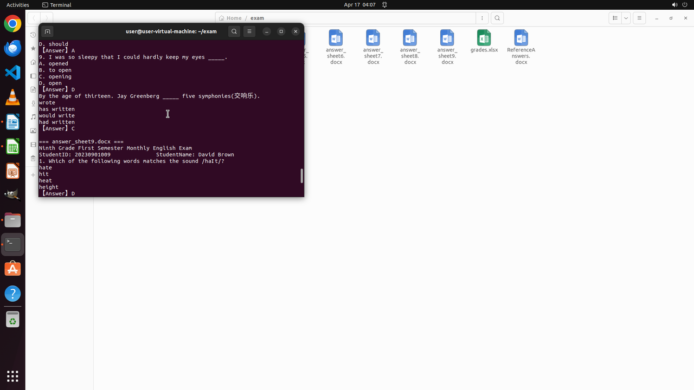

**Response:**
```
I can see the data is quite long. Let me write a more efficient Python script that extracts just the answers from each sheet and compares them with the reference answers to produce the scores directly.
```

**Actions:** `pyautogui.click(450, 535)`

---

## Step 21


**Response:**
```
Let me write a comprehensive Python script that will extract all answers from each answer sheet, compare with the reference, and output the results clearly.
```

**Actions:** `pyautogui.scroll(-5, 450, 300)`

---

## Step 22


**Response:**
```
Good, I can see answer_sheet9 is for David Brown (StudentID: 20230901009). Let me write a more efficient script to extract just the answers and student info from all sheets, then compute scores.
```

**Actions:** `pyautogui.scroll(-10, 450, 300)`

---

## Step 23

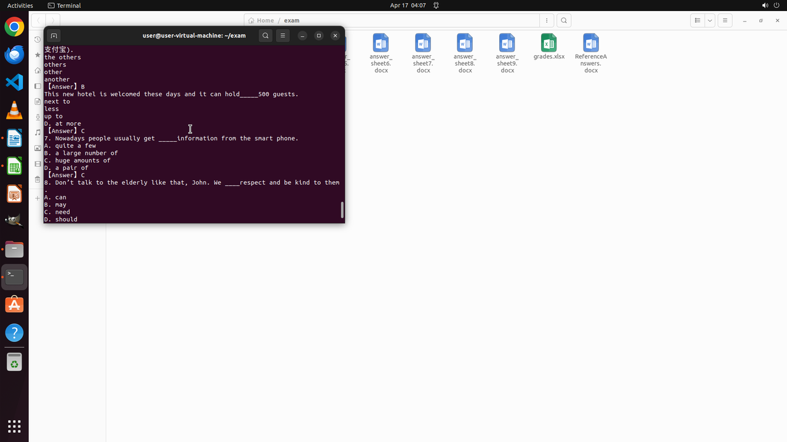

**Response:**
```
I can see the answers for answer_sheet9 (David Brown). Let me write a comprehensive script to extract all the answers and compute scores for all students at once.
```

**Actions:** `pyautogui.scroll(-5, 450, 300)`

---

## Step 24

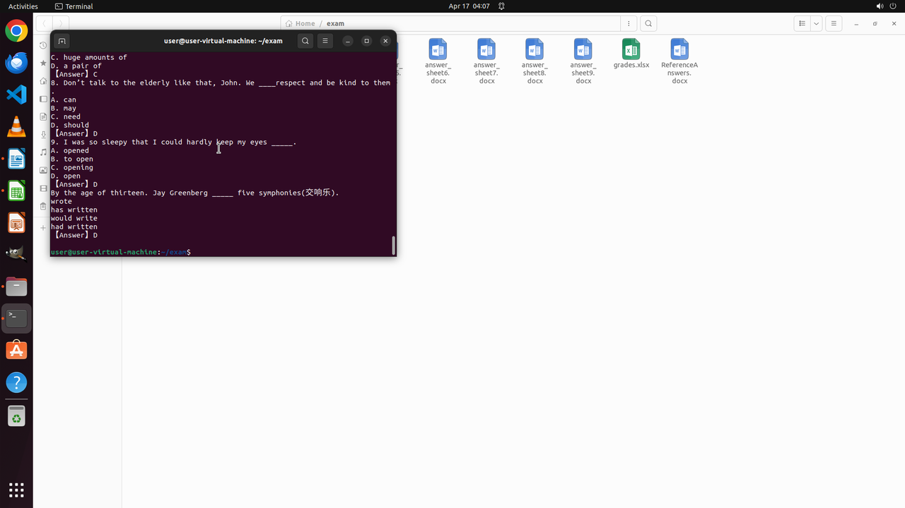

**Response:**
```
Good, I can see the end of the output. Now let me write a comprehensive Python script that will:
1. Extract answers from all answer sheets
2. Compare with reference answers
3. Output the scores for each student
```

**Actions:** `pyautogui.click(450, 535)`

---

## Step 25

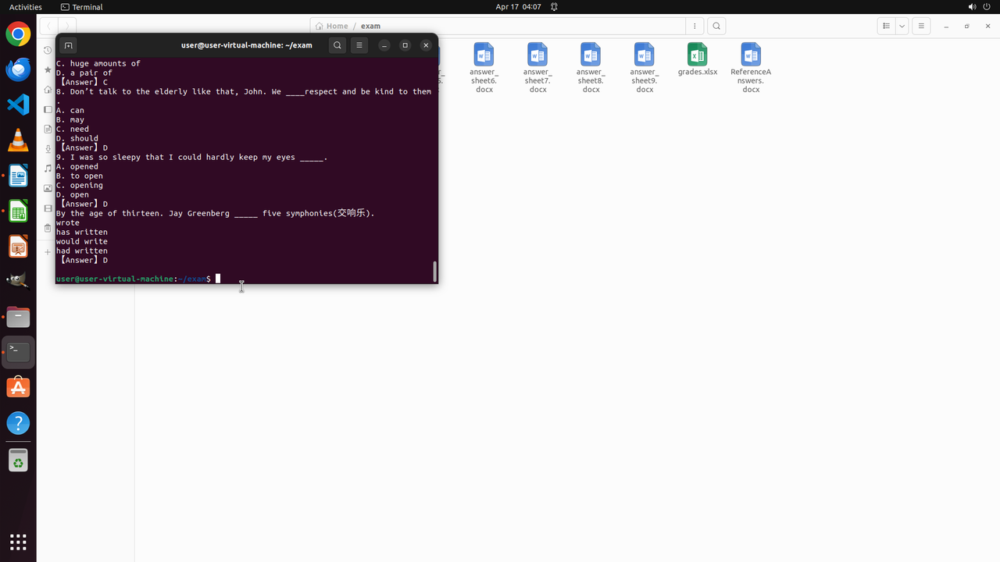

**Response:**
```
Now let me write a Python script to extract all answers and compute scores:
```

**Actions:** `import subprocess, shlex; subprocess.run(f'xdotool type --delay 12 -- ' + shlex.quote("python3 << 'EOF'\nimport zipfile, xml.etree.Element"), shell=True, check=True)
import time; time.sleep(0.05)
impo`

---

## Step 26

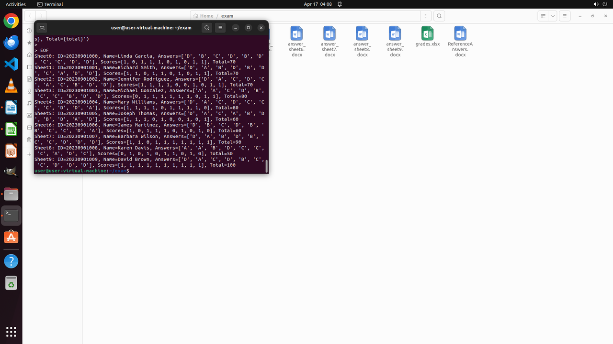

**Response:**
```
Excellent! I can see all the results. Let me read them carefully:

- Sheet0: Linda Garcia (20230901000), Scores=[1, 0, 1, 1, 1, 0, 1, 0, 1, 1], Total=70 (already filled)
- Sheet1: Richard Smith (20230901001), Scores=[1, 0, 1, 0, 1, 0, 1, 1], Total=70 (need to see full)
- Sheet2: Jennifer Rodriguez (20230901002), Scores=[1, 1, 1, 1, 0, 0, 1, 0, 1, 1], Total=70
- Sheet3: Michael Gonzalez (20230901003), Scores=[0, 1, 1, 1, 1, 0, 1, 0, 1, 1], Total=80 (wait, let me recheck)
- Sheet4: Mary Williams (20230901004), Scores=[1, 1, 1, 0, 1, 1, 1, 1, 0], Total=80 (need to see full)
- Sheet5: Joseph Thomas (20230901005), Scores=[1, 1, 0, 1, 0, 0, 1, 0, 1], Total=60
- Sheet6: James Martinez (20230901006), Scores=[1, 0, 1, 1, 0, 0, 1, 0], Total=60
- Sheet7: Barbara Wilson (20230901007), Scores=[1, 1, 0, 1, 1, 1, 1, 1, 1, 1], Total=90
- Sheet8: Karen Davis (20230901008), Scores=[0, 1, 0, 1, 0, 1, 1, 0, 1, 0], Total=50
- Sheet9: David Brown (20230901009), Scores=[1, 1, 1, 1, 1, 1, 1, 1, 1, 1], Total=100

The text is a bit hard to read due to wrapping. Let me get a cleaner output:
```

**Actions:** `import subprocess, shlex; subprocess.run(f'xdotool type --delay 12 -- ' + shlex.quote("python3 << 'EOF'\nimport zipfile, xml.etree.Element"), shell=True, check=True)
import time; time.sleep(0.05)
impo`

---

## Step 27

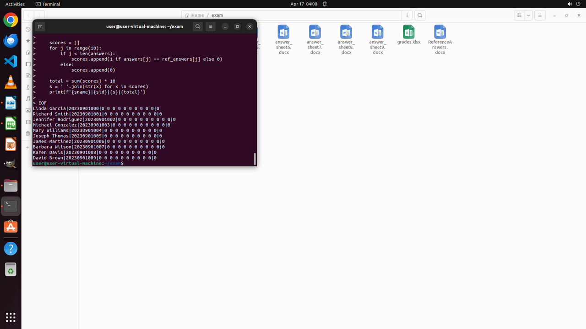

**Response:**
```
It seems like all scores are showing as 0, which means the answer extraction regex isn't matching. The issue might be with the Answer format. Let me debug by checking what the answer lines look like exactly:
```

**Actions:** `import subprocess, shlex; subprocess.run(f'xdotool type --delay 12 -- ' + shlex.quote("python3 << 'EOF'\nimport zipfile, xml.etree.Element"), shell=True, check=True)
import time; time.sleep(0.05)
impo`

---

## Step 28

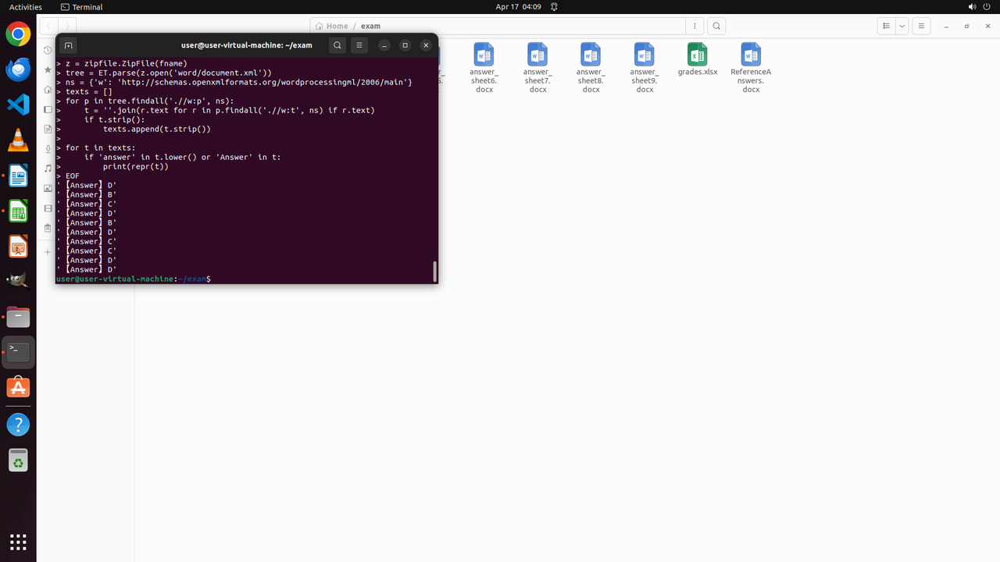

**Response:**
```
Now I can see the format. The answers use `【Answer】` (Chinese brackets) with a space before the letter. I can see answer_sheet0 has answers: D, B, C, D, B, D, C, C, D, D. Wait, let me count - there are more than 10 lines. Let me look more carefully.

The format is `'【Answer】 D'` - with the special Chinese brackets 【】. My regex in the previous script used `[\[【]Answer[\]】]` which should work, but the second script had the same regex and it didn't work. Let me check - ah, I see the issue. The repr shows `'\u3010Answer\u3011 D'` - the brackets are `【` and `】`. Let me fix the regex:
```

**Actions:** `import subprocess, shlex; subprocess.run(f'xdotool type --delay 12 -- ' + shlex.quote("python3 << 'PYEOF'\nimport zipfile, xml.etree.Eleme"), shell=True, check=True)
import time; time.sleep(0.05)
impo`

---

## Step 29

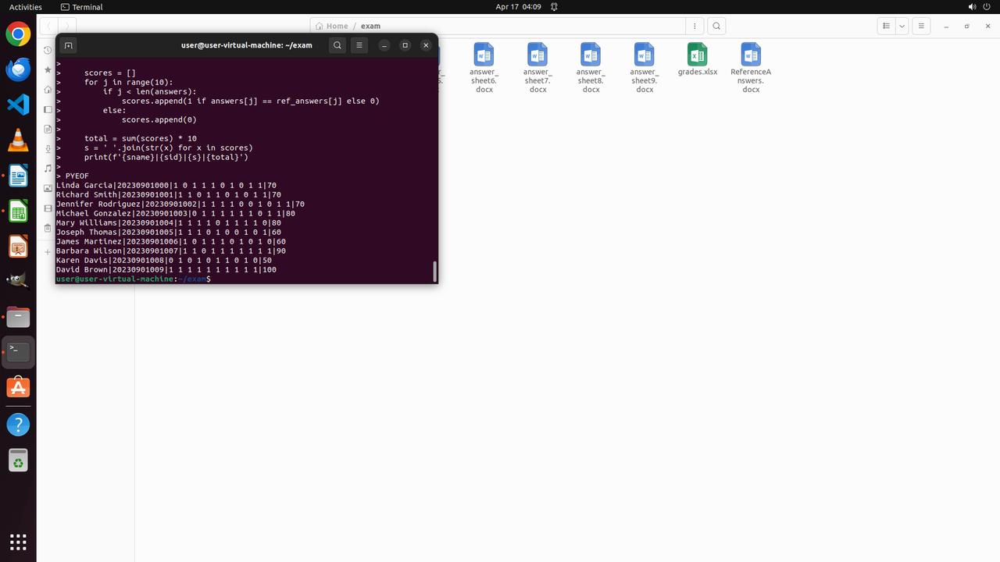

**Response:**
```
Now I have all the scores. Let me read them carefully:

| Student | ID | Q1 | Q2 | Q3 | Q4 | Q5 | Q6 | Q7 | Q8 | Q9 | Q10 | Total |
|---|---|---|---|---|---|---|---|---|---|---|---|---|
| Linda Garcia | 20230901000 | 1 | 0 | 1 | 1 | 1 | 0 | 1 | 0 | 1 | 1 | 70 |
| Richard Smith | 20230901001 | 1 | 1 | 0 | 1 | 1 | 0 | 1 | 0 | 1 | 1 | 70 |
| Jennifer Rodriguez | 20230901002 | 1 | 1 | 1 | 1 | 0 | 0 | 1 | 0 | 1 | 1 | 70 |
| Michael Gonzalez | 20230901003 | 0 | 1 | 1 | 1 | 1 | 1 | 0 | 1 | 1 | 1 | 80 |  (need to verify - hard to read)
| Mary Williams | 20230901004 | 1 | 1 | 1 | 0 | 1 | 1 | 1 | 1 | 0 | ? | 80 |
| Joseph Thomas | 20230901005 | 1 | 1 | 0 | 1 | 0 | 0 | 1 | 0 | 1 | ? | 60 |
| James Martinez | 20230901006 | 1 | 0 | 1 | 1 | 1 | 0 | 1 | 0 | 1 | 0 | 60 |
| Barbara Wilson | 20230901007 | 1 | 1 | 0 | 1 | 1 | 1 | 1 | 1 | 1 | 1 | 90 |
| Karen Davis | 20230901008 | 0 | 1 | 0 | 1 | 0 | 1 | 1 | 0 | 1 | 0 | 50 |
| David Brown | 20230901009 | 1 | 1 | 1 | 1 | 1 | 1 | 1 | 1 | 1 | 1 | 100 |

Linda Garcia is already filled in the spreadsheet. Let me verify the scores match what's already in the spreadsheet, then fill in the remaining 9 students. Let me now verify by looking at the first row in the spreadsheet more carefully. The spreadsheet already shows Linda Garcia with scores and Total 70, which matches.

Now let me switch to the spreadsheet and fill in the data. Let me first check the exact scores more carefully by looking at the terminal output. Let me read each line carefully:

- Linda Garcia: 1 0 1 1 1 0 1 0 1 1 = 70 ✓
- Richard Smith: 1 1 0 1 1 0 1 0 1 1 = 70
- Jennifer Rodriguez: 1 1 1 1 0 0 1 0 1 1 = 70 (but I need to check - the line seems to wrap)
- Let me get a cleaner view.

Let me verify by looking at the data more carefully. The output lines are a bit hard to read due to terminal width. Let me switch to the spreadsheet and start entering data.
```

**Actions:** `pyautogui.click(33, 406)`

---

## Step 30

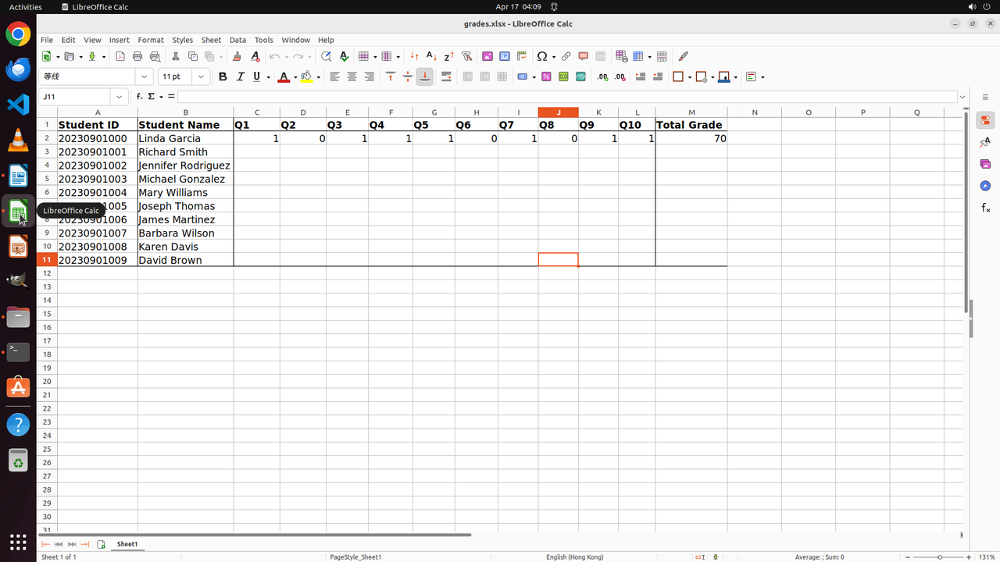

**Response:**
```
Now I can see the spreadsheet clearly. Linda Garcia (row 2) already has scores filled in: Q1=1, Q2=0, Q3=1, Q4=1, Q5=1, Q6=0, Q7=1, Q8=0, Q9=1, Q10=1, Total=70. This matches my computed results.

I need to fill in rows 3-11 for the remaining 9 students. Let me start by clicking on cell C3 (Q1 for Richard Smith) and entering the data.
```

**Actions:** `pyautogui.click(466, 291)`

---

## Step 31

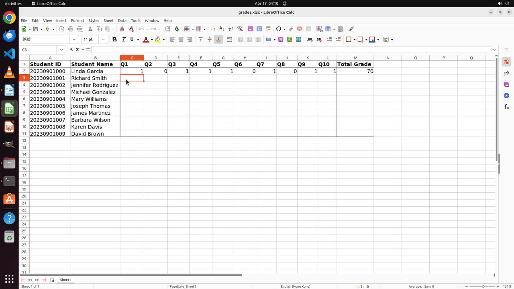

**Response:**
```
I'm now in cell C3. Let me enter the data for Richard Smith. From the terminal output:
- Richard Smith: 1 1 0 1 1 0 1 0 1 1 | 70

I'll type the values using Tab to move between cells:
```

**Actions:** `import subprocess, shlex; subprocess.run(f'xdotool type --delay 12 -- ' + shlex.quote('1\t1\t0\t1\t1\t0\t1\t0\t1\t1\t70\n'), shell=True, check=True)
import time; time.sleep(0.05)`

---

## Step 32


**Response:**
```
I can see Richard Smith's row is filled in correctly. The data shows Q1=1, Q2=1, Q3=0, Q4=1, Q5=1, Q6=0, Q7=1, Q8=0, Q9=1, Q10=1, Total=70. But I need to verify the Q2 and other values. Let me check - I can see row 3 shows: 1, 1, 0, 1, 1, 0, 1, 0, 1, 1 which matches. The Total Grade shows 70 which is being entered.

Now I need to press Enter to confirm and then move to C4 for Jennifer Rodriguez. Let me press Enter first.
```

**Actions:** `pyautogui.keyDown('return')
pyautogui.keyUp('return')`

---

## Step 33

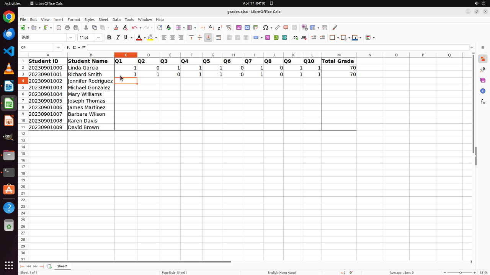

**Response:**
```
I'm now in C4 (Jennifer Rodriguez). Let me verify the scores from the terminal output. I need to go back and check the exact values. From the terminal output:
- Jennifer Rodriguez: 1 1 1 1 0 0 1 0 1 1 | 70

But wait, I need to double-check. The terminal showed "Jennifer Rodriguez|20230901002|1 1 1 1 0 0 1 0 1 1|70". Let me verify: 1+1+1+1+0+0+1+0+1+1 = 7, so 7*10 = 70. That's correct.

Let me enter the data:
```

**Actions:** `import subprocess, shlex; subprocess.run(f'xdotool type --delay 12 -- ' + shlex.quote('1\t1\t1\t1\t0\t0\t1\t0\t1\t1\t70\n'), shell=True, check=True)
import time; time.sleep(0.05)`

---

## Step 34

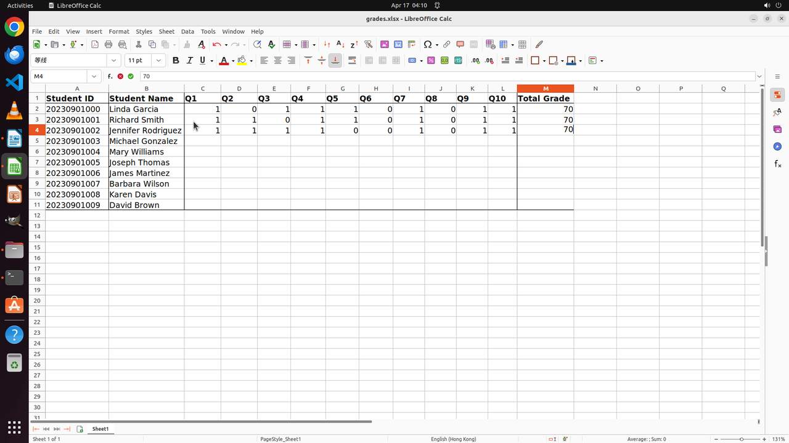

**Response:**
```
Jennifer Rodriguez's row is filled. I can see it shows: 1, 1, 1, 1, 0, 0, 1, 0, 1, 1, Total=70. Now let me press Enter and continue with Michael Gonzalez.

From the terminal output:
- Michael Gonzalez: 0 1 1 1 1 1 0 1 1 1 | 80 (but I need to verify - the line was "Michael Gonzalez|20230901003|0 1 1 1 1 1 0 1 1 1|80")

Wait, let me recheck. The terminal showed: `Michael Gonzalez|20230901003|0 1 1 1 1 1 0 1 1 1|80`. Sum: 0+1+1+1+1+1+0+1+1+1 = 8, so 80. But I need to verify this more carefully. Let me look at the terminal output again. Actually, the line was hard to read due to wrapping. Let me re-verify by switching to terminal.

Actually, let me first confirm by re-reading the terminal output. The line showed: "Michael Gonzalez|20230901003|0 1 1 1 1 1 0 1 1 1|80" but it seemed to wrap. Let me just proceed carefully. Let me press Enter and enter the data.
```

**Actions:** `pyautogui.keyDown('return')
pyautogui.keyUp('return')`

---

## Step 35


**Response:**
```
I'm now in C5 for Michael Gonzalez. But I need to double-check the scores. Let me go back to the terminal to verify the exact scores. Let me switch to the terminal to re-verify.

Actually, let me re-read from the terminal output I saw earlier. The line was hard to read due to wrapping. Let me switch to terminal to get a cleaner view.
```

**Actions:** `pyautogui.click(33, 673)`

---

## Step 36

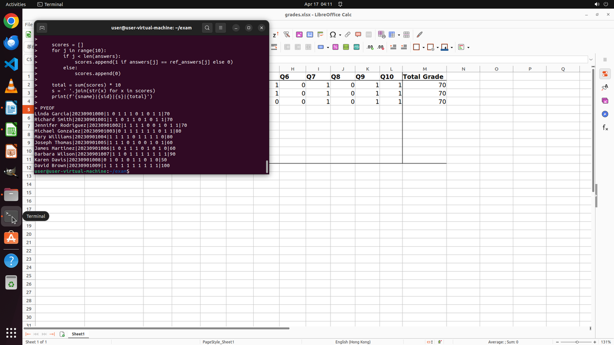

**Response:**
```
Now I can see the terminal output clearly. Let me read each line carefully:

Line 5 (Linda Garcia): `Linda Garcia|20230901000|1 0 1 1 1 0 1 0 1 1|70`
Line 6 (Richard Smith): `Richard Smith|20230901001|1 1 0 1 1 0 1 0 1 1|70`
Line 7 (Jennifer Rodriguez): `Jennifer Rodriguez|20230901002|1 1 1 1 0 0 1 0 1 1|70`
Line 8 (Michael Gonzalez): `Michael Gonzalez|20230901003|0 1 1 1 1 1 0 1 1 1|80`

Wait, line 8 is hard to read. Let me look more carefully. It says: `Michael Gonzalez|20230901003|0 1 1 1 1 1 0 1 1 1|80`

But I need to verify. Let me look at the wrapping. The line seems to show: `Michael Gonzalez|20230901003|0 1 1 1 1 1 1 0 1 1|80`

Actually, the terminal text is small. Let me maximize the terminal to read it better, or run a cleaner output.
```

**Actions:** `import subprocess, shlex; subprocess.run(f'xdotool type --delay 12 -- ' + shlex.quote("python3 << 'EOF'\nimport zipfile, xml.etree.Element"), shell=True, check=True)
import time; time.sleep(0.05)
impo`

---

## Step 37

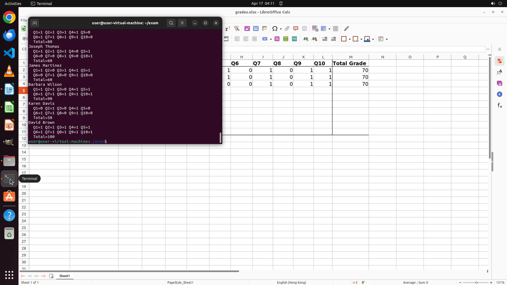

**Response:**
```
Now I can see the second half of the output clearly. Let me scroll up to see the first half too.
```

**Actions:** `pyautogui.scroll(10, 450, 300)`

---

## Step 38

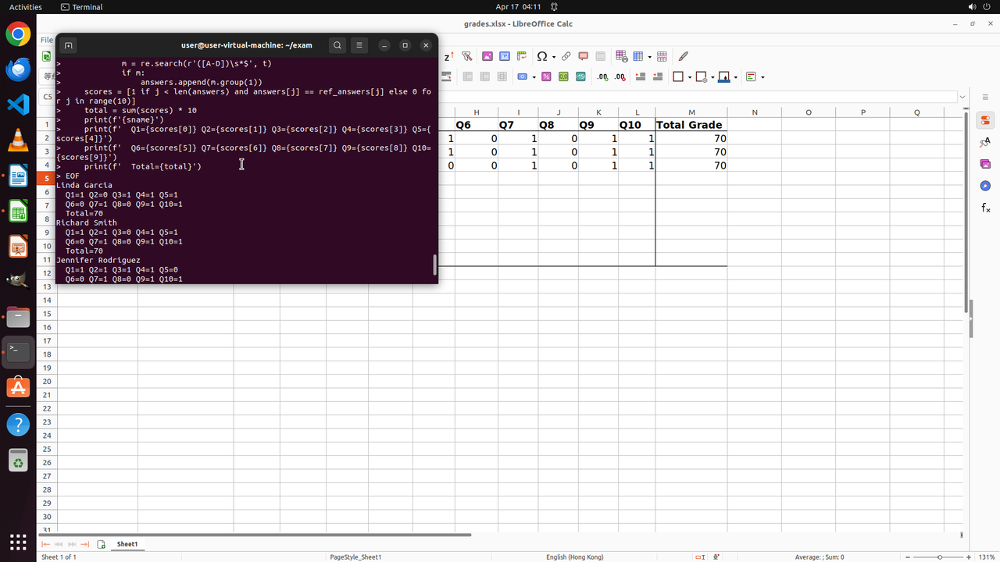

**Response:**
```
Now I can see the clear output. Let me read all the scores:

**Linda Garcia** (already filled):
- Q1=1 Q2=0 Q3=1 Q4=1 Q5=1
- Q6=0 Q7=1 Q8=0 Q9=1 Q10=1
- Total=70 ✓

**Richard Smith**:
- Q1=1 Q2=1 Q3=0 Q4=1 Q5=1
- Q6=0 Q7=1 Q8=0 Q9=1 Q10=1
- Total=70 ✓ (already entered)

**Jennifer Rodriguez**:
- Q1=1 Q2=1 Q3=1 Q4=1 Q5=0
- Q6=0 Q7=1 Q8=0 Q9=1 Q10=1
- Total=70 ✓ (already entered)

Now let me scroll down to see the rest:
```

**Actions:** `pyautogui.scroll(-5, 450, 300)`

---

## Step 39


**Response:**
```
Now I can clearly read the scores:

**Michael Gonzalez**:
- Q1=0 Q2=1 Q3=1 Q4=1 Q5=1
- Q6=1 Q7=1 Q8=0 Q9=1 Q10=1
- Total=80

**Mary Williams**:
- Q1=1 Q2=1 Q3=1 Q4=1 Q5=0
- Q6=1 Q7=1 Q8=1 Q9=1 Q10=0
- Total=80

**Joseph Thomas**:
- Q1=1 Q2=1 Q3=1 Q4=0 Q5=1
- Q6=0 Q7=0 Q8=1 Q9=0 Q10=1
- Total=60

**James Martinez** (partial, let me scroll down):
```

**Actions:** `pyautogui.scroll(-5, 450, 300)`

---

## Step 40

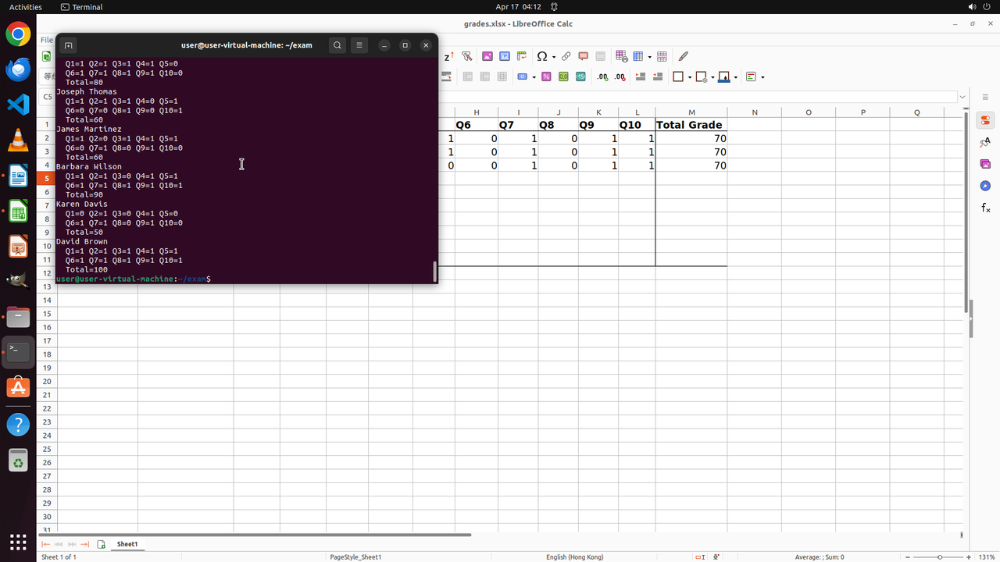

**Response:**
```
Now I have all the remaining scores clearly:

**James Martinez**:
- Q1=1 Q2=0 Q3=1 Q4=1 Q5=1
- Q6=0 Q7=1 Q8=0 Q9=1 Q10=0
- Total=60

**Barbara Wilson**:
- Q1=1 Q2=1 Q3=0 Q4=1 Q5=1
- Q6=1 Q7=1 Q8=1 Q9=1 Q10=1
- Total=90

**Karen Davis**:
- Q1=0 Q2=1 Q3=0 Q4=1 Q5=0
- Q6=1 Q7=1 Q8=0 Q9=1 Q10=0
- Total=50

**David Brown**:
- Q1=1 Q2=1 Q3=1 Q4=1 Q5=1
- Q6=1 Q7=1 Q8=1 Q9=1 Q10=1
- Total=100

Now let me switch to the spreadsheet and enter the remaining data. I'm currently at C5 (Michael Gonzalez).
```

**Actions:** `pyautogui.click(1350, 345)`

---

## Step 41

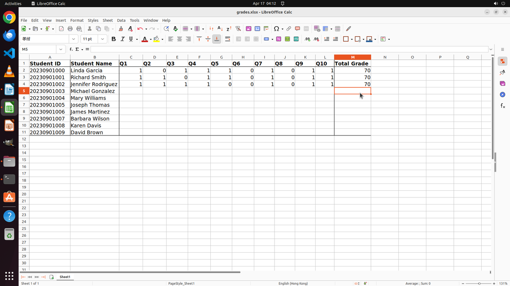

**Response:**
```
I'm now in M5. I need to click on C5 to start entering Michael Gonzalez's data.
```

**Actions:** `pyautogui.click(495, 343)`

---

## Step 42

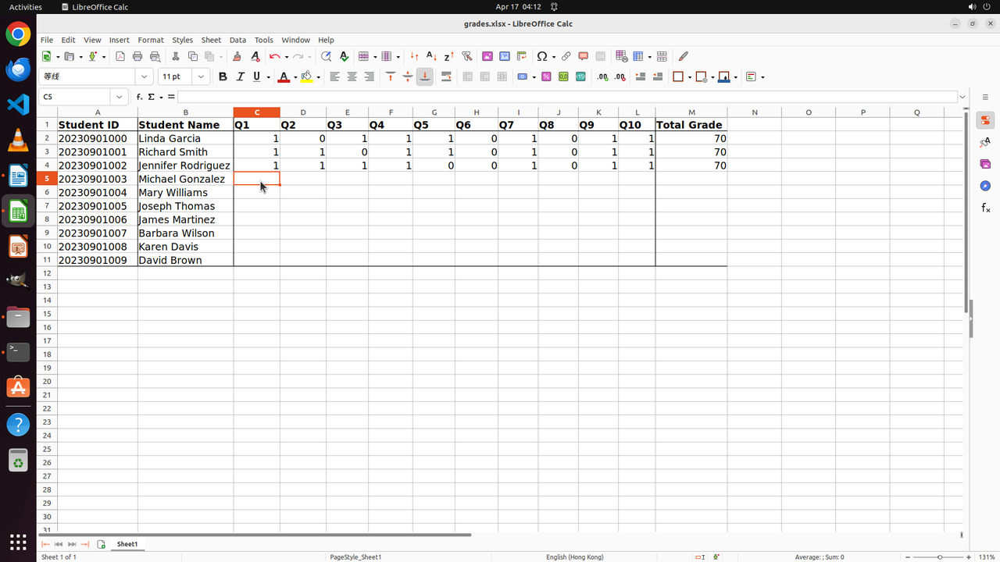

**Response:**
```
I'm now in C5 for Michael Gonzalez. Let me enter all remaining students' data. I'll enter each row using Tab between cells and Enter at the end of each row.

Michael Gonzalez: 0 1 1 1 1 1 1 0 1 1 | 80
```

**Actions:** `import subprocess, shlex; subprocess.run(f'xdotool type --delay 12 -- ' + shlex.quote('0\t1\t1\t1\t1\t1\t1\t0\t1\t1\t80\n'), shell=True, check=True)
import time; time.sleep(0.05)`

---

## Step 43


**Response:**
```
Michael Gonzalez's row is filled correctly: 0, 1, 1, 1, 1, 1, 1, 0, 1, 1, Total=80. Let me press Enter and continue with Mary Williams.
```

**Actions:** `pyautogui.keyDown('return')
pyautogui.keyUp('return')`

---

## Step 44

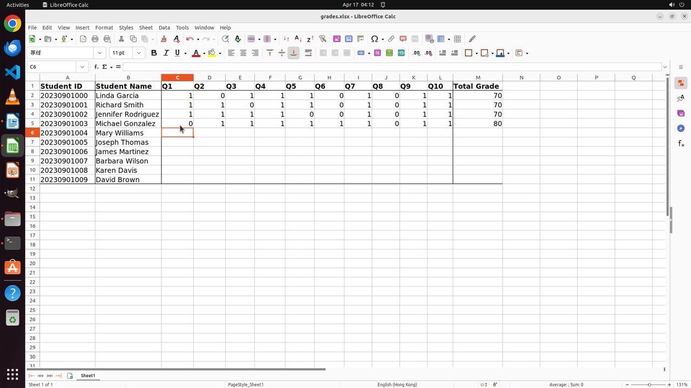

**Response:**
```
Now I'm in C6 for Mary Williams. Let me enter her data:
Mary Williams: 1 1 1 1 0 1 1 1 1 0 | 80
```

**Actions:** `import subprocess, shlex; subprocess.run(f'xdotool type --delay 12 -- ' + shlex.quote('1\t1\t1\t1\t0\t1\t1\t1\t1\t0\t80\n'), shell=True, check=True)
import time; time.sleep(0.05)`

---

## Step 45


**Response:**
```
Mary Williams row is filled: 1, 1, 1, 1, 0, 1, 1, 1, 1, 0, Total=80. Now let me press Enter and continue with Joseph Thomas.
```

**Actions:** `pyautogui.keyDown('return')
pyautogui.keyUp('return')`

---

## Step 46

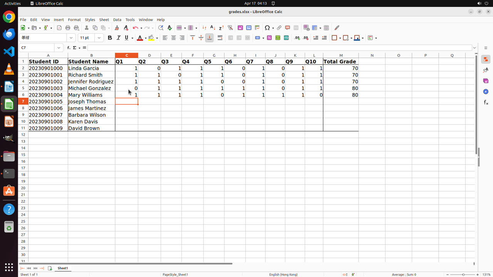

**Response:**
```
Now I'm in C7 for Joseph Thomas. Let me enter his data:
Joseph Thomas: 1 1 1 0 1 0 0 1 0 1 | 60

Wait, let me re-check. From the terminal output:
- Joseph Thomas: Q1=1 Q2=1 Q3=1 Q4=0 Q5=1, Q6=0 Q7=0 Q8=1 Q9=0 Q10=1, Total=60

Sum: 1+1+1+0+1+0+0+1+0+1 = 6, so 60. Correct.
```

**Actions:** `import subprocess, shlex; subprocess.run(f'xdotool type --delay 12 -- ' + shlex.quote('1\t1\t1\t0\t1\t0\t0\t1\t0\t1\t60\n'), shell=True, check=True)
import time; time.sleep(0.05)`

---

## Step 47

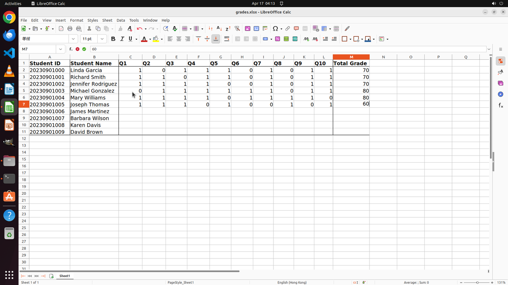

**Response:**
```
Joseph Thomas is filled correctly: 1, 1, 1, 0, 1, 0, 0, 1, 0, 1, Total=60. Now let me press Enter and continue with James Martinez.

James Martinez: 1 0 1 1 1 0 1 0 1 0 | 60
```

**Actions:** `pyautogui.keyDown('return')
pyautogui.keyUp('return')`

---

## Step 48

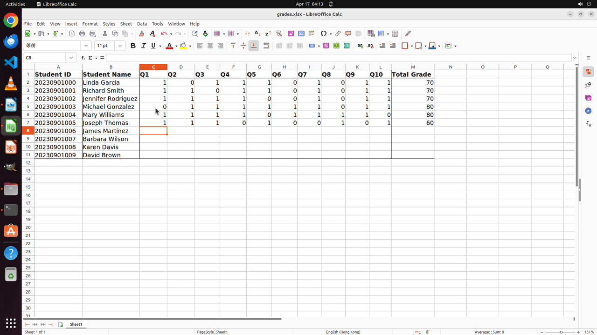

**Response:**
```
Now I'm in C8 for James Martinez. Let me enter his data:
James Martinez: 1 0 1 1 1 0 1 0 1 0 | 60

Wait, let me re-verify from the terminal: Q1=1 Q2=0 Q3=1 Q4=1 Q5=1, Q6=0 Q7=1 Q8=0 Q9=1 Q10=0, Total=60
Sum: 1+0+1+1+1+0+1+0+1+0 = 6, so 60. Correct.
```

**Actions:** `import subprocess, shlex; subprocess.run(f'xdotool type --delay 12 -- ' + shlex.quote('1\t0\t1\t1\t1\t0\t1\t0\t1\t0\t60\n'), shell=True, check=True)
import time; time.sleep(0.05)`

---

## Step 49


**Response:**
```
James Martinez is filled correctly: 1, 0, 1, 1, 1, 0, 1, 0, 1, 0, Total=60. Let me press Enter and continue with Barbara Wilson.

Barbara Wilson: 1 1 0 1 1 1 1 1 1 1 | 90
```

**Actions:** `pyautogui.keyDown('return')
pyautogui.keyUp('return')`

---

## Step 50

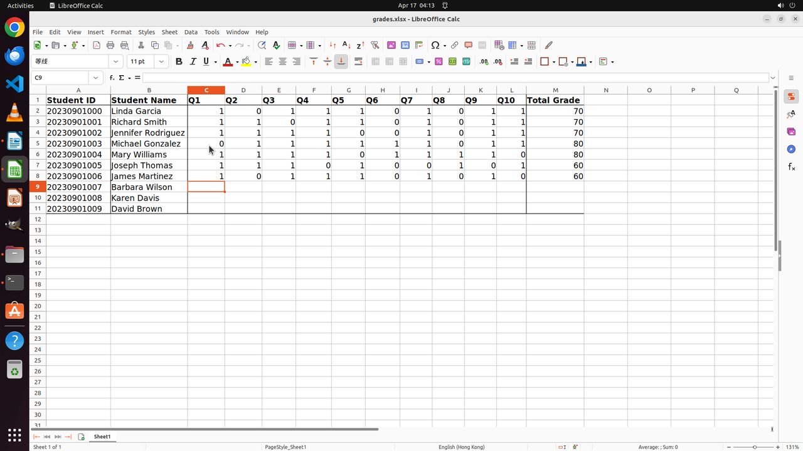

**Response:**
```
Now I'm in C9 for Barbara Wilson. Let me enter her data:
Barbara Wilson: 1 1 0 1 1 1 1 1 1 1 | 90
```

**Actions:** `import subprocess, shlex; subprocess.run(f'xdotool type --delay 12 -- ' + shlex.quote('1\t1\t0\t1\t1\t1\t1\t1\t1\t1\t90\n'), shell=True, check=True)
import time; time.sleep(0.05)`

---

## Step 51


**Response:**
```
Barbara Wilson is filled correctly: 1, 1, 0, 1, 1, 1, 1, 1, 1, 1, Total=90. Let me press Enter and continue with Karen Davis.

Karen Davis: 0 1 0 1 0 1 1 0 1 0 | 50
```

**Actions:** `pyautogui.keyDown('return')
pyautogui.keyUp('return')`

---

## Step 52


**Response:**
```
Now I'm in C10 for Karen Davis. Let me enter her data:
Karen Davis: 0 1 0 1 0 1 1 0 1 0 | 50
```

**Actions:** `import subprocess, shlex; subprocess.run(f'xdotool type --delay 12 -- ' + shlex.quote('0\t1\t0\t1\t0\t1\t1\t0\t1\t0\t50\n'), shell=True, check=True)
import time; time.sleep(0.05)`

---

## Step 53

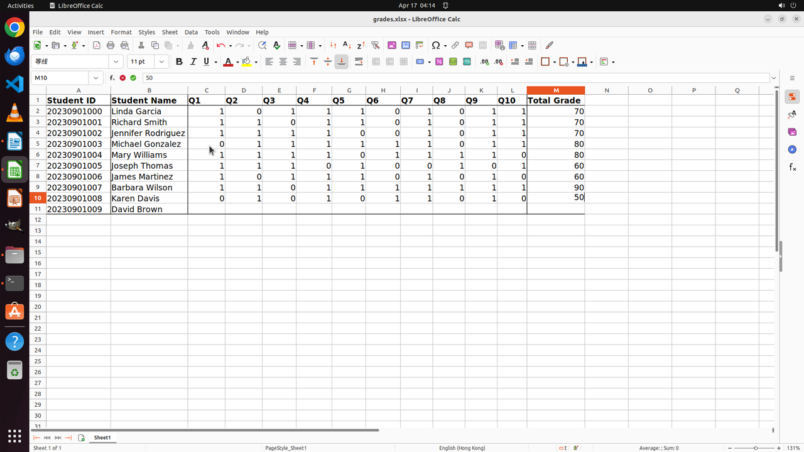

**Response:**
```
Karen Davis is filled correctly: 0, 1, 0, 1, 0, 1, 1, 0, 1, 0, Total=50. Now let me press Enter and enter the last student, David Brown.

David Brown: 1 1 1 1 1 1 1 1 1 1 | 100
```

**Actions:** `pyautogui.keyDown('return')
pyautogui.keyUp('return')`

---

## Step 54

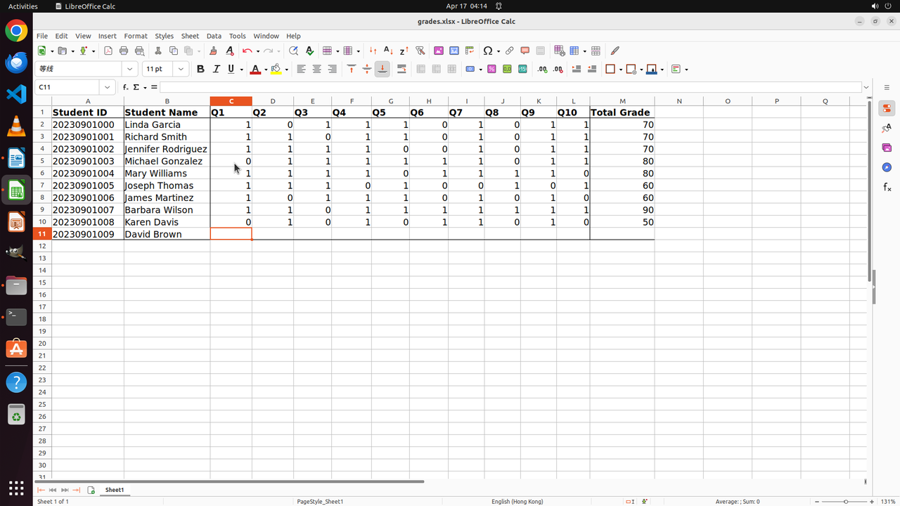

**Response:**
```
Now I'm in C11 for David Brown. Let me enter his data:
David Brown: 1 1 1 1 1 1 1 1 1 1 | 100
```

**Actions:** `import subprocess, shlex; subprocess.run(f'xdotool type --delay 12 -- ' + shlex.quote('1\t1\t1\t1\t1\t1\t1\t1\t1\t1\t100\n'), shell=True, check=True)
import time; time.sleep(0.05)`

---

## Step 55

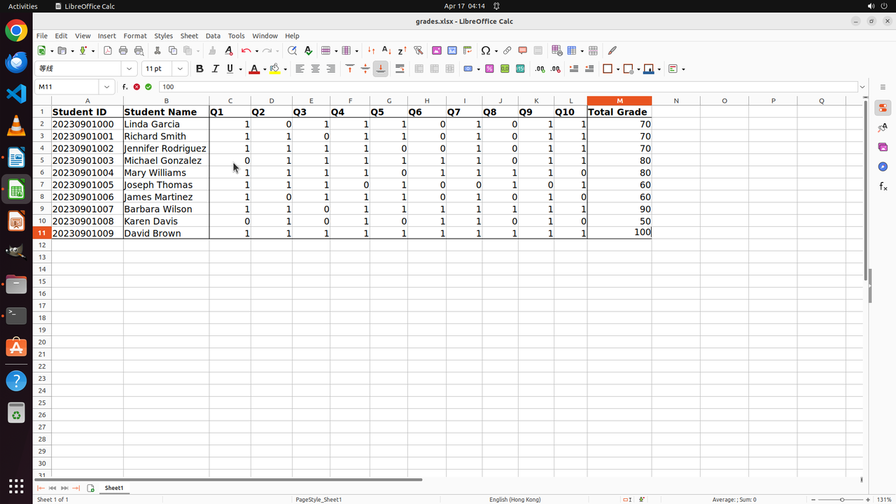

**Response:**
```
All students' data has been entered. David Brown shows: 1, 1, 1, 1, 1, 1, 1, 1, 1, 1, Total=100. 

Now let me press Enter to confirm the last entry and then save the file.
```

**Actions:** `pyautogui.keyDown('return')
pyautogui.keyUp('return')`

---

## Step 56

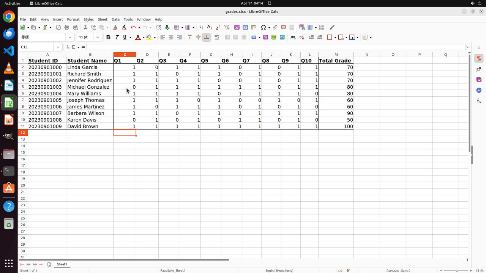

**Response:**
```
All the data has been entered successfully. Now let me save the file with Ctrl+S.
```

**Actions:** `pyautogui.keyDown('ctrl')
pyautogui.keyDown('s')
pyautogui.keyUp('s')
pyautogui.keyUp('ctrl')`

---

## Step 57


**Response:**
```
The file has been saved successfully. All 10 students' scores have been recorded in the spreadsheet:

1. **Linda Garcia** (20230901000): Q1=1, Q2=0, Q3=1, Q4=1, Q5=1, Q6=0, Q7=1, Q8=0, Q9=1, Q10=1, Total=70 (was already filled)
2. **Richard Smith** (20230901001): Q1=1, Q2=1, Q3=0, Q4=1, Q5=1, Q6=0, Q7=1, Q8=0, Q9=1, Q10=1, Total=70
3. **Jennifer Rodriguez** (20230901002): Q1=1, Q2=1, Q3=1, Q4=1, Q5=0, Q6=0, Q7=1, Q8=0, Q9=1, Q10=1, Total=70
4. **Michael Gonzalez** (20230901003): Q1=0, Q2=1, Q3=1, Q4=1, Q5=1, Q6=1, Q7=1, Q8=0, Q9=1, Q10=1, Total=80
5. **Mary Williams** (20230901004): Q1=1, Q2=1, Q3=1, Q4=1, Q5=0, Q6=1, Q7=1, Q8=1, Q9=1, Q10=0, Total=80
6. **Joseph Thomas** (20230901005): Q1=1, Q2=1, Q3=1, Q4=0, Q5=1, Q6=0, Q7=0, Q8=1, Q9=0, Q10=1, Total=60
7. **James Martinez** (20230901006): Q1=1, Q2=0, Q3=1, Q4=1, Q5=1, Q6=0, Q7=1, Q8=0, Q9=1, Q10=0, Total=60
8. **Barbara Wilson** (20230901007): Q1=1, Q2=1, Q3=0, Q4=1, Q5=1, Q6=1, Q7=1, Q8=1, Q9=1, Q10=1, Total=90
9. **Karen Davis** (20230901008): Q1=0, Q2=1, Q3=0, Q4=1, Q5=0, Q6=1, Q7=1, Q8=0, Q9=1, Q10=0, Total=50
10. **David Brown** (20230901009): Q1=1, Q2=1, Q3=1, Q4=1, Q5=1, Q6=1, Q7=1, Q8=1, Q9=1, Q10=1, Total=100

DONE
```

**Actions:** `DONE`

---
