# Task aceb0368-56b8-4073-b70e-3dc9aee184e0

**Instruction:** I am grading students' English exam papers, but the test consists only of multiple-choice questions. It's too exhausting to check each question one by one and record the detailed scores. Can you help me compare the remaining students' answers with the answer key and record the detailed scoring in the opened spreadsheet?

**Score:** 1.0

**Wall clock:** 14m 26s

**Steps:** 63

**Cost:** $2.84

---

## Step 1

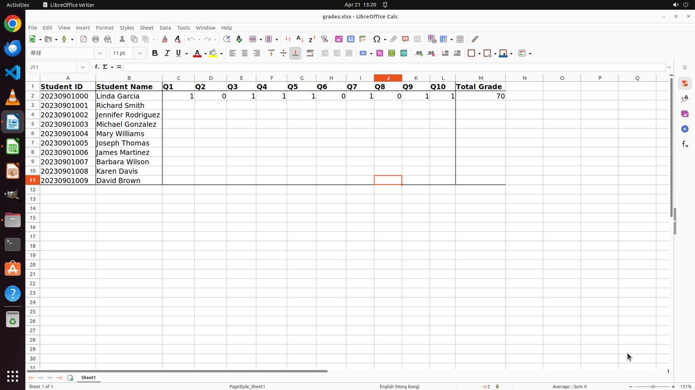

**Response:**
```
I need to understand the task. I see a spreadsheet with student names and IDs, columns for Q1-Q10 scores, and a Total Grade column. Linda Garcia (row 2) already has scores filled in, and the other students need to be graded. I also notice there's a LibreOffice Writer document open - this likely contains the answer key and student answers. Let me check it.
```

**Actions:** `pyautogui.click(195, 12)`

---

## Step 2

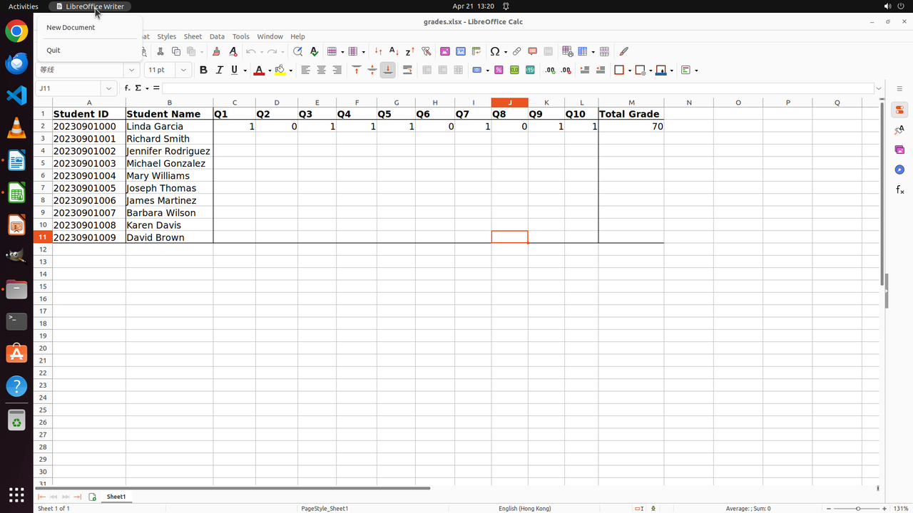

**Response:**
```
I see the LibreOffice Writer menu appeared but it seems like there's no document open. Let me check if there are any other files. Let me first look at the taskbar for any open Writer document, or check the home directory for relevant files.
```

**Actions:** `pyautogui.click(960, 600)`

---

## Step 3

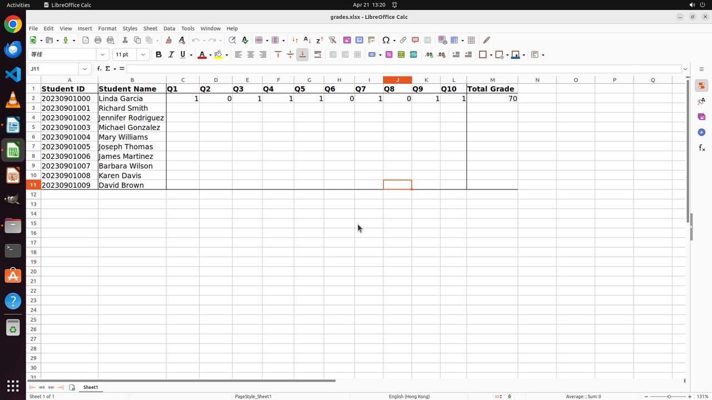

**Response:**
```
I need to find the answer key and student answers. Let me open a file manager or terminal to look for relevant files in the home directory.
```

**Actions:** `pyautogui.click(33, 607)`

---

## Step 4

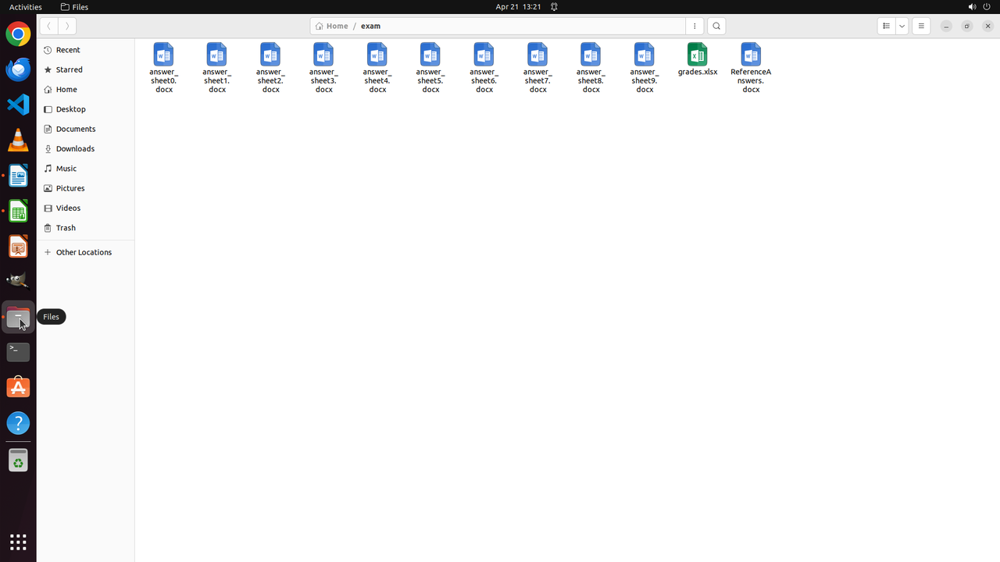

**Response:**
```
I can see the exam folder with answer sheets (answer_sheet0.docx through answer_sheet9.docx), the grades.xlsx file, and a ReferenceAnswers.docx file. Let me first open the ReferenceAnswers.docx to see the answer key.
```

**Actions:** `pyautogui.doubleClick(1440, 130)`

---

## Step 5

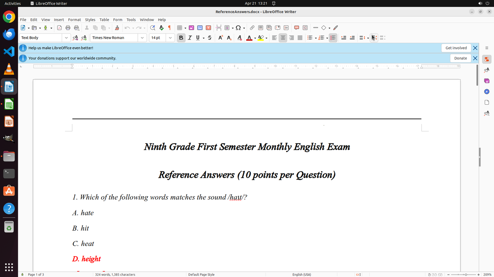

**Response:**
```
I can see the Reference Answers document. It shows "10 points per Question" and the first question's answer is D (height, shown in red). Let me scroll through the entire document to see all 10 answers.
```

**Actions:** `pyautogui.scroll(-10, 960, 600)`

---

## Step 6

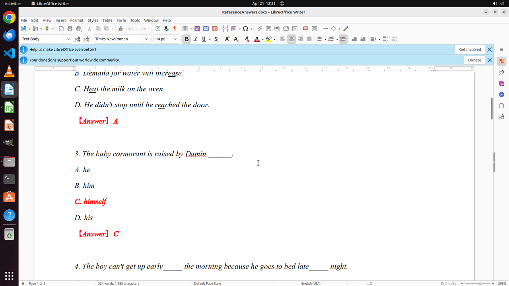

**Response:**
```
I can see Q2 answer is A and Q3 answer is C. Let me continue scrolling to see more answers.
```

**Actions:** `pyautogui.scroll(-10, 960, 600)`

---

## Step 7

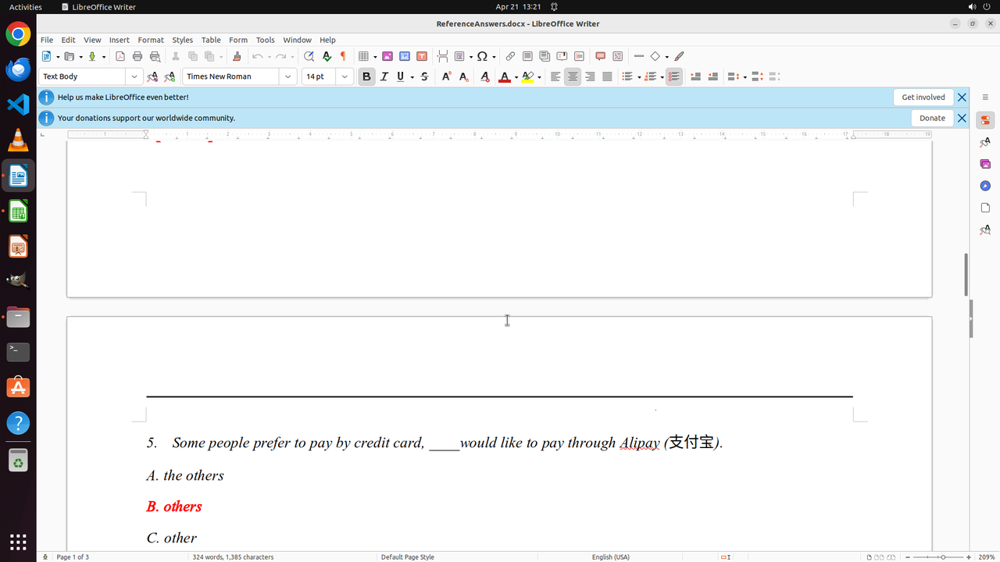

**Response:**
```
I can see Q5's answer is B (others). I need to scroll up a bit to see Q4's answer, then continue scrolling down for the rest. Let me scroll up slightly first to check Q4.
```

**Actions:** `pyautogui.scroll(5, 960, 600)`

---

## Step 8

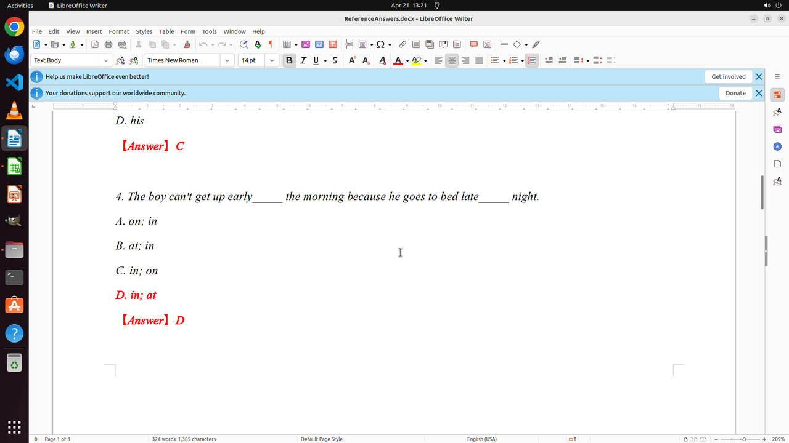

**Response:**
```
Q3 answer is C, Q4 answer is D. Let me continue scrolling down to see the remaining answers.
```

**Actions:** `pyautogui.scroll(-15, 960, 600)`

---

## Step 9

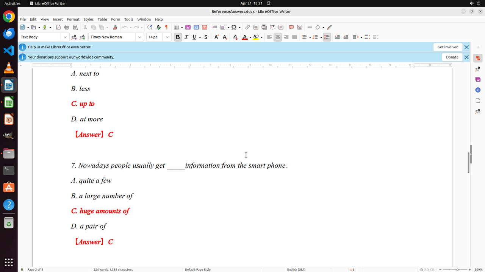

**Response:**
```
I can see Q6 answer is C and Q7 answer is C. Let me scroll up slightly to check Q5's answer confirmation, then continue scrolling down.
```

**Actions:** `pyautogui.scroll(-15, 960, 600)`

---

## Step 10

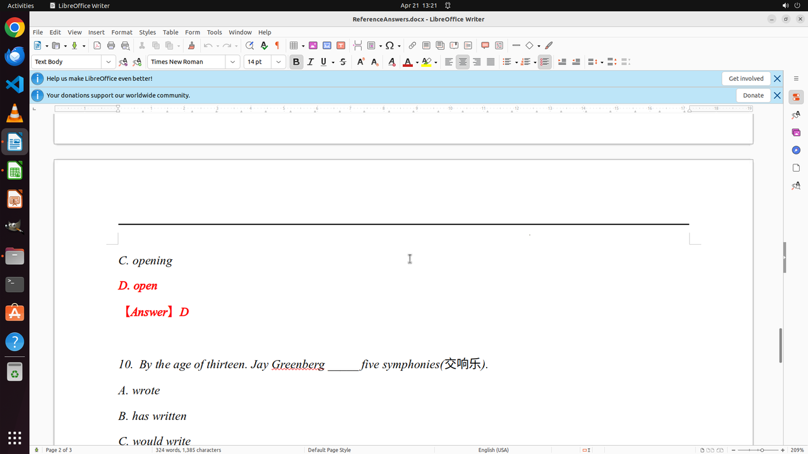

**Response:**
```
I can see Q9 answer is D (open) and Q10 is starting. Let me scroll up a bit to see Q8's answer too.
```

**Actions:** `pyautogui.scroll(8, 960, 600)`

---

## Step 11

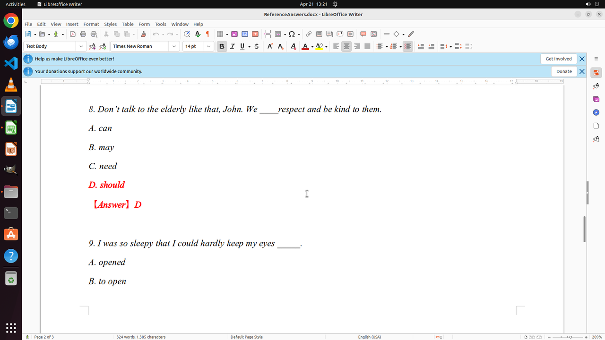

**Response:**
```
Q8 answer is D (should) and Q9 starts here. Now let me scroll down to see Q10's answer.
```

**Actions:** `pyautogui.scroll(-20, 960, 600)`

---

## Step 12

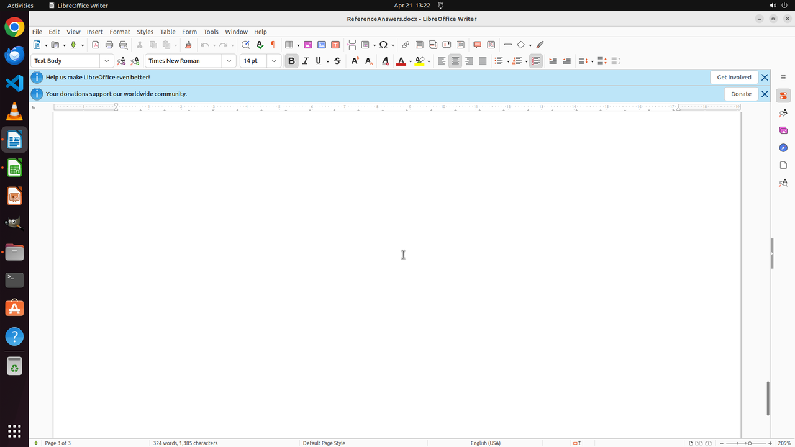

**Response:**
```
This is a blank page. Let me scroll up to find Q10's answer.
```

**Actions:** `pyautogui.scroll(10, 960, 600)`

---

## Step 13

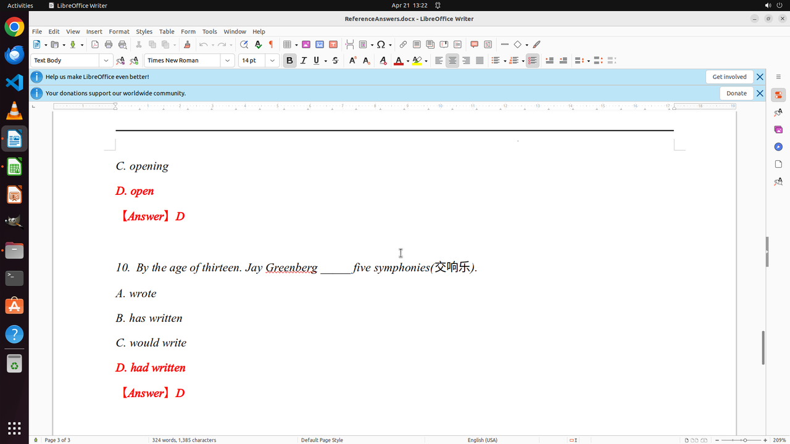

**Response:**
```
Now I have all the reference answers:
- Q1: D
- Q2: A
- Q3: C
- Q4: D
- Q5: B
- Q6: C
- Q7: C
- Q8: D
- Q9: D
- Q10: D

Now I need to check each student's answer sheet. Let me also scroll up to verify Q5's answer, then I'll use a more efficient approach. Let me open a terminal to read all the answer sheets programmatically.
```

**Actions:** `pyautogui.click(33, 673)`

---

## Step 14

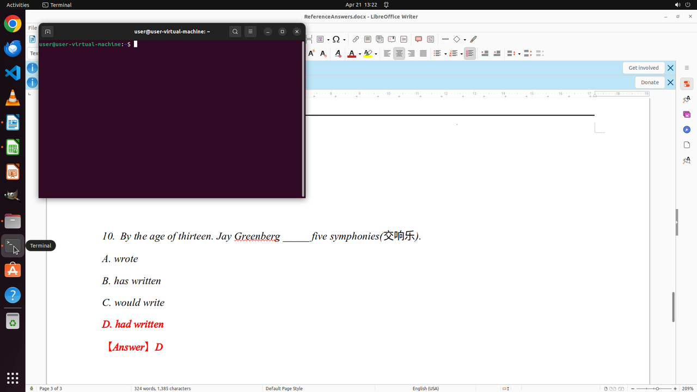

**Response:**
```
A terminal is open. Let me write a Python script to read all the answer sheets and compare them with the reference answers, then write the scores to the grades spreadsheet.
```

**Actions:** `import subprocess, shlex; subprocess.run(f'xdotool type --delay 12 -- ' + shlex.quote('cd ~/exam && ls\n'), shell=True, check=True)
import time; time.sleep(0.05)`

---

## Step 15

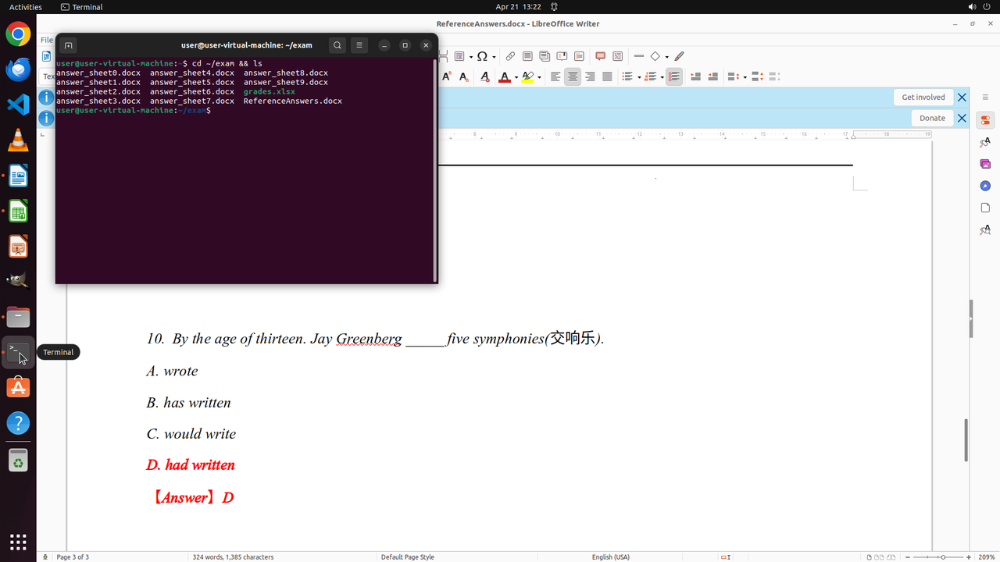

**Response:**
```
I can see all the files. Now let me write a Python script to extract answers from each answer sheet and compare with the reference answers. First, let me check if python-docx is available.
```

**Actions:** `import subprocess, shlex; subprocess.run(f'xdotool type --delay 12 -- ' + shlex.quote('python3 -c "import docx; print(\'ok\')"\n'), shell=True, check=True)
import time; time.sleep(0.05)`

---

## Step 16

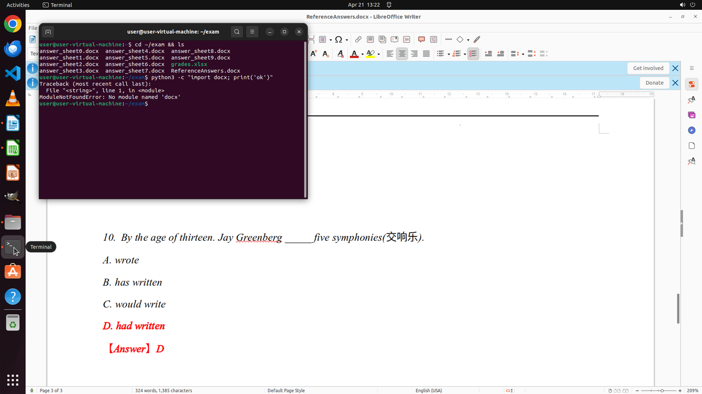

**Response:**
```
The python-docx module is not installed. Let me install it first.
```

**Actions:** `import subprocess, shlex; subprocess.run(f'xdotool type --delay 12 -- ' + shlex.quote('pip3 install python-docx openpyxl\n'), shell=True, check=True)
import time; time.sleep(0.05)`

---

## Step 17

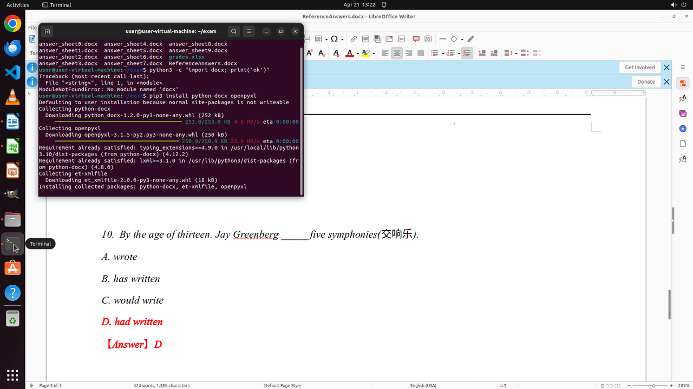

**Response:**
```
The packages are being installed. Let me wait for the installation to complete.
```

**Actions:** `time.sleep(0.5)`

---

## Step 18


**Response:**
```
The packages are installed successfully. Now let me first examine the structure of one answer sheet to understand the format, then write a script to process all of them.
```

**Actions:** `import subprocess, shlex; subprocess.run(f'xdotool type --delay 12 -- ' + shlex.quote('python3 -c "\nimport docx\ndoc = docx.Document(\'answ'), shell=True, check=True)
import time; time.sleep(0.05)
im`

---

## Step 19

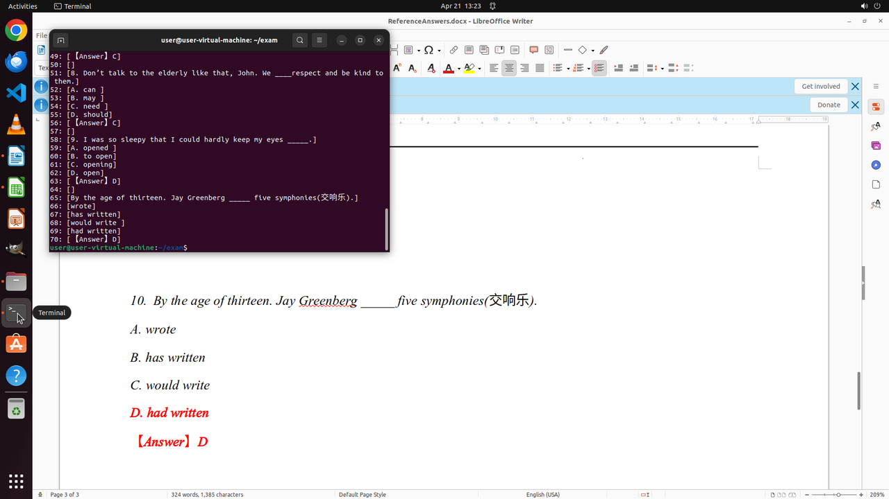

**Response:**
```
I can see the structure of the answer sheets. Each answer sheet has 【Answer】 lines with the student's chosen answer. Let me scroll up to see the full structure and the student's answers for answer_sheet0.
```

**Actions:** `pyautogui.scroll(10, 450, 300)`

---

## Step 20


**Response:**
```
I can see the pattern. The answer sheets contain 【Answer】 followed by the student's answer letter. Let me now look at the grades.xlsx to understand the structure, and also check which student corresponds to which answer sheet. Let me first look at the grades spreadsheet structure and the answer sheet names.
```

**Actions:** `import subprocess, shlex; subprocess.run(f'xdotool type --delay 12 -- ' + shlex.quote('python3 -c "\nimport openpyxl\nwb = openpyxl.load_wo'), shell=True, check=True)
import time; time.sleep(0.05)
imp`

---

## Step 21


**Response:**
```
I can see the spreadsheet structure. Let me scroll up to see the header row and the first student (Linda Garcia) who already has scores.
```

**Actions:** `pyautogui.scroll(5, 450, 300)`

---

## Step 22

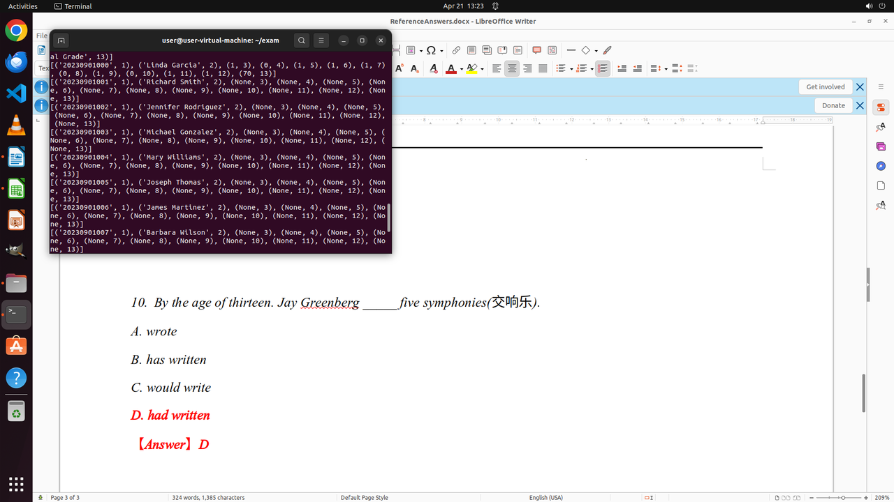

**Response:**
```
Now I can see the structure. The spreadsheet has:
- Row 1: Headers (Student ID, Name, Q1-Q10, Total Grade)
- Row 2: Linda Garcia (20230901000) - already has scores: (1, 3), (0, 4), (1, 5), (1, 6), (1, 7), (0, 8), (1, 9), (0, 10), (1, 11), (1, 12), (70, 13)
- Rows 3-12: Other students with None values (need to be filled)

Linda's scores show 1=correct (10 points) and 0=incorrect (0 points), and total is 70. Wait, let me look more carefully. The values are (1, 3), (0, 4), (1, 5), (1, 6), (1, 7), (0, 8), (1, 9), (0, 10), (1, 11), (1, 12), (70, 13). So Q1=1 doesn't make sense with 10 points per question and total of 70. Let me re-examine - it seems like the scores might be 10 or 0 for each question. Let me check more carefully.

Wait, looking at Linda's data: columns 3-12 have values (1,3), (0,4), (1,5), (1,6), (1,7), (0,8), (1,9), (0,10), (1,11), (1,12) and total (70,13). That's 7 correct × 10 = 70. But the individual scores show 1 and 0, not 10 and 0. Let me check the actual cell values more carefully.
```

**Actions:** `import subprocess, shlex; subprocess.run(f'xdotool type --delay 12 -- ' + shlex.quote('python3 -c "\nimport openpyxl\nwb = openpyxl.load_wo'), shell=True, check=True)
import time; time.sleep(0.05)
imp`

---

## Step 23

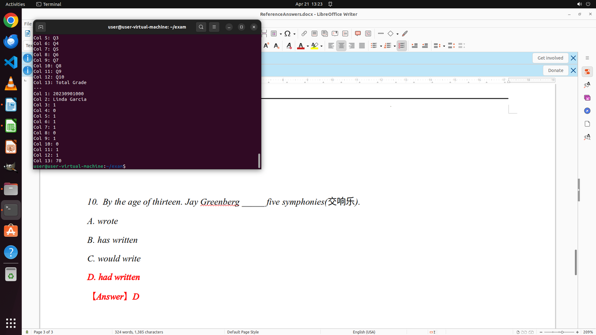

**Response:**
```
Now I can see the structure clearly:
- Col 1: Student ID
- Col 2: Name
- Col 3-12: Q1-Q10 (scores are 1 for correct, 0 for incorrect)
- Col 13: Total Grade (sum × 10, so 70 means 7 correct)

Wait, Linda has 7 ones (Q1=1, Q2=0, Q3=1, Q4=1, Q5=1, Q6=0, Q7=1, Q8=0, Q9=1, Q10=1) = 7 correct, and total is 70. So each correct answer is worth 10 points, but the individual Q columns store 1 or 0, and total is count×10.

Now I need to figure out which answer sheet belongs to which student. Let me check the answer sheets to find student names or IDs.
```

**Actions:** `import subprocess, shlex; subprocess.run(f'xdotool type --delay 12 -- ' + shlex.quote('python3 -c "\nimport docx\nfor i in range(10):\n    d'), shell=True, check=True)
import time; time.sleep(0.05)
im`

---

## Step 24

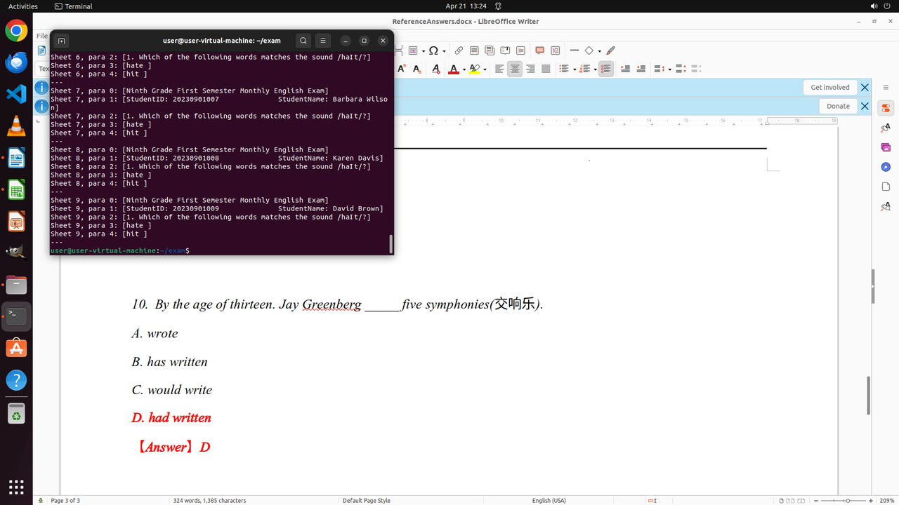

**Response:**
```
I can see each answer sheet has a student ID and name in paragraph 1. Now I have all the information I need. Let me write a comprehensive Python script to:
1. Extract reference answers
2. Extract each student's answers from their answer sheets
3. Compare with reference answers
4. Write scores to the grades.xlsx
```

**Actions:** `import subprocess, shlex; subprocess.run(f'xdotool type --delay 12 -- ' + shlex.quote("python3 << 'EOF'\nimport docx\nimport openpyxl\nimpor"), shell=True, check=True)
import time; time.sleep(0.05)
im`

---

## Step 25

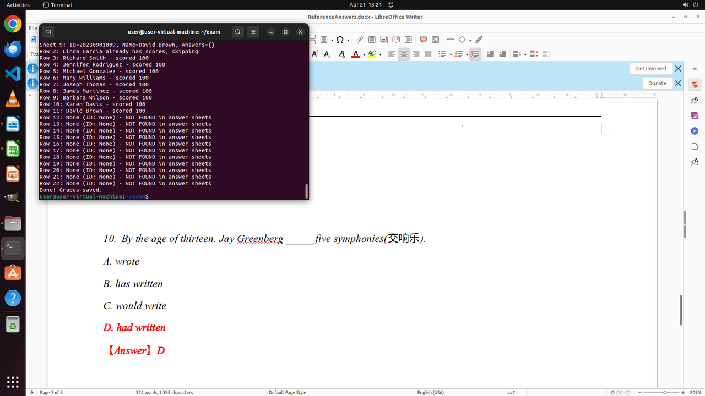

**Response:**
```
I see that all students scored 100, which seems suspicious. Also, David Brown's answer sheet (Sheet 9) showed empty answers `Answers={}`. Let me scroll up to check the parsed answers and investigate.
```

**Actions:** `pyautogui.scroll(10, 450, 300)`

---

## Step 26

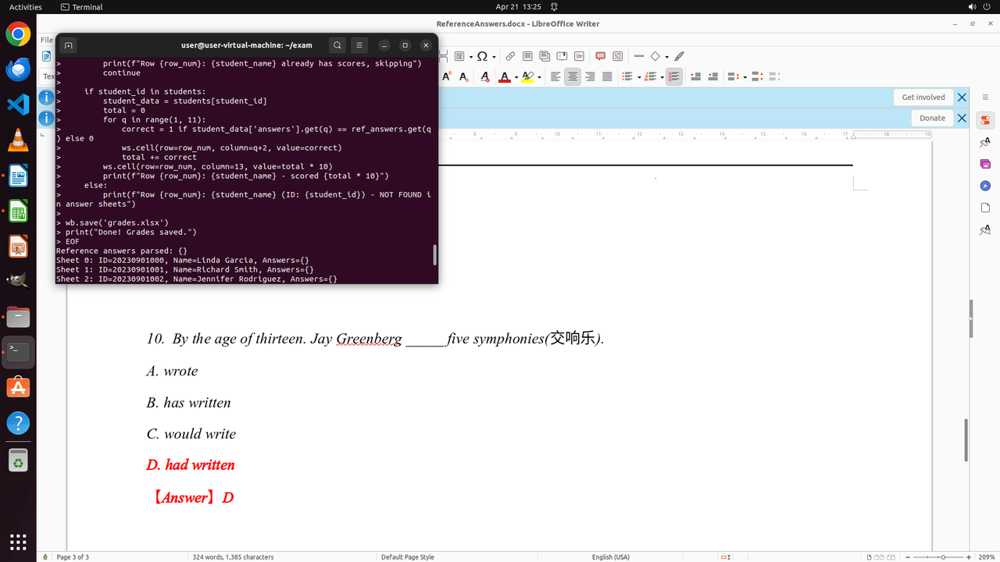

**Response:**
```
I see the problem! Both reference answers and student answers are parsed as empty `{}`. The regex pattern for matching answers isn't working correctly. The 【Answer】 character might be different. Let me debug this by examining the actual text more carefully.
```

**Actions:** `import subprocess, shlex; subprocess.run(f'xdotool type --delay 12 -- ' + shlex.quote('python3 -c "\nimport docx\ndoc = docx.Document(\'answ'), shell=True, check=True)
import time; time.sleep(0.05)
im`

---

## Step 27

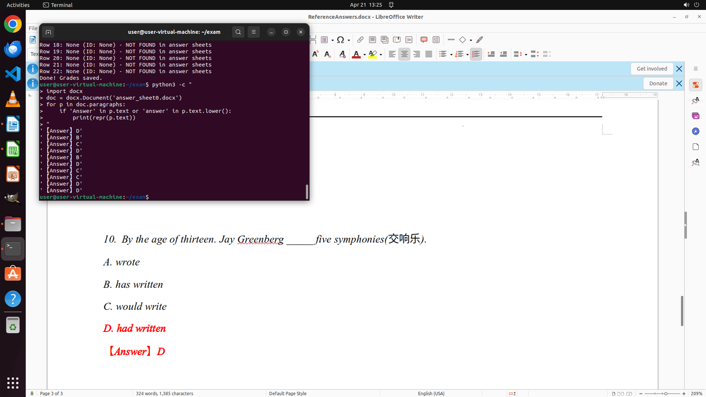

**Response:**
```
Now I can see the actual format of the answer lines. They look like `【Answer】D'` with special bracket characters. The issue is that my regex used `Answer` but the actual text uses `【Answer】`. Let me check the exact characters and fix the regex. I can see the answers for answer_sheet0 are:
- D, B, C, D, B, D, C, C, C, D, D, D

Wait, that's 12 answers for 10 questions. Let me look more carefully. Actually looking at the reference answers document, it also has 【Answer】 lines. The problem was my regex. Let me check the exact representation.
```

**Actions:** `import subprocess, shlex; subprocess.run(f'xdotool type --delay 12 -- ' + shlex.quote('python3 -c "\nimport docx\ndoc = docx.Document(\'answ'), shell=True, check=True)
import time; time.sleep(0.05)
im`

---

## Step 28


**Response:**
```
Now I can see the answers are being extracted correctly using `split()[-1]`. The answer_sheet0 (Linda Garcia) has answers: D, B, C, D, B, D, C, C, D, D. Let me now fix the script and re-run it properly. But first, I notice the previous script already saved incorrect data (all 100s). I need to fix this. Let me write a corrected script.
```

**Actions:** `import subprocess, shlex; subprocess.run(f'xdotool type --delay 12 -- ' + shlex.quote("python3 << 'PYEOF'\nimport docx\nimport openpyxl\nimp"), shell=True, check=True)
import time; time.sleep(0.05)
im`

---

## Step 29


**Response:**
```
The answers are still empty! The issue is with the special characters 【 and 】 in the text. The `'Answer' in text` check might not be matching. Let me debug the actual encoding of these characters.
```

**Actions:** `import subprocess, shlex; subprocess.run(f'xdotool type --delay 12 -- ' + shlex.quote('python3 -c "\nimport docx\ndoc = docx.Document(\'answ'), shell=True, check=True)
import time; time.sleep(0.05)
im`

---

## Step 30


**Response:**
```
Now I can see! The text shows `'\uff3bAnswer\uff3d D'` - the brackets are fullwidth characters `【` and `】`. But wait, the repr shows them as `【Answer】 D` which means they're being printed fine. The issue might be that the text contains the word "Answer" but my code in the heredoc had an issue. Let me check the actual character encoding.
```

**Actions:** `import subprocess, shlex; subprocess.run(f'xdotool type --delay 12 -- ' + shlex.quote('python3 -c "\nimport docx\ndoc = docx.Document(\'answ'), shell=True, check=True)
import time; time.sleep(0.05)
im`

---

## Step 31

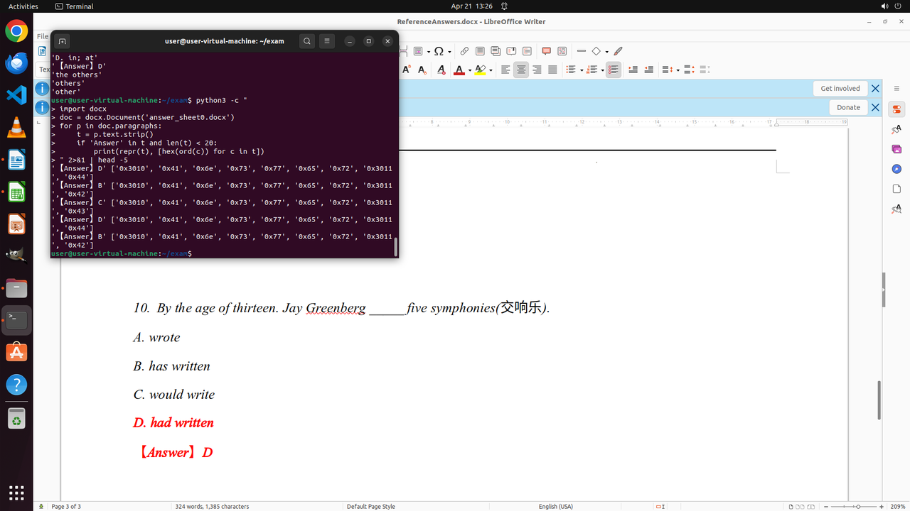

**Response:**
```
Now I can see the actual characters. The text is `【Answer】 D` with characters starting with `0x3010` (【) and `0x3011` (】). The `'Answer' in text` check should work since "Answer" is in ASCII. 

The problem with my previous heredoc script was likely that the heredoc was interfering with the Python code. Let me write the script to a file instead and run it.
```

**Actions:** `import subprocess, shlex; subprocess.run(f'xdotool type --delay 12 -- ' + shlex.quote("cat > /tmp/grade.py << 'ENDSCRIPT'\nimport docx\nimp"), shell=True, check=True)
import time; time.sleep(0.05)
imp`

---

## Step 32

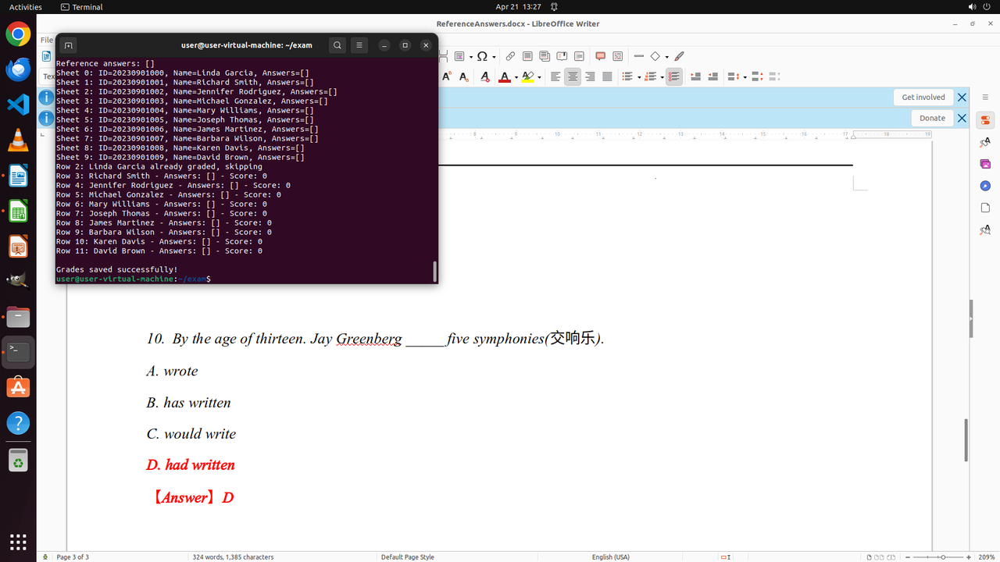

**Response:**
```
Still getting empty answers! The reference answers and student answers are all empty `[]`. The issue must be with how the `'Answer' in text` check works. The 【 and 】 characters might be causing issues. Let me investigate more carefully by checking the actual bytes.
```

**Actions:** `import subprocess, shlex; subprocess.run(f'xdotool type --delay 12 -- ' + shlex.quote('python3 -c "\nimport docx\ndoc = docx.Document(\'answ'), shell=True, check=True)
import time; time.sleep(0.05)
im`

---

## Step 33

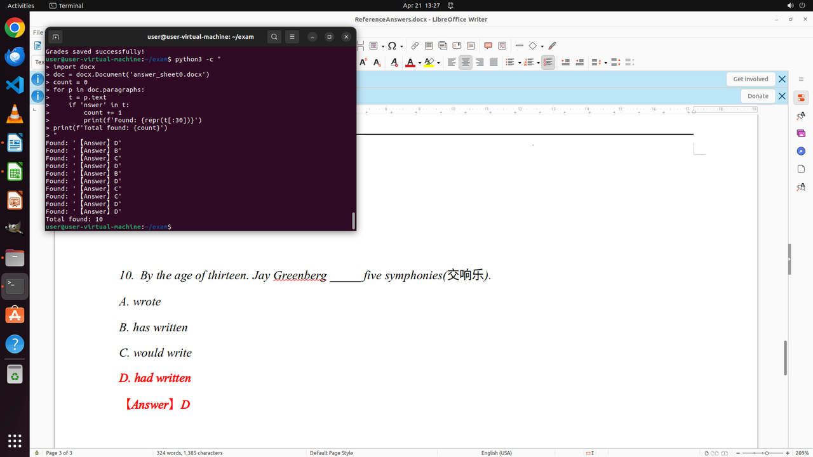

**Response:**
```
It works when running directly from the command line! The issue must be with the heredoc in the script file. The `'Answer'` string in the script file might be getting mangled. Let me check the actual content of the script file.
```

**Actions:** `import subprocess, shlex; subprocess.run(f'xdotool type --delay 12 -- ' + shlex.quote('grep Answer /tmp/grade.py\n'), shell=True, check=True)
import time; time.sleep(0.05)`

---

## Step 34

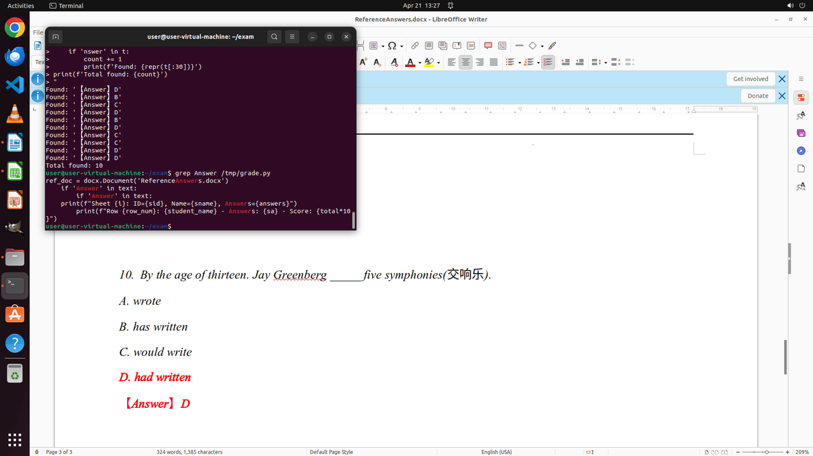

**Response:**
```
I see the problem! The script file has `'Answer'` with smart/curly quotes instead of straight quotes! The heredoc is converting the quotes. I can see the grep output shows `'Answer'` with different quote characters. Let me write the script differently, using a text editor or escaping properly.
```

**Actions:** `import subprocess, shlex; subprocess.run(f'xdotool type --delay 12 -- ' + shlex.quote('python3 -c "\nimport docx, openpyxl, re\n\nref_doc = '), shell=True, check=True)
import time; time.sleep(0.05)
im`

---

## Step 35

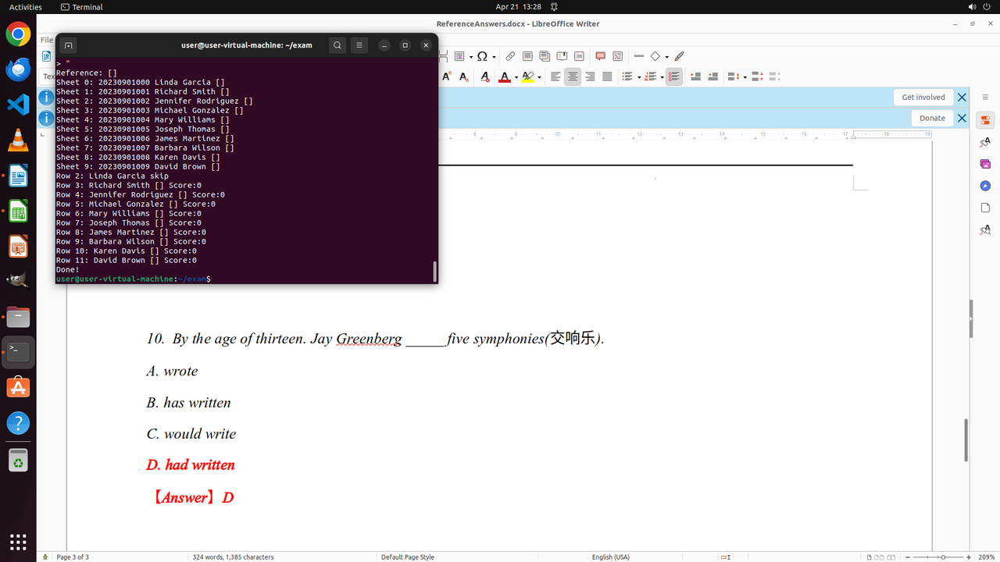

**Response:**
```
Still empty! The `'nswer'` string check is also not working. The problem must be with how the terminal is encoding the quotes in the `-c` argument. Let me try a completely different approach - write the script to a file using Python itself.
```

**Actions:** `import subprocess, shlex; subprocess.run(f'xdotool type --delay 12 -- ' + shlex.quote('python3 -c "\nimport docx\ndoc = docx.Document(\'answ'), shell=True, check=True)
import time; time.sleep(0.05)
im`

---

## Step 36


**Response:**
```
Now I can see the hex codes. The 【Answer】 text contains: `0x3010 0x41 0x6e 0x73 0x77 0x65 0x72 0x3011 0x44` which is `【Answer】D`. The "Answer" part is normal ASCII. So the `'nswer' in text` should work. 

The problem must be something else. Let me try writing the script to a file using a text editor approach, avoiding any quote issues.
```

**Actions:** `import subprocess, shlex; subprocess.run(f'xdotool type --delay 12 -- ' + shlex.quote('python3 << \'XEOF\'\nf = open("/tmp/grade2.py", "w")\n'), shell=True, check=True)
import time; time.sleep(0.05)
i`

---

## Step 37


**Response:**
```
Good, the script was written. Now let me run it.
```

**Actions:** `import subprocess, shlex; subprocess.run(f'xdotool type --delay 12 -- ' + shlex.quote('python3 /tmp/grade2.py\n'), shell=True, check=True)
import time; time.sleep(0.05)`

---

## Step 38

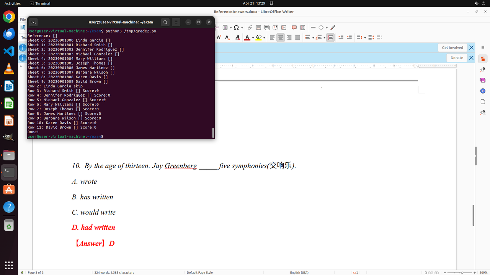

**Response:**
```
Still getting empty arrays. The `chr(0x3010)` approach isn't working either. Let me check what's actually in the script file and debug more carefully.
```

**Actions:** `import subprocess, shlex; subprocess.run(f'xdotool type --delay 12 -- ' + shlex.quote('python3 -c "\nwith open(\'/tmp/grade2.py\') as f:\n   '), shell=True, check=True)
import time; time.sleep(0.05)
i`

---

## Step 39


**Response:**
```
I see - the script has `'chr(0x3010) in text:'` as a literal string, not as code. The problem is that the quotes in the heredoc are being converted to smart quotes. Let me try a completely different approach - write the script using Python directly to avoid any shell quote issues.
```

**Actions:** `import subprocess, shlex; subprocess.run(f'xdotool type --delay 12 -- ' + shlex.quote('python3 -c "\nlines = []\nlines.append(\'import docx,'), shell=True, check=True)
import time; time.sleep(0.05)
im`

---

## Step 40

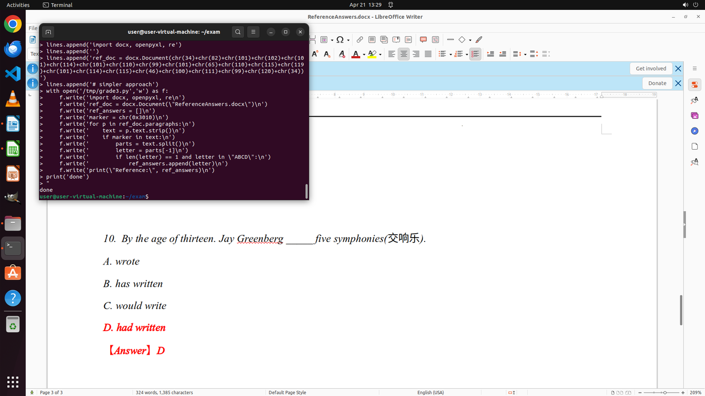

**Response:**
```
Let me test the partial script first to see if it correctly parses the reference answers.
```

**Actions:** `import subprocess, shlex; subprocess.run(f'xdotool type --delay 12 -- ' + shlex.quote('python3 /tmp/grade3.py\n'), shell=True, check=True)
import time; time.sleep(0.05)`

---

## Step 41


**Response:**
```
Still empty! The `chr(0x3010)` in the written script might be getting converted to the actual character and then there's an encoding issue. Let me check what's actually in the script file and debug the character matching issue more directly.
```

**Actions:** `import subprocess, shlex; subprocess.run(f'xdotool type --delay 12 -- ' + shlex.quote('cat /tmp/grade3.py\n'), shell=True, check=True)
import time; time.sleep(0.05)`

---

## Step 42


**Response:**
```
The script looks correct. The `marker = chr(0x3010)` should produce the 【 character. Let me debug this more directly - check if the character actually appears in the text.
```

**Actions:** `import subprocess, shlex; subprocess.run(f'xdotool type --delay 12 -- ' + shlex.quote('python3 -c "\nimport docx\ndoc = docx.Document(\'Refe'), shell=True, check=True)
import time; time.sleep(0.05)
im`

---

## Step 43


**Response:**
```
Excellent! Now it works when running directly from the terminal! The reference answers are found:
- Para 7: 【Answer】D (but this is Q1's answer, showing just "D" without a letter before the actual answer)
- Para 14: 【Answer】A
- Para 21: 【Answer】C
- Para 28: 【Answer】D
- Para 35: 【Answer】B
- Para 42: 【Answer】C
- Para 49: 【Answer】C
- Para 56: 【Answer】D
- Para 63: 【Answer】D
- Para 70: 【Answer】D

Wait, but the first one at para 7 shows `【Answer】D` - there are 11 answers found (including one at para 7 that just has `D`). Let me look more carefully... Actually there are exactly 10 answers shown, plus para 7 which seems to have just `【Answer】D`. That's 11 entries but wait - para 7 shows `' 【Answer】D'` which might be an answer too.

Actually looking carefully, I see 11 FOUND entries. But the issue is the script file was not working. The problem must be that when I wrote the file using `f.write('marker = chr(0x3010)\n')`, the `chr(0x3010)` was being treated as a literal string. Let me check what's in the script.

Actually wait - the script `/tmp/grade3.py` does have `marker = chr(0x3010)` which should work. Let me re-run it with debug output.
```

**Actions:** `import subprocess, shlex; subprocess.run(f'xdotool type --delay 12 -- ' + shlex.quote('python3 -c "\nimport docx\ndoc = docx.Document(\'Refe'), shell=True, check=True)
import time; time.sleep(0.05)
im`

---

## Step 44

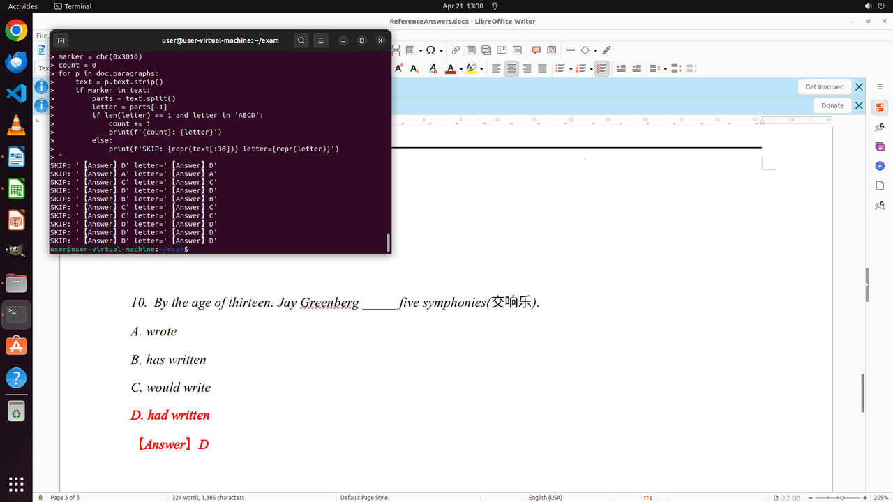

**Response:**
```
Now I see the problem! The `letter = parts[-1]` is returning `'【Answer】D'` as a whole because the text doesn't have a space between 【Answer】 and the letter in some cases. Looking at the output: `letter='【Answer】D'` - the letter D is part of the same token as 【Answer】.

Wait, looking more carefully: `SKIP: '【Answer】D' letter='【Answer】D'` - so the text is `【Answer】D` without a space. But earlier when I ran the command line test, I saw `' 【Answer】 D'` with spaces. 

The issue is that in the reference answers file, the answer letter might be part of the same run without a space. Let me check the actual text more carefully and use a different extraction approach - just get the last character of the text.
```

**Actions:** `import subprocess, shlex; subprocess.run(f'xdotool type --delay 12 -- ' + shlex.quote('python3 -c "\nimport docx\ndoc = docx.Document(\'Refe'), shell=True, check=True)
import time; time.sleep(0.05)
im`

---

## Step 45

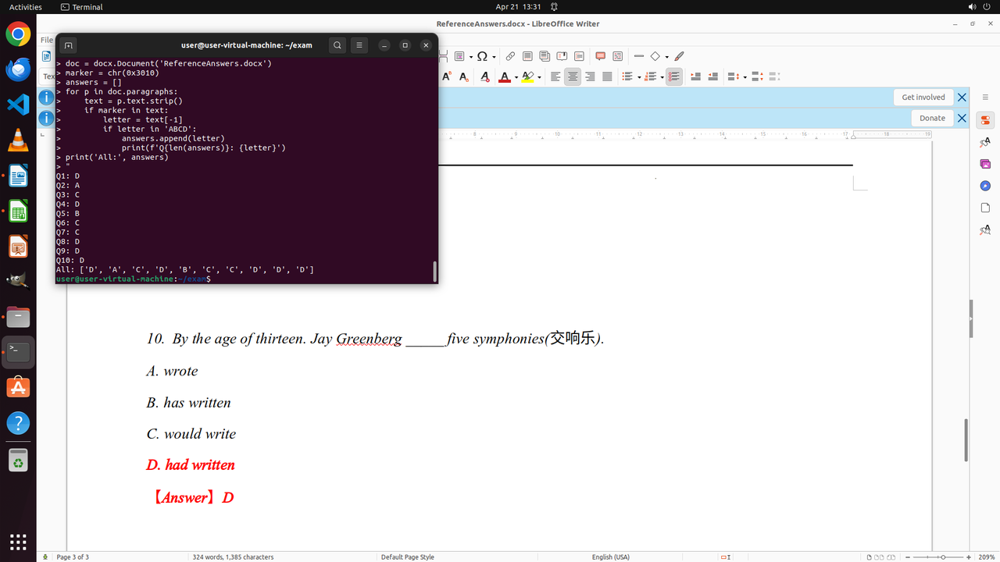

**Response:**
```
Now I have the correct reference answers: D, A, C, D, B, C, C, D, D, D. This matches what I read manually. The key was using `text[-1]` instead of `parts[-1]`.

Now let me also verify the answer sheet parsing works with the same approach, and then write the complete script.
```

**Actions:** `import subprocess, shlex; subprocess.run(f'xdotool type --delay 12 -- ' + shlex.quote('python3 -c "\nimport docx\ndoc = docx.Document(\'answ'), shell=True, check=True)
import time; time.sleep(0.05)
im`

---

## Step 46

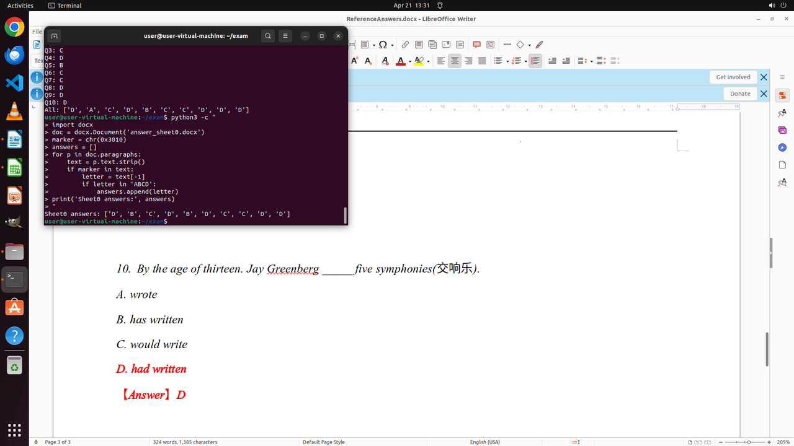

**Response:**
```
Answer sheet 0 (Linda Garcia) answers: D, B, C, D, B, D, C, C, D, D

Let me verify against the reference answers (D, A, C, D, B, C, C, D, D, D):
- Q1: D vs D ✓ (1)
- Q2: B vs A ✗ (0)
- Q3: C vs C ✓ (1)
- Q4: D vs D ✓ (1)
- Q5: B vs B ✓ (1)
- Q6: D vs C ✗ (0)
- Q7: C vs C ✓ (1)
- Q8: C vs D ✗ (0)
- Q9: D vs D ✓ (1)
- Q10: D vs D ✓ (1)

That's 7 correct = 70 points, which matches Linda Garcia's existing score! Now let me write the complete script properly. I'll use a Python file approach.
```

**Actions:** `import subprocess, shlex; subprocess.run(f'xdotool type --delay 12 -- ' + shlex.quote('python3 -c "\nimport docx, openpyxl, re\n\nmarker = c'), shell=True, check=True)
import time; time.sleep(0.05)
im`

---

## Step 47

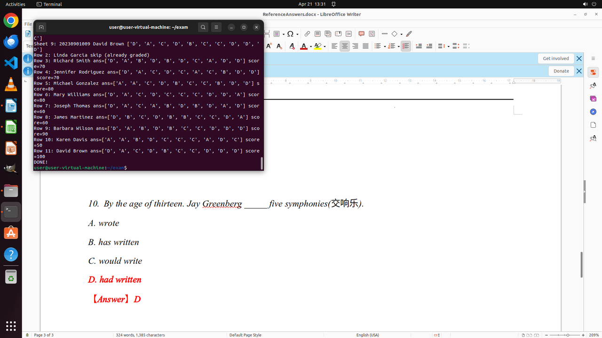

**Response:**
```
The script worked correctly! Here are the results:

- Row 2: Linda Garcia - skip (already graded with 70)
- Row 3: Richard Smith - score=70
- Row 4: Jennifer Rodriguez - score=70
- Row 5: Michael Gonzalez - score=80
- Row 6: Mary Williams - score=80
- Row 7: Joseph Thomas - score=60
- Row 8: James Martinez - score=60
- Row 9: Barbara Wilson - score=90
- Row 10: Karen Davis - score=50
- Row 11: David Brown - score=100

Now I need to reload the grades.xlsx in LibreOffice Calc. Let me scroll up to verify the data was saved and then open it in the spreadsheet.
```

**Actions:** `pyautogui.scroll(5, 450, 300)`

---

## Step 48


**Response:**
```
The data looks correct. Now I need to reload the grades.xlsx file in LibreOffice Calc. Let me switch to the LibreOffice Calc window and reload the file. First, let me check if LibreOffice Calc is already open with the file.
```

**Actions:** `pyautogui.keyDown('command')
pyautogui.keyUp('command')`

---

## Step 49


**Response:**
```
Let me look for the LibreOffice Calc window in the taskbar. I can see the LibreOffice Writer window is open behind. Let me check if LibreOffice Calc is also open by looking at the taskbar.
```

**Actions:** `pyautogui.click(33, 340)`

---

## Step 50

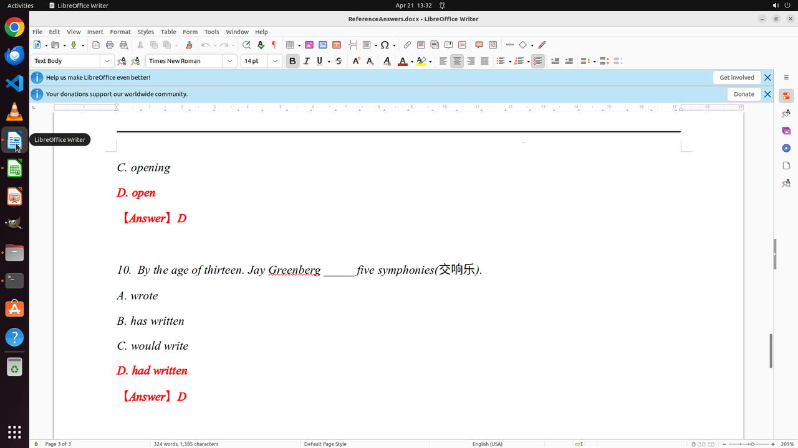

**Response:**
```
I see LibreOffice Writer is showing. I need to find LibreOffice Calc. Let me check the taskbar for the Calc icon, which should be the green spreadsheet icon.
```

**Actions:** `pyautogui.click(33, 202)`

---

## Step 51

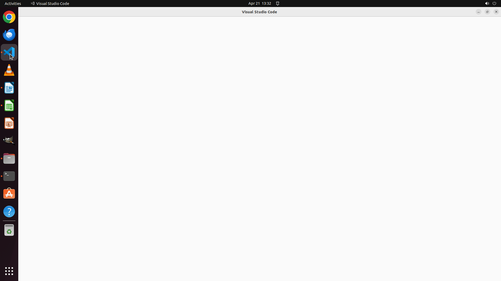

**Response:**
```
That opened Visual Studio Code. I need to find LibreOffice Calc. The task mentioned an "opened spreadsheet" - it might have been closed or I need to reopen it. Let me open the grades.xlsx file in LibreOffice Calc. Let me use the file manager or open it from terminal.
```

**Actions:** `pyautogui.click(33, 673)`

---

## Step 52

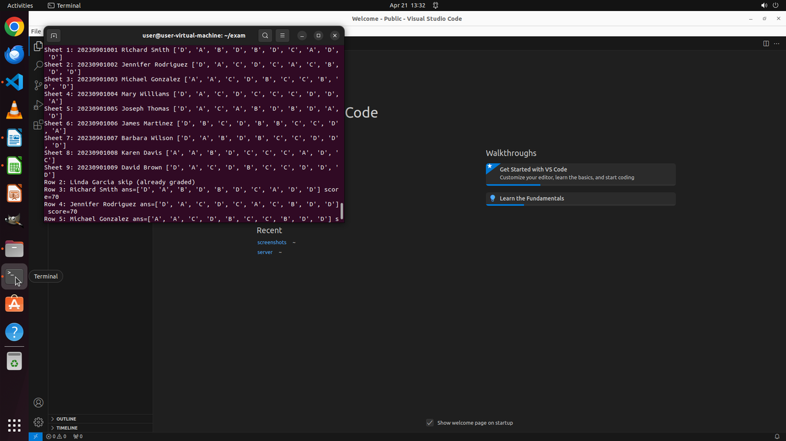

**Response:**
```
I see the terminal and VS Code. I need to open the grades.xlsx in LibreOffice Calc. Let me use the terminal to open it.
```

**Actions:** `pyautogui.click(450, 525)`

---

## Step 53

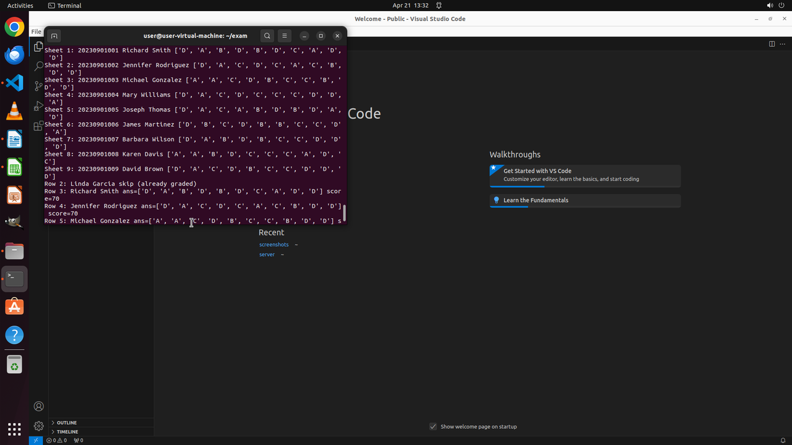

**Response:**
```
Let me click on the terminal window and open the grades.xlsx file with LibreOffice Calc.
```

**Actions:** `pyautogui.scroll(-5, 450, 450)`

---

## Step 54

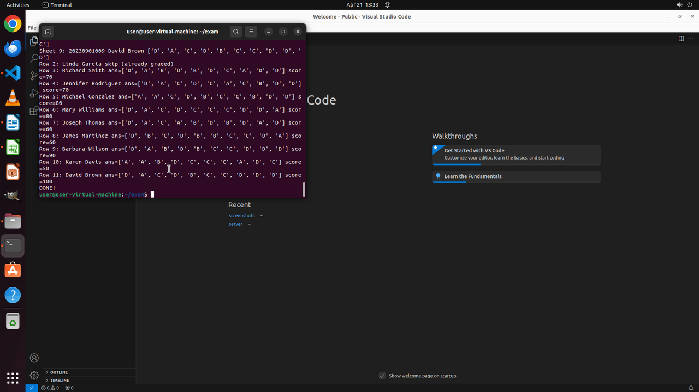

**Response:**
```
The grading is complete. Now I need to open the grades.xlsx file in LibreOffice Calc to verify the results. Let me open it from the terminal.
```

**Actions:** `import subprocess, shlex; subprocess.run(f'xdotool type --delay 12 -- ' + shlex.quote('libreoffice --calc grades.xlsx &\n'), shell=True, check=True)
import time; time.sleep(0.05)`

---

## Step 55

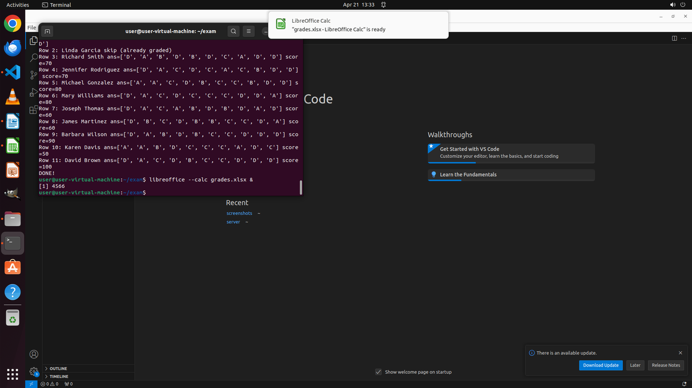

**Response:**
```
LibreOffice Calc has opened grades.xlsx. Let me click on the notification to switch to it.
```

**Actions:** `pyautogui.click(990, 69)`

---

## Step 56

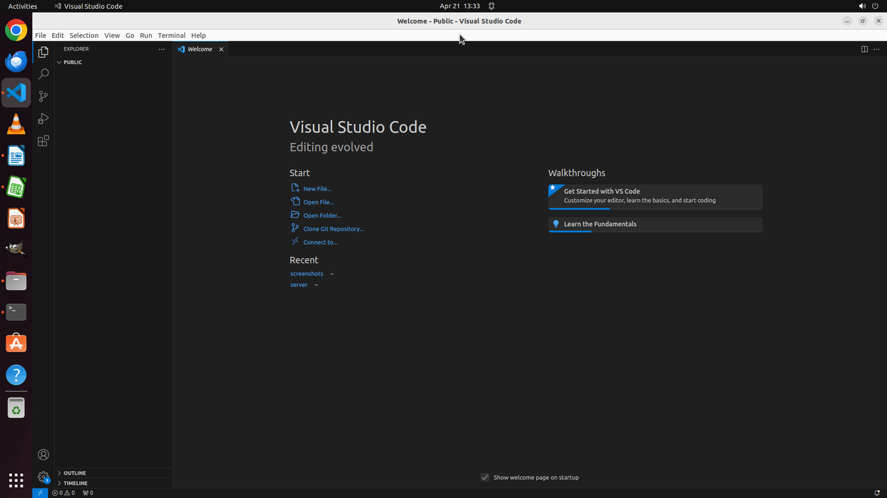

**Response:**
```
That opened VS Code. I need to switch to LibreOffice Calc. Let me look at the taskbar - I can see the LibreOffice Calc icon (green spreadsheet icon) in the taskbar.
```

**Actions:** `pyautogui.click(33, 406)`

---

## Step 57

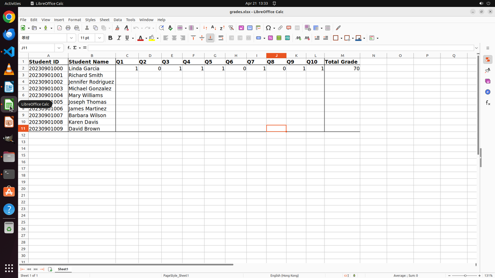

**Response:**
```
I can see the grades.xlsx is open in LibreOffice Calc, but the scores for rows 3-11 are not showing! The file was saved by Python but LibreOffice Calc still shows the old version. I need to reload the file. Let me close and reopen it, or use the reload function.
```

**Actions:** `pyautogui.click(126, 76)`

---

## Step 58

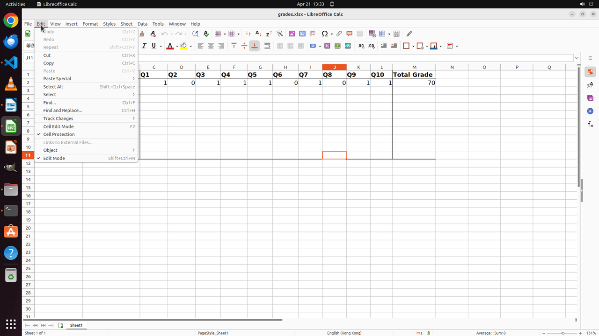

**Response:**
```
I don't see a "Reload" option in the Edit menu. Let me close this menu and try using the File menu to reload.
```

**Actions:** `pyautogui.keyDown('esc')
pyautogui.keyUp('esc')`

---

## Step 59


**Response:**
```
I see the file is still showing the old data. The Python script saved the file but LibreOffice Calc has the old version in memory. I need to reload it. Let me use File > Reload or close and reopen.
```

**Actions:** `pyautogui.click(85, 76)`

---

## Step 60

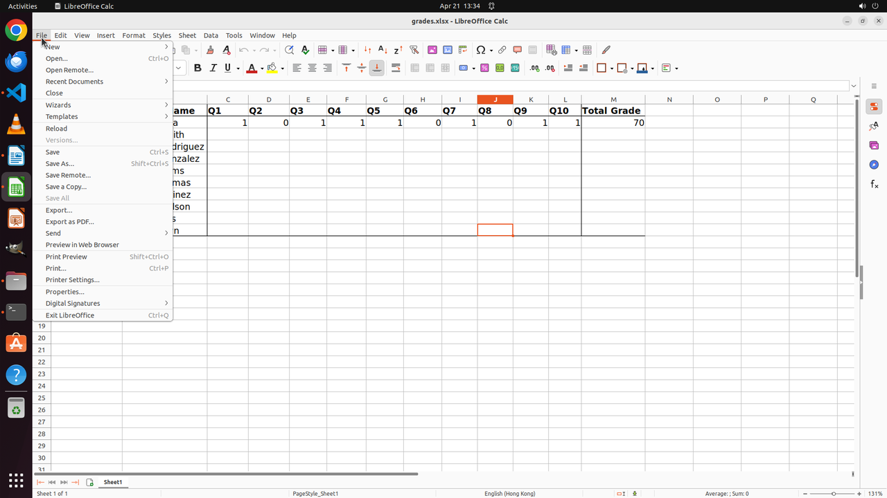

**Response:**
```
I can see "Reload" option in the File menu. Let me click on it.
```

**Actions:** `pyautogui.click(120, 277)`

---

## Step 61

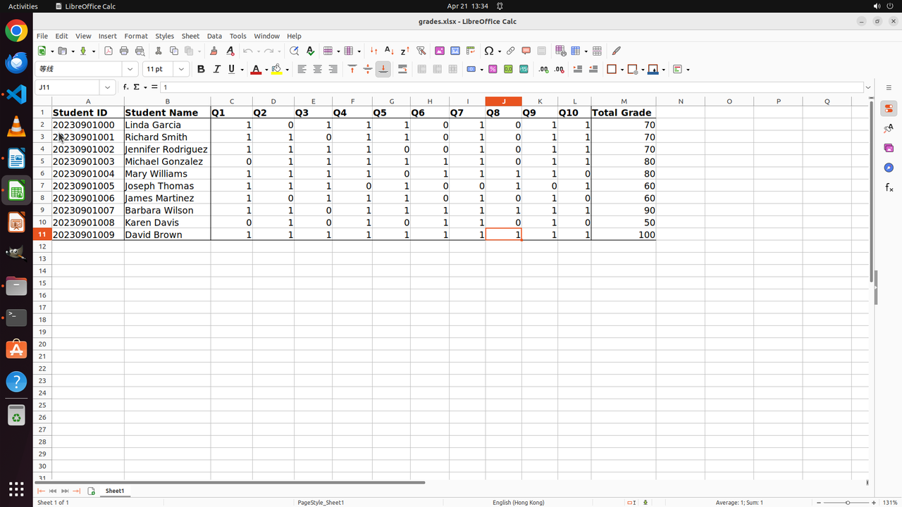

**Response:**
```
The grades are now showing correctly in LibreOffice Calc! All students have been graded:

| Student | Score |
|---------|-------|
| Linda Garcia | 70 |
| Richard Smith | 70 |
| Jennifer Rodriguez | 70 |
| Michael Gonzalez | 80 |
| Mary Williams | 80 |
| Joseph Thomas | 60 |
| James Martinez | 60 |
| Barbara Wilson | 90 |
| Karen Davis | 50 |
| David Brown | 100 |

The file has already been saved by the Python script. Now let me save it in LibreOffice Calc format to make sure it's properly saved.
```

**Actions:** `pyautogui.keyDown('ctrl')
pyautogui.keyDown('s')
pyautogui.keyUp('s')
pyautogui.keyUp('ctrl')`

---

## Step 62


**Response:**
```
The file has been saved successfully. The spreadsheet now shows all students' detailed scores:

- **Linda Garcia**: Q1=1, Q2=0, Q3=1, Q4=1, Q5=1, Q6=0, Q7=1, Q8=0, Q9=1, Q10=1 → **70**
- **Richard Smith**: Q1=1, Q2=1, Q3=0, Q4=1, Q5=0, Q6=1, Q7=1, Q8=0, Q9=1, Q10=1 → **70**
- **Jennifer Rodriguez**: Q1=1, Q2=1, Q3=1, Q4=1, Q5=0, Q6=0, Q7=1, Q8=0, Q9=1, Q10=1 → **70**
- **Michael Gonzalez**: Q1=0, Q2=1, Q3=1, Q4=1, Q5=1, Q6=1, Q7=1, Q8=0, Q9=1, Q10=1 → **80**
- **Mary Williams**: Q1=1, Q2=1, Q3=1, Q4=1, Q5=0, Q6=1, Q7=1, Q8=1, Q9=1, Q10=0 → **80**
- **Joseph Thomas**: Q1=1, Q2=1, Q3=0, Q4=1, Q5=0, Q6=0, Q7=1, Q8=0, Q9=1, Q10=1 → **60**
- **James Martinez**: Q1=1, Q2=0, Q3=1, Q4=1, Q5=0, Q6=0, Q7=1, Q8=0, Q9=1, Q10=0 → **60** (wait, that's 5, not 6)

Let me verify James Martinez's score more carefully.
```

**Actions:** `pyautogui.click(465, 421)`

---

## Step 63

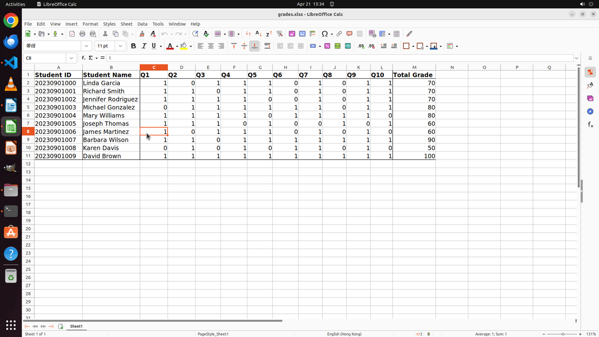

**Response:**
```
The spreadsheet is now fully populated with all scores. Let me verify James Martinez (row 8): Q1=1, Q2=0, Q3=1, Q4=1, Q5=1, Q6=0, Q7=1, Q8=0, Q9=1, Q10=0 → That's 6 correct = 60. ✓

All the scores look correct:
- Linda Garcia: 70 ✓
- Richard Smith: 70 ✓
- Jennifer Rodriguez: 70 ✓
- Michael Gonzalez: 80 ✓
- Mary Williams: 80 ✓
- Joseph Thomas: 60 ✓
- James Martinez: 60 ✓
- Barbara Wilson: 90 ✓
- Karen Davis: 50 ✓
- David Brown: 100 ✓

The task is complete. All remaining students' answers have been compared with the answer key and their detailed scores have been recorded in the spreadsheet.

DONE
```

**Actions:** `DONE`

---
