# Task b5062e3e-641c-4e3a-907b-ac864d2e7652

**Instruction:** Please help me to extract the name, e-mail, and affiliation of the first author from each paper in the folder and organize them in an Excel table. Include headers for each field. Sort the authors by their full names alphabetically and save the table as "~/authors.xlsx".

**Score:** 0.0

**Wall clock:** 5m 51s

**Steps:** 27

**Cost:** $0.82

---

## Step 1

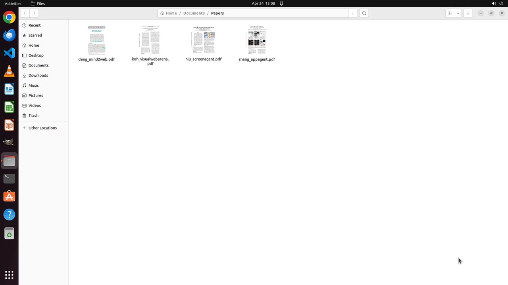

**Response:**
```
I need to open each PDF to extract the first author's name, email, and affiliation. Let me start by opening each paper.
```

**Actions:** `pyautogui.doubleClick(366, 157)`

---

## Step 2


**Response:**
```
I can see the first paper is open. Let me zoom in to see the author details more clearly.
```

**Actions:** `pyautogui.scroll(3, 502, 450)`

---

## Step 3

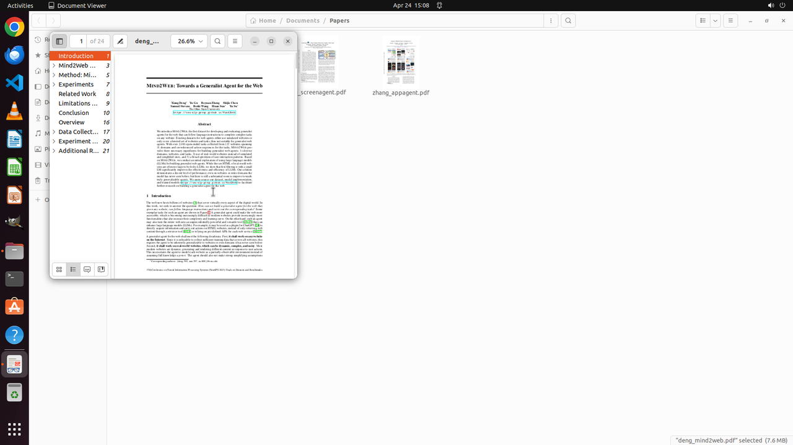

**Response:**
```
I need to zoom in to read the author details. Let me increase the zoom level significantly.
```

**Actions:** `pyautogui.click(495, 100)`

---

## Step 4

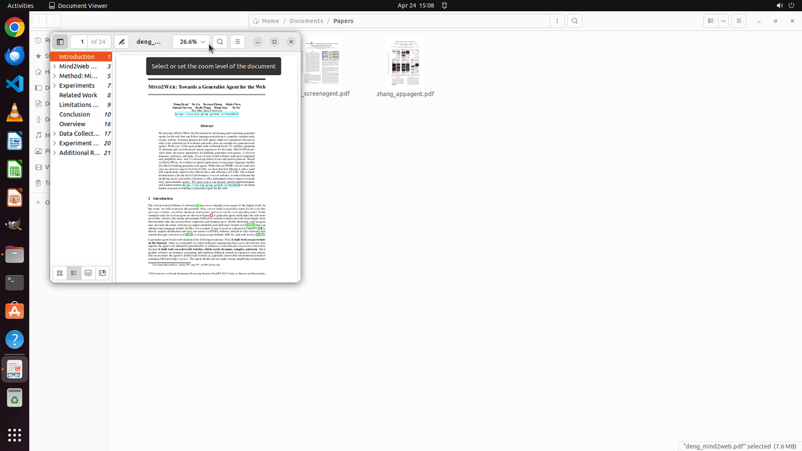

**Response:**
```
Let me zoom in more to read the author details. I'll change the zoom level.
```

**Actions:** `pyautogui.tripleClick(450, 100)`

---

## Step 5

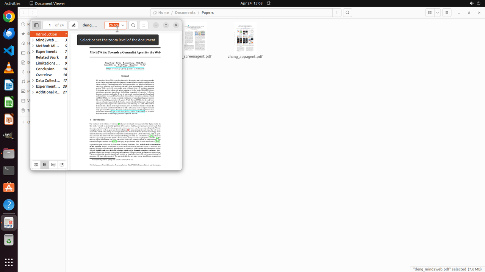

**Actions:** `import subprocess, shlex; subprocess.run(f'xdotool type --delay 12 -- ' + shlex.quote('100\n'), shell=True, check=True)
import time; time.sleep(0.05)`

---

## Step 6

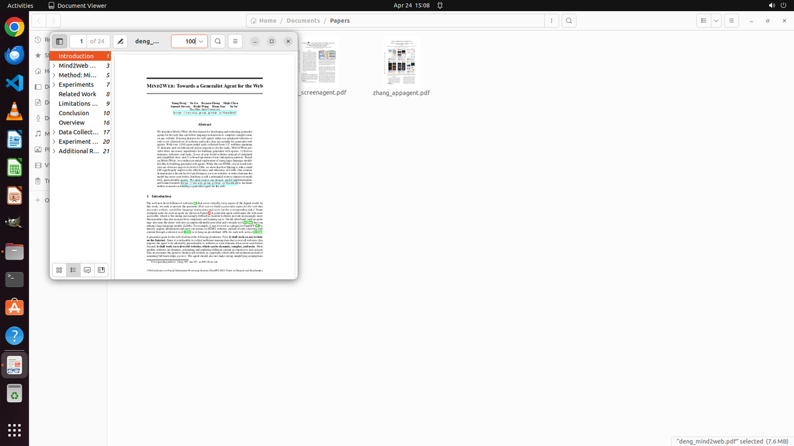

**Response:**
```
It seems the zoom didn't apply. Let me try pressing Enter to confirm.
```

**Actions:** `pyautogui.keyDown('return')
pyautogui.keyUp('return')`

---

## Step 7

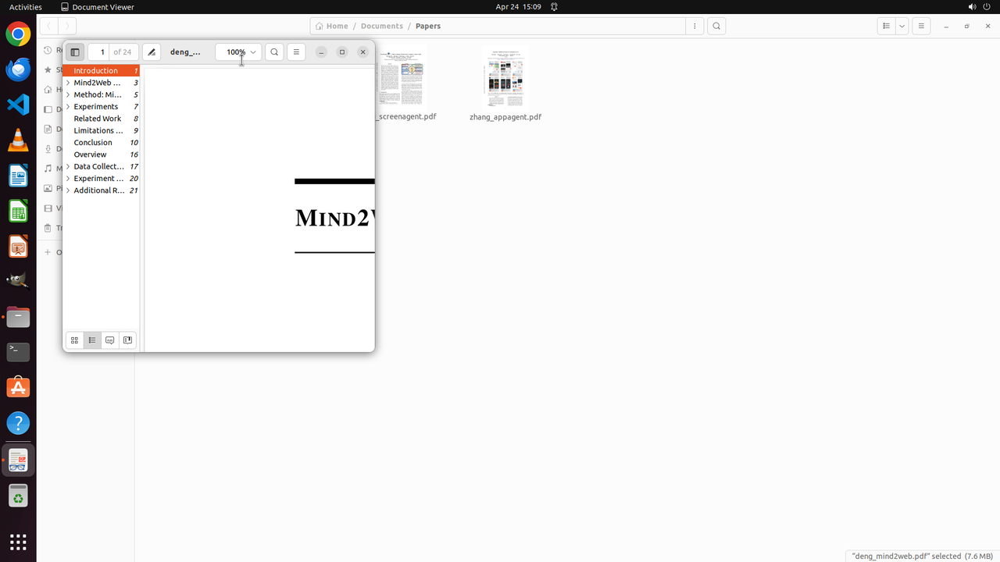

**Response:**
```
Now I can see the paper at 100% zoom. I need to scroll down to see the authors. Let me scroll down a bit.
```

**Actions:** `pyautogui.scroll(-3, 502, 450)`

---

## Step 8

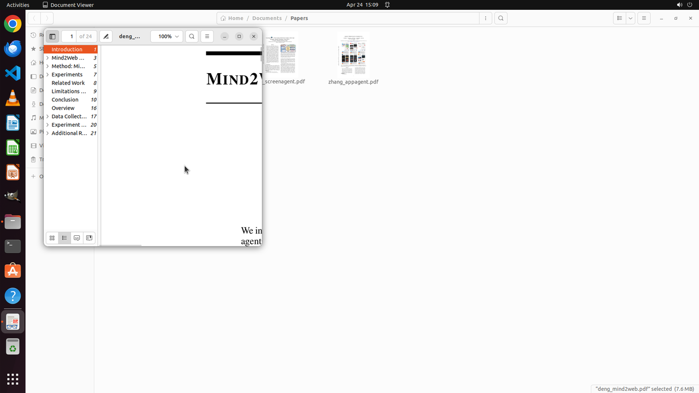

**Response:**
```
The document viewer window is too narrow to see the full content. Let me use a different approach - I'll use the terminal to extract text from the PDFs, which will be much more efficient.
```

**Actions:** `pyautogui.click(699, 100)`

---

## Step 9

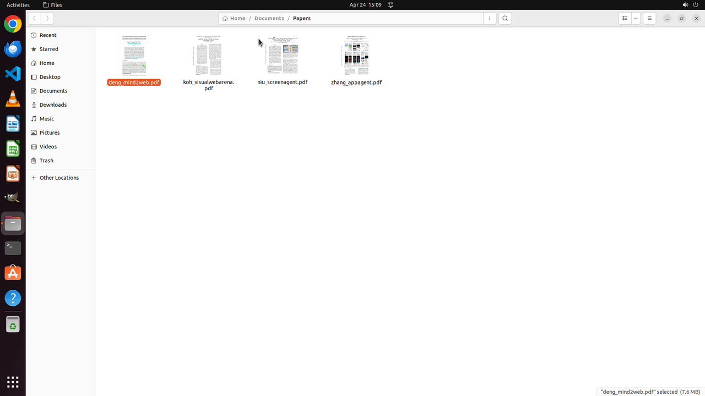

**Response:**
```
Let me open a terminal to extract text from the PDFs more efficiently.
```

**Actions:** `pyautogui.click(33, 673)`

---

## Step 10

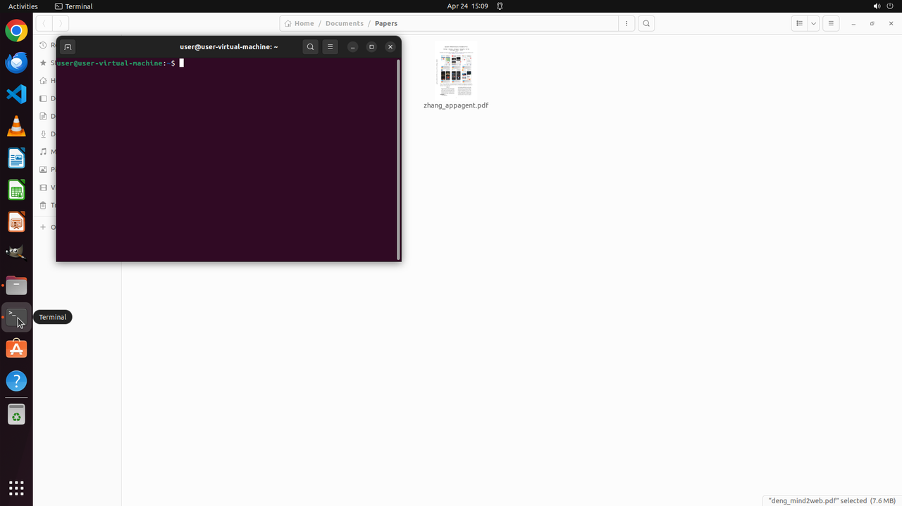

**Response:**
```
Good, I have a terminal open. Let me extract text from the first page of each PDF to find author information.
```

**Actions:** `import subprocess, shlex; subprocess.run(f'xdotool type --delay 12 -- ' + shlex.quote('pdftotext -f 1 -l 1 ~/Documents/Papers/deng_mind2w'), shell=True, check=True)
import time; time.sleep(0.05)
impor`

---

## Step 11

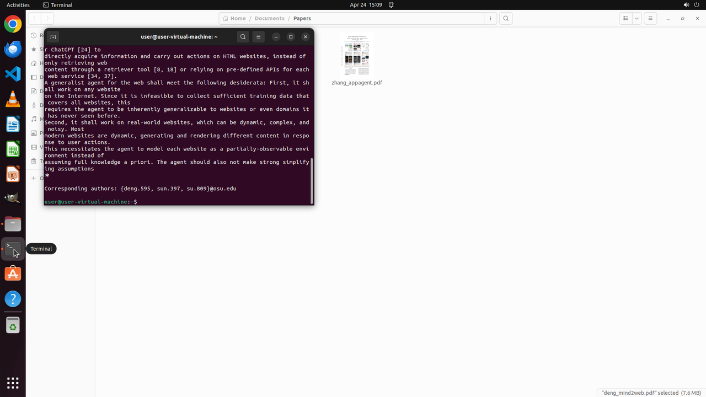

**Response:**
```
I can see the corresponding authors' email. Let me scroll up to see the beginning of the extracted text to find the author names and affiliations.
```

**Actions:** `pyautogui.scroll(5, 480, 300)`

---

## Step 12

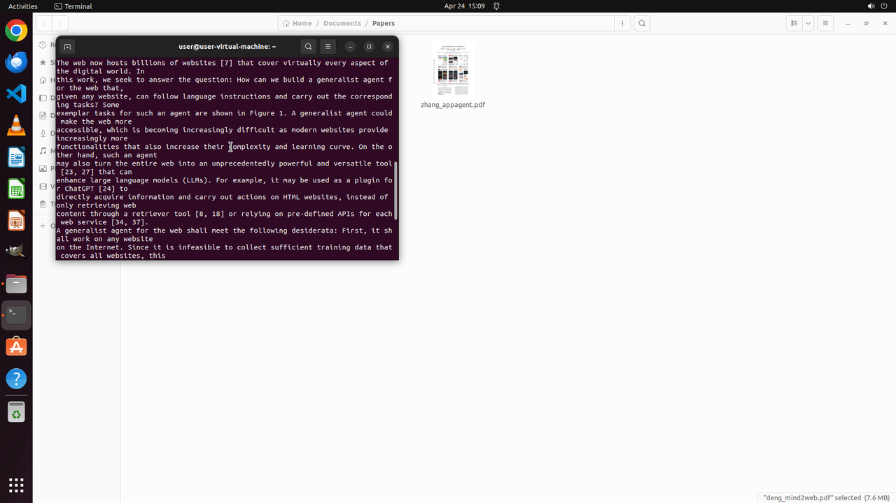

**Response:**
```
I need to scroll up more to see the author names and affiliations at the top of the page.
```

**Actions:** `pyautogui.scroll(10, 480, 300)`

---

## Step 13

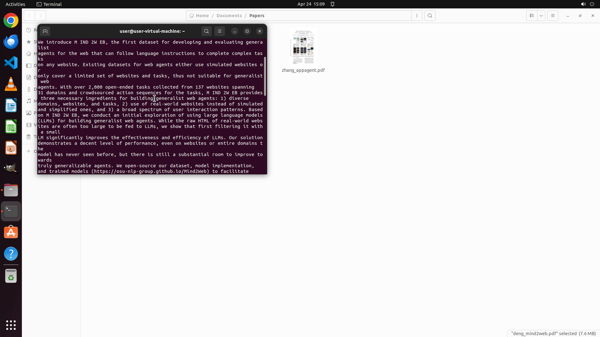

**Response:**
```
I can see the abstract but need to scroll up more to see the author names and affiliations.
```

**Actions:** `pyautogui.scroll(10, 480, 300)`

---

## Step 14

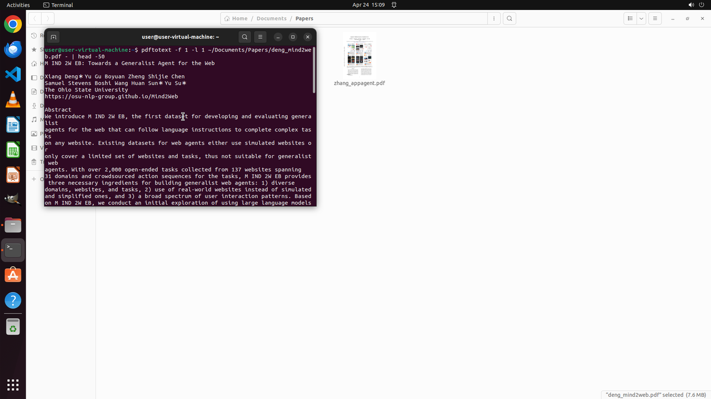

**Response:**
```
Now I can see the first paper's details:
- **Paper**: MIND2WEB: Towards a Generalist Agent for the Web
- **First author**: Xiang Deng
- **Affiliation**: The Ohio State University
- **Email**: deng.595@osu.edu (from the corresponding authors line)

Now let me extract text from the second paper.
```

**Actions:** `import subprocess, shlex; subprocess.run(f'xdotool type --delay 12 -- ' + shlex.quote('pdftotext -f 1 -l 1 ~/Documents/Papers/koh_visualw'), shell=True, check=True)
import time; time.sleep(0.05)
impor`

---

## Step 15

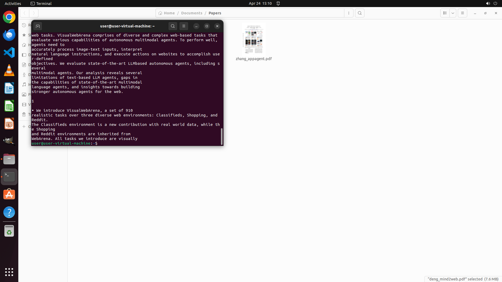

**Response:**
```
I need to scroll up to see the author information at the top of this paper's output.
```

**Actions:** `pyautogui.scroll(10, 480, 300)`

---

## Step 16

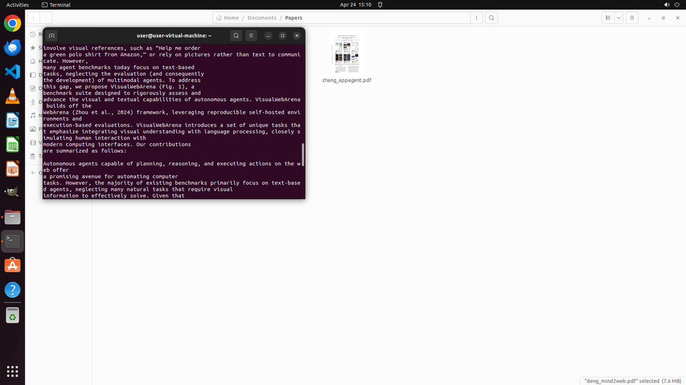

**Response:**
```
I need to scroll up more to see the author names at the very beginning of the output.
```

**Actions:** `pyautogui.scroll(15, 480, 300)`

---

## Step 17

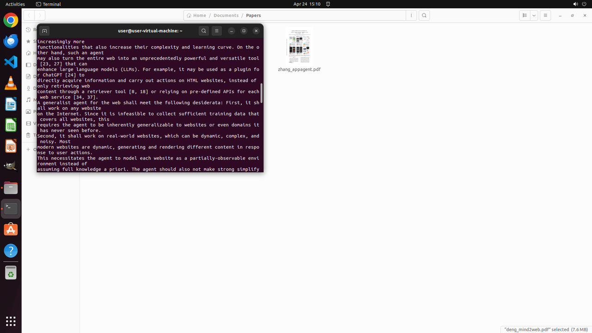

**Response:**
```
This is still showing the first paper's content. Let me try a different approach and extract more lines to see the full output for the second paper, and also look at the PDFs more carefully. Let me use a more targeted approach.
```

**Actions:** `import subprocess, shlex; subprocess.run(f'xdotool type --delay 12 -- ' + shlex.quote('pdftotext -f 1 -l 1 ~/Documents/Papers/koh_visualw'), shell=True, check=True)
import time; time.sleep(0.05)
impor`

---

## Step 18


**Response:**
```
Now I can see the second paper's details:
- **Paper**: VisualWebArena: Evaluating Multimodal Agents on Realistic Visually Grounded Web Tasks
- **First author**: Jing Yu Koh
- **Affiliation**: Carnegie Mellon University
- **Email**: jingyuk@cs.cmu.edu (from the email list {jingyuk,rsalakhu,dfried}@cs.cmu.edu)

Now let me extract the third paper.
```

**Actions:** `import subprocess, shlex; subprocess.run(f'xdotool type --delay 12 -- ' + shlex.quote('pdftotext -f 1 -l 1 ~/Documents/Papers/niu_screena'), shell=True, check=True)
import time; time.sleep(0.05)
impor`

---

## Step 19

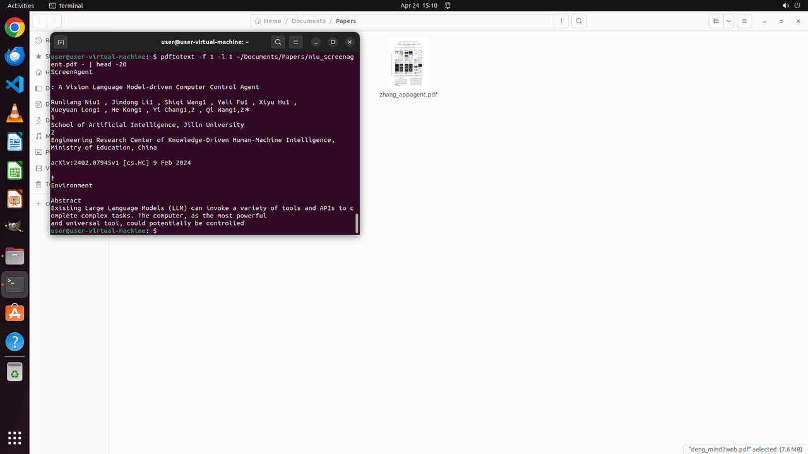

**Response:**
```
Now I can see the third paper's details:
- **Paper**: ScreenAgent: A Vision Language Model-driven Computer Control Agent
- **First author**: Runliang Niu
- **Affiliation**: School of Artificial Intelligence, Jilin University
- **Email**: I need to find the email. Let me check for more text.
```

**Actions:** `import subprocess, shlex; subprocess.run(f'xdotool type --delay 12 -- ' + shlex.quote('pdftotext -f 1 -l 1 ~/Documents/Papers/niu_screena'), shell=True, check=True)
import time; time.sleep(0.05)
impor`

---

## Step 20

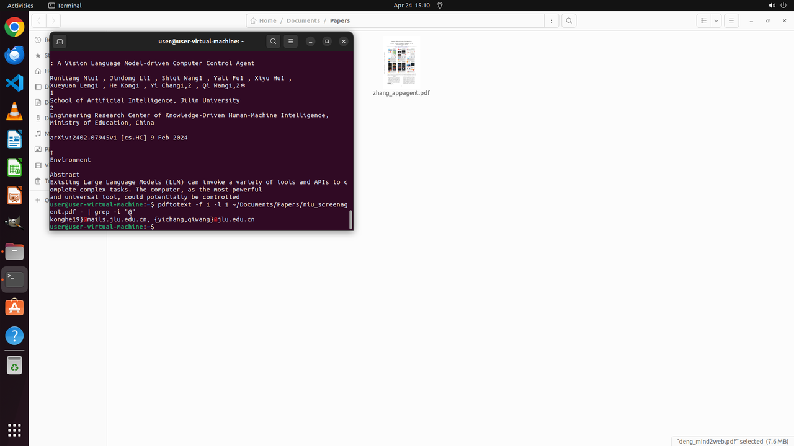

**Response:**
```
Now I can see the email addresses for the third paper. The first author is Runliang Niu, with affiliation 1 (School of Artificial Intelligence, Jilin University). The email line shows: `konghe19}@mails.jlu.edu.cn, {yichang,qiwang}@jlu.edu.cn`. I need to figure out Runliang Niu's email. Let me get more context on the email line.
```

**Actions:** `import subprocess, shlex; subprocess.run(f'xdotool type --delay 12 -- ' + shlex.quote('pdftotext -f 1 -l 2 ~/Documents/Papers/niu_screena'), shell=True, check=True)
import time; time.sleep(0.05)
impor`

---

## Step 21

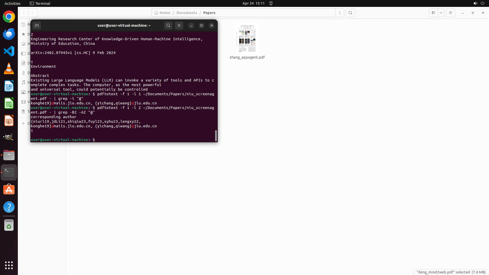

**Response:**
```
Now I can see the email addresses more clearly. The email line shows:
`{niurl19,jdl121,shiqiw23,fuyl23,xyhu23,lengxy22,konghe19}@mails.jlu.edu.cn, {yichang,qiwang}@jlu.edu.cn`

The first author is Runliang Niu, and based on the order, their email is `niurl19@mails.jlu.edu.cn`.

Now let me check the remaining papers. Let me first see what papers are in the folder.
```

**Actions:** `import subprocess, shlex; subprocess.run(f'xdotool type --delay 12 -- ' + shlex.quote('ls ~/Documents/Papers/\n'), shell=True, check=True)
import time; time.sleep(0.05)`

---

## Step 22

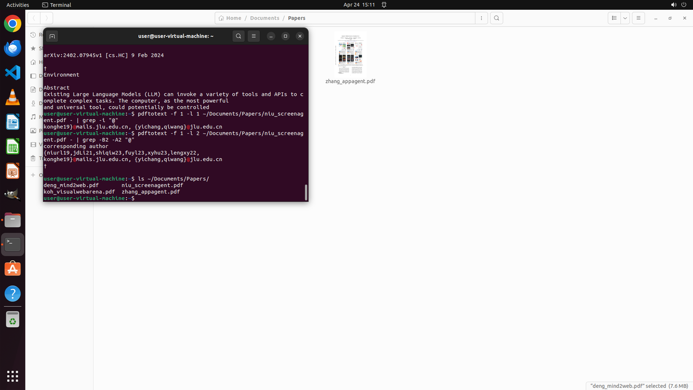

**Response:**
```
I can see there are 4 papers in the folder:
1. deng_mind2web.pdf
2. niu_screenagent.pdf
3. koh_visualwebarena.pdf
4. zhang_appagent.pdf

I've already extracted info from the first 3. Now let me extract the last one.
```

**Actions:** `import subprocess, shlex; subprocess.run(f'xdotool type --delay 12 -- ' + shlex.quote('pdftotext -f 1 -l 1 ~/Documents/Papers/zhang_appag'), shell=True, check=True)
import time; time.sleep(0.05)
impor`

---

## Step 23


**Response:**
```
Now I have all the information for the fourth paper:
- **Paper**: AppAgent: Multimodal Agents as Smartphone Users
- **First author**: Chi Zhang
- **Affiliation**: Tencent
- **Email**: johnczhang@tencent.com (first in the email list)

Now I have all the data I need. Let me summarize:

1. **Xiang Deng** - deng.595@osu.edu - The Ohio State University
2. **Jing Yu Koh** - jingyuk@cs.cmu.edu - Carnegie Mellon University
3. **Runliang Niu** - niurl19@mails.jlu.edu.cn - School of Artificial Intelligence, Jilin University
4. **Chi Zhang** - johnczhang@tencent.com - Tencent

Now let me create the Excel file with Python, sorted alphabetically by full name.
```

**Actions:** `import subprocess, shlex; subprocess.run(f'xdotool type --delay 12 -- ' + shlex.quote("python3 << 'EOF'\nimport openpyxl\n\nwb = openpyxl.Wo"), shell=True, check=True)
import time; time.sleep(0.05)
im`

---

## Step 24

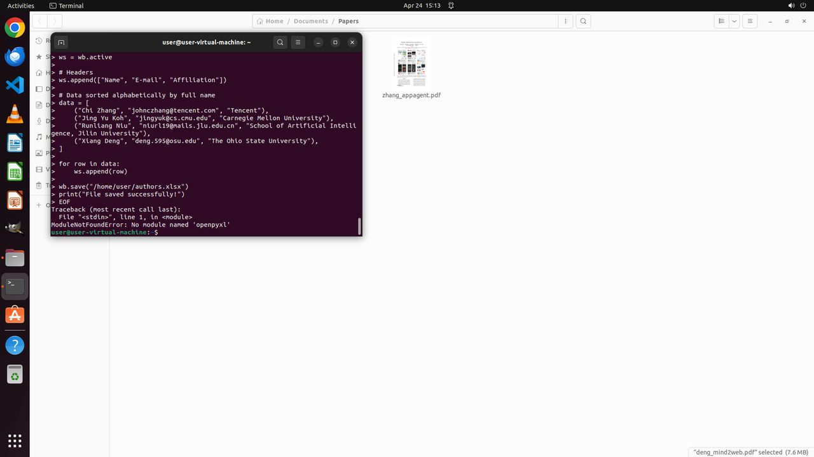

**Response:**
```
The `openpyxl` module is not installed. Let me install it first.
```

**Actions:** `import subprocess, shlex; subprocess.run(f'xdotool type --delay 12 -- ' + shlex.quote('pip3 install openpyxl\n'), shell=True, check=True)
import time; time.sleep(0.05)`

---

## Step 25

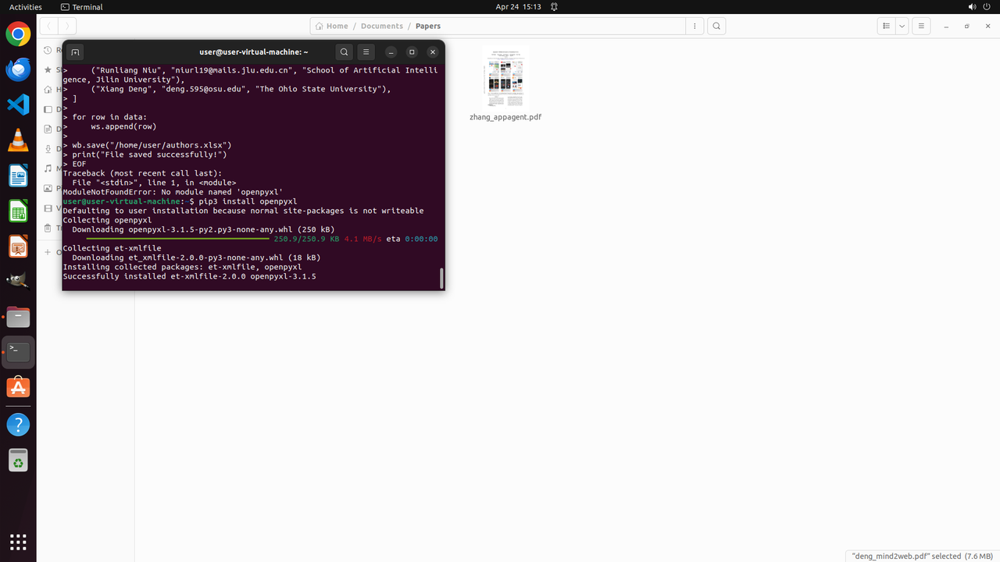

**Response:**
```
`openpyxl` is now installed. Let me run the Python script again to create the Excel file.
```

**Actions:** `import subprocess, shlex; subprocess.run(f'xdotool type --delay 12 -- ' + shlex.quote("python3 << 'EOF'\nimport openpyxl\n\nwb = openpyxl.Wo"), shell=True, check=True)
import time; time.sleep(0.05)
im`

---

## Step 26

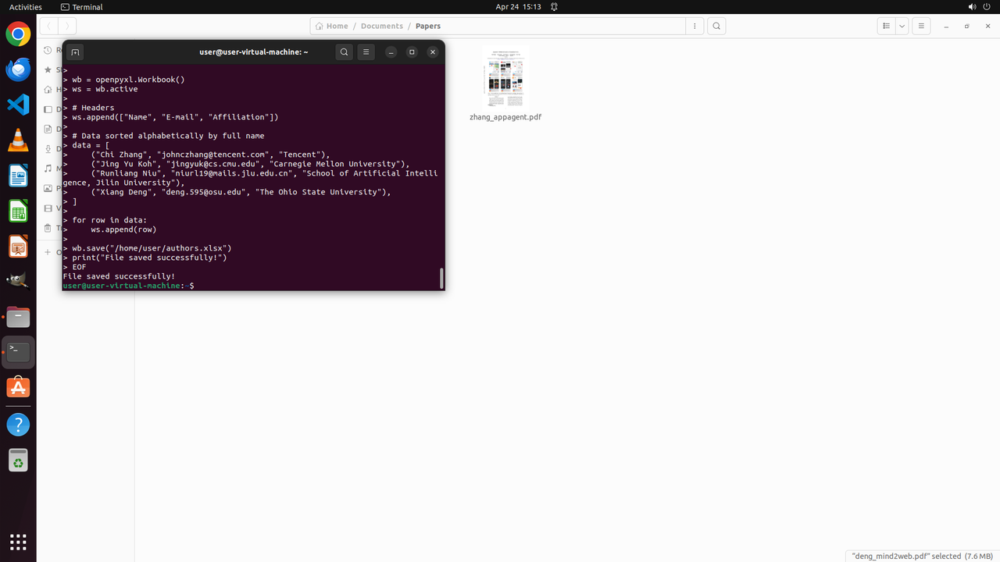

**Response:**
```
The file has been saved successfully. Let me verify the file was created correctly by reading it back.
```

**Actions:** `import subprocess, shlex; subprocess.run(f'xdotool type --delay 12 -- ' + shlex.quote('python3 -c "\nimport openpyxl\nwb = openpyxl.load_wo'), shell=True, check=True)
import time; time.sleep(0.05)
imp`

---

## Step 27

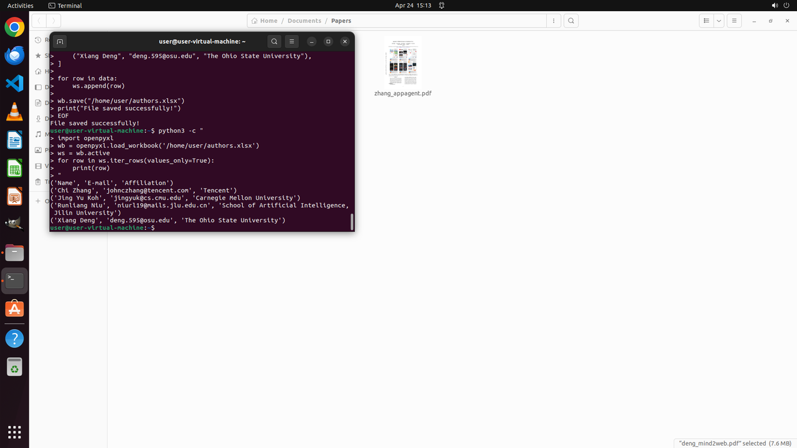

**Response:**
```
The Excel file has been created and verified successfully. The contents are:

| Name | E-mail | Affiliation |
|------|--------|-------------|
| Chi Zhang | johnczhang@tencent.com | Tencent |
| Jing Yu Koh | jingyuk@cs.cmu.edu | Carnegie Mellon University |
| Runliang Niu | niurl19@mails.jlu.edu.cn | School of Artificial Intelligence, Jilin University |
| Xiang Deng | deng.595@osu.edu | The Ohio State University |

The authors are sorted alphabetically by their full names, and the file is saved as `~/authors.xlsx`.

DONE
```

**Actions:** `DONE`

---
