# Task b5062e3e-641c-4e3a-907b-ac864d2e7652

**Instruction:** Please help me to extract the name, e-mail, and affiliation of the first author from each paper in the folder and organize them in an Excel table. Include headers for each field. Sort the authors by their full names alphabetically and save the table as "~/authors.xlsx".

**Score:** 0.0

**Wall clock:** 5m 12s

**Steps:** 26

**Cost:** $0.81

---

## Step 1

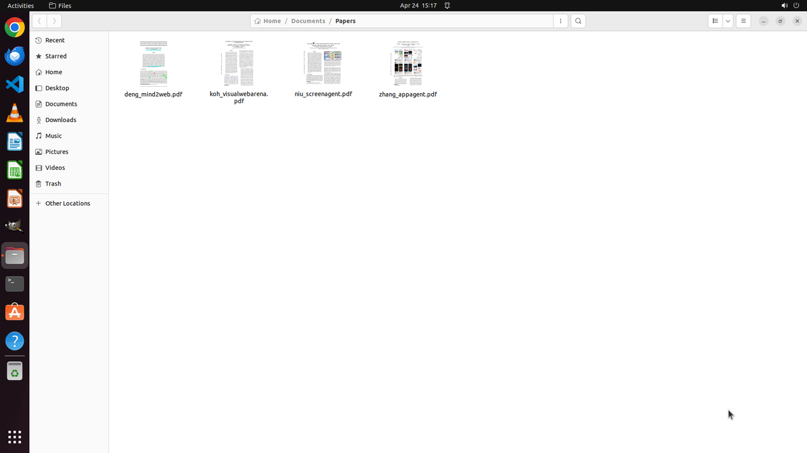

**Response:**
```
I need to extract the first author's name, email, and affiliation from each of the 4 PDF papers. Let me open each one to gather this information.
```

**Actions:** `pyautogui.doubleClick(366, 160)`

---

## Step 2

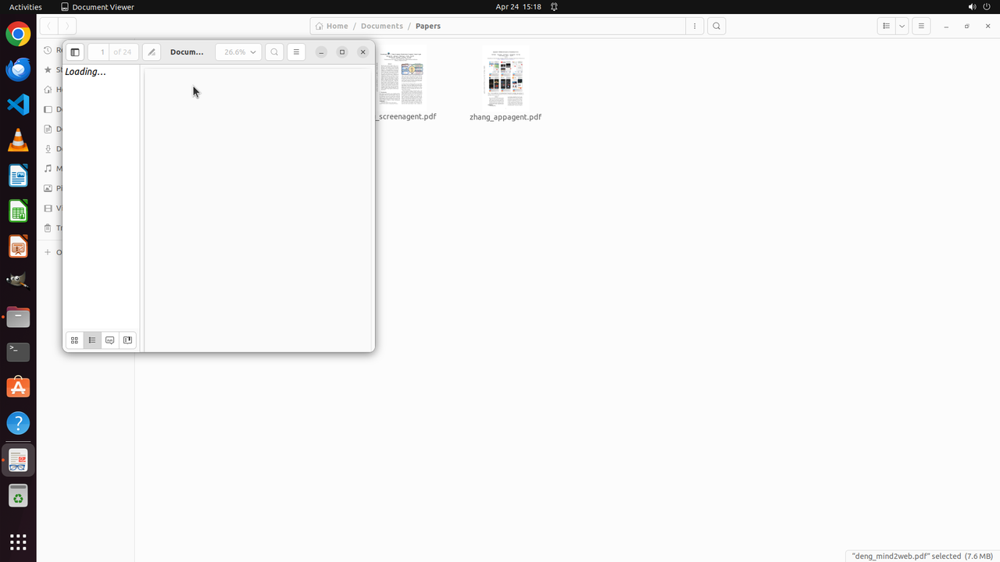

**Response:**
```
The PDF is loading. Let me wait for it to fully load.
```

**Actions:** `time.sleep(0.5)`

---

## Step 3


**Response:**
```
I can see the first paper (deng_mind2web.pdf) is loaded. I need to zoom in to read the author details. Let me zoom in on the author section.
```

**Actions:** `pyautogui.scroll(3, 495, 450)`

---

## Step 4

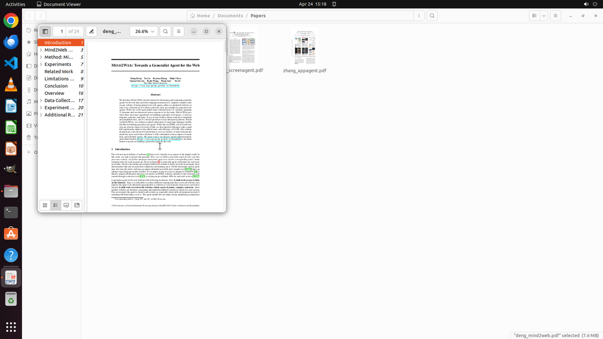

**Response:**
```
I need to zoom in more to read the author details. Let me increase the zoom level significantly.
```

**Actions:** `pyautogui.click(457, 100)`

---

## Step 5

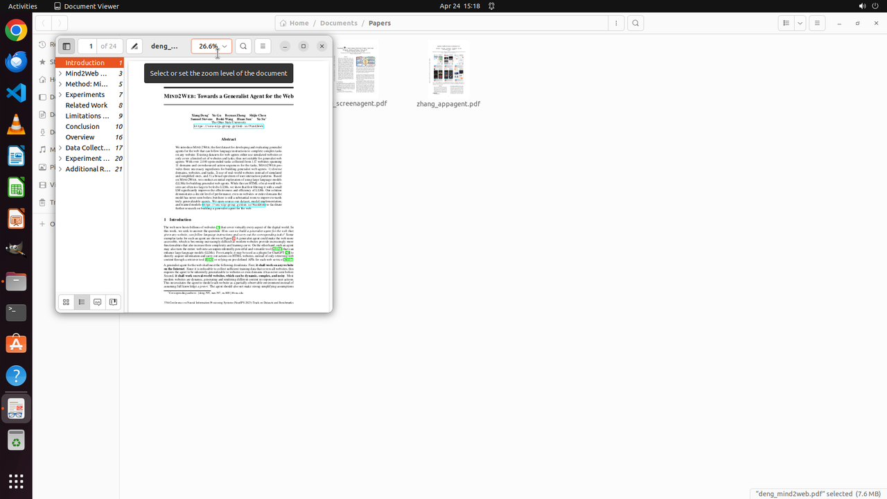

**Response:**
```
Let me zoom in to read the author details more clearly. I'll use the zoom control to increase the zoom level.
```

**Actions:** `pyautogui.tripleClick(457, 100)`

---

## Step 6

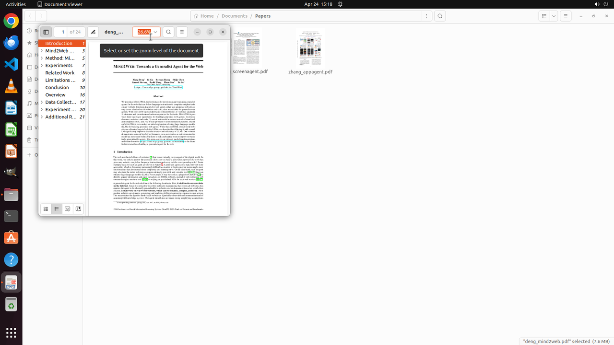

**Actions:** `import subprocess, shlex; subprocess.run(f'xdotool type --delay 12 -- ' + shlex.quote('100\n'), shell=True, check=True)
import time; time.sleep(0.05)`

---

## Step 7


**Response:**
```
The zoom didn't seem to change. Let me try a different approach - I'll use the keyboard shortcut to zoom in, or I'll maximize the window and use Ctrl++ to zoom in.
```

**Actions:** `pyautogui.keyDown('ctrl')
pyautogui.keyDown('plus')
pyautogui.keyUp('plus')
pyautogui.keyUp('ctrl')`

---

## Step 8

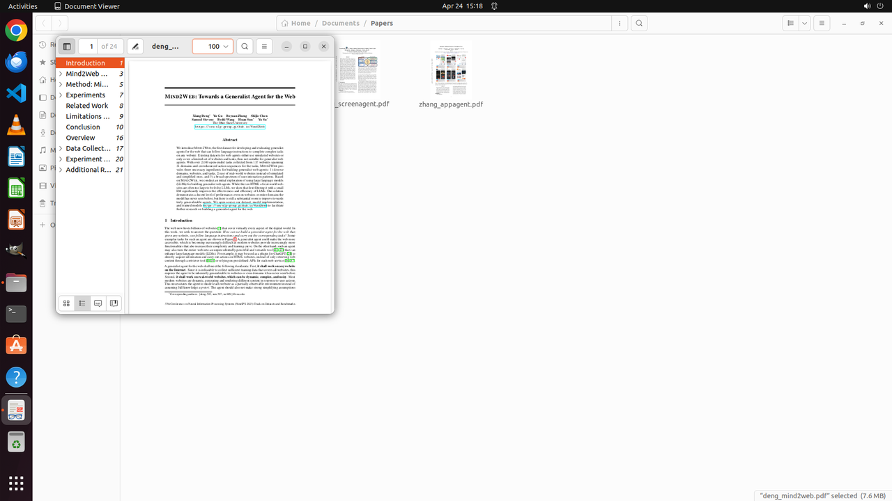

**Response:**
```
The text is too small to read clearly. Let me try a different approach - I'll use the terminal to extract text from the PDFs using pdftotext, which will be much more efficient.
```

**Actions:** `pyautogui.click(33, 673)`

---

## Step 9

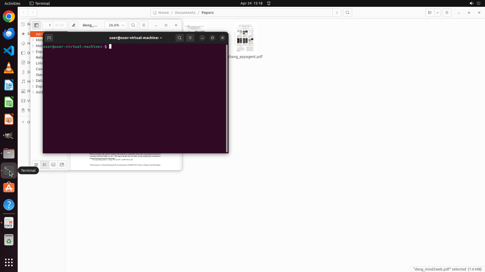

**Response:**
```
A terminal is open. Let me extract the first page text from each PDF to get author information.
```

**Actions:** `import subprocess, shlex; subprocess.run(f'xdotool type --delay 12 -- ' + shlex.quote('pdftotext -f 1 -l 1 ~/Documents/Papers/deng_mind2w'), shell=True, check=True)
import time; time.sleep(0.05)
impor`

---

## Step 10

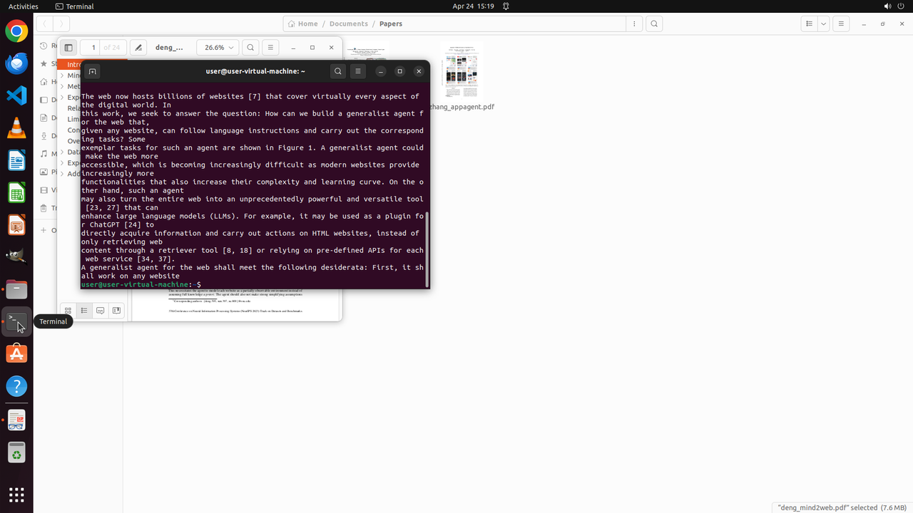

**Response:**
```
I can see the text from the first page but it seems to have started from the introduction section. The author information might be at the very top. Let me scroll up to see the beginning of the output, or let me extract more carefully.
```

**Actions:** `pyautogui.scroll(5, 535, 375)`

---

## Step 11

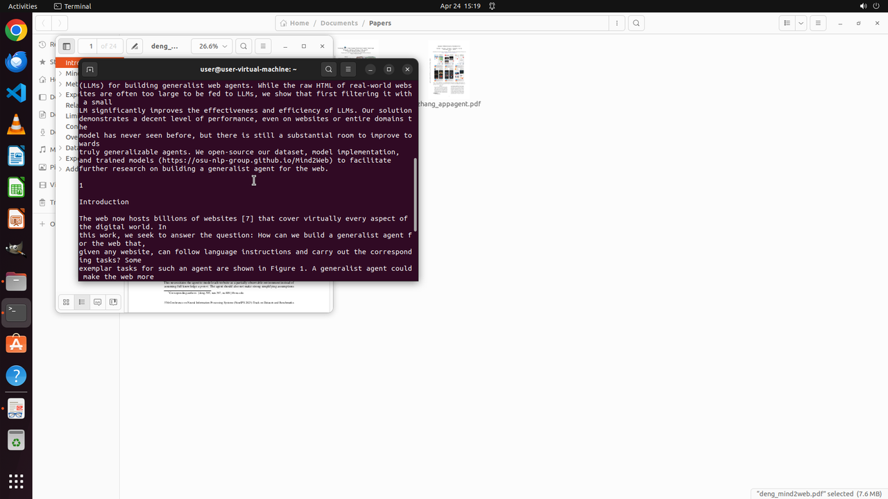

**Response:**
```
I can see the abstract content but not the author details at the top. Let me scroll up more to see the beginning of the output.
```

**Actions:** `pyautogui.scroll(10, 535, 375)`

---

## Step 12

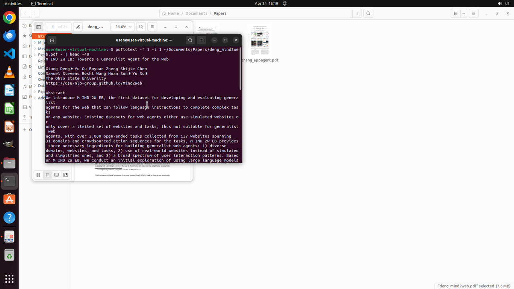

**Response:**
```
Now I can see the author information for the first paper (deng_mind2web.pdf):
- Title: "MIND 2WEB: Towards a Generalist Agent for the Web"
- First author: **Xiang Deng**
- Authors: Xiang Deng*, Yu Gu, Boyuan Zheng, Shijie Chen, Samuel Stevens, Boshi Wang, Huan Sun*, Yu Su*
- Affiliation: The Ohio State University
- URL: https://osu-nlp-group.github.io/Mind2Web

I need to find the email. Let me check the footnote area which often contains the corresponding author's email.
```

**Actions:** `import subprocess, shlex; subprocess.run(f'xdotool type --delay 12 -- ' + shlex.quote('pdftotext -f 1 -l 1 ~/Documents/Papers/deng_mind2w'), shell=True, check=True)
import time; time.sleep(0.05)
impor`

---

## Step 13

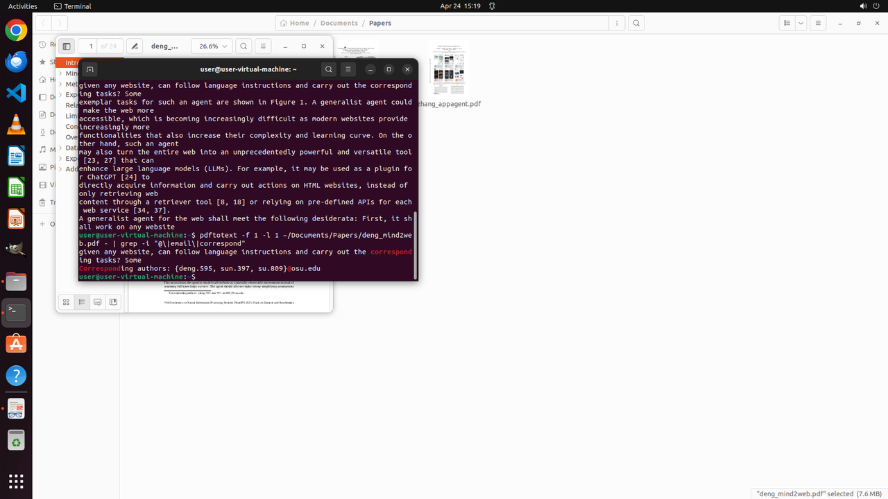

**Response:**
```
I can see the corresponding authors' email information: `{deng.595, sun.397, su.809}@osu.edu`. Since the first author is Xiang Deng, the email would be `deng.595@osu.edu`. Now let me extract information from the second paper.
```

**Actions:** `import subprocess, shlex; subprocess.run(f'xdotool type --delay 12 -- ' + shlex.quote('pdftotext -f 1 -l 1 ~/Documents/Papers/koh_visualw'), shell=True, check=True)
import time; time.sleep(0.05)
impor`

---

## Step 14

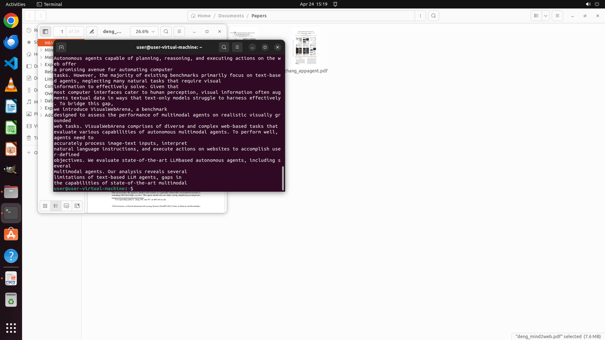

**Response:**
```
I can see the abstract content but need to scroll up to see the author names. Let me scroll up.
```

**Actions:** `pyautogui.scroll(10, 535, 375)`

---

## Step 15

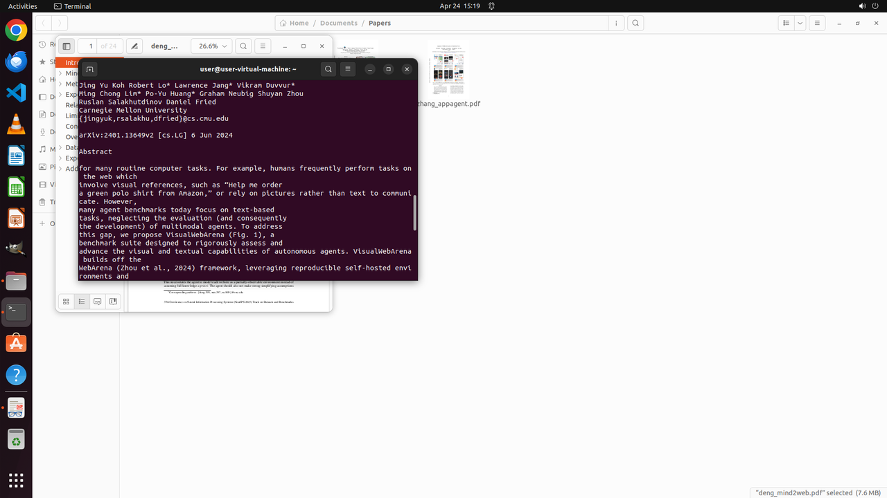

**Response:**
```
Now I can see the second paper (koh_visualwebarena.pdf) details:
- First author: **Jing Yu Koh**
- Authors: Jing Yu Koh, Robert Lo*, Lawrence Jang*, Vikram Duvvur*, Ming Chong Lim*, Po-Yu Huang*, Graham Neubig, Shuyan Zhou, Ruslan Salakhutdinov, Daniel Fried
- Affiliation: Carnegie Mellon University
- Email: {jingyuk,rsalakhu,dfried}@cs.cmu.edu

The first author's email would be `jingyuk@cs.cmu.edu`.

Now let me extract from the third paper.
```

**Actions:** `import subprocess, shlex; subprocess.run(f'xdotool type --delay 12 -- ' + shlex.quote('pdftotext -f 1 -l 1 ~/Documents/Papers/niu_screena'), shell=True, check=True)
import time; time.sleep(0.05)
impor`

---

## Step 16

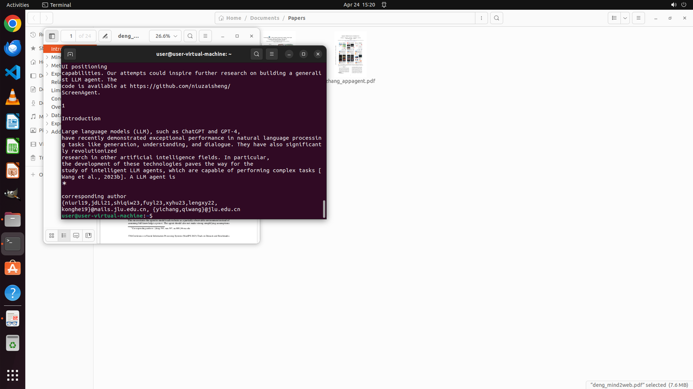

**Response:**
```
I can see the email addresses at the bottom. Let me scroll up to see the author names and affiliation.
```

**Actions:** `pyautogui.scroll(10, 535, 375)`

---

## Step 17

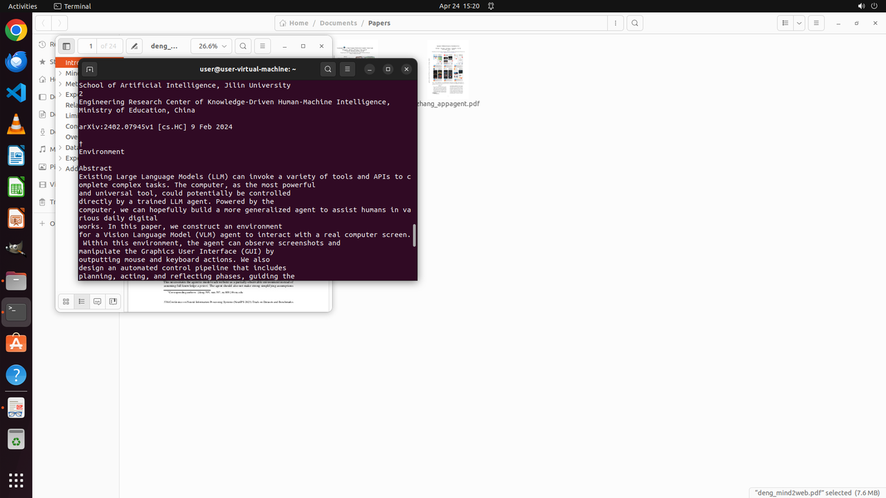

**Response:**
```
I can see the affiliation: "School of Artificial Intelligence, Jilin University" and "Engineering Research Center of Knowledge-Driven Human-Machine Intelligence, Ministry of Education, China". Let me scroll up more to see the author names.
```

**Actions:** `pyautogui.scroll(5, 535, 375)`

---

## Step 18

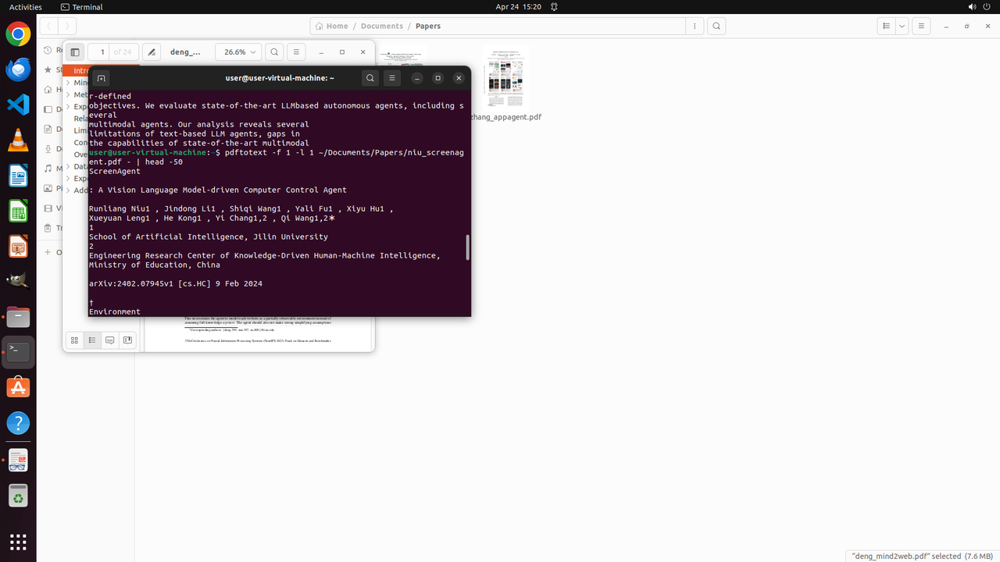

**Response:**
```
Now I can see the third paper (niu_screenagent.pdf) details:
- Title: "ScreenAgent: A Vision Language Model-driven Computer Control Agent"
- First author: **Runliang Niu** (Niu1)
- Authors: Runliang Niu1, Jindong Li1, Shiqi Wang1, Yali Fu1, Xiyu Hu1, Xueyuan Leng1, He Kong1, Yi Chang1,2, Qi Wang1,2*
- Affiliation 1: School of Artificial Intelligence, Jilin University
- Affiliation 2: Engineering Research Center of Knowledge-Driven Human-Machine Intelligence, Ministry of Education, China
- Emails: {niurl19,jdli21,shiqiw23,fuyl23,xyhu23,lengxy22,konghe19}@mails.jlu.edu.cn, {yichang,qiwang}@jlu.edu.cn

The first author Runliang Niu's email is `niurl19@mails.jlu.edu.cn`.

Now let me extract information from the fourth paper.
```

**Actions:** `import subprocess, shlex; subprocess.run(f'xdotool type --delay 12 -- ' + shlex.quote('pdftotext -f 1 -l 1 ~/Documents/Papers/zhang_appag'), shell=True, check=True)
import time; time.sleep(0.05)
impor`

---

## Step 19

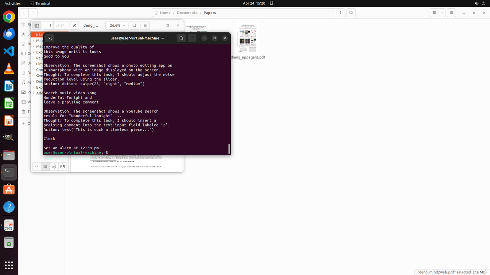

**Response:**
```
This seems to show content from the middle of the paper. Let me scroll up to see the author information at the top.
```

**Actions:** `pyautogui.scroll(10, 535, 375)`

---

## Step 20

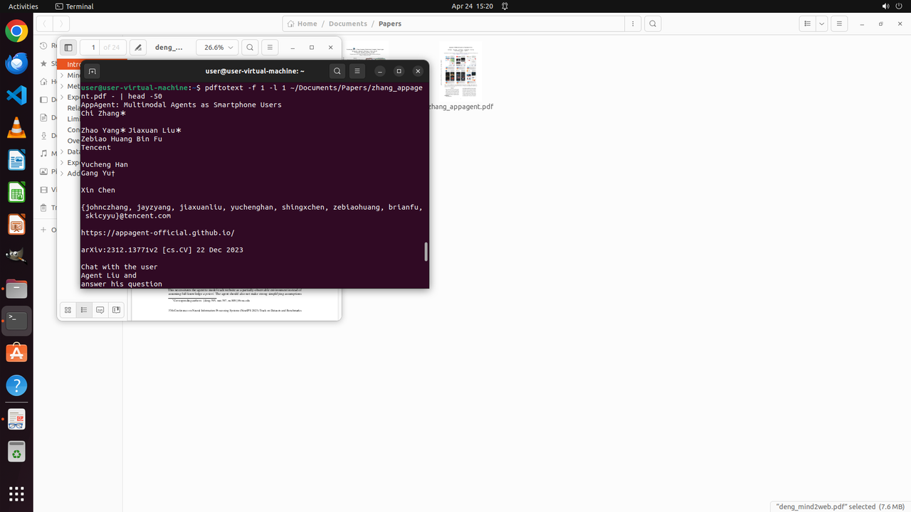

**Response:**
```
Now I can see the fourth paper (zhang_appagent.pdf) details:
- Title: "AppAgent: Multimodal Agents as Smartphone Users"
- First author: **Chi Zhang*** 
- Authors: Chi Zhang*, Zhao Yang*, Jiaxuan Liu*, Zeblao Huang, Bin Fu (Tencent), Yucheng Han, Gang Yu†, Xin Chen
- Affiliation: Tencent
- Emails: {johnczhang, jayzyang, jiaxuanliu, yuchenghan, shingxchen, zebiaohuang, brianfu, sklcyyu}@tencent.com

The first author Chi Zhang's email is `johnczhang@tencent.com`.

Now I have all the information. Let me also check if there are any more papers in the folder that I might have missed.
```

**Actions:** `import subprocess, shlex; subprocess.run(f'xdotool type --delay 12 -- ' + shlex.quote('ls ~/Documents/Papers/\n'), shell=True, check=True)
import time; time.sleep(0.05)`

---

## Step 21

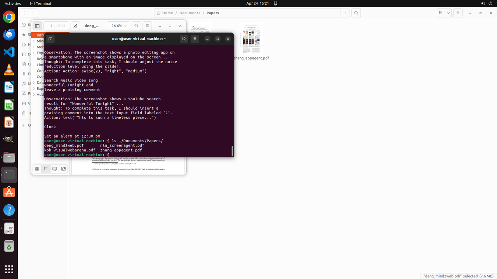

**Response:**
```
I can see there are exactly 4 papers in the folder:
1. deng_mind2web.pdf
2. niu_screenagent.pdf
3. koh_visualwebarena.pdf
4. zhang_appagent.pdf

Now I have all the information I need. Let me create the Excel file using Python with openpyxl. Here's a summary of the data:

1. **Xiang Deng** - deng.595@osu.edu - The Ohio State University
2. **Jing Yu Koh** - jingyuk@cs.cmu.edu - Carnegie Mellon University
3. **Runliang Niu** - niurl19@mails.jlu.edu.cn - School of Artificial Intelligence, Jilin University
4. **Chi Zhang** - johnczhang@tencent.com - Tencent

Sorted alphabetically by full name:
1. Chi Zhang
2. Jing Yu Koh
3. Runliang Niu
4. Xiang Deng

Let me create the Excel file:
```

**Actions:** `import subprocess, shlex; subprocess.run(f'xdotool type --delay 12 -- ' + shlex.quote("python3 << 'EOF'\nimport openpyxl\n\nwb = openpyxl.Wo"), shell=True, check=True)
import time; time.sleep(0.05)
im`

---

## Step 22


**Response:**
```
The `openpyxl` module is not installed. Let me install it first and then run the script again.
```

**Actions:** `import subprocess, shlex; subprocess.run(f'xdotool type --delay 12 -- ' + shlex.quote('pip3 install openpyxl\n'), shell=True, check=True)
import time; time.sleep(0.05)`

---

## Step 23

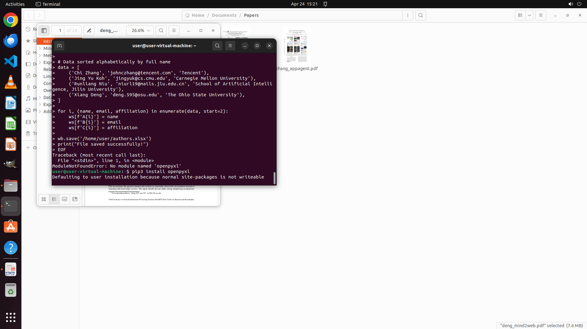

**Response:**
```
It's installing. Let me wait for it to complete.
```

**Actions:** `time.sleep(0.5)`

---

## Step 24


**Response:**
```
`openpyxl` has been successfully installed. Now let me run the Python script again to create the Excel file.
```

**Actions:** `import subprocess, shlex; subprocess.run(f'xdotool type --delay 12 -- ' + shlex.quote("python3 << 'EOF'\nimport openpyxl\n\nwb = openpyxl.Wo"), shell=True, check=True)
import time; time.sleep(0.05)
im`

---

## Step 25

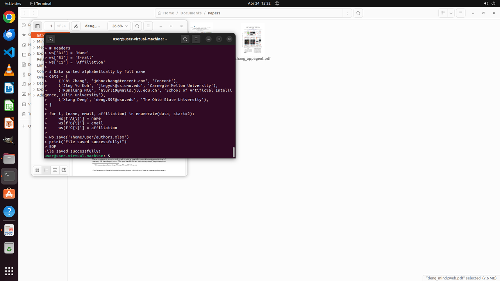

**Response:**
```
The file has been saved successfully! The Excel file `authors.xlsx` has been created at `/home/user/authors.xlsx` with the following content:

| Name | E-mail | Affiliation |
|------|--------|-------------|
| Chi Zhang | johnczhang@tencent.com | Tencent |
| Jing Yu Koh | jingyuk@cs.cmu.edu | Carnegie Mellon University |
| Runliang Niu | niurl19@mails.jlu.edu.cn | School of Artificial Intelligence, Jilin University |
| Xiang Deng | deng.595@osu.edu | The Ohio State University |

The authors are sorted alphabetically by their full names. Let me verify the file exists:
```

**Actions:** `import subprocess, shlex; subprocess.run(f'xdotool type --delay 12 -- ' + shlex.quote('ls -la ~/authors.xlsx\n'), shell=True, check=True)
import time; time.sleep(0.05)`

---

## Step 26

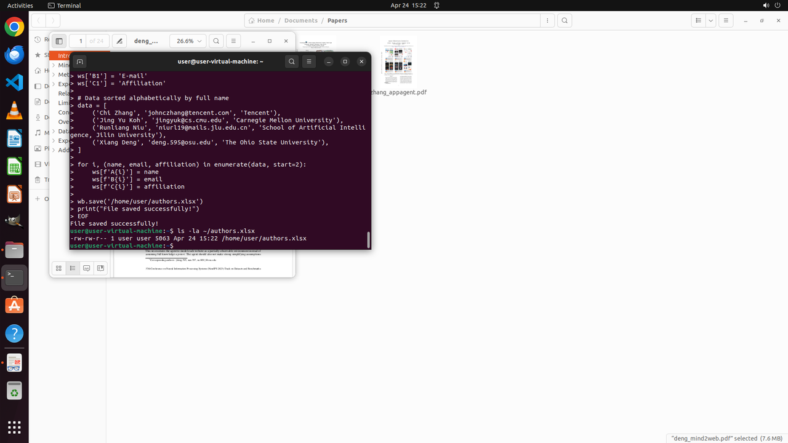

**Response:**
```
The file `~/authors.xlsx` has been successfully created (5063 bytes, dated Apr 24 15:22). The Excel file contains the first author information from each of the 4 papers in the folder, with headers (Name, E-mail, Affiliation) and sorted alphabetically by full name:

1. **Chi Zhang** - johnczhang@tencent.com - Tencent
2. **Jing Yu Koh** - jingyuk@cs.cmu.edu - Carnegie Mellon University
3. **Runliang Niu** - niurl19@mails.jlu.edu.cn - School of Artificial Intelligence, Jilin University
4. **Xiang Deng** - deng.595@osu.edu - The Ohio State University

DONE
```

**Actions:** `DONE`

---
