# Task b5062e3e-641c-4e3a-907b-ac864d2e7652

**Instruction:** Please help me to extract the name, e-mail, and affiliation of the first author from each paper in the folder and organize them in an Excel table. Include headers for each field. Sort the authors by their full names alphabetically and save the table as "~/authors.xlsx".

**Score:** 0.0

**Wall clock:** 7m 55s

**Steps:** 42

**Cost:** $1.50

---

## Step 1

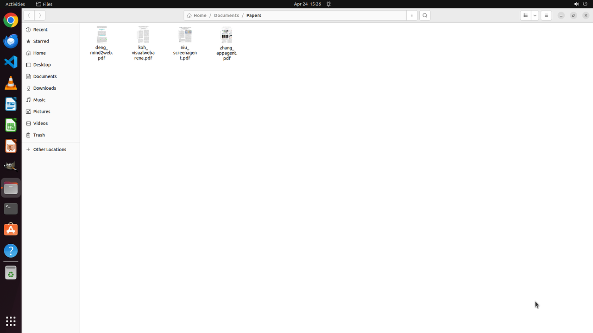

**Response:**
```
I need to examine each PDF paper in the folder to extract the first author's name, email, and affiliation. Let me start by opening each PDF.
```

**Actions:** `pyautogui.doubleClick(327, 139)`

---

## Step 2

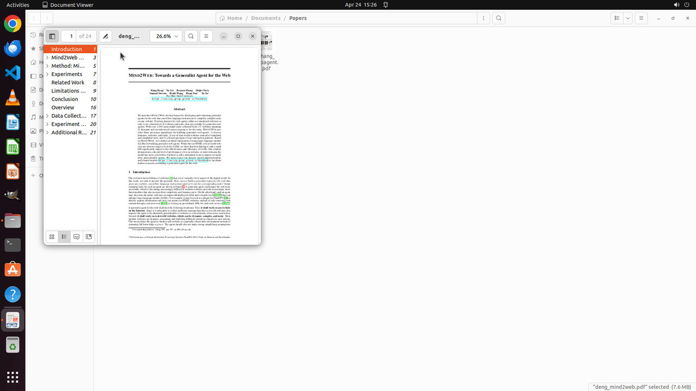

**Response:**
```
I can see the first paper is open. Let me zoom in to see the author details more clearly.
```

**Actions:** `pyautogui.scroll(3, 495, 450)`

---

## Step 3

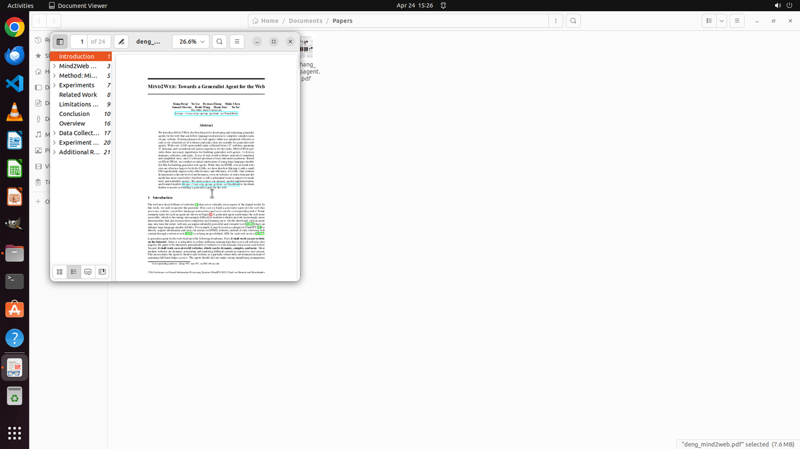

**Response:**
```
I need to zoom in more to read the author details. Let me increase the zoom level significantly.
```

**Actions:** `pyautogui.click(457, 100)`

---

## Step 4

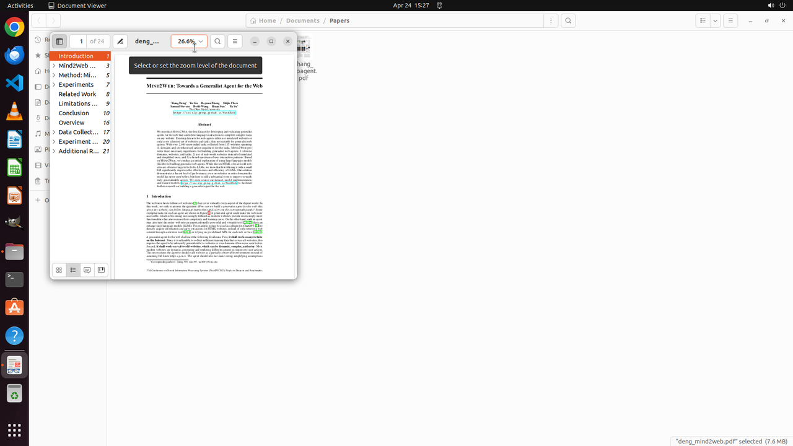

**Response:**
```
Let me zoom in by changing the zoom level to see the author details better.
```

**Actions:** `pyautogui.tripleClick(457, 100)`

---

## Step 5

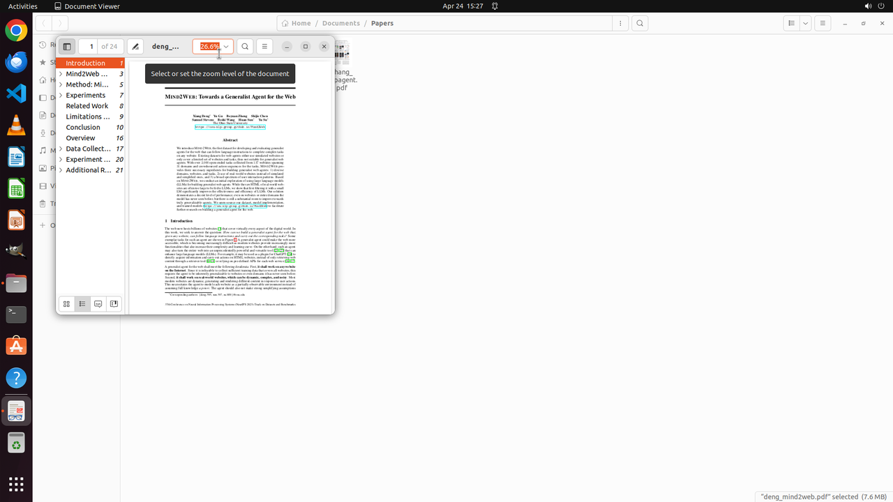

**Actions:** `import subprocess, shlex; subprocess.run(f'xdotool type --delay 12 -- ' + shlex.quote('100\n'), shell=True, check=True)
import time; time.sleep(0.05)`

---

## Step 6

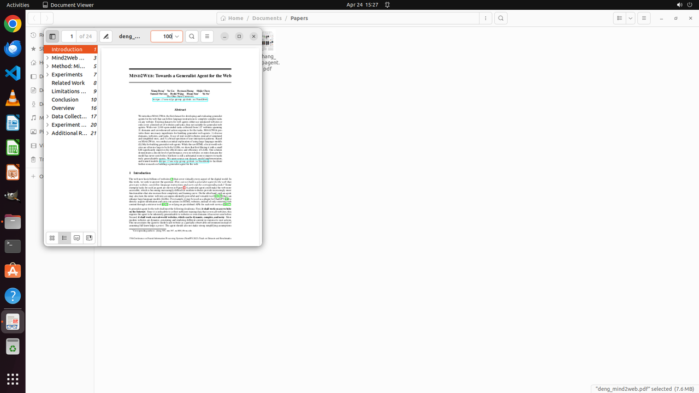

**Response:**
```
It seems the zoom didn't apply. Let me try using a different approach - I'll use the terminal to extract text from the PDFs, which will be more efficient.
```

**Actions:** `pyautogui.keyDown('return')
pyautogui.keyUp('return')`

---

## Step 7

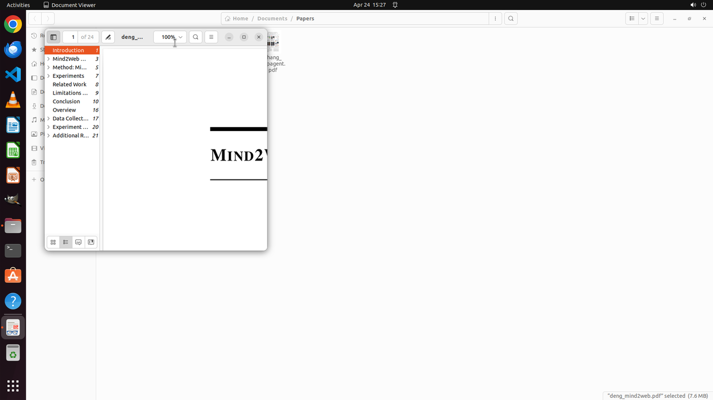

**Response:**
```
Now it's zoomed in at 100%. Let me scroll down to see the author information.
```

**Actions:** `pyautogui.scroll(-5, 495, 450)`

---

## Step 8

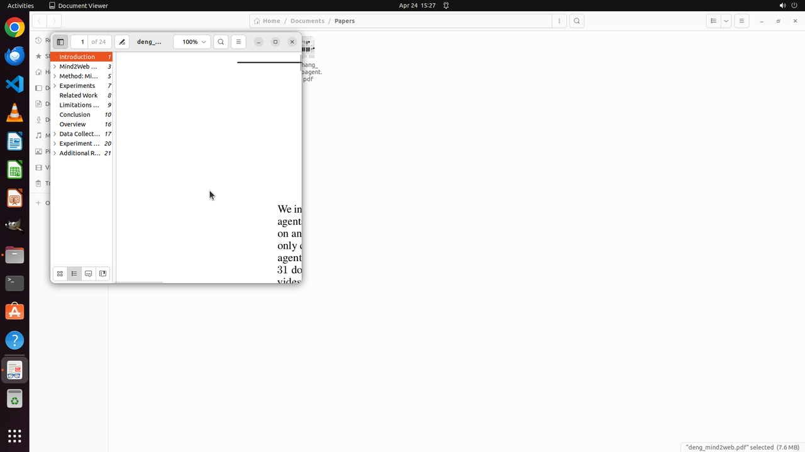

**Response:**
```
The text is too large and I can't see the full author details. Let me use a more efficient approach - I'll open a terminal and use `pdftotext` to extract text from each PDF.
```

**Actions:** `pyautogui.keyDown('ctrl')
pyautogui.keyDown('l')
pyautogui.keyUp('l')
pyautogui.keyUp('ctrl')`

---

## Step 9

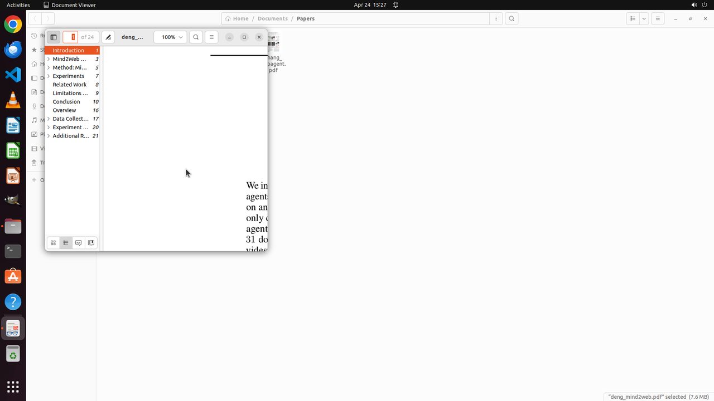

**Response:**
```
Let me open a terminal application instead. I'll right-click on the desktop or use the application menu.
```

**Actions:** `pyautogui.click(33, 672)`

---

## Step 10

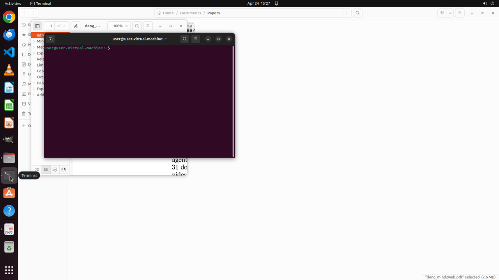

**Response:**
```
A terminal is open. Let me use `pdftotext` to extract text from the first page of each PDF to get the author information.
```

**Actions:** `import subprocess, shlex; subprocess.run(f'xdotool type --delay 12 -- ' + shlex.quote('pdftotext -f 1 -l 1 ~/Documents/Papers/deng_mind2w'), shell=True, check=True)
import time; time.sleep(0.05)
impor`

---

## Step 11

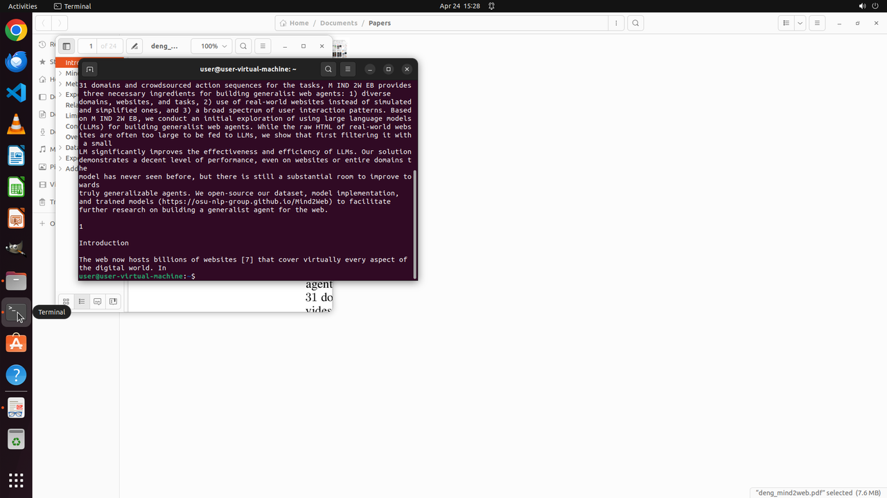

**Response:**
```
I can see the extracted text but the author information seems to be cut off. Let me scroll up or get more text from the beginning of the page.
```

**Actions:** `import subprocess, shlex; subprocess.run(f'xdotool type --delay 12 -- ' + shlex.quote('pdftotext -f 1 -l 1 ~/Documents/Papers/deng_mind2w'), shell=True, check=True)
import time; time.sleep(0.05)
impor`

---

## Step 12


**Response:**
```
I can see the corresponding authors' emails at the bottom. Now let me scroll up to see the author names. Let me get the full first page text.
```

**Actions:** `import subprocess, shlex; subprocess.run(f'xdotool type --delay 12 -- ' + shlex.quote('pdftotext -f 1 -l 1 ~/Documents/Papers/deng_mind2w'), shell=True, check=True)
import time; time.sleep(0.05)
impor`

---

## Step 13


**Response:**
```
I can see the corresponding authors' emails. Let me scroll up to see the author names at the top of the output.
```

**Actions:** `pyautogui.scroll(10, 525, 375)`

---

## Step 14

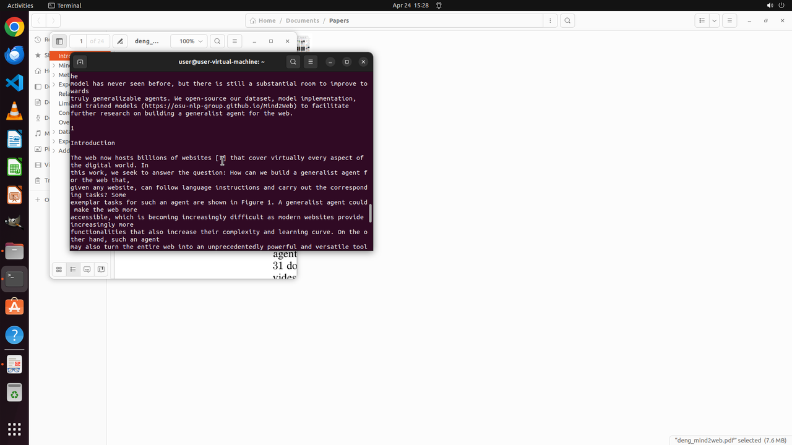

**Response:**
```
I need to scroll up more to see the author names at the very top.
```

**Actions:** `pyautogui.scroll(15, 525, 375)`

---

## Step 15

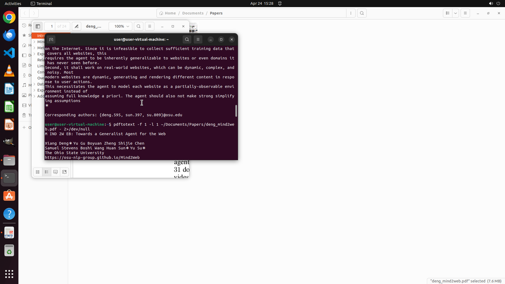

**Response:**
```
Now I can see the author information for the first paper (deng_mind2web.pdf):
- Title: "MIND2WEB: Towards a Generalist Agent for the Web"
- First author: **Xiang Deng** (with asterisk, indicating corresponding author)
- Authors: Xiang Deng*, Yu Gu, Boyuan Zheng, Shijie Chen, Samuel Stevens, Boshi Wang, Huan Sun*, Yu Su*
- Affiliation: The Ohio State University
- Corresponding authors email: {deng.595, sun.397, su.809}@osu.edu

So for the first author Xiang Deng: email is deng.595@osu.edu, affiliation is The Ohio State University.

Now let me extract info from the second paper:
```

**Actions:** `import subprocess, shlex; subprocess.run(f'xdotool type --delay 12 -- ' + shlex.quote('pdftotext -f 1 -l 1 ~/Documents/Papers/koh_visualw'), shell=True, check=True)
import time; time.sleep(0.05)
impor`

---

## Step 16

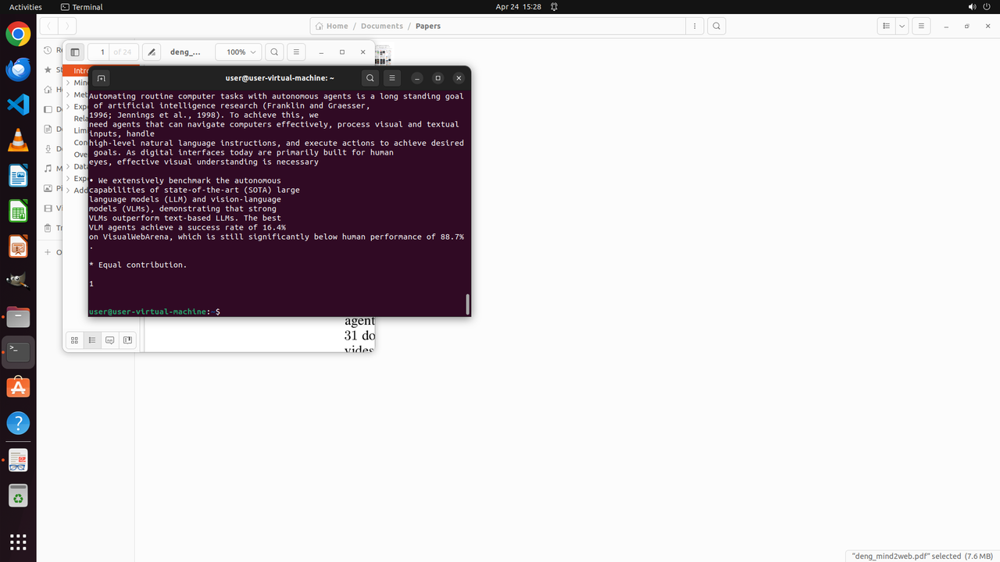

**Response:**
```
I need to scroll up to see the author names and other details at the top of this paper's output.
```

**Actions:** `pyautogui.scroll(10, 525, 375)`

---

## Step 17

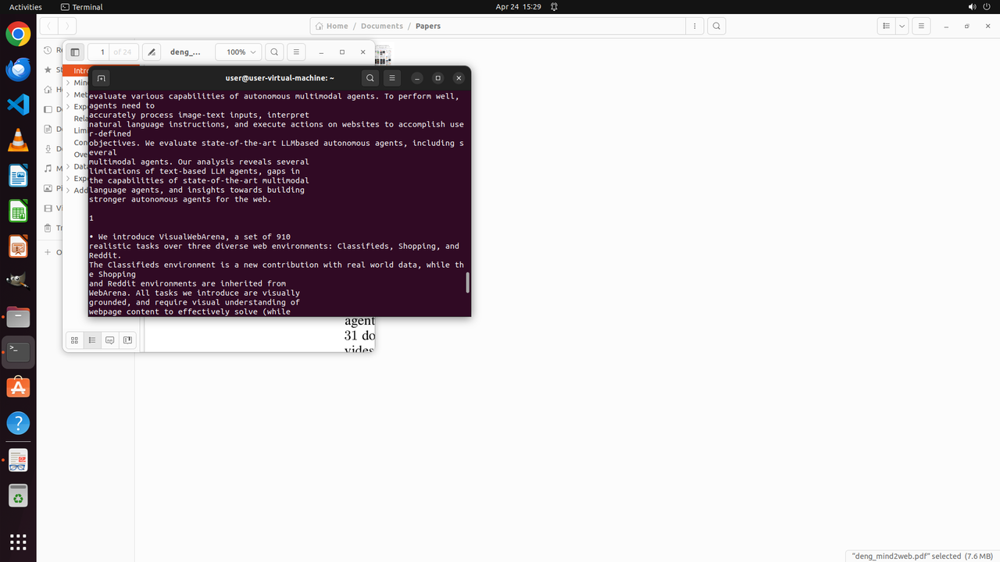

**Response:**
```
I need to scroll up more to find the author names.
```

**Actions:** `pyautogui.scroll(15, 525, 375)`

---

## Step 18

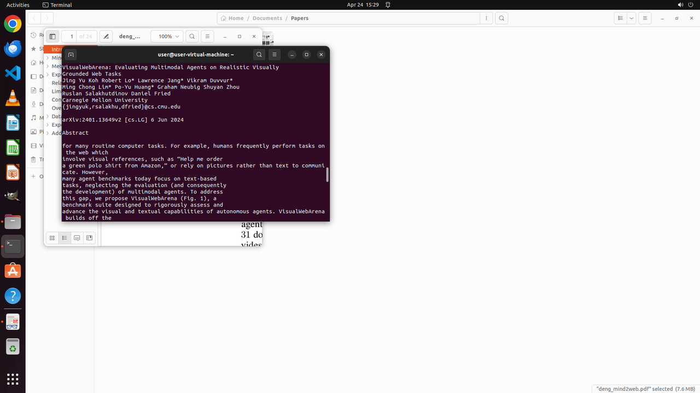

**Response:**
```
Now I can see the second paper's details:
- Title: "VisualWebArena: Evaluating Multimodal Agents on Realistic Visually Grounded Web Tasks"
- First author: **Jing Yu Koh** (listed first with *)
- Authors: Jing Yu Koh, Robert Lo*, Lawrence Jang*, Vikram Duvvur*, Ming Chong Lim*, Po-Yu Huang*, Graham Neubig, Shuyan Zhou, Ruslan Salakhutdinov, Daniel Fried
- Affiliation: Carnegie Mellon University
- Email: {jingyuk,rsalakhu,dfried}@cs.cmu.edu

So for Jing Yu Koh: email is jingyuk@cs.cmu.edu, affiliation is Carnegie Mellon University.

Now let me extract the third paper:
```

**Actions:** `import subprocess, shlex; subprocess.run(f'xdotool type --delay 12 -- ' + shlex.quote('pdftotext -f 1 -l 1 ~/Documents/Papers/niu_screena'), shell=True, check=True)
import time; time.sleep(0.05)
impor`

---

## Step 19


**Response:**
```
I need to scroll up to see the author information at the top of this paper.
```

**Actions:** `pyautogui.scroll(15, 525, 375)`

---

## Step 20

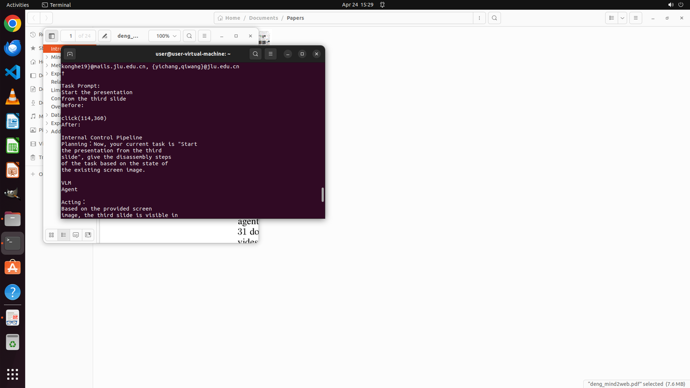

**Response:**
```
I can see some email addresses. Let me scroll up more to see the author names and affiliation.
```

**Actions:** `pyautogui.scroll(10, 525, 375)`

---

## Step 21


**Response:**
```
I need to scroll up more to see the author names and title.
```

**Actions:** `pyautogui.scroll(10, 525, 375)`

---

## Step 22


**Response:**
```
Now I can see the third paper's details:
- Title: "ScreenAgent: A Vision Language Model-driven Computer Control Agent"
- Authors: Runliang Niu1, Jindong Li1, Shiqi Wang1, Yali Fu1, Xiyu Hu1, Xueyuan Leng1, He Kong1, Yi Chang1,2, Qi Wang1,2*
- Affiliations: 1 School of Artificial Intelligence, Jilin University; 2 Engineering Research Center of Knowledge-Driven Human-Machine Intelligence, Ministry of Education, China
- First author: **Runliang Niu**, affiliation: School of Artificial Intelligence, Jilin University

I need to scroll down a bit to see the email. Let me check:
```

**Actions:** `pyautogui.scroll(-5, 525, 375)`

---

## Step 23


**Response:**
```
I need to find the email for the ScreenAgent paper. Let me scroll down more to find it.
```

**Actions:** `pyautogui.scroll(-5, 525, 375)`

---

## Step 24


**Response:**
```
I see the email wasn't visible on the first page. Let me look at the email from the earlier scroll - I saw "konghe19)@mails.jlu.edu.cn, {yichang,qlwang}@jlu.edu.cn". This is a more complex approach. Let me use a more systematic method - I'll list all the papers first and then extract information from each using a script.
```

**Actions:** `import subprocess, shlex; subprocess.run(f'xdotool type --delay 12 -- ' + shlex.quote('ls ~/Documents/Papers/\n'), shell=True, check=True)
import time; time.sleep(0.05)`

---

## Step 25

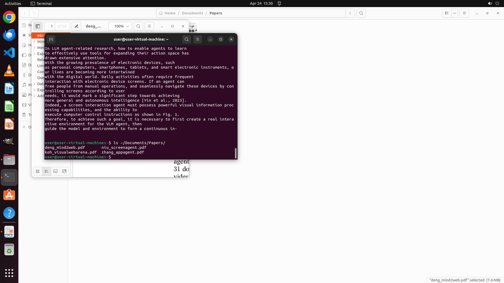

**Response:**
```
I can see there are 4 papers in the folder:
1. deng_mind2web.pdf
2. niu_screenagent.pdf
3. koh_visualwebarena.pdf
4. zhang_appagent.pdf

I've already extracted info from the first 3. Let me now extract the 4th paper's info:
```

**Actions:** `import subprocess, shlex; subprocess.run(f'xdotool type --delay 12 -- ' + shlex.quote('pdftotext -f 1 -l 1 ~/Documents/Papers/zhang_appag'), shell=True, check=True)
import time; time.sleep(0.05)
impor`

---

## Step 26


**Response:**
```
I need to scroll up to see the author names and affiliation for this paper.
```

**Actions:** `pyautogui.scroll(10, 525, 375)`

---

## Step 27


**Response:**
```
I need to scroll up more to see the author names.
```

**Actions:** `pyautogui.scroll(15, 525, 375)`

---

## Step 28


**Response:**
```
I need to scroll up more to find the author names and title.
```

**Actions:** `pyautogui.scroll(15, 525, 375)`

---

## Step 29

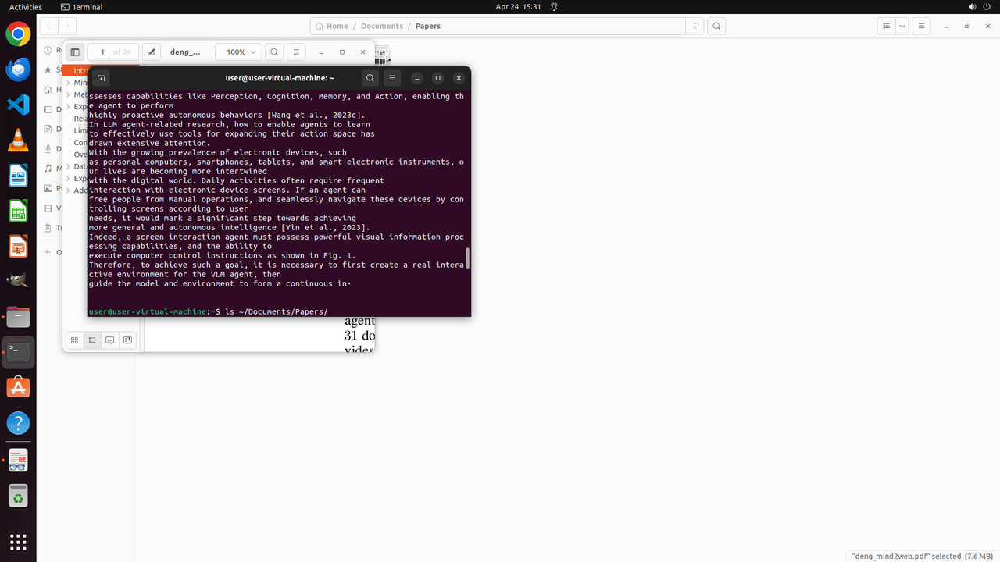

**Response:**
```
This approach of scrolling through terminal output is very tedious. Let me use a more efficient approach - I'll save the text to files and then read them, or use a Python script to extract the information and create the Excel file.
```

**Actions:** `import subprocess, shlex; subprocess.run(f'xdotool type --delay 12 -- ' + shlex.quote('pdftotext -f 1 -l 1 ~/Documents/Papers/zhang_appag'), shell=True, check=True)
import time; time.sleep(0.05)
impor`

---

## Step 30

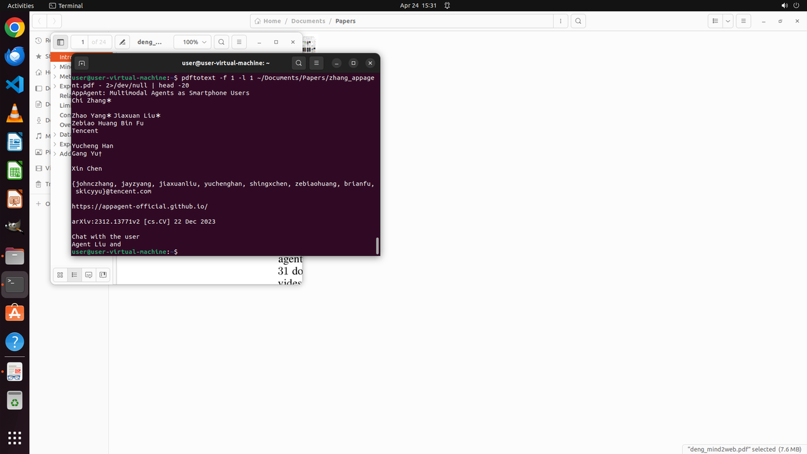

**Response:**
```
Now I can see the fourth paper's details:
- Title: "AppAgent: Multimodal Agents as Smartphone Users"
- First author: **Chi Zhang*** (corresponding author)
- Authors: Chi Zhang*, Zhao Yang*, Jiaxuan Liu*, Zeblao Huang, Bin Fu, Tencent; Yucheng Han, Gang Yu†; Xin Chen
- Affiliation: Tencent
- Email: {johnczhang, jayzyang, jiaxuanliu, yuchenghan, shingxchen, zebiaohuang, brianfu, sklcyyu}@tencent.com
- So first author Chi Zhang's email is johnczhang@tencent.com

Now I need to go back and find the email for the ScreenAgent paper (niu_screenagent.pdf). Let me search for it:
```

**Actions:** `import subprocess, shlex; subprocess.run(f'xdotool type --delay 12 -- ' + shlex.quote('pdftotext -f 1 -l 1 ~/Documents/Papers/niu_screena'), shell=True, check=True)
import time; time.sleep(0.05)
impor`

---

## Step 31

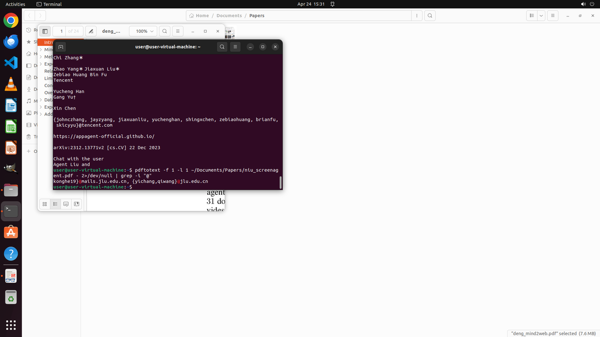

**Response:**
```
Now I can see the email for the ScreenAgent paper. The email line shows:
`konghe19}@mails.jlu.edu.cn, {yichang,qlwang}@jlu.edu.cn`

I need to see the full email pattern. Let me get more context:
```

**Actions:** `import subprocess, shlex; subprocess.run(f'xdotool type --delay 12 -- ' + shlex.quote('pdftotext -f 1 -l 1 ~/Documents/Papers/niu_screena'), shell=True, check=True)
import time; time.sleep(0.05)
impor`

---

## Step 32


**Response:**
```
Now I can see the details for the ScreenAgent paper:
- Title: "ScreenAgent: A Vision Language Model-driven Computer Control Agent"
- Authors: Runliang Niu1, Jindong Li1, Shiqi Wang1, Yali Fu1, Xiyu Hu1, Xueyuan Leng1, He Kong1, Yi Chang1,2, Qi Wang1,2*
- First author: **Runliang Niu**
- Affiliation: School of Artificial Intelligence, Jilin University
- Email line: `konghe19}@mails.jlu.edu.cn, {yichang,qlwang}@jlu.edu.cn`

I need to see the full email pattern to determine Runliang Niu's email. Let me get the email line more completely:
```

**Actions:** `import subprocess, shlex; subprocess.run(f'xdotool type --delay 12 -- ' + shlex.quote('pdftotext -f 1 -l 1 ~/Documents/Papers/niu_screena'), shell=True, check=True)
import time; time.sleep(0.05)
impor`

---

## Step 33

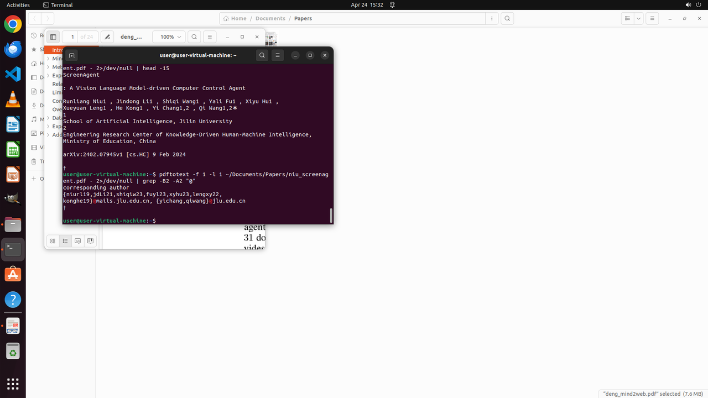

**Response:**
```
Now I can see the email information clearly:
- Corresponding author emails: `{niurl19,jdli21,shiqiw23,fuyl23,xyhu23,lengxy22, konghe19}@mails.jlu.edu.cn, {yichang,qiwang}@jlu.edu.cn`

So Runliang Niu's email is **niurl19@mails.jlu.edu.cn** (first in the list, matching the first author).

Now I have all the information I need. Let me also verify the email for the koh_visualwebarena.pdf:
```

**Actions:** `import subprocess, shlex; subprocess.run(f'xdotool type --delay 12 -- ' + shlex.quote('pdftotext -f 1 -l 1 ~/Documents/Papers/koh_visualw'), shell=True, check=True)
import time; time.sleep(0.05)
impor`

---

## Step 34

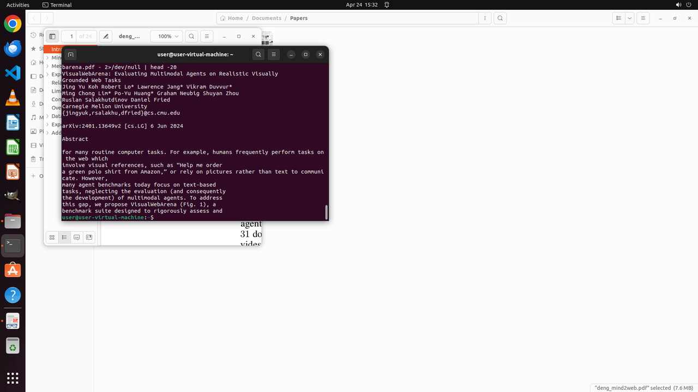

**Response:**
```
Now I have all the information for the VisualWebArena paper:
- Title: "VisualWebArena: Evaluating Multimodal Agents on Realistic Visually Grounded Web Tasks"
- First author: **Jing Yu Koh**
- Authors: Jing Yu Koh, Robert Lo*, Lawrence Jang*, Vikram Duvvur*, Ming Chong Lim*, Po-Yu Huang*, Graham Neubig, Shuyan Zhou, Ruslan Salakhutdinov, Daniel Fried
- Affiliation: Carnegie Mellon University
- Email: {jingyuk,rsalakhu,dfried}@cs.cmu.edu → Jing Yu Koh's email is **jingyuk@cs.cmu.edu**

Now I have all the data. Let me also verify the deng_mind2web.pdf info:
```

**Actions:** `import subprocess, shlex; subprocess.run(f'xdotool type --delay 12 -- ' + shlex.quote('pdftotext -f 1 -l 1 ~/Documents/Papers/deng_mind2w'), shell=True, check=True)
import time; time.sleep(0.05)
impor`

---

## Step 35


**Response:**
```
I need to scroll up to see the author names for the deng_mind2web paper. Let me get fewer lines:
```

**Actions:** `import subprocess, shlex; subprocess.run(f'xdotool type --delay 12 -- ' + shlex.quote('pdftotext -f 1 -l 1 ~/Documents/Papers/deng_mind2w'), shell=True, check=True)
import time; time.sleep(0.05)
impor`

---

## Step 36


**Response:**
```
Now I can see the deng_mind2web paper details clearly:
- Title: "MIND2WEB: Towards a Generalist Agent for the Web"
- Authors: Xiang Deng*, Yu Gu, Boyuan Zheng, Shijie Chen, Samuel Stevens, Boshi Wang, Huan Sun*, Yu Su*
- First author: **Xiang Deng**
- Affiliation: The Ohio State University
- I need to get the email:
```

**Actions:** `import subprocess, shlex; subprocess.run(f'xdotool type --delay 12 -- ' + shlex.quote('pdftotext -f 1 -l 1 ~/Documents/Papers/deng_mind2w'), shell=True, check=True)
import time; time.sleep(0.05)
impor`

---

## Step 37


**Response:**
```
Now I have all the information I need:

**Paper 1 (deng_mind2web.pdf):**
- Name: Xiang Deng
- Email: deng.595@osu.edu
- Affiliation: The Ohio State University

**Paper 2 (koh_visualwebarena.pdf):**
- Name: Jing Yu Koh
- Email: jingyuk@cs.cmu.edu
- Affiliation: Carnegie Mellon University

**Paper 3 (niu_screenagent.pdf):**
- Name: Runliang Niu
- Email: niurl19@mails.jlu.edu.cn
- Affiliation: School of Artificial Intelligence, Jilin University

**Paper 4 (zhang_appagent.pdf):**
- Name: Chi Zhang
- Email: johnczhang@tencent.com
- Affiliation: Tencent

Now let me create the Excel file using Python:
```

**Actions:** `import subprocess, shlex; subprocess.run(f'xdotool type --delay 12 -- ' + shlex.quote("python3 << 'EOF'\nimport openpyxl\n\nwb = openpyxl.Wo"), shell=True, check=True)
import time; time.sleep(0.05)
im`

---

## Step 38

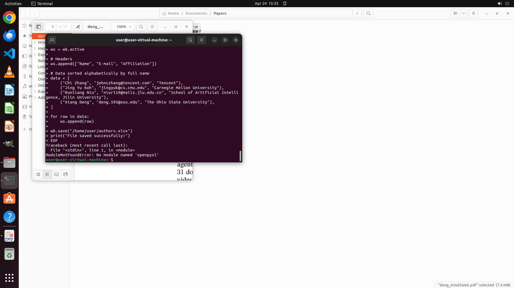

**Response:**
```
I see that `openpyxl` is not installed. Let me install it first:
```

**Actions:** `import subprocess, shlex; subprocess.run(f'xdotool type --delay 12 -- ' + shlex.quote('pip install openpyxl\n'), shell=True, check=True)
import time; time.sleep(0.05)`

---

## Step 39


**Response:**
```
Good, openpyxl is being installed. Let me wait for it to finish.
```

**Actions:** `time.sleep(0.5)`

---

## Step 40


**Response:**
```
`openpyxl` has been successfully installed. Now let me run the Python script again to create the Excel file:
```

**Actions:** `import subprocess, shlex; subprocess.run(f'xdotool type --delay 12 -- ' + shlex.quote("python3 << 'EOF'\nimport openpyxl\n\nwb = openpyxl.Wo"), shell=True, check=True)
import time; time.sleep(0.05)
im`

---

## Step 41

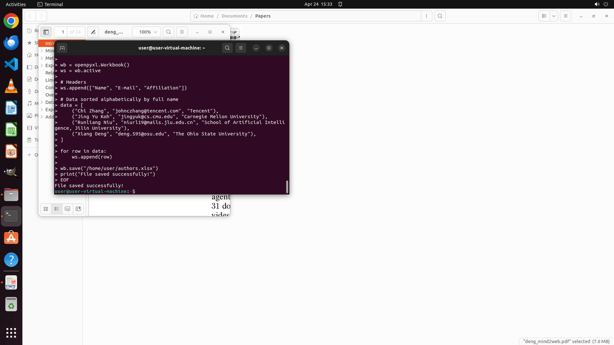

**Response:**
```
The file has been saved successfully. Let me verify it was created correctly:
```

**Actions:** `import subprocess, shlex; subprocess.run(f'xdotool type --delay 12 -- ' + shlex.quote('python3 -c "\nimport openpyxl\nwb = openpyxl.load_wo'), shell=True, check=True)
import time; time.sleep(0.05)
imp`

---

## Step 42

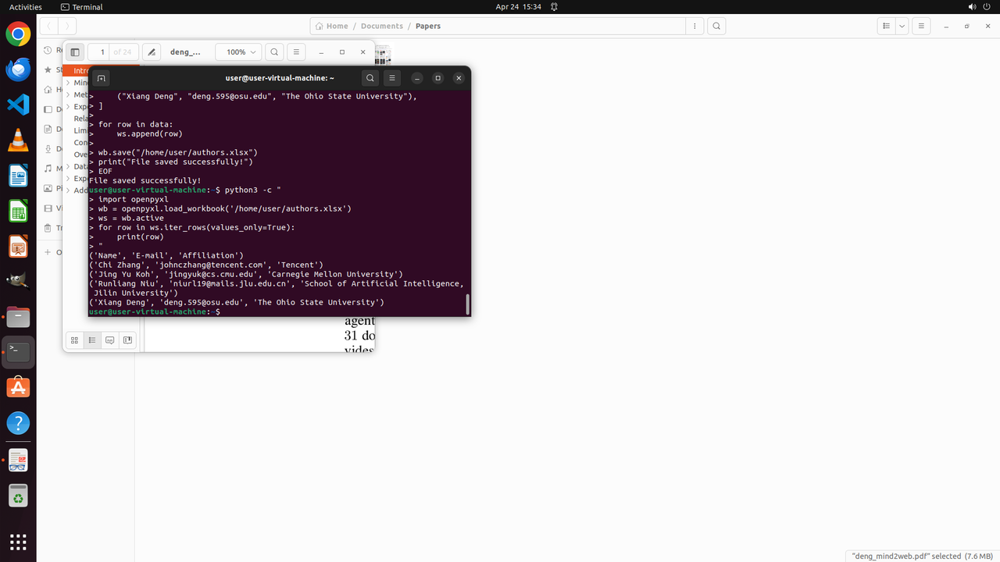

**Response:**
```
The Excel file has been created and verified successfully. The contents are:

| Name | E-mail | Affiliation |
|------|--------|-------------|
| Chi Zhang | johnczhang@tencent.com | Tencent |
| Jing Yu Koh | jingyuk@cs.cmu.edu | Carnegie Mellon University |
| Runliang Niu | niurl19@mails.jlu.edu.cn | School of Artificial Intelligence, Jilin University |
| Xiang Deng | deng.595@osu.edu | The Ohio State University |

The authors are sorted alphabetically by their full names, with headers for each field (Name, E-mail, Affiliation), and the file is saved as `~/authors.xlsx`.

DONE
```

**Actions:** `DONE`

---
