# Task bc2b57f3-686d-4ec9-87ce-edf850b7e442

**Instruction:** The requirements of my data analysis assignment are listed in "reminder.docx" on the desktop. Help me modify my assignment opended accordingly.

**Score:** 1.0

**Wall clock:** 7m 39s

**Steps:** 43

**Cost:** $1.48

---

## Step 1


**Response:**
```
I need to first read the "reminder.docx" file on the desktop to understand the requirements, and then modify the assignment accordingly.

Let me start by opening the reminder.docx file.
```

**Actions:** `pyautogui.keyDown('command')
pyautogui.keyUp('command')`

---

## Step 2


**Response:**
```
Let me open a terminal to read the reminder.docx file first.
```

**Actions:** `pyautogui.keyDown('esc')
pyautogui.keyUp('esc')`

---

## Step 3


**Response:**
```
Let me right-click on the desktop to open a terminal. First, let me try to find and open the Files application or a terminal.
```

**Actions:** `pyautogui.click(33, 672)`

---

## Step 4

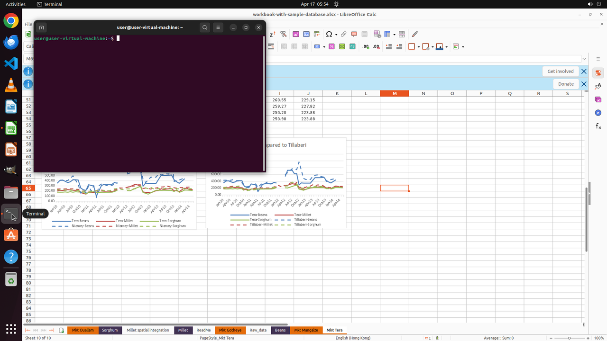

**Response:**
```
A terminal is now open. Let me read the reminder.docx file using a command-line tool.
```

**Actions:** `import subprocess, shlex; subprocess.run(f'xdotool type --delay 12 -- ' + shlex.quote('cd ~/Desktop && python3 -c "import docx; doc = doc'), shell=True, check=True)
import time; time.sleep(0.05)
impor`

---

## Step 5

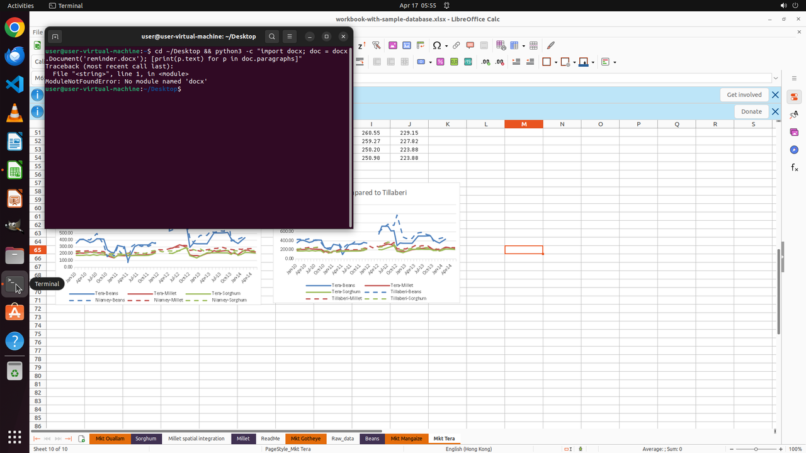

**Response:**
```
The `docx` module is not installed. Let me try another approach to read the file.
```

**Actions:** `import subprocess, shlex; subprocess.run(f'xdotool type --delay 12 -- ' + shlex.quote('pip3 install python-docx 2>/dev/null && python3 -c'), shell=True, check=True)
import time; time.sleep(0.05)
impor`

---

## Step 6

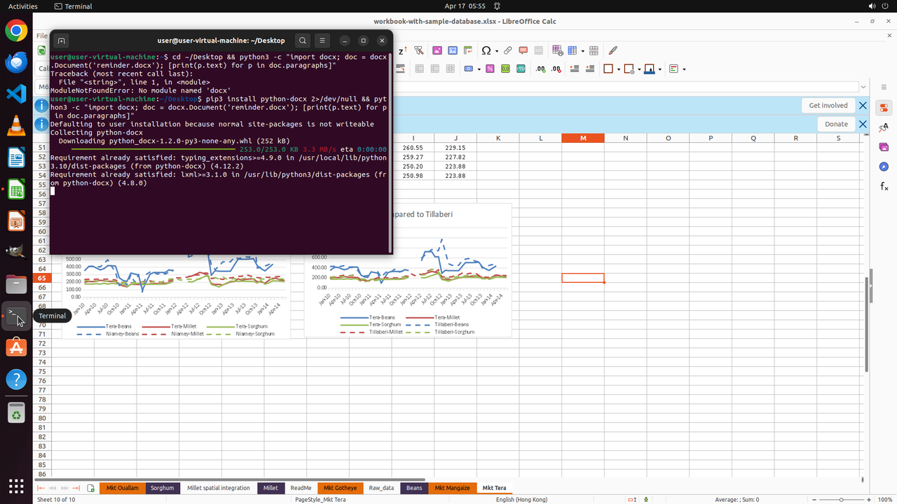

**Response:**
```
The package is being installed. Let me wait for it to complete.
```

**Actions:** `time.sleep(0.5)`

---

## Step 7


**Response:**
```
Now I can see the content of the reminder.docx file. Let me read it carefully:

```
Sub: Submission of Data Assignment as part of Course requirement

To make it easier for TA to mark the assignment, please make sure you

Organise all of your sheets in one calc file.

Arrange them in the following order:
ReadMe
Raw_data
Beans
Millet
Sorghum
Mkt Gotheye
Mkt Mangalize
Mkt Ouallam
Mkt Tera
Millet spatial integration
```

Now let me check the current order of sheets in the LibreOffice Calc file. Looking at the bottom tabs, I can see:
- Mkt Ouallam, Sorghum, Millet spatial integration, Millet, ReadMe, Mkt Gotheye, Raw_data, Mkt Mangalize, Beans, Mkt Tera

The required order is:
1. ReadMe
2. Raw_data
3. Beans
4. Millet
5. Sorghum
6. Mkt Gotheye
7. Mkt Mangalize
8. Mkt Ouallam
9. Mkt Tera
10. Millet spatial integration

I need to rearrange the sheets. Let me switch to the LibreOffice Calc window first and start rearranging.
```

**Actions:** `pyautogui.click(990, 45)`

---

## Step 8

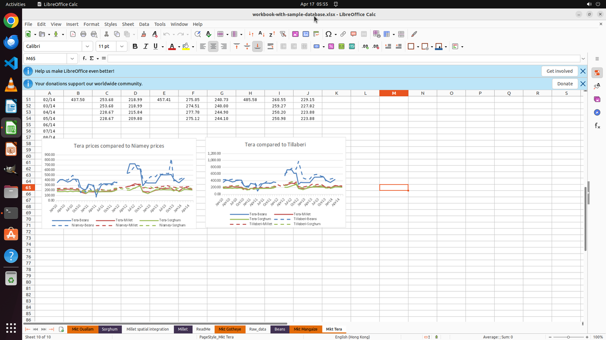

**Response:**
```
Now I can see the LibreOffice Calc with the sheet tabs at the bottom. The current order is:
Mkt Ouallam, Sorghum, Millet spatial integration, Millet, ReadMe, Mkt Gotheye, Raw_data, Mkt Mangalize, Beans, Mkt Tera

The required order is:
1. ReadMe
2. Raw_data
3. Beans
4. Millet
5. Sorghum
6. Mkt Gotheye
7. Mkt Mangalize
8. Mkt Ouallam
9. Mkt Tera
10. Millet spatial integration

I'll rearrange the sheets by right-clicking each tab and using "Move or Copy Sheet". Let me start with moving "ReadMe" to position 1.
```

**Actions:** `pyautogui.rightClick(646, 1044)`

---

## Step 9

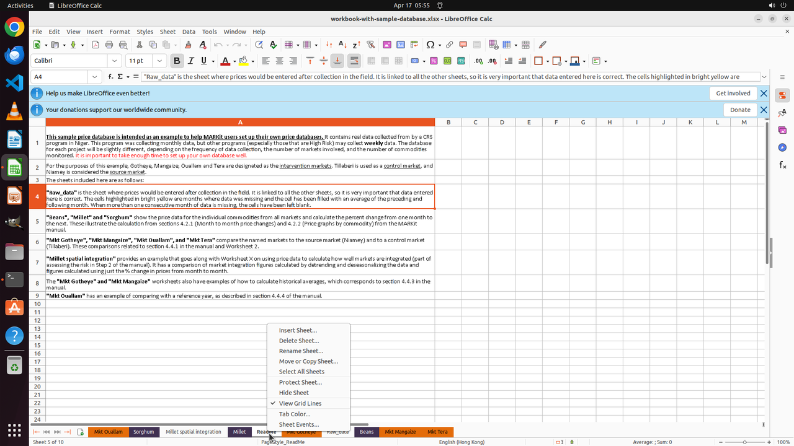

**Response:**
```
I can see the context menu. Let me click on "Move or Copy Sheet..." to move the ReadMe sheet to position 1.
```

**Actions:** `pyautogui.click(744, 873)`

---

## Step 10

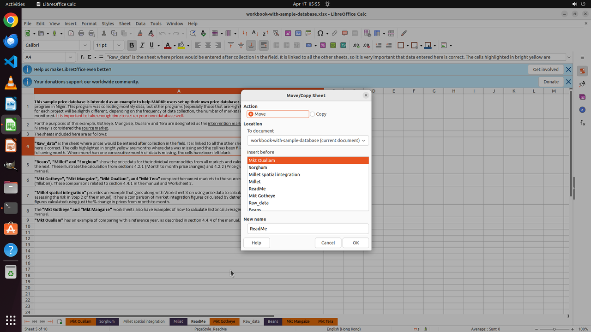

**Response:**
```
I can see the Move/Copy Sheet dialog. The current sheet is "ReadMe" and I need to move it before "Mkt Ouallam" (which is the first position). "Mkt Ouallam" is already selected as "Insert before", so I just need to click OK to move ReadMe to position 1.
```

**Actions:** `pyautogui.click(847, 520)`

---

## Step 11

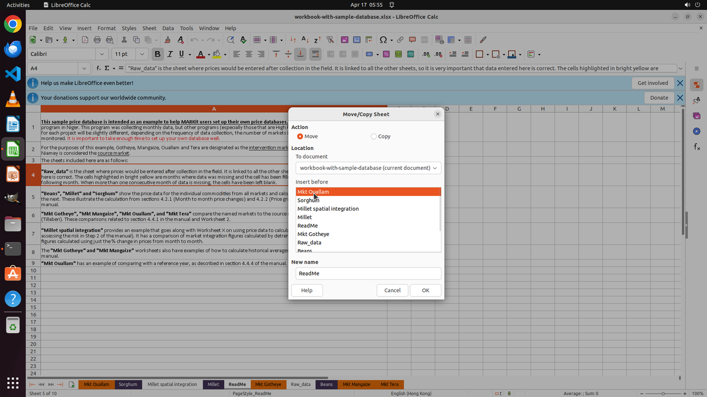

**Response:**
```
"Mkt Ouallam" is already selected as "Insert before", which means ReadMe will be moved to position 1 (before Mkt Ouallam). Let me click OK.
```

**Actions:** `pyautogui.click(1153, 789)`

---

## Step 12

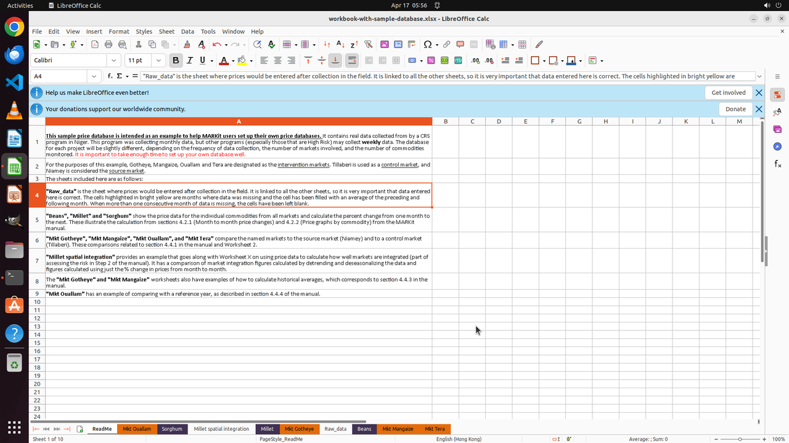

**Response:**
```
ReadMe is now in position 1. The current order is:
ReadMe, Mkt Ouallam, Sorghum, Millet spatial integration, Millet, Mkt Gotheye, Raw_data, Mkt Mangalize, Beans, Mkt Tera

Now I need to move "Raw_data" to position 2 (before "Mkt Ouallam"). Let me right-click on the Raw_data tab.
```

**Actions:** `pyautogui.rightClick(817, 1044)`

---

## Step 13

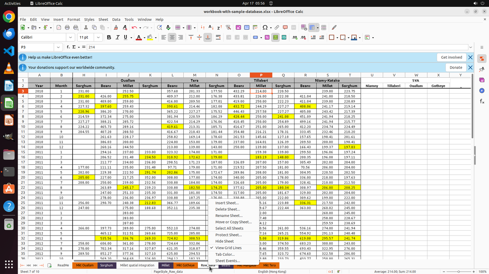

**Response:**
```
I can see the context menu for Raw_data. Let me click "Move or Copy Sheet..."
```

**Actions:** `pyautogui.click(906, 873)`

---

## Step 14

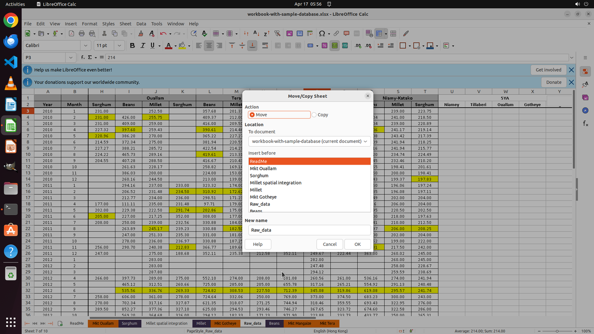

**Response:**
```
I need to move Raw_data before "Mkt Ouallam" (position 2, after ReadMe). Let me select "Mkt Ouallam" in the "Insert before" list.
```

**Actions:** `pyautogui.click(847, 544)`

---

## Step 15

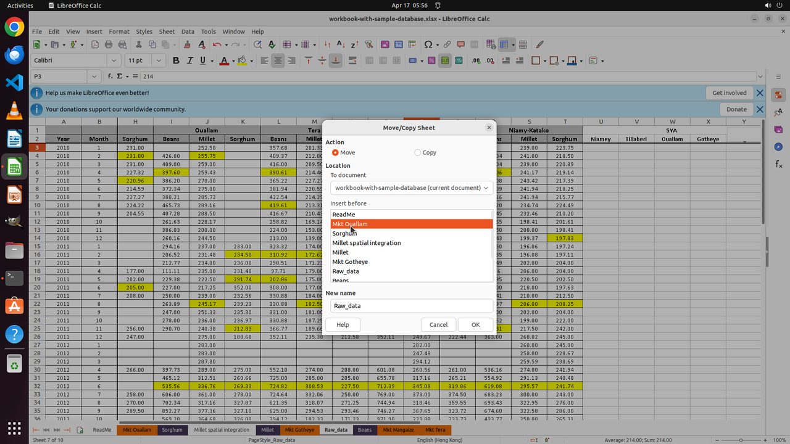

**Response:**
```
"Mkt Ouallam" is selected as the "Insert before" position. This will move Raw_data to position 2 (after ReadMe, before Mkt Ouallam). Let me click OK.
```

**Actions:** `pyautogui.click(1153, 789)`

---

## Step 16

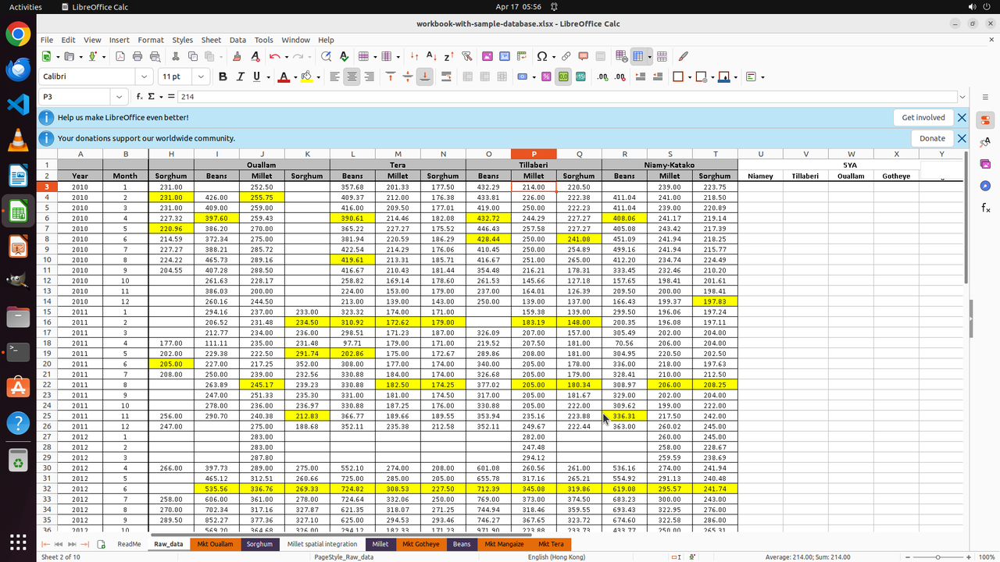

**Response:**
```
Raw_data is now in position 2. The current order is:
ReadMe, Raw_data, Mkt Ouallam, Sorghum, Millet spatial integration, Millet, Mkt Gotheye, Mkt Mangalize, Beans, Mkt Tera

Now I need to move "Beans" to position 3 (before "Mkt Ouallam"). Let me right-click on the Beans tab.
```

**Actions:** `pyautogui.rightClick(888, 1044)`

---

## Step 17

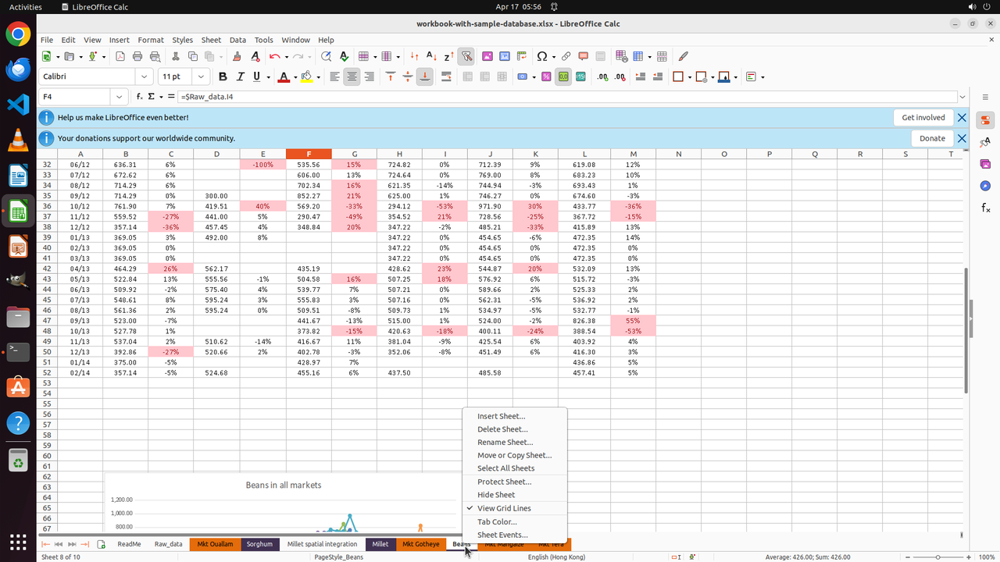

**Response:**
```
I can see the context menu for the Beans sheet. Let me click "Move or Copy Sheet..."
```

**Actions:** `pyautogui.click(984, 873)`

---

## Step 18

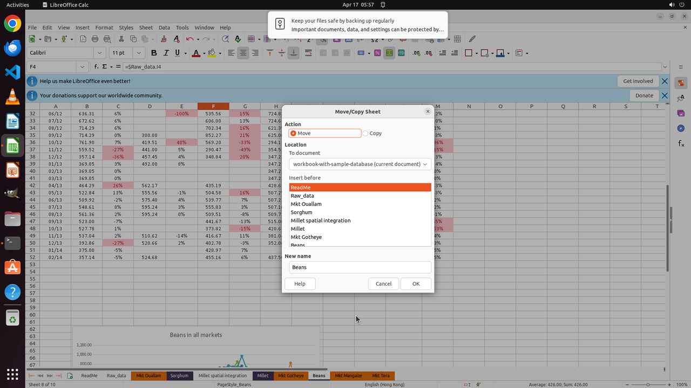

**Response:**
```
I need to move Beans before "Mkt Ouallam" (position 3). Let me select "Mkt Ouallam" in the list.
```

**Actions:** `pyautogui.click(847, 567)`

---

## Step 19

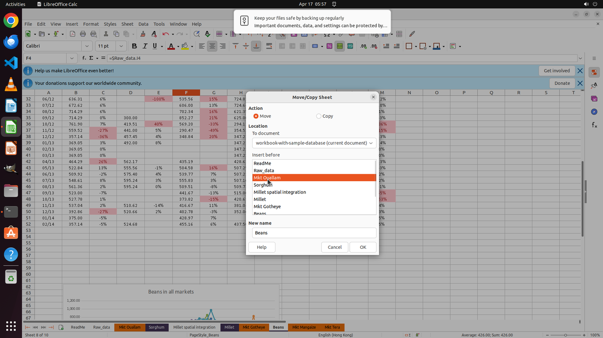

**Response:**
```
"Mkt Ouallam" is selected. This will move Beans to position 3 (after Raw_data). Let me click OK.
```

**Actions:** `pyautogui.click(1153, 789)`

---

## Step 20

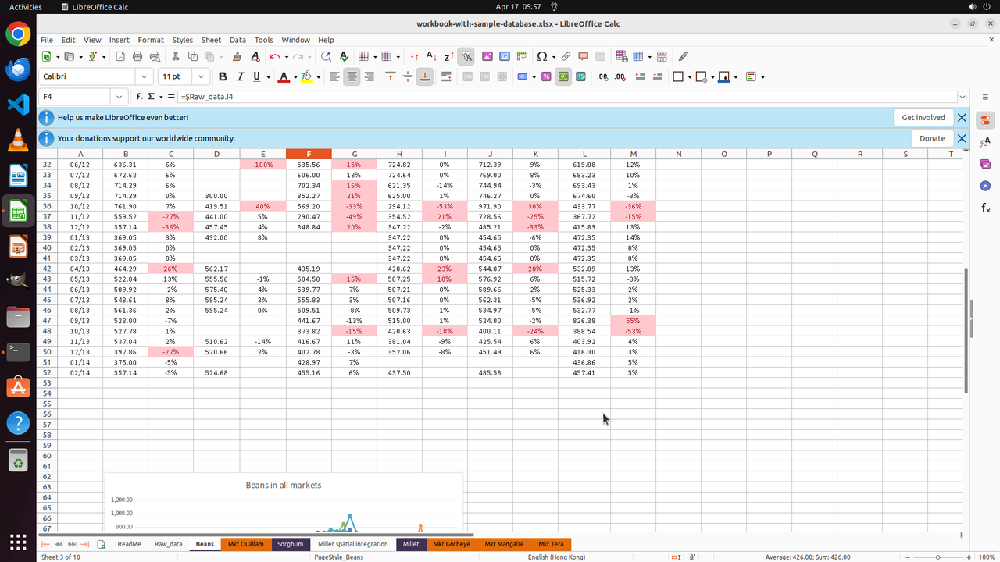

**Response:**
```
Beans is now in position 3. The current order is:
ReadMe, Raw_data, Beans, Mkt Ouallam, Sorghum, Millet spatial integration, Millet, Mkt Gotheye, Mkt Mangalize, Mkt Tera

Now I need to move "Millet" to position 4 (before "Mkt Ouallam"). Let me right-click on the Millet tab.
```

**Actions:** `pyautogui.rightClick(786, 1044)`

---

## Step 21

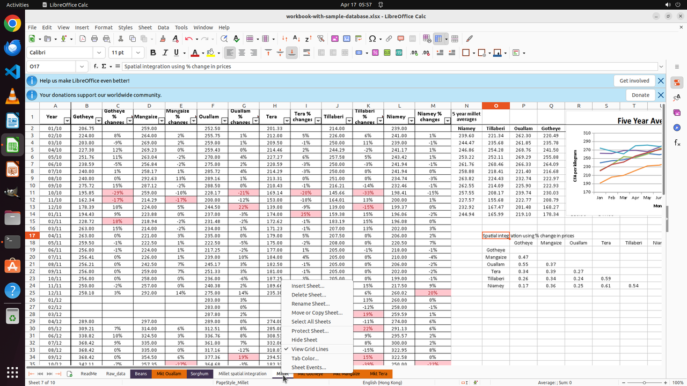

**Response:**
```
I can see the context menu for the Millet sheet. Let me click "Move or Copy Sheet..."
```

**Actions:** `pyautogui.click(883, 873)`

---

## Step 22

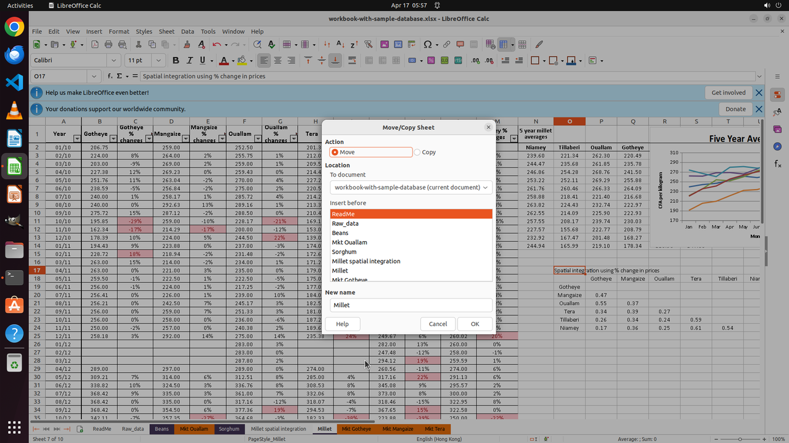

**Response:**
```
I need to move Millet before "Mkt Ouallam" (position 4, after Beans). Let me select "Mkt Ouallam" in the list.
```

**Actions:** `pyautogui.click(847, 589)`

---

## Step 23

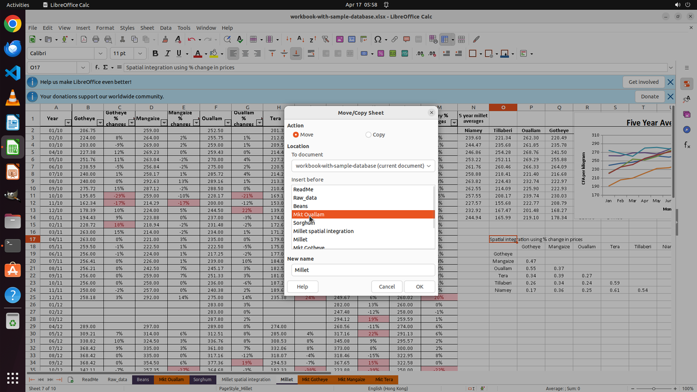

**Response:**
```
"Mkt Ouallam" is selected. This will move Millet to position 4 (after Beans, before Mkt Ouallam). Let me click OK.
```

**Actions:** `pyautogui.click(1153, 789)`

---

## Step 24

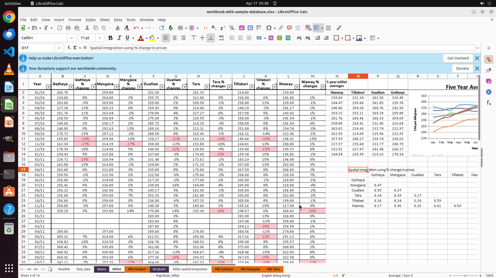

**Response:**
```
Millet is now in position 4. The current order is:
ReadMe, Raw_data, Beans, Millet, Mkt Ouallam, Sorghum, Millet spatial integration, Mkt Gotheye, Mkt Mangalize, Mkt Tera

Now I need to move "Sorghum" to position 5 (before "Mkt Ouallam"). Let me right-click on the Sorghum tab.
```

**Actions:** `pyautogui.rightClick(616, 1044)`

---

## Step 25

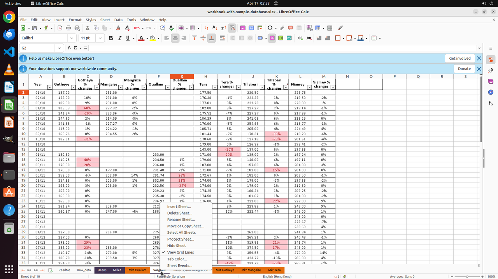

**Response:**
```
I can see the context menu for the Sorghum sheet. Let me click "Move or Copy Sheet..."
```

**Actions:** `pyautogui.click(717, 873)`

---

## Step 26

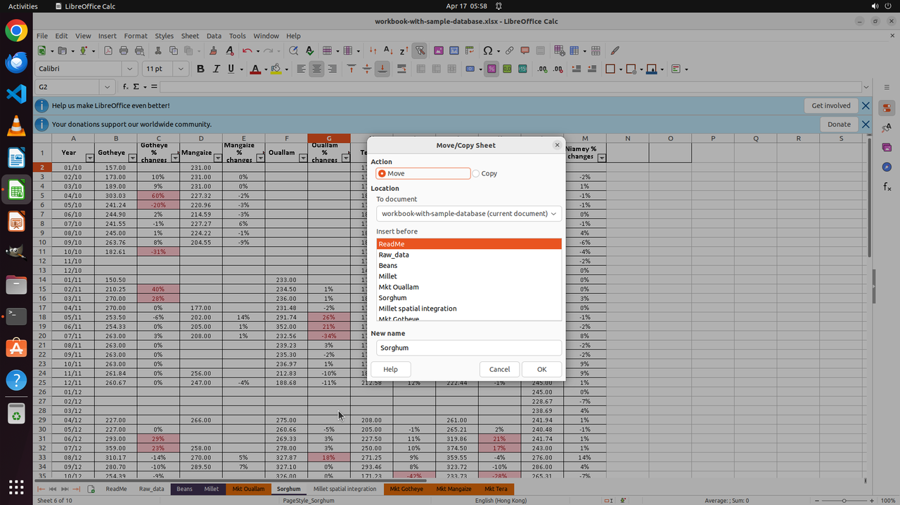

**Response:**
```
I need to move Sorghum before "Mkt Ouallam" (position 5, after Millet). Let me select "Mkt Ouallam" in the list.
```

**Actions:** `pyautogui.click(847, 612)`

---

## Step 27

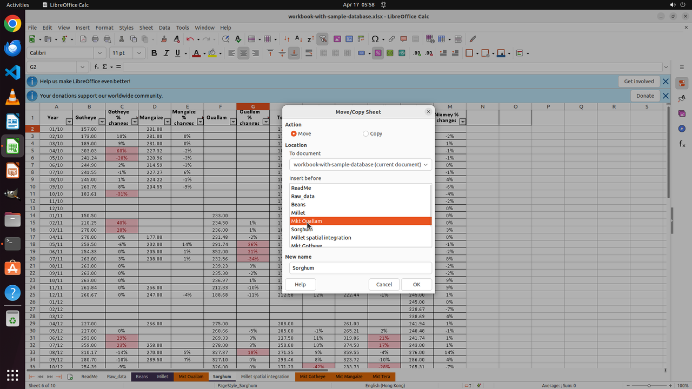

**Response:**
```
"Mkt Ouallam" is selected. This will move Sorghum to position 5 (after Millet, before Mkt Ouallam). Let me click OK.
```

**Actions:** `pyautogui.click(1153, 789)`

---

## Step 28

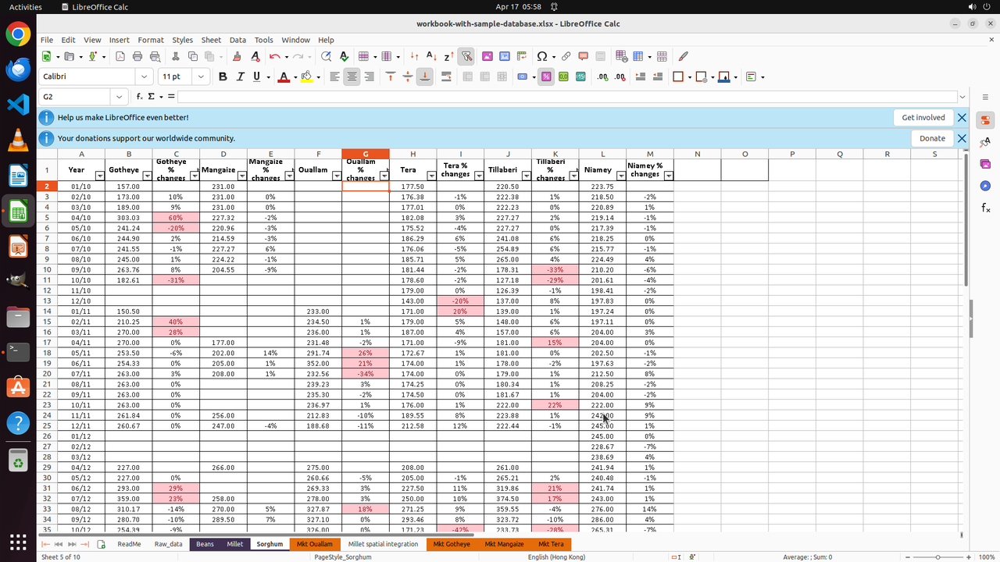

**Response:**
```
Sorghum is now in position 5. The current order is:
ReadMe, Raw_data, Beans, Millet, Sorghum, Mkt Ouallam, Millet spatial integration, Mkt Gotheye, Mkt Mangalize, Mkt Tera

Now I need to move "Mkt Gotheye" to position 6 (before "Mkt Ouallam"). Let me right-click on the Mkt Gotheye tab.
```

**Actions:** `pyautogui.rightClick(871, 1044)`

---

## Step 29

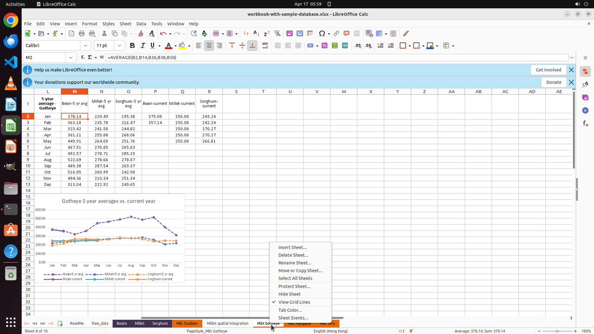

**Response:**
```
I can see the context menu for Mkt Gotheye. Let me click "Move or Copy Sheet..."
```

**Actions:** `pyautogui.click(966, 873)`

---

## Step 30

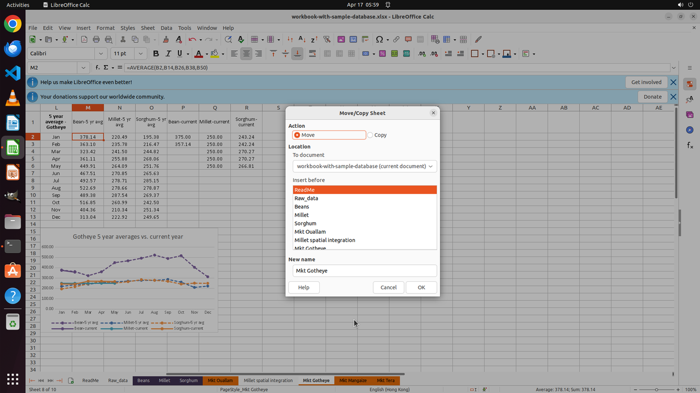

**Response:**
```
I need to move Mkt Gotheye before "Mkt Ouallam" (position 6, after Sorghum). Let me select "Mkt Ouallam" in the list.
```

**Actions:** `pyautogui.click(847, 634)`

---

## Step 31

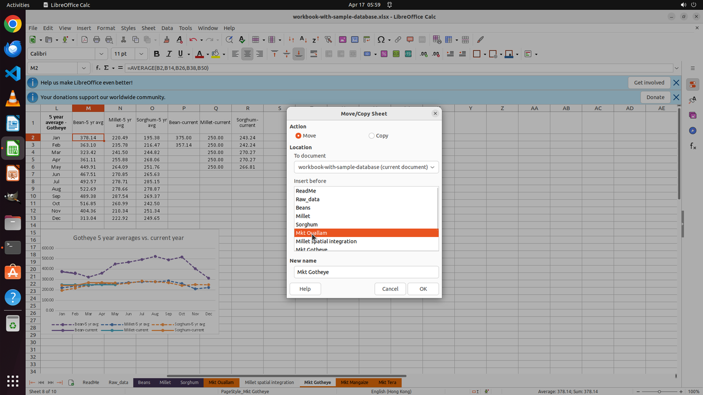

**Response:**
```
"Mkt Ouallam" is selected. This will move Mkt Gotheye to position 6 (after Sorghum, before Mkt Ouallam). Let me click OK.
```

**Actions:** `pyautogui.click(1153, 789)`

---

## Step 32

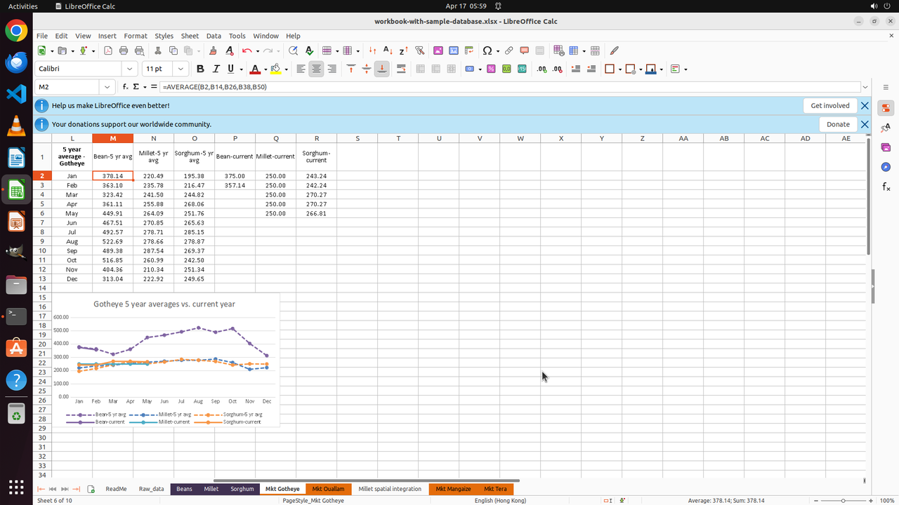

**Response:**
```
Mkt Gotheye is now in position 6. The current order is:
ReadMe, Raw_data, Beans, Millet, Sorghum, Mkt Gotheye, Mkt Ouallam, Millet spatial integration, Mkt Mangalize, Mkt Tera

Now I need to move "Mkt Mangalize" to position 7 (before "Mkt Ouallam"). Wait, let me re-check the required order:
1. ReadMe
2. Raw_data
3. Beans
4. Millet
5. Sorghum
6. Mkt Gotheye
7. Mkt Mangalize
8. Mkt Ouallam
9. Mkt Tera
10. Millet spatial integration

So I need to move "Mkt Mangalize" before "Mkt Ouallam". Let me right-click on the Mkt Mangalize tab.
```

**Actions:** `pyautogui.rightClick(970, 1044)`

---

## Step 33

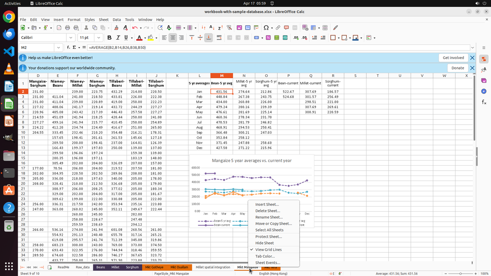

**Response:**
```
I can see the context menu for Mkt Mangalize. Let me click "Move or Copy Sheet..."
```

**Actions:** `pyautogui.click(1065, 873)`

---

## Step 34

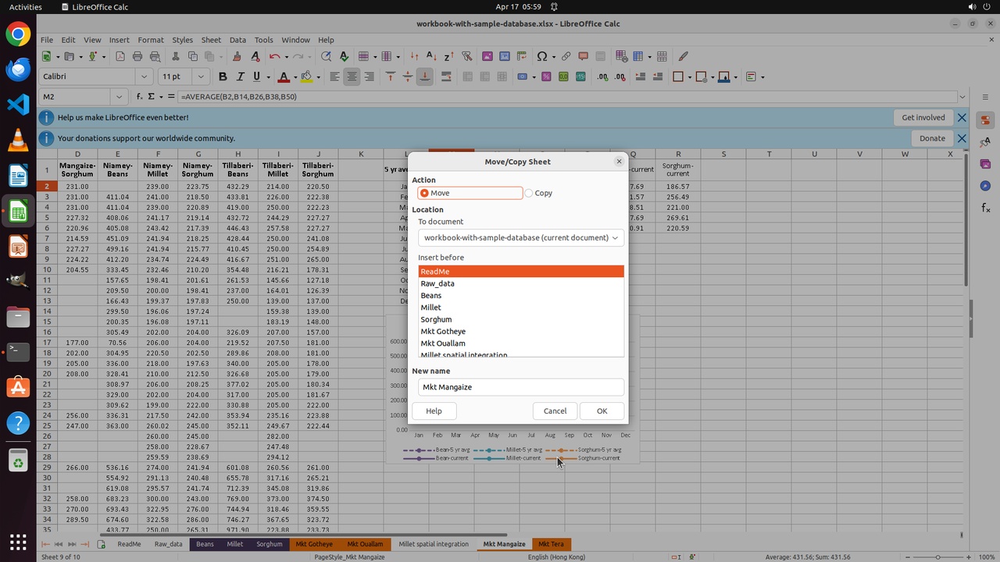

**Response:**
```
I need to move Mkt Mangalize before "Mkt Ouallam" (position 7, after Mkt Gotheye). Let me select "Mkt Ouallam" in the list.
```

**Actions:** `pyautogui.click(847, 658)`

---

## Step 35

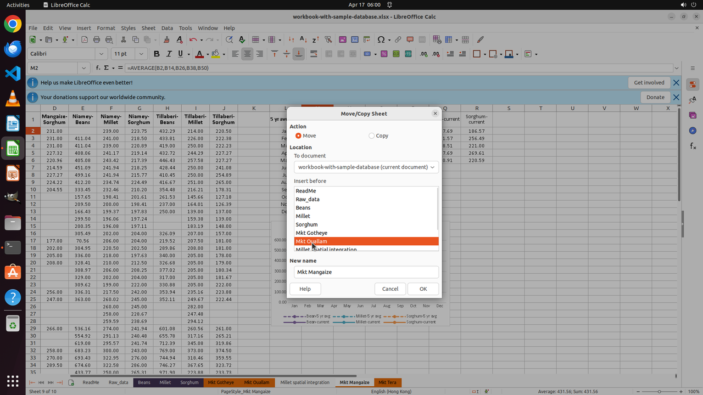

**Response:**
```
"Mkt Ouallam" is selected. This will move Mkt Mangalize to position 7 (after Mkt Gotheye, before Mkt Ouallam). Let me click OK.
```

**Actions:** `pyautogui.click(1153, 789)`

---

## Step 36

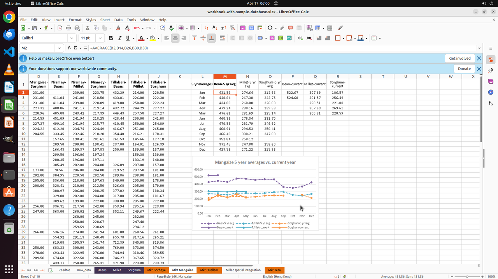

**Response:**
```
Mkt Mangalize is now in position 7. The current order is:
ReadMe, Raw_data, Beans, Millet, Sorghum, Mkt Gotheye, Mkt Mangalize, Mkt Ouallam, Millet spatial integration, Mkt Tera

Now I need to move "Mkt Tera" to position 9 (before "Millet spatial integration"). Let me right-click on the Mkt Tera tab.
```

**Actions:** `pyautogui.rightClick(1059, 1044)`

---

## Step 37

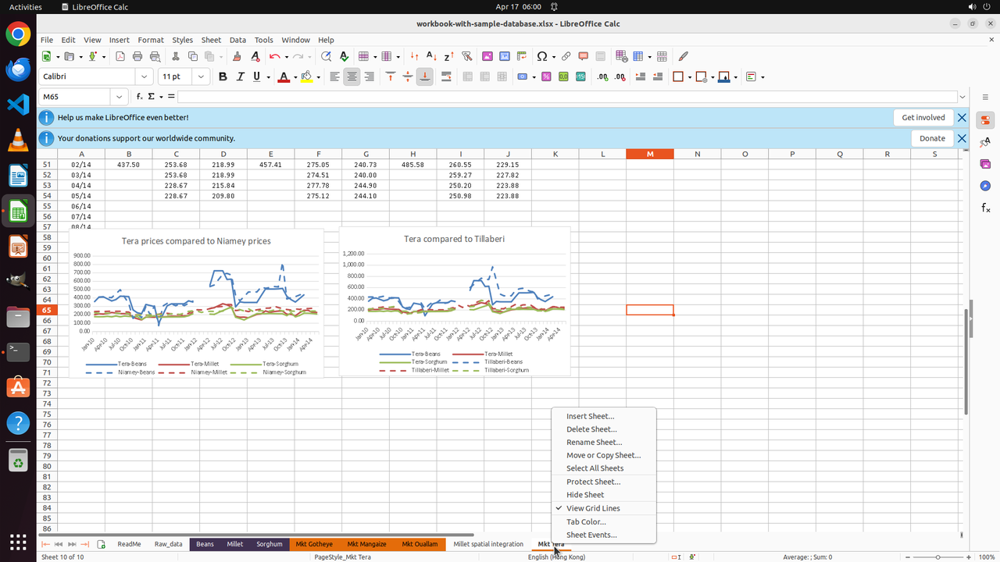

**Response:**
```
I can see the context menu for Mkt Tera. Let me click "Move or Copy Sheet..."
```

**Actions:** `pyautogui.click(1155, 873)`

---

## Step 38

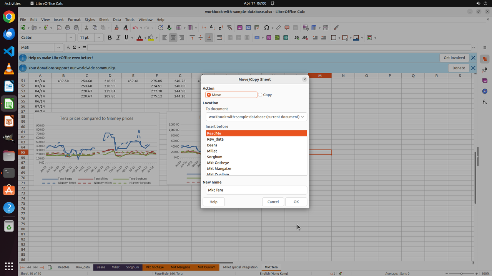

**Response:**
```
I need to move Mkt Tera before "Millet spatial integration" (position 9). I need to scroll down in the list to find "Millet spatial integration". Let me scroll down in the list.
```

**Actions:** `pyautogui.scroll(-3, 990, 630)`

---

## Step 39

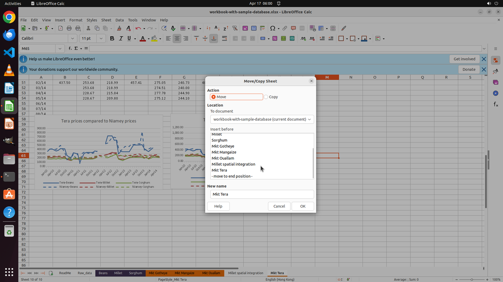

**Response:**
```
Now I can see the full list. I need to move Mkt Tera before "Millet spatial integration". Let me click on "Millet spatial integration".
```

**Actions:** `pyautogui.click(889, 627)`

---

## Step 40

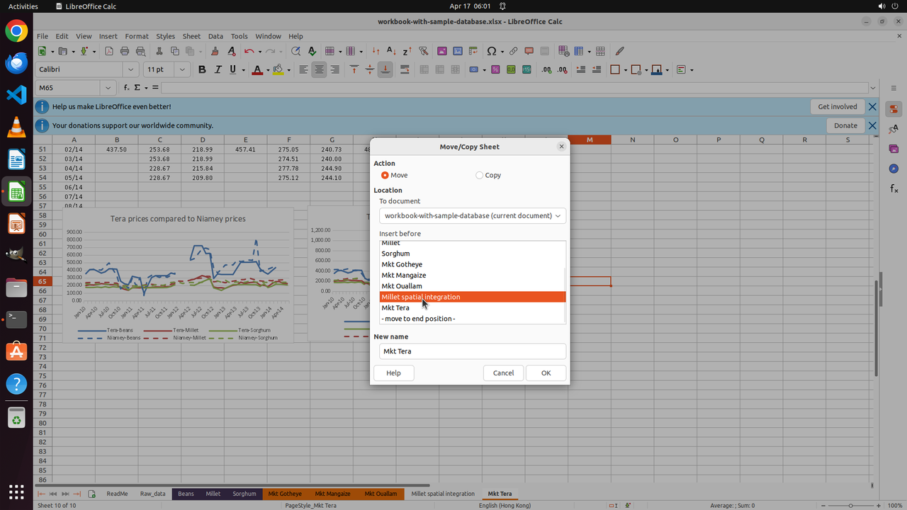

**Response:**
```
"Millet spatial integration" is selected. This will move Mkt Tera to position 9 (after Mkt Ouallam, before Millet spatial integration). Let me click OK.
```

**Actions:** `pyautogui.click(1153, 789)`

---

## Step 41


**Response:**
```
The sheets are now in the correct order:
1. ReadMe
2. Raw_data
3. Beans
4. Millet
5. Sorghum
6. Mkt Gotheye
7. Mkt Mangalize
8. Mkt Ouallam
9. Mkt Tera
10. Millet spatial integration

This matches the required order from the reminder.docx. Now let me save the file with Ctrl+S.
```

**Actions:** `pyautogui.keyDown('ctrl')
pyautogui.keyDown('s')
pyautogui.keyUp('s')
pyautogui.keyUp('ctrl')`

---

## Step 42

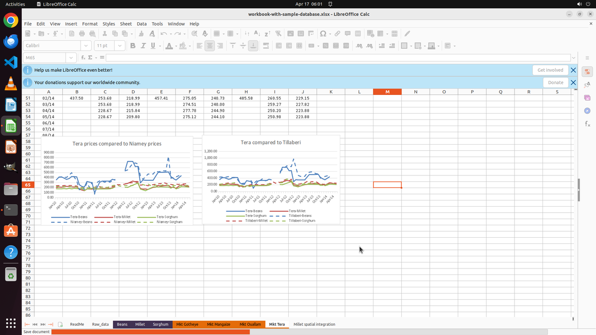

**Response:**
```
I can see the file is being saved (there's a "Save document" progress bar at the bottom). Since the file is .xlsx format, it should save in the Keep Current Format option. Let me wait for it to complete.
```

**Actions:** `time.sleep(0.5)`

---

## Step 43

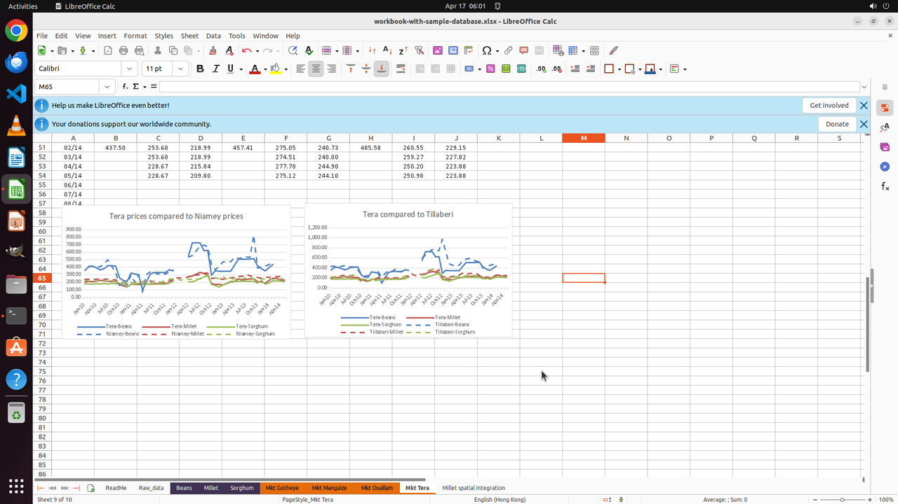

**Response:**
```
The file has been saved successfully. The sheets are now arranged in the correct order as specified in the reminder.docx:

1. ReadMe
2. Raw_data
3. Beans
4. Millet
5. Sorghum
6. Mkt Gotheye
7. Mkt Mangalize
8. Mkt Ouallam
9. Mkt Tera
10. Millet spatial integration

The task is complete.

DONE
```

**Actions:** `DONE`

---
