# Task bc2b57f3-686d-4ec9-87ce-edf850b7e442

**Instruction:** The requirements of my data analysis assignment are listed in "reminder.docx" on the desktop. Help me modify my assignment opended accordingly.

**Score:** 1.0

**Wall clock:** 10m 0s

**Steps:** 46

**Cost:** $1.56

---

## Step 1

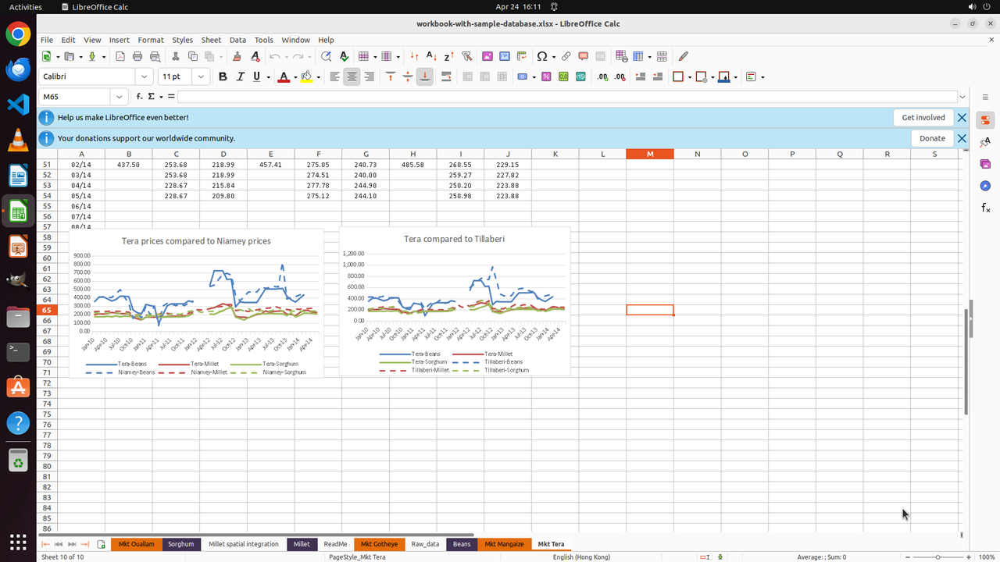

**Response:**
```
I need to first read the "reminder.docx" file on the desktop to understand the requirements, and also examine the current spreadsheet. Let me start by opening the reminder document.
```

**Actions:** `time.sleep(0.1)`

---

## Step 2


**Response:**
```
Let me open the "reminder.docx" file from the desktop first to understand the requirements.
```

**Actions:** `pyautogui.keyDown('ctrl')
pyautogui.keyDown('end')
pyautogui.keyUp('end')
pyautogui.keyUp('ctrl')`

---

## Step 3


**Response:**
```
Now let me open the reminder.docx file from the desktop. I'll use the file manager or open it directly.
```

**Actions:** `pyautogui.keyDown('command')
pyautogui.keyUp('command')`

---

## Step 4

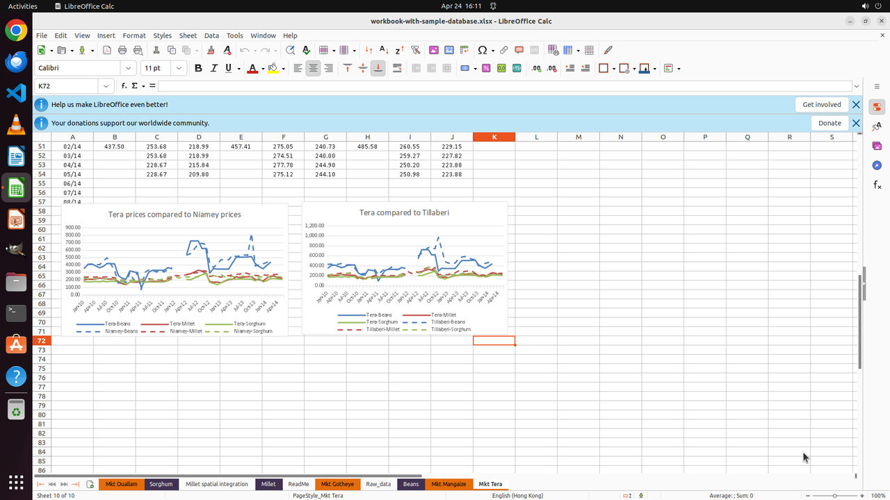

**Response:**
```
Let me open the reminder.docx file using the terminal or file manager. I'll right-click on the desktop to find the file.
```

**Actions:** `pyautogui.click(33, 337)`

---

## Step 5

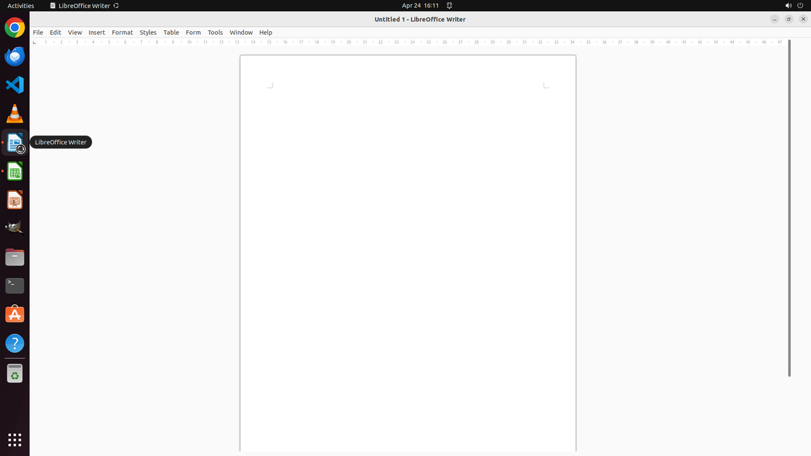

**Response:**
```
I see LibreOffice Writer opened a blank document. I need to open the reminder.docx file from the desktop. Let me use File > Open to navigate to it.
```

**Actions:** `pyautogui.keyDown('ctrl')
pyautogui.keyDown('o')
pyautogui.keyUp('o')
pyautogui.keyUp('ctrl')`

---

## Step 6

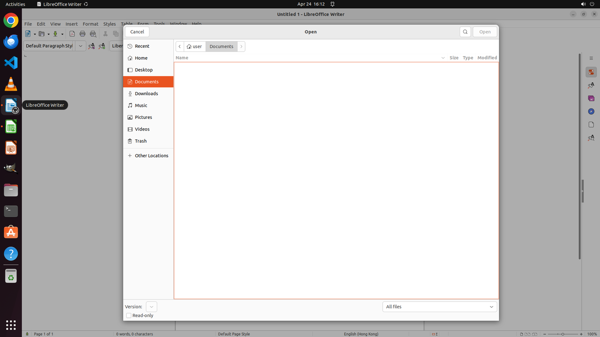

**Response:**
```
I can see the Open dialog. I need to navigate to the Desktop folder to find the reminder.docx file.
```

**Actions:** `pyautogui.click(460, 223)`

---

## Step 7

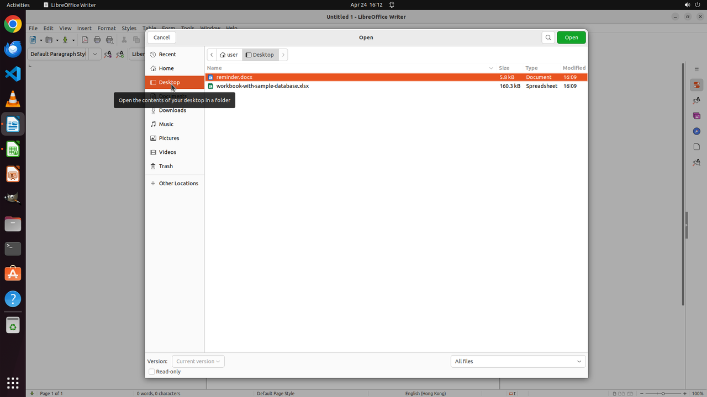

**Response:**
```
I can see the reminder.docx file on the Desktop. It's already selected. Let me open it.
```

**Actions:** `pyautogui.click(633, 208)`

---

## Step 8

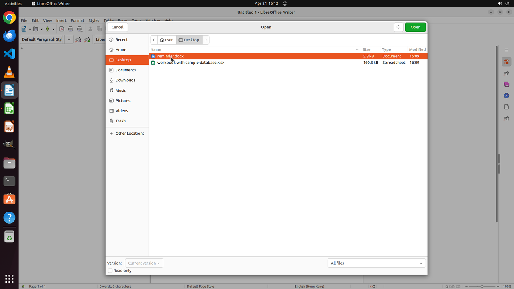

**Response:**
```
The reminder.docx file is selected. Let me click the Open button to open it.
```

**Actions:** `pyautogui.click(1548, 100)`

---

## Step 9

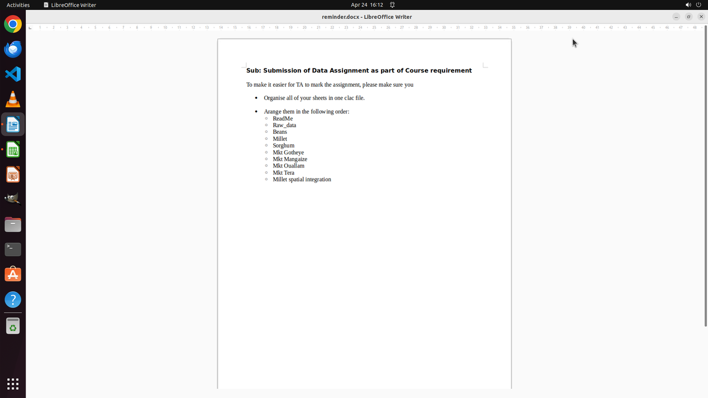

**Response:**
```
Now I can read the requirements from the reminder.docx file. The requirements are:

1. **Organize all sheets in one calc file** (they already are in one file)
2. **Arrange the sheets in the following order:**
   1. ReadMe
   2. Raw_data
   3. Beans
   4. Millet
   5. Sorghum
   6. Mkt Gotheye
   7. Mkt Mangaize
   8. Mkt Ouallam
   9. Mkt Tera
   10. Millet spatial integration

Now I need to go back to the LibreOffice Calc file and rearrange the sheet tabs in this order. Let me first check the current order of sheets in the spreadsheet.
```

**Actions:** `pyautogui.keyDown('alt')
pyautogui.keyDown('f4')
pyautogui.keyUp('f4')
pyautogui.keyUp('alt')`

---

## Step 10

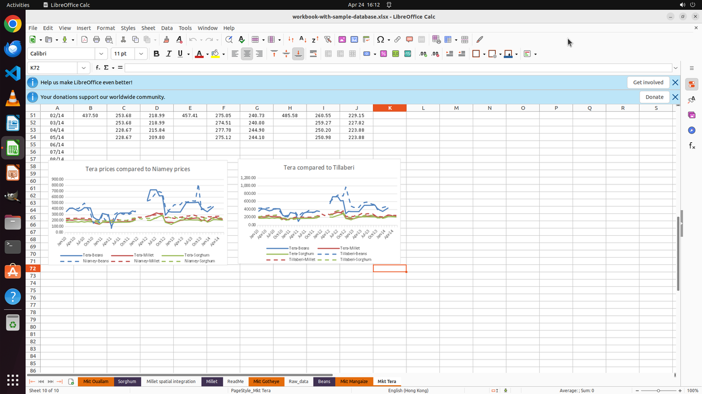

**Response:**
```
Now I can see the LibreOffice Calc file with the sheet tabs at the bottom. The current order of sheets is:
1. Mkt Ouallam
2. Sorghum
3. Millet spatial integration
4. Millet
5. ReadMe
6. Mkt Gotheye
7. Raw_data
8. Beans
9. Mkt Mangaize
10. Mkt Tera

The required order is:
1. ReadMe
2. Raw_data
3. Beans
4. Millet
5. Sorghum
6. Mkt Gotheye
7. Mkt Mangaize
8. Mkt Ouallam
9. Mkt Tera
10. Millet spatial integration

I need to rearrange the sheets. I'll right-click on each sheet tab and use "Move or Copy Sheet" to reorder them. Let me start by moving "ReadMe" to position 1.
```

**Actions:** `pyautogui.rightClick(646, 1044)`

---

## Step 11

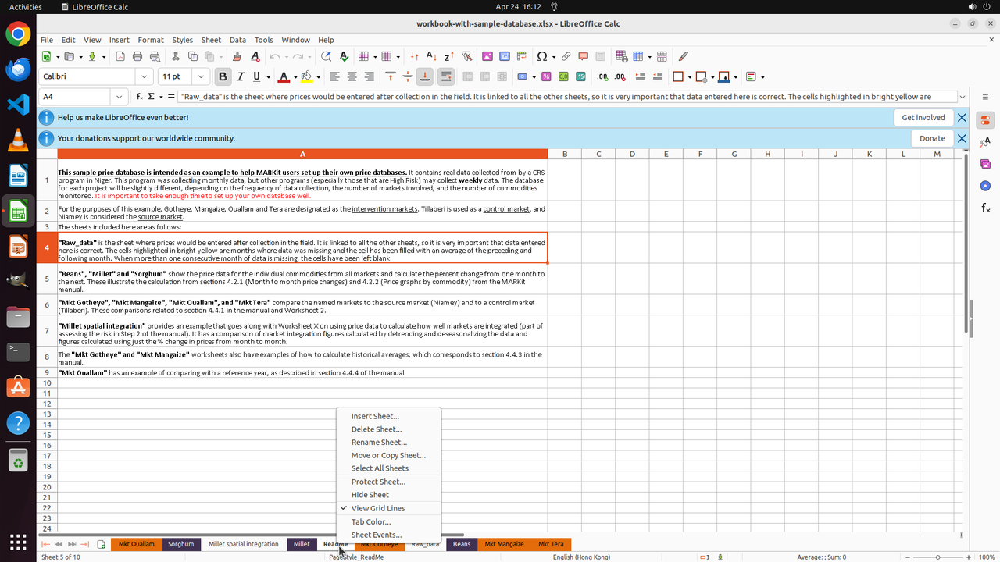

**Response:**
```
I can see the context menu with "Move or Copy Sheet..." option. Let me click on it to move the ReadMe sheet.
```

**Actions:** `pyautogui.click(744, 873)`

---

## Step 12

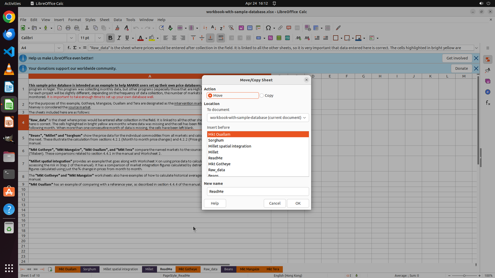

**Response:**
```
I can see the Move/Copy Sheet dialog. The current sheet is "ReadMe" and I need to move it to position 1 (before "Mkt Ouallam"). "Mkt Ouallam" is already selected as the "Insert before" option, which means ReadMe will be moved to the first position. Let me click OK.
```

**Actions:** `pyautogui.click(849, 520)`

---

## Step 13

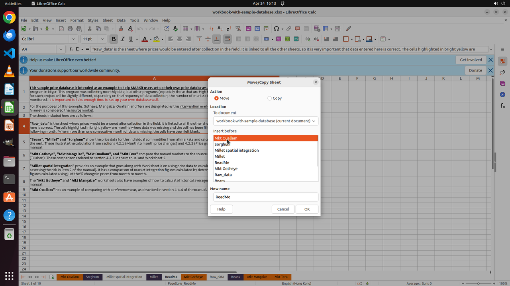

**Response:**
```
Good, "Mkt Ouallam" is selected as the "Insert before" position. This means ReadMe will be moved before Mkt Ouallam, making it the first sheet. Let me click OK.
```

**Actions:** `pyautogui.click(1153, 789)`

---

## Step 14

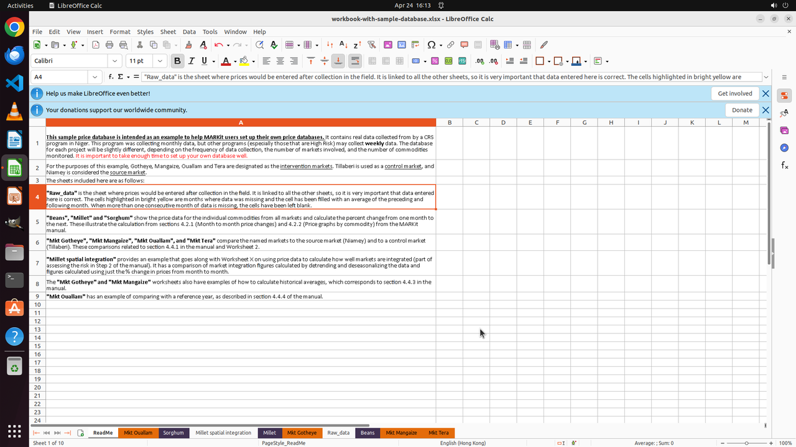

**Response:**
```
ReadMe is now the first sheet. The current order is:
1. ReadMe ✓
2. Mkt Ouallam
3. Sorghum
4. Millet spatial integration
5. Millet
6. Mkt Gotheye
7. Raw_data
8. Beans
9. Mkt Mangaize
10. Mkt Tera

Now I need to move "Raw_data" to position 2 (before "Mkt Ouallam"). Let me right-click on the Raw_data tab.
```

**Actions:** `pyautogui.rightClick(814, 1044)`

---

## Step 15

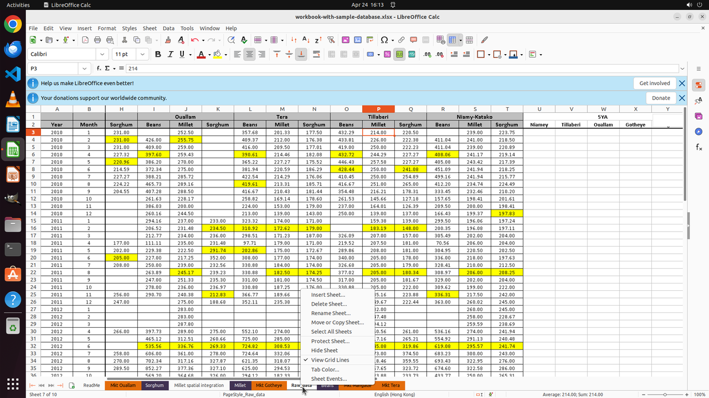

**Response:**
```
I can see the context menu on the Raw_data tab. Let me click "Move or Copy Sheet..."
```

**Actions:** `pyautogui.click(912, 874)`

---

## Step 16

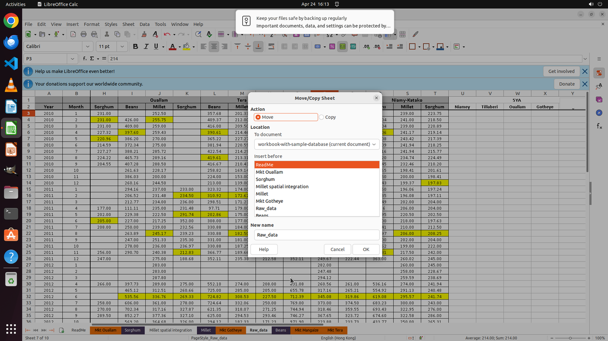

**Response:**
```
I need to move Raw_data before "Mkt Ouallam" (position 2, right after ReadMe). Let me select "Mkt Ouallam" in the "Insert before" list.
```

**Actions:** `pyautogui.click(849, 543)`

---

## Step 17

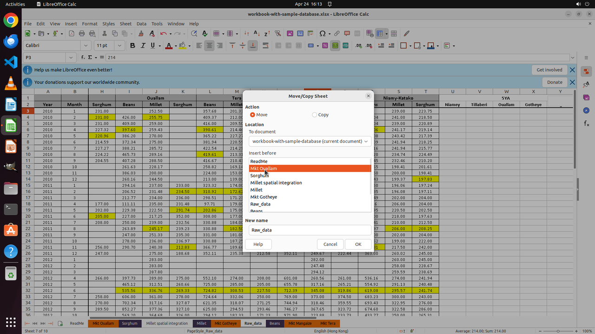

**Response:**
```
"Mkt Ouallam" is selected as the "Insert before" position. This will move Raw_data to position 2 (after ReadMe, before Mkt Ouallam). Let me click OK.
```

**Actions:** `pyautogui.click(1153, 789)`

---

## Step 18

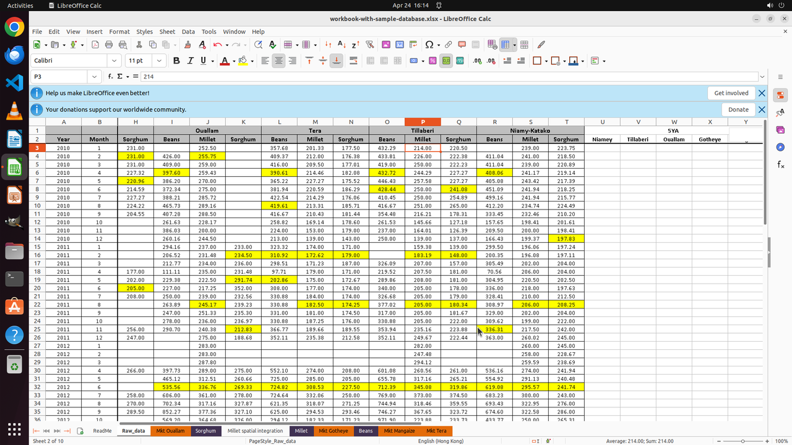

**Response:**
```
Now the order is:
1. ReadMe ✓
2. Raw_data ✓
3. Mkt Ouallam
4. Sorghum
5. Millet spatial integration
6. Millet
7. Mkt Gotheye
8. Beans
9. Mkt Mangaize
10. Mkt Tera

Next, I need to move "Beans" to position 3 (before "Mkt Ouallam"). Let me right-click on the Beans tab.
```

**Actions:** `pyautogui.rightClick(888, 1044)`

---

## Step 19

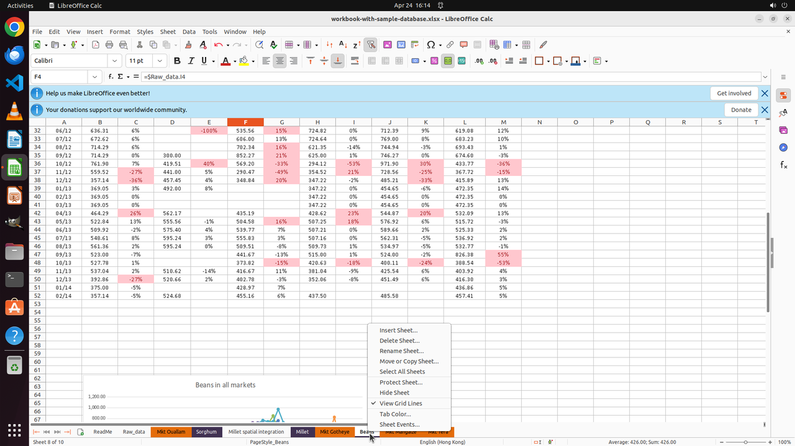

**Response:**
```
I can see the context menu on the Beans tab. Let me click "Move or Copy Sheet..."
```

**Actions:** `pyautogui.click(985, 874)`

---

## Step 20

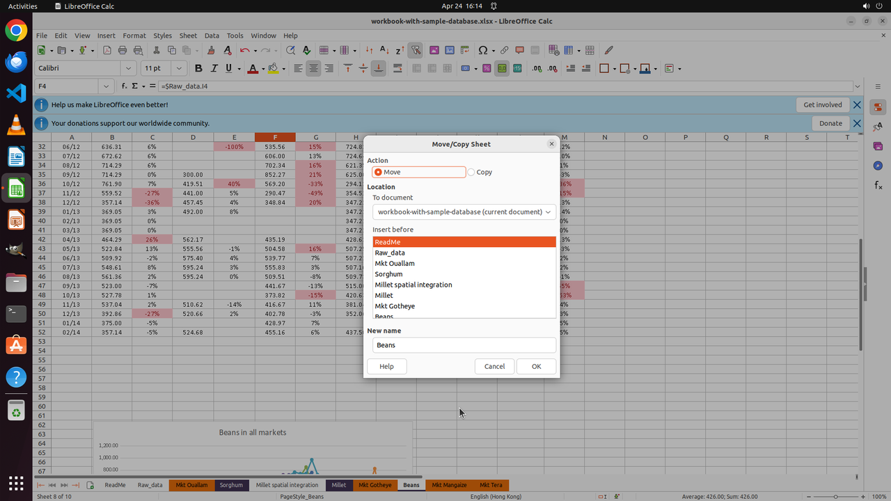

**Response:**
```
I need to move Beans before "Mkt Ouallam" (position 3, after Raw_data). Let me select "Mkt Ouallam" in the "Insert before" list.
```

**Actions:** `pyautogui.click(849, 567)`

---

## Step 21

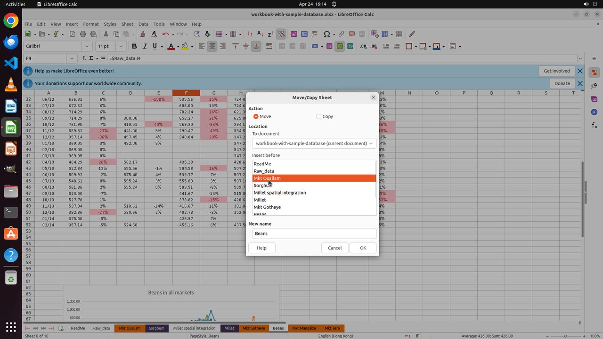

**Response:**
```
"Mkt Ouallam" is selected. This will move Beans to position 3 (after Raw_data). Let me click OK.
```

**Actions:** `pyautogui.click(1153, 789)`

---

## Step 22

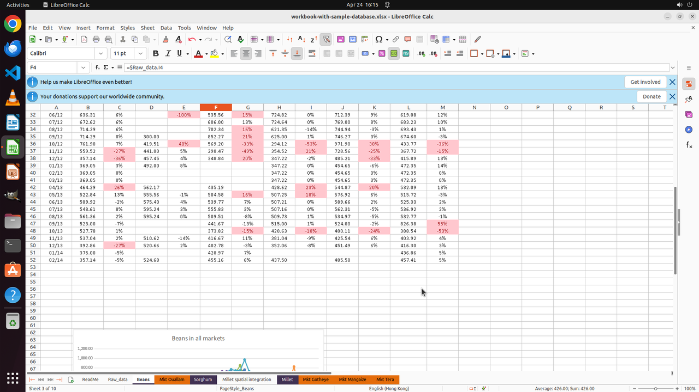

**Response:**
```
Now the order is:
1. ReadMe ✓
2. Raw_data ✓
3. Beans ✓
4. Mkt Ouallam
5. Sorghum
6. Millet spatial integration
7. Millet
8. Mkt Gotheye
9. Mkt Mangaize
10. Mkt Tera

Next, I need to move "Millet" to position 4 (before "Mkt Ouallam"). Let me right-click on the Millet tab.
```

**Actions:** `pyautogui.rightClick(786, 1044)`

---

## Step 23

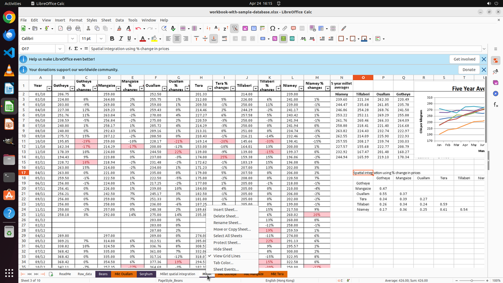

**Response:**
```
I see the context menu appeared but it seems I right-clicked on the wrong tab. Looking at the tabs, I can see "Millet" tab. Let me click "Move or Copy Sheet..." from this context menu.
```

**Actions:** `pyautogui.click(879, 874)`

---

## Step 24

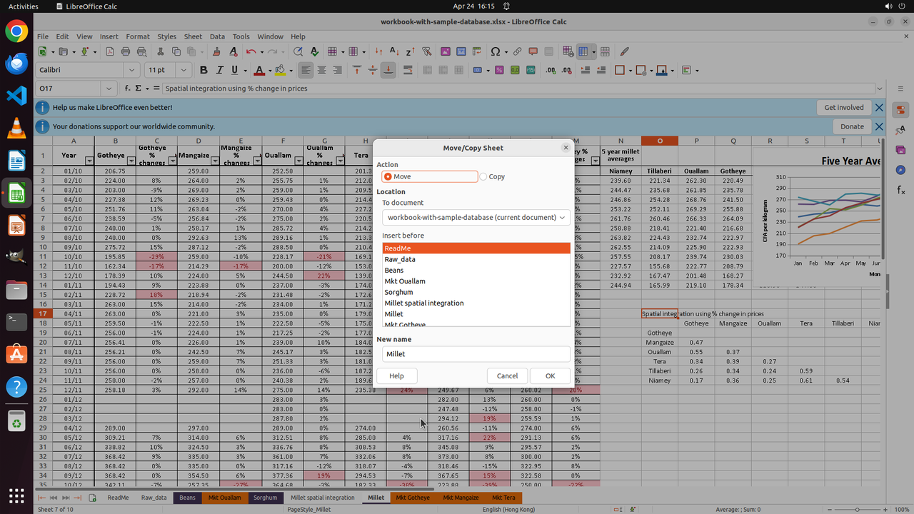

**Response:**
```
I can see the Move/Copy Sheet dialog for "Millet". I need to move it before "Mkt Ouallam" (position 4, after Beans). Let me select "Mkt Ouallam" in the list.
```

**Actions:** `pyautogui.click(849, 589)`

---

## Step 25

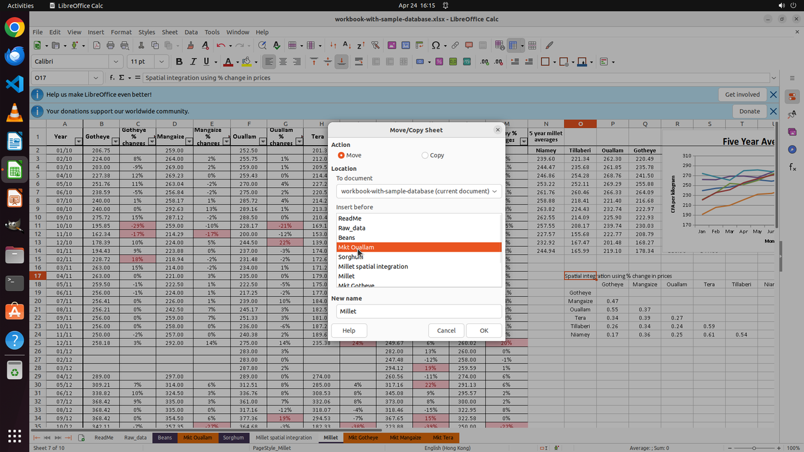

**Response:**
```
"Mkt Ouallam" is selected. This will move Millet before Mkt Ouallam (position 4, after Beans). Let me click OK.
```

**Actions:** `pyautogui.click(1153, 789)`

---

## Step 26

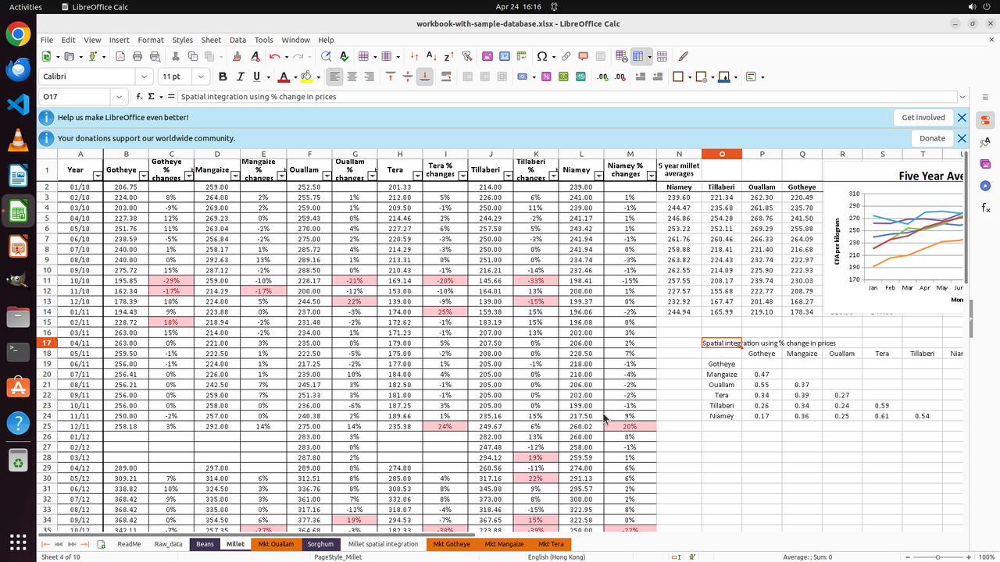

**Response:**
```
Now the order is:
1. ReadMe ✓
2. Raw_data ✓
3. Beans ✓
4. Millet ✓
5. Mkt Ouallam
6. Sorghum
7. Millet spatial integration
8. Mkt Gotheye
9. Mkt Mangaize
10. Mkt Tera

Next, I need to move "Sorghum" to position 5 (before "Mkt Ouallam"). Let me right-click on the Sorghum tab.
```

**Actions:** `pyautogui.rightClick(616, 1044)`

---

## Step 27

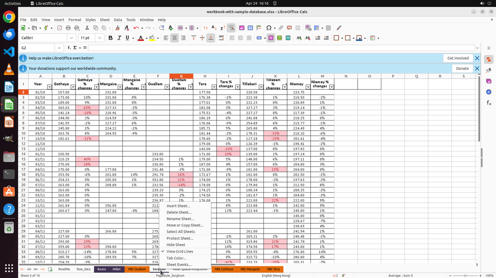

**Response:**
```
I can see the context menu on the Sorghum tab. Let me click "Move or Copy Sheet..."
```

**Actions:** `pyautogui.click(714, 874)`

---

## Step 28

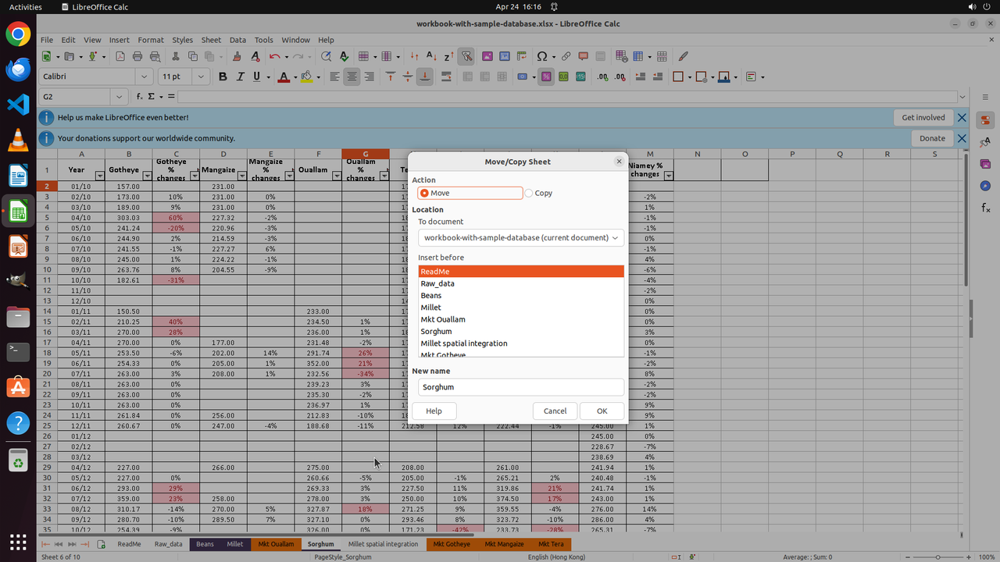

**Response:**
```
I need to move Sorghum before "Mkt Ouallam" (position 5, after Millet). Let me select "Mkt Ouallam" in the list.
```

**Actions:** `pyautogui.click(849, 612)`

---

## Step 29

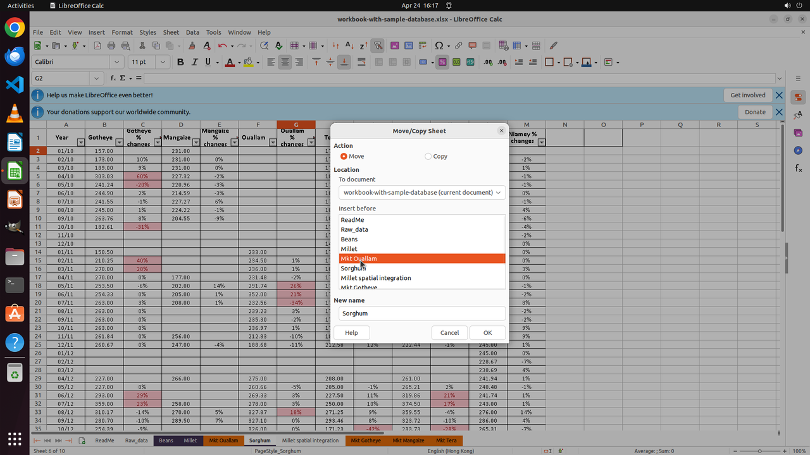

**Response:**
```
"Mkt Ouallam" is selected. This will move Sorghum to position 5 (after Millet, before Mkt Ouallam). Let me click OK.
```

**Actions:** `pyautogui.click(1153, 789)`

---

## Step 30

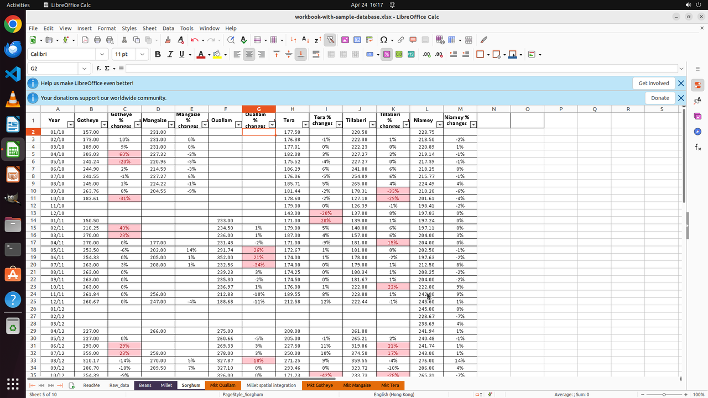

**Response:**
```
Now the order is:
1. ReadMe ✓
2. Raw_data ✓
3. Beans ✓
4. Millet ✓
5. Sorghum ✓
6. Mkt Ouallam
7. Millet spatial integration
8. Mkt Gotheye
9. Mkt Mangaize
10. Mkt Tera

Next, I need to move "Mkt Gotheye" to position 6 (before "Mkt Ouallam"). Let me right-click on the Mkt Gotheye tab.
```

**Actions:** `pyautogui.rightClick(870, 1045)`

---

## Step 31

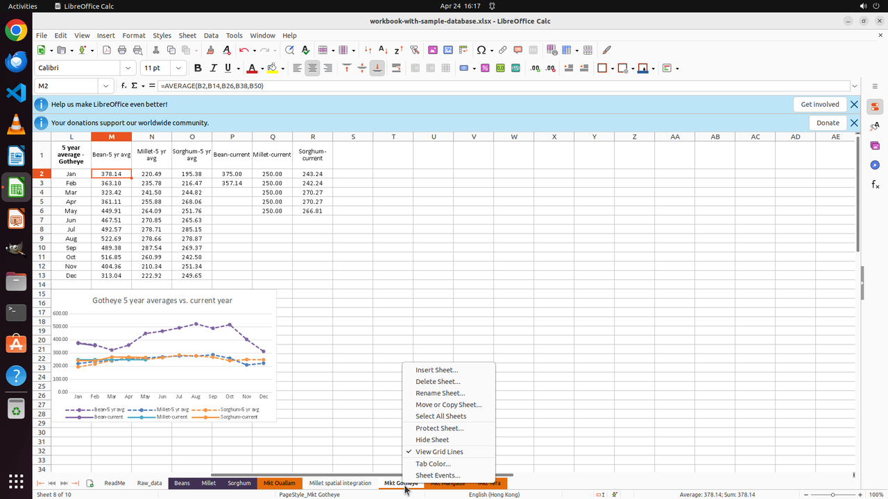

**Response:**
```
I can see the context menu on the Mkt Gotheye tab. Let me click "Move or Copy Sheet..."
```

**Actions:** `pyautogui.click(966, 874)`

---

## Step 32

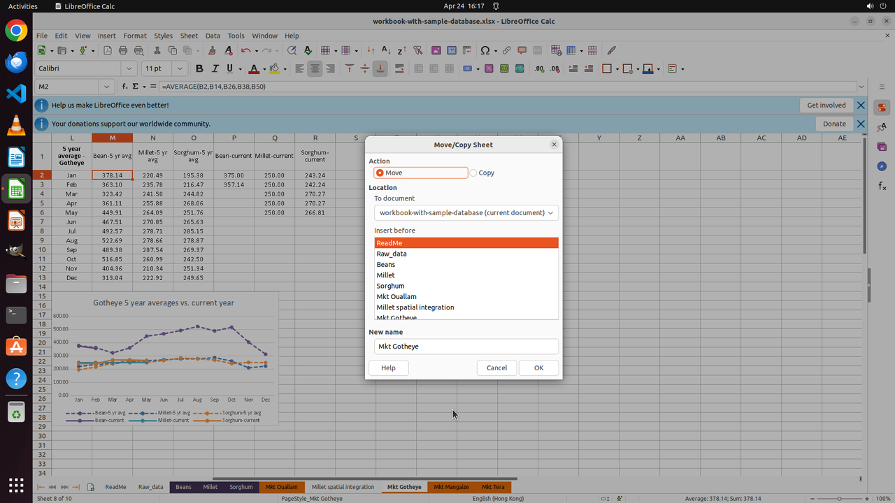

**Response:**
```
I need to move "Mkt Gotheye" before "Mkt Ouallam" (position 6, after Sorghum). Let me select "Mkt Ouallam" in the list.
```

**Actions:** `pyautogui.click(849, 634)`

---

## Step 33

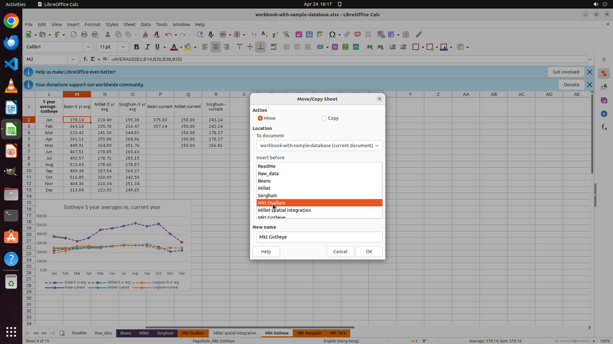

**Response:**
```
"Mkt Ouallam" is selected. This will move Mkt Gotheye before Mkt Ouallam (position 6, after Sorghum). Let me click OK.
```

**Actions:** `pyautogui.click(1153, 789)`

---

## Step 34

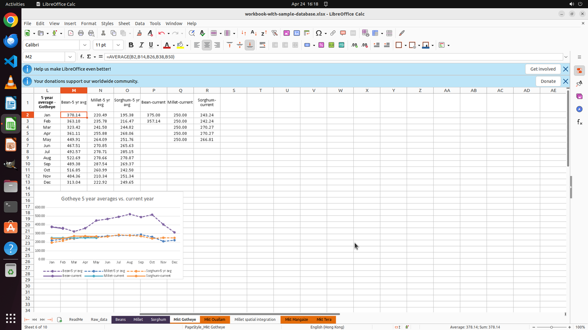

**Response:**
```
Now the order is:
1. ReadMe ✓
2. Raw_data ✓
3. Beans ✓
4. Millet ✓
5. Sorghum ✓
6. Mkt Gotheye ✓
7. Mkt Ouallam
8. Millet spatial integration
9. Mkt Mangaize
10. Mkt Tera

Next, I need to move "Mkt Mangaize" to position 7 (before "Mkt Ouallam"). Let me right-click on the Mkt Mangaize tab.
```

**Actions:** `pyautogui.rightClick(969, 1045)`

---

## Step 35

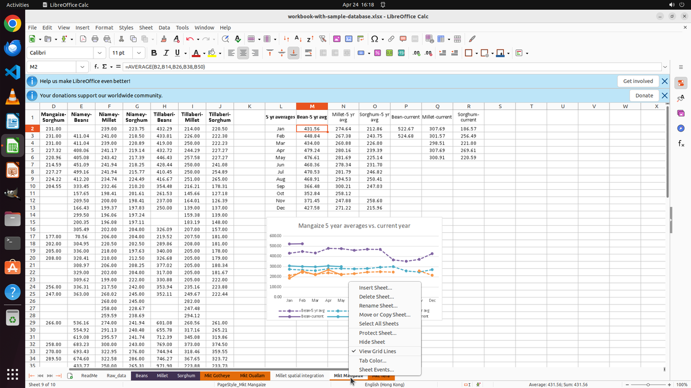

**Response:**
```
I can see the context menu on the Mkt Mangaize tab. Let me click "Move or Copy Sheet..."
```

**Actions:** `pyautogui.click(1065, 874)`

---

## Step 36

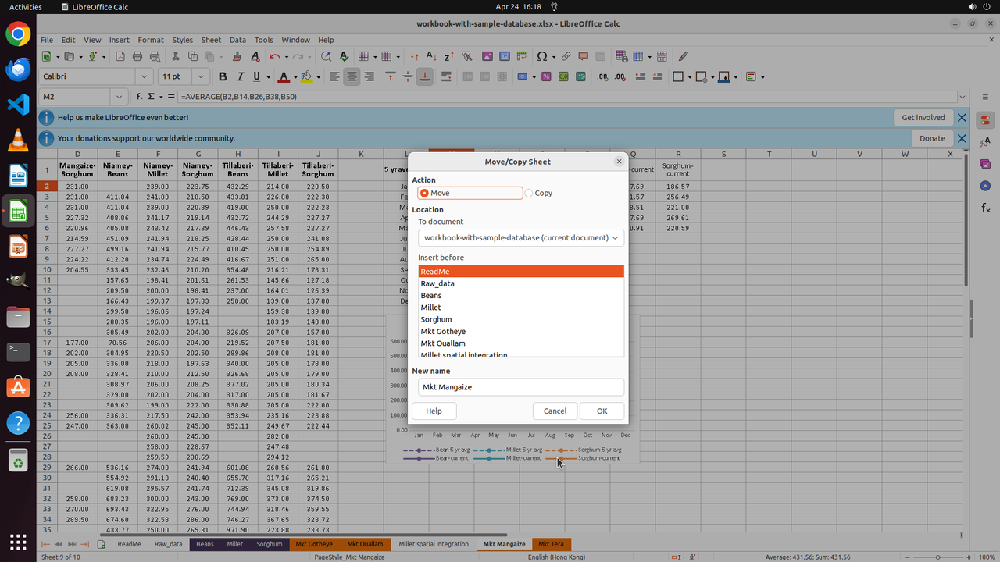

**Response:**
```
I need to move "Mkt Mangaize" before "Mkt Ouallam" (position 7, after Mkt Gotheye). Let me select "Mkt Ouallam" in the list.
```

**Actions:** `pyautogui.click(849, 658)`

---

## Step 37

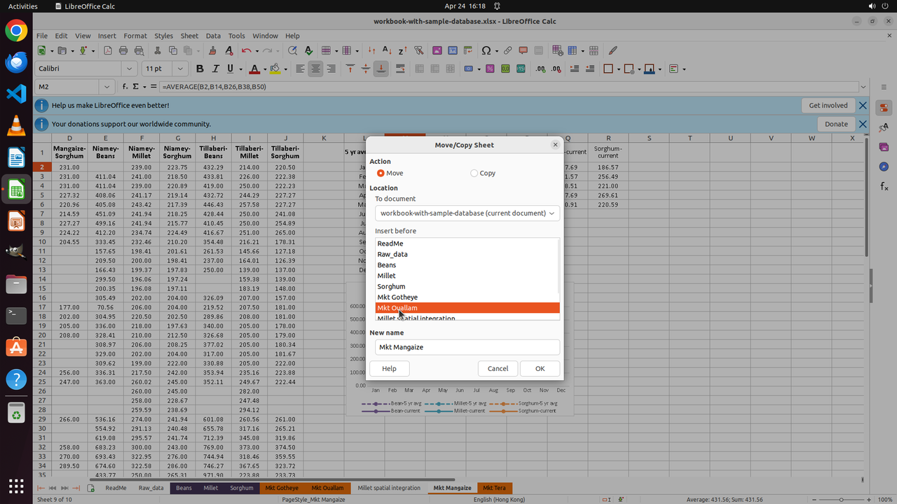

**Response:**
```
"Mkt Ouallam" is selected. This will move Mkt Mangaize before Mkt Ouallam (position 7, after Mkt Gotheye). Let me click OK.
```

**Actions:** `pyautogui.click(1153, 789)`

---

## Step 38

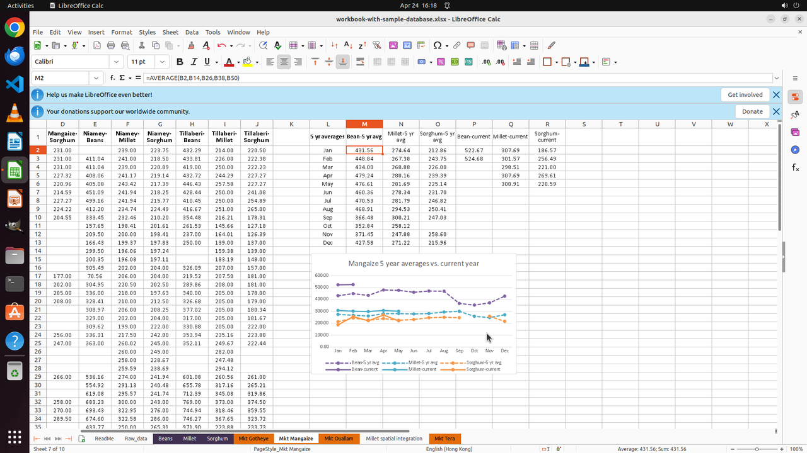

**Response:**
```
Now the order is:
1. ReadMe ✓
2. Raw_data ✓
3. Beans ✓
4. Millet ✓
5. Sorghum ✓
6. Mkt Gotheye ✓
7. Mkt Mangaize ✓
8. Mkt Ouallam
9. Millet spatial integration
10. Mkt Tera

Now I need to move "Mkt Tera" to position 9 (before "Millet spatial integration"). Let me right-click on the Mkt Tera tab.
```

**Actions:** `pyautogui.rightClick(1059, 1045)`

---

## Step 39

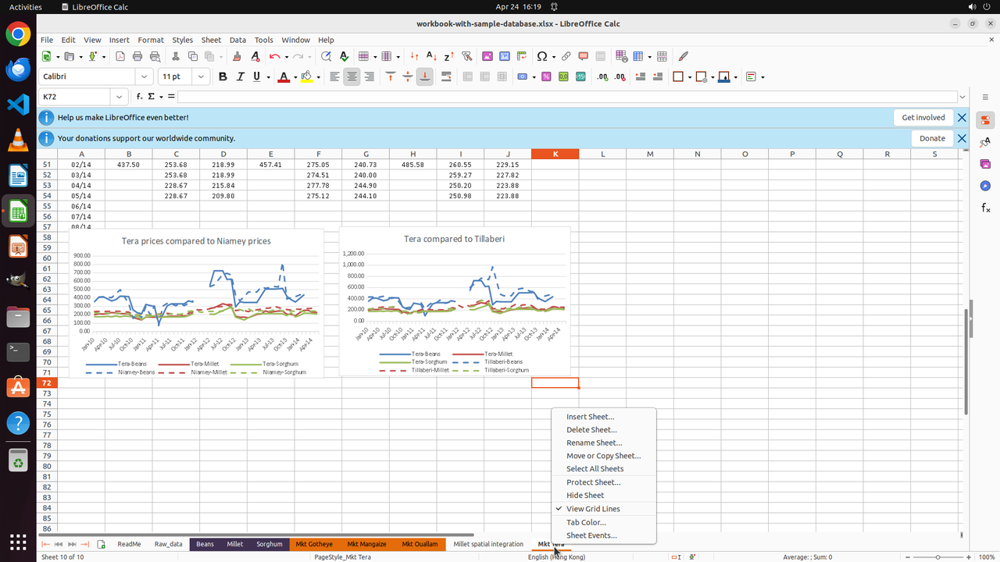

**Response:**
```
I can see the context menu on the Mkt Tera tab. Let me click "Move or Copy Sheet..."
```

**Actions:** `pyautogui.click(1153, 874)`

---

## Step 40

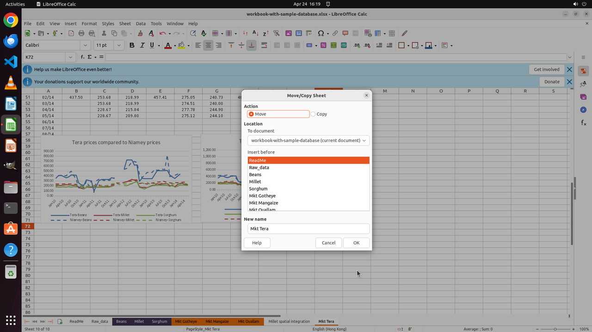

**Response:**
```
I need to move "Mkt Tera" before "Millet spatial integration" (position 9, after Mkt Ouallam). I need to scroll down in the list to find "Millet spatial integration". Let me scroll down to see it.
```

**Actions:** `pyautogui.click(849, 682)`

---

## Step 41

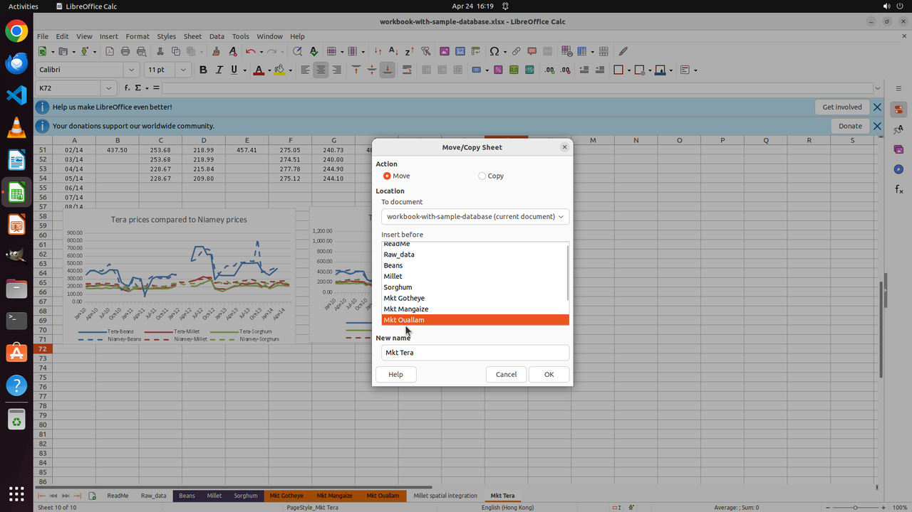

**Response:**
```
I see "Mkt Ouallam" is selected but I need to select "Millet spatial integration" which should be below it. I need to scroll down in the list. Let me scroll down to see "Millet spatial integration".
```

**Actions:** `pyautogui.scroll(-2, 984, 645)`

---

## Step 42

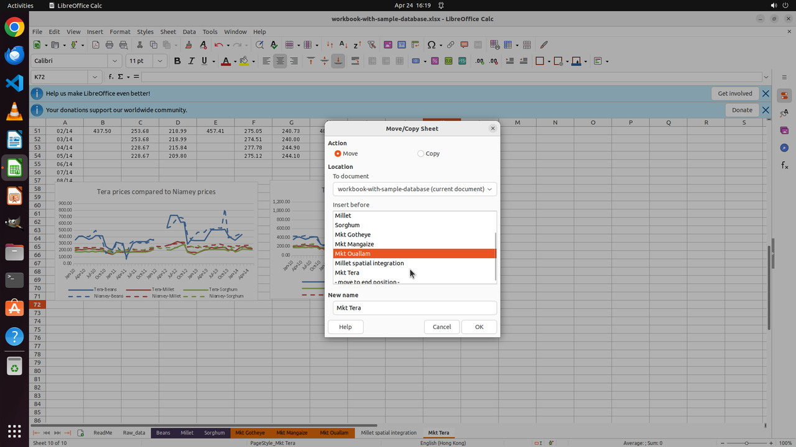

**Response:**
```
Now I can see the full list. I need to move "Mkt Tera" before "Millet spatial integration". Let me select "Millet spatial integration" in the list.
```

**Actions:** `pyautogui.click(888, 633)`

---

## Step 43

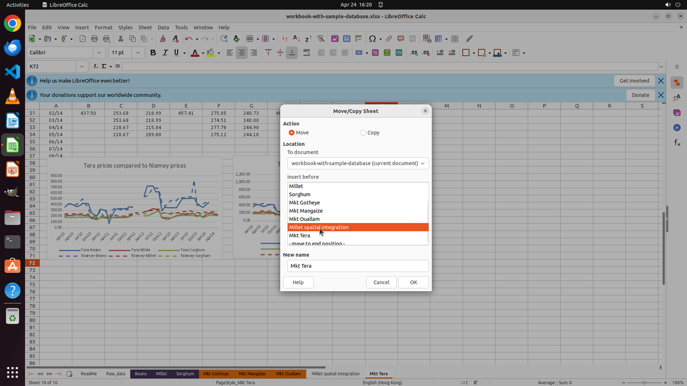

**Response:**
```
"Millet spatial integration" is selected. This will move Mkt Tera before "Millet spatial integration" (position 9, after Mkt Ouallam). Let me click OK.
```

**Actions:** `pyautogui.click(1153, 789)`

---

## Step 44

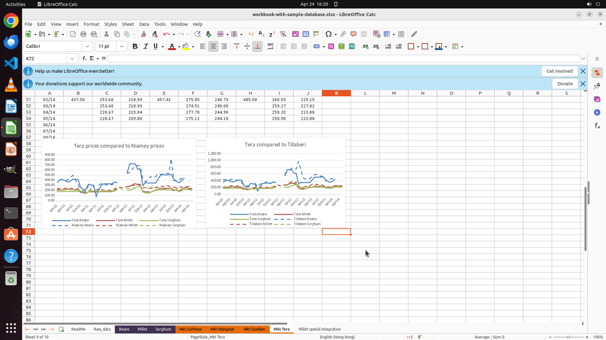

**Response:**
```
The sheets are now in the correct order:
1. ReadMe ✓
2. Raw_data ✓
3. Beans ✓
4. Millet ✓
5. Sorghum ✓
6. Mkt Gotheye ✓
7. Mkt Mangaize ✓
8. Mkt Ouallam ✓
9. Mkt Tera ✓
10. Millet spatial integration ✓

The sheet order matches the requirements from the reminder.docx. Now let me save the file.
```

**Actions:** `pyautogui.keyDown('ctrl')
pyautogui.keyDown('s')
pyautogui.keyUp('s')
pyautogui.keyUp('ctrl')`

---

## Step 45

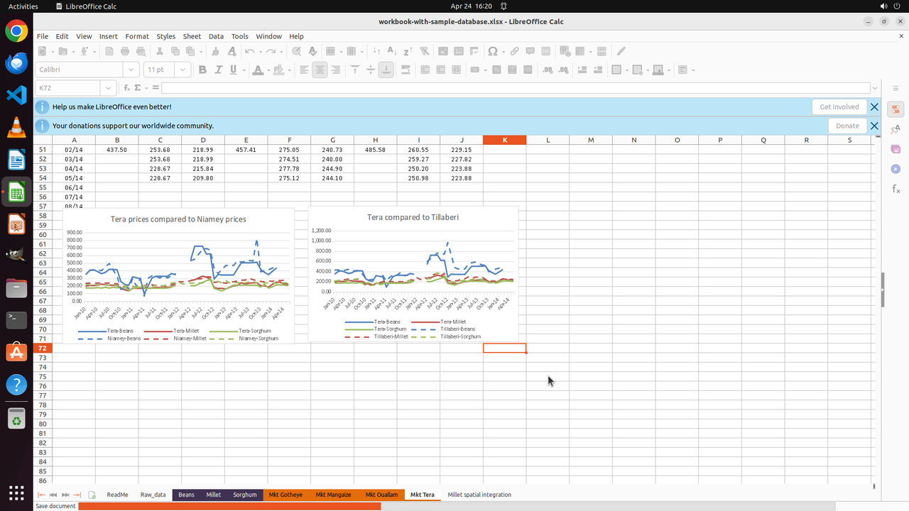

**Response:**
```
I can see the file is being saved (there's a "Save document" progress bar at the bottom). Let me wait for it to complete.
```

**Actions:** `time.sleep(0.5)`

---

## Step 46


**Response:**
```
The file has been saved successfully. The sheets are now arranged in the correct order as specified in the reminder.docx:

1. ReadMe
2. Raw_data
3. Beans
4. Millet
5. Sorghum
6. Mkt Gotheye
7. Mkt Mangaize
8. Mkt Ouallam
9. Mkt Tera
10. Millet spatial integration

The task is complete.

DONE
```

**Actions:** `DONE`

---
