# Task bc2b57f3-686d-4ec9-87ce-edf850b7e442

**Instruction:** The requirements of my data analysis assignment are listed in "reminder.docx" on the desktop. Help me modify my assignment opended accordingly.

**Score:** 1.0

**Wall clock:** 9m 26s

**Steps:** 44

**Cost:** $1.52

---

## Step 1

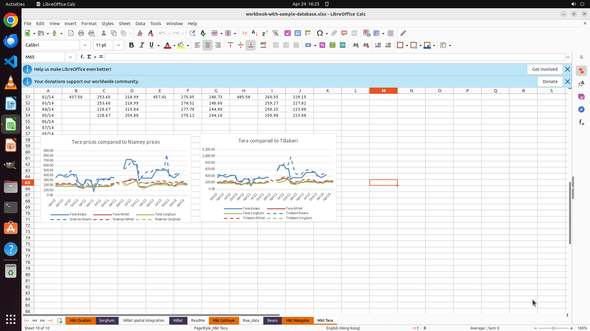

**Response:**
```
I need to first read the "reminder.docx" file on the desktop to understand the requirements, and then modify the assignment accordingly.

Let me start by opening the reminder.docx file.
```

**Actions:** `pyautogui.keyDown('command')
pyautogui.keyUp('command')`

---

## Step 2


**Response:**
```
Let me open a terminal to read the reminder.docx file first.
```

**Actions:** `pyautogui.keyDown('esc')
pyautogui.keyUp('esc')`

---

## Step 3


**Response:**
```
Let me right-click on the desktop to find the file manager or open a terminal application.
```

**Actions:** `pyautogui.rightClick(960, 600)`

---

## Step 4

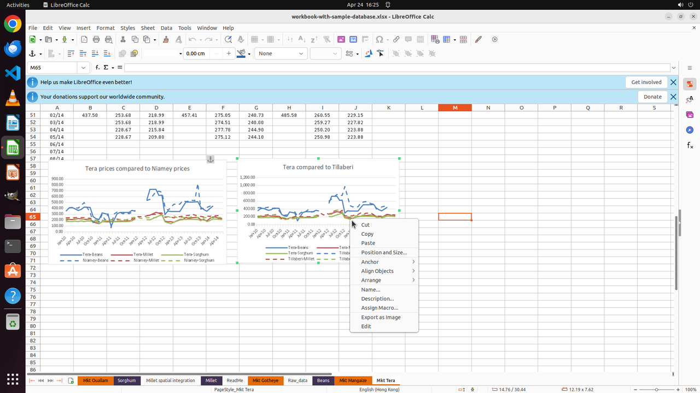

**Response:**
```
I see a context menu appeared on the chart. Let me close this and open a terminal to read the reminder.docx file.
```

**Actions:** `pyautogui.keyDown('esc')
pyautogui.keyUp('esc')`

---

## Step 5

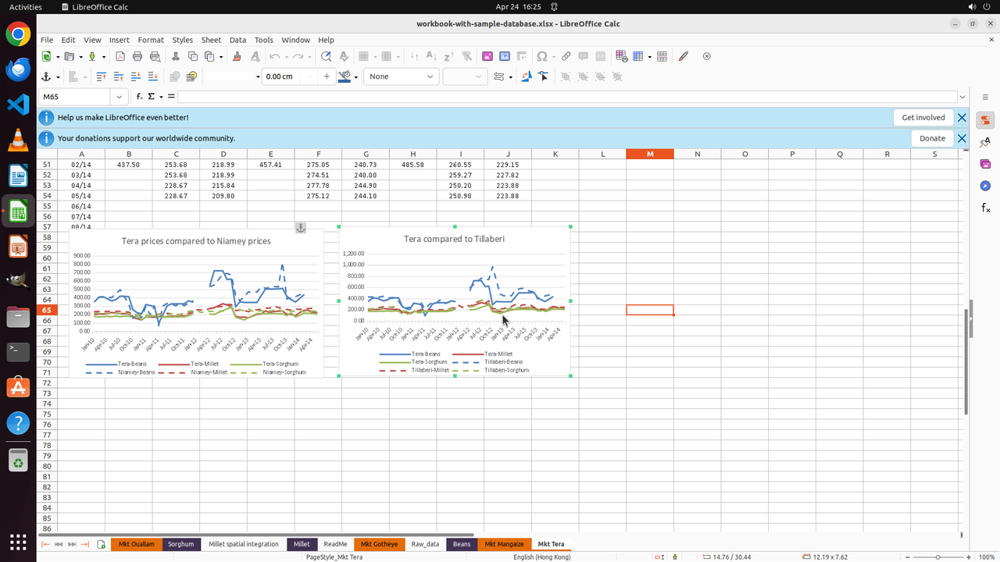

**Response:**
```
Let me click somewhere outside the chart to deselect it, then open a terminal application.
```

**Actions:** `pyautogui.click(1350, 825)`

---

## Step 6


**Response:**
```
Good, the chart is deselected. Now let me open a terminal to read the reminder.docx file. I'll look for a terminal application in the taskbar.
```

**Actions:** `pyautogui.click(33, 672)`

---

## Step 7

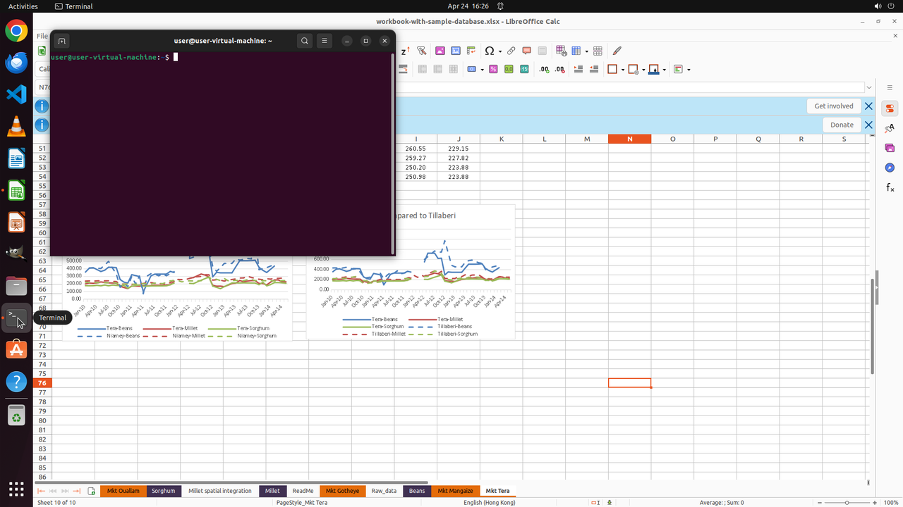

**Response:**
```
A terminal is open. Let me read the reminder.docx file using a command-line tool.
```

**Actions:** `import subprocess, shlex; subprocess.run(f'xdotool type --delay 12 -- ' + shlex.quote('cd ~/Desktop && python3 -c "\nimport zipfile\nfrom x'), shell=True, check=True)
import time; time.sleep(0.05)
imp`

---

## Step 8

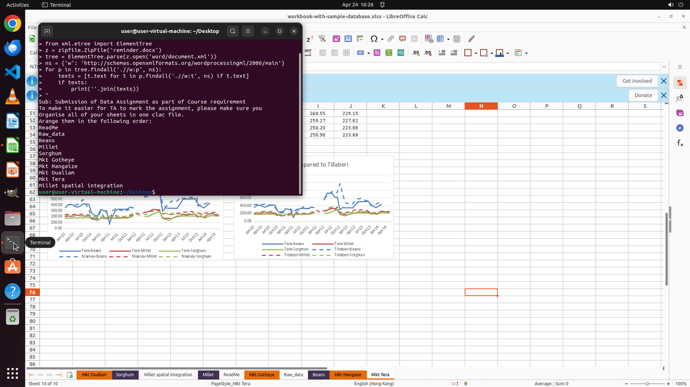

**Response:**
```
I can now read the reminder.docx content. Let me scroll up to see the full content:

The reminder says:
- **Sub: Submission of Data Assignment as part of Course requirement**
- To make it easier for TA to mark the assignment, please make sure you
- Organise all of your sheets in one clac file.
- Arrange them in the following order:
  1. ReadMe
  2. Raw_data
  3. Beans
  4. Millet
  5. Sorghum
  6. Mkt Gotheye
  7. Mkt Mangalize (likely Mkt Mangalize)
  8. Mkt Ouallam
  9. Mkt Tera
  10. Millet spatial integration

So I need to rearrange the sheet tabs in the LibreOffice Calc file to match this order. Let me check the current order of tabs.

Looking at the current tab order at the bottom:
- Mkt Ouallam, Sorghum, Millet spatial integration, Millet, ReadMe, Raw_data, Beans, Mkt Gotheye, Mkt Mangalize, Mkt Tera

The required order is:
1. ReadMe
2. Raw_data
3. Beans
4. Millet
5. Sorghum
6. Mkt Gotheye
7. Mkt Mangalize (need to check exact name)
8. Mkt Ouallam
9. Mkt Tera
10. Millet spatial integration

Let me switch to the LibreOffice Calc window and start rearranging the tabs.
```

**Actions:** `pyautogui.click(990, 45)`

---

## Step 9

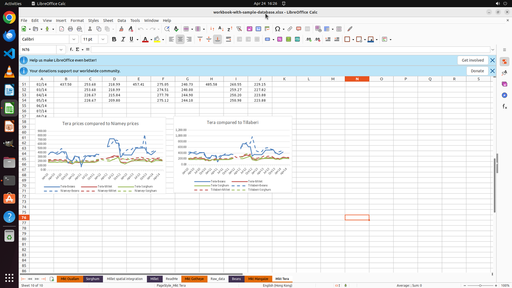

**Response:**
```
Now I can see the LibreOffice Calc with the sheet tabs at the bottom. The current order is:
- Mkt Ouallam, Sorghum, Millet spatial integration, Millet, ReadMe, Raw_data, Beans, Mkt Gotheye, Mkt Mangalize, Mkt Tera

The required order is:
1. ReadMe
2. Raw_data
3. Beans
4. Millet
5. Sorghum
6. Mkt Gotheye
7. Mkt Mangalize
8. Mkt Ouallam
9. Mkt Tera
10. Millet spatial integration

I'll rearrange the tabs by right-clicking on each tab and using "Move or Copy Sheet" option. Let me start with the "ReadMe" tab - it needs to be first.
```

**Actions:** `pyautogui.rightClick(646, 1044)`

---

## Step 10

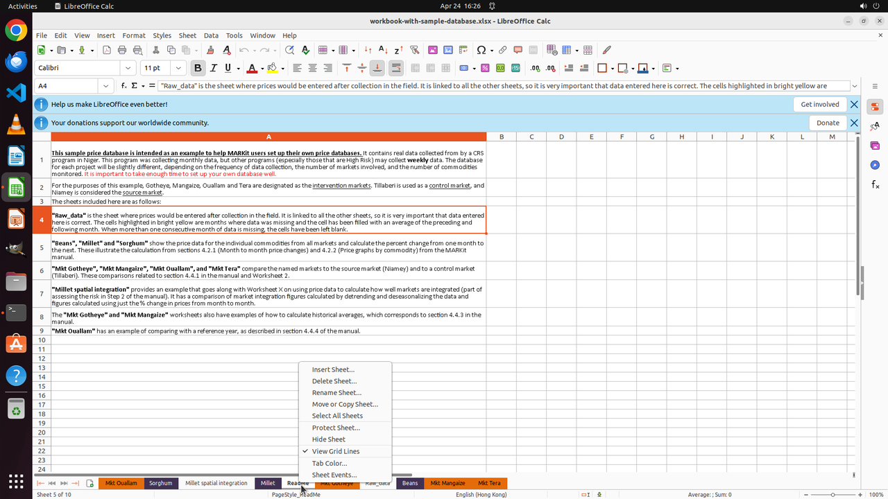

**Response:**
```
I can see the context menu with "Move or Copy Sheet..." option. Let me click on it to move the ReadMe sheet to the first position.
```

**Actions:** `pyautogui.click(744, 873)`

---

## Step 11

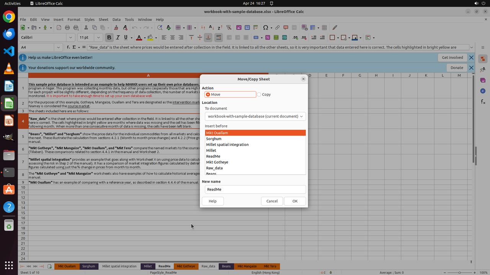

**Response:**
```
I can see the Move/Copy Sheet dialog. The current sheet is "ReadMe" and I need to move it before "Mkt Ouallam" (which is the first sheet). "Mkt Ouallam" is already selected in the "Insert before" list. Let me click OK to move ReadMe to the first position.
```

**Actions:** `pyautogui.click(847, 520)`

---

## Step 12

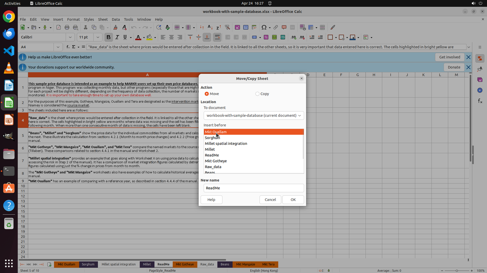

**Response:**
```
"Mkt Ouallam" is already selected as the "Insert before" position, which means ReadMe will be moved to before Mkt Ouallam (i.e., the first position). Let me click OK.
```

**Actions:** `pyautogui.click(1153, 789)`

---

## Step 13

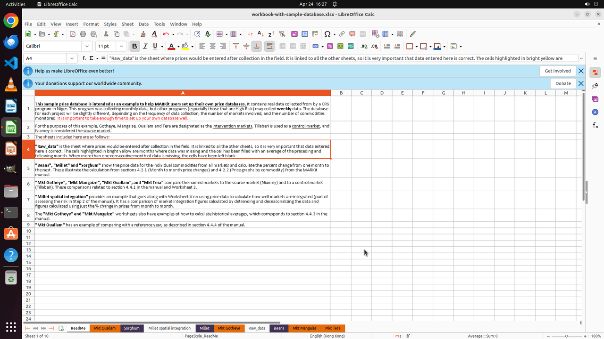

**Response:**
```
ReadMe is now the first sheet. The current order is:
ReadMe, Mkt Ouallam, Sorghum, Millet spatial integration, Millet, Mkt Gotheye, Raw_data, Beans, Mkt Mangalize, Mkt Tera

Now I need to move "Raw_data" to the second position (before "Mkt Ouallam"). Let me right-click on the Raw_data tab.
```

**Actions:** `pyautogui.rightClick(816, 1044)`

---

## Step 14

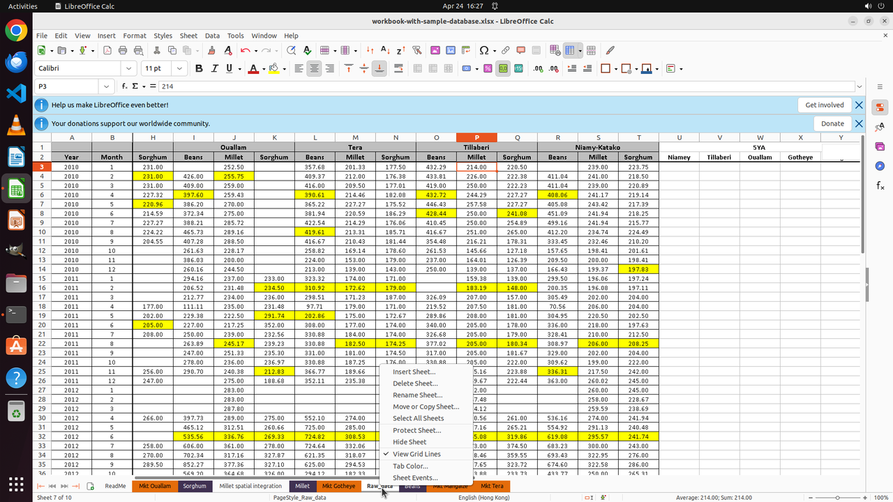

**Response:**
```
I can see the context menu for the Raw_data sheet. Let me click "Move or Copy Sheet..."
```

**Actions:** `pyautogui.click(901, 873)`

---

## Step 15

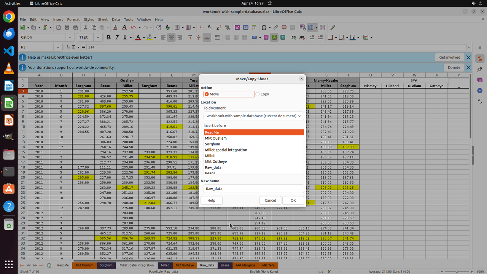

**Response:**
```
I need to move Raw_data before "Mkt Ouallam" (which will place it as the second sheet, after ReadMe). Let me select "Mkt Ouallam" in the "Insert before" list.
```

**Actions:** `pyautogui.click(847, 544)`

---

## Step 16

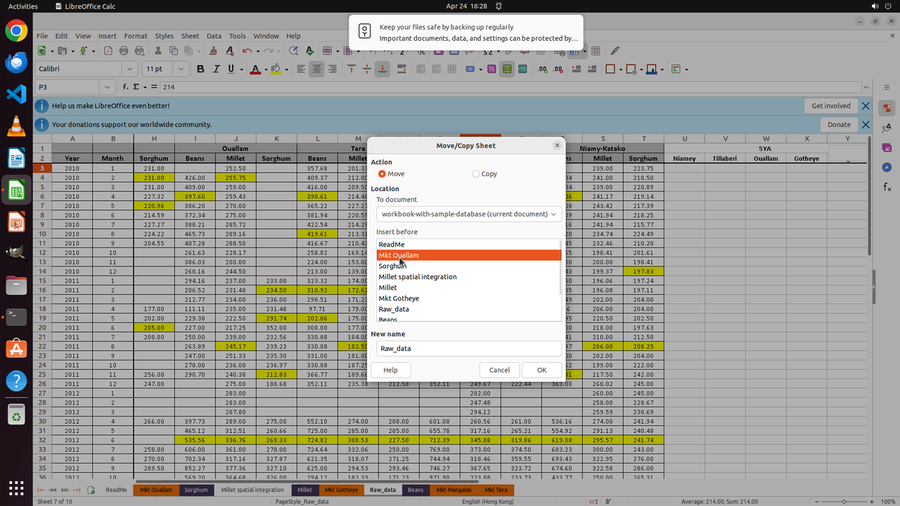

**Response:**
```
"Mkt Ouallam" is selected. Now I'll click OK to move Raw_data before Mkt Ouallam (making it the 2nd sheet after ReadMe).
```

**Actions:** `pyautogui.click(1153, 789)`

---

## Step 17

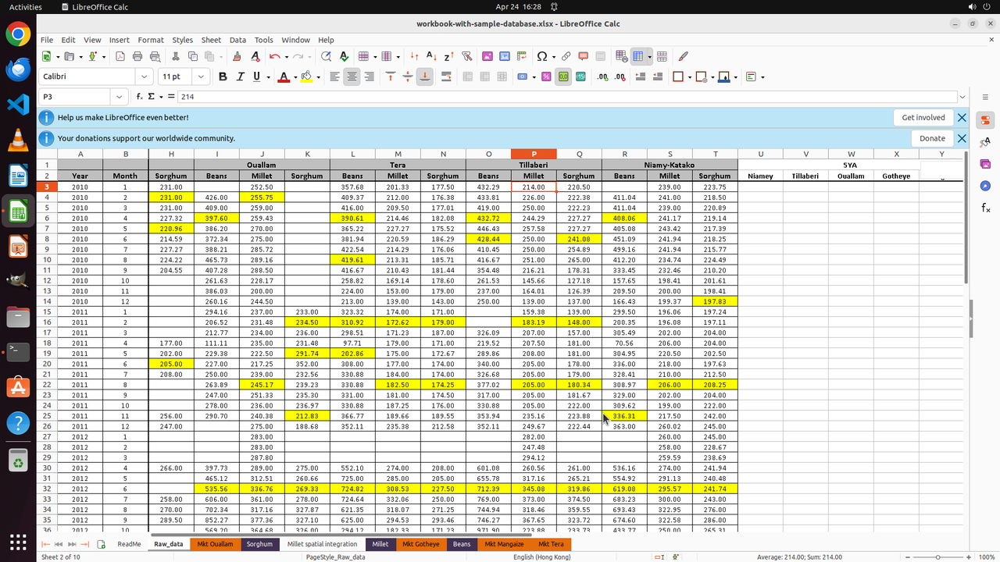

**Response:**
```
Raw_data is now the 2nd sheet. The current order is:
ReadMe, Raw_data, Mkt Ouallam, Sorghum, Millet spatial integration, Millet, Mkt Gotheye, Beans, Mkt Mangalize, Mkt Tera

Now I need to move "Beans" to the 3rd position (before "Mkt Ouallam"). Let me right-click on the Beans tab.
```

**Actions:** `pyautogui.rightClick(886, 1044)`

---

## Step 18

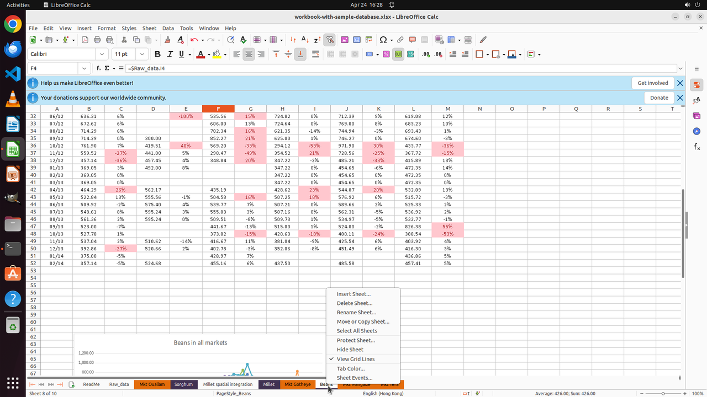

**Response:**
```
I can see the context menu for the Beans sheet. Let me click "Move or Copy Sheet..."
```

**Actions:** `pyautogui.click(984, 873)`

---

## Step 19

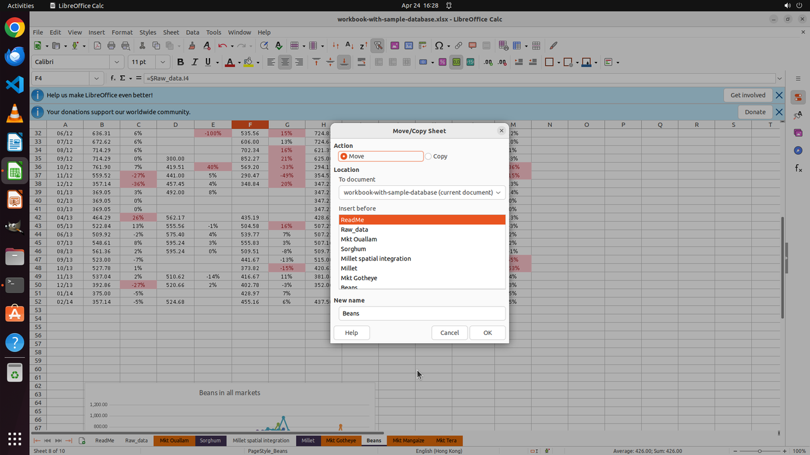

**Response:**
```
I need to move Beans before "Mkt Ouallam" to make it the 3rd sheet. Let me select "Mkt Ouallam" in the list.
```

**Actions:** `pyautogui.click(847, 567)`

---

## Step 20

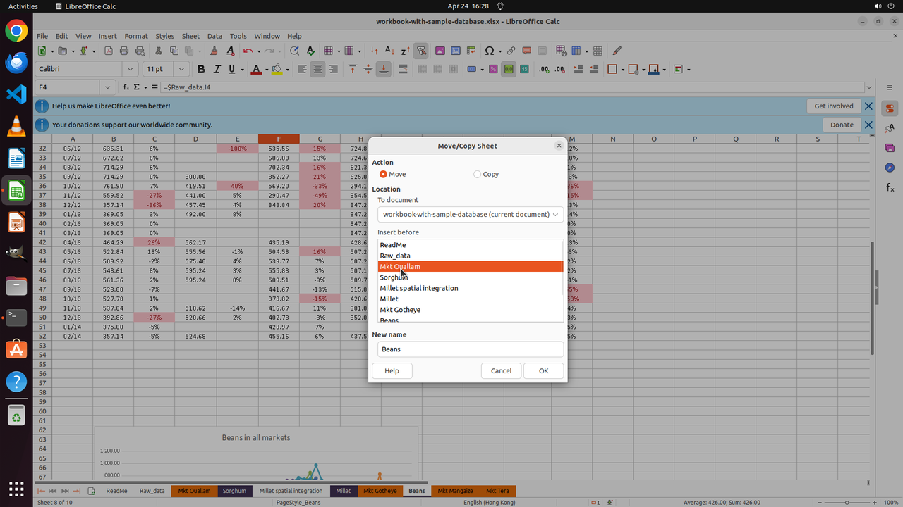

**Response:**
```
"Mkt Ouallam" is selected. Now I'll click OK to move Beans before Mkt Ouallam (making it the 3rd sheet).
```

**Actions:** `pyautogui.click(1153, 789)`

---

## Step 21

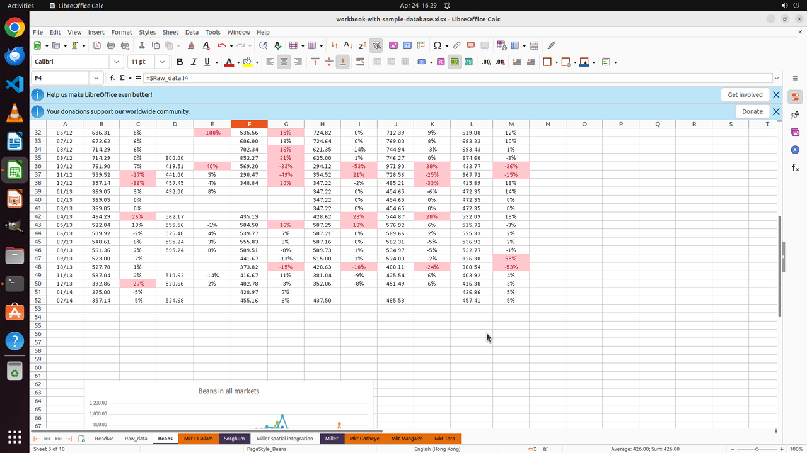

**Response:**
```
Beans is now the 3rd sheet. The current order is:
ReadMe, Raw_data, Beans, Mkt Ouallam, Sorghum, Millet spatial integration, Millet, Mkt Gotheye, Mkt Mangalize, Mkt Tera

Now I need to move "Millet" to the 4th position (before "Mkt Ouallam"). Let me right-click on the Millet tab.
```

**Actions:** `pyautogui.rightClick(786, 1044)`

---

## Step 22

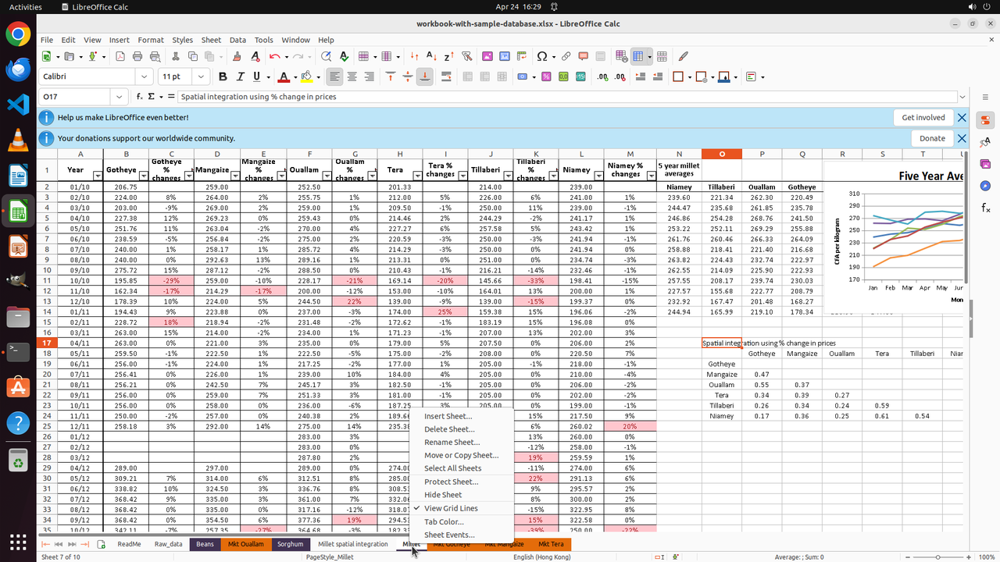

**Response:**
```
I can see the context menu for the Millet sheet. Let me click "Move or Copy Sheet..."
```

**Actions:** `pyautogui.click(883, 873)`

---

## Step 23

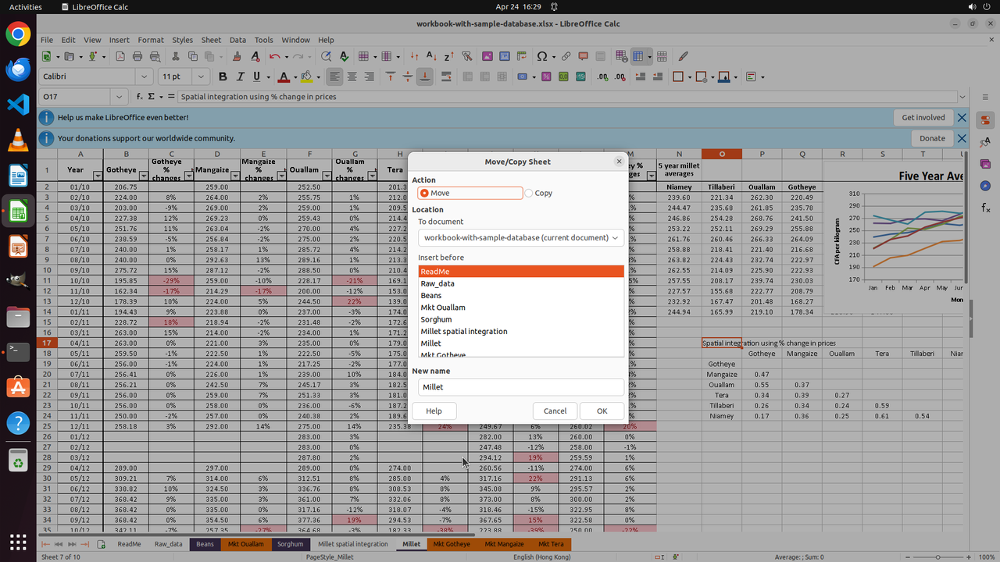

**Response:**
```
I need to move Millet before "Mkt Ouallam" to make it the 4th sheet. Let me select "Mkt Ouallam" in the list.
```

**Actions:** `pyautogui.click(847, 589)`

---

## Step 24

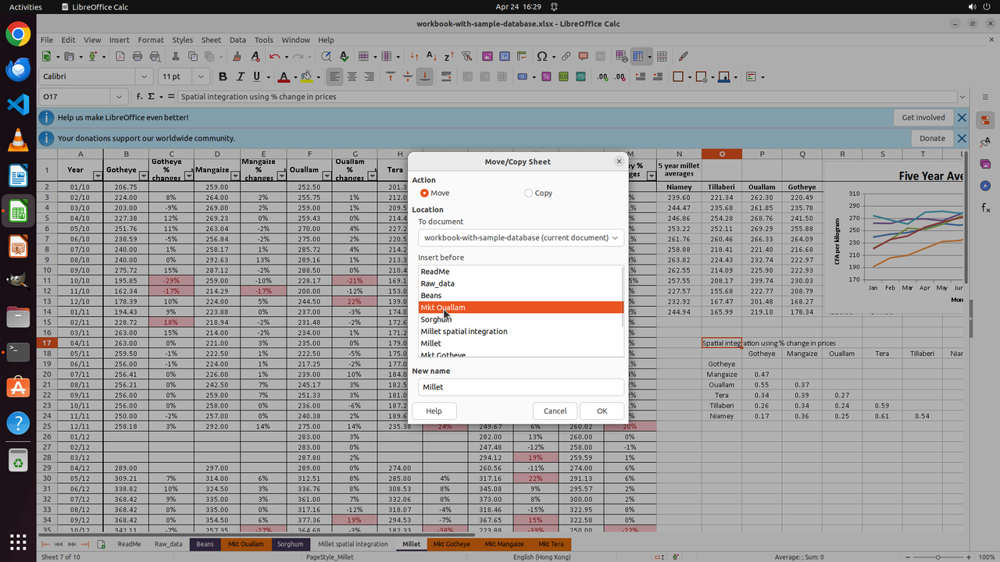

**Response:**
```
"Mkt Ouallam" is selected. Now I'll click OK to move Millet before Mkt Ouallam (making it the 4th sheet).
```

**Actions:** `pyautogui.click(1153, 789)`

---

## Step 25

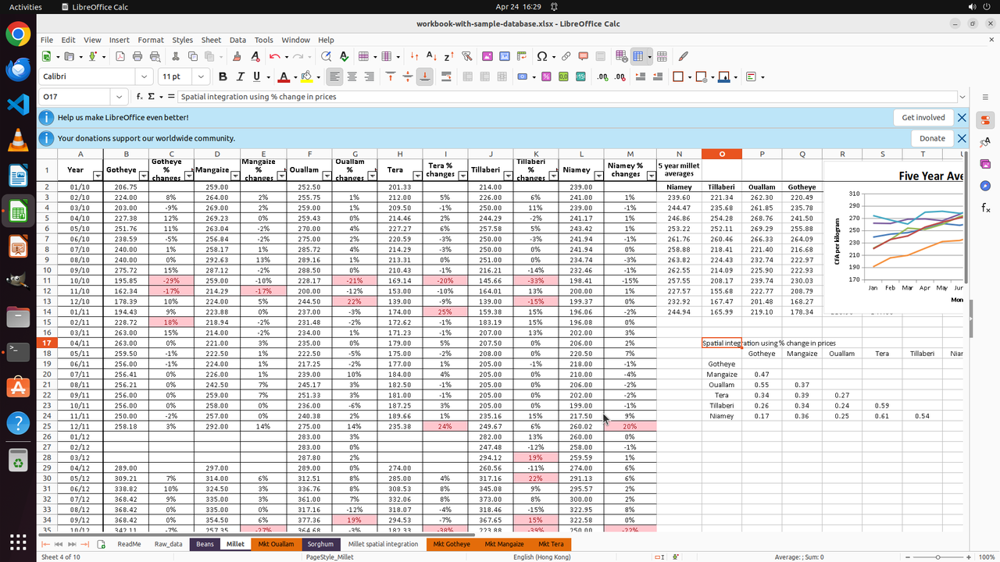

**Response:**
```
Millet is now the 4th sheet. The current order is:
ReadMe, Raw_data, Beans, Millet, Mkt Ouallam, Sorghum, Millet spatial integration, Mkt Gotheye, Mkt Mangalize, Mkt Tera

Now I need to move "Sorghum" to the 5th position (before "Mkt Ouallam"). Let me right-click on the Sorghum tab.
```

**Actions:** `pyautogui.rightClick(615, 1044)`

---

## Step 26

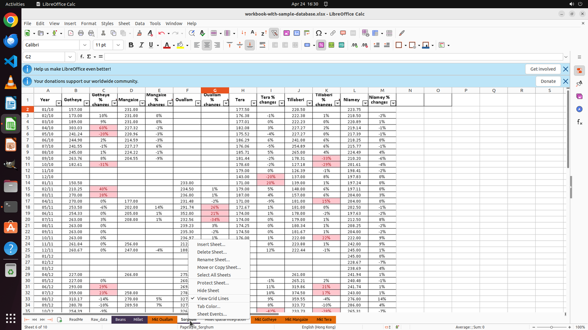

**Response:**
```
I can see the context menu for the Sorghum sheet. Let me click "Move or Copy Sheet..."
```

**Actions:** `pyautogui.click(714, 873)`

---

## Step 27

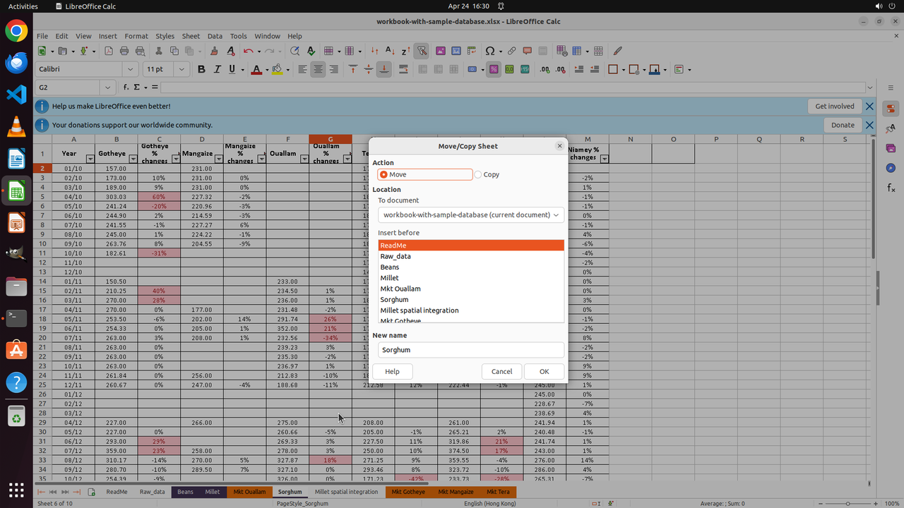

**Response:**
```
I need to move Sorghum before "Mkt Ouallam" to make it the 5th sheet. Let me select "Mkt Ouallam" in the list.
```

**Actions:** `pyautogui.click(847, 612)`

---

## Step 28

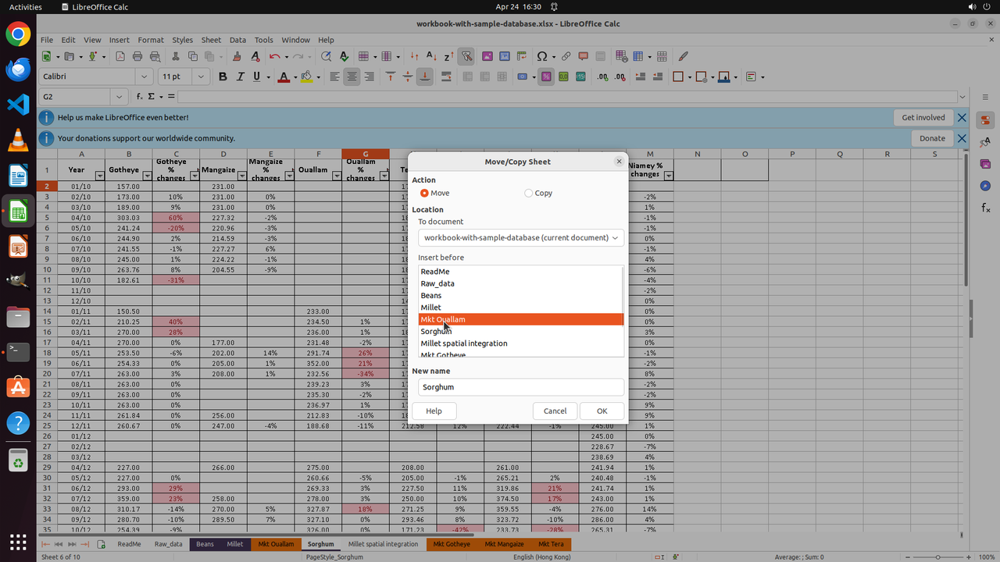

**Response:**
```
"Mkt Ouallam" is selected. Now I'll click OK to move Sorghum before Mkt Ouallam (making it the 5th sheet).
```

**Actions:** `pyautogui.click(1153, 789)`

---

## Step 29

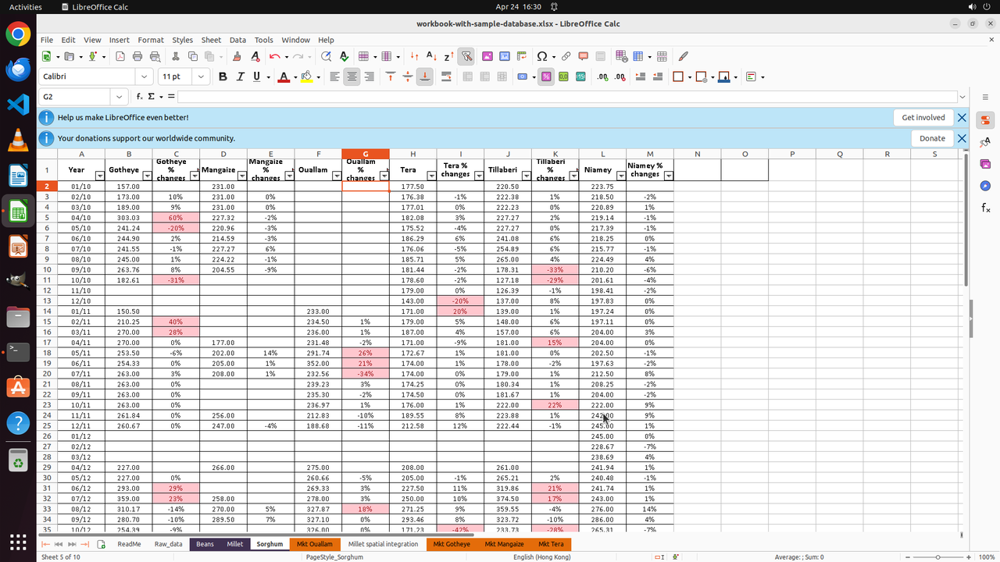

**Response:**
```
Sorghum is now the 5th sheet. The current order is:
ReadMe, Raw_data, Beans, Millet, Sorghum, Mkt Ouallam, Millet spatial integration, Mkt Gotheye, Mkt Mangalize, Mkt Tera

Now I need to move "Mkt Gotheye" to the 6th position (before "Mkt Ouallam"). Let me right-click on the Mkt Gotheye tab.
```

**Actions:** `pyautogui.rightClick(865, 1044)`

---

## Step 30

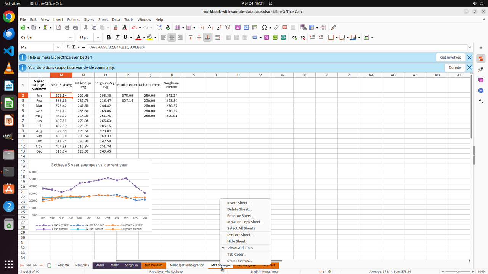

**Response:**
```
I can see the context menu for the Mkt Gotheye sheet. Let me click "Move or Copy Sheet..."
```

**Actions:** `pyautogui.click(961, 873)`

---

## Step 31

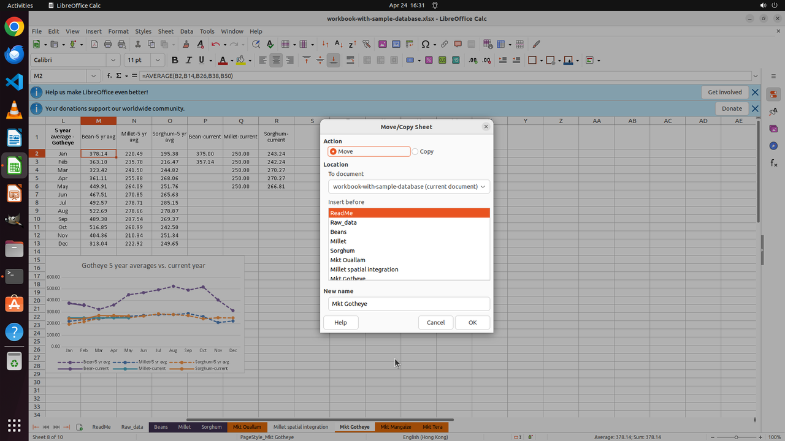

**Response:**
```
I need to move Mkt Gotheye before "Mkt Ouallam" to make it the 6th sheet. Let me select "Mkt Ouallam" in the list.
```

**Actions:** `pyautogui.click(847, 634)`

---

## Step 32

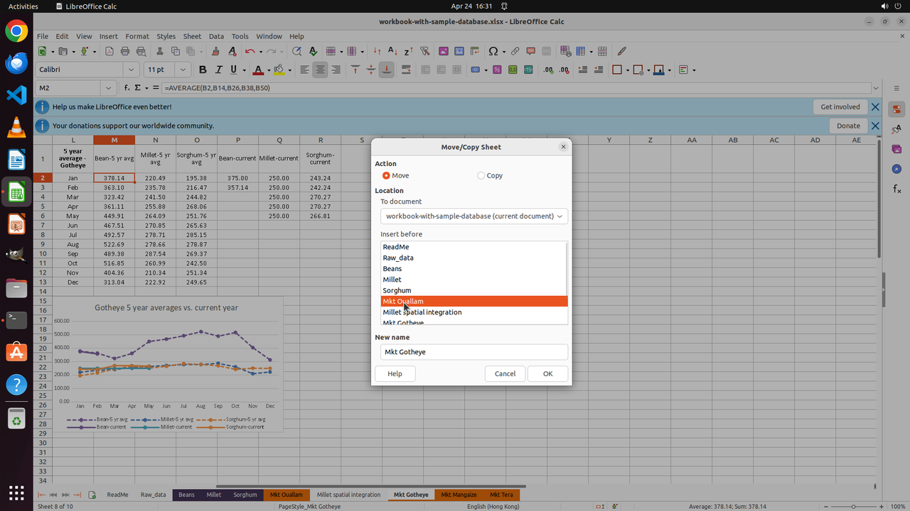

**Response:**
```
"Mkt Ouallam" is selected. Now I'll click OK to move Mkt Gotheye before Mkt Ouallam (making it the 6th sheet).
```

**Actions:** `pyautogui.click(1153, 789)`

---

## Step 33

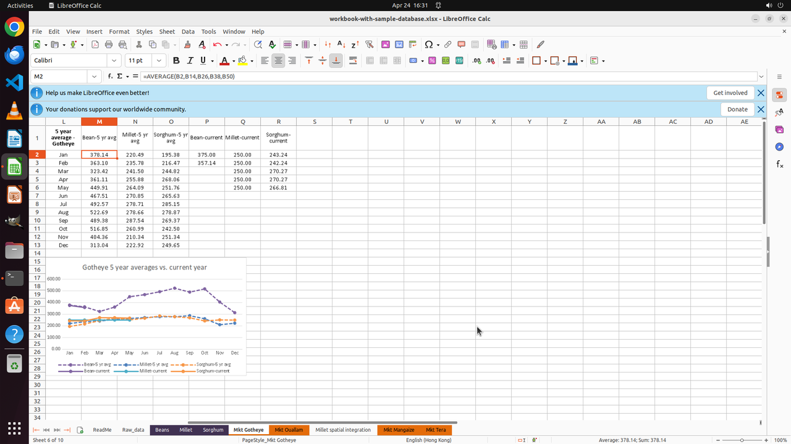

**Response:**
```
Mkt Gotheye is now the 6th sheet. The current order is:
ReadMe, Raw_data, Beans, Millet, Sorghum, Mkt Gotheye, Mkt Ouallam, Millet spatial integration, Mkt Mangalize, Mkt Tera

Now I need to move "Mkt Mangalize" to the 7th position (before "Mkt Ouallam"). Let me right-click on the Mkt Mangalize tab.
```

**Actions:** `pyautogui.rightClick(967, 1044)`

---

## Step 34

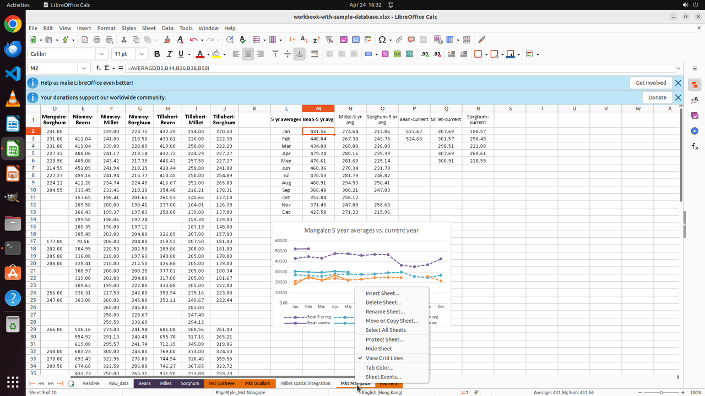

**Response:**
```
I can see the context menu for the Mkt Mangalize sheet. Let me click "Move or Copy Sheet..."
```

**Actions:** `pyautogui.click(1060, 873)`

---

## Step 35

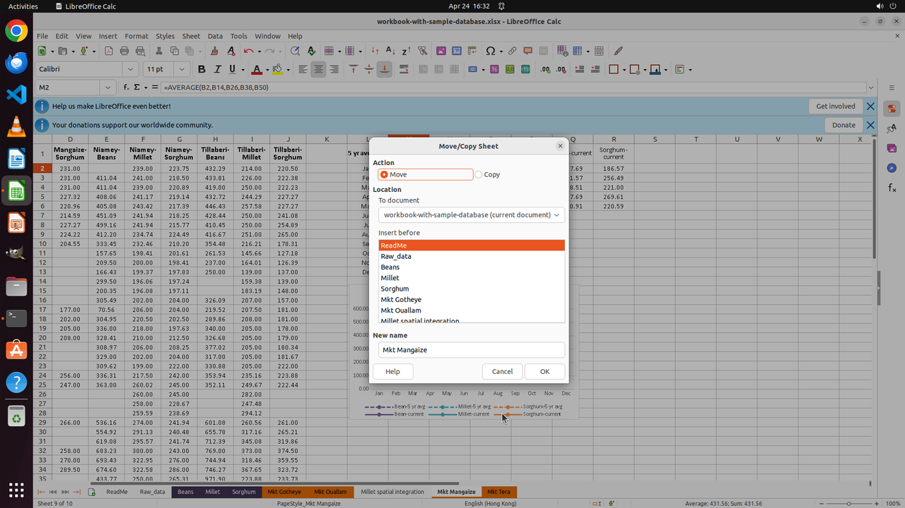

**Response:**
```
I need to move Mkt Mangalize before "Mkt Ouallam" to make it the 7th sheet. Let me select "Mkt Ouallam" in the list.
```

**Actions:** `pyautogui.click(847, 658)`

---

## Step 36

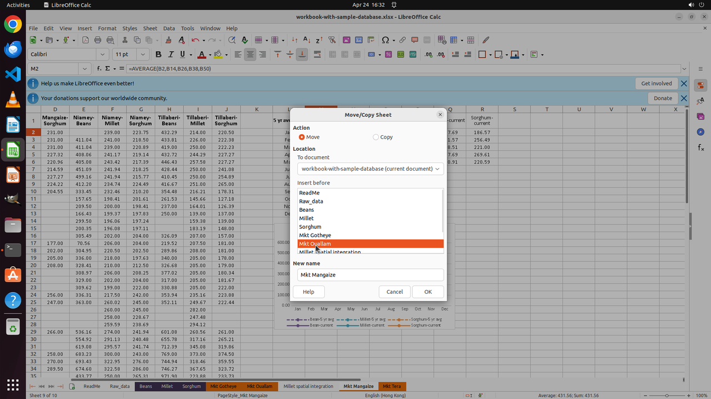

**Response:**
```
"Mkt Ouallam" is selected. Now I'll click OK to move Mkt Mangalize before Mkt Ouallam (making it the 7th sheet).
```

**Actions:** `pyautogui.click(1153, 789)`

---

## Step 37

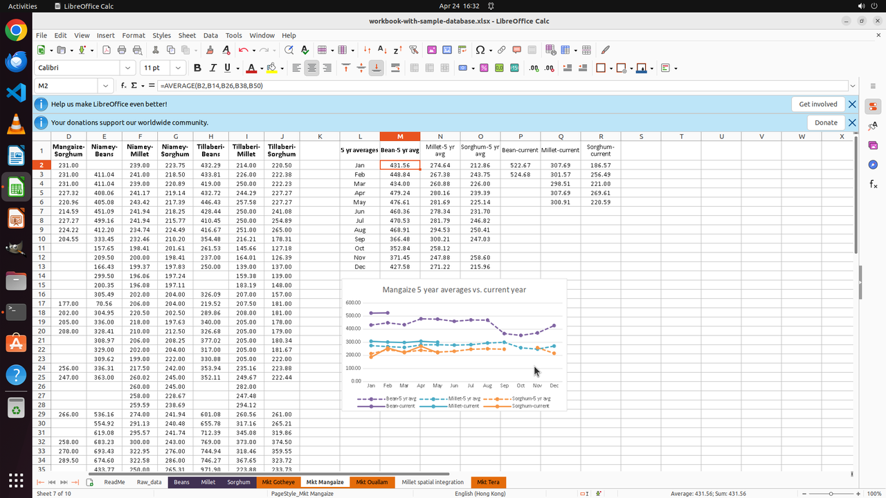

**Response:**
```
Mkt Mangalize is now the 7th sheet. The current order is:
ReadMe, Raw_data, Beans, Millet, Sorghum, Mkt Gotheye, Mkt Mangalize, Mkt Ouallam, Millet spatial integration, Mkt Tera

Now I need to check the required order:
1. ReadMe ✓
2. Raw_data ✓
3. Beans ✓
4. Millet ✓
5. Sorghum ✓
6. Mkt Gotheye ✓
7. Mkt Mangalize ✓
8. Mkt Ouallam ✓
9. Mkt Tera - needs to be moved before "Millet spatial integration"
10. Millet spatial integration

So I need to move "Mkt Tera" before "Millet spatial integration". Let me right-click on the Mkt Tera tab.
```

**Actions:** `pyautogui.rightClick(1059, 1044)`

---

## Step 38

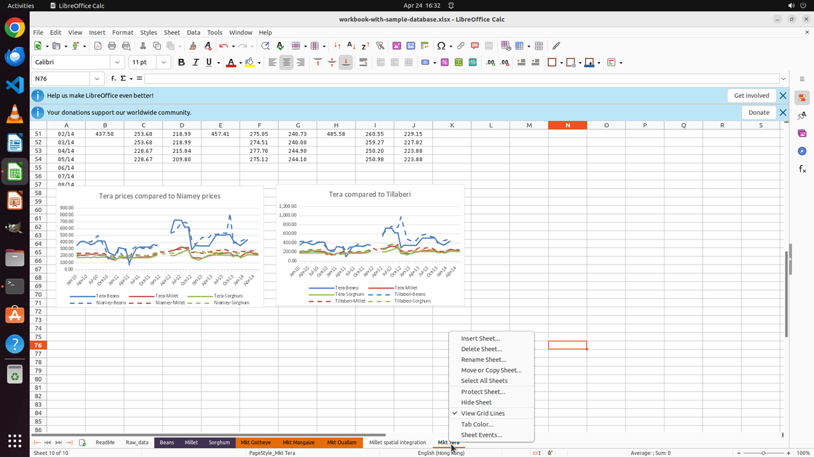

**Response:**
```
I can see the context menu for the Mkt Tera sheet. Let me click "Move or Copy Sheet..."
```

**Actions:** `pyautogui.click(1153, 873)`

---

## Step 39

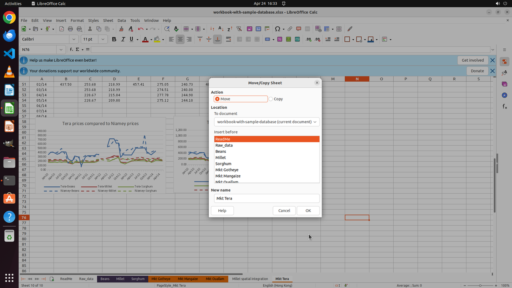

**Response:**
```
I need to move Mkt Tera before "Millet spatial integration". Let me scroll down in the list to find "Millet spatial integration".
```

**Actions:** `pyautogui.scroll(-3, 990, 645)`

---

## Step 40

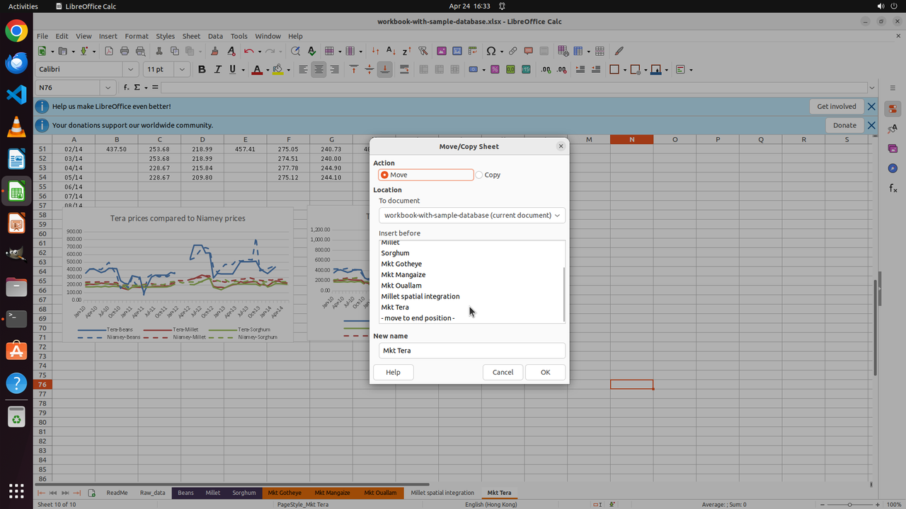

**Response:**
```
Now I can see the full list. I need to move Mkt Tera before "Millet spatial integration". Let me click on "Millet spatial integration".
```

**Actions:** `pyautogui.click(886, 627)`

---

## Step 41

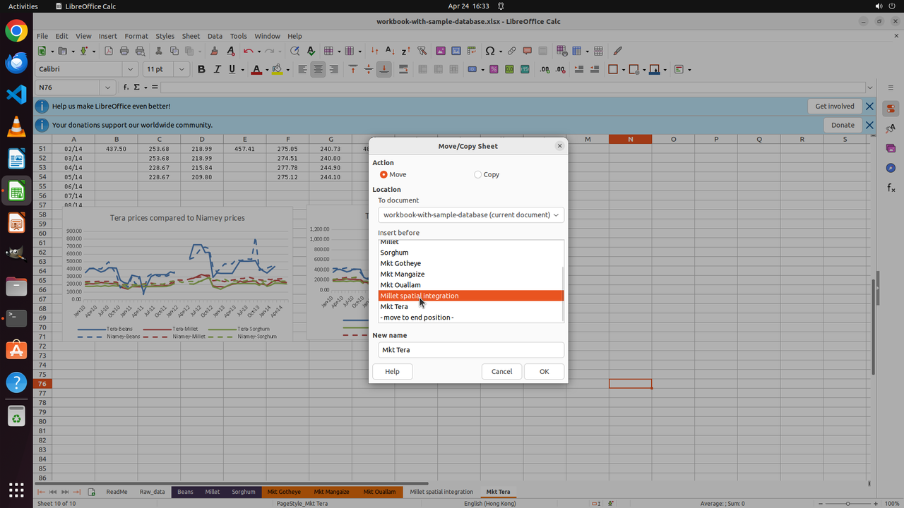

**Response:**
```
"Millet spatial integration" is selected. Now I'll click OK to move Mkt Tera before Millet spatial integration (making it the 9th sheet).
```

**Actions:** `pyautogui.click(1153, 789)`

---

## Step 42


**Response:**
```
The sheets are now in the correct order:
1. ReadMe
2. Raw_data
3. Beans
4. Millet
5. Sorghum
6. Mkt Gotheye
7. Mkt Mangalize
8. Mkt Ouallam
9. Mkt Tera
10. Millet spatial integration

This matches the required order from the reminder.docx. Now let me save the file with Ctrl+S.
```

**Actions:** `pyautogui.keyDown('ctrl')
pyautogui.keyDown('s')
pyautogui.keyUp('s')
pyautogui.keyUp('ctrl')`

---

## Step 43

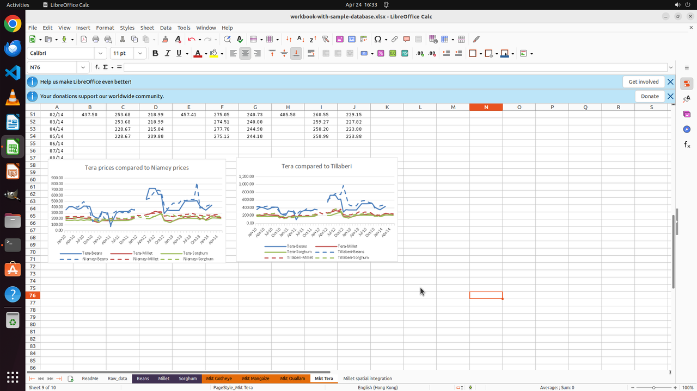

**Response:**
```
Let me scroll back up to see the reminder.docx content more carefully. Let me also verify the complete content of the reminder by going back to the terminal.
```

**Actions:** `pyautogui.click(33, 672)`

---

## Step 44

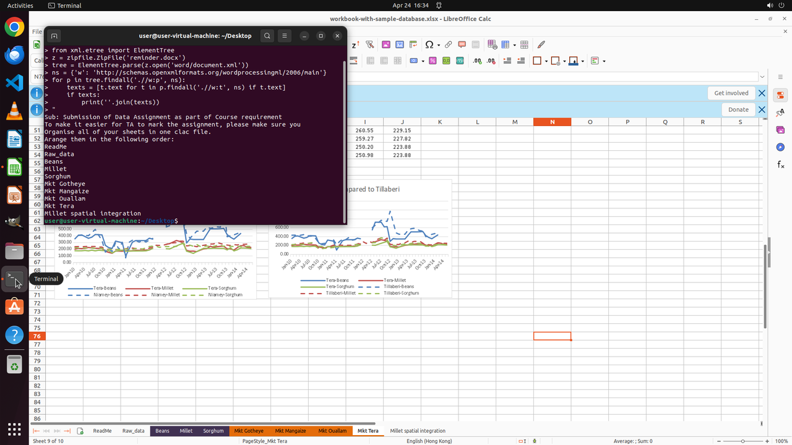

**Response:**
```
I can now see the complete content of the reminder.docx. The required order is:

1. ReadMe
2. Raw_data
3. Beans
4. Millet
5. Sorghum
6. Mkt Gotheye
7. Mkt Mangalize
8. Mkt Ouallam
9. Mkt Tera
10. Millet spatial integration

Looking at the tab bar in LibreOffice Calc, the current order is:
ReadMe, Raw_data, Beans, Millet, Sorghum, Mkt Gotheye, Mkt Mangalize, Mkt Ouallam, Mkt Tera, Millet spatial integration

This matches the required order perfectly! The file has been saved. The task is complete.

DONE
```

**Actions:** `DONE`

---
