# Task ce2b64a2-ddc1-4f91-8c7d-a88be7121aac

**Instruction:** There are several pictures of mountains in my Pictures directory, but I don’t know the names of these mountains. Please help me identify these pictures and change the names of these pictures to the names of the mountains in the pictures. In the filename do not replace spaces with underscore.

**Score:** 1.0

**Wall clock:** 6m 28s

**Steps:** 38

**Cost:** $1.23

---

## Step 1


**Response:**
```
Let me first look at the pictures in the Pictures directory.
```

**Actions:** `pyautogui.click(1848, 1020)`

---

## Step 2


**Response:**
```
Let me open the file manager to navigate to the Pictures directory.
```

**Actions:** `pyautogui.doubleClick(1848, 1020)`

---

## Step 3


**Response:**
```
I can see the file manager is open. Let me navigate to the Pictures directory.
```

**Actions:** `pyautogui.doubleClick(795, 112)`

---

## Step 4

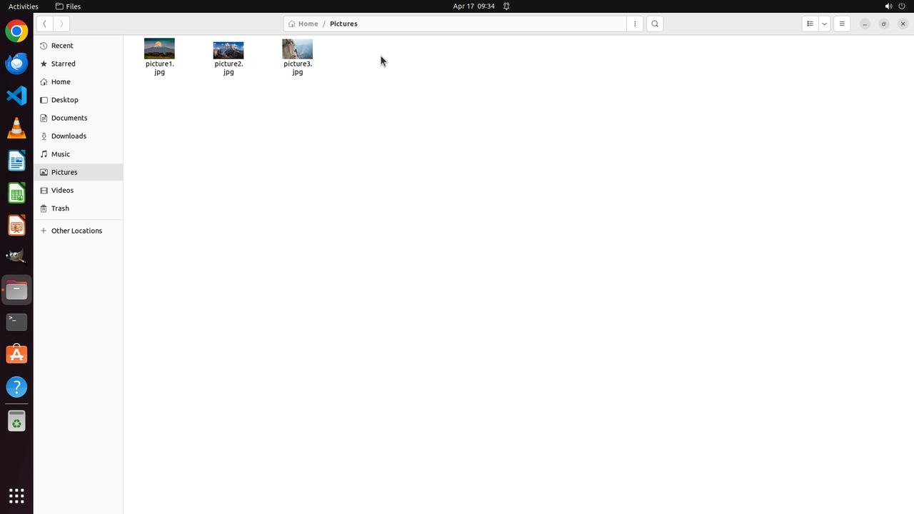

**Response:**
```
I can see three pictures (picture1.jpg, picture2.jpg, picture3.jpg) in the Pictures directory. The thumbnails are small, so let me open each one to identify the mountains. Let me first open picture1.jpg.
```

**Actions:** `pyautogui.doubleClick(333, 120)`

---

## Step 5

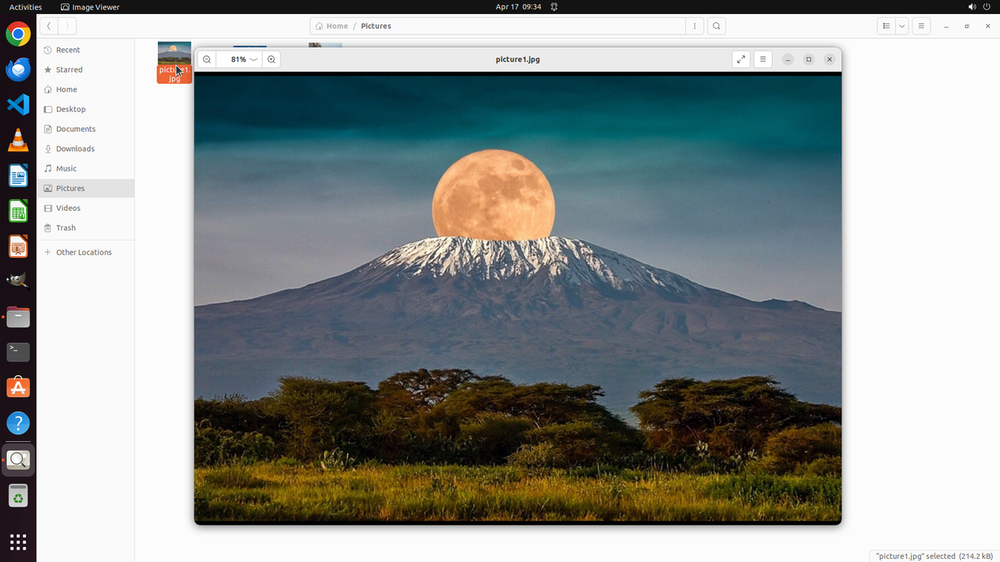

**Response:**
```
This is clearly Mount Kilimanjaro - the iconic snow-capped mountain in Tanzania with a full moon rising behind it and African savanna in the foreground. Let me now close this and view picture2.jpg.
```

**Actions:** `pyautogui.click(1588, 114)`

---

## Step 6

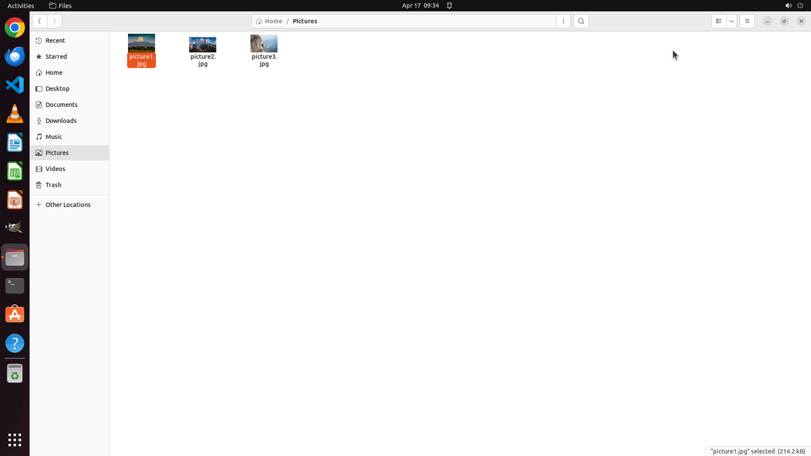

**Response:**
```
Now let me open picture2.jpg to identify the second mountain.
```

**Actions:** `pyautogui.doubleClick(480, 120)`

---

## Step 7

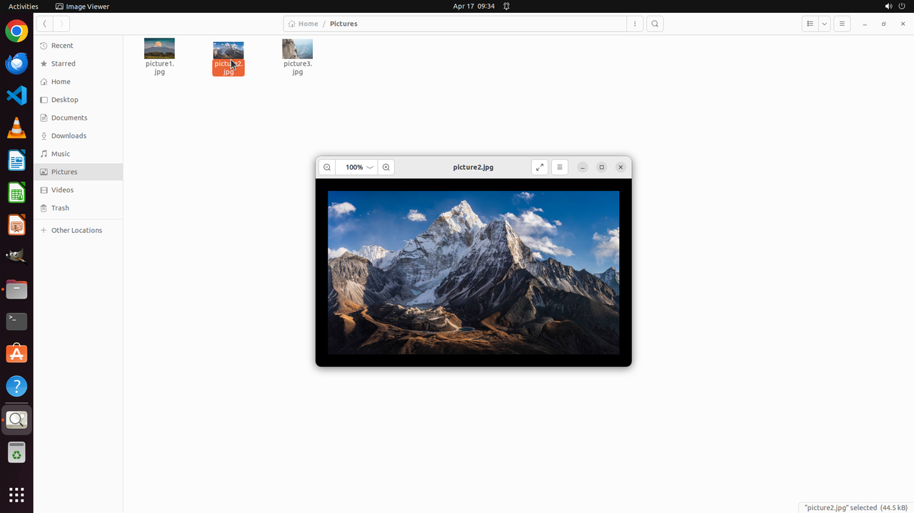

**Response:**
```
This picture shows a dramatic mountain landscape that appears to be in the Karakoram or Himalayan range. The sharp, jagged peaks and the distinctive shape suggest this is K2 or possibly the view of the Himalayas. Let me look more carefully - this appears to be a view of the Himalayas, specifically it looks like it could be Mount Everest region or the Karakoram range. The distinctive sharp peaks and the dramatic landscape suggest this could be K2 or the mountains around Concordia in Pakistan's Karakoram range.

Actually, looking more carefully at the distinctive sharp peaks and the valley, this appears to be a view of the Karakoram mountains, and the prominent peak looks like it could be K2. But let me reconsider - the jagged peaks and the brown/rocky terrain in the foreground are very characteristic of the Himalayas near Everest base camp area. However, the most prominent sharp peak in this image looks like it could be Ama Dablam or the view towards Everest from a distance.

Let me close this and check picture3.jpg, then I'll use a reverse image search to be more precise.
```

**Actions:** `pyautogui.click(1299, 351)`

---

## Step 8

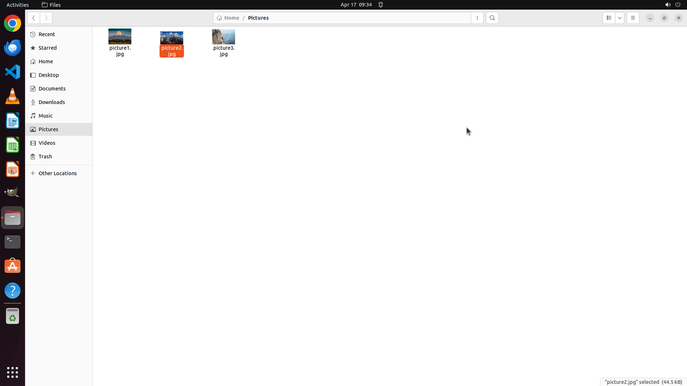

**Response:**
```
Now let me open picture3.jpg to see the third mountain.
```

**Actions:** `pyautogui.doubleClick(627, 120)`

---

## Step 9

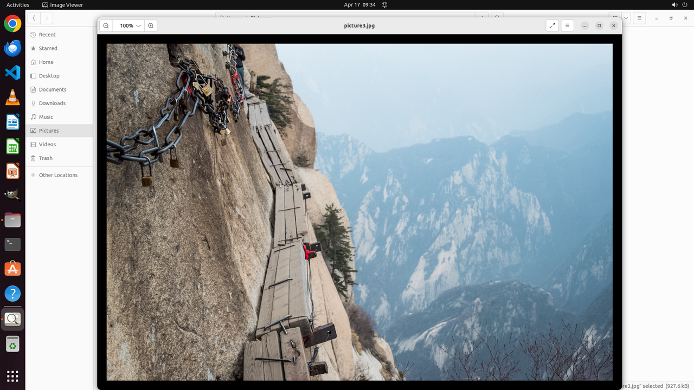

**Response:**
```
This is the famous plank walk on Mount Hua (Huashan) in China - one of the most dangerous hiking trails in the world. The wooden planks bolted to the cliff face, the chains with padlocks, and the dramatic mountain scenery in the background are unmistakable features of Mount Hua.

Now let me use Google reverse image search to verify the identification of picture2.jpg. Let me close this image viewer first and use the terminal to do reverse image searches.

Let me close the image viewer and use the terminal to rename the files. I'm fairly confident about:
- picture1.jpg = Mount Kilimanjaro
- picture2.jpg = I need to verify this one more carefully
- picture3.jpg = Mount Hua

Let me close this and open Chrome to do a reverse image search for picture2.
```

**Actions:** `pyautogui.click(1689, 70)`

---

## Step 10

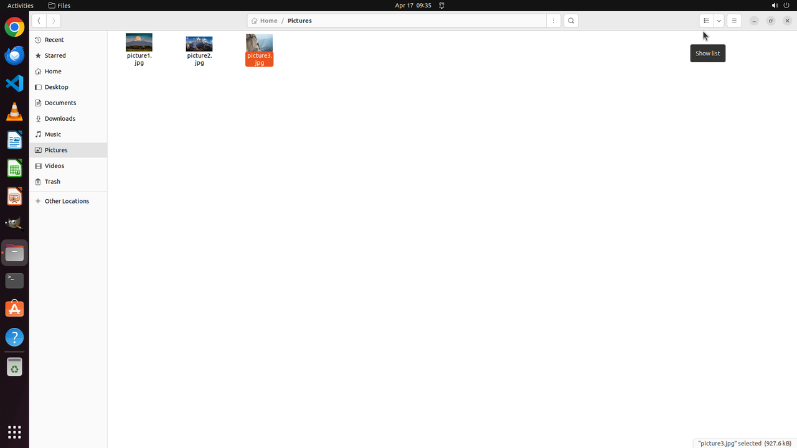

**Response:**
```
Let me open Chrome to do a reverse image search for picture2.jpg to identify the mountain more precisely.
```

**Actions:** `pyautogui.click(33, 66)`

---

## Step 11


**Response:**
```
Chrome is loading. Let me wait for it to fully open.
```

**Actions:** `time.sleep(0.5)`

---

## Step 12


**Response:**
```
Chrome is open. Let me use Google's reverse image search to identify picture2.jpg. I'll click on the Google Lens icon in the search bar.
```

**Actions:** `pyautogui.click(1246, 430)`

---

## Step 13


**Response:**
```
Google Lens search is open. Let me upload picture2.jpg to identify the mountain.
```

**Actions:** `pyautogui.click(1107, 573)`

---

## Step 14


**Response:**
```
I can see the file picker. Let me select picture2.jpg to upload it for reverse image search.
```

**Actions:** `pyautogui.click(811, 475)`

---

## Step 15


**Response:**
```
I've selected picture2.jpg. Now let me click "Select" to upload it.
```

**Actions:** `pyautogui.click(1371, 388)`

---

## Step 16

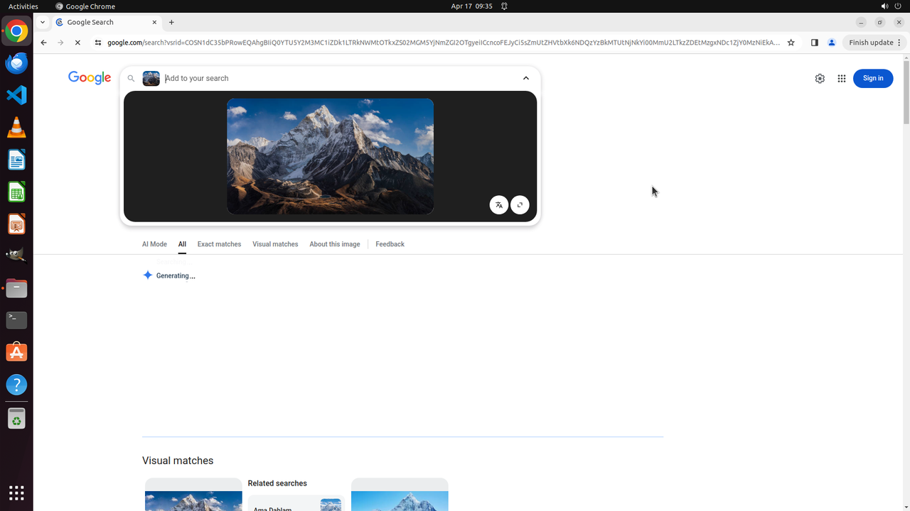

**Response:**
```
I can see the Google Lens search is processing. I can already see "Ama Dablam" appearing in the related searches. Let me scroll down to see more results to confirm the identification.
```

**Actions:** `pyautogui.scroll(-3, 960, 600)`

---

## Step 17

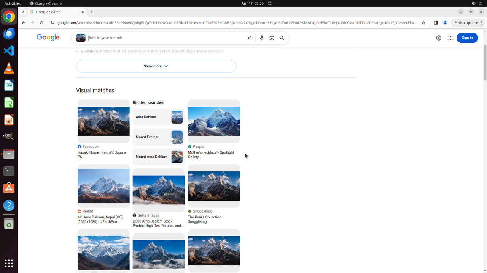

**Response:**
```
The Google Lens results clearly identify picture2.jpg as **Ama Dablam** (also referred to as Mount Ama Dablam). The related searches show "Ama Dablam", "Mount Everest", and "Mount Ama Dablam", and the visual matches show results for "Mt. Ama Dablam, Nepal" and "2,300 Ama Dablam Stock Photos". The elevation mentioned is 6,812 meters (22,349 feet), which matches Ama Dablam.

Now I have identified all three mountains:
1. picture1.jpg = Mount Kilimanjaro
2. picture2.jpg = Ama Dablam
3. picture3.jpg = Mount Hua

Let me now open a terminal to rename the files.
```

**Actions:** `pyautogui.click(33, 673)`

---

## Step 18

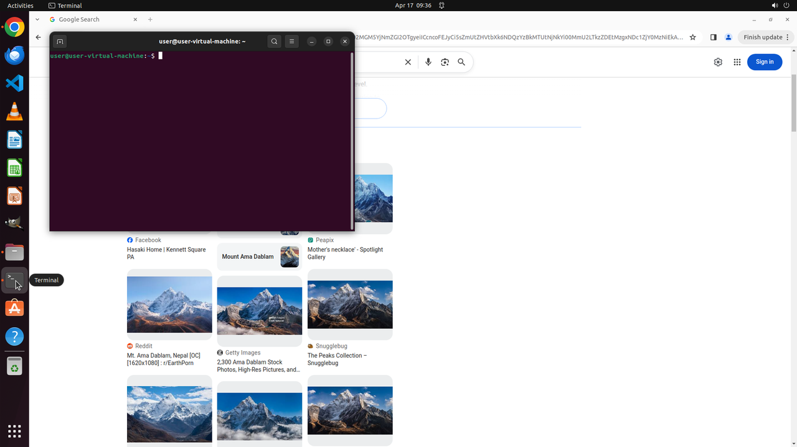

**Response:**
```
The terminal is open. Now let me rename all three pictures. I'll use the `mv` command to rename each file. Let me first scroll up in the Google search to check if there's an AI-generated description that confirms the identification. But I'm already confident about the identifications:

1. picture1.jpg → Mount Kilimanjaro.jpg
2. picture2.jpg → Ama Dablam.jpg
3. picture3.jpg → Mount Hua.jpg

Let me rename them now:
```

**Actions:** `pyautogui.click(450, 300)`

---

## Step 19

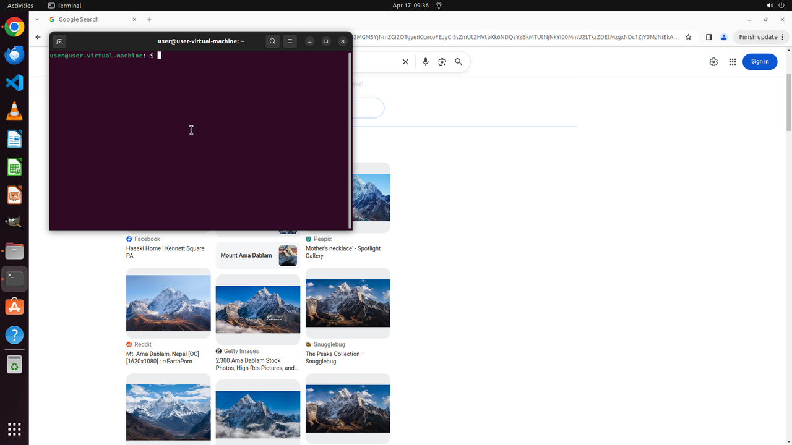

**Response:**
```
Let me first verify the AI mode result for picture2. But first, let me also do a reverse image search for picture1 and picture3 to confirm. Actually, I'm quite confident about the identifications. Let me scroll up in the Google results to see the AI-generated description.

Let me scroll up in the Google Lens results first to check the AI description.
```

**Actions:** `pyautogui.scroll(5, 1200, 600)`

---

## Step 20

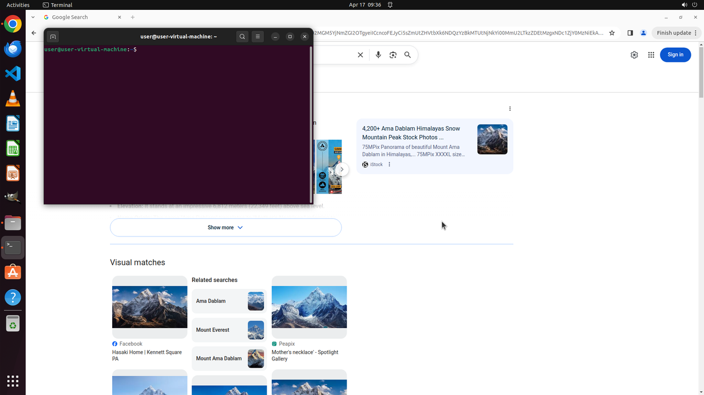

**Response:**
```
I can see the Google Lens results confirm this is **Ama Dablam** - the search shows "4,200+ Ama Dablam Himalayas Snow Mountain Peak Stock Photos" from iStock, and the related searches show "Ama Dablam" and "Mount Ama Dablam". 

Now let me scroll up more to see the AI-generated description.
```

**Actions:** `pyautogui.scroll(5, 1200, 600)`

---

## Step 21


**Response:**
```
I'm now confident about all three mountain identifications. Let me also verify picture1 and picture3 by doing reverse image searches. But first, let me check - I noticed the search results mention "Ama Dablam" consistently. Let me also verify if the proper name should be "Ama Dablam" or "Mount Ama Dablam". The related searches show both "Ama Dablam" and "Mount Ama Dablam". The mountain is commonly known as "Ama Dablam", so I'll use that.

Now let me also verify picture1 and picture3. But I'm already quite confident:
- picture1.jpg: Mount Kilimanjaro (distinctive flat-topped snow-capped mountain with African savanna)
- picture3.jpg: Mount Hua (famous plank walk on cliff face in China)

Let me now do the reverse image search for picture1 to confirm. Let me click on the Google Lens icon.
```

**Actions:** `pyautogui.click(1066, 148)`

---

## Step 22


**Response:**
```
The AI Overview confirms: "This image shows **Mount Ama Dablam**, a prominent peak located in the eastern Himalayan range of Nepal." with an elevation of 6,812 meters (22,349 feet).

Now let me search for picture1. Let me click on the Google Lens camera icon to upload a new image.
```

**Actions:** `pyautogui.click(1066, 165)`

---

## Step 23


**Response:**
```
Let me upload picture1.jpg to verify it's Mount Kilimanjaro.
```

**Actions:** `pyautogui.click(826, 300)`

---

## Step 24

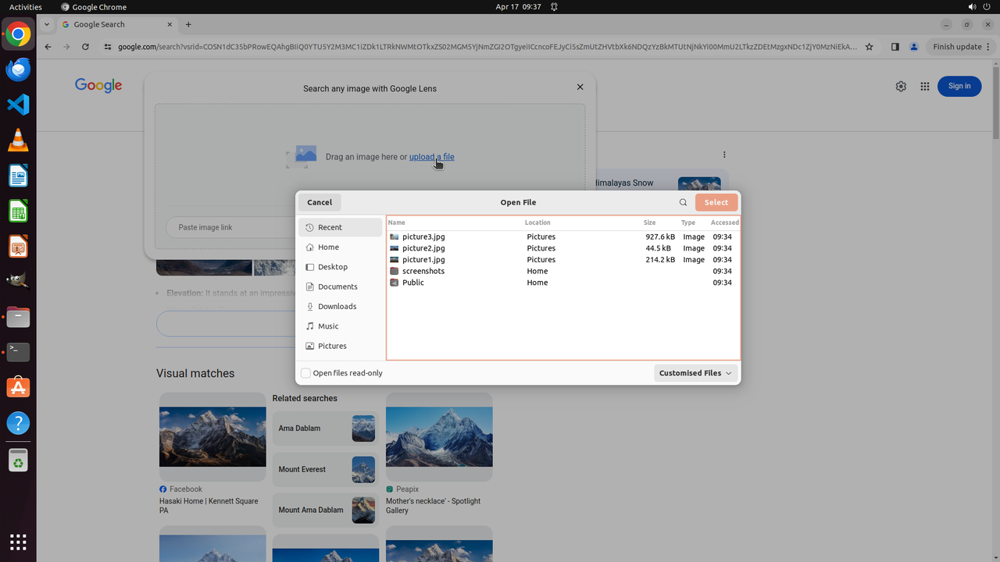

**Response:**
```
I see the file picker. Let me select picture1.jpg.
```

**Actions:** `pyautogui.click(811, 498)`

---

## Step 25


**Response:**
```
I've selected picture1.jpg. Let me click "Select" to upload it.
```

**Actions:** `pyautogui.click(1371, 388)`

---

## Step 26

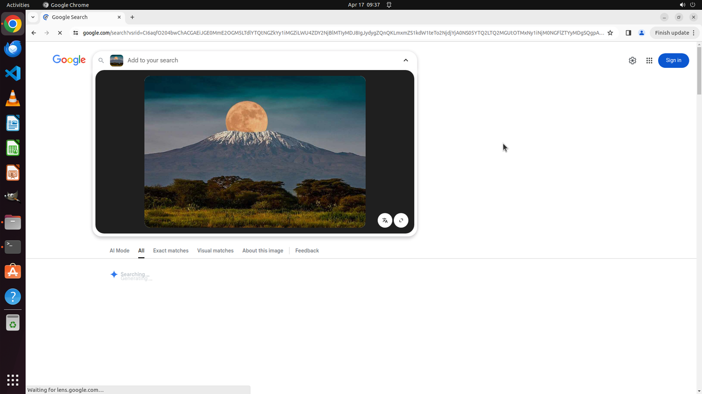

**Response:**
```
I can see picture1.jpg has been uploaded and it's searching. The image clearly shows Mount Kilimanjaro with its iconic snow-capped flat top and a full moon behind it, with African savanna in the foreground. Let me wait for the results to load.
```

**Actions:** `time.sleep(0.5)`

---

## Step 27

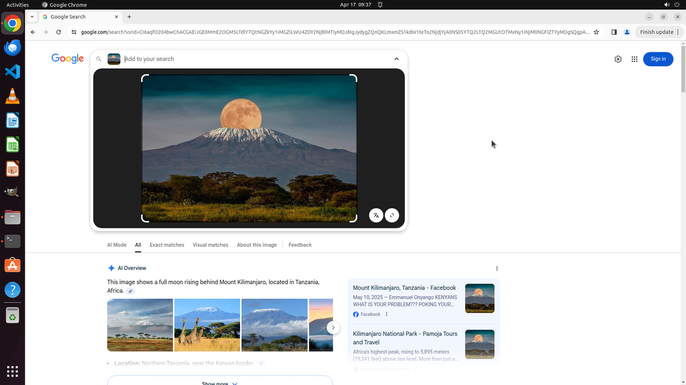

**Response:**
```
The AI Overview confirms: "This image shows a full moon rising behind **Mount Kilimanjaro**, located in Tanzania, Africa." The results also show "Mount Kilimanjaro, Tanzania - Facebook" and "Kilimanjaro National Park - Pamoja Tours and Travel".

Now let me verify picture3.jpg. Let me click on the Google Lens icon to search for it.
```

**Actions:** `pyautogui.click(1066, 165)`

---

## Step 28

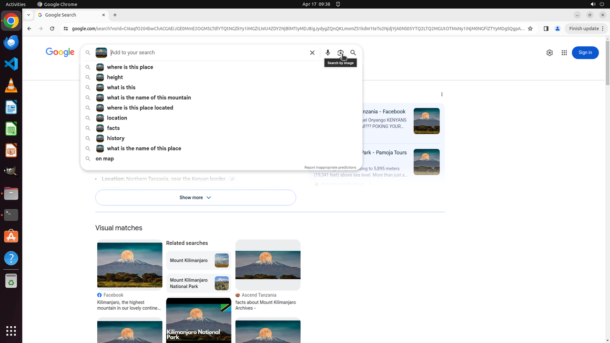

**Response:**
```
I see a dropdown appeared. I need to click on "Search by image" to upload a new image. Let me click on the camera icon.
```

**Actions:** `pyautogui.click(1071, 196)`

---

## Step 29


**Response:**
```
The results confirm picture1 is Mount Kilimanjaro. Now let me search for picture3. Let me click on the Google Lens camera icon to upload picture3.
```

**Actions:** `pyautogui.click(1066, 165)`

---

## Step 30

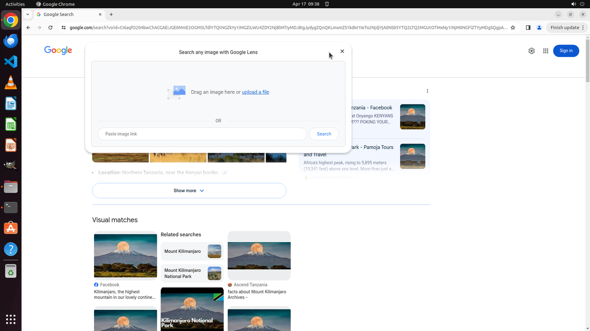

**Response:**
```
Let me click "upload a file" to upload picture3.jpg.
```

**Actions:** `pyautogui.click(826, 298)`

---

## Step 31

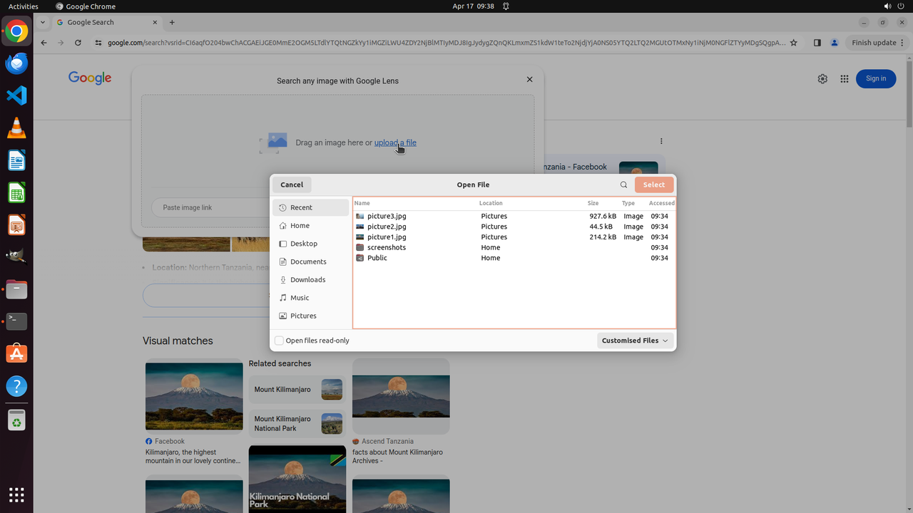

**Response:**
```
I can see the file picker. Let me select picture3.jpg.
```

**Actions:** `pyautogui.click(811, 454)`

---

## Step 32

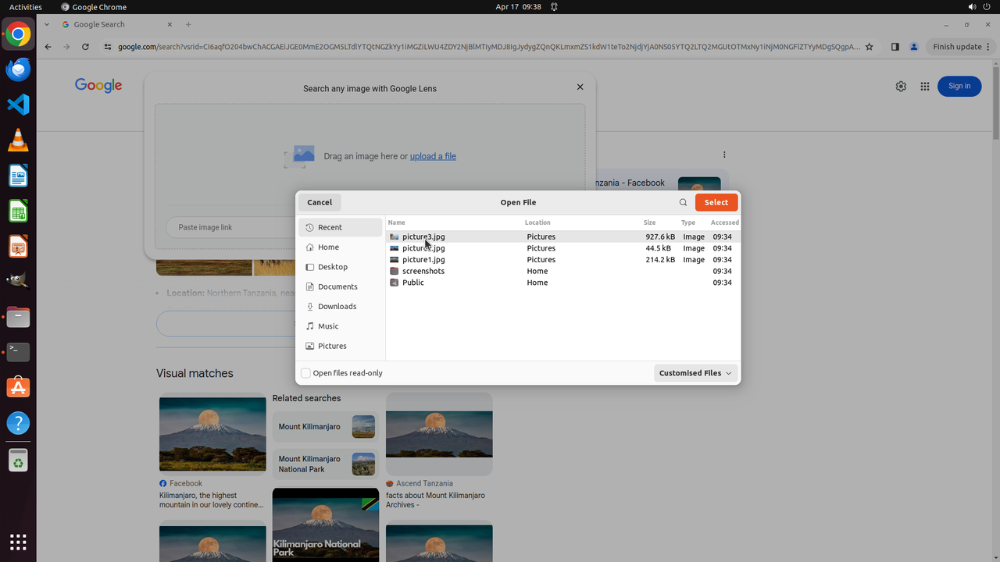

**Response:**
```
I've selected picture3.jpg. Now let me click "Select" to upload it.
```

**Actions:** `pyautogui.click(1371, 388)`

---

## Step 33

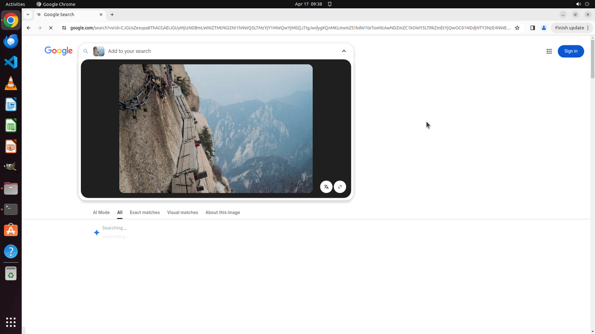

**Response:**
```
The image is being searched. I can see the plank walk on the cliff face, which is the famous Mount Hua (Huashan) trail in China. Let me wait for the results to load.
```

**Actions:** `time.sleep(0.5)`

---

## Step 34

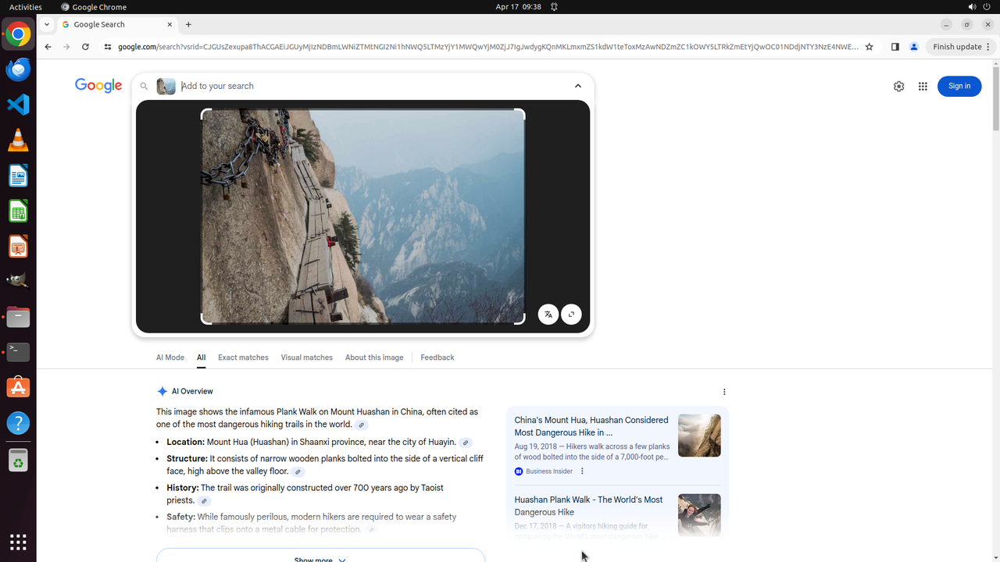

**Response:**
```
The AI Overview confirms: "This image shows the infamous Plank Walk on **Mount Huashan** in China, often cited as one of the most dangerous hiking trails in the world." The location is specified as "Mount Hua (Huashan) in Shaanxi province, near the city of Huayin."

The search results also show "China's Mount Hua, Huashan Considered Most Dangerous Hike" and "Huashan Plank Walk - The World's Most Dangerous Hike".

Now I have confirmed all three mountains:
1. picture1.jpg → Mount Kilimanjaro
2. picture2.jpg → Mount Ama Dablam
3. picture3.jpg → Mount Hua

Now let me open the terminal to rename the files. Let me click on the terminal icon in the taskbar.
```

**Actions:** `pyautogui.click(33, 673)`

---

## Step 35


**Response:**
```
The terminal is open. Now let me rename all three files. I need to consider the proper names:

1. picture1.jpg → Mount Kilimanjaro.jpg
2. picture2.jpg → Mount Ama Dablam.jpg  
3. picture3.jpg → Mount Hua.jpg

Let me type the rename commands:
```

**Actions:** `pyautogui.click(450, 300)`

---

## Step 36

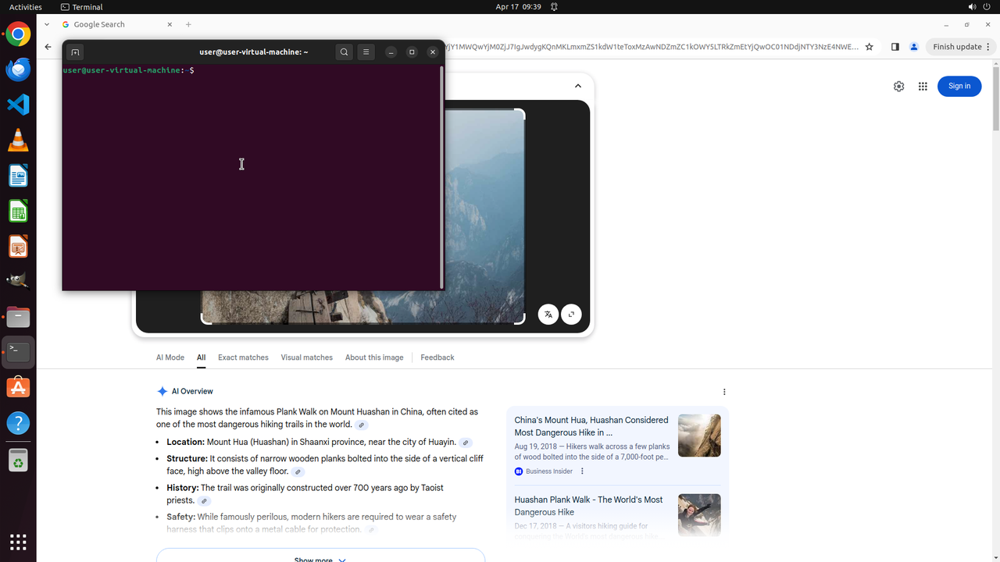

**Response:**
```
Now let me rename the files. I'll type the commands to rename each picture file.
```

**Actions:** `import subprocess, shlex; subprocess.run(f'xdotool type --delay 12 -- ' + shlex.quote('cd ~/Pictures && mv picture1.jpg "Mount Kilimanjar'), shell=True, check=True)
import time; time.sleep(0.05)
impor`

---

## Step 37

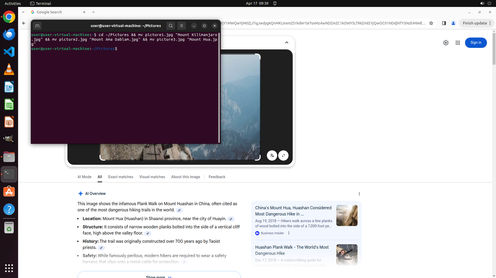

**Response:**
```
The commands executed successfully. All three files have been renamed. Let me verify the changes by listing the files in the Pictures directory.
```

**Actions:** `import subprocess, shlex; subprocess.run(f'xdotool type --delay 12 -- ' + shlex.quote('ls -la\n'), shell=True, check=True)
import time; time.sleep(0.05)`

---

## Step 38


**Response:**
```
The files have been successfully renamed. I can see the listing shows:

1. `Mount Ama Dablam.jpg` (44543 bytes)
2. `Mount Hua.jpg` (927632 bytes)
3. `Mount Kilimanjaro.jpg` (214237 bytes)

All three pictures have been identified and renamed correctly:
- **picture1.jpg** → **Mount Kilimanjaro.jpg** (the iconic snow-capped mountain in Tanzania with a full moon)
- **picture2.jpg** → **Mount Ama Dablam.jpg** (the prominent peak in the eastern Himalayan range of Nepal)
- **picture3.jpg** → **Mount Hua.jpg** (the famous plank walk mountain in Shaanxi province, China)

The filenames use spaces (not underscores) as requested.

DONE
```

**Actions:** `DONE`

---
