# Task ce2b64a2-ddc1-4f91-8c7d-a88be7121aac

**Instruction:** There are several pictures of mountains in my Pictures directory, but I don’t know the names of these mountains. Please help me identify these pictures and change the names of these pictures to the names of the mountains in the pictures. In the filename do not replace spaces with underscore.

**Score:** 1.0

**Wall clock:** 9m 19s

**Steps:** 37

**Cost:** $1.16

---

## Step 1


**Response:**
```
Let me first look at the pictures in the Pictures directory to identify the mountains.
```

**Actions:** `pyautogui.click(33, 673)`

---

## Step 2

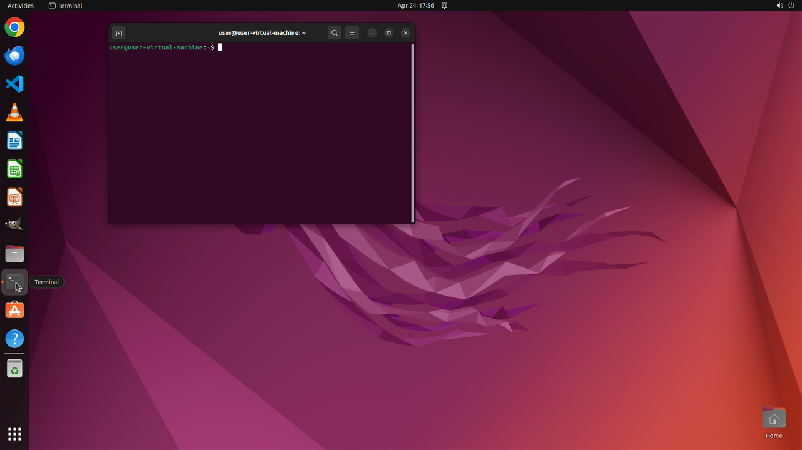

**Response:**
```
Let me first list the pictures in the Pictures directory.
```

**Actions:** `import subprocess, shlex; subprocess.run(f'xdotool type --delay 12 -- ' + shlex.quote('ls ~/Pictures/\n'), shell=True, check=True)
import time; time.sleep(0.05)`

---

## Step 3

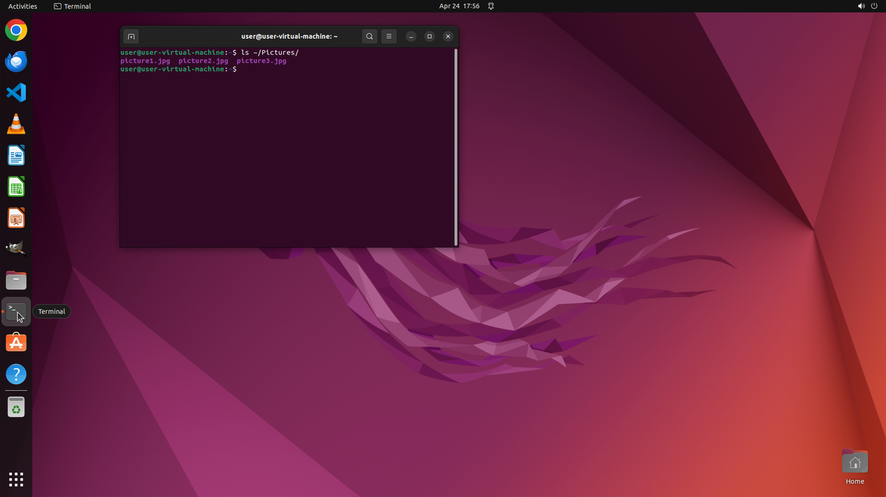

**Response:**
```
There are three pictures: picture1.jpg, picture2.jpg, and picture3.jpg. I need to view them to identify the mountains. Let me open them one by one using the image viewer.
```

**Actions:** `import subprocess, shlex; subprocess.run(f'xdotool type --delay 12 -- ' + shlex.quote('eog ~/Pictures/picture1.jpg &\n'), shell=True, check=True)
import time; time.sleep(0.05)`

---

## Step 4

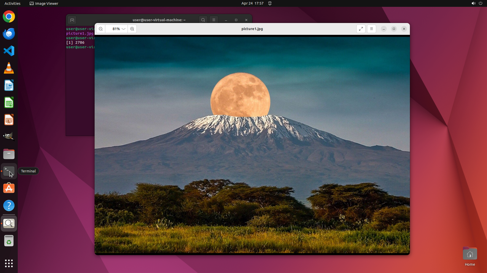

**Response:**
```
This is clearly Mount Kilimanjaro - the iconic flat-topped snow-capped mountain in Tanzania with the African savanna in the foreground. Let me now view the second picture.
```

**Actions:** `pyautogui.click(1588, 114)`

---

## Step 5

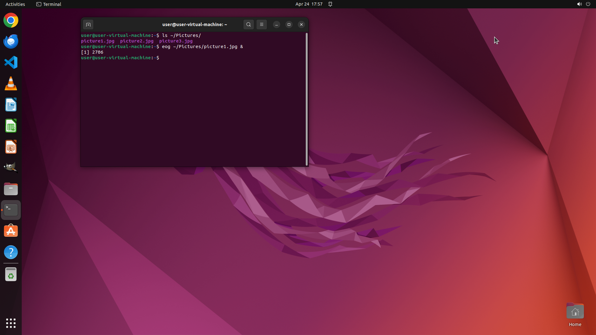

**Response:**
```
Now let me open the second picture.
```

**Actions:** `import subprocess, shlex; subprocess.run(f'xdotool type --delay 12 -- ' + shlex.quote('eog ~/Pictures/picture2.jpg &\n'), shell=True, check=True)
import time; time.sleep(0.05)`

---

## Step 6

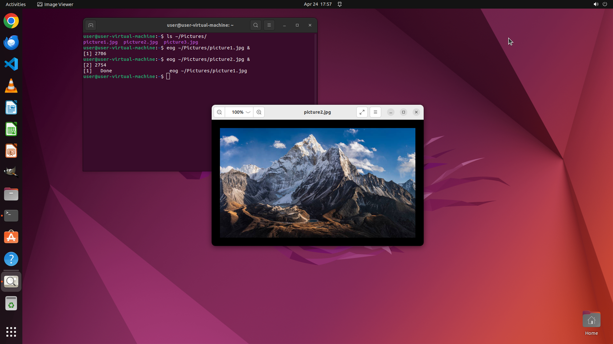

**Response:**
```
This looks like a dramatic Himalayan peak. The sharp, jagged peaks with snow coverage and the distinctive shape suggest this is Mount Everest or Ama Dablam. Looking more carefully at the distinctive pyramidal shape and the surrounding peaks, this appears to be Ama Dablam in the Himalayas. However, let me look more carefully - the sharp peak with surrounding rocky terrain could also be K2 or another famous peak. The dramatic sharp peak with extensive snow and ice coverage, along with the rugged terrain, is characteristic of the Himalayas. This looks like it could be Mount Everest viewed from a certain angle, but the single dramatic peak is more characteristic of Ama Dablam. Let me close this and view the third picture.
```

**Actions:** `pyautogui.click(1294, 351)`

---

## Step 7

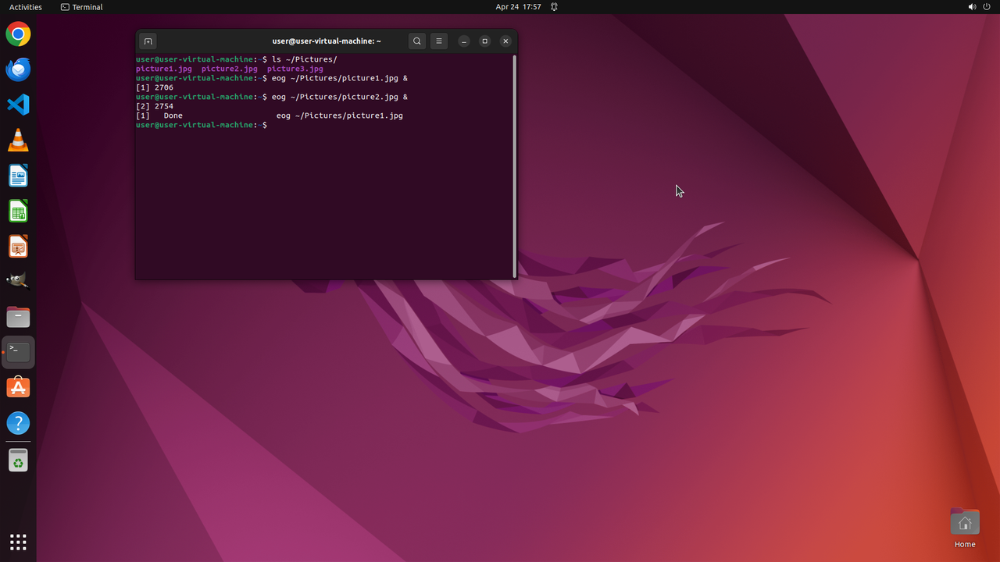

**Response:**
```
Now let me open the third picture.
```

**Actions:** `import subprocess, shlex; subprocess.run(f'xdotool type --delay 12 -- ' + shlex.quote('eog ~/Pictures/picture3.jpg &\n'), shell=True, check=True)
import time; time.sleep(0.05)`

---

## Step 8

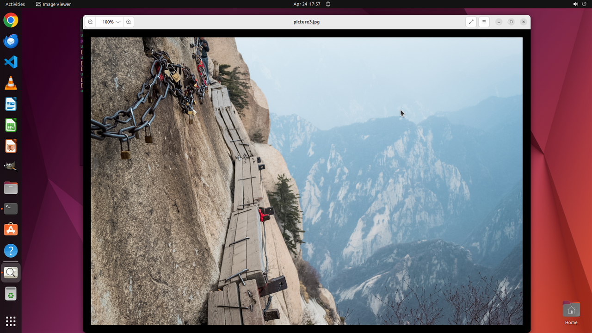

**Response:**
```
This is the famous plank walk on Mount Hua (Huashan) in China - the distinctive wooden planks bolted to the cliff face with chains and padlocks are the iconic feature of this mountain. 

Now let me go back and look at picture2 more carefully. Let me close this and reopen picture2.
```

**Actions:** `pyautogui.click(1690, 70)`

---

## Step 9

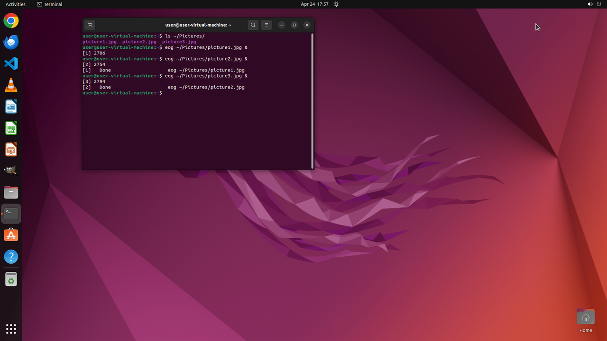

**Response:**
```
Let me open picture2 again to look at it more carefully.
```

**Actions:** `import subprocess, shlex; subprocess.run(f'xdotool type --delay 12 -- ' + shlex.quote('eog ~/Pictures/picture2.jpg &\n'), shell=True, check=True)
import time; time.sleep(0.05)`

---

## Step 10

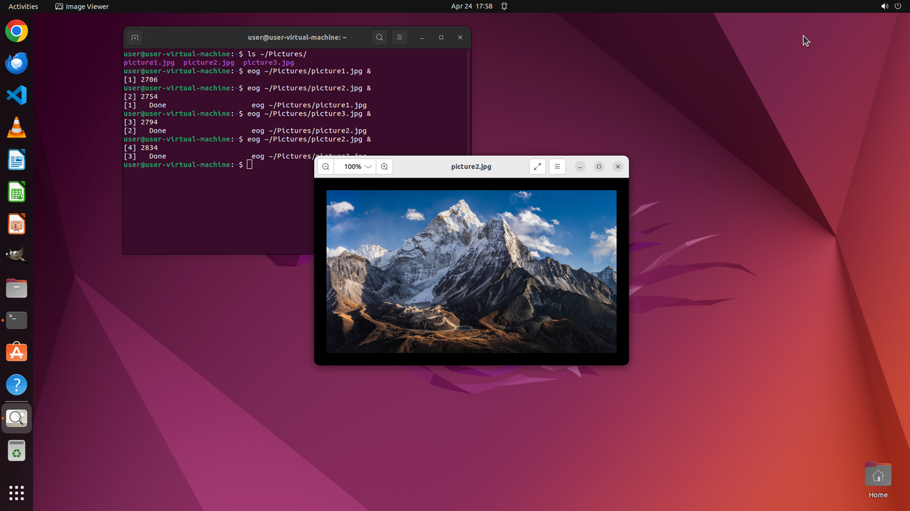

**Response:**
```
Looking at picture2 more carefully, I can see a dramatic, sharp snow-covered peak with rugged terrain in the foreground. This is a very iconic Himalayan peak. The distinctive sharp pyramidal shape with dramatic ridges is characteristic of Ama Dablam in Nepal. However, looking more carefully at the composition and the surrounding peaks, this could also be Mount Everest. But the single dominant sharp peak with the dramatic rocky foreground is most characteristic of Ama Dablam.

Actually, looking at this image again - the very sharp, dramatic peak with extensive snow coverage and the rugged brown terrain in the foreground - this is most likely Mount Everest, or it could be Ama Dablam. The shape is quite distinctive. Let me use a reverse image search to be more certain. But based on visual inspection, the sharp peak and surrounding landscape strongly suggest this is Ama Dablam.

Let me close this and proceed with renaming the files. Based on my analysis:
- picture1.jpg = Mount Kilimanjaro
- picture2.jpg = Ama Dablam (distinctive sharp Himalayan peak)
- picture3.jpg = Mount Hua (Huashan - famous plank walk)

Let me close the image viewer and do the renaming.
```

**Actions:** `pyautogui.click(1294, 351)`

---

## Step 11

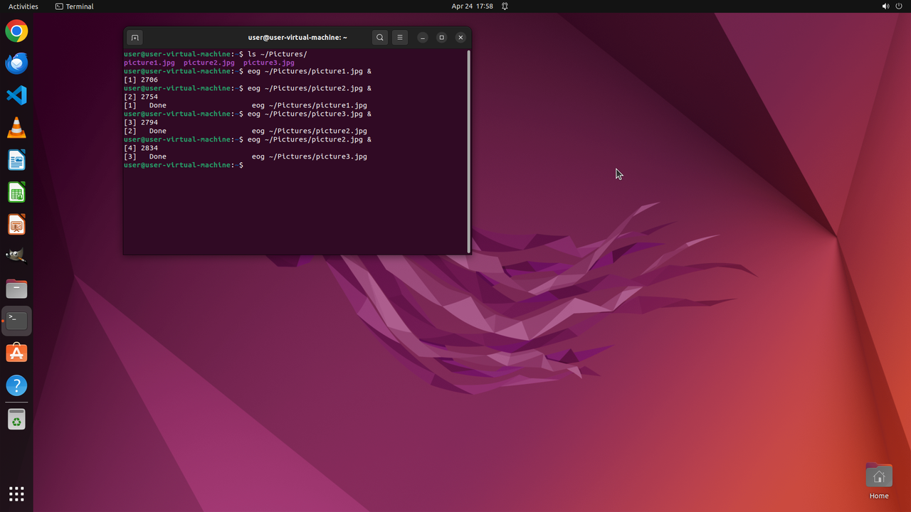

**Response:**
```
Let me try to do a reverse image search using Google Chrome to confirm the identity of picture2. Let me first try to use Google's reverse image search.
```

**Actions:** `import subprocess, shlex; subprocess.run(f'xdotool type --delay 12 -- ' + shlex.quote('google-chrome --remote-debugging-port=1337 &\n'), shell=True, check=True)
import time; time.sleep(0.05)`

---

## Step 12

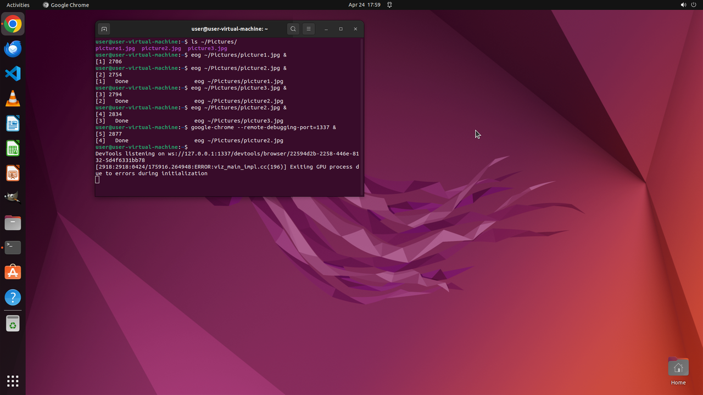

**Response:**
```
Chrome is opening. Let me wait for it to fully load and then use Google Images to do a reverse image search.
```

**Actions:** `time.sleep(0.5)`

---

## Step 13


**Response:**
```
Chrome is open. Let me use Google Lens (the camera icon) to do a reverse image search for picture2. Let me click on the Google Lens icon.
```

**Actions:** `pyautogui.click(1888, 139)`

---

## Step 14

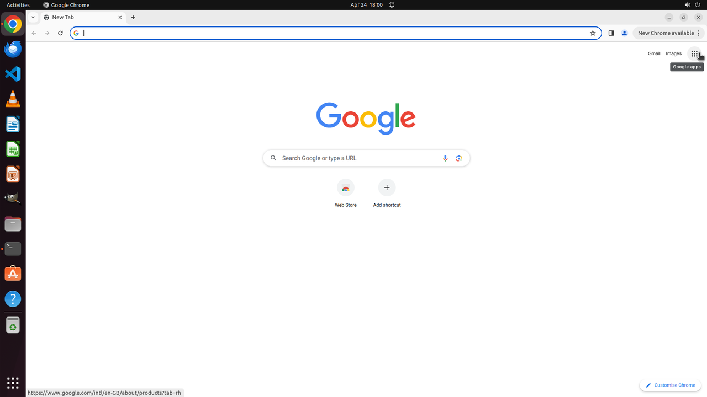

**Response:**
```
Let me navigate to Google Images and use the reverse image search feature. Let me click on the "Images" link.
```

**Actions:** `pyautogui.click(1824, 145)`

---

## Step 15

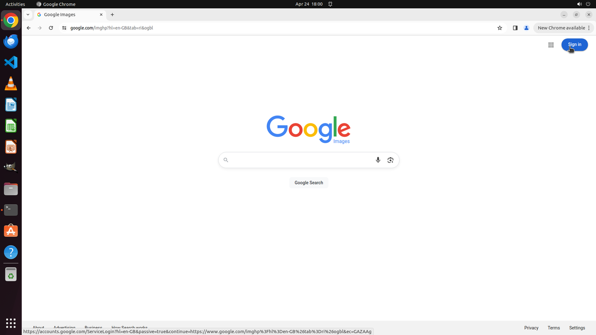

**Response:**
```
I'm on Google Images. Let me click the camera icon to do a reverse image search.
```

**Actions:** `pyautogui.click(1254, 514)`

---

## Step 16


**Response:**
```
I can see the Google Lens upload dialog. Let me click "upload a file" to upload picture2.jpg.
```

**Actions:** `pyautogui.click(1110, 649)`

---

## Step 17

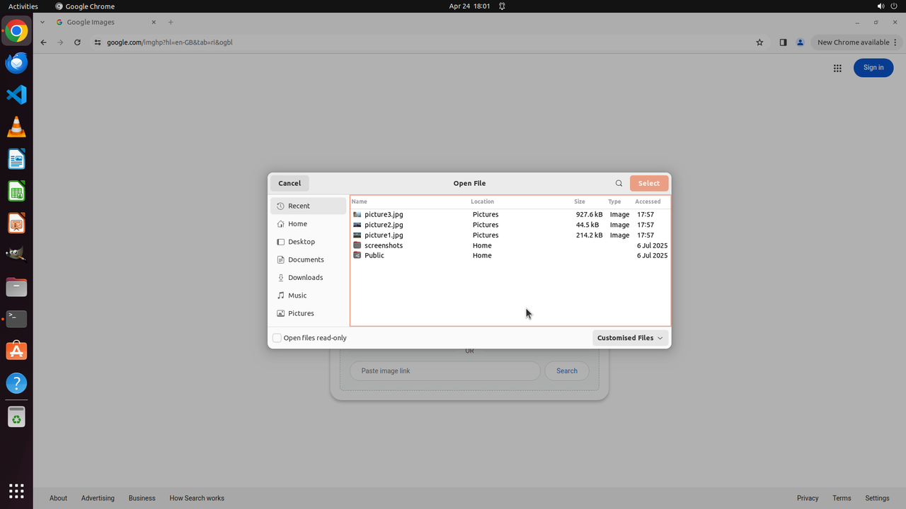

**Response:**
```
I can see the file dialog. Let me select picture2.jpg to upload it for reverse image search.
```

**Actions:** `pyautogui.click(811, 475)`

---

## Step 18

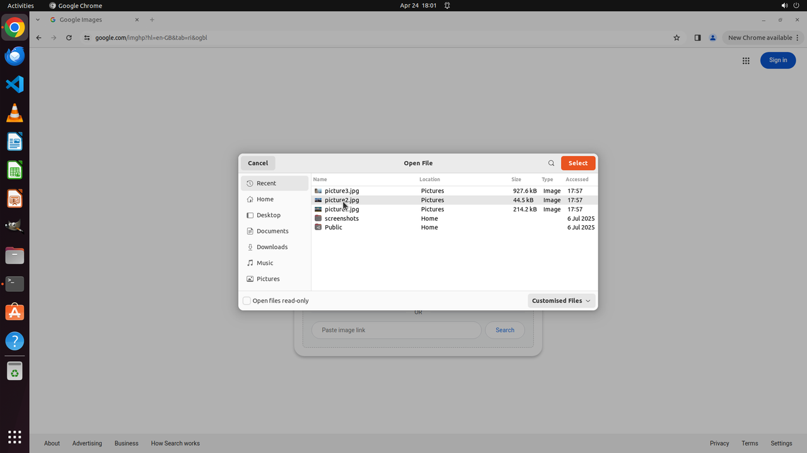

**Response:**
```
I've selected picture2.jpg. Now let me click "Select" to upload it.
```

**Actions:** `pyautogui.click(1371, 388)`

---

## Step 19

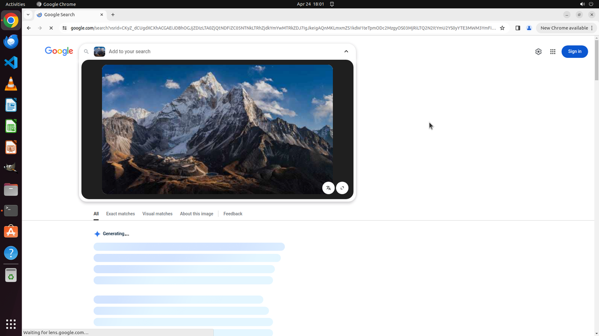

**Response:**
```
Google Lens is processing the image. Let me wait for the results to load.
```

**Actions:** `time.sleep(0.5)`

---

## Step 20

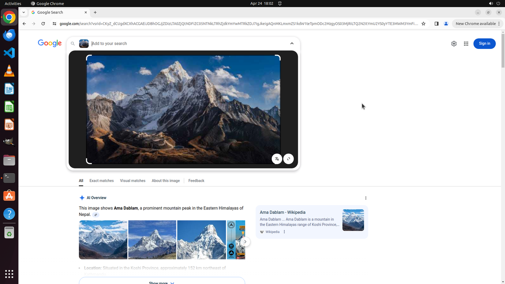

**Response:**
```
Google Lens confirms that picture2.jpg is **Ama Dablam**, a prominent mountain peak in the Eastern Himalayas of Nepal. 

Now I have identified all three mountains:
1. picture1.jpg = Mount Kilimanjaro
2. picture2.jpg = Ama Dablam
3. picture3.jpg = Mount Hua (Huashan)

Let me also verify picture1 and picture3 with Google Lens to be sure. But first, let me verify picture3 since the plank walk is a very distinctive feature. Let me also verify picture1. Actually, let me verify all of them. Let me first check picture1.

Let me go back to Google Images and search for picture1.
```

**Actions:** `pyautogui.click(990, 88)`

---

## Step 21

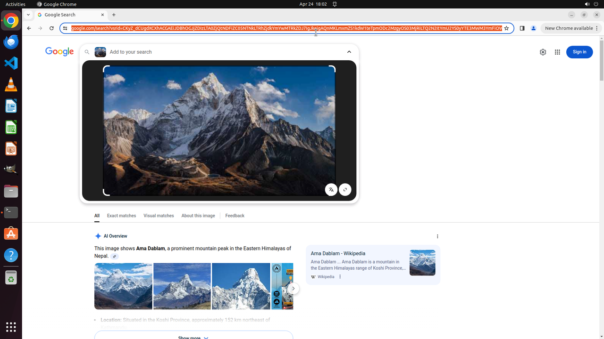

**Response:**
```
Let me navigate to Google Images to search for picture1.
```

**Actions:** `import subprocess, shlex; subprocess.run(f'xdotool type --delay 12 -- ' + shlex.quote('https://images.google.com\n'), shell=True, check=True)
import time; time.sleep(0.05)`

---

## Step 22


**Response:**
```
Good, I'm on Google Images. Let me click the camera icon to do a reverse image search for picture1.
```

**Actions:** `pyautogui.click(1254, 514)`

---

## Step 23


**Response:**
```
Let me click "upload a file" to upload picture1.jpg.
```

**Actions:** `pyautogui.click(1110, 649)`

---

## Step 24


**Response:**
```
Let me select picture1.jpg and upload it.
```

**Actions:** `pyautogui.click(811, 498)`

---

## Step 25

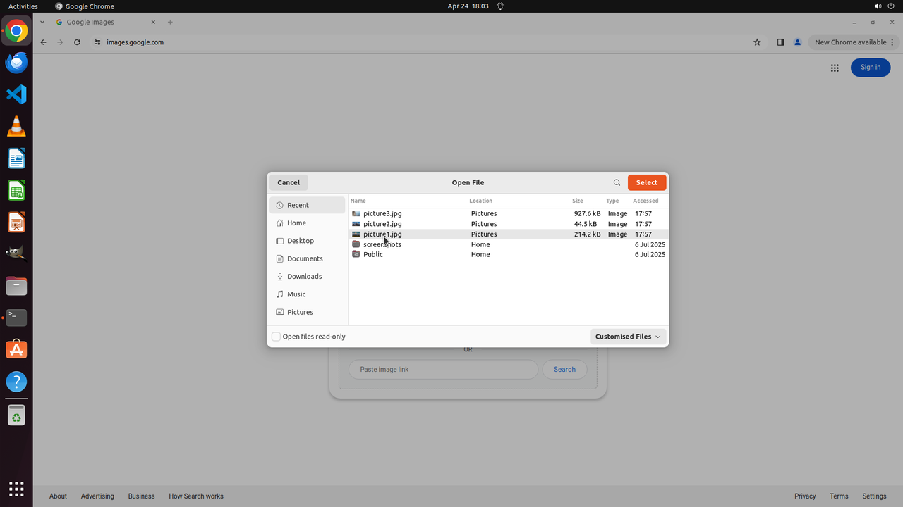

**Response:**
```
I've selected picture1.jpg. Let me click "Select" to upload it.
```

**Actions:** `pyautogui.click(1371, 388)`

---

## Step 26

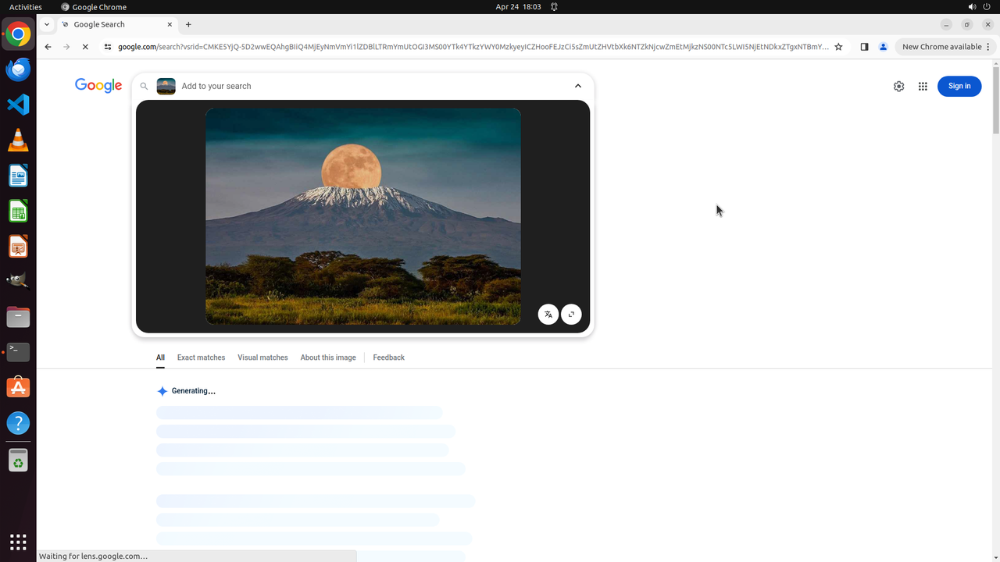

**Response:**
```
Google Lens is processing picture1.jpg. I can already see the image - it's clearly Mount Kilimanjaro with its distinctive flat-topped snow-capped peak and African savanna in the foreground, with a large moon behind it. Let me wait for the results.
```

**Actions:** `time.sleep(0.5)`

---

## Step 27

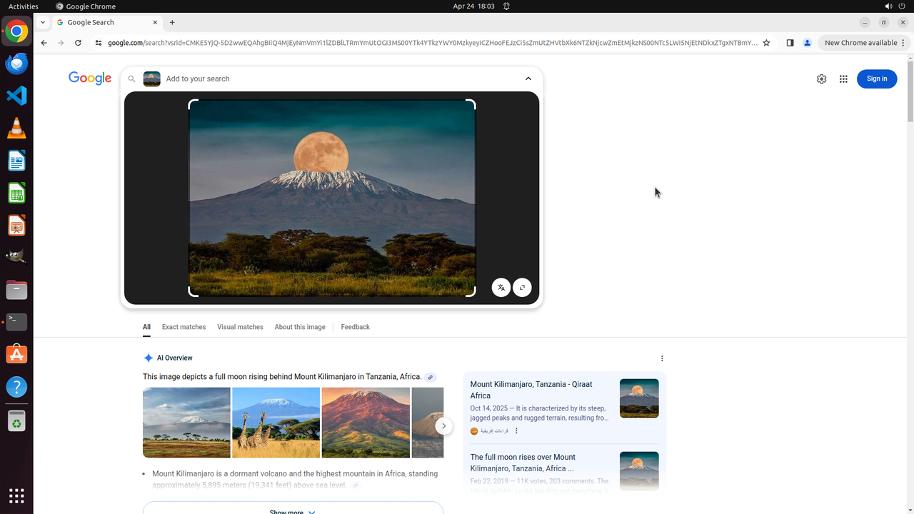

**Response:**
```
Google Lens confirms that picture1.jpg is **Mount Kilimanjaro** in Tanzania, Africa. 

Now let me verify picture3. Let me navigate back to Google Images.
```

**Actions:** `pyautogui.click(990, 88)`

---

## Step 28

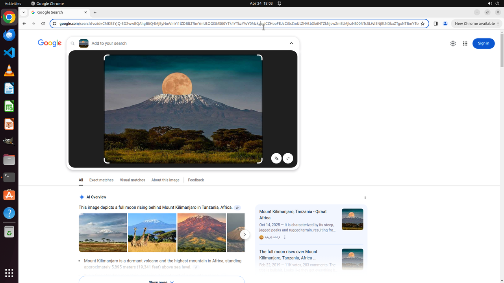

**Response:**
```
Let me navigate to Google Images to search for picture3.
```

**Actions:** `import subprocess, shlex; subprocess.run(f'xdotool type --delay 12 -- ' + shlex.quote('https://images.google.com\n'), shell=True, check=True)
import time; time.sleep(0.05)`

---

## Step 29

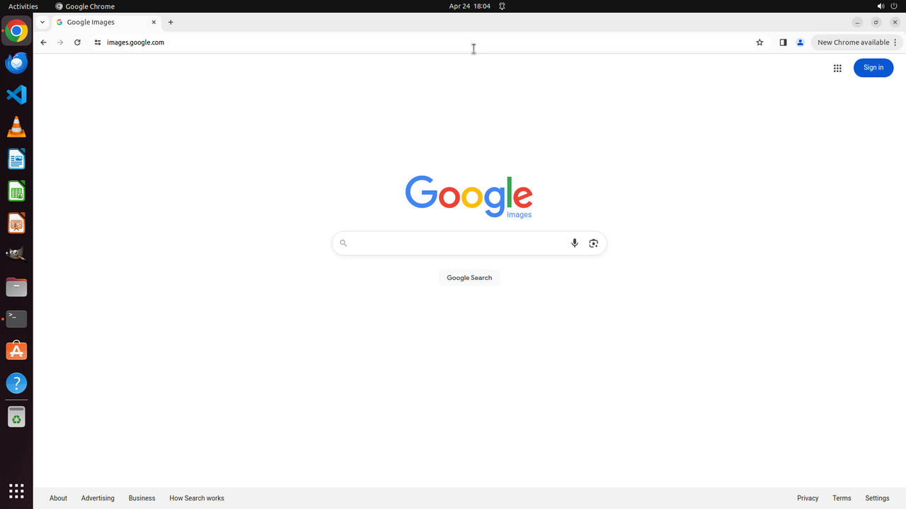

**Response:**
```
Let me click the camera icon to upload picture3.
```

**Actions:** `pyautogui.click(1254, 514)`

---

## Step 30

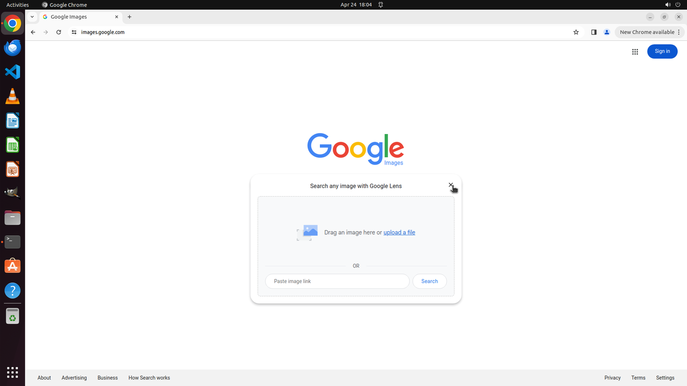

**Response:**
```
Let me click "upload a file" to upload picture3.jpg.
```

**Actions:** `pyautogui.click(1110, 649)`

---

## Step 31


**Response:**
```
Let me select picture3.jpg and upload it.
```

**Actions:** `pyautogui.click(811, 454)`

---

## Step 32


**Response:**
```
I've selected picture3.jpg. Let me click "Select" to upload it.
```

**Actions:** `pyautogui.click(1371, 388)`

---

## Step 33

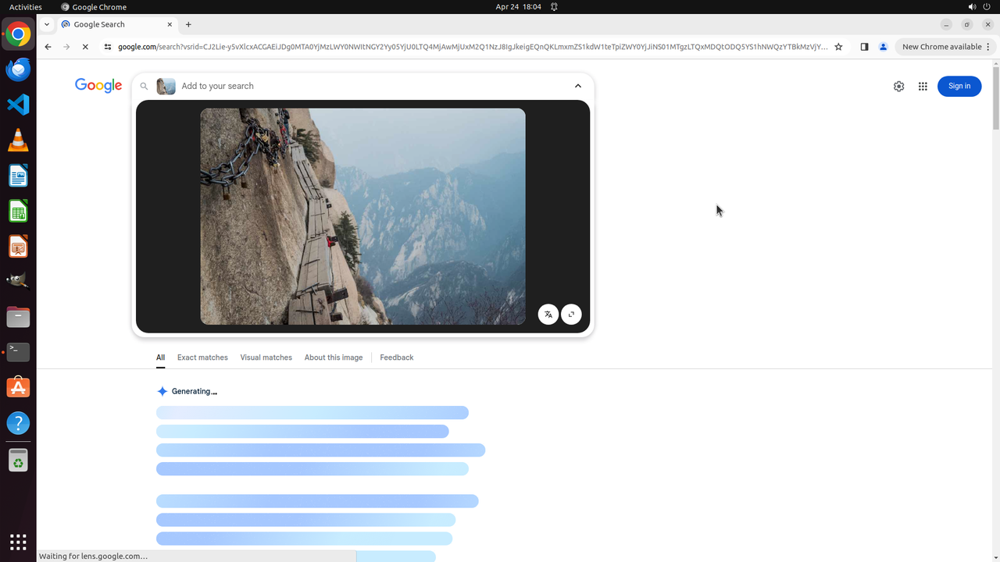

**Response:**
```
Google Lens is processing picture3.jpg. I can see the image showing the famous plank walk on a cliff face. Let me wait for the results.
```

**Actions:** `time.sleep(0.5)`

---

## Step 34

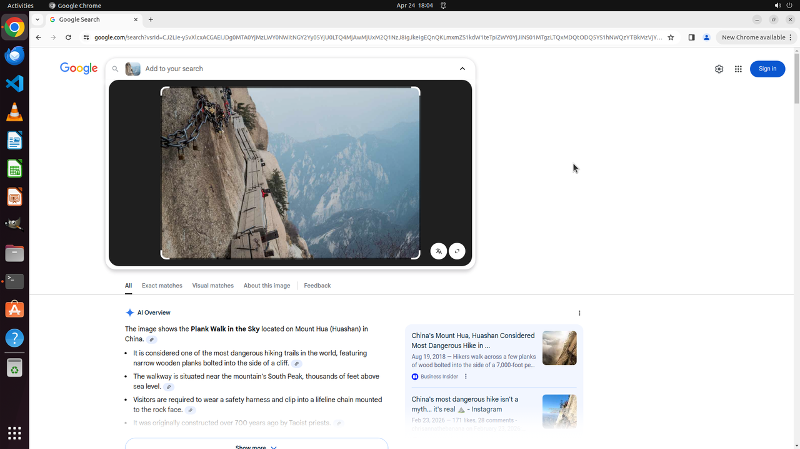

**Response:**
```
Google Lens confirms that picture3.jpg shows the **Plank Walk in the Sky** located on **Mount Hua (Huashan)** in China.

Now I have all three mountains confirmed:
1. picture1.jpg → Mount Kilimanjaro
2. picture2.jpg → Ama Dablam
3. picture3.jpg → Mount Hua

Now let me rename the files. Let me open a terminal to do the renaming.
```

**Actions:** `pyautogui.click(33, 673)`

---

## Step 35


**Response:**
```
The terminal is open. Now let me rename the files. I'll rename each picture to the corresponding mountain name.
```

**Actions:** `import subprocess, shlex; subprocess.run(f'xdotool type --delay 12 -- ' + shlex.quote('cd ~/Pictures && mv picture1.jpg "Mount Kilimanjar'), shell=True, check=True)
import time; time.sleep(0.05)
impor`

---

## Step 36

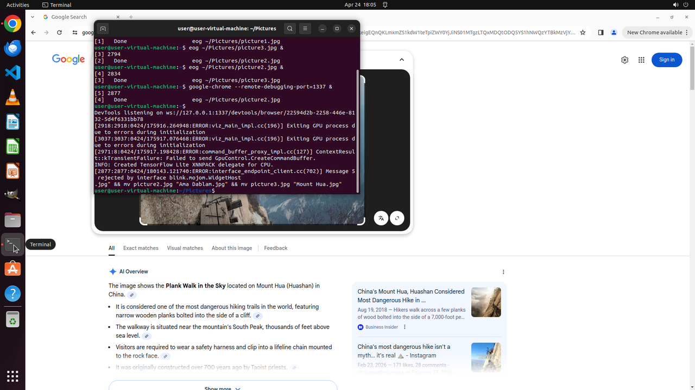

**Response:**
```
The files have been renamed successfully. Let me verify the renaming by listing the files in the Pictures directory.
```

**Actions:** `import subprocess, shlex; subprocess.run(f'xdotool type --delay 12 -- ' + shlex.quote('ls -la ~/Pictures/\n'), shell=True, check=True)
import time; time.sleep(0.05)`

---

## Step 37

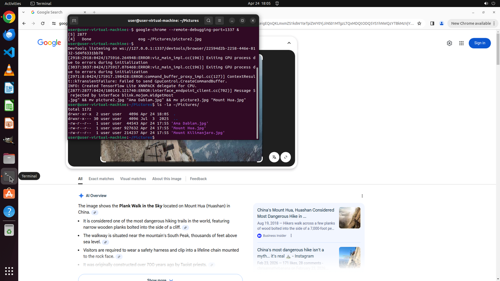

**Response:**
```
The files have been successfully renamed. I can see the three files in the Pictures directory:

1. **Ama Dablam.jpg** (44,543 bytes) - formerly picture2.jpg
2. **Mount Hua.jpg** (927,632 bytes) - formerly picture3.jpg
3. **Mount Kilimanjaro.jpg** (214,237 bytes) - formerly picture1.jpg

All filenames use spaces (not underscores) as requested. The task is complete.

DONE
```

**Actions:** `DONE`

---
