# Task ce2b64a2-ddc1-4f91-8c7d-a88be7121aac

**Instruction:** There are several pictures of mountains in my Pictures directory, but I don’t know the names of these mountains. Please help me identify these pictures and change the names of these pictures to the names of the mountains in the pictures. In the filename do not replace spaces with underscore.

**Score:** 1.0

**Wall clock:** 11m 9s

**Steps:** 35

**Cost:** $1.09

---

## Step 1


**Response:**
```
Let me first look at the pictures in the Pictures directory.
```

**Actions:** `pyautogui.click(33, 673)`

---

## Step 2


**Response:**
```
Let me list the files in the Pictures directory first.
```

**Actions:** `import subprocess, shlex; subprocess.run(f'xdotool type --delay 12 -- ' + shlex.quote('ls ~/Pictures/\n'), shell=True, check=True)
import time; time.sleep(0.05)`

---

## Step 3

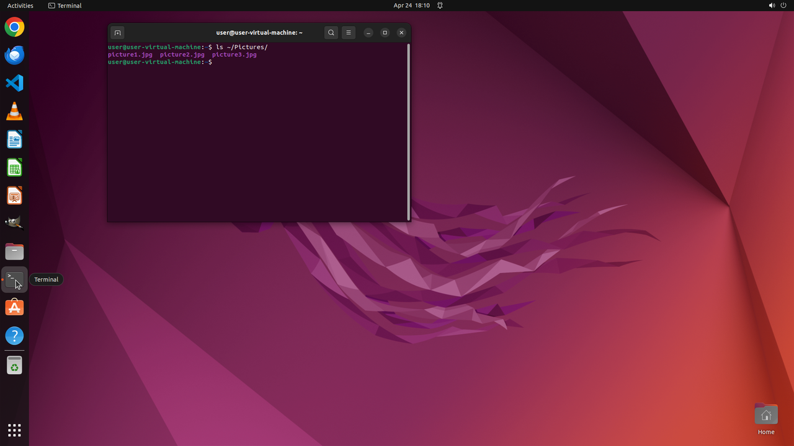

**Response:**
```
I can see three pictures: picture1.jpg, picture2.jpg, and picture3.jpg. Let me open each one to identify the mountains. Let me start by viewing the first picture.
```

**Actions:** `import subprocess, shlex; subprocess.run(f'xdotool type --delay 12 -- ' + shlex.quote('eog ~/Pictures/picture1.jpg &\n'), shell=True, check=True)
import time; time.sleep(0.05)`

---

## Step 4

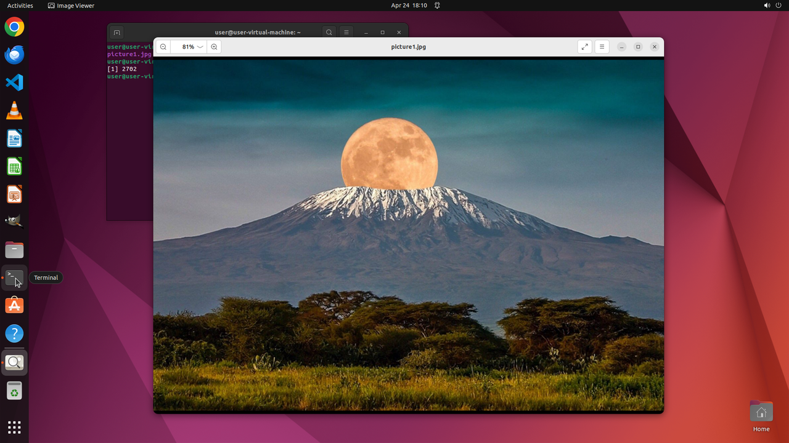

**Response:**
```
This is clearly Mount Kilimanjaro - the iconic snow-capped mountain in Tanzania with the African savanna in the foreground and a large moon rising behind it. Let me close this and view the next picture.
```

**Actions:** `pyautogui.click(1588, 114)`

---

## Step 5

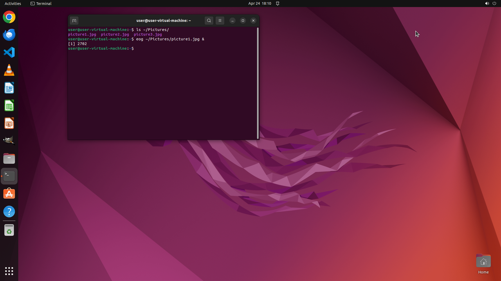

**Response:**
```
Now let me open the second picture.
```

**Actions:** `import subprocess, shlex; subprocess.run(f'xdotool type --delay 12 -- ' + shlex.quote('eog ~/Pictures/picture2.jpg &\n'), shell=True, check=True)
import time; time.sleep(0.05)`

---

## Step 6

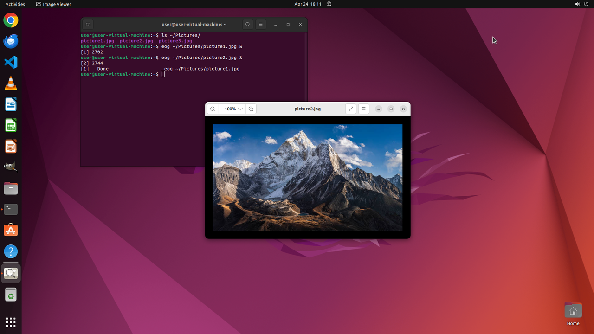

**Response:**
```
This picture shows a dramatic Himalayan mountain peak. The distinctive sharp, pyramidal peak with snow and the rugged terrain suggests this is Mount Everest (or possibly Ama Dablam). Looking more carefully at the sharp, iconic peak shape, this appears to be Mount Everest. Let me close this and view the third picture.
```

**Actions:** `pyautogui.click(1294, 351)`

---

## Step 7

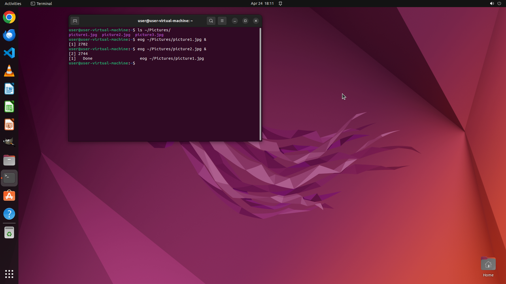

**Response:**
```
Now let me open the third picture.
```

**Actions:** `import subprocess, shlex; subprocess.run(f'xdotool type --delay 12 -- ' + shlex.quote('eog ~/Pictures/picture3.jpg &\n'), shell=True, check=True)
import time; time.sleep(0.05)`

---

## Step 8

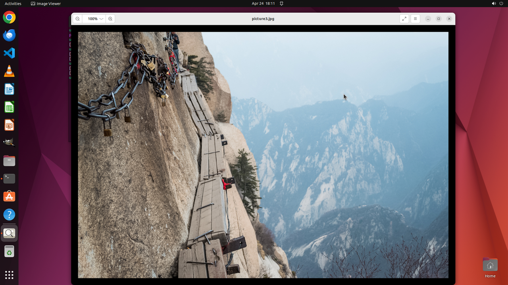

**Response:**
```
This is the famous plank walk on Mount Hua (Huashan) in China - one of the most dangerous hiking trails in the world. The wooden planks bolted to the cliff face, the chains with locks, and the misty Chinese mountain landscape are unmistakable features of Mount Hua.

Now let me go back to the second picture to take a closer look. Let me close this first and reconsider picture 2.
```

**Actions:** `pyautogui.click(1690, 70)`

---

## Step 9

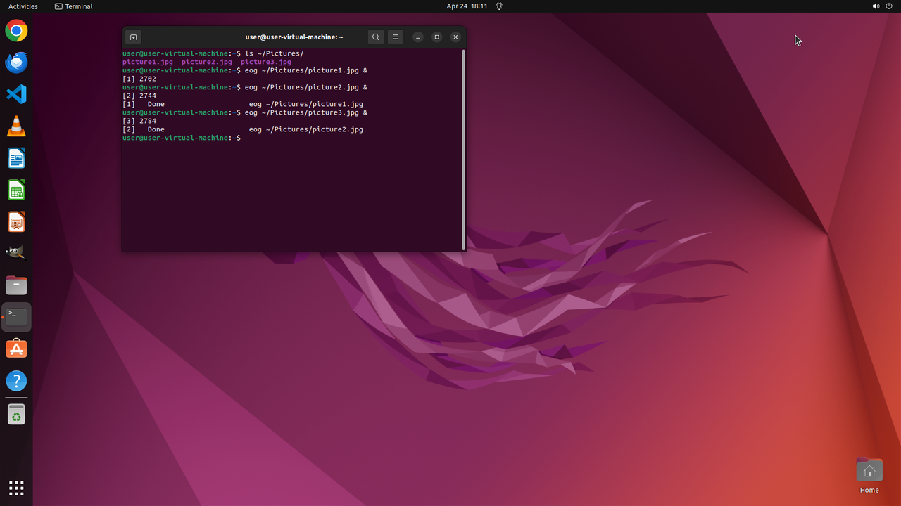

**Response:**
```
Let me do a reverse image search to better identify picture2. But first, let me reconsider what I saw. The picture showed a dramatic, sharp pyramidal peak with snow in the Himalayas. Looking at the distinctive shape more carefully, that sharp triangular peak with the rugged terrain is characteristic of Ama Dablam, a famous mountain in the Himalayas. However, it could also be Mount Everest.

Let me use Google reverse image search to verify. Let me open Chrome and search for the images.
```

**Actions:** `import subprocess, shlex; subprocess.run(f'xdotool type --delay 12 -- ' + shlex.quote('eog ~/Pictures/picture2.jpg &\n'), shell=True, check=True)
import time; time.sleep(0.05)`

---

## Step 10

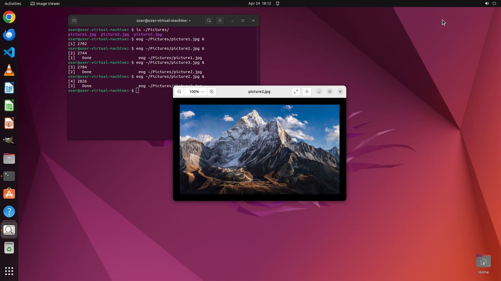

**Response:**
```
Looking at this image more carefully, I can see a very sharp, dramatic pyramidal peak with snow on top, surrounded by rugged brown terrain and other mountain peaks. This is a very iconic Himalayan scene. The sharp peak and the surrounding landscape strongly suggest this is Mount Everest, but the distinctive sharp triangular shape is more characteristic of Ama Dablam. 

Let me use Google reverse image search to confirm. Let me close this and open Chrome.
```

**Actions:** `pyautogui.click(1294, 351)`

---

## Step 11

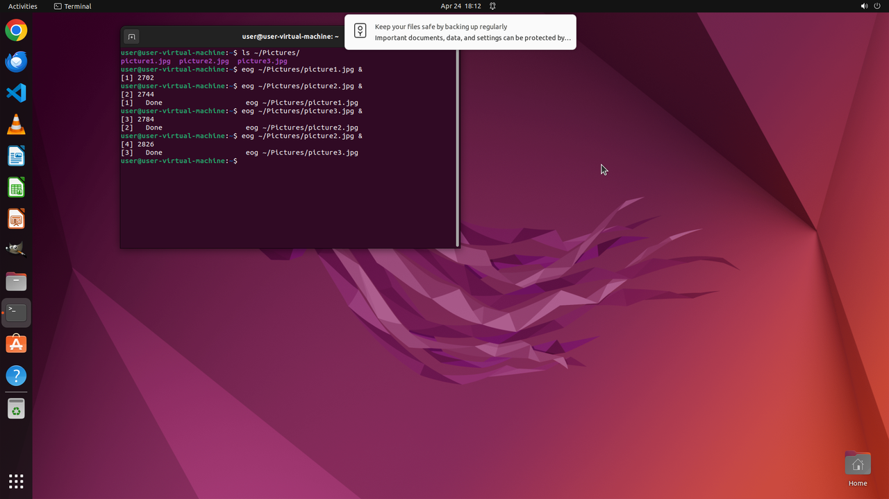

**Response:**
```
Let me open Chrome to do a reverse image search for picture2 to properly identify the mountain.
```

**Actions:** `import subprocess, shlex; subprocess.run(f'xdotool type --delay 12 -- ' + shlex.quote('google-chrome --remote-debugging-port=1337 &\n'), shell=True, check=True)
import time; time.sleep(0.05)`

---

## Step 12

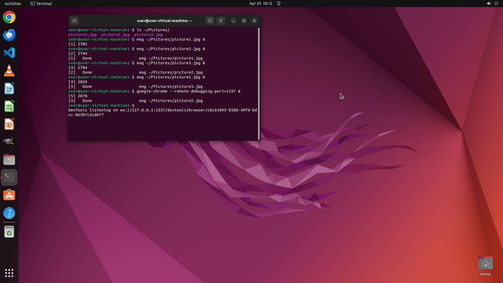

**Response:**
```
Let me wait for Chrome to open.
```

**Actions:** `time.sleep(0.5)`

---

## Step 13


**Response:**
```
Chrome is open. Let me use Google Images reverse search. I'll click on the Google Lens icon to search by image.
```

**Actions:** `pyautogui.click(1888, 139)`

---

## Step 14


**Response:**
```
Let me navigate to Google Images to use the reverse image search feature.
```

**Actions:** `pyautogui.click(1825, 145)`

---

## Step 15

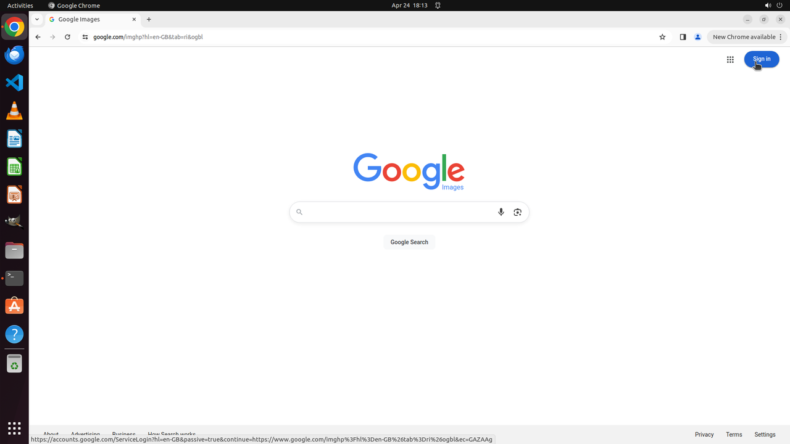

**Response:**
```
I'm on Google Images. Let me click the camera icon to search by image.
```

**Actions:** `pyautogui.click(1254, 514)`

---

## Step 16


**Response:**
```
I can see the Google Lens upload interface. Let me click "upload a file" to upload picture2.jpg.
```

**Actions:** `pyautogui.click(1108, 649)`

---

## Step 17

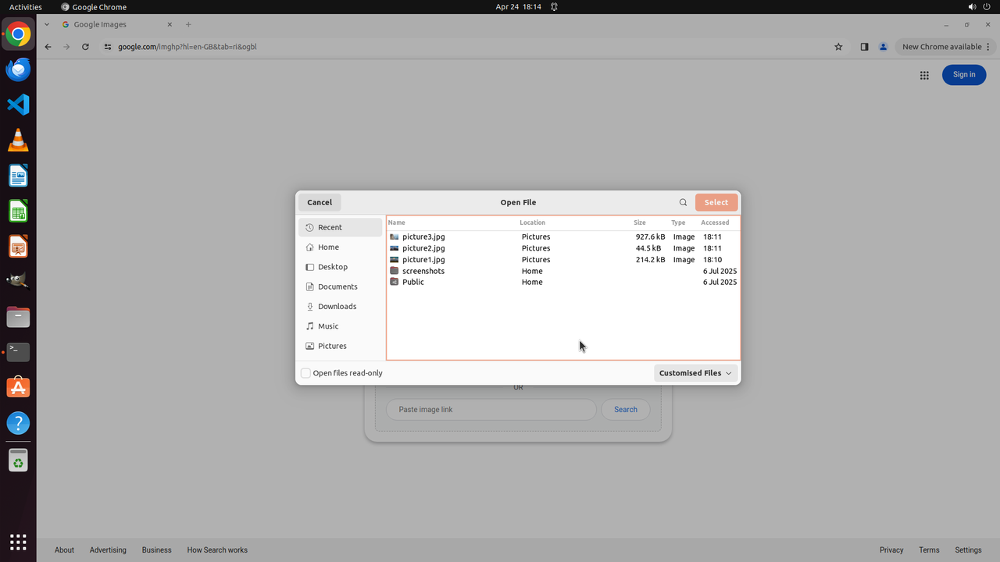

**Response:**
```
I can see the file dialog. Let me select picture2.jpg to upload it for reverse image search.
```

**Actions:** `pyautogui.click(811, 475)`

---

## Step 18

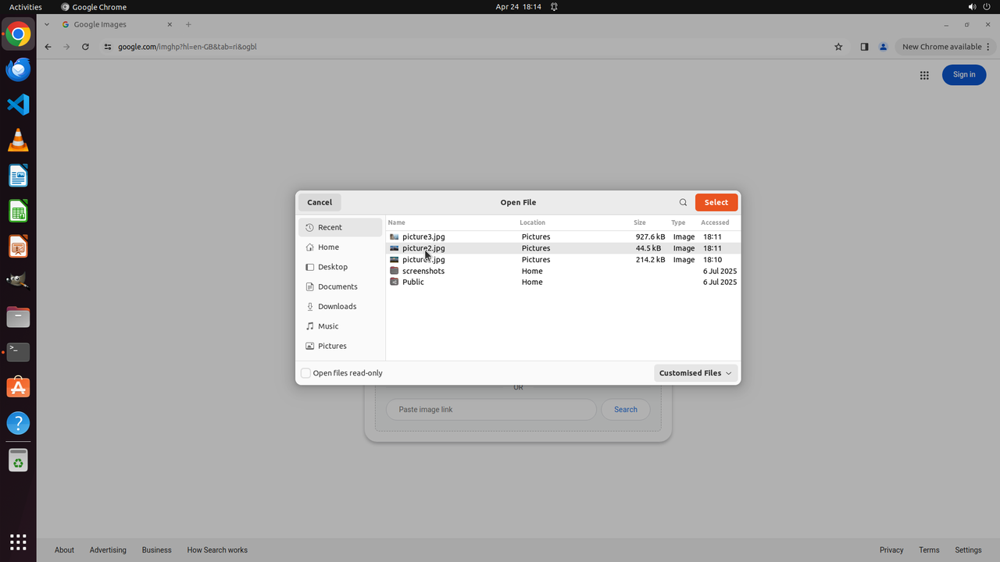

**Response:**
```
I've selected picture2.jpg. Now let me click "Select" to upload it.
```

**Actions:** `pyautogui.click(1371, 388)`

---

## Step 19

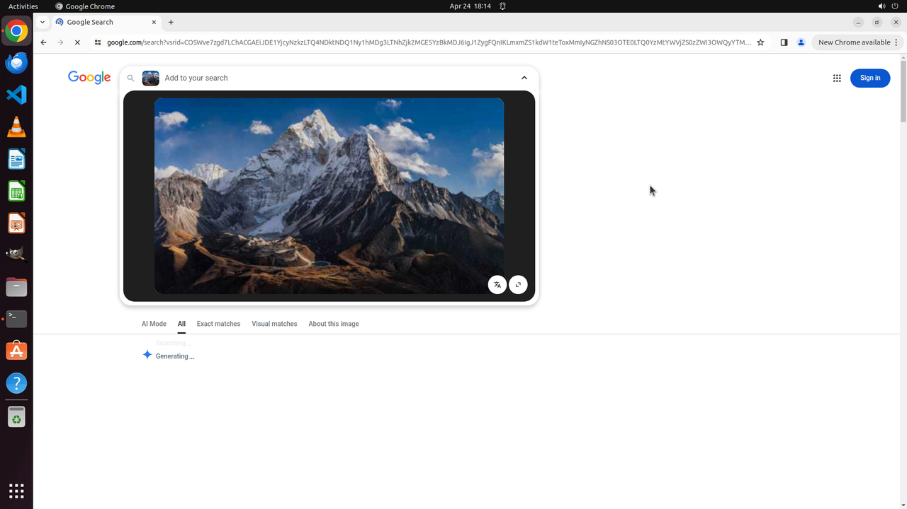

**Response:**
```
Google Lens is processing the image. Let me wait for the results to load.
```

**Actions:** `time.sleep(0.5)`

---

## Step 20

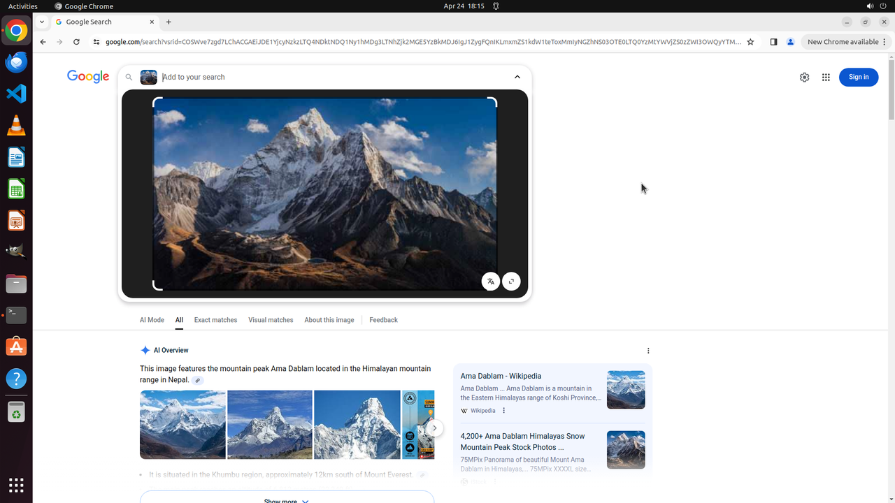

**Response:**
```
Google Lens has identified picture2.jpg as **Ama Dablam**, a mountain peak in the Himalayan mountain range in Nepal. 

Now I have all three mountains identified:
1. picture1.jpg → Mount Kilimanjaro
2. picture2.jpg → Ama Dablam
3. picture3.jpg → Mount Hua

Let me also verify picture1 and picture3. Let me first search for picture1.
```

**Actions:** `pyautogui.click(1254, 514)`

---

## Step 21


**Response:**
```
The search confirms picture2.jpg is **Ama Dablam**. Now let me verify picture1.jpg and picture3.jpg as well. Let me click the camera icon to search for picture1.
```

**Actions:** `pyautogui.click(1066, 165)`

---

## Step 22

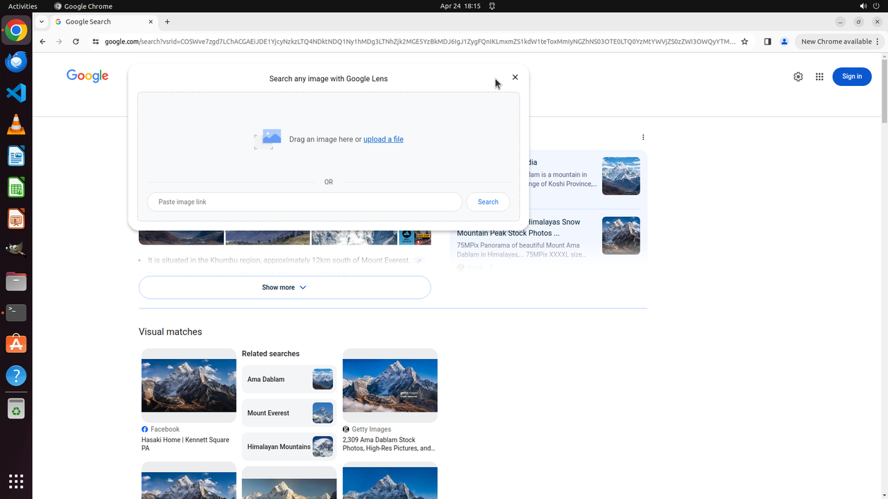

**Response:**
```
Let me click "upload a file" to upload picture1.jpg.
```

**Actions:** `pyautogui.click(826, 300)`

---

## Step 23

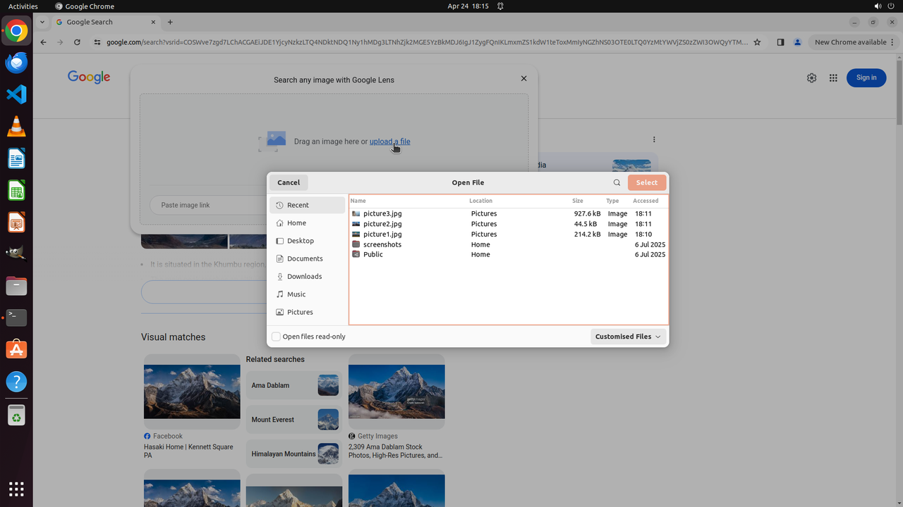

**Response:**
```
Let me select picture1.jpg to upload it.
```

**Actions:** `pyautogui.click(811, 498)`

---

## Step 24

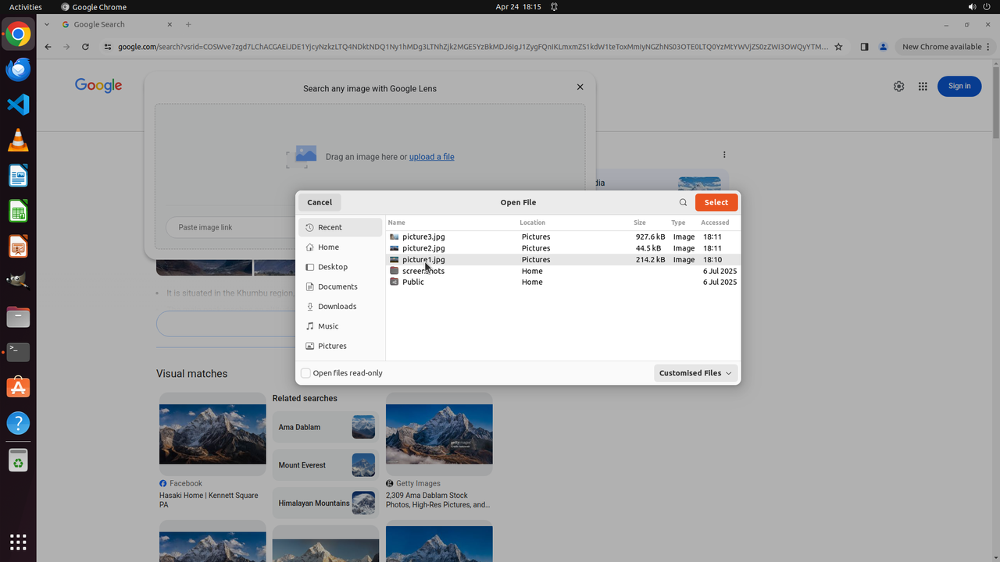

**Response:**
```
I've selected picture1.jpg. Let me click "Select" to upload it.
```

**Actions:** `pyautogui.click(1371, 388)`

---

## Step 25

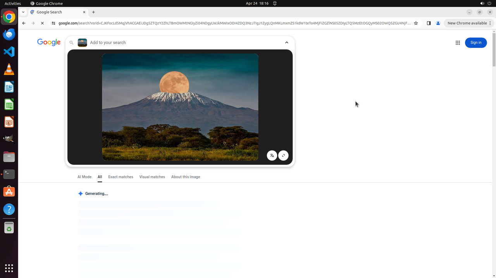

**Response:**
```
Google Lens is processing picture1.jpg. I can already see the image clearly shows Mount Kilimanjaro with the African savanna and a large moon. Let me wait for the results.
```

**Actions:** `time.sleep(0.5)`

---

## Step 26

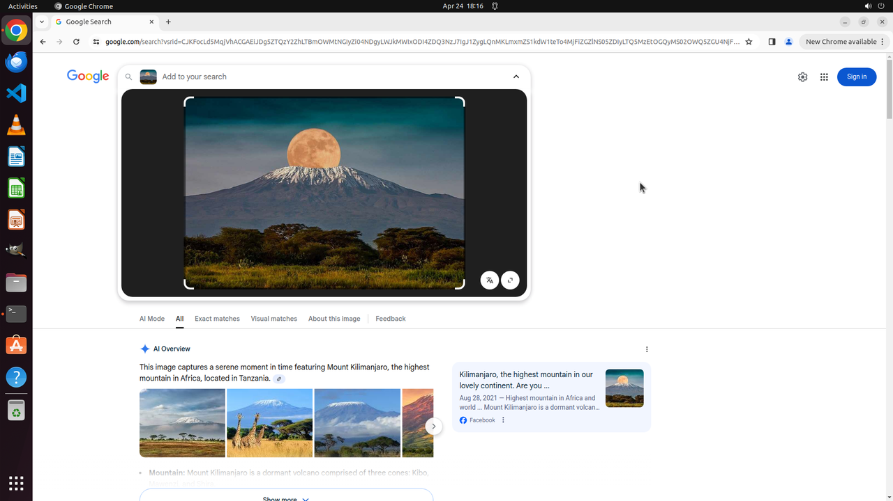

**Response:**
```
Google Lens confirms picture1.jpg is **Mount Kilimanjaro**, the highest mountain in Africa, located in Tanzania.

Now let me verify picture3.jpg. Let me click the camera icon to search for it.
```

**Actions:** `pyautogui.click(1066, 165)`

---

## Step 27

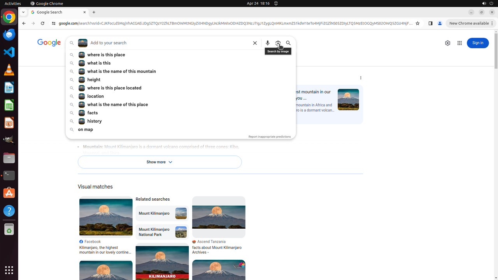

**Response:**
```
I see a dropdown appeared. Let me click on "Search by image" icon to open the image upload dialog.
```

**Actions:** `pyautogui.click(1071, 165)`

---

## Step 28

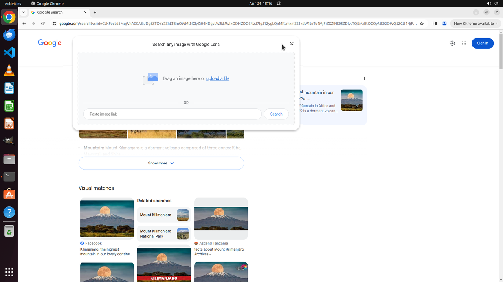

**Response:**
```
Now let me click "upload a file" to upload picture3.jpg.
```

**Actions:** `pyautogui.click(826, 298)`

---

## Step 29

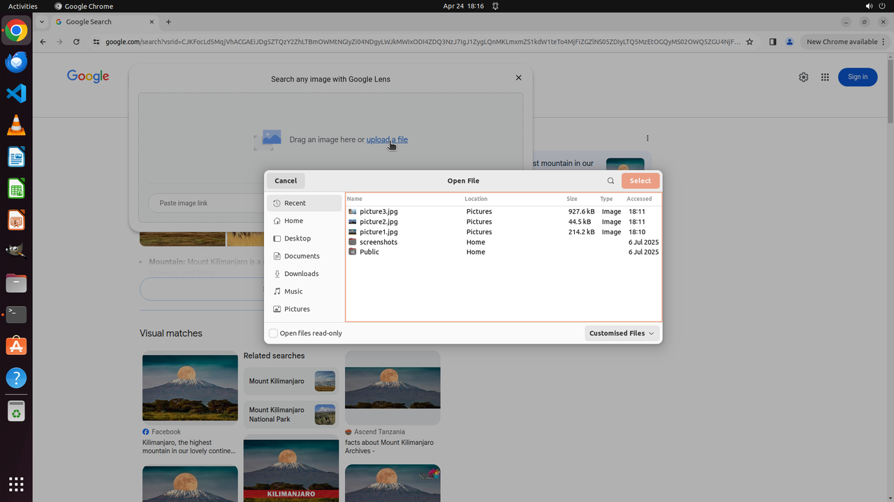

**Response:**
```
Let me select picture3.jpg.
```

**Actions:** `pyautogui.click(811, 454)`

---

## Step 30

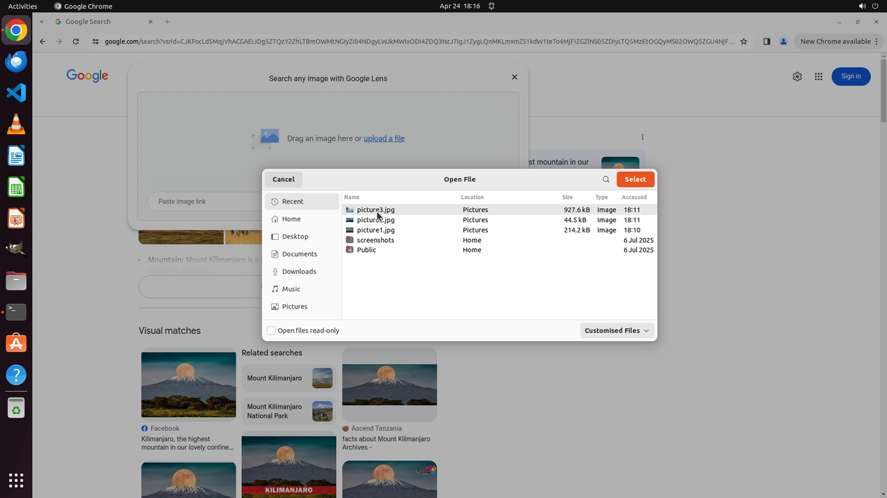

**Response:**
```
I've selected picture3.jpg. Let me click "Select" to upload it.
```

**Actions:** `pyautogui.click(1371, 388)`

---

## Step 31

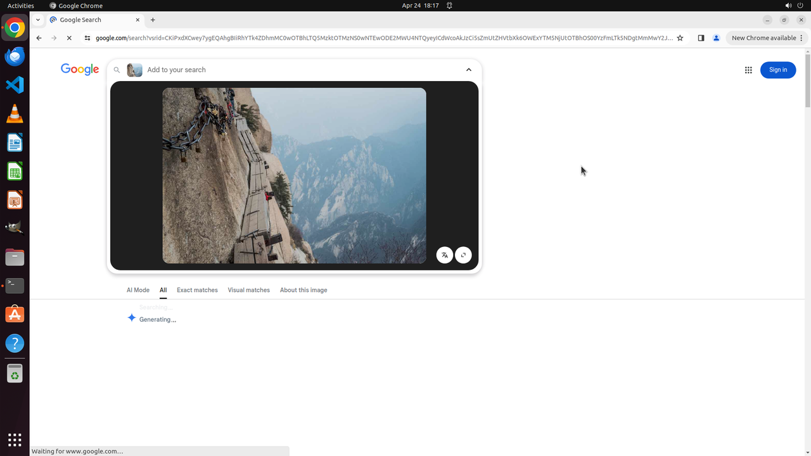

**Response:**
```
Google Lens is processing picture3.jpg. I can see the famous plank walk on a mountain cliff. Let me wait for the results.
```

**Actions:** `time.sleep(0.5)`

---

## Step 32

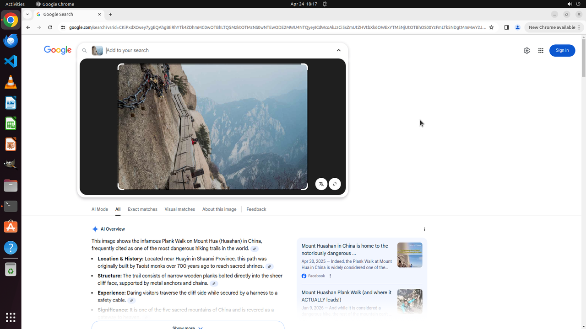

**Response:**
```
Google Lens confirms picture3.jpg is **Mount Hua (Huashan)** in China, showing the infamous Plank Walk.

Now I have all three mountains confirmed:
1. picture1.jpg → Mount Kilimanjaro
2. picture2.jpg → Ama Dablam
3. picture3.jpg → Mount Hua

Now let me rename the files in the terminal. Let me switch to the terminal.
```

**Actions:** `pyautogui.click(33, 673)`

---

## Step 33

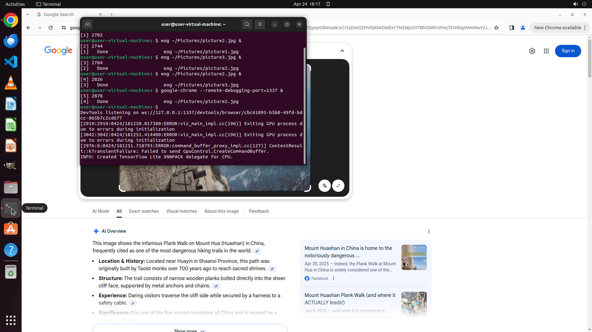

**Response:**
```
I'm now in the terminal. Let me rename the three picture files to the mountain names. I need to use the correct names:
1. picture1.jpg → Mount Kilimanjaro.jpg
2. picture2.jpg → Ama Dablam.jpg
3. picture3.jpg → Mount Hua.jpg
```

**Actions:** `import subprocess, shlex; subprocess.run(f'xdotool type --delay 12 -- ' + shlex.quote('cd ~/Pictures && mv picture1.jpg "Mount Kilimanjar'), shell=True, check=True)
import time; time.sleep(0.05)
impor`

---

## Step 34

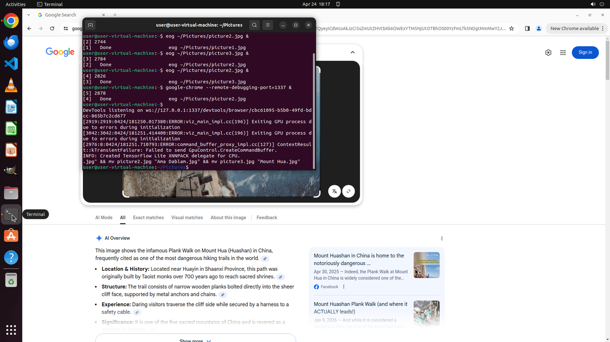

**Response:**
```
The rename commands executed successfully. Let me verify the files were renamed correctly.
```

**Actions:** `import subprocess, shlex; subprocess.run(f'xdotool type --delay 12 -- ' + shlex.quote('ls -la ~/Pictures/\n'), shell=True, check=True)
import time; time.sleep(0.05)`

---

## Step 35


**Response:**
```
The files have been successfully renamed. I can see in the terminal output:

- `Ama Dablam.jpg` (formerly picture2.jpg)
- `Mount Hua.jpg` (formerly picture3.jpg)
- `Mount Kilimanjaro.jpg` (formerly picture1.jpg)

All three mountain pictures have been identified and renamed correctly with spaces (not underscores) in the filenames:

1. **picture1.jpg** → **Mount Kilimanjaro.jpg** (the iconic snow-capped mountain in Tanzania, Africa)
2. **picture2.jpg** → **Ama Dablam.jpg** (the mountain peak in the Himalayan range in Nepal)
3. **picture3.jpg** → **Mount Hua.jpg** (the famous mountain in China with the Plank Walk)

DONE
```

**Actions:** `DONE`

---
