# Task ce2b64a2-ddc1-4f91-8c7d-a88be7121aac

**Instruction:** There are several pictures of mountains in my Pictures directory, but I don’t know the names of these mountains. Please help me identify these pictures and change the names of these pictures to the names of the mountains in the pictures. In the filename do not replace spaces with underscore.

**Score:** 1.0

**Wall clock:** 11m 20s

**Steps:** 45

**Cost:** $1.49

---

## Step 1


**Response:**
```
Let me first look at what pictures are in the Pictures directory.
```

**Actions:** `pyautogui.click(33, 673)`

---

## Step 2


**Response:**
```
I see the Terminal is loading. Let me click on it to open it.
```

**Actions:** `pyautogui.click(33, 673)`

---

## Step 3


**Response:**
```
Good, the terminal is open. Let me list the files in the Pictures directory.
```

**Actions:** `import subprocess, shlex; subprocess.run(f'xdotool type --delay 12 -- ' + shlex.quote('ls ~/Pictures/\n'), shell=True, check=True)
import time; time.sleep(0.05)`

---

## Step 4


**Response:**
```
I can see there are three pictures: picture1.jpg, picture2.jpg, and picture3.jpg. I need to view each one to identify the mountains. Let me open them one by one. First, let me open picture1.jpg.
```

**Actions:** `import subprocess, shlex; subprocess.run(f'xdotool type --delay 12 -- ' + shlex.quote('eog ~/Pictures/picture1.jpg &\n'), shell=True, check=True)
import time; time.sleep(0.05)`

---

## Step 5

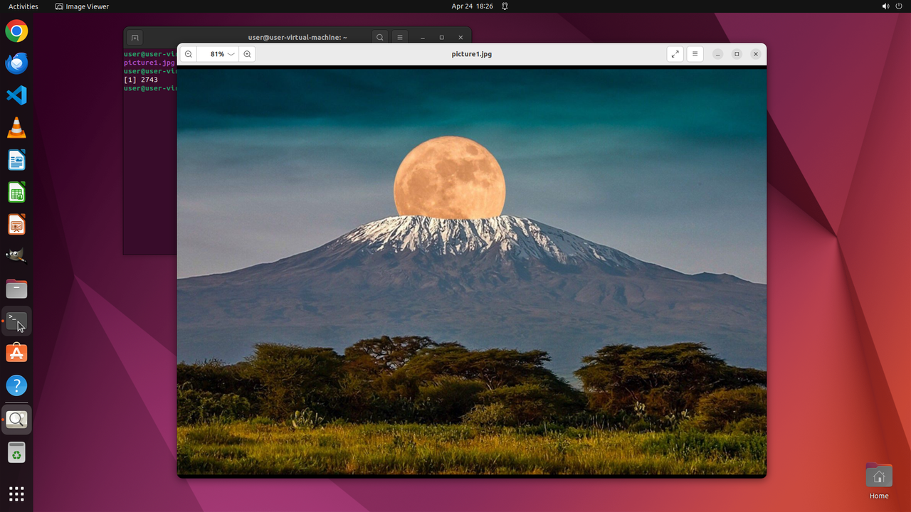

**Response:**
```
I can see picture1.jpg shows Mount Kilimanjaro - a distinctive flat-topped mountain with snow on its peak, with African savanna vegetation in the foreground and a large moon rising behind it. This is clearly Mount Kilimanjaro in Tanzania.

Now let me close this and open picture2.jpg.
```

**Actions:** `pyautogui.click(1588, 114)`

---

## Step 6


**Response:**
```
Good, the image viewer is closed. Now let me open picture2.jpg.
```

**Actions:** `import subprocess, shlex; subprocess.run(f'xdotool type --delay 12 -- ' + shlex.quote('eog ~/Pictures/picture2.jpg &\n'), shell=True, check=True)
import time; time.sleep(0.05)`

---

## Step 7

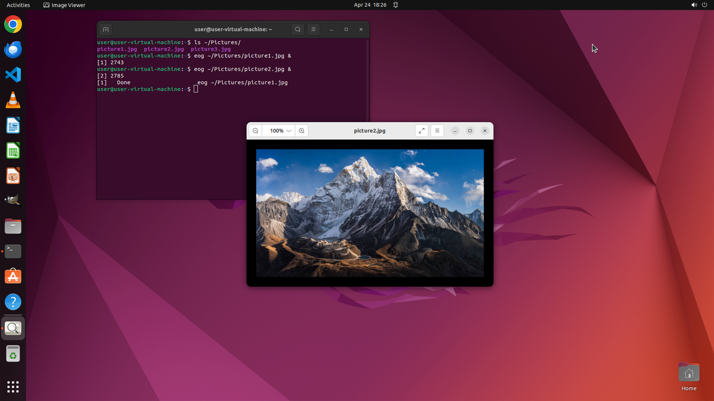

**Response:**
```
I can see picture2.jpg shows a dramatic Himalayan mountain peak. This appears to be Mount Everest or a peak in the Everest region. The sharp, snow-covered peaks with dramatic rocky ridges are characteristic of the Himalayas. Looking more closely at the distinctive shape, this appears to be Ama Dablam, a famous peak in the Himalayas near Everest. However, let me look more carefully - the sharp triangular peak with surrounding snow-covered mountains looks like it could be Mount Everest. 

Actually, looking at the image more carefully, the prominent sharp peak with the distinctive shape and the surrounding landscape strongly suggests this is Mount Everest (or the Everest region). But the specific peak shape with the dramatic pointed summit is more characteristic of Ama Dablam.

Let me close this and view picture3.jpg.
```

**Actions:** `pyautogui.click(1294, 351)`

---

## Step 8

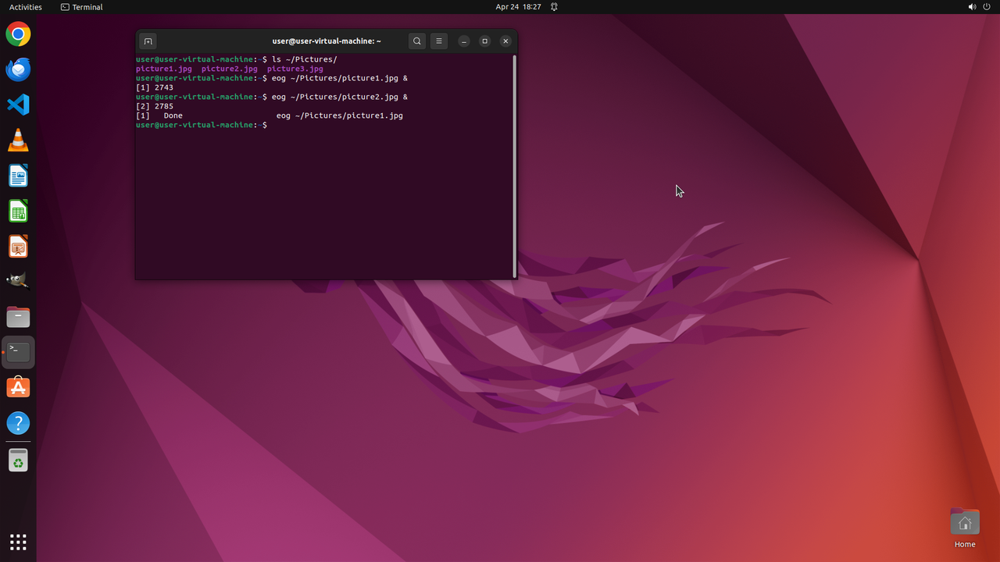

**Response:**
```
Now let me open picture3.jpg.
```

**Actions:** `import subprocess, shlex; subprocess.run(f'xdotool type --delay 12 -- ' + shlex.quote('eog ~/Pictures/picture3.jpg &\n'), shell=True, check=True)
import time; time.sleep(0.05)`

---

## Step 9

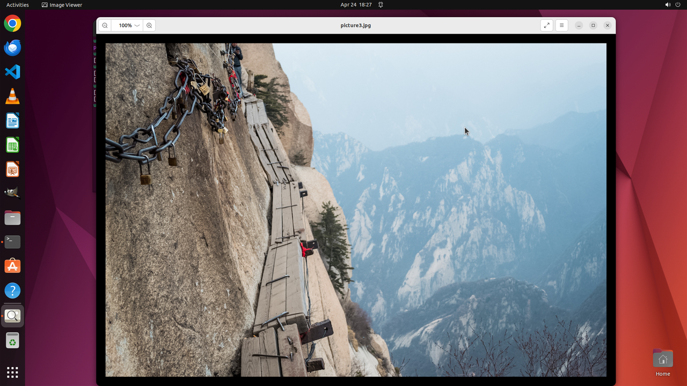

**Response:**
```
I can see picture3.jpg shows the famous plank walk on Mount Hua (Huashan) in China. The distinctive wooden planks bolted to the cliff face, the chains with locks, and the misty mountain landscape in the background are unmistakable features of Mount Hua's famous "Plank Road in the Sky."

Now I need to reconsider picture2.jpg. Let me look at it again more carefully to confirm the mountain identity. Let me close this first and re-examine picture2.
```

**Actions:** `pyautogui.click(1690, 70)`

---

## Step 10

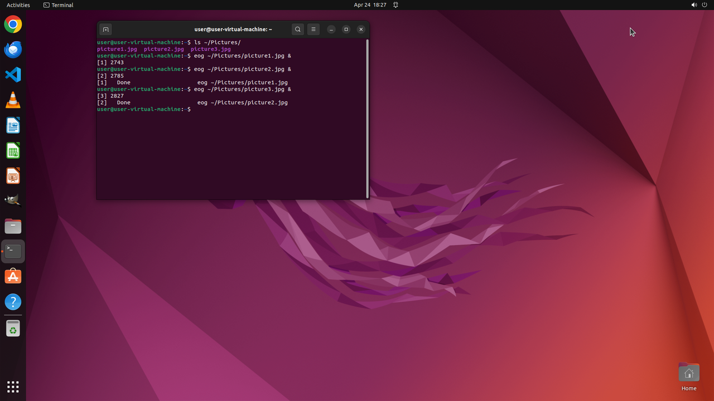

**Response:**
```
Let me do a reverse image search to confirm the identity of picture2. Let me use Google Chrome to search. But first, let me re-examine picture2 more carefully by opening it again.
```

**Actions:** `import subprocess, shlex; subprocess.run(f'xdotool type --delay 12 -- ' + shlex.quote('eog ~/Pictures/picture2.jpg &\n'), shell=True, check=True)
import time; time.sleep(0.05)`

---

## Step 11

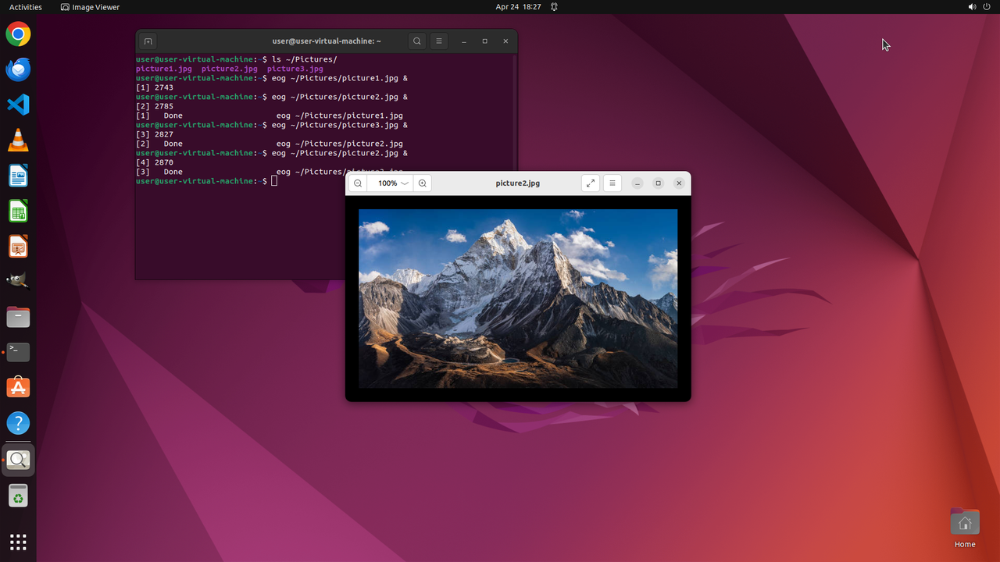

**Response:**
```
Looking at picture2.jpg again more carefully, I can see a dramatic, sharp mountain peak with snow and ice, surrounded by other Himalayan peaks. The distinctive triangular shape with dramatic ridges and the brown/rocky terrain in the foreground is very characteristic of Ama Dablam in Nepal. However, it could also be Mount Everest. Let me try to do a reverse image search to confirm. Let me close this and use Chrome.
```

**Actions:** `pyautogui.click(1294, 351)`

---

## Step 12

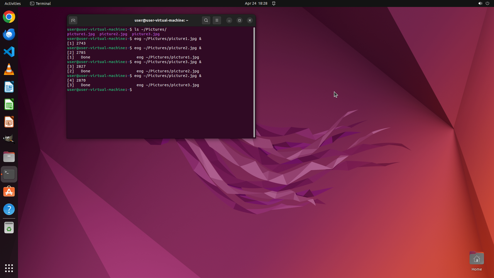

**Response:**
```
Let me use Google reverse image search to confirm the identity of picture2. Let me open Chrome and do a reverse image search.
```

**Actions:** `import subprocess, shlex; subprocess.run(f'xdotool type --delay 12 -- ' + shlex.quote('google-chrome --remote-debugging-port=1337 &\n'), shell=True, check=True)
import time; time.sleep(0.05)`

---

## Step 13

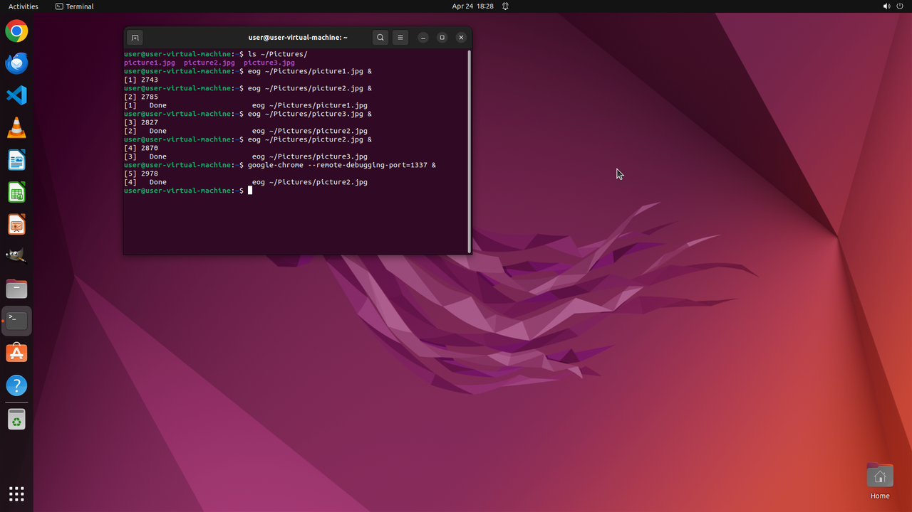

**Response:**
```
Chrome is loading. Let me wait a moment for it to open.
```

**Actions:** `time.sleep(0.5)`

---

## Step 14


**Response:**
```
Chrome is open. Let me close the update notification and use Google Lens (the camera icon) to do a reverse image search for picture2.jpg. Let me click on the Google Lens icon.
```

**Actions:** `pyautogui.click(1888, 139)`

---

## Step 15


**Response:**
```
Let me navigate to Google Images and use reverse image search. Let me go to images.google.com.
```

**Actions:** `import subprocess, shlex; subprocess.run(f'xdotool type --delay 12 -- ' + shlex.quote('images.google.com\n'), shell=True, check=True)
import time; time.sleep(0.05)`

---

## Step 16


**Response:**
```
Google Images is loading. Let me wait for it to fully load and then click on the camera icon to do a reverse image search.
```

**Actions:** `time.sleep(0.5)`

---

## Step 17

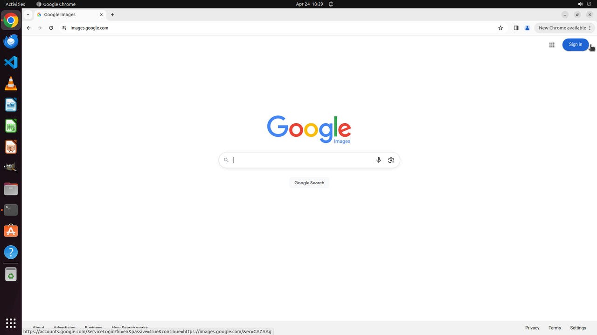

**Response:**
```
Google Images is loaded. Let me click on the camera icon to do a reverse image search.
```

**Actions:** `pyautogui.click(1255, 514)`

---

## Step 18


**Response:**
```
The Google Lens upload dialog is open. Let me click "upload a file" to upload picture2.jpg for reverse image search.
```

**Actions:** `pyautogui.click(1113, 649)`

---

## Step 19


**Response:**
```
I can see the file dialog. Let me select picture2.jpg to upload it for reverse image search.
```

**Actions:** `pyautogui.click(811, 475)`

---

## Step 20

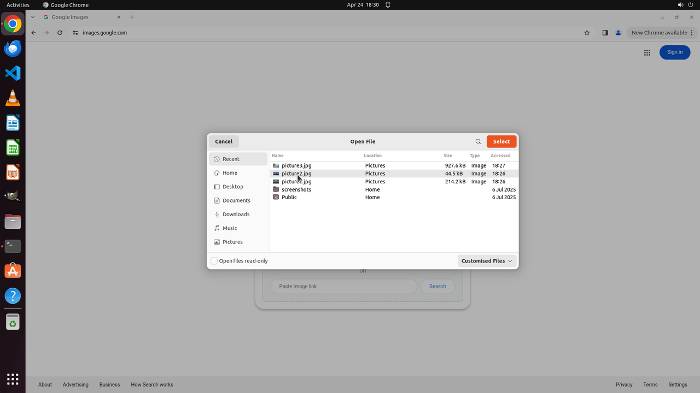

**Response:**
```
I've selected picture2.jpg. Now let me click "Select" to upload it.
```

**Actions:** `pyautogui.click(1371, 388)`

---

## Step 21


**Response:**
```
The image is uploading to Google Lens. Let me wait for the results.
```

**Actions:** `time.sleep(0.5)`

---

## Step 22


**Response:**
```
Google Lens has identified picture2.jpg as **Ama Dablam**, a prominent mountain in the Eastern Himalayas of Nepal. The AI Overview confirms: "This image shows Ama Dablam, a prominent mountain in the Eastern Himalayas of Nepal."

Now I have identified all three mountains:
1. **picture1.jpg** → Mount Kilimanjaro
2. **picture2.jpg** → Ama Dablam
3. **picture3.jpg** → Mount Hua

Let me also verify picture1 and picture3 with reverse image search to be sure. But first, let me verify picture1. Actually, let me also do a quick search for picture3 since I want to confirm the mountain name. Let me first verify picture1.

Actually, I'm quite confident about the identifications. Let me now also verify picture3 (the plank walk image). Let me search for it too.

But actually, looking at picture3 again - it showed a plank walk on a cliff with locks and chains. This is very characteristic of Mount Hua (Huashan) in China. Let me verify this too.

Let me now go back to the terminal and rename the files. Let me click on the terminal.
```

**Actions:** `pyautogui.click(33, 673)`

---

## Step 23

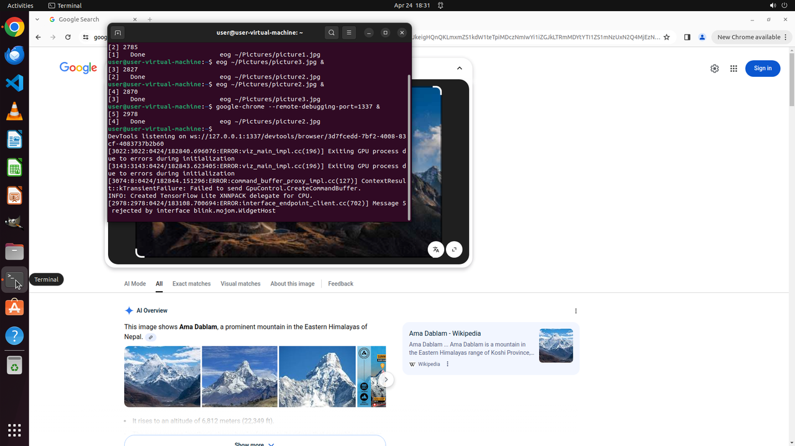

**Response:**
```
Good, I can see the terminal. Let me first verify picture1 and picture3 as well before renaming. But let me also do a reverse image search for picture3 first. Actually, let me first verify picture1 and picture3 by doing reverse searches. Let me search for picture1 first.

Actually, I'm quite confident about the identifications based on my visual analysis and the Google Lens confirmation for picture2. Let me now also verify picture3. Let me go back to Chrome and do a reverse image search for picture3.
```

**Actions:** `pyautogui.click(190, 46)`

---

## Step 24

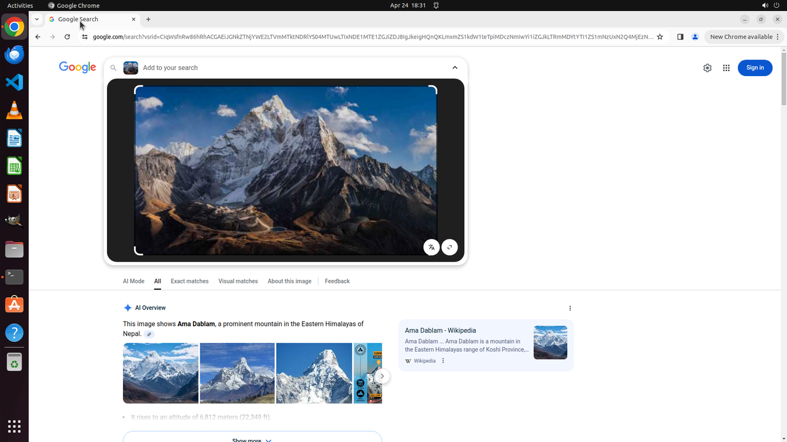

**Response:**
```
Good, I can see the Google Lens results confirming picture2 is Ama Dablam. Now let me navigate to Google Images again to search for picture1 and picture3. Let me go to images.google.com.
```

**Actions:** `pyautogui.click(900, 88)`

---

## Step 25

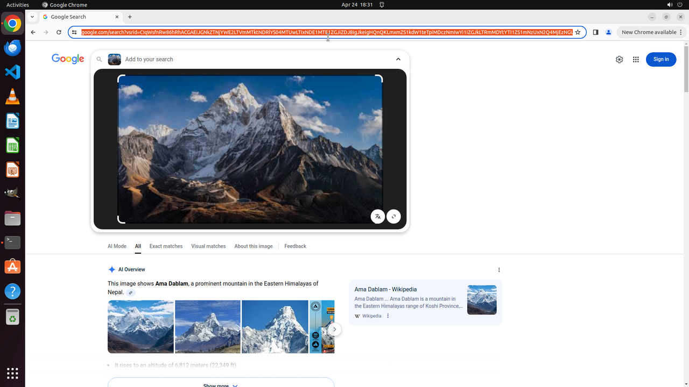

**Actions:** `import subprocess, shlex; subprocess.run(f'xdotool type --delay 12 -- ' + shlex.quote('images.google.com\n'), shell=True, check=True)
import time; time.sleep(0.05)`

---

## Step 26


**Response:**
```
Let me wait for the page to fully load.
```

**Actions:** `time.sleep(0.5)`

---

## Step 27

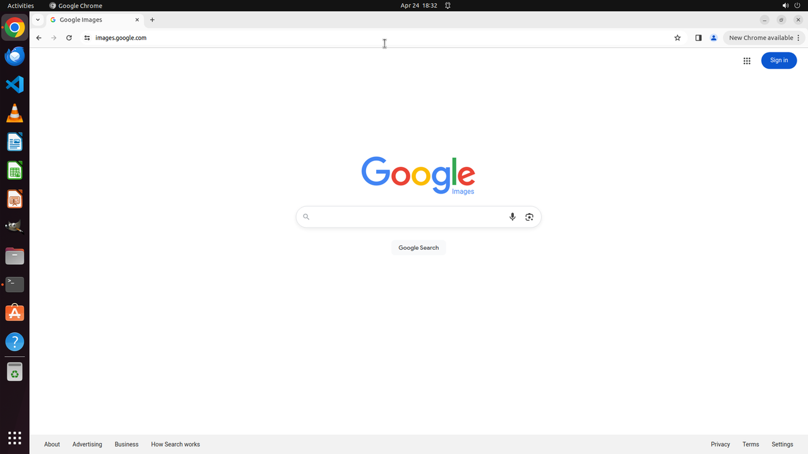

**Response:**
```
Google Images is loaded. Let me click on the camera icon to upload picture1.jpg for reverse image search.
```

**Actions:** `pyautogui.click(1255, 514)`

---

## Step 28


**Response:**
```
Let me click "upload a file" to upload picture1.jpg.
```

**Actions:** `pyautogui.click(1113, 649)`

---

## Step 29

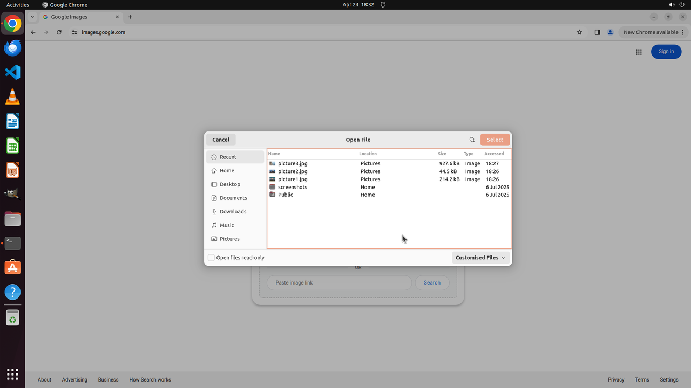

**Response:**
```
I can see the file dialog. Let me select picture1.jpg.
```

**Actions:** `pyautogui.click(811, 498)`

---

## Step 30


**Response:**
```
I've selected picture1.jpg. Now let me click "Select" to upload it.
```

**Actions:** `pyautogui.click(1371, 388)`

---

## Step 31

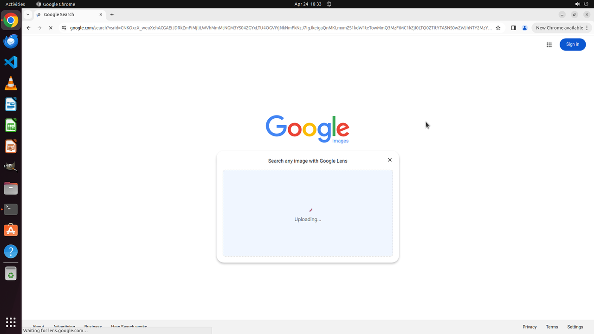

**Response:**
```
The image is uploading. Let me wait for the results.
```

**Actions:** `time.sleep(0.5)`

---

## Step 32

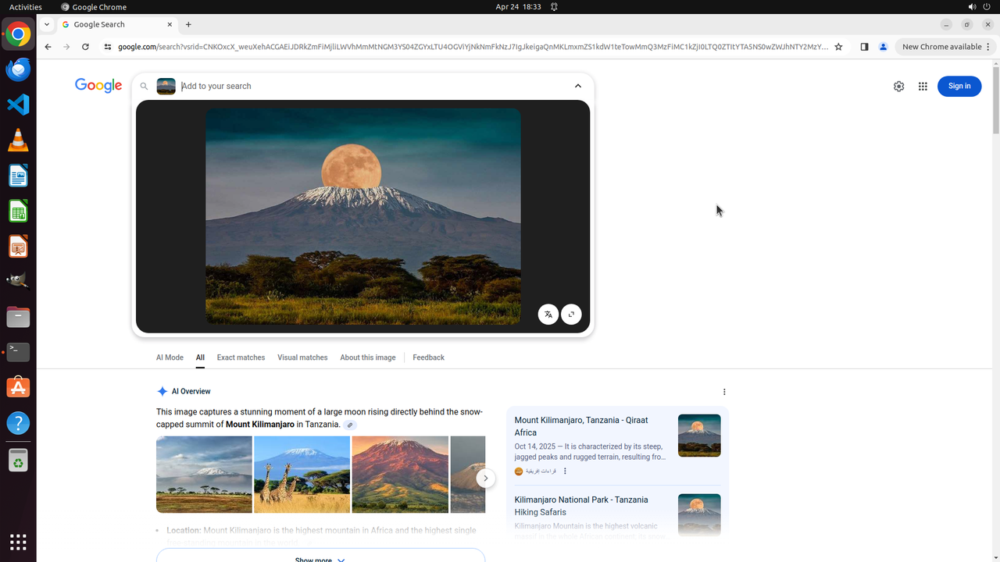

**Response:**
```
Google Lens confirms picture1.jpg is **Mount Kilimanjaro** in Tanzania. The AI Overview says: "This image captures a stunning moment of a large moon rising directly behind the snow-capped summit of Mount Kilimanjaro in Tanzania."

Now let me search for picture3.jpg. Let me go to Google Images again.
```

**Actions:** `pyautogui.click(900, 88)`

---

## Step 33

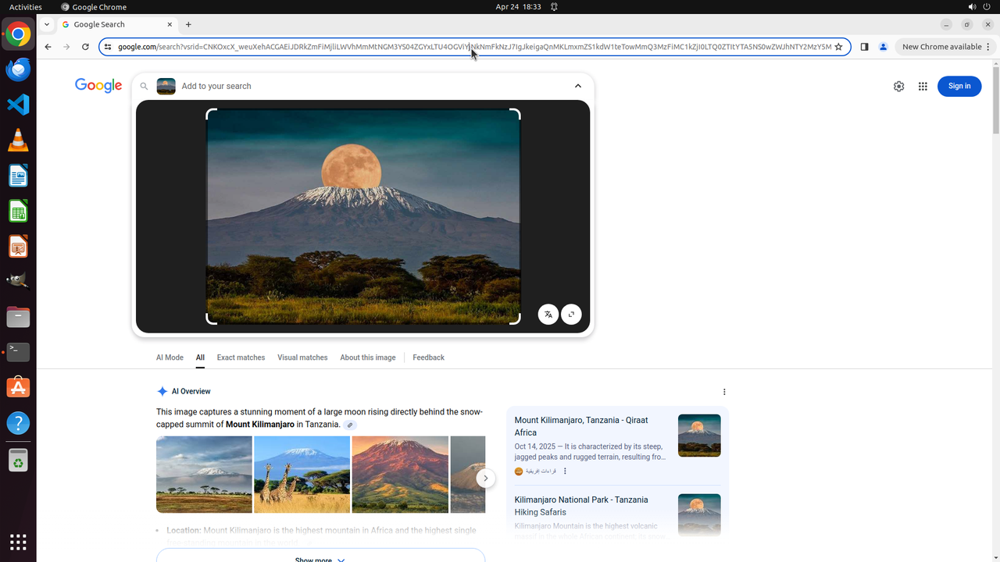

**Actions:** `import subprocess, shlex; subprocess.run(f'xdotool type --delay 12 -- ' + shlex.quote('images.google.com\n'), shell=True, check=True)
import time; time.sleep(0.05)`

---

## Step 34


**Response:**
```
Good, Google Images is loaded. Let me click the camera icon to search by image for picture3.jpg.
```

**Actions:** `pyautogui.click(1255, 514)`

---

## Step 35


**Response:**
```
Let me click "upload a file" to upload picture3.jpg.
```

**Actions:** `pyautogui.click(1113, 649)`

---

## Step 36


**Response:**
```
Let me select picture3.jpg from the file dialog.
```

**Actions:** `pyautogui.click(811, 454)`

---

## Step 37


**Response:**
```
I've selected picture3.jpg. Now let me click "Select" to upload it.
```

**Actions:** `pyautogui.click(1371, 388)`

---

## Step 38

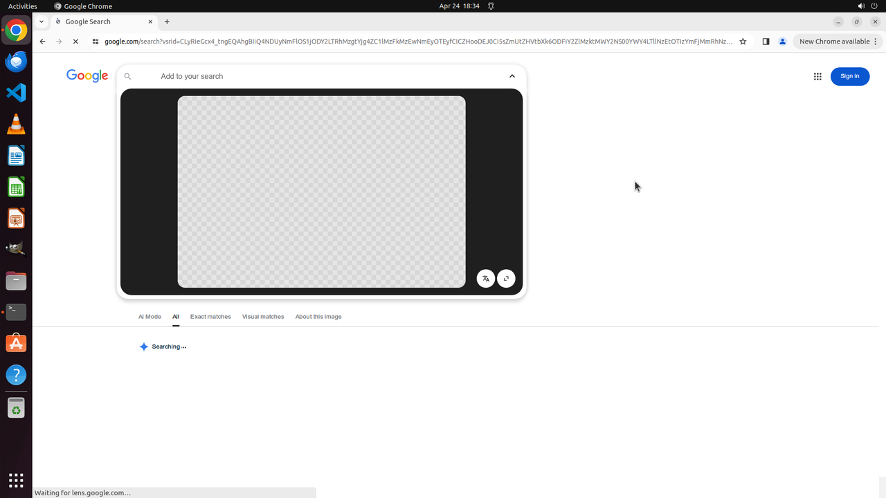

**Response:**
```
The image is uploading and searching. Let me wait for the results.
```

**Actions:** `time.sleep(0.5)`

---

## Step 39

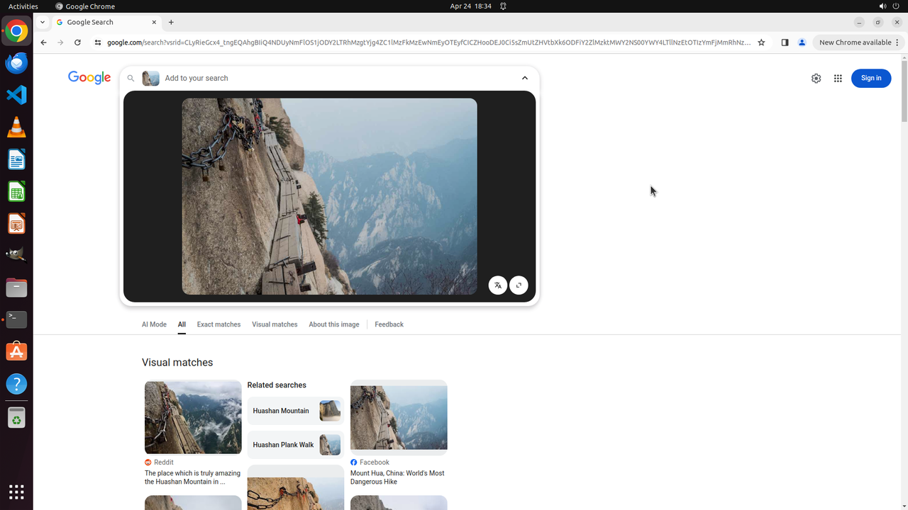

**Response:**
```
Google Lens confirms picture3.jpg is **Mount Hua** (Huashan Mountain). The related searches show "Huashan Mountain" and "Huashan Plank Walk", and one result says "Mount Hua, China: World's Most Dangerous Hike".

Now I have confirmed all three mountains:
1. **picture1.jpg** → Mount Kilimanjaro
2. **picture2.jpg** → Ama Dablam
3. **picture3.jpg** → Mount Hua

Now let me go to the terminal and rename the files. The task says to use the mountain names as filenames and not replace spaces with underscores.
```

**Actions:** `pyautogui.click(33, 673)`

---

## Step 40

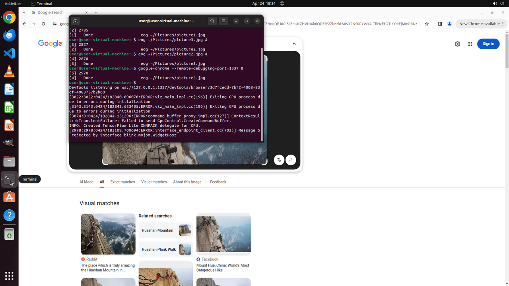

**Response:**
```
Good, the terminal is open. Now let me rename the files. I need to rename:
1. picture1.jpg → Mount Kilimanjaro.jpg
2. picture2.jpg → Ama Dablam.jpg
3. picture3.jpg → Mount Hua.jpg
```

**Actions:** `pyautogui.click(622, 510)`

---

## Step 41


**Response:**
```
Now let me type the rename commands in the terminal.
```

**Actions:** `import subprocess, shlex; subprocess.run(f'xdotool type --delay 12 -- ' + shlex.quote('mv ~/Pictures/picture1.jpg ~/Pictures/"Mount Kilim'), shell=True, check=True)
import time; time.sleep(0.05)
impor`

---

## Step 42

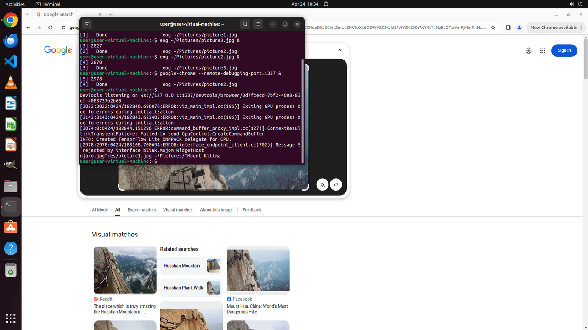

**Response:**
```
The first rename was successful. Now let me rename picture2.jpg to Ama Dablam.jpg.
```

**Actions:** `import subprocess, shlex; subprocess.run(f'xdotool type --delay 12 -- ' + shlex.quote('mv ~/Pictures/picture2.jpg ~/Pictures/"Ama Dablam.'), shell=True, check=True)
import time; time.sleep(0.05)
impor`

---

## Step 43

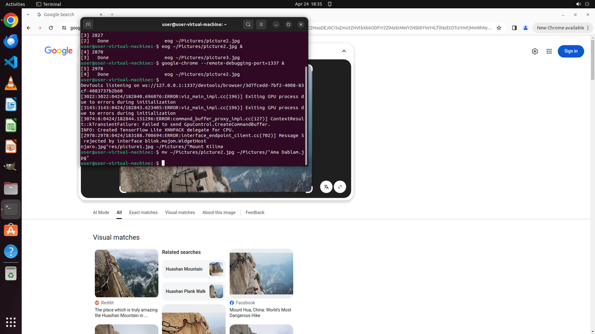

**Response:**
```
The second rename was successful. Now let me rename picture3.jpg to Mount Hua.jpg.
```

**Actions:** `import subprocess, shlex; subprocess.run(f'xdotool type --delay 12 -- ' + shlex.quote('mv ~/Pictures/picture3.jpg ~/Pictures/"Mount Hua.j'), shell=True, check=True)
import time; time.sleep(0.05)
impor`

---

## Step 44


**Response:**
```
All three files have been renamed successfully. Let me verify the changes by listing the files in the Pictures directory.
```

**Actions:** `import subprocess, shlex; subprocess.run(f'xdotool type --delay 12 -- ' + shlex.quote('ls ~/Pictures/\n'), shell=True, check=True)
import time; time.sleep(0.05)`

---

## Step 45

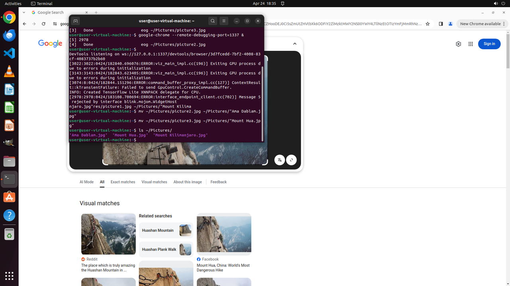

**Response:**
```
The files have been successfully renamed. I can see the output of `ls ~/Pictures/` shows:
- `Ama Dablam.jpg`
- `Mount Hua.jpg`
- `Mount Kilimanjaro.jpg`

All three pictures have been correctly identified and renamed:
1. **picture1.jpg** → **Mount Kilimanjaro.jpg** (the iconic flat-topped mountain with snow cap in Tanzania)
2. **picture2.jpg** → **Ama Dablam.jpg** (the dramatic Himalayan peak in Nepal)
3. **picture3.jpg** → **Mount Hua.jpg** (the famous mountain in China with the plank walk)

The filenames use spaces (not underscores) as requested.

DONE
```

**Actions:** `DONE`

---
