# Task d1acdb87-bb67-4f30-84aa-990e56a09c92

**Instruction:** Hello! I'm eagerly planning a culinary adventure to Hong Kong and have curated a list of must-visit restaurants that I've been longing to explore. However, I could use some assistance in compiling a few essential details about these establishments. Would you be so kind as to help me out? It would be fantastic if you could search for these restaurants on Google Maps. I'm particularly interested in obtaining their addresses, any available websites, and contact phone numbers. If you could gather this information and input it into my form file, I would be immensely grateful. Many thanks in advance!

**Score:** 0.0

**Wall clock:** 15m 53s

**Steps:** 77

**Cost:** $2.84

---

## Step 1

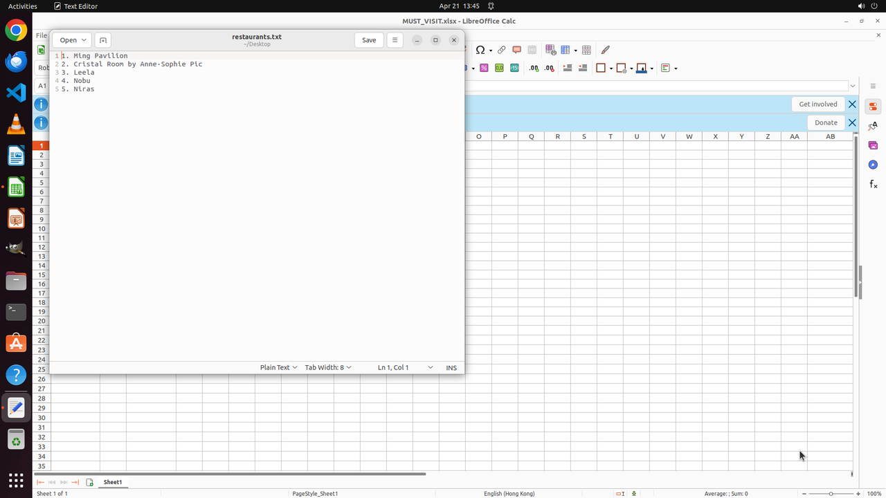

**Response:**
```
I can see the task. There's a text file with 5 restaurants to look up, and a spreadsheet (MUST_VISIT.xlsx) where I need to enter the details. Let me first look at the spreadsheet to understand its structure, then search for each restaurant on Google Maps.

Let me first click on the spreadsheet to see its structure.
```

**Actions:** `pyautogui.click(990, 45)`

---

## Step 2

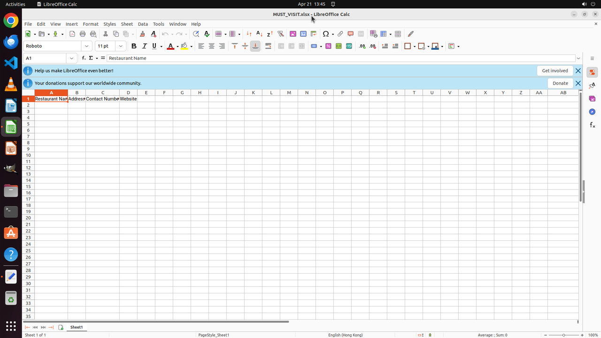

**Response:**
```
I can see the spreadsheet has columns: A (Restaurant Name), B (Address), C (Contact Number), D (Website). The restaurants from the text file are:
1. Ming Pavillion
2. Cristal Room by Anne-Sophie Pic
3. Leela
4. Nobu
5. Niras

Let me first enter the restaurant names, then search for each on Google Maps. Let me start by entering the names.
```

**Actions:** `pyautogui.click(165, 336)`

---

## Step 3


**Response:**
```
Good, I'm in cell A2. Let me enter all the restaurant names first.
```

**Actions:** `import subprocess, shlex; subprocess.run(f'xdotool type --delay 12 -- ' + shlex.quote('Ming Pavillion\nCristal Room by Anne-Sophie Pic\nLee'), shell=True, check=True)
import time; time.sleep(0.05)
imp`

---

## Step 4

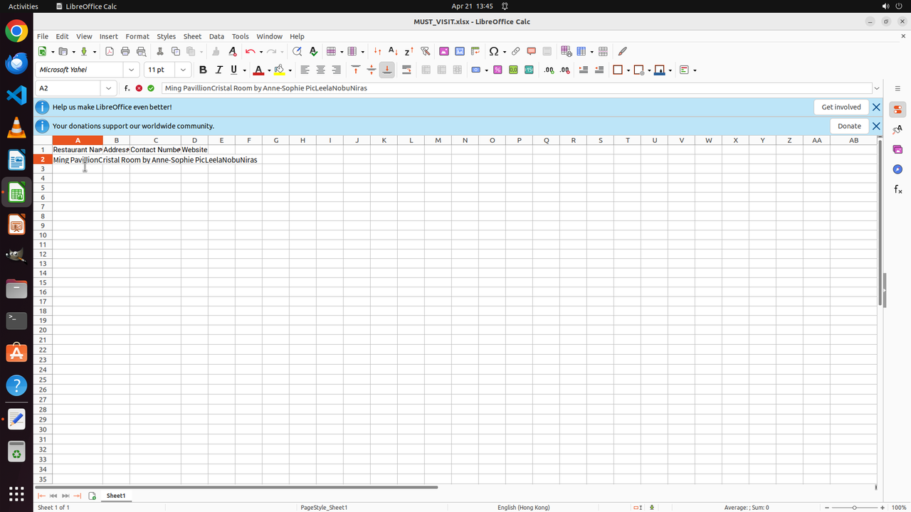

**Response:**
```
It looks like all the text went into a single cell A2 instead of separate rows. The Enter key didn't create new rows as expected. Let me undo this and try again properly.
```

**Actions:** `pyautogui.keyDown('esc')
pyautogui.keyUp('esc')`

---

## Step 5

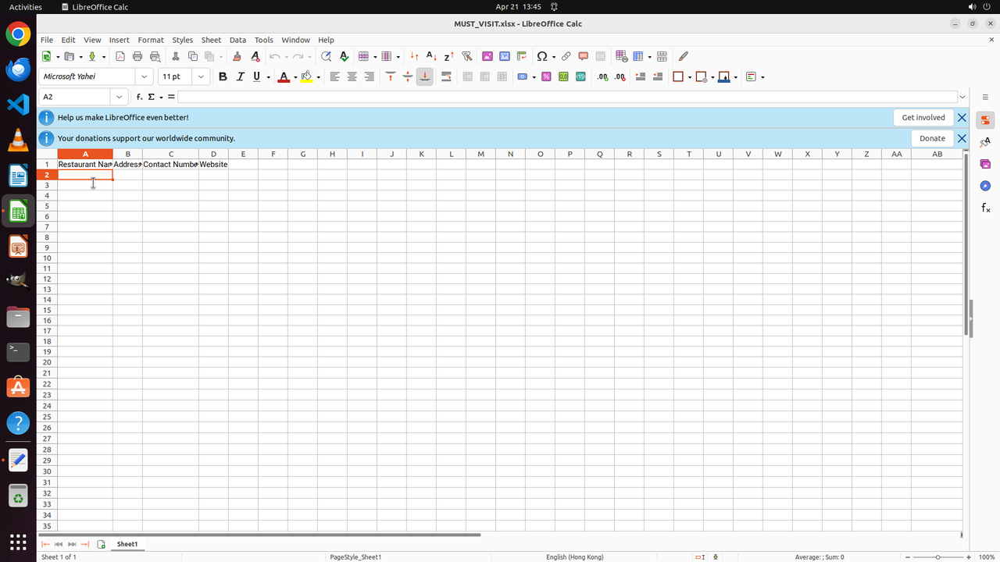

**Response:**
```
Good, the cell is empty now. Let me type each restaurant name individually, pressing Enter after each one.
```

**Actions:** `import subprocess, shlex; subprocess.run(f'xdotool type --delay 12 -- ' + shlex.quote('Ming Pavillion'), shell=True, check=True)
import time; time.sleep(0.05)`

---

## Step 6


**Response:**
```
Good, "Ming Pavillion" is in A2. Let me press Enter and continue with the next restaurants.
```

**Actions:** `pyautogui.keyDown('return')
pyautogui.keyUp('return')`

---

## Step 7

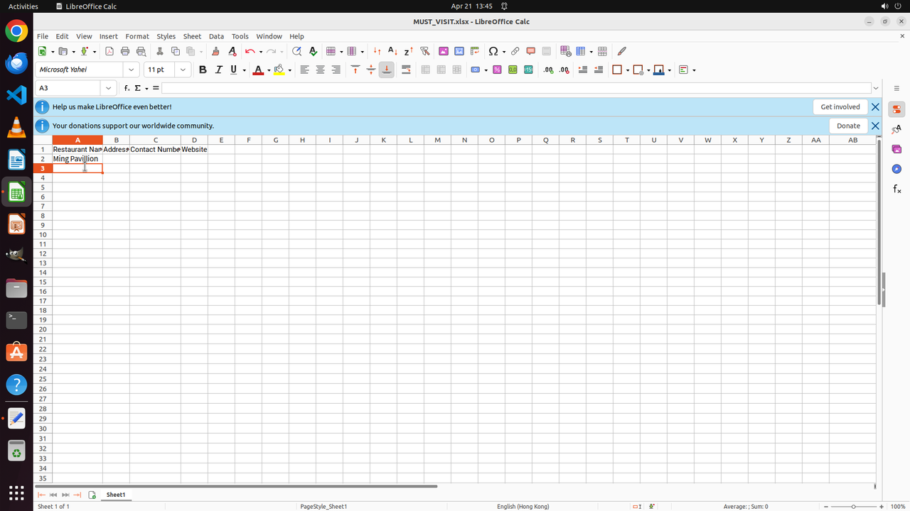

**Response:**
```
Good, now I'm in A3. Let me type the remaining restaurant names one by one.
```

**Actions:** `import subprocess, shlex; subprocess.run(f'xdotool type --delay 12 -- ' + shlex.quote('Cristal Room by Anne-Sophie Pic'), shell=True, check=True)
import time; time.sleep(0.05)`

---

## Step 8


**Response:**
```
Good, now let me press Enter and add the remaining restaurants.
```

**Actions:** `pyautogui.keyDown('return')
pyautogui.keyUp('return')`

---

## Step 9


**Response:**
```
Now I'm in A4. Let me type "Leela".
```

**Actions:** `import subprocess, shlex; subprocess.run(f'xdotool type --delay 12 -- ' + shlex.quote('Leela'), shell=True, check=True)
import time; time.sleep(0.05)`

---

## Step 10


**Response:**
```
Good, "Leela" is in A4. Let me press Enter and continue.
```

**Actions:** `pyautogui.keyDown('return')
pyautogui.keyUp('return')`

---

## Step 11

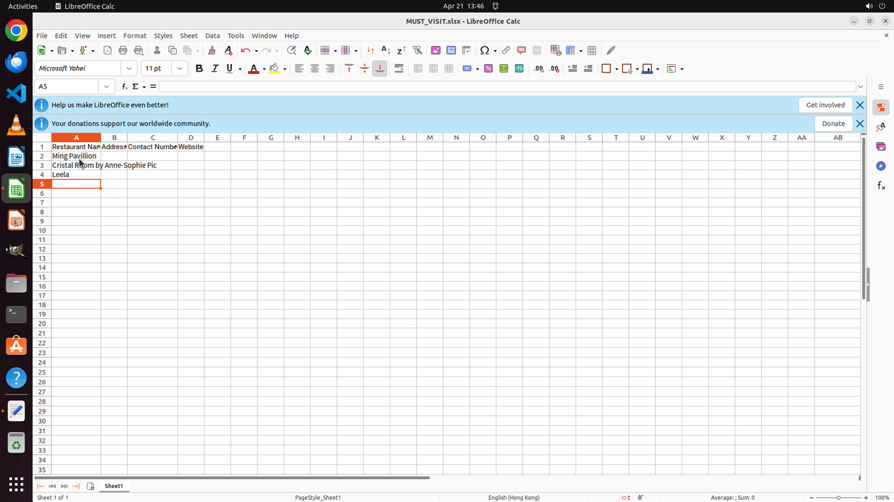

**Response:**
```
Now I'm in A5. Let me type "Nobu".
```

**Actions:** `import subprocess, shlex; subprocess.run(f'xdotool type --delay 12 -- ' + shlex.quote('Nobu'), shell=True, check=True)
import time; time.sleep(0.05)`

---

## Step 12

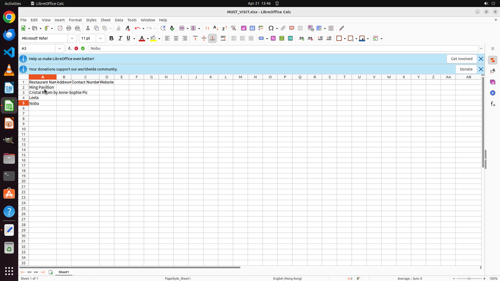

**Response:**
```
Good, "Nobu" is in A5. Let me press Enter and add the last restaurant.
```

**Actions:** `pyautogui.keyDown('return')
pyautogui.keyUp('return')`

---

## Step 13


**Response:**
```
Now I'm in A6. Let me type "Niras".
```

**Actions:** `import subprocess, shlex; subprocess.run(f'xdotool type --delay 12 -- ' + shlex.quote('Niras'), shell=True, check=True)
import time; time.sleep(0.05)`

---

## Step 14

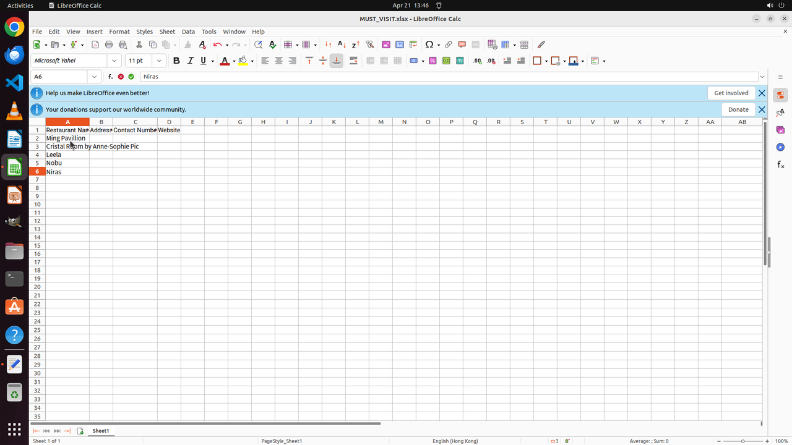

**Response:**
```
All restaurant names are entered. Now I need to press Enter to confirm, then open Google Chrome to search for each restaurant on Google Maps. Let me press Enter first.
```

**Actions:** `pyautogui.keyDown('return')
pyautogui.keyUp('return')`

---

## Step 15


**Response:**
```
All restaurant names are entered. Now I need to open Google Chrome and search for each restaurant on Google Maps to get their addresses, contact numbers, and websites. Let me open Chrome.
```

**Actions:** `pyautogui.click(33, 63)`

---

## Step 16

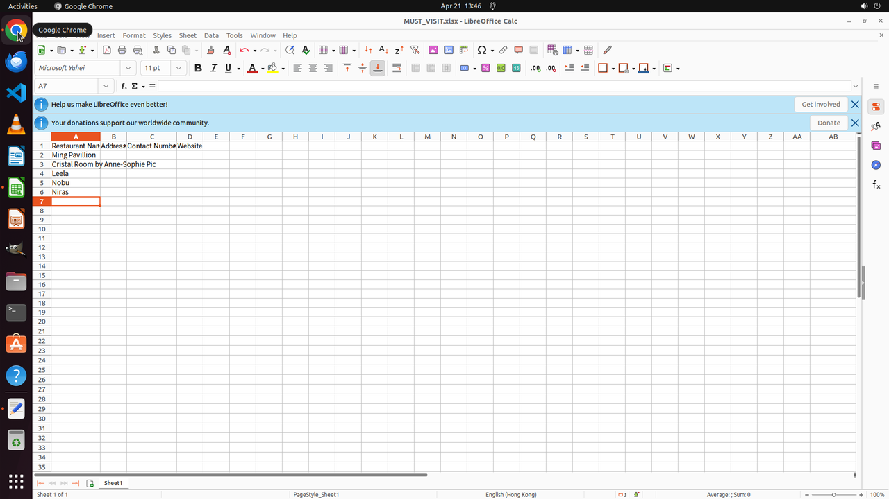

**Response:**
```
I see Chrome is in the taskbar. Let me click on it to open it.
```

**Actions:** `pyautogui.click(33, 63)`

---

## Step 17

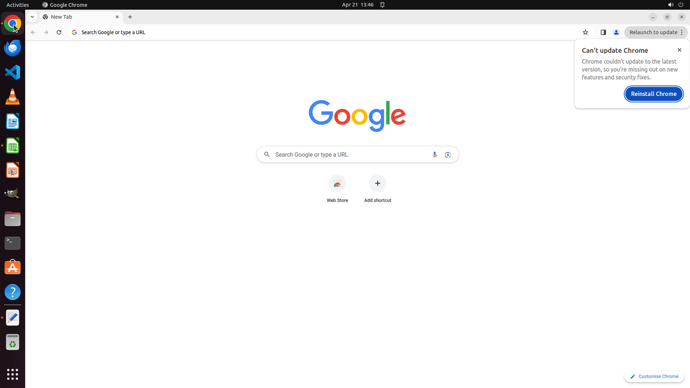

**Response:**
```
Chrome is open. Let me close the update notification and search for the first restaurant on Google Maps. Let me navigate to Google Maps and search for "Ming Pavillion Hong Kong".
```

**Actions:** `pyautogui.click(1888, 139)`

---

## Step 18

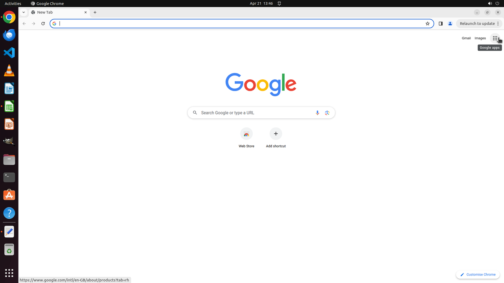

**Response:**
```
Good, the address bar is focused. Let me navigate to Google Maps and search for the first restaurant.
```

**Actions:** `import subprocess, shlex; subprocess.run(f'xdotool type --delay 12 -- ' + shlex.quote('https://www.google.com/maps/search/Ming+Pavillion+'), shell=True, check=True)
import time; time.sleep(0.05)
impor`

---

## Step 19

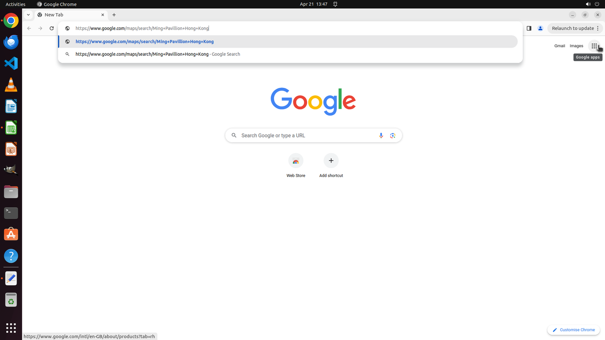

**Response:**
```
I can see the URL suggestion. Let me click on it to navigate to Google Maps.
```

**Actions:** `pyautogui.click(460, 132)`

---

## Step 20

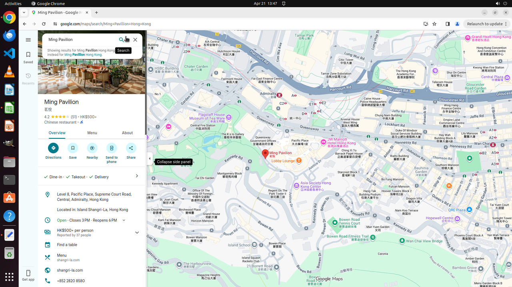

**Response:**
```
I found Ming Pavilion on Google Maps. I can see the following details:
- **Address**: Level 8, Pacific Place, Supreme Court Road, Central, Admiralty, Hong Kong
- **Website**: shangri-la.com
- **Phone**: +852 2820 8580

Let me note these down. Now let me scroll down to see if there's a more complete website URL.
```

**Actions:** `pyautogui.click(262, 1017)`

---

## Step 21

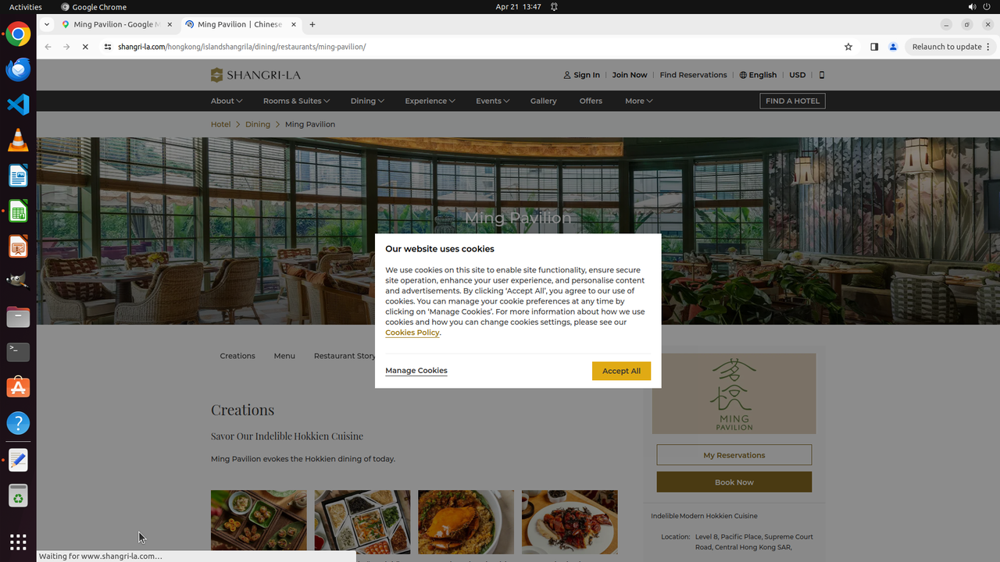

**Response:**
```
I can see the website URL is: shangri-la.com/hongkong/islandshangrila/dining/restaurants/ming-pavilion/

Let me go back to the Google Maps tab to note the full details, and then I can see the full website URL from the address bar. Let me note the information:

- **Address**: Level 8, Pacific Place, Supreme Court Road, Central, Admiralty, Hong Kong
- **Website**: https://www.shangri-la.com/hongkong/islandshangrila/dining/restaurants/ming-pavilion/
- **Phone**: +852 2820 8580

Now let me go back to Google Maps and search for the second restaurant. Let me click on the Google Maps tab.
```

**Actions:** `pyautogui.click(220, 46)`

---

## Step 22

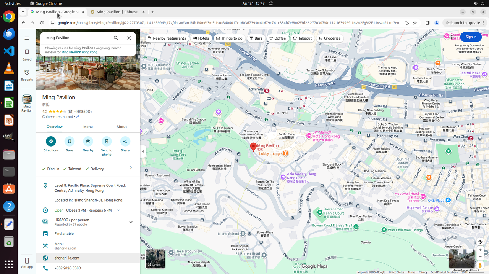

**Response:**
```
I'm back on the Google Maps page with Ming Pavilion details. I have all the information I need:
- **Address**: Level 8, Pacific Place, Supreme Court Road, Central, Admiralty, Hong Kong
- **Website**: shangri-la.com
- **Phone**: +852 2820 8580

Now let me search for the second restaurant. Let me click on the search box and search for "Cristal Room by Anne-Sophie Pic Hong Kong".
```

**Actions:** `pyautogui.tripleClick(306, 148)`

---

## Step 23

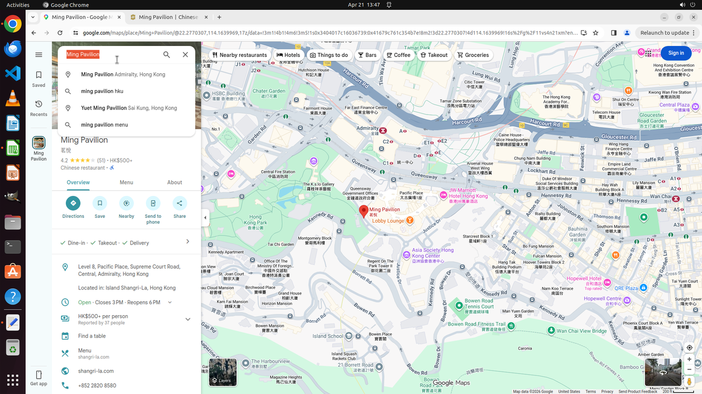

**Response:**
```
Good, the search text is selected. Let me type the second restaurant name.
```

**Actions:** `import subprocess, shlex; subprocess.run(f'xdotool type --delay 12 -- ' + shlex.quote('Cristal Room by Anne-Sophie Pic Hong Kong'), shell=True, check=True)
import time; time.sleep(0.05)`

---

## Step 24

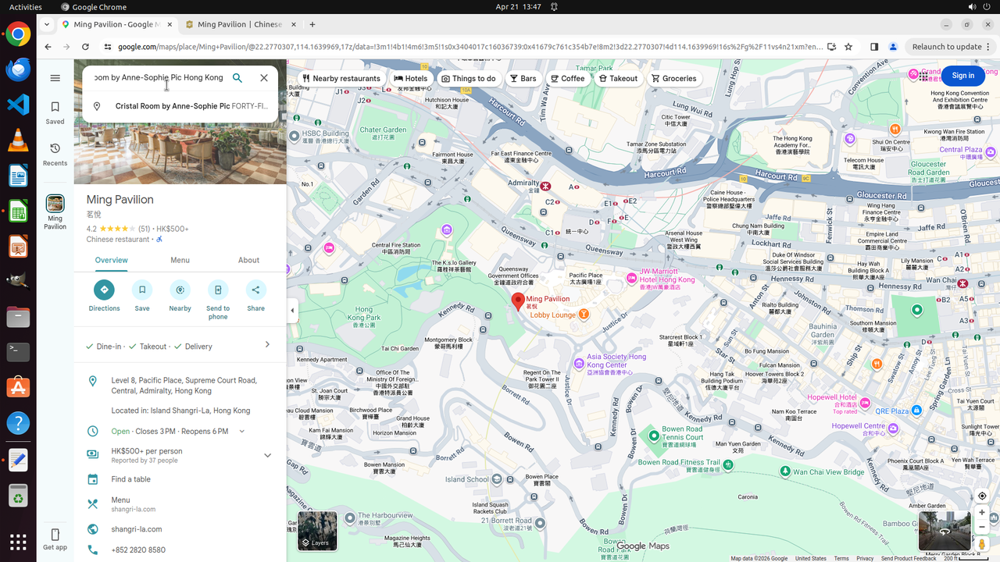

**Response:**
```
I can see a suggestion "Cristal Room by Anne-Sophie Pic FORTY-FI...". Let me click on it.
```

**Actions:** `pyautogui.click(360, 202)`

---

## Step 25

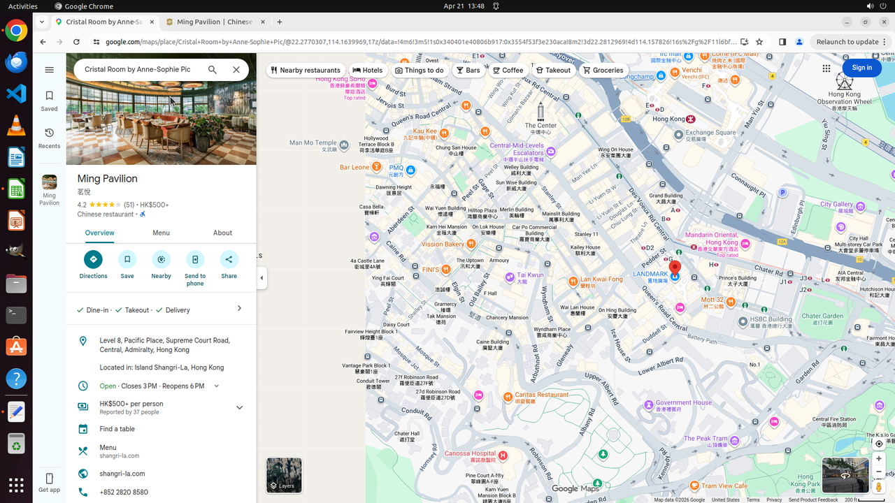

**Response:**
```
It seems like it's still showing Ming Pavilion details. The page might not have loaded the Cristal Room details yet. Let me wait and scroll down to see if the Cristal Room information is loading.
```

**Actions:** `pyautogui.scroll(3, 345, 600)`

---

## Step 26

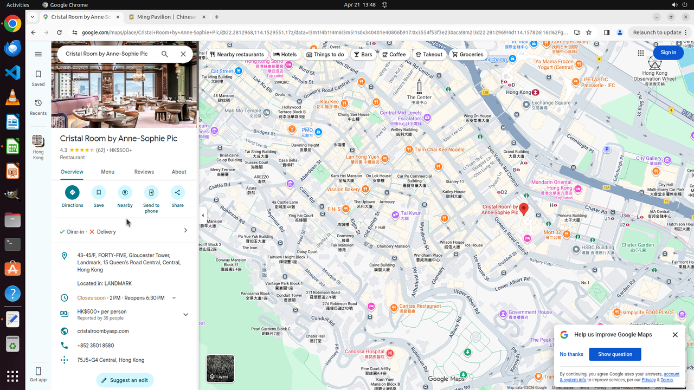

**Response:**
```
Excellent! I found the Cristal Room by Anne-Sophie Pic details:
- **Address**: 43-45/F, FORTY-FIVE, Gloucester Tower, Landmark, 15 Queen's Road Central, Central, Hong Kong
- **Website**: cristalroombyasp.com
- **Phone**: +852 3501 8580

Now let me close the Google Maps survey popup and search for the third restaurant "Leela Hong Kong".
```

**Actions:** `pyautogui.click(1576, 981)`

---

## Step 27

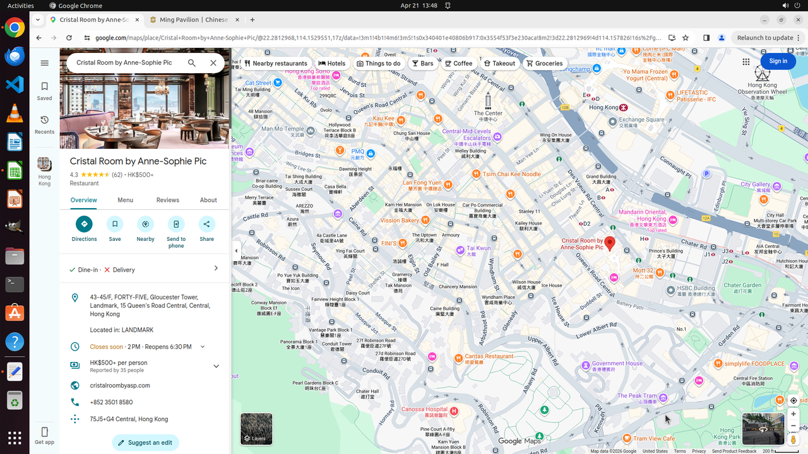

**Response:**
```
Good, the popup is closed. Now let me search for the third restaurant "Leela Hong Kong". Let me click on the search box and type the new search.
```

**Actions:** `pyautogui.tripleClick(306, 148)`

---

## Step 28

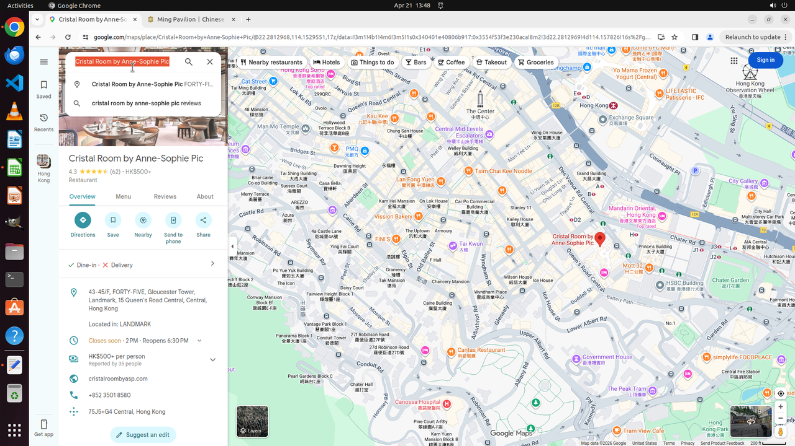

**Response:**
```
Good, the text is selected. Let me type the new search for "Leela Hong Kong".
```

**Actions:** `import subprocess, shlex; subprocess.run(f'xdotool type --delay 12 -- ' + shlex.quote('Leela restaurant Hong Kong'), shell=True, check=True)
import time; time.sleep(0.05)`

---

## Step 29

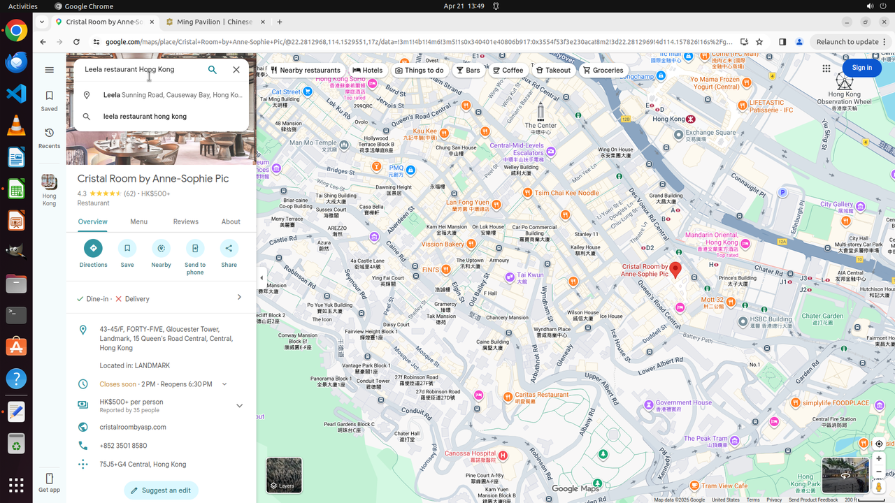

**Response:**
```
I can see a suggestion "Leela Sunning Road, Causeway Bay, Hong Ko...". Let me click on it.
```

**Actions:** `pyautogui.click(367, 202)`

---

## Step 30

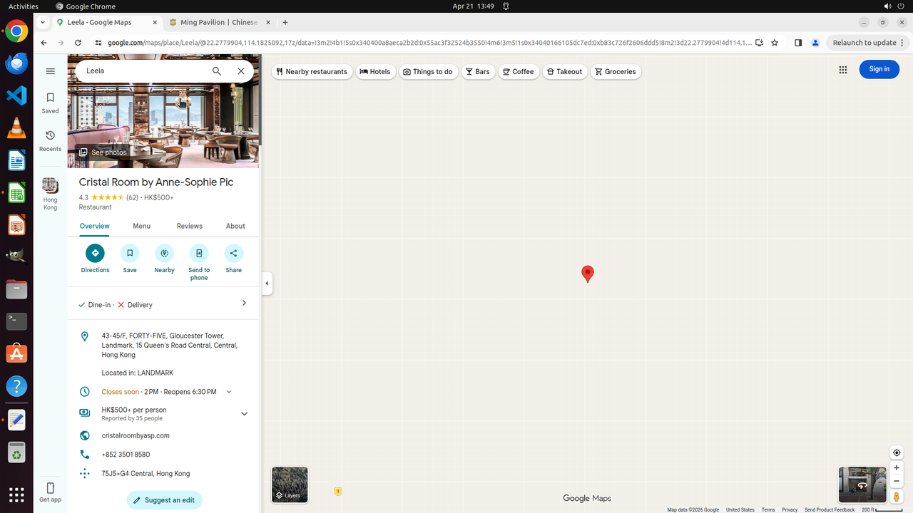

**Response:**
```
It seems like it's still showing the Cristal Room by Anne-Sophie Pic details instead of Leela. The page might be loading. Let me wait a moment and scroll up to see if the Leela details are there.
```

**Actions:** `pyautogui.scroll(3, 345, 600)`

---

## Step 31

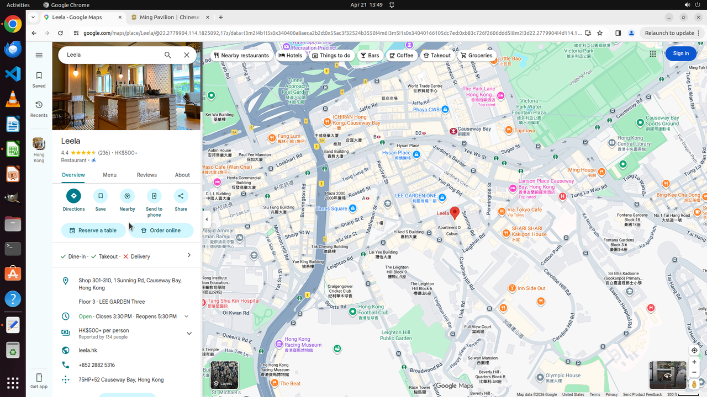

**Response:**
```
Now I can see Leela's details:
- **Address**: Shop 301-310, 1 Sunning Rd, Causeway Bay, Hong Kong
- **Website**: leela.hk
- **Phone**: +852 2882 5316

Now let me search for the fourth restaurant "Nobu Hong Kong". Let me click on the search box.
```

**Actions:** `pyautogui.tripleClick(306, 148)`

---

## Step 32

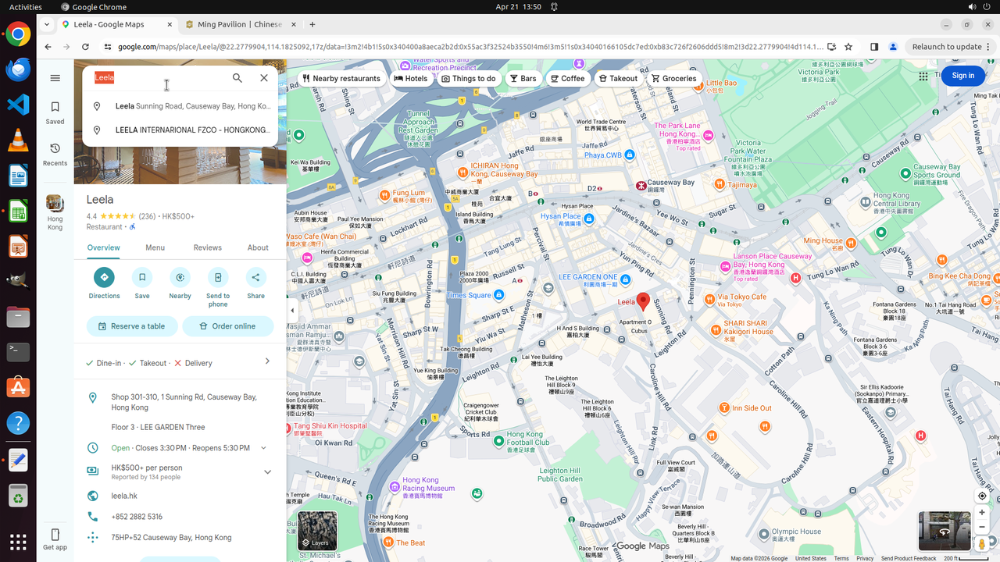

**Response:**
```
Good, the search text is selected. Let me type the new search for "Nobu Hong Kong".
```

**Actions:** `import subprocess, shlex; subprocess.run(f'xdotool type --delay 12 -- ' + shlex.quote('Nobu restaurant Hong Kong'), shell=True, check=True)
import time; time.sleep(0.05)`

---

## Step 33

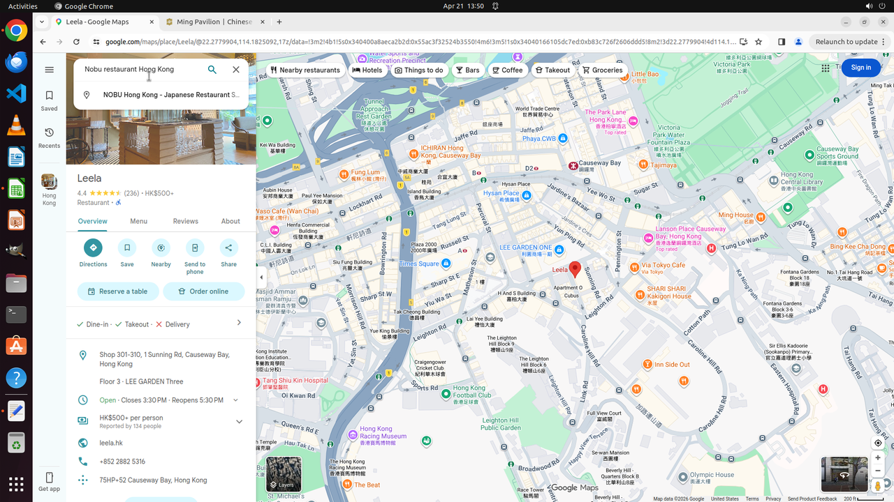

**Response:**
```
I can see a suggestion "NOBU Hong Kong - Japanese Restaurant S...". Let me click on it.
```

**Actions:** `pyautogui.click(367, 202)`

---

## Step 34

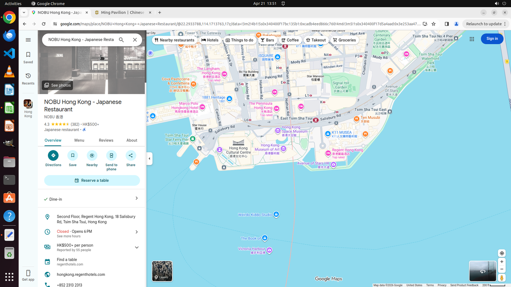

**Response:**
```
Excellent! I found NOBU Hong Kong details:
- **Address**: Second Floor, Regent Hong Kong, 18 Salisbury Rd, Tsim Sha Tsui, Hong Kong
- **Website**: hongkong.regenthotels.com
- **Phone**: +852 2313 2313

Now let me search for the last restaurant "Niras Hong Kong". Let me click on the search box.
```

**Actions:** `pyautogui.tripleClick(306, 148)`

---

## Step 35

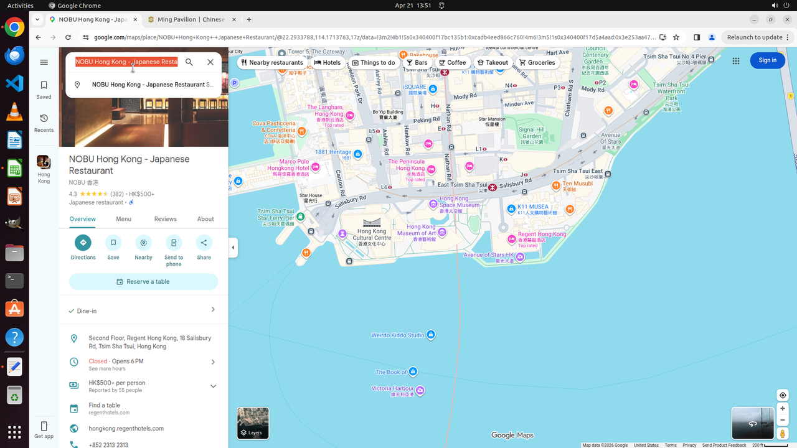

**Response:**
```
Good, the text is selected. Let me type the search for the last restaurant.
```

**Actions:** `import subprocess, shlex; subprocess.run(f'xdotool type --delay 12 -- ' + shlex.quote('Niras restaurant Hong Kong'), shell=True, check=True)
import time; time.sleep(0.05)`

---

## Step 36

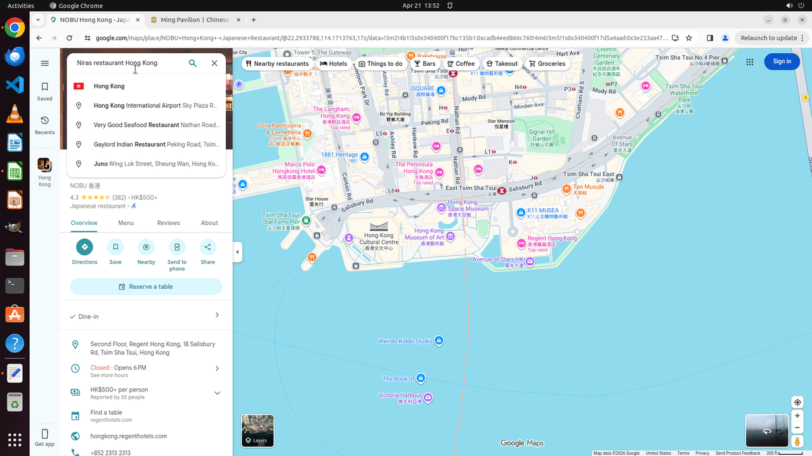

**Response:**
```
I don't see a direct suggestion for "Niras restaurant Hong Kong". Let me press Enter to search.
```

**Actions:** `pyautogui.keyDown('return')
pyautogui.keyUp('return')`

---

## Step 37

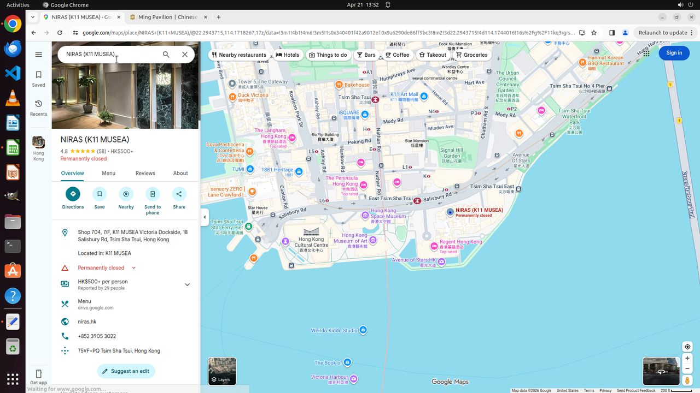

**Response:**
```
I found NIRAS (K11 MUSEA) details:
- **Address**: Shop 704, 7/F, K11 MUSEA Victoria Dockside, 18 Salisbury Rd, Tsim Sha Tsui, Hong Kong
- **Website**: niras.hk
- **Phone**: +852 3905 3022

Now I have all the information for all 5 restaurants. Let me switch to the LibreOffice Calc spreadsheet and enter all the details. Let me click on the LibreOffice Calc icon in the taskbar.
```

**Actions:** `pyautogui.click(33, 202)`

---

## Step 38

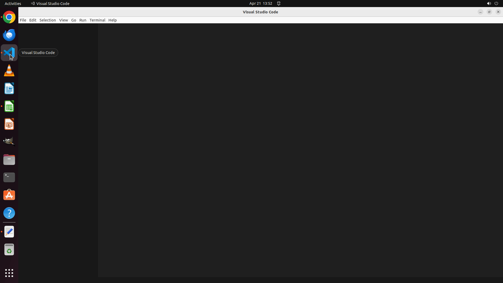

**Response:**
```
I accidentally opened Visual Studio Code instead of LibreOffice Calc. Let me look for the LibreOffice Calc in the taskbar. I need to find the spreadsheet window. Let me check the taskbar at the bottom or try clicking on the Activities button to find it.
```

**Actions:** `pyautogui.click(33, 337)`

---

## Step 39

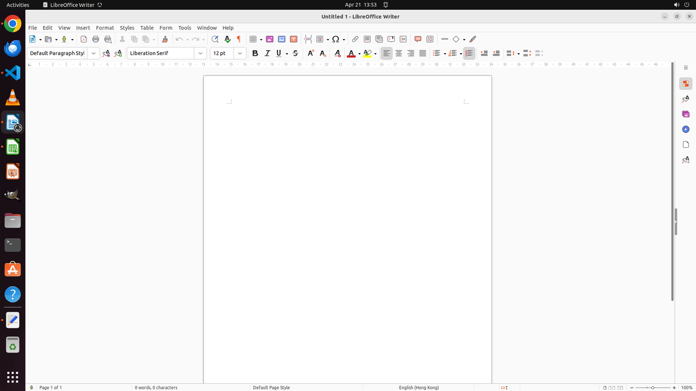

**Response:**
```
This opened LibreOffice Writer instead of Calc. I need to find the MUST_VISIT.xlsx spreadsheet. Let me look for it in the taskbar or use the Window menu. Let me click on the taskbar to find the Calc window.
```

**Actions:** `pyautogui.click(33, 406)`

---

## Step 40

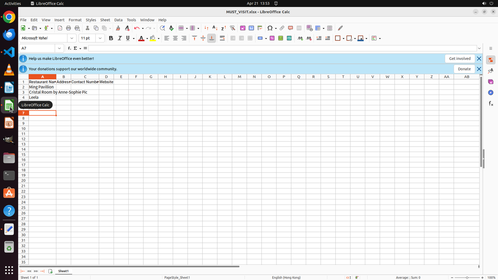

**Response:**
```
I can see the MUST_VISIT.xlsx spreadsheet is open. I can see the restaurant names in column A, but I notice rows 5 and 6 (Nobu and Niras) seem to be missing. Let me scroll down or check. I can see:
- A1: Restaurant Name
- A2: Ming Pavillion
- A3: Cristal Room by Anne-Sophie Pic
- A4: Leela

It looks like rows 5 and 6 might be below. Let me click on A5 to check.
```

**Actions:** `pyautogui.click(163, 396)`

---

## Step 41


**Response:**
```
Now I can see all 5 restaurant names are in column A:
- A2: Ming Pavillion
- A3: Cristal Room by Anne-Sophie Pic
- A4: Leela
- A5: Nobu
- A6: Niras

Now I need to fill in the Address (B), Contact Number (C), and Website (D) columns. Let me start by clicking on cell B2 to enter the address for Ming Pavillion.
```

**Actions:** `pyautogui.click(244, 336)`

---

## Step 42

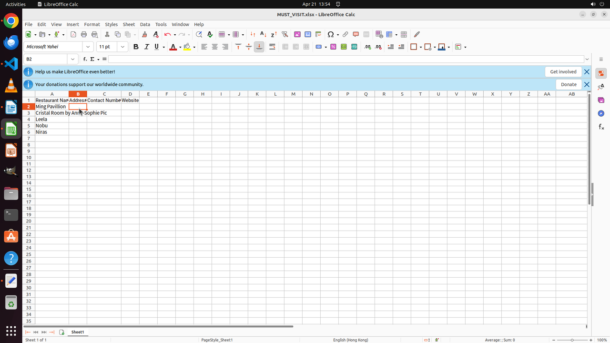

**Response:**
```
I'm in cell B2. Now let me enter the address for Ming Pavillion.
```

**Actions:** `import subprocess, shlex; subprocess.run(f'xdotool type --delay 12 -- ' + shlex.quote('Level 8, Pacific Place, Supreme Court Road, Centra'), shell=True, check=True)
import time; time.sleep(0.05)
impor`

---

## Step 43

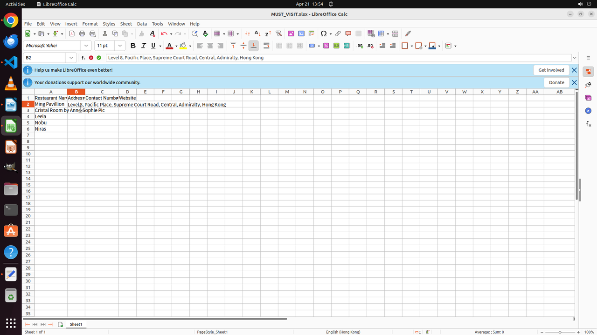

**Response:**
```
The address for Ming Pavillion is entered in B2. Now let me press Tab to move to C2 and enter the contact number.
```

**Actions:** `pyautogui.keyDown('tab')
pyautogui.keyUp('tab')`

---

## Step 44

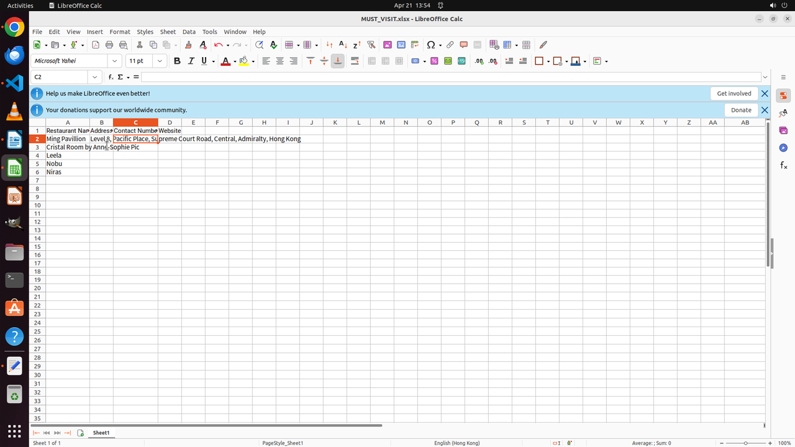

**Response:**
```
I'm now in C2. Let me enter the contact number for Ming Pavillion.
```

**Actions:** `import subprocess, shlex; subprocess.run(f'xdotool type --delay 12 -- ' + shlex.quote('+852 2820 8580'), shell=True, check=True)
import time; time.sleep(0.05)`

---

## Step 45

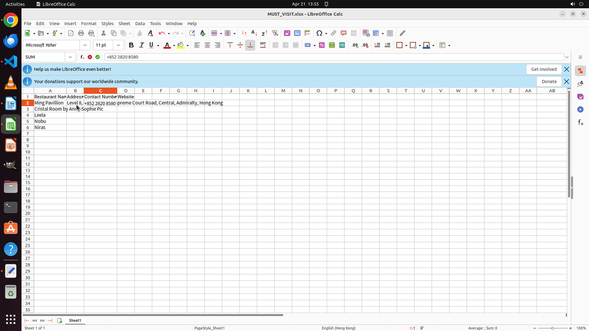

**Response:**
```
I see the phone number was entered but it seems like LibreOffice is interpreting it as a formula (SUM). Let me press Tab to move to D2 and enter the website. The phone number should be stored as text. Let me press Tab first.
```

**Actions:** `pyautogui.keyDown('tab')
pyautogui.keyUp('tab')`

---

## Step 46

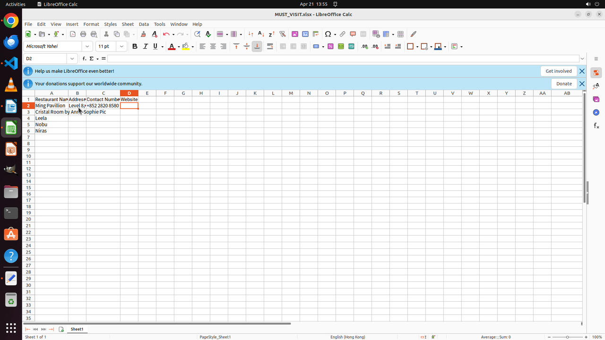

**Response:**
```
I'm now in D2. I can see the phone number was stored as a number (+852 2820 8580). Let me now enter the website for Ming Pavillion.
```

**Actions:** `import subprocess, shlex; subprocess.run(f'xdotool type --delay 12 -- ' + shlex.quote('shangri-la.com'), shell=True, check=True)
import time; time.sleep(0.05)`

---

## Step 47

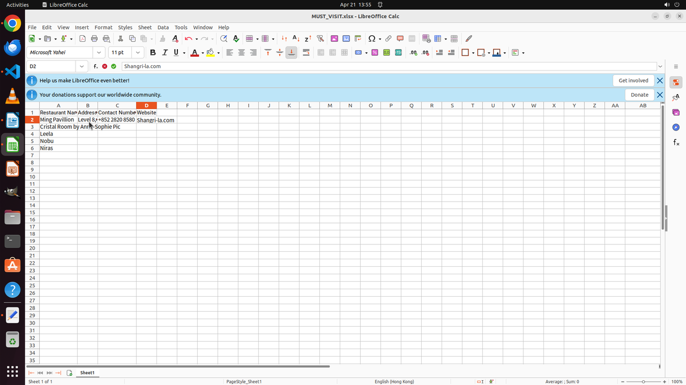

**Response:**
```
I see it capitalized "Shangri-la.com" in the formula bar. Let me check the actual value - it shows "shangri-la.com" was auto-capitalized to "Shangri-la.com". That's fine. Now let me move to B3 to enter the address for Cristal Room by Anne-Sophie Pic. Let me click on B3.
```

**Actions:** `pyautogui.click(244, 355)`

---

## Step 48

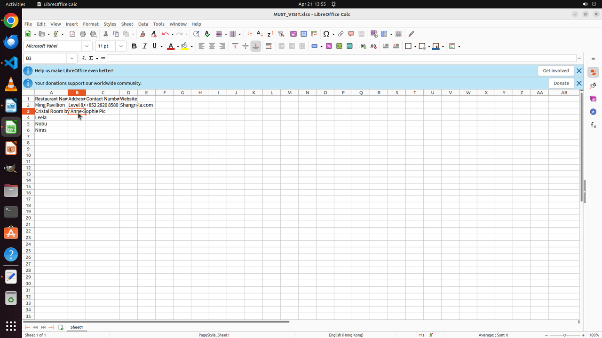

**Response:**
```
I'm in B3. Now let me enter the address for Cristal Room by Anne-Sophie Pic.
```

**Actions:** `import subprocess, shlex; subprocess.run(f'xdotool type --delay 12 -- ' + shlex.quote('43-45/F, FORTY-FIVE, Gloucester Tower, Landmark, 1'), shell=True, check=True)
import time; time.sleep(0.05)
impor`

---

## Step 49


**Response:**
```
The address for Cristal Room is entered. Now let me press Tab to move to C3 for the contact number.
```

**Actions:** `pyautogui.keyDown('tab')
pyautogui.keyUp('tab')`

---

## Step 50

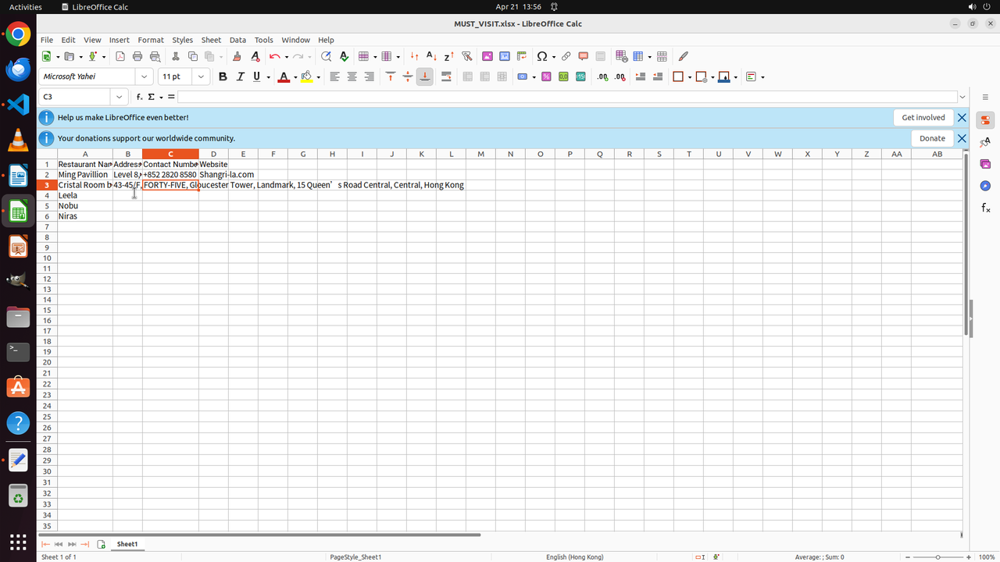

**Response:**
```
I'm in C3. Let me enter the contact number for Cristal Room by Anne-Sophie Pic.
```

**Actions:** `import subprocess, shlex; subprocess.run(f'xdotool type --delay 12 -- ' + shlex.quote('+852 3501 8580'), shell=True, check=True)
import time; time.sleep(0.05)`

---

## Step 51


**Response:**
```
Good, the phone number is entered. Let me press Tab to move to D3 for the website.
```

**Actions:** `pyautogui.keyDown('tab')
pyautogui.keyUp('tab')`

---

## Step 52


**Response:**
```
I'm in D3. Let me enter the website for Cristal Room by Anne-Sophie Pic.
```

**Actions:** `import subprocess, shlex; subprocess.run(f'xdotool type --delay 12 -- ' + shlex.quote('cristalroombyasp.com'), shell=True, check=True)
import time; time.sleep(0.05)`

---

## Step 53


**Response:**
```
The website for Cristal Room is entered. Now let me click on B4 to enter the address for Leela.
```

**Actions:** `pyautogui.click(244, 375)`

---

## Step 54


**Response:**
```
I'm in B4. Let me enter the address for Leela.
```

**Actions:** `import subprocess, shlex; subprocess.run(f'xdotool type --delay 12 -- ' + shlex.quote('Shop 301-310, 1 Sunning Rd, Causeway Bay, Hong Kon'), shell=True, check=True)
import time; time.sleep(0.05)
impor`

---

## Step 55

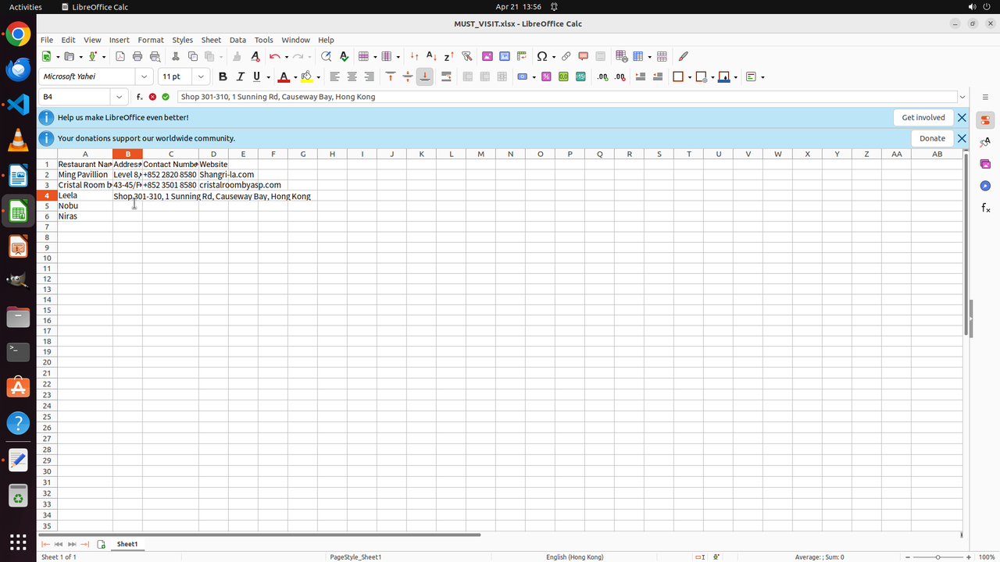

**Response:**
```
The address for Leela is entered. Let me press Tab to move to C4 for the contact number.
```

**Actions:** `pyautogui.keyDown('tab')
pyautogui.keyUp('tab')`

---

## Step 56


**Response:**
```
I'm in C4. Let me enter the contact number for Leela.
```

**Actions:** `import subprocess, shlex; subprocess.run(f'xdotool type --delay 12 -- ' + shlex.quote('+852 2882 5316'), shell=True, check=True)
import time; time.sleep(0.05)`

---

## Step 57

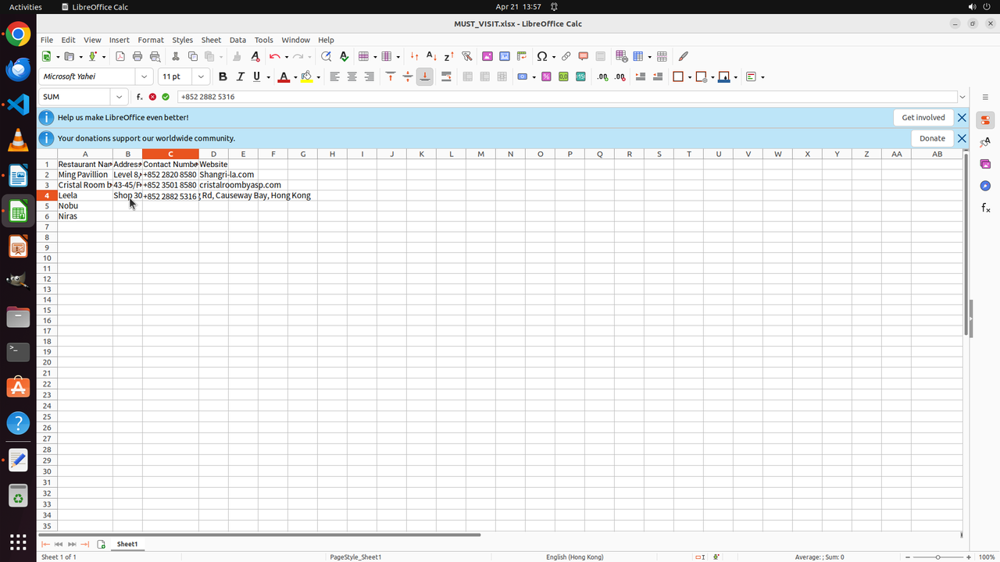

**Response:**
```
Good, the phone number is entered. Let me press Tab to move to D4 for the website.
```

**Actions:** `pyautogui.keyDown('tab')
pyautogui.keyUp('tab')`

---

## Step 58


**Response:**
```
I'm in D4. Let me enter the website for Leela.
```

**Actions:** `import subprocess, shlex; subprocess.run(f'xdotool type --delay 12 -- ' + shlex.quote('leela.hk'), shell=True, check=True)
import time; time.sleep(0.05)`

---

## Step 59


**Response:**
```
The website for Leela is entered. Now let me click on B5 to enter the address for Nobu.
```

**Actions:** `pyautogui.click(244, 396)`

---

## Step 60

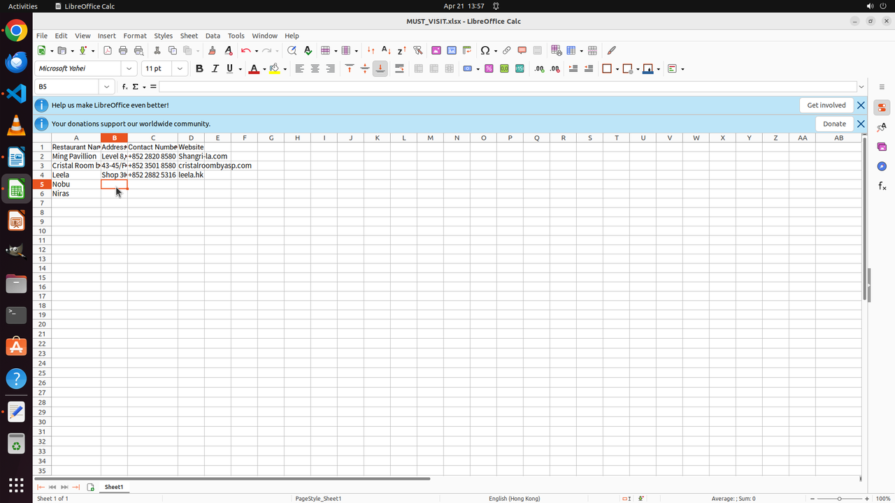

**Response:**
```
I'm in B5. Let me enter the address for Nobu.
```

**Actions:** `import subprocess, shlex; subprocess.run(f'xdotool type --delay 12 -- ' + shlex.quote('Second Floor, Regent Hong Kong, 18 Salisbury Rd, T'), shell=True, check=True)
import time; time.sleep(0.05)
impor`

---

## Step 61

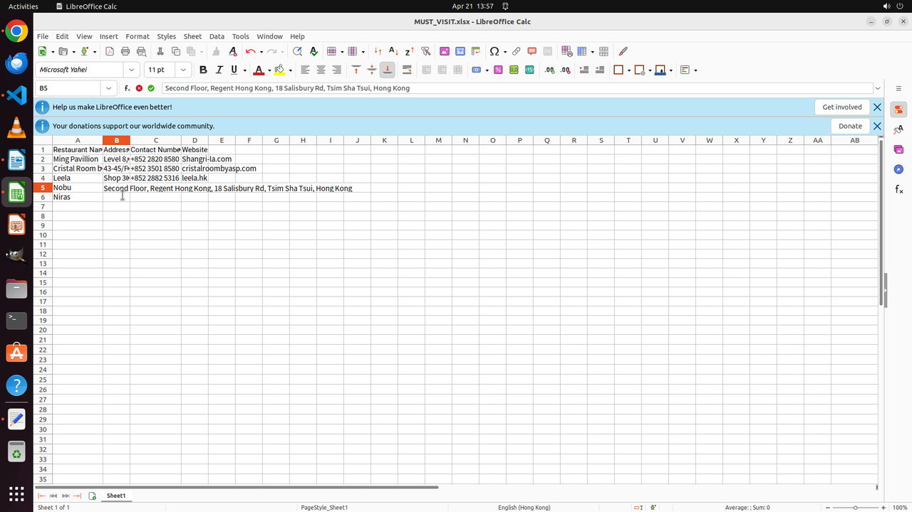

**Response:**
```
The address for Nobu is entered. Let me press Tab to move to C5 for the contact number.
```

**Actions:** `pyautogui.keyDown('tab')
pyautogui.keyUp('tab')`

---

## Step 62


**Response:**
```
I'm in C5. Let me enter the contact number for Nobu.
```

**Actions:** `import subprocess, shlex; subprocess.run(f'xdotool type --delay 12 -- ' + shlex.quote('+852 2313 2313'), shell=True, check=True)
import time; time.sleep(0.05)`

---

## Step 63


**Response:**
```
Good, the phone number for Nobu is entered. Let me press Tab to move to D5 for the website.
```

**Actions:** `pyautogui.keyDown('tab')
pyautogui.keyUp('tab')`

---

## Step 64


**Response:**
```
I'm in D5. Let me enter the website for Nobu. From Google Maps, the website shown was hongkong.regenthotels.com. Let me enter that.
```

**Actions:** `import subprocess, shlex; subprocess.run(f'xdotool type --delay 12 -- ' + shlex.quote('hongkong.regenthotels.com'), shell=True, check=True)
import time; time.sleep(0.05)`

---

## Step 65


**Response:**
```
The website for Nobu is entered. Now let me click on B6 to enter the address for Niras, the last restaurant.
```

**Actions:** `pyautogui.click(244, 415)`

---

## Step 66

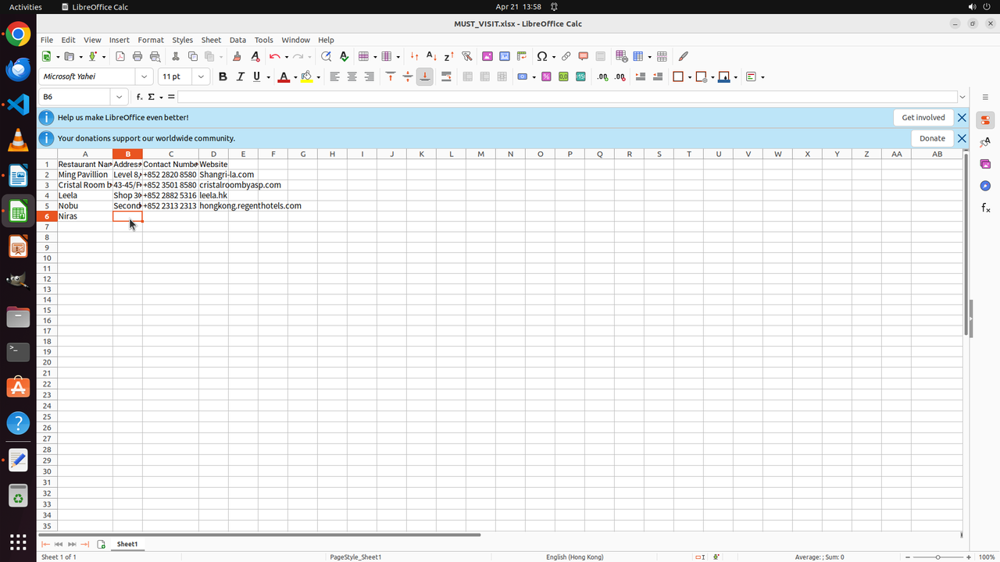

**Response:**
```
I'm in B6. Let me enter the address for Niras.
```

**Actions:** `import subprocess, shlex; subprocess.run(f'xdotool type --delay 12 -- ' + shlex.quote('Shop 704, 7/F, K11 MUSEA Victoria Dockside, 18 Sal'), shell=True, check=True)
import time; time.sleep(0.05)
impor`

---

## Step 67


**Response:**
```
The address for Niras is entered. Let me press Tab to move to C6 for the contact number.
```

**Actions:** `pyautogui.keyDown('tab')
pyautogui.keyUp('tab')`

---

## Step 68

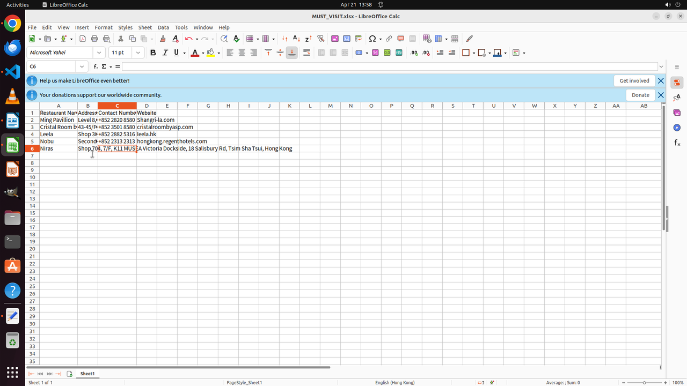

**Response:**
```
I'm in C6. Let me enter the contact number for Niras.
```

**Actions:** `import subprocess, shlex; subprocess.run(f'xdotool type --delay 12 -- ' + shlex.quote('+852 3905 3022'), shell=True, check=True)
import time; time.sleep(0.05)`

---

## Step 69

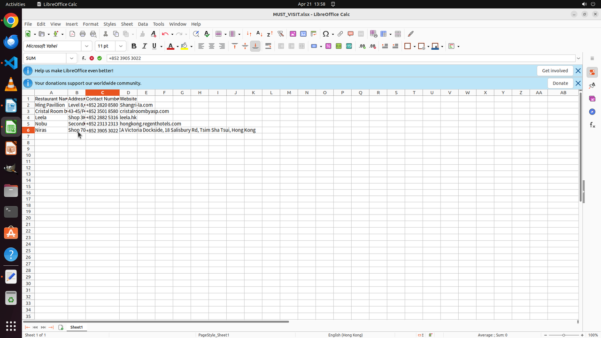

**Response:**
```
Good, the phone number for Niras is entered. Let me press Tab to move to D6 for the website.
```

**Actions:** `pyautogui.keyDown('tab')
pyautogui.keyUp('tab')`

---

## Step 70


**Response:**
```
I'm in D6. Let me enter the website for Niras.
```

**Actions:** `import subprocess, shlex; subprocess.run(f'xdotool type --delay 12 -- ' + shlex.quote('niras.hk'), shell=True, check=True)
import time; time.sleep(0.05)`

---

## Step 71

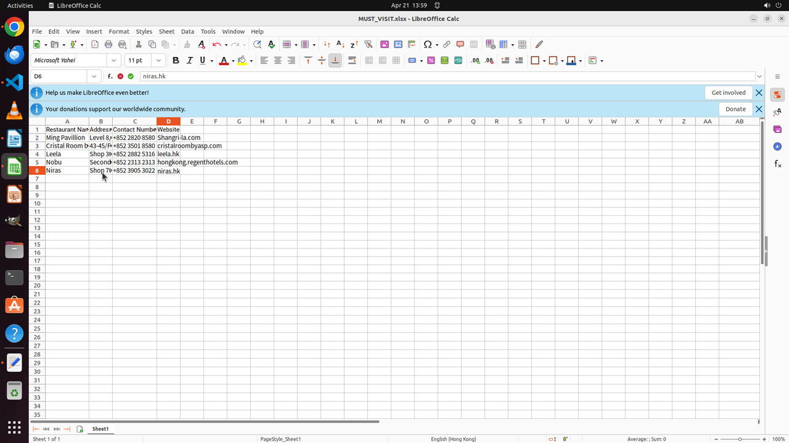

**Response:**
```
All the data has been entered for all 5 restaurants. Let me press Enter to confirm the last entry, and then save the file.
```

**Actions:** `pyautogui.keyDown('return')
pyautogui.keyUp('return')`

---

## Step 72

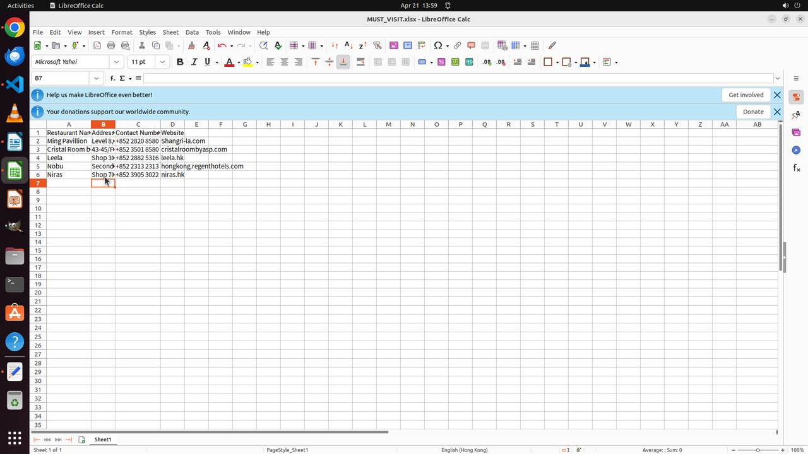

**Response:**
```
All the data is entered for all 5 restaurants. Now I need to verify the data and check if the phone numbers are stored correctly. I notice the phone numbers might be stored as numbers (with the + being treated as a formula). Let me check by clicking on C2 first.

But before that, let me also check if the Nobu website needs to be more specific. Let me first verify the data by clicking on different cells. But more importantly, let me save the file now using Ctrl+S.
```

**Actions:** `pyautogui.keyDown('ctrl')
pyautogui.keyDown('s')
pyautogui.keyUp('s')
pyautogui.keyUp('ctrl')`

---

## Step 73


**Response:**
```
The file appears to have been saved (no "Keep Current Format" dialog appeared, which means it saved in xlsx format). Let me verify the data by clicking on a few cells to make sure everything looks correct. Let me check cell C2 to see how the phone number was stored.
```

**Actions:** `pyautogui.click(327, 336)`

---

## Step 74


**Response:**
```
I can see that the phone number in C2 is stored as "+852 2820 8580" in the formula bar, which looks correct. The phone numbers display correctly in the cells. The data looks good. 

However, I notice that the phone numbers are being treated as numbers (the cell type shows "SUM" for some). Let me verify the data looks correct visually. The display shows:
- C2: +852 2820 8580
- C3: +852 3501 8580
- C4: +852 2882 5316
- C5: +852 2313 2313
- C6: +852 3905 3022

All data appears to be correctly entered. Let me also verify that the website for Ming Pavillion (D2) shows correctly. Let me also check if the "Shangri-la.com" was auto-capitalized. Let me click on D2.
```

**Actions:** `pyautogui.click(412, 336)`

---

## Step 75


**Response:**
```
I can see D2 shows "Shangri-la.com" in the formula bar (auto-capitalized from "shangri-la.com"). This is fine. The website was auto-capitalized by LibreOffice's autocorrect feature, but the website URL is still correct.

Now let me verify the data is complete. I need to also double-check that the Nobu website is correct. On Google Maps, the website shown was "hongkong.regenthotels.com". Let me verify this is the correct website for Nobu by going back to Google Maps. But first, let me check all the data looks complete by scrolling through the cells.

Let me also check the address for the Niras restaurant to make sure the full address was captured. Let me click on B6.
```

**Actions:** `pyautogui.click(244, 415)`

---

## Step 76


**Response:**
```
I can see the full address for Niras in the formula bar: "Shop 704, 7/F, K11 MUSEA Victoria Dockside, 18 Salisbury Rd, Tsim Sha Tsui, Hong Kong". All the data is correctly entered.

Let me now save the file one more time to make sure everything is saved properly.
```

**Actions:** `pyautogui.keyDown('ctrl')
pyautogui.keyDown('s')
pyautogui.keyUp('s')
pyautogui.keyUp('ctrl')`

---

## Step 77

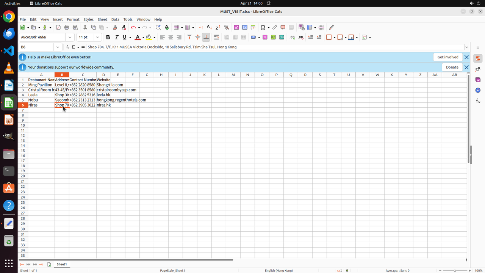

**Response:**
```
The file has been saved successfully. All the data has been entered correctly for all 5 restaurants:

1. **Ming Pavillion** - Level 8, Pacific Place, Supreme Court Road, Central, Admiralty, Hong Kong | +852 2820 8580 | Shangri-la.com
2. **Cristal Room by Anne-Sophie Pic** - 43-45/F, FORTY-FIVE, Gloucester Tower, Landmark, 15 Queen's Road Central, Central, Hong Kong | +852 3501 8580 | cristalroombyasp.com
3. **Leela** - Shop 301-310, 1 Sunning Rd, Causeway Bay, Hong Kong | +852 2882 5316 | leela.hk
4. **Nobu** - Second Floor, Regent Hong Kong, 18 Salisbury Rd, Tsim Sha Tsui, Hong Kong | +852 2313 2313 | hongkong.regenthotels.com
5. **Niras** - Shop 704, 7/F, K11 MUSEA Victoria Dockside, 18 Salisbury Rd, Tsim Sha Tsui, Hong Kong | +852 3905 3022 | niras.hk

DONE
```

**Actions:** `DONE`

---
