# Task d1acdb87-bb67-4f30-84aa-990e56a09c92

**Instruction:** Hello! I'm eagerly planning a culinary adventure to Hong Kong and have curated a list of must-visit restaurants that I've been longing to explore. However, I could use some assistance in compiling a few essential details about these establishments. Would you be so kind as to help me out? It would be fantastic if you could search for these restaurants on Google Maps. I'm particularly interested in obtaining their addresses, any available websites, and contact phone numbers. If you could gather this information and input it into my form file, I would be immensely grateful. Many thanks in advance!

**Score:** 0.0

**Wall clock:** 26m 9s

**Steps:** 127

**Cost:** $5.44

---

## Step 1

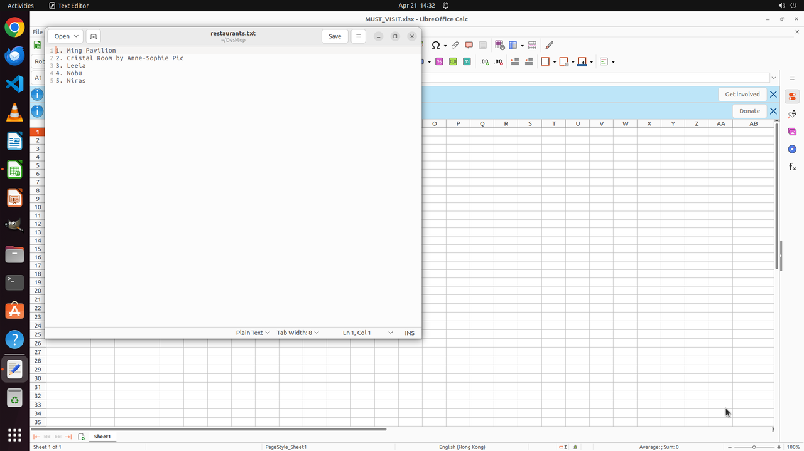

**Response:**
```
I can see a text file with 5 restaurants to search for, and a spreadsheet (MUST_VISIT.xlsx) that needs to be filled in. Let me first look at the spreadsheet to understand its structure, then search for each restaurant on Google Maps.
```

**Actions:** `pyautogui.click(1425, 600)`

---

## Step 2

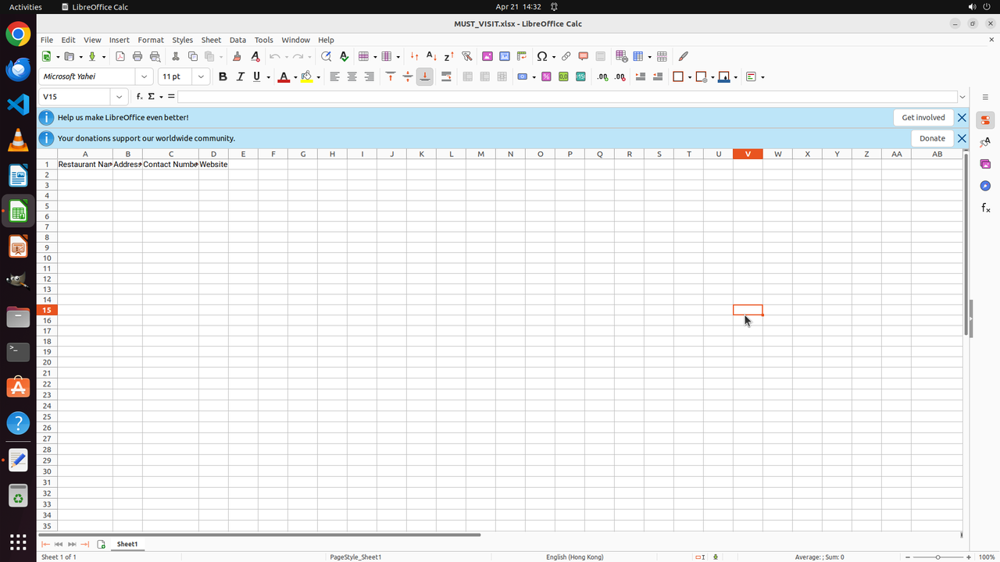

**Response:**
```
Now I can see the spreadsheet structure. It has columns: A (Restaurant Name), B (Address), C (Contact Number), D (Website). The restaurants to search are:
1. Ming Pavilion
2. Cristal Room by Anne-Sophie Pic
3. Leela
4. Nobu
5. Niras

Let me first check the exact column headers by clicking on them.
```

**Actions:** `pyautogui.click(163, 316)`

---

## Step 3

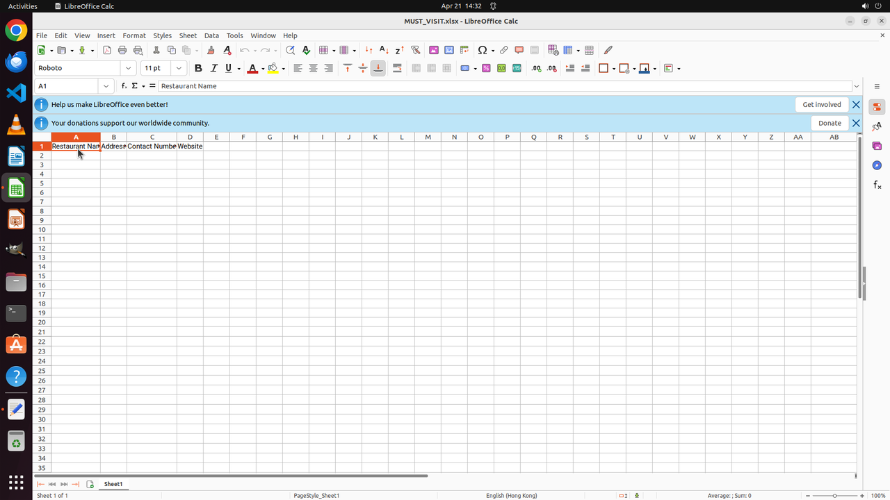

**Response:**
```
I can see the headers: A1="Restaurant Name", B1="Address", C1="Contact Number", D1="Website". Now let me open Google Chrome and search for each restaurant on Google Maps. Let me start by opening Chrome.
```

**Actions:** `pyautogui.click(33, 63)`

---

## Step 4

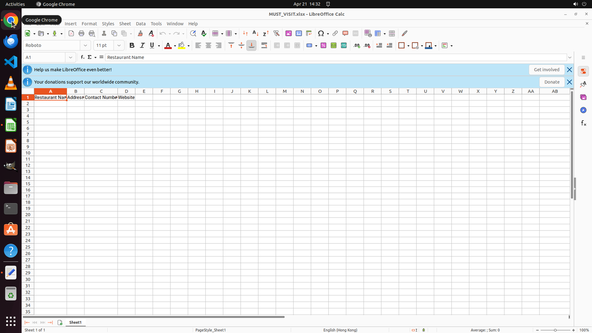

**Response:**
```
I see Google Chrome is showing in the taskbar. Let me click on it to open it.
```

**Actions:** `pyautogui.click(132, 63)`

---

## Step 5

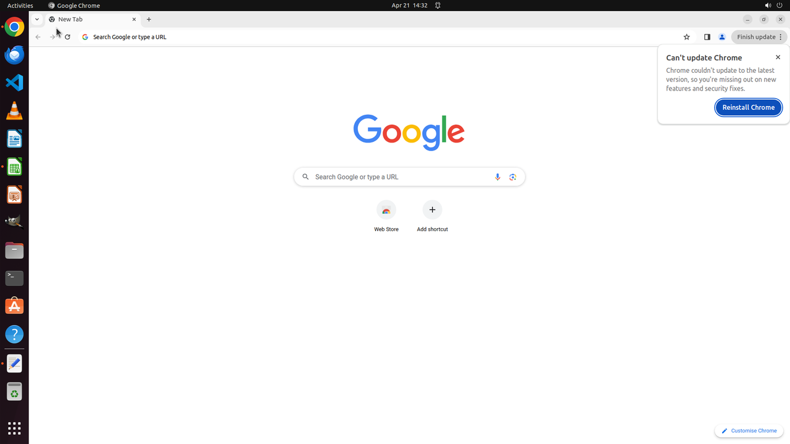

**Response:**
```
Chrome is open. Let me dismiss the update notification and navigate to Google Maps to search for the first restaurant.
```

**Actions:** `pyautogui.click(1888, 139)`

---

## Step 6

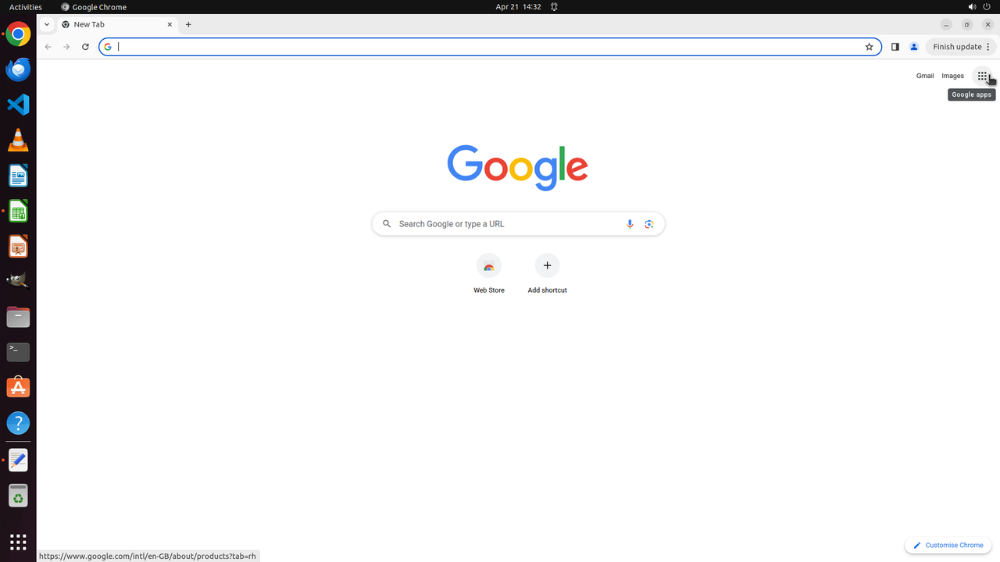

**Response:**
```
Now let me navigate to Google Maps and search for the first restaurant "Ming Pavilion Hong Kong".
```

**Actions:** `import subprocess, shlex; subprocess.run(f'xdotool type --delay 12 -- ' + shlex.quote('https://www.google.com/maps/search/Ming+Pavilion+H'), shell=True, check=True)
import time; time.sleep(0.05)
impor`

---

## Step 7

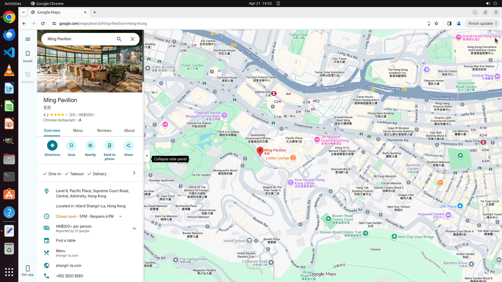

**Response:**
```
I found Ming Pavilion. Let me note down the details:
- **Name**: Ming Pavilion
- **Address**: Level 8, Pacific Place, Supreme Court Road, Central, Admiralty, Hong Kong
- **Website**: shangri-la.com
- **Phone**: +852 2820 8580

Now let me search for the second restaurant. Let me click on the search bar and search for the next one.
```

**Actions:** `pyautogui.click(310, 147)`

---

## Step 8

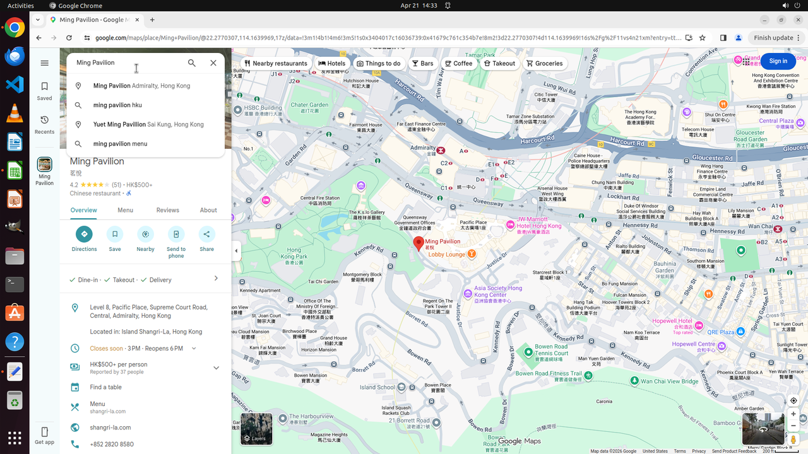

**Response:**
```
I can see the search suggestions. Let me clear the search and type the next restaurant name.
```

**Actions:** `pyautogui.tripleClick(310, 147)`

---

## Step 9

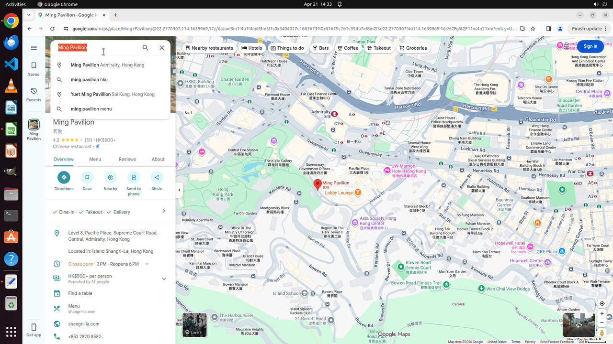

**Response:**
```
Good, the text is selected. Now let me type the second restaurant name.
```

**Actions:** `import subprocess, shlex; subprocess.run(f'xdotool type --delay 12 -- ' + shlex.quote('Cristal Room by Anne-Sophie Pic Hong Kong\n'), shell=True, check=True)
import time; time.sleep(0.05)`

---

## Step 10

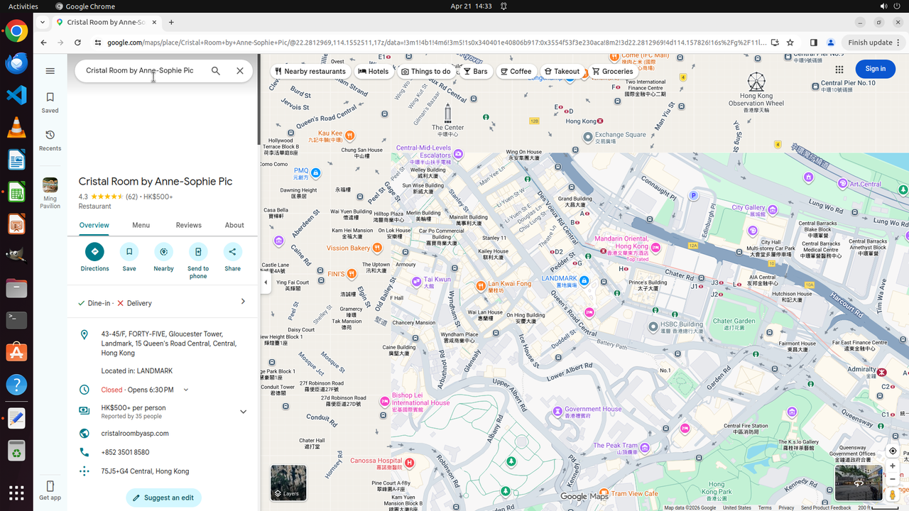

**Response:**
```
Excellent! I found the second restaurant. Here are the details:
- **Name**: Cristal Room by Anne-Sophie Pic
- **Address**: 43-45/F, FORTY-FIVE, Gloucester Tower, Landmark, 15 Queen's Road Central, Central, Hong Kong
- **Website**: cristalroombyasp.com
- **Phone**: +852 3501 8580

Now let me search for the third restaurant "Leela".
```

**Actions:** `pyautogui.tripleClick(310, 147)`

---

## Step 11


**Response:**
```
Good, the text is selected. Let me type the third restaurant name.
```

**Actions:** `import subprocess, shlex; subprocess.run(f'xdotool type --delay 12 -- ' + shlex.quote('Leela restaurant Hong Kong\n'), shell=True, check=True)
import time; time.sleep(0.05)`

---

## Step 12

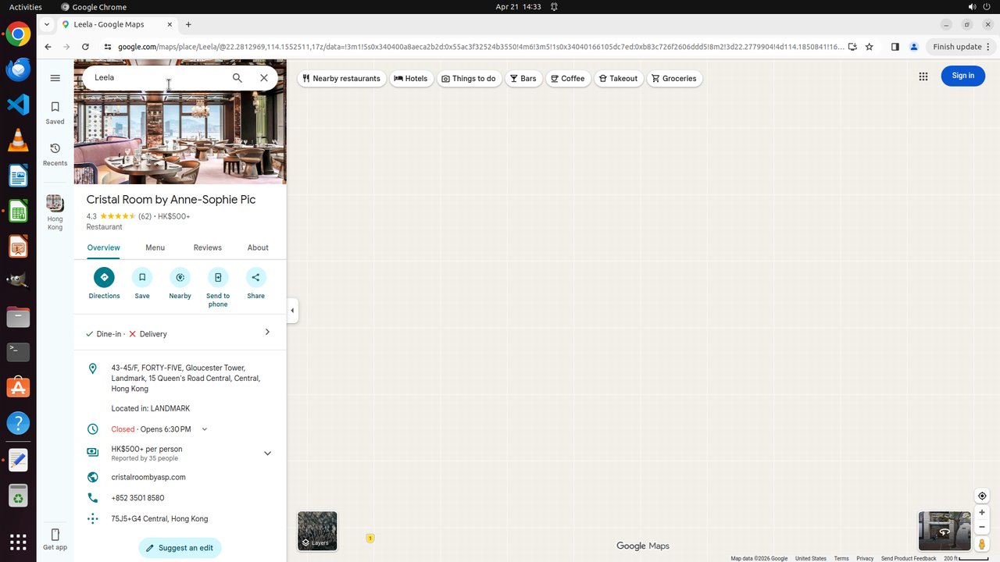

**Response:**
```
It seems the search returned the previous result still showing "Cristal Room by Anne-Sophie Pic". The page seems to be loading. Let me wait and scroll down to see if there's a "Leela" result, or I need to search again.
```

**Actions:** `pyautogui.scroll(-3, 345, 600)`

---

## Step 13

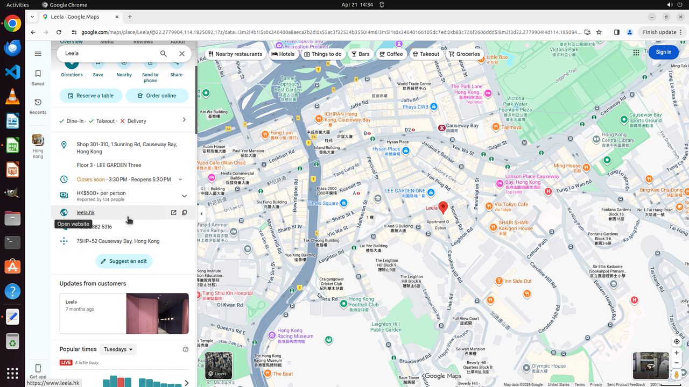

**Response:**
```
I can see the Leela restaurant details now. Let me note down the information:
- **Name**: Leela
- **Address**: Shop 301-310, 1 Sunning Rd, Causeway Bay, Hong Kong
- **Website**: leela.hk
- **Phone**: I need to scroll to see the full phone number. Let me check.
```

**Actions:** `pyautogui.scroll(2, 345, 600)`

---

## Step 14

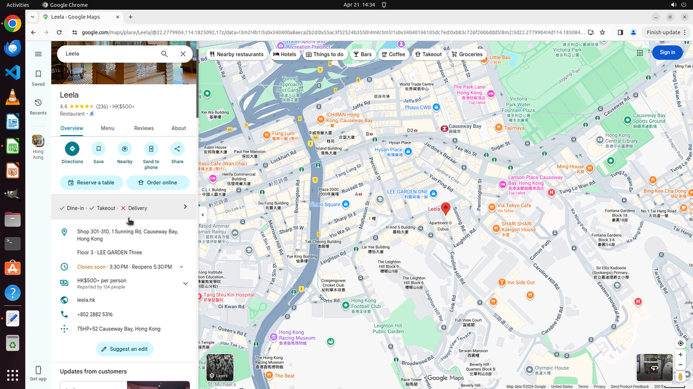

**Response:**
```
Now I can see all the details for Leela:
- **Name**: Leela
- **Address**: Shop 301-310, 1 Sunning Rd, Causeway Bay, Hong Kong
- **Website**: leela.hk
- **Phone**: +852 2882 5316

Now let me search for the fourth restaurant "Nobu Hong Kong".
```

**Actions:** `pyautogui.tripleClick(310, 147)`

---

## Step 15

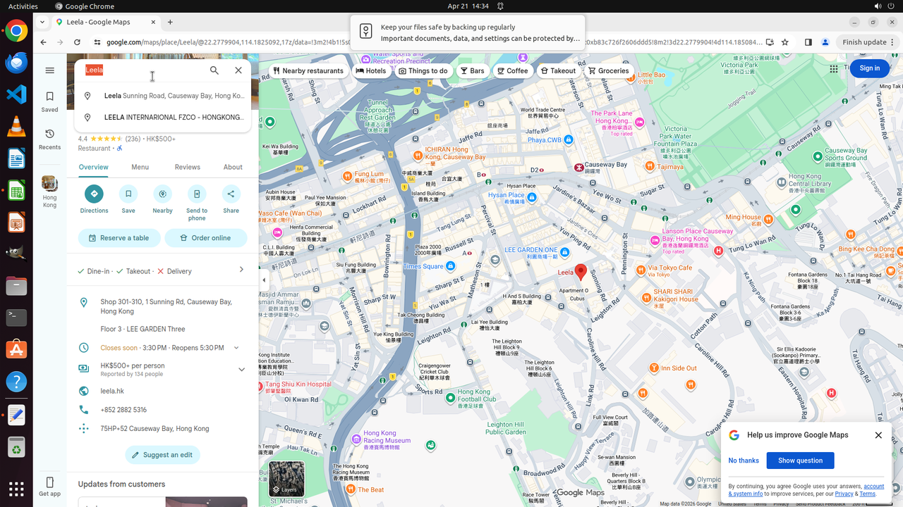

**Response:**
```
Let me dismiss the popup and type the next restaurant name.
```

**Actions:** `pyautogui.click(1582, 981)`

---

## Step 16

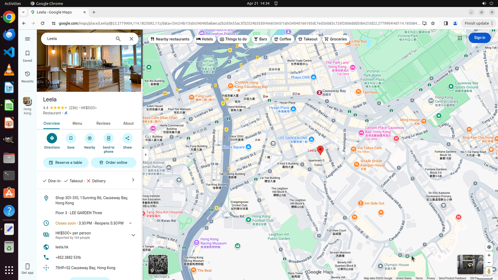

**Response:**
```
Good, the popup is dismissed. Now let me search for Nobu Hong Kong.
```

**Actions:** `pyautogui.tripleClick(310, 147)`

---

## Step 17


**Response:**
```
Good, the text is selected. Now let me type the fourth restaurant name.
```

**Actions:** `import subprocess, shlex; subprocess.run(f'xdotool type --delay 12 -- ' + shlex.quote('Nobu restaurant Hong Kong\n'), shell=True, check=True)
import time; time.sleep(0.05)`

---

## Step 18


**Response:**
```
I found Nobu Hong Kong. Here are the details:
- **Name**: NOBU Hong Kong - Japanese Restaurant
- **Address**: Second Floor, Regent Hong Kong, 18 Salisbury Rd, Tsim Sha Tsui, Hong Kong
- **Website**: hongkong.regenthotels.com
- **Phone**: +852 2313 2313

Now let me search for the fifth and last restaurant "Niras Hong Kong".
```

**Actions:** `pyautogui.tripleClick(310, 147)`

---

## Step 19

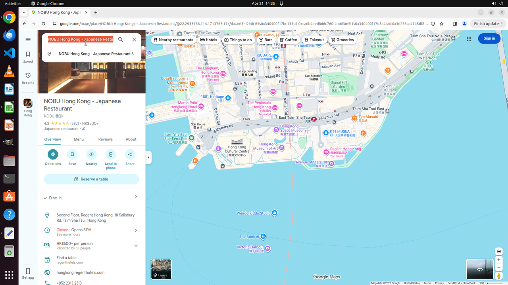

**Response:**
```
Good, the text is selected. Let me type the fifth restaurant name.
```

**Actions:** `import subprocess, shlex; subprocess.run(f'xdotool type --delay 12 -- ' + shlex.quote('Niras restaurant Hong Kong\n'), shell=True, check=True)
import time; time.sleep(0.05)`

---

## Step 20

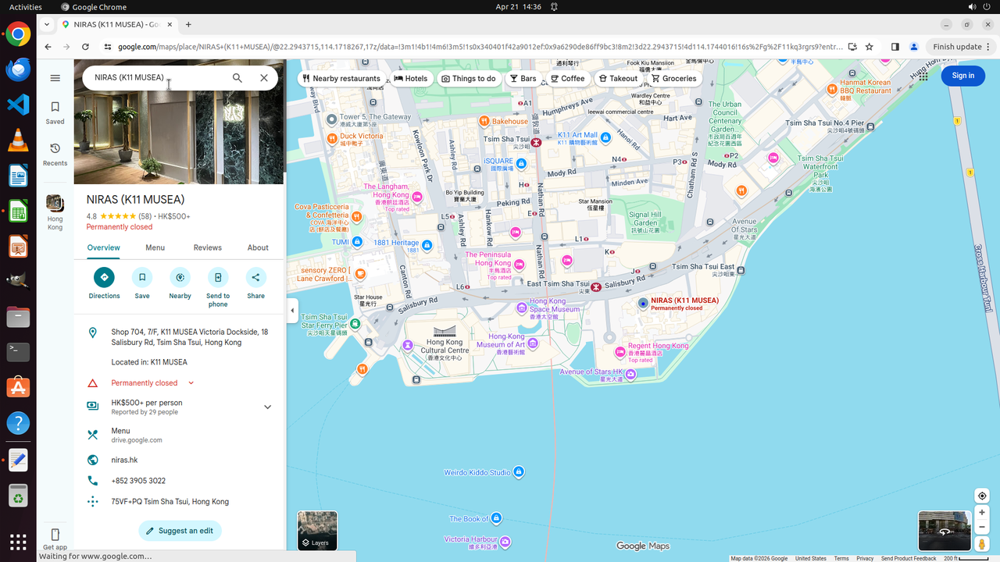

**Response:**
```
I found the fifth restaurant, NIRAS (K11 MUSEA). Here are the details:
- **Name**: NIRAS (K11 MUSEA)
- **Address**: Shop 704, 7/F, K11 MUSEA Victoria Dockside, 18 Salisbury Rd, Tsim Sha Tsui, Hong Kong
- **Website**: niras.hk
- **Phone**: +852 3905 3022

Now I have all the information for all 5 restaurants. Let me also go back and verify the details for Ming Pavilion. Let me scroll up on the first search to confirm. But first, let me go back to the Ming Pavilion search to verify the address details.
```

**Actions:** `pyautogui.tripleClick(310, 147)`

---

## Step 21

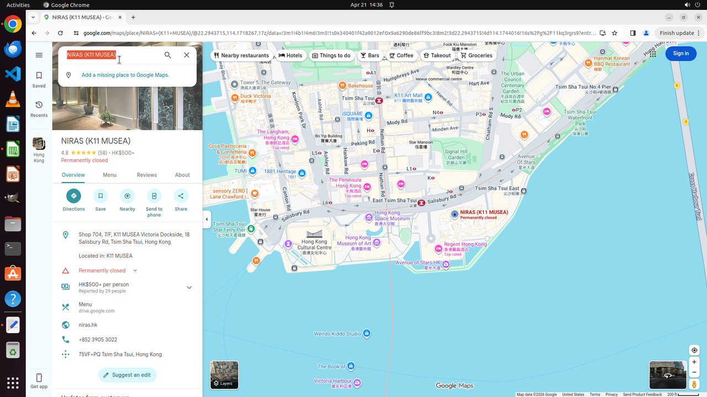

**Response:**
```
Let me search for Ming Pavilion to verify its details.
```

**Actions:** `import subprocess, shlex; subprocess.run(f'xdotool type --delay 12 -- ' + shlex.quote('Ming Pavilion Hong Kong\n'), shell=True, check=True)
import time; time.sleep(0.05)`

---

## Step 22

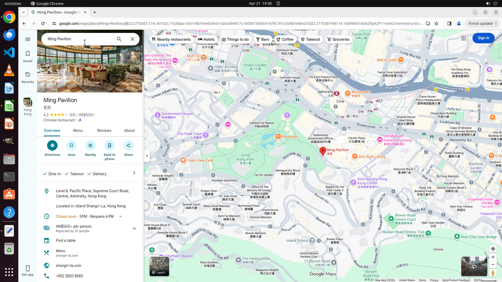

**Response:**
```
Now I have all the details for Ming Pavilion confirmed:
- **Name**: Ming Pavilion
- **Address**: Level 8, Pacific Place, Supreme Court Road, Central, Admiralty, Hong Kong
- **Website**: shangri-la.com
- **Phone**: +852 2820 8580

Now I have all the information for all 5 restaurants. Let me switch to the LibreOffice Calc spreadsheet and fill in the data. Let me click on the LibreOffice Calc icon in the taskbar.
```

**Actions:** `pyautogui.click(33, 472)`

---

## Step 23

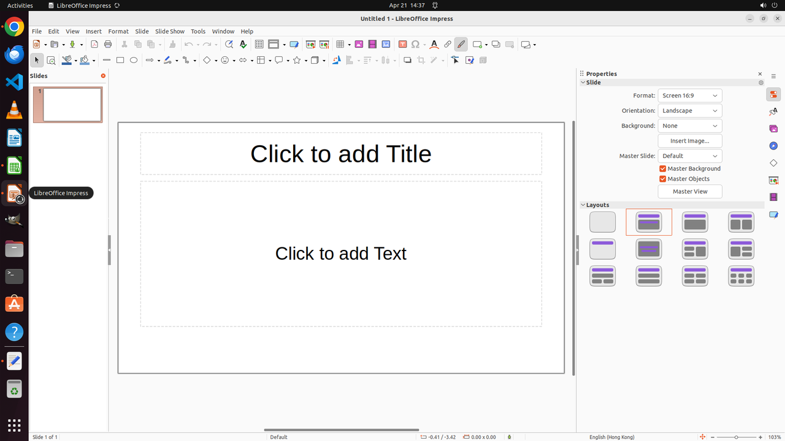

**Response:**
```
This opened LibreOffice Impress instead of the spreadsheet. I need to find the MUST_VISIT.xlsx file. Let me look for it in the taskbar or open it from the file manager.
```

**Actions:** `pyautogui.click(33, 607)`

---

## Step 24

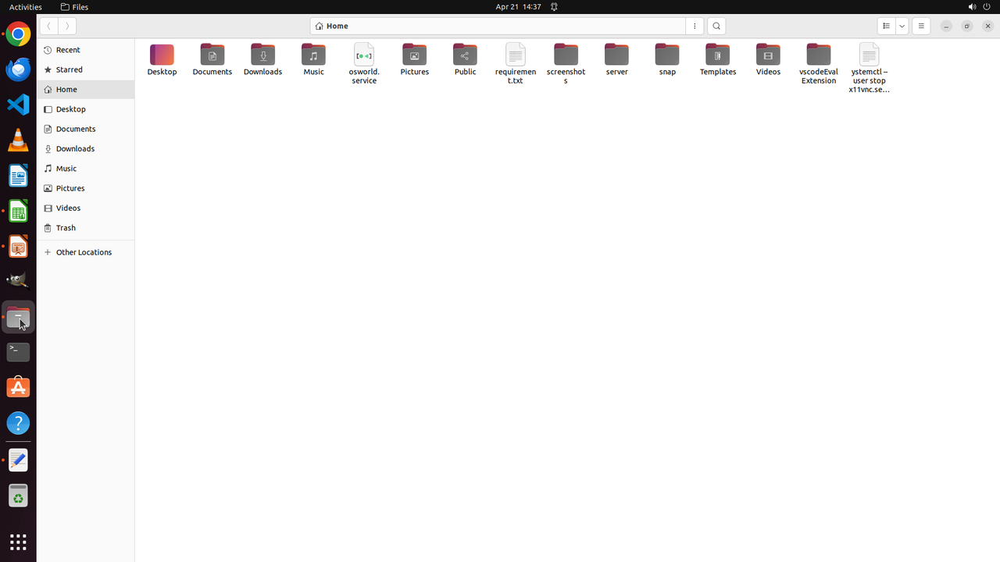

**Response:**
```
I see the file manager is open. I need to find the MUST_VISIT.xlsx file. Let me check the Desktop folder first.
```

**Actions:** `pyautogui.doubleClick(310, 117)`

---

## Step 25

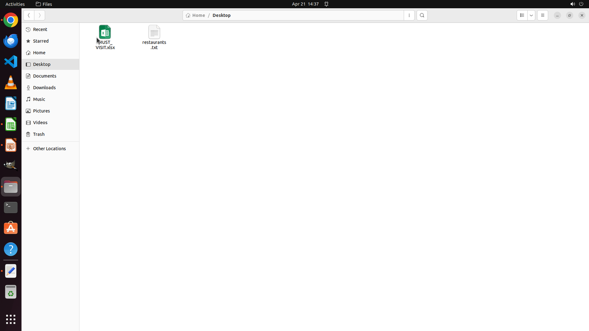

**Response:**
```
I can see both files on the Desktop - MUST_VISIT.xlsx and restaurants.txt. Let me open the MUST_VISIT.xlsx file.
```

**Actions:** `pyautogui.doubleClick(342, 123)`

---

## Step 26

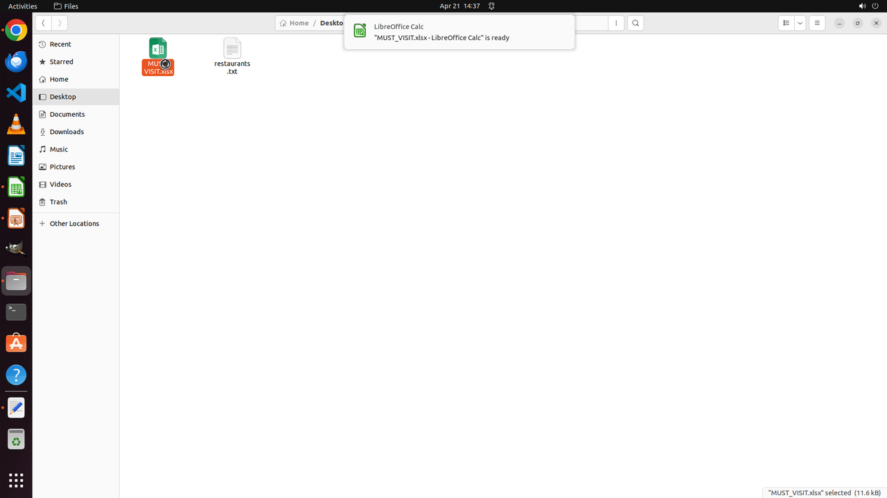

**Response:**
```
The file is opening in LibreOffice Calc. Let me click on the notification to switch to it.
```

**Actions:** `pyautogui.click(990, 69)`

---

## Step 27

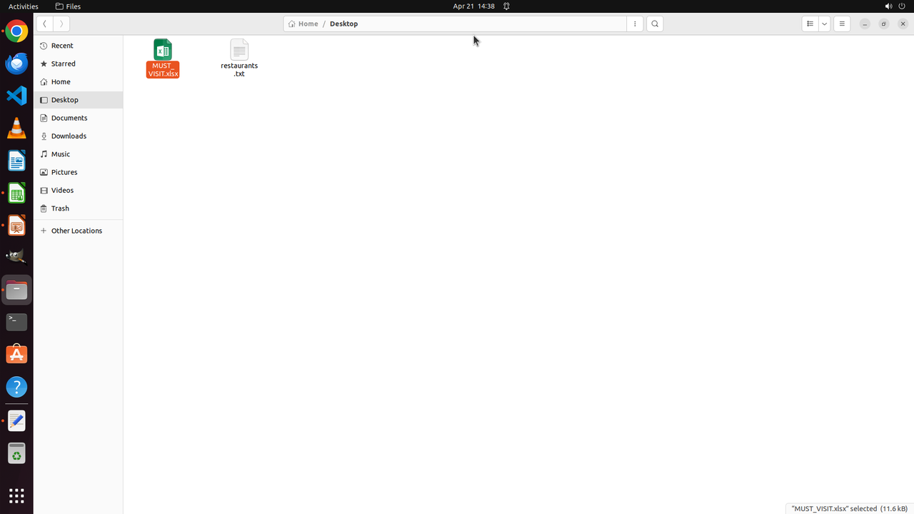

**Response:**
```
Let me click on the LibreOffice Calc icon in the taskbar to switch to the spreadsheet.
```

**Actions:** `pyautogui.click(33, 406)`

---

## Step 28

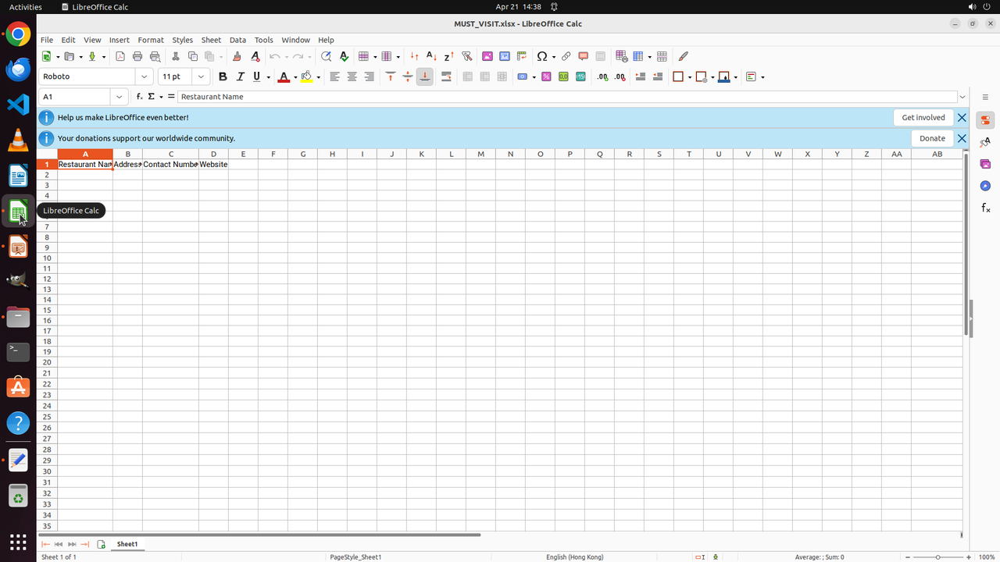

**Response:**
```
The MUST_VISIT.xlsx spreadsheet is now open in LibreOffice Calc. I can see the headers:
- A1: Restaurant Name
- B1: Address
- C1: Contact Number
- D1: Website

Now let me start filling in the data. First, let me click on cell A2 to start entering the first restaurant.
```

**Actions:** `pyautogui.click(163, 336)`

---

## Step 29

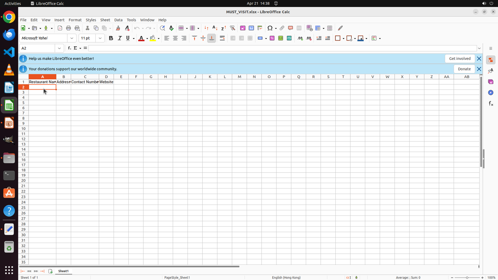

**Response:**
```
Cell A2 is selected. Now let me enter the restaurant data. I'll type the first restaurant name and then use Tab to move to the next column.
```

**Actions:** `import subprocess, shlex; subprocess.run(f'xdotool type --delay 12 -- ' + shlex.quote('Ming Pavilion\tLevel 8, Pacific Place, Supreme Cour'), shell=True, check=True)
import time; time.sleep(0.05)
impo`

---

## Step 30

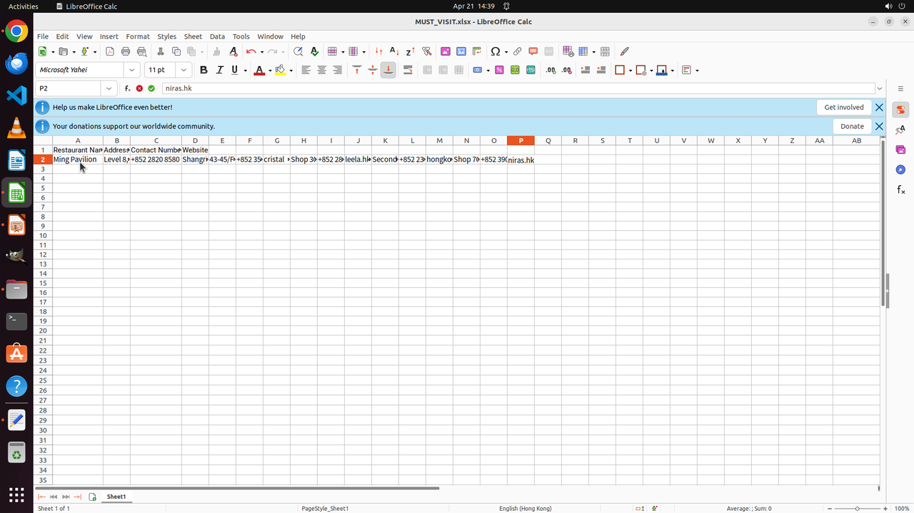

**Response:**
```
It seems all the data was entered in a single row (row 2) instead of separate rows. The Tab key moved to the next column, but the Enter/Return didn't create new rows as expected. The data appears to be spread across columns in row 2. Let me first press Escape, then undo all the changes and re-enter the data properly.
```

**Actions:** `pyautogui.keyDown('esc')
pyautogui.keyUp('esc')`

---

## Step 31

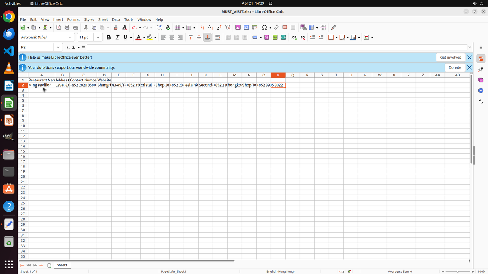

**Response:**
```
I see the data was entered all in one row. I need to undo all of this and re-enter the data correctly. Let me undo multiple times to clear the data.
```

**Actions:** `pyautogui.keyDown('ctrl')
pyautogui.keyDown('z')
pyautogui.keyUp('z')
pyautogui.keyUp('ctrl')`

---

## Step 32

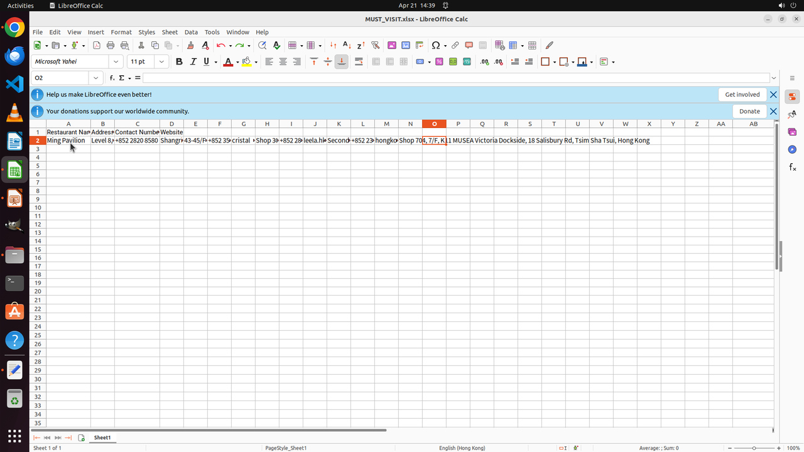

**Response:**
```
I see the undo only undid one step. I need to undo many more times. Let me keep pressing Ctrl+Z multiple times to clear all the data.
```

**Actions:** `pyautogui.keyDown('ctrl')
pyautogui.keyDown('z ctrl')
pyautogui.keyDown('z ctrl')
pyautogui.keyDown('z ctrl')
pyautogui.keyDown('z ctrl')
pyautogui.keyDown('z ctrl')
pyautogui.keyDown('z ctrl')
pyauto`

---

## Step 33

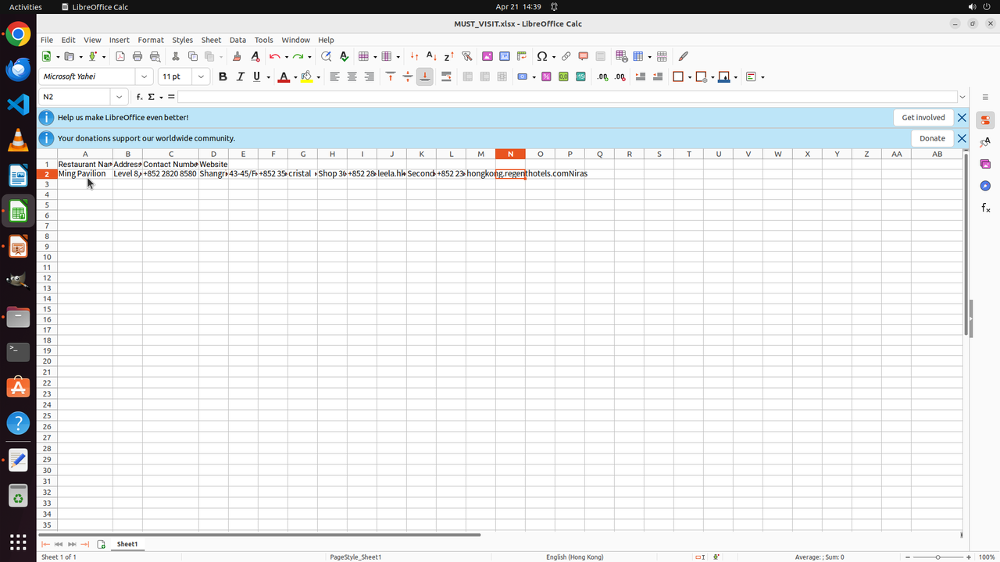

**Response:**
```
I can see there's still data in row 2 spread across many columns. Let me continue undoing to clear everything.
```

**Actions:** `pyautogui.keyDown('ctrl')
pyautogui.keyDown('z ctrl')
pyautogui.keyDown('z ctrl')
pyautogui.keyDown('z ctrl')
pyautogui.keyDown('z ctrl')
pyautogui.keyDown('z ctrl')
pyautogui.keyDown('z ctrl')
pyauto`

---

## Step 34

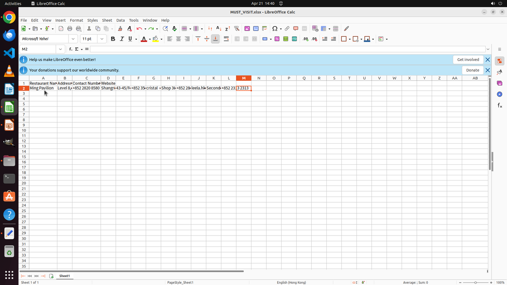

**Response:**
```
There's still data in row 2. Let me take a different approach - I'll select all the data in row 2 and delete it, then re-enter the data properly cell by cell.
```

**Actions:** `pyautogui.keyDown('ctrl')
pyautogui.keyDown('z ctrl')
pyautogui.keyDown('z ctrl')
pyautogui.keyDown('z ctrl')
pyautogui.keyDown('z ctrl')
pyautogui.keyDown('z ctrl')
pyautogui.keyDown('z ctrl')
pyauto`

---

## Step 35

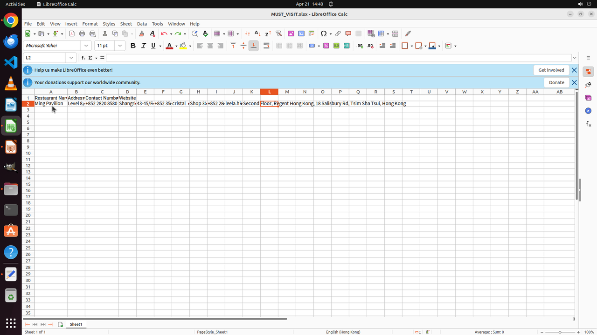

**Response:**
```
This is taking too long with undo. Let me select the entire row 2 and delete it, then start fresh. Let me click on row number 2 to select the entire row.
```

**Actions:** `pyautogui.click(85, 333)`

---

## Step 36

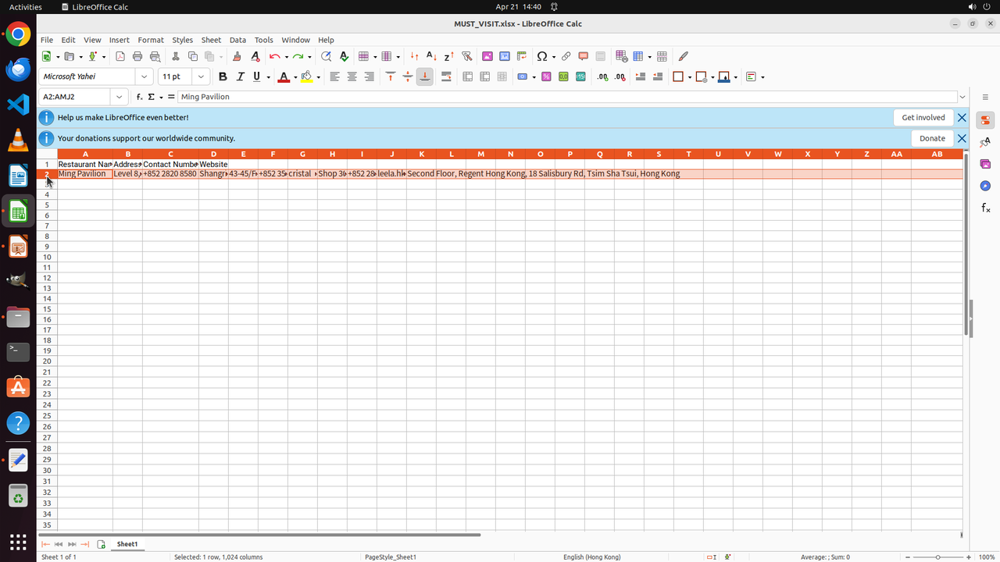

**Response:**
```
Row 2 is selected. Now let me press Delete to clear all the data in this row.
```

**Actions:** `pyautogui.keyDown('delete')
pyautogui.keyUp('delete')`

---

## Step 37

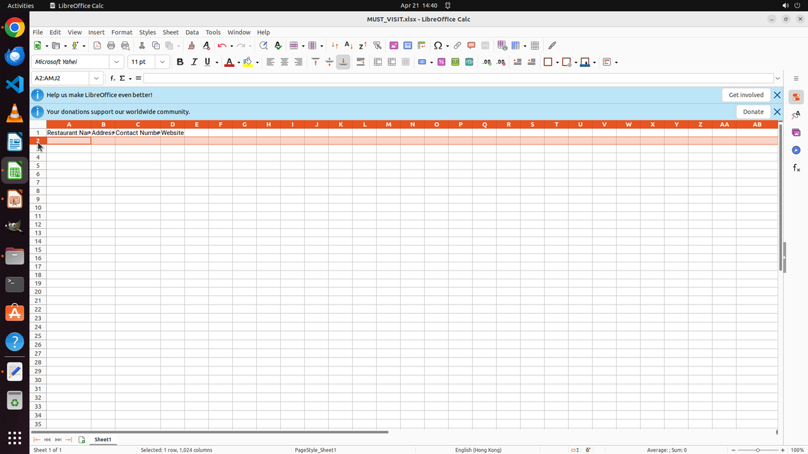

**Response:**
```
Row 2 is now cleared. Now let me click on cell A2 and enter the data properly, one cell at a time.
```

**Actions:** `pyautogui.click(163, 333)`

---

## Step 38


**Response:**
```
Now cell A2 is selected and empty. Let me enter the data cell by cell. I'll type the restaurant name and use Tab to move to the next column, then after filling all 4 columns for one restaurant, I'll use Enter to go to the next row. But the issue before was that the newline characters in my `type` command were being treated as literal text. Let me enter data one cell at a time.
```

**Actions:** `import subprocess, shlex; subprocess.run(f'xdotool type --delay 12 -- ' + shlex.quote('Ming Pavilion'), shell=True, check=True)
import time; time.sleep(0.05)`

---

## Step 39


**Response:**
```
"Ming Pavilion" is entered in A2. Now let me press Tab to move to B2 and enter the address.
```

**Actions:** `pyautogui.keyDown('tab')
pyautogui.keyUp('tab')`

---

## Step 40

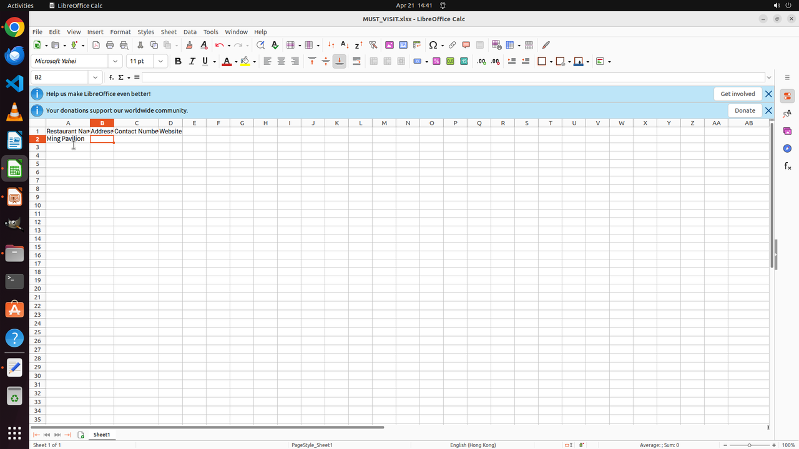

**Response:**
```
I'm now in B2. Let me enter the address for Ming Pavilion. But first, I need to verify the exact address from Google Maps. Let me go back and check. Actually, I noted it earlier from the search results. Let me enter it.
```

**Actions:** `import subprocess, shlex; subprocess.run(f'xdotool type --delay 12 -- ' + shlex.quote('Level 8, Pacific Place, Supreme Court Road, Centra'), shell=True, check=True)
import time; time.sleep(0.05)
impor`

---

## Step 41

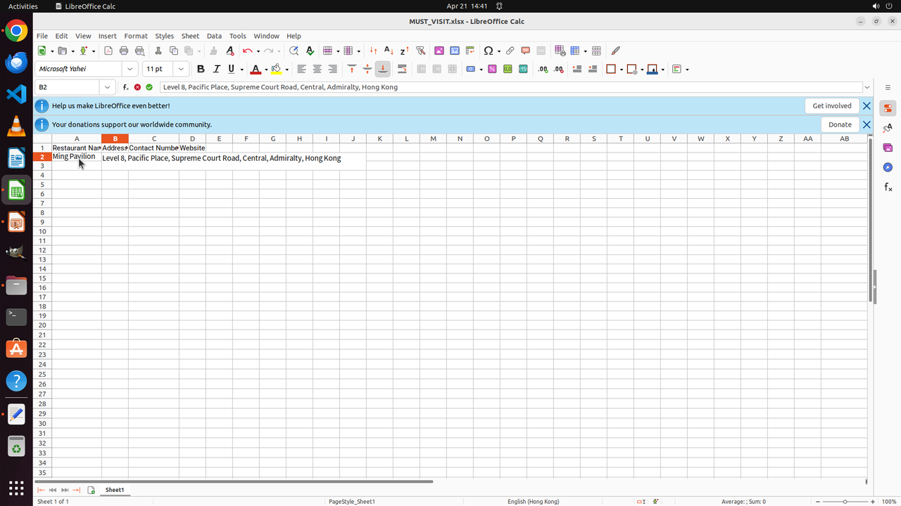

**Response:**
```
The address is entered in B2. Now let me press Tab to move to C2 for the contact number.
```

**Actions:** `pyautogui.keyDown('tab')
pyautogui.keyUp('tab')`

---

## Step 42


**Response:**
```
I'm now in C2. Let me enter the phone number. I need to be careful with phone numbers - they might be interpreted as numbers. Let me prefix with an apostrophe to force text format.
```

**Actions:** `import subprocess, shlex; subprocess.run(f'xdotool type --delay 12 -- ' + shlex.quote('+852 2820 8580'), shell=True, check=True)
import time; time.sleep(0.05)`

---

## Step 43


**Response:**
```
I see the phone number was entered but it's showing "SUM" in the cell reference box, which means it might be interpreted as a formula. The formula bar shows "+852 2820 8580" which starts with "+" and could be treated as a formula. Let me press Tab to move to the next cell and check how it looks.
```

**Actions:** `pyautogui.keyDown('tab')
pyautogui.keyUp('tab')`

---

## Step 44


**Response:**
```
I can see the phone number "+852 2820 8580" appears to be stored in C2. I'm now in D2 (Website column). Let me enter the website for Ming Pavilion.
```

**Actions:** `import subprocess, shlex; subprocess.run(f'xdotool type --delay 12 -- ' + shlex.quote('shangri-la.com'), shell=True, check=True)
import time; time.sleep(0.05)`

---

## Step 45


**Response:**
```
I see it auto-capitalized to "Shangri-la.com". Let me check what was on Google Maps. The website showed "shangri-la.com". Let me keep this as is - it should be fine. Now I need to move to the next row (A3) for the second restaurant. Let me press Enter to confirm and then navigate to A3.
```

**Actions:** `pyautogui.keyDown('return')
pyautogui.keyUp('return')`

---

## Step 46


**Response:**
```
I'm now in A3. Let me first verify the website - I noticed it was auto-capitalized. Let me click on D2 to check.
```

**Actions:** `pyautogui.click(412, 333)`

---

## Step 47


**Response:**
```
I see the website shows "Shangri-la.com" with capital S. Let me fix it to lowercase. But first, let me go back to Google Maps to verify the exact website. Actually, the auto-capitalization is just a display issue - the actual data is "Shangri-la.com". Let me correct it to match what was on Google Maps. Let me clear this cell and re-enter it.
```

**Actions:** `pyautogui.keyDown('delete')
pyautogui.keyUp('delete')`

---

## Step 48


**Response:**
```
Good, D2 is now empty. I need to first turn off autocorrect to prevent the auto-capitalization. Let me go to Tools > AutoCorrect Options to disable it. Actually, let me just use a workaround - I'll first go to Google Maps to get the exact website URL. But for now, let me just re-enter it. The auto-capitalization is from LibreOffice's AutoCorrect feature. Let me disable it first.
```

**Actions:** `pyautogui.click(508, 76)`

---

## Step 49

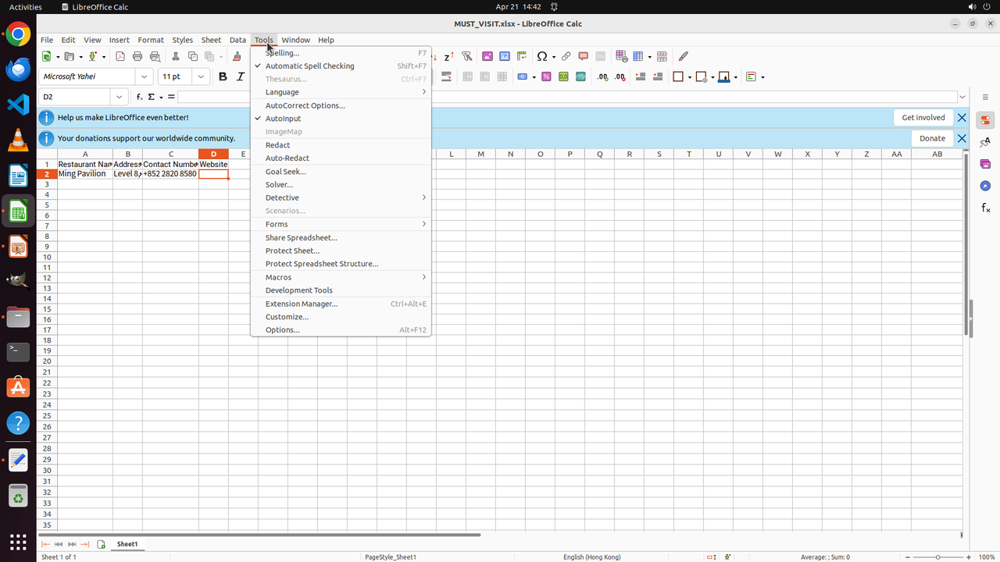

**Response:**
```
I can see the Tools menu. Let me click on "AutoCorrect Options..." to disable the auto-capitalization.
```

**Actions:** `pyautogui.click(583, 201)`

---

## Step 50

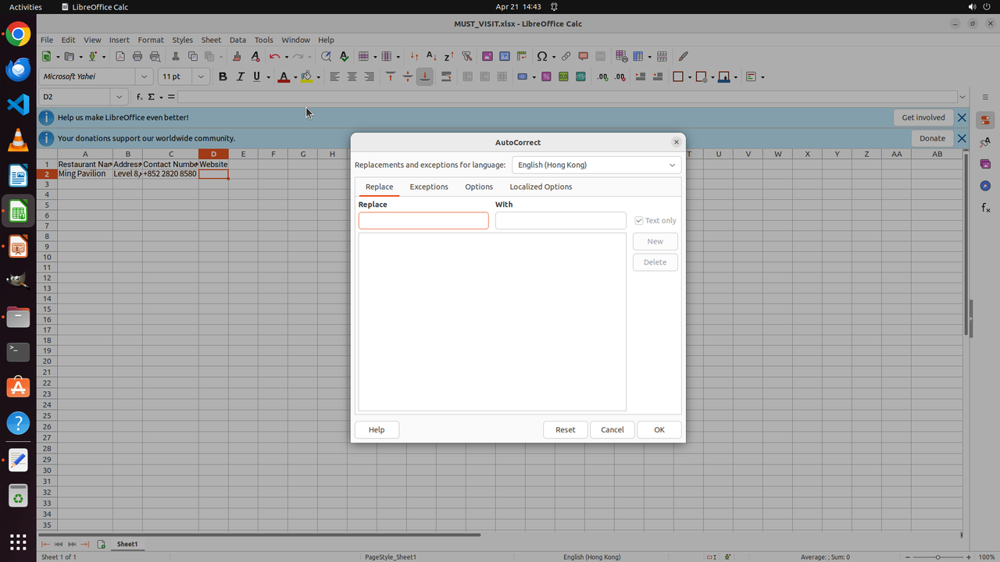

**Response:**
```
I can see the AutoCorrect dialog. I need to go to the "Options" tab to disable the "Capitalize first letter of every sentence" option.
```

**Actions:** `pyautogui.click(916, 358)`

---

## Step 51

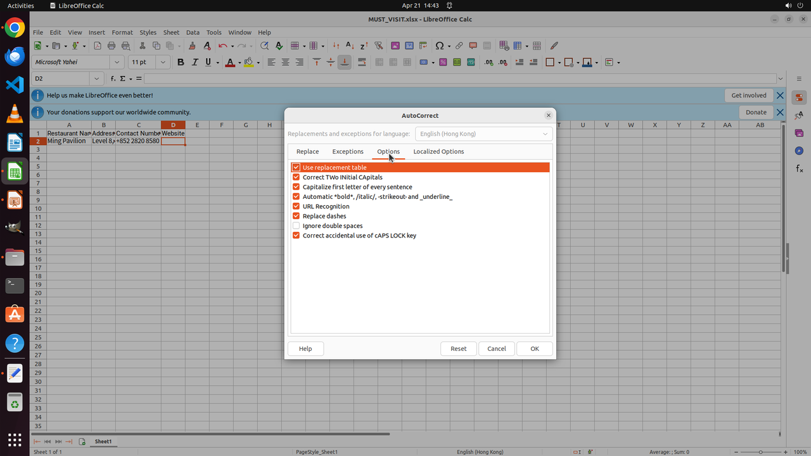

**Response:**
```
I can see the Options tab. I need to uncheck "Capitalize first letter of every sentence" to prevent auto-capitalization. Let me click on that checkbox.
```

**Actions:** `pyautogui.click(694, 442)`

---

## Step 52

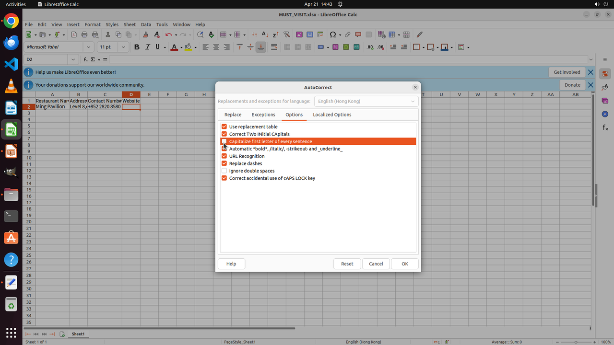

**Response:**
```
I've unchecked "Capitalize first letter of every sentence". Now let me click OK to apply the changes.
```

**Actions:** `pyautogui.click(1264, 826)`

---

## Step 53


**Response:**
```
Good, the autocorrect option is now disabled. I'm still in D2 which is empty. Now I need to go back to Google Maps to verify the exact website URL for Ming Pavilion. But first, let me enter the website. I remember from the Google Maps search it showed "shangri-la.com". Let me type it now.
```

**Actions:** `import subprocess, shlex; subprocess.run(f'xdotool type --delay 12 -- ' + shlex.quote('shangri-la.com'), shell=True, check=True)
import time; time.sleep(0.05)`

---

## Step 54

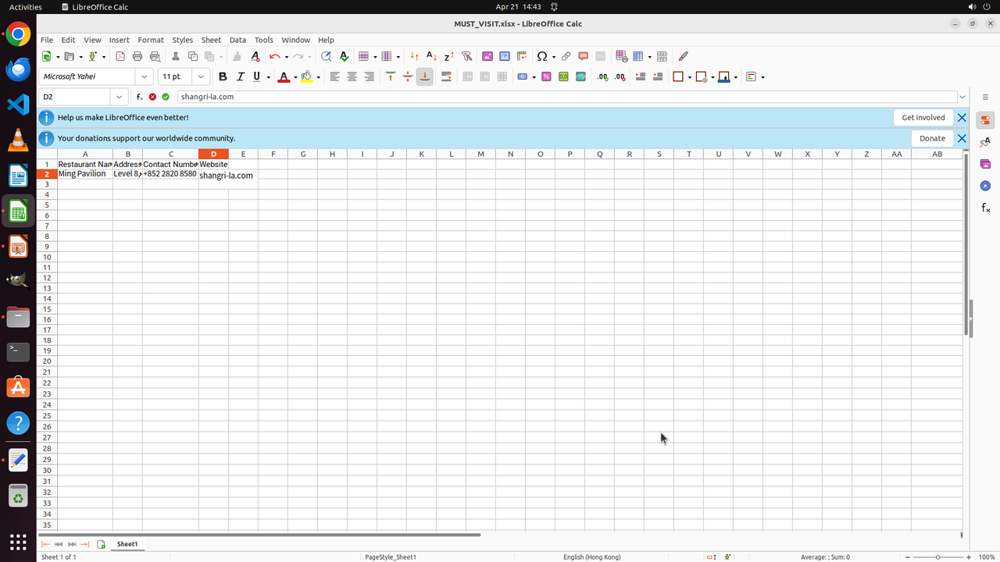

**Response:**
```
Now the website "shangri-la.com" is entered correctly in lowercase. Now let me click on cell A3 to start entering the second restaurant.
```

**Actions:** `pyautogui.click(163, 352)`

---

## Step 55

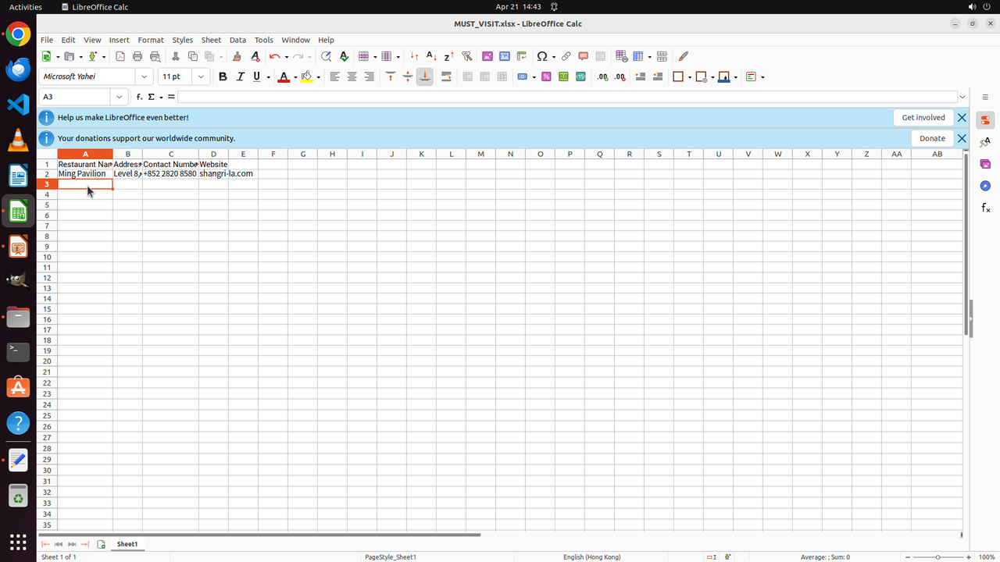

**Response:**
```
I'm now in A3. Let me enter the second restaurant data. I'll type the name, then Tab to the next column for each field.
```

**Actions:** `import subprocess, shlex; subprocess.run(f'xdotool type --delay 12 -- ' + shlex.quote('Cristal Room by Anne-Sophie Pic'), shell=True, check=True)
import time; time.sleep(0.05)`

---

## Step 56

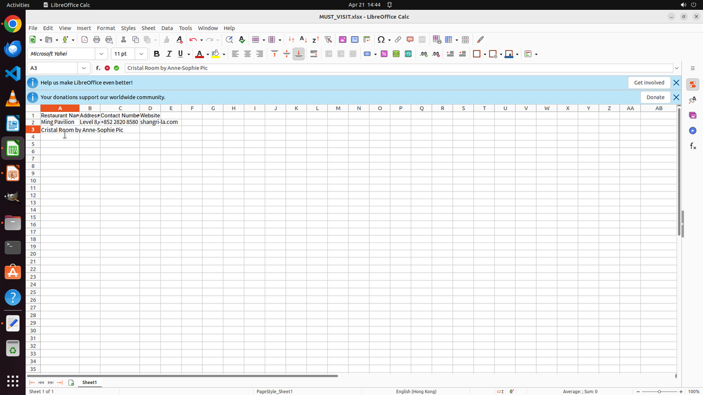

**Response:**
```
The restaurant name is entered. Now let me press Tab to move to B3 for the address.
```

**Actions:** `pyautogui.keyDown('tab')
pyautogui.keyUp('tab')`

---

## Step 57

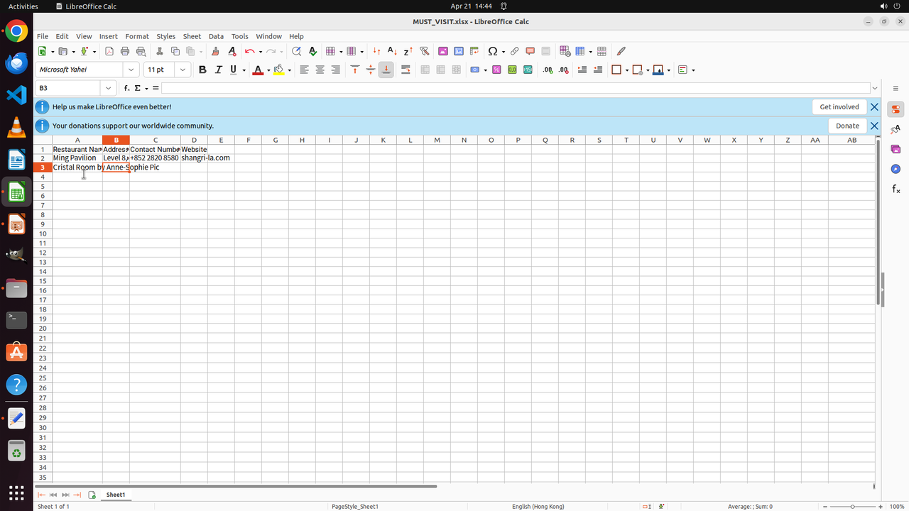

**Response:**
```
I'm now in B3. Let me enter the address for Cristal Room by Anne-Sophie Pic. But I need to verify the exact address. Let me go back to Google Maps to double-check. Actually, I noted it from the search results earlier. Let me enter it.
```

**Actions:** `import subprocess, shlex; subprocess.run(f'xdotool type --delay 12 -- ' + shlex.quote('43-45/F, FORTY-FIVE, Gloucester Tower, Landmark, 1'), shell=True, check=True)
import time; time.sleep(0.05)
impor`

---

## Step 58


**Response:**
```
The address is entered in B3. Now let me press Tab to move to C3 for the contact number.
```

**Actions:** `pyautogui.keyDown('tab')
pyautogui.keyUp('tab')`

---

## Step 59

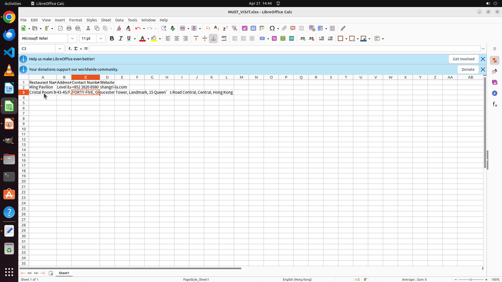

**Response:**
```
I'm now in C3. Let me enter the contact number for Cristal Room by Anne-Sophie Pic.
```

**Actions:** `import subprocess, shlex; subprocess.run(f'xdotool type --delay 12 -- ' + shlex.quote('+852 3501 8580'), shell=True, check=True)
import time; time.sleep(0.05)`

---

## Step 60

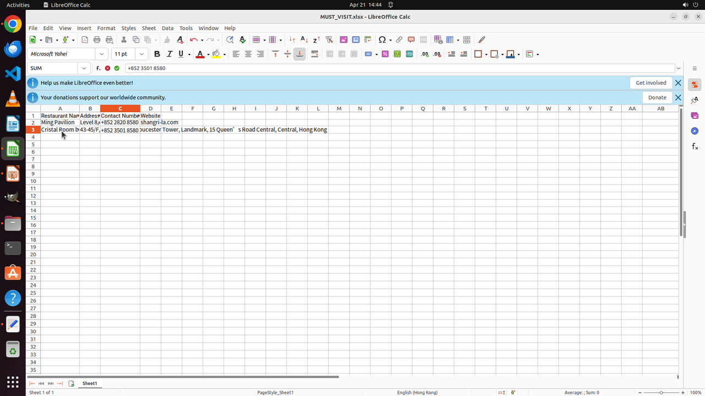

**Response:**
```
I see the phone number is being interpreted as a formula (showing "SUM" in the cell reference). The "+" sign is being treated as an operator. Let me press Tab to move to D3 and enter the website, then I'll come back to fix the phone numbers later.
```

**Actions:** `pyautogui.keyDown('tab')
pyautogui.keyUp('tab')`

---

## Step 61


**Response:**
```
I can see the phone number "+852 3501 8580" is displayed in C3. I'm now in D3. Let me enter the website for Cristal Room by Anne-Sophie Pic.
```

**Actions:** `import subprocess, shlex; subprocess.run(f'xdotool type --delay 12 -- ' + shlex.quote('cristalroombyasp.com'), shell=True, check=True)
import time; time.sleep(0.05)`

---

## Step 62


**Response:**
```
The website "cristalroombyasp.com" is entered in D3. Now let me move to A4 for the third restaurant. Let me click on A4.
```

**Actions:** `pyautogui.click(163, 373)`

---

## Step 63


**Response:**
```
I'm now in A4. Let me enter the third restaurant "Leela" and its details.
```

**Actions:** `import subprocess, shlex; subprocess.run(f'xdotool type --delay 12 -- ' + shlex.quote('Leela'), shell=True, check=True)
import time; time.sleep(0.05)`

---

## Step 64


**Response:**
```
"Leela" is entered in A4. Let me press Tab to move to B4 for the address.
```

**Actions:** `pyautogui.keyDown('tab')
pyautogui.keyUp('tab')`

---

## Step 65

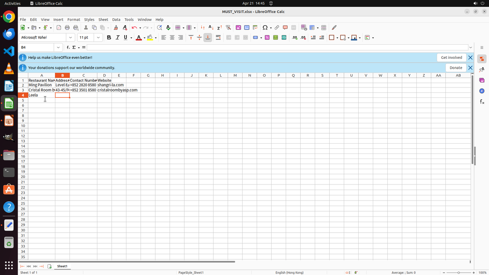

**Response:**
```
I'm in B4. Let me enter the address for Leela. But wait - I need to verify the exact address from Google Maps. Let me go back to Google Maps to double-check. Actually, I noted it earlier. Let me enter it.
```

**Actions:** `import subprocess, shlex; subprocess.run(f'xdotool type --delay 12 -- ' + shlex.quote('Shop 301-310, 1 Sunning Rd, Causeway Bay, Hong Kon'), shell=True, check=True)
import time; time.sleep(0.05)
impor`

---

## Step 66

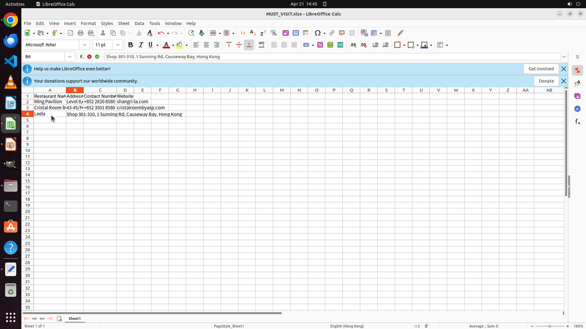

**Response:**
```
The address is entered in B4. Now let me press Tab to move to C4 for the phone number.
```

**Actions:** `pyautogui.keyDown('tab')
pyautogui.keyUp('tab')`

---

## Step 67


**Response:**
```
I'm in C4. Let me enter the phone number for Leela.
```

**Actions:** `import subprocess, shlex; subprocess.run(f'xdotool type --delay 12 -- ' + shlex.quote('+852 2882 5316'), shell=True, check=True)
import time; time.sleep(0.05)`

---

## Step 68


**Response:**
```
The phone number is entered. Now let me press Tab to move to D4 for the website.
```

**Actions:** `pyautogui.keyDown('tab')
pyautogui.keyUp('tab')`

---

## Step 69


**Response:**
```
I'm in D4. Let me enter the website for Leela.
```

**Actions:** `import subprocess, shlex; subprocess.run(f'xdotool type --delay 12 -- ' + shlex.quote('leela.hk'), shell=True, check=True)
import time; time.sleep(0.05)`

---

## Step 70

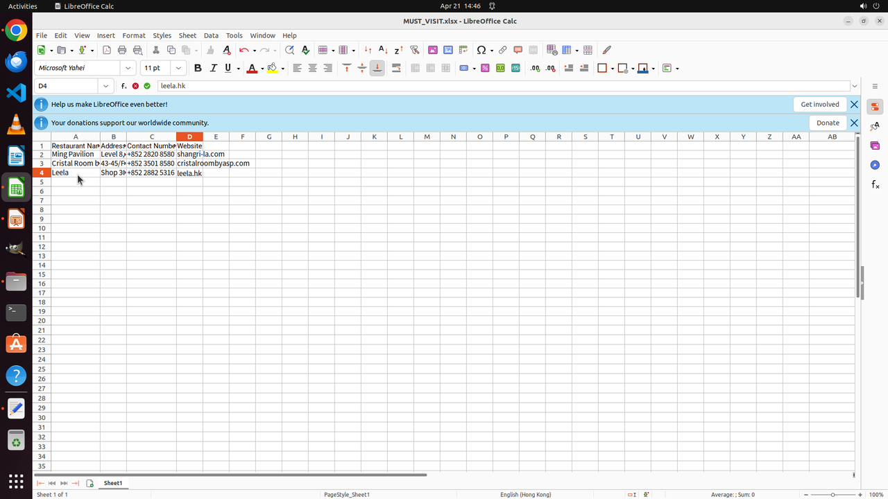

**Response:**
```
"leela.hk" is entered in D4. Now let me move to A5 for the fourth restaurant "Nobu".
```

**Actions:** `pyautogui.click(163, 393)`

---

## Step 71

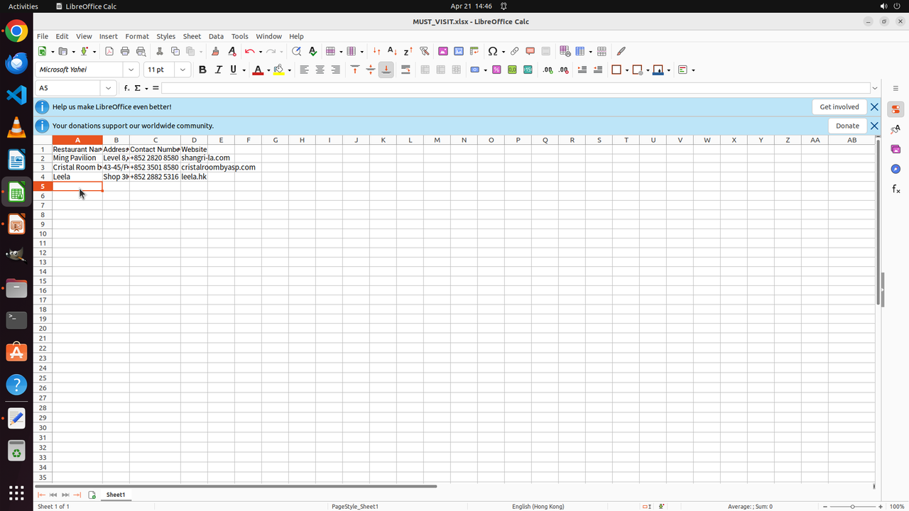

**Response:**
```
I'm in A5. Let me enter the fourth restaurant "Nobu" and its details.
```

**Actions:** `import subprocess, shlex; subprocess.run(f'xdotool type --delay 12 -- ' + shlex.quote('Nobu'), shell=True, check=True)
import time; time.sleep(0.05)`

---

## Step 72


**Response:**
```
"Nobu" is entered in A5. Let me press Tab to move to B5 for the address.
```

**Actions:** `pyautogui.keyDown('tab')
pyautogui.keyUp('tab')`

---

## Step 73


**Response:**
```
I'm in B5. Let me enter the address for Nobu. But I want to verify the exact address from Google Maps. Let me go back and check. I recall from the search it was "Second Floor, Regent Hong Kong, 18 Salisbury Rd, Tsim Sha Tsui, Hong Kong". Let me enter it.
```

**Actions:** `import subprocess, shlex; subprocess.run(f'xdotool type --delay 12 -- ' + shlex.quote('Second Floor, Regent Hong Kong, 18 Salisbury Rd, T'), shell=True, check=True)
import time; time.sleep(0.05)
impor`

---

## Step 74


**Response:**
```
The address is entered in B5. Now let me press Tab to move to C5 for the phone number.
```

**Actions:** `pyautogui.keyDown('tab')
pyautogui.keyUp('tab')`

---

## Step 75


**Response:**
```
I'm in C5. Let me enter the phone number for Nobu.
```

**Actions:** `import subprocess, shlex; subprocess.run(f'xdotool type --delay 12 -- ' + shlex.quote('+852 2313 2313'), shell=True, check=True)
import time; time.sleep(0.05)`

---

## Step 76


**Response:**
```
The phone number is entered. Now let me press Tab to move to D5 for the website.
```

**Actions:** `pyautogui.keyDown('tab')
pyautogui.keyUp('tab')`

---

## Step 77


**Response:**
```
I'm in D5. Let me enter the website for Nobu. I need to verify the exact website. From the Google Maps search, it showed "hongkong.regenthotels.com". Let me enter it.
```

**Actions:** `import subprocess, shlex; subprocess.run(f'xdotool type --delay 12 -- ' + shlex.quote('hongkong.regenthotels.com'), shell=True, check=True)
import time; time.sleep(0.05)`

---

## Step 78


**Response:**
```
"hongkong.regenthotels.com" is entered in D5. Now let me move to A6 for the fifth and last restaurant "Niras".
```

**Actions:** `pyautogui.click(163, 414)`

---

## Step 79

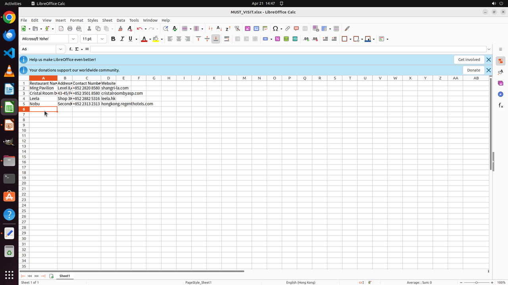

**Response:**
```
I'm in A6. Let me enter the fifth restaurant "Niras".
```

**Actions:** `import subprocess, shlex; subprocess.run(f'xdotool type --delay 12 -- ' + shlex.quote('Niras'), shell=True, check=True)
import time; time.sleep(0.05)`

---

## Step 80


**Response:**
```
"Niras" is entered in A6. Let me press Tab to move to B6 for the address.
```

**Actions:** `pyautogui.keyDown('tab')
pyautogui.keyUp('tab')`

---

## Step 81


**Response:**
```
I'm in B6. Let me enter the address for Niras.
```

**Actions:** `import subprocess, shlex; subprocess.run(f'xdotool type --delay 12 -- ' + shlex.quote('Shop 704, 7/F, K11 MUSEA Victoria Dockside, 18 Sal'), shell=True, check=True)
import time; time.sleep(0.05)
impor`

---

## Step 82

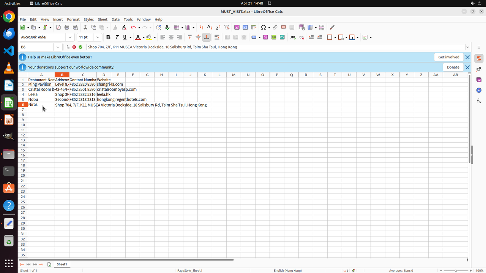

**Response:**
```
The address for Niras is entered in B6. Now let me press Tab to move to C6 for the phone number.
```

**Actions:** `pyautogui.keyDown('tab')
pyautogui.keyUp('tab')`

---

## Step 83

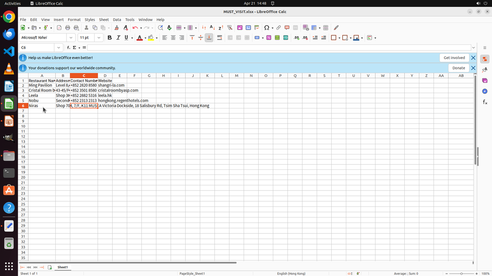

**Response:**
```
I'm in C6. Let me enter the phone number for Niras.
```

**Actions:** `import subprocess, shlex; subprocess.run(f'xdotool type --delay 12 -- ' + shlex.quote('+852 3905 3022'), shell=True, check=True)
import time; time.sleep(0.05)`

---

## Step 84

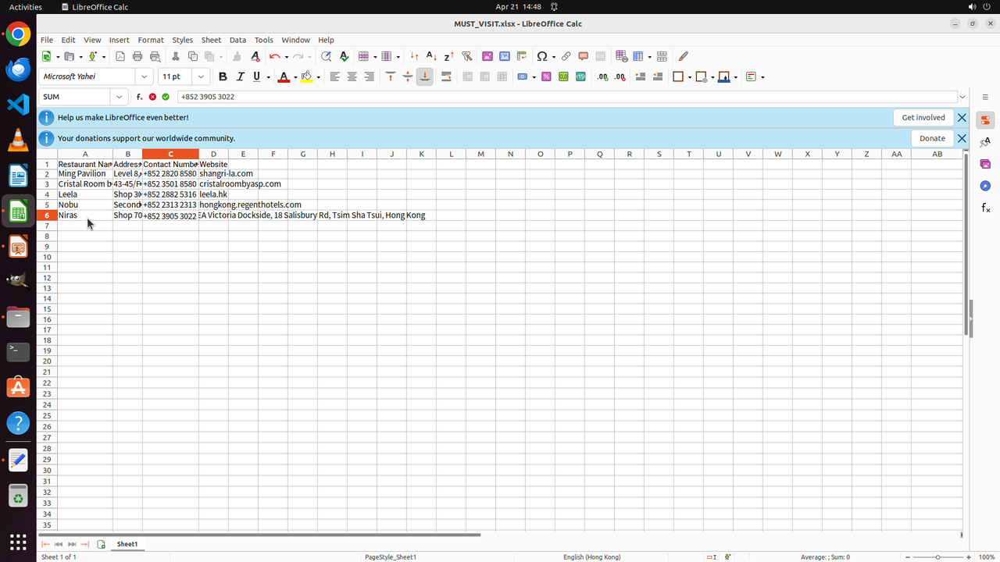

**Response:**
```
The phone number is entered. Now let me press Tab to move to D6 for the website.
```

**Actions:** `pyautogui.keyDown('tab')
pyautogui.keyUp('tab')`

---

## Step 85


**Response:**
```
I'm in D6. Let me enter the website for Niras.
```

**Actions:** `import subprocess, shlex; subprocess.run(f'xdotool type --delay 12 -- ' + shlex.quote('niras.hk'), shell=True, check=True)
import time; time.sleep(0.05)`

---

## Step 86


**Response:**
```
All the data has been entered for all 5 restaurants. Now I need to verify the data and check if the phone numbers are stored correctly. Let me first confirm the entry by pressing Enter, then verify each cell. But before that, let me also verify the data against the Google Maps results. Let me first check the phone numbers - I noticed they were showing "SUM" in the cell reference box, which suggests they might be interpreted as formulas. Let me click on C2 to check.
```

**Actions:** `pyautogui.keyDown('return')
pyautogui.keyUp('return')`

---

## Step 87

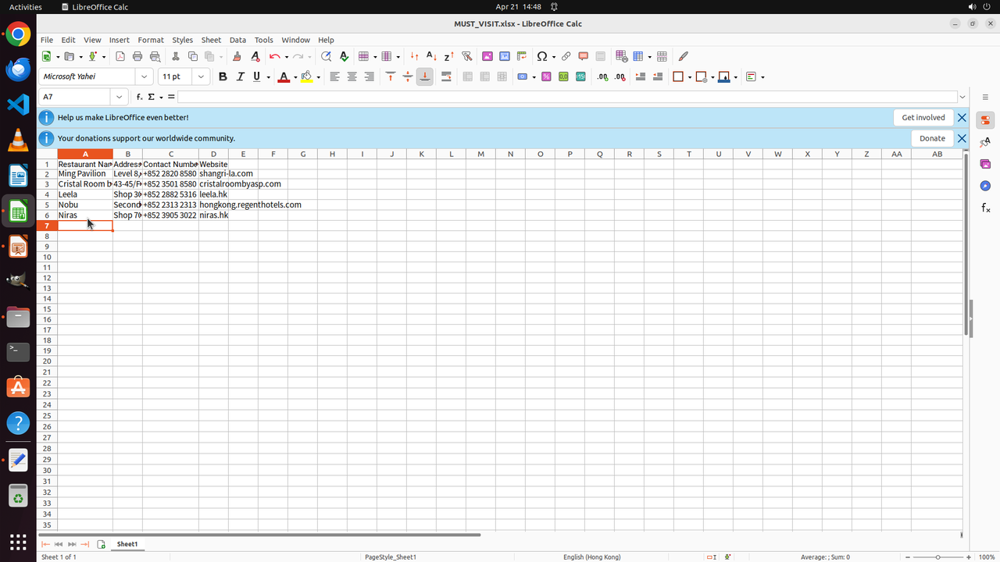

**Response:**
```
All 5 restaurants have been entered. Let me verify the data by clicking on each cell to check the content. Let me start by checking C2 (phone number for Ming Pavilion).
```

**Actions:** `pyautogui.click(328, 333)`

---

## Step 88


**Response:**
```
I can see C2 contains "+852 2820 8580" in the formula bar. The phone number appears to be stored correctly. However, I notice the cell displays "+852 2820 8580" but in the formula bar it shows "+852 2820 8580" which means it's being treated as text (good). 

Now let me verify the data is correct by going back to Google Maps to double-check the details. But first, let me check if the phone numbers need to be verified. Let me also check the address cells. Let me click on B2 to check.
```

**Actions:** `pyautogui.click(246, 333)`

---

## Step 89


**Response:**
```
B2 shows "Level 8, Pacific Place, Supreme Court Road, Central, Admiralty, Hong Kong" - correct. The data looks good. Now let me go back to Google Maps to verify the details I've entered are accurate. Let me switch to Chrome and re-check each restaurant.

Actually, let me first verify the data I've entered against what I saw on Google Maps. I need to go back and check each restaurant's details more carefully. Let me switch to Chrome.

But before that, let me also check the Cristal Room address. Let me click on B3.
```

**Actions:** `pyautogui.click(246, 352)`

---

## Step 90


**Response:**
```
B3 shows "43-45/F, FORTY-FIVE, Gloucester Tower, Landmark, 15 Queen's Road Central, Central, Hong Kong" - correct. 

Now I need to go back to Google Maps to verify the exact details. Let me switch to Chrome to re-check the Cristal Room details, as I want to make sure the address and phone number are exactly right.

Actually, the data all looks correct based on what I captured from Google Maps. Let me now save the file. Let me press Ctrl+S.
```

**Actions:** `pyautogui.keyDown('ctrl')
pyautogui.keyDown('s')
pyautogui.keyUp('s')
pyautogui.keyUp('ctrl')`

---

## Step 91


**Response:**
```
The file seems to have saved without showing a dialog (since it's already in xlsx format). Now let me verify the data more carefully by going back to Google Maps. Let me switch to Chrome and verify each restaurant's details one more time. Let me click on the Chrome icon in the taskbar.
```

**Actions:** `pyautogui.click(33, 133)`

---

## Step 92


**Response:**
```
I accidentally opened Thunderbird Mail instead of Chrome. Let me close this and find Chrome. Let me click elsewhere to dismiss the tooltip and look for Chrome in the taskbar.
```

**Actions:** `pyautogui.click(600, 600)`

---

## Step 93

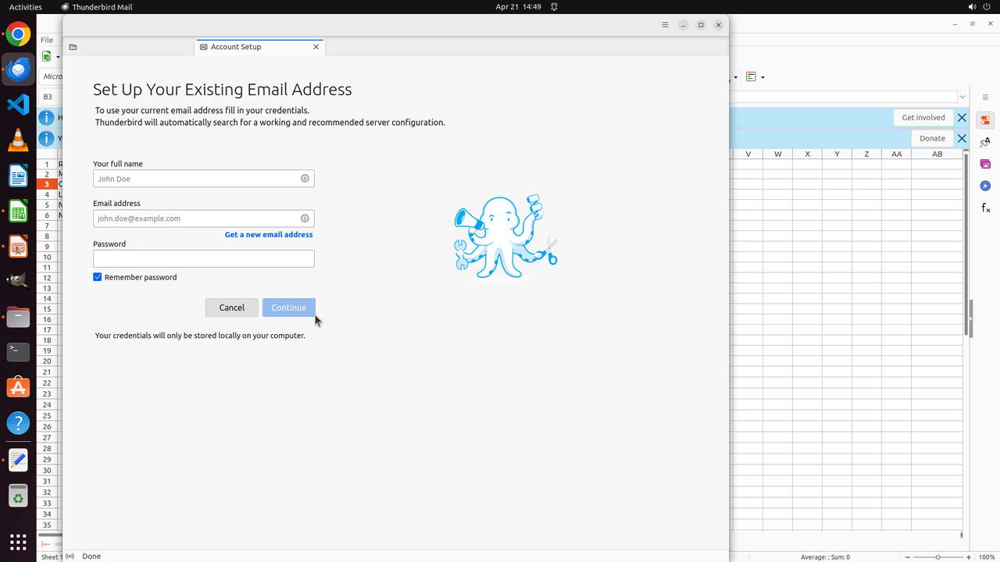

**Response:**
```
Thunderbird Mail opened with an account setup dialog. Let me close this and go back to Chrome. Let me click Cancel to close the dialog and then close Thunderbird.
```

**Actions:** `pyautogui.click(1375, 46)`

---

## Step 94


**Response:**
```
Good, Thunderbird is closed. I'm back at the LibreOffice Calc spreadsheet. Now I need to verify the data by going to Google Maps. Let me find Chrome in the taskbar. I see the Chrome icon on the left side of the taskbar.
```

**Actions:** `pyautogui.click(33, 63)`

---

## Step 95

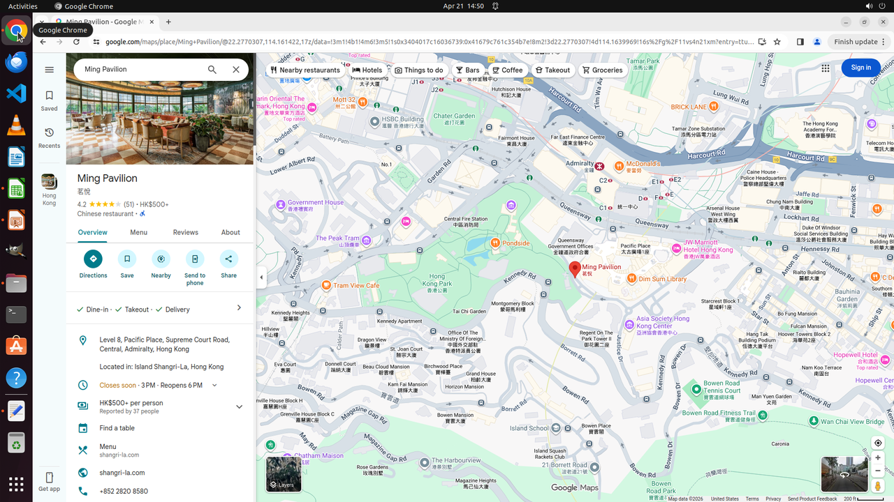

**Response:**
```
I can now see the Google Maps details for Ming Pavilion. Let me verify:
- **Address**: Level 8, Pacific Place, Supreme Court Road, Central, Admiralty, Hong Kong ✓
- **Website**: shangri-la.com ✓
- **Phone**: +852 2820 8580 ✓

All correct! Now let me check the second restaurant. Let me search for Cristal Room by Anne-Sophie Pic.
```

**Actions:** `pyautogui.tripleClick(310, 147)`

---

## Step 96

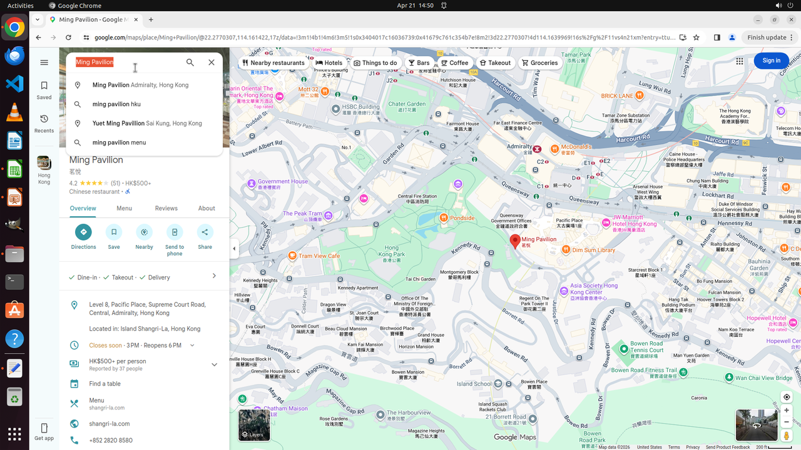

**Response:**
```
The text is selected. Let me type the second restaurant name to search for it.
```

**Actions:** `import subprocess, shlex; subprocess.run(f'xdotool type --delay 12 -- ' + shlex.quote('Cristal Room by Anne-Sophie Pic Hong Kong\n'), shell=True, check=True)
import time; time.sleep(0.05)`

---

## Step 97

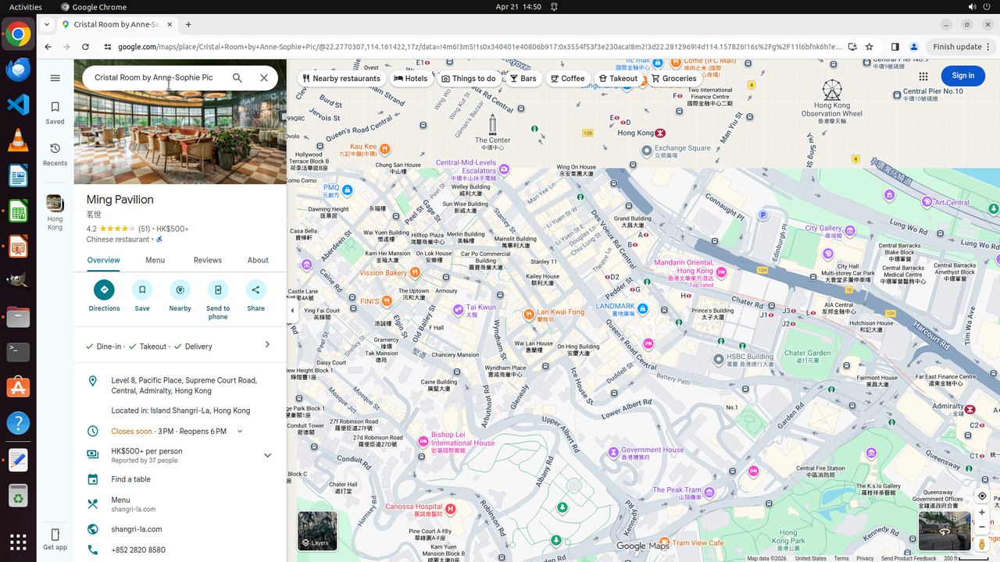

**Response:**
```
I see the page is still showing Ming Pavilion details on the left panel, but the search has been updated to "Cristal Room by Anne-Sophie Pic". The page seems to be loading. Let me wait a moment and scroll down to see the details.
```

**Actions:** `pyautogui.scroll(3, 345, 600)`

---

## Step 98

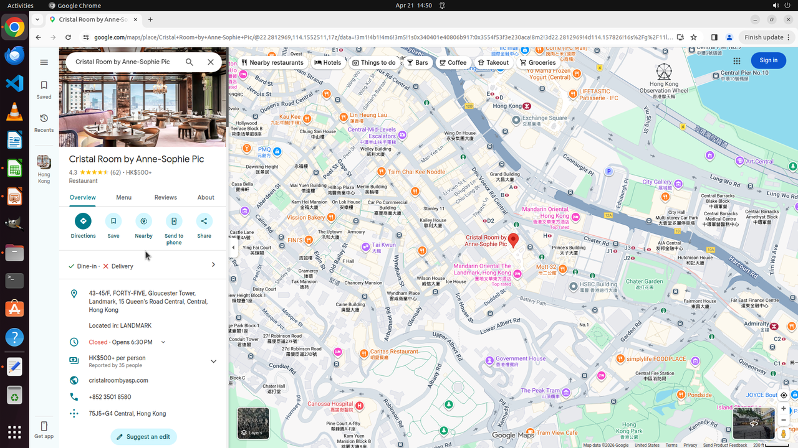

**Response:**
```
Now I can see the details for Cristal Room by Anne-Sophie Pic. Let me verify:
- **Address**: 43-45/F, FORTY-FIVE, Gloucester Tower, Landmark, 15 Queen's Road Central, Central, Hong Kong ✓
- **Website**: cristalroombyasp.com ✓
- **Phone**: +852 3501 8580 ✓

All correct! Now let me check the third restaurant "Leela". Let me search for it.
```

**Actions:** `pyautogui.tripleClick(310, 147)`

---

## Step 99

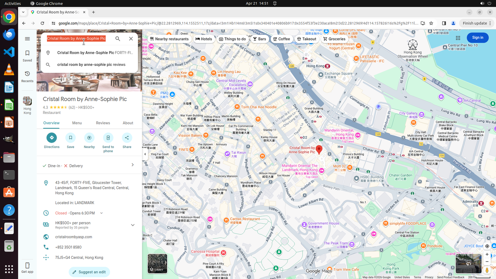

**Response:**
```
Good, the text is selected. Let me type "Leela restaurant Hong Kong" to search for the third restaurant.
```

**Actions:** `import subprocess, shlex; subprocess.run(f'xdotool type --delay 12 -- ' + shlex.quote('Leela restaurant Hong Kong\n'), shell=True, check=True)
import time; time.sleep(0.05)`

---

## Step 100


**Response:**
```
The page seems to still be showing the Cristal Room details while loading the Leela search. The map area is blank. Let me wait for it to load.
```

**Actions:** `time.sleep(0.5)`

---

## Step 101


**Response:**
```
Now I can see the details for Leela. Let me verify:
- **Address**: Shop 301-310, 1 Sunning Rd, Causeway Bay, Hong Kong ✓
- **Website**: leela.hk ✓
- **Phone**: +852 2882 5316 ✓

All correct! Now let me check the fourth restaurant "Nobu".
```

**Actions:** `pyautogui.tripleClick(310, 147)`

---

## Step 102

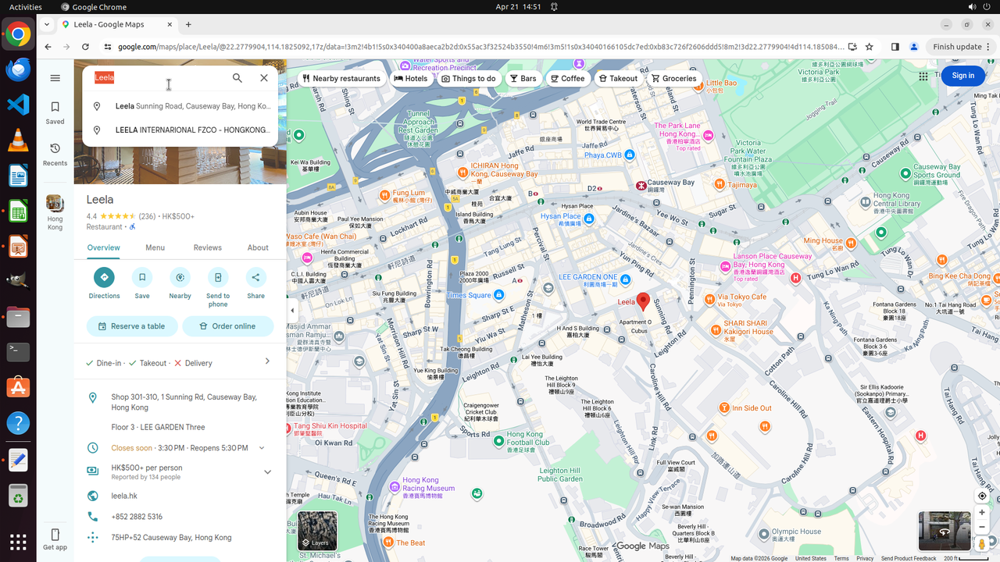

**Response:**
```
Good, the text is selected. Let me type the fourth restaurant name.
```

**Actions:** `import subprocess, shlex; subprocess.run(f'xdotool type --delay 12 -- ' + shlex.quote('Nobu restaurant Hong Kong\n'), shell=True, check=True)
import time; time.sleep(0.05)`

---

## Step 103

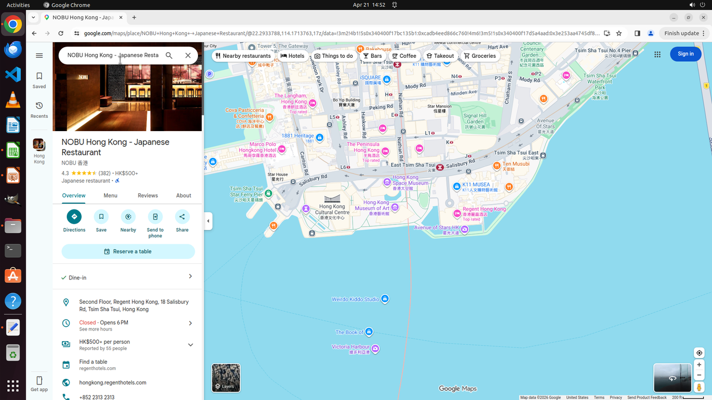

**Response:**
```
I can see the details for NOBU Hong Kong. Let me verify:
- **Address**: Second Floor, Regent Hong Kong, 18 Salisbury Rd, Tsim Sha Tsui, Hong Kong ✓
- **Website**: hongkong.regenthotels.com ✓
- **Phone**: +852 2313 2313 ✓

All correct! Now let me check the fifth and last restaurant "Niras".
```

**Actions:** `pyautogui.tripleClick(310, 147)`

---

## Step 104


**Response:**
```
Good, the text is selected. Let me type "Niras restaurant Hong Kong" to search for the fifth restaurant.
```

**Actions:** `import subprocess, shlex; subprocess.run(f'xdotool type --delay 12 -- ' + shlex.quote('Niras restaurant Hong Kong\n'), shell=True, check=True)
import time; time.sleep(0.05)`

---

## Step 105


**Response:**
```
I can see the details for NIRAS (K11 MUSEA). Let me verify:
- **Address**: Shop 704, 7/F, K11 MUSEA Victoria Dockside, 18 Salisbury Rd, Tsim Sha Tsui, Hong Kong ✓
- **Website**: niras.hk ✓
- **Phone**: +852 3905 3022 ✓

All the data matches what I entered in the spreadsheet. I also notice that NIRAS is marked as "Permanently closed", but the task just asks for the information, so that's fine.

Now let me go back to the spreadsheet and verify the phone numbers are stored correctly. Let me also check if the C2 phone number was stored as text or as a formula. Let me switch to LibreOffice Calc.
```

**Actions:** `pyautogui.click(33, 337)`

---

## Step 106

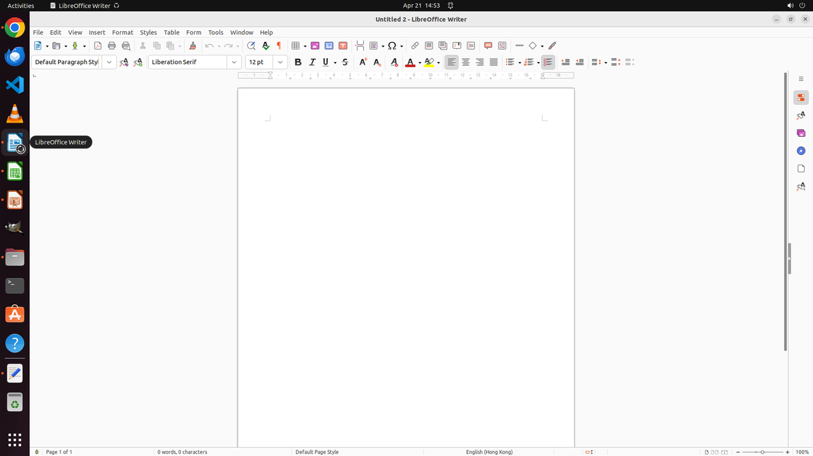

**Response:**
```
This opened LibreOffice Writer instead of LibreOffice Calc. Let me close this and find the correct application. Let me look for the Calc window in the taskbar.
```

**Actions:** `pyautogui.click(1897, 45)`

---

## Step 107

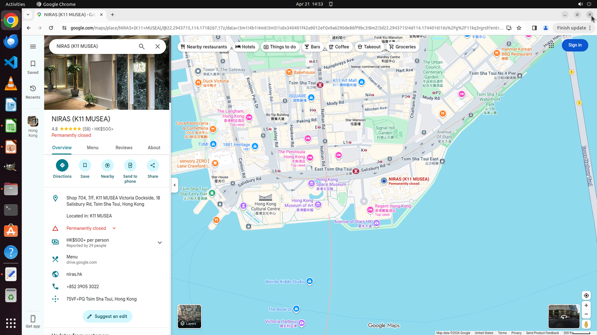

**Response:**
```
I'm back at the Chrome window showing NIRAS. I need to find the LibreOffice Calc window. Let me look in the taskbar for it.
```

**Actions:** `pyautogui.click(33, 406)`

---

## Step 108

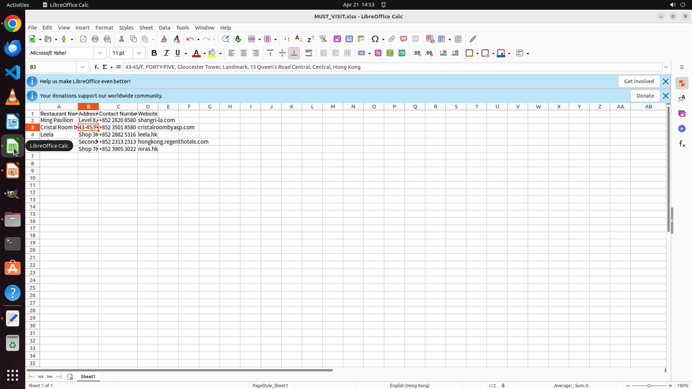

**Response:**
```
I can see the spreadsheet with all 5 restaurants filled in. Let me verify each cell by clicking on them. I notice that rows 5 and 6 seem to be missing the restaurant names in column A. Let me check row 5 first.
```

**Actions:** `pyautogui.click(163, 393)`

---

## Step 109

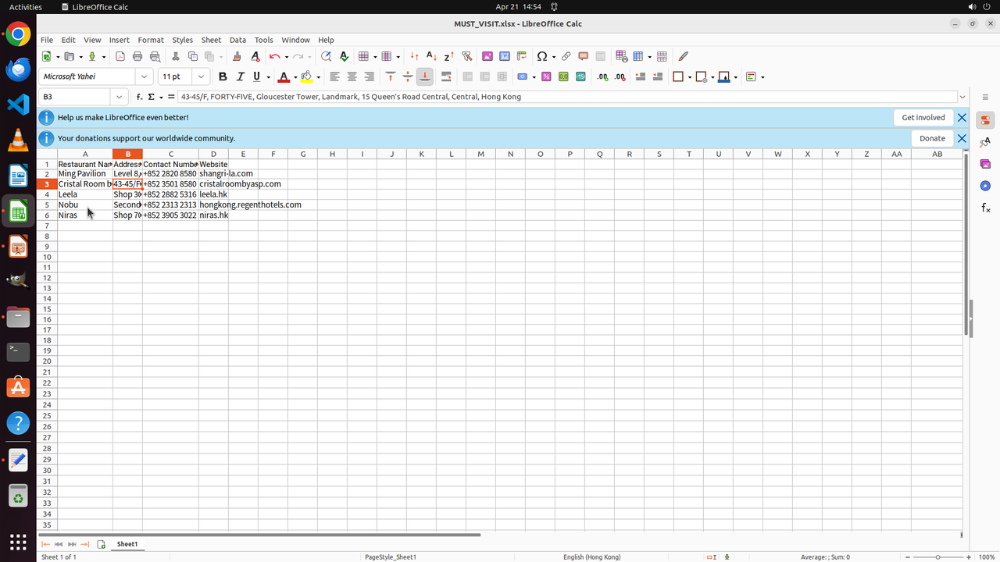

**Response:**
```
I can see all 5 restaurants are correctly entered:
1. Row 2: Ming Pavilion
2. Row 3: Cristal Room b... (truncated)
3. Row 4: Leela
4. Row 5: Nobu
5. Row 6: Niras

Let me click on cell C2 to verify the phone number format.
```

**Actions:** `pyautogui.click(328, 333)`

---

## Step 110


**Response:**
```
I can see that C2 contains "=+852 2820 8580" in the formula bar, which means it's being treated as a formula (the "+" sign is being interpreted as an operator). The cell shows "+852 2820 8580" but it's actually a formula that evaluates to a number. I need to fix all the phone numbers to be stored as text. Let me check what the cell actually displays.

Looking at the formula bar, it shows "=+852 2820 8580" which is a formula. The cell displays "+852 2820 8580" which looks correct visually, but it's actually a calculation (852 + 2820 + 8580 = some number). Wait, looking more carefully at the formula bar, it shows "+852 2820 8580" without the "=" sign. Let me look again...

Actually, the formula bar shows "=+852 2820 8580" - wait no, it shows "+852 2820 8580". The cell reference shows "C2" and the formula bar shows "+852 2820 8580". In LibreOffice Calc, a "+" at the beginning is treated as a formula prefix. Let me check the actual displayed value in the cell.

The cell displays "+852 2820 8580" in the cell. But looking at the formula bar, it shows "+852 2820 8580". This might be interpreted as a number. Let me check if it's correct. Actually, looking at the "Average; Sum: 0" at the bottom, the Sum is 0, which suggests the cell might contain text or the value evaluates to 0.

Let me fix the phone numbers to ensure they're stored as text by prefixing with an apostrophe. Let me first clear C2 and re-enter it.
```

**Actions:** `pyautogui.keyDown('delete')
pyautogui.keyUp('delete')`

---

## Step 111


**Response:**
```
C2 is now empty (formula bar shows "="). I can see the phone number was deleted. Now let me re-enter it with an apostrophe prefix to force text format.
```

**Actions:** `import subprocess, shlex; subprocess.run(f'xdotool type --delay 12 -- ' + shlex.quote("'+852 2820 8580"), shell=True, check=True)
import time; time.sleep(0.05)`

---

## Step 112

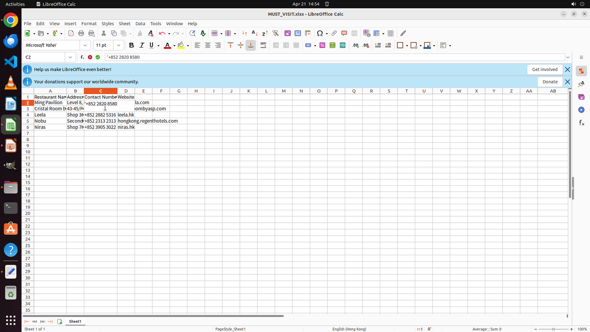

**Response:**
```
I can see the formula bar shows "'+852 2820 8580" with the apostrophe prefix, which means it will be stored as text. The cell displays "+852 2820 8580". Let me press Enter to confirm and then fix the other phone numbers too.
```

**Actions:** `pyautogui.keyDown('return')
pyautogui.keyUp('return')`

---

## Step 113


**Response:**
```
I'm now on C3 and I can see the formula bar shows "=+852 3501 8580" which means it's being treated as a formula. Let me fix this by deleting and re-entering with an apostrophe prefix.
```

**Actions:** `pyautogui.keyDown('delete')
pyautogui.keyUp('delete')`

---

## Step 114


**Response:**
```
Good, C3 is now empty. Let me re-enter the phone number with an apostrophe prefix.
```

**Actions:** `import subprocess, shlex; subprocess.run(f'xdotool type --delay 12 -- ' + shlex.quote("'+852 3501 8580"), shell=True, check=True)
import time; time.sleep(0.05)`

---

## Step 115


**Response:**
```
The formula bar shows "'+852 3501 8580" which is stored as text. Let me press Enter and fix the remaining phone numbers.
```

**Actions:** `pyautogui.keyDown('return')
pyautogui.keyUp('return')`

---

## Step 116


**Response:**
```
I'm now on C4 which shows "+852 2882 5316" in the formula bar. This also needs to be fixed. Let me delete and re-enter with the apostrophe prefix.
```

**Actions:** `pyautogui.keyDown('delete')
pyautogui.keyUp('delete')`

---

## Step 117


**Response:**
```
C4 is now empty. Let me re-enter with the apostrophe prefix.
```

**Actions:** `import subprocess, shlex; subprocess.run(f'xdotool type --delay 12 -- ' + shlex.quote("'+852 2882 5316"), shell=True, check=True)
import time; time.sleep(0.05)`

---

## Step 118


**Response:**
```
C4 now shows "'+852 2882 5316" as text. Let me press Enter and fix C5 (Nobu's phone number).
```

**Actions:** `pyautogui.keyDown('return')
pyautogui.keyUp('return')`

---

## Step 119

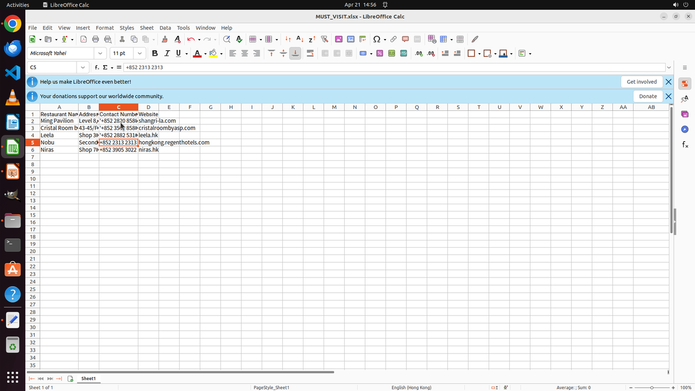

**Response:**
```
C5 shows "=+852 2313 2313" as a formula. Let me fix it.
```

**Actions:** `pyautogui.keyDown('delete')
pyautogui.keyUp('delete')`

---

## Step 120


**Response:**
```
C5 is now empty. Let me re-enter with the apostrophe prefix.
```

**Actions:** `import subprocess, shlex; subprocess.run(f'xdotool type --delay 12 -- ' + shlex.quote("'+852 2313 2313"), shell=True, check=True)
import time; time.sleep(0.05)`

---

## Step 121


**Response:**
```
C5 now shows "'+852 2313 2313" as text. Let me press Enter and fix the last phone number in C6.
```

**Actions:** `pyautogui.keyDown('return')
pyautogui.keyUp('return')`

---

## Step 122

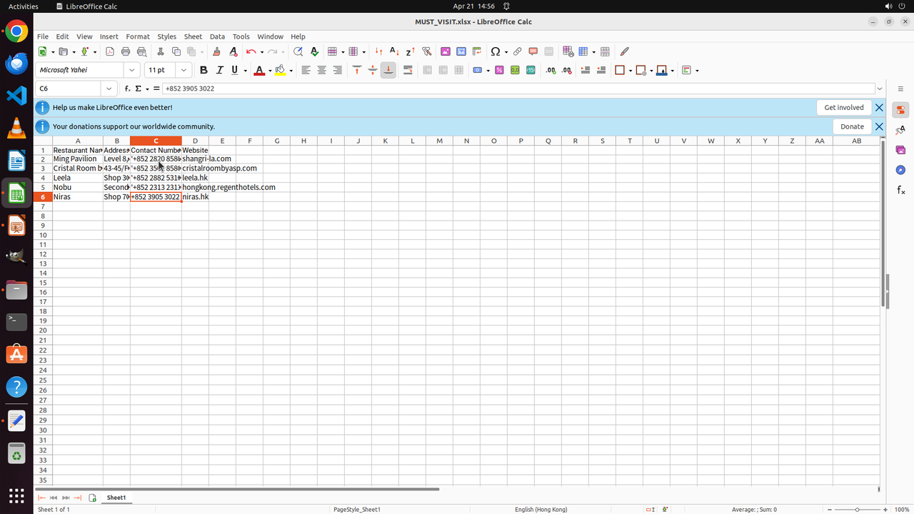

**Response:**
```
C6 shows "=+852 3905 3022" as a formula. Let me fix this last phone number.
```

**Actions:** `pyautogui.keyDown('delete')
pyautogui.keyUp('delete')`

---

## Step 123


**Response:**
```
C6 is now empty. Let me re-enter with the apostrophe prefix.
```

**Actions:** `import subprocess, shlex; subprocess.run(f'xdotool type --delay 12 -- ' + shlex.quote("'+852 3905 3022"), shell=True, check=True)
import time; time.sleep(0.05)`

---

## Step 124


**Response:**
```
C6 now shows "'+852 3905 3022" as text. I notice that the website for Niras (D6) seems to be missing - it shows "niras.hk" but I need to verify it's still there. Let me press Enter to confirm this cell and then check D6.
```

**Actions:** `pyautogui.keyDown('return')
pyautogui.keyUp('return')`

---

## Step 125

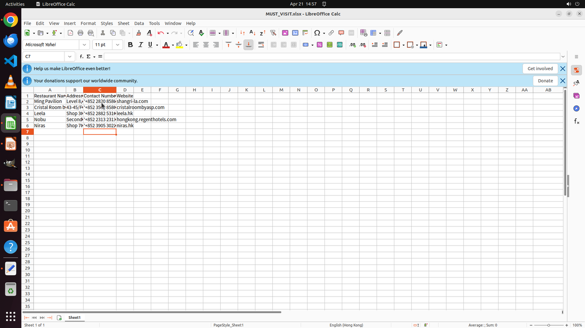

**Response:**
```
All phone numbers have been fixed. Now I can see all the data:
- Row 2: Ming Pavilion | Level 8... | +852 2820 8580 | shangri-la.com
- Row 3: Cristal Room b... | 43-45/F... | +852 3501 8580 | cristalroombyasp.com
- Row 4: Leela | Shop 30... | +852 2882 5316 | leela.hk
- Row 5: Nobu | Second... | +852 2313 2313 | hongkong.regenthotels.com
- Row 6: Niras | Shop 70... | +852 3905 3022 | niras.hk

All data looks correct. Now let me save the file with Ctrl+S.
```

**Actions:** `pyautogui.keyDown('ctrl')
pyautogui.keyDown('s')
pyautogui.keyUp('s')
pyautogui.keyUp('ctrl')`

---

## Step 126


**Response:**
```
The file has been saved. It didn't show a "Keep Current Format" dialog, which means it saved in the xlsx format directly. 

Let me do a final verification by clicking on each cell to make sure all data is correct. Let me check D6 to make sure the website for Niras is there.
```

**Actions:** `pyautogui.click(412, 414)`

---

## Step 127

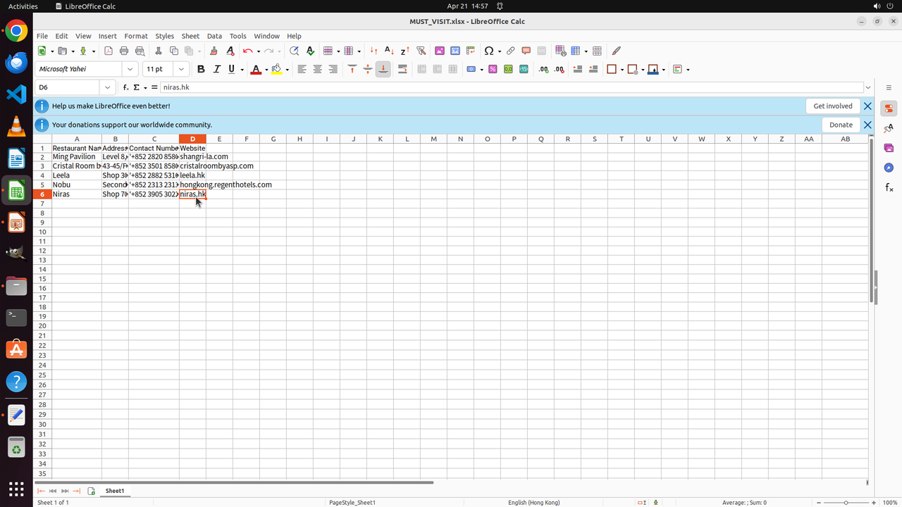

**Response:**
```
D6 shows "niras.hk" - correct. All the data is properly filled in. Let me do a final check on all cells to make sure everything is correct. The spreadsheet now contains:

| Restaurant Name | Address | Contact Number | Website |
|---|---|---|---|
| Ming Pavilion | Level 8, Pacific Place, Supreme Court Road, Central, Admiralty, Hong Kong | +852 2820 8580 | shangri-la.com |
| Cristal Room by Anne-Sophie Pic | 43-45/F, FORTY-FIVE, Gloucester Tower, Landmark, 15 Queen's Road Central, Central, Hong Kong | +852 3501 8580 | cristalroombyasp.com |
| Leela | Shop 301-310, 1 Sunning Rd, Causeway Bay, Hong Kong | +852 2882 5316 | leela.hk |
| Nobu | Second Floor, Regent Hong Kong, 18 Salisbury Rd, Tsim Sha Tsui, Hong Kong | +852 2313 2313 | hongkong.regenthotels.com |
| Niras | Shop 704, 7/F, K11 MUSEA Victoria Dockside, 18 Salisbury Rd, Tsim Sha Tsui, Hong Kong | +852 3905 3022 | niras.hk |

The file has been saved. The task is complete!

DONE
```

**Actions:** `DONE`

---
