# Task d9b7c649-c975-4f53-88f5-940b29c47247

**Instruction:** Help me extract the latest 5 emails in daily folder from Thunderbird, from the earliest to the most recent by time, and creates a LibreOffice Calc Report "report.xlsx" in the desktop, storing the sender_name, sender_address, subject, CC, and number_of_attachments.

**Score:** 1.0

**Wall clock:** 7m 7s

**Steps:** 26

**Cost:** $0.98

---

## Step 1

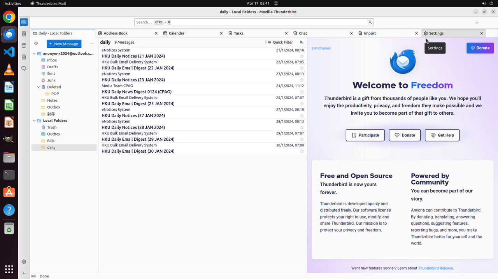

**Response:**
```
I can see the Thunderbird email client is open with the "daily" folder selected, showing 9 messages. I need to extract the latest 5 emails (by date), sorted from earliest to most recent. Let me first examine each of the latest 5 emails to get their details.

The 9 emails are listed chronologically. The latest 5 would be:
1. HKU Daily Email Digest (25 JAN 2024) - 25/1/2024
2. HKU Daily Notices (27 JAN 2024) - 27/1/2024
3. HKU Daily Notices (28 JAN 2024) - 28/1/2024
4. HKU Daily Email Digest (29 JAN 2024) - 29/1/2024
5. HKU Daily Email Digest (30 JAN 2024) - 30/1/2024

Let me click on each email to get the details. Starting with the 5th from the bottom:
```

**Actions:** `pyautogui.click(531, 400)`

---

## Step 2

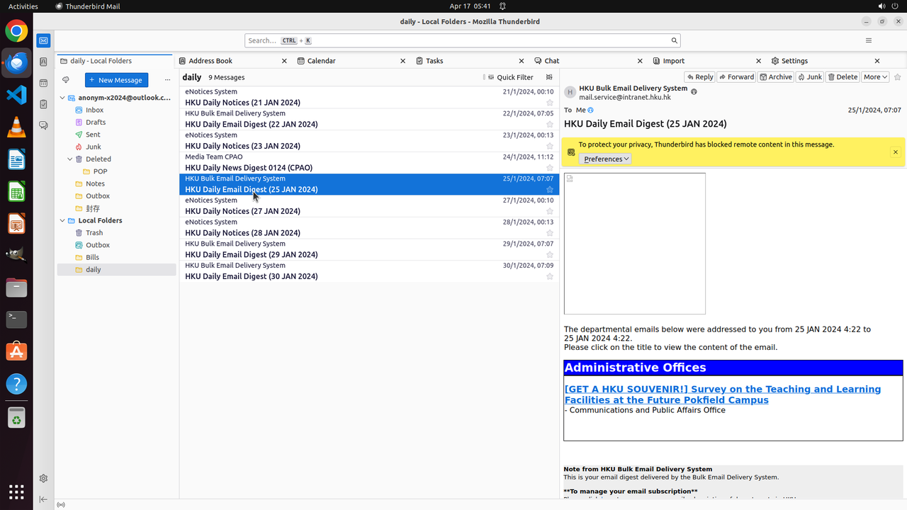

**Response:**
```
I can see the first email details. Let me note down the information for "HKU Daily Email Digest (25 JAN 2024)":
- Sender name: HKU Bulk Email Delivery System
- Sender address: mail.service@intranet.hku.hk
- Subject: HKU Daily Email Digest (25 JAN 2024)
- CC: Need to check
- Attachments: I see an attachment icon, need to verify

I need to check if there's a CC field. I don't see one displayed, which likely means there's no CC. Let me also check the attachment count. I see what appears to be an attachment icon. Let me look more carefully by checking the email headers. Let me click on the "More" button to see full headers.

Let me now check the next email. But first, let me see if I can get more details about this email. I notice the "To Me" with a small icon next to it. Let me click on that to expand headers.
```

**Actions:** `pyautogui.click(1249, 232)`

---

## Step 3

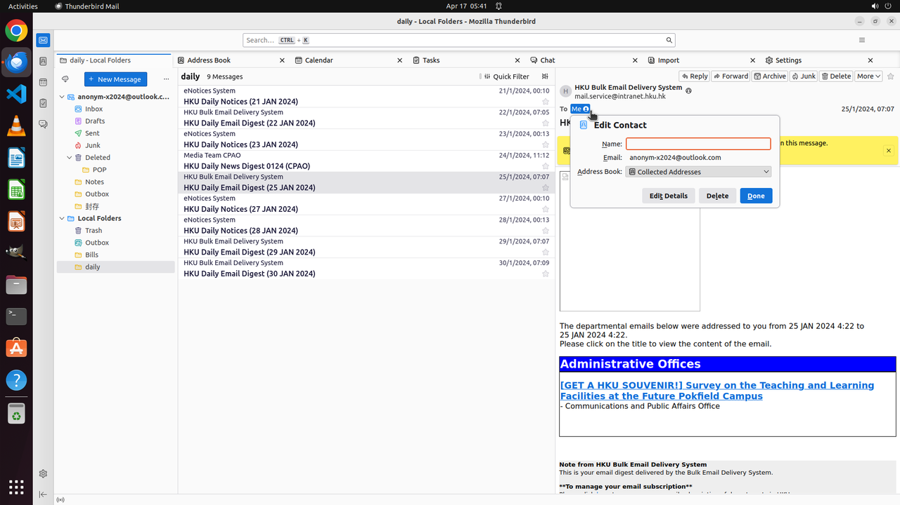

**Response:**
```
I see a contact edit popup appeared. Let me close this and instead look at the email headers properly. Let me click "Done" to close this popup.
```

**Actions:** `pyautogui.click(1609, 418)`

---

## Step 4


**Response:**
```
Good, the popup is closed. Now I need to view the full headers of this email to check for CC and attachments. Let me click on "More" to see more options, or I can use the View Source to get full details. Let me click on "More" button.
```

**Actions:** `pyautogui.click(1848, 162)`

---

## Step 5

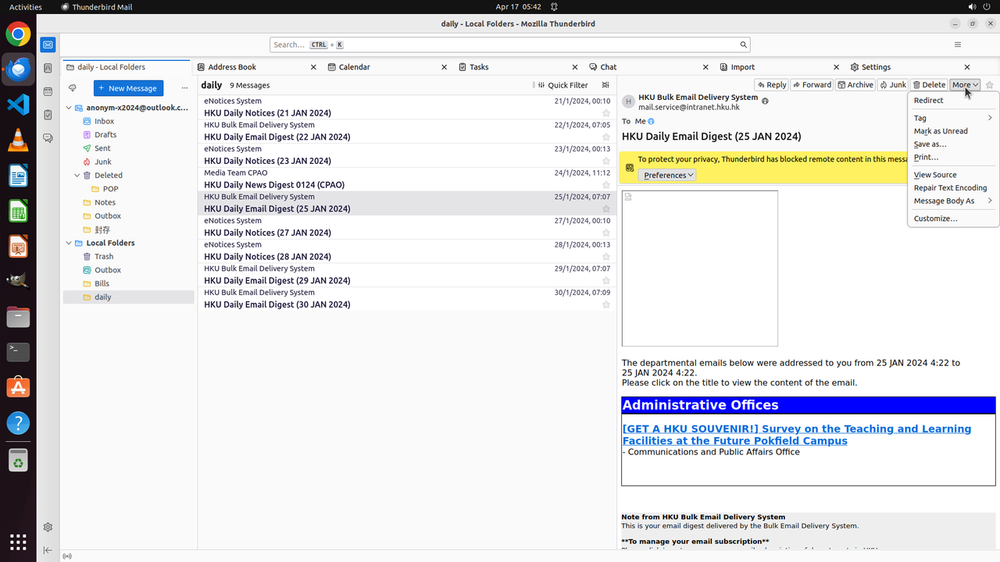

**Response:**
```
I can see the "More" menu. Let me click on "View Source" to see the full email headers which will show CC and attachment information.
```

**Actions:** `pyautogui.click(1794, 334)`

---

## Step 6

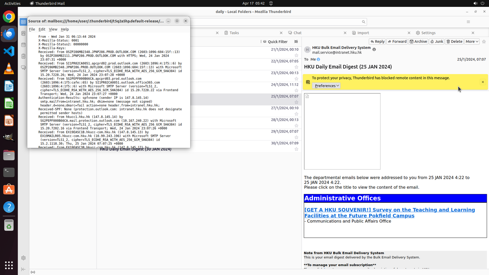

**Response:**
```
I can see the email source. I need to scroll down to find the CC, Subject, and Content-Type (for attachments) headers. Let me scroll down in this source window to find the relevant headers.
```

**Actions:** `pyautogui.scroll(-5, 420, 375)`

---

## Step 7

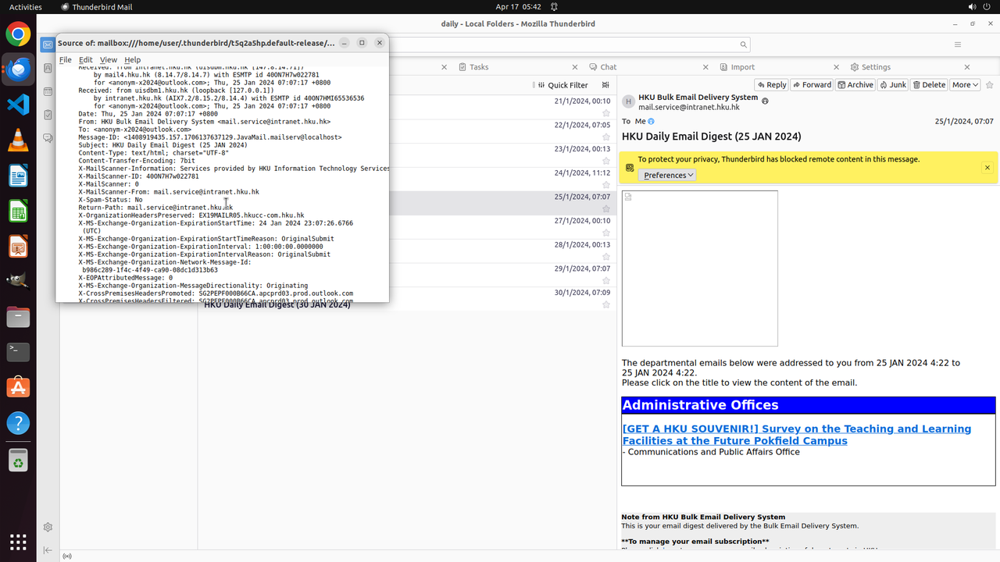

**Response:**
```
Now I can see the important headers for this email. Let me note the details:

- **From**: HKU Bulk Email Delivery System <mail.service@intranet.hku.hk>
- **To**: <anonym-x2024@outlook.com>
- **Subject**: HKU Daily Email Digest (25 JAN 2024)
- **Content-Type**: text/html; charset="UTF-8"
- No CC field visible
- No attachments (it's just text/html content)

Now let me close this source window and check the next email. Let me also use `Ctrl+U` to search for "cc" in the source to make sure.

Let me use Ctrl+F to search for "Cc:" in the source.
```

**Actions:** `pyautogui.keyDown('ctrl')
pyautogui.keyDown('f')
pyautogui.keyUp('f')
pyautogui.keyUp('ctrl')`

---

## Step 8

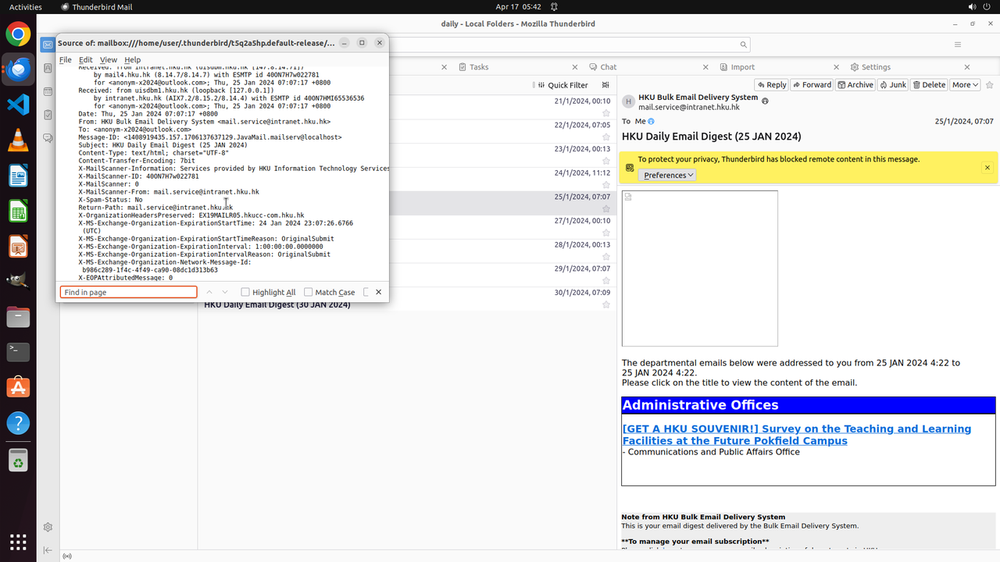

**Response:**
```
Good, the find bar is open. Let me search for "Cc:" to check if there's a CC field.
```

**Actions:** `import subprocess, shlex; subprocess.run(f'xdotool type --delay 12 -- ' + shlex.quote('Cc:'), shell=True, check=True)
import time; time.sleep(0.05)`

---

## Step 9

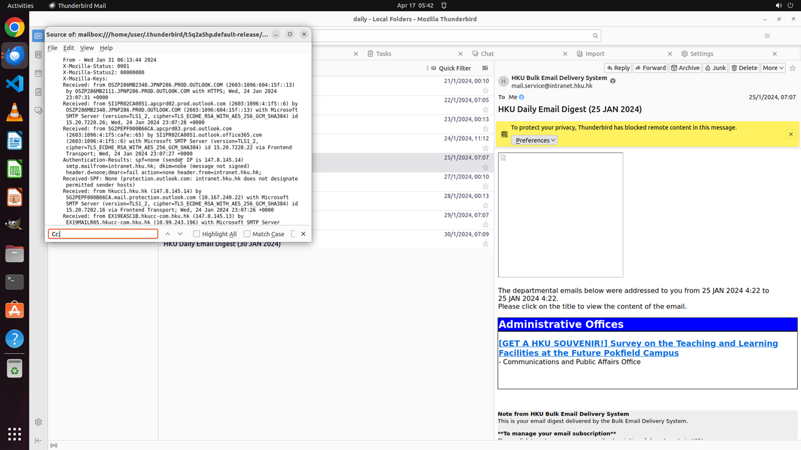

**Response:**
```
I see the search is at the top of the document. It seems like "Cc:" wasn't found highlighted. The search field shows "Cc:" but I don't see any highlighted match. Let me check if there's a "Phrase not found" message. Let me also search for "attachment" to check for attachments.

Let me take a more efficient approach. Instead of manually checking each email through the GUI, let me use a script to parse the emails from the Thunderbird mail storage and create the report. Let me close this source window and open a terminal.
```

**Actions:** `pyautogui.click(726, 561)`

---

## Step 10

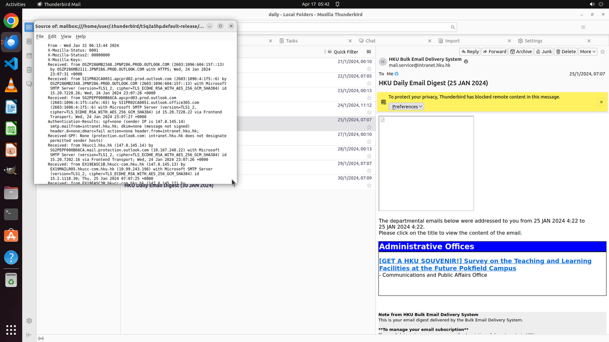

**Response:**
```
Let me close this source window and use a more efficient approach - I'll write a Python script to parse the emails and create the report.
```

**Actions:** `pyautogui.click(726, 82)`

---

## Step 11


**Response:**
```
Good, the source window is closed. Now let me open a terminal to write a Python script to parse the emails. Let me right-click on the desktop to open a terminal, or find the terminal application.
```

**Actions:** `pyautogui.keyDown('ctrl')
pyautogui.keyDown('alt')
pyautogui.keyDown('t')
pyautogui.keyUp('t')
pyautogui.keyUp('alt')
pyautogui.keyUp('ctrl')`

---

## Step 12

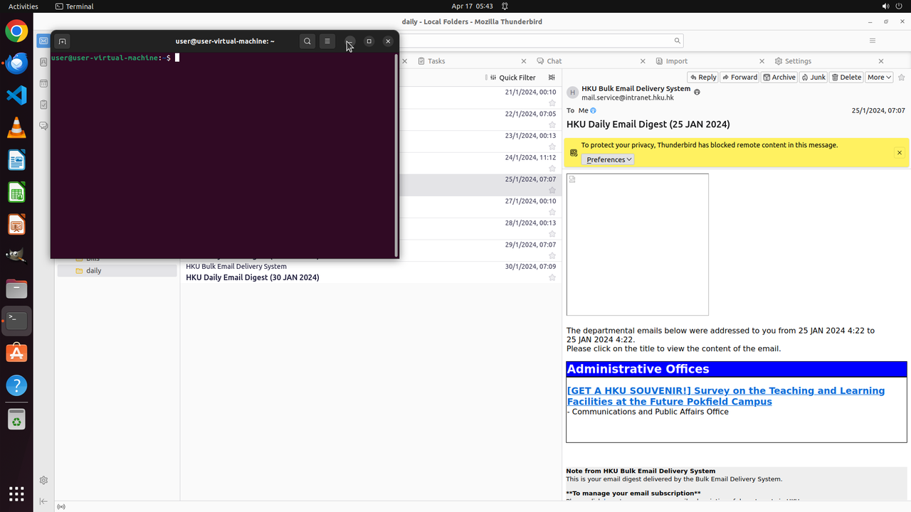

**Response:**
```
The terminal is open. Now let me first find the Thunderbird mail storage location for the "daily" folder and then write a Python script to parse the emails and create the report.
```

**Actions:** `import subprocess, shlex; subprocess.run(f'xdotool type --delay 12 -- ' + shlex.quote('find /home/user/.thunderbird -name "daily" -o -nam'), shell=True, check=True)
import time; time.sleep(0.05)
impor`

---

## Step 13


**Response:**
```
I found the mail storage. The "daily" folder is at:
`/home/user/.thunderbird/t5q2a5hp.default-release/Mail/Local Folders/daily`

Now let me write a Python script to parse this mbox file and extract the information for the latest 5 emails.
```

**Actions:** `import subprocess, shlex; subprocess.run(f'xdotool type --delay 12 -- ' + shlex.quote("python3 << 'EOF'\nimport mailbox\nimport email\nfrom "), shell=True, check=True)
import time; time.sleep(0.05)
im`

---

## Step 14

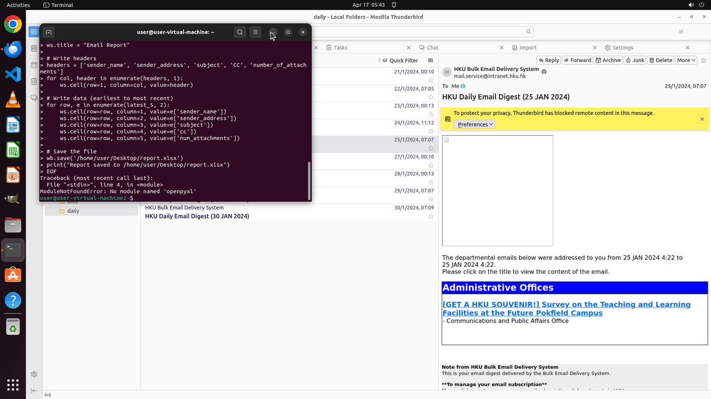

**Response:**
```
I see the error - `openpyxl` module is not installed. Let me install it first.
```

**Actions:** `import subprocess, shlex; subprocess.run(f'xdotool type --delay 12 -- ' + shlex.quote('pip3 install openpyxl\n'), shell=True, check=True)
import time; time.sleep(0.05)`

---

## Step 15

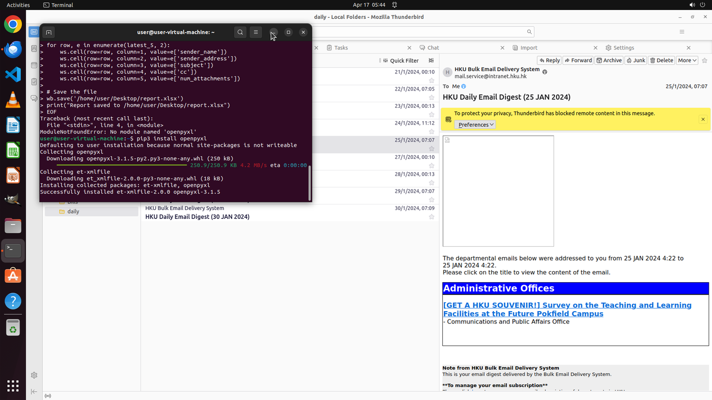

**Response:**
```
`openpyxl` is now installed. Let me run the Python script again.
```

**Actions:** `import subprocess, shlex; subprocess.run(f'xdotool type --delay 12 -- ' + shlex.quote("python3 << 'EOF'\nimport mailbox\nimport email\nfrom "), shell=True, check=True)
import time; time.sleep(0.05)
im`

---

## Step 16

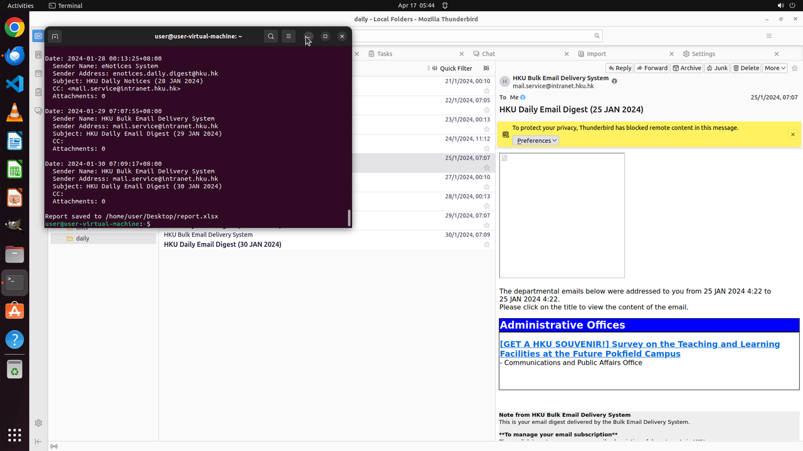

**Response:**
```
The script ran successfully. I can see the output for the last few emails. Let me scroll up to see all 5 emails that were extracted.
```

**Actions:** `pyautogui.scroll(5, 450, 300)`

---

## Step 17


**Response:**
```
Now I can see all 5 emails. Let me verify the data:

1. **Date: 2024-01-25** - HKU Bulk Email Delivery System, mail.service@intranet.hku.hk, Subject: HKU Daily Email Digest (25 JAN 2024), CC: (empty), Attachments: 0

2. **Date: 2024-01-27** - eNotices System, enotices.daily.digest@hku.hk, Subject: HKU Daily Notices (27 JAN 2024), CC: <mail.service@intranet.hku.hk>, Attachments: 0

3. **Date: 2024-01-28** - eNotices System, enotices.daily.digest@hku.hk, Subject: HKU Daily Notices (28 JAN 2024), CC: <mail.service@intranet.hku.hk>, Attachments: 0

4. **Date: 2024-01-29** - HKU Bulk Email Delivery System, mail.service@intranet.hku.hk, Subject: HKU Daily Email Digest (29 JAN 2024), CC: (empty), Attachments: 0

5. **Date: 2024-01-30** - HKU Bulk Email Delivery System, mail.service@intranet.hku.hk, Subject: HKU Daily Email Digest (30 JAN 2024), CC: (empty), Attachments: 0

The report has been saved. But I notice the CC field contains angle brackets like `<mail.service@intranet.hku.hk>`. Let me verify the report was created correctly by opening it. But first, let me check if the CC values in the report look correct. Let me also verify by looking at the emails in Thunderbird to cross-check.

Let me verify the report content:
```

**Actions:** `import subprocess, shlex; subprocess.run(f'xdotool type --delay 12 -- ' + shlex.quote('python3 -c "\nimport openpyxl\nwb = openpyxl.load_wo'), shell=True, check=True)
import time; time.sleep(0.05)
imp`

---

## Step 18


**Response:**
```
I can see the report content. The data looks good but I notice a couple of things:

1. The CC field for emails without CC shows `None` instead of empty string. Let me fix this.
2. The CC field for emails with CC shows `<mail.service@intranet.hku.hk>` with angle brackets.

Let me also verify the emails by checking them in Thunderbird. But first, let me look at the CC values more carefully. I see that for rows 1, 4, and 5, the CC is `None` (which should be empty), and for rows 2 and 3, it shows `<mail.service@intranet.hku.hk>`.

Let me fix the None values and also clean up the CC field:
```

**Actions:** `import subprocess, shlex; subprocess.run(f'xdotool type --delay 12 -- ' + shlex.quote("python3 << 'EOF'\nimport mailbox\nimport email\nfrom "), shell=True, check=True)
import time; time.sleep(0.05)
im`

---

## Step 19

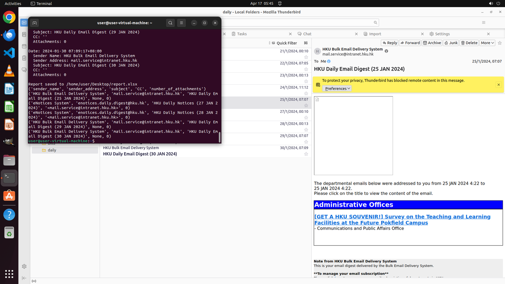

**Response:**
```
I can see the report is created. However, I notice the CC fields still show `None` for some entries. Looking at the verification output, I see that the CC column shows `None` for emails 1, 4, and 5 (which have no CC), and `<mail.service@intranet.hku.hk>` for emails 2 and 3. The `None` should be empty string. Let me check the issue - it seems the empty string `''` is being saved as `None` in openpyxl. Let me verify this by checking the actual CC values more carefully.

Wait, looking at the output again, I see that the CC values in the verification are showing `None` which means the empty string `''` is being stored as `None` by openpyxl. That's actually fine - in Excel, an empty cell would show as `None` when read back. But let me also verify by checking the Thunderbird emails to make sure the CC data matches.

Let me now verify the data against the Thunderbird emails by clicking on each of the 5 emails. But first, let me check the HKU Daily Notices (27 JAN 2024) and (28 JAN 2024) emails in Thunderbird to confirm the CC field.
```

**Actions:** `pyautogui.click(990, 45)`

---

## Step 20

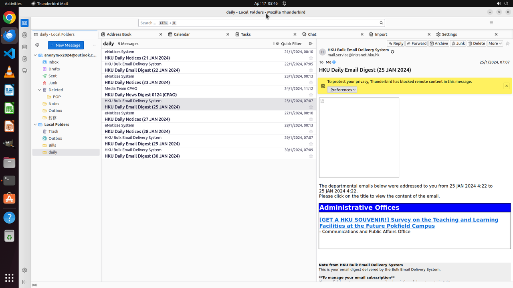

**Response:**
```
Good, I can see the Thunderbird mail client with the daily folder. Let me click on "HKU Daily Notices (27 JAN 2024)" to verify the CC field.
```

**Actions:** `pyautogui.click(531, 447)`

---

## Step 21

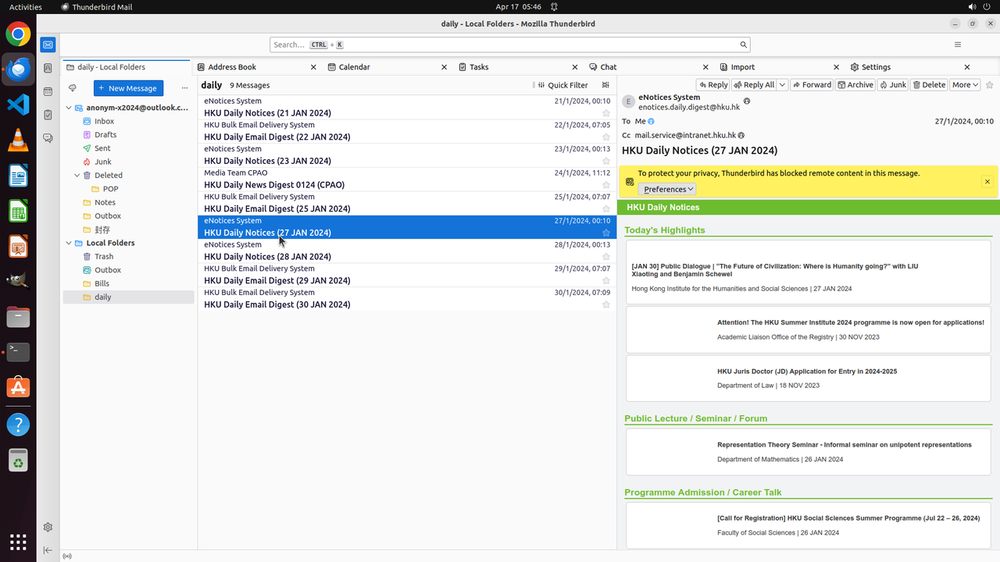

**Response:**
```
I can see the email "HKU Daily Notices (27 JAN 2024)" with:
- From: eNotices System, enotices.daily.digest@hku.hk
- To: Me
- CC: mail.service@intranet.hku.hk
- Subject: HKU Daily Notices (27 JAN 2024)

The CC field shows `mail.service@intranet.hku.hk` which matches our report data. The report has `<mail.service@intranet.hku.hk>` with angle brackets from the raw header. Let me clean that up. Let me also check a few more emails and then fix the report.

Let me click on "HKU Daily Notices (28 JAN 2024)" to verify:
```

**Actions:** `pyautogui.click(531, 492)`

---

## Step 22

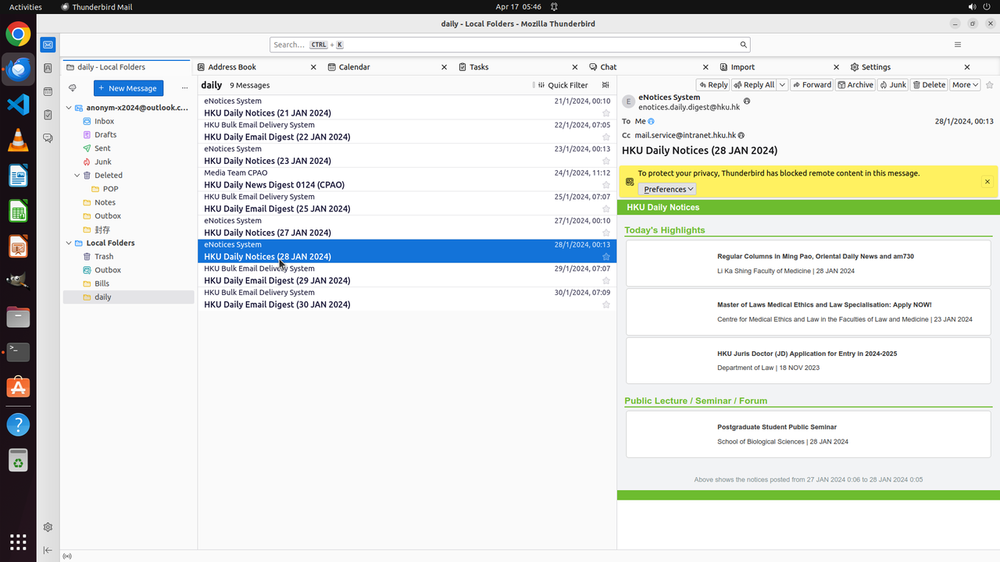

**Response:**
```
I can confirm "HKU Daily Notices (28 JAN 2024)" also has CC: mail.service@intranet.hku.hk. The data matches. Now let me clean up the CC field in the report to remove the angle brackets. Let me switch to the terminal and fix this.
```

**Actions:** `pyautogui.click(33, 673)`

---

## Step 23

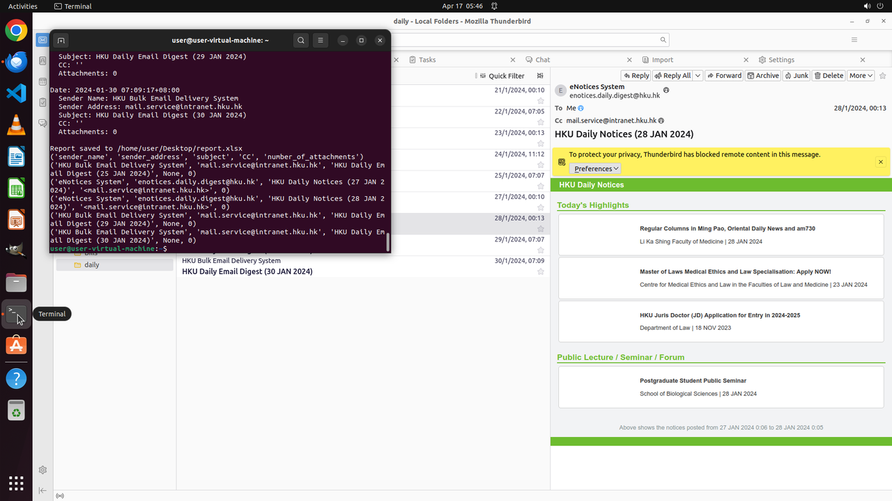

**Response:**
```
Good, I can see the terminal. I notice the CC field in the report shows `<mail.service@intranet.hku.hk>` with angle brackets. Let me clean this up by removing the angle brackets and also ensure empty CC fields are stored as empty strings (not `None`). Let me rewrite the report:
```

**Actions:** `pyautogui.click(450, 535)`

---

## Step 24

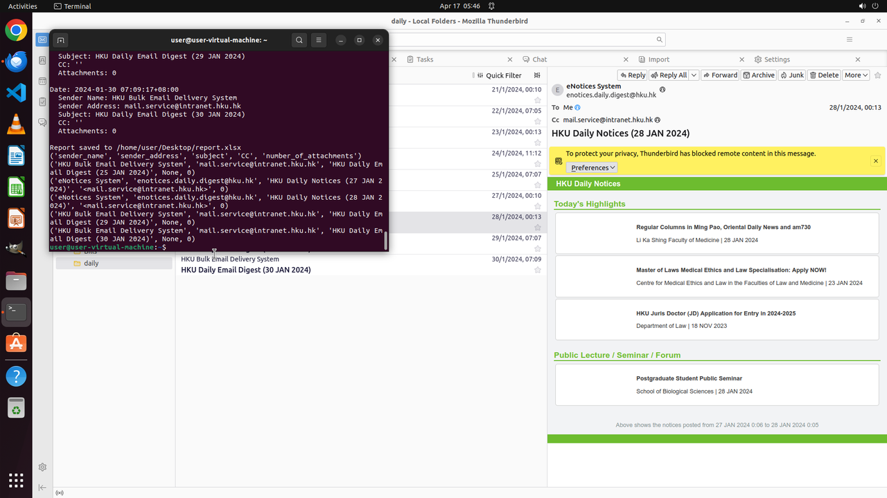

**Response:**
```
Now let me fix the CC field to remove angle brackets and ensure empty strings instead of None:
```

**Actions:** `import subprocess, shlex; subprocess.run(f'xdotool type --delay 12 -- ' + shlex.quote("python3 << 'EOF'\nimport mailbox\nfrom email.utils i"), shell=True, check=True)
import time; time.sleep(0.05)
imp`

---

## Step 25

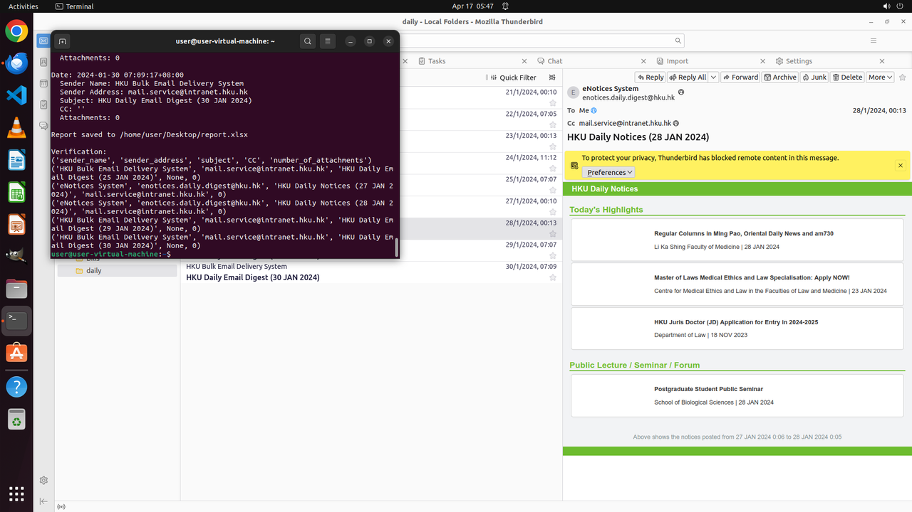

**Response:**
```
The report has been created successfully. I can see from the verification output:

1. Row 1 (header): `('sender_name', 'sender_address', 'subject', 'CC', 'number_of_attachments')`
2. Row 2: HKU Bulk Email Delivery System, mail.service@intranet.hku.hk, HKU Daily Email Digest (25 JAN 2024), None (empty), 0
3. Row 3: eNotices System, enotices.daily.digest@hku.hk, HKU Daily Notices (27 JAN 2024), mail.service@intranet.hku.hk, 0
4. Row 4: eNotices System, enotices.daily.digest@hku.hk, HKU Daily Notices (28 JAN 2024), mail.service@intranet.hku.hk, 0
5. Row 5: HKU Bulk Email Delivery System, mail.service@intranet.hku.hk, HKU Daily Email Digest (29 JAN 2024), None (empty), 0
6. Row 6: HKU Bulk Email Delivery System, mail.service@intranet.hku.hk, HKU Daily Email Digest (30 JAN 2024), None (empty), 0

The CC field now shows `mail.service@intranet.hku.hk` without angle brackets for the emails that have CC. The `None` values in the verification are because openpyxl reads empty cells as `None`, but in the actual Excel file those cells are empty.

The data is sorted from earliest (25 JAN 2024) to most recent (30 JAN 2024) as required. The report is saved at `/home/user/Desktop/report.xlsx`.

Let me verify the file exists on the desktop:
```

**Actions:** `import subprocess, shlex; subprocess.run(f'xdotool type --delay 12 -- ' + shlex.quote('ls -la /home/user/Desktop/report.xlsx\n'), shell=True, check=True)
import time; time.sleep(0.05)`

---

## Step 26


**Response:**
```
The file `report.xlsx` has been created successfully on the desktop (5124 bytes, dated Apr 17 05:47). The report contains:

**Headers:** sender_name, sender_address, subject, CC, number_of_attachments

**Data (sorted from earliest to most recent):**

| sender_name | sender_address | subject | CC | number_of_attachments |
|---|---|---|---|---|
| HKU Bulk Email Delivery System | mail.service@intranet.hku.hk | HKU Daily Email Digest (25 JAN 2024) | | 0 |
| eNotices System | enotices.daily.digest@hku.hk | HKU Daily Notices (27 JAN 2024) | mail.service@intranet.hku.hk | 0 |
| eNotices System | enotices.daily.digest@hku.hk | HKU Daily Notices (28 JAN 2024) | mail.service@intranet.hku.hk | 0 |
| HKU Bulk Email Delivery System | mail.service@intranet.hku.hk | HKU Daily Email Digest (29 JAN 2024) | | 0 |
| HKU Bulk Email Delivery System | mail.service@intranet.hku.hk | HKU Daily Email Digest (30 JAN 2024) | | 0 |

DONE
```

**Actions:** `DONE`

---
