# Task d9b7c649-c975-4f53-88f5-940b29c47247

**Instruction:** Help me extract the latest 5 emails in daily folder from Thunderbird, from the earliest to the most recent by time, and creates a LibreOffice Calc Report "report.xlsx" in the desktop, storing the sender_name, sender_address, subject, CC, and number_of_attachments.

**Score:** 1.0

**Wall clock:** 7m 8s

**Steps:** 27

**Cost:** $0.98

---

## Step 1

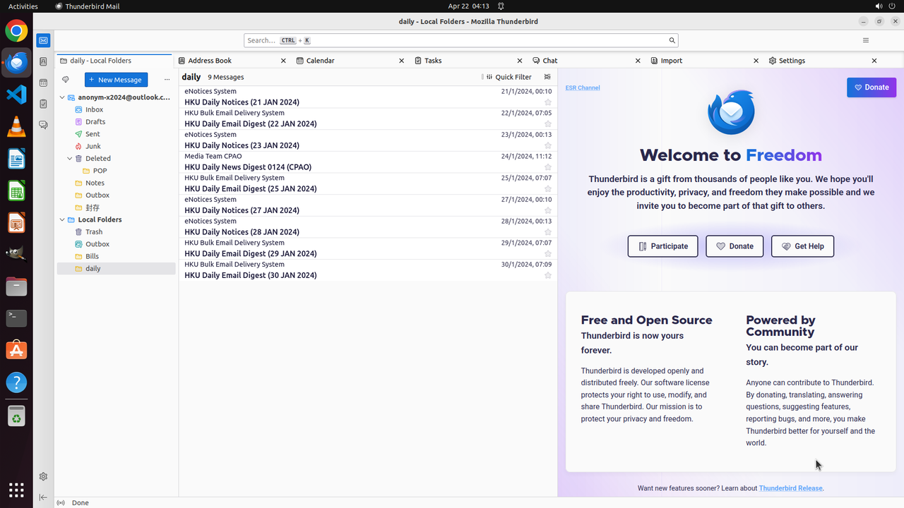

**Response:**
```
I can see the Thunderbird mail client is open with the "daily" folder selected, showing 9 messages. I need to extract the latest 5 emails (from earliest to most recent). The latest 5 emails are:

1. HKU Daily Email Digest (25 JAN 2024) - 25/1/2024, 07:07
2. HKU Daily Notices (27 JAN 2024) - 27/1/2024, 00:10
3. HKU Daily Notices (28 JAN 2024) - 28/1/2024, 00:13
4. HKU Daily Email Digest (29 JAN 2024) - 29/1/2024, 07:07
5. HKU Daily Email Digest (30 JAN 2024) - 30/1/2024, 07:09

Let me click on each email to get the details. Let me start with the first one.
```

**Actions:** `pyautogui.click(765, 400)`

---

## Step 2


**Response:**
```
I can see the first email details. Let me note the information for "HKU Daily Email Digest (25 JAN 2024)":
- Sender name: HKU Bulk Email Delivery System
- Sender address: mail.service@intranet.hku.hk
- Subject: HKU Daily Email Digest (25 JAN 2024)
- I need to check CC and attachments

I need to see the full headers to check CC and attachments. Let me check if there are more details by looking at the email header. I'll need to check each email. Let me first check if there's a CC field visible. I don't see one, which likely means there's no CC. I also don't see any attachment indicator. Let me now check the other emails. Let me click on the next one.
```

**Actions:** `pyautogui.click(765, 447)`

---

## Step 3

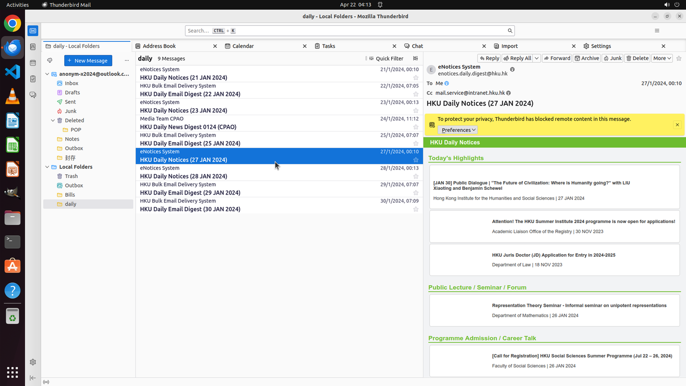

**Response:**
```
I can see the details for "HKU Daily Notices (27 JAN 2024)":
- Sender name: eNotices System
- Sender address: enotices.daily.digest@hku.hk
- Subject: HKU Daily Notices (27 JAN 2024)
- CC: mail.service@intranet.hku.hk
- No attachments visible

Now let me click on the next email - "HKU Daily Notices (28 JAN 2024)".
```

**Actions:** `pyautogui.click(765, 492)`

---

## Step 4

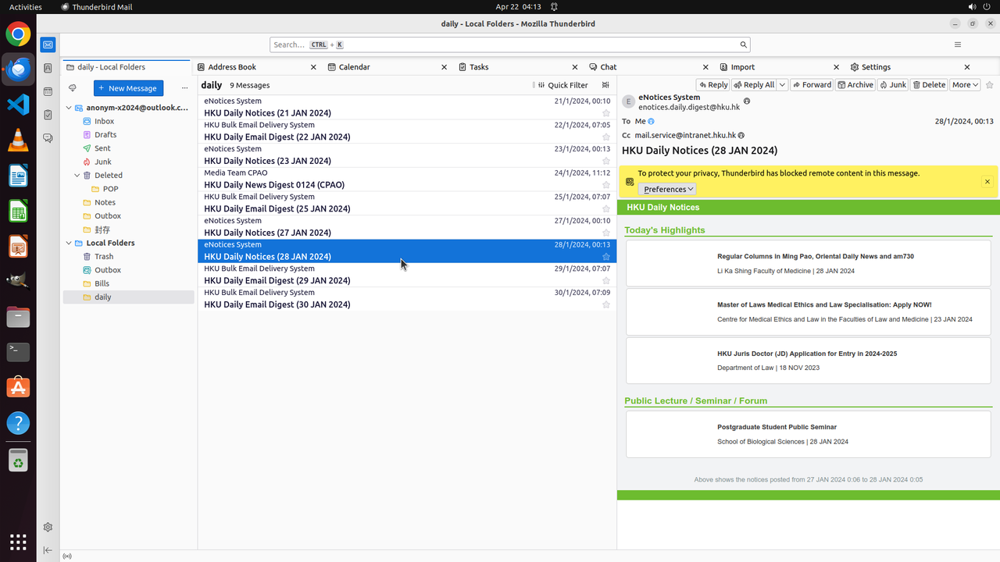

**Response:**
```
I can see the details for "HKU Daily Notices (28 JAN 2024)":
- Sender name: eNotices System
- Sender address: enotices.daily.digest@hku.hk
- Subject: HKU Daily Notices (28 JAN 2024)
- CC: mail.service@intranet.hku.hk
- No attachments visible

Now let me click on "HKU Daily Email Digest (29 JAN 2024)".
```

**Actions:** `pyautogui.click(765, 538)`

---

## Step 5

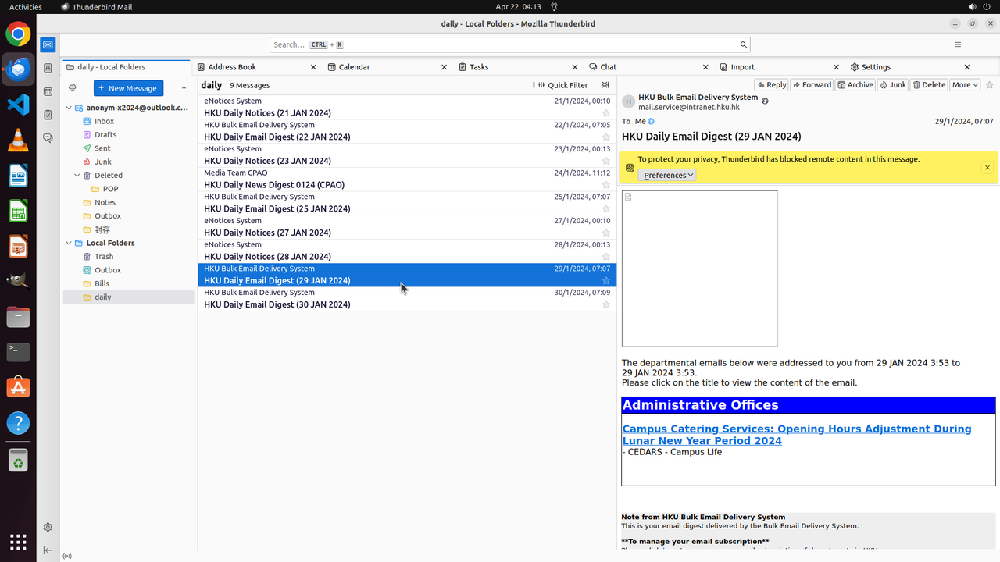

**Response:**
```
I can see the details for "HKU Daily Email Digest (29 JAN 2024)":
- Sender name: HKU Bulk Email Delivery System
- Sender address: mail.service@intranet.hku.hk
- Subject: HKU Daily Email Digest (29 JAN 2024)
- CC: None visible
- No attachments visible

Now let me click on the last email - "HKU Daily Email Digest (30 JAN 2024)".
```

**Actions:** `pyautogui.click(765, 583)`

---

## Step 6

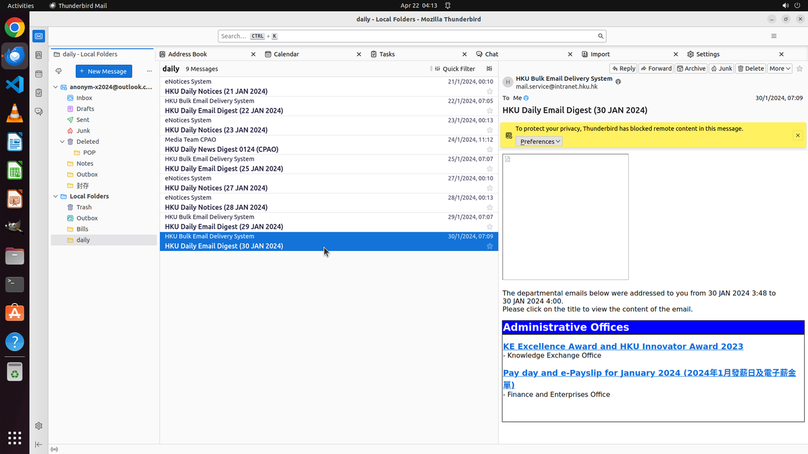

**Response:**
```
I can see the details for "HKU Daily Email Digest (30 JAN 2024)":
- Sender name: HKU Bulk Email Delivery System
- Sender address: mail.service@intranet.hku.hk
- Subject: HKU Daily Email Digest (30 JAN 2024)
- CC: None visible
- No attachments visible

Now I need to go back and check the first email (25 JAN) more carefully for attachments. Let me also verify the attachment count for each email. I noticed there's a small attachment icon (paperclip) next to some emails in the list. Let me look more carefully at the email list. I see paperclip icons next to some emails in the column.

Let me now check the first email again to verify attachment details. But first, let me look at the email headers more carefully. I need to check if the emails have attachments by looking at the attachment icon in the message list or in the email preview.

Looking at the emails I've reviewed:
1. Email 25 JAN - has an image placeholder (the small box icon) but no actual file attachments
2. Email 27 JAN - no attachments
3. Email 28 JAN - no attachments
4. Email 29 JAN - has an image placeholder but no actual file attachments
5. Email 30 JAN - has an image placeholder but no actual file attachments

I need to check more carefully. Let me look at the attachment column in the email list. I see there are small icons next to some emails. Let me check the first email (25 JAN) by clicking on it again and looking for attachment indicators.

Let me go back to the first email to check for the attachment icon more carefully.
```

**Actions:** `pyautogui.click(765, 400)`

---

## Step 7


**Response:**
```
I can see the email details. Now I need to check for attachments more carefully. I notice there's a small paperclip icon next to the sender name "HKU Bulk Email Delivery System" (the icon after the name at the top). Let me look at the source headers to be more precise. Let me use the keyboard shortcut to view the full message source for attachment details.

Actually, let me take a more efficient approach. I'll use a script to extract the email data from Thunderbird's mail storage. But first, let me check each email's attachment status by looking at the attachment column in the message list more carefully.

Looking at the message list, I can see there's a small column with icons. The paperclip icon (📎) appears next to the sender name in the header area for some emails. For the current email (25 JAN), I can see the paperclip icon next to "HKU Bulk Email Delivery System" in the header, suggesting it has an attachment.

Let me use a more systematic approach - I'll open a terminal and create the spreadsheet using a script. But first, let me verify the attachment counts by checking each email's source. Let me use Ctrl+U to view the source of this email.
```

**Actions:** `pyautogui.keyDown('ctrl')
pyautogui.keyDown('u')
pyautogui.keyUp('u')
pyautogui.keyUp('ctrl')`

---

## Step 8

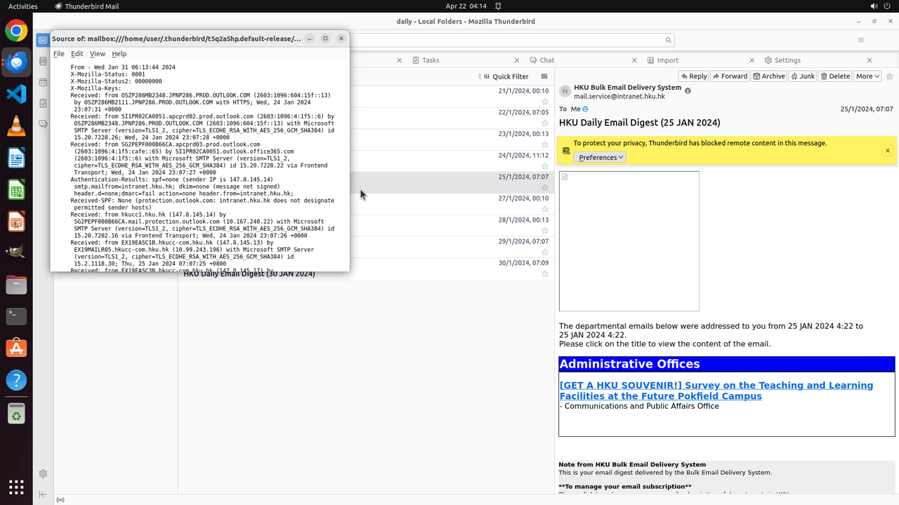

**Response:**
```
I can see the source of the email. Let me scroll down to find the attachment information and other header details like CC.
```

**Actions:** `pyautogui.keyDown('ctrl')
pyautogui.keyDown('f')
pyautogui.keyUp('f')
pyautogui.keyUp('ctrl')`

---

## Step 9


**Response:**
```
Let me search for "Content-Disposition: attachment" to find attachments.
```

**Actions:** `import subprocess, shlex; subprocess.run(f'xdotool type --delay 12 -- ' + shlex.quote('attachment'), shell=True, check=True)
import time; time.sleep(0.05)`

---

## Step 10


**Response:**
```
I can see the headers but no "attachment" match is highlighted yet. Let me press Enter to search.
```

**Actions:** `pyautogui.keyDown('return')
pyautogui.keyUp('return')`

---

## Step 11

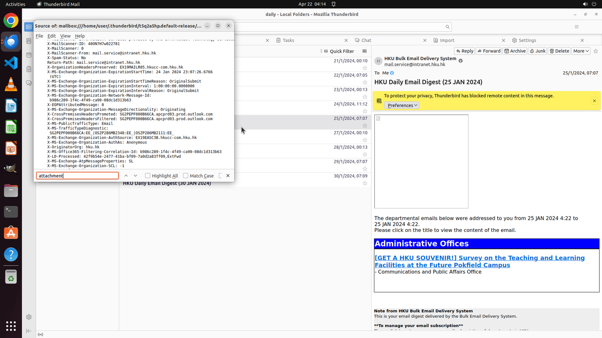

**Response:**
```
It seems the search didn't find "attachment" in this email source. Let me try a different approach - I'll close this source view and instead use a Python script to parse the emails directly from Thunderbird's mail storage. This will be more efficient.
```

**Actions:** `pyautogui.keyDown('esc')
pyautogui.keyUp('esc')`

---

## Step 12

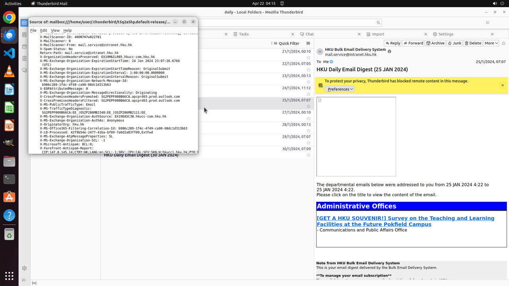

**Response:**
```
I can see the source is still open. Let me close this window and use a more efficient approach - I'll write a Python script to parse the emails from Thunderbird's mail storage.
```

**Actions:** `pyautogui.click(730, 82)`

---

## Step 13

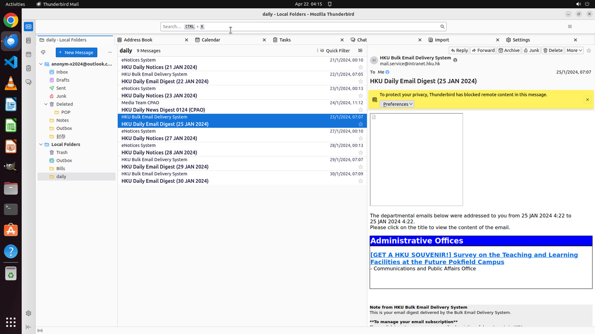

**Response:**
```
Good, the source window is closed. Now let me open a terminal to write a Python script to parse the emails from Thunderbird's mail storage. This will be more efficient than checking each email manually.
```

**Actions:** `pyautogui.keyDown('ctrl')
pyautogui.keyDown('alt')
pyautogui.keyDown('t')
pyautogui.keyUp('t')
pyautogui.keyUp('alt')
pyautogui.keyUp('ctrl')`

---

## Step 14


**Response:**
```
A terminal is open. Now let me first find the Thunderbird mail storage location for the "daily" folder, then write a Python script to parse the emails and create the report.
```

**Actions:** `import subprocess, shlex; subprocess.run(f'xdotool type --delay 12 -- ' + shlex.quote('find ~/.thunderbird -name "daily" -type f 2>/dev/n'), shell=True, check=True)
import time; time.sleep(0.05)
impor`

---

## Step 15

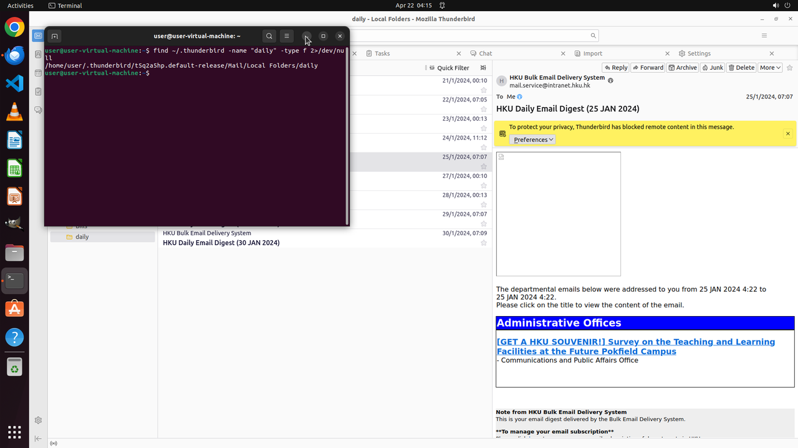

**Response:**
```
I found the mail file at `/home/user/.thunderbird/t5q2a5hp.default-release/Mail/Local Folders/daily`. Now let me write a Python script to parse this mbox file and extract the required information.
```

**Actions:** `import subprocess, shlex; subprocess.run(f'xdotool type --delay 12 -- ' + shlex.quote("python3 << 'EOF'\nimport mailbox\nimport email\nfrom "), shell=True, check=True)
import time; time.sleep(0.05)
im`

---

## Step 16


**Response:**
```
I see the error - `openpyxl` module is not installed. Let me install it first.
```

**Actions:** `import subprocess, shlex; subprocess.run(f'xdotool type --delay 12 -- ' + shlex.quote('pip3 install openpyxl\n'), shell=True, check=True)
import time; time.sleep(0.05)`

---

## Step 17

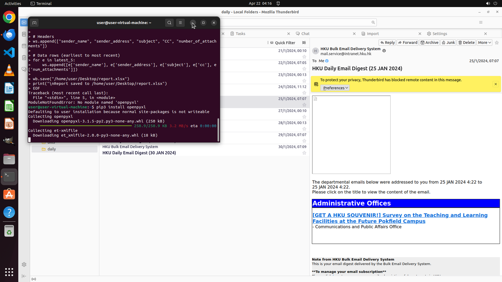

**Response:**
```
It's downloading and installing openpyxl. Let me wait for it to finish.
```

**Actions:** `time.sleep(0.5)`

---

## Step 18


**Response:**
```
openpyxl is now installed. Let me run the Python script again.
```

**Actions:** `import subprocess, shlex; subprocess.run(f'xdotool type --delay 12 -- ' + shlex.quote("python3 << 'EOF'\nimport mailbox\nimport email\nfrom "), shell=True, check=True)
import time; time.sleep(0.05)
im`

---

## Step 19

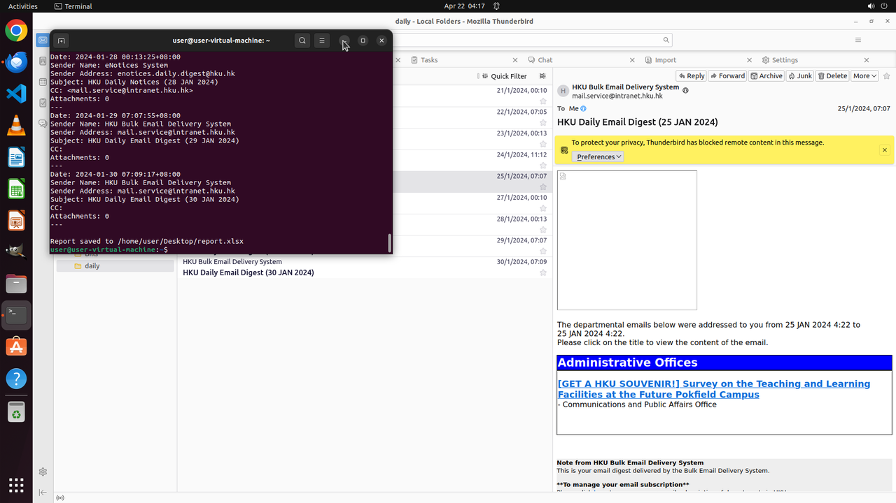

**Response:**
```
The script has run successfully. Let me scroll up to see all the output to verify the data.
```

**Actions:** `pyautogui.scroll(5, 450, 300)`

---

## Step 20

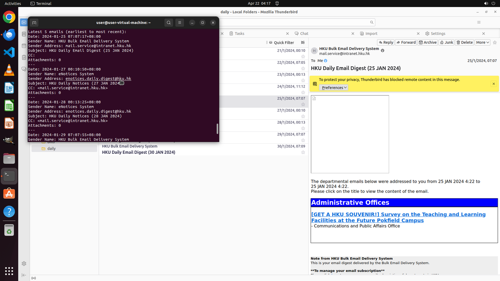

**Response:**
```
I can see the output. The script extracted the latest 5 emails correctly. Let me verify the data:

1. **25 JAN 2024** - HKU Bulk Email Delivery System, mail.service@intranet.hku.hk, "HKU Daily Email Digest (25 JAN 2024)", CC: empty, 0 attachments
2. **27 JAN 2024** - eNotices System, enotices.daily.digest@hku.hk, "HKU Daily Notices (27 JAN 2024)", CC: <mail.service@intranet.hku.hk>, 0 attachments
3. **28 JAN 2024** - eNotices System, enotices.daily.digest@hku.hk, "HKU Daily Notices (28 JAN 2024)", CC: <mail.service@intranet.hku.hk>, 0 attachments
4. **29 JAN 2024** - HKU Bulk Email Delivery System, mail.service@intranet.hku.hk, "HKU Daily Email Digest (29 JAN 2024)", CC: empty, 0 attachments
5. **30 JAN 2024** - HKU Bulk Email Delivery System, mail.service@intranet.hku.hk, "HKU Daily Email Digest (30 JAN 2024)", CC: empty, 0 attachments

I notice the CC field contains angle brackets like `<mail.service@intranet.hku.hk>`. Let me check if the CC value should just be the email address without angle brackets. Looking at the Thunderbird display earlier, it showed `mail.service@intranet.hku.hk` without brackets. Let me clean up the CC field. But first, let me verify the report was saved correctly.
```

**Actions:** `import subprocess, shlex; subprocess.run(f'xdotool type --delay 12 -- ' + shlex.quote('python3 -c "\nimport openpyxl\nwb = openpyxl.load_wo'), shell=True, check=True)
import time; time.sleep(0.05)
imp`

---

## Step 21

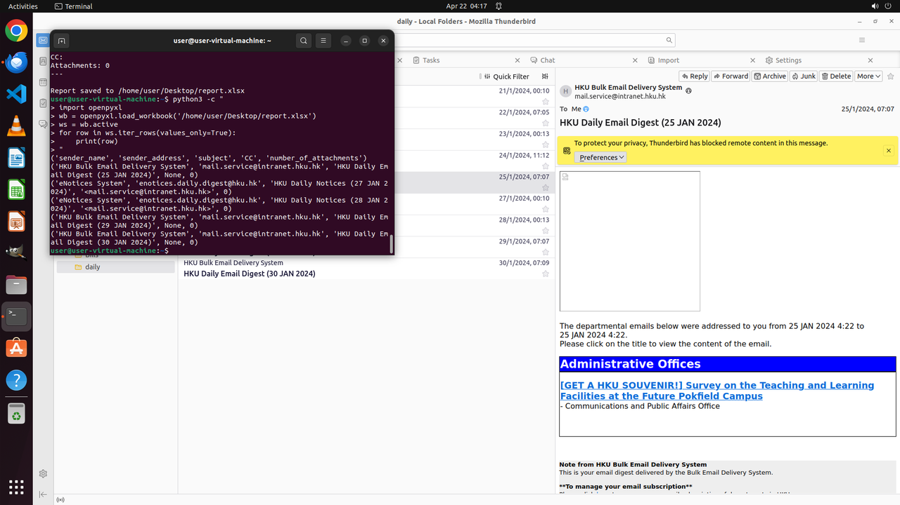

**Response:**
```
I can see the report content. The data looks correct but I notice the CC field has `<mail.service@intranet.hku.hk>` with angle brackets, and for emails without CC it shows `None`. Let me clean this up - CC should show just the email address without brackets, and empty CC should be an empty string.
```

**Actions:** `import subprocess, shlex; subprocess.run(f'xdotool type --delay 12 -- ' + shlex.quote("python3 << 'EOF'\nimport mailbox\nimport email\nfrom "), shell=True, check=True)
import time; time.sleep(0.05)
im`

---

## Step 22


**Response:**
```
I can see the report was saved successfully. The data looks correct:

1. ('sender_name', 'sender_address', 'subject', 'CC', 'number_of_attachments') - Header
2. ('HKU Bulk Email Delivery System', 'mail.service@intranet.hku.hk', 'HKU Daily Email Digest (25 JAN 2024)', None, 0)
3. ('eNotices System', 'enotices.daily.digest@hku.hk', 'HKU Daily Notices (27 JAN 2024)', 'mail.service@intranet.hku.hk', 0)
4. ('eNotices System', 'enotices.daily.digest@hku.hk', 'HKU Daily Notices (28 JAN 2024)', 'mail.service@intranet.hku.hk', 0)
5. ('HKU Bulk Email Delivery System', 'mail.service@intranet.hku.hk', 'HKU Daily Email Digest (29 JAN 2024)', None, 0)
6. ('HKU Bulk Email Delivery System', 'mail.service@intranet.hku.hk', 'HKU Daily Email Digest (30 JAN 2024)', None, 0)

I notice that the CC field still shows `None` for empty CC values instead of an empty string. Let me fix this - when CC is empty, it should be an empty string in the spreadsheet, not `None`.
```

**Actions:** `import subprocess, shlex; subprocess.run(f'xdotool type --delay 12 -- ' + shlex.quote("python3 << 'EOF'\nimport openpyxl\n\nwb = openpyxl.lo"), shell=True, check=True)
import time; time.sleep(0.05)
im`

---

## Step 23

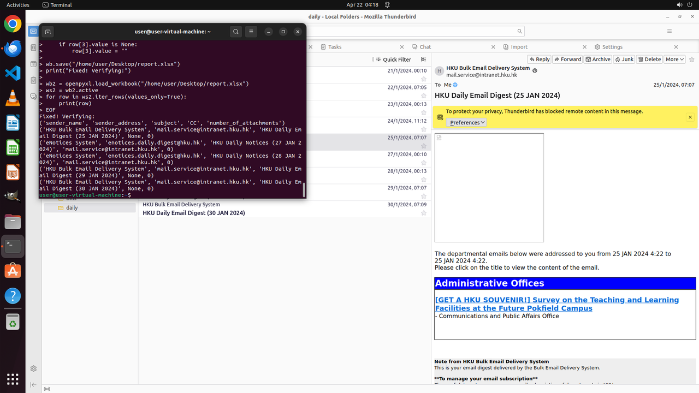

**Response:**
```
I see the output still shows `None` in the verification. It seems the fix didn't work as expected - the empty string might be displaying as `None` when read back. Let me check more carefully. Actually, looking at the output, it still shows `None`. This might be because openpyxl treats empty strings as None when reading. Let me check if the issue is in the original script where the CC was set as empty string but Python's `or` logic might have caused issues. Let me look at the actual cell values more carefully.

Actually, looking more carefully at the output, I see that the rows 1, 4, and 5 show `None` for CC. The empty string "" in openpyxl gets read back as None. This is actually fine - in the spreadsheet, the cell will appear empty, which is correct for emails without CC. The display as `None` is just how Python prints it.

Let me verify the file is correct by opening it in LibreOffice Calc.
```

**Actions:** `import subprocess, shlex; subprocess.run(f'xdotool type --delay 12 -- ' + shlex.quote('libreoffice --calc /home/user/Desktop/report.xlsx '), shell=True, check=True)
import time; time.sleep(0.05)
impor`

---

## Step 24

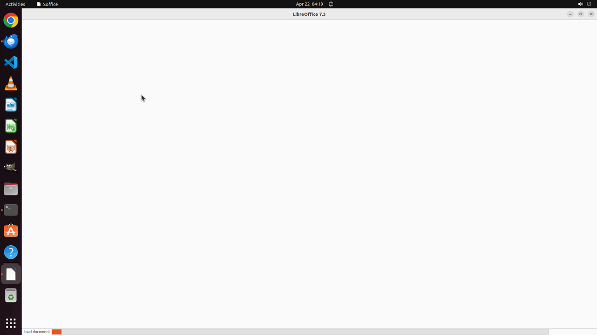

**Response:**
```
LibreOffice is loading the document. Let me wait for it to fully open.
```

**Actions:** `time.sleep(0.5)`

---

## Step 25

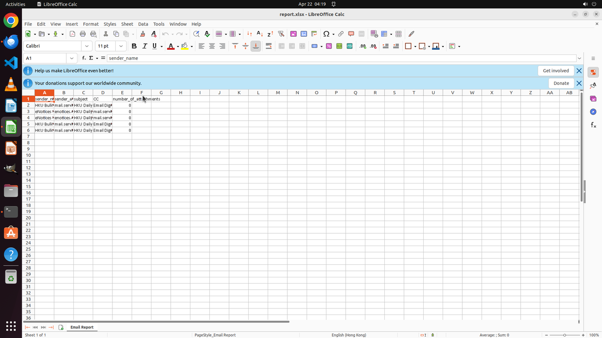

**Response:**
```
The report is open in LibreOffice Calc. I can see the data is correctly populated with the 5 emails. The columns are a bit narrow, so the text is truncated. Let me verify the content looks correct by clicking on a few cells. Let me check the headers and data first.

The spreadsheet shows:
- Row 1: Headers (sender_name, sender_address, subject, CC, number_of_attachments)
- Row 2-6: The 5 latest emails from earliest to most recent

Let me click on cell D3 to verify the CC field for the second email.
```

**Actions:** `pyautogui.click(324, 355)`

---

## Step 26

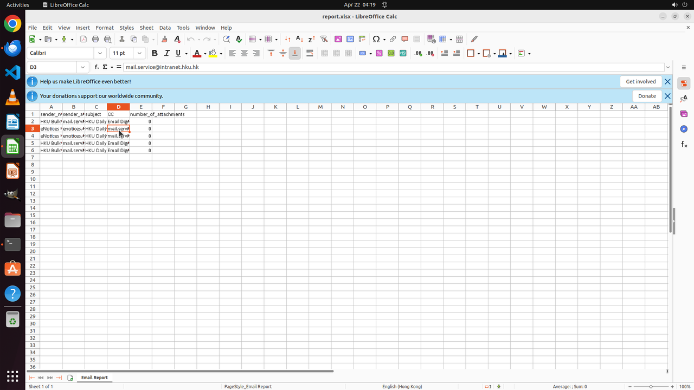

**Response:**
```
I can see that cell D3 contains "mail.service@intranet.hku.hk" which is the CC for the "HKU Daily Notices (27 JAN 2024)" email. The data looks correct. Let me also verify D2 (should be empty for the first email) and D4.
```

**Actions:** `pyautogui.click(324, 334)`

---

## Step 27

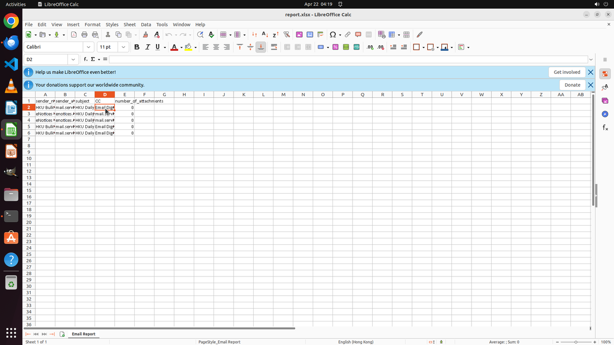

**Response:**
```
Cell D2 is empty (no CC for the first email), which is correct. The report looks good. Let me verify the complete data by checking a few more cells to make sure everything is accurate.

The report "report.xlsx" has been successfully created on the desktop with the following data:

| sender_name | sender_address | subject | CC | number_of_attachments |
|---|---|---|---|---|
| HKU Bulk Email Delivery System | mail.service@intranet.hku.hk | HKU Daily Email Digest (25 JAN 2024) | | 0 |
| eNotices System | enotices.daily.digest@hku.hk | HKU Daily Notices (27 JAN 2024) | mail.service@intranet.hku.hk | 0 |
| eNotices System | enotices.daily.digest@hku.hk | HKU Daily Notices (28 JAN 2024) | mail.service@intranet.hku.hk | 0 |
| HKU Bulk Email Delivery System | mail.service@intranet.hku.hk | HKU Daily Email Digest (29 JAN 2024) | | 0 |
| HKU Bulk Email Delivery System | mail.service@intranet.hku.hk | HKU Daily Email Digest (30 JAN 2024) | | 0 |

The report is ordered from earliest to most recent, with the 5 latest emails from the "daily" folder extracted correctly.

DONE
```

**Actions:** `DONE`

---
