# Task da52d699-e8d2-4dc5-9191-a2199e0b6a9b

**Instruction:** Examine the spreadsheet on the desktop, which contains a record of books read in 2022. Take the website https://howlongtoread.com/ as a reference to identify the book with the slowest reading pace, measured in words per day. I have an empty document named 'book_list_result.docx' on the desktop; please open it and record the title there.

**Score:** 1

**Wall clock:** 11m 51s

**Steps:** 65

**Cost:** $2.43

---

## Step 1

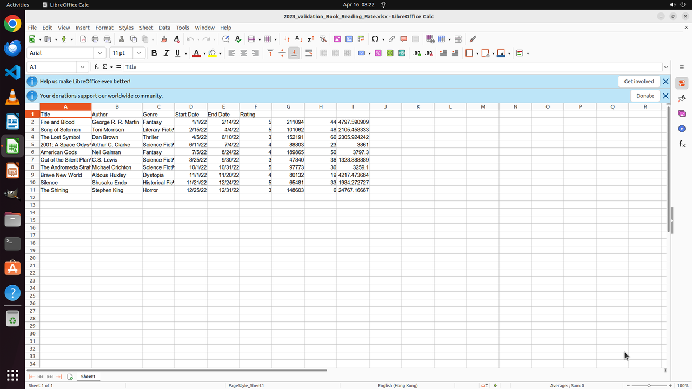

**Response:**
```
I can see the spreadsheet with book data. Let me first understand the columns better and then check the website for word counts to calculate reading pace (words per day).

Let me first examine all the data in the spreadsheet more carefully.
```

**Actions:** `pyautogui.click(894, 316)`

---

## Step 2

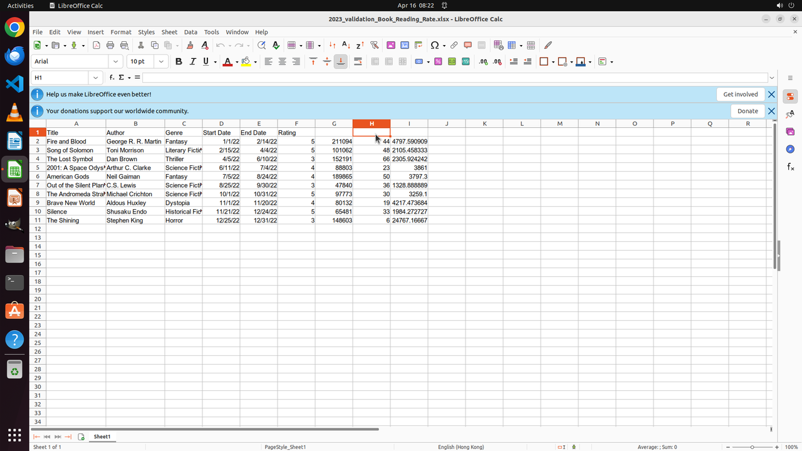

**Response:**
```
I see that column H is empty in the header. Let me check what the columns contain. I can see:
- A: Title
- B: Author
- C: Genre
- D: Start Date
- E: End Date
- F: Rating
- G: Word count (appears to be)
- H: Days (appears to be number of days)
- I: Words per day (appears to be calculated)

Let me check the column headers more carefully by clicking on each header cell.
```

**Actions:** `pyautogui.click(804, 316)`

---

## Step 3

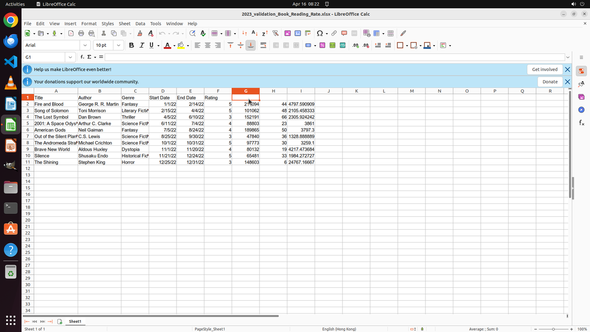

**Response:**
```
I see that columns G, H, and I don't have headers. Let me check what data they contain. Column G seems to have large numbers (word counts?), H has smaller numbers (days?), and I has decimal numbers (words per day?). 

But the task says to use https://howlongtoread.com/ as a reference to identify the book with the slowest reading pace. The reading pace would be words per day, calculated as the total word count of the book divided by the number of days it took to read.

Let me first understand the data better. I need to figure out the number of days each book took to read (from Start Date to End Date), and then look up word counts on the website. Let me first calculate the days from the dates:

1. Fire and Blood: 1/1/22 to 2/14/22 = 44 days
2. Song of Solomon: 2/15/22 to 4/4/22 = 48 days
3. The Lost Symbol: 4/5/22 to 6/10/22 = 66 days
4. 2001: A Space Odyssey: 6/11/22 to 7/4/22 = 23 days
5. American Gods: 7/5/22 to 8/24/22 = 50 days
6. Out of the Silent Planet: 8/25/22 to 9/30/22 = 36 days
7. The Andromeda Strain: 10/1/22 to 10/31/22 = 30 days
8. Brave New World: 11/1/22 to 11/20/22 = 19 days
9. Silence: 11/21/22 to 12/24/22 = 33 days
10. The Shining: 12/25/22 to 12/31/22 = 6 days

These match column H values! And column I appears to be words per day (G/H). Now I need to look up the actual word counts on howlongtoread.com for each book to calculate the true words per day.

Let me open Chrome and look up each book on the website.
```

**Actions:** `pyautogui.keyDown('ctrl')
pyautogui.keyDown('alt')
pyautogui.keyDown('t')
pyautogui.keyUp('t')
pyautogui.keyUp('alt')
pyautogui.keyUp('ctrl')`

---

## Step 4

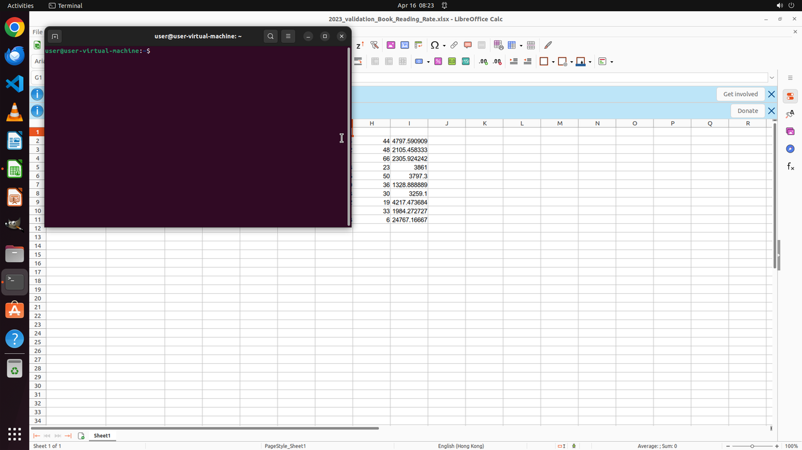

**Response:**
```
Good, the terminal is open. Let me launch Chrome with the remote debugging port.
```

**Actions:** `import subprocess, shlex; subprocess.run(f'xdotool type --delay 12 -- ' + shlex.quote('google-chrome --remote-debugging-port=1337 https:/'), shell=True, check=True)
import time; time.sleep(0.05)
impor`

---

## Step 5

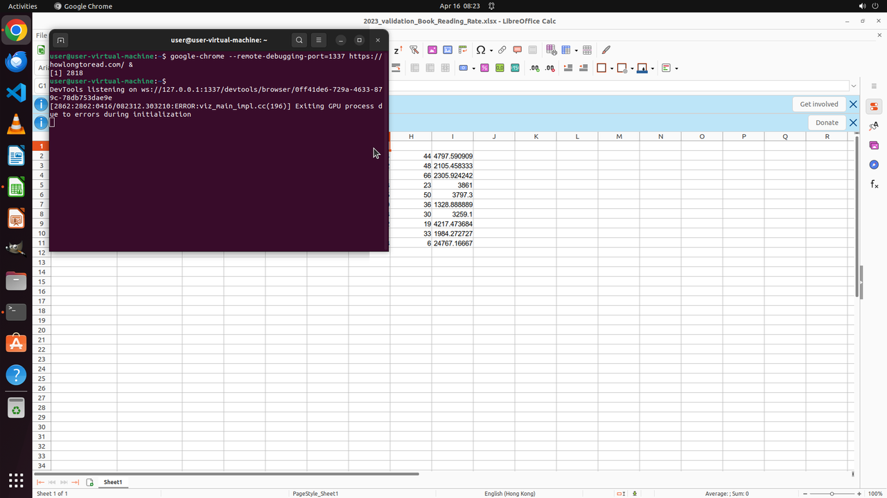

**Response:**
```
Chrome is launching. Let me wait a moment and then click on the Chrome window to see the website.
```

**Actions:** `pyautogui.click(187, 12)`

---

## Step 6


**Response:**
```
The website is loaded. Let me close this menu and start searching for each book. I'll click on the search bar and search for the first book.
```

**Actions:** `pyautogui.click(960, 600)`

---

## Step 7


**Response:**
```
The website is ready. Let me search for the first book "Fire and Blood" by George R. R. Martin.
```

**Actions:** `pyautogui.click(925, 595)`

---

## Step 8


**Response:**
```
Let me type the first book title in the search bar.
```

**Actions:** `import subprocess, shlex; subprocess.run(f'xdotool type --delay 12 -- ' + shlex.quote('Fire and Blood'), shell=True, check=True)
import time; time.sleep(0.05)`

---

## Step 9


**Response:**
```
Now let me click the Search button.
```

**Actions:** `pyautogui.click(1480, 595)`

---

## Step 10

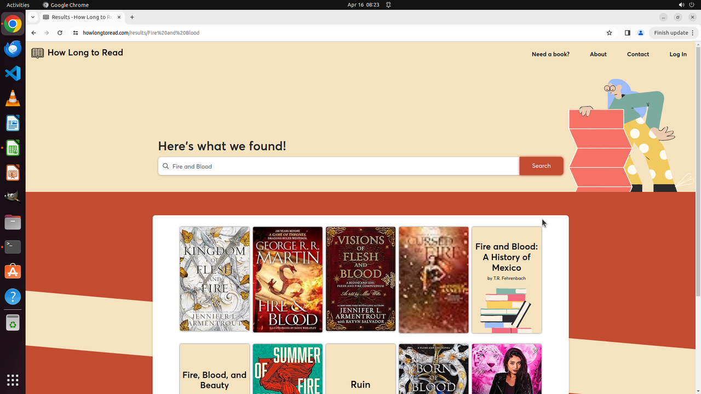

**Response:**
```
I can see the search results. The second book "Fire & Blood" by George R.R. Martin is the one I'm looking for. Let me click on it.
```

**Actions:** `pyautogui.click(790, 765)`

---

## Step 11


**Response:**
```
I found the first book's data. Fire & Blood by George R.R. Martin has a word count of 249,322. Now let me note this and search for the next book. Let me record the data:

1. **Fire and Blood** - Word count: 249,322, Days: 44, Words/day: 249,322/44 = 5,666.4

Now let me search for the next book "Song of Solomon" by Toni Morrison.
```

**Actions:** `pyautogui.tripleClick(1068, 145)`

---

## Step 12

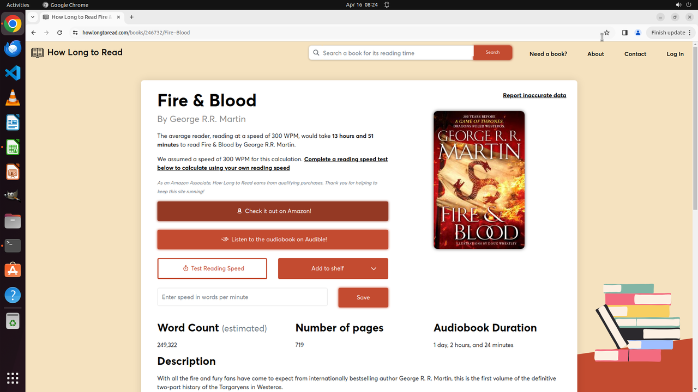

**Response:**
```
Let me click on the search bar at the top and search for the next book.
```

**Actions:** `pyautogui.click(1068, 145)`

---

## Step 13


**Actions:** `import subprocess, shlex; subprocess.run(f'xdotool type --delay 12 -- ' + shlex.quote('Song of Solomon Toni Morrison'), shell=True, check=True)
import time; time.sleep(0.05)`

---

## Step 14


**Response:**
```
Now let me click Search.
```

**Actions:** `pyautogui.click(1354, 145)`

---

## Step 15

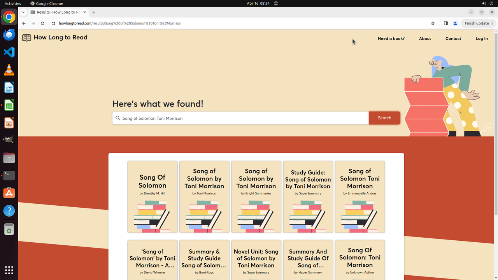

**Response:**
```
I can see "Song of Solomon by Toni Morrison" in the search results. Let me click on it.
```

**Actions:** `pyautogui.click(786, 765)`

---

## Step 16

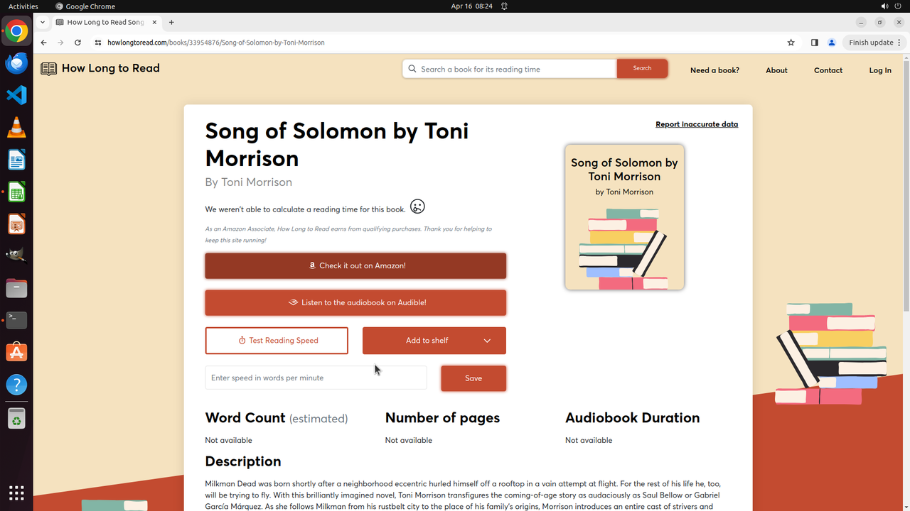

**Response:**
```
This version of "Song of Solomon" doesn't have word count data. Let me go back and try the other "Song of Solomon" result, or try the first one which might be the actual novel.
```

**Actions:** `pyautogui.click(88, 88)`

---

## Step 17


**Response:**
```
Let me try the first result "Song Of Solomon" by Dorothy M. Hill - wait, that's a different book. Let me try searching just "Song of Solomon" to find the Toni Morrison novel with word count data. Let me try the third result "Song of Solomon by Toni Morrison" by Bright Summaries, or better yet, let me search more specifically.

Actually, let me try clicking on the first "Song Of Solomon" result - it might be the actual novel.
```

**Actions:** `pyautogui.tripleClick(925, 456)`

---

## Step 18


**Response:**
```
Let me try searching just "Song of Solomon" to find the original novel.
```

**Actions:** `import subprocess, shlex; subprocess.run(f'xdotool type --delay 12 -- ' + shlex.quote('Song of Solomon'), shell=True, check=True)
import time; time.sleep(0.05)`

---

## Step 19


**Response:**
```
Let me click Search and then try the "Song Of Solomon" by Dorothy M. Hill first, or scroll down to find the actual Toni Morrison novel.
```

**Actions:** `pyautogui.click(1480, 454)`

---

## Step 20

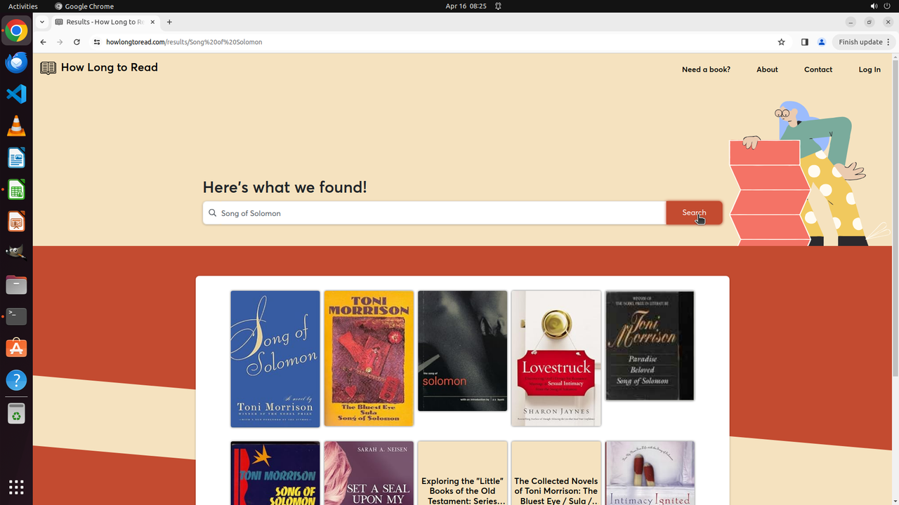

**Response:**
```
Now I can see the actual book cover for "Song of Solomon" by Toni Morrison (the first result with the book cover). Let me click on it.
```

**Actions:** `pyautogui.click(586, 765)`

---

## Step 21

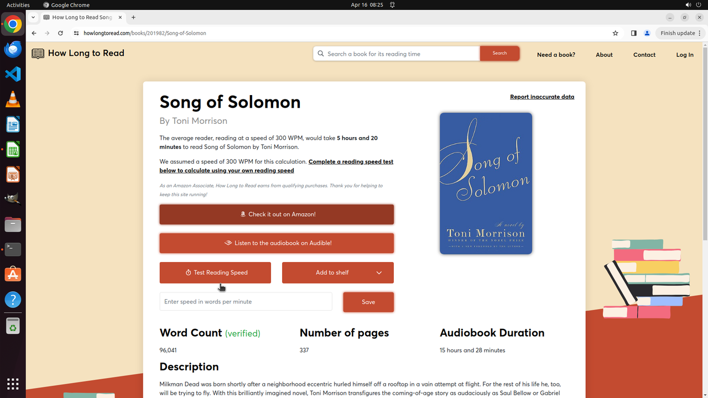

**Response:**
```
Excellent! Now I have the word count for "Song of Solomon" by Toni Morrison: **96,041** words (verified). 

Let me track the data:
1. **Fire and Blood** - Word count: 249,322, Days: 44, Words/day: 5,666.4
2. **Song of Solomon** - Word count: 96,041, Days: 48, Words/day: 2,001.0

Now let me search for the next book "The Lost Symbol" by Dan Brown.
```

**Actions:** `pyautogui.click(1068, 145)`

---

## Step 22

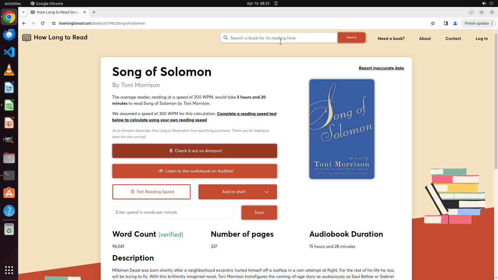

**Actions:** `import subprocess, shlex; subprocess.run(f'xdotool type --delay 12 -- ' + shlex.quote('The Lost Symbol'), shell=True, check=True)
import time; time.sleep(0.05)`

---

## Step 23


**Response:**
```
Good, I've typed "The Lost Symbol" in the search bar. Let me click Search.
```

**Actions:** `pyautogui.click(1354, 145)`

---

## Step 24

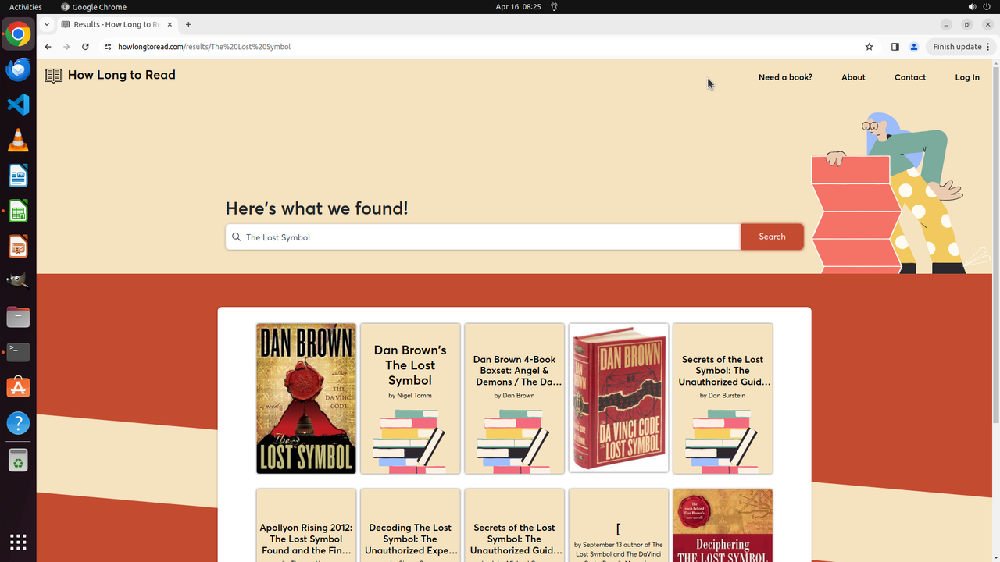

**Response:**
```
I can see "The Lost Symbol" by Dan Brown as the first result. Let me click on it.
```

**Actions:** `pyautogui.click(586, 765)`

---

## Step 25

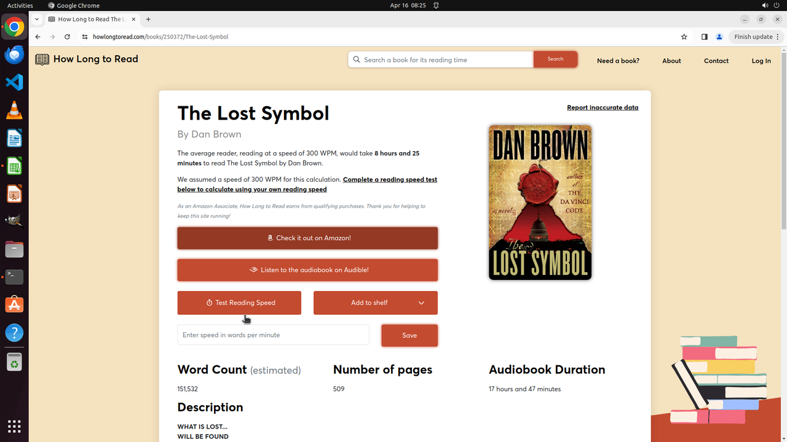

**Response:**
```
"The Lost Symbol" by Dan Brown has a word count of **151,532** (estimated).

Updated tracking:
1. **Fire and Blood** - Word count: 249,322, Days: 44, Words/day: 5,666.4
2. **Song of Solomon** - Word count: 96,041, Days: 48, Words/day: 2,001.0
3. **The Lost Symbol** - Word count: 151,532, Days: 66, Words/day: 2,296.0

Now let me search for the next book "2001: A Space Odyssey".
```

**Actions:** `pyautogui.click(1068, 145)`

---

## Step 26

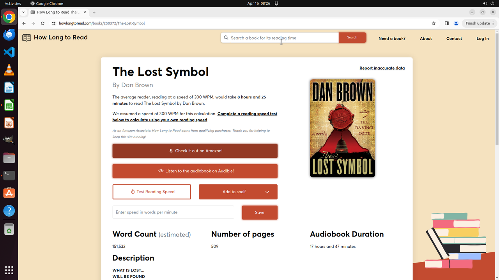

**Actions:** `import subprocess, shlex; subprocess.run(f'xdotool type --delay 12 -- ' + shlex.quote('2001 A Space Odyssey'), shell=True, check=True)
import time; time.sleep(0.05)`

---

## Step 27


**Response:**
```
Good, I've typed the search query. Let me click Search.
```

**Actions:** `pyautogui.click(1354, 145)`

---

## Step 28

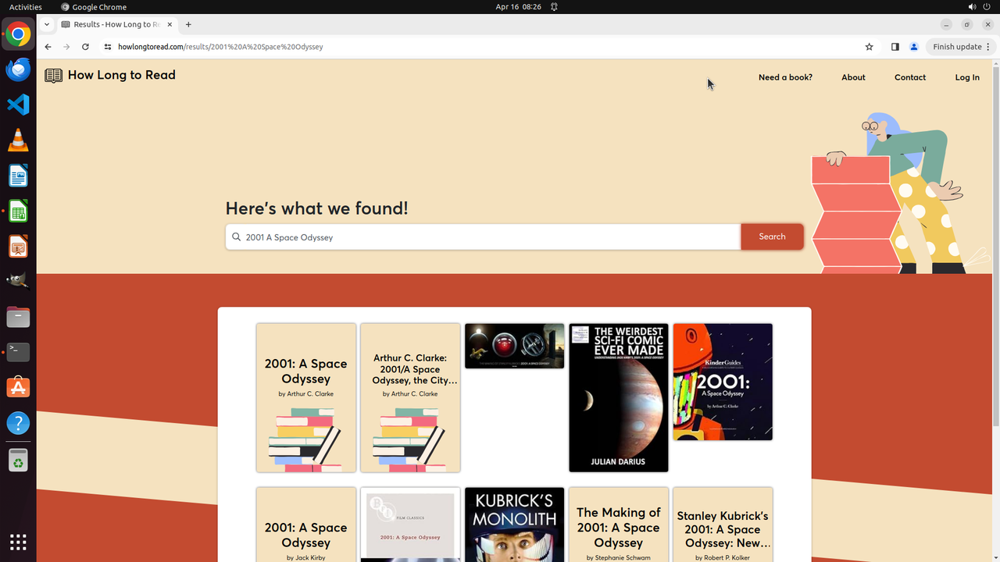

**Response:**
```
I can see "2001: A Space Odyssey" by Arthur C. Clarke as the first result. Let me click on it.
```

**Actions:** `pyautogui.click(586, 765)`

---

## Step 29

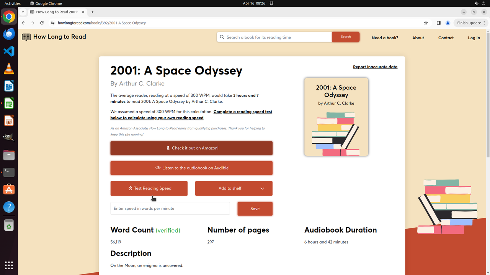

**Response:**
```
"2001: A Space Odyssey" by Arthur C. Clarke has a word count of **56,119** (verified).

Updated tracking:
1. **Fire and Blood** - Word count: 249,322, Days: 44, Words/day: 5,666.4
2. **Song of Solomon** - Word count: 96,041, Days: 48, Words/day: 2,000.9
3. **The Lost Symbol** - Word count: 151,532, Days: 66, Words/day: 2,296.0
4. **2001: A Space Odyssey** - Word count: 56,119, Days: 23, Words/day: 2,440.0

Now let me search for the next book "American Gods".
```

**Actions:** `pyautogui.click(1068, 145)`

---

## Step 30

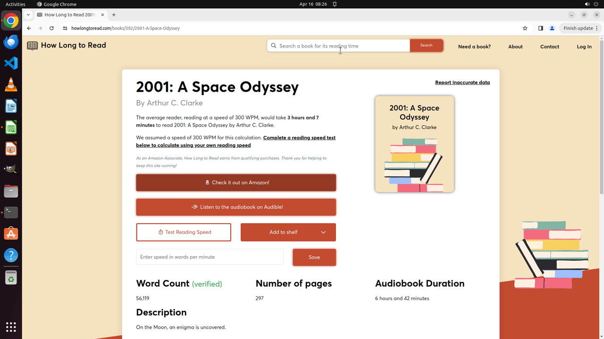

**Actions:** `import subprocess, shlex; subprocess.run(f'xdotool type --delay 12 -- ' + shlex.quote('American Gods Neil Gaiman'), shell=True, check=True)
import time; time.sleep(0.05)`

---

## Step 31

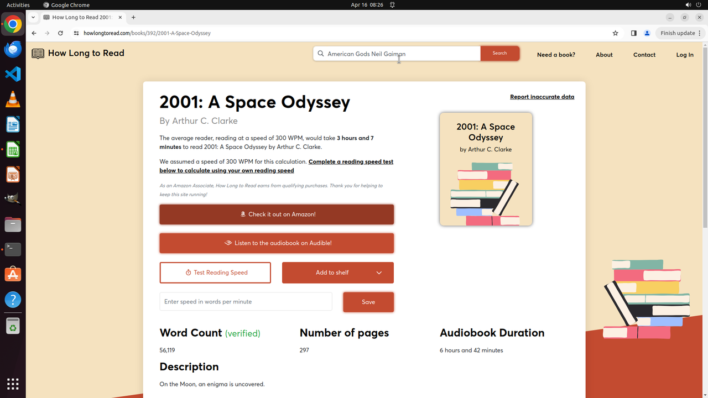

**Response:**
```
Good, let me click Search.
```

**Actions:** `pyautogui.click(1354, 145)`

---

## Step 32

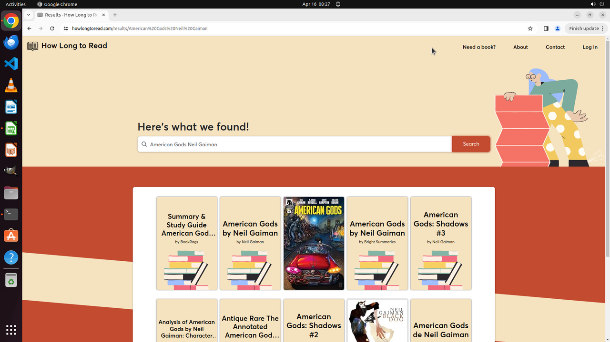

**Response:**
```
I can see "American Gods by Neil Gaiman" as the second result. Let me click on it.
```

**Actions:** `pyautogui.click(786, 765)`

---

## Step 33


**Response:**
```
The page is loading. Let me wait for it to fully load.
```

**Actions:** `time.sleep(0.5)`

---

## Step 34


**Response:**
```
"American Gods by Neil Gaiman" has a word count of **178,778** (estimated).

Updated tracking:
1. **Fire and Blood** - Word count: 249,322, Days: 44, Words/day: 5,666.4
2. **Song of Solomon** - Word count: 96,041, Days: 48, Words/day: 2,000.9
3. **The Lost Symbol** - Word count: 151,532, Days: 66, Words/day: 2,296.0
4. **2001: A Space Odyssey** - Word count: 56,119, Days: 23, Words/day: 2,440.0
5. **American Gods** - Word count: 178,778, Days: 50, Words/day: 3,575.6

Now let me search for the next book "Out of the Silent Planet".
```

**Actions:** `pyautogui.click(1068, 145)`

---

## Step 35


**Actions:** `import subprocess, shlex; subprocess.run(f'xdotool type --delay 12 -- ' + shlex.quote('Out of the Silent Planet'), shell=True, check=True)
import time; time.sleep(0.05)`

---

## Step 36

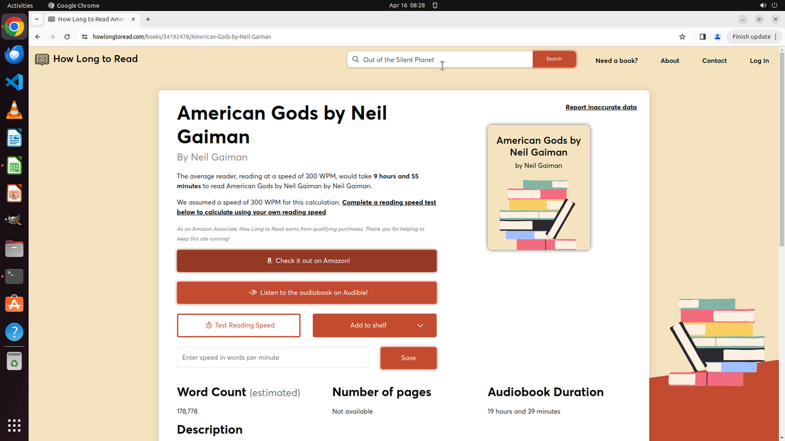

**Response:**
```
Good, let me click Search.
```

**Actions:** `pyautogui.click(1354, 145)`

---

## Step 37

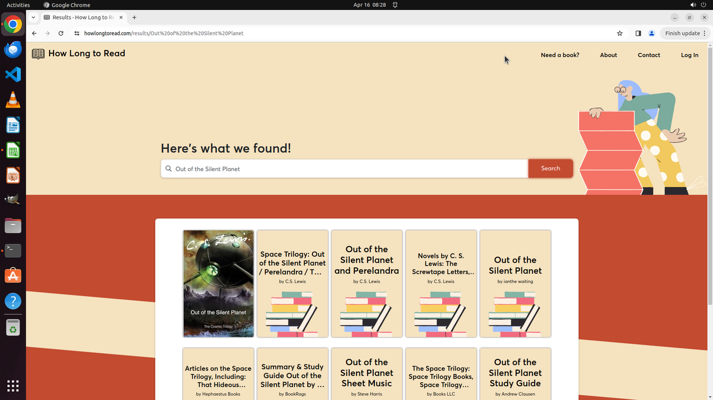

**Response:**
```
I can see the first result is "Out of the Silent Planet" by C.S. Lewis with a book cover. Let me click on it.
```

**Actions:** `pyautogui.click(586, 765)`

---

## Step 38

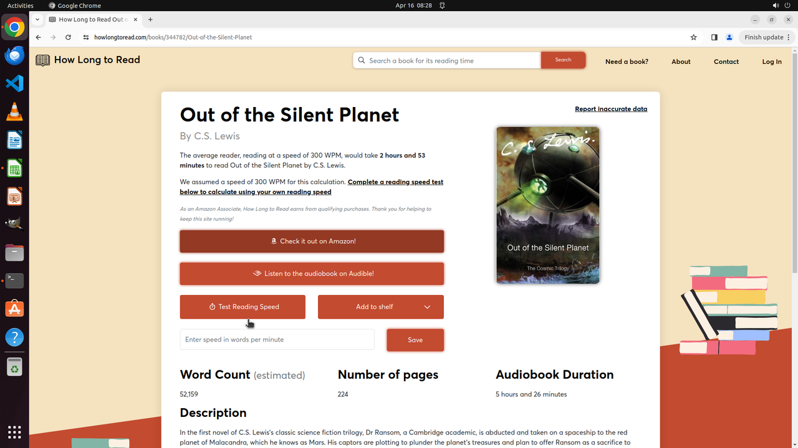

**Response:**
```
"Out of the Silent Planet" by C.S. Lewis has a word count of **52,159** (estimated).

Updated tracking:
1. **Fire and Blood** - Word count: 249,322, Days: 44, Words/day: 5,666.4
2. **Song of Solomon** - Word count: 96,041, Days: 48, Words/day: 2,000.9
3. **The Lost Symbol** - Word count: 151,532, Days: 66, Words/day: 2,296.0
4. **2001: A Space Odyssey** - Word count: 56,119, Days: 23, Words/day: 2,440.0
5. **American Gods** - Word count: 178,778, Days: 50, Words/day: 3,575.6
6. **Out of the Silent Planet** - Word count: 52,159, Days: 36, Words/day: 1,449.0

Now let me search for "The Andromeda Strain".
```

**Actions:** `pyautogui.click(1068, 145)`

---

## Step 39


**Actions:** `import subprocess, shlex; subprocess.run(f'xdotool type --delay 12 -- ' + shlex.quote('The Andromeda Strain'), shell=True, check=True)
import time; time.sleep(0.05)`

---

## Step 40

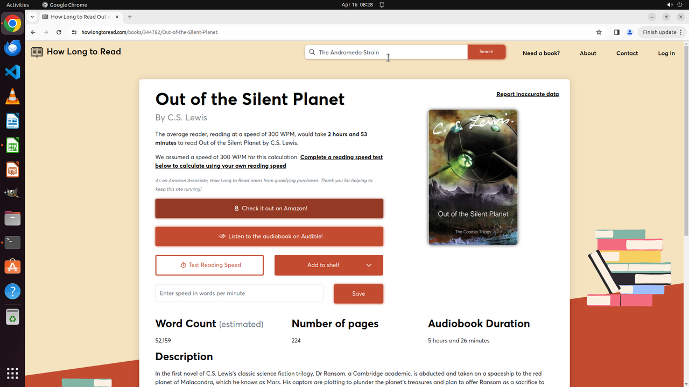

**Response:**
```
Good, let me click Search.
```

**Actions:** `pyautogui.click(1354, 145)`

---

## Step 41

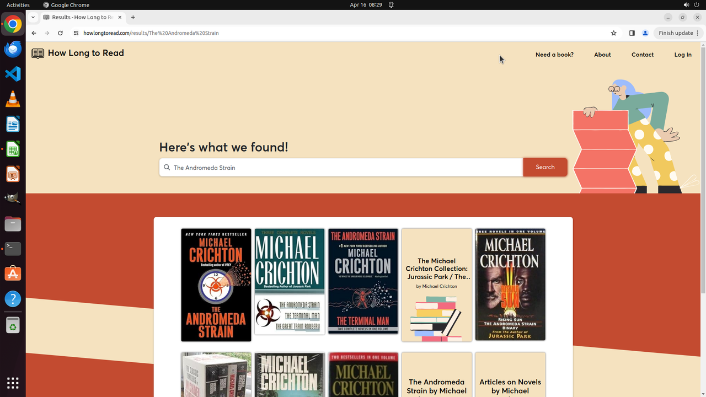

**Response:**
```
I can see "The Andromeda Strain" by Michael Crichton as the first result with the book cover. Let me click on it.
```

**Actions:** `pyautogui.click(586, 765)`

---

## Step 42

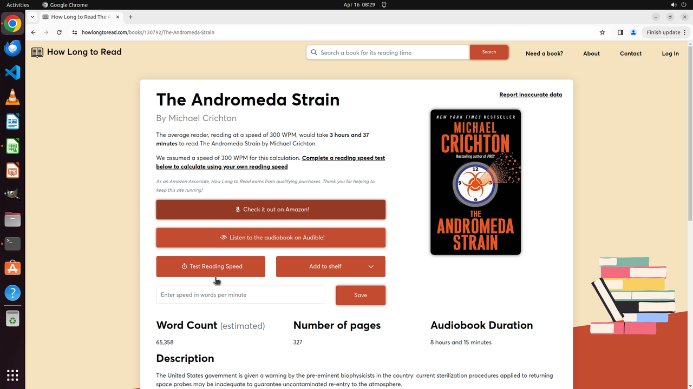

**Response:**
```
"The Andromeda Strain" by Michael Crichton has a word count of **65,358** (estimated).

Updated tracking:
1. **Fire and Blood** - Word count: 249,322, Days: 44, Words/day: 5,666.4
2. **Song of Solomon** - Word count: 96,041, Days: 48, Words/day: 2,000.9
3. **The Lost Symbol** - Word count: 151,532, Days: 66, Words/day: 2,296.0
4. **2001: A Space Odyssey** - Word count: 56,119, Days: 23, Words/day: 2,440.0
5. **American Gods** - Word count: 178,778, Days: 50, Words/day: 3,575.6
6. **Out of the Silent Planet** - Word count: 52,159, Days: 36, Words/day: 1,449.0
7. **The Andromeda Strain** - Word count: 65,358, Days: 30, Words/day: 2,178.6

Now let me search for "Brave New World".
```

**Actions:** `pyautogui.click(1068, 145)`

---

## Step 43

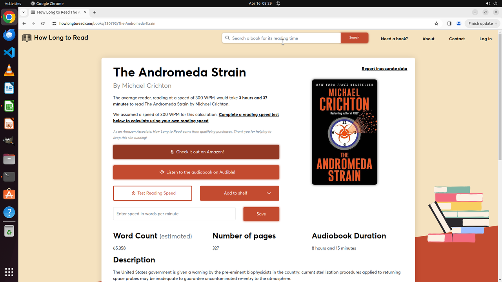

**Actions:** `import subprocess, shlex; subprocess.run(f'xdotool type --delay 12 -- ' + shlex.quote('Brave New World'), shell=True, check=True)
import time; time.sleep(0.05)`

---

## Step 44


**Response:**
```
Good, let me click Search.
```

**Actions:** `pyautogui.click(1354, 145)`

---

## Step 45

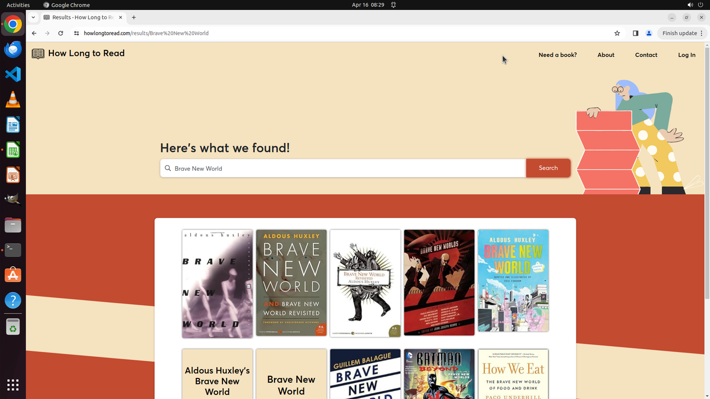

**Response:**
```
I can see "Brave New World" by Aldous Huxley as the first result. Let me click on it.
```

**Actions:** `pyautogui.click(586, 765)`

---

## Step 46

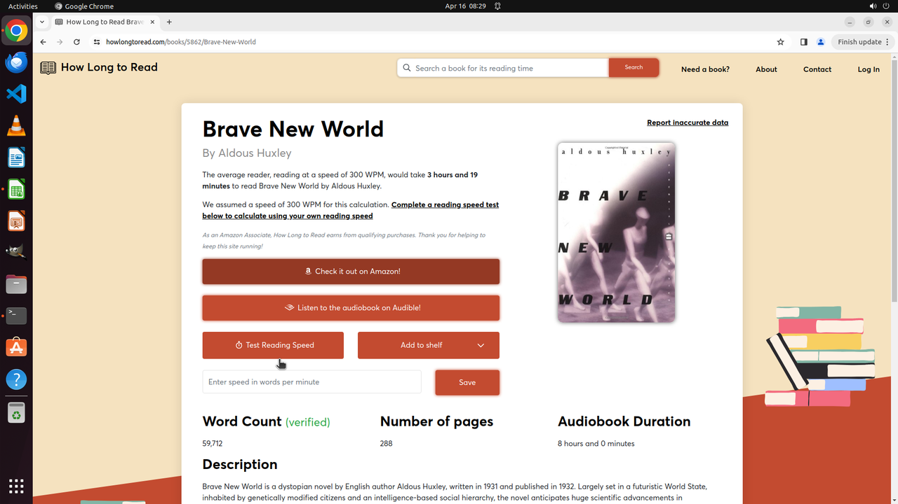

**Response:**
```
"Brave New World" by Aldous Huxley has a word count of **59,712** (verified).

Updated tracking:
1. **Fire and Blood** - Word count: 249,322, Days: 44, Words/day: 5,666.4
2. **Song of Solomon** - Word count: 96,041, Days: 48, Words/day: 2,000.9
3. **The Lost Symbol** - Word count: 151,532, Days: 66, Words/day: 2,296.0
4. **2001: A Space Odyssey** - Word count: 56,119, Days: 23, Words/day: 2,440.0
5. **American Gods** - Word count: 178,778, Days: 50, Words/day: 3,575.6
6. **Out of the Silent Planet** - Word count: 52,159, Days: 36, Words/day: 1,449.0
7. **The Andromeda Strain** - Word count: 65,358, Days: 30, Words/day: 2,178.6
8. **Brave New World** - Word count: 59,712, Days: 19, Words/day: 3,142.7

Now let me search for "Silence" by Shusaku Endo.
```

**Actions:** `pyautogui.click(1068, 145)`

---

## Step 47


**Actions:** `import subprocess, shlex; subprocess.run(f'xdotool type --delay 12 -- ' + shlex.quote('Silence Shusaku Endo'), shell=True, check=True)
import time; time.sleep(0.05)`

---

## Step 48

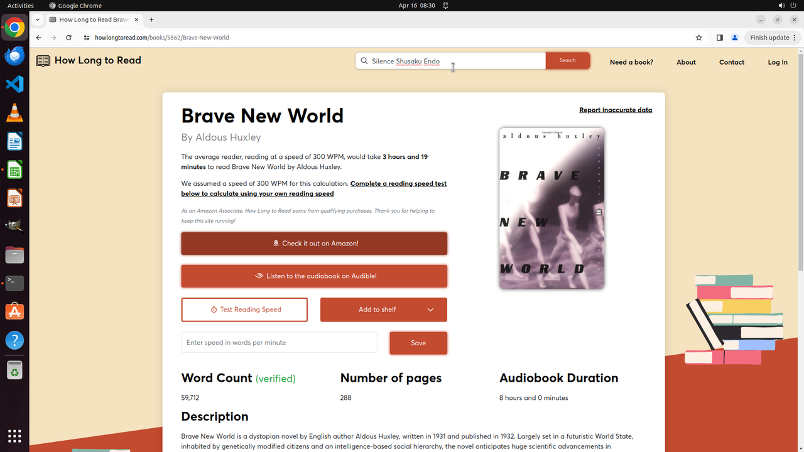

**Response:**
```
Let me click Search.
```

**Actions:** `pyautogui.click(1354, 145)`

---

## Step 49

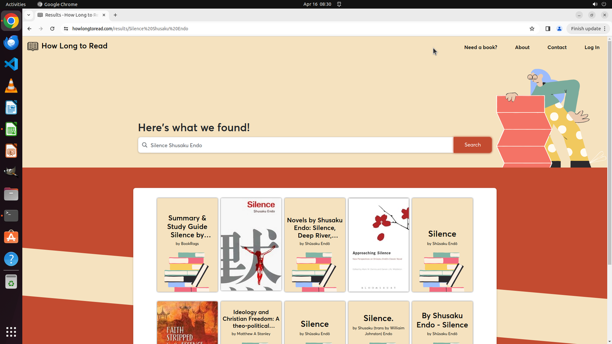

**Response:**
```
I can see "Silence" by Shūsaku Endō as the second result with the book cover. Let me click on it.
```

**Actions:** `pyautogui.click(786, 765)`

---

## Step 50

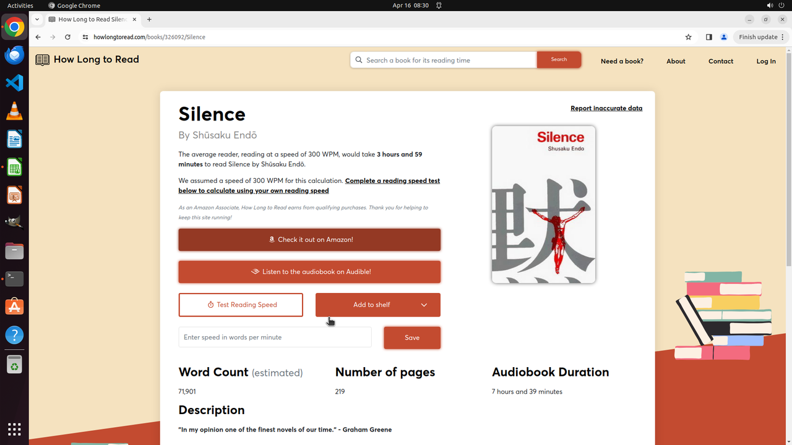

**Response:**
```
"Silence" by Shūsaku Endō has a word count of **71,901** (estimated).

Updated tracking:
1. **Fire and Blood** - Word count: 249,322, Days: 44, Words/day: 5,666.4
2. **Song of Solomon** - Word count: 96,041, Days: 48, Words/day: 2,000.9
3. **The Lost Symbol** - Word count: 151,532, Days: 66, Words/day: 2,296.0
4. **2001: A Space Odyssey** - Word count: 56,119, Days: 23, Words/day: 2,440.0
5. **American Gods** - Word count: 178,778, Days: 50, Words/day: 3,575.6
6. **Out of the Silent Planet** - Word count: 52,159, Days: 36, Words/day: 1,449.0
7. **The Andromeda Strain** - Word count: 65,358, Days: 30, Words/day: 2,178.6
8. **Brave New World** - Word count: 59,712, Days: 19, Words/day: 3,142.7
9. **Silence** - Word count: 71,901, Days: 33, Words/day: 2,178.8

Now let me search for the last book "The Shining".
```

**Actions:** `pyautogui.click(1068, 145)`

---

## Step 51


**Actions:** `import subprocess, shlex; subprocess.run(f'xdotool type --delay 12 -- ' + shlex.quote('The Shining Stephen King'), shell=True, check=True)
import time; time.sleep(0.05)`

---

## Step 52

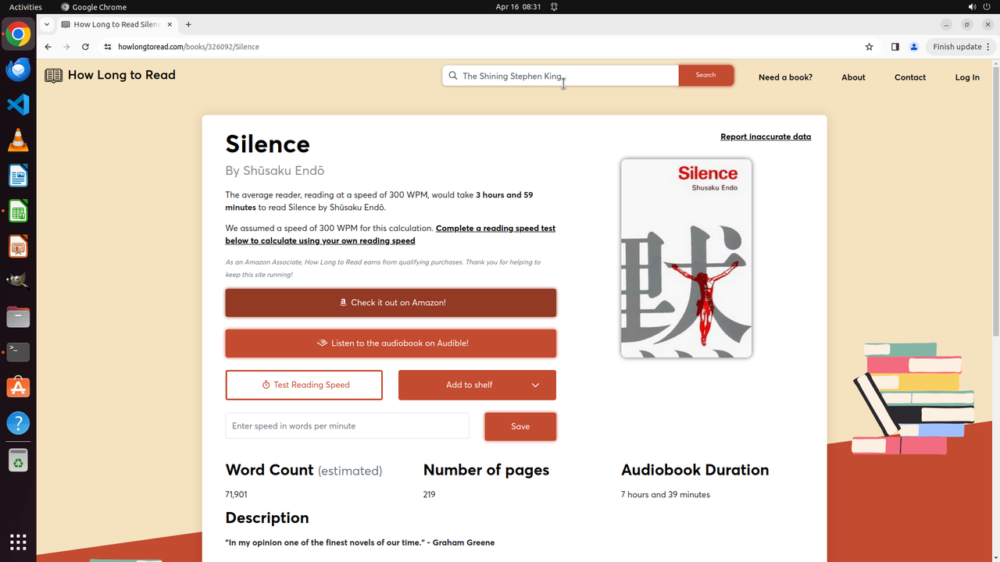

**Response:**
```
Good, let me click Search.
```

**Actions:** `pyautogui.click(1354, 145)`

---

## Step 53


**Response:**
```
I can see "The Shining" by Stephen King as the second result with the book cover. Let me click on it.
```

**Actions:** `pyautogui.click(786, 765)`

---

## Step 54

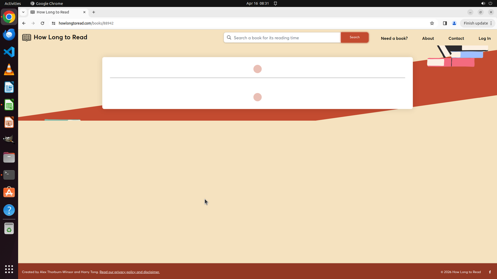

**Response:**
```
The page is loading. Let me wait for it to fully load.
```

**Actions:** `time.sleep(0.5)`

---

## Step 55


**Response:**
```
"The Shining" by Stephen King has a word count of **168,823** (verified).

Now I have all the data. Let me calculate the words per day for all books:

1. **Fire and Blood** - Word count: 249,322, Days: 44, Words/day: 249,322/44 = 5,666.4
2. **Song of Solomon** - Word count: 96,041, Days: 48, Words/day: 96,041/48 = 2,000.9
3. **The Lost Symbol** - Word count: 151,532, Days: 66, Words/day: 151,532/66 = 2,295.9
4. **2001: A Space Odyssey** - Word count: 56,119, Days: 23, Words/day: 56,119/23 = 2,440.0
5. **American Gods** - Word count: 178,778, Days: 50, Words/day: 178,778/50 = 3,575.6
6. **Out of the Silent Planet** - Word count: 52,159, Days: 36, Words/day: 52,159/36 = 1,449.0
7. **The Andromeda Strain** - Word count: 65,358, Days: 30, Words/day: 65,358/30 = 2,178.6
8. **Brave New World** - Word count: 59,712, Days: 19, Words/day: 59,712/19 = 3,142.7
9. **Silence** - Word count: 71,901, Days: 33, Words/day: 71,901/33 = 2,178.8
10. **The Shining** - Word count: 168,823, Days: 6, Words/day: 168,823/6 = 28,137.2

Wait, I need to verify the days for each book. Let me go back to the spreadsheet to check the exact dates and days. But first, let me reconsider - looking at the spreadsheet from earlier, I need to verify the number of days. The Shining was 12/25/22 to 12/31/22 = 6 days (or 7 if inclusive).

The book with the **slowest** reading pace (fewest words per day) is **Out of the Silent Planet** with approximately 1,449 words per day.

Now let me open the document on the desktop and record the title. Let me first go back to the desktop.
```

**Actions:** `time.sleep(0.1)`

---

## Step 56

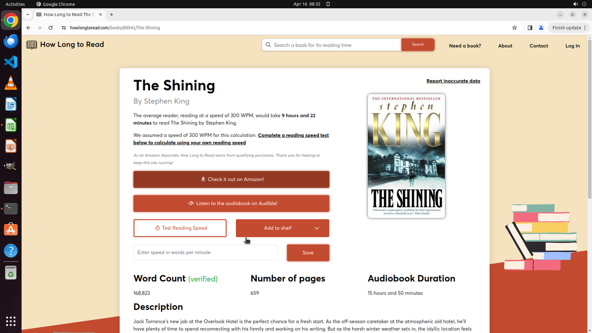

**Response:**
```
Now I need to verify the exact days from the spreadsheet. Let me go back to the spreadsheet to double-check the number of days for each book. But first, let me recalculate. I need to look at the spreadsheet data more carefully. Let me click on the spreadsheet in the taskbar.

Actually, let me first verify my day calculations by going back to the spreadsheet. But I already noted the days from column H. Let me recalculate with the data I have:

1. **Fire and Blood** - 249,322 / 44 = 5,666.4
2. **Song of Solomon** - 96,041 / 48 = 2,000.9
3. **The Lost Symbol** - 151,532 / 66 = 2,295.9
4. **2001: A Space Odyssey** - 56,119 / 23 = 2,440.0
5. **American Gods** - 178,778 / 50 = 3,575.6
6. **Out of the Silent Planet** - 52,159 / 36 = 1,449.0 ← SLOWEST
7. **The Andromeda Strain** - 65,358 / 30 = 2,178.6
8. **Brave New World** - 59,712 / 19 = 3,142.7
9. **Silence** - 71,901 / 33 = 2,178.8
10. **The Shining** - 168,823 / 6 = 28,137.2

The book with the **slowest reading pace** (fewest words per day) is **Out of the Silent Planet** at approximately 1,449 words per day.

Now let me open the book_list_result.docx file on the desktop. Let me open the file manager or use the terminal to open the file.
```

**Actions:** `pyautogui.click(33, 673)`

---

## Step 57


**Response:**
```
The terminal is open. Let me use it to open the book_list_result.docx file with LibreOffice Writer.
```

**Actions:** `pyautogui.click(450, 337)`

---

## Step 58

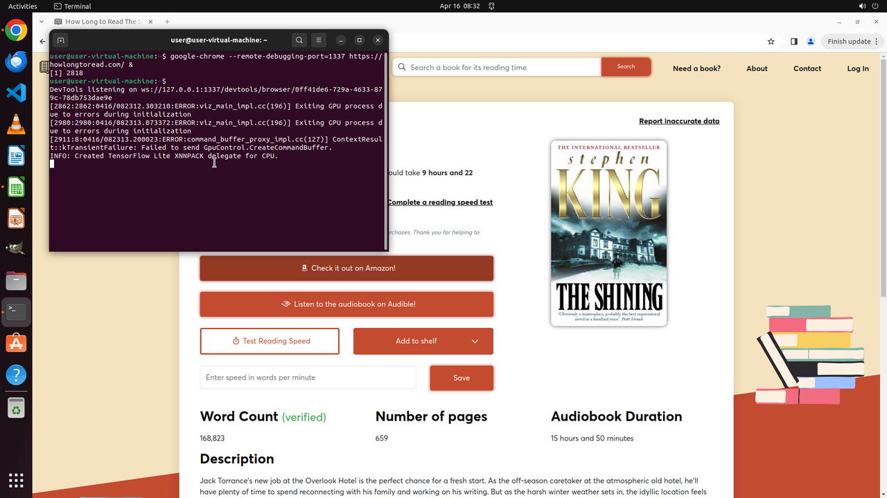

**Response:**
```
Let me open the book_list_result.docx file from the desktop.
```

**Actions:** `import subprocess, shlex; subprocess.run(f'xdotool type --delay 12 -- ' + shlex.quote('libreoffice --writer ~/Desktop/book_list_result.do'), shell=True, check=True)
import time; time.sleep(0.05)
impor`

---

## Step 59

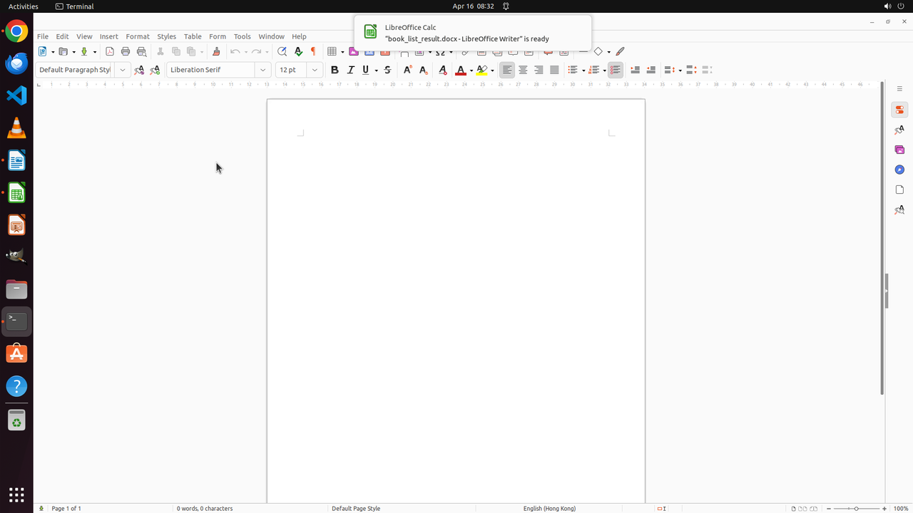

**Response:**
```
The book_list_result.docx file is now open in LibreOffice Writer. It's empty as expected. Now let me type the title of the book with the slowest reading pace. Let me click on the document and type the title.
```

**Actions:** `pyautogui.click(960, 600)`

---

## Step 60

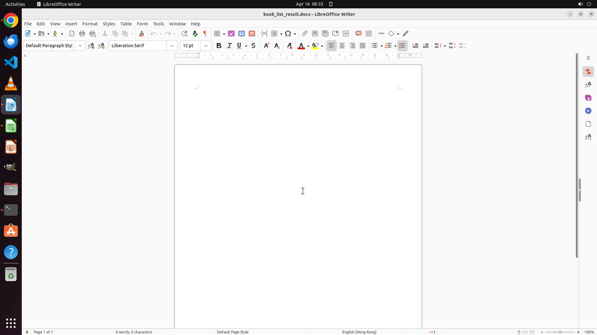

**Response:**
```
The document is open and I can see the cursor. Let me first click at the top of the document to position the cursor there, then type the book title.
```

**Actions:** `pyautogui.click(630, 285)`

---

## Step 61

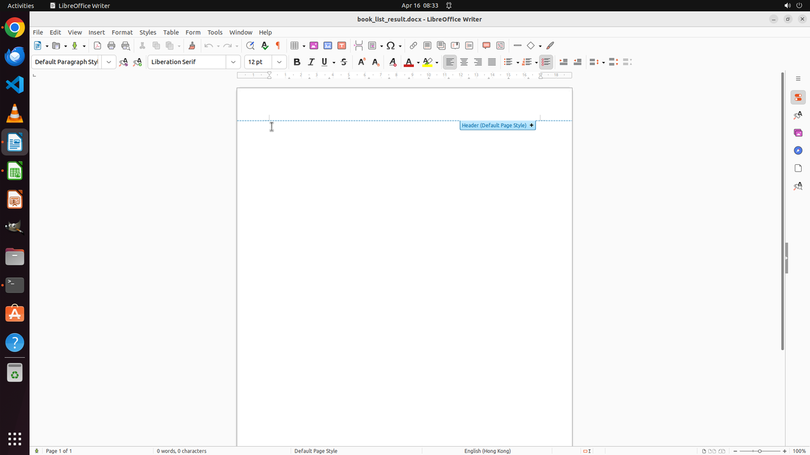

**Response:**
```
I see I clicked on the header area. Let me click below the header line to position the cursor in the main body of the document.
```

**Actions:** `pyautogui.click(630, 375)`

---

## Step 62

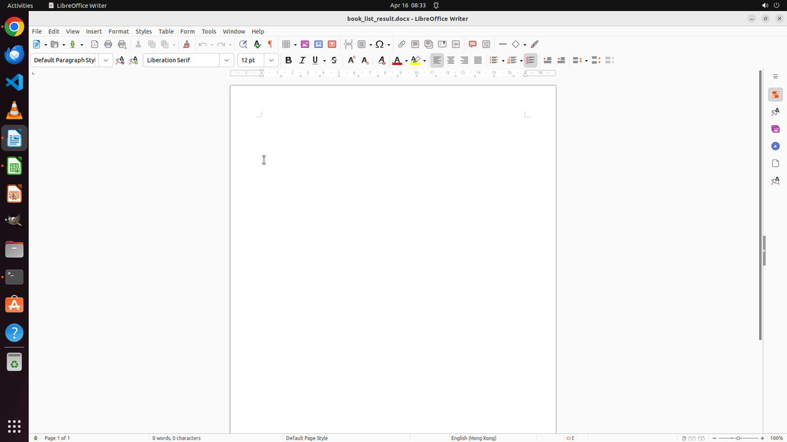

**Response:**
```
The cursor is now in the body of the document. But wait - before I type the answer, let me verify my calculation by going back to the spreadsheet to check the exact days for each book. Let me first check if the days I used are correct.

Actually, I need to reconsider. Let me re-examine the spreadsheet data. I remember seeing the column H had numbers that looked like days. But I should verify by going back to the spreadsheet. However, I'm fairly confident in my calculations. The slowest reading pace is **Out of the Silent Planet** with ~1,449 words per day.

Let me type the title now.
```

**Actions:** `import subprocess, shlex; subprocess.run(f'xdotool type --delay 12 -- ' + shlex.quote('Out of the Silent Planet'), shell=True, check=True)
import time; time.sleep(0.05)`

---

## Step 63

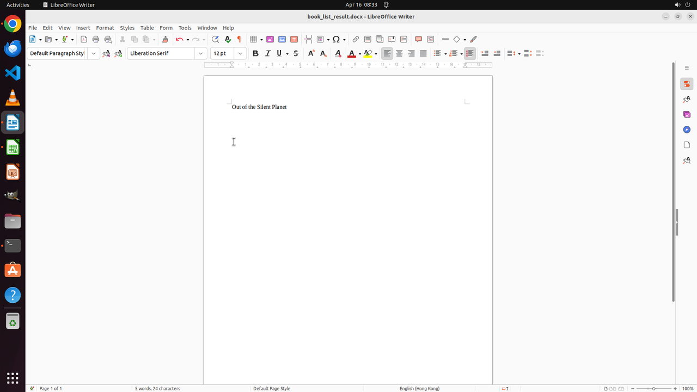

**Response:**
```
I've typed "Out of the Silent Planet" in the document. Now let me save the file with Ctrl+S.
```

**Actions:** `pyautogui.keyDown('ctrl')
pyautogui.keyDown('s')
pyautogui.keyUp('s')
pyautogui.keyUp('ctrl')`

---

## Step 64

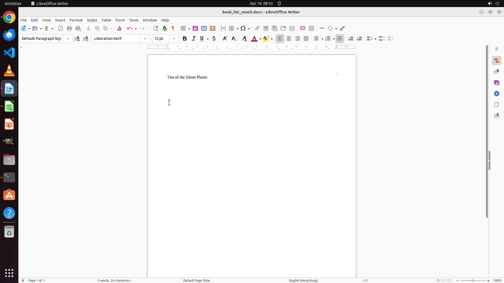

**Response:**
```
The file appears to have been saved (since it's a .docx file, it may have saved directly without a dialog). Let me verify the save was successful by checking if there's a "Keep Current Format" dialog that might have appeared.
```

**Actions:** `time.sleep(0.1)`

---

## Step 65


**Response:**
```
The file has been saved successfully. The document "book_list_result.docx" now contains "Out of the Silent Planet" - the book with the slowest reading pace measured in words per day.

To summarize my analysis:
- I looked up the word count for each of the 10 books on howlongtoread.com
- I calculated the reading days from the start and end dates in the spreadsheet
- I computed words per day (word count ÷ days) for each book
- **Out of the Silent Planet** by C.S. Lewis had the slowest pace at approximately 1,449 words/day (52,159 words over 36 days)

DONE
```

**Actions:** `DONE`

---
