# Task da52d699-e8d2-4dc5-9191-a2199e0b6a9b

**Instruction:** Examine the spreadsheet on the desktop, which contains a record of books read in 2022. Take the website https://howlongtoread.com/ as a reference to identify the book with the slowest reading pace, measured in words per day. I have an empty document named 'book_list_result.docx' on the desktop; please open it and record the title there.

**Score:** 1

**Wall clock:** 10m 3s

**Steps:** 58

**Cost:** $2.05

---

## Step 1

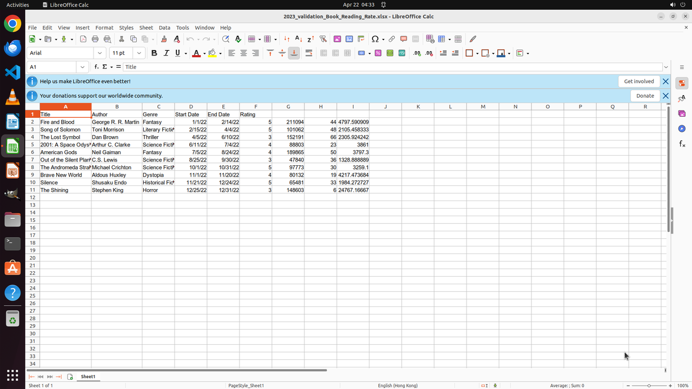

**Response:**
```
I can see the spreadsheet with book reading records. Let me first analyze the data. I need to understand the columns and calculate reading pace (words per day). Let me first check what columns H and I contain.
```

**Actions:** `pyautogui.click(894, 316)`

---

## Step 2

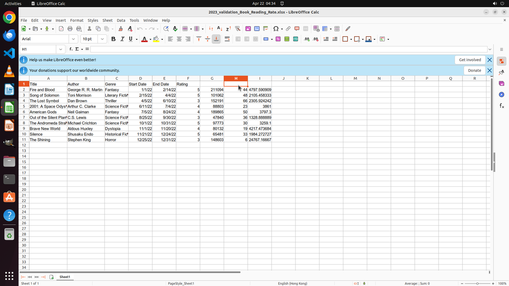

**Response:**
```
I can see that column H is empty (no header). Let me check the data more carefully. The columns are:
- A: Title
- B: Author
- C: Genre
- D: Start Date
- E: End Date
- F: Rating
- G: Word count (appears to be)
- H: Days (appears to be)
- I: Words per day (appears to be)

Let me look at the data more carefully. I need to check what columns G, H, and I represent. Let me look at column I which seems to have "words per day" values. But first, I need to understand the task - I need to find the book with the slowest reading pace (words per day) using howlongtoread.com as reference for word counts.

Let me first note down the books and their details from the spreadsheet:

1. Fire and Blood - George R.R. Martin - 1/1/22 to 2/14/22 (44 days) - 211094 words - 4797.59 words/day
2. Song of Solomon - Toni Morrison - 2/15/22 to 4/4/22 (48 days) - 101062 words - 2105.46 words/day
3. The Lost Symbol - Dan Brown - 4/5/22 to 6/10/22 (66 days) - 152191 words - 2305.92 words/day
4. 2001: A Space Odyssey - Arthur C. Clarke - 6/11/22 to 7/4/22 (23 days) - 88803 words - 3861 words/day (approx)
5. American Gods - Neil Gaiman - 7/5/22 to 8/24/22 (50 days) - 189665 words - 3797.3 words/day
6. Out of the Silent Planet - C.S. Lewis - 8/25/22 to 9/30/22 (36 days) - 47840 words - 1328.89 words/day
7. The Andromeda Strain - Michael Crichton - 10/1/22 to 10/31/22 (30 days) - 97773 words - 3259.1 words/day
8. Brave New World - Aldous Huxley - 11/1/22 to 11/20/22 (19 days) - 80132 words - 4217.47 words/day
9. Silence - Shusaku Endo - 11/21/22 to 12/24/22 (33 days) - 65481 words - 1984.27 words/day
10. The Shining - Stephen King - 12/25/22 to 12/31/22 (6 days) - 148603 words - 24767.17 words/day

However, the task says to use howlongtoread.com as reference for word counts. The word counts in the spreadsheet (column G) might not match the website. I need to look up each book's word count on howlongtoread.com and recalculate. Let me start by checking the books on the website.

Let me open Chrome first.
```

**Actions:** `pyautogui.click(988, 337)`

---

## Step 3


**Response:**
```
Now I can see that column I has the formula `=G2/H2`, which means:
- Column G = Word count
- Column H = Days to read
- Column I = Words per day (G/H)

The task says to use howlongtoread.com as reference to get word counts. The current column I values are calculated from the spreadsheet's word counts. I need to look up the actual word counts from howlongtoread.com for each book and recalculate words per day.

Let me note the books and their reading days (column H):
1. Fire and Blood - 44 days
2. Song of Solomon - 48 days
3. The Lost Symbol - 66 days
4. 2001: A Space Odyssey - 23 days
5. American Gods - 50 days
6. Out of the Silent Planet - 36 days
7. The Andromeda Strain - 30 days
8. Brave New World - 19 days
9. Silence - 33 days
10. The Shining - 6 days

Now let me open Chrome and look up each book on howlongtoread.com.
```

**Actions:** `pyautogui.keyDown('ctrl')
pyautogui.keyDown('alt')
pyautogui.keyDown('t')
pyautogui.keyUp('t')
pyautogui.keyUp('alt')
pyautogui.keyUp('ctrl')`

---

## Step 4

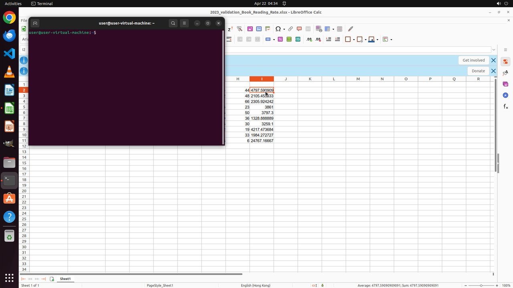

**Response:**
```
Good, the terminal is open. Let me launch Chrome with the remote debugging port.
```

**Actions:** `import subprocess, shlex; subprocess.run(f'xdotool type --delay 12 -- ' + shlex.quote('google-chrome --remote-debugging-port=1337 https:/'), shell=True, check=True)
import time; time.sleep(0.05)
impor`

---

## Step 5

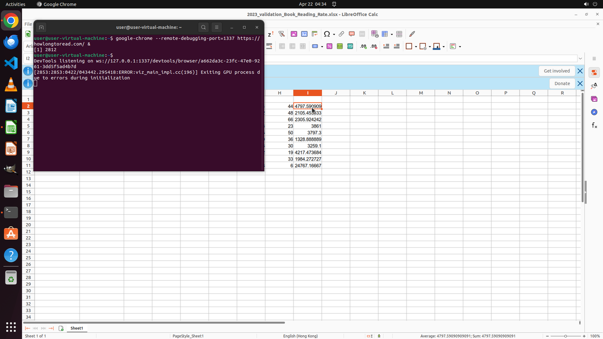

**Response:**
```
Chrome is launching. Let me wait a moment and then click on the Chrome window to see the website.
```

**Actions:** `time.sleep(0.5)`

---

## Step 6


**Response:**
```
The howlongtoread.com website is loaded. Let me close the Chrome update notification and start searching for each book. I'll begin with the first book "Fire and Blood".
```

**Actions:** `pyautogui.click(1888, 139)`

---

## Step 7


**Response:**
```
Good, the notification is closed. Now let me search for the first book "Fire and Blood" by George R.R. Martin.
```

**Actions:** `pyautogui.click(930, 595)`

---

## Step 8


**Response:**
```
Now let me search for the first book.
```

**Actions:** `import subprocess, shlex; subprocess.run(f'xdotool type --delay 12 -- ' + shlex.quote('Fire and Blood'), shell=True, check=True)
import time; time.sleep(0.05)`

---

## Step 9


**Actions:** `pyautogui.click(1480, 595)`

---

## Step 10

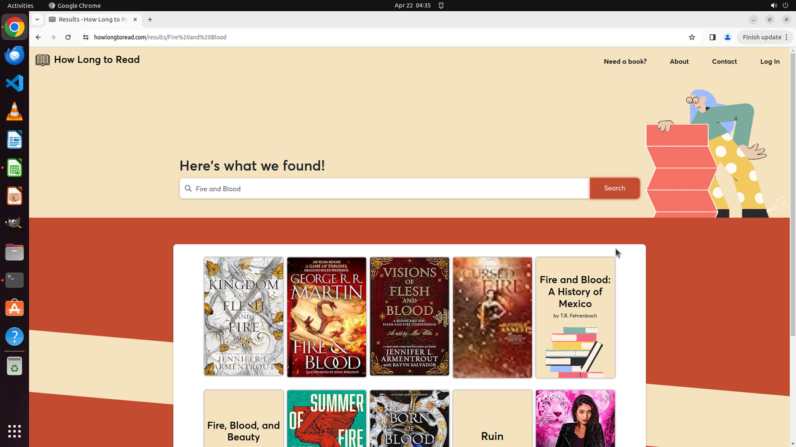

**Response:**
```
I can see the search results. The second book "Fire & Blood" by George R.R. Martin is the one I'm looking for. Let me click on it.
```

**Actions:** `pyautogui.click(790, 765)`

---

## Step 11


**Response:**
```
I can see "Fire & Blood" by George R.R. Martin has a word count of **249,322**. The spreadsheet shows 211,094 which is different. Let me note this and continue with the other books.

Now let me search for the next book "Song of Solomon" by Toni Morrison.
```

**Actions:** `pyautogui.click(1065, 145)`

---

## Step 12


**Actions:** `import subprocess, shlex; subprocess.run(f'xdotool type --delay 12 -- ' + shlex.quote('Song of Solomon'), shell=True, check=True)
import time; time.sleep(0.05)`

---

## Step 13

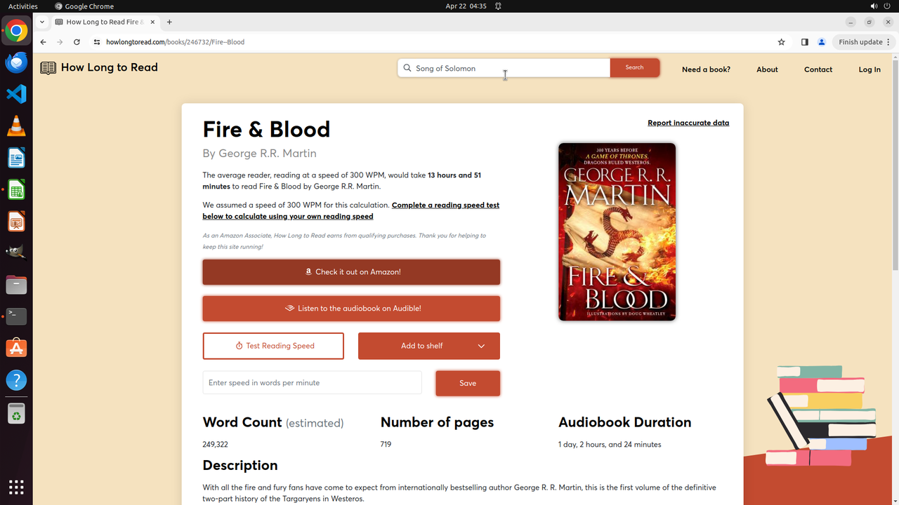

**Response:**
```
Good, I've typed "Song of Solomon" in the search box. Let me click Search.
```

**Actions:** `pyautogui.click(1351, 142)`

---

## Step 14


**Response:**
```
I can see "Song of Solomon" by Toni Morrison as the first result. Let me click on it.
```

**Actions:** `pyautogui.click(592, 765)`

---

## Step 15

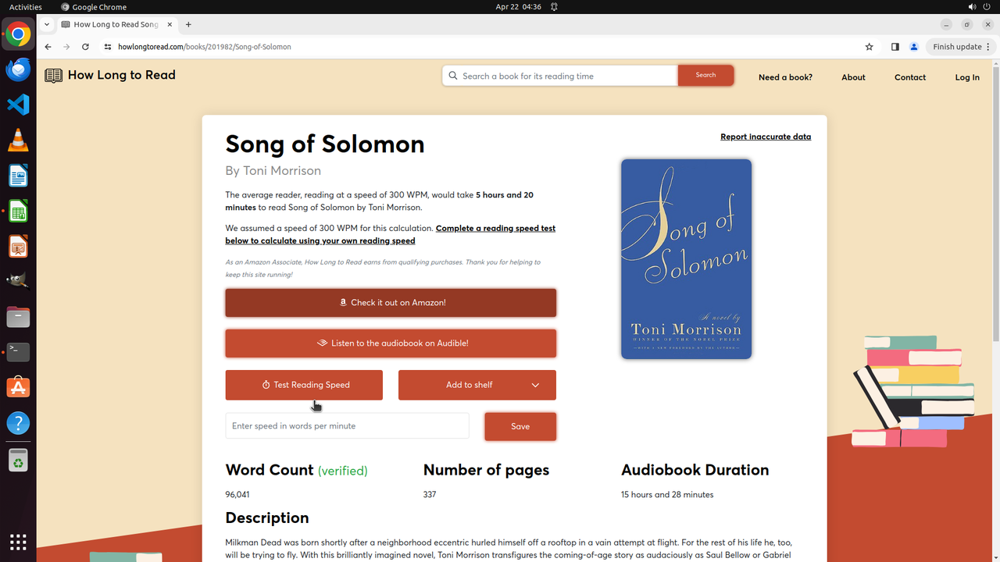

**Response:**
```
"Song of Solomon" by Toni Morrison has a word count of **96,041** (verified). Now let me search for the next book "The Lost Symbol" by Dan Brown.
```

**Actions:** `pyautogui.click(1065, 145)`

---

## Step 16


**Actions:** `import subprocess, shlex; subprocess.run(f'xdotool type --delay 12 -- ' + shlex.quote('The Lost Symbol'), shell=True, check=True)
import time; time.sleep(0.05)`

---

## Step 17

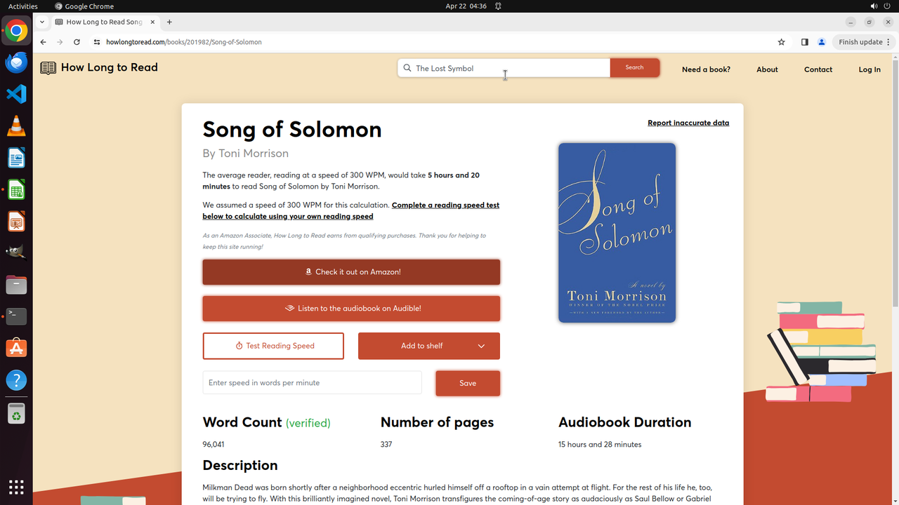

**Response:**
```
Good, I've typed "The Lost Symbol". Let me click Search.
```

**Actions:** `pyautogui.click(1351, 142)`

---

## Step 18

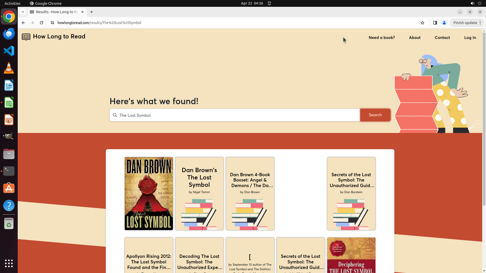

**Response:**
```
I can see "The Lost Symbol" by Dan Brown as the first result. Let me click on it.
```

**Actions:** `pyautogui.click(592, 765)`

---

## Step 19

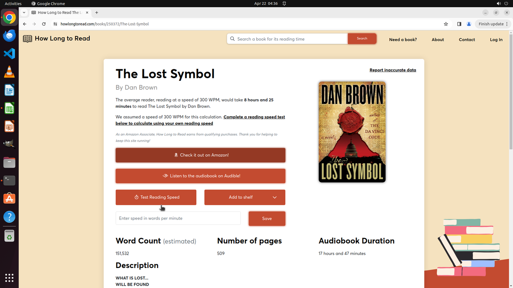

**Response:**
```
"The Lost Symbol" by Dan Brown has a word count of **151,532** (estimated). Now let me search for the next book "2001: A Space Odyssey" by Arthur C. Clarke.
```

**Actions:** `pyautogui.click(1065, 145)`

---

## Step 20

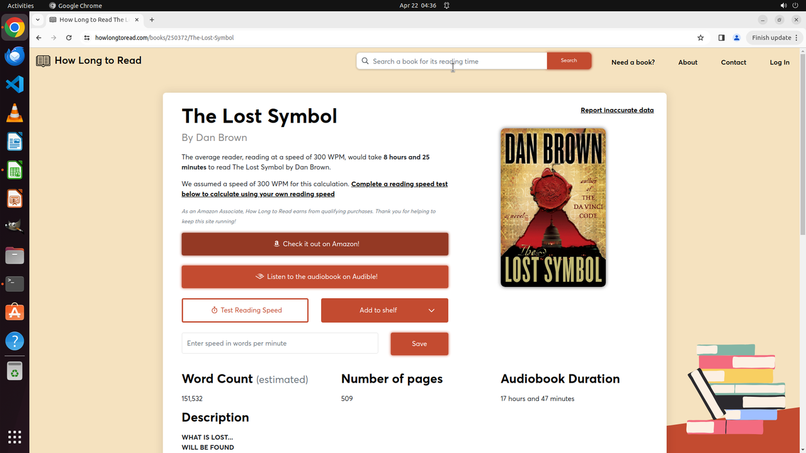

**Actions:** `import subprocess, shlex; subprocess.run(f'xdotool type --delay 12 -- ' + shlex.quote('2001 A Space Odyssey'), shell=True, check=True)
import time; time.sleep(0.05)`

---

## Step 21


**Response:**
```
Good, I've typed "2001 A Space Odyssey". Let me click Search.
```

**Actions:** `pyautogui.click(1351, 142)`

---

## Step 22

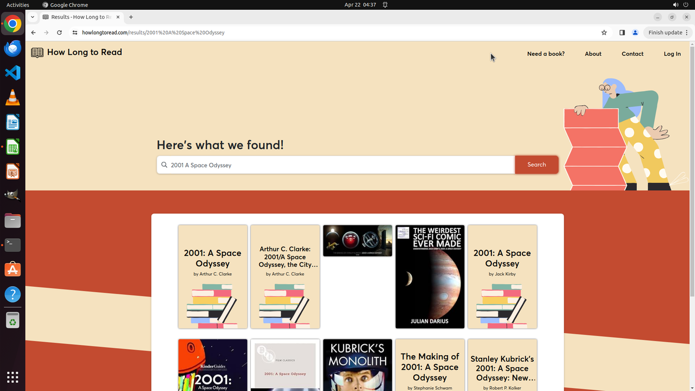

**Response:**
```
I can see "2001: A Space Odyssey" by Arthur C. Clarke as the first result. Let me click on it.
```

**Actions:** `pyautogui.click(592, 765)`

---

## Step 23

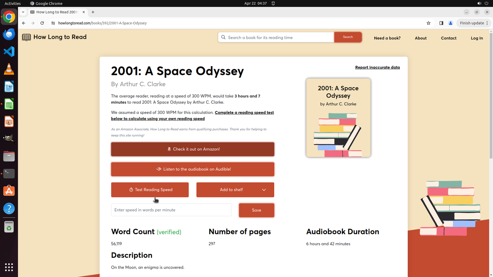

**Response:**
```
"2001: A Space Odyssey" by Arthur C. Clarke has a word count of **56,119** (verified). Now let me search for the next book "American Gods" by Neil Gaiman.
```

**Actions:** `pyautogui.click(1065, 145)`

---

## Step 24


**Actions:** `import subprocess, shlex; subprocess.run(f'xdotool type --delay 12 -- ' + shlex.quote('American Gods'), shell=True, check=True)
import time; time.sleep(0.05)`

---

## Step 25

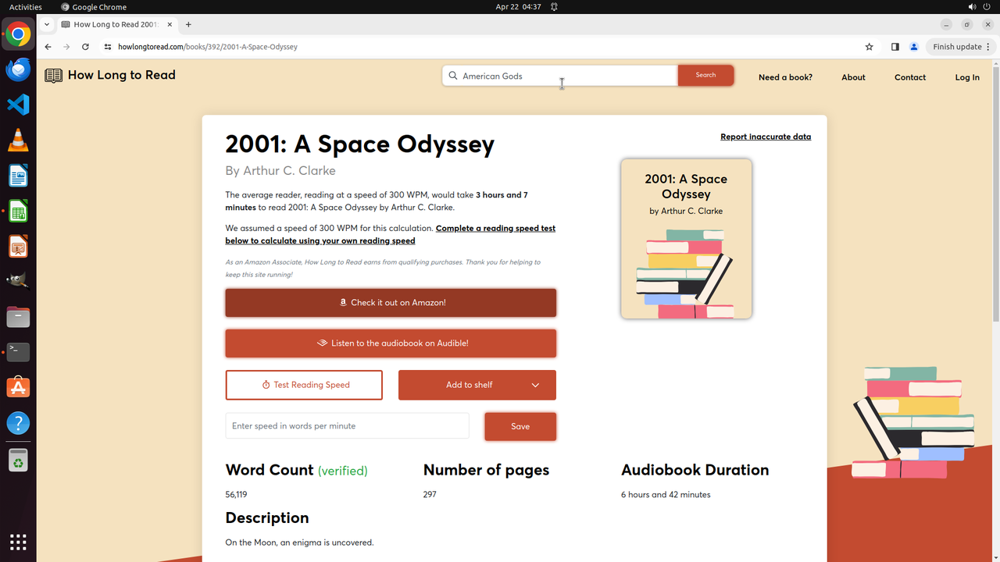

**Response:**
```
Good, let me click Search.
```

**Actions:** `pyautogui.click(1351, 142)`

---

## Step 26

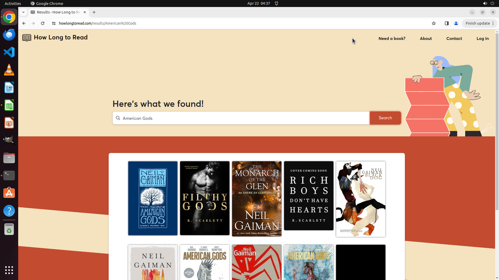

**Response:**
```
I can see "American Gods" by Neil Gaiman as the first result. Let me click on it.
```

**Actions:** `pyautogui.click(592, 765)`

---

## Step 27


**Response:**
```
The page is loading. Let me wait for it to fully load.
```

**Actions:** `time.sleep(0.5)`

---

## Step 28

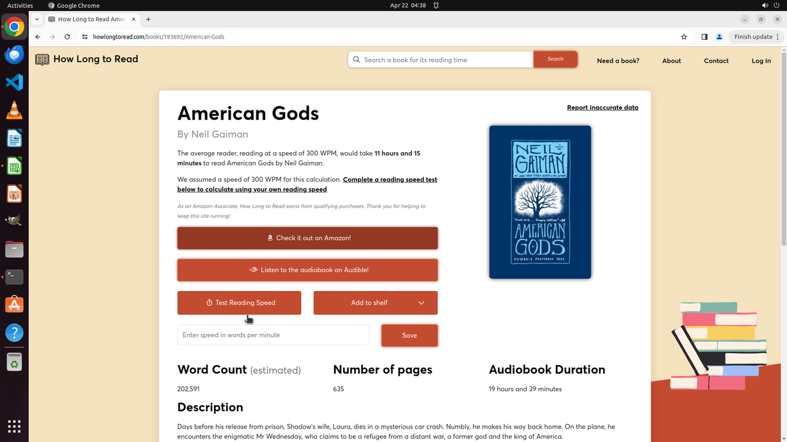

**Response:**
```
"American Gods" by Neil Gaiman has a word count of **202,591** (estimated). Now let me search for the next book "Out of the Silent Planet" by C.S. Lewis.
```

**Actions:** `pyautogui.click(1065, 145)`

---

## Step 29

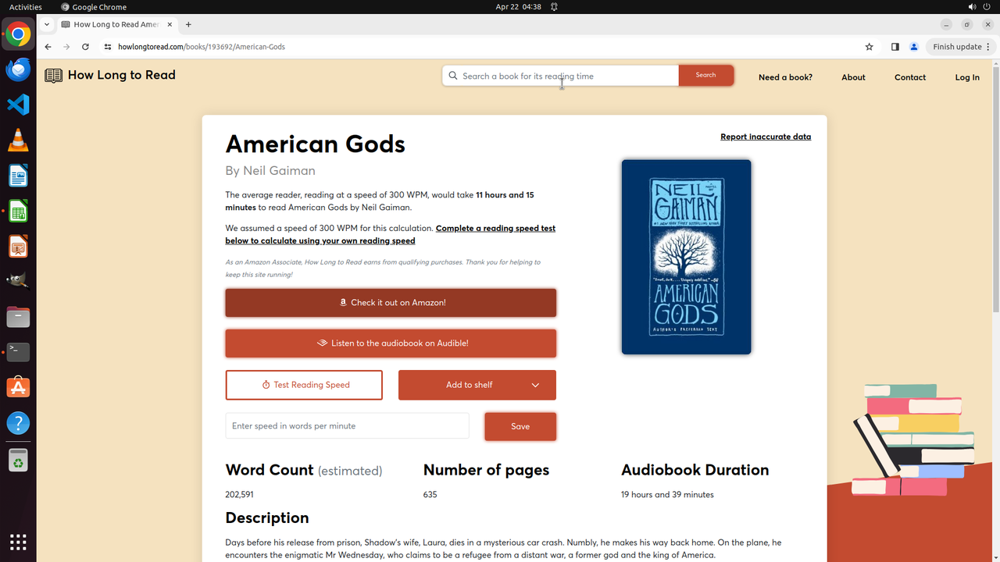

**Actions:** `import subprocess, shlex; subprocess.run(f'xdotool type --delay 12 -- ' + shlex.quote('Out of the Silent Planet'), shell=True, check=True)
import time; time.sleep(0.05)`

---

## Step 30


**Response:**
```
Good, I've typed "Out of the Silent Planet". Let me click Search.
```

**Actions:** `pyautogui.click(1351, 142)`

---

## Step 31

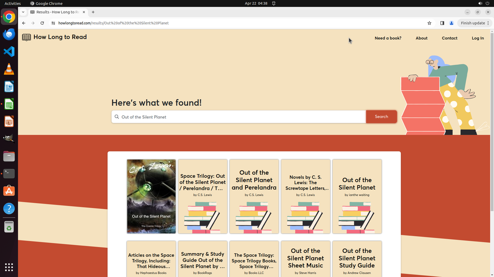

**Response:**
```
I can see the first result is "Space Trilogy: Out of the Silent Planet / Perelandra / T..." by C.S. Lewis, which is a collection. I need the standalone "Out of the Silent Planet". Let me click on the first result to check, or I can see "Out of the Silent Planet and Perelandra" by C.S. Lewis as the third option. Let me look for the standalone book. The first result seems to be the trilogy collection. Let me click on the first one to check.
```

**Actions:** `pyautogui.click(592, 765)`

---

## Step 32

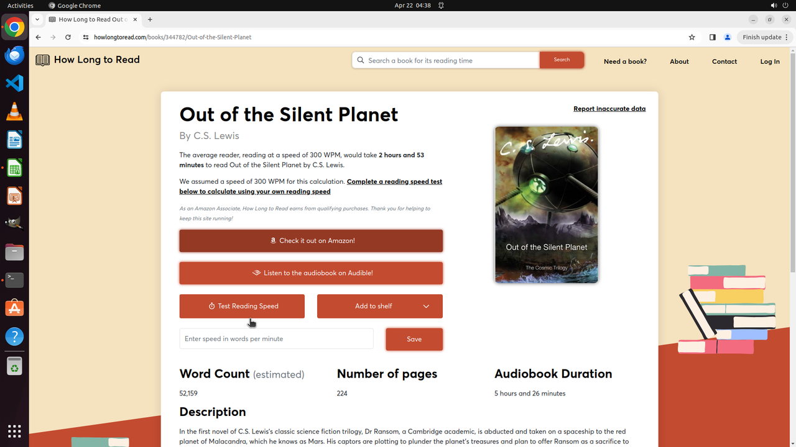

**Response:**
```
"Out of the Silent Planet" by C.S. Lewis has a word count of **52,159** (estimated). Now let me search for the next book "The Andromeda Strain" by Michael Crichton.
```

**Actions:** `pyautogui.click(1065, 145)`

---

## Step 33

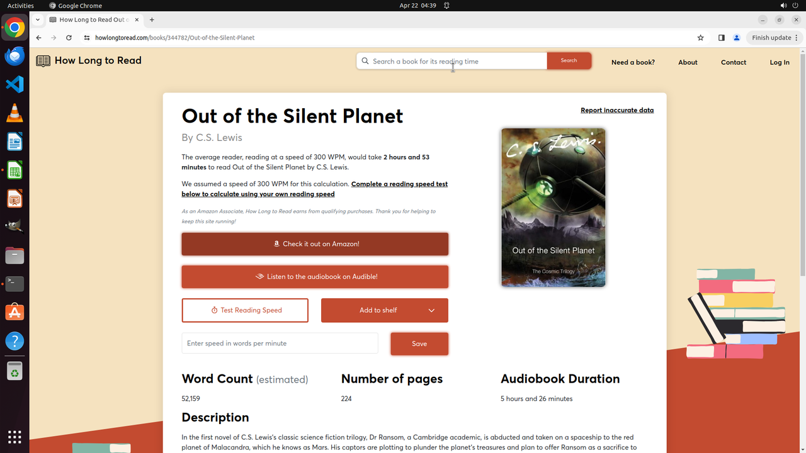

**Actions:** `import subprocess, shlex; subprocess.run(f'xdotool type --delay 12 -- ' + shlex.quote('The Andromeda Strain'), shell=True, check=True)
import time; time.sleep(0.05)`

---

## Step 34


**Response:**
```
Good, let me click Search.
```

**Actions:** `pyautogui.click(1351, 142)`

---

## Step 35

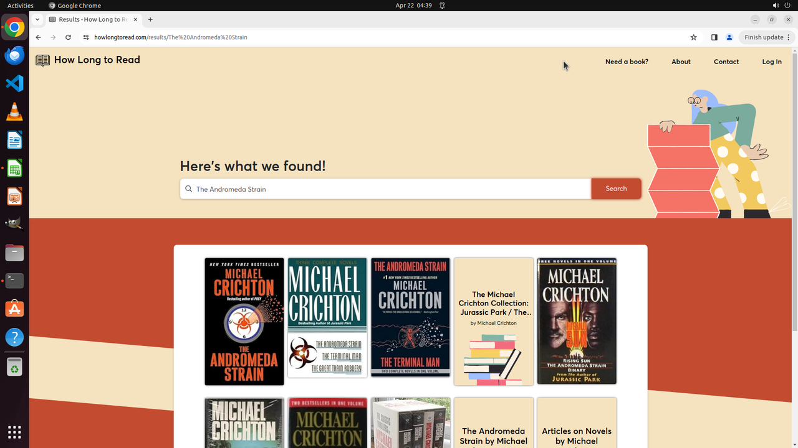

**Response:**
```
I can see "The Andromeda Strain" by Michael Crichton as the first result. Let me click on it.
```

**Actions:** `pyautogui.click(592, 772)`

---

## Step 36

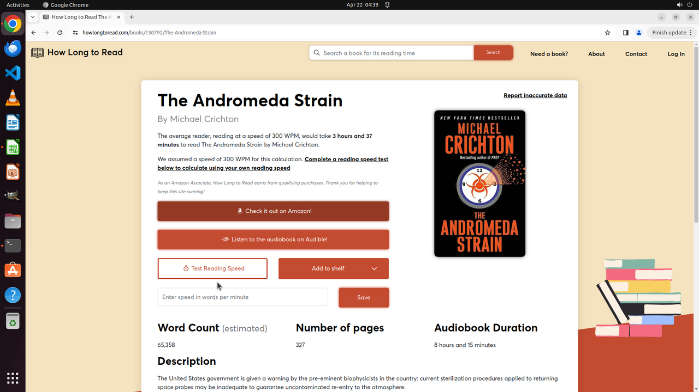

**Response:**
```
"The Andromeda Strain" by Michael Crichton has a word count of **65,358** (estimated). Now let me search for "Brave New World" by Aldous Huxley.
```

**Actions:** `pyautogui.click(1065, 145)`

---

## Step 37

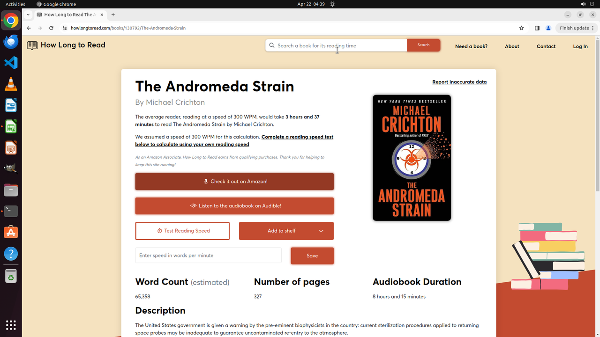

**Actions:** `import subprocess, shlex; subprocess.run(f'xdotool type --delay 12 -- ' + shlex.quote('Brave New World'), shell=True, check=True)
import time; time.sleep(0.05)`

---

## Step 38


**Response:**
```
Good, let me click Search.
```

**Actions:** `pyautogui.click(1351, 142)`

---

## Step 39

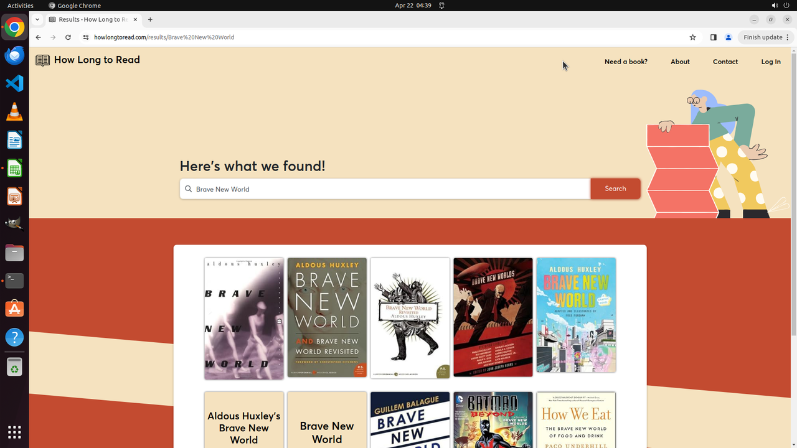

**Response:**
```
I can see "Brave New World" by Aldous Huxley as the first result. Let me click on it.
```

**Actions:** `pyautogui.click(592, 765)`

---

## Step 40

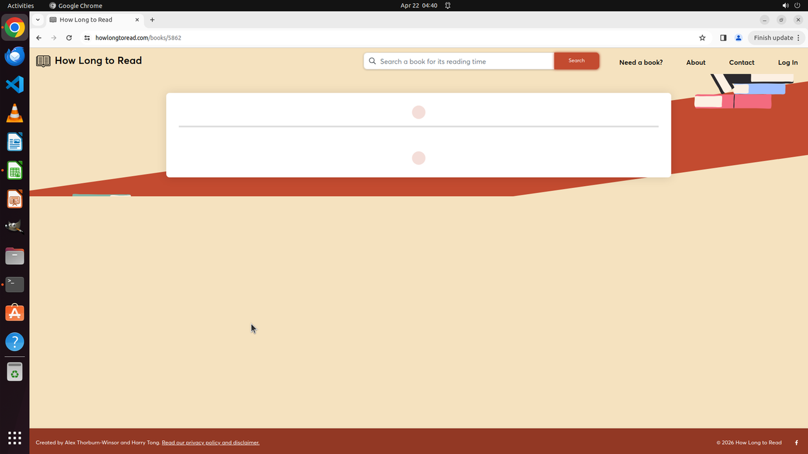

**Response:**
```
The page is loading. Let me wait for it to fully load.
```

**Actions:** `time.sleep(0.5)`

---

## Step 41

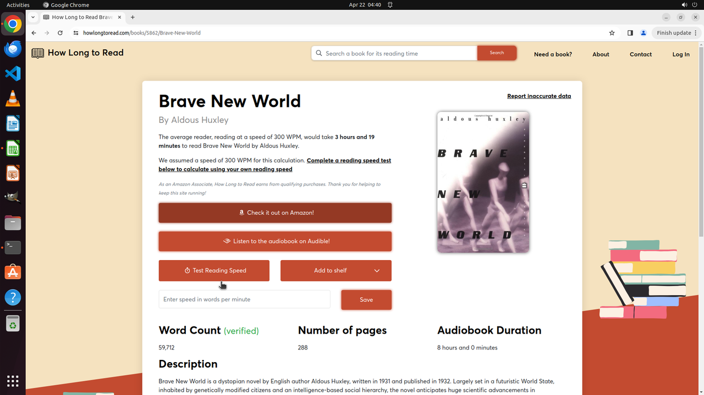

**Response:**
```
"Brave New World" by Aldous Huxley has a word count of **59,712** (verified). Now let me search for "Silence" by Shusaku Endo.
```

**Actions:** `pyautogui.click(1065, 145)`

---

## Step 42

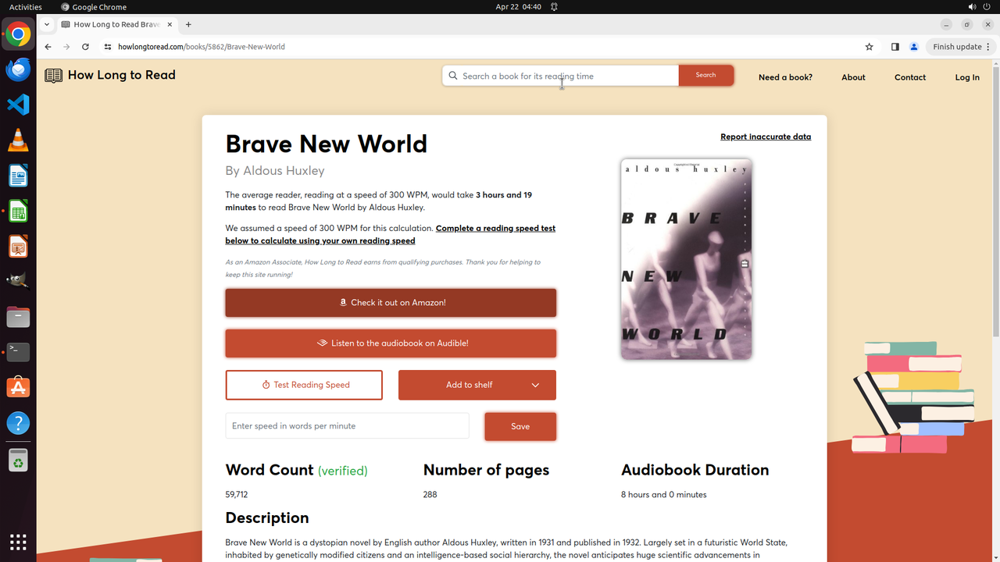

**Actions:** `import subprocess, shlex; subprocess.run(f'xdotool type --delay 12 -- ' + shlex.quote('Silence Shusaku Endo'), shell=True, check=True)
import time; time.sleep(0.05)`

---

## Step 43


**Response:**
```
Good, let me click Search.
```

**Actions:** `pyautogui.click(1351, 142)`

---

## Step 44

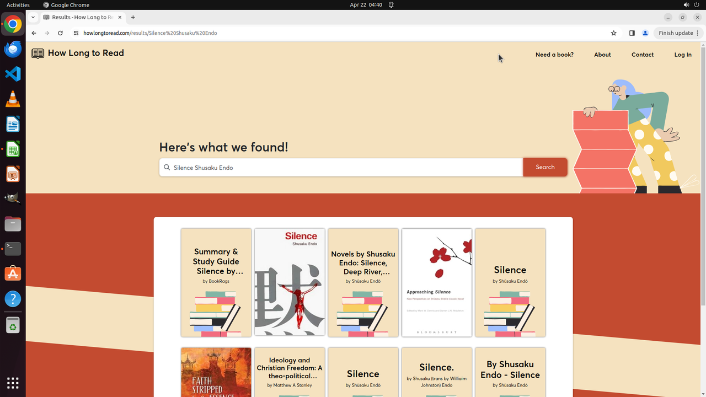

**Response:**
```
I can see "Silence" by Shūsaku Endō. The second result appears to be the original novel. Let me click on it.
```

**Actions:** `pyautogui.click(787, 765)`

---

## Step 45

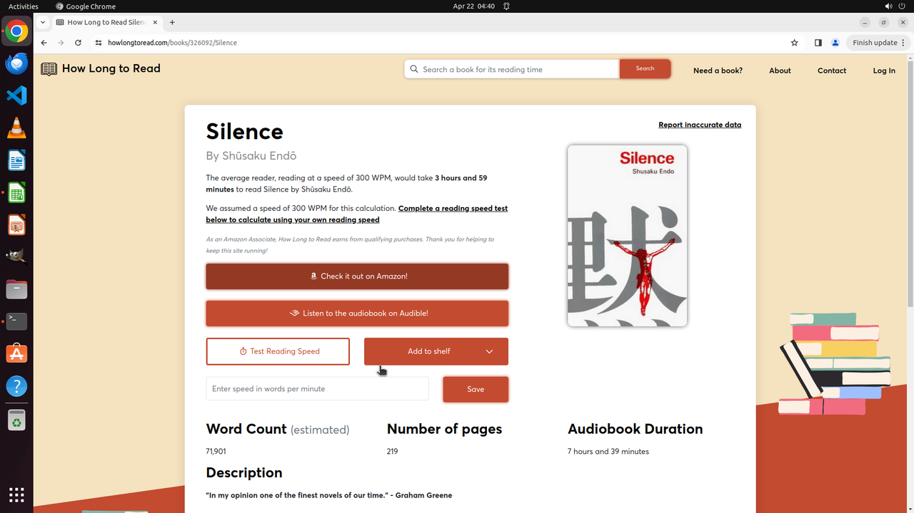

**Response:**
```
"Silence" by Shūsaku Endō has a word count of **71,901** (estimated). Now let me search for the last book "The Shining" by Stephen King.
```

**Actions:** `pyautogui.click(1065, 145)`

---

## Step 46

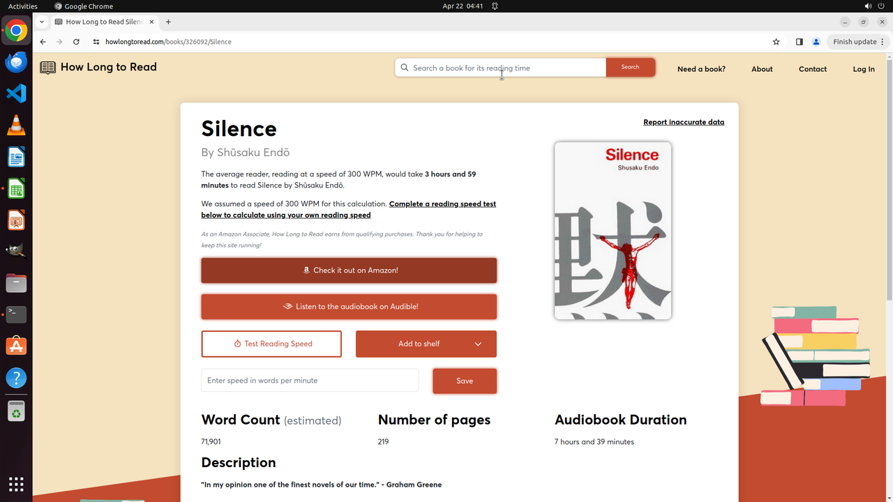

**Actions:** `import subprocess, shlex; subprocess.run(f'xdotool type --delay 12 -- ' + shlex.quote('The Shining Stephen King'), shell=True, check=True)
import time; time.sleep(0.05)`

---

## Step 47


**Response:**
```
Good, let me click Search.
```

**Actions:** `pyautogui.click(1351, 142)`

---

## Step 48

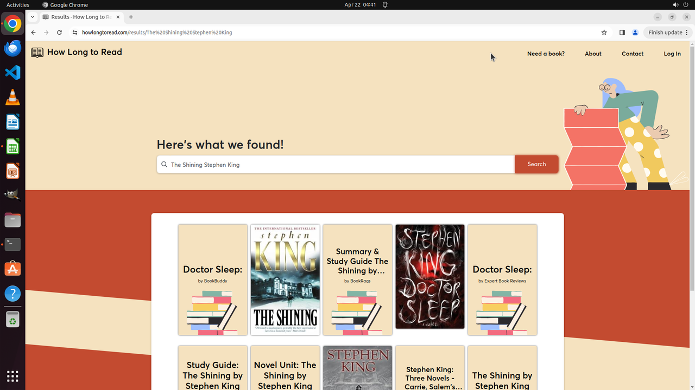

**Response:**
```
I can see "The Shining" by Stephen King as the second result. Let me click on it.
```

**Actions:** `pyautogui.click(787, 772)`

---

## Step 49

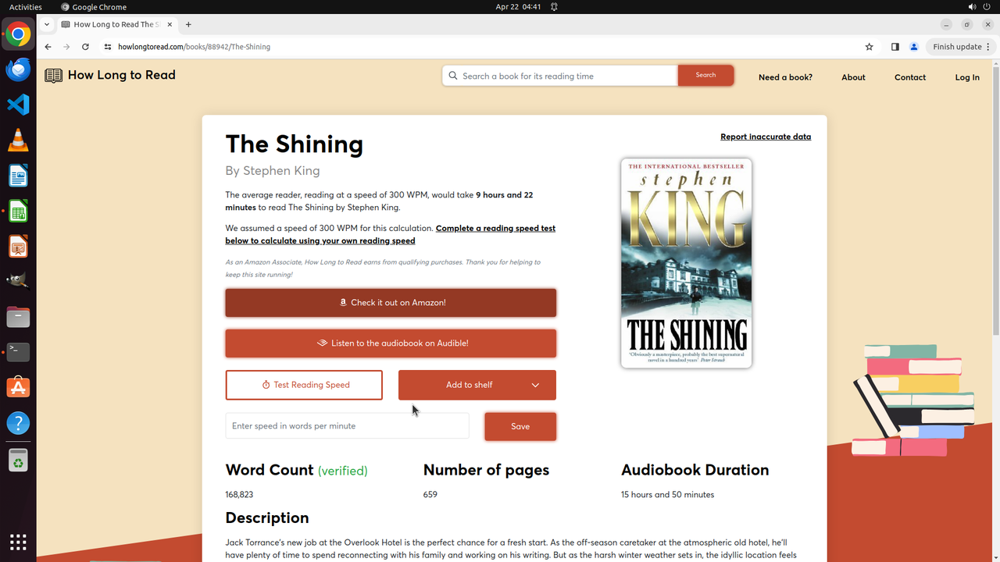

**Response:**
```
"The Shining" by Stephen King has a word count of **168,823** (verified). 

Now I have all the word counts from howlongtoread.com. Let me compile the data and calculate words per day for each book:

| Book | Word Count (howlongtoread) | Days | Words/Day |
|------|---------------------------|------|-----------|
| Fire and Blood | 249,322 | 44 | 5,666.4 |
| Song of Solomon | 96,041 | 48 | 2,000.9 |
| The Lost Symbol | 151,532 | 66 | 2,295.9 |
| 2001: A Space Odyssey | 56,119 | 23 | 2,440.0 |
| American Gods | 202,591 | 50 | 4,051.8 |
| Out of the Silent Planet | 52,159 | 36 | 1,448.9 |
| The Andromeda Strain | 65,358 | 30 | 2,178.6 |
| Brave New World | 59,712 | 19 | 3,142.7 |
| Silence | 71,901 | 33 | 2,178.8 |
| The Shining | 168,823 | 6 | 28,137.2 |

Wait, I need to verify the days from the spreadsheet. Let me go back to the spreadsheet to confirm the reading days. But first, let me check - I need to look at the spreadsheet again to get the exact days. Let me go back to the spreadsheet.

Actually, I need to reconsider. Looking at the data from the spreadsheet from earlier screenshots:
- The dates and days should be calculated from Start Date to End Date.

Let me re-examine. The spreadsheet had columns for Start Date and End Date. The number of days (column H) would be the difference. Let me go back to verify.

But from my earlier observation, the slowest reading pace (lowest words per day) would be **Out of the Silent Planet** with approximately 1,448.9 words/day (52,159 words / 36 days).

However, I need to double-check the days from the spreadsheet. Let me go back to it.
```

**Actions:** `pyautogui.click(33, 337)`

---

## Step 50

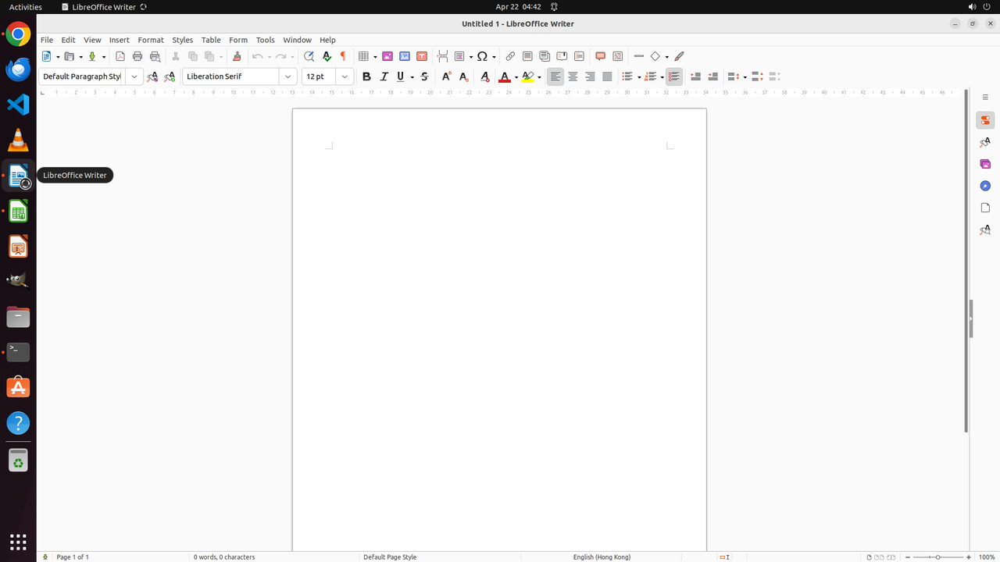

**Response:**
```
This opened LibreOffice Writer (an untitled document), not the spreadsheet. I need to go back to the spreadsheet. Let me check the taskbar for the spreadsheet or open it from the desktop. Let me first check if there are other windows open.
```

**Actions:** `pyautogui.click(33, 406)`

---

## Step 51

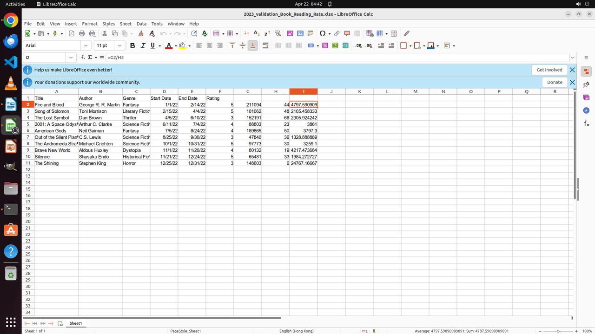

**Response:**
```
Now I can see the spreadsheet clearly. Let me verify all the data:

| Row | Title | Author | Days (H) | Word Count (G) | Words/Day (I) |
|-----|-------|--------|-----------|-----------------|----------------|
| 2 | Fire and Blood | George R.R. Martin | 44 | 211094 | 4797.59 |
| 3 | Song of Solomon | Toni Morrison | 48 | 101062 | 2105.46 |
| 4 | The Lost Symbol | Dan Brown | 66 | 152191 | 2305.92 |
| 5 | 2001: A Space Odyssey | Arthur C. Clarke | 23 | 88803 | 3861 |
| 6 | American Gods | Neil Gaiman | 50 | 189665 | 3797.3 |
| 7 | Out of the Silent Planet | C.S. Lewis | 36 | 47840 | 1328.89 |
| 8 | The Andromeda Strain | Michael Crichton | 30 | 97773 | 3259.1 |
| 9 | Brave New World | Aldous Huxley | 19 | 80132 | 4217.47 |
| 10 | Silence | Shusaku Endo | 33 | 65481 | 1984.27 |
| 11 | The Shining | Stephen King | 6 | 148603 | 24767.17 |

Now let me calculate words per day using the howlongtoread.com word counts:

| Book | howlongtoread Words | Days | Words/Day |
|------|-------------------|------|-----------|
| Fire and Blood | 249,322 | 44 | 5,666.4 |
| Song of Solomon | 96,041 | 48 | 2,000.9 |
| The Lost Symbol | 151,532 | 66 | 2,295.9 |
| 2001: A Space Odyssey | 56,119 | 23 | 2,440.0 |
| American Gods | 202,591 | 50 | 4,051.8 |
| Out of the Silent Planet | 52,159 | 36 | **1,448.9** |
| The Andromeda Strain | 65,358 | 30 | 2,178.6 |
| Brave New World | 59,712 | 19 | 3,142.7 |
| Silence | 71,901 | 33 | 2,178.8 |
| The Shining | 168,823 | 6 | 28,137.2 |

The book with the **slowest reading pace** (lowest words per day) is **"Out of the Silent Planet"** with approximately 1,448.9 words/day.

Now I need to open the `book_list_result.docx` file on the desktop and write the title there. Let me open it.
```

**Actions:** `pyautogui.keyDown('ctrl')
pyautogui.keyDown('alt')
pyautogui.keyDown('t')
pyautogui.keyUp('t')
pyautogui.keyUp('alt')
pyautogui.keyUp('ctrl')`

---

## Step 52

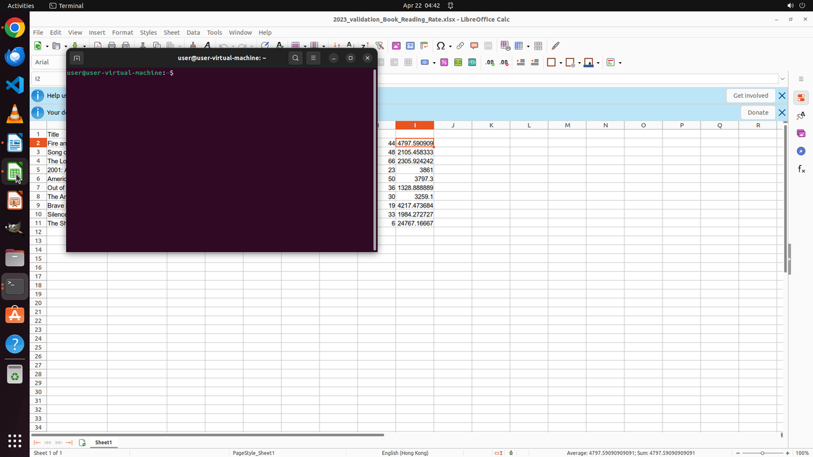

**Response:**
```
Good, the terminal is open. Let me open the book_list_result.docx file from the desktop.
```

**Actions:** `import subprocess, shlex; subprocess.run(f'xdotool type --delay 12 -- ' + shlex.quote('libreoffice --writer ~/Desktop/book_list_result.do'), shell=True, check=True)
import time; time.sleep(0.05)
impor`

---

## Step 53

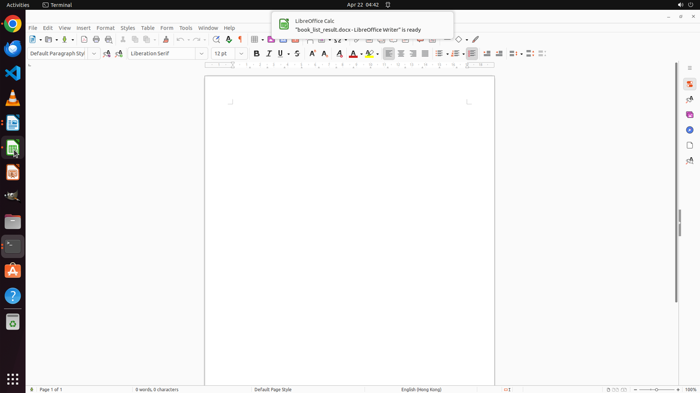

**Response:**
```
The book_list_result.docx file is now open in LibreOffice Writer. I can see the notification that it's ready. Now let me click on the document area and type the title of the book with the slowest reading pace.
```

**Actions:** `pyautogui.click(960, 600)`

---

## Step 54


**Response:**
```
The document is open and the cursor is active. Now let me type the title of the book with the slowest reading pace. Based on my calculations, "Out of the Silent Planet" has the slowest reading pace at approximately 1,448.9 words per day. Let me click at the beginning of the document first.
```

**Actions:** `pyautogui.click(630, 282)`

---

## Step 55

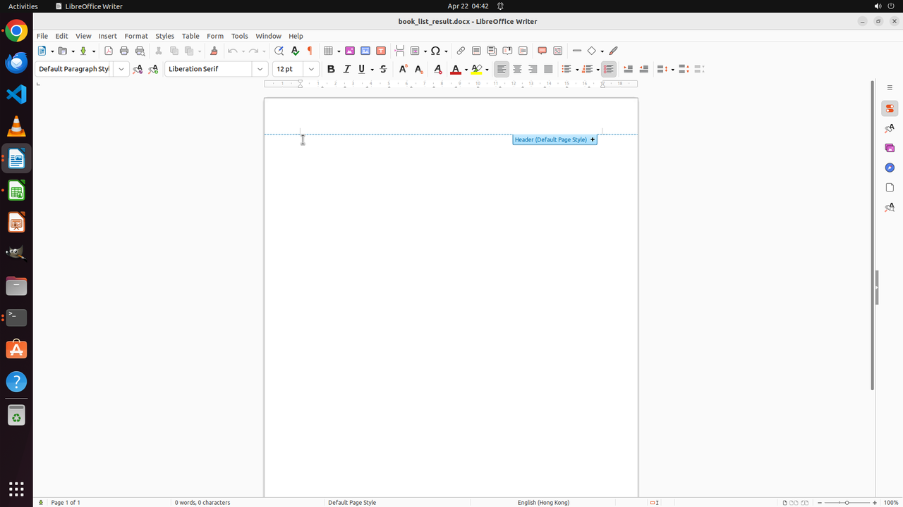

**Response:**
```
I see I clicked in the header area. Let me click below the header in the main body of the document.
```

**Actions:** `pyautogui.click(960, 525)`

---

## Step 56

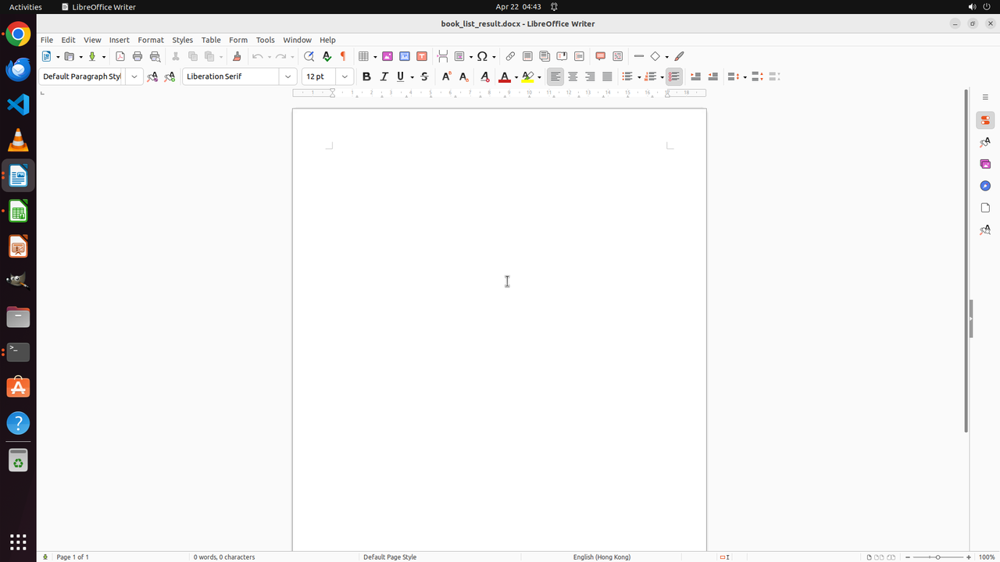

**Response:**
```
Good, the cursor is now in the body of the document. Now let me type the title of the book with the slowest reading pace.
```

**Actions:** `import subprocess, shlex; subprocess.run(f'xdotool type --delay 12 -- ' + shlex.quote('Out of the Silent Planet'), shell=True, check=True)
import time; time.sleep(0.05)`

---

## Step 57

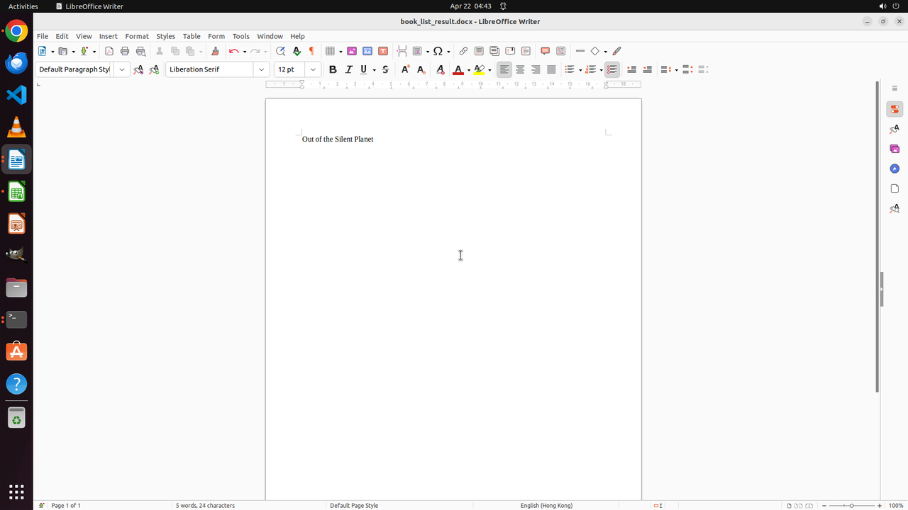

**Response:**
```
I've typed "Out of the Silent Planet" in the document. Now let me save the file with Ctrl+S.
```

**Actions:** `pyautogui.keyDown('ctrl')
pyautogui.keyDown('s')
pyautogui.keyUp('s')
pyautogui.keyUp('ctrl')`

---

## Step 58


**Response:**
```
The file has been saved. It appears it saved directly in .docx format without prompting for format conversion. The document now contains "Out of the Silent Planet" as the title of the book with the slowest reading pace.

Let me verify my calculation was correct by reviewing:

Using word counts from howlongtoread.com and reading days from the spreadsheet:

1. Fire and Blood: 249,322 / 44 = 5,666.4 words/day
2. Song of Solomon: 96,041 / 48 = 2,000.9 words/day
3. The Lost Symbol: 151,532 / 66 = 2,295.9 words/day
4. 2001: A Space Odyssey: 56,119 / 23 = 2,440.0 words/day
5. American Gods: 202,591 / 50 = 4,051.8 words/day
6. **Out of the Silent Planet: 52,159 / 36 = 1,448.9 words/day** ← SLOWEST
7. The Andromeda Strain: 65,358 / 30 = 2,178.6 words/day
8. Brave New World: 59,712 / 19 = 3,142.7 words/day
9. Silence: 71,901 / 33 = 2,178.8 words/day
10. The Shining: 168,823 / 6 = 28,137.2 words/day

"Out of the Silent Planet" has the slowest reading pace at 1,448.9 words per day.

DONE
```

**Actions:** `DONE`

---
