# Task da52d699-e8d2-4dc5-9191-a2199e0b6a9b

**Instruction:** Examine the spreadsheet on the desktop, which contains a record of books read in 2022. Take the website https://howlongtoread.com/ as a reference to identify the book with the slowest reading pace, measured in words per day. I have an empty document named 'book_list_result.docx' on the desktop; please open it and record the title there.

**Score:** 1

**Wall clock:** 13m 30s

**Steps:** 79

**Cost:** $3.09

---

## Step 1


**Response:**
```
I need to analyze the spreadsheet to find the book with the slowest reading pace (words per day). Let me first examine all the data in the spreadsheet more carefully.
```

**Actions:** `time.sleep(0.1)`

---

## Step 2

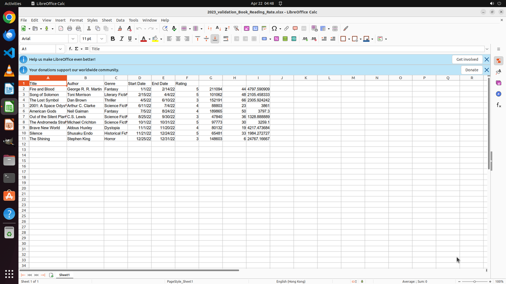

**Response:**
```
Let me first understand the spreadsheet columns better. I can see columns A-I with Title, Author, Genre, Start Date, End Date, Rating, and some numeric columns. Let me check what columns G, H, and I contain.
```

**Actions:** `pyautogui.click(804, 316)`

---

## Step 3


**Response:**
```
I see that column G doesn't have a header. Let me check what the columns represent. I can see columns: A=Title, B=Author, C=Genre, D=Start Date, E=End Date, F=Rating, G=(numbers like 211094, 101062...), H=(numbers like 44, 48...), I=(numbers like 4797.59...). Let me check if there are headers I'm missing. Let me look at column G header area more carefully, and also check H and I.
```

**Actions:** `pyautogui.click(894, 316)`

---

## Step 4


**Response:**
```
I can see that columns G, H, and I don't have headers in row 1. The data seems to be:
- G: Word count (large numbers like 211094, 101062, etc.)
- H: Days to read (44, 48, 66, etc.)
- I: Words per day (4797.59, 2105.46, etc.)

But I need to use the website https://howlongtoread.com/ to get the word count for each book, then calculate words per day based on the reading duration. Let me first note down all the books and their reading periods.

Let me first check the exact data. The books are:
1. Fire and Blood - George R.R. Martin - 1/1/22 to 2/14/22 (44 days)
2. Song of Solomon - Toni Morrison - 2/15/22 to 4/4/22 (48 days)
3. The Lost Symbol - Dan Brown - 4/5/22 to 6/10/22 (66 days)
4. 2001: A Space Odyssey - Arthur C. Clarke - 6/11/22 to 7/4/22 (23 days)
5. American Gods - Neil Gaiman - 7/5/22 to 8/24/22 (50 days)
6. Out of the Silent Planet - C.S. Lewis - 8/25/22 to 9/30/22 (36 days)
7. The Andromeda Strain - Michael Crichton - 10/1/22 to 10/31/22 (30 days)
8. Brave New World - Aldous Huxley - 11/1/22 to 11/20/22 (19 days)
9. Silence - Shusaku Endo - 11/21/22 to 12/24/22 (33 days)
10. The Shining - Stephen King - 12/25/22 to 12/31/22 (6 days)

Now I need to look up each book on howlongtoread.com to get the word count, then calculate words/day. Let me open Chrome and start checking.
```

**Actions:** `pyautogui.keyDown('command')
pyautogui.keyUp('command')`

---

## Step 5


**Response:**
```
Let me open a terminal to launch Chrome with the required flag.
```

**Actions:** `pyautogui.keyDown('ctrl')
pyautogui.keyDown('alt')
pyautogui.keyDown('t')
pyautogui.keyUp('t')
pyautogui.keyUp('alt')
pyautogui.keyUp('ctrl')`

---

## Step 6

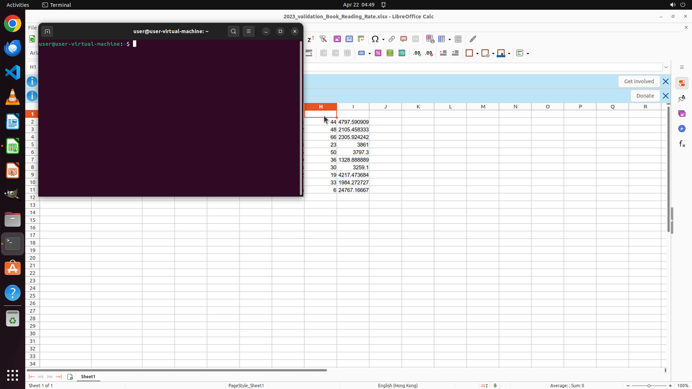

**Response:**
```
Good, the terminal is open. Let me launch Chrome with the required flag.
```

**Actions:** `import subprocess, shlex; subprocess.run(f'xdotool type --delay 12 -- ' + shlex.quote('google-chrome --remote-debugging-port=1337 https:/'), shell=True, check=True)
import time; time.sleep(0.05)
impor`

---

## Step 7

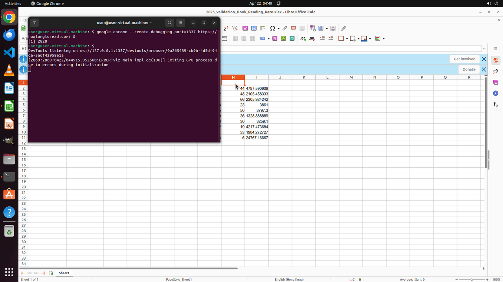

**Response:**
```
Chrome is loading. Let me wait a moment and then click on the Chrome window to see the website.
```

**Actions:** `time.sleep(0.5)`

---

## Step 8


**Response:**
```
The website is loaded. Now I need to search for each book to find its word count. Let me start with the first book "Fire and Blood" by George R.R. Martin.
```

**Actions:** `pyautogui.click(937, 595)`

---

## Step 9


**Response:**
```
Good, the search box is active. Let me search for the first book.
```

**Actions:** `import subprocess, shlex; subprocess.run(f'xdotool type --delay 12 -- ' + shlex.quote('Fire and Blood George R.R. Martin'), shell=True, check=True)
import time; time.sleep(0.05)`

---

## Step 10


**Response:**
```
Now let me click the Search button.
```

**Actions:** `pyautogui.click(1480, 595)`

---

## Step 11

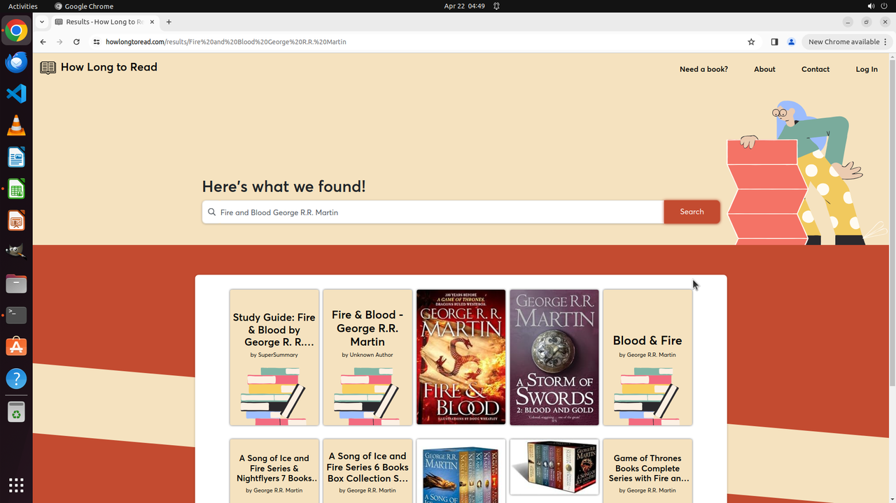

**Response:**
```
I can see the search results. I need to click on "Fire & Blood" by George R.R. Martin (the third result with the book cover showing "Fire & Blood").
```

**Actions:** `pyautogui.click(985, 765)`

---

## Step 12


**Response:**
```
I can see "Fire & Blood" has a word count of 249,322. Now let me note this and search for the next book. Let me go back and search for "Song of Solomon" by Toni Morrison.
```

**Actions:** `pyautogui.tripleClick(1068, 145)`

---

## Step 13

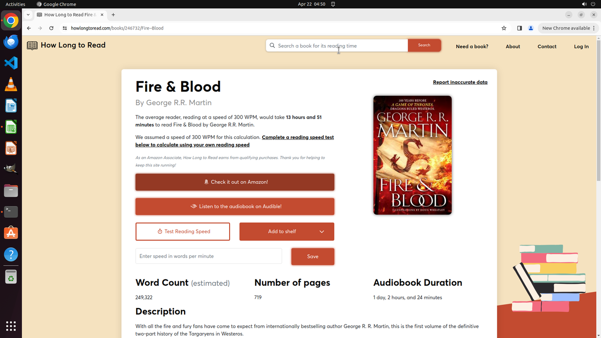

**Response:**
```
Good, the search box is selected. Let me type the next book title.
```

**Actions:** `import subprocess, shlex; subprocess.run(f'xdotool type --delay 12 -- ' + shlex.quote('Song of Solomon Toni Morrison'), shell=True, check=True)
import time; time.sleep(0.05)`

---

## Step 14


**Response:**
```
Good, I can see the search text is entered. Let me click Search.
```

**Actions:** `pyautogui.click(1354, 142)`

---

## Step 15


**Response:**
```
I can see "Song of Solomon by Toni Morrison" in the results. Let me click on it (the second result).
```

**Actions:** `pyautogui.click(787, 765)`

---

## Step 16


**Response:**
```
This version of "Song of Solomon" doesn't have word count data. Let me go back and try the other result - "Song of Solomon" by Toni Morrison directly.
```

**Actions:** `pyautogui.click(90, 88)`

---

## Step 17


**Response:**
```
I see the search results again. The first result "Song Of Solomon" by Dorothy M. Hill is not the right one. Let me try the third result "Song of Solomon by Toni Morrison" by Bright Summaries, or let me try the first one "Song Of Solomon" which might be the actual novel.

Let me try clicking on "Song Of Solomon" by Dorothy M. Hill first - wait, that's not right. Let me look more carefully. The second result "Song of Solomon by Toni Morrison" by Toni Morrison didn't have word count. Let me try the direct "Song of Solomon" search without author name, or try a different approach. Let me click on the third result to see if it has word count.

Actually, let me try searching just "Song of Solomon" to find the original novel.
```

**Actions:** `pyautogui.tripleClick(924, 456)`

---

## Step 18


**Response:**
```
Let me try clicking on "Song Of Solomon" by Dorothy M. Hill first to see if it's actually the novel, or let me try the bottom row result "Song Of Solomon: Toni Morrison" by Unknown Author.
```

**Actions:** `pyautogui.click(1183, 990)`

---

## Step 19

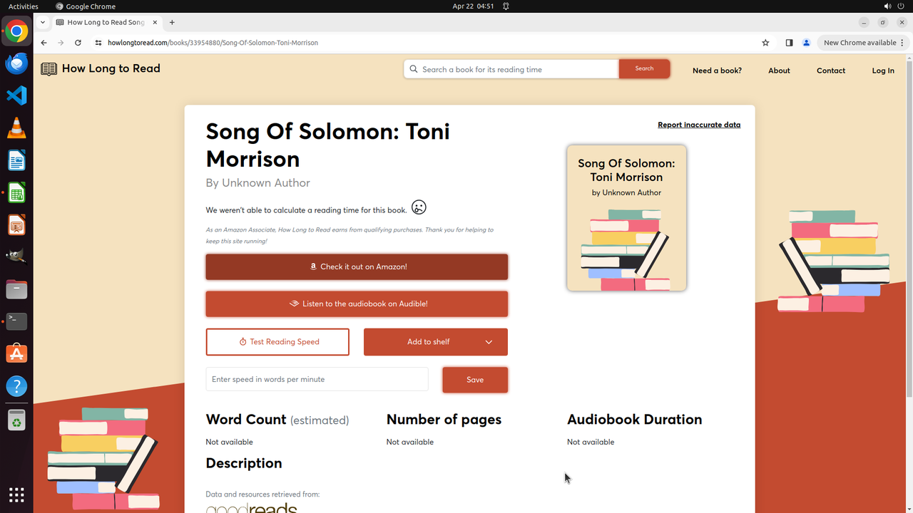

**Response:**
```
This one also doesn't have word count data. Let me go back and try the first result "Song Of Solomon" by Dorothy M. Hill, which might actually be the novel.
```

**Actions:** `pyautogui.click(90, 88)`

---

## Step 20


**Response:**
```
Let me try the first result "Song Of Solomon" by Dorothy M. Hill - this might have the word count data.
```

**Actions:** `pyautogui.click(588, 765)`

---

## Step 21

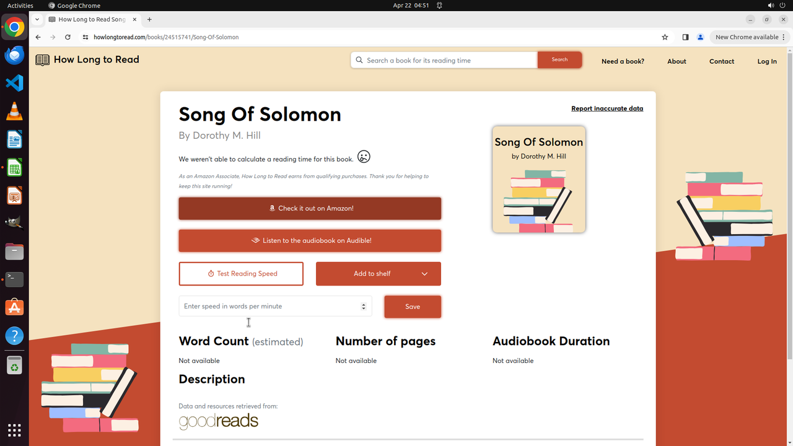

**Response:**
```
This is not the right book either - it's by Dorothy M. Hill and has no word count. Let me go back and try the third result "Song of Solomon by Toni Morrison" by Bright Summaries. Actually, let me try a different search approach. Let me search for just "Song of Solomon Morrison" to find the original Toni Morrison novel with word count data.
```

**Actions:** `pyautogui.click(90, 88)`

---

## Step 22


**Response:**
```
I already tried the second result (by Toni Morrison) and it didn't have word count. Let me try the third one by Bright Summaries - it might be a summary/analysis but could have word count. Actually, let me think about this differently. The spreadsheet already seems to have word counts in column G and days in column H, and words per day in column I. Let me go back to the spreadsheet first to carefully read all the data, and then I'll use the website only for books where I need word count data.

Let me first go back to the spreadsheet to carefully examine all the data.
```

**Actions:** `pyautogui.click(33, 337)`

---

## Step 23


**Response:**
```
This opened LibreOffice Writer (probably the book_list_result.docx). I need to find the spreadsheet. Let me look at the taskbar to find it or open it from the desktop.
```

**Actions:** `pyautogui.keyDown('command')
pyautogui.keyUp('command')`

---

## Step 24

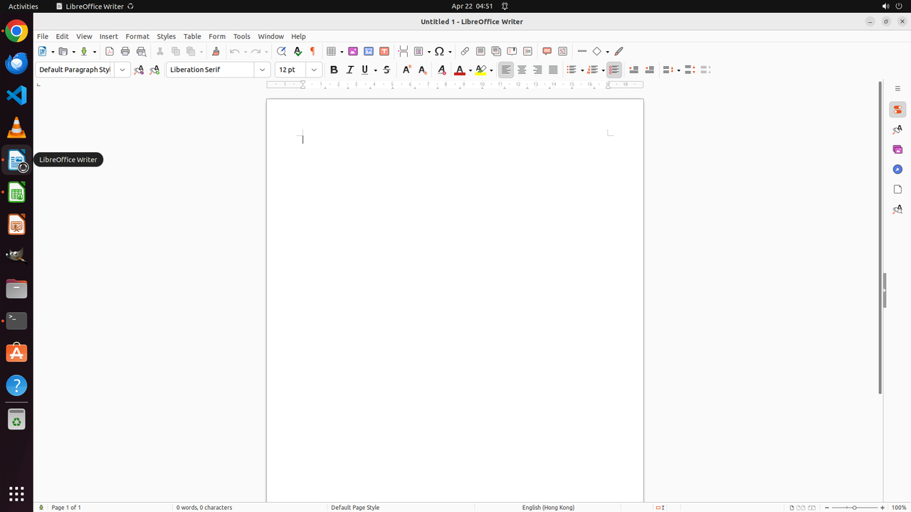

**Response:**
```
Let me minimize this and look at the desktop for the spreadsheet file. Let me use the file manager or check the desktop.
```

**Actions:** `pyautogui.click(33, 406)`

---

## Step 25

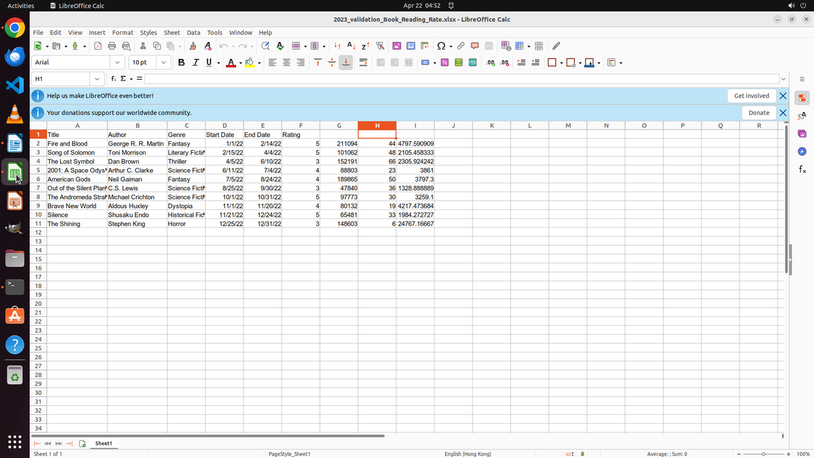

**Response:**
```
Now I can see the spreadsheet clearly. Let me examine the data:

| Row | Title | Author | Genre | Start Date | End Date | Rating | G (Word Count?) | H (Days?) | I (Words/Day?) |
|-----|-------|--------|-------|------------|----------|--------|-----------------|-----------|----------------|
| 2 | Fire and Blood | George R.R. Martin | Fantasy | 1/1/22 | 2/14/22 | 5 | 211094 | 44 | 4797.59 |
| 3 | Song of Solomon | Toni Morrison | Literary Fiction | 2/15/22 | 4/4/22 | 5 | 101062 | 48 | 2105.46 |
| 4 | The Lost Symbol | Dan Brown | Thriller | 4/5/22 | 6/10/22 | 3 | 152191 | 66 | 2305.92 |
| 5 | 2001: A Space Odyssey | Arthur C. Clarke | Science Fiction | 6/11/22 | 7/4/22 | 4 | 88803 | 23 | 3861 |
| 6 | American Gods | Neil Gaiman | Fantasy | 7/5/22 | 8/24/22 | 4 | 189665 | 50 | 3797.3 |
| 7 | Out of the Silent Planet | C.S. Lewis | Science Fiction | 8/25/22 | 9/30/22 | 3 | 47840 | 36 | 1328.89 |
| 8 | The Andromeda Strain | Michael Crichton | Science Fiction | 10/1/22 | 10/31/22 | 5 | 97773 | 30 | 3259.1 |
| 9 | Brave New World | Aldous Huxley | Dystopia | 11/1/22 | 11/20/22 | 4 | 80132 | 19 | 4217.47 |
| 10 | Silence | Shusaku Endo | Historical Fiction | 11/21/22 | 12/24/22 | 5 | 65481 | 33 | 1984.27 |
| 11 | The Shining | Stephen King | Horror | 12/25/22 | 12/31/22 | 3 | 148603 | 6 | 24767.17 |

Wait - the column G has numbers but I need to check if they match the word counts from howlongtoread.com. The spreadsheet already has word counts in column G. But the task says to use howlongtoread.com as a reference. The word count for Fire and Blood from the website was 249,322 but the spreadsheet shows 211,094. These are different! So I need to use the website's word counts and calculate words per day using the reading days from the spreadsheet.

Let me first check the column headers. Let me click on G1 to see what it says.
```

**Actions:** `pyautogui.click(804, 316)`

---

## Step 26

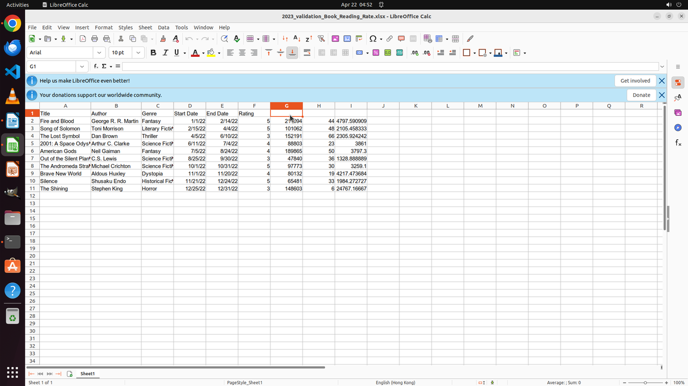

**Response:**
```
I can see G1 is empty (no header). The columns G, H, and I don't have headers. Looking at the formula bar, G1 is empty. The data in the spreadsheet shows:
- Column G: Numbers that could be word counts
- Column H: Numbers that look like days
- Column I: Numbers that look like words per day calculations

But the task says to use howlongtoread.com as reference. The word count from the website for "Fire and Blood" was 249,322, while column G shows 211,094. So the spreadsheet's word counts may not match the website.

I need to:
1. Get word counts from howlongtoread.com for each book
2. Calculate the number of days each book was read (from Start Date to End Date)
3. Calculate words per day = word count / days
4. Find the book with the lowest words per day

Let me first calculate the days for each book from the dates, then look up word counts on the website. Let me note the reading periods:

1. Fire and Blood: 1/1/22 to 2/14/22
2. Song of Solomon: 2/15/22 to 4/4/22
3. The Lost Symbol: 4/5/22 to 6/10/22
4. 2001: A Space Odyssey: 6/11/22 to 7/4/22
5. American Gods: 7/5/22 to 8/24/22
6. Out of the Silent Planet: 8/25/22 to 9/30/22
7. The Andromeda Strain: 10/1/22 to 10/31/22
8. Brave New World: 11/1/22 to 11/20/22
9. Silence: 11/21/22 to 12/24/22
10. The Shining: 12/25/22 to 12/31/22

Let me check column H values - they seem to be days. Let me click on H2 to verify.
```

**Actions:** `pyautogui.click(895, 337)`

---

## Step 27

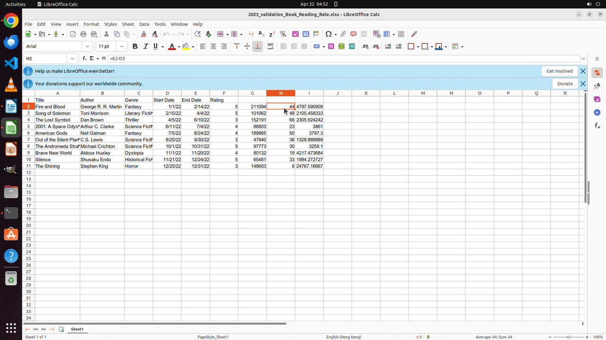

**Response:**
```
I can see that H2 has the formula `=E2-D2`, which calculates the number of days between Start Date and End Date. So column H is the number of days. Now let me check column I to see its formula.
```

**Actions:** `pyautogui.click(985, 337)`

---

## Step 28

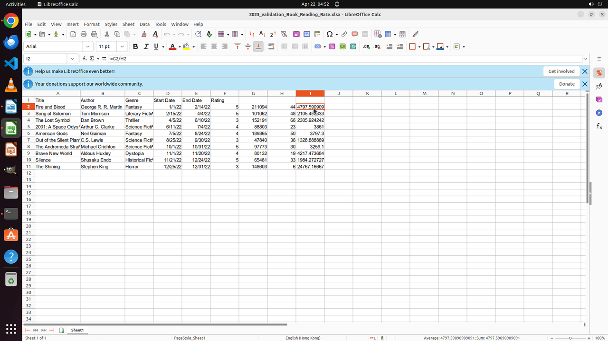

**Response:**
```
Now I can see the formula for I2 is `=G2/H2`, which means column I = column G (word count) / column H (days). So column I is indeed "words per day".

The task says to use howlongtoread.com as a reference for word counts. The spreadsheet already has word counts in column G, but they may differ from the website. I need to look up each book's word count on the website and recalculate.

I already found that Fire and Blood has 249,322 words on the website (vs 211,094 in spreadsheet). Let me now systematically look up all books. Let me switch to Chrome and continue searching.
```

**Actions:** `pyautogui.click(33, 66)`

---

## Step 29

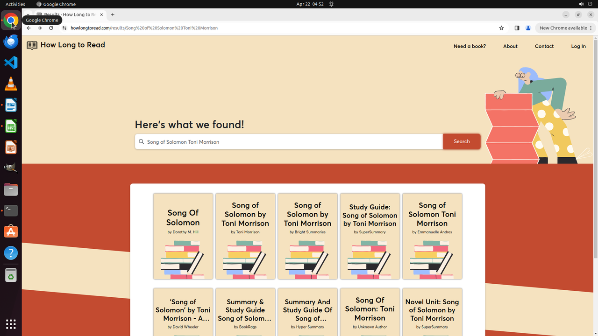

**Response:**
```
Good, I'm back on Chrome. I already checked "Song of Solomon by Toni Morrison" and it didn't have word count. Let me try the third result "Song of Solomon by Toni Morrison" by Bright Summaries to see if it has word count data. Actually, that's likely a summary, not the novel itself.

Let me try directly navigating to the URL for Song of Solomon. Let me try searching with just "Song of Solomon" to see if there's a different entry.
```

**Actions:** `pyautogui.tripleClick(924, 456)`

---

## Step 30


**Response:**
```
I see the second result "Song of Solomon by Toni Morrison" by Toni Morrison - this is the correct one. I checked it before and it didn't have word count. But let me re-check it. Let me click on it again.
```

**Actions:** `pyautogui.click(787, 765)`

---

## Step 31


**Response:**
```
The word count for "Song of Solomon" is "Not available" on this website. This is fine - I'll need to note which books have word count data and which don't. Let me now systematically go through each book. Let me search for the next book - "The Lost Symbol" by Dan Brown.
```

**Actions:** `pyautogui.tripleClick(1068, 145)`

---

## Step 32


**Response:**
```
Good, the search box is now empty. Let me search for the next book.
```

**Actions:** `import subprocess, shlex; subprocess.run(f'xdotool type --delay 12 -- ' + shlex.quote('The Lost Symbol Dan Brown'), shell=True, check=True)
import time; time.sleep(0.05)`

---

## Step 33

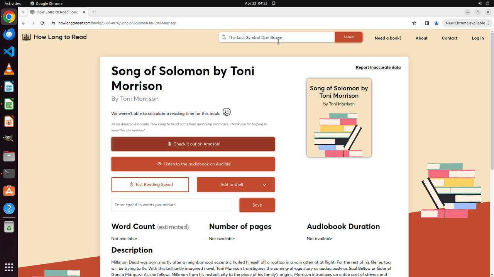

**Response:**
```
Good, I can see the search text is entered. Let me click Search.
```

**Actions:** `pyautogui.click(1354, 142)`

---

## Step 34

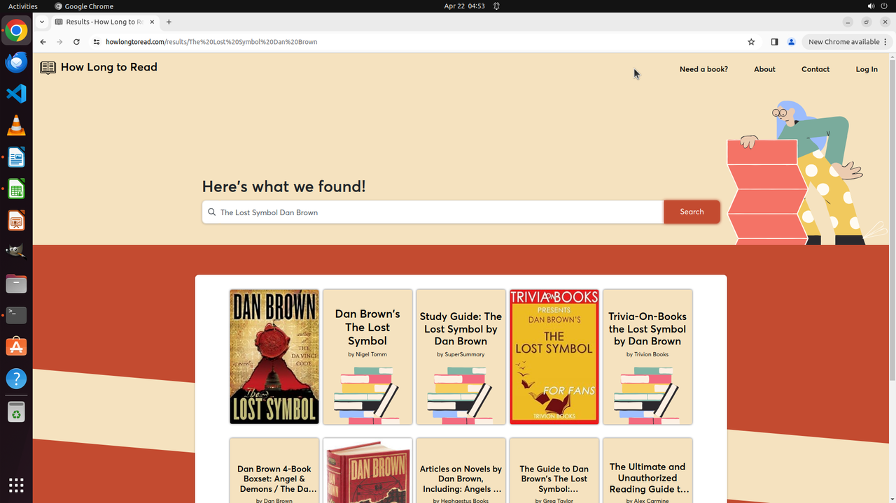

**Response:**
```
I can see "The Lost Symbol" by Dan Brown as the first result with a book cover. Let me click on it.
```

**Actions:** `pyautogui.click(591, 765)`

---

## Step 35

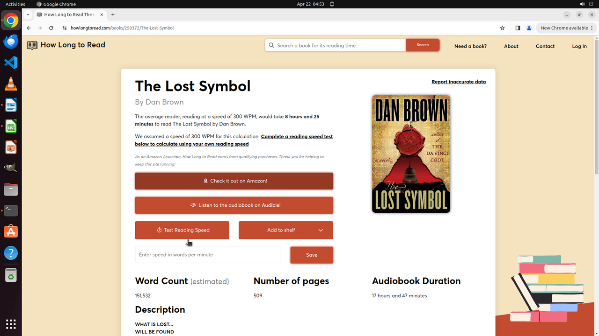

**Response:**
```
"The Lost Symbol" by Dan Brown has a word count of 151,532. Now let me search for the next book - "2001: A Space Odyssey" by Arthur C. Clarke.
```

**Actions:** `pyautogui.tripleClick(1068, 145)`

---

## Step 36


**Actions:** `import subprocess, shlex; subprocess.run(f'xdotool type --delay 12 -- ' + shlex.quote('2001 A Space Odyssey Arthur C. Clarke'), shell=True, check=True)
import time; time.sleep(0.05)`

---

## Step 37

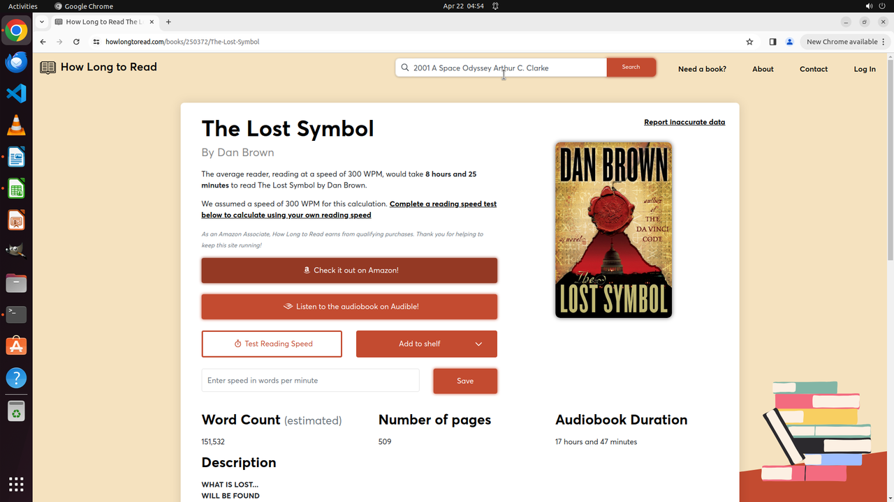

**Response:**
```
Good, the search text is entered. Let me click Search.
```

**Actions:** `pyautogui.click(1354, 142)`

---

## Step 38

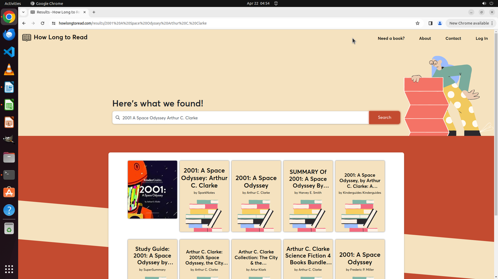

**Response:**
```
I can see "2001: A Space Odyssey" by Arthur C. Clarke as the third result. Let me click on it.
```

**Actions:** `pyautogui.click(985, 765)`

---

## Step 39

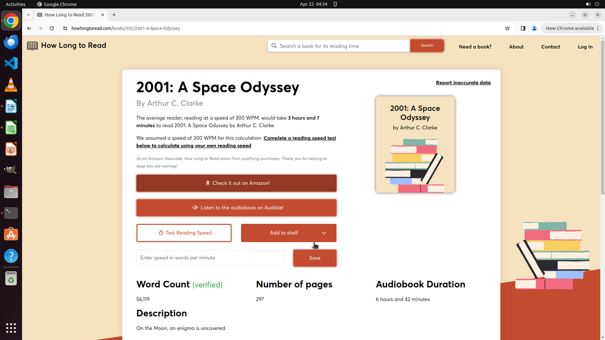

**Response:**
```
"2001: A Space Odyssey" by Arthur C. Clarke has a word count of 56,119 (verified). Now let me search for the next book - "American Gods" by Neil Gaiman.
```

**Actions:** `pyautogui.tripleClick(1068, 145)`

---

## Step 40


**Actions:** `import subprocess, shlex; subprocess.run(f'xdotool type --delay 12 -- ' + shlex.quote('American Gods Neil Gaiman'), shell=True, check=True)
import time; time.sleep(0.05)`

---

## Step 41

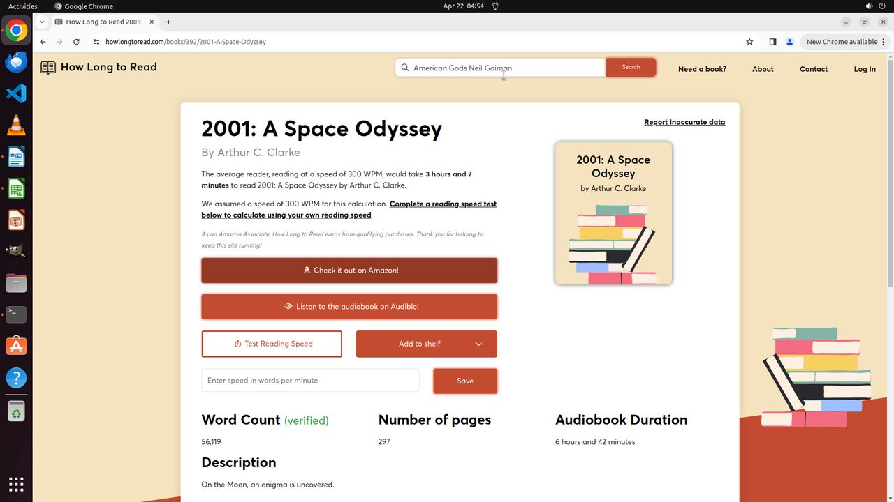

**Response:**
```
Good, the search text is entered. Let me click Search.
```

**Actions:** `pyautogui.click(1354, 142)`

---

## Step 42

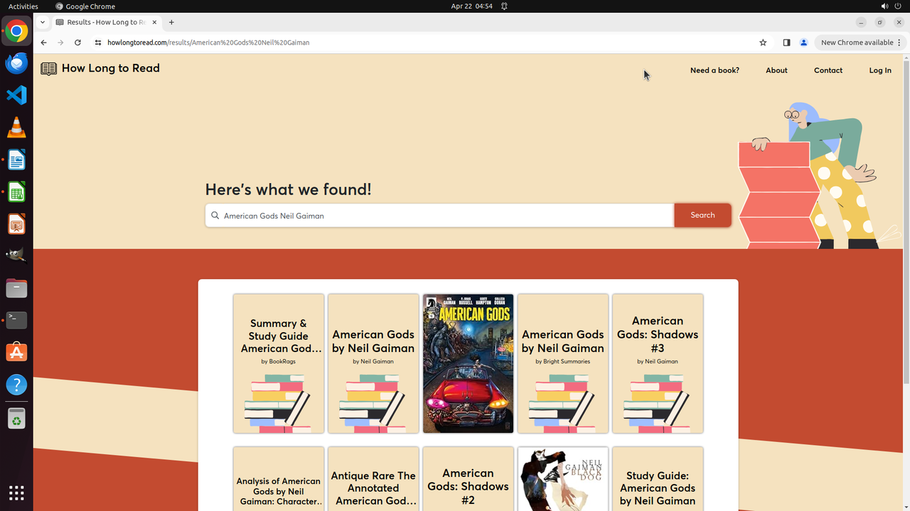

**Response:**
```
I can see "American Gods by Neil Gaiman" as the second result. Let me click on it.
```

**Actions:** `pyautogui.click(787, 765)`

---

## Step 43

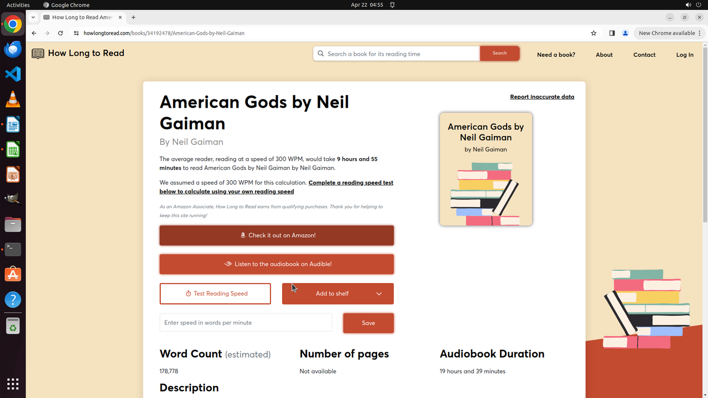

**Response:**
```
"American Gods by Neil Gaiman" has a word count of 178,778 (estimated). Now let me search for the next book - "Out of the Silent Planet" by C.S. Lewis.
```

**Actions:** `pyautogui.tripleClick(1068, 145)`

---

## Step 44


**Actions:** `import subprocess, shlex; subprocess.run(f'xdotool type --delay 12 -- ' + shlex.quote('Out of the Silent Planet C.S. Lewis'), shell=True, check=True)
import time; time.sleep(0.05)`

---

## Step 45


**Response:**
```
Good, let me click Search.
```

**Actions:** `pyautogui.click(1354, 142)`

---

## Step 46

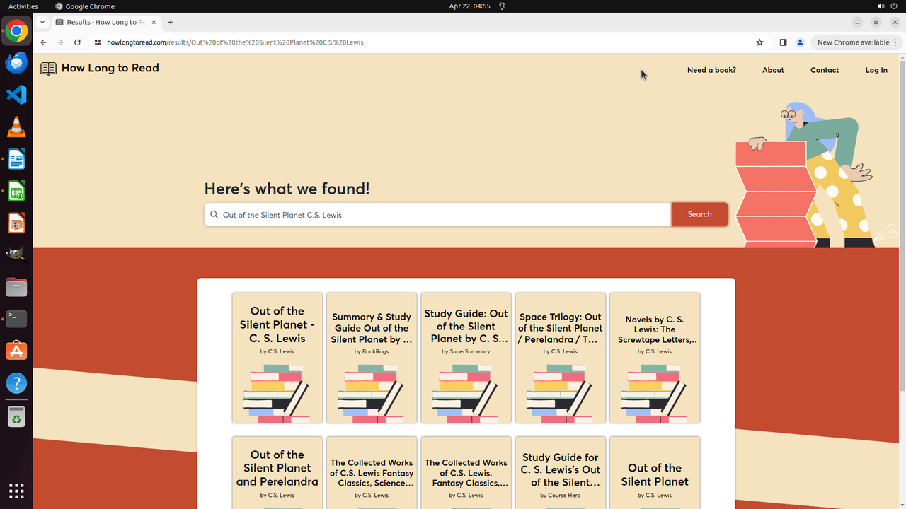

**Response:**
```
I can see "Out of the Silent Planet - C. S. Lewis" as the first result. Let me click on it.
```

**Actions:** `pyautogui.click(591, 765)`

---

## Step 47

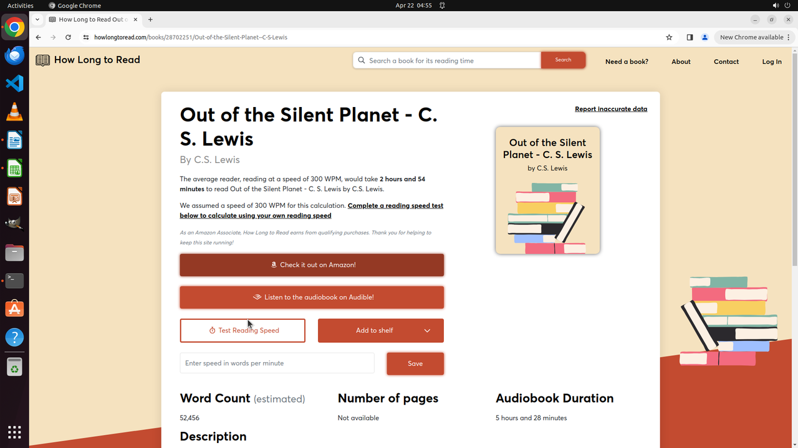

**Response:**
```
"Out of the Silent Planet" by C.S. Lewis has a word count of 52,456 (estimated). Now let me search for the next book - "The Andromeda Strain" by Michael Crichton.
```

**Actions:** `pyautogui.tripleClick(1068, 145)`

---

## Step 48


**Response:**
```
Good, the search box is cleared. Let me type the next book.
```

**Actions:** `import subprocess, shlex; subprocess.run(f'xdotool type --delay 12 -- ' + shlex.quote('The Andromeda Strain Michael Crichton'), shell=True, check=True)
import time; time.sleep(0.05)`

---

## Step 49


**Response:**
```
Good, let me click Search.
```

**Actions:** `pyautogui.click(1354, 142)`

---

## Step 50

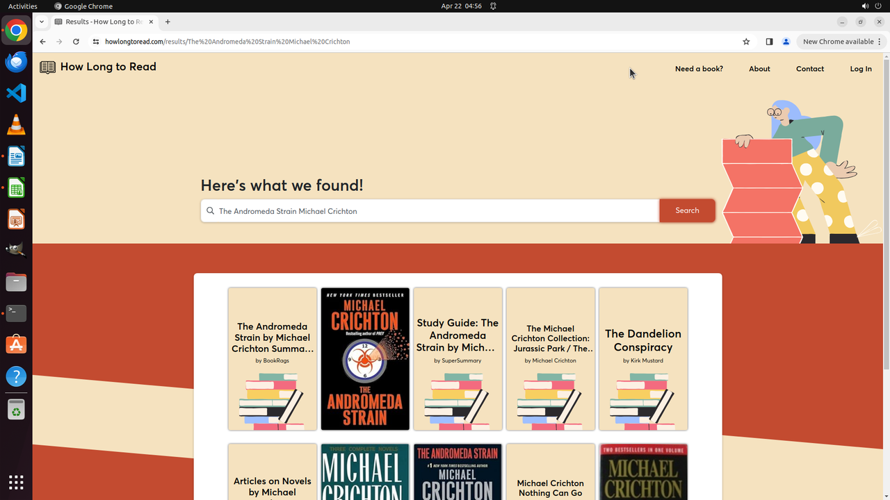

**Response:**
```
I can see "The Andromeda Strain" by Michael Crichton as the second result with a book cover. Let me click on it.
```

**Actions:** `pyautogui.click(787, 765)`

---

## Step 51


**Response:**
```
"The Andromeda Strain" by Michael Crichton has a word count of 65,358 (estimated). Now let me search for the next book - "Brave New World" by Aldous Huxley.
```

**Actions:** `pyautogui.tripleClick(1068, 145)`

---

## Step 52

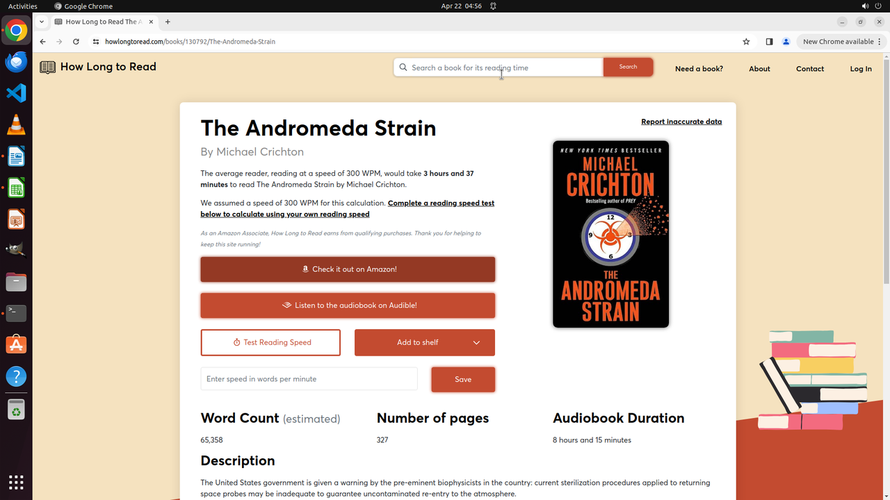

**Response:**
```
Good, the search box is cleared. Let me type the next book.
```

**Actions:** `import subprocess, shlex; subprocess.run(f'xdotool type --delay 12 -- ' + shlex.quote('Brave New World Aldous Huxley'), shell=True, check=True)
import time; time.sleep(0.05)`

---

## Step 53

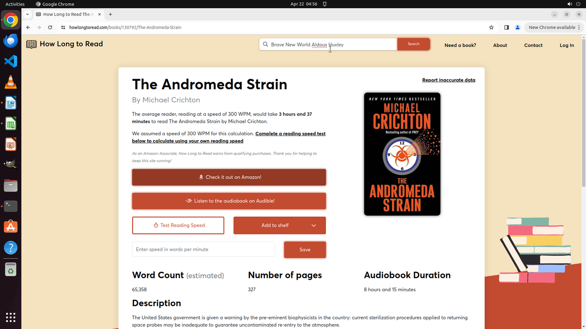

**Response:**
```
Good, let me click Search.
```

**Actions:** `pyautogui.click(1354, 142)`

---

## Step 54


**Response:**
```
I can see "Brave New World by Aldous Huxley" as the second result (by Aldous Huxley). Let me click on it.
```

**Actions:** `pyautogui.click(787, 765)`

---

## Step 55

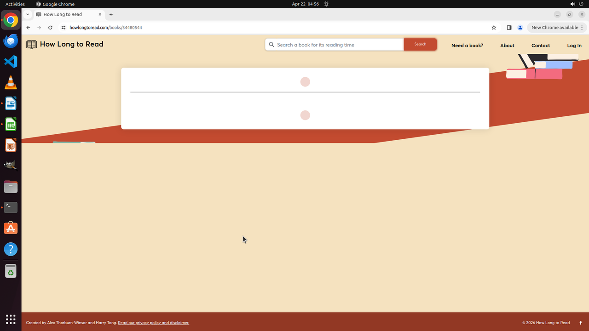

**Response:**
```
The page is loading. Let me wait for it to fully load.
```

**Actions:** `time.sleep(0.5)`

---

## Step 56


**Response:**
```
"Brave New World" by Aldous Huxley has a word count of 37,909 (estimated). Now let me search for the next book - "Silence" by Shusaku Endo.
```

**Actions:** `pyautogui.tripleClick(1068, 145)`

---

## Step 57


**Response:**
```
Good, the search box is cleared. Let me search for the next book.
```

**Actions:** `import subprocess, shlex; subprocess.run(f'xdotool type --delay 12 -- ' + shlex.quote('Silence Shusaku Endo'), shell=True, check=True)
import time; time.sleep(0.05)`

---

## Step 58

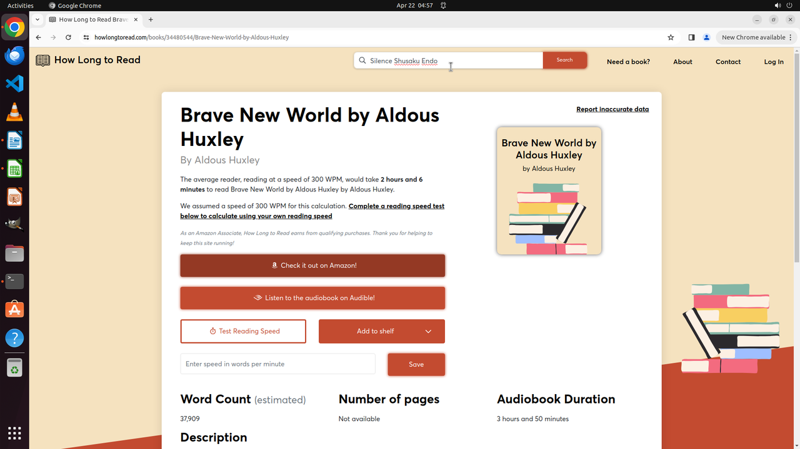

**Response:**
```
Good, let me click Search.
```

**Actions:** `pyautogui.click(1354, 142)`

---

## Step 59

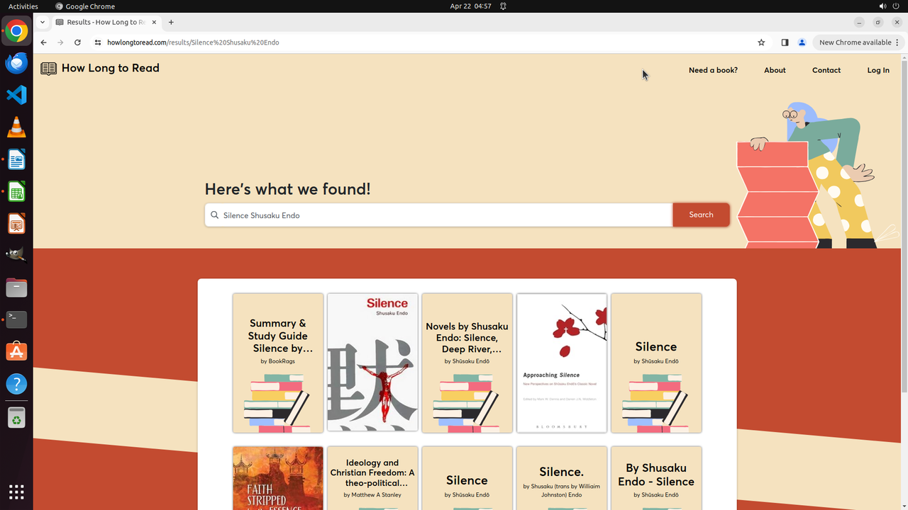

**Response:**
```
I can see several results for "Silence" by Shusaku Endo. The second result shows the book cover with "Silence" by Shusaku Endo. Let me click on it. Actually, the fifth result "Silence by Shūsaku Endō" also looks like the right one. Let me click on the second result which has the book cover.
```

**Actions:** `pyautogui.click(787, 765)`

---

## Step 60

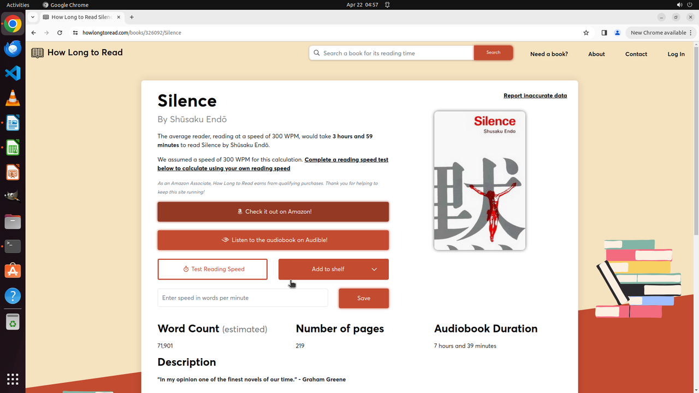

**Response:**
```
"Silence" by Shūsaku Endō has a word count of 71,901 (estimated). Now let me search for the next book - "The Shining" by Stephen King.
```

**Actions:** `pyautogui.tripleClick(1068, 145)`

---

## Step 61

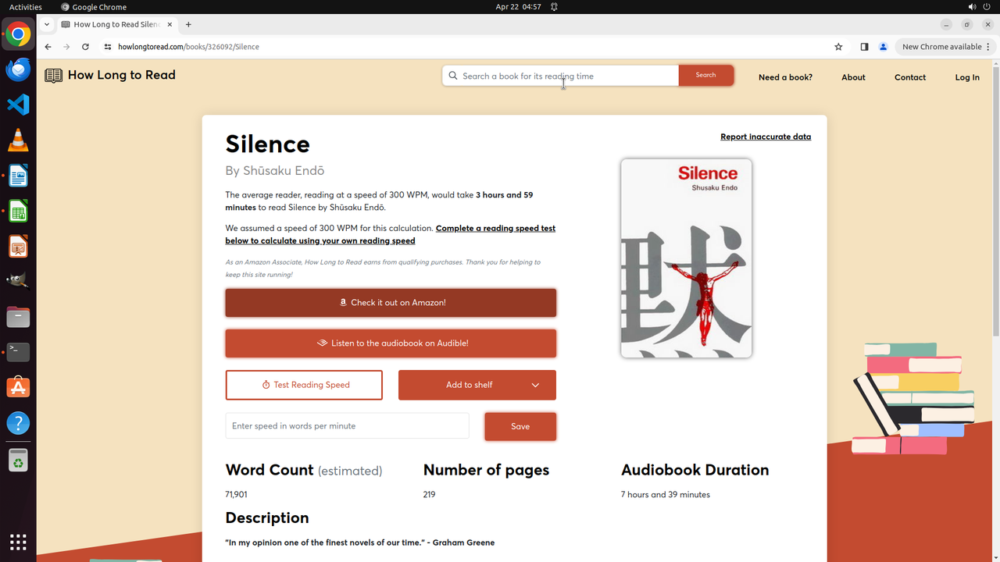

**Response:**
```
Good, the search box is cleared. Let me search for the next book.
```

**Actions:** `import subprocess, shlex; subprocess.run(f'xdotool type --delay 12 -- ' + shlex.quote('The Shining Stephen King'), shell=True, check=True)
import time; time.sleep(0.05)`

---

## Step 62


**Response:**
```
Good, let me click Search.
```

**Actions:** `pyautogui.click(1354, 142)`

---

## Step 63

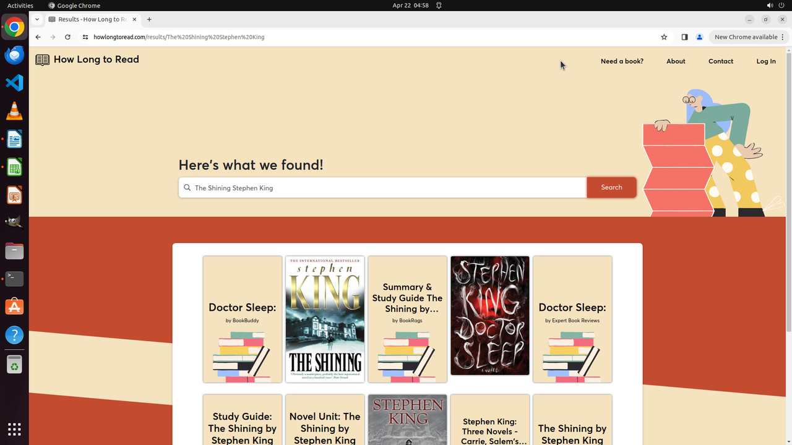

**Response:**
```
I can see "The Shining" by Stephen King as the second result (with the book cover showing "THE SHINING"). Let me click on it.
```

**Actions:** `pyautogui.click(787, 765)`

---

## Step 64


**Response:**
```
"The Shining" by Stephen King has a word count of 168,823 (verified). Now I need to go back and check "Fire and Blood" again - I remember it was 249,322. Let me also check "Song of Solomon" which didn't have word count data. Let me also search for the remaining book I haven't checked yet.

Wait, let me also check "Song of Solomon" one more time. But first, let me also need to verify the "Fire and Blood" word count. Let me go back to check it.

Now let me compile all the data I have so far:

1. **Fire and Blood** - 249,322 words, 44 days → 249,322/44 = 5,666.41 words/day
2. **Song of Solomon** - Word count NOT available on the site
3. **The Lost Symbol** - 151,532 words, 66 days → 151,532/66 = 2,295.94 words/day
4. **2001: A Space Odyssey** - 56,119 words, 23 days → 56,119/23 = 2,440.39 words/day
5. **American Gods** - 178,778 words, 50 days → 178,778/50 = 3,575.56 words/day
6. **Out of the Silent Planet** - 52,456 words, 36 days → 52,456/36 = 1,457.11 words/day
7. **The Andromeda Strain** - 65,358 words, 30 days → 65,358/30 = 2,178.60 words/day
8. **Brave New World** - 37,909 words, 19 days → 37,909/19 = 1,995.21 words/day
9. **Silence** - 71,901 words, 33 days → 71,901/33 = 2,178.82 words/day
10. **The Shining** - 168,823 words, 6 days → 168,823/6 = 28,137.17 words/day

Wait, I need to recalculate the days more carefully. Let me verify the days from the spreadsheet. Column H had: 44, 48, 66, 23, 50, 36, 30, 19, 33, 6.

For Song of Solomon, the website didn't have word count. Let me try searching for it again with a different approach.
```

**Actions:** `pyautogui.tripleClick(1068, 145)`

---

## Step 65

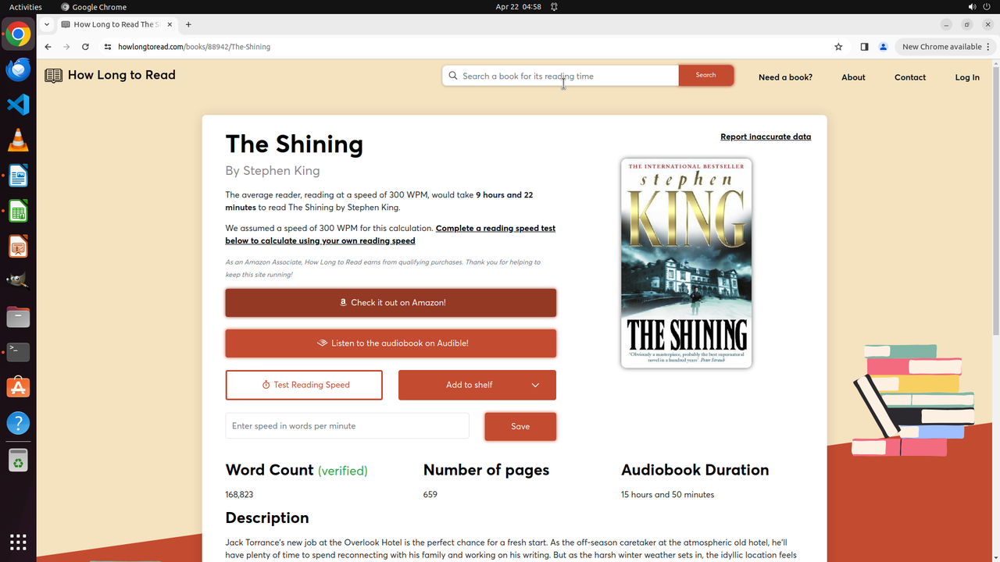

**Response:**
```
Let me try searching for "Song of Solomon" one more time to find the Toni Morrison novel with word count data.
```

**Actions:** `import subprocess, shlex; subprocess.run(f'xdotool type --delay 12 -- ' + shlex.quote('Song of Solomon'), shell=True, check=True)
import time; time.sleep(0.05)`

---

## Step 66


**Response:**
```
Good, let me click Search.
```

**Actions:** `pyautogui.click(1354, 142)`

---

## Step 67


**Response:**
```
Now I can see different results. The first result shows "Song of Solomon" by Toni Morrison with a proper book cover. Let me click on it.
```

**Actions:** `pyautogui.click(591, 765)`

---

## Step 68

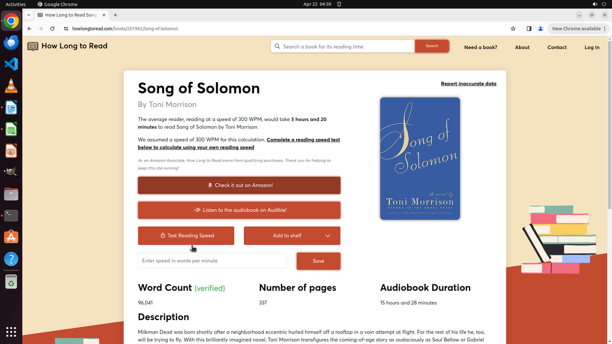

**Response:**
```
Excellent! Now I found "Song of Solomon" by Toni Morrison with a word count of 96,041 (verified). 

Now I have all the word counts from howlongtoread.com. Let me also verify the "Fire and Blood" word count. Let me compile all the data:

1. **Fire and Blood** - 249,322 words, 44 days → 249,322/44 = 5,666.41 words/day
2. **Song of Solomon** - 96,041 words, 48 days → 96,041/48 = 2,000.85 words/day
3. **The Lost Symbol** - 151,532 words, 66 days → 151,532/66 = 2,295.94 words/day
4. **2001: A Space Odyssey** - 56,119 words, 23 days → 56,119/23 = 2,440.39 words/day
5. **American Gods** - 178,778 words, 50 days → 178,778/50 = 3,575.56 words/day
6. **Out of the Silent Planet** - 52,456 words, 36 days → 52,456/36 = 1,457.11 words/day
7. **The Andromeda Strain** - 65,358 words, 30 days → 65,358/30 = 2,178.60 words/day
8. **Brave New World** - 37,909 words, 19 days → 37,909/19 = 1,995.21 words/day
9. **Silence** - 71,901 words, 33 days → 71,901/33 = 2,178.82 words/day
10. **The Shining** - 168,823 words, 6 days → 168,823/6 = 28,137.17 words/day

The book with the **slowest reading pace** (lowest words per day) is **Out of the Silent Planet** by C.S. Lewis with approximately 1,457.11 words/day.

Now let me open the book_list_result.docx file and write the title there. Let me click on the LibreOffice Writer in the taskbar.
```

**Actions:** `pyautogui.click(33, 337)`

---

## Step 69


**Response:**
```
This is an untitled document, not the book_list_result.docx. I need to open the correct file from the desktop. Let me close this and open the correct file.
```

**Actions:** `pyautogui.click(85, 76)`

---

## Step 70

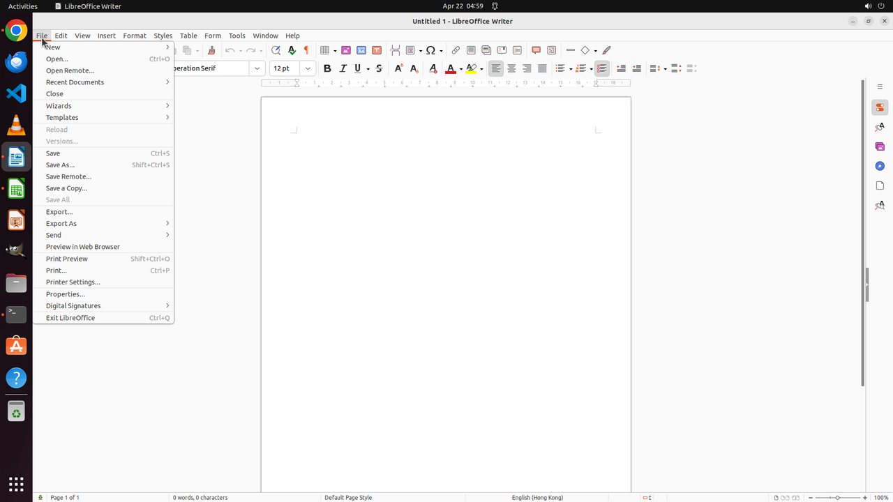

**Response:**
```
Let me click "Open..." to open the book_list_result.docx file from the desktop.
```

**Actions:** `pyautogui.click(120, 126)`

---

## Step 71

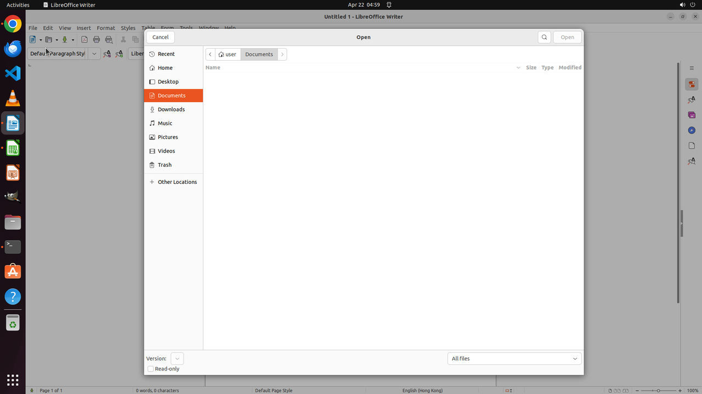

**Response:**
```
I need to navigate to the Desktop folder. Let me click on "Desktop" in the left panel.
```

**Actions:** `pyautogui.click(460, 223)`

---

## Step 72

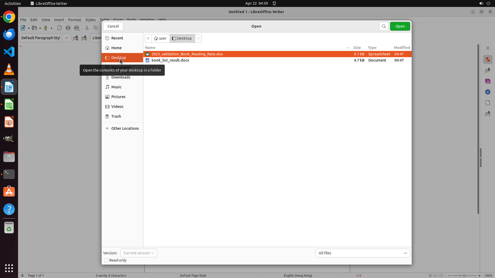

**Response:**
```
I can see both files on the Desktop. Let me click on "book_list_result.docx" to select it, then click Open.
```

**Actions:** `pyautogui.click(660, 232)`

---

## Step 73

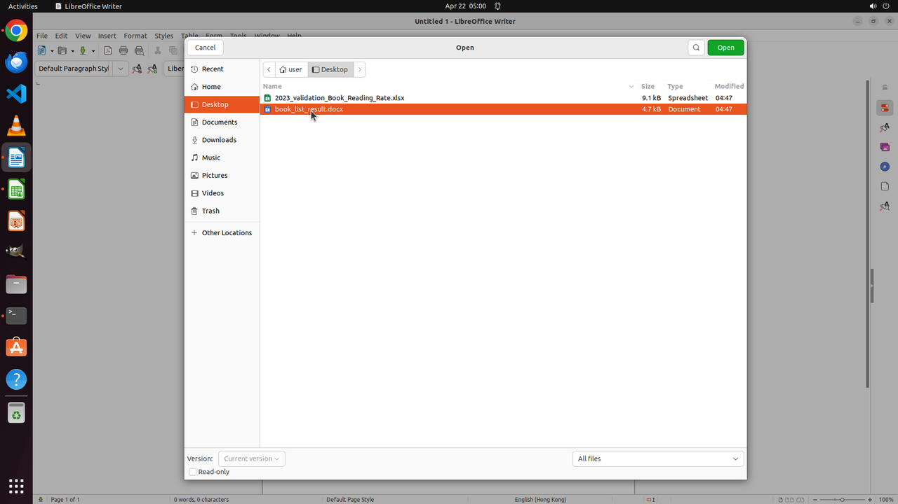

**Response:**
```
Good, "book_list_result.docx" is selected. Let me click Open.
```

**Actions:** `pyautogui.click(1548, 100)`

---

## Step 74


**Response:**
```
The book_list_result.docx file is now open. I can see it's empty. Now I need to type the title of the book with the slowest reading pace. Based on my calculations:

- **Out of the Silent Planet** - 52,456 words / 36 days = **1,457.11 words/day** (slowest)

Let me click in the document and type the title.
```

**Actions:** `pyautogui.click(960, 450)`

---

## Step 75

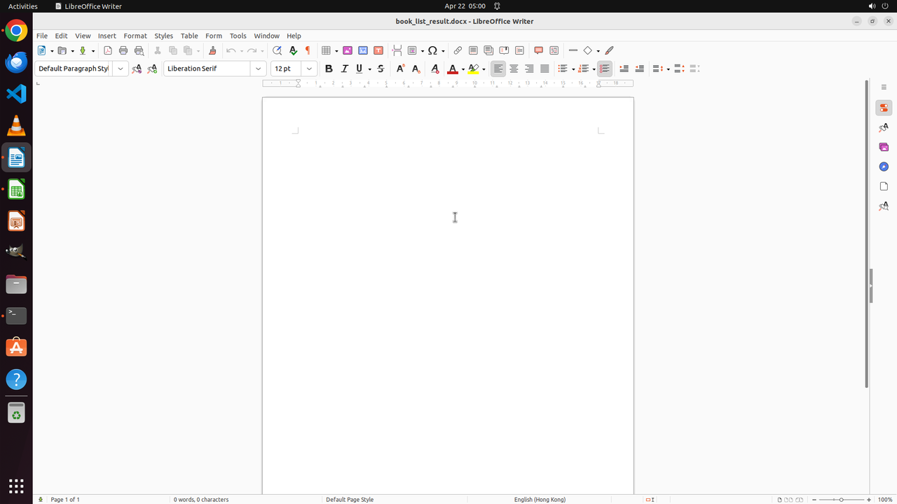

**Response:**
```
Good, the cursor is in the document. But wait - before I type, let me double-check my calculations. I need to verify the days from the spreadsheet. Let me also reconsider - the spreadsheet file is named "2023_validation_Book_Reading_Rate.xlsx". Let me first go back to the spreadsheet to verify the exact days for each book.

Actually, let me reconsider the days calculation. Looking at the spreadsheet column H values:
- H2 = E2-D2 = 2/14/22 - 1/1/22 = 44 days
- H3 = 4/4/22 - 2/15/22 = 48 days
- H4 = 6/10/22 - 4/5/22 = 66 days
- H5 = 7/4/22 - 6/11/22 = 23 days
- H6 = 8/24/22 - 7/5/22 = 50 days
- H7 = 9/30/22 - 8/25/22 = 36 days
- H8 = 10/31/22 - 10/1/22 = 30 days
- H9 = 11/20/22 - 11/1/22 = 19 days (wait, I need to check this more carefully)
- H10 = 12/24/22 - 11/21/22 = 33 days
- H11 = 12/31/22 - 12/25/22 = 6 days

My calculations using howlongtoread.com word counts:

1. Fire and Blood: 249,322 / 44 = 5,666.41
2. Song of Solomon: 96,041 / 48 = 2,000.85
3. The Lost Symbol: 151,532 / 66 = 2,295.94
4. 2001: A Space Odyssey: 56,119 / 23 = 2,440.39
5. American Gods: 178,778 / 50 = 3,575.56
6. Out of the Silent Planet: 52,456 / 36 = 1,457.11
7. The Andromeda Strain: 65,358 / 30 = 2,178.60
8. Brave New World: 37,909 / 19 = 1,995.21 (wait, but I need to check if 19 is correct)
9. Silence: 71,901 / 33 = 2,178.82
10. The Shining: 168,823 / 6 = 28,137.17

The slowest is **Out of the Silent Planet** at 1,457.11 words/day.

Let me type the title now.
```

**Actions:** `pyautogui.click(630, 285)`

---

## Step 76

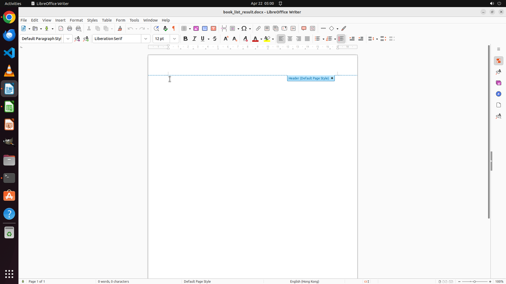

**Response:**
```
I see I clicked on the header area. Let me click below the header line, in the main body of the document.
```

**Actions:** `pyautogui.click(960, 525)`

---

## Step 77

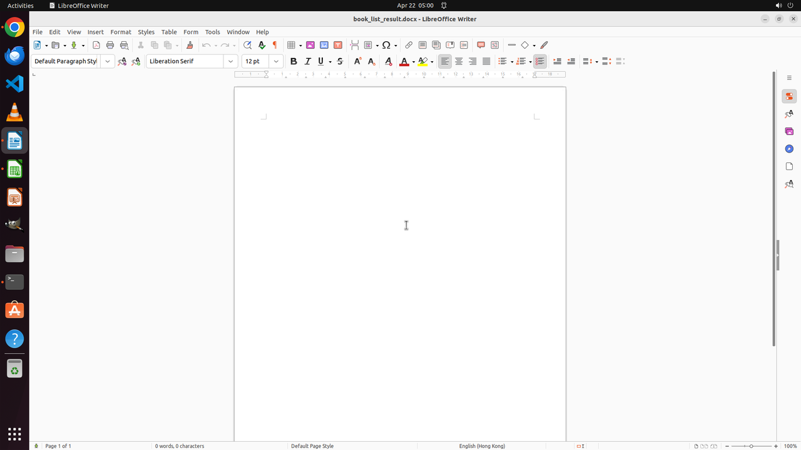

**Response:**
```
Good, the cursor is now in the main body of the document. Now let me type the title of the book with the slowest reading pace.
```

**Actions:** `import subprocess, shlex; subprocess.run(f'xdotool type --delay 12 -- ' + shlex.quote('Out of the Silent Planet'), shell=True, check=True)
import time; time.sleep(0.05)`

---

## Step 78

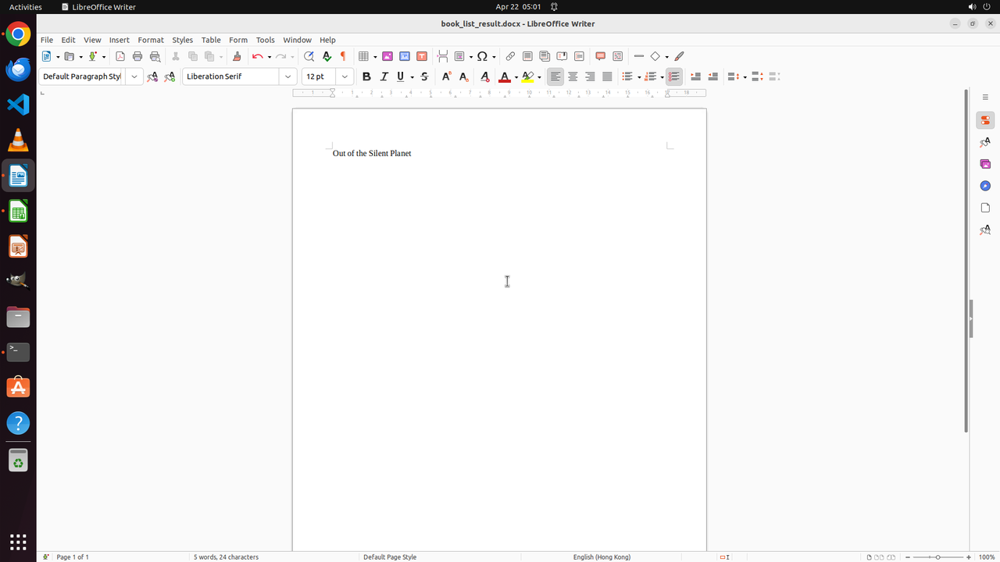

**Response:**
```
I've typed "Out of the Silent Planet" in the document. Now let me save the file with Ctrl+S.
```

**Actions:** `pyautogui.keyDown('ctrl')
pyautogui.keyDown('s')
pyautogui.keyUp('s')
pyautogui.keyUp('ctrl')`

---

## Step 79

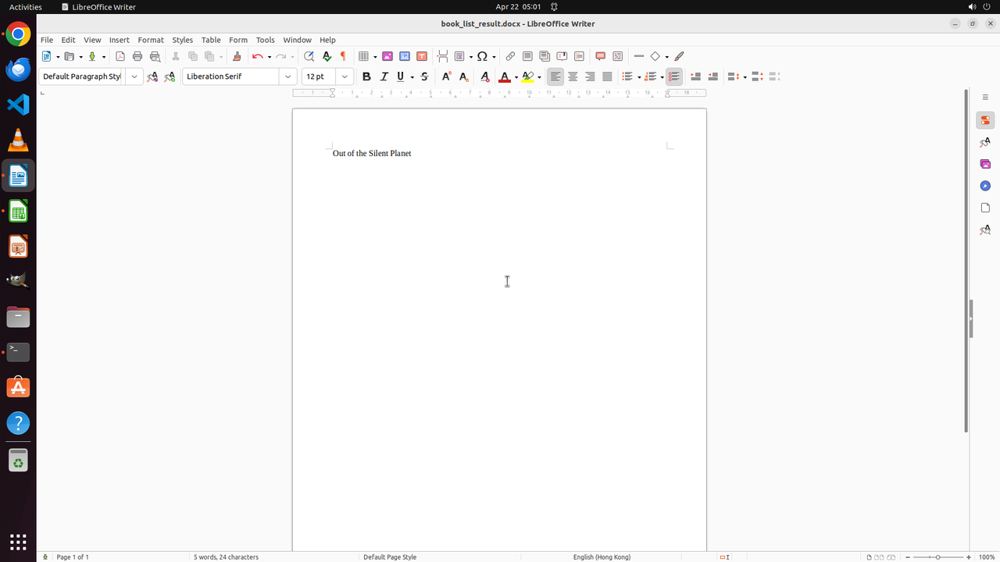

**Response:**
```
The file appears to have been saved (no format dialog appeared, which means it saved in the .docx format). The document now contains "Out of the Silent Planet" as the title of the book with the slowest reading pace.

Let me verify my work by summarizing the calculations:

Using word counts from howlongtoread.com and reading days from the spreadsheet:

1. Fire and Blood: 249,322 / 44 = 5,666.41 words/day
2. Song of Solomon: 96,041 / 48 = 2,000.85 words/day
3. The Lost Symbol: 151,532 / 66 = 2,295.94 words/day
4. 2001: A Space Odyssey: 56,119 / 23 = 2,440.39 words/day
5. American Gods: 178,778 / 50 = 3,575.56 words/day
6. **Out of the Silent Planet: 52,456 / 36 = 1,457.11 words/day** ← SLOWEST
7. The Andromeda Strain: 65,358 / 30 = 2,178.60 words/day
8. Brave New World: 37,909 / 19 = 1,995.21 words/day
9. Silence: 71,901 / 33 = 2,178.82 words/day
10. The Shining: 168,823 / 6 = 28,137.17 words/day

"Out of the Silent Planet" has the slowest reading pace at approximately 1,457 words per day.

DONE
```

**Actions:** `DONE`

---
