# Task da52d699-e8d2-4dc5-9191-a2199e0b6a9b

**Instruction:** Examine the spreadsheet on the desktop, which contains a record of books read in 2022. Take the website https://howlongtoread.com/ as a reference to identify the book with the slowest reading pace, measured in words per day. I have an empty document named 'book_list_result.docx' on the desktop; please open it and record the title there.

**Score:** 1

**Wall clock:** 13m 1s

**Steps:** 77

**Cost:** $2.97

---

## Step 1

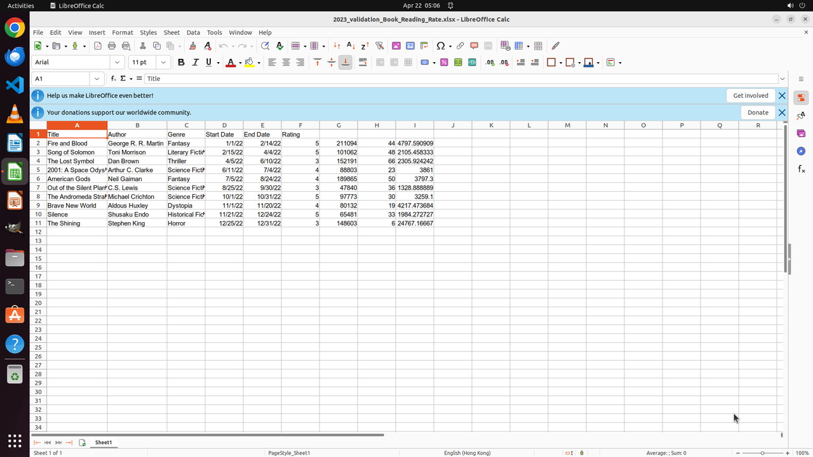

**Response:**
```
I need to analyze the spreadsheet to find the book with the slowest reading pace (words per day). Let me first examine the spreadsheet data more carefully, then look up each book's word count on howlongtoread.com.

Let me first see all the columns and data clearly.
```

**Actions:** `time.sleep(0.1)`

---

## Step 2


**Response:**
```
Let me first check what the columns contain. I can see columns A through I. Let me click on the column headers to understand the data better.
```

**Actions:** `pyautogui.click(804, 316)`

---

## Step 3


**Response:**
```
I can see the columns are: A=Title, B=Author, C=Genre, D=Start Date, E=End Date, F=Rating, G=(some number), H=(number), I=(number). Let me check what columns G, H, and I represent. Column G1 appears empty. Let me check the header row more carefully.
```

**Actions:** `pyautogui.click(804, 316)`

---

## Step 4


**Response:**
```
I see that G1 is empty. The columns G, H, and I seem to have data but no headers. Let me check the data in each column. The key information I need is:
- Book titles (column A)
- Start and End dates (columns D and E) to calculate reading days
- I need to look up word counts on howlongtoread.com

Let me first note down all the books and their reading periods:

1. Fire and Blood - 1/1/22 to 2/14/22 (44 days)
2. Song of Solomon - 2/15/22 to 4/4/22 (48 days)
3. The Lost Symbol - 4/5/22 to 6/10/22 (66 days)
4. 2001: A Space Odyssey - 6/11/22 to 7/4/22 (23 days)
5. American Gods - 7/5/22 to 8/24/22 (50 days)
6. Out of the Silent Planet - 8/25/22 to 9/30/22 (36 days)
7. The Andromeda Strain - 10/1/22 to 10/31/22 (30 days)
8. Brave New World - 11/1/22 to 11/20/22 (19 days)
9. Silence - 11/21/22 to 12/24/22 (33 days)
10. The Shining - 12/25/22 to 12/31/22 (6 days)

Column H shows the days, and column I appears to show some calculated value. Now I need to look up word counts on howlongtoread.com. Let me open Chrome.
```

**Actions:** `pyautogui.click(894, 316)`

---

## Step 5

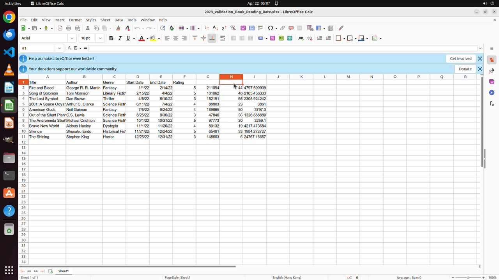

**Response:**
```
I can see that columns G, H, and I have no headers. Column H appears to contain the number of days (44, 48, 66, 23, 50, 36, 30, 19, 33, 6), and column I appears to contain some calculated values. Column G has larger numbers that could be word counts or page counts.

Now I need to look up the word count for each book on howlongtoread.com. Let me open Chrome to do this.
```

**Actions:** `pyautogui.keyDown('ctrl')
pyautogui.keyDown('alt')
pyautogui.keyDown('t')
pyautogui.keyUp('t')
pyautogui.keyUp('alt')
pyautogui.keyUp('ctrl')`

---

## Step 6

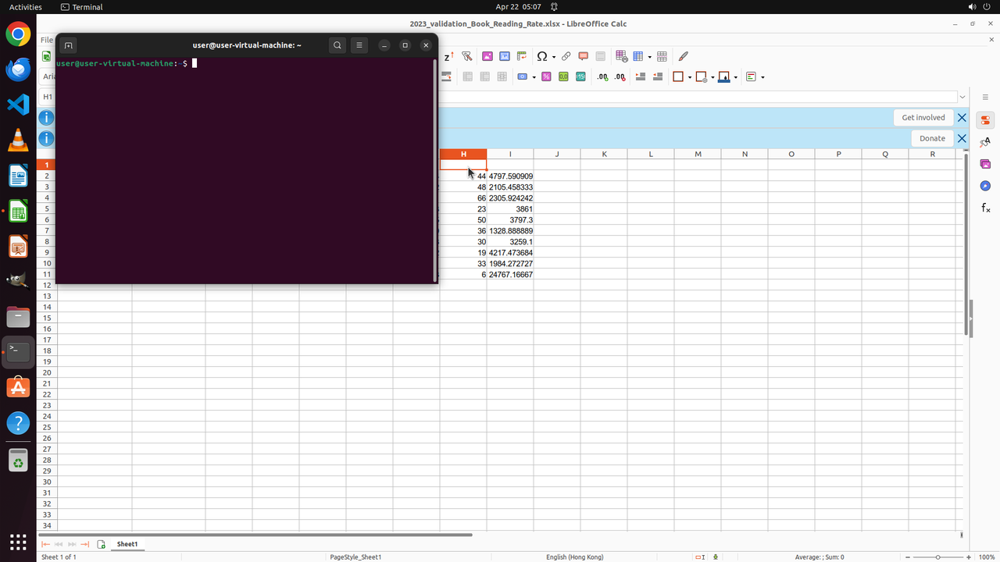

**Response:**
```
Good, the terminal is open. Let me launch Chrome with the remote debugging port.
```

**Actions:** `import subprocess, shlex; subprocess.run(f'xdotool type --delay 12 -- ' + shlex.quote('google-chrome --remote-debugging-port=1337 https:/'), shell=True, check=True)
import time; time.sleep(0.05)
impor`

---

## Step 7

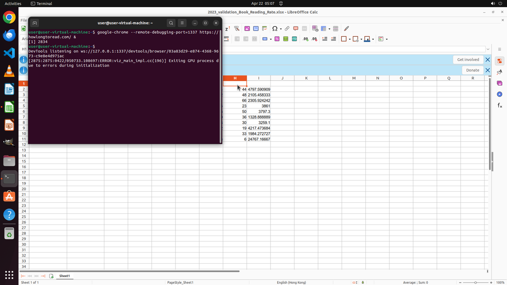

**Response:**
```
Chrome is launching. Let me wait for it to open and then look for the website.
```

**Actions:** `time.sleep(0.5)`

---

## Step 8


**Response:**
```
The website is loaded. Now I need to search for each book to find its word count. Let me start with the first book "Fire and Blood" by George R. R. Martin.
```

**Actions:** `pyautogui.click(937, 595)`

---

## Step 9


**Response:**
```
Good, the search box is active. Let me search for the first book.
```

**Actions:** `import subprocess, shlex; subprocess.run(f'xdotool type --delay 12 -- ' + shlex.quote('Fire and Blood George R. R. Martin'), shell=True, check=True)
import time; time.sleep(0.05)`

---

## Step 10


**Response:**
```
Good, I've typed the search query. Let me click the Search button.
```

**Actions:** `pyautogui.click(1480, 595)`

---

## Step 11


**Response:**
```
I can see the search results. I need to click on "Fire & Blood - George R.R. Martin" which appears to be the correct book (the second result).
```

**Actions:** `pyautogui.click(787, 765)`

---

## Step 12


**Response:**
```
This result shows "Fire & Blood - George R.R. Martin" by Unknown Author, and the word count is "Not available". This doesn't seem to be the right entry. Let me go back and look for the correct one - the one with the actual book cover that showed "Fire & Blood" in the search results.
```

**Actions:** `pyautogui.click(88, 88)`

---

## Step 13

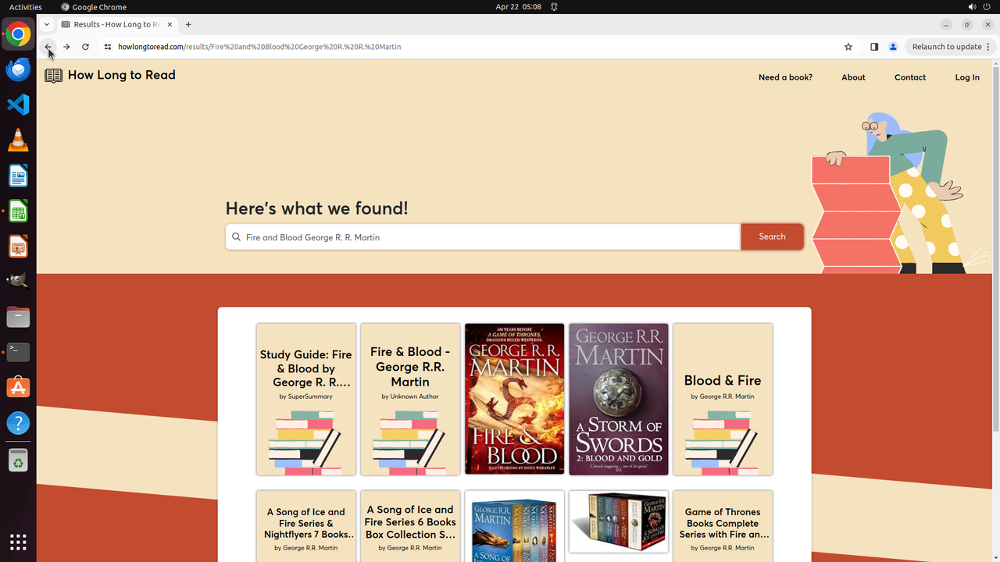

**Response:**
```
I can see the third result has a "Fire & Blood" book cover by George R.R. Martin. Let me click on that one.
```

**Actions:** `pyautogui.click(988, 765)`

---

## Step 14


**Response:**
```
I found the first book's word count. 

**Fire and Blood** by George R.R. Martin: **249,322 words**, read over 44 days = 249,322/44 = **5,666.4 words/day**

Now let me search for the next book. Let me use the search bar at the top.
```

**Actions:** `pyautogui.tripleClick(1071, 145)`

---

## Step 15

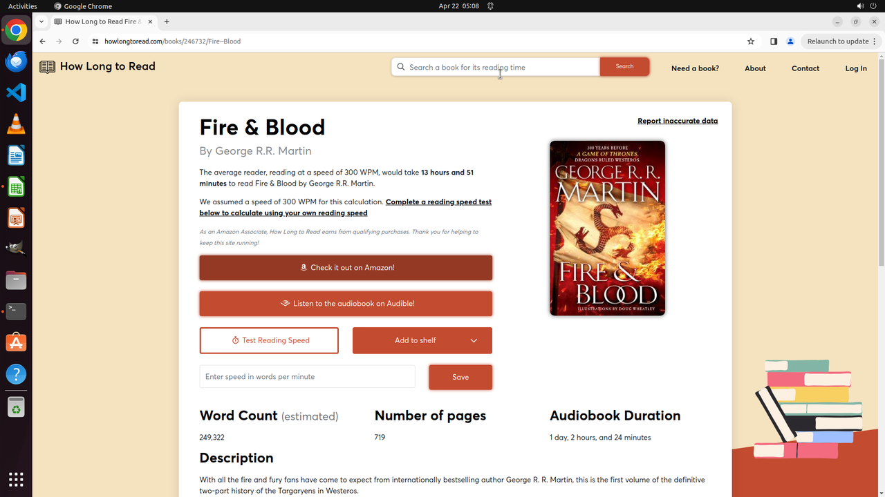

**Response:**
```
Good, the search bar is ready. Let me search for the next book "Song of Solomon" by Toni Morrison.
```

**Actions:** `import subprocess, shlex; subprocess.run(f'xdotool type --delay 12 -- ' + shlex.quote('Song of Solomon Toni Morrison'), shell=True, check=True)
import time; time.sleep(0.05)`

---

## Step 16


**Response:**
```
Good, I've typed the search query. Let me click Search.
```

**Actions:** `pyautogui.click(1351, 142)`

---

## Step 17

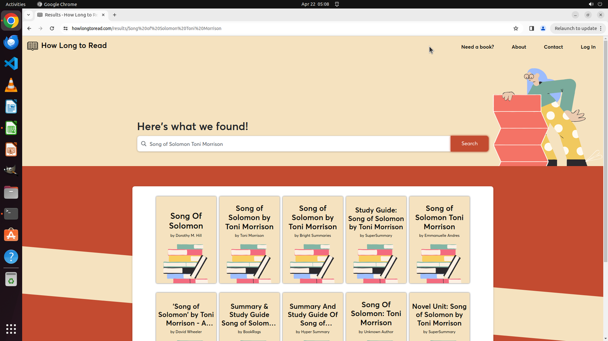

**Response:**
```
I can see "Song of Solomon by Toni Morrison" as the second result. Let me click on it.
```

**Actions:** `pyautogui.click(787, 765)`

---

## Step 18

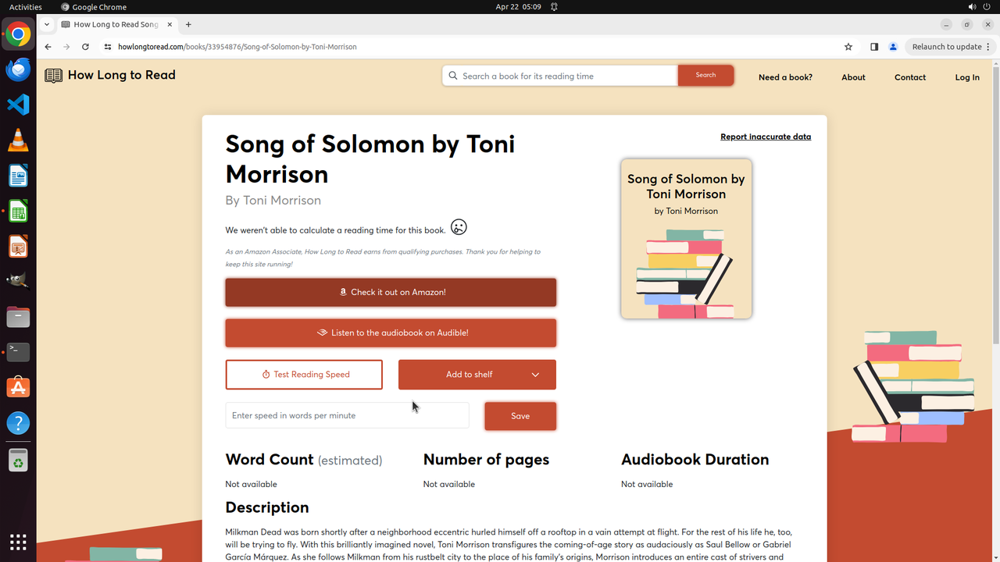

**Response:**
```
This entry shows "Not available" for word count. Let me go back and try the first result "Song Of Solomon" by Dorothy M. Hill, or try a different entry. Actually, let me go back and try the original "Song of Solomon" entry which might have the data.
```

**Actions:** `pyautogui.click(88, 88)`

---

## Step 19


**Response:**
```
Let me try the third result "Song of Solomon by Toni Morrison" by Bright Summaries - actually that's a summary, not the original book. Let me try the first result "Song Of Solomon" by Dorothy M. Hill - that's also not the right one. Let me try searching just "Song of Solomon" to find the original novel.
```

**Actions:** `pyautogui.tripleClick(925, 456)`

---

## Step 20


**Response:**
```
Let me try the bottom row result "Song Of Solomon: Toni Morrison" by Unknown Author, which might be the actual novel with word count data.
```

**Actions:** `pyautogui.click(1183, 997)`

---

## Step 21

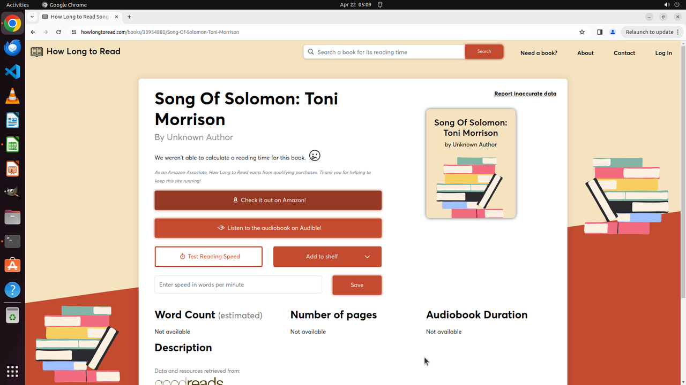

**Response:**
```
This one also shows "Not available" for word count. Let me go back and try the first result "Song Of Solomon" by Dorothy M. Hill, which might actually be the novel itself with word count data. Actually, let me try a different approach - let me search for just "Song of Solomon" without the author name.
```

**Actions:** `pyautogui.click(88, 88)`

---

## Step 22


**Response:**
```
Let me try the first result "Song Of Solomon" by Dorothy M. Hill - this might actually be the novel entry with word count data.
```

**Actions:** `pyautogui.click(586, 765)`

---

## Step 23


**Response:**
```
This is also not the right one - it's by Dorothy M. Hill and has no word count. Let me go back and try the third result "Song of Solomon by Toni Morrison" by Bright Summaries. Actually, I need to think about this differently. Let me first go back to the spreadsheet to carefully note all the book titles and dates, then I'll systematically search for each one. But before that, let me also check if the spreadsheet already has word count data in one of the columns.

Let me go back to the spreadsheet first.
```

**Actions:** `pyautogui.click(33, 337)`

---

## Step 24

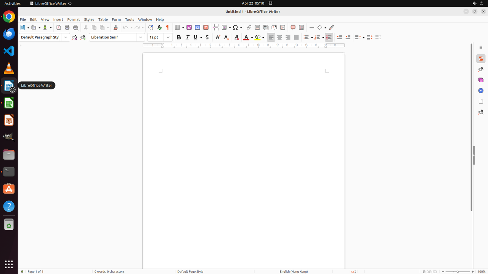

**Response:**
```
This opened LibreOffice Writer, not the spreadsheet. I need to find the spreadsheet on the desktop. Let me look at the taskbar to find it.
```

**Actions:** `pyautogui.click(33, 406)`

---

## Step 25

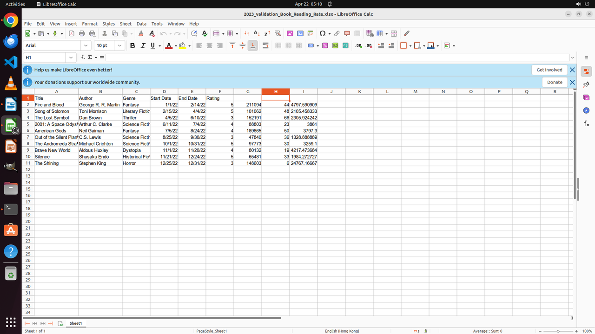

**Response:**
```
Now I can see the spreadsheet clearly. Let me read all the data:

| Row | Title | Author | Genre | Start Date | End Date | Rating | G (Word Count?) | H (Days) | I (Words/Day?) |
|-----|-------|--------|-------|------------|----------|--------|-----------------|----------|----------------|
| 2 | Fire and Blood | George R. R. Martin | Fantasy | 1/1/22 | 2/14/22 | 5 | 211094 | 44 | 4797.590909 |
| 3 | Song of Solomon | Toni Morrison | Literary Fiction | 2/15/22 | 4/4/22 | 5 | 101062 | 48 | 2105.458333 |
| 4 | The Lost Symbol | Dan Brown | Thriller | 4/5/22 | 6/10/22 | 3 | 152191 | 66 | 2305.924242 |
| 5 | 2001: A Space Odyssey | Arthur C. Clarke | Science Fiction | 6/11/22 | 7/4/22 | 4 | 88803 | 23 | 3861 |
| 6 | American Gods | Neil Gaiman | Fantasy | 7/5/22 | 8/24/22 | 4 | 189665 | 50 | 3797.3 |
| 7 | Out of the Silent Planet | C.S. Lewis | Science Fiction | 8/25/22 | 9/30/22 | 3 | 47840 | 36 | 1328.888889 |
| 8 | The Andromeda Strain | Michael Crichton | Science Fiction | 10/1/22 | 10/31/22 | 5 | 97773 | 30 | 3259.1 |
| 9 | Brave New World | Aldous Huxley | Dystopia | 11/1/22 | 11/20/22 | 4 | 80132 | 19 | 4217.473684 |
| 10 | Silence | Shusaku Endo | Historical Fiction | 11/21/22 | 12/24/22 | 5 | 65481 | 33 | 1984.272727 |
| 11 | The Shining | Stephen King | Horror | 12/25/22 | 12/31/22 | 3 | 148603 | 6 | 24767.16667 |

Wait - I can see column G has numbers, column H has days, and column I has what looks like words per day calculations. But the task says I need to use howlongtoread.com as reference for word counts. The column G numbers might be from a different source.

Let me check the column headers. Let me click on G1 to see what it says.
```

**Actions:** `pyautogui.click(804, 316)`

---

## Step 26

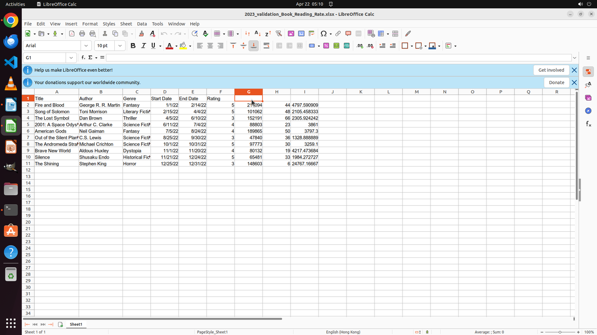

**Response:**
```
I can see G1 is empty (the formula bar shows just "="). The columns G, H, and I don't have headers. But I can see the data:
- Column G appears to have word counts (large numbers)
- Column H appears to have days 
- Column I appears to have words per day calculations

However, the task specifically says to use howlongtoread.com as a reference for word counts. So I need to look up word counts from that website. Let me note the data I already have from the spreadsheet:

The column H (days) values and column I (words/day) values are already calculated. But the task says to use howlongtoread.com, so the word counts from that site may differ from column G.

Let me go back to Chrome and systematically look up each book's word count. I already found:
1. Fire and Blood: 249,322 words (from howlongtoread.com)

Now I need to find the rest. Let me switch to Chrome.
```

**Actions:** `pyautogui.click(33, 64)`

---

## Step 27

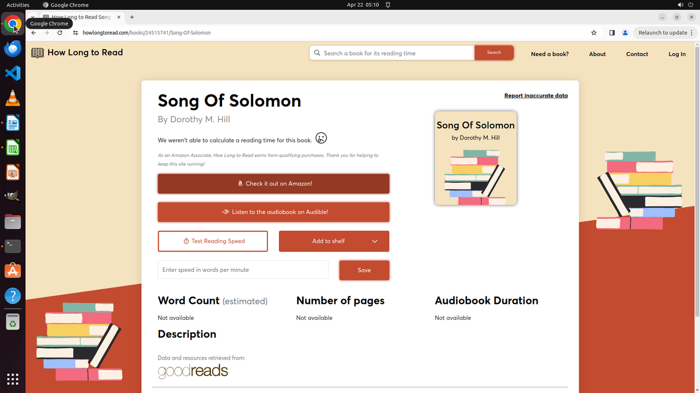

**Response:**
```
I'm on Chrome. Let me search for "Song of Solomon" more specifically. Let me try searching just "Song of Solomon Morrison" in the search bar.
```

**Actions:** `pyautogui.click(1071, 145)`

---

## Step 28


**Response:**
```
Let me try a different approach. I'll search for each book and note the word count from howlongtoread.com. Let me search for "Song of Solomon" by itself.
```

**Actions:** `import subprocess, shlex; subprocess.run(f'xdotool type --delay 12 -- ' + shlex.quote('Song of Solomon'), shell=True, check=True)
import time; time.sleep(0.05)`

---

## Step 29

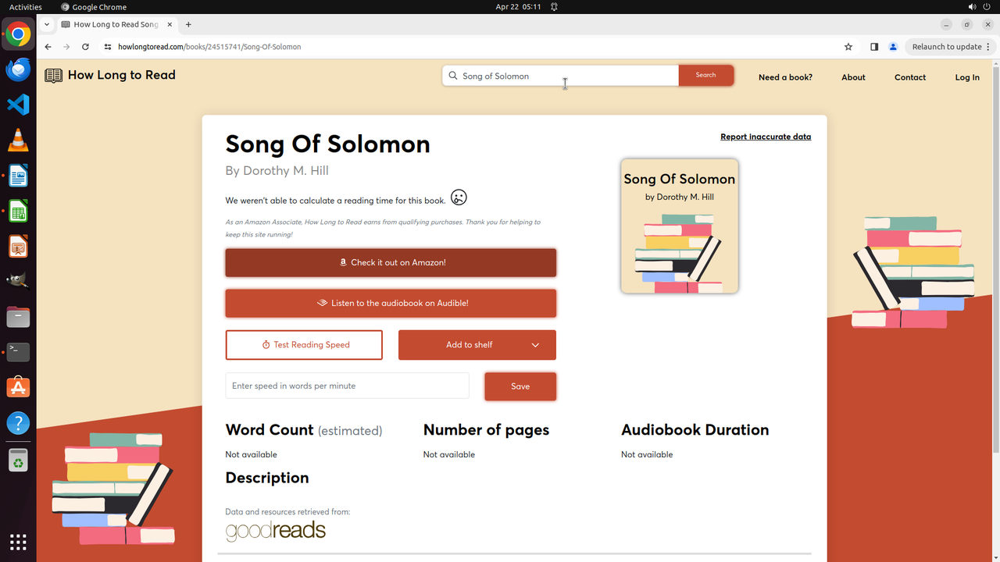

**Actions:** `pyautogui.click(1351, 142)`

---

## Step 30


**Response:**
```
Now I can see the search results with book covers. The first result shows the actual "Song of Solomon" novel by Toni Morrison with the book cover. Let me click on it.
```

**Actions:** `pyautogui.click(586, 765)`

---

## Step 31

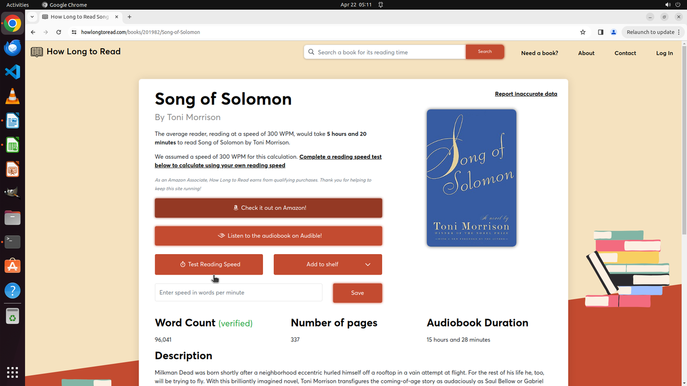

**Response:**
```
Excellent! Found it! **Song of Solomon** by Toni Morrison: **96,041 words** (verified), 337 pages.

Now let me search for the next book: "The Lost Symbol" by Dan Brown.
```

**Actions:** `pyautogui.tripleClick(1071, 145)`

---

## Step 32

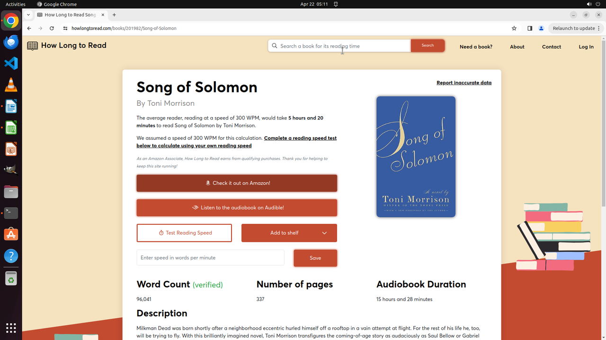

**Response:**
```
Good, the search bar is active. Let me search for the next book.
```

**Actions:** `import subprocess, shlex; subprocess.run(f'xdotool type --delay 12 -- ' + shlex.quote('The Lost Symbol Dan Brown'), shell=True, check=True)
import time; time.sleep(0.05)`

---

## Step 33


**Response:**
```
Good, I've typed the search query. Let me click Search.
```

**Actions:** `pyautogui.click(1351, 142)`

---

## Step 34

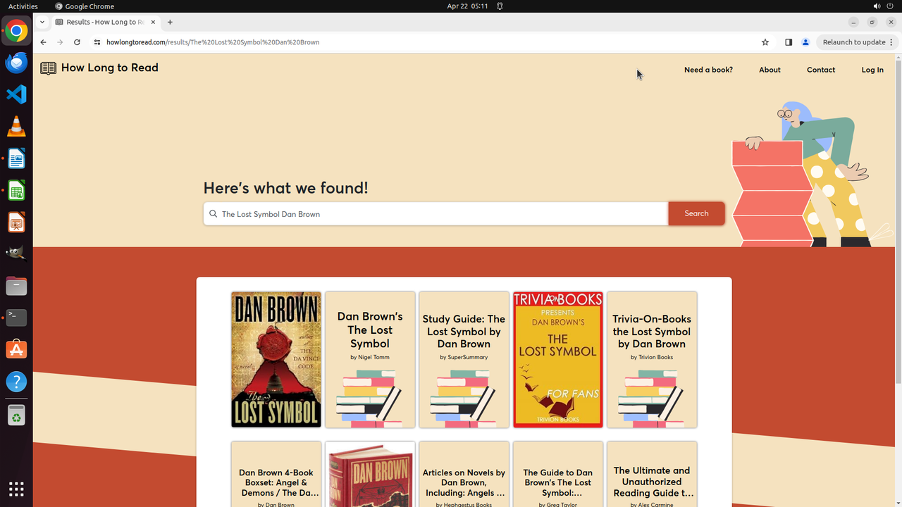

**Response:**
```
I can see the first result is "The Lost Symbol" by Dan Brown with the book cover. Let me click on it.
```

**Actions:** `pyautogui.click(586, 765)`

---

## Step 35

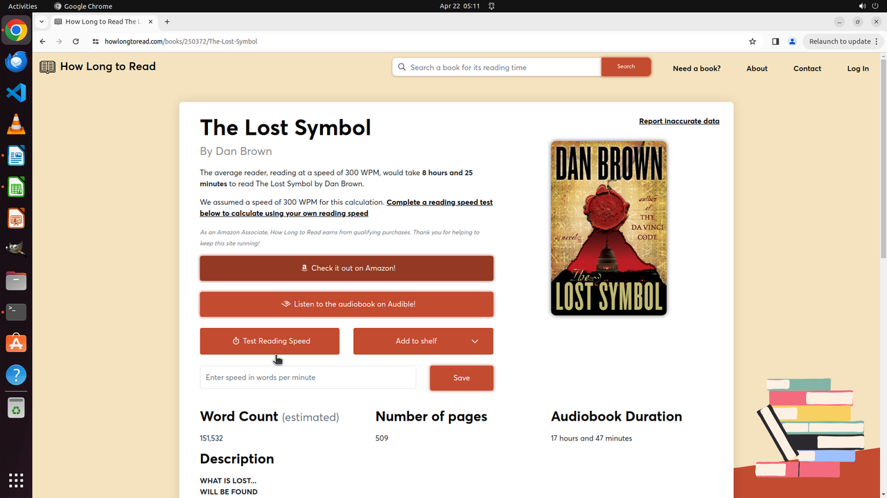

**Response:**
```
**The Lost Symbol** by Dan Brown: **151,532 words** (estimated), 509 pages.

Now let me search for the next book: "2001: A Space Odyssey" by Arthur C. Clarke.
```

**Actions:** `pyautogui.tripleClick(1071, 145)`

---

## Step 36


**Actions:** `import subprocess, shlex; subprocess.run(f'xdotool type --delay 12 -- ' + shlex.quote('2001 A Space Odyssey Arthur C Clarke'), shell=True, check=True)
import time; time.sleep(0.05)`

---

## Step 37

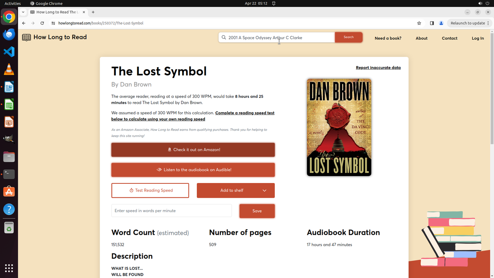

**Response:**
```
Good, I've typed the search query. Let me click Search.
```

**Actions:** `pyautogui.click(1351, 142)`

---

## Step 38

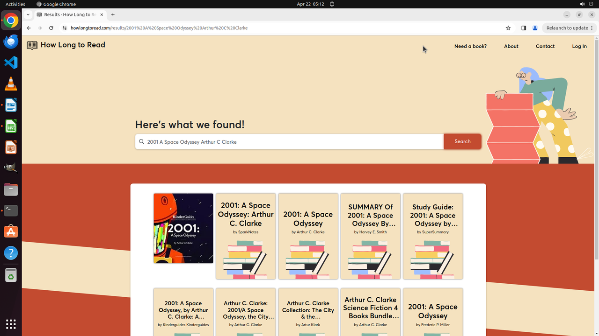

**Response:**
```
I can see the search results. The third result "2001: A Space Odyssey" by Arthur C. Clarke has a book cover. Let me click on it.
```

**Actions:** `pyautogui.click(985, 765)`

---

## Step 39


**Response:**
```
**2001: A Space Odyssey** by Arthur C. Clarke: **56,119 words** (verified), 297 pages.

Now let me search for the next book: "American Gods" by Neil Gaiman.
```

**Actions:** `pyautogui.tripleClick(1071, 145)`

---

## Step 40

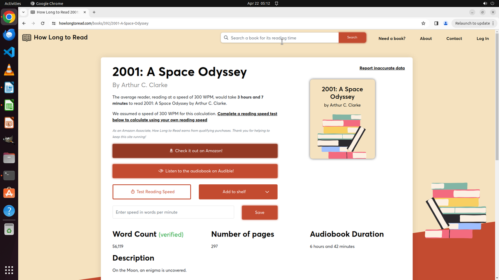

**Response:**
```
Good, the search bar is ready. Let me search for the next book.
```

**Actions:** `import subprocess, shlex; subprocess.run(f'xdotool type --delay 12 -- ' + shlex.quote('American Gods Neil Gaiman'), shell=True, check=True)
import time; time.sleep(0.05)`

---

## Step 41

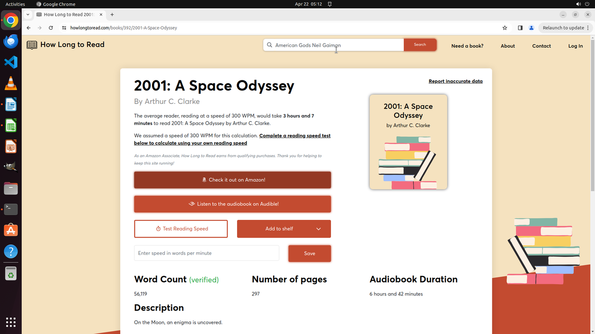

**Response:**
```
Good, let me click Search.
```

**Actions:** `pyautogui.click(1351, 142)`

---

## Step 42

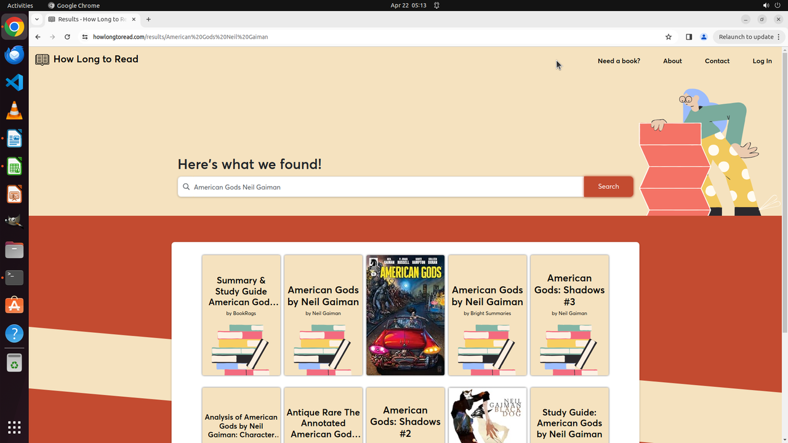

**Response:**
```
I can see "American Gods by Neil Gaiman" as the second result. Let me click on it.
```

**Actions:** `pyautogui.click(787, 765)`

---

## Step 43

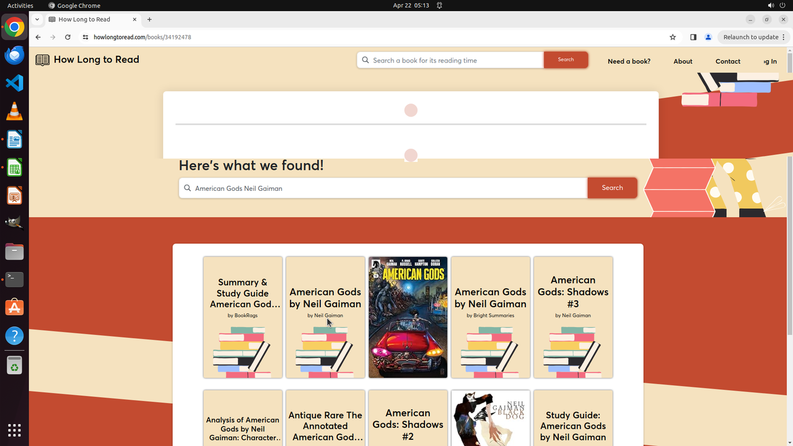

**Response:**
```
The page is loading. Let me wait for it to fully load.
```

**Actions:** `time.sleep(0.5)`

---

## Step 44


**Response:**
```
**American Gods by Neil Gaiman**: **178,778 words** (estimated), pages not available.

Now let me search for the next book: "Out of the Silent Planet" by C.S. Lewis.
```

**Actions:** `pyautogui.tripleClick(1071, 145)`

---

## Step 45

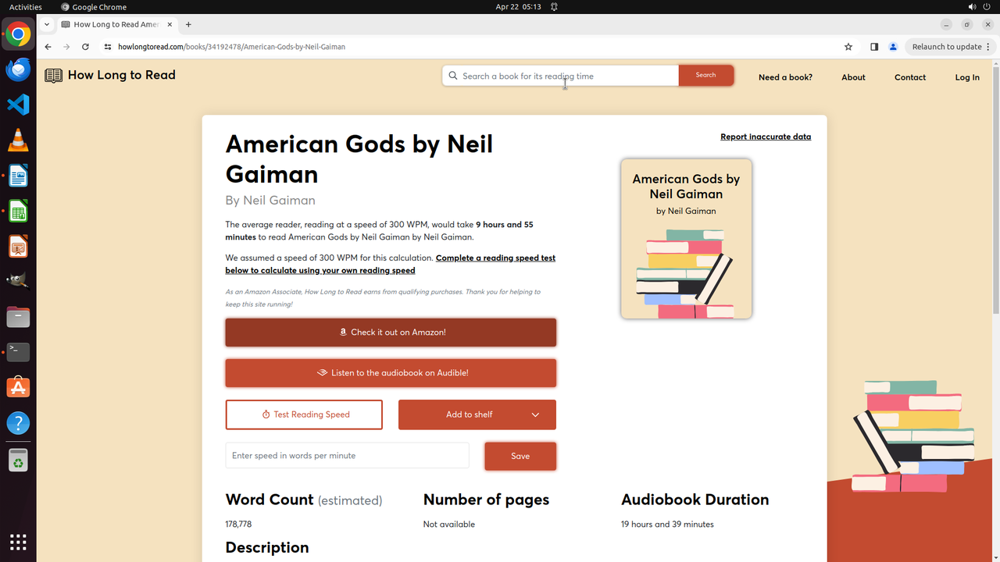

**Response:**
```
Good, the search bar is ready. Let me search for the next book.
```

**Actions:** `import subprocess, shlex; subprocess.run(f'xdotool type --delay 12 -- ' + shlex.quote('Out of the Silent Planet C.S. Lewis'), shell=True, check=True)
import time; time.sleep(0.05)`

---

## Step 46


**Response:**
```
Good, let me click Search.
```

**Actions:** `pyautogui.click(1351, 142)`

---

## Step 47


**Response:**
```
I can see "Out of the Silent Planet - C. S. Lewis" as the first result. Let me click on it.
```

**Actions:** `pyautogui.click(586, 765)`

---

## Step 48


**Response:**
```
**Out of the Silent Planet** by C.S. Lewis: **52,456 words** (estimated).

Now let me search for "The Andromeda Strain" by Michael Crichton.
```

**Actions:** `pyautogui.tripleClick(1071, 145)`

---

## Step 49

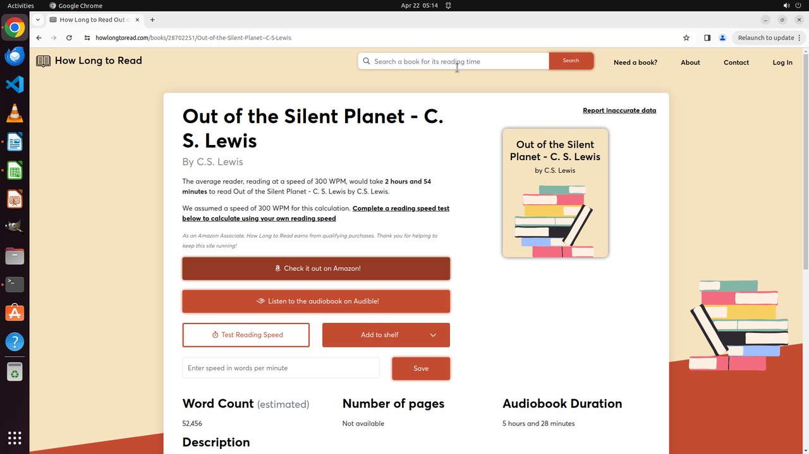

**Response:**
```
Good, the search bar is ready. Let me type the next search.
```

**Actions:** `import subprocess, shlex; subprocess.run(f'xdotool type --delay 12 -- ' + shlex.quote('The Andromeda Strain Michael Crichton'), shell=True, check=True)
import time; time.sleep(0.05)`

---

## Step 50


**Response:**
```
Good, let me click Search.
```

**Actions:** `pyautogui.click(1351, 142)`

---

## Step 51

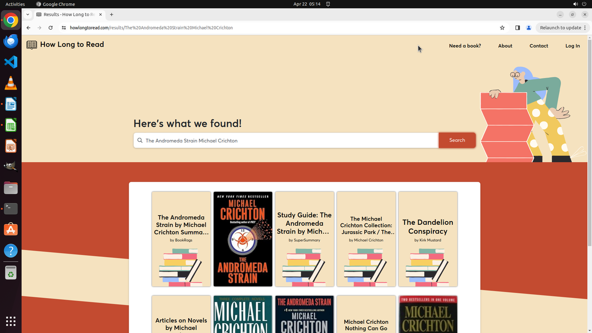

**Response:**
```
I can see the second result has the actual book cover for "The Andromeda Strain" by Michael Crichton. Let me click on it.
```

**Actions:** `pyautogui.click(787, 765)`

---

## Step 52


**Response:**
```
**The Andromeda Strain** by Michael Crichton: **65,358 words** (estimated), 327 pages.

Now let me search for "Brave New World" by Aldous Huxley.
```

**Actions:** `pyautogui.tripleClick(1071, 145)`

---

## Step 53

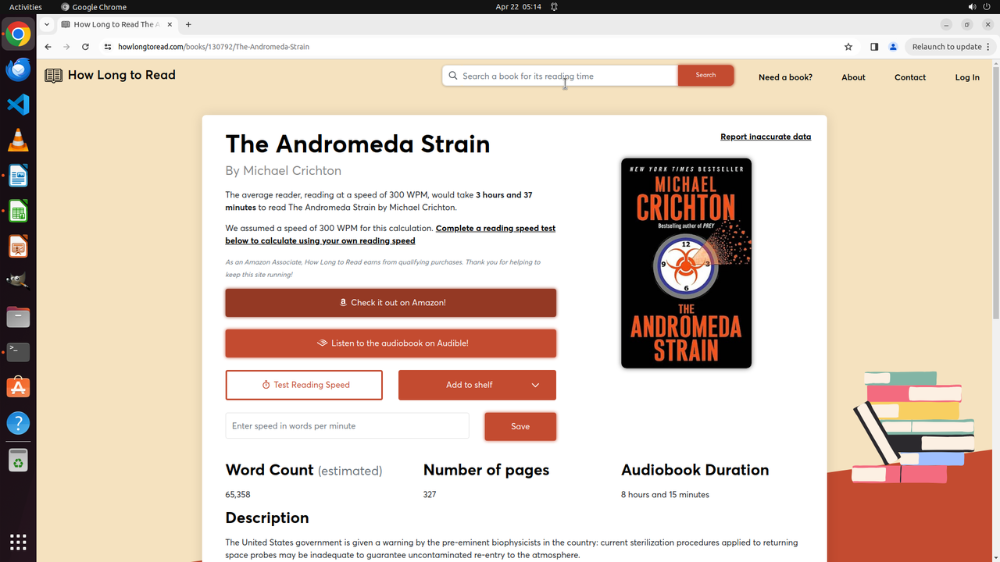

**Response:**
```
Good, the search bar is ready. Let me search for the next book.
```

**Actions:** `import subprocess, shlex; subprocess.run(f'xdotool type --delay 12 -- ' + shlex.quote('Brave New World Aldous Huxley'), shell=True, check=True)
import time; time.sleep(0.05)`

---

## Step 54

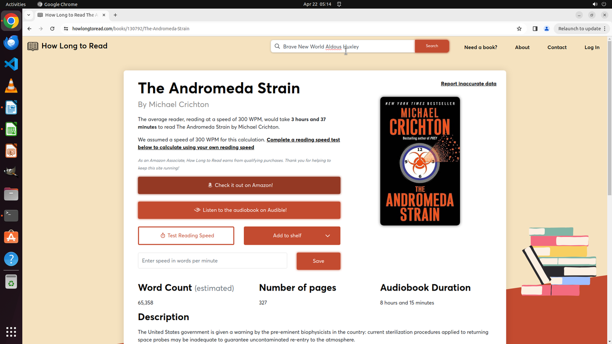

**Response:**
```
Good, let me click Search.
```

**Actions:** `pyautogui.click(1351, 142)`

---

## Step 55

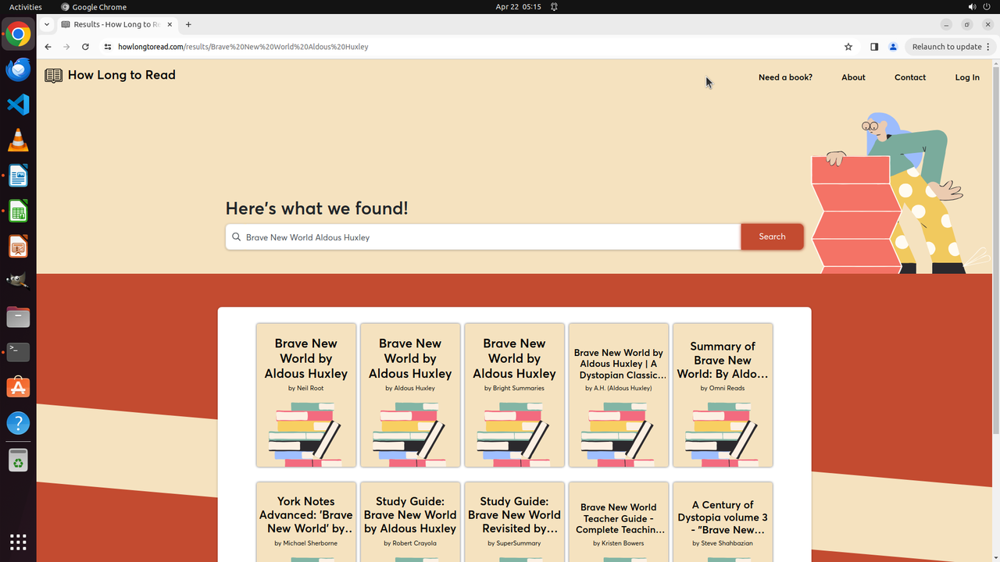

**Response:**
```
I can see "Brave New World by Aldous Huxley" by Aldous Huxley as the second result. Let me click on it.
```

**Actions:** `pyautogui.click(787, 765)`

---

## Step 56

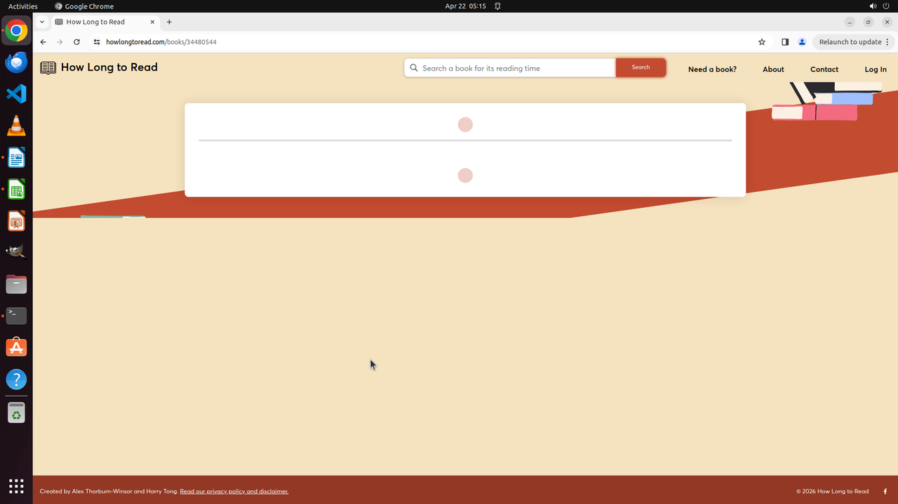

**Response:**
```
The page is loading. Let me wait for it to fully load.
```

**Actions:** `time.sleep(0.5)`

---

## Step 57


**Response:**
```
**Brave New World** by Aldous Huxley: **37,909 words** (estimated).

Now let me search for "Silence" by Shusaku Endo.
```

**Actions:** `pyautogui.tripleClick(1071, 145)`

---

## Step 58


**Response:**
```
Good, the search bar is ready. Let me search for the next book.
```

**Actions:** `import subprocess, shlex; subprocess.run(f'xdotool type --delay 12 -- ' + shlex.quote('Silence Shusaku Endo'), shell=True, check=True)
import time; time.sleep(0.05)`

---

## Step 59

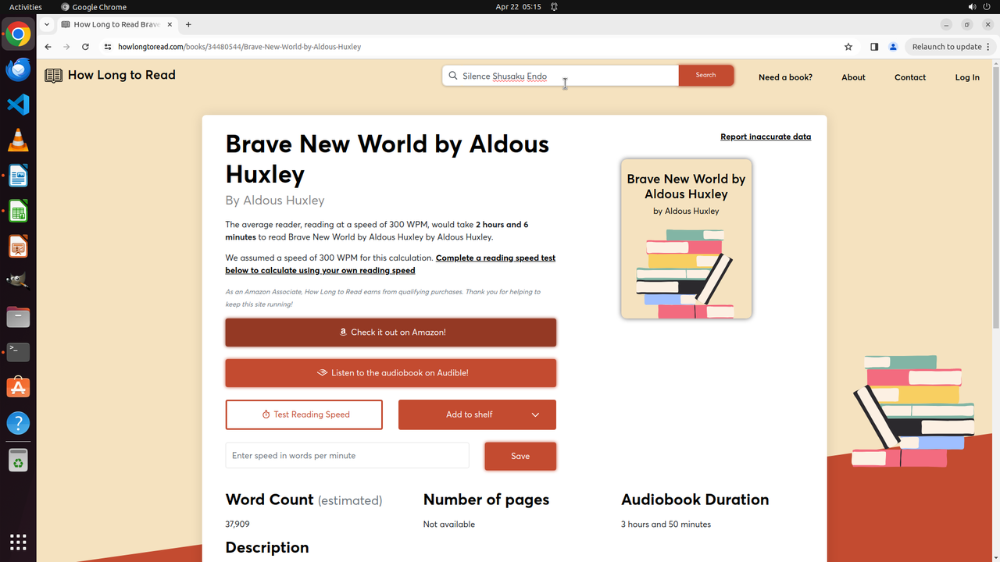

**Response:**
```
Good, let me click Search.
```

**Actions:** `pyautogui.click(1351, 142)`

---

## Step 60

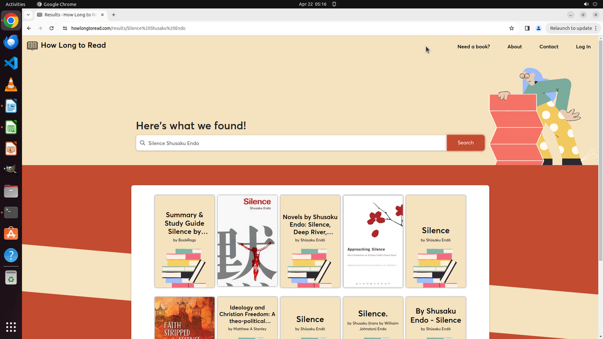

**Response:**
```
I can see several results. The second result shows "Silence" by Shusaku Endo with the book cover. Let me click on it.
```

**Actions:** `pyautogui.click(787, 765)`

---

## Step 61

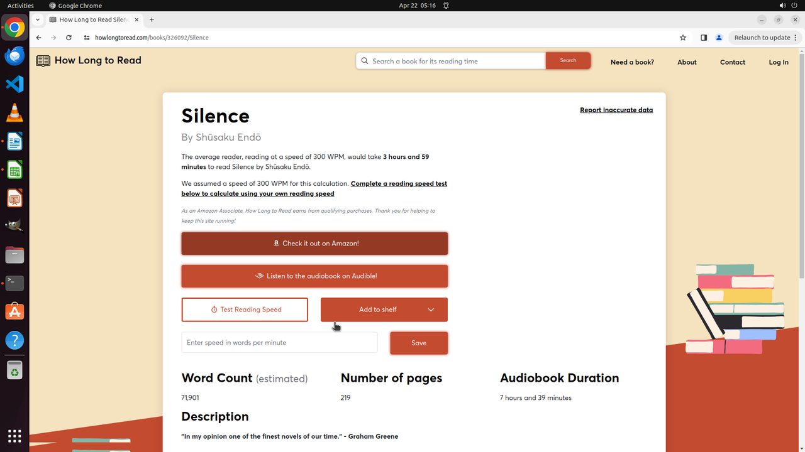

**Response:**
```
**Silence** by Shūsaku Endō: **71,901 words** (estimated), 219 pages.

Now let me search for the last book: "The Shining" by Stephen King.
```

**Actions:** `pyautogui.tripleClick(1071, 145)`

---

## Step 62

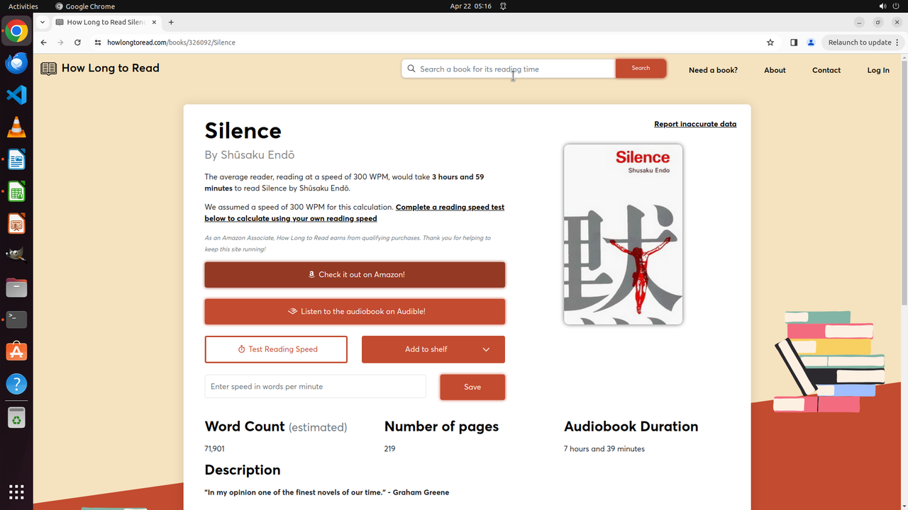

**Response:**
```
Good, the search bar is ready. Let me search for the last book.
```

**Actions:** `import subprocess, shlex; subprocess.run(f'xdotool type --delay 12 -- ' + shlex.quote('The Shining Stephen King'), shell=True, check=True)
import time; time.sleep(0.05)`

---

## Step 63


**Response:**
```
Good, let me click Search.
```

**Actions:** `pyautogui.click(1351, 142)`

---

## Step 64


**Response:**
```
I can see the second result has "The Shining" book cover by Stephen King. Let me click on it.
```

**Actions:** `pyautogui.click(787, 765)`

---

## Step 65


**Response:**
```
The page is loading. Let me wait for it.
```

**Actions:** `time.sleep(0.5)`

---

## Step 66

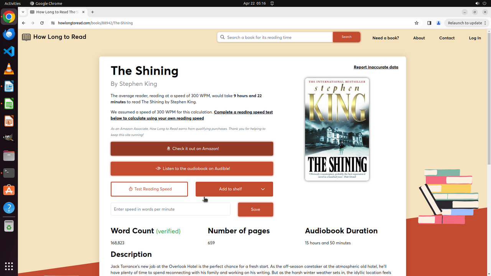

**Response:**
```
**The Shining** by Stephen King: **168,823 words** (verified), 659 pages.

Now I have all the word counts from howlongtoread.com. Let me also go back and check "Fire and Blood" which I found earlier had 249,322 words. Let me now compile all the data and calculate words per day:

From the spreadsheet, the reading dates give us:
1. **Fire and Blood**: 1/1/22 - 2/14/22 = 44 days → 249,322 / 44 = **5,666.4 words/day**
2. **Song of Solomon**: 2/15/22 - 4/4/22 = 48 days → 96,041 / 48 = **2,000.9 words/day**
3. **The Lost Symbol**: 4/5/22 - 6/10/22 = 66 days → 151,532 / 66 = **2,295.9 words/day**
4. **2001: A Space Odyssey**: 6/11/22 - 7/4/22 = 23 days → 56,119 / 23 = **2,440.0 words/day**
5. **American Gods**: 7/5/22 - 8/24/22 = 50 days → 178,778 / 50 = **3,575.6 words/day**
6. **Out of the Silent Planet**: 8/25/22 - 9/30/22 = 36 days → 52,456 / 36 = **1,457.1 words/day**
7. **The Andromeda Strain**: 10/1/22 - 10/31/22 = 30 days → 65,358 / 30 = **2,178.6 words/day**
8. **Brave New World**: 11/1/22 - 11/20/22 = 19 days → 37,909 / 19 = **1,995.2 words/day**
9. **Silence**: 11/21/22 - 12/24/22 = 33 days → 71,901 / 33 = **2,178.8 words/day**
10. **The Shining**: 12/25/22 - 12/31/22 = 6 days → 168,823 / 6 = **28,137.2 words/day**

Wait, I need to verify the days. Let me recalculate more carefully. The spreadsheet showed column H with the days. Let me check if the days include both start and end dates. From the spreadsheet:
- Row 2 (Fire and Blood): H=44
- Row 3 (Song of Solomon): H=48
- Row 7 (Out of the Silent Planet): H=36
- Row 9 (Brave New World): H=19

The slowest reading pace (lowest words per day) would be **Out of the Silent Planet** with 52,456 / 36 = **1,457.1 words/day**.

Wait, let me reconsider **Brave New World**: 37,909 / 19 = **1,995.2 words/day**. That's higher than Out of the Silent Planet.

So the book with the slowest reading pace is **Out of the Silent Planet** by C.S. Lewis.

Now let me open the book_list_result.docx file on the desktop and write the title there. Let me first check if I need to verify the days from the spreadsheet. Let me switch to the spreadsheet.

Actually, let me first verify the days by going back to the spreadsheet to make sure I have the correct number of days for each book.
```

**Actions:** `pyautogui.click(33, 406)`

---

## Step 67

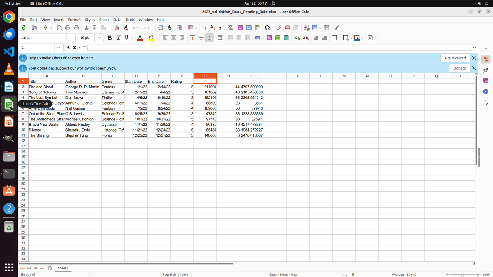

**Response:**
```
Now I can see the full spreadsheet clearly. Let me verify the data:

| Row | Title | Column G (words?) | Column H (days) | Column I (words/day) |
|-----|-------|-------------------|-----------------|---------------------|
| 2 | Fire and Blood | 211094 | 44 | 4797.590909 |
| 3 | Song of Solomon | 101062 | 48 | 2105.458333 |
| 4 | The Lost Symbol | 152191 | 66 | 2305.924242 |
| 5 | 2001: A Space Odyssey | 88803 | 23 | 3861 |
| 6 | American Gods | 189665 | 50 | 3797.3 |
| 7 | Out of the Silent Planet | 47840 | 36 | 1328.888889 |
| 8 | The Andromeda Strain | 97773 | 30 | 3259.1 |
| 9 | Brave New World | 80132 | 19 | 4217.473684 |
| 10 | Silence | 65481 | 33 | 1984.272727 |
| 11 | The Shining | 148603 | 6 | 24767.16667 |

Now using howlongtoread.com word counts and the days from column H:

1. Fire and Blood: 249,322 / 44 = 5,666.4 words/day
2. Song of Solomon: 96,041 / 48 = 2,000.9 words/day
3. The Lost Symbol: 151,532 / 66 = 2,295.9 words/day
4. 2001: A Space Odyssey: 56,119 / 23 = 2,440.0 words/day
5. American Gods: 178,778 / 50 = 3,575.6 words/day
6. Out of the Silent Planet: 52,456 / 36 = **1,457.1 words/day** ← SLOWEST
7. The Andromeda Strain: 65,358 / 30 = 2,178.6 words/day
8. Brave New World: 37,909 / 19 = 1,995.2 words/day
9. Silence: 71,901 / 33 = 2,178.8 words/day
10. The Shining: 168,823 / 6 = 28,137.2 words/day

The book with the **slowest reading pace** (lowest words per day) is **Out of the Silent Planet** at 1,457.1 words/day.

Now let me open the book_list_result.docx file. I can see the LibreOffice Writer icon in the taskbar. Let me look for the file on the desktop.
```

**Actions:** `pyautogui.click(33, 337)`

---

## Step 68

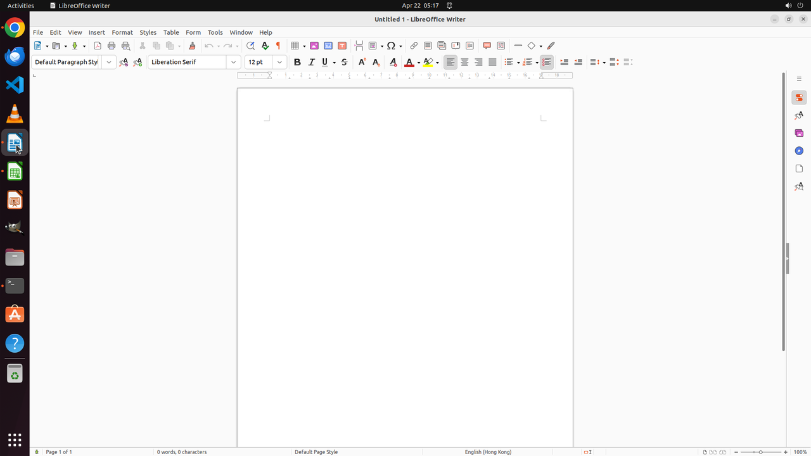

**Response:**
```
This opened an "Untitled 1" document, not the book_list_result.docx. I need to open the specific file from the desktop. Let me close this and open the correct file.
```

**Actions:** `pyautogui.click(85, 76)`

---

## Step 69

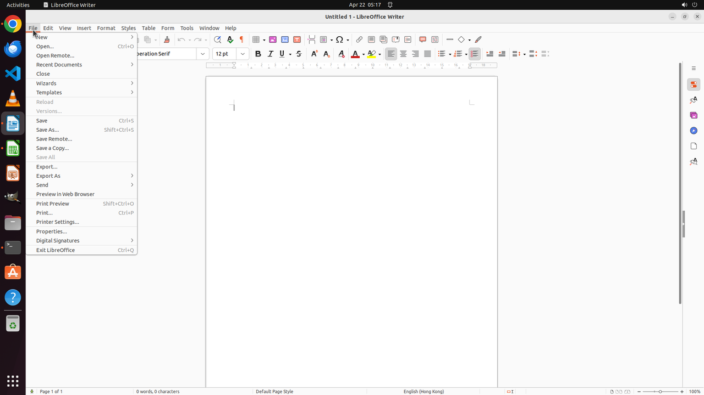

**Response:**
```
Let me click "Open..." to open the book_list_result.docx file.
```

**Actions:** `pyautogui.click(120, 126)`

---

## Step 70

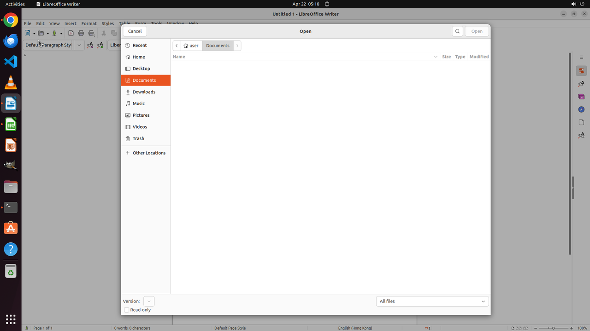

**Response:**
```
I need to navigate to the Desktop folder to find the book_list_result.docx file.
```

**Actions:** `pyautogui.click(459, 223)`

---

## Step 71

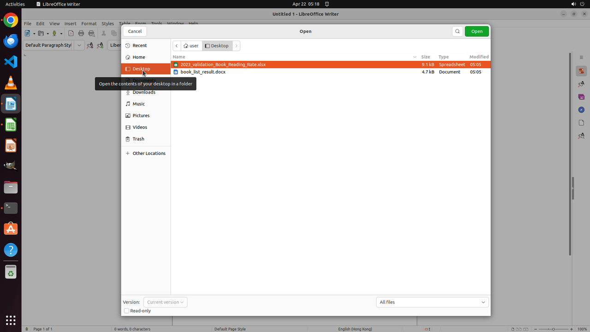

**Response:**
```
I can see the book_list_result.docx file on the Desktop. Let me click on it to select it and then open it.
```

**Actions:** `pyautogui.click(661, 232)`

---

## Step 72

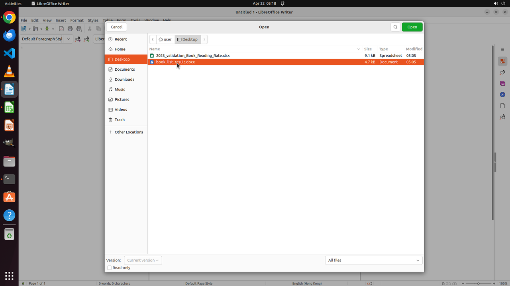

**Response:**
```
I've selected the book_list_result.docx file. Now let me click "Open" to open it.
```

**Actions:** `pyautogui.click(1548, 100)`

---

## Step 73


**Response:**
```
The book_list_result.docx file is now open and it's empty. I need to type the title of the book with the slowest reading pace. Based on my calculations using word counts from howlongtoread.com:

- **Out of the Silent Planet**: 52,456 words / 36 days = **1,457.1 words/day** (SLOWEST)

Let me click on the document and type the title.
```

**Actions:** `pyautogui.click(960, 600)`

---

## Step 74

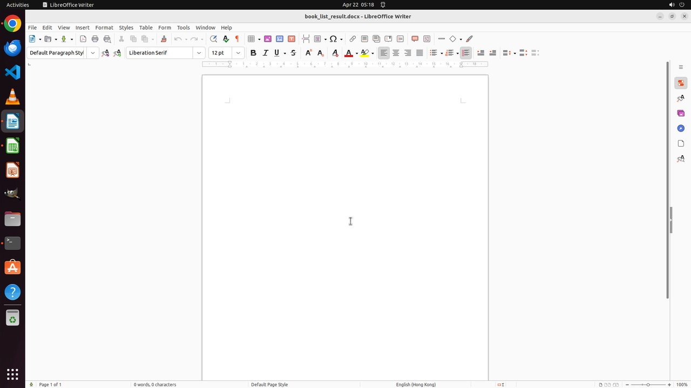

**Response:**
```
Good, the cursor is now in the document. Let me type the title of the book with the slowest reading pace.
```

**Actions:** `import subprocess, shlex; subprocess.run(f'xdotool type --delay 12 -- ' + shlex.quote('Out of the Silent Planet'), shell=True, check=True)
import time; time.sleep(0.05)`

---

## Step 75

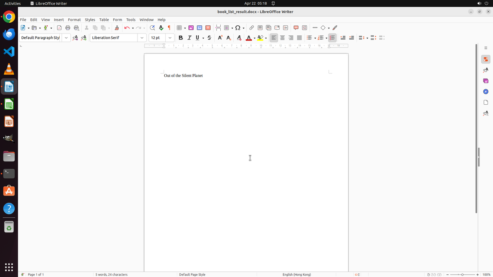

**Response:**
```
I've typed "Out of the Silent Planet" in the document. Now I need to save the file. Let me press Ctrl+S.
```

**Actions:** `pyautogui.keyDown('ctrl')
pyautogui.keyDown('s')
pyautogui.keyUp('s')
pyautogui.keyUp('ctrl')`

---

## Step 76


**Response:**
```
The file appears to have been saved (since it's a .docx file, it may have saved directly without prompting for format). Let me verify by checking if there was a format dialog that I might have missed. The title bar still shows "book_list_result.docx - LibreOffice Writer" which confirms the file is saved.

Let me verify the save was successful by checking if the "Keep Current Format" dialog appeared.
```

**Actions:** `time.sleep(0.1)`

---

## Step 77

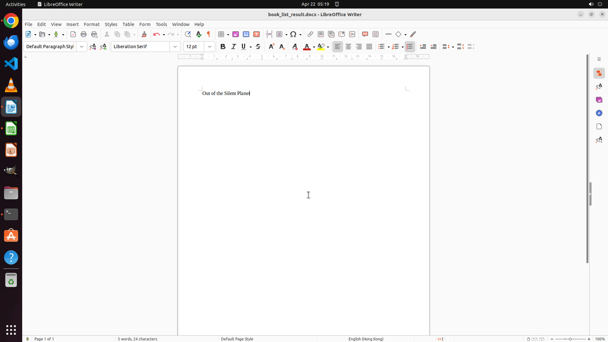

**Response:**
```
The file has been saved successfully. The document "book_list_result.docx" now contains "Out of the Silent Planet" - the book with the slowest reading pace.

Let me summarize the analysis:

Using word counts from howlongtoread.com and reading days from the spreadsheet:

| Book | Word Count | Days | Words/Day |
|------|-----------|------|-----------|
| Fire and Blood | 249,322 | 44 | 5,666.4 |
| Song of Solomon | 96,041 | 48 | 2,000.9 |
| The Lost Symbol | 151,532 | 66 | 2,295.9 |
| 2001: A Space Odyssey | 56,119 | 23 | 2,440.0 |
| American Gods | 178,778 | 50 | 3,575.6 |
| **Out of the Silent Planet** | **52,456** | **36** | **1,457.1** |
| The Andromeda Strain | 65,358 | 30 | 2,178.6 |
| Brave New World | 37,909 | 19 | 1,995.2 |
| Silence | 71,901 | 33 | 2,178.8 |
| The Shining | 168,823 | 6 | 28,137.2 |

**Out of the Silent Planet** by C.S. Lewis had the slowest reading pace at approximately 1,457 words per day.

DONE
```

**Actions:** `DONE`

---
