# Task da922383-bfa4-4cd3-bbad-6bebab3d7742

**Instruction:** I browsed a lot of interesting blog articles today. I hope to store these articles in my local designated folder just like zotero stores papers. Please download the blogs opening now in pdf format and save them in their title to /home/user/Documents/Blog.

**Score:** 1.0

**Wall clock:** 6m 54s

**Steps:** 30

**Cost:** $0.96

---

## Step 1

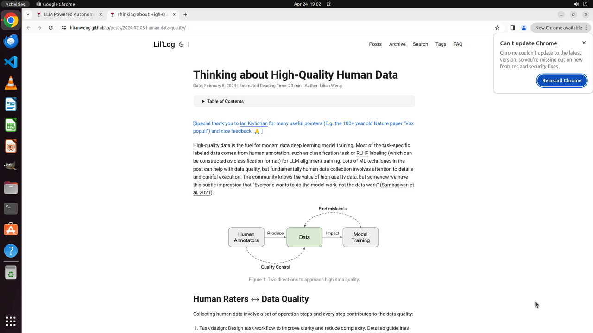

**Response:**
```
I can see two blog tabs open in Chrome. Let me first create the Blog folder, then get the titles and save each page as PDF.

Let me start by creating the directory and checking both tabs.
```

**Actions:** `pyautogui.keyDown('ctrl')
pyautogui.keyDown('l')
pyautogui.keyUp('l')
pyautogui.keyUp('ctrl')`

---

## Step 2

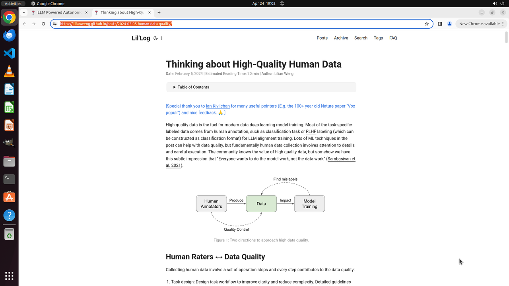

**Response:**
```
I can see two tabs open:
1. "LLM Powered Autom..." (first tab)
2. "Thinking about High-Q..." (current tab) - "Thinking about High-Quality Human Data"

Let me first create the Blog directory, then save both pages as PDFs. Let me open a terminal first.
```

**Actions:** `pyautogui.keyDown('esc')
pyautogui.keyUp('esc')`

---

## Step 3


**Response:**
```
Let me first check the first tab to get its full title, then I'll create the Blog directory and save both pages as PDFs.

Let me click on the first tab to see its title:
```

**Actions:** `pyautogui.click(216, 46)`

---

## Step 4

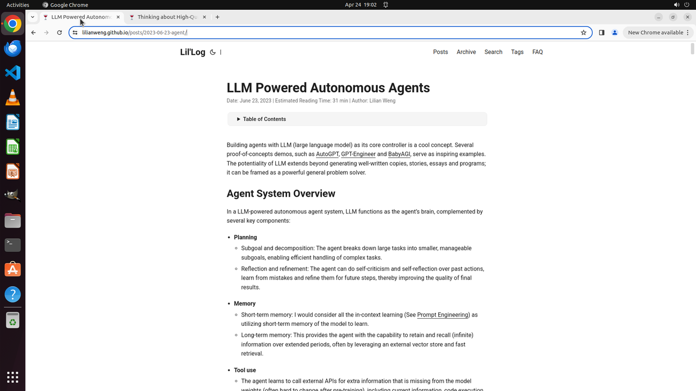

**Response:**
```
Now I can see both blog titles:
1. "LLM Powered Autonomous Agents"
2. "Thinking about High-Quality Human Data"

Let me first create the Blog directory, then save each page as a PDF. I'll open a terminal to create the directory.
```

**Actions:** `pyautogui.keyDown('ctrl')
pyautogui.keyDown('shift')
pyautogui.keyDown('j')
pyautogui.keyUp('j')
pyautogui.keyUp('shift')
pyautogui.keyUp('ctrl')`

---

## Step 5

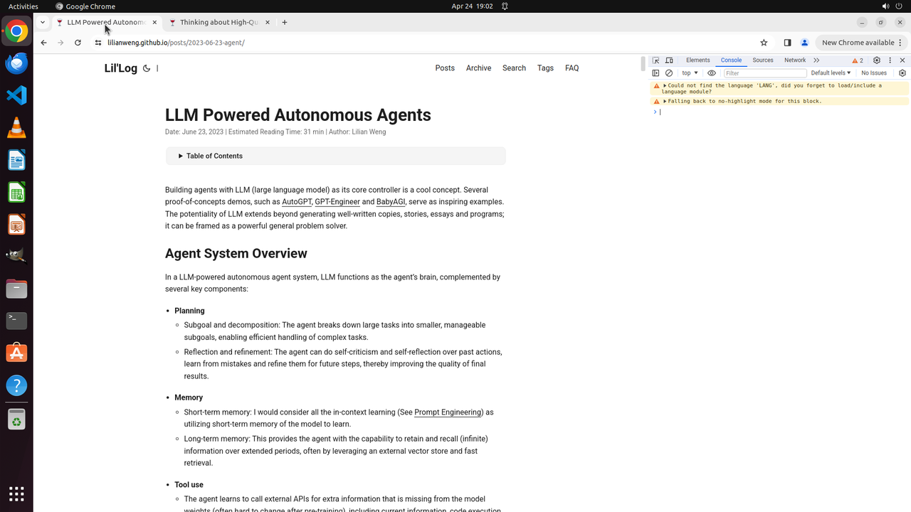

**Response:**
```
I see the DevTools console opened. Let me close it and instead use a different approach. I'll open a terminal application to create the directory, then use Chrome's Print to PDF feature.
```

**Actions:** `pyautogui.keyDown('f12')
pyautogui.keyUp('f12')`

---

## Step 6


**Response:**
```
Good, DevTools is closed. Now let me open a terminal to create the Blog directory first.
```

**Actions:** `pyautogui.rightClick(960, 750)`

---

## Step 7

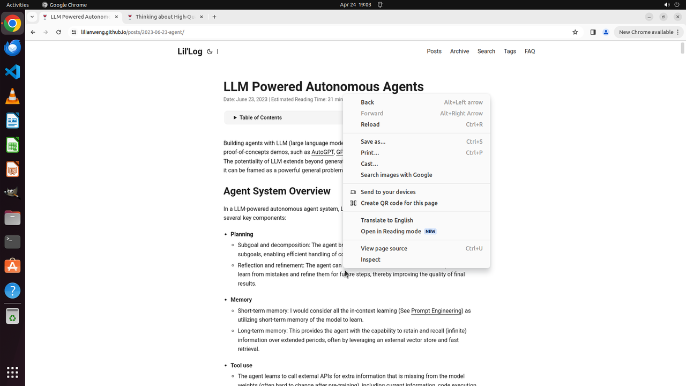

**Response:**
```
I can see the right-click context menu. Let me close this and instead open a terminal to create the directory first. Let me press Escape and then open a terminal.
```

**Actions:** `pyautogui.keyDown('esc')
pyautogui.keyUp('esc')`

---

## Step 8


**Response:**
```
Let me open a terminal application. I'll look for it in the taskbar - I can see what appears to be a terminal icon.
```

**Actions:** `pyautogui.click(33, 607)`

---

## Step 9

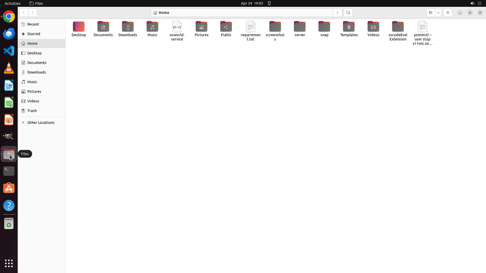

**Response:**
```
That opened the Files manager. Let me close it and open a terminal instead. I can see the terminal icon in the taskbar.
```

**Actions:** `pyautogui.click(1888, 49)`

---

## Step 10

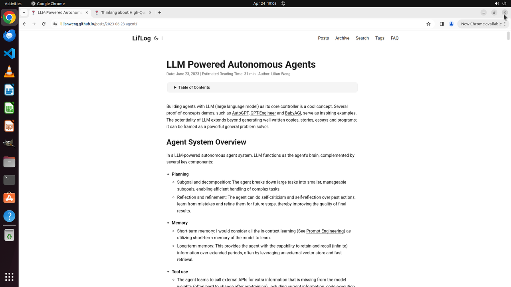

**Response:**
```
Let me open a terminal. I'll look for the terminal icon in the taskbar - I can see what looks like a terminal icon.
```

**Actions:** `pyautogui.click(33, 673)`

---

## Step 11


**Response:**
```
A terminal is now open. Let me create the Blog directory under /home/user/Documents/.
```

**Actions:** `import subprocess, shlex; subprocess.run(f'xdotool type --delay 12 -- ' + shlex.quote('mkdir -p /home/user/Documents/Blog\n'), shell=True, check=True)
import time; time.sleep(0.05)`

---

## Step 12

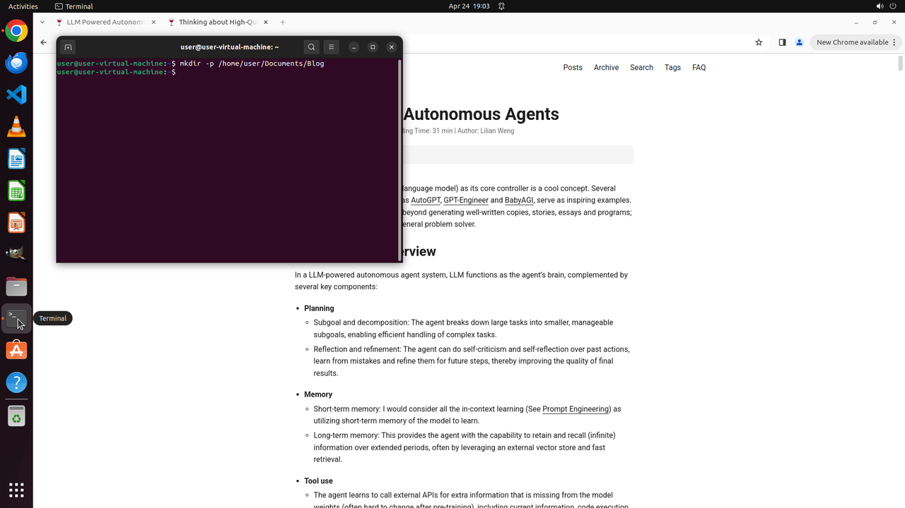

**Response:**
```
The Blog directory has been created. Now I need to save both blog pages as PDFs. I'll use Chrome's Print to PDF feature. Let me first save the current tab (LLM Powered Autonomous Agents). Let me click on the Chrome window first.
```

**Actions:** `pyautogui.click(1350, 600)`

---

## Step 13

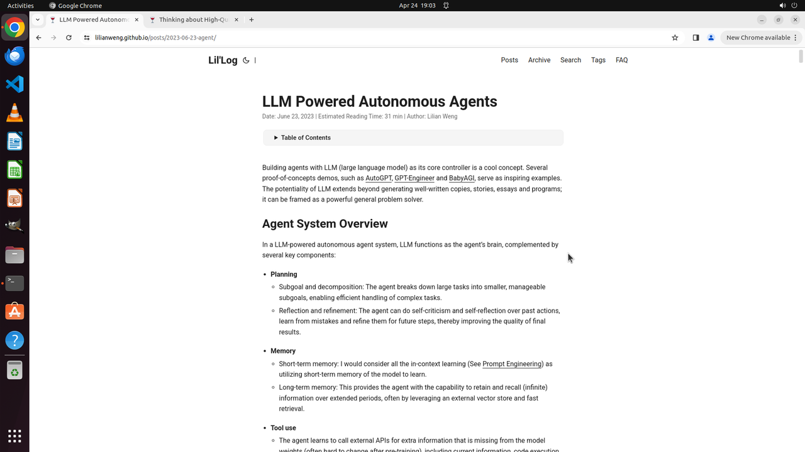

**Response:**
```
Now I'm on the Chrome window with the "LLM Powered Autonomous Agents" page. Let me use Ctrl+P to open the Print dialog and save as PDF.
```

**Actions:** `pyautogui.keyDown('ctrl')
pyautogui.keyDown('p')
pyautogui.keyUp('p')
pyautogui.keyUp('ctrl')`

---

## Step 14

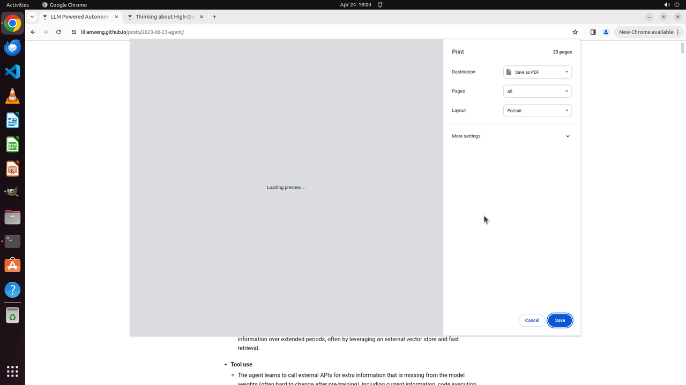

**Response:**
```
The Print dialog is open and the destination is already set to "Save as PDF". I can see it's a 23-page document. Now I need to click "Save" to save it, and then navigate to the Blog folder and name it properly.
```

**Actions:** `pyautogui.click(1564, 897)`

---

## Step 15

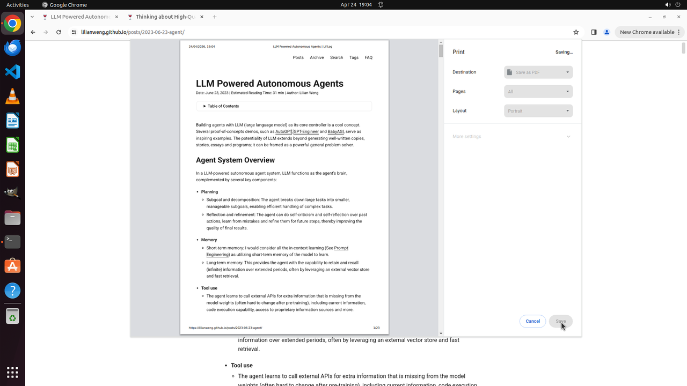

**Response:**
```
I can see the print preview is loading and it says "Saving..." at the top right. Let me wait for the save dialog to appear.
```

**Actions:** `time.sleep(0.5)`

---

## Step 16

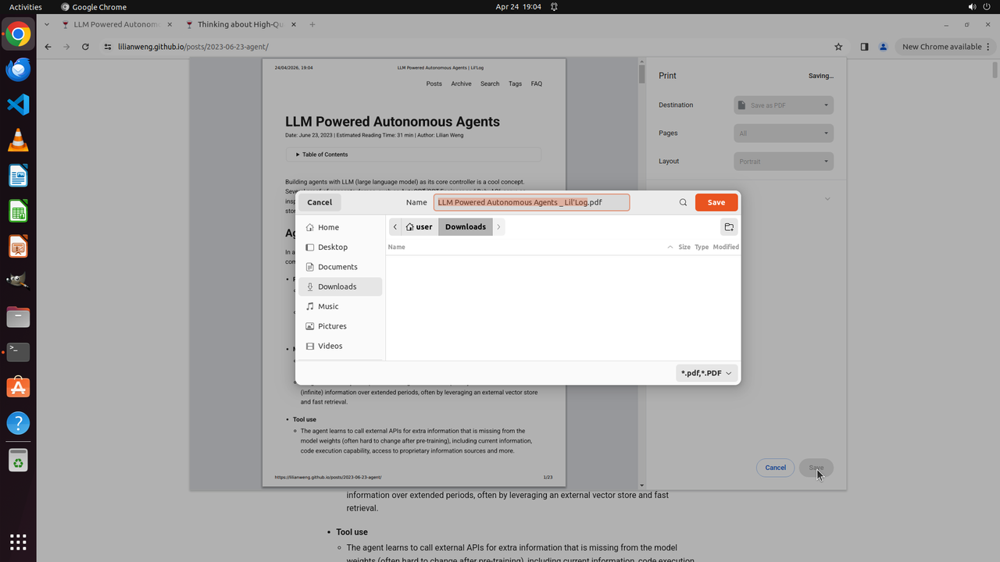

**Response:**
```
The Save dialog has appeared. I can see the filename is "LLM Powered Autonomous Agents _ Lil'Log.pdf". I need to:
1. Navigate to the Documents/Blog folder
2. Change the filename to just the blog title "LLM Powered Autonomous Agents.pdf"

Let me first navigate to the Documents folder, then to Blog.
```

**Actions:** `pyautogui.click(648, 511)`

---

## Step 17

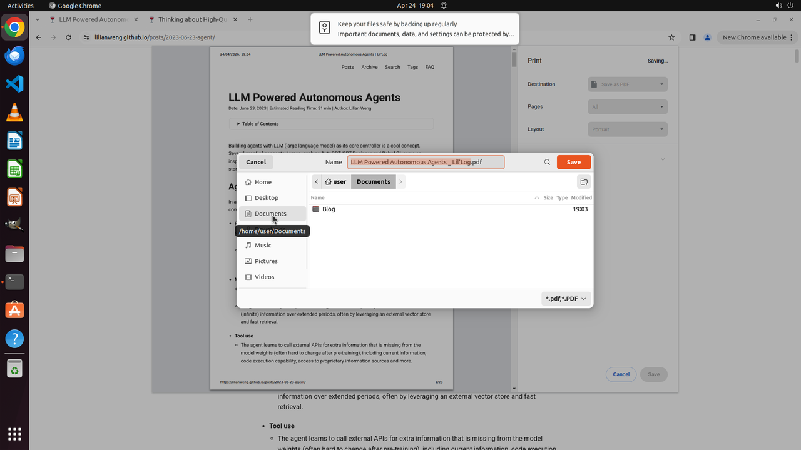

**Response:**
```
I can see the Documents folder is now showing and the Blog folder is visible. Let me double-click on the Blog folder to navigate into it.
```

**Actions:** `pyautogui.doubleClick(784, 501)`

---

## Step 18

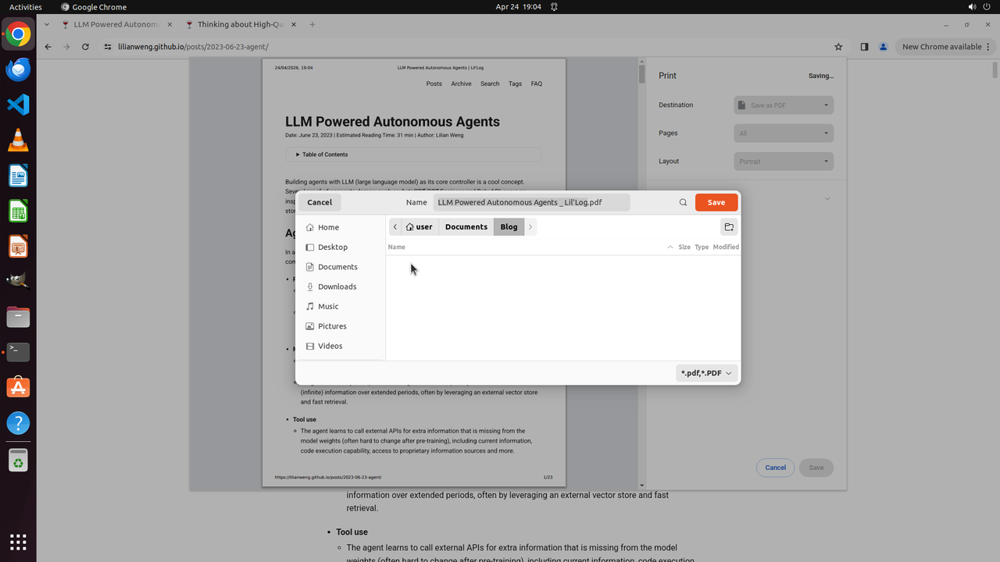

**Response:**
```
I'm now inside the Blog folder. The current filename is "LLM Powered Autonomous Agents _ Lil'Log.pdf". I need to change it to just "LLM Powered Autonomous Agents.pdf". Let me clear the filename field and type the correct name.
```

**Actions:** `pyautogui.tripleClick(1071, 388)`

---

## Step 19

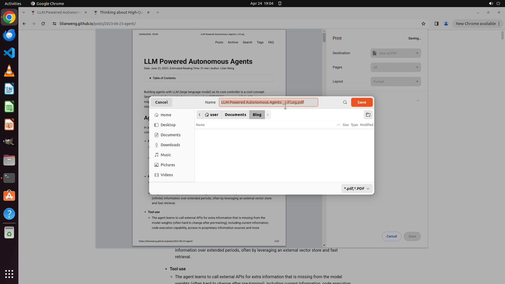

**Response:**
```
The filename is selected. Now I'll type the correct filename.
```

**Actions:** `import subprocess, shlex; subprocess.run(f'xdotool type --delay 12 -- ' + shlex.quote('LLM Powered Autonomous Agents.pdf'), shell=True, check=True)
import time; time.sleep(0.05)`

---

## Step 20

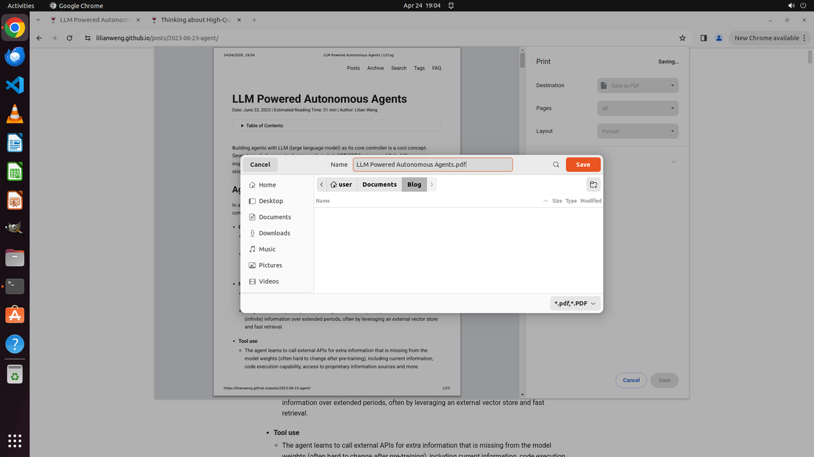

**Response:**
```
The filename is now "LLM Powered Autonomous Agents.pdf" and I'm in the Blog folder. Let me click Save.
```

**Actions:** `pyautogui.click(1371, 388)`

---

## Step 21


**Response:**
```
The first PDF has been saved successfully. Now I need to save the second blog tab. Let me click on the second tab "Thinking about High-Q...".
```

**Actions:** `pyautogui.click(457, 46)`

---

## Step 22

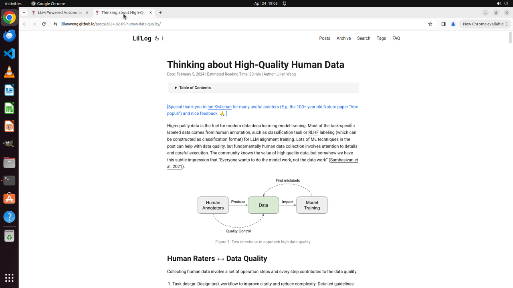

**Response:**
```
Now I can see the second blog: "Thinking about High-Quality Human Data". Let me use Ctrl+P to print this page as PDF too.
```

**Actions:** `pyautogui.keyDown('ctrl')
pyautogui.keyDown('p')
pyautogui.keyUp('p')
pyautogui.keyUp('ctrl')`

---

## Step 23

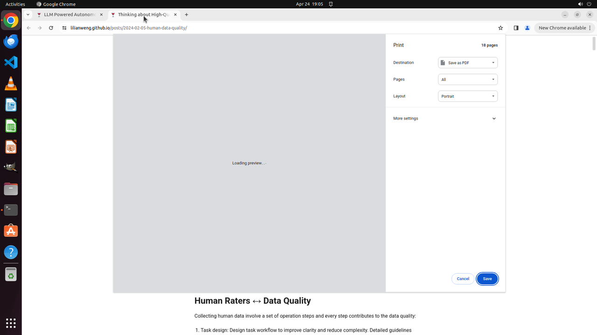

**Response:**
```
The Print dialog is open for the second blog. Destination is "Save as PDF" with 18 pages. Let me click Save.
```

**Actions:** `pyautogui.click(1564, 897)`

---

## Step 24

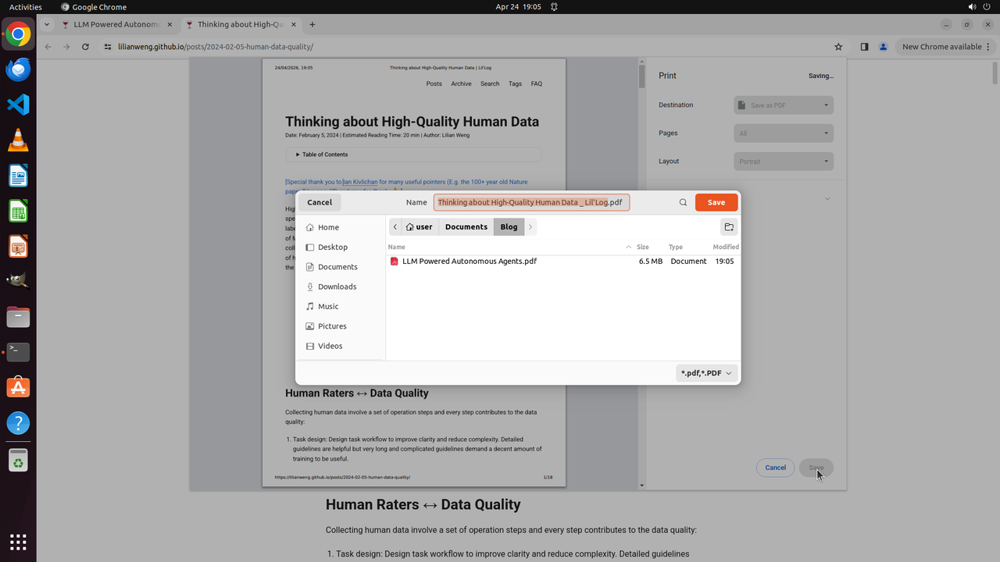

**Response:**
```
The Save dialog appeared and I can see it's already in the Blog folder (I can see the first PDF "LLM Powered Autonomous Agents.pdf" is already there). The filename is "Thinking about High-Quality Human Data _ Lil'Log.pdf". I need to change it to "Thinking about High-Quality Human Data.pdf". Let me select all the text in the filename field and type the correct name.
```

**Actions:** `pyautogui.tripleClick(1071, 388)`

---

## Step 25

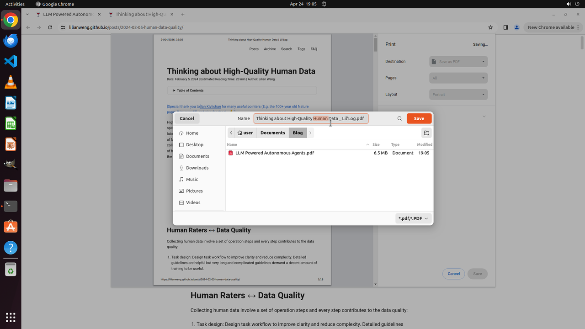

**Response:**
```
I can see the text is partially selected. Let me use Ctrl+A to select all text in the filename field, then type the new name.
```

**Actions:** `pyautogui.keyDown('ctrl')
pyautogui.keyDown('a')
pyautogui.keyUp('a')
pyautogui.keyUp('ctrl')`

---

## Step 26

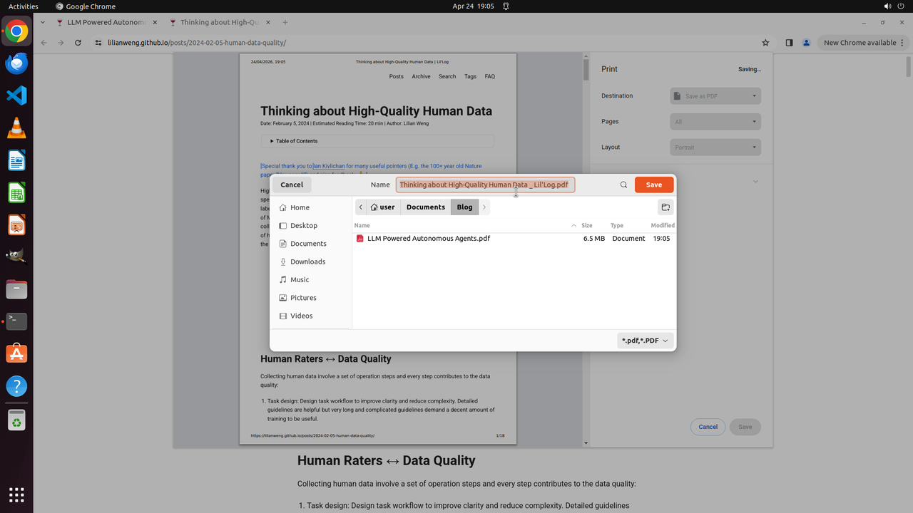

**Response:**
```
The text is now fully selected (shown in blue). Let me type the correct filename.
```

**Actions:** `import subprocess, shlex; subprocess.run(f'xdotool type --delay 12 -- ' + shlex.quote('Thinking about High-Quality Human Data.pdf'), shell=True, check=True)
import time; time.sleep(0.05)`

---

## Step 27

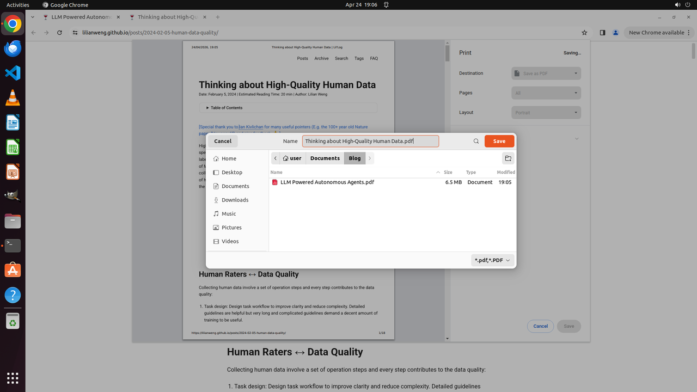

**Response:**
```
The filename is now "Thinking about High-Quality Human Data.pdf" and I'm in the Blog folder. I can also see the first PDF "LLM Powered Autonomous Agents.pdf" is already saved there. Let me click Save.
```

**Actions:** `pyautogui.click(1371, 388)`

---

## Step 28

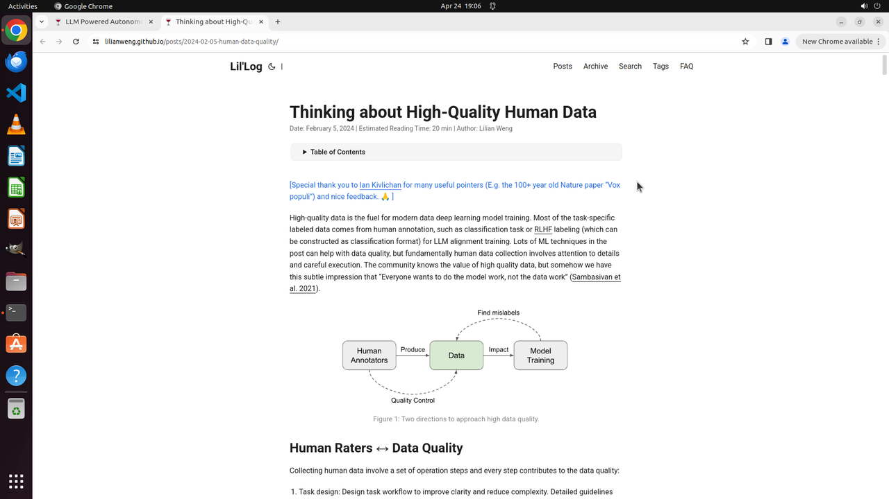

**Response:**
```
Both PDFs have been saved successfully. Let me verify by checking the Blog folder contents in the terminal.
```

**Actions:** `pyautogui.click(33, 676)`

---

## Step 29

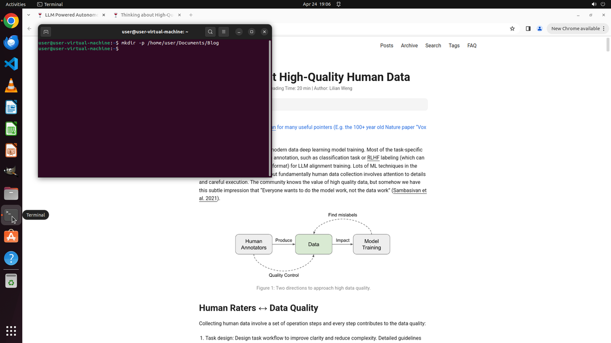

**Response:**
```
The terminal is open. Let me verify the files were saved correctly.
```

**Actions:** `import subprocess, shlex; subprocess.run(f'xdotool type --delay 12 -- ' + shlex.quote('ls -la /home/user/Documents/Blog/\n'), shell=True, check=True)
import time; time.sleep(0.05)`

---

## Step 30

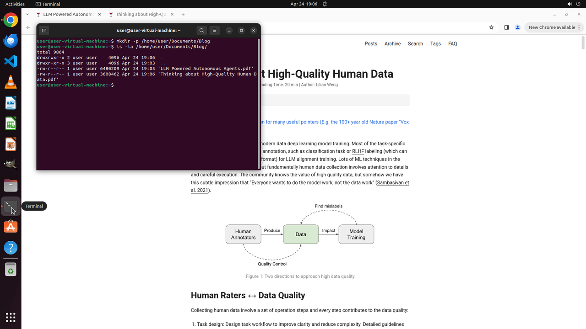

**Response:**
```
Both PDF files have been successfully saved in the /home/user/Documents/Blog/ folder:

1. **LLM Powered Autonomous Agents.pdf** (6,480,209 bytes, saved at 19:05)
2. **Thinking about High-Quality Human Data.pdf** (3,608,462 bytes, saved at 19:06)

Both blog articles have been downloaded as PDFs and saved with their titles in the designated folder.

DONE
```

**Actions:** `DONE`

---
