# Task da922383-bfa4-4cd3-bbad-6bebab3d7742

**Instruction:** I browsed a lot of interesting blog articles today. I hope to store these articles in my local designated folder just like zotero stores papers. Please download the blogs opening now in pdf format and save them in their title to /home/user/Documents/Blog.

**Score:** 1.0

**Wall clock:** 4m 7s

**Steps:** 22

**Cost:** $0.64

---

## Step 1

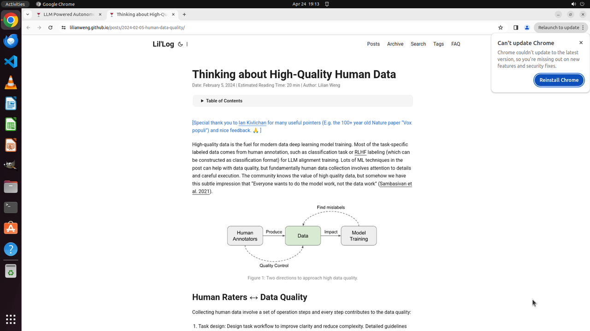

**Response:**
```
I'll help you download both blog articles as PDFs to `/home/user/Documents/Blog`. Let me first check both tabs to get their titles, then save them.

First, let me close the update notification and check the current tab's title.
```

**Actions:** `pyautogui.click(1876, 138)`

---

## Step 2

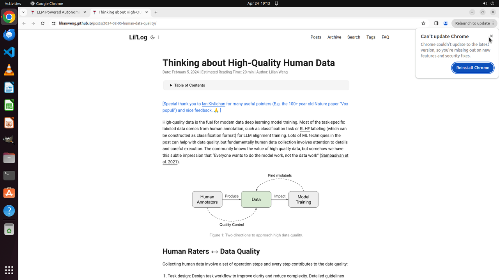

**Response:**
```
Let me close the update notification first.
```

**Actions:** `pyautogui.click(1888, 139)`

---

## Step 3

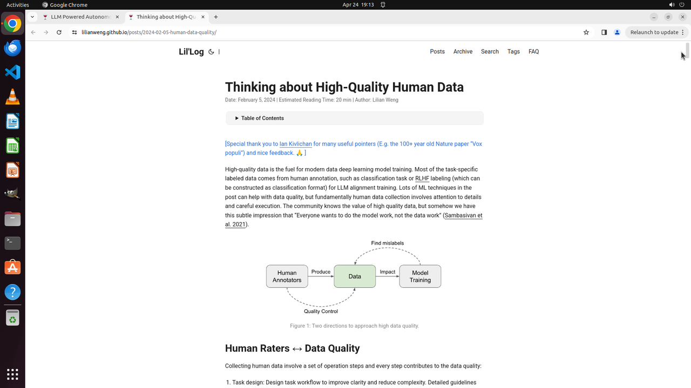

**Response:**
```
Good, the notification is closed. Now I can see two tabs:
1. "LLM Powered Autonom..." (first tab)
2. "Thinking about High-Q..." (current tab - "Thinking about High-Quality Human Data")

Let me first create the Blog directory and then use a terminal to save both pages as PDFs. Let me open a terminal first.
```

**Actions:** `pyautogui.keyDown('ctrl')
pyautogui.keyDown('alt')
pyautogui.keyDown('t')
pyautogui.keyUp('t')
pyautogui.keyUp('alt')
pyautogui.keyUp('ctrl')`

---

## Step 4


**Response:**
```
A terminal is open. Let me first create the Blog directory, then I'll need to get the exact titles of both blog posts. Let me first check the first tab's title. But first, let me create the directory.
```

**Actions:** `import subprocess, shlex; subprocess.run(f'xdotool type --delay 12 -- ' + shlex.quote('mkdir -p /home/user/Documents/Blog\n'), shell=True, check=True)
import time; time.sleep(0.05)`

---

## Step 5

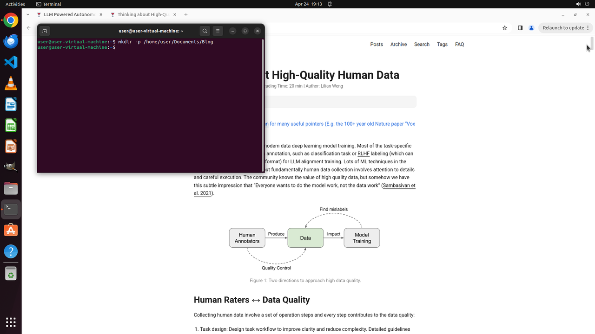

**Response:**
```
Good, the directory is created. Now I need to check the first tab's title. Let me click on the first tab.
```

**Actions:** `pyautogui.click(217, 46)`

---

## Step 6

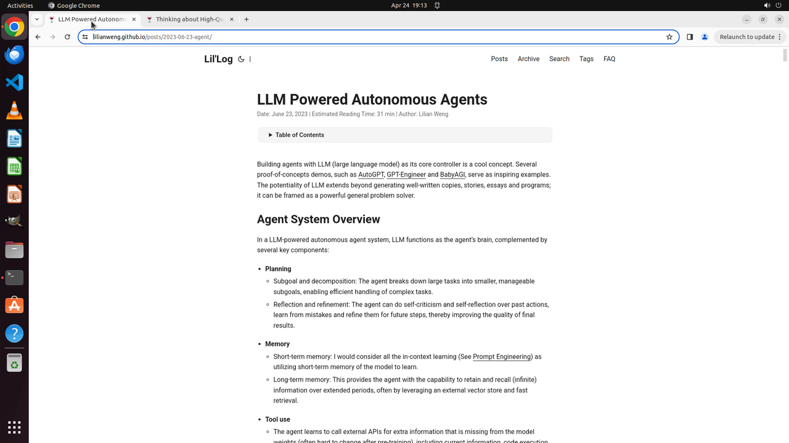

**Response:**
```
Now I can see both blog titles:
1. **"LLM Powered Autonomous Agents"** (current tab)
2. **"Thinking about High-Quality Human Data"** (second tab)

Now I'll use Chrome's print to PDF feature to save both. Let me start with the first one. I'll use Ctrl+P to open the print dialog.
```

**Actions:** `pyautogui.keyDown('ctrl')
pyautogui.keyDown('p')
pyautogui.keyUp('p')
pyautogui.keyUp('ctrl')`

---

## Step 7

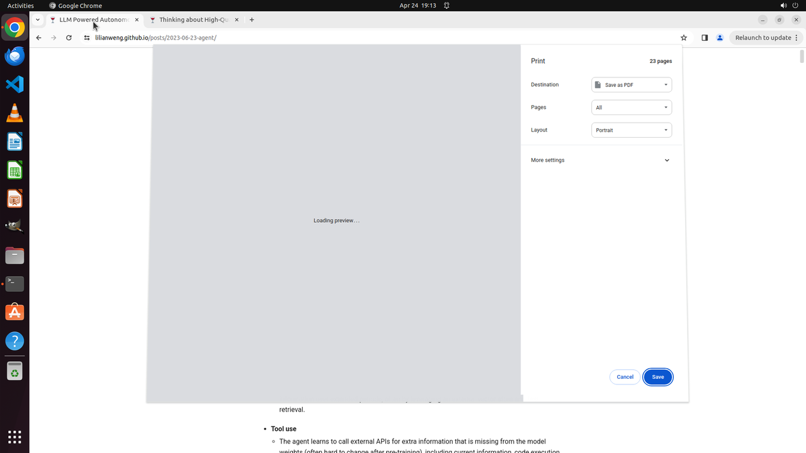

**Response:**
```
The print dialog is open with "Save as PDF" as the destination. I can see it's 23 pages. Now I need to click "Save" to save it, and then navigate to the Blog folder and name the file appropriately. Let me click "Save".
```

**Actions:** `pyautogui.click(1566, 897)`

---

## Step 8

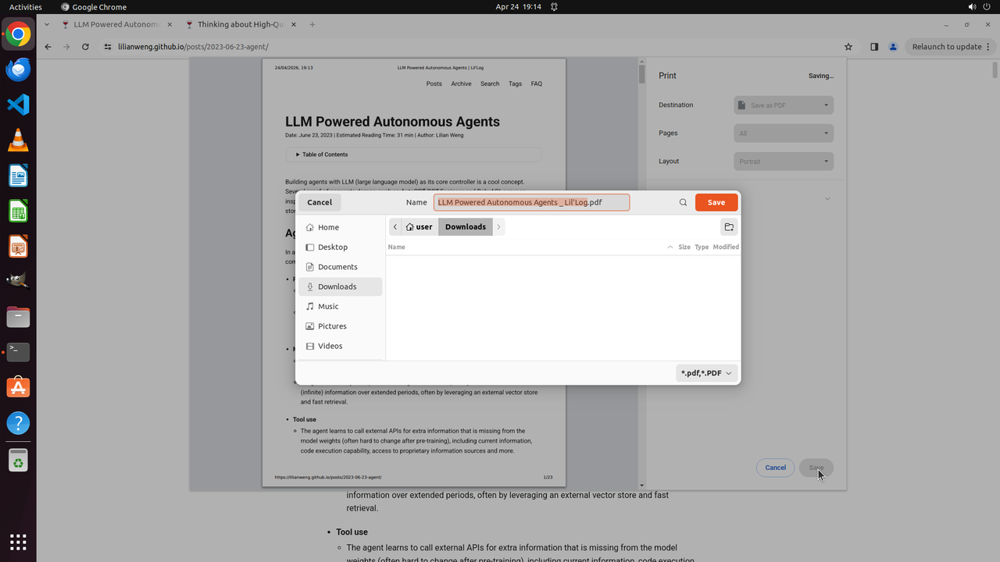

**Response:**
```
A save dialog has appeared. I need to:
1. Navigate to the Documents/Blog folder
2. Change the filename to "LLM Powered Autonomous Agents.pdf"

Let me first navigate to the Documents folder.
```

**Actions:** `pyautogui.click(648, 511)`

---

## Step 9


**Response:**
```
I can see the "Blog" folder inside Documents. Let me double-click on it to navigate into it.
```

**Actions:** `pyautogui.doubleClick(786, 501)`

---

## Step 10

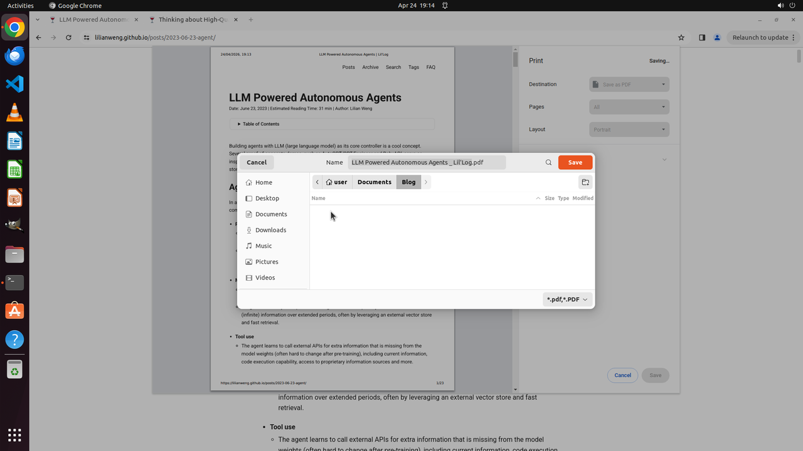

**Response:**
```
I'm now in the Blog folder. Now I need to change the filename to "LLM Powered Autonomous Agents.pdf". Let me clear the current filename and type the correct one.
```

**Actions:** `pyautogui.tripleClick(1071, 388)`

---

## Step 11

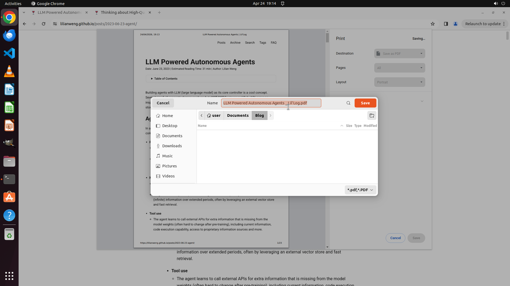

**Response:**
```
The text is selected. Now let me type the correct filename.
```

**Actions:** `import subprocess, shlex; subprocess.run(f'xdotool type --delay 12 -- ' + shlex.quote('LLM Powered Autonomous Agents.pdf'), shell=True, check=True)
import time; time.sleep(0.05)`

---

## Step 12

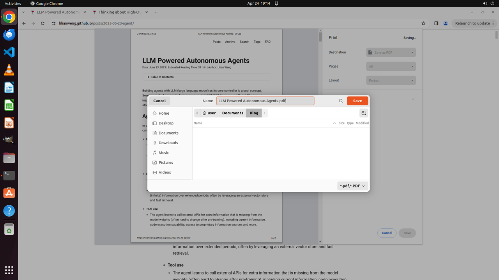

**Response:**
```
The filename is set to "LLM Powered Autonomous Agents.pdf" and I'm in the Blog folder. Now let me click Save.
```

**Actions:** `pyautogui.click(1368, 388)`

---

## Step 13

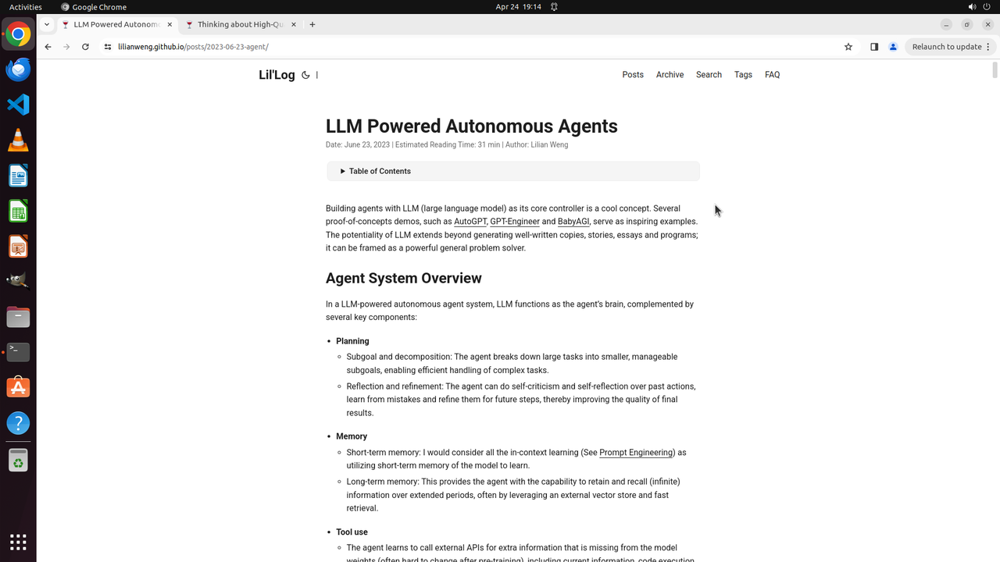

**Response:**
```
The first PDF has been saved. Now I need to save the second blog post. Let me click on the second tab "Thinking about High-Q...".
```

**Actions:** `pyautogui.click(459, 46)`

---

## Step 14

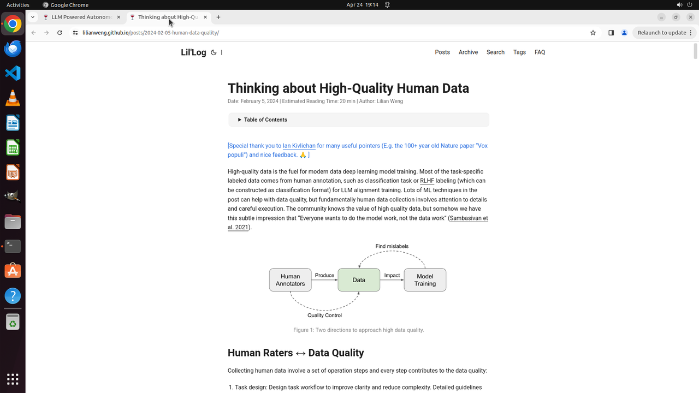

**Response:**
```
Now I'm on the second blog post "Thinking about High-Quality Human Data". Let me use Ctrl+P to print this one as PDF too.
```

**Actions:** `pyautogui.keyDown('ctrl')
pyautogui.keyDown('p')
pyautogui.keyUp('p')
pyautogui.keyUp('ctrl')`

---

## Step 15

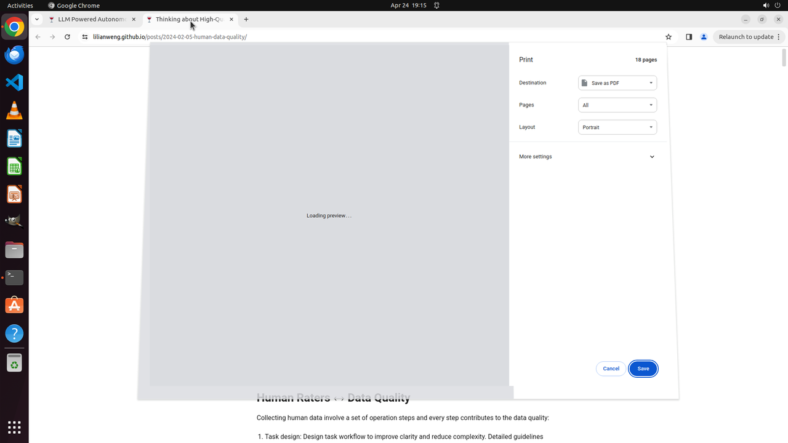

**Response:**
```
The print dialog is open again with "Save as PDF" destination and 18 pages. Let me click Save.
```

**Actions:** `pyautogui.click(1566, 897)`

---

## Step 16

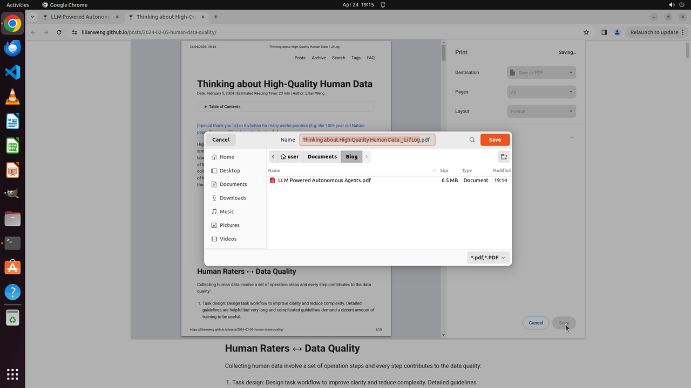

**Response:**
```
I can see the save dialog is already in the Blog folder (I can see the first PDF "LLM Powered Autonomous Agents.pdf" is already there). The filename shows "Thinking about High-Quality Human Data _ Lil'Log.pdf". I need to change it to just "Thinking about High-Quality Human Data.pdf". Let me clear and type the correct filename.
```

**Actions:** `pyautogui.tripleClick(1071, 388)`

---

## Step 17

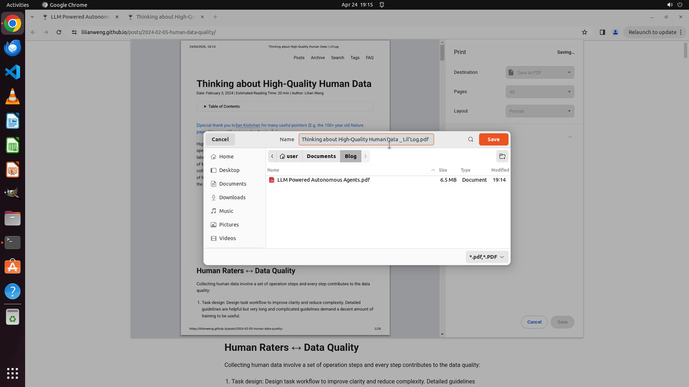

**Response:**
```
I need to select all the text in the filename field and replace it. Let me use Ctrl+A to select all text in the field first.
```

**Actions:** `pyautogui.keyDown('ctrl')
pyautogui.keyDown('a')
pyautogui.keyUp('a')
pyautogui.keyUp('ctrl')`

---

## Step 18

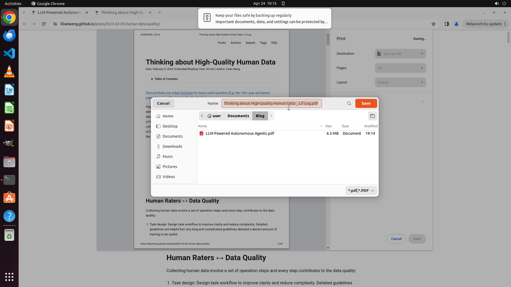

**Response:**
```
The text is now selected (shown in blue). Let me type the correct filename.
```

**Actions:** `import subprocess, shlex; subprocess.run(f'xdotool type --delay 12 -- ' + shlex.quote('Thinking about High-Quality Human Data.pdf'), shell=True, check=True)
import time; time.sleep(0.05)`

---

## Step 19

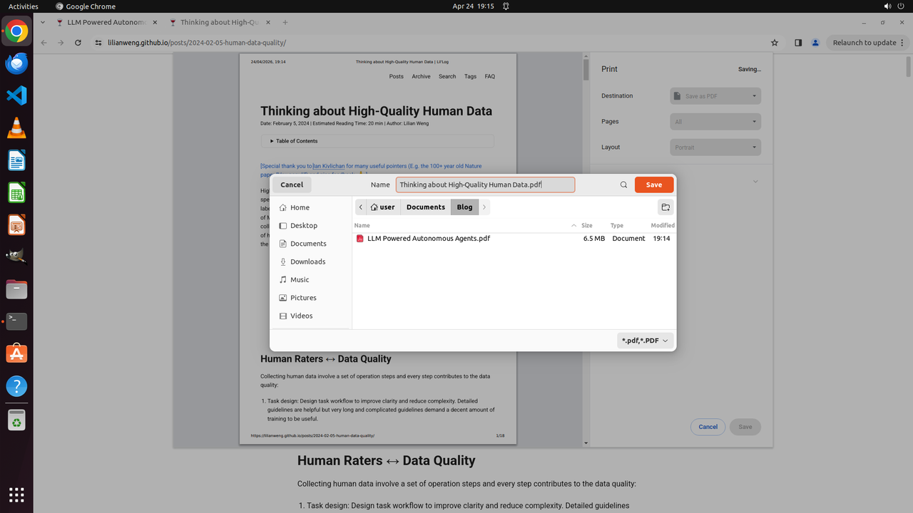

**Response:**
```
The filename is now "Thinking about High-Quality Human Data.pdf" and I'm in the Blog folder. I can also see the first PDF "LLM Powered Autonomous Agents.pdf" is already saved there. Let me click Save.
```

**Actions:** `pyautogui.click(1368, 388)`

---

## Step 20

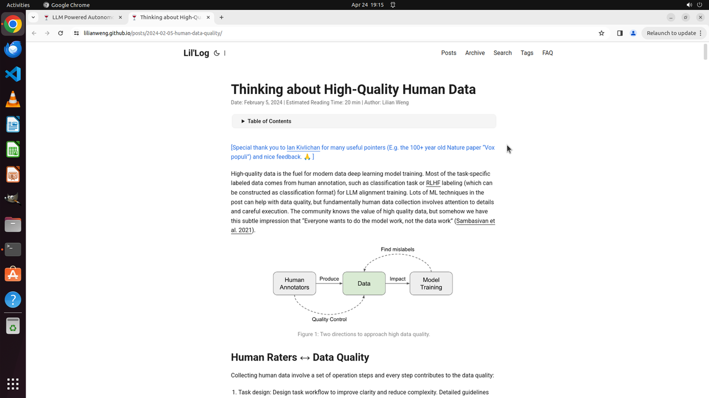

**Response:**
```
Both PDFs have been saved successfully. Let me verify the files are in the correct location by checking the Blog folder in the terminal.
```

**Actions:** `pyautogui.click(33, 673)`

---

## Step 21

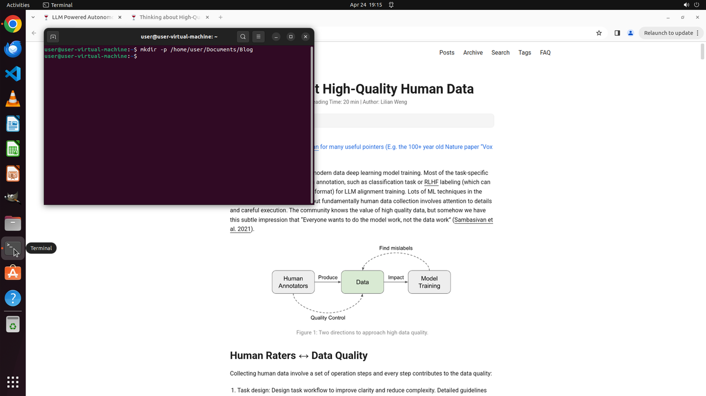

**Response:**
```
The terminal is open. Let me verify the files were saved correctly.
```

**Actions:** `import subprocess, shlex; subprocess.run(f'xdotool type --delay 12 -- ' + shlex.quote('ls -la /home/user/Documents/Blog/\n'), shell=True, check=True)
import time; time.sleep(0.05)`

---

## Step 22

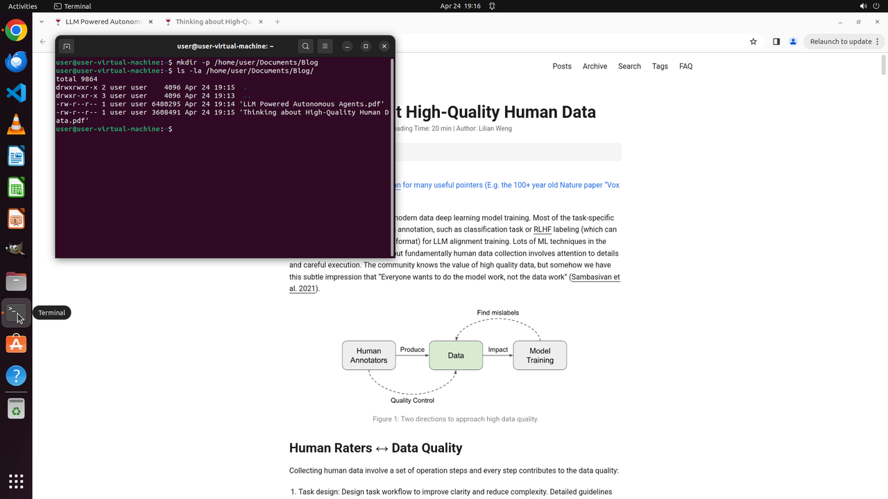

**Response:**
```
Both files have been successfully saved in the `/home/user/Documents/Blog/` directory:

1. **LLM Powered Autonomous Agents.pdf** (6,480,295 bytes, saved at 19:14)
2. **Thinking about High-Quality Human Data.pdf** (3,608,491 bytes, saved at 19:15)

Both blog articles have been downloaded as PDFs and saved with their titles to the designated folder.

DONE
```

**Actions:** `DONE`

---
