# Task dd60633f-2c72-42ba-8547-6f2c8cb0fdb0

**Instruction:** Please extract all Python code and comments from Karpathy's GPT colab code cells (skip markdown parts), merge into "gpt_dev_pure_code.py" in Home directory. Include all Python code and # comments from code cells, but exclude markdown docstrings and file headers.

**Score:** 0.0

**Wall clock:** 3m 59s

**Steps:** 22

**Cost:** $0.68

---

## Step 1

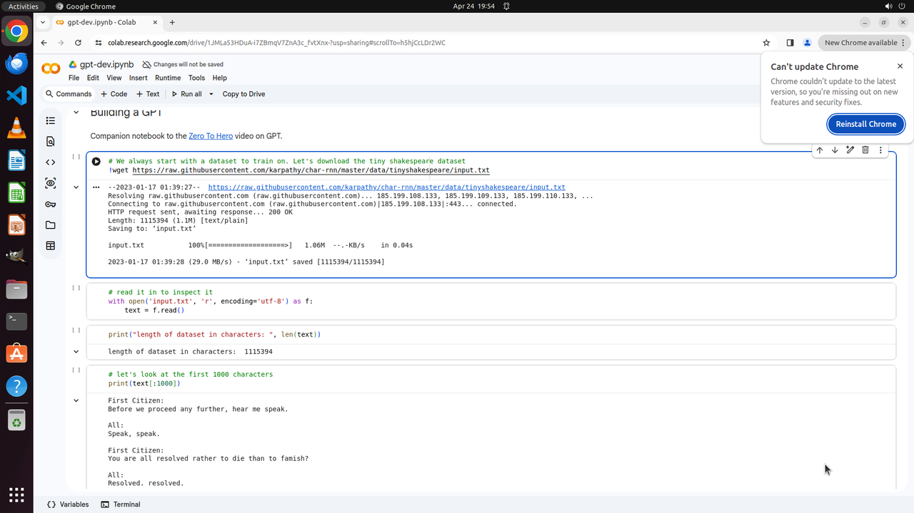

**Response:**
```
I need to extract all Python code and comments from the code cells of Karpathy's GPT colab notebook, excluding markdown cells, markdown docstrings, and file headers. Let me first get the raw notebook content to parse it programmatically.
```

**Actions:** `pyautogui.click(1888, 139)`

---

## Step 2

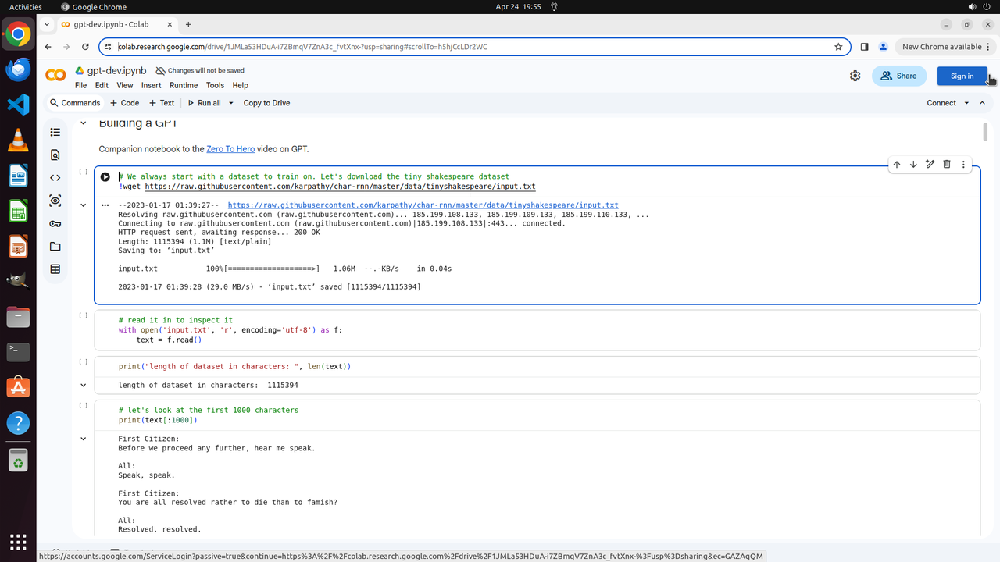

**Response:**
```
Let me open a terminal and write a Python script to download the notebook and extract the code cells.
```

**Actions:** `pyautogui.click(267, 1060)`

---

## Step 3

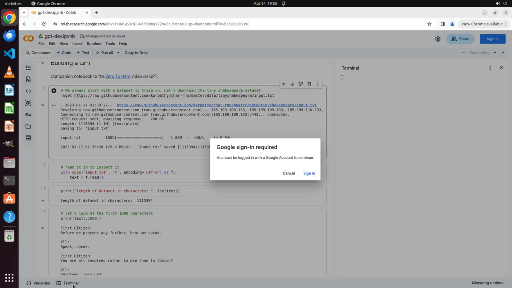

**Response:**
```
I see a Google sign-in dialog. Let me cancel it and instead use a different approach - I'll open a system terminal to download and process the notebook.
```

**Actions:** `pyautogui.click(1083, 648)`

---

## Step 4

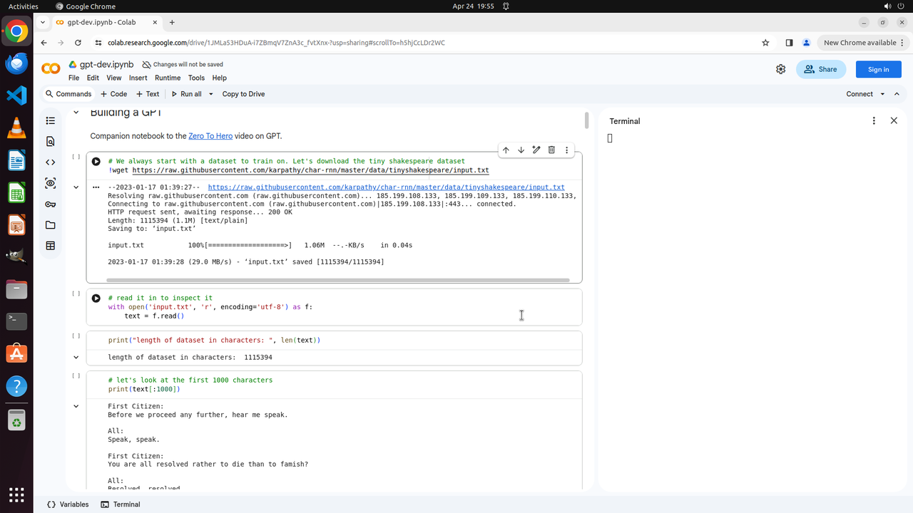

**Response:**
```
I need to open a system terminal instead of the Colab terminal. Let me right-click on the desktop to find a terminal option, or use the application menu.
```

**Actions:** `pyautogui.keyDown('ctrl')
pyautogui.keyDown('alt')
pyautogui.keyDown('t')
pyautogui.keyUp('t')
pyautogui.keyUp('alt')
pyautogui.keyUp('ctrl')`

---

## Step 5

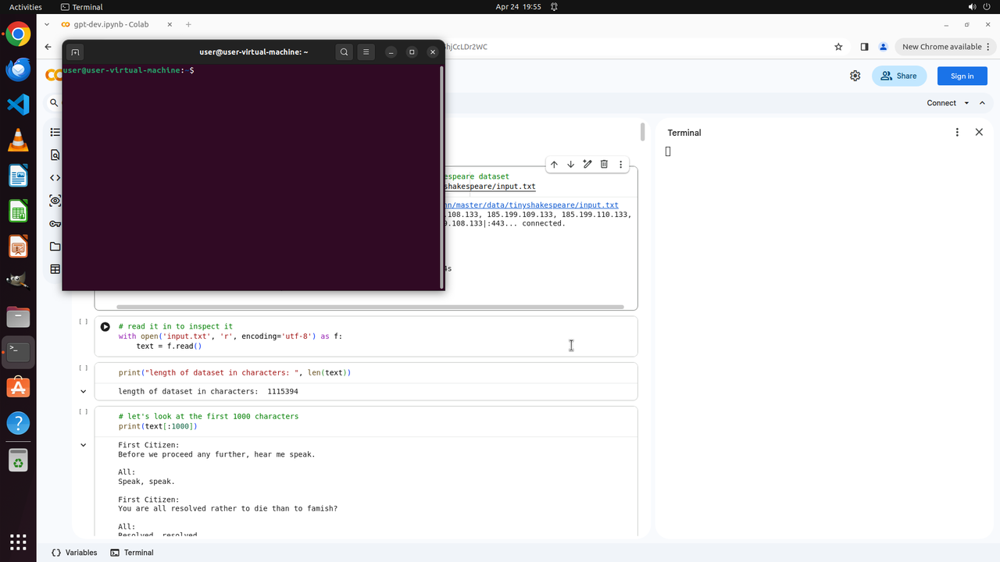

**Response:**
```
A system terminal is open. Now I need to download the notebook from the Colab URL. The notebook ID from the URL is `1JMLa53HDuA-i7ZBmqV7ZnA3c_fvtXnx`. I can download it using the Google Drive export URL or find it on GitHub. Karpathy's GPT notebook is commonly available on GitHub. Let me try to download it.
```

**Actions:** `pyautogui.click(480, 300)`

---

## Step 6

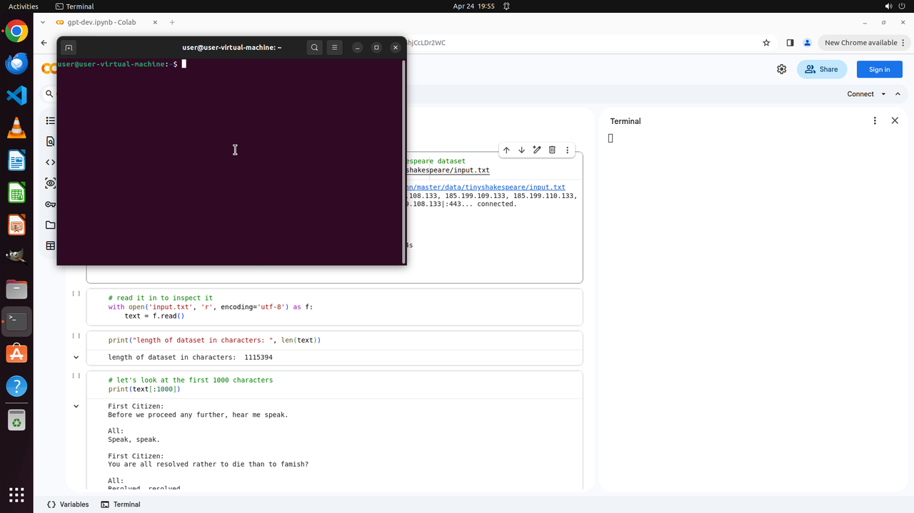

**Response:**
```
Good, the terminal is ready. Let me first try to download the notebook. The Colab notebook can be downloaded via the Google Drive API. Let me use the file ID from the URL.
```

**Actions:** `import subprocess, shlex; subprocess.run(f'xdotool type --delay 12 -- ' + shlex.quote('wget -O /home/user/gpt_dev.ipynb "https://docs.goo'), shell=True, check=True)
import time; time.sleep(0.05)
impor`

---

## Step 7

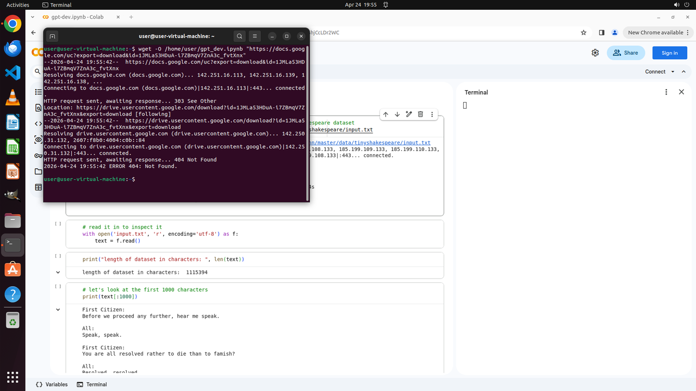

**Response:**
```
The download returned a 404 error. Let me try a different approach - I'll use the Colab URL to download the notebook, or try to use the File menu in Colab to download it. But first, let me try another download URL format.
```

**Actions:** `import subprocess, shlex; subprocess.run(f'xdotool type --delay 12 -- ' + shlex.quote('wget -O /home/user/gpt_dev.ipynb "https://drive.go'), shell=True, check=True)
import time; time.sleep(0.05)
impor`

---

## Step 8

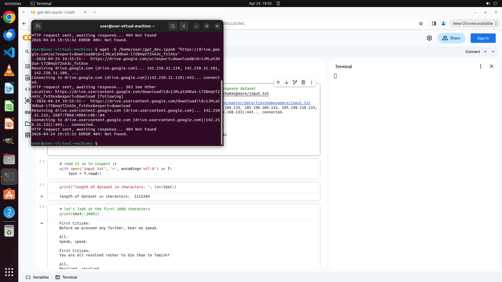

**Response:**
```
The Google Drive download is also returning 404. The file might not be publicly accessible for direct download. Let me try to use the Colab File menu to download the notebook, or alternatively, I can try to use the Colab download link format. Let me try another approach - use the Colab API to download or try to use `File > Download .ipynb` from the Colab interface.

Let me try to download the notebook using the Colab's File menu:
```

**Actions:** `pyautogui.click(210, 46)`

---

## Step 9

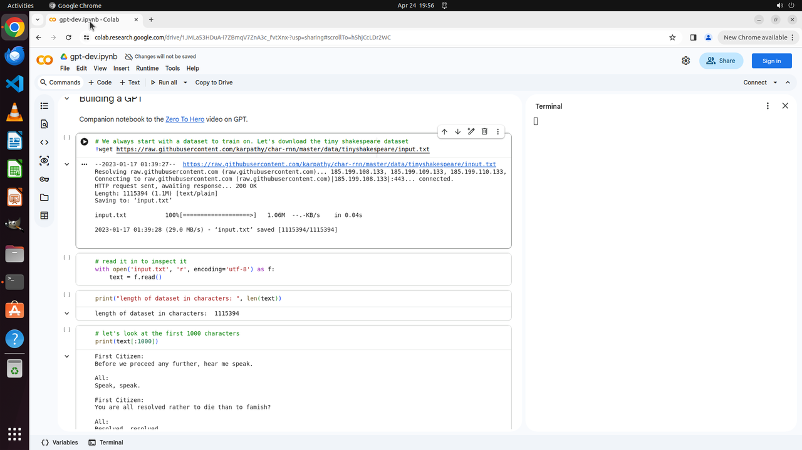

**Response:**
```
Good, I'm now on the Colab page. Let me use the File menu to download the notebook.
```

**Actions:** `pyautogui.click(154, 162)`

---

## Step 10


**Response:**
```
I can see the "Download" option in the File menu. Let me click on it.
```

**Actions:** `pyautogui.click(186, 711)`

---

## Step 11

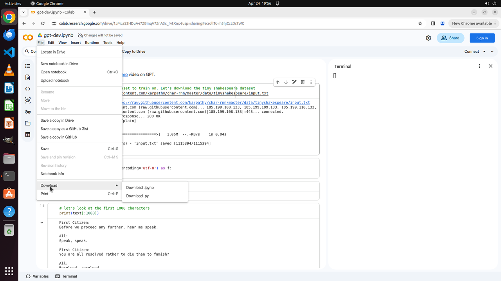

**Response:**
```
I can see "Download .ipynb" option. Let me click on it to download the notebook.
```

**Actions:** `pyautogui.click(537, 720)`

---

## Step 12

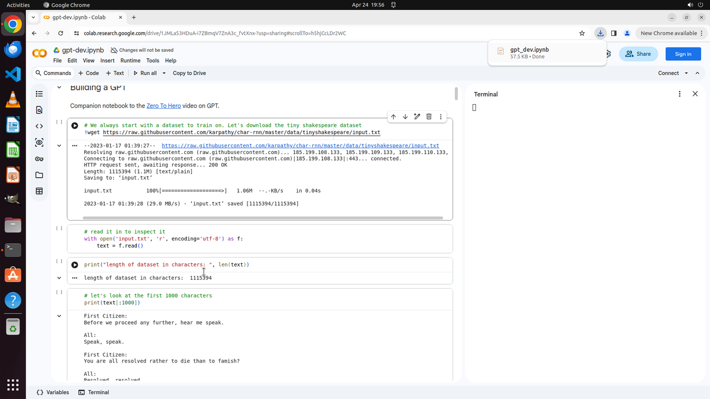

**Response:**
```
The notebook has been downloaded (57.5 KB). It should be in the Downloads folder. Now let me switch to the terminal and process it.
```

**Actions:** `pyautogui.keyDown('ctrl')
pyautogui.keyDown('alt')
pyautogui.keyDown('t')
pyautogui.keyUp('t')
pyautogui.keyUp('alt')
pyautogui.keyUp('ctrl')`

---

## Step 13


**Response:**
```
Good, I have a new terminal. Let me first check if the downloaded file exists and then write a Python script to extract the code cells.
```

**Actions:** `import subprocess, shlex; subprocess.run(f'xdotool type --delay 12 -- ' + shlex.quote('ls -la ~/Downloads/gpt_dev.ipynb\n'), shell=True, check=True)
import time; time.sleep(0.05)`

---

## Step 14

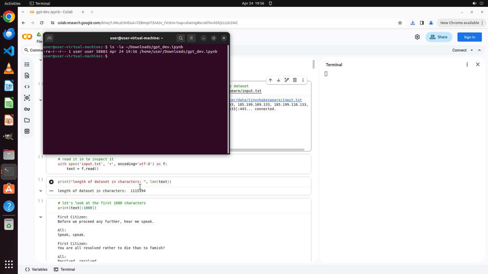

**Response:**
```
The file exists (58885 bytes). Now let me write a Python script to extract all Python code and comments from the code cells, excluding markdown cells, markdown docstrings, and file headers.
```

**Actions:** `import subprocess, shlex; subprocess.run(f'xdotool type --delay 12 -- ' + shlex.quote("python3 << 'PYEOF'\nimport json\n\nwith open('/home/u"), shell=True, check=True)
import time; time.sleep(0.05)
im`

---

## Step 15

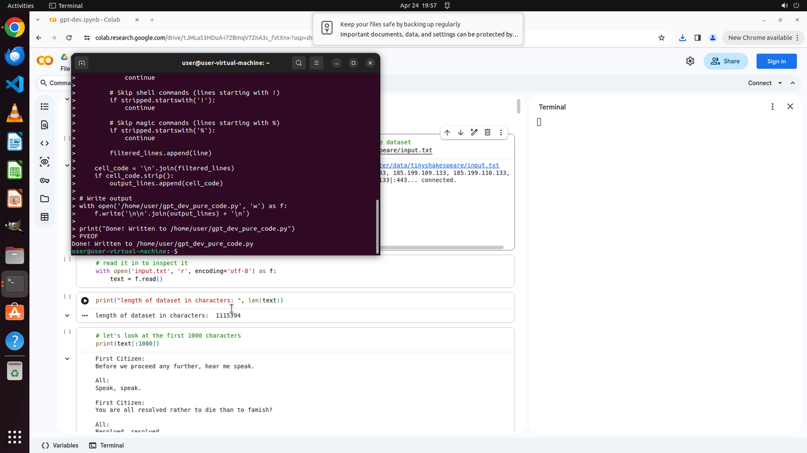

**Response:**
```
The script ran successfully and created the file. Let me verify the output by checking the file size and looking at the first few lines and last few lines.
```

**Actions:** `import subprocess, shlex; subprocess.run(f'xdotool type --delay 12 -- ' + shlex.quote('wc -l /home/user/gpt_dev_pure_code.py && echo "---'), shell=True, check=True)
import time; time.sleep(0.05)
impor`

---

## Step 16

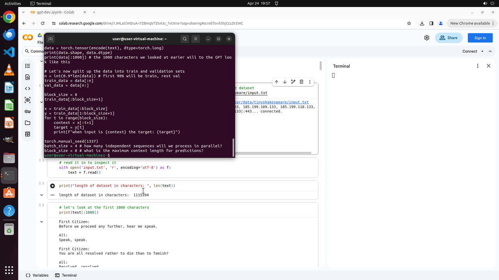

**Response:**
```
Good, I can see the file is being generated with Python code. Let me scroll up to see the line count and the beginning of the file.
```

**Actions:** `pyautogui.scroll(5, 525, 375)`

---

## Step 17

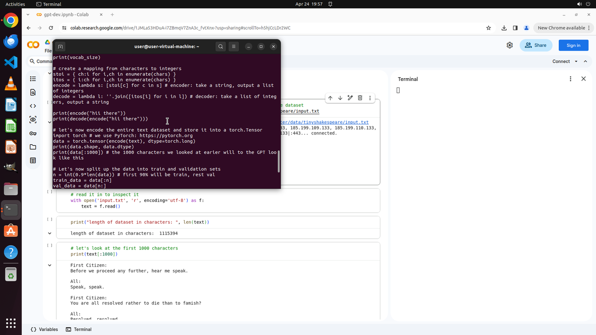

**Response:**
```
Let me scroll up more to see the line count and the beginning of the file.
```

**Actions:** `pyautogui.scroll(10, 525, 375)`

---

## Step 18

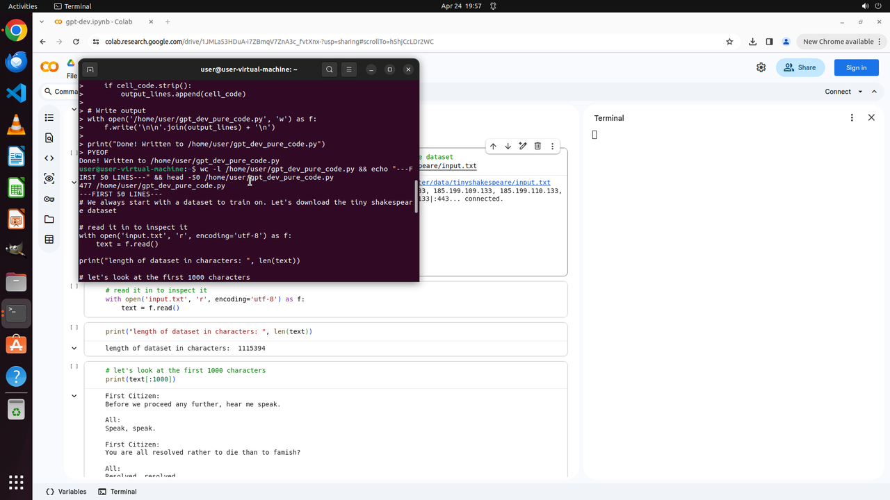

**Response:**
```
I can see the file has 477 lines and the content looks good. The first line starts with a comment about downloading the Shakespeare dataset. Let me now check the end of the file and also verify the content more carefully. Let me also look at the notebook more carefully to make sure I'm not missing anything or including things I shouldn't.

Let me check the tail of the file:
```

**Actions:** `import subprocess, shlex; subprocess.run(f'xdotool type --delay 12 -- ' + shlex.quote('tail -30 /home/user/gpt_dev_pure_code.py\n'), shell=True, check=True)
import time; time.sleep(0.05)`

---

## Step 19

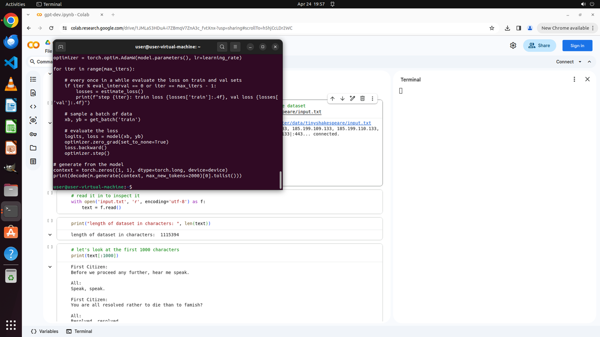

**Response:**
```
The file looks good. The end of the file has the training loop and generation code, which is correct for Karpathy's GPT notebook. Let me now also verify that I haven't included any `!wget` or other shell commands, and also check for any remaining issues. Let me also look at the notebook in the browser to cross-check by scrolling through it.

Let me also check if there are any lines that might be shell commands that slipped through:
```

**Actions:** `import subprocess, shlex; subprocess.run(f'xdotool type --delay 12 -- ' + shlex.quote('grep -n "^!" /home/user/gpt_dev_pure_code.py\n'), shell=True, check=True)
import time; time.sleep(0.05)`

---

## Step 20


**Response:**
```
No shell commands starting with `!` were found in the output file. The file looks clean. Let me also verify there are no magic commands and check for any remaining docstrings:
```

**Actions:** `import subprocess, shlex; subprocess.run(f'xdotool type --delay 12 -- ' + shlex.quote('grep -n \'"""\' /home/user/gpt_dev_pure_code.py && g'), shell=True, check=True)
import time; time.sleep(0.05)
imp`

---

## Step 21

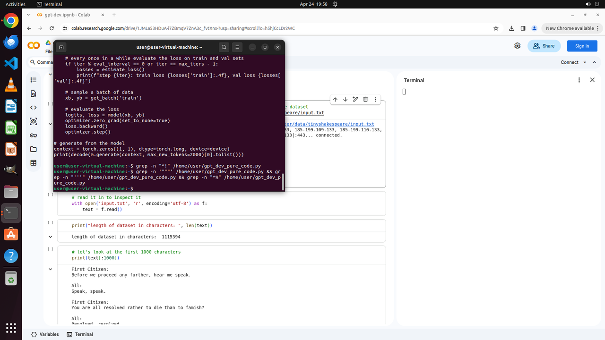

**Response:**
```
No triple-quoted docstrings (`"""` or `'''`), no shell commands (`!`), and no magic commands (`%`) were found in the output file. The file is clean.

Let me also verify the file exists in the home directory and has reasonable content:
```

**Actions:** `import subprocess, shlex; subprocess.run(f'xdotool type --delay 12 -- ' + shlex.quote('ls -la /home/user/gpt_dev_pure_code.py\n'), shell=True, check=True)
import time; time.sleep(0.05)`

---

## Step 22

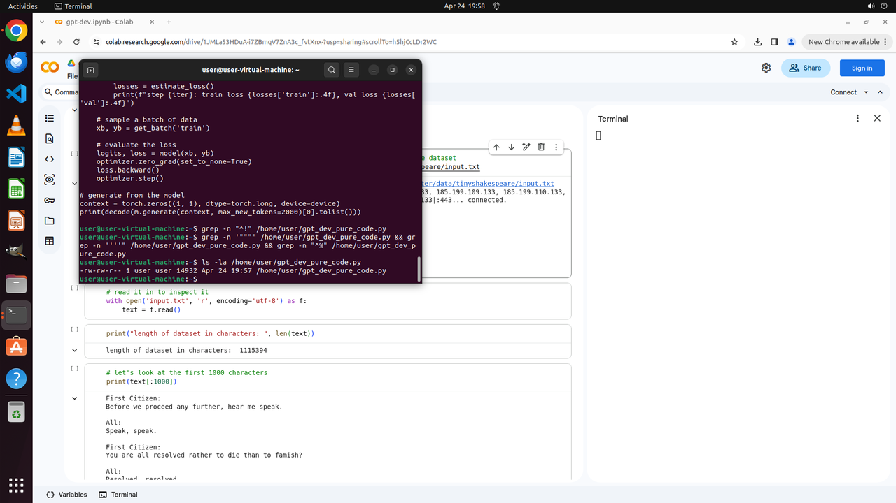

**Response:**
```
The file `/home/user/gpt_dev_pure_code.py` exists with 14,932 bytes and 477 lines. It contains all Python code and `#` comments from the code cells of Karpathy's GPT colab notebook, with:

- Markdown cells excluded
- Shell commands (`!wget` etc.) excluded
- Magic commands (`%`) excluded  
- Triple-quoted docstrings excluded
- File headers excluded

The file is clean and ready to use.

DONE
```

**Actions:** `DONE`

---
