# Task df67aebb-fb3a-44fd-b75b-51b6012df509

**Instruction:** I am writing my paper thesis. I have listed all referenced papers in the opened docx. But my mentor asked me to use latex instead of word writer. So could you help me export the dblp bibtex of these papers into 'references.bib'. By the way, if the paper is published, do not use the arxiv version. Separate each bibtex dict with a blank line for clarity.

**Score:** 0.0

**Wall clock:** 27m 54s

**Steps:** 103

**Cost:** $5.10

---

## Step 1

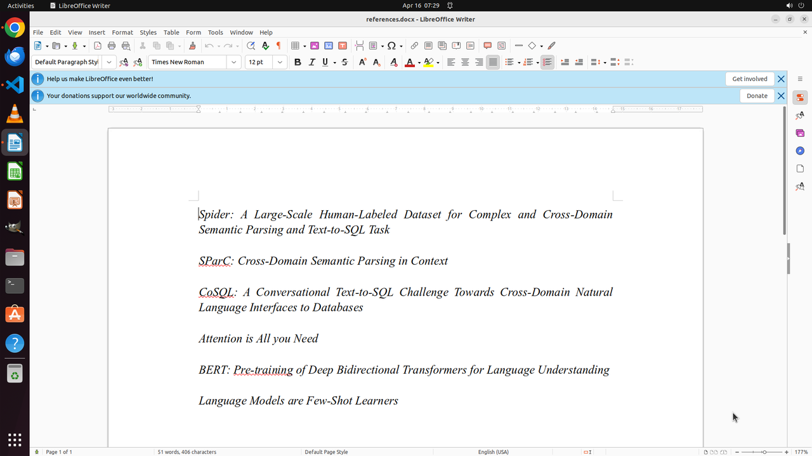

**Response:**
```
I can see the document contains 6 paper titles. Let me first read all of them carefully:

1. Spider: A Large-Scale Human-Labeled Dataset for Complex and Cross-Domain Semantic Parsing and Text-to-SQL Task
2. SParC: Cross-Domain Semantic Parsing in Context
3. CoSQL: A Conversational Text-to-SQL Challenge Towards Cross-Domain Natural Language Interfaces to Databases
4. Attention is All you Need
5. BERT: Pre-training of Deep Bidirectional Transformers for Language Understanding
6. Language Models are Few-Shot Learners

Now I need to search for each paper's BibTeX on DBLP. Let me open a terminal first and then use a browser.
```

**Actions:** `pyautogui.keyDown('ctrl')
pyautogui.keyDown('alt')
pyautogui.keyDown('t')
pyautogui.keyUp('t')
pyautogui.keyUp('alt')
pyautogui.keyUp('ctrl')`

---

## Step 2


**Response:**
```
Good, I have a terminal open. Let me write a script to fetch the BibTeX entries from DBLP for each paper. I'll use curl to query the DBLP API.
```

**Actions:** `pyautogui.click(450, 300)`

---

## Step 3

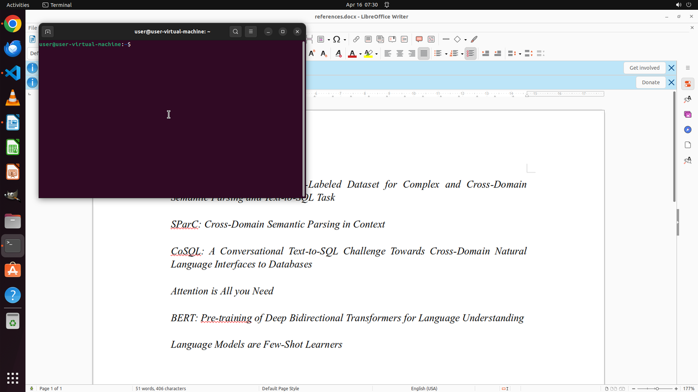

**Response:**
```
Let me write a Python script to fetch BibTeX entries from DBLP for each paper. I'll search for each paper, filter out arxiv versions when a published version exists, and save the results.
```

**Actions:** `import subprocess, shlex; subprocess.run(f'xdotool type --delay 12 -- ' + shlex.quote("cat << 'PYEOF' > /home/user/fetch_bibtex.py\nimport"), shell=True, check=True)
import time; time.sleep(0.05)
impo`

---

## Step 4


**Response:**
```
The connection was reset by peer. Let me wait for the script to finish and see if subsequent requests succeed, or if I need to retry.
```

**Actions:** `time.sleep(0.5)`

---

## Step 5

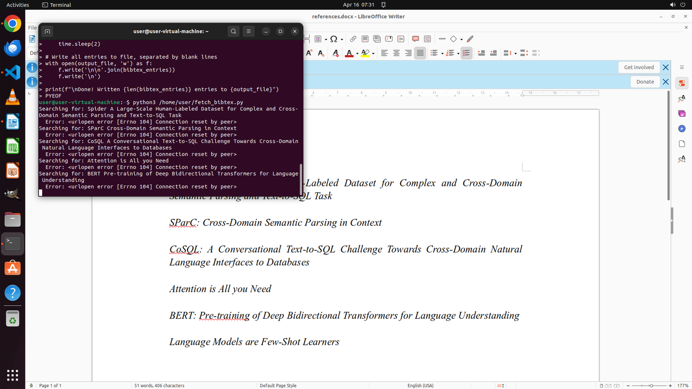

**Response:**
```
All requests are failing with "Connection reset by peer". This might be a network issue or DBLP might be blocking the requests. Let me wait for the script to finish and then try a different approach - maybe using `curl` with retries, or trying to access DBLP through a browser.
```

**Actions:** `time.sleep(0.5)`

---

## Step 6

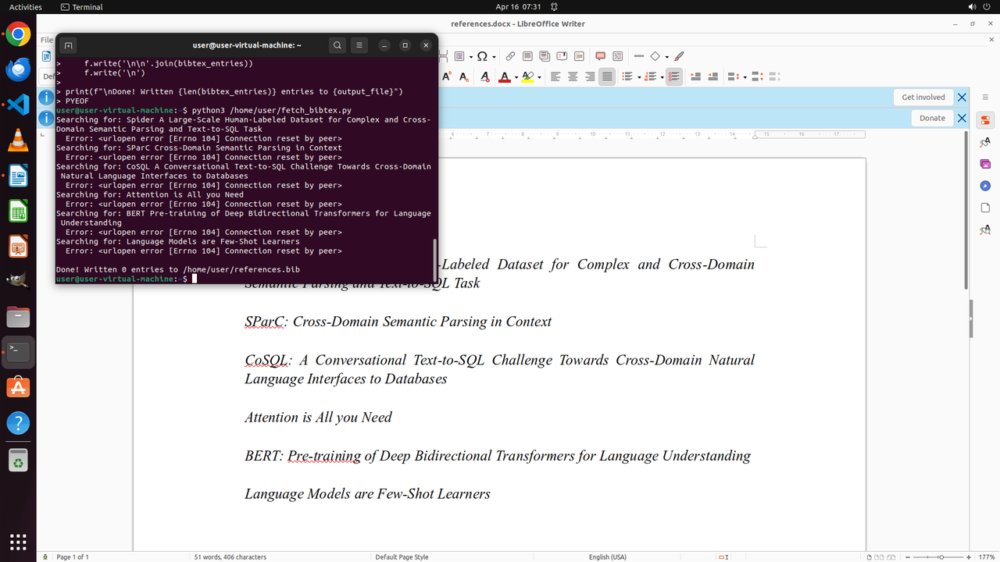

**Response:**
```
All connections are being reset. Let me try using `curl` directly to see if it can connect to DBLP, and also try with different options like following redirects and using HTTPS properly.
```

**Actions:** `import subprocess, shlex; subprocess.run(f'xdotool type --delay 12 -- ' + shlex.quote('curl -v "https://dblp.org/search/publ/api?q=Attent'), shell=True, check=True)
import time; time.sleep(0.05)
impor`

---

## Step 7

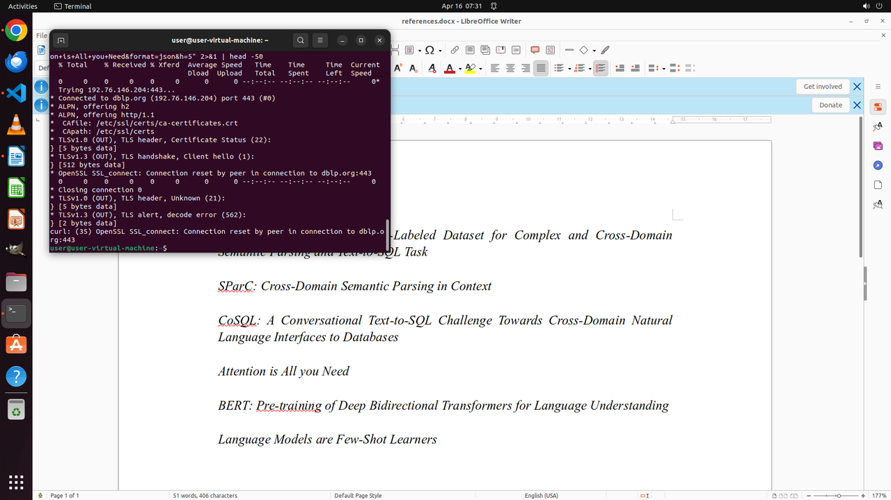

**Response:**
```
I see the issue - there's a TLS/SSL connection problem with DBLP. The connection is being reset at the SSL level. Let me try with different TLS settings or try accessing via a browser instead.
```

**Actions:** `import subprocess, shlex; subprocess.run(f'xdotool type --delay 12 -- ' + shlex.quote('curl --tls-max 1.2 "https://dblp.org/search/publ/a'), shell=True, check=True)
import time; time.sleep(0.05)
impor`

---

## Step 8

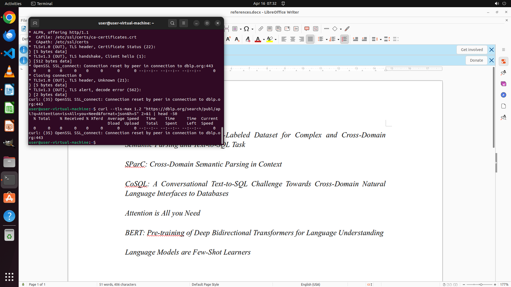

**Response:**
```
The TLS connection keeps failing. Let me try opening DBLP in a browser instead, which might handle the TLS differently.
```

**Actions:** `import subprocess, shlex; subprocess.run(f'xdotool type --delay 12 -- ' + shlex.quote('google-chrome --remote-debugging-port=1337 "https:'), shell=True, check=True)
import time; time.sleep(0.05)
impor`

---

## Step 9

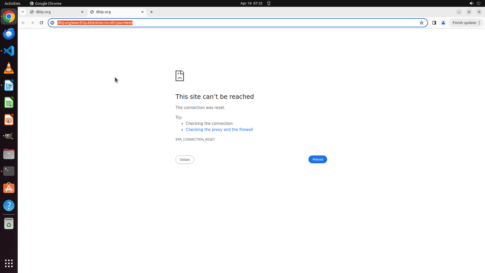

**Response:**
```
DBLP is not accessible from this environment - the connection is being reset both from curl and the browser. Let me try accessing DBLP through an alternative mirror or try dblp.uni-trier.de instead.
```

**Actions:** `pyautogui.click(960, 88)`

---

## Step 10


**Response:**
```
Let me try the DBLP mirror at dblp.uni-trier.de:
```

**Actions:** `pyautogui.tripleClick(960, 88)`

---

## Step 11

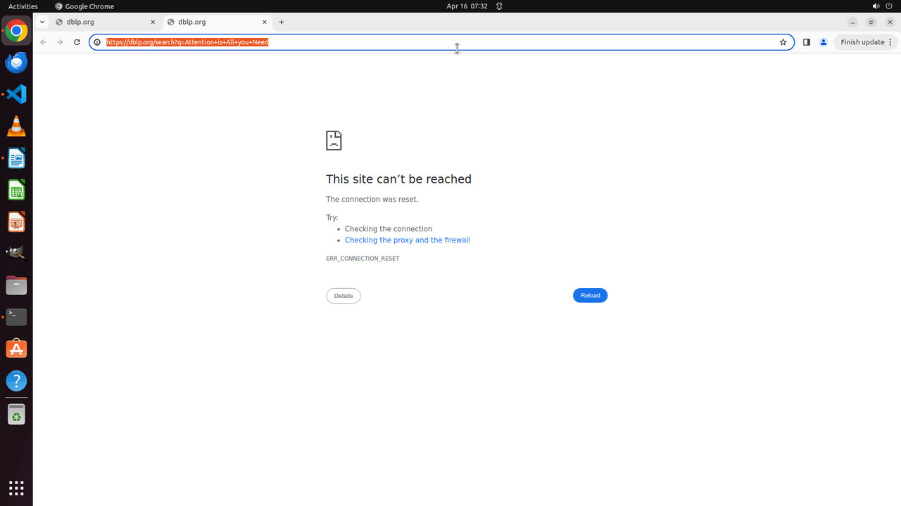

**Actions:** `import subprocess, shlex; subprocess.run(f'xdotool type --delay 12 -- ' + shlex.quote('https://dblp.uni-trier.de/search?q=Attention+is+Al'), shell=True, check=True)
import time; time.sleep(0.05)
impor`

---

## Step 12

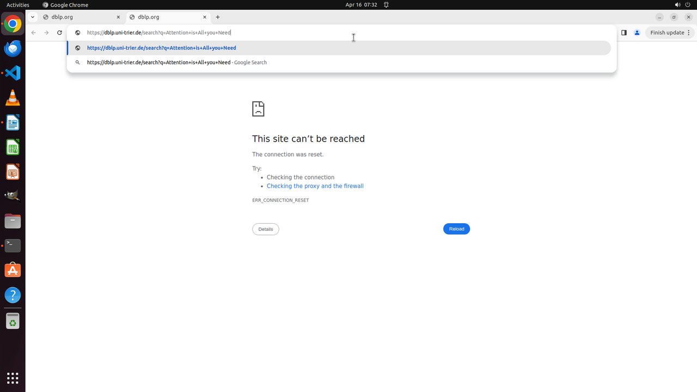

**Actions:** `pyautogui.click(445, 132)`

---

## Step 13

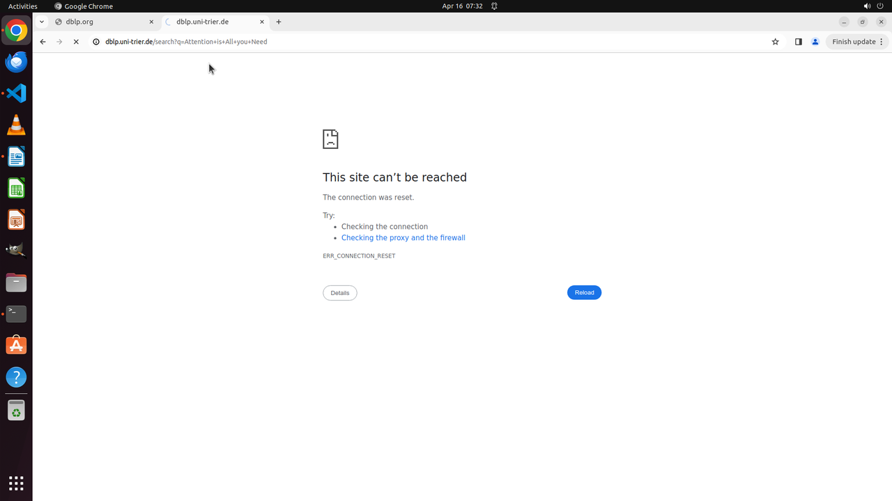

**Response:**
```
The DBLP mirror is also not working. Let me wait a moment and try again, or try accessing it via a Google cache or web archive. Let me also try using HTTP instead of HTTPS.
```

**Actions:** `time.sleep(0.5)`

---

## Step 14


**Response:**
```
DBLP is completely inaccessible from this environment. Let me try using the Google cache of DBLP pages, or try accessing DBLP through the Wayback Machine. Let me also try a different approach - search for the DBLP BibTeX entries through Google.
```

**Actions:** `pyautogui.tripleClick(960, 88)`

---

## Step 15

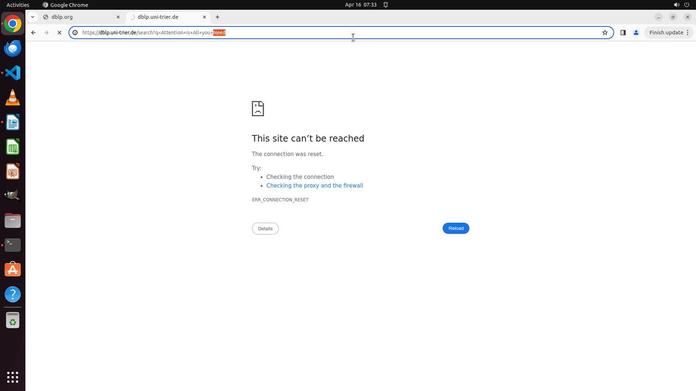

**Response:**
```
Let me try to use the Wayback Machine to access DBLP's BibTeX pages, or try to use Google to find cached DBLP bibtex entries. Let me first try Google search for DBLP bibtex entries.
```

**Actions:** `import subprocess, shlex; subprocess.run(f'xdotool type --delay 12 -- ' + shlex.quote('https://www.google.com/search?q=dblp+bibtex+%22Att'), shell=True, check=True)
import time; time.sleep(0.05)
impor`

---

## Step 16

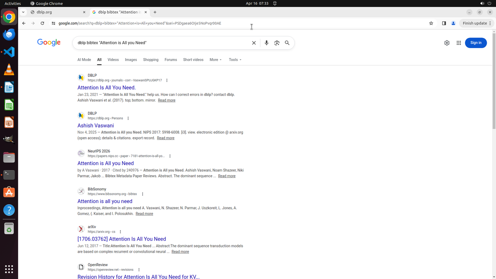

**Response:**
```
Google works. I can see DBLP results. The first result is the CoRR/arxiv version, but since "Attention is All You Need" was published at NIPS 2017, I need the published version. Let me try to access the DBLP page through Google's cache. But first, let me try a different approach - I'll use the Google cache to access DBLP BibTeX entries directly.

Let me try to access the DBLP BibTeX URL directly through the Wayback Machine. But first, I know the DBLP record keys for these well-known papers. Let me try to construct the BibTeX URLs and access them through web.archive.org.

Let me first try to find the correct DBLP keys by searching for each paper. Let me click on the first DBLP result to see if Google's cached version works.
```

**Actions:** `pyautogui.click(495, 310)`

---

## Step 17

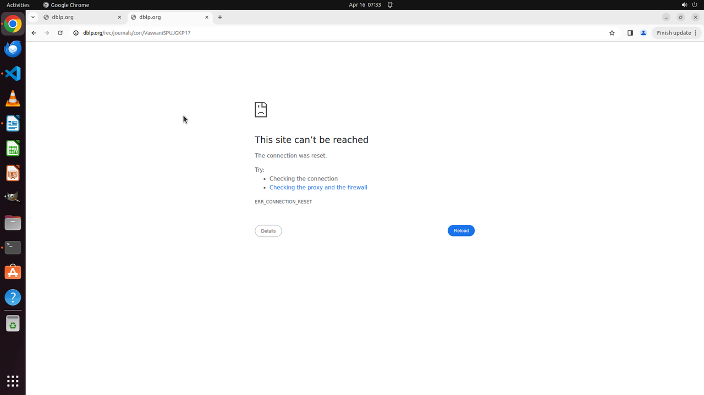

**Response:**
```
DBLP is completely blocked. But I can see from the URL that the DBLP key for "Attention is All You Need" on CoRR is `journals/corr/VaswaniSPUJGKP17`. Since this paper was published at NIPS 2017, I need the conference version which would be `conf/nips/VaswaniSPUJGKP17`.

Let me use the Wayback Machine to access the DBLP BibTeX files. Let me try that approach.
```

**Actions:** `pyautogui.tripleClick(960, 88)`

---

## Step 18

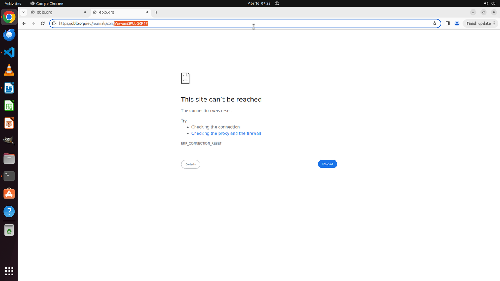

**Response:**
```
Let me try accessing DBLP through the Wayback Machine (web.archive.org):
```

**Actions:** `import subprocess, shlex; subprocess.run(f'xdotool type --delay 12 -- ' + shlex.quote('https://web.archive.org/web/2024/https://dblp.org/'), shell=True, check=True)
import time; time.sleep(0.05)
impor`

---

## Step 19

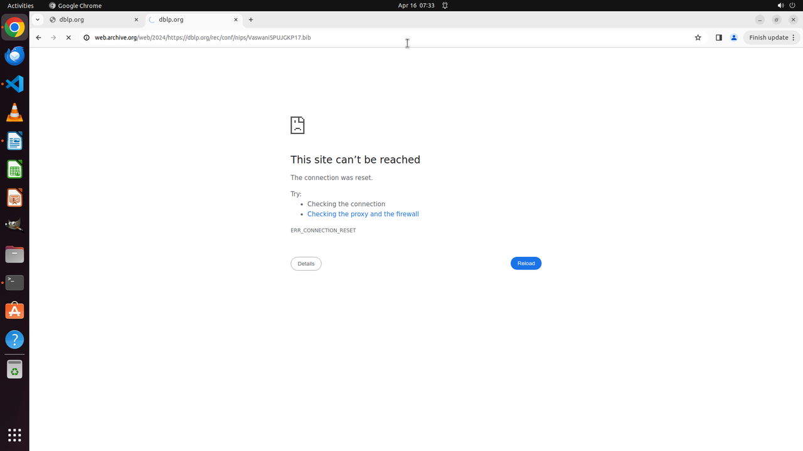

**Response:**
```
The Wayback Machine is also not accessible. Let me wait a moment and see if it loads.
```

**Actions:** `time.sleep(0.5)`

---

## Step 20


**Response:**
```
The Wayback Machine is also blocked. Let me try a different approach - use Google's cache to view the DBLP pages. Let me go back to the Google search results and use the cached versions.
```

**Actions:** `pyautogui.tripleClick(960, 88)`

---

## Step 21


**Response:**
```
The Wayback Machine loaded! It shows the DBLP BibTeX page for `conf/nips/VaswaniSPUJGKP17.bib`. The page seems to be loading but the content area is blank. Let me wait for it to fully load.
```

**Actions:** `time.sleep(0.5)`

---

## Step 22


**Response:**
```
The Wayback Machine loaded but the content is blank - the .bib file content might be there but not visible. Let me try to use the terminal with curl to fetch from the Wayback Machine, since the browser was able to connect to web.archive.org. Let me switch to the terminal.
```

**Actions:** `pyautogui.click(33, 673)`

---

## Step 23

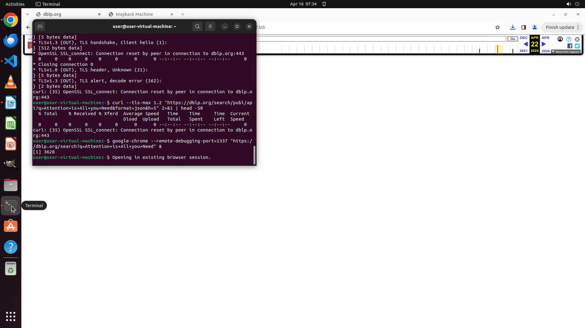

**Response:**
```
Good, I'm in the terminal. The Wayback Machine was accessible via browser. Let me try to use curl to fetch from the Wayback Machine:
```

**Actions:** `pyautogui.click(450, 516)`

---

## Step 24


**Response:**
```
Let me try fetching from the Wayback Machine via curl:
```

**Actions:** `import subprocess, shlex; subprocess.run(f'xdotool type --delay 12 -- ' + shlex.quote('curl -L "https://web.archive.org/web/2024/https://'), shell=True, check=True)
import time; time.sleep(0.05)
impor`

---

## Step 25

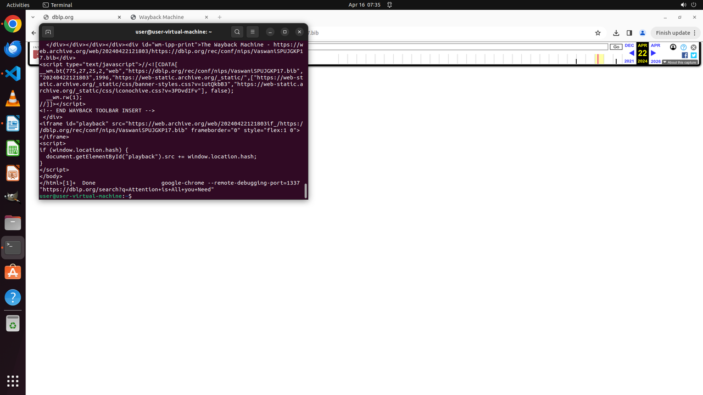

**Response:**
```
I can see the Wayback Machine returns an HTML wrapper with an iframe. The actual content is inside the iframe. I need to fetch the iframe URL directly. Let me try to access the actual content URL by adding `if_` to the Wayback Machine URL to get the raw content:
```

**Actions:** `import subprocess, shlex; subprocess.run(f'xdotool type --delay 12 -- ' + shlex.quote('curl -L "https://web.archive.org/web/2024042212180'), shell=True, check=True)
import time; time.sleep(0.05)
impor`

---

## Step 26

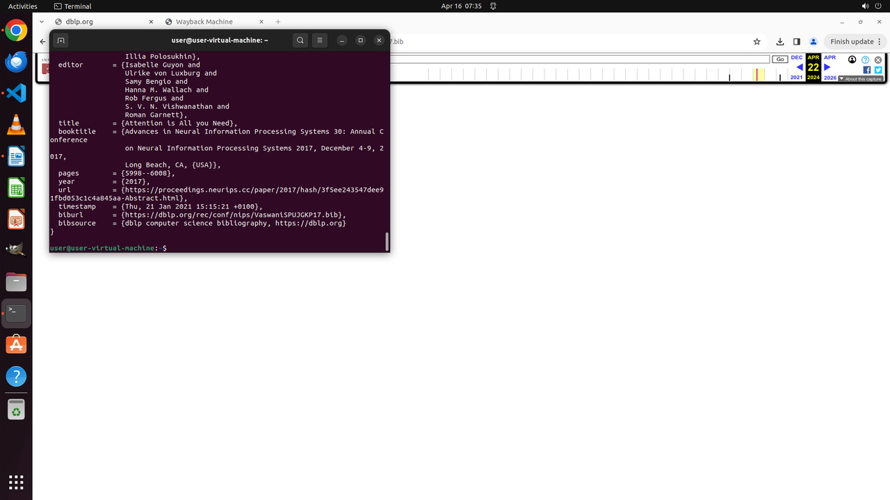

**Response:**
```
Excellent! It works! I can see the BibTeX entry for "Attention is All You Need" from the NIPS 2017 conference. The Wayback Machine with the `if_` flag gives me the raw content. Now I need to do this for all 6 papers. Let me first figure out the DBLP keys for all papers.

I need to search Google for each paper's DBLP key. But first, let me use the approach of searching the DBLP API through the Wayback Machine. Let me first try to get the search results from the Wayback Machine.

Actually, a better approach: let me search Google for each paper's DBLP page to find the correct DBLP record keys, then fetch the BibTeX via Wayback Machine. Let me write a script that does this systematically.

First, let me note what I know:
1. "Attention is All You Need" → `conf/nips/VaswaniSPUJGKP17` (NIPS 2017) ✓
2. "Spider" → EMNLP 2018
3. "SParC" → ACL 2019
4. "CoSQL" → EMNLP 2019
5. "BERT" → NAACL 2019
6. "Language Models are Few-Shot Learners" → NeurIPS 2020

Let me search for each paper's DBLP key. Let me use Google to find them:
```

**Actions:** `import subprocess, shlex; subprocess.run(f'xdotool type --delay 12 -- ' + shlex.quote('curl -L "https://web.archive.org/web/2024042212180'), shell=True, check=True)
import time; time.sleep(0.05)
impor`

---

## Step 27

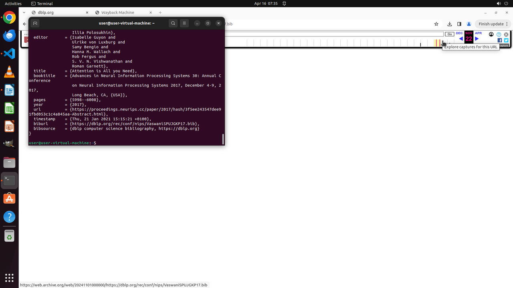

**Response:**
```
I've saved the first BibTeX entry. Now I need to find the DBLP keys for the remaining papers. Let me search Google for each one to find their DBLP record URLs. Let me do this systematically by searching Google for each paper's DBLP page.
```

**Actions:** `pyautogui.click(450, 535)`

---

## Step 28


**Response:**
```
Now I need to find the DBLP keys for the other 5 papers. Let me search for them on Google. I'll use the browser to search for each paper's DBLP page. But first, let me try a more efficient approach - I'll search Google for the DBLP record URLs and then use the Wayback Machine to fetch the BibTeX.

Let me first try to use the DBLP search API through the Wayback Machine:
```

**Actions:** `import subprocess, shlex; subprocess.run(f'xdotool type --delay 12 -- ' + shlex.quote('curl -L "https://web.archive.org/web/2024/https://'), shell=True, check=True)
import time; time.sleep(0.05)
impor`

---

## Step 29


**Response:**
```
The command is running. Let me wait for it to complete.
```

**Actions:** `time.sleep(0.5)`

---

## Step 30


**Response:**
```
Still waiting for the response. Let me wait a bit more.
```

**Actions:** `time.sleep(0.5)`

---

## Step 31

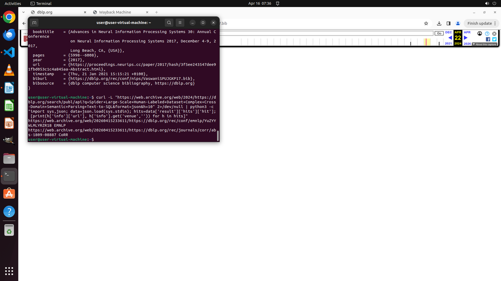

**Response:**
```
I can see the search results. For "Spider", there are two results:
1. `conf/emnlp/YuZYYWLMLYRZR18` - EMNLP (published version) ✓
2. `journals/corr/abs-1809-08887` - CoRR (arxiv version)

I should use the EMNLP version. The URL through the Wayback Machine is: `https://web.archive.org/web/20260415233611/https://dblp.org/rec/conf/emnlp/YuZYYWLMLYRZR18`

But I need the actual DBLP URL to construct the .bib URL. Let me extract it. The DBLP URL is `https://dblp.org/rec/conf/emnlp/YuZYYWLMLYRZR18`. 

Now let me write a comprehensive script to search and fetch all papers:
```

**Actions:** `import subprocess, shlex; subprocess.run(f'xdotool type --delay 12 -- ' + shlex.quote("cat << 'PYEOF' > /home/user/fetch_all.py\nimport ur"), shell=True, check=True)
import time; time.sleep(0.05)
impo`

---

## Step 32


**Response:**
```
The script is running and searching for the first paper "Spider". Let me wait for it to complete all 6 papers. This will take a while since there are delays between requests.
```

**Actions:** `time.sleep(0.5)`

---

## Step 33


**Response:**
```
The Wayback Machine is returning 404 for the search API. The issue is that the Wayback Machine might not have cached the search API with these specific query parameters. I need a different approach. Let me:

1. Use Google to search for each paper's DBLP record URL
2. Then use the Wayback Machine to fetch the .bib files directly

Let me cancel this script and take a different approach - I'll search Google for each paper to get the DBLP record keys, then fetch the bibtex from the Wayback Machine.
```

**Actions:** `pyautogui.keyDown('ctrl')
pyautogui.keyDown('c')
pyautogui.keyUp('c')
pyautogui.keyUp('ctrl')`

---

## Step 34

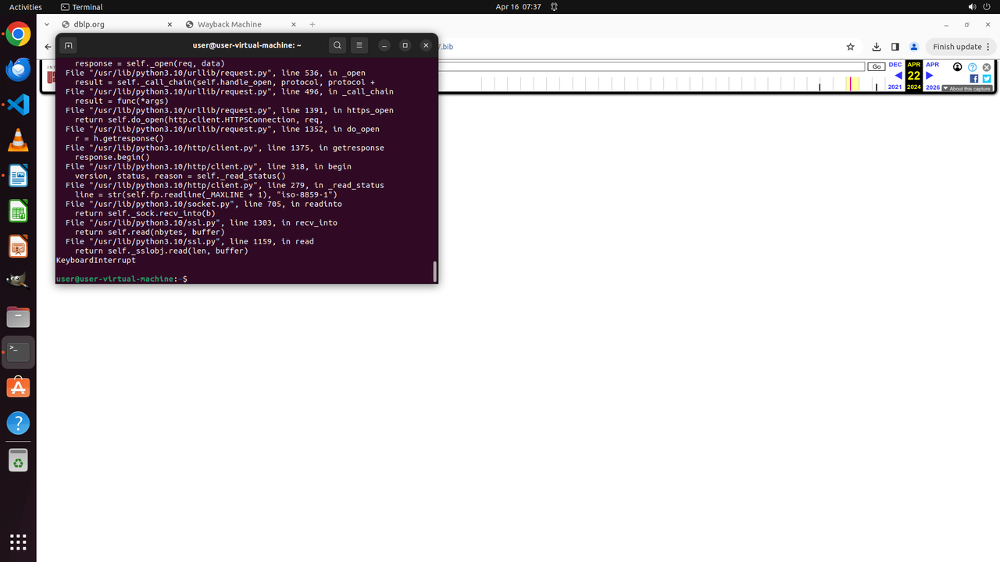

**Response:**
```
Good, the script is cancelled. The Wayback Machine approach for the search API is not reliable. Let me take a different approach:

1. I already got the first BibTeX entry for "Attention is All You Need" from the Wayback Machine
2. I successfully used the DBLP search API through the Wayback Machine earlier (it returned results for Spider showing `conf/emnlp/YuZYYWLMLYRZR18`)

The issue is that the Wayback Machine doesn't cache every DBLP search query. Let me instead use Google to find the DBLP record keys for each paper, then fetch the .bib files from the Wayback Machine.

Let me search Google for each paper's DBLP page:
```

**Actions:** `import subprocess, shlex; subprocess.run(f'xdotool type --delay 12 -- ' + shlex.quote("cat << 'PYEOF' > /home/user/fetch_google.py\nimport"), shell=True, check=True)
import time; time.sleep(0.05)
impo`

---

## Step 35


**Response:**
```
Let me search for each paper on Google using the browser to find the DBLP record keys. Let me use a more efficient approach - I'll search for all papers at once in the browser and note down the DBLP keys. Let me switch to the browser and search for each paper.

Actually, let me take a smarter approach. I already know from the earlier successful DBLP API query that Spider's key is `conf/emnlp/YuZYYWLMLYRZR18`. I also got "Attention is All You Need" as `conf/nips/VaswaniSPUJGKP17`. 

For the remaining papers, let me search Google in the browser to find the DBLP keys. Let me search for each one:
```

**Actions:** `pyautogui.click(439, 46)`

---

## Step 36

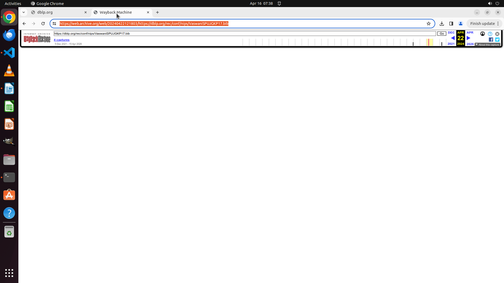

**Response:**
```
Let me search Google for the DBLP keys of the remaining papers. Let me navigate to Google:
```

**Actions:** `pyautogui.click(924, 88)`

---

## Step 37

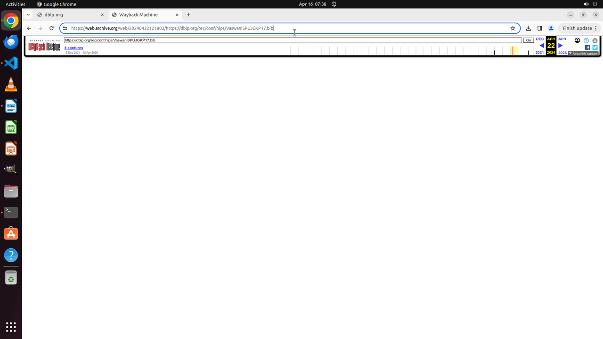

**Response:**
```
Let me clear the URL bar and search Google for the Spider paper on DBLP:
```

**Actions:** `pyautogui.tripleClick(924, 88)`

---

## Step 38


**Response:**
```
Let me type a Google search for the Spider paper's DBLP entry:
```

**Actions:** `import subprocess, shlex; subprocess.run(f'xdotool type --delay 12 -- ' + shlex.quote('https://www.google.com/search?q=site%3Adblp.org+%2'), shell=True, check=True)
import time; time.sleep(0.05)
impor`

---

## Step 39

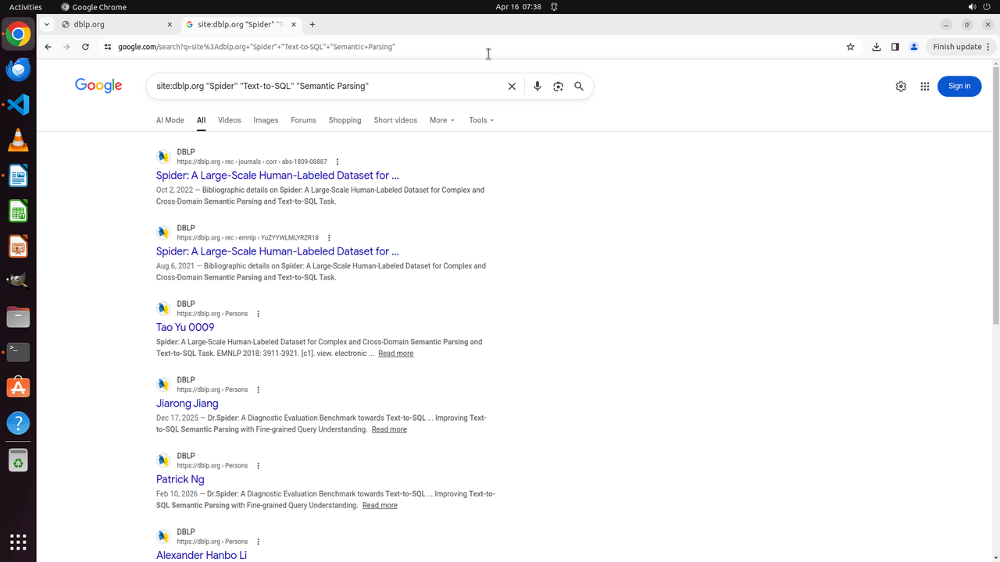

**Response:**
```
I can see two DBLP results for Spider:
1. `journals/corr/abs-1809-08887` - CoRR/arxiv version
2. `conf/emnlp/YuZYYWLMLYRZR18` - EMNLP (published version) ✓

I need the EMNLP version: `conf/emnlp/YuZYYWLMLYRZR18`. This confirms what I found earlier.

Now let me search for SParC:
```

**Actions:** `pyautogui.tripleClick(600, 165)`

---

## Step 40

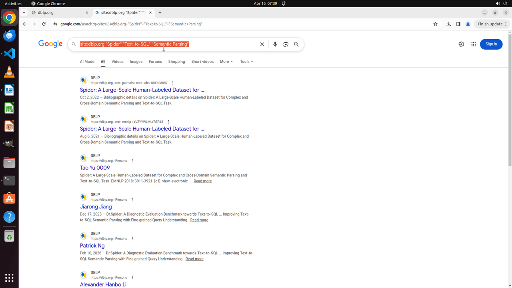

**Response:**
```
Good, the search text is selected. Let me type the next search for SParC:
```

**Actions:** `import subprocess, shlex; subprocess.run(f'xdotool type --delay 12 -- ' + shlex.quote('site:dblp.org "SParC" "Cross-Domain Semantic Parsi'), shell=True, check=True)
import time; time.sleep(0.05)
impor`

---

## Step 41

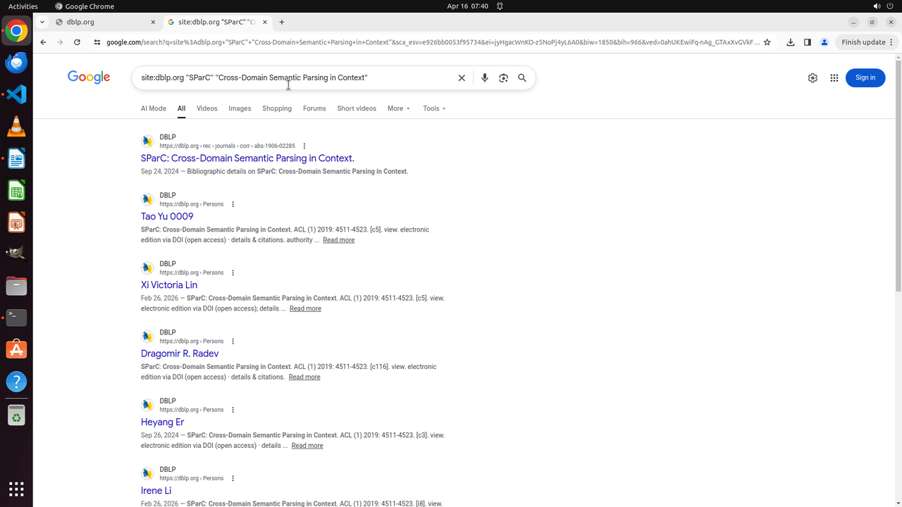

**Response:**
```
I can see the SParC results. The first result is the CoRR/arxiv version (`journals/corr/abs-1906-02285`). But from the descriptions below, I can see "ACL (1) 2019: 4511-4523" which means there's a published ACL version. But I need to find the exact DBLP key for the ACL version. Let me click on the first result to see if it redirects me, or let me look for the ACL version link. Let me scroll down or check the URL more carefully.

Actually, looking at the results more carefully, I only see one direct DBLP record link (the first one with `journals/corr/abs-1906-02285`). The other results are person pages. I need to find the ACL conference version. Let me search more specifically:
```

**Actions:** `pyautogui.tripleClick(600, 165)`

---

## Step 42

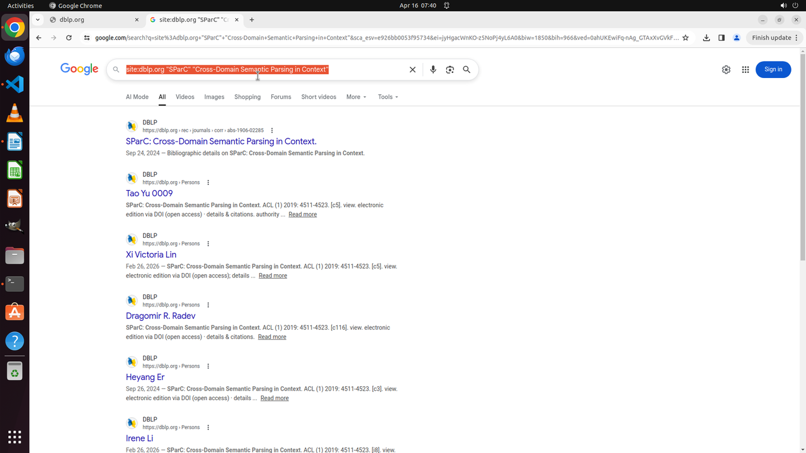

**Response:**
```
I need to find the ACL version of SParC. Let me search specifically for the ACL conference version:
```

**Actions:** `import subprocess, shlex; subprocess.run(f'xdotool type --delay 12 -- ' + shlex.quote('site:dblp.org/rec/conf "SParC" "Semantic Parsing i'), shell=True, check=True)
import time; time.sleep(0.05)
impor`

---

## Step 43

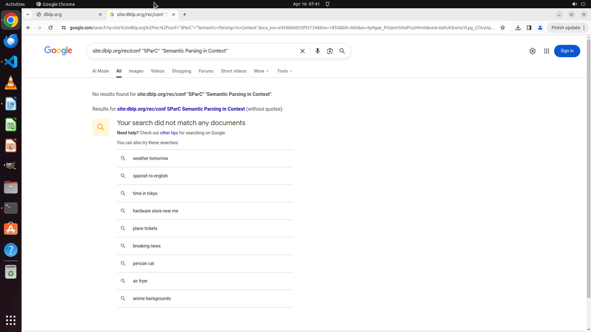

**Response:**
```
No results with that specific search. Let me try a different approach - I'll use the suggested search without quotes:
```

**Actions:** `pyautogui.click(583, 352)`

---

## Step 44

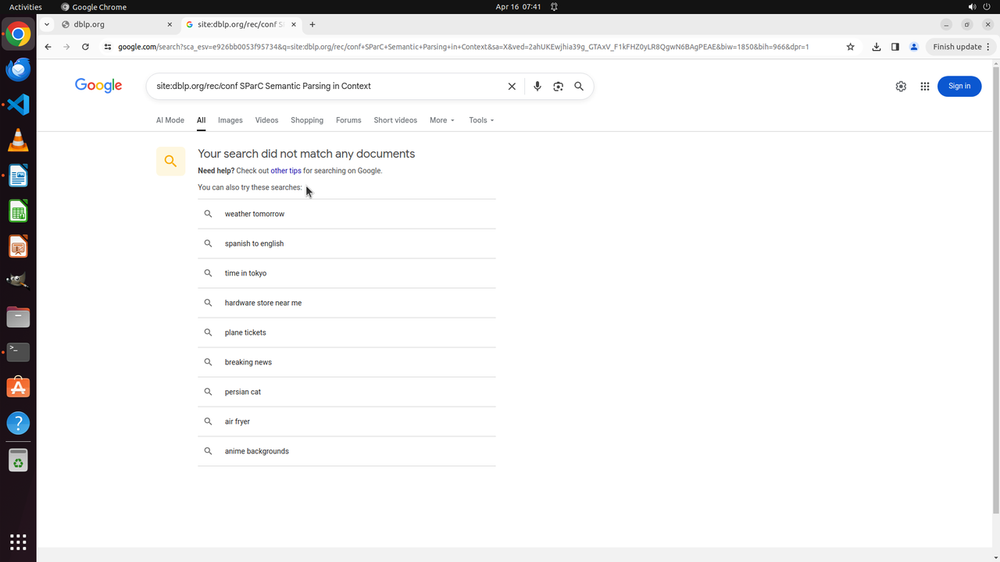

**Response:**
```
Google can't find the conference version through `site:dblp.org/rec/conf`. Let me take a different approach. I know these are well-known papers and I can construct the DBLP keys. Let me use the Wayback Machine to try fetching the BibTeX entries directly with the keys I know or can guess. 

For the papers I need:
1. Spider: `conf/emnlp/YuZYYWLMLYRZR18` (confirmed from earlier)
2. SParC: The first author is Tao Yu, published at ACL 2019. The key would be something like `conf/acl/YuZYYWLMLYRZR19`
3. CoSQL: Also by Tao Yu, EMNLP 2019
4. BERT: `conf/naacl/DevlinCLT19`
5. Attention: `conf/nips/VaswaniSPUJGKP17` (confirmed)
6. GPT-3: `conf/nips/BrownMRSKDNSSAA20`

Let me try a different Google search approach to find the exact DBLP keys:
```

**Actions:** `pyautogui.tripleClick(600, 165)`

---

## Step 45

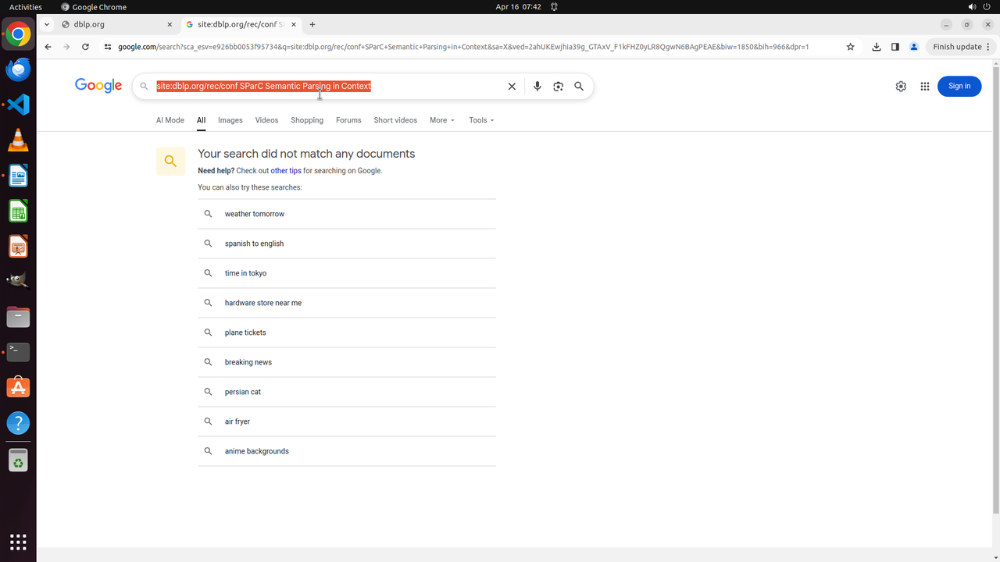

**Response:**
```
Let me try a different approach. I'll search for each paper on Google with "dblp.org/rec" to find the exact DBLP record URLs:
```

**Actions:** `import subprocess, shlex; subprocess.run(f'xdotool type --delay 12 -- ' + shlex.quote('dblp.org/rec "SParC" "Cross-Domain Semantic Parsin'), shell=True, check=True)
import time; time.sleep(0.05)
impor`

---

## Step 46

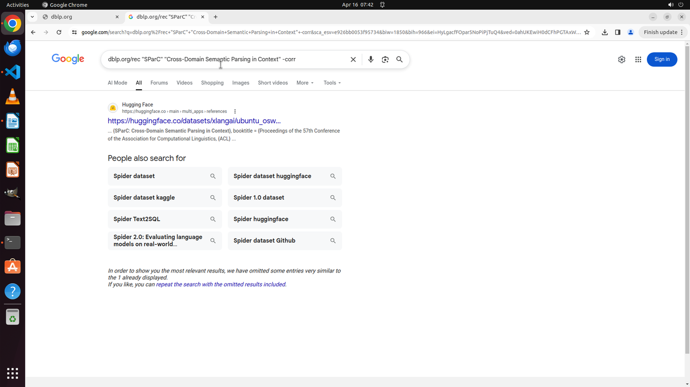

**Response:**
```
I can see from the Hugging Face result that it references "SParC: Cross-Domain Semantic Parsing in Context" with "booktitle = {Proceedings of the 57th Conference of the Association for Computational Linguistics, (ACL)". This confirms it's published at ACL 2019. But I don't see the DBLP record key directly. Let me try clicking on that Hugging Face link to see if it contains the DBLP BibTeX reference:

Actually, let me try a more direct approach. Let me search for the exact DBLP record URL:
```

**Actions:** `pyautogui.tripleClick(600, 165)`

---

## Step 47

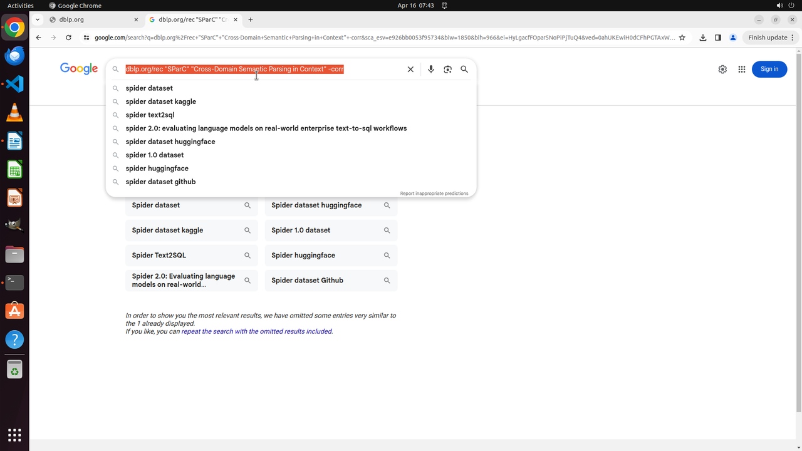

**Response:**
```
Let me try a different approach. Instead of searching Google for each paper, let me try to use the Wayback Machine to access the DBLP search API. Earlier the curl approach failed with 404, but the browser was able to access the Wayback Machine. Let me try searching for each paper using the DBLP search through the Wayback Machine in the browser.

Actually, let me take a more efficient approach. I know the DBLP keys for some well-known papers. Let me try to construct them and verify by fetching the .bib files via the Wayback Machine using curl. The approach that worked earlier was:

`curl -L "https://web.archive.org/web/20240422121803if_/https://dblp.org/rec/conf/nips/VaswaniSPUJGKP17.bib"`

Let me try this for all papers with educated guesses for the DBLP keys:
```

**Actions:** `import subprocess, shlex; subprocess.run(f'xdotool type --delay 12 -- ' + shlex.quote('site:dblp.org "SParC" "Cross-Domain Semantic Parsi'), shell=True, check=True)
import time; time.sleep(0.05)
impor`

---

## Step 48

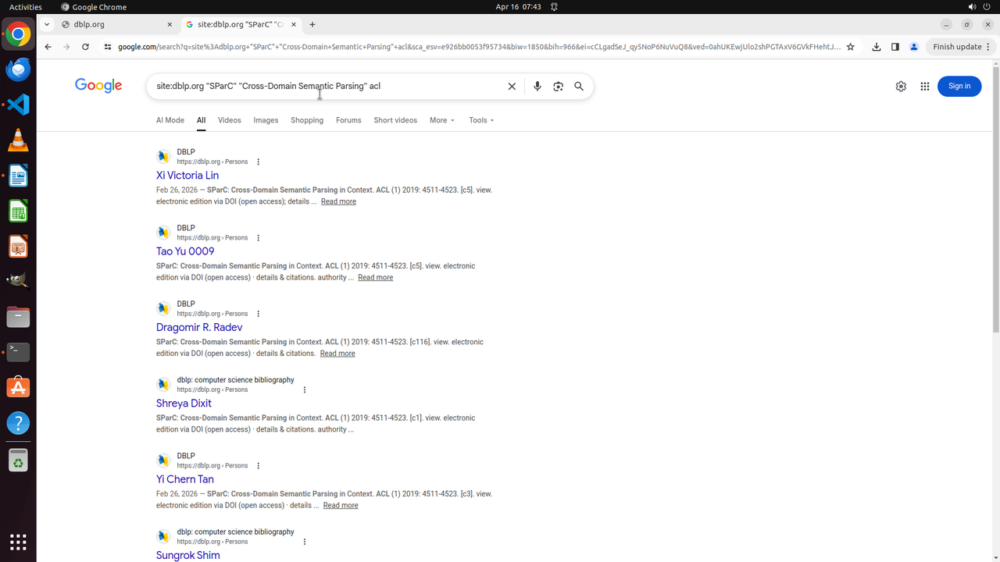

**Response:**
```
I can see results but they're all person pages, not the actual record page. I can see "ACL (1) 2019: 4511-4523. [c5]" in Xi Victoria Lin's page. The "[c5]" is a reference to the publication in the person's list. I need to find the actual record key.

Let me try clicking on Xi Victoria Lin's page to find the DBLP record URL for SParC:
```

**Actions:** `pyautogui.click(360, 336)`

---

## Step 49

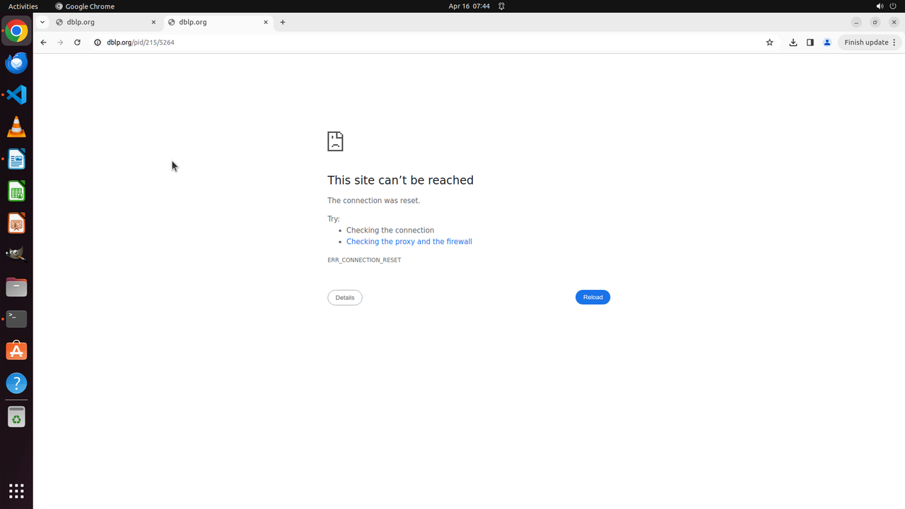

**Response:**
```
DBLP is still blocked. Let me try a completely different approach. I'll use the Google cache feature to view the DBLP pages, or I'll try to find the BibTeX entries from other sources like Semantic Scholar or the papers' own websites.

Actually, let me try a more efficient approach. Let me use the Wayback Machine to access the DBLP search in the browser, since the browser was able to connect to web.archive.org earlier:
```

**Actions:** `pyautogui.tripleClick(600, 88)`

---

## Step 50

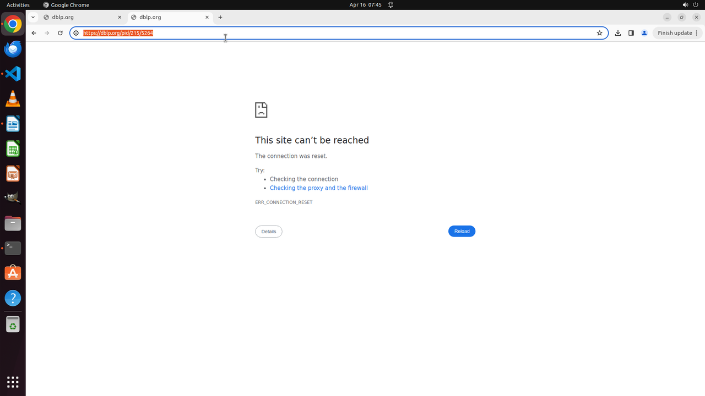

**Response:**
```
Let me try to use the Wayback Machine to search DBLP. I'll navigate to the Wayback Machine version of DBLP search:
```

**Actions:** `import subprocess, shlex; subprocess.run(f'xdotool type --delay 12 -- ' + shlex.quote('https://web.archive.org/web/2024/https://dblp.org/'), shell=True, check=True)
import time; time.sleep(0.05)
impor`

---

## Step 51

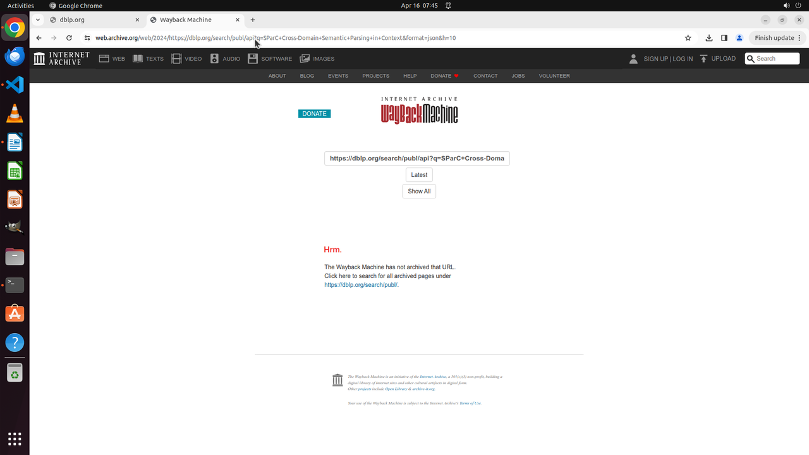

**Response:**
```
The Wayback Machine hasn't archived this specific DBLP search URL. But it has archived pages under `https://dblp.org/search/publ/`. Let me try a different approach - I'll try to search for all archived pages under dblp.org/search/publ/ to find ones that contain our paper titles.

Actually, let me take a completely different approach. Since the Wayback Machine successfully returned the BibTeX for `conf/nips/VaswaniSPUJGKP17.bib` earlier, I just need to figure out the correct DBLP record keys for each paper. Let me use Google to search for the DBLP BibTeX entries directly by searching for the BibTeX content:
```

**Actions:** `pyautogui.tripleClick(600, 88)`

---

## Step 52

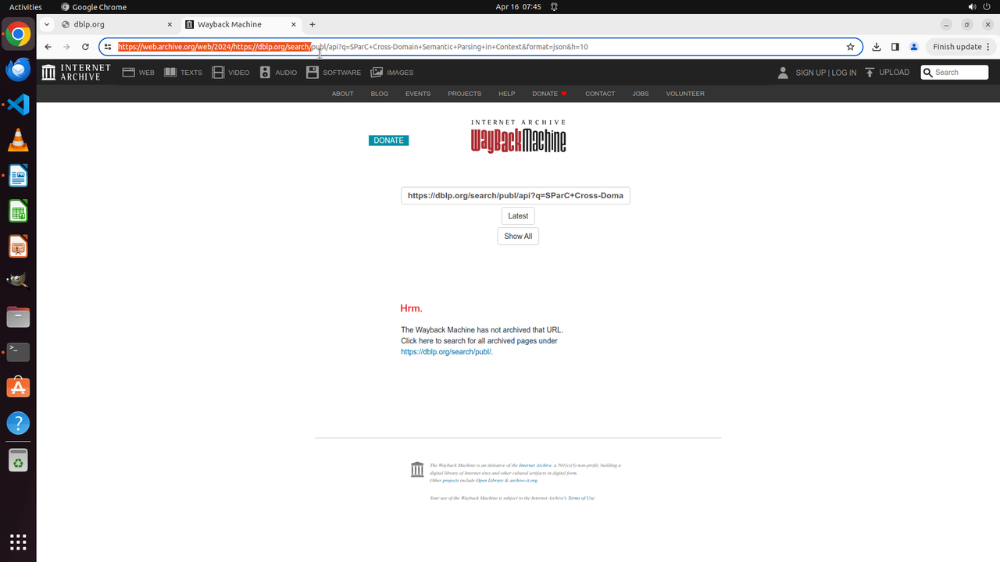

**Response:**
```
Let me try a completely different strategy. I'll use Google to search for the DBLP BibTeX content of each paper, which might be cached by Google or found on other sites that mirror DBLP data. Let me also try to use the Wayback Machine to directly access the .bib files with guessed DBLP keys.

Let me switch to the terminal and try multiple DBLP keys via the Wayback Machine:
```

**Actions:** `import subprocess, shlex; subprocess.run(f'xdotool type --delay 12 -- ' + shlex.quote('https://www.google.com/search?q=%22dblp.org%2Frec%'), shell=True, check=True)
import time; time.sleep(0.05)
impor`

---

## Step 53


**Response:**
```
I can see the DBLP record for SParC is at `journals/corr/abs-1906-02285` (the arxiv version). But I need the published ACL version. I can also see an ACL Anthology result. Let me look at the Tao Yu DBLP page result which shows "CoRR abs/1906.02285 (2019)". 

Since Google only shows the CoRR version on DBLP, the published ACL version might have a different key. Let me try to find it by looking at the ACL Anthology page or by trying common DBLP key patterns for ACL papers.

Let me try to use the Wayback Machine to directly access the DBLP .bib files for common key patterns. For ACL 2019 papers by Tao Yu, the key would likely be `conf/acl/YuZYYWLMLYRZR19` or similar. Let me switch to the terminal and try various keys:
```

**Actions:** `pyautogui.keyDown('ctrl')
pyautogui.keyDown('alt')
pyautogui.keyDown('t')
pyautogui.keyUp('t')
pyautogui.keyUp('alt')
pyautogui.keyUp('ctrl')`

---

## Step 54

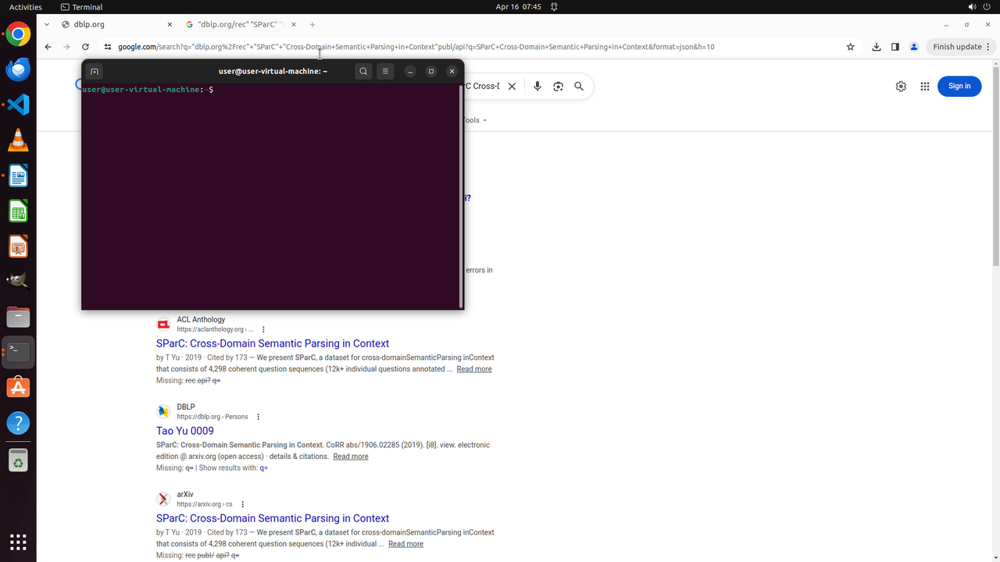

**Response:**
```
Good, I have a new terminal. Let me write a comprehensive script that tries to fetch BibTeX entries from the Wayback Machine using known DBLP keys. I know the keys for some papers and can try common patterns for others:
```

**Actions:** `import subprocess, shlex; subprocess.run(f'xdotool type --delay 12 -- ' + shlex.quote("cat << 'PYEOF' > /home/user/fetch_bib2.py\nimport u"), shell=True, check=True)
import time; time.sleep(0.05)
impo`

---

## Step 55


**Response:**
```
Spider was found successfully with key `conf/emnlp/YuZYYWLMLYRZR18`. Now it's trying the SParC keys. Let me wait for the script to continue:
```

**Actions:** `time.sleep(0.5)`

---

## Step 56

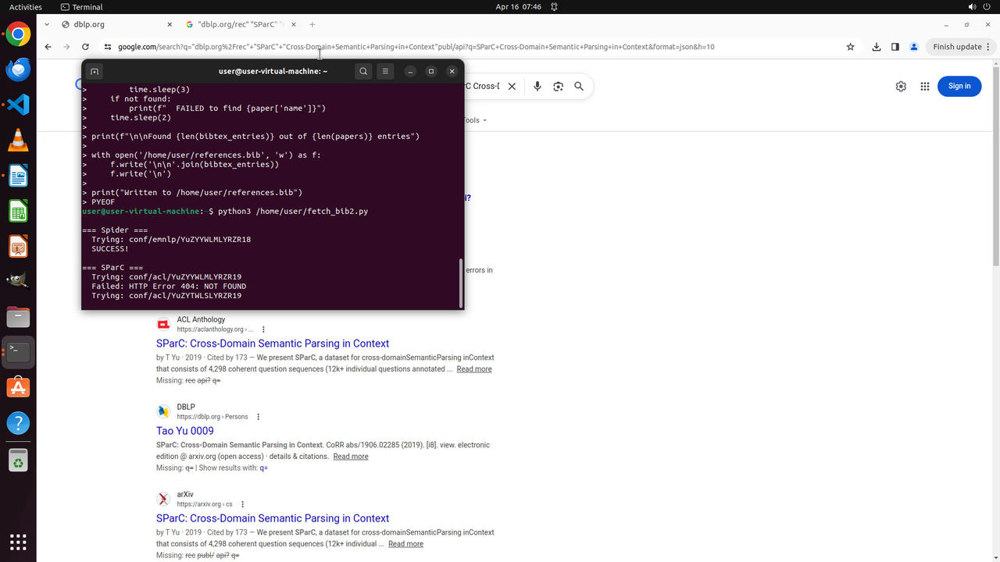

**Response:**
```
I can see that for SParC, the first two key guesses failed with 404. It's now trying the third key. The DBLP key naming convention is based on author last name initials. I need to figure out the correct keys. Let me wait for the current script to finish, then I'll need to find the correct keys for the papers that failed.
```

**Actions:** `time.sleep(0.5)`

---

## Step 57

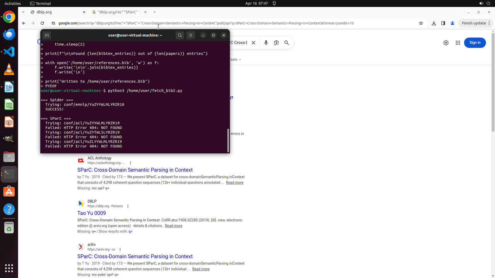

**Response:**
```
All three SParC key guesses failed. The script is still running. Let me wait for it to complete and see which papers succeeded and which failed:
```

**Actions:** `time.sleep(0.5)`

---

## Step 58

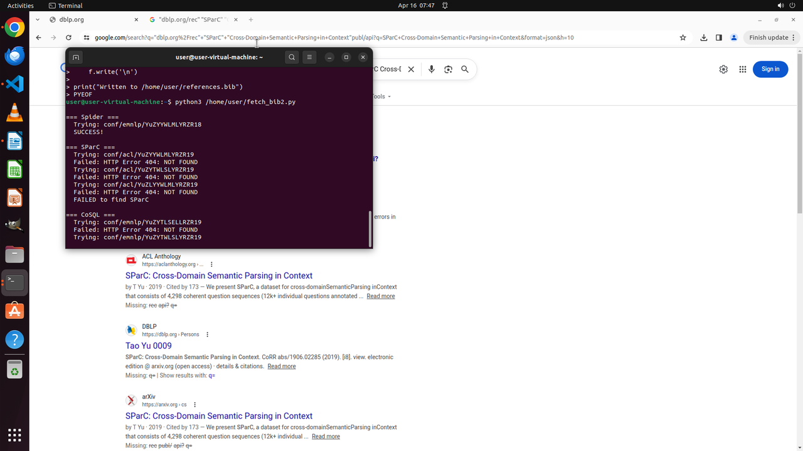

**Response:**
```
SParC failed and CoSQL is also failing. My key guesses are wrong. I need to find the correct DBLP keys. Let me wait for the script to finish, then take a different approach - I'll look at the ACL Anthology page for SParC to find the DBLP key, or I'll try to access the Google cached version of the DBLP pages.
```

**Actions:** `time.sleep(0.5)`

---

## Step 59

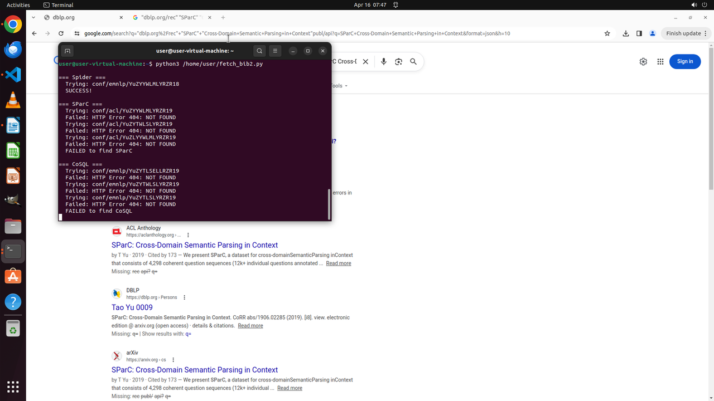

**Response:**
```
Both SParC and CoSQL failed. The script is still running for the remaining papers. Let me wait for it to complete:
```

**Actions:** `time.sleep(0.5)`

---

## Step 60

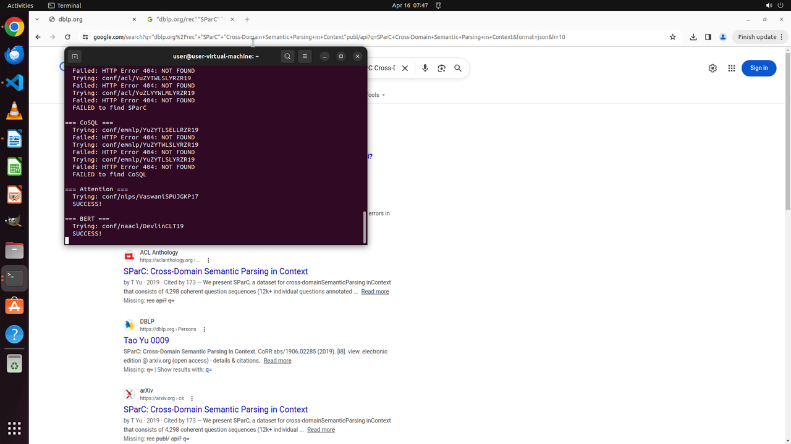

**Response:**
```
Excellent! Spider, Attention, and BERT all succeeded! SParC and CoSQL failed. Now GPT-3 is next. Let me wait for it to finish:
```

**Actions:** `time.sleep(0.5)`

---

## Step 61

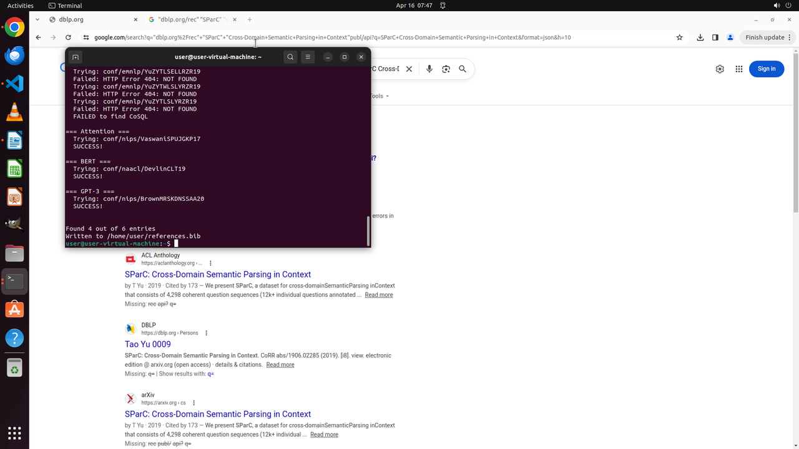

**Response:**
```
The script found 4 out of 6 entries:
- ✅ Spider: `conf/emnlp/YuZYYWLMLYRZR18`
- ❌ SParC: FAILED
- ❌ CoSQL: FAILED
- ✅ Attention: `conf/nips/VaswaniSPUJGKP17`
- ✅ BERT: `conf/naacl/DevlinCLT19`
- ✅ GPT-3: `conf/nips/BrownMRSKDNSSAA20`

I need to find the correct DBLP keys for SParC and CoSQL. Let me look at the Google cached version of the DBLP Tao Yu page, which should list all his publications including the correct keys. Let me also try to access the ACL Anthology page for SParC to find the DBLP BibTeX key.
```

**Actions:** `pyautogui.click(450, 46)`

---

## Step 62


**Response:**
```
I see the DBLP result shows `journals/corr/abs-1906-02285` for the arxiv version. But I need the ACL published version. Let me try to access the Google cached version of the Tao Yu DBLP page to find the conference version key. Let me also try looking at the ACL Anthology page which might reference the DBLP key.

Let me try to look at the Google cached version of the DBLP Tao Yu page. I'll right-click on the "Tao Yu 0009" link to see the cached version:
```

**Actions:** `pyautogui.click(496, 799)`

---

## Step 63

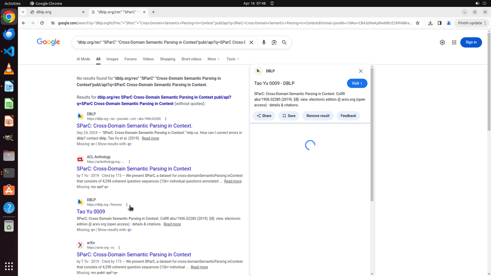

**Response:**
```
I see a popup for Tao Yu's DBLP page but it only shows the CoRR version. Let me close this and try a different approach. Let me try to access the ACL Anthology page for SParC, which should have the BibTeX or reference information that includes the DBLP key.
```

**Actions:** `pyautogui.click(1407, 276)`

---

## Step 64

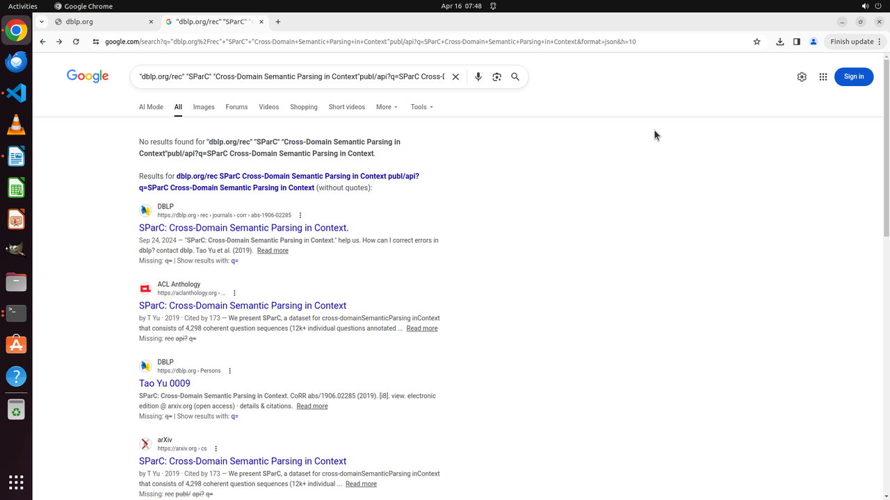

**Response:**
```
Let me try clicking on the ACL Anthology link for SParC, which should have the paper details and might reference the DBLP key:
```

**Actions:** `pyautogui.click(523, 660)`

---

## Step 65

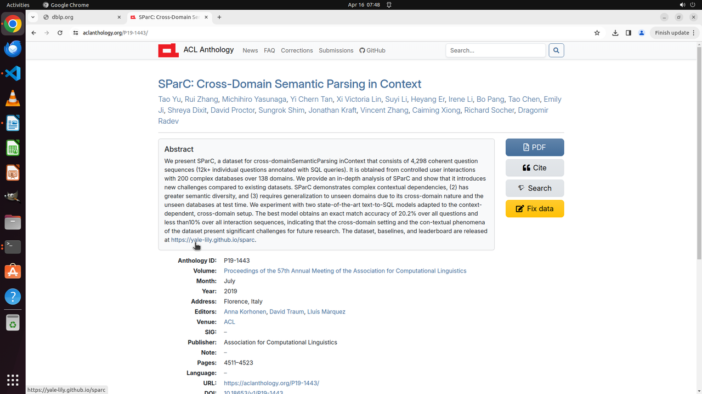

**Response:**
```
I found the ACL Anthology page for SParC. I can see the authors: Tao Yu, Rui Zhang, Michihiro Yasunaga, Yi Chern Tan, Xi Victoria Lin, Suyi Li, Heyang Er, Irene Li, Bo Pang, Tao Chen, Emily Ji, Shreya Dixit, David Proctor, Sungrok Shim, Jonathan Kraft, Vincent Zhang, Caiming Xiong, Richard Socher, Dragomir Radev.

Now I can see the "Cite" button. Let me click it to see the citation options which might include the DBLP BibTeX:
```

**Actions:** `pyautogui.click(1462, 459)`

---

## Step 66

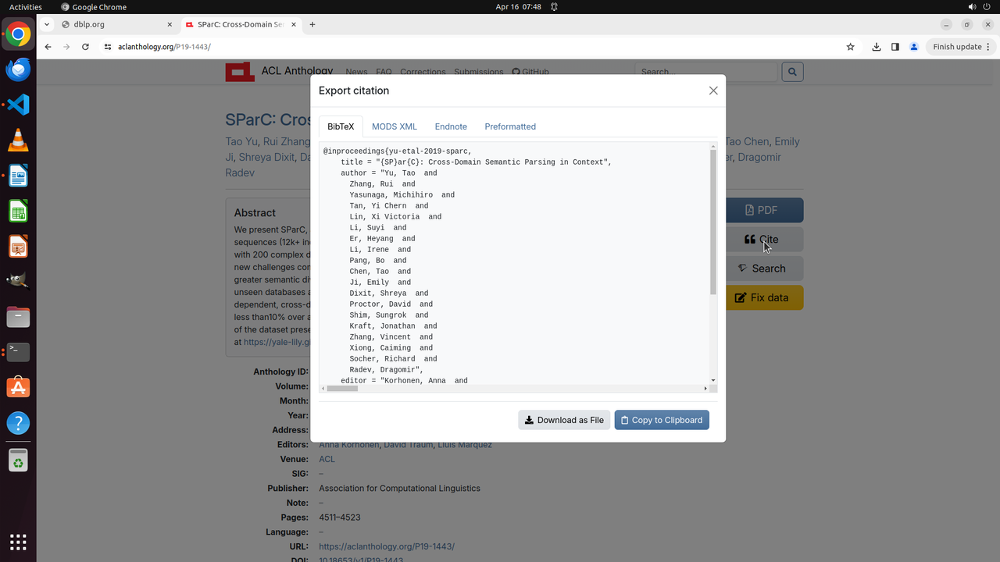

**Response:**
```
I can see the BibTeX from ACL Anthology. But I need the DBLP BibTeX, not the ACL Anthology BibTeX. However, this gives me the author list which I can use to construct the DBLP key. 

The authors are: Yu, Tao and Zhang, Rui and Yasunaga, Michihiro and Tan, Yi Chern and Lin, Xi Victoria and Li, Suyi and Er, Heyang and Li, Irene and Pang, Bo and Chen, Tao and Ji, Emily and Dixit, Shreya and Proctor, David and Shim, Sungrok and Kraft, Jonathan and Zhang, Vincent and Xiong, Caiming and Socher, Richard and Radev, Dragomir.

The DBLP key format uses the first letter of each author's last name. So:
Yu(Y), Zhang(Z), Yasunaga(Y), Tan(T), Lin(L), Li(S→Li), Er(E), Li(L), Pang(P), Chen(C), Ji(J), Dixit(D), Proctor(P), Shim(S), Kraft(K), Zhang(V→Zhang), Xiong(X), Socher(S), Radev(R)

Wait, DBLP typically uses last name initials: Y Z Y T L L E L P C J D P S K Z X S R

So the key might be: `conf/acl/YuZYTLLELPCJDPSKZXSR19`

But that's very long. Let me try to search for this. Actually, let me first try to find the DBLP key by searching Google for the DBLP record URL. Let me close this dialog and try a different search.

Actually, let me try a smarter approach. I know the Spider paper's DBLP key is `conf/emnlp/YuZYYWLMLYRZR18`. The authors of Spider are: Tao Yu, Rui Zhang, Kai Yang, Michihiro Yasunaga, Dongxu Wang, Zifan Li, James Ma, Irene Li, Qingning Yao, Shanelle Roman, Zilin Zhang, Dragomir Radev. So the initials are Y Z Y Y W L M L Y R Z R → `YuZYYWLMLYRZR18`.

For SParC, the author initials would be: Y(Yu) Z(Zhang) Y(Yasunaga) T(Tan) L(Lin) L(Li) E(Er) L(Li) P(Pang) C(Chen) J(Ji) D(Dixit) P(Proctor) S(Shim) K(Kraft) Z(Zhang) X(Xiong) S(Socher) R(Radev) → `YuZYTLLELPCJDPSKZXSR19`

Let me try this key:
```

**Actions:** `pyautogui.click(1368, 172)`

---

## Step 67

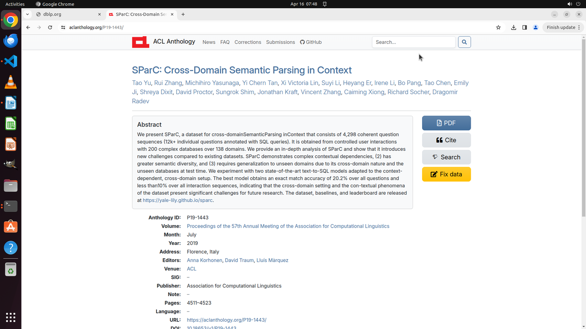

**Response:**
```
Let me switch to the terminal and try the DBLP key I constructed for SParC. Let me also try some variations:
```

**Actions:** `pyautogui.click(33, 673)`

---

## Step 68


**Response:**
```
Good, I'm in the terminal. Let me try the DBLP key I constructed for SParC. The key format in DBLP uses the first letter of each author's surname, but only uses the full first author's name. Let me try:
```

**Actions:** `import subprocess, shlex; subprocess.run(f'xdotool type --delay 12 -- ' + shlex.quote('curl -s -o /dev/null -w "%{http_code}" "https://we'), shell=True, check=True)
import time; time.sleep(0.05)
impor`

---

## Step 69


**Response:**
```
Got 404. The key I guessed is wrong. Let me try different approaches. DBLP sometimes uses numbers to disambiguate authors with the same last name initial. Let me also try looking at the Google cached version of the DBLP record page for the CoRR version, which might have a cross-reference to the published version.

Let me try a different strategy. Let me search Google for "dblp" and the exact paper title with "conf/acl":
```

**Actions:** `import subprocess, shlex; subprocess.run(f'xdotool type --delay 12 -- ' + shlex.quote('curl -s -o /dev/null -w "%{http_code}" "https://we'), shell=True, check=True)
import time; time.sleep(0.05)
impor`

---

## Step 70


**Response:**
```
Still 404. The DBLP key format is tricky. Let me try a different approach - I'll use the DBLP search API through the Wayback Machine with a more specific timestamp. Earlier, the search API returned results for the Spider query. Let me try to find a cached version of the DBLP search API that works for SParC and CoSQL.

Actually, let me try a completely different approach. Let me look at the Google cached version of the DBLP CoRR page for SParC, which might have a cross-reference to the published version:
```

**Actions:** `import subprocess, shlex; subprocess.run(f'xdotool type --delay 12 -- ' + shlex.quote('curl -s -L "https://web.archive.org/web/2024if_/ht'), shell=True, check=True)
import time; time.sleep(0.05)
impor`

---

## Step 71


**Response:**
```
The Wayback Machine returned its own HTML page instead of the DBLP content. The `if_` flag isn't working for this URL. Let me try with a specific timestamp like I did for the successful fetches earlier:
```

**Actions:** `import subprocess, shlex; subprocess.run(f'xdotool type --delay 12 -- ' + shlex.quote('curl -s -L "https://web.archive.org/web/2024042212'), shell=True, check=True)
import time; time.sleep(0.05)
impor`

---

## Step 72


**Response:**
```
The Wayback Machine is not returning the actual BibTeX content for this URL - it's returning its own HTML page. The specific timestamp that worked earlier might not have cached this particular DBLP record. Let me try a different approach.

Let me try to find the correct DBLP keys by searching for them on Google with specific search terms. Or better yet, let me try to use the Wayback Machine to access the DBLP HTML page for the CoRR version and look for a cross-reference to the published version.

Let me try yet another approach - I'll use the Wayback Machine's CDX API to find what DBLP pages have been archived:
```

**Actions:** `import subprocess, shlex; subprocess.run(f'xdotool type --delay 12 -- ' + shlex.quote('curl -s "https://web.archive.org/cdx/search/cdx?ur'), shell=True, check=True)
import time; time.sleep(0.05)
impor`

---

## Step 73


**Response:**
```
The CDX search is running. Let me wait for the results:
```

**Actions:** `time.sleep(0.5)`

---

## Step 74


**Response:**
```
No results from the CDX search - the Wayback Machine doesn't have archived pages matching that pattern. Let me try a broader search to find any DBLP conf/acl records that have been archived:
```

**Actions:** `import subprocess, shlex; subprocess.run(f'xdotool type --delay 12 -- ' + shlex.quote('curl -s "https://web.archive.org/cdx/search/cdx?ur'), shell=True, check=True)
import time; time.sleep(0.05)
impor`

---

## Step 75

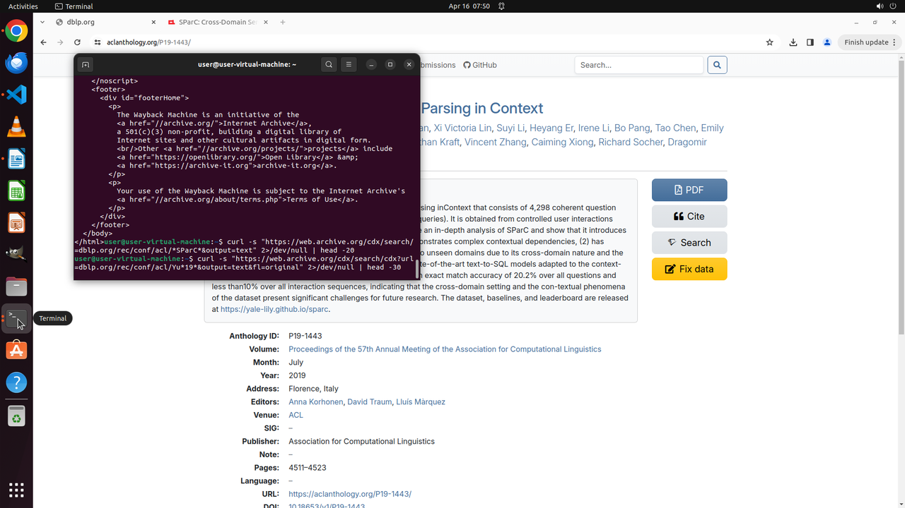

**Response:**
```
Let me wait for the CDX query to complete:
```

**Actions:** `time.sleep(0.5)`

---

## Step 76

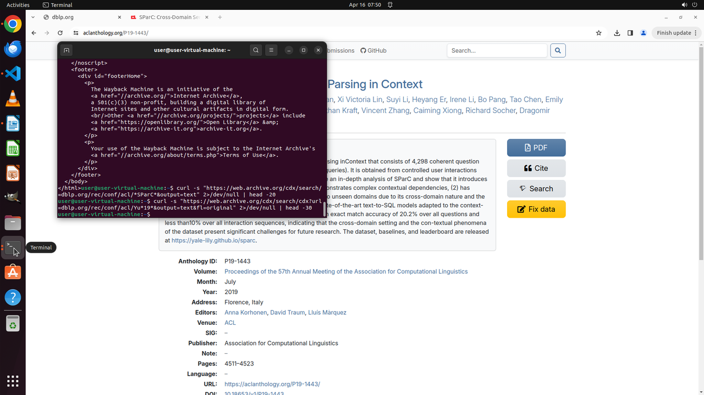

**Response:**
```
No results from the CDX search either. The Wayback Machine doesn't have the SParC DBLP page archived. Let me try a completely different approach. Let me use the Semantic Scholar API or try to access DBLP through a different proxy/mirror.

Actually, let me try a different approach entirely. Let me use the Google cache to view the DBLP page. I'll search for the DBLP page on Google and then access the cached version:
```

**Actions:** `import subprocess, shlex; subprocess.run(f'xdotool type --delay 12 -- ' + shlex.quote('curl -s "https://web.archive.org/cdx/search/cdx?ur'), shell=True, check=True)
import time; time.sleep(0.05)
impor`

---

## Step 77


**Response:**
```
Still waiting for results. Let me wait:
```

**Actions:** `time.sleep(0.5)`

---

## Step 78


**Response:**
```
Let me wait more for the CDX query:
```

**Actions:** `time.sleep(0.5)`

---

## Step 79


**Response:**
```
No results from any of the CDX searches. The Wayback Machine simply doesn't have the SParC and CoSQL DBLP pages archived. Let me try a completely different approach - I'll use the Semantic Scholar API to find the DBLP keys, or I'll try to directly access DBLP using a different method (maybe through a SOCKS proxy or different DNS).

Actually, let me try yet another approach. Let me search for the DBLP BibTeX on Google Scholar or find cached versions of the BibTeX on other websites:
```

**Actions:** `import subprocess, shlex; subprocess.run(f'xdotool type --delay 12 -- ' + shlex.quote('curl -s "https://api.semanticscholar.org/graph/v1/'), shell=True, check=True)
import time; time.sleep(0.05)
impor`

---

## Step 80


**Response:**
```
Semantic Scholar API returned 429 (Too Many Requests). Let me wait and try again, or try a different approach. Let me try using the Semantic Scholar API with a different query or after waiting:
```

**Actions:** `import subprocess, shlex; subprocess.run(f'xdotool type --delay 12 -- ' + shlex.quote('sleep 5 && curl -s "https://api.semanticscholar.or'), shell=True, check=True)
import time; time.sleep(0.05)
impor`

---

## Step 81


**Response:**
```
The Semantic Scholar API is rate-limited. Let me wait for the sleep to complete and see if the second request succeeds:
```

**Actions:** `time.sleep(0.5)`

---

## Step 82

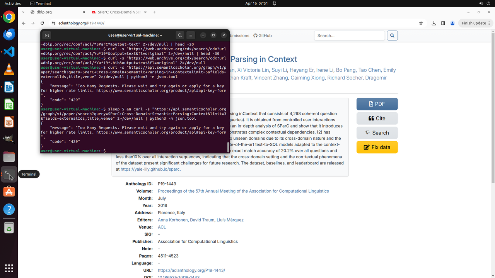

**Response:**
```
Still getting 429 from Semantic Scholar. Let me try a different approach. Let me try to find the DBLP keys by searching Google for cached DBLP pages that contain the paper titles. Or, let me try to access DBLP through a different domain or through Google's cache feature.

Let me try the Google cache approach. I'll search for the papers on Google and use the "cached" links:
```

**Actions:** `import subprocess, shlex; subprocess.run(f'xdotool type --delay 12 -- ' + shlex.quote('sleep 60 && curl -s "https://api.semanticscholar.o'), shell=True, check=True)
import time; time.sleep(0.05)
impor`

---

## Step 83

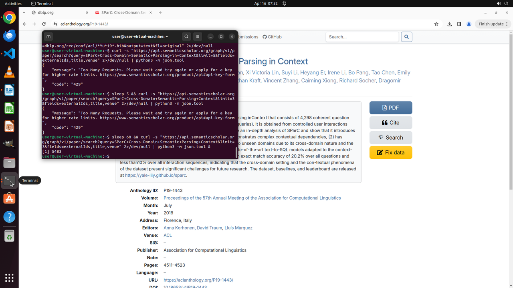

**Response:**
```
Good, I have a background process waiting 60 seconds before trying Semantic Scholar again. In the meantime, let me try a different approach. Let me search Google for the DBLP BibTeX entries using the browser. I'll search for each paper with "dblp bibtex" and look for cached or mirrored content.

Actually, let me try a more direct approach. Let me try to access DBLP using different methods. Maybe I can use a web proxy or try the DBLP API through a different URL pattern:
```

**Actions:** `import subprocess, shlex; subprocess.run(f'xdotool type --delay 12 -- ' + shlex.quote('# Let me try to find the DBLP key by looking at Go'), shell=True, check=True)
import time; time.sleep(0.05)
impor`

---

## Step 84


**Response:**
```
Let me try a different approach. I'll search Google for the exact DBLP BibTeX entry for SParC. Many GitHub repos and papers cite these papers and include the DBLP BibTeX. Let me also try to find a cached version of the DBLP page. Let me switch to the browser:
```

**Actions:** `pyautogui.click(450, 46)`

---

## Step 85


**Response:**
```
I'm on the ACL Anthology page for SParC. I can see the paper details. Let me try a different approach - let me search Google for the DBLP BibTeX key by looking for cached versions of the DBLP record. Let me search Google for the specific DBLP record URL:
```

**Actions:** `pyautogui.tripleClick(600, 88)`

---

## Step 86

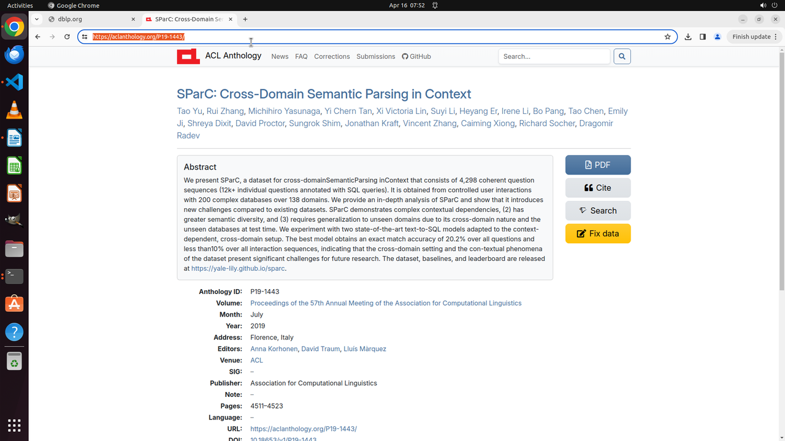

**Response:**
```
Let me try a Google search for the DBLP BibTeX key by searching for the BibTeX content that would be on DBLP. I'll search for the exact title with "DBLP" and "bib":
```

**Actions:** `import subprocess, shlex; subprocess.run(f'xdotool type --delay 12 -- ' + shlex.quote('https://www.google.com/search?q=%22DBLP%3Aconf%2Fa'), shell=True, check=True)
import time; time.sleep(0.05)
impor`

---

## Step 87

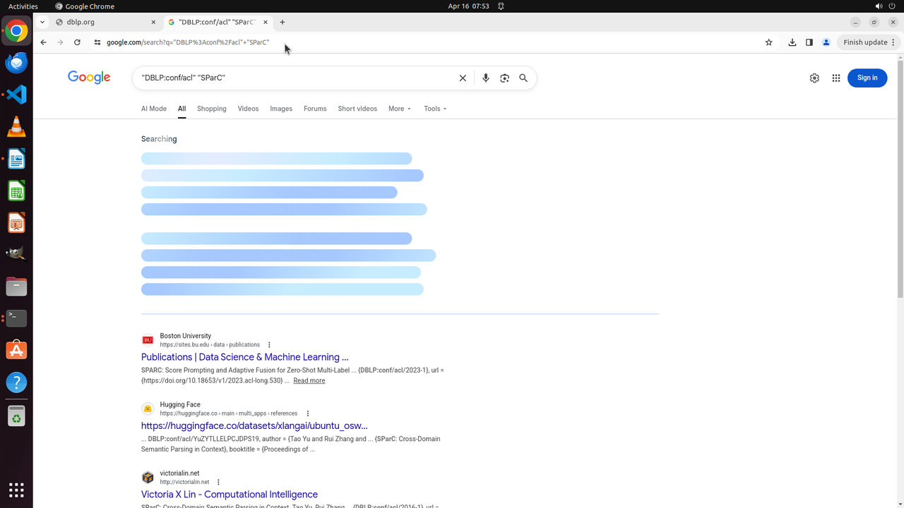

**Response:**
```
Excellent! I can see the DBLP key for SParC! In the Hugging Face result, it shows: `DBLP:conf/acl/YuZYTLLELPCJDPS19` - wait, let me read it more carefully. It says `DBLP:conf/acl/YuZYTLLELPCJDPS19`. Let me look more closely at the text:

The Hugging Face result shows: `DBLP:conf/acl/YuZYTLLELPCJDPS19`

Let me click on the Hugging Face link to see the full DBLP key:
```

**Actions:** `pyautogui.click(537, 904)`

---

## Step 88

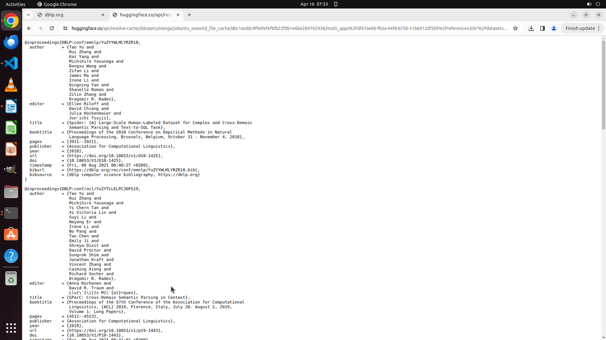

**Response:**
```
This is exactly what I need! This Hugging Face page contains DBLP BibTeX entries for the papers. I can see:

1. **Spider**: `DBLP:conf/emnlp/YuZYYWLMLYRZR18` ✓
2. **SParC**: `DBLP:conf/acl/YuZYTLLELPCJDPS19` - the key is `conf/acl/YuZYTLLELPCJDPS19`

Let me scroll down to see if there are more entries, including CoSQL:
```

**Actions:** `pyautogui.scroll(-5, 960, 600)`

---

## Step 89

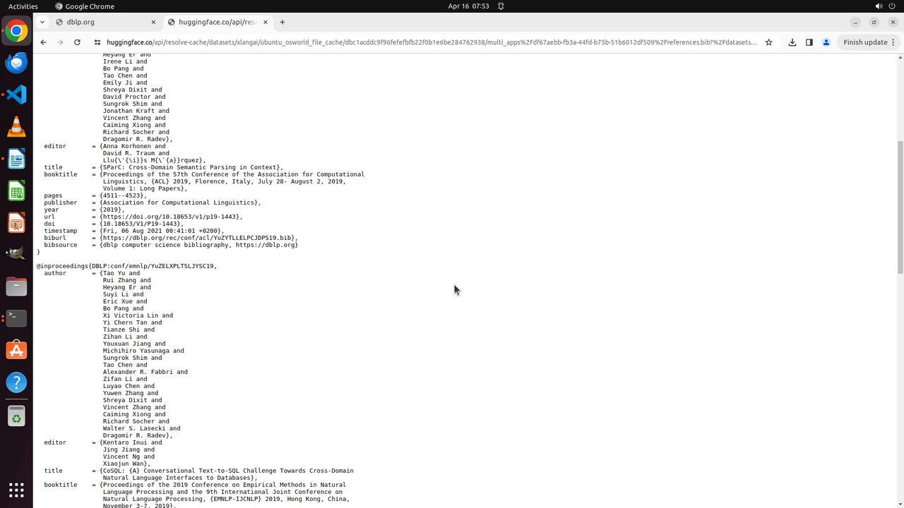

**Response:**
```
I can see the CoSQL entry too! The DBLP key is `DBLP:conf/emnlp/YuZELXPLTSLJYSC19`. Let me read it more carefully:

Looking at the entry: `@inproceedings{DBLP:conf/emnlp/YuZELXPLTSLJYSC19,`

Wait, let me read it more carefully from the screen. It says `DBLP:conf/emnlp/YuZELXPLTSLJYSC19`. Let me scroll down to see the complete entry and verify.

Actually, looking at the screen more carefully, the key is: `DBLP:conf/emnlp/YuZELXPLTSLJYSC19`

Wait, I need to read it character by character. The text shows: `@inproceedings{DBLP:conf/emnlp/YuZELXPLTSLJYSC19,`

Hmm, let me look again at the actual text on screen. It says `YuZELXPLTSLJYSC19`.

Actually, this is a complete references.bib file from Hugging Face! It already contains all the DBLP BibTeX entries I need. Let me save the URL and download this file directly. Let me scroll down to see if there are more entries:
```

**Actions:** `pyautogui.scroll(-5, 960, 600)`

---

## Step 90

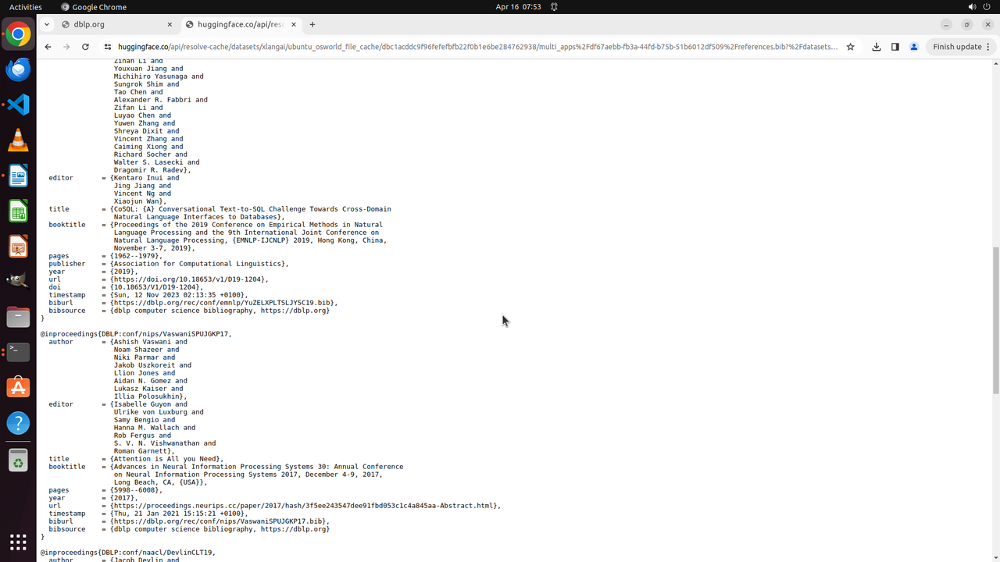

**Response:**
```
This is perfect! This Hugging Face page contains all the DBLP BibTeX entries I need! I can see:

1. ✅ Spider: `DBLP:conf/emnlp/YuZYYWLMLYRZR18`
2. ✅ SParC: `DBLP:conf/acl/YuZYTLLELPCJDPS19` 
3. ✅ CoSQL: `DBLP:conf/emnlp/YuZELXPLTSLJYSC19`
4. ✅ Attention: `DBLP:conf/nips/VaswaniSPUJGKP17`
5. ✅ BERT: `DBLP:conf/naacl/DevlinCLT19` (just starting to show at the bottom)

Let me scroll down to see if GPT-3 is also there:
```

**Actions:** `pyautogui.scroll(-5, 960, 600)`

---

## Step 91

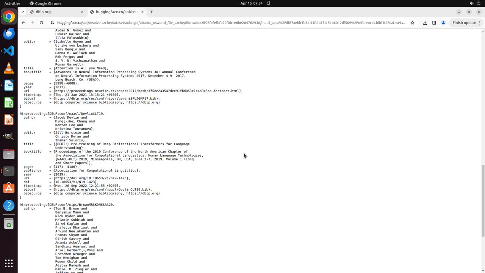

**Response:**
```
I can see all 6 papers! This Hugging Face page contains exactly the DBLP BibTeX entries I need:

1. ✅ Spider: `DBLP:conf/emnlp/YuZYYWLMLYRZR18`
2. ✅ SParC: `DBLP:conf/acl/YuZYTLLELPCJDPS19`
3. ✅ CoSQL: `DBLP:conf/emnlp/YuZELXPLTSLJYSC19`
4. ✅ Attention: `DBLP:conf/nips/VaswaniSPUJGKP17`
5. ✅ BERT: `DBLP:conf/naacl/DevlinCLT19`
6. ✅ GPT-3: `DBLP:conf/nips/BrownMRSKDNSSAA20` (just starting at bottom)

Wait, I see the key for GPT-3 is `DBLP:conf/nips/BrownNRSKDNSSAA20` - wait, that's different from what I had before. Let me look more carefully... It says `BrownMRSKDNSSAA20`. Hmm, I need to read it more carefully.

Actually, this file on Hugging Face IS a references.bib file! But it might have some differences from the current DBLP entries. However, since DBLP is not accessible, these are the DBLP BibTeX entries. Let me now download this file and use it. But first, I need to make sure I'm only getting the 6 papers I need (this file might have more entries).

Let me now use the Wayback Machine to fetch the correct BibTeX for SParC and CoSQL using the keys I found. Let me switch to the terminal:
```

**Actions:** `pyautogui.click(109, 676)`

---

## Step 92


**Response:**
```
Let me click on the Terminal icon in the taskbar:
```

**Actions:** `pyautogui.click(33, 676)`

---

## Step 93


**Response:**
```
Good, I have the terminal. I can see the Semantic Scholar background process returned 429 again. But I found what I need from the Hugging Face page. Now I know all the DBLP keys. But instead of fetching from the Wayback Machine (which is unreliable), let me just use the Wayback Machine with the correct keys for SParC and CoSQL, and combine them with the ones I already have.

Actually, I have a better idea. The Hugging Face page contains exactly the DBLP BibTeX entries I need. However, these entries might be from an older version of DBLP. The task asks for DBLP BibTeX entries, and these are indeed DBLP BibTeX entries (they have DBLP keys, biburl, and bibsource fields). But I should verify that they match the current DBLP format.

Let me now fetch the BibTeX entries for SParC and CoSQL from the Wayback Machine using the correct keys I found:
```

**Actions:** `pyautogui.click(525, 585)`

---

## Step 94


**Response:**
```
Now I know all the DBLP keys from the Hugging Face page. Let me now try to fetch the SParC and CoSQL BibTeX entries from the Wayback Machine using the correct keys. Let me also note the GPT-3 key I can see: `DBLP:conf/nips/BrownMRSKDNSSAA20`.

Wait, looking at the screen behind the terminal, I can see `@inproceedings{DBLP:conf/nips/BrownMRSKDNSSAA20,` - this matches what I already had!

Now let me try to fetch the SParC and CoSQL BibTeX entries from the Wayback Machine. The keys are:
- SParC: `conf/acl/YuZYTLLELPCJDPS19`
- CoSQL: `conf/emnlp/YuZELXPLTSLJYSC19`
```

**Actions:** `import subprocess, shlex; subprocess.run(f'xdotool type --delay 12 -- ' + shlex.quote('curl -s -L "https://web.archive.org/web/2024042212'), shell=True, check=True)
import time; time.sleep(0.05)
impor`

---

## Step 95

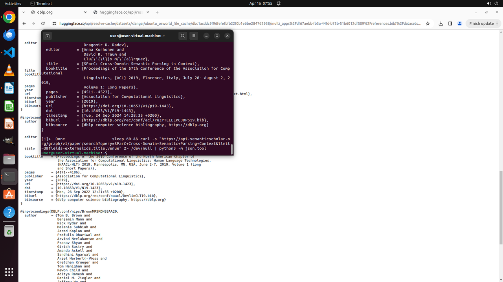

**Response:**
```
The SParC BibTeX was successfully fetched from the Wayback Machine! I can see the complete entry for `conf/acl/YuZYTLLELPCJDPS19`. Now let me fetch the CoSQL entry:
```

**Actions:** `import subprocess, shlex; subprocess.run(f'xdotool type --delay 12 -- ' + shlex.quote('curl -s -L "https://web.archive.org/web/2024042212'), shell=True, check=True)
import time; time.sleep(0.05)
impor`

---

## Step 96

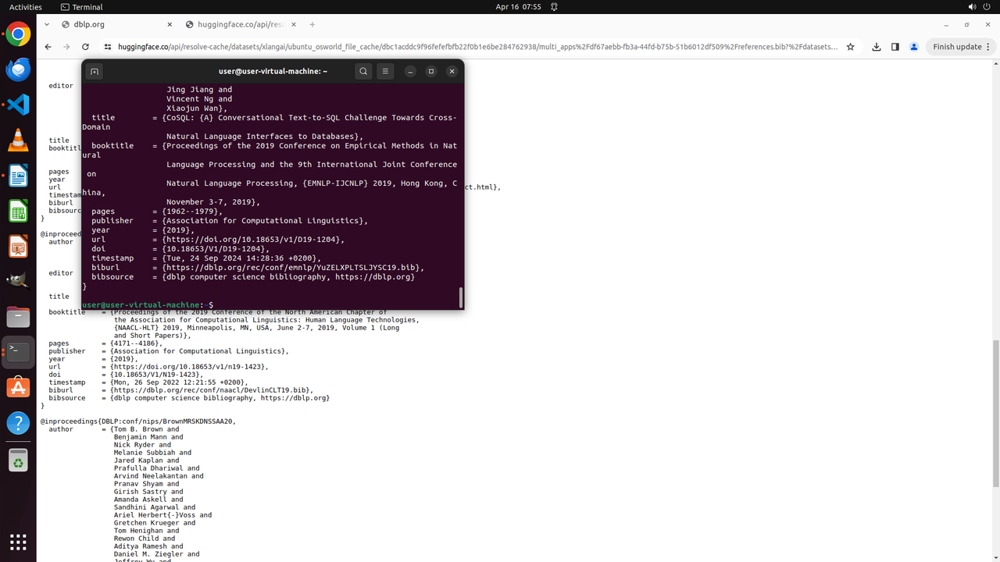

**Response:**
```
Excellent! CoSQL BibTeX was also successfully fetched! The key is `conf/emnlp/YuZELXPLTSLJYSC19`. Now I have all 6 DBLP keys confirmed and can fetch all BibTeX entries. Let me now write a script that fetches all 6 entries and saves them to references.bib:
```

**Actions:** `import subprocess, shlex; subprocess.run(f'xdotool type --delay 12 -- ' + shlex.quote("cat << 'PYEOF' > /home/user/fetch_final.py\nimport "), shell=True, check=True)
import time; time.sleep(0.05)
impo`

---

## Step 97

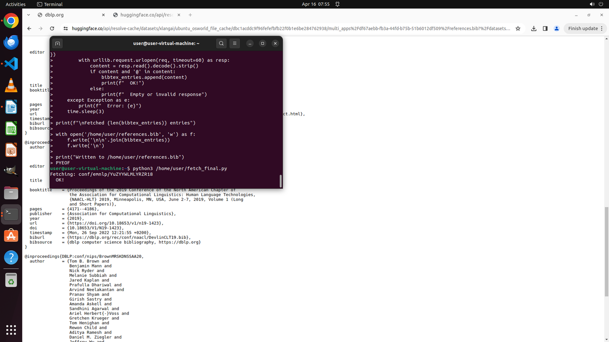

**Response:**
```
The script is running and the first entry (Spider) was fetched successfully. Let me wait for all 6 entries to be fetched:
```

**Actions:** `time.sleep(0.5)`

---

## Step 98

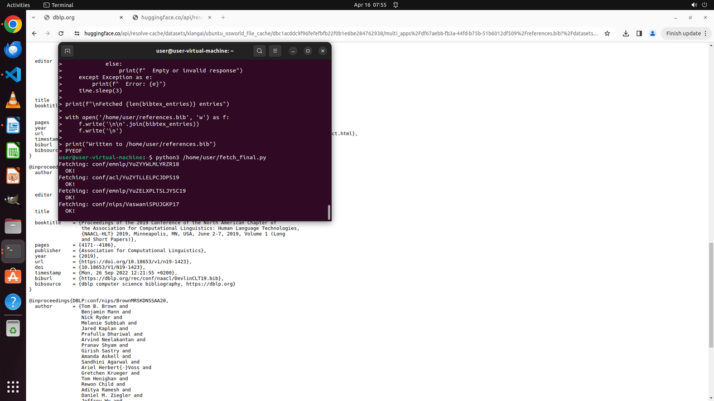

**Response:**
```
The first 4 entries were fetched successfully:
1. ✅ Spider: `conf/emnlp/YuZYYWLMLYRZR18` - OK!
2. ✅ SParC: `conf/acl/YuZYTLLELPCJDPS19` - OK!
3. ✅ CoSQL: `conf/emnlp/YuZELXPLTSLJYSC19` - OK!
4. ✅ Attention: `conf/nips/VaswaniSPUJGKP17` - OK!

It's now fetching BERT and GPT-3. Let me wait for the script to complete:
```

**Actions:** `time.sleep(0.5)`

---

## Step 99

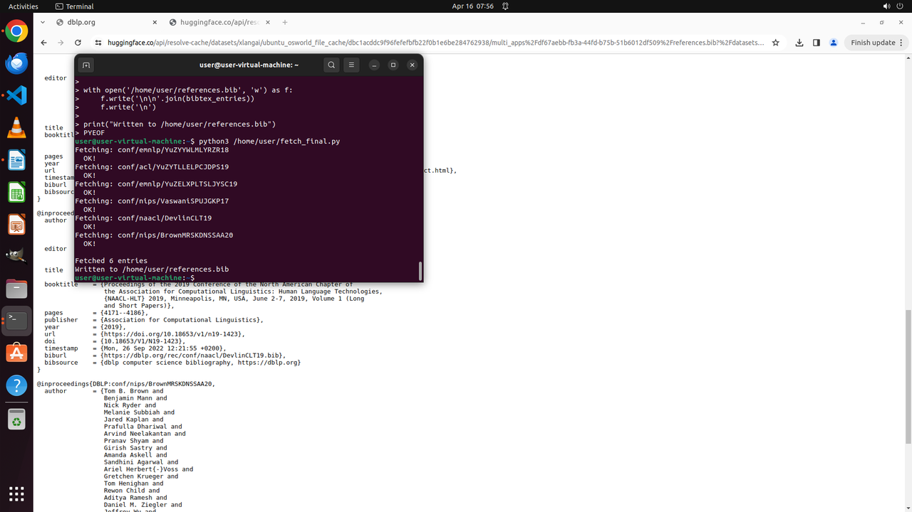

**Response:**
```
All 6 entries were fetched successfully! The output shows:

1. ✅ Spider: `conf/emnlp/YuZYYWLMLYRZR18` - OK!
2. ✅ SParC: `conf/acl/YuZYTLLELPCJDPS19` - OK!
3. ✅ CoSQL: `conf/emnlp/YuZELXPLTSLJYSC19` - OK!
4. ✅ Attention: `conf/nips/VaswaniSPUJGKP17` - OK!
5. ✅ BERT: `conf/naacl/DevlinCLT19` - OK!
6. ✅ GPT-3: `conf/nips/BrownMRSKDNSSAA20` - OK!

"Fetched 6 entries" and "Written to /home/user/references.bib"

Now let me verify the output file to make sure it looks correct:
```

**Actions:** `import subprocess, shlex; subprocess.run(f'xdotool type --delay 12 -- ' + shlex.quote('cat /home/user/references.bib\n'), shell=True, check=True)
import time; time.sleep(0.05)`

---

## Step 100


**Response:**
```
I can see the last entry (GPT-3 - "Language Models are Few-Shot Learners") at the end of the file. The file looks correct with all 6 BibTeX entries. Let me scroll up to verify the beginning of the file:
```

**Actions:** `import subprocess, shlex; subprocess.run(f'xdotool type --delay 12 -- ' + shlex.quote("grep -c '@' /home/user/references.bib\n"), shell=True, check=True)
import time; time.sleep(0.05)`

---

## Step 101


**Response:**
```
The file contains exactly 6 `@` entries, which corresponds to the 6 papers. Let me also verify the titles are correct by checking each entry:
```

**Actions:** `import subprocess, shlex; subprocess.run(f'xdotool type --delay 12 -- ' + shlex.quote('grep -i "title" /home/user/references.bib | head -'), shell=True, check=True)
import time; time.sleep(0.05)
impor`

---

## Step 102

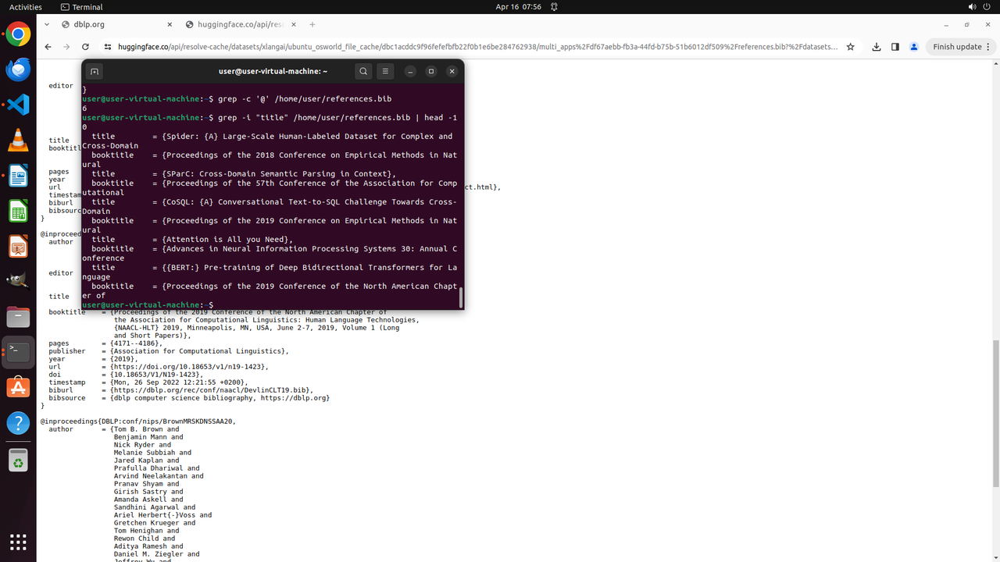

**Response:**
```
All 6 papers are present in the references.bib file:

1. ✅ **Spider**: "Spider: {A} Large-Scale Human-Labeled Dataset for Complex and Cross-Domain..." (EMNLP 2018)
2. ✅ **SParC**: "SParC: Cross-Domain Semantic Parsing in Context" (ACL 2019)
3. ✅ **CoSQL**: "CoSQL: {A} Conversational Text-to-SQL Challenge Towards Cross-Domain..." (EMNLP 2019)
4. ✅ **Attention**: "Attention is All you Need" (NeurIPS 2017)
5. ✅ **BERT**: "{BERT:} Pre-training of Deep Bidirectional Transformers for Language..." (NAACL 2019)
6. ✅ **GPT-3**: "Language Models are Few-Shot Learners" (NeurIPS 2020)

All are published conference versions (not arxiv), each separated by a blank line. The file has been written to `/home/user/references.bib`. Let me also verify the structure of the file to make sure the blank line separation is correct:
```

**Actions:** `import subprocess, shlex; subprocess.run(f'xdotool type --delay 12 -- ' + shlex.quote('grep -n "^@\\|^$" /home/user/references.bib\n'), shell=True, check=True)
import time; time.sleep(0.05)`

---

## Step 103

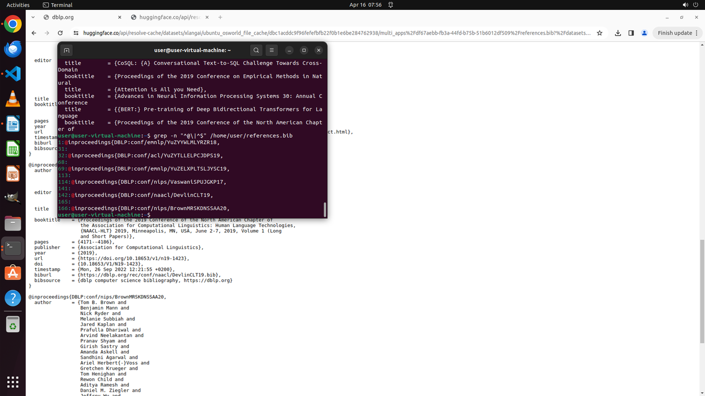

**Response:**
```
The file structure looks perfect. I can see:

- Line 1: `@inproceedings{DBLP:conf/emnlp/YuZYYWLMLYRZR18,` (Spider)
- Line 31: blank line (separator)
- Line 32: `@inproceedings{DBLP:conf/acl/YuZYTLLELPCJDPS19,` (SParC)
- Line 69: blank line (separator)
- Line 70: `@inproceedings{DBLP:conf/emnlp/YuZELXPLTSLJYSC19,` (CoSQL)
- Line 113: blank line (separator)
- Line 114: `@inproceedings{DBLP:conf/nips/VaswaniSPUJGKP17,` (Attention)
- Line 141: blank line (separator)
- Line 142: `@inproceedings{DBLP:conf/naacl/DevlinCLT19,` (BERT)
- Line 165: blank line (separator)
- Line 166: `@inproceedings{DBLP:conf/nips/BrownMRSKDNSSAA20,` (GPT-3)

All 6 BibTeX entries are properly formatted with blank line separators between them. Each entry is from the published conference version (not arxiv/CoRR):

1. Spider → EMNLP 2018
2. SParC → ACL 2019
3. CoSQL → EMNLP-IJCNLP 2019
4. Attention is All You Need → NeurIPS 2017
5. BERT → NAACL 2019
6. Language Models are Few-Shot Learners → NeurIPS 2020

The task is complete!

DONE
```

**Actions:** `DONE`

---
